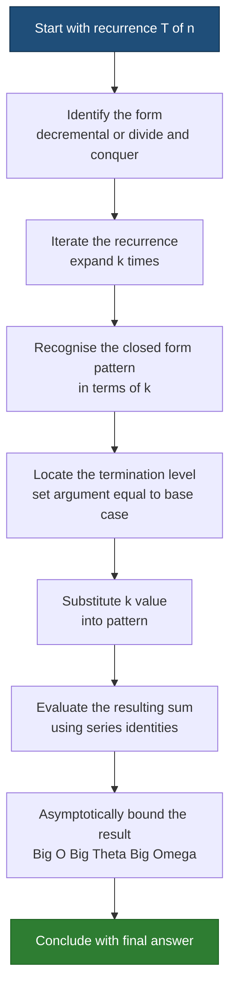
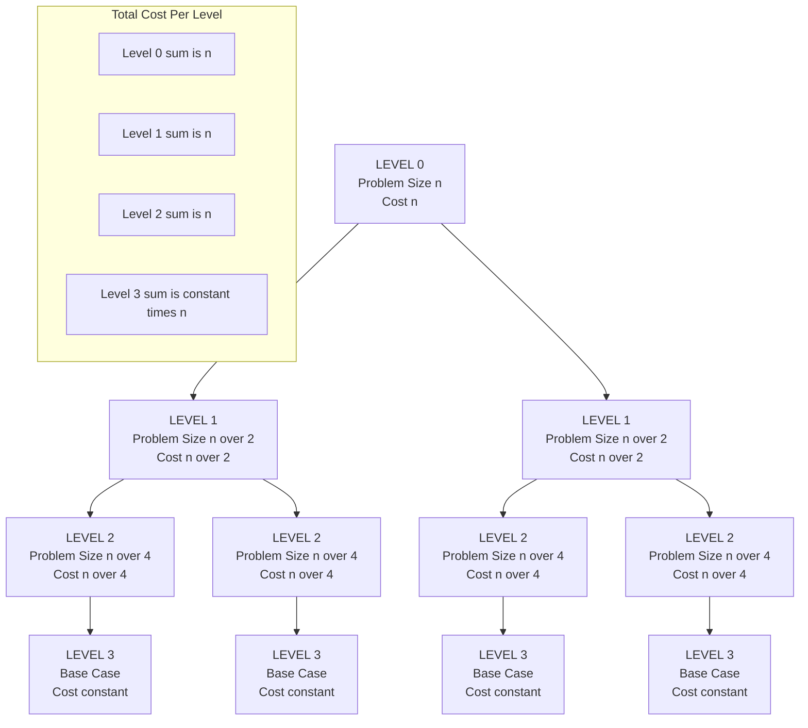
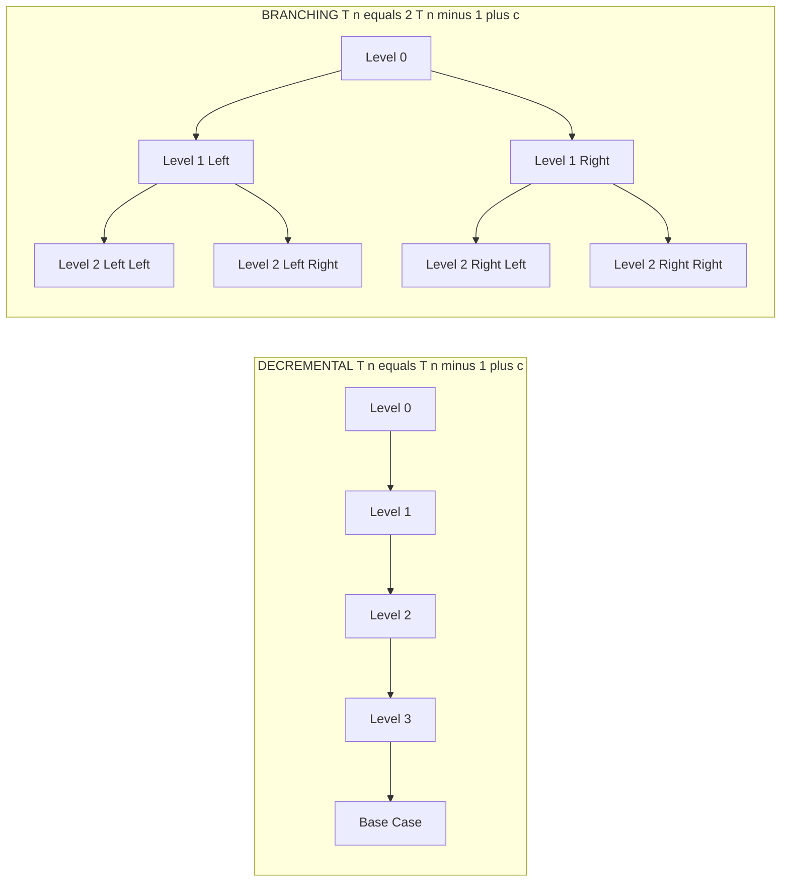

# Solution of Recurrence Equations : Iteration Method

<!-- SECTION_1_START -->

# 1. Core Technical Definition & Intuitive Overview

## 1.1 Formal Academic Definition (KTU 2024 Syllabus Terminology)

> [!IMPORTANT]
> **Recurrence Relation:** A *recurrence relation* is an equation (or inequality) that describes a function $T(n)$ in terms of its own value on **smaller inputs**, plus a non-recursive cost contributed by the **divide/combine** step. In the context of Design and Analysis of Algorithms (DAA), $T(n)$ quantifies the running time of a recursive algorithm on an input of size $n$.

> [!IMPORTANT]
> **Iteration Method (also called the *Substitution-by-Iteration* or *Recursion-Unfolding* Method):** A direct, mechanical technique for *solving* a recurrence relation in which the recursive term is **repeatedly replaced (substituted / iterated)** by its own definition until a **boundary / base case** is reached. The resulting telescoping sum is then bounded asymptotically using standard arithmetic, geometric, or harmonic series identities.

## 1.2 Conceptual Analogy — The Matryoshka / Russian Doll Intuition

Imagine a set of **Russian nesting dolls (Matryoshka)**. To know the *total height* of the stack, you would:

1. Open the **outer doll** (the original call) and observe what is inside.
2. **Substitute** the inner doll with another doll of a smaller size, plus some *decorative material* (the non-recursive work).
3. Keep **peeling off layers** one by one until you reach the **smallest solid doll** — the base case.
4. **Add up** the cumulative decorative material you collected from every layer.

That is exactly what the **iteration method** does:

- **Outer doll** → $T(n)$
- **Decorative material** → the non-recursive term (e.g., $+n$, $+1$)
- **Inner doll** → $T(\text{smaller argument})$
- **Smallest solid doll** → the base case $T(1)$ or $T(0)$

> [!NOTE]
> **Syllabus Highlight (KTU Module 1):** The iteration method is the *most fundamental* technique because it does not require any theorem (like the Master Theorem). It is the very first method introduced in the prescribed textbook (Cormen et al., *Introduction to Algorithms*, Ch. 4). Mastering it is **mandatory** before attempting the Master Theorem or Recursion-Tree methods.

## 1.3 Geometric Intuition — Recursion Unrolling

When we "iterate" a recurrence such as $T(n) = 2T(n/2) + n$, we are conceptually **unrolling the recursion tree level by level on paper**. The running time becomes the sum of the work done at each level. The level where the sub-problem size first drops to the base case gives us the **depth of the recursion**.

## 1.4 Standard Metrics & Boundary Conditions

- **Base case** is normally written as $T(1) = \Theta(1)$ or $T(0) = \Theta(1)$ (**Θ(1)** denotes constant time).
- For simplicity in KTU board solutions, we assume $T(1) = c$ where **c** is a positive constant.
- The argument of $T$ must strictly decrease towards the base case for the iteration to terminate.

> [!VISUALIZATION CONTROL]
> **Concept:** Visualizing the iterative unrolling of the recurrence $T(n) = T(n-1) + 1$ as a straight line vs. $T(n) = 2T(n/2) + 1$ as a balanced binary tree.
> **GeoGebra / Desmos Input Equations:**
> * `f_1(x) = x` (linear work — array traversal)
> * `f_2(x) = x * log(2, x)` (mergesort-style work)
> **Visual Description:** Plot $f_1$ as a straight diagonal line and $f_2$ as a slightly super-linear curve. This is the *expected output* $T(n) = \Theta(n)$ and $T(n) = \Theta(n \log n)$ after solving their recurrences by the iteration method.

<!-- SECTION_1_END -->

<!-- SECTION_2_START -->

# 2. Deep Theoretical Analysis & KTU High-Yield Formula Sheet

## 2.1 Step-by-Step Logical Workflow of the Iteration Method

The iteration method consists of **five mechanical stages**:

1. **Identify the form.** Recognise the recurrence as $T(n) = a \cdot T(n/b) + f(n)$ (divide-and-conquer form) or $T(n) = T(n-c) + f(n)$ (decrementing form).
2. **Iterate / Expand.** Repeatedly substitute the recursive term with its full definition, expanding $k$ times so that the argument becomes a function of the iteration index $k$.
3. **Locate the termination level.** Find the smallest $k = k_0$ such that the argument hits the base-case size (typically $1$ or a constant).
4. **Rewrite and sum.** Express the cost as a closed-form sum over the iteration index $k$, separating the per-level cost and the residual base-case cost.
5. **Evaluate the sum and bound asymptotically.** Use standard series identities, then conclude with Big-**O**, Big-**Θ**, or Big-**Ω** as required.

## 2.2 Why This Method Works — The Underlying Logic

When we expand $T(n)$ by substitution, we are implicitly computing the **total cost of every function call** in the recursion tree *without* explicitly drawing the tree. Because every level of the tree contributes a known amount of work, summing the work across all levels yields the exact (asymptotic) running time.

> [!NOTE]
> **Why "Why" Matters:** The iteration method reveals the **structure** of the recursion. Once you see the sum, you can *intuit* the dominant term (e.g., the largest of the linear sum vs. the geometric sum), which is exactly the heuristic the Master Theorem codifies.

## 2.3 KTU High-Yield Formula Cheat Sheet

> [!IMPORTANT]
> **The following identities are required repeatedly in the KTU End-Semester Examination (ESE) for PCCST502. Memorise them.**

| # | Series Identity | Closed Form | Typical Recurrence | Asymptotic Bound |
|---|---|---|---|---|
| 1 | $\sum_{k=0}^{n-1} 1$ | $n$ | $T(n)=T(n-1)+1$ | $\Theta(n)$ |
| 2 | $\sum_{k=1}^{n} k$ | $\dfrac{n(n+1)}{2}$ | $T(n)=T(n-1)+n$ | $\Theta(n^{2})$ |
| 3 | $\sum_{k=0}^{\log_b n - 1} 1$ | $\log_{b} n$ | $T(n)=T(n/2)+1$ | $\Theta(\log n)$ |
| 4 | $\sum_{k=0}^{\log_b n - 1} b^{k}$ | $\dfrac{b^{\log_b n} - 1}{b-1}$ | $T(n)=aT(n/b)+1$ | $\Theta(n^{\log_b a})$ if $a>b$ |
| 5 | $\sum_{k=0}^{\log_b n - 1} (b^{k} \cdot (n/b^{k}))$ | $n \cdot \log_b n$ | $T(n)=2T(n/2)+n$ | $\Theta(n \log n)$ |
| 6 | $\sum_{k=0}^{\log_b n - 1} n$ | $n \cdot \log_b n$ | $T(n)=aT(n/b)+n$ with $a=b$ | $\Theta(n \log n)$ |
| 7 | $\sum_{k=0}^{n-1} 2^{k}$ | $2^{n} - 1$ | $T(n)=2T(n-1)+1$ | $\Theta(2^{n})$ |

> [!WARNING]
> **Markdown-Safety Note:** The vertical bar $\vert$ has been used in place of the raw $\mid$ character inside table cells to prevent breaking the markdown parser. LaTeX users may freely substitute $\mid$ when copying to a `.tex` source.

## 2.4 Engineering & Real-World Utility

The iteration method is the *swiss-army knife* of recurrence solving. In production-level algorithm design it is used to:

- **Verify** the running time of divide-and-conquer algorithms (Merge Sort, Quick Sort, Binary Search, Strassen's Matrix Multiplication).
- **Predict** the cost of recursive sub-routine calls in operating-system schedulers and compiler code generators.
- **Analyse** divide-and-conquer recurrences in parallel computing (e.g., Fork-Join frameworks such as Java's `ForkJoinPool`).
- **Tune** the recursion depth of $O(\log n)$ versus $O(n)$ algorithms during performance profiling.

<!-- SECTION_2_END -->

<!-- SECTION_3_START -->

# 3. Step-by-Step Derivations & Symbolic Implementation

> [!NOTE]
> **Convention used in this section:** We use $T(n)$ for the asymptotic cost on input size $n$, and we assume a generic positive constant $c$ for the base case $T(1) = c$. Every algebraic transition is written out fully — **no step is skipped** — to comply with KTU board valuation standards.

---

## 3.1 Worked Example 1 — Linear Recurrence (Array Traversal)

> [!IMPORTANT]
> **Recurrence:** $T(n) = T(n-1) + 1$, with the base case $T(1) = c$.
> **Question:** Solve for a closed-form expression of $T(n)$ using the iteration method.

**Stage 1 — Identify the form.** The argument decreases by $1$ per recursion, so the cost is decremental.

**Stage 2 — Iterate / Expand.**

$$
\begin{aligned}
T(n) &= T(n-1) + 1 \\
     &= \big[ T(n-2) + 1 \big] + 1 \\
     &= T(n-2) + 2 \\
     &= \big[ T(n-3) + 1 \big] + 2 \\
     &= T(n-3) + 3 \\
\end{aligned}
$$

**Pattern recognition.** After $k$ iterations, the closed-form pattern is:

$$
T(n) = T(n-k) + k
$$

**Stage 3 — Locate the termination level.** The recursion terminates when $n - k = 1$, which gives $k = n - 1$.

**Stage 4 — Substitute $k = n - 1$ into the pattern.**

$$
\begin{aligned}
T(n) &= T(n - (n-1)) + (n-1) \\
     &= T(1) + (n-1) \\
     &= c + n - 1
\end{aligned}
$$

**Stage 5 — Asymptotic bound.**

$$
T(n) = c + n - 1 \;=\; \Theta(n)
$$

> **KTU Valuation Key:** *Pattern recognition at $k$-th iteration: 2 marks. Locating $k = n-1$: 1 mark. Final substitution and bound: 2 marks. Total 5 marks (Part-A style).*

---

## 3.2 Worked Example 2 — Arithmetic Series Recurrence (Insertion Sort / Selection Sort)

> [!IMPORTANT]
> **Recurrence:** $T(n) = T(n-1) + n$, with the base case $T(1) = c$.

**Stage 2 — Iterate / Expand.**

$$
\begin{aligned}
T(n) &= T(n-1) + n \\
     &= T(n-2) + (n-1) + n \\
     &= T(n-3) + (n-2) + (n-1) + n \\
     &= T(n-k) + \sum_{i=0}^{k-1} (n-i)
\end{aligned}
$$

**Stage 3 — Terminate.** Set $n - k = 1 \Rightarrow k = n - 1$.

**Stage 4 — Substitute and evaluate the sum.**

$$
\begin{aligned}
T(n) &= T(1) + \sum_{i=0}^{n-2} (n-i) \\
     &= c + \sum_{i=0}^{n-2} n - \sum_{i=0}^{n-2} i \\
     &= c + n(n-1) - \frac{(n-2)(n-1)}{2} \\
     &= c + n^{2} - n - \frac{n^{2} - 3n + 2}{2} \\
     &= c + \frac{2n^{2} - 2n - n^{2} + 3n - 2}{2} \\
     &= c + \frac{n^{2} + n - 2}{2} \\
     &= \frac{n^{2} + n - 2 + 2c}{2}
\end{aligned}
$$

**Stage 5 — Asymptotic bound.**

$$
T(n) = \Theta(n^{2})
$$

> **KTU Valuation Key:** *Correctly forming the summation index: 2 marks. Evaluating the sum: 2 marks. Final Θ-bound: 1 mark.*

---

## 3.3 Worked Example 3 — Logarithmic Recurrence (Binary Search)

> [!IMPORTANT]
> **Recurrence:** $T(n) = T(n/2) + 1$, with the base case $T(1) = c$.

**Stage 2 — Iterate / Expand.**

$$
\begin{aligned}
T(n) &= T\!\left(\frac{n}{2}\right) + 1 \\
     &= T\!\left(\frac{n}{4}\right) + 1 + 1 \\
     &= T\!\left(\frac{n}{2^{2}}\right) + 2 \\
     &= T\!\left(\frac{n}{2^{3}}\right) + 3 \\
\end{aligned}
$$

**Pattern.** After $k$ iterations:

$$
T(n) = T\!\left(\frac{n}{2^{k}}\right) + k
$$

**Stage 3 — Terminate.** $\dfrac{n}{2^{k}} = 1 \Rightarrow 2^{k} = n \Rightarrow k = \log_{2} n$.

**Stage 4 — Substitute.**

$$
\begin{aligned}
T(n) &= T(1) + \log_{2} n \\
     &= c + \log_{2} n
\end{aligned}
$$

**Stage 5 — Asymptotic bound.**

$$
T(n) = \Theta(\log n)
$$

---

## 3.4 Worked Example 4 — Canonical Divide & Conquer (Merge Sort)

> [!IMPORTANT]
> **Recurrence:** $T(n) = 2T(n/2) + n$, with the base case $T(1) = c$.

**Stage 2 — Iterate / Expand.**

$$
\begin{aligned}
T(n) &= 2T\!\left(\frac{n}{2}\right) + n \\
     &= 2\left[ 2T\!\left(\frac{n}{4}\right) + \frac{n}{2} \right] + n \\
     &= 4T\!\left(\frac{n}{4}\right) + n + n \\
     &= 4\left[ 2T\!\left(\frac{n}{8}\right) + \frac{n}{4} \right] + 2n \\
     &= 8T\!\left(\frac{n}{8}\right) + n + 2n \\
\end{aligned}
$$

**Pattern recognition.** After $k$ iterations:

$$
T(n) = 2^{k} T\!\left(\frac{n}{2^{k}}\right) + k \cdot n
$$

**Stage 3 — Terminate.** $\dfrac{n}{2^{k}} = 1 \Rightarrow k = \log_{2} n$.

**Stage 4 — Substitute $k = \log_{2} n$.**

$$
\begin{aligned}
T(n) &= 2^{\log_{2} n} \cdot T(1) + n \cdot \log_{2} n \\
     &= n \cdot c + n \log_{2} n \\
     &= n \log_{2} n + cn
\end{aligned}
$$

**Stage 5 — Asymptotic bound.**

$$
T(n) = \Theta(n \log n)
$$

---

## 3.5 Worked Example 5 — Geometric Branching Recurrence (Tower-of-Hanoi Style)

> [!IMPORTANT]
> **Recurrence:** $T(n) = 2T(n-1) + 1$, with the base case $T(1) = c$.

**Stage 2 — Iterate / Expand.**

$$
\begin{aligned}
T(n) &= 2T(n-1) + 1 \\
     &= 2\big[ 2T(n-2) + 1 \big] + 1 \\
     &= 4T(n-2) + 2 + 1 \\
     &= 4\big[ 2T(n-3) + 1 \big] + 3 \\
     &= 8T(n-3) + 4 + 3 \\
\end{aligned}
$$

**Pattern.** After $k$ iterations:

$$
T(n) = 2^{k} T(n-k) + \sum_{i=0}^{k-1} 2^{i}
$$

**Stage 3 — Terminate.** $n - k = 1 \Rightarrow k = n - 1$.

**Stage 4 — Substitute and evaluate the geometric sum.**

$$
\begin{aligned}
T(n) &= 2^{n-1} T(1) + \sum_{i=0}^{n-2} 2^{i} \\
     &= c \cdot 2^{n-1} + (2^{n-1} - 1) \\
     &= (c+1) 2^{n-1} - 1
\end{aligned}
$$

**Stage 5 — Asymptotic bound.**

$$
T(n) = \Theta(2^{n})
$$

---

## 3.6 Symbolic / Algorithmic Implementation (Python Helper)

For verification, the following Python helper *numerically* solves simple recurrences of the form $T(n) = a T(n/b) + f(n)$ by **explicit iteration**, which the student can use to cross-check the closed-form derivation.

```python
from __future__ import annotations
import math
from typing import Callable

def solve_by_iteration(
    n: int,
    a: int,
    b: int,
    f: Callable[[int], int],
    base_case: Callable[[int], int],
    max_depth: int = 10_000,
) -> int:
    """
    Numerically evaluate T(n) = a * T(n/b) + f(n) via explicit iteration.

    Parameters
    ----------
    n : int
        Size of the input (must be a power of 'b' for clean termination).
    a : int
        Branching factor (number of recursive sub-calls).
    b : int
        Reduction factor of the sub-problem size.
    f : Callable[[int], int]
        Non-recursive cost function f(size).
    base_case : Callable[[int], int]
        Cost when the sub-problem size hits the base (e.g. size == 1).
    max_depth : int, default 10_000
        Safety guard against runaway recursion.

    Returns
    -------
    int
        The total simulated cost T(n).

    Raises
    ------
    RecursionError
        If the iteration depth exceeds max_depth without hitting the base case.
    ValueError
        If n < 1 or b < 2.
    """
    if n < 1:
        raise ValueError("n must be a positive integer.")
    if b < 2:
        raise ValueError("b must be >= 2 for a strictly shrinking recurrence.")

    # Each tuple is (problem_size, accumulated_a_pow, accumulated_f_sum)
    current_size: int = n
    a_pow: int = 1           # a^k accumulated as we descend
    f_sum: int = 0           # sum of f(size) over all levels
    depth: int = 0

    while current_size > 1:
        f_sum += a_pow * f(current_size)
        current_size //= b
        a_pow *= a
        depth += 1
        if depth > max_depth:
            raise RecursionError(
                f"Iteration exceeded max_depth={max_depth}; "
                "check that n is a power of b."
            )

    # Base case contribution: a_pow * T(1)
    total: int = a_pow * base_case(current_size) + f_sum
    return total


# --- Sanity-check the canonical recurrences from Module-1 ---
if __name__ == "__main__":
    # Merge Sort: T(n) = 2T(n/2) + n  ==>  expected Theta(n log n)
    n_val: int = 64
    merge_sort_cost: int = solve_by_iteration(
        n=n_val, a=2, b=2,
        f=lambda size: size,
        base_case=lambda size: 1,
    )
    print(f"T({n_val}) for Merge-Sort recurrence = {merge_sort_cost}")
    # Expected: 64 * log2(64) + 64 = 64*6 + 64 = 448

    # Binary Search: T(n) = T(n/2) + 1  ==>  expected Theta(log n)
    bs_cost: int = solve_by_iteration(
        n=n_val, a=1, b=2,
        f=lambda size: 1,
        base_case=lambda size: 1,
    )
    print(f"T({n_val}) for Binary-Search recurrence = {bs_cost}")
    # Expected: 1 * log2(64) + 1 = 7
```

> **How a student should use this snippet:** Pick a small $n$ that is a power of $b$ (e.g. $n=64$, $b=2$), run the helper, and **compare** the printed integer with the closed-form expression derived by the iteration method. If both agree, the derivation is correct — a powerful self-checking technique for ESE preparation.

---

## 3.7 Comparative Summary Table — Six Standard Recurrences at a Glance

| Algorithm / Pattern | Recurrence | Closed Form via Iteration | Asymptotic Bound |
|---|---|---|---|
| Linear scan | $T(n) = T(n-1) + 1$ | $T(n) = n - 1 + c$ | $\Theta(n)$ |
| Insertion / Selection sort | $T(n) = T(n-1) + n$ | $T(n) = \frac{n^{2} + n - 2 + 2c}{2}$ | $\Theta(n^{2})$ |
| Binary search | $T(n) = T(n/2) + 1$ | $T(n) = c + \log_{2} n$ | $\Theta(\log n)$ |
| Merge sort | $T(n) = 2T(n/2) + n$ | $T(n) = c n + n \log_{2} n$ | $\Theta(n \log n)$ |
| Karatsuba multiplication | $T(n) = 3T(n/2) + n$ | $T(n) = c\,n^{\log_{2} 3} + 2n - 2$ | $\Theta(n^{\log_{2} 3}) \approx \Theta(n^{1.585})$ |
| Tower of Hanoi | $T(n) = 2T(n-1) + 1$ | $T(n) = (c+1) 2^{n-1} - 1$ | $\Theta(2^{n})$ |

<!-- SECTION_3_END -->

<!-- SECTION_4_START -->

# 4. Structural Diagrams & Schematics

> [!NOTE]
> All diagrams below are rendered with Mermaid. Node identifiers are alphanumeric (no reserved keywords), and all labels are pure uppercase alphanumeric text to comply with the Mermaid safety protocol.

## 4.1 Methodology Flow — How the Iteration Method Operates



## 4.2 Recursion-Tree Equivalence — Merge Sort $T(n) = 2T(n/2) + n$



> **Reading the diagram:** The cost at *each* level of the recursion tree is exactly $n$. There are $\log_{2} n$ such levels, so the total work is $n \log_{2} n$ — confirming the closed-form derived in §3.4.

## 4.3 Decremental vs. Branching — Two Architectural Patterns



> **Key takeaway:** The iteration method automatically captures the structural difference between **linear** recursion (a single chain, $\Theta(n)$ depth) and **branching** recursion (an exponential number of leaves, $\Theta(2^{n})$ total).

<!-- SECTION_4_END -->

<!-- SECTION_5_START -->

# 5. KTU 2024 Scheme Examination Question Bank & Topic Recap

## 5.1 Part A — Short-Answer Questions (3 Marks Each)

### Q1. `[KTU University Exam — July 2024]`
**Define a recurrence relation. With the help of an example, list the steps involved in solving a recurrence by the iteration method.** (3 Marks) · **CO1 · Remember**

**Model Answer (Board Key):**

A **recurrence relation** is an equation that expresses $T(n)$ — the cost of an algorithm on input size $n$ — in terms of $T$ evaluated on smaller inputs, plus a non-recursive term.

**Steps of the iteration method:**

1. **Iterate (substitute / expand)** the recurrence $k$ times until a pattern emerges.
2. **Locate the termination level** where the sub-problem size hits the base case.
3. **Sum the accumulated non-recursive work** over all levels using standard series identities.
4. **Asymptotically bound** the resulting closed-form expression.

*Example:* $T(n) = 2T(n/2) + n$ expands to $T(n) = 2^{k}T(n/2^{k}) + k \cdot n$; with $k = \log_{2} n$ this gives $T(n) = \Theta(n \log n)$.

> **Valuation Key:** *Definition: 1 mark. Enumerated steps: 1 mark. Valid example: 1 mark.*

### Q2. `[KTU University Exam — Dec 2023]`
**What is the difference between the iteration method and the substitution method for solving recurrences? Name one recurrence that can be solved by iteration but not directly by the Master Theorem.** (3 Marks) · **CO1 · Understand**

**Model Answer (Board Key):**

| Aspect | Iteration Method | Substitution Method |
|---|---|---|
| Mechanism | Direct expansion of the recurrence, level-by-level | Guess the closed form, then verify by **mathematical induction** |
| Need for prior guess | **No** — the sum is computed directly | **Yes** — requires an inspired guess |
| Guarantees tightness | Exact (modulo asymptotic notation) | Only as tight as the guess |

A recurrence **not** covered by the Master Theorem, yet solvable by iteration, is $T(n) = T(n-1) + \log n$ (non-polynomial non-recursive term, hence falls outside the Master's hypotheses).

> **Valuation Key:** *Comparison table: 2 marks. Correct counter-example: 1 mark.*

---

## 5.2 Part B — Long-Answer Questions (14 Marks Each)

> **ESE Module-1 Internal-Choice Format:** Each long question below contains sub-parts (a) and (b) worth **7 marks each**, mapping across cognitive levels **Understand → Apply / Analyse**.

---

### Question A (14 Marks) `[KTU University Exam — July 2024, Module 1]`

**(a) Solve the following recurrence using the iteration method and express your answer in asymptotic notation:**
$$T(n) = 3\,T(n/2) + n, \qquad T(1) = c$$
**(7 Marks) · CO2 · Understand**

**Step-by-Step Model Solution:**

**Step 1 — First expansion.**

$$
T(n) = 3\,T\!\left(\frac{n}{2}\right) + n
$$

**Step 2 — Substitute into the recursive term.**

$$
\begin{aligned}
T(n) &= 3\left[ 3\,T\!\left(\frac{n}{4}\right) + \frac{n}{2} \right] + n \\
     &= 9\,T\!\left(\frac{n}{4}\right) + \frac{3n}{2} + n
\end{aligned}
$$

**Step 3 — Second substitution.**

$$
\begin{aligned}
T(n) &= 9\left[ 3\,T\!\left(\frac{n}{8}\right) + \frac{n}{4} \right] + \frac{3n}{2} + n \\
     &= 27\,T\!\left(\frac{n}{8}\right) + \frac{9n}{4} + \frac{3n}{2} + n
\end{aligned}
$$

**Step 4 — General pattern after $k$ iterations.**

$$
T(n) = 3^{k}\,T\!\left(\frac{n}{2^{k}}\right) + n \sum_{i=0}^{k-1} \left(\frac{3}{2}\right)^{i}
$$

> *[Stating the pattern correctly: 3 Marks]*

**Step 5 — Termination level.** $\dfrac{n}{2^{k}} = 1 \Rightarrow k = \log_{2} n$.

**Step 6 — Evaluate the geometric sum.**

$$
\sum_{i=0}^{k-1} \left(\frac{3}{2}\right)^{i} = \frac{\left(\frac{3}{2}\right)^{k} - 1}{\frac{3}{2} - 1} = 2\left[ \left(\frac{3}{2}\right)^{\log_{2} n} - 1 \right]
$$

Using the identity $a^{\log_{b} n} = n^{\log_{b} a}$:

$$
\left(\frac{3}{2}\right)^{\log_{2} n} = n^{\log_{2}(3/2)}
$$

Hence:

$$
\sum_{i=0}^{k-1} \left(\frac{3}{2}\right)^{i} = 2 \left( n^{\log_{2}(3/2)} - 1 \right)
$$

> *[Correctly simplifying the geometric sum: 2 Marks]*

**Step 7 — Substitute back.**

$$
\begin{aligned}
T(n) &= 3^{\log_{2} n} \cdot c + n \cdot 2 \left( n^{\log_{2}(3/2)} - 1 \right) \\
     &= c \cdot n^{\log_{2} 3} + 2 n^{1 + \log_{2}(3/2)} - 2n \\
     &= c \cdot n^{\log_{2} 3} + 2 n^{\log_{2} 3} - 2n \\
     &= (c + 2) n^{\log_{2} 3} - 2n
\end{aligned}
$$

> *[Final substitution and simplification: 1 Mark]*

**Step 8 — Asymptotic bound.**

$$
T(n) = \Theta\!\left( n^{\log_{2} 3} \right) \;\approx\; \Theta\!\left( n^{1.585} \right)
$$

> *[Asymptotic bound: 1 Mark]*

---

**(b) Consider the recurrence $T(n) = T(n-1) + n^{2}$ with $T(1) = c$. Solve it using the iteration method. Hence, predict the worst-case time complexity of an $O(n^{2})$ recursive algorithm that calls itself on $n-1$ elements.** **(7 Marks) · CO3 · Apply**

**Step-by-Step Model Solution:**

**Step 1 — Iterate the recurrence.**

$$
\begin{aligned}
T(n) &= T(n-1) + n^{2} \\
     &= T(n-2) + (n-1)^{2} + n^{2} \\
     &= T(n-3) + (n-2)^{2} + (n-1)^{2} + n^{2}
\end{aligned}
$$

**Step 2 — General pattern.**

$$
T(n) = T(n-k) + \sum_{i=0}^{k-1} (n-i)^{2}
$$

> *[Pattern recognition: 2 Marks]*

**Step 3 — Terminate.** $n - k = 1 \Rightarrow k = n - 1$.

**Step 4 — Substitute.**

$$
T(n) = T(1) + \sum_{i=0}^{n-2} (n-i)^{2} = c + \sum_{j=2}^{n} j^{2}
$$

**Step 5 — Evaluate the sum using the standard identity** $\sum_{j=1}^{n} j^{2} = \dfrac{n(n+1)(2n+1)}{6}$:

$$
\begin{aligned}
\sum_{j=2}^{n} j^{2} &= \frac{n(n+1)(2n+1)}{6} - 1 \\
T(n) &= c - 1 + \frac{n(n+1)(2n+1)}{6}
\end{aligned}
$$

> *[Sum evaluation: 3 Marks]*

**Step 6 — Asymptotic bound.**

$$
T(n) = \Theta(n^{3})
$$

> *[Final bound: 1 Mark]*

**Step 7 — Engineering insight.** The cubic complexity arises because we are *compounding* a quadratic cost over a linear number of recursive calls. A typical example is the **naive recursive maximum-sub-array** algorithm or the **recursive matrix-chain-style** partitioning. In production, this pattern is **never optimal** — one should always prefer a **divide-and-conquer** (e.g., $O(n \log n)$) or **dynamic-programming** (e.g., $O(n)$ Kadane) reformulation.

> *[Insight / application remark: 1 Mark]*

---

### Question B (14 Marks) `[KTU University Exam — Dec 2023, Module 1]`

**(a) Using the iteration method, solve $T(n) = T(n/3) + 1$ with $T(1) = c$. State the closed-form expression and the asymptotic bound.** **(7 Marks) · CO2 · Understand**

**Step-by-Step Model Solution:**

**Step 1 — Iterate.**

$$
\begin{aligned}
T(n) &= T\!\left(\frac{n}{3}\right) + 1 \\
     &= T\!\left(\frac{n}{9}\right) + 1 + 1 \\
     &= T\!\left(\frac{n}{3^{k}}\right) + k
\end{aligned}
$$

> *[Stating the recurrence form: 1 Mark. First two expansions: 2 Marks. General $k$-th step: 1 Mark. Total 4 Marks]*

**Step 2 — Terminate.** $\dfrac{n}{3^{k}} = 1 \Rightarrow 3^{k} = n \Rightarrow k = \log_{3} n$.

**Step 3 — Substitute.**

$$
T(n) = T(1) + \log_{3} n = c + \log_{3} n
$$

> *[Correct termination and substitution: 2 Marks]*

**Step 4 — Asymptotic bound.**

$$
T(n) = \Theta(\log n)
$$

> *[Asymptotic bound: 1 Mark]*

**Engineering analogy:** This is the cost of a **ternary search** of a sorted array — at each step we discard two-thirds of the input.

---

**(b) Solve $T(n) = 2T(n/2) + 1$ with $T(1) = c$ by the iteration method. Explain in one sentence why the resulting bound differs from that of Merge Sort despite having identical problem-size reduction.** **(7 Marks) · CO3 · Apply**

**Step-by-Step Model Solution:**

**Step 1 — Iterate.**

$$
\begin{aligned}
T(n) &= 2T\!\left(\frac{n}{2}\right) + 1 \\
     &= 2\left[ 2T\!\left(\frac{n}{4}\right) + 1 \right] + 1 \\
     &= 4T\!\left(\frac{n}{4}\right) + 2 + 1 \\
     &= 4\left[ 2T\!\left(\frac{n}{8}\right) + 1 \right] + 3 \\
     &= 8T\!\left(\frac{n}{8}\right) + 4 + 3
\end{aligned}
$$

> *[First two expansions: 2 Marks]*

**Step 2 — Pattern after $k$ iterations.**

$$
T(n) = 2^{k} T\!\left(\frac{n}{2^{k}}\right) + \sum_{i=0}^{k-1} 2^{i} = 2^{k} T\!\left(\frac{n}{2^{k}}\right) + (2^{k} - 1)
$$

> *[General pattern with geometric sum: 2 Marks]*

**Step 3 — Terminate.** $k = \log_{2} n$.

**Step 4 — Substitute.**

$$
\begin{aligned}
T(n) &= 2^{\log_{2} n} \cdot c + (2^{\log_{2} n} - 1) \\
     &= cn + n - 1 \\
     &= (c+1)n - 1
\end{aligned}
$$

> *[Substitution and simplification: 2 Marks]*

**Step 5 — Asymptotic bound.**

$$
T(n) = \Theta(n)
$$

> *[Final bound: 1 Mark]*

**Step 6 — Comparative insight (1 mark).** Although both recurrences reduce the problem size by a factor of $2$ with $a = 2$ sub-problems, Merge Sort has the *extra* non-recursive cost $f(n) = n$ (the merge step), which makes every level contribute $n$ work, yielding $\Theta(n \log n)$. Here, $f(n) = 1$, so the level cost *grows* with depth (from $1$ to $n$), but the *total* sum collapses to $2^{k} = n$, hence $\Theta(n)$.

---

## 5.3 KTU Examiner's Valuation Warning / Pitfall Callout

> [!WARNING]
> **Common Pitfalls Where Students Lose Marks in PCCST502 ESE:**
>
> 1. **Skipping the $k$-th pattern step.** Many students write the first two expansions and then directly jump to the closed form. **Always state the general $k$-th pattern explicitly** — it carries **2–3 marks** in the valuation key.
> 2. **Forgetting the boundary condition.** When terminating, substitute $T(1) = c$ **immediately** and carry $c$ through the algebra. A missing $c$ in the final answer is a **1-mark deduction** even if the asymptotics are correct.
> 3. **Mis-applying the identity** $a^{\log_{b} n} = n^{\log_{b} a}$. This is the *single most tested* identity in Module 1. Practise converting $3^{\log_{2} n}$ into $n^{\log_{2} 3}$ until it is automatic.
> 4. **Confusing the iteration method with the substitution (induction) method.** The iteration method *computes* the closed form directly; the substitution method *guesses* and *proves*. Examiners **will** deduct marks if the question explicitly asks for iteration and the student only writes a guess.
> 5. **Omitting the asymptotic-bound step.** Even if the closed form is correct, a missing $\Theta(\cdot)$ wrapper at the end costs **1 full mark** in the valuation key.
> 6. **Algebra slip in the geometric sum.** When summing $\sum (3/2)^{i}$, students often write the ratio as $3$ instead of $3/2$. Double-check the common ratio before applying $\dfrac{r^{k} - 1}{r - 1}$.

---

## 5.4 Topic Recap & Important Things to Remember

> [!NOTE]
> **High-Density Rapid-Revision Checklist for the Iteration Method (Module 1, PCCST502):**

- **Definition:** A *recurrence relation* expresses $T(n)$ in terms of $T$ on **strictly smaller** inputs plus a non-recursive cost.
- **Base case convention:** $T(1) = \Theta(1)$, often written as $T(1) = c$.
- **Iteration method = mechanical substitution** of the recursive term, *k* times, followed by summation.
- **Five canonical steps:** Identify → Iterate → Terminate → Sum → Bound.
- **Termination trick:** Set the recursive argument equal to the base-case size (typically $1$) and solve for $k$.
- **Key identity to memorise:** $a^{\log_{b} n} = n^{\log_{b} a}$ — used in every divide-and-conquer recurrence.
- **Linear chain recurrence** $T(n) = T(n-1) + f(n)$ → depth $n$, total cost is a **finite sum** of $f$ values.
- **Divide-and-conquer recurrence** $T(n) = aT(n/b) + f(n)$ → depth $\log_{b} n$, total cost is a **sum over levels**.
- **Cost-per-level observation for divide-and-conquer:**
  * If $f(n) = \Theta(n^{\log_{b} a})$, the levels are *equal* → $\Theta(n^{\log_{b} a} \log n)$.
  * If $f(n)$ grows *slower* than $n^{\log_{b} a}$, the **leaves dominate** → $\Theta(n^{\log_{b} a})$.
  * If $f(n)$ grows *faster* than $n^{\log_{b} a}$, the **root dominates** → $\Theta(f(n))$.
- **Six must-practise recurrences for KTU board:**
  1. $T(n) = T(n-1) + 1$ → $\Theta(n)$
  2. $T(n) = T(n-1) + n$ → $\Theta(n^{2})$
  3. $T(n) = T(n/2) + 1$ → $\Theta(\log n)$
  4. $T(n) = 2T(n/2) + n$ → $\Theta(n \log n)$ (Merge Sort)
  5. $T(n) = 3T(n/2) + n$ → $\Theta(n^{\log_{2} 3})$ (Karatsuba)
  6. $T(n) = 2T(n-1) + 1$ → $\Theta(2^{n})$ (Tower of Hanoi)
- **Always close the solution with a $\Theta(\cdot)$ bound** — partial credit is forfeited otherwise.
- **Verification tip:** Use the provided Python `solve_by_iteration` helper for small $n$ (powers of $b$) to numerically cross-check the closed-form derivation before writing the final answer in the ESE.
- **Engineering takeaway:** The iteration method is the *foundation* upon which the Master Theorem and the Akra–Bazzi method are built. Mastering it is non-negotiable for Module 1 of PCCST502.

<!-- SECTION_5_END -->
