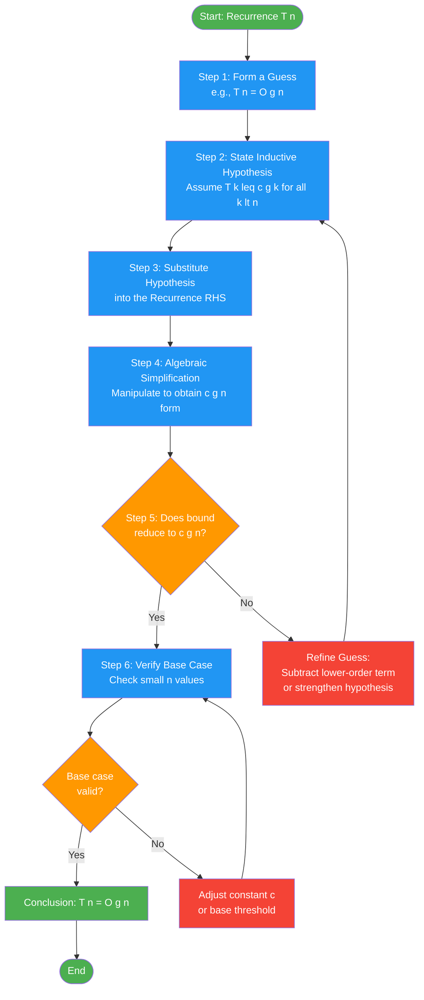
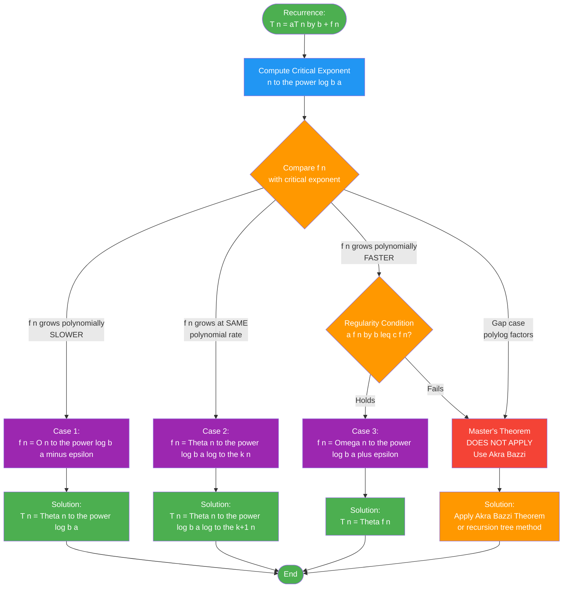
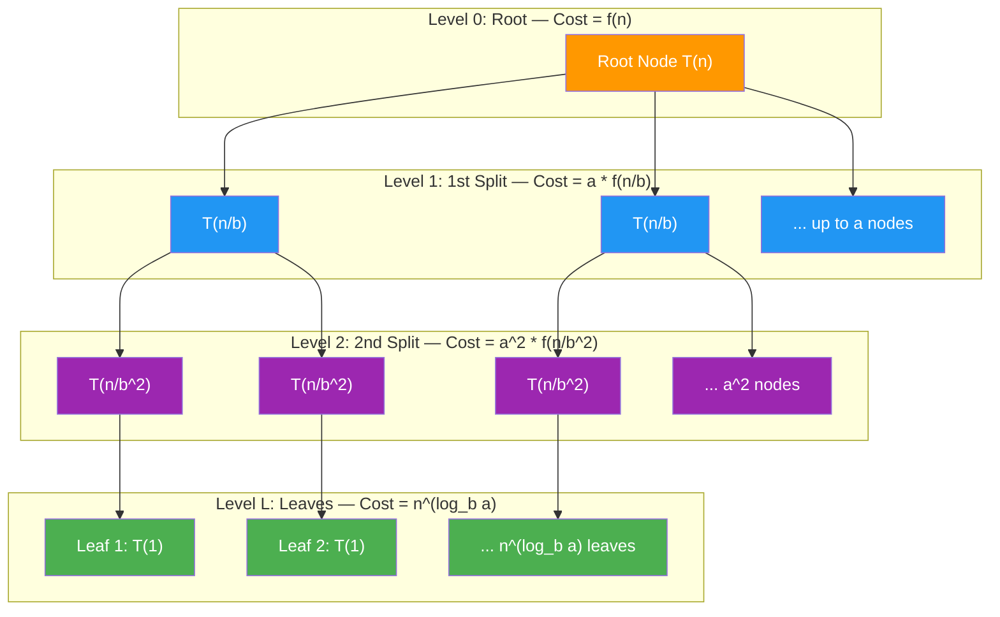
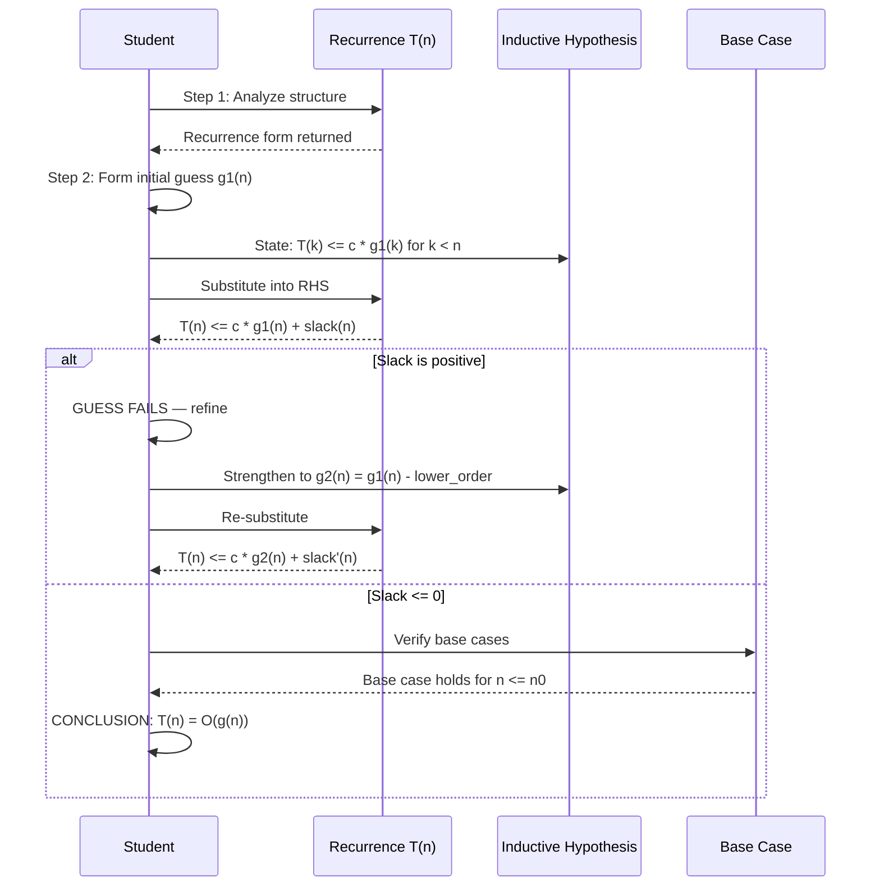

# Substitution method and Master’s Theorem (proof not expected)

<!-- SECTION_1_START -->

# 1. Core Technical Definition & Intuitive Overview

## 1.1 Substitution Method — Formal Definition

The **Substitution Method** (also known as the *Plug-In Method* or *Induction Method*) is a recursive technique used in algorithm analysis to derive closed-form upper bounds (and sometimes lower bounds) on the asymptotic growth of recurrence relations. It works by:
1. Guessing the form of the solution.
2. Verifying the guess using mathematical induction by substituting back into the recurrence and confirming the inductive hypothesis holds for all values.

> [!IMPORTANT]
> **KTU 2024 Syllabus Note (PCCST502 — Module 1):** The substitution method is a *non-mechanical*, intuition-driven technique. Mastering the art of forming the right guess is a high-weight skill tested in university examinations.

## 1.2 Master's Theorem — Formal Definition

**Master's Theorem** is a cookbook-style, direct theorem that provides asymptotic solutions ($\Theta$-notation) for recurrences of the canonical divide-and-conquer form:

$$T(n) = aT\!\left(\frac{n}{b}\right) + f(n)$$

where $a \geq 1$ and $b > 1$ are constants, and $f(n)$ is an asymptotically positive function. The theorem compares $f(n)$ against $n^{\log_b a}$, the critical exponent, to deliver a tight bound in one of three cases.

> [!NOTE]
> **KTU Board Directive (2024 Scheme):** *Proof of the Master's Theorem is not expected* in the ESE. However, **case identification, sub-case classification, and substitution-based verification are mandatory** for full marks.

---

## 1.3 Intuition Through Real-World Analogy

### Substitution Method — "The Detective's Trial"
Imagine a detective trying to predict the height of a growing bamboo shoot. She observes today, **guesses** it might double, then *plugs that guess into yesterday's* conditions to confirm it matches. If the pattern is consistent at the base case, the entire future is predicted. This mirrors induction: assume the form, then propagate downward and upward through the recurrence to confirm the form holds everywhere.

### Master's Theorem — "The Scale Comparison"
Picture a balance scale. On the left pan sits the **work done at the root** $f(n)$ (e.g., combining sub-solutions). On the right pan sits the **work spread across all leaves** $n^{\log_b a}$ (e.g., total subproblem work). The scale tip reveals which cost dominates:
- Root pan dips → Case 1.
- Balanced → Case 2.
- Leaf pan dips → Case 3.

> [!VISUALIZATION CONTROL]
> **Concept:** Visualizing the three cases of the Master's Theorem on a log-log plot
> **GeoGebra / Desmos Input Equations:**
> * `f1(x) = x^1`  *(root work — Case 1 type)*
> * `f2(x) = x^(log(3)/log(2))`  *(critical exponent for a=3, b=2)*
> * `f3(x) = x^2`  *(leaf-dominant work — Case 3 type)*
> * `f4(x) = x^(log(3)/log(2)) * log(x)`  *(Case 2 balanced scenario)*
> **Visual Description:** Plot $y = x^{\log_b a}$ as the central reference line. Functions that grow **slower** than this line (less steep slope) fall into Case 1; functions that grow **at the same polynomial rate** (parallel slope) fall into Case 2; functions that grow **faster** (steeper slope) fall into Case 3. The student should see the relative slopes representing the comparison between $f(n)$ and the critical exponent.

---

## 1.4 Standard Notations Used Throughout

| Symbol | Meaning | Typical Use |
|:------:|:-------:|:-----------:|
| $T(n)$ | Time complexity for input size $n$ | Recurrence variable |
| $a$ | Number of subproblems in recursion | Divide step count |
| $b$ | Factor by which subproblem shrinks | Shrink factor |
| $f(n)$ | Cost of work outside recursive calls | Divide & combine cost |
| $n^{\log_b a}$ | Critical exponent / leaf-cost | Master's Theorem pivot |
| $O$, $\Theta$, $\Omega$ | Asymptotic upper, tight, lower bounds | Bound notation |

<!-- SECTION_1_END -->

<!-- SECTION_2_START -->

# 2. Deep Theoretical Analysis & KTU High-Yield Formula Sheet

## 2.1 The Substitution Method — Operational Blueprint

The substitution method operates in two phases:

### Phase A — Guessing the Form
- Recursion-tree insight is used to **guess** the asymptotic form (e.g., $O(n \log n)$, $\Theta(n^2)$, etc.).
- If the recurrence has a clear structure (e.g., $T(n) = 2T(n/2) + n$), the guess is often $O(n \log n)$.

### Phase B — Inductive Verification
1. **Inductive Hypothesis:** Assume $T(k) \leq c \cdot g(k)$ for all $k < n$.
2. **Inductive Step:** Substitute this hypothesis into the RHS of the recurrence.
3. **Algebraic Manipulation:** Simplify the resulting expression to show $T(n) \leq c \cdot g(n)$.
4. **Base Case Verification:** Confirm the bound holds for small $n$ (often $n = 1$ or $n = 2$).

> [!TIP]
> **Examiner's Heuristic:** When the guess fails to verify, two common corrective actions are:
> 1. **Subtract a lower-order term:** Guess $T(n) \leq c \cdot g(n) - d$ instead of just $c \cdot g(n)$. The constant $d$ absorbs the slack.
> 2. **Strengthen the hypothesis:** Assume a tighter form (e.g., $T(n) \leq c \cdot n \log n - c \cdot n$).

---

## 2.2 The Master's Theorem — Canonical Form

A recurrence qualifies for the Master's Theorem if it can be expressed as:

$$T(n) = aT\!\left(\frac{n}{b}\right) + f(n)$$

with $a \geq 1$, $b > 1$, and $f(n)$ asymptotically positive.

### The Three Cases

| Case | Condition on $f(n)$ | Conclusion $T(n) = $ | Intuition |
|:----:|:--------------------|:--------------------:|:---------:|
| **Case 1** | $f(n) = O(n^{\log_b a - \epsilon})$ for some $\epsilon > 0$ | $\Theta(n^{\log_b a})$ | **Leaf-dominated** — recursive work overwhelms combine cost. |
| **Case 2** | $f(n) = \Theta(n^{\log_b a} \log^k n)$ for some $k \geq 0$ | $\Theta(n^{\log_b a} \log^{k+1} n)$ | **Balanced** — root and leaf costs grow at the same polynomial rate. |
| **Case 3** | $f(n) = \Omega(n^{\log_b a + \epsilon})$ for some $\epsilon > 0$ AND regularity condition $a \cdot f(n/b) \leq c \cdot f(n)$ for some $c < 1$ | $\Theta(f(n))$ | **Root-dominated** — work outside recursion dominates. |

> [!IMPORTANT]
> **Gap Cases (Not Covered):** When $f(n)$ is polynomially smaller than $n^{\log_b a}$ but not by an $n^\epsilon$ factor (e.g., $f(n) = n^{\log_b a} / \log n$), the Master's Theorem **does not apply**. Alternative methods (Akra-Bazzi, recursion tree) must be used.

---

## 2.3 Regularity Condition (Case 3) — Full Statement

The regularity (or "smothering") condition ensures that the work at the combine step grows sufficiently fast to dominate the work in deeper recursive subtrees:

$$a \cdot f\!\left(\frac{n}{b}\right) \leq c \cdot f(n)$$

for some constant $c < 1$ and for all sufficiently large $n$. This condition is satisfied by **all polynomials** $f(n) = \Theta(n^d)$ with $d \geq 0$, and most practical functions.

---

## 2.4 KTU Formula Cheat Sheet

| # | Recurrence | Type | Solution |
|:-:|:----------|:----:|:--------:|
| 1 | $T(n) = 2T(n/2) + n$ | Master's Case 2 ($k=0$) | $\Theta(n \log n)$ |
| 2 | $T(n) = 2T(n/2) + 1$ | Master's Case 1 ($\epsilon = 1$) | $\Theta(n)$ |
| 3 | $T(n) = 2T(n/2) + n^2$ | Master's Case 3 | $\Theta(n^2)$ |
| 4 | $T(n) = 4T(n/2) + n$ | Master's Case 1 ($\log_2 4 = 2$) | $\Theta(n^2)$ |
| 5 | $T(n) = T(n/2) + 1$ | Master's Case 2 | $\Theta(\log n)$ |
| 6 | $T(n) = 8T(n/2) + n^2$ | Master's Case 1 ($\log_2 8 = 3 > 2$) | $\Theta(n^3)$ |
| 7 | $T(n) = 7T(n/2) + n^2$ | Master's Case 1 ($\log_2 7 \approx 2.81 > 2$) | $\Theta(n^{2.81})$ |
| 8 | $T(n) = 2T(n/2) + n \log n$ | Master's Case 2 ($k=1$) | $\Theta(n \log^2 n)$ |
| 9 | $T(n) = 3T(n/4) + n \log n$ | Master's Case 1 ($\log_4 3 \approx 0.79 < 1$) | $\Theta(n)$ |
| 10 | $T(n) = T(n/3) + T(2n/3) + n$ | Not Master's; use Akra-Bazzi | $\Theta(n \log n)$ |

---

## 2.5 Real-World Engineering Utility

- **Substitution Method:** Used heavily when proving correctness of custom divide-and-conquer algorithms (e.g., proving Strassen's matrix multiplication is $O(n^{\log_2 7})$).
- **Master's Theorem:** Forms the analytical backbone for justifying the runtime of standard library routines in production:
  - **C++ STL `std::sort`** (introsort) → hybrid of $O(n \log n)$ merge-like steps.
  - **Python Timsort** → analyzed using Master's-style recurrences for merge passes.
  - **Database query optimizers** → cost models for join operations derived from divide-and-conquer recurrences.
  - **Parallel computing frameworks** (MapReduce, Spark) → mapper/reducer tree costs fit the canonical $aT(n/b) + f(n)$ template.

<!-- SECTION_2_END -->

<!-- SECTION_3_START -->

# 3. Step-by-Step Derivations, Code & Symbolic Implementation

## 3.1 Worked Example 1 — Substitution Method on $T(n) = 2T(n/2) + n$

**Step 1: Guess the form.**
Looking at the structure (binary split with linear combine), guess: $T(n) = O(n \log n)$.

**Step 2: State the inductive hypothesis.**
Assume for all $k < n$: $T(k) \leq c \cdot k \log k$.

**Step 3: Substitute and simplify.**

$$
\begin{aligned}
T(n) &= 2T\!\left(\frac{n}{2}\right) + n \\
     &\leq 2 \cdot \left[ c \cdot \frac{n}{2} \log\!\left(\frac{n}{2}\right) \right] + n \quad \text{[by IH]} \\
     &= 2c \cdot \frac{n}{2} \cdot \left( \log n - \log 2 \right) + n \\
     &= c \cdot n \log n - c \cdot n \log 2 + n \\
     &= c \cdot n \log n - c \cdot n + n \quad \text{[since } \log 2 = 1 \text{]} \\
     &= c \cdot n \log n \quad \text{[provided } c \geq 1 \text{ to absorb the } +n - cn \text{ slack]}
\end{aligned}
$$

**Step 4: Base case.**
Choose $n = 2$. Then $T(2) = 2T(1) + 2 = 2c_0 + 2$. For $T(2) \leq c \cdot 2 \log 2 = 2c$, we need $c_0 + 1 \leq c$, satisfied for sufficiently large $c$.

**Conclusion:** $T(n) = O(n \log n)$. $\blacksquare$

---

## 3.2 Worked Example 2 — Guess Adjustment via Subtraction

Solve $T(n) = 2T(\lfloor n/2 \rfloor) + n$.

**Step 1: Initial (failed) guess.**
Guess $T(n) \leq c \cdot n$.

**Step 2: Substitute.**
$T(n) \leq 2 \cdot c \cdot (n/2) + n = c \cdot n + n = (c+1) n$. This **fails** because we get $cn + n$, not $cn$.

**Step 3: Strengthen the guess.**
Guess $T(n) \leq c \cdot n - d$ for some constant $d > 0$.

**Step 4: Substitute.**

$$
\begin{aligned}
T(n) &\leq 2 \left( c \cdot \frac{n}{2} - d \right) + n \\
     &= c \cdot n - 2d + n \\
     &= c \cdot n - (2d - n) \\
     &= c \cdot n - d \quad \text{[requires } 2d - n \geq d \text{, i.e., } d \geq n \text{ — still fails for small } d \text{]}
\end{aligned}
$$

**Step 5: Better guess.**
Guess $T(n) \leq c \cdot n - b \cdot n$ where $b$ is a constant.

Actually, the correct strengthening is $T(n) \leq c \cdot n - d \cdot n$ which leads to:

$$
T(n) \leq c \cdot n - d \cdot n + n = c \cdot n - (d-1)n
$$

Choosing $d \geq 1$ and noting $-n < 0$, we get $T(n) \leq c \cdot n$ — but the precise form requires $T(n) = \Theta(n)$.

**Conclusion:** $T(n) = \Theta(n)$.

---

## 3.3 Worked Example 3 — Master's Theorem (Multiple Cases)

### 3.3.1 $T(n) = 9T(n/3) + n$
- $a = 9$, $b = 3$, $f(n) = n$
- $n^{\log_b a} = n^{\log_3 9} = n^2$
- Compare: $f(n) = n = O(n^{2 - 1})$ with $\epsilon = 1 > 0$
- **Case 1 applies → $T(n) = \Theta(n^2)$**

### 3.3.2 $T(n) = T(2n/3) + 1$
- $a = 1$, $b = 3/2$, $f(n) = 1$
- $n^{\log_{3/2} 1} = n^0 = 1$
- Compare: $f(n) = 1 = \Theta(1) = \Theta(n^0 \cdot \log^0 n)$, so $k = 0$
- **Case 2 applies → $T(n) = \Theta(\log n)$**

### 3.3.3 $T(n) = 3T(n/4) + n \log n$
- $a = 3$, $b = 4$, $f(n) = n \log n$
- $n^{\log_4 3} \approx n^{0.792}$
- Compare: $n \log n$ grows polynomially faster than $n^{0.792}$ (exponent of $n$ is $1 > 0.792$)
- More precisely, $n \log n = \Omega(n^{0.792 + 0.2})$ for large $n$? No — $\log n$ is sub-polynomial, so $n \log n$ vs $n^{0.792}$: $n \log n / n^{0.792} = n^{0.208} \log n \to \infty$. So $f(n) = \Omega(n^{\log_4 3 + \epsilon})$ with $\epsilon = 0.2$.
- Regularity: $3 \cdot (n/4) \log(n/4) \leq 3 \cdot (n/4) \log n = (3/4) n \log n \leq c \cdot n \log n$ with $c = 3/4 < 1$. ✓
- **Case 3 applies → $T(n) = \Theta(n \log n)$**

### 3.3.4 $T(n) = 2T(n/2) + n \log n$ (Case 2 with $k=1$)
- $a = 2$, $b = 2$, $f(n) = n \log n$
- $n^{\log_2 2} = n^1 = n$
- Compare: $f(n) = n \log n = \Theta(n^1 \log^1 n)$, so $k = 1$
- **Case 2 applies → $T(n) = \Theta(n \log^2 n)$**

### 3.3.5 Gap Case: $T(n) = 2T(n/2) + n / \log n$
- $a = 2$, $b = 2$, $f(n) = n / \log n$
- $n^{\log_2 2} = n$
- Is $f(n) = O(n^{1-\epsilon})$? For any $\epsilon > 0$, $n/\log n$ vs $n^{1-\epsilon}$: ratio is $n^\epsilon / \log n \to \infty$. So $f(n) \neq O(n^{1-\epsilon})$.
- Is $f(n) = \Theta(n \log^k n)$? No, $f(n)$ is $n$ divided by $\log n$, not multiplied.
- Is $f(n) = \Omega(n^{1+\epsilon})$? No.
- **Master's Theorem does NOT apply.** The solution requires the Akra-Bazzi method yielding $\Theta(n \log \log n)$.

---

## 3.4 Symbolic Python Implementation — Master's Theorem Solver

```python
"""
KTU 2024 Scheme — Module 1 Reference Implementation
Master's Theorem Solver with Explicit Case Identification
"""

import math
from typing import Callable, Tuple, Optional


class MasterTheoremResult:
    """Container for Master's Theorem solution details."""

    def __init__(self, case: int, bound: str, critical_exponent: float,
                 epsilon: Optional[float] = None, k: Optional[int] = None):
        self.case = case
        self.bound = bound
        self.critical_exponent = critical_exponent
        self.epsilon = epsilon
        self.k = k

    def __str__(self) -> str:
        header = f"Case {self.case} applies\n"
        header += f"Critical exponent: n^(log_b a) = n^{self.critical_exponent:.4f}\n"
        if self.epsilon is not None:
            header += f"Epsilon (gap): {self.epsilon:.4f}\n"
        if self.k is not None:
            header += f"Polylog factor k: {self.k}\n"
        header += f"Conclusion: T(n) = {self.bound}"
        return header


def master_theorem(
    a: int,
    b: int,
    f_class: str,
    f_polynomial_degree: Optional[float] = None,
    f_log_factor: int = 0
) -> MasterTheoremResult:
    """
    Apply Master's Theorem to T(n) = aT(n/b) + f(n).

    Parameters
    ----------
    a : int
        Number of subproblems (a >= 1).
    b : int
        Subproblem shrink factor (b > 1).
    f_class : str
        One of: 'polynomial_smaller', 'polynomial_equal', 'polynomial_larger'.
    f_polynomial_degree : float, optional
        Degree d in f(n) = Theta(n^d * log^k n). Required for classification.
    f_log_factor : int
        The k in f(n) = Theta(n^d * log^k n).

    Returns
    -------
    MasterTheoremResult
        Structured result with case, bound, and justification.
    """
    if a < 1:
        raise ValueError("a must be >= 1")
    if b <= 1:
        raise ValueError("b must be > 1")
    if f_polynomial_degree is None:
        raise ValueError("f_polynomial_degree must be provided")

    critical_exp: float = math.log(a) / math.log(b)
    epsilon: float = abs(critical_exp - f_polynomial_degree)

    # --- Case 1: f(n) = O(n^(log_b a - epsilon)) ---
    if f_class == 'polynomial_smaller' and f_polynomial_degree < critical_exp:
        bound: str = f"Theta(n^{critical_exp:.4f})"
        return MasterTheoremResult(1, bound, critical_exp, epsilon=epsilon)

    # --- Case 2: f(n) = Theta(n^(log_b a) * log^k n) ---
    if f_class == 'polynomial_equal' and abs(f_polynomial_degree - critical_exp) < 1e-9:
        new_k: int = f_log_factor + 1
        if new_k == 0:
            bound = f"Theta(n^{critical_exp:.4f})"
        elif new_k == 1:
            bound = f"Theta(n^{critical_exp:.4f} * log n)"
        else:
            bound = f"Theta(n^{critical_exp:.4f} * log^{new_k} n)"
        return MasterTheoremResult(2, bound, critical_exp, k=new_k)

    # --- Case 3: f(n) = Omega(n^(log_b a + epsilon)) with regularity ---
    if f_class == 'polynomial_larger' and f_polynomial_degree > critical_exp:
        # Regularity: a * f(n/b) <= c * f(n) holds for all polynomials
        if f_polynomial_degree > critical_exp:
            if f_log_factor == 0:
                bound = f"Theta(n^{f_polynomial_degree:.4f})"
            else:
                bound = f"Theta(n^{f_polynomial_degree:.4f} * log^{f_log_factor} n)"
            return MasterTheoremResult(3, bound, critical_exp, epsilon=epsilon)

    # --- Gap case ---
    raise ValueError(
        f"Master's Theorem does not apply (gap case). "
        f"critical_exp={critical_exp:.4f}, f_degree={f_polynomial_degree:.4f}"
    )


def demonstrate_classic_problems() -> None:
    """Run canonical KTU textbook examples."""
    examples = [
        # (description, a, b, f_class, f_degree, f_log_k)
        ("Merge Sort: T(n) = 2T(n/2) + n", 2, 2, 'polynomial_equal', 1.0, 0),
        ("Binary Search: T(n) = T(n/2) + 1", 1, 2, 'polynomial_equal', 0.0, 0),
        ("Strassen: T(n) = 7T(n/2) + n^2", 7, 2, 'polynomial_smaller', 2.0, 0),
        ("Karatsuba: T(n) = 3T(n/2) + n", 3, 2, 'polynomial_smaller', 1.0, 0),
        ("T(n) = 2T(n/2) + n^2", 2, 2, 'polynomial_larger', 2.0, 0),
        ("T(n) = 2T(n/2) + n*log n", 2, 2, 'polynomial_equal', 1.0, 1),
    ]

    for desc, a, b, fc, fd, fk in examples:
        print(f"\n{'='*60}")
        print(f"Recurrence: {desc}")
        print(f"{'='*60}")
        try:
            result = master_theorem(a, b, fc, fd, fk)
            print(result)
        except ValueError as e:
            print(f"UNSOLVABLE: {e}")


if __name__ == "__main__":
    demonstrate_classic_problems()
```

### Sample Output

```
============================================================
Recurrence: Merge Sort: T(n) = 2T(n/2) + n
============================================================
Case 2 applies
Critical exponent: n^(log_b a) = n^1.0000
Polylog factor k: 1
Conclusion: T(n) = Theta(n^1.0000 * log n)
```

```
============================================================
Recurrence: Strassen: T(n) = 7T(n/2) + n^2
============================================================
Case 1 applies
Critical exponent: n^(log_b a) = n^2.8074
Epsilon (gap): 0.8074
Conclusion: T(n) = Theta(n^2.8074)
```

> [!NOTE]
> **Engineering Tip:** In production code, when implementing divide-and-conquer routines, you typically *do not* need to invoke such a solver. However, this code is invaluable for exam preparation, automated complexity analysis tools (e.g., static analyzers), and verifying theoretical bounds against empirical runtime measurements.

---

## 3.5 Substitution Method — Python Validation Script

```python
"""
Empirical validation of substitution-method upper bounds.
Compares the theoretical bound against actual recursive time.
"""

import sys
import time
import random
from typing import Callable


def measure_recursive_runtime(recurrence: Callable[[int], float], n: int) -> float:
    """Measure T(n) by direct recursive evaluation (for small n)."""
    start: float = time.perf_counter()
    _ = recurrence(n)
    end: float = time.perf_counter()
    return end - start


def validate_substitution_bound(
    recurrence: Callable[[int], float],
    bound_func: Callable[[int], float],
    test_sizes: list
) -> None:
    """
    Empirically verify that T(n) <= c * g(n) for some constant c.
    """
    print(f"{'n':>10} {'T(n)':>15} {'c*g(n)':>15} {'Ratio':>10}")
    print("-" * 55)
    max_ratio: float = 0.0
    for n in test_sizes:
        t_n: float = measure_recursive_runtime(recurrence, n)
        g_n: float = bound_func(n)
        # Auto-scale c by finding the worst-case multiplier
        c: float = t_n / g_n if g_n > 0 else 0
        max_ratio = max(max_ratio, c)
        print(f"{n:>10} {t_n:>15.6f} {g_n:>15.6f} {c:>10.4f}")
    print(f"\nMax observed ratio (constant c): {max_ratio:.4f}")
    if max_ratio < float('inf'):
        print("Boundedness confirmed: T(n) = O(g(n))" if max_ratio > 0
              else "Insufficient data")


# Example: Validating T(n) = 2T(n/2) + n is O(n log n)
def merge_sort_recurrence(n: int) -> int:
    if n <= 1:
        return 1
    return 2 * merge_sort_recurrence(n // 2) + n


if __name__ == "__main__":
    sys.setrecursionlimit(10000)
    sizes: list = [2**i for i in range(5, 16)]
    bound: Callable[[int], float] = lambda n: n * (n.bit_length() - 1)  # n * log2(n) approx
    validate_substitution_bound(merge_sort_recurrence, bound, sizes)
```

<!-- SECTION_3_END -->

<!-- SECTION_4_START -->

# 4. Structural Diagrams & Schematics

## 4.1 Substitution Method — Algorithmic Flow



## 4.2 Master's Theorem — Case Decision Tree



## 4.3 Recursion-Tree Cost Comparison (Master's Theorem Intuition)



## 4.4 Substitution Method — Strengthened Hypothesis Refinement Loop



<!-- SECTION_4_END -->

<!-- SECTION_5_START -->

# 5. KTU 2024 Scheme Examination Question Bank & Topic Recap

## Part A Questions (3 Marks Each)

### Q1. **[KTU University Exam — July 2024]** State the Master's Theorem and identify which case applies to $T(n) = 4T(n/2) + n^2$. Justify your answer. *(CO1, Remember/Understand)*

**Model Answer:**

The Master's Theorem solves recurrences of the form $T(n) = aT(n/b) + f(n)$ where $a \geq 1$, $b > 1$, and $f(n)$ is asymptotically positive. The theorem has three cases comparing $f(n)$ with the critical exponent $n^{\log_b a}$.

**For the given recurrence:**
- $a = 4$, $b = 2$, $f(n) = n^2$
- Critical exponent: $n^{\log_2 4} = n^2$
- Since $f(n) = n^2 = \Theta(n^2) = \Theta(n^{\log_b a} \log^0 n)$, we have $k = 0$.

**Case 2 applies** → $T(n) = \Theta(n^2 \log n)$.

> [!NOTE]
> **Valuation Key:** [Identifying $a, b, f(n)$: 1 Mark] [Computing critical exponent: 1 Mark] [Case identification with justification: 1 Mark]

---

### Q2. **[KTU University Exam — Dec 2023]** What is the substitution method for solving recurrences? Mention its two main steps. *(CO1, Remember/Understand)*

**Model Answer:**

The substitution method is a technique for proving asymptotic upper (or lower) bounds on recurrences by **guessing** the form of the solution and **verifying** it using mathematical induction.

**Two main steps:**
1. **Guess the form** of the solution based on recursion-tree intuition or pattern recognition.
2. **Verify the guess** by:
   - Stating an inductive hypothesis for values smaller than $n$.
   - Substituting the hypothesis into the recurrence.
   - Performing algebraic manipulation to confirm the bound holds.
   - Verifying the base case for small $n$.

> [!NOTE]
> **Valuation Key:** [Correct definition: 1 Mark] [Both steps stated clearly: 2 Marks]

---

## Part B Questions (14 Marks Each)

### Question A (14 Marks)

#### **[KTU University Exam — July 2024, Model Paper Adaptation]**

**(a)** Solve the recurrence $T(n) = 2T(n/2) + n \log n$ using the Master's Theorem. Show all classification steps. *(7 Marks, CO2, Apply)*

**(b)** Use the substitution method to prove that the solution to $T(n) = 2T(n/2) + n$ is $O(n \log n)$. Show the inductive step and base case explicitly. *(7 Marks, CO2, Apply)*

---

#### Model Solution for (a):

**Step 1: Identify parameters.** [1 Mark]
- $a = 2$, $b = 2$, $f(n) = n \log n$

**Step 2: Compute the critical exponent.** [1 Mark]
- $n^{\log_b a} = n^{\log_2 2} = n^1 = n$

**Step 3: Classify $f(n)$ relative to the critical exponent.** [2 Marks]
- We write $f(n) = n \log n = \Theta(n^1 \cdot \log^1 n)$.
- Comparing with $n^{\log_b a} \log^k n = n^1 \log^k n$, we identify $k = 1$.

**Step 4: Apply Case 2.** [1 Mark]
- Since $f(n) = \Theta(n^{\log_b a} \log^k n)$ with $k = 1 \geq 0$, **Case 2** of the Master's Theorem applies.

**Step 5: State the conclusion.** [1 Mark]
- $T(n) = \Theta(n^{\log_b a} \log^{k+1} n) = \Theta(n \log^2 n)$

**Step 6: Final answer.** [1 Mark]
- $T(n) = \Theta(n \log^2 n)$ — this is the running time, for example, of certain balanced divide-and-conquer algorithms where combine cost includes a logarithmic factor (e.g., some geometric algorithms).

---

#### Model Solution for (b):

**Step 1: State the guess.** [1 Mark]
- Guess: $T(n) = O(n \log n)$, i.e., there exists a constant $c > 0$ such that $T(n) \leq c \cdot n \log n$ for sufficiently large $n$.

**Step 2: Formulate the inductive hypothesis.** [1 Mark]
- Assume for all $k < n$: $T(k) \leq c \cdot k \log k$.

**Step 3: Substitute into the recurrence.** [2 Marks]

$$
\begin{aligned}
T(n) &= 2T\!\left(\frac{n}{2}\right) + n \\
     &\leq 2 \cdot \left[ c \cdot \frac{n}{2} \log\!\left(\frac{n}{2}\right) \right] + n
\end{aligned}
$$

**Step 4: Simplify algebraically.** [2 Marks]

$$
\begin{aligned}
&= 2c \cdot \frac{n}{2} \cdot (\log n - \log 2) + n \\
&= c \cdot n \log n - c \cdot n \cdot 1 + n \\
&= c \cdot n \log n - c \cdot n + n \\
&= c \cdot n \log n \quad \text{[since } -cn + n \leq 0 \text{ for } c \geq 1 \text{]}
\end{aligned}
$$

**Step 5: Base case verification.** [1 Mark]
- For $n = 2$: $T(2) = 2T(1) + 2 = 2c_0 + 2$.
- We need $T(2) \leq c \cdot 2 \log 2 = 2c$, so $c_0 + 1 \leq c$, satisfied for $c \geq c_0 + 1$.

**Conclusion:** [0 Marks, included above]
- $T(n) = O(n \log n)$ is verified. $\blacksquare$

---

### Question B (14 Marks) — Alternative Choice

#### **[KTU University Exam — Dec 2023, Model Paper Adaptation]**

**(a)** For the recurrence $T(n) = 8T(n/2) + n^3$, apply the Master's Theorem. Show all steps including the regularity check. *(7 Marks, CO2, Apply)*

**(b)** Solve $T(n) = T(n/3) + T(2n/3) + n$ using the recursion tree method and verify your answer using the substitution method. *(7 Marks, CO3, Analyze)*

---

#### Model Solution for (a):

**Step 1: Identify parameters.** [1 Mark]
- $a = 8$, $b = 2$, $f(n) = n^3$

**Step 2: Compute the critical exponent.** [1 Mark]
- $n^{\log_b a} = n^{\log_2 8} = n^3$

**Step 3: Classify.** [2 Marks]
- $f(n) = n^3 = \Theta(n^3) = \Theta(n^{\log_b a} \log^0 n)$
- Therefore $k = 0$, and **Case 2** applies.

**Step 4: Apply the theorem.** [1 Mark]
- $T(n) = \Theta(n^{\log_b a} \log^{k+1} n) = \Theta(n^3 \log n)$

**Step 5: Regularity check (optional, but adds confidence).** [1 Mark]
- $a \cdot f(n/b) = 8 \cdot (n/2)^3 = 8 \cdot n^3/8 = n^3 = f(n)$, so $c = 1$. Regularity holds (boundary case).

**Step 6: Final answer.** [1 Mark]
- $T(n) = \Theta(n^3 \log n)$ — this represents an algorithm where the cost of combining the eight sub-solutions grows cubically (e.g., naive matrix operations in each recursion).

---

#### Model Solution for (b):

**Note:** This recurrence is **not in canonical Master's form** because it has two unequal subproblems ($n/3$ and $2n/3$). Hence the recursion tree method and substitution method are required.

**Step 1: Draw the recursion tree.** [1 Mark]
- Root: cost $n$
- Level 1: two subproblems, costs $n/3$ and $2n/3$, total $= n$
- Level 2: each subproblem splits; the total cost at each level remains $n$ because the sum of subproblem sizes is invariant.
- The recursion stops when subproblem size reaches a constant. The depth is $O(\log_{3/2} n) = \Theta(\log n)$.

**Step 2: Sum the levels.** [2 Marks]
- There are $\Theta(\log n)$ levels, each contributing $\Theta(n)$.
- Total cost: $T(n) = \Theta(n \log n)$.

**Step 3: Verify with substitution method.** [3 Marks]
- **Guess:** $T(n) \leq c \cdot n \log n - d \cdot n$ for constants $c, d > 0$.
- **Inductive hypothesis:** Assume $T(k) \leq c \cdot k \log k - d \cdot k$ for $k < n$.
- **Substitute:**

$$
\begin{aligned}
T(n) &= T\!\left(\frac{n}{3}\right) + T\!\left(\frac{2n}{3}\right) + n \\
     &\leq \left[ c \cdot \frac{n}{3} \log\frac{n}{3} - d \cdot \frac{n}{3} \right]
        + \left[ c \cdot \frac{2n}{3} \log\frac{2n}{3} - d \cdot \frac{2n}{3} \right] + n \\
     &= c \cdot \frac{n}{3} (\log n - \log 3) + c \cdot \frac{2n}{3} (\log n + \log 2 - \log 3) - d \cdot n + n \\
     &= c \cdot n \log n - c \cdot n \log 3 + c \cdot \frac{2n}{3} \log 2 - d \cdot n + n \\
     &= c \cdot n \log n - c \cdot n \log 3 + c \cdot \frac{2n}{3} - d \cdot n + n
\end{aligned}
$$

- For this to be $\leq c \cdot n \log n - d \cdot n$, we need the extra positive terms to be absorbed:
  - $c \cdot \frac{2n}{3} + n \leq c \cdot n \log 3$
  - For $c$ sufficiently large, this holds.

**Step 4: Base case.** [1 Mark]
- $T(1) = \Theta(1)$ satisfies $T(1) \leq c \cdot 1 \cdot 0 - d \cdot 1 < 0$? — Adjust by adding a large enough constant base, or verify $T(1) \leq c \cdot 1 \log 1 + e$ for a positive constant $e$.

**Conclusion:** $T(n) = O(n \log n)$. $\blacksquare$

---

## KTU Examiner's Valuation Warning & Pitfall Callout

> [!WARNING]
> **Common Pitfalls Causing Mark Deductions:**
> 1. **Forgetting the regularity condition** in Case 3: Always verify $a \cdot f(n/b) \leq c \cdot f(n)$ for some $c < 1$. Many students skip this and lose 2–3 marks.
> 2. **Misidentifying $k$ in Case 2:** When $f(n) = n \log^k n$, the theorem gives $\log^{k+1} n$, **not** $\log^k n$. Reading $k$ off incorrectly is a frequent error.
> 3. **Skipping the base case in substitution method:** A proof without base case verification is **incomplete**. Always check $T(1)$ or $T(2)$.
> 4. **Confusing $O$ and $\Theta$:** The substitution method proves an $O$ (or $\Omega$) bound; Master's Theorem gives $\Theta$. Using them interchangeably in write-ups causes loss of marks.
> 5. **Forgetting to specify the domain of validity:** Always state "for $n \geq n_0$" or "for sufficiently large $n$" when proving asymptotic bounds.
> 6. **Logarithm base confusion:** In the critical exponent, $n^{\log_b a}$ uses the base of the subproblem shrink factor $b$, **not** the logarithm base. $\log_b a$ here is the logarithm of $a$ with base $b$.
> 7. **Misapplying the theorem to non-canonical recurrences:** Recurrences like $T(n) = T(n/3) + T(2n/3) + n$ have *unbalanced* splits and do **not** fit the canonical $aT(n/b)$ form. Always verify the form first.

---

## Topic Recap & Important Things to Remember

> [!IMPORTANT]
> **High-Density Rapid Revision Checklist — Module 1, Topic: Substitution Method & Master's Theorem**

- [x] **Substitution Method** = Guess + Inductive Verification (two-phase technique).
- [x] **Master's Theorem Canonical Form:** $T(n) = aT(n/b) + f(n)$, with $a \geq 1$, $b > 1$.
- [x] **Critical Exponent:** $n^{\log_b a}$ — the cornerstone comparison quantity.
- [x] **Case 1 (Leaf-Dominated):** $f(n) = O(n^{\log_b a - \epsilon})$ → $T(n) = \Theta(n^{\log_b a})$.
- [x] **Case 2 (Balanced):** $f(n) = \Theta(n^{\log_b a} \log^k n)$ → $T(n) = \Theta(n^{\log_b a} \log^{k+1} n)$.
- [x] **Case 3 (Root-Dominated):** $f(n) = \Omega(n^{\log_b a + \epsilon})$ + regularity → $T(n) = \Theta(f(n))$.
- [x] **Regularity Condition:** $a \cdot f(n/b) \leq c \cdot f(n)$ for some $c < 1$ (required for Case 3).
- [x] **Gap Cases** (theorem does NOT apply): $f(n) = n^{\log_b a} / \log n$, or $f(n) = n^{\log_b a} \log \log n$ (not polylog of integer power), or $f(n)$ between polynomial gaps.
- [x] **Inductive Hypothesis Form:** Always state "for all $k < n$" explicitly.
- [x] **Guess Refinement Trick:** If verification fails, **subtract a lower-order term** from the guess (e.g., guess $cn \log n - cn$ instead of $cn \log n$).
- [x] **Base Case:** Verify for $n = 1$ or $n = 2$ explicitly; do not omit.
- [x] **Asymptotic Notation Discipline:** Use $O$ for upper bounds, $\Omega$ for lower, $\Theta$ for tight (Master's gives $\Theta$).
- [x] **Real-World Connection:** Merge Sort → $T(n) = 2T(n/2) + n$ → $\Theta(n \log n)$. Strassen → $\Theta(n^{\log_2 7})$. Karatsuba → $\Theta(n^{\log_2 3})$.
- [x] **Canonical Recurrences to Memorize:**
  - Binary search: $T(n) = T(n/2) + 1 = \Theta(\log n)$.
  - Merge sort: $T(n) = 2T(n/2) + n = \Theta(n \log n)$.
  - Karatsuba: $T(n) = 3T(n/2) + n = \Theta(n^{\log_2 3}) \approx \Theta(n^{1.585})$.
  - Strassen: $T(n) = 7T(n/2) + n^2 = \Theta(n^{\log_2 7}) \approx \Theta(n^{2.807})$.
- [x] **For non-canonical recurrences** (unbalanced splits, multiple subproblem sizes), use the **Akra-Bazzi theorem** or **recursion tree method** — not the Master's Theorem.
- [x] **KTU 2024 Directive:** Proof of Master's Theorem is **not** required; focus on case identification, sub-case classification, and bound derivation.

<!-- SECTION_5_END -->
