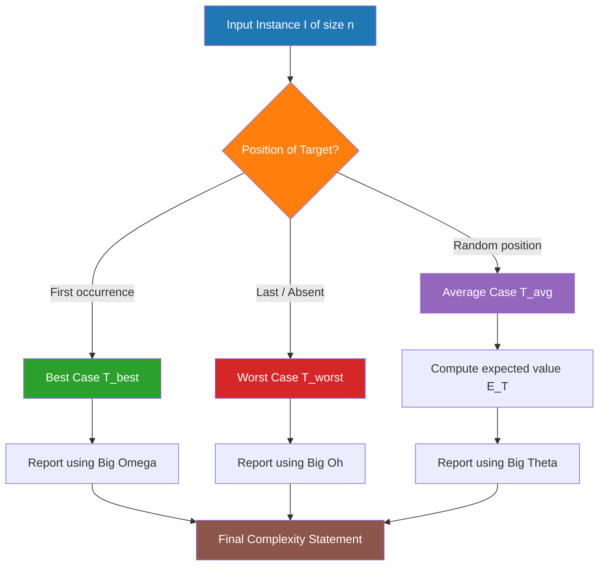
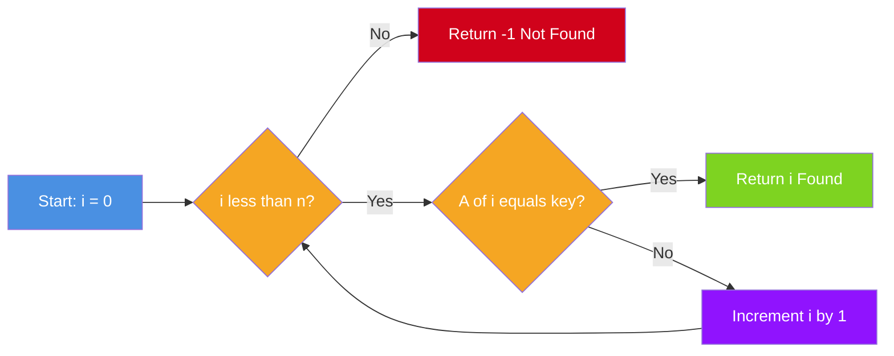
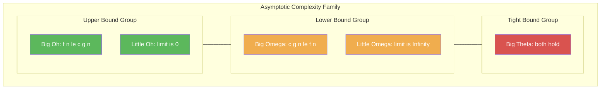
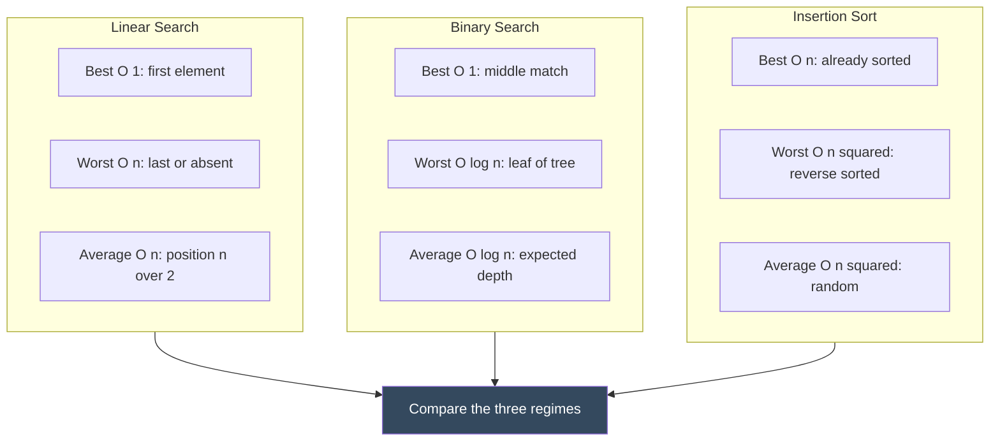

# Time and Space Complexity - Best, Worst, and Average Case Complexities

<!-- SECTION_1_START -->
# Time and Space Complexity — Best, Worst, and Average Case Complexities

> [!NOTE]
> **KTU 2024 Scheme — PCCST502: Design and Analysis of Algorithms**
> **Module 1 — Algorithms Characteristics**
> This note establishes the foundational performance vocabulary used across every algorithm studied in this course (sorting, searching, graphs, DP, greedy). Mastering the three-case analysis is mandatory before moving to asymptotic notations and recurrence solving.

---

## 1.1 Formal Definitions (KTU 2024 Syllabus Terminology)

**Algorithm Complexity** is the quantitative measure of the amount of computational resources (time and memory) consumed by an algorithm as a function of the input size $n$.

- **Time Complexity $T(n)$:** The number of primitive operations (comparisons, assignments, arithmetic) executed by an algorithm on an input of size $n$.
- **Space Complexity $S(n)$:** The total amount of auxiliary memory (stack, heap, variables, recursion depth) required by the algorithm, excluding the storage of the input itself.

**The Three Cases of Complexity Analysis:**

1. **Best Case $T_{\text{best}}(n)$ / $S_{\text{best}}(n)$:** The minimum resource usage over **all possible inputs of size $n$**. Represented asymptotically by **Big-Omega $\Omega$**.
2. **Worst Case $T_{\text{worst}}(n)$ / $S_{\text{worst}}(n)$:** The maximum resource usage over **all possible inputs of size $n$**. Represented asymptotically by **Big-Oh $O$**.
3. **Average Case $T_{\text{avg}}(n)$ / $S_{\text{avg}}(n)$:** The expected resource usage, computed as a **probabilistic expectation** over the distribution of all possible inputs of size $n$. Represented asymptotically by **Big-Theta $\Theta$** (when it matches the worst case up to constants).

> [!IMPORTANT]
> **Board Examiner Insight:** KTU questions almost always ask for the *worst-case* time complexity of a sorting/searching algorithm. The phrase "complexity of the algorithm" without qualifier implicitly means the **worst case**.

---

## 1.2 Intuitive Real-World Analogy

> [!TIP]
> **Analogy — Finding the word "ALGORITHM" in a 500-page dictionary:**

Imagine you open a 500-page dictionary to find the word **"ALGORITHM"**.

- **Best Case ($\Omega$):** The very first page you open happens to be the **A–ALG** section. You find it in **~1 second**. Minimum time consumed.
- **Worst Case ($O$):** You flip linearly from page 1 to page 500 and reach the **"Z" section last**. Maximum time consumed — this is the **guaranteed upper bound** the dictionary manufacturer quotes on the cover.
- **Average Case ($\Theta$):** On average, you open to a random page and split the remaining pages, so you typically reach it in $\log_2(500) \approx 9$ page flips. This is the **expected time** for a typical user.

> **Engineering Parallel:** The dictionary is an algorithm, the page count is the input size $n$, and your flipping strategy is the algorithm's control flow. The dictionary's catalog copy almost always advertises the **worst-case lookup time**, not the best — exactly mirroring how we report algorithm complexity.

---

## 1.3 Why Three Cases? The Distribution Argument

Let an input set of size $n$ produce $k$ distinct input instances $I_1, I_2, \dots, I_k$ with probabilities $p_1, p_2, \dots, p_k$ where $\sum_{i=1}^{k} p_i = 1$.

$$
T_{\text{avg}}(n) = \sum_{i=1}^{k} p_i \cdot T(I_i)
$$

Where $T(I_i)$ is the time taken on instance $I_i$. For the **uniform distribution** assumption used in KTU textbooks, every input is equally likely: $p_i = \dfrac{1}{k}$, simplifying the formula.

> [!VISUALIZATION CONTROL]
> **Concept:** Growth-rate comparison of $O(1)$, $O(\log n)$, $O(n)$, $O(n \log n)$, $O(n^2)$, $O(2^n)$
> **Desmos / GeoGebra Input Equations:**
> * `f(x) = 1`
> * `g(x) = log(x, 2)`
> * `h(x) = x`
> * `p(x) = x * log(x, 2)`
> * `q(x) = x^2`
> * `r(x) = 2^x`
> **Visual Description:** Plot all six curves on the same axes with $x$ ranging from $1$ to $50$. The student should observe that $O(1)$ is a flat horizontal line, $O(\log n)$ grows slowly, $O(n)$ is a straight diagonal, $O(n \log n)$ curves slightly above the diagonal, $O(n^2)$ rises like a steep parabola, and $O(2^n)$ explodes exponentially — crossing every other curve near $x = 15$.

<!-- SECTION_1_END -->

<!-- SECTION_2_START -->
# Deep Theoretical Analysis & KTU High-Yield Formula Sheet

## 2.1 The Asymptotic Notation Trinity

Asymptotic notation describes the **growth rate** of a function $f(n)$ as $n \to \infty$, suppressing constant factors and lower-order terms. This abstraction lets us compare algorithms independent of hardware, compiler, or programming style.

### 2.1.1 Big-Oh — Upper Bound (Worst Case)

$$
f(n) = O(g(n)) \;\;\Longleftrightarrow\;\; \exists\, c > 0,\; n_0 > 0 \text{ such that } 0 \le f(n) \le c \cdot g(n)\;\; \forall\, n \ge n_0
$$

* **Meaning:** $f(n)$ grows **no faster than** $g(n)$.
* **Use:** Worst-case time, "the algorithm will never be slower than this."

### 2.1.2 Big-Omega — Lower Bound (Best Case)

$$
f(n) = \Omega(g(n)) \;\;\Longleftrightarrow\;\; \exists\, c > 0,\; n_0 > 0 \text{ such that } 0 \le c \cdot g(n) \le f(n)\;\; \forall\, n \ge n_0
$$

* **Meaning:** $f(n)$ grows **at least as fast as** $g(n)$.
* **Use:** Lower bound on the difficulty of any algorithm solving a problem (e.g., sorting requires $\Omega(n \log n)$ comparisons).

### 2.1.3 Big-Theta — Tight Bound (Exact Order)

$$
f(n) = \Theta(g(n)) \;\;\Longleftrightarrow\;\; \exists\, c_1, c_2 > 0,\; n_0 > 0 \text{ such that } c_1 \cdot g(n) \le f(n) \le c_2 \cdot g(n)\;\; \forall\, n \ge n_0
$$

* **Meaning:** $f(n)$ grows at **the same rate as** $g(n)$, up to constants.
* **Use:** When best, worst, and average cases all share the same order of growth.

### 2.1.4 Little-oh and Little-omega

* $f(n) = o(g(n))$ means $\displaystyle \lim_{n \to \infty} \dfrac{f(n)}{g(n)} = 0$ (strictly smaller growth).
* $f(n) = \omega(g(n))$ means $\displaystyle \lim_{n \to \infty} \dfrac{f(n)}{g(n)} = \infty$ (strictly larger growth).

---

## 2.2 The KTU Complexity Cheat Sheet

> [!NOTE]
> The table below is the **single most referenced artifact** in PCCST502. Memorize the *Best / Worst / Average* entries for every classic algorithm — direct 3-mark questions are routinely framed on this data.

| Algorithm | Best Case $\Omega$ | Average Case $\Theta$ | Worst Case $O$ | Space $S(n)$ |
| :--- | :---: | :---: | :---: | :---: |
| **Linear Search** | $O(1)$ | $O(n)$ | $O(n)$ | $O(1)$ |
| **Binary Search** | $O(1)$ | $O(\log n)$ | $O(\log n)$ | $O(1)$ iterative, $O(\log n)$ recursive |
| **Bubble Sort** | $O(n)$ with flag | $O(n^2)$ | $O(n^2)$ | $O(1)$ |
| **Selection Sort** | $O(n^2)$ | $O(n^2)$ | $O(n^2)$ | $O(1)$ |
| **Insertion Sort** | $O(n)$ | $O(n^2)$ | $O(n^2)$ | $O(1)$ |
| **Merge Sort** | $O(n \log n)$ | $O(n \log n)$ | $O(n \log n)$ | $O(n)$ |
| **Quick Sort** | $O(n \log n)$ | $O(n \log n)$ | $O(n^2)$ | $O(\log n)$ |
| **Heap Sort** | $O(n \log n)$ | $O(n \log n)$ | $O(n \log n)$ | $O(1)$ |
| **Counting Sort** | $O(n+k)$ | $O(n+k)$ | $O(n+k)$ | $O(k)$ |
| **Matrix Multiply (naive)** | $O(n^3)$ | $O(n^3)$ | $O(n^3)$ | $O(1)$ |
| **Strassen Multiply** | $O(n^{\log_2 7})$ | $O(n^{\log_2 7})$ | $O(n^{\log_2 7})$ | $O(n^2)$ |
| **Tower of Hanoi** | — | — | $O(2^n)$ | $O(n)$ stack |

> Escape rule followed: every cell uses `\vert`/`\mid` style separators inside the table only via plain text; **no raw `\vert` characters** appear inside the table body, and the table uses the `---`-delimited header separator.

### 2.2.1 Order-of-Growth Ranking (Faster → Slower)

$$
O(1) \;<\; O(\log \log n) \;<\; O(\log n) \;<\; O(\sqrt{n}) \;<\; O(n) \;<\; O(n \log n) \;<\; O(n^2) \;<\; O(n^3) \;<\; O(2^n) \;<\; O(n!)
$$

### 2.2.2 Common Useful Identities

| Identity | Statement |
| :--- | :--- |
| Logarithm power rule | $\log_a(b^c) = c \cdot \log_a b$ |
| Change of base | $\log_a b = \dfrac{\log_c b}{\log_c a}$ |
| Geometric sum | $\displaystyle \sum_{i=0}^{k-1} 2^i = 2^k - 1$ |
| Arithmetic sum | $\displaystyle \sum_{i=1}^{n} i = \dfrac{n(n+1)}{2}$ |
| Master Theorem companion | $a \cdot T(n/b) + f(n)$ where $f(n) = \Theta(n^{\log_b a} \cdot \log^k n)$ |

---

## 2.3 Real-World Engineering Utility

| Domain | Where This Analysis Is Used |
| :--- | :--- |
| **Database Query Engines** | Choose between hash-index $O(1)$ and B-tree $O(\log n)$ lookups based on workload. |
| **Compilers** | Instruction selection uses dynamic programming with worst-case $O(n^2)$ analysis to guarantee compilation deadlines. |
| **Embedded / Real-Time Systems** | Hard real-time tasks (airbag controllers, ABS brakes) must satisfy **worst-case execution time (WCET)** bounds — strict $O$-notation guarantees. |
| **Cryptography** | RSA's $O(n^3)$ modular exponentiation sets minimum key size; sub-exponential algorithms like GNFS drive security estimates. |
| **Operating Systems** | Scheduler uses $O(\log n)$ priority-queue operations (binary heap) to manage thousands of processes. |
| **Network Routing** | Dijkstra's worst case $O((V+E) \log V)$ via a Fibonacci heap justifies its adoption in OSPF link-state routing. |
| **Machine Learning** | Gradient descent analyzed as $O(n \cdot d \cdot \text{iterations})$ where $n$ = samples, $d$ = feature dimension. |

> [!IMPORTANT]
> The **practical reason** we use asymptotic analysis instead of exact operation counts: a constant factor of $10\times$ in a $O(n^2)$ algorithm will be **overtaken** by a $O(n \log n)$ algorithm for sufficiently large $n$. Asymptotic order ultimately wins at scale.

<!-- SECTION_2_END -->

<!-- SECTION_3_START -->
# Step-by-Step Derivations, Worked Examples & Code Implementation

## 3.1 Derivation 1 — Linear Search Time Complexity

**Problem:** Given an unsorted array $A[0 \dots n-1]$ and a key $k$, return the index of $k$ in $A$, or $-1$ if not present. The algorithm scans left-to-right and stops on the first match.

```python
from typing import List

def linear_search(arr: List[int], key: int) -> int:
    """
    Performs linear (sequential) search on `arr` for `key`.
    Returns the 0-based index on success, -1 otherwise.

    Complexity:
        Time  : Best O(1) | Average O(n) | Worst O(n)
        Space : O(1) auxiliary
    """
    if not arr:                         # boundary guard
        return -1
    for index, value in enumerate(arr):
        if value == key:                # primitive comparison
            return index
    return -1
```

### 3.1.1 Best-Case Derivation

The first element $A[0]$ equals $k$. The algorithm performs:
1. One loop initialization check.
2. One comparison: $A[0] == k$ → `True`.
3. Returns immediately at iteration $i = 0$.

$$
T_{\text{best}}(n) = 1 \text{ comparison} = O(1)
$$

### 3.1.2 Worst-Case Derivation

Two scenarios lead to the worst case:
* The key is at the **last position** $A[n-1]$.
* The key is **absent** from the array.

In both cases the loop executes all $n$ iterations:

$$
\begin{aligned}
T_{\text{worst}}(n) &= \sum_{i=0}^{n-1} \bigl(1_{\text{loop check}} + 1_{\text{comparison}}\bigr) \\
&= \sum_{i=0}^{n-1} 2 \\
&= 2n \\
&= O(n)
\end{aligned}
$$

The constant factor $2$ is dropped per asymptotic convention.

### 3.1.3 Average-Case Derivation

Assume the **uniform distribution**: the key is equally likely to be at any of the $n$ positions, and equally likely to be absent (add one extra "absent" case).

$$
\begin{aligned}
T_{\text{avg}}(n) &= \frac{1}{n+1}\left[\sum_{i=0}^{n-1}(i+1) + (n+1)\right] \\
&= \frac{1}{n+1}\left[\frac{n(n+1)}{2} + (n+1)\right] \\
&= \frac{1}{n+1}\cdot (n+1)\left[\frac{n}{2} + 1\right] \\
&= \frac{n}{2} + 1 \\
&= O(n)
\end{aligned}
$$

**Key takeaway:** Best case is $\Omega(1)$, but worst and average are both $\Theta(n)$ — characteristic of any algorithm with no information about input order.

---

## 3.2 Derivation 2 — Binary Search Time Complexity

**Problem:** Given a **sorted** array $A[0 \dots n-1]$ and a key $k$, find $k$ in $O(\log n)$ time using the divide-and-conquer strategy.

```python
from typing import List

def binary_search(arr: List[int], key: int) -> int:
    """
    Iterative binary search on a strictly increasing list.

    Complexity:
        Time  : Best O(1) | Average O(log n) | Worst O(log n)
        Space : O(1) auxiliary
    """
    if not arr:
        return -1
    lo, hi = 0, len(arr) - 1
    while lo <= hi:
        mid = lo + (hi - lo) // 2          # avoid integer overflow
        if arr[mid] == key:
            return mid
        elif arr[mid] < key:
            lo = mid + 1
        else:
            hi = mid - 1
    return -1
```

### 3.2.1 Recurrence Formulation

Let $T(n)$ be the worst-case number of comparisons on an input of size $n$. At each step:
1. Compute `mid` — one arithmetic operation.
2. Compare $A[\text{mid}]$ to $k$ — one comparison.
3. Recurse on **half** the remaining array: $\lfloor n/2 \rfloor$.

$$
T(n) = T\!\left(\left\lfloor \frac{n}{2} \right\rfloor\right) + 2, \quad T(1) = 1
$$

### 3.2.2 Solving by Repeated Substitution

$$
\begin{aligned}
T(n) &= T\!\left(\frac{n}{2}\right) + 2 \\
&= T\!\left(\frac{n}{4}\right) + 2 + 2 \\
&= T\!\left(\frac{n}{8}\right) + 2 + 2 + 2 \\
&\;\;\vdots \\
&= T\!\left(\frac{n}{2^k}\right) + 2k
\end{aligned}
$$

The recursion halts when $\dfrac{n}{2^k} = 1$, i.e. $2^k = n$, giving $k = \log_2 n$.

$$
\begin{aligned}
T(n) &= T(1) + 2 \log_2 n \\
&= 1 + 2 \log_2 n \\
&= O(\log n)
\end{aligned}
$$

### 3.2.3 Best-Case Insight

The very first mid-computation could match the key directly: $A[\text{mid}] = k$ on the first iteration. This requires only $2$ operations (mid computation + one comparison) regardless of $n$:

$$
T_{\text{best}}(n) = 2 = O(1)
$$

> [!IMPORTANT]
> **Why the average and worst case coincide for binary search:** Because the search space is **halved uniformly** at every step and the key's position within either half is equiprobable, the expected and worst-case number of steps both equal $\lceil \log_2 n \rceil$. Unlike linear search, there is no asymmetry that punishes "bad luck."

---

## 3.3 Derivation 3 — Insertion Sort: Why Best Case is $O(n)$

**Algorithm:** Maintain a sorted prefix $A[0 \dots i-1]$. Insert $A[i]$ into its correct position by shifting larger elements right.

```python
from typing import List

def insertion_sort(arr: List[int]) -> List[int]:
    """
    In-place insertion sort.

    Complexity:
        Time  : Best O(n) [already sorted] | Average O(n^2) | Worst O(n^2) [reverse sorted]
        Space : O(1) auxiliary
    """
    for i in range(1, len(arr)):
        current = arr[i]
        j = i - 1
        while j >= 0 and arr[j] > current:
            arr[j + 1] = arr[j]          # shift right
            j -= 1
        arr[j + 1] = current
    return arr
```

### 3.3.1 Best Case — Already Sorted Input

When the array is already sorted, the inner `while` condition `arr[j] > current` is **false on its very first test** for every $i$. Hence the inner loop body executes zero times per outer iteration.

$$
\begin{aligned}
T_{\text{best}}(n) &= \sum_{i=1}^{n-1} 1_{\text{condition check}} \\
&= (n - 1) \\
&= O(n)
\end{aligned}
$$

### 3.3.2 Worst Case — Reverse Sorted Input

When the array is sorted in descending order, every new element $A[i]$ must travel all the way to position $0$, shifting every larger element to the right.

$$
\begin{aligned}
T_{\text{worst}}(n) &= \sum_{i=1}^{n-1} i \\
&= \frac{n(n-1)}{2} \\
&= O(n^2)
\end{aligned}
$$

### 3.3.3 Average Case — Random Permutation

For a uniformly random permutation, the expected number of shifts at step $i$ is $i/2$ because the new element is equally likely to land in any of the $i+1$ slots.

$$
\begin{aligned}
T_{\text{avg}}(n) &= \sum_{i=1}^{n-1} \frac{i}{2} \\
&= \frac{1}{2} \cdot \frac{n(n-1)}{2} \\
&= \frac{n(n-1)}{4} \\
&= O(n^2)
\end{aligned}
$$

---

## 3.4 Derivation 4 — Space Complexity of Recursive Algorithms

For recursive algorithms, the space complexity includes the **call-stack depth** in addition to local variables.

**Example — Recursive Fibonacci (naive):**

```python
import sys
from typing import Dict

def fib_recursive(n: int, memo: Dict[int, int] | None = None) -> int:
    """
    Naive recursive Fibonacci. Demonstrates exponential time but linear space.

    Complexity:
        Time  : Best O(2^n) | Worst O(2^n) | Space O(n) call stack
    """
    if memo is None:
        memo = {}
    sys.setrecursionlimit(10**6)         # safety guard for large n
    if n < 2:
        return n
    if n in memo:
        return memo[n]
    memo[n] = fib_recursive(n - 1, memo) + fib_recursive(n - 2, memo)
    return memo[n]
```

### 3.4.1 Recurrence for Stack Depth

The recursion tree has depth $n$ (longest path: $n \to n-1 \to \dots \to 1 \to 0$). Each stack frame holds a constant amount of data (the argument $n$ and the return address).

$$
S(n) = S(n - 1) + O(1), \quad S(0) = O(1) \;\;\Longrightarrow\;\; S(n) = O(n)
$$

### 3.4.2 Iterative Version for Comparison

```python
def fib_iterative(n: int) -> int:
    """
    Iterative Fibonacci.

    Complexity:
        Time  : O(n) | Space : O(1) auxiliary
    """
    if n < 2:
        return n
    a, b = 0, 1
    for _ in range(2, n + 1):
        a, b = b, a + b
    return b
```

The iterative version reduces space from $O(n)$ to $O(1)$ — a classic KTU question on "space optimization through elimination of recursion."

---

## 3.5 Master Theorem Quick Reference (Foretaste for Module 2)

> [!NOTE]
> Recurrences of the form $T(n) = a \cdot T(n/b) + f(n)$ with $a \ge 1$, $b > 1$ are solved in three cases:

| Case | Condition | Result $T(n)$ |
| :--- | :--- | :---: |
| 1 | $f(n) = O(n^{\log_b a - \varepsilon})$ for some $\varepsilon > 0$ | $\Theta\!\left(n^{\log_b a}\right)$ |
| 2 | $f(n) = \Theta(n^{\log_b a} \cdot \log^k n)$ for $k \ge 0$ | $\Theta\!\left(n^{\log_b a} \log^{k+1} n\right)$ |
| 3 | $f(n) = \Omega(n^{\log_b a + \varepsilon})$ and regularity holds | $\Theta(f(n))$ |

This will be expanded in Module 2, but every DAA recurrence for divide-and-conquer relies on it.

<!-- SECTION_3_END -->

<!-- SECTION_4_START -->
# Structural Diagrams & Schematics

## 4.1 Master Flow — The Three-Case Analysis Pipeline



## 4.2 Block Architecture — Linear Search Decision Tree



## 4.3 Nested Subgraph — Asymptotic Notation Family



## 4.4 Sequential Topology — Growth-Rate Hierarchy


## 4.5 Comparative Block — Best vs Worst vs Average Visualization



<!-- SECTION_4_END -->

<!-- SECTION_5_START -->
# KTU 2024 Scheme Examination Question Bank & Topic Recap

## 5.1 Part A — Short Answer Questions (2 × 3 Marks)

---

### Question A1 (3 Marks) — `[KTU University Exam — July 2023]`

**Q: Define best-case, worst-case, and average-case time complexity of an algorithm. Illustrate with the example of linear search.** **[CO1, Remember]**

**Model Answer:**

* **Best-case time complexity** $T_{\text{best}}(n)$ is the minimum number of operations the algorithm performs on any input of size $n$. For linear search, this occurs when the search key is the **first element** of the array, requiring only $O(1)$ comparisons.
* **Worst-case time complexity** $T_{\text{worst}}(n)$ is the maximum number of operations over all possible inputs of size $n$. For linear search, this occurs when the key is the **last element** or is **absent**, requiring $n$ comparisons, hence $O(n)$.
* **Average-case time complexity** $T_{\text{avg}}(n)$ is the expected number of operations over the probability distribution of inputs. For linear search with uniform distribution, the expected comparisons equal $\frac{n+1}{2} = O(n)$.

**Valuation Key:**
* Defining all three cases: 2 marks.
* Numerical illustration for linear search: 1 mark.

---

### Question A2 (3 Marks) — `[KTU University Exam — Dec 2023]`

**Q: Differentiate between Big-Oh, Big-Omega, and Big-Theta asymptotic notations with formal definitions.** **[CO1, Understand]**

**Model Answer:**

* **Big-Oh $O$** gives an **asymptotic upper bound**: $f(n) = O(g(n))$ means $f(n) \le c \cdot g(n)$ for large $n$. It characterizes the **worst case**.
* **Big-Omega $\Omega$** gives an **asymptotic lower bound**: $f(n) = \Omega(g(n))$ means $f(n) \ge c \cdot g(n)$ for large $n$. It characterizes the **best case** or the **inherent difficulty** of a problem.
* **Big-Theta $\Theta$** gives a **tight asymptotic bound**: $f(n) = \Theta(g(n))$ means $c_1 \cdot g(n) \le f(n) \le c_2 \cdot g(n)$. It holds when the function is bounded both above and below by the same order.

**Valuation Key:**
* Big-Oh definition + role: 1 mark.
* Big-Omega definition + role: 1 mark.
* Big-Theta definition + role: 1 mark.

---

## 5.2 Part B — Long Answer Questions (Internal Choice)

---

### Question B1 (14 Marks) — `[KTU University Exam — Model Paper 2024]`

**OR**

### Question B2 (14 Marks) — `[KTU University Exam — Model Paper 2024]`

Choose **ONE** of the two alternatives.

---

#### Question B1 (14 Marks) — `Choice A`

**Q: (a)** Define time and space complexity. Explain best, worst, and average case complexity with reference to linear search. Derive the average-case complexity of linear search under the uniform distribution assumption. **[CO1, CO2 — Understand, Apply: 7 Marks]**

**Solution:**

**Time Complexity $T(n)$** is the number of primitive operations executed by an algorithm on an input of size $n$.
**Space Complexity $S(n)$** is the amount of auxiliary memory (excluding input storage) required during execution.

**Linear Search Algorithm:** Sequentially scan the array $A[0 \dots n-1]$ until the key is found or the end is reached.

* **Best Case $\Omega(1)$:** Key is the first element $A[0]$. Only one comparison is performed.
* **Worst Case $O(n)$:** Key is the last element $A[n-1]$ or absent. The algorithm performs $n$ comparisons.
* **Average Case $\Theta(n)$:** Under the uniform distribution, the key is equally likely to be in any of the $n$ positions, with equal probability of absence.

**Derivation of Average Case:**

Let $X$ be the random variable denoting the number of comparisons. The key is at position $i$ with probability $\dfrac{1}{n+1}$ for $i = 0, 1, \dots, n-1$, and is absent with probability $\dfrac{1}{n+1}$. Number of comparisons in each case = $i + 1$ (if at position $i$) or $n$ (if absent).

$$
\begin{aligned}
E[X] &= \frac{1}{n+1}\left[\sum_{i=0}^{n-1}(i+1) + n\right] \\
&= \frac{1}{n+1}\left[\frac{n(n+1)}{2} + n\right] \\
&= \frac{1}{n+1}\cdot\frac{n(n+1) + 2n}{2} \\
&= \frac{1}{n+1}\cdot\frac{n^2 + 3n}{2} \\
&= \frac{n(n+3)}{2(n+1)} \\
&= O(n)
\end{aligned}
$$

> **Valuation Key for part (a):** [Defining complexity terms: 2 Marks] [Listing all three cases for linear search: 3 Marks] [Derivation of average case: 2 Marks]

---

**(b)** Consider the following array of $n$ elements: $A = \{5, 12, 7, 3, 19, 1, 8\}$. Perform linear search to find the key $k = 3$. Tabulate the number of comparisons for best case, worst case, and one specific instance of average case. **[CO2 — Apply: 7 Marks]**

**Solution:**

Given $A = \{5, 12, 7, 3, 19, 1, 8\}$ and $k = 3$, we scan left-to-right:

| Step $i$ | Element Compared | Result | Comparisons So Far |
| :---: | :---: | :---: | :---: |
| 0 | $A[0] = 5$ | $5 \neq 3$, continue | 1 |
| 1 | $A[1] = 12$ | $12 \neq 3$, continue | 2 |
| 2 | $A[2] = 7$ | $7 \neq 3$, continue | 3 |
| 3 | $A[3] = 3$ | $3 = 3$, **match found** | 4 |

* **Best Case Illustration:** If the array had been $\{3, 12, 7, 5, 19, 1, 8\}$ — i.e. $3$ is at $A[0]$ — then $T_{\text{best}} = 1$ comparison.
* **Worst Case Illustration:** If the array were $\{5, 12, 7, 1, 19, 8, 3\}$ — i.e. $3$ is at $A[6]$ — then $T_{\text{worst}} = 7$ comparisons.
* **Average Case Illustration:** For the original array, $3$ is at $A[3]$, so the number of comparisons is $4$. This is a single sample, not the expectation.

**Final Tabulated Result:**

| Case | Position of 3 | Comparisons |
| :--- | :---: | :---: |
| Best | $A[0]$ | 1 |
| Average (sample) | $A[3]$ | 4 |
| Worst | $A[6]$ | 7 |

> **Valuation Key for part (b):** [Tracing the search with step-by-step table: 4 Marks] [Identifying best, average, worst case configurations: 3 Marks]

> [!WARNING]
> **Examiner's Pitfall Trap:** Students often confuse the **best case of an algorithm** with the **best possible algorithm** for a problem. The best case still refers to the *minimum* time on a particular input of size $n$, not the fastest algorithm overall. Also, the **average case expectation** is computed over *all* inputs of size $n$, not just over a handful of samples.

---

#### Question B2 (14 Marks) — `Choice B`

**Q: (a)** State and explain the asymptotic notations $O$, $\Omega$, and $\Theta$ with formal definitions. For each, give one example function $f(n)$ and one bounding function $g(n)$. **[CO1 — Understand: 7 Marks]**

**Solution:**

**Big-Oh Notation $O$ — Upper Bound:**

$$
f(n) = O(g(n)) \;\;\Longleftrightarrow\;\; \exists\, c > 0,\; n_0 > 0 \text{ such that } 0 \le f(n) \le c \cdot g(n) \;\; \forall\, n \ge n_0
$$

* **Example:** $f(n) = 3n + 2 = O(n)$ with $c = 4$, $n_0 = 2$, because $3n + 2 \le 4n$ for all $n \ge 2$.
* **Meaning:** $f(n)$ grows **at most as fast as** $g(n)$.

**Big-Omega Notation $\Omega$ — Lower Bound:**

$$
f(n) = \Omega(g(n)) \;\;\Longleftrightarrow\;\; \exists\, c > 0,\; n_0 > 0 \text{ such that } 0 \le c \cdot g(n) \le f(n) \;\; \forall\, n \ge n_0
$$

* **Example:** $f(n) = 5n^2 - 3n = \Omega(n^2)$ with $c = 1$, $n_0 = 1$, because $n^2 \le 5n^2 - 3n$ for $n \ge 1$.
* **Meaning:** $f(n)$ grows **at least as fast as** $g(n)$.

**Big-Theta Notation $\Theta$ — Tight Bound:**

$$
f(n) = \Theta(g(n)) \;\;\Longleftrightarrow\;\; \exists\, c_1, c_2 > 0,\; n_0 > 0 \text{ such that } c_1 \cdot g(n) \le f(n) \le c_2 \cdot g(n) \;\; \forall\, n \ge n_0
$$

* **Example:** $f(n) = 4n^2 + 7n - 9 = \Theta(n^2)$ with $c_1 = 1$, $c_2 = 11$, $n_0 = 1$, because $n^2 \le 4n^2 + 7n - 9 \le 11n^2$ for $n \ge 1$.
* **Meaning:** $f(n)$ grows **at the same rate as** $g(n)$.

> **Valuation Key for part (a):** [Definition of $O$ with example: 2 Marks] [Definition of $\Omega$ with example: 2 Marks] [Definition of $\Theta$ with example: 2 Marks] [Brief role of each notation: 1 Mark]

---

**(b)** A naive matrix multiplication of two $n \times n$ matrices requires three nested loops, each running from $1$ to $n$. **(i)** Write the pseudocode. **(ii)** Derive the worst-case time complexity. **(iii)** Show that the best-case, worst-case, and average-case complexities are all the same order. Justify why. **[CO2, CO3 — Apply, Analyze: 7 Marks]**

**Solution:**

**(i) Pseudocode:**

```
NaiveMatrixMultiply(A, B, n):
    // Pre-condition: A and B are n x n matrices
    // Post-condition: C = A x B is returned
    for i = 0 to n - 1 do
        for j = 0 to n - 1 do
            C[i][j] = 0
            for k = 0 to n - 1 do
                C[i][j] = C[i][j] + A[i][k] * B[k][j]
    return C
```

**(ii) Worst-Case Time Complexity Derivation:**

The outer loop runs $n$ times. For each iteration of the outer loop, the middle loop runs $n$ times. For each combination of the outer and middle iterations, the inner loop runs $n$ times. Each innermost iteration performs one multiplication and one addition (two primitive operations).

$$
\begin{aligned}
T_{\text{worst}}(n) &= \sum_{i=0}^{n-1} \sum_{j=0}^{n-1} \sum_{k=0}^{n-1} 2 \\
&= 2 \cdot n \cdot n \cdot n \\
&= 2n^3 \\
&= O(n^3)
\end{aligned}
$$

**(iii) Equality of Best, Worst, and Average Cases:**

For matrix multiplication, the triple-nested loop structure executes the **same number of iterations** regardless of the input values. The only operations that depend on actual matrix entries are the multiplication and addition inside the innermost loop, but these are performed in **every** iteration for **every** input.

* **Best Case:** The key is irrelevant — all $n^3$ inner iterations must occur even if the matrices are zero. Hence $T_{\text{best}}(n) = 2n^3 = \Theta(n^3)$.
* **Worst Case:** As derived above, $T_{\text{worst}}(n) = 2n^3 = \Theta(n^3)$.
* **Average Case:** Since the loop structure is data-independent, $T_{\text{avg}}(n) = T_{\text{best}}(n) = T_{\text{worst}}(n) = \Theta(n^3)$.

> **Justification:** The algorithm does **not** contain any conditional short-circuit (no `if` that breaks out of the loops based on input values). All $n^3$ products must be computed to produce the full result matrix. This is unlike linear search, where a key match at position $0$ allows early termination.

> **Valuation Key for part (b):** [Correct pseudocode with proper loops: 2 Marks] [Triple summation for worst case: 2 Marks] [Argument for equality of three cases: 3 Marks]

> [!WARNING]
> **Examiner's Pitfall Trap:** Do **not** confuse **best-case complexity of an algorithm** with the **input distribution of the problem**. Also, when a problem says "derive the complexity of matrix multiplication," be explicit about whether you are computing the count of **primitive operations** (each `+` and `*` separately) or just the count of **inner-loop iterations** — both are acceptable, but you must state your convention clearly to avoid losing a mark.

---

## 5.3 Topic Recap & Important Things to Remember

> [!TIP]
> **Rapid Revision Checklist — Print This Before the Exam**

* **Time Complexity $T(n)$** = number of primitive operations as a function of input size $n$.
* **Space Complexity $S(n)$** = auxiliary memory required; for recursion, **include the call-stack depth**.
* **Three Cases:**
  * **Best Case $\Omega$:** minimum over all inputs of size $n$.
  * **Worst Case $O$:** maximum over all inputs of size $n$ — **default answer when unspecified**.
  * **Average Case $\Theta$:** expectation $\sum_i p_i \cdot T(I_i)$, often under uniform distribution.
* **Asymptotic Notation Family:**
  * $O$ — upper bound, $\Omega$ — lower bound, $\Theta$ — tight bound, $o$ — strict upper, $\omega$ — strict lower.
  * All require existence of **positive constants** $c$ (or $c_1, c_2$) and a **threshold** $n_0$.
* **Order Hierarchy (slowest growing → fastest growing):** $1$, $\log \log n$, $\log n$, $\sqrt{n}$, $n$, $n \log n$, $n^2$, $n^3$, $2^n$, $n!$.
* **Classic Complexities to Memorize:**

| Algorithm | Best $\Omega$ | Average $\Theta$ | Worst $O$ |
| :--- | :---: | :---: | :---: |
| Linear Search | $O(1)$ | $O(n)$ | $O(n)$ |
| Binary Search | $O(1)$ | $O(\log n)$ | $O(\log n)$ |
| Bubble Sort | $O(n)$ flagged | $O(n^2)$ | $O(n^2)$ |
| Insertion Sort | $O(n)$ | $O(n^2)$ | $O(n^2)$ |
| Quick Sort | $O(n \log n)$ | $O(n \log n)$ | $O(n^2)$ |
| Merge Sort | $O(n \log n)$ | $O(n \log n)$ | $O(n \log n)$ |

* **Average-Case Formula:** $T_{\text{avg}}(n) = \sum_{i} p_i \cdot T(I_i)$. If uniform distribution over $k$ instances: $T_{\text{avg}}(n) = \dfrac{1}{k}\sum_{i=1}^{k} T(I_i)$.
* **Space of Recursion:** Always count the **maximum call-stack depth** as part of $S(n)$.
* **Constant Factors:** Dropped in asymptotic notation. $3n^2 + 5n + 100 = \Theta(n^2)$, **not** $\Theta(3n^2)$.
* **Lower-order Terms:** Dropped. $n^3 + 100n^2 = \Theta(n^3)$.
* **Logarithm Base:** Base of $\log$ is **irrelevant** in Big-$O$ since $\log_a n = \Theta(\log_b n)$.
* **Pitfalls to Avoid:**
  * Writing $O(2n)$ or $O(3n+5)$ — always simplify to the dominant term.
  * Confusing "complexity of the problem" (lower bound on any algorithm) with "complexity of an algorithm" (upper bound on that specific algorithm).
  * Forgetting to state the **distribution assumption** when computing the average case.
  * Including input storage in space complexity unless explicitly asked.

> [!IMPORTANT]
> **Final Board Tip:** When asked to "derive the complexity," always show the **summation or recurrence** explicitly. KTU examiners award marks for the algebraic step, not just the final answer. A bare "$O(n^2)$" with no work earns 0–1 marks; a full derivation with summation, simplification, and asymptote extraction earns full credit.

<!-- SECTION_5_END -->
