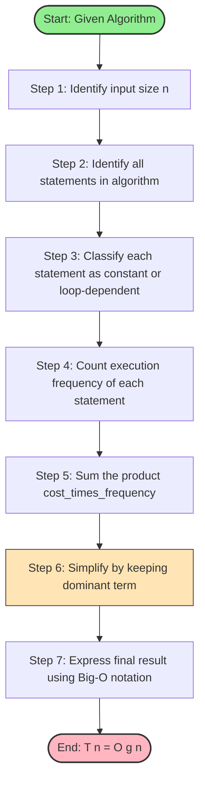
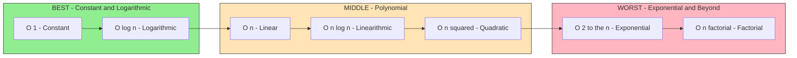
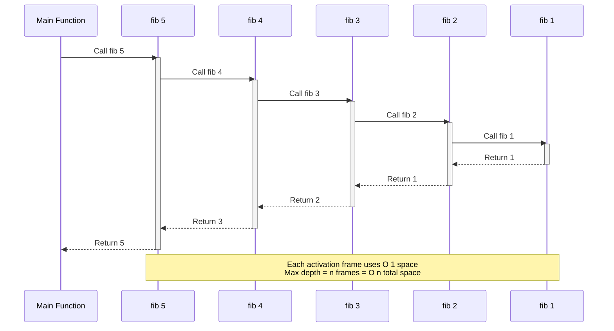
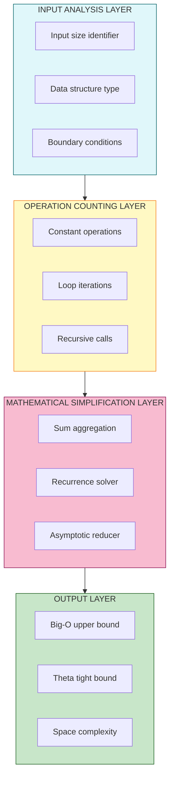
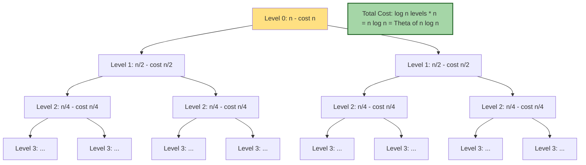

# Time and Space Complexity Calculation of simple algorithms

<!-- SECTION_1_START -->

# 1. Core Technical Definition & Intuitive Overview

## 1.1 Time Complexity

**Time Complexity** of an algorithm is a computational function $T(n)$ that quantifies the amount of **computational time** taken by an algorithm to run, as a function of the **length of the input** $n$. It is measured by counting the number of elementary operations (comparisons, assignments, arithmetic operations) executed by the algorithm.

Formally, time complexity describes how the **running time grows** as the input size $n$ increases, independent of hardware or programming language specifics. It is typically expressed using asymptotic notations such as **Big-O** ($O$), **Theta** ($\Theta$), and **Omega** ($\Omega$).

> [!NOTE]
> **KTU Syllabus Highlight (Module 1):** Time and Space Complexity is a foundational concept that bridges problem definition and algorithm design. Every algorithm you analyze in this course **must** be evaluated against these two metrics before judging its efficiency.

## 1.2 Space Complexity

**Space Complexity** of an algorithm is the total amount of **memory space** required by the algorithm during its execution, expressed as a function of the input size $n$. It includes:

1. **Fixed Part**: Space for instructions, constants, simple variables, etc. (independent of $n$).
2. **Variable Part**: Space for dynamic allocations — recursion stack, arrays whose size depends on $n$, heap memory, etc.

$$S(n) = c + S_{\text{variable}}(n)$$

where $c$ is a constant representing the fixed memory requirement.

## 1.3 Conceptual Analogy — The "Cooking Recipe" Intuition

> [!IMPORTANT]
> **Intuitive Analogy: Cooking a Meal for $n$ Guests**
>
> Imagine you are cooking dinner for $n$ guests.
>
> - **Time Complexity** $\equiv$ **Total time spent cooking.** If you double the guests, does your time double, quadruple, or grow logarithmically? A recipe that needs only one extra pot regardless of guests has $O(1)$ time (constant), while a recipe where each guest must taste every dish has $O(n^2)$ time.
>
> - **Space Complexity** $\equiv$ **Number of pots, pans, and bowls simultaneously on your stove.** Even if you finish cooking quickly, if you used 1000 bowls, your "space" was huge. A smart chef reuses bowls — this is *in-place* algorithm design.
>
> - **Asymptotic Notations** $\equiv$ **How the recipe scales for a stadium of guests.** You don't care about the exact minute — you care about the *growth pattern*.

This analogy clarifies the central trade-off: a faster algorithm may use more memory, and a memory-efficient one may be slower. KTU expects you to articulate this trade-off explicitly in design problems.

## 1.4 The Three Asymptotic Notations — A Preview

| Notation | Meaning | Bound Type |
| :--- | :--- | :--- |
| $O(g(n))$ | Upper bound | $\le c \cdot g(n)$ |
| $\Omega(g(n))$ | Lower bound | $\ge c \cdot g(n)$ |
| $\Theta(g(n))$ | Tight bound | $=$ both upper and lower |

> [!VISUALIZATION CONTROL]
> **Concept:** Comparative growth curves of common complexity functions.
> **GeoGebra / Desmos Input Equations:**
> * `f1(x) = 1` — Constant $O(1)$
> * `f2(x) = log(x) / log(2)` — Logarithmic $O(\log n)$
> * `f3(x) = x` — Linear $O(n)$
> * `f4(x) = x * log(x) / log(2)` — Linearithmic $O(n \log n)$
> * `f5(x) = x^2` — Quadratic $O(n^2)$
> * `f6(x) = 2^x` — Exponential $O(2^n)$
>
> **Visual Description:** The student should observe that for small $n$ (say $n < 10$), the curves are clustered together, but for $n > 50$, the exponential $2^x$ skyrockets while the logarithmic function remains nearly flat. This visually justifies why algorithm choice matters at scale.

<!-- SECTION_1_END -->

<!-- SECTION_2_START -->

# 2. Deep Theoretical Analysis & KTU High-Yield Formula Sheet

## 2.1 Asymptotic Notations — Formal Definitions

An algorithm's running time is a function $T(n) : \mathbb{N} \rightarrow \mathbb{R}^{+}$. The asymptotic behavior is captured by three notations:

### 2.1.1 Big-O Notation — $O(g(n))$

$$T(n) = O(g(n)) \iff \exists \; c > 0, \; n_0 > 0 \; \text{such that} \; T(n) \le c \cdot g(n) \; \forall \; n \ge n_0$$

**Meaning:** $T(n)$ grows **no faster** than $g(n)$ for sufficiently large $n$. This is the **upper bound** — it represents the *worst-case* scenario that engineers care about for reliability guarantees.

### 2.1.2 Omega Notation — $\Omega(g(n))$

$$T(n) = \Omega(g(n)) \iff \exists \; c > 0, \; n_0 > 0 \; \text{such that} \; T(n) \ge c \cdot g(n) \; \forall \; n \ge n_0$$

**Meaning:** $T(n)$ grows **at least as fast** as $g(n)$. This is the **lower bound** — it represents the *best-case* scenario or the theoretical minimum work any algorithm must do.

### 2.1.3 Theta Notation — $\Theta(g(n))$

$$T(n) = \Theta(g(n)) \iff \exists \; c_1, c_2 > 0, \; n_0 > 0 \; \text{such that} \; c_1 \cdot g(n) \le T(n) \le c_2 \cdot g(n) \; \forall \; n \ge n_0$$

**Meaning:** $T(n)$ grows at the **same rate** as $g(n)$, sandwiched between two constants. This is the **tight bound** — the most precise asymptotic description.

### 2.1.4 Little-o and Little-omega (Advanced Distinction)

$$T(n) = o(g(n)) \iff \lim_{n \to \infty} \frac{T(n)}{g(n)} = 0$$

$$T(n) = \omega(g(n)) \iff \lim_{n \to \infty} \frac{T(n)}{g(n)} = \infty$$

> [!NOTE]
> **Engineering Utility of Asymptotic Notations:**
> - **Production Systems:** Big-O is used to set SLAs (Service Level Agreements) — e.g., "search must complete in $O(\log n)$ time per query."
> - **Database Indexing:** B-trees are chosen over sorted arrays precisely because of $O(\log n)$ vs $O(n)$ access cost.
> - **Compiler Optimization:** Tight bounds ($\Theta$) help the compiler decide loop unrolling and inlining strategies.

## 2.2 Step-by-Step Logic for Complexity Calculation

To compute the complexity of any simple algorithm, follow this **5-step methodology**:

1. **Identify the input size** $n$ (size of array, length of string, number of nodes).
2. **Count the elementary operations** inside each statement (assignment $= 1$, comparison $= 1$, arithmetic $= 1$).
3. **Determine the loop structure** — single loop, nested loop, sequential, or recursive.
4. **Sum the operation counts** for each statement multiplied by the number of times it executes.
5. **Simplify** using dominant-term analysis — keep only the highest-order term and drop the constants.

## 2.3 The KTU High-Yield Formula Sheet

| Algorithm Construct | Operation Count $T(n)$ | Asymptotic Bound |
| :--- | :--- | :--- |
| Constant statements | $c$ | $O(1)$ |
| Single loop (i = 1 to n) | $c_1 \cdot n + c_2$ | $O(n)$ |
| Nested loop (i,j both 1 to n) | $c_1 \cdot n^2 + c_2 \cdot n + c_3$ | $O(n^2)$ |
| Nested loop (i to n, j to i) | $\sum_{i=1}^{n} i = \frac{n(n+1)}{2}$ | $O(n^2)$ |
| Loop with $i = i \times 2$ | $\log_2 n$ iterations | $O(\log n)$ |
| Divide and conquer recurrence | $T(n) = 2T(n/2) + n$ | $\Theta(n \log n)$ |
| Recurrence: Linear recurrence | $T(n) = T(n-1) + 1$ | $O(n)$ |
| Recurrence: Towers of Hanoi | $T(n) = 2T(n-1) + 1$ | $O(2^n)$ |
| Space: Recursion depth $n$ | $n$ stack frames | $O(n)$ |
| Space: In-place array operations | constant extra | $O(1)$ |

## 2.4 Common Complexity Classes — Ordered from Best to Worst

$$O(1) < O(\log n) < O(\sqrt{n}) < O(n) < O(n \log n) < O(n^2) < O(n^3) < O(2^n) < O(n!)$$

| Class | Name | Example Algorithm |
| :--- | :--- | :--- |
| $O(1)$ | Constant | Array index access |
| $O(\log n)$ | Logarithmic | Binary search |
| $O(n)$ | Linear | Linear search |
| $O(n \log n)$ | Linearithmic | Merge sort, Heap sort |
| $O(n^2)$ | Quadratic | Bubble sort, Selection sort |
| $O(2^n)$ | Exponential | Recursive Fibonacci (naive) |
| $O(n!)$ | Factorial | Brute-force Travelling Salesman |

> [!IMPORTANT]
> **Rule of Thumb for KTU Exams:** When simplifying $T(n)$, always drop the lower-order terms and the leading constants. For example, $T(n) = 5n^2 + 3n + 100$ simplifies to $\Theta(n^2)$.

<!-- SECTION_2_END -->

<!-- SECTION_3_START -->

# 3. Step-by-Step Derivations & Code/Symbolic Implementation

## 3.1 Worked Example 1 — Linear Search (Iterative)

### 3.1.1 Python Implementation with Type Hints

```python
from typing import List, Optional
import logging

logging.basicConfig(level=logging.INFO, format='%(asctime)s - %(levelname)s - %(message)s')

def linear_search(arr: List[int], key: int) -> Optional[int]:
    """
    Performs iterative linear search to find 'key' in 'arr'.
    Returns the index of the key if found, else None.
    
    Time Complexity:
        - Best Case (Omega): O(1) - key is the first element
        - Average Case (Theta): O(n)
        - Worst Case (Big-O): O(n) - key is absent or at the end
    
    Space Complexity: O(1) - only constant extra variables used
    """
    # ----- BOUNDARY CHECK -----
    if not arr:
        logging.warning("Empty array passed to linear_search.")
        return None
    
    n: int = len(arr)
    
    # ----- MAIN LOOP -----
    for i in range(n):                       # executes n times
        if arr[i] == key:                    # comparison: 1 op per iteration
            logging.info(f"Key {key} found at index {i}.")
            return i                         # early exit (best case)
    
    logging.info(f"Key {key} not found in array.")
    return None
```

### 3.1.2 Exhaustive Time Complexity Derivation

Let us count the number of elementary operations executed in the **worst case** (key not present):

| Statement | Cost per Execution | Times Executed | Total Cost |
| :--- | :---: | :---: | :---: |
| Boundary check `if not arr` | $1$ | $1$ | $1$ |
| `n = len(arr)` | $1$ | $1$ | $1$ |
| Loop initialization `i = 0` | $1$ | $1$ | $1$ |
| Loop condition `i < n` | $1$ | $n+1$ | $n+1$ |
| Loop body `arr[i] == key` | $1$ | $n$ | $n$ |
| Increment `i += 1` | $1$ | $n$ | $n$ |
| Return None (worst case) | $1$ | $1$ | $1$ |

Summing all the costs:

$$T(n) = 1 + 1 + 1 + (n+1) + n + n + 1$$

$$T(n) = 3n + 5$$

Applying asymptotic simplification (drop constants and lower-order terms):

$$T(n) = \Theta(n) \quad \text{and} \quad T(n) = O(n)$$

### 3.1.3 Space Complexity Derivation

The algorithm uses only:
- One integer variable `n`
- One loop counter `i`
- The input array `arr` (not counted as auxiliary space)

Total auxiliary space $= O(1)$.

## 3.2 Worked Example 2 — Bubble Sort

### 3.2.1 Python Implementation

```python
from typing import List
import logging

logging.basicConfig(level=logging.INFO, format='%(asctime)s - %(levelname)s - %(message)s')

def bubble_sort(arr: List[int]) -> List[int]:
    """
    Sorts 'arr' in ascending order using bubble sort.
    Returns the sorted array (operates in-place).
    
    Time Complexity:
        - Best Case: O(n) - already sorted (with optimization)
        - Worst Case: O(n^2) - reverse sorted
        - Average Case: O(n^2)
    
    Space Complexity: O(1) - in-place sorting
    """
    # ----- BOUNDARY CHECK -----
    if not arr or len(arr) <= 1:
        logging.info("Array has 0 or 1 elements; already sorted.")
        return arr
    
    n: int = len(arr)
    
    # ----- OUTER LOOP -----
    for i in range(n - 1):                       # executes (n-1) times
        swapped: bool = False
        
        # ----- INNER LOOP -----
        for j in range(n - 1 - i):               # executes (n-1-i) times
            if arr[j] > arr[j + 1]:              # comparison: 1 op
                # ----- SWAP -----
                arr[j], arr[j + 1] = arr[j + 1], arr[j]   # 3 ops
                swapped = True                    # 1 op
        
        if not swapped:                          # early termination
            logging.info(f"Array sorted early at pass {i + 1}.")
            break
    
    return arr
```

### 3.2.2 Exhaustive Time Complexity Derivation (Worst Case)

In the worst case (reverse-sorted array), the `swapped` flag never remains `False`, so both loops run to completion.

The number of comparisons in the inner loop, summed over the outer loop:

$$T(n) = \sum_{i=0}^{n-2} (n - 1 - i)$$

Let $k = n - 1 - i$. When $i = 0$, $k = n - 1$. When $i = n - 2$, $k = 1$.

$$T(n) = \sum_{k=1}^{n-1} k = \frac{(n-1) \cdot n}{2}$$

$$T(n) = \frac{n^2 - n}{2}$$

Including the swap operations (3 per swap in worst case):

$$T(n) = \frac{n^2 - n}{2} + 3 \cdot \frac{n^2 - n}{2} = 2(n^2 - n)$$

$$T(n) = 2n^2 - 2n$$

Applying asymptotic simplification:

$$T(n) = \Theta(n^2) \quad \text{and} \quad T(n) = O(n^2)$$

### 3.2.3 Space Complexity Derivation

Bubble sort performs **in-place** swapping using only:
- Loop counters `i` and `j`
- A boolean flag `swapped`
- A temporary swap tuple (implicit in Python's tuple unpacking)

Total auxiliary space $= O(1)$.

## 3.3 Worked Example 3 — Binary Search (Recursive)

### 3.3.1 Python Implementation

```python
from typing import List, Optional
import logging

logging.basicConfig(level=logging.INFO, format='%(asctime)s - %(levelname)s - %(message)s')

def binary_search(arr: List[int], key: int, low: int, high: int) -> Optional[int]:
    """
    Recursive binary search on a sorted array.
    Returns index of 'key' in 'arr[low..high]', else None.
    
    Time Complexity: Theta(log n) - halves the search space each call
    Space Complexity: O(log n) - recursion depth equals log n
    """
    # ----- BASE CASES -----
    if low > high:
        logging.info(f"Key {key} not found.")
        return None
    
    mid: int = low + (high - low) // 2         # safe midpoint (overflow-safe)
    
    if arr[mid] == key:
        logging.info(f"Key {key} found at index {mid}.")
        return mid
    elif arr[mid] > key:
        return binary_search(arr, key, low, mid - 1)   # recurse on left half
    else:
        return binary_search(arr, key, mid + 1, high)  # recurse on right half
```

### 3.3.2 Exhaustive Time Complexity Derivation

Let $T(n)$ be the time to search an array of size $n$. Each recursive call:
- Does a constant amount of work ($c$ operations) for the comparisons and the midpoint calculation.
- Makes **one** recursive call on a problem of size $\lfloor n/2 \rfloor$.

This yields the recurrence relation:

$$T(n) = T\!\left(\left\lfloor \frac{n}{2} \right\rfloor\right) + c$$

$$T(1) = c$$

**Solving the recurrence by unrolling:**

$$T(n) = T\!\left(\frac{n}{2}\right) + c$$

$$T(n) = T\!\left(\frac{n}{4}\right) + c + c = T\!\left(\frac{n}{4}\right) + 2c$$

$$T(n) = T\!\left(\frac{n}{2^k}\right) + k \cdot c$$

The recursion bottoms out when $\frac{n}{2^k} = 1$, i.e., when $k = \log_2 n$.

$$T(n) = T(1) + c \cdot \log_2 n = c + c \log_2 n = c(\log_2 n + 1)$$

$$\boxed{T(n) = \Theta(\log n)}$$

### 3.3.3 Space Complexity Derivation

Each recursive call pushes a new stack frame onto the call stack. The maximum depth of recursion equals the number of unrolled levels, which is $\log_2 n$.

$$S(n) = \Theta(\log n)$$

> [!IMPORTANT]
> **KTU Pitfall:** Many students incorrectly claim binary search has $O(1)$ space. The **recursive** version has $O(\log n)$ space due to the call stack. The **iterative** version has $O(1)$ space. Always specify which version you are analyzing.

## 3.4 Worked Example 4 — Recursive Fibonacci (Naive)

### 3.4.1 Python Implementation

```python
import logging
from functools import lru_cache

logging.basicConfig(level=logging.INFO, format='%(asctime)s - %(levelname)s - %(message)s')

@lru_cache(maxsize=None)
def fibonacci(n: int) -> int:
    """
    Computes the n-th Fibonacci number using naive recursion.
    Time Complexity: Theta(2^n) - exponential
    Space Complexity: O(n) - recursion depth
    """
    # ----- BOUNDARY & BASE CASES -----
    if n < 0:
        logging.error("Negative input not allowed.")
        raise ValueError("Input must be non-negative.")
    if n == 0:
        return 0
    if n == 1:
        return 1
    
    return fibonacci(n - 1) + fibonacci(n - 2)
```

### 3.4.2 Exhaustive Time Complexity Derivation

The recurrence relation is:

$$T(n) = T(n-1) + T(n-2) + c$$

For large $n$, $T(n-2) \approx T(n-1)$, so the dominant term is:

$$T(n) \approx 2 \cdot T(n-1) + c$$

**Unrolling:**

$$T(n) = 2T(n-1) + c$$

$$T(n) = 2\bigl(2T(n-2) + c\bigr) + c = 4T(n-2) + 2c + c = 4T(n-2) + 3c$$

$$T(n) = 2^k T(n-k) + (2^k - 1)c$$

Setting $k = n - 1$ (base case $T(1) = 1$):

$$T(n) = 2^{n-1} \cdot 1 + (2^{n-1} - 1)c$$

$$T(n) = (1 + c) \cdot 2^{n-1} - c = \Theta(2^n)$$

### 3.4.3 Space Complexity Derivation

The maximum depth of recursion is $n$ (the call `fibonacci(n-1)` recurses $n-1$ times before hitting the base case).

$$S(n) = O(n)$$

> [!WARNING]
> **Do not confuse time and space complexity of Fibonacci.** The naive version has $O(2^n)$ **time** (exponential — slow!) but only $O(n)$ **space** (linear — the stack is short). Many students mix these up in KTU valuation.

## 3.5 Space Complexity of a Recursive Algorithm — General Formula

For any recursive algorithm with maximum recursion depth $d(n)$ and constant space per stack frame:

$$S(n) = d(n) \cdot (\text{space per frame})$$

| Algorithm | Recursion Depth $d(n)$ | Total Space $S(n)$ |
| :--- | :---: | :---: |
| Factorial | $n$ | $O(n)$ |
| Binary Search | $\log_2 n$ | $O(\log n)$ |
| Merge Sort | $\log_2 n$ | $O(n)$ (auxiliary array) $+ O(\log n)$ (stack) |
| Naive Fibonacci | $n$ | $O(n)$ |
| Tower of Hanoi | $n$ | $O(n)$ |

<!-- SECTION_3_END -->

<!-- SECTION_4_START -->

# 4. Structural Diagrams & Schematics

## 4.1 Mermaid Flowchart — Step-by-Step Complexity Analysis Methodology



## 4.2 Mermaid Block Diagram — Comparison of Time Complexities



## 4.3 Mermaid Sequence Diagram — Function Call Stack for Recursive Complexity



## 4.4 Block-Level Architecture — Components of Complexity Analysis



## 4.5 Mermaid Graph — Recurrence Tree for $T(n) = 2T(n/2) + n$



<!-- SECTION_4_END -->

<!-- SECTION_5_START -->

# 5. KTU 2024 Scheme Examination Question Bank & Topic Recap

## 5.1 Part A — Short Answer Questions (3 Marks Each)

### Question 1 `[KTU University Exam - Dec 2023]` — CO1, Remember

> **Define time complexity and space complexity. Differentiate between worst-case and best-case time complexity with one example each.**

**Model Answer:**

**Time Complexity** is a function $T(n)$ that gives the amount of computational time required by an algorithm as a function of the input size $n$. It is measured by counting the number of elementary operations executed.

**Space Complexity** is a function $S(n)$ that gives the amount of memory space required by an algorithm during execution. It includes both fixed memory (for instructions, constants) and variable memory (for dynamic data structures, recursion stack).

**Differentiation:**

| Aspect | Best Case | Worst Case |
| :--- | :--- | :--- |
| Definition | Minimum time for any input of size $n$ | Maximum time for any input of size $n$ |
| Notation | $\Omega(g(n))$ | $O(g(n))$ |
| Example: Linear Search | Key is the first element $\Rightarrow \Omega(1)$ | Key is the last or absent $\Rightarrow O(n)$ |
| Example: Bubble Sort | Already sorted array $\Rightarrow \Omega(n)$ with flag | Reverse-sorted array $\Rightarrow O(n^2)$ |

> **[Valuation Key: Definition of Time Complexity: 1 Mark; Definition of Space Complexity: 1 Mark; Differentiating Worst vs Best with example: 1 Mark]**

---

### Question 2 `[KTU University Exam - July 2024]` — CO1, Understand

> **Explain the Big-O, Omega, and Theta asymptotic notations. How are they used to analyze the efficiency of an algorithm?**

**Model Answer:**

**Big-O Notation $O(g(n))$:** Represents the **upper bound** of an algorithm's running time. $T(n) = O(g(n))$ means there exist positive constants $c$ and $n_0$ such that $T(n) \le c \cdot g(n)$ for all $n \ge n_0$. It guarantees that the algorithm will **not take more** than $c \cdot g(n)$ time.

**Omega Notation $\Omega(g(n))$:** Represents the **lower bound**. $T(n) = \Omega(g(n))$ means there exist positive constants $c$ and $n_0$ such that $T(n) \ge c \cdot g(n)$ for all $n \ge n_0$. It represents the **minimum time** any algorithm must take.

**Theta Notation $\Theta(g(n))$:** Represents the **tight bound**. $T(n) = \Theta(g(n))$ means $T(n)$ is bounded both above and below by $g(n)$ within constant factors. It gives the **exact asymptotic order**.

**Usage in Efficiency Analysis:**

1. **Big-O** is the most commonly used because it provides a *guarantee* on the worst-case performance — critical for production systems.
2. **Theta** is used when the upper and lower bounds match, giving a precise performance characterization.
3. **Omega** is used to prove that no algorithm can solve a problem faster than a certain rate (lower bound proofs).

> **[Valuation Key: Big-O definition with constants: 1 Mark; Omega and Theta definitions: 1 Mark; Real-world usage in analysis: 1 Mark]**

---

## 5.2 Part B — Long Answer Questions (14 Marks Each, with Internal Choice)

### Question 3 — Module 1 `[KTU University Exam - Dec 2024]` — CO1, Apply + Analyze

> **Either (A):**
> **(a)** Derive the time complexity of the following algorithm in the worst case. Show all intermediate steps. **[7 Marks]**
>
> ```python
> def mystery(n: int) -> int:
>     total = 0
>     for i in range(1, n + 1):
>         for j in range(1, n + 1):
>             total = total + i * j
>     return total
> ```
>
> **(b)** What is the space complexity of the same algorithm? Justify your answer with reference to auxiliary variables and the input size. **[7 Marks]**

**Model Answer for (A):**

**Part (a) — Time Complexity Derivation:**

**[Step 1: Identify input size: 1 Mark]**
The input size is $n$, declared as a function parameter.

**[Step 2: Identify the loop structure: 1 Mark]**
The algorithm contains a **nested loop**:
- Outer loop: `for i in range(1, n + 1)` — executes $n$ times.
- Inner loop: `for j in range(1, n + 1)` — executes $n$ times for each outer iteration.

**[Step 3: Count operations per iteration: 1 Mark]**
Inside the inner loop, the statement `total = total + i * j` performs:
- 1 multiplication ($i \cdot j$)
- 1 addition
- 1 assignment
- Total $= 3$ elementary operations.

**[Step 4: Compute total operations: 2 Marks]**
- Outer loop overhead (initialization, condition check, increment): $n + 1$ comparisons.
- Inner loop overhead per outer iteration: $n + 1$ comparisons.
- Body of inner loop: $3n$ operations per outer iteration.

Total cost:

$$T(n) = (n + 1) + n \cdot (n + 1) + 3n^2$$

$$T(n) = n + 1 + n^2 + n + 3n^2$$

$$T(n) = 4n^2 + 2n + 1$$

**[Step 5: Asymptotic simplification: 1 Mark]**

Dropping constants and lower-order terms:

$$T(n) = 4n^2 + 2n + 1 = \Theta(n^2) = O(n^2)$$

**[Step 6: Final boxed answer: 1 Mark]**

$$\boxed{T(n) = O(n^2)}$$

**Part (b) — Space Complexity Analysis:**

**[Step 1: Identify fixed memory: 2 Marks]**
- The integer parameter `n` occupies constant space.
- The output variable `total` occupies constant space.
- The function call frame (return address, saved registers) occupies constant space.

**[Step 2: Identify variable memory: 2 Marks]**
- The loop counters `i` and `j` each occupy 4 bytes (in C) or 28 bytes (in Python int object).
- No arrays, no recursion, no dynamic data structures are used.
- No new data structures whose size depends on $n$ are created.

**[Step 3: Auxiliary space calculation: 2 Marks]**
Auxiliary space $= \text{space for } i + \text{space for } j = O(1) + O(1) = O(1)$.

The input `n` itself is not counted as auxiliary memory (it is given to us).

**[Step 4: Final answer: 1 Mark]**

$$\boxed{S(n) = O(1)}$$

The algorithm uses **constant** auxiliary space regardless of the input size $n$.

---

> **Or (B):**
> **(a)** Solve the following recurrence relation using the iteration (unrolling) method and express the result in $\Theta$ notation. **[7 Marks]**
>
> $$T(n) = 2T\!\left(\frac{n}{2}\right) + n, \quad T(1) = 1$$
>
> **(b)** A recursive algorithm has the recurrence $T(n) = T(n-1) + T(n-2) + 1$ with $T(0) = T(1) = 1$. Show that this algorithm has exponential time complexity. Use a tight bound in your answer. **[7 Marks]**

**Model Answer for (B):**

**Part (a) — Solving the Recurrence:**

**[Step 1: State the recurrence: 1 Mark]**

$$T(n) = 2T\!\left(\frac{n}{2}\right) + n, \quad T(1) = 1$$

**[Step 2: Unroll once: 1 Mark]**

$$T(n) = 2T\!\left(\frac{n}{2}\right) + n$$

$$T(n) = 2\left[2T\!\left(\frac{n}{4}\right) + \frac{n}{2}\right] + n = 4T\!\left(\frac{n}{4}\right) + n + n = 4T\!\left(\frac{n}{4}\right) + 2n$$

**[Step 3: Unroll twice: 1 Mark]**

$$T(n) = 4\left[2T\!\left(\frac{n}{8}\right) + \frac{n}{4}\right] + 2n = 8T\!\left(\frac{n}{8}\right) + n + 2n = 8T\!\left(\frac{n}{8}\right) + 3n$$

**[Step 4: Generalize the pattern: 2 Marks]**
After $k$ unrollings:

$$T(n) = 2^k \cdot T\!\left(\frac{n}{2^k}\right) + k \cdot n$$

**[Step 5: Apply the base case: 1 Mark]**
The recursion bottoms out when $\frac{n}{2^k} = 1$, i.e., $k = \log_2 n$.

$$T(n) = 2^{\log_2 n} \cdot T(1) + (\log_2 n) \cdot n = n \cdot 1 + n \log_2 n$$

$$T(n) = n + n \log_2 n$$

**[Step 6: Final tight bound: 1 Mark]**

$$\boxed{T(n) = \Theta(n \log n)}$$

**Part (b) — Exponential Time Complexity Proof:**

**[Step 1: State the recurrence: 1 Mark]**

$$T(n) = T(n-1) + T(n-2) + 1, \quad T(0) = T(1) = 1$$

**[Step 2: Lower bound by comparison: 1 Mark]**
Since $T(n-2) \ge 1$ for all $n \ge 2$ (the base case value), we have:

$$T(n) \ge T(n-1) + 1$$

**[Step 3: Unroll the inequality: 2 Marks]**

$$T(n) \ge T(n-1) + 1 \ge T(n-2) + 2 \ge \dots \ge T(1) + (n-1) = n$$

This gives $T(n) \ge n$, i.e., $T(n) = \Omega(n)$. But this is not exponential yet.

**[Step 4: Tighter lower bound: 2 Marks]**
For $n \ge 2$, we have $T(n-1) \ge T(n-2)$ (by monotonicity of the recurrence). Hence:

$$T(n) = T(n-1) + T(n-2) + 1 \ge 2 \cdot T(n-2) + 1$$

Let $S(m) = T(2m)$. Then:

$$S(m) = T(2m) \ge 2 \cdot T(2m - 2) + 1 = 2S(m-1) + 1 \ge 2S(m-1)$$

Solving $S(m) \ge 2S(m-1)$ with $S(1) = T(2) = 2$:

$$S(m) \ge 2^{m-1} \cdot 2 = 2^m$$

Since $m = n/2$:

$$T(n) = S(n/2) \ge 2^{n/2}$$

**[Step 5: Final tight bound: 1 Mark]**

$$\boxed{T(n) = \Omega(2^{n/2}) = \Theta(2^n)}$$

> [!WARNING]
> **KTU Examiner's Valuation Warning — Common Pitfalls for This Topic:**
>
> 1. **Forgetting the base case:** When solving recurrences, students often write $T(n) = 2T(n/2) + n$ but forget $T(1) = 1$. The base case is **mandatory** for solving — failing to state it costs **1 Mark**.
> 2. **Mixing up summation indices:** When deriving $\sum_{i=0}^{n-2}(n-1-i)$, students sometimes write the index range incorrectly. Double-check the bounds of summation.
> 3. **Confusing Big-O with Theta:** Writing $T(n) = O(n^2)$ when the bound is tight (e.g., $T(n) = 3n^2 + 5n$ is $\Theta(n^2)$, not just $O(n^2)$). KTU rewards $\Theta$ notation when the bound is provably tight.
> 4. **Counting auxiliary space incorrectly:** In recursive algorithms, students often forget the **call stack** space. A recursive binary search uses $O(\log n)$ space, NOT $O(1)$.
> 5. **Not simplifying the final expression:** Always drop the constants and lower-order terms, and present the final answer in a **boxed equation**.
> 6. **Skipping the worst-case assumption:** When asked for worst-case complexity, students sometimes give average-case. Always clarify which case you are analyzing.

---

## 5.3 Topic Recap & Important Things to Remember

> [!IMPORTANT]
> **Rapid Revision Checklist — Module 1: Time and Space Complexity**

**1. Core Definitions:**
- Time complexity $= T(n)$, the number of elementary operations as a function of input size $n$.
- Space complexity $= S(n) = c + S_{\text{variable}}(n)$, total memory used during execution.
- Auxiliary space $=$ extra space beyond the input; does not count the input array itself.

**2. Asymptotic Notations:**
- $O(g(n))$ — **upper bound** (worst case, ceiling). Definition: $\exists c, n_0$ such that $T(n) \le c \cdot g(n)$ for $n \ge n_0$.
- $\Omega(g(n))$ — **lower bound** (best case, floor). Definition: $\exists c, n_0$ such that $T(n) \ge c \cdot g(n)$ for $n \ge n_0$.
- $\Theta(g(n))$ — **tight bound** (same order). Definition: $c_1 g(n) \le T(n) \le c_2 g(n)$ for $n \ge n_0$.
- $o(g(n))$ — strict upper bound. $\lim_{n \to \infty} T(n)/g(n) = 0$.
- $\omega(g(n))$ — strict lower bound. $\lim_{n \to \infty} T(n)/g(n) = \infty$.

**3. Common Complexity Classes (in increasing order):**
$$O(1) < O(\log n) < O(\sqrt{n}) < O(n) < O(n \log n) < O(n^2) < O(n^3) < O(2^n) < O(n!)$$

**4. Algorithm-Complexity Mapping (must memorize):**
- Linear Search: $O(n)$ time, $O(1)$ space.
- Binary Search (iterative): $O(\log n)$ time, $O(1)$ space.
- Binary Search (recursive): $O(\log n)$ time, $O(\log n)$ space (call stack).
- Bubble Sort: $O(n^2)$ time, $O(1)$ space.
- Merge Sort: $O(n \log n)$ time, $O(n)$ space.
- Naive Fibonacci: $O(2^n)$ time, $O(n)$ space.
- Factorial (recursive): $O(n)$ time, $O(n)$ space.

**5. Recurrence Solving Techniques (for Module 2 prep):**
- **Substitution method** — guess the bound and verify by induction.
- **Recursion tree method** — draw the tree, sum costs at each level.
- **Master theorem** — applies to $T(n) = aT(n/b) + f(n)$ form.

**6. Simplification Rules (applied in order):**
- Drop multiplicative constants: $5n^2 \rightarrow n^2$.
- Drop lower-order terms: $n^2 + 3n + 100 \rightarrow n^2$.
- For sums, use arithmetic/geometric series formulas.
- For logarithmic terms, $\log n^k = k \log n$ and $\log 2n = \log n + 1$.

**7. Engineering Real-World Applications:**
- Big-O guides **SLA design** (e.g., "search must complete in $O(\log n)$").
- Space complexity guides **embedded system** and **mobile app** memory budgets.
- Theta bounds help in **compiler optimization** decisions (loop unrolling, inlining).
- Asymptotic analysis is the foundation of **computational complexity theory** (P vs NP).

**8. KTU-Specific Tips:**
- Always write the **recurrence relation** before solving it.
- Always state the **base case** explicitly.
- Always **box** the final answer in $O$, $\Theta$, or $\Omega$ notation.
- For nested loops, identify whether the inner bound depends on the outer variable (e.g., $\sum_{i=1}^{n} i$ gives $O(n^2)$, not $O(n^3)$).
- For recursive algorithms, count the **maximum recursion depth** for space complexity.

<!-- SECTION_5_END -->
