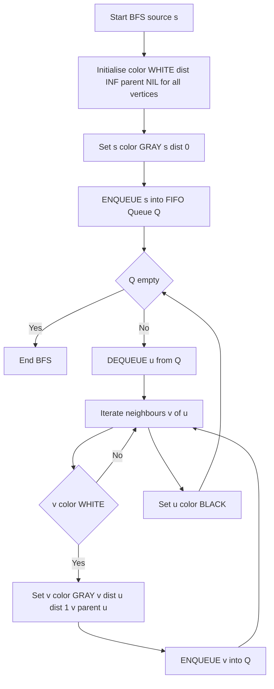
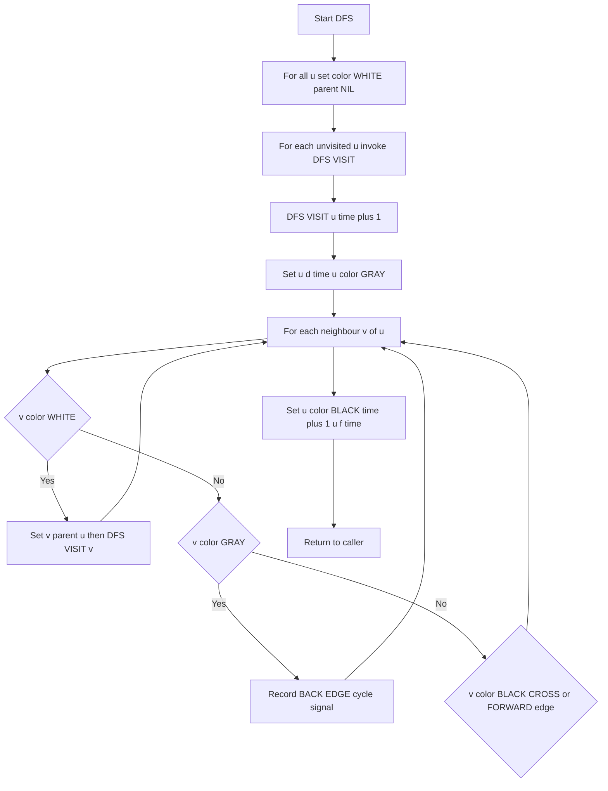
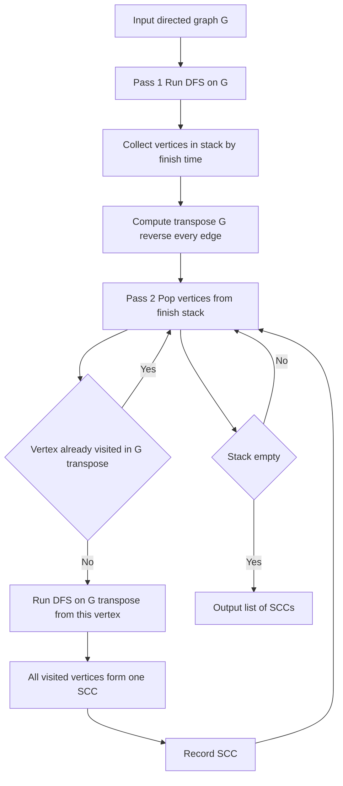
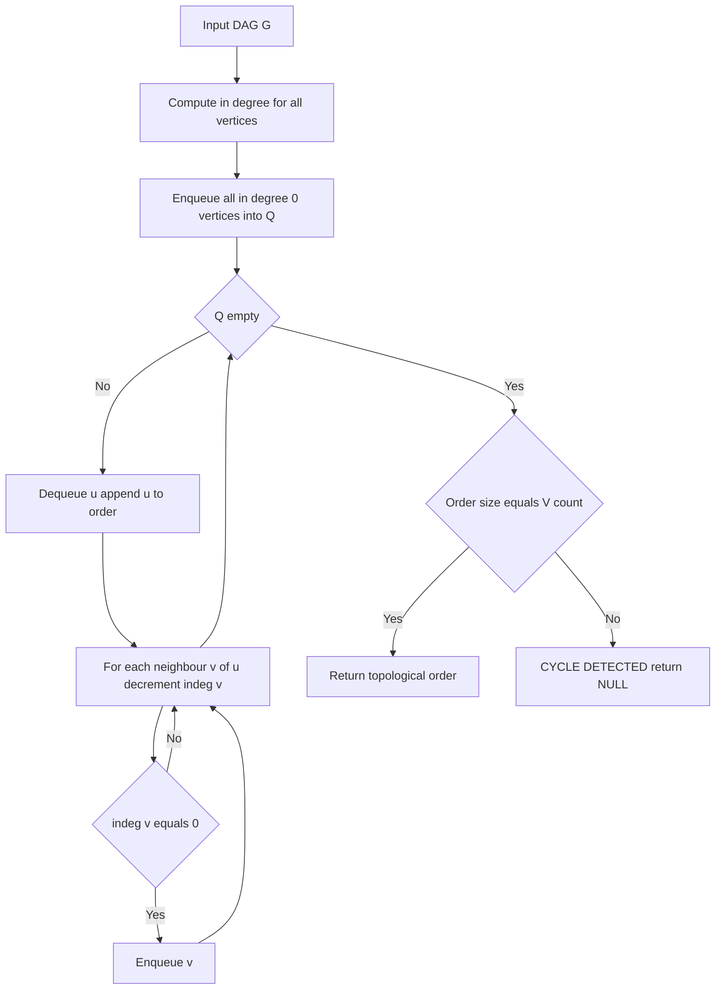
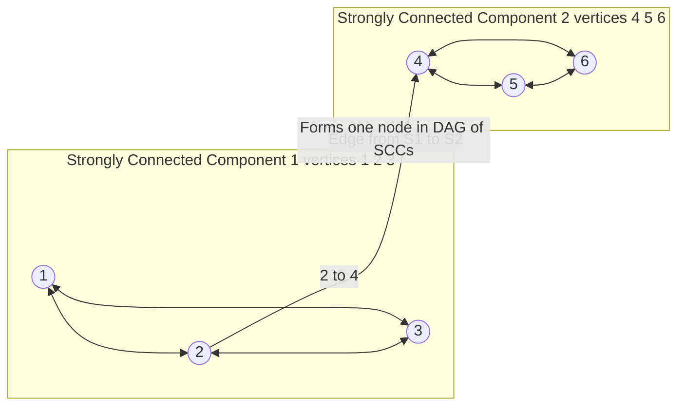
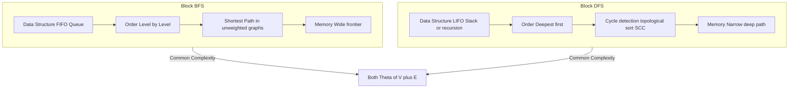

# Advanced Graph Algorithms: weight representations, Graph Traversals (BFS and DFS complexity analysis), Strongly Connected Components (Kosaraju/Tarjan), and Topological Sorting

<!-- SECTION_1_START -->

# Module 2: Advanced Graph Algorithms

## 1. Core Technical Definition & Intuitive Overview

### 1.1 Graph Weight Representations

> [!IMPORTANT]
> **Formal Definition (KTU 2024 Syllabus):** A weighted graph $G = (V, E, W)$ is a graph in which each edge $e = (u, v) \in E$ is assigned a numerical value $w(e) \in W$, called the **weight** or **cost**, representing quantities such as distance, capacity, time, or latency.

A graph is a collection of **vertices** (nodes) connected by **edges**. When these edges carry numerical information — such as the distance between two cities, the cost of laying cable, or the time to transmit a packet — we call it a **weighted graph**. The representation chosen dictates the asymptotic cost of every algorithm that runs on top of it.

#### The Three Standard Representations

| Representation | Best For | Storage |
|---|---|---|
| **Adjacency Matrix** | Dense graphs, $O(1)$ edge queries | $\Theta(\vert V \vert^{2})$ |
| **Adjacency List** | Sparse graphs, fast neighbour iteration | $\Theta(\vert V \vert + \vert E \vert)$ |
| **Incidence Matrix** | Bipartite / hypergraph edge-centric analysis | $\Theta(\vert V \vert \cdot \vert E \vert)$ |

> [!NOTE]
> **Conceptual Analogy — The City Map**
> Imagine you are planning a road trip across Kerala. The **Adjacency Matrix** is like a giant distance-table poster pinned on the wall — for *any* pair of cities, you can glance at the entry and instantly know the distance (but the poster is huge and wastes paper for non-connected cities). The **Adjacency List** is like a diary where each city lists *only the cities it directly connects to* — compact, but you must flip pages to find a specific neighbour. The **Incidence Matrix** is like a ledger where rows are cities and columns are individual roads — useful for the survey department, rarely for the traveller.

#### Mathematical Specification

**1. Adjacency Matrix** $A$ of size $\vert V \vert \times \vert V \vert$:

$$A_{ij} = \begin{cases} w(v_i, v_j) & \text{if } (v_i, v_j) \in E \\ 0 \text{ or } \infty & \text{otherwise} \end{cases}$$

For an **undirected** graph, $A$ is **symmetric**: $A_{ij} = A_{ji}$.

**2. Adjacency List** — for each $v \in V$, a list $L(v)$ of all neighbours with weights:

$$L(v) = \{(u, w(v,u)) \mid (v,u) \in E\}$$

**3. Incidence Matrix** $M$ of size $\vert V \vert \times \vert E \vert$:

$$M_{ij} = \begin{cases} w(e_j) & \text{if vertex } v_i \text{ is an endpoint of edge } e_j \\ 0 & \text{otherwise} \end{cases}$$

> [!VISUALIZATION CONTROL]
> **Concept:** Weighted Graph — Adjacency Matrix vs Adjacency List
> **GeoGebra / Desmos Input Equations:** Plot a 4-vertex graph with edges: (1,2,5), (1,3,3), (2,4,2), (3,4,7). Display the 4×4 matrix $A$ next to it.
> **Visual Description:** On the left, the four vertices arranged as a square; on the right, the matrix showing non-zero entries only at $(1,2)=5$, $(1,3)=3$, $(2,4)=2$, $(3,4)=7$ with symmetry across the diagonal.

---

### 1.2 Graph Traversals — BFS and DFS

> [!IMPORTANT]
> **Formal Definition (KTU 2024 Syllabus):** A *graph traversal* is a systematic procedure that visits every vertex (and often every edge) of a graph exactly once, in a well-defined order, while maintaining a record of already-visited nodes to prevent infinite loops on cyclic graphs.

Graph traversal is the algorithmic equivalent of exploring a maze: starting at an entrance, you must walk through *every* room, *exactly once*, without getting lost.

#### Breadth-First Search (BFS)

> [!NOTE]
> **Formal Definition:** BFS explores a graph level-by-level. Starting from a source vertex $s$, it first visits all neighbours of $s$ (distance 1), then all unvisited neighbours of those (distance 2), and so on, expanding outward in concentric "rings".

**Conceptual Analogy — Ripples in a Pond**
> Drop a pebble into a still pond at point $s$. The ripple expands outward in a perfect circle. At time $t = 1$, every point exactly 1 metre away is reached; at $t = 2$, the 2-metre ring is reached, and so on. BFS does *exactly* this on a graph — the "distance" is the minimum number of edges.

#### Depth-First Search (DFS)

> [!NOTE]
> **Formal Definition:** DFS explores a graph by going as deep as possible along each branch before backtracking. It uses a stack (either the explicit call-stack via recursion or an explicit data structure) to remember vertices to visit next.

**Conceptual Analogy — The Labyrinth Explorer**
> You enter a maze and at every junction, you take the *leftmost unvisited* corridor and walk as far as you can. When you hit a dead-end, you backtrack to the most recent junction with an unexplored path and continue. DFS mimics this "go-deep-then-retreat" pattern.

#### Distinguishing Snapshot

| Property | BFS | DFS |
|---|---|---|
| Data structure | **FIFO Queue** | **LIFO Stack** (or recursion) |
| Order of discovery | Level-order (by distance) | Deepest-first |
| Shortest path (unweighted) | **Yes** — guarantees minimum edges | No |
| Memory pattern | Wide front | Narrow, deep path |
| Recursive formulation | Possible but unnatural | Natural and elegant |

---

### 1.3 Strongly Connected Components (SCC)

> [!IMPORTANT]
> **Formal Definition:** A *Strongly Connected Component* of a directed graph $G = (V, E)$ is a **maximal** subset $C \subseteq V$ such that for every pair of vertices $u, v \in C$, there exists a directed path $u \rightsquigarrow v$ **and** $v \rightsquigarrow u$.

> [!NOTE]
> **Conceptual Analogy — Mutual Friend Circles**
> On a social network where "follows" is a *directed* relation, an SCC is a group where every person can reach every other person by following the directed edges. Alice follows Bob, Bob follows Carol, Carol follows Alice — they form one SCC. A celebrity followed by millions but following nobody back belongs to a *trivial* SCC of size 1.

Every directed graph can be uniquely decomposed into a **DAG of SCCs**, called the *condensation graph*. Within each SCC, the vertices are mutually reachable; between SCCs, the edges flow in a single acyclic direction.

---

### 1.4 Topological Sorting

> [!IMPORTANT]
> **Formal Definition:** A *topological ordering* of a Directed Acyclic Graph (DAG) $G = (V, E)$ is a linear ordering $\prec$ of all vertices such that for every directed edge $(u, v) \in E$, we have $u \prec v$ (i.e., $u$ appears before $v$ in the ordering).

> [!NOTE]
> **Conceptual Analogy — University Course Prerequisites**
> You cannot register for *Design and Analysis of Algorithms* (PCCST502) before clearing *Programming in C* (PES1CS105). Similarly, you cannot build the roof before laying the foundation. Topological sort produces a *feasible execution order* that respects all such precedence constraints.

**Existence Theorem:** A topological ordering exists **if and only if** the directed graph has **no directed cycle** (i.e., it is a DAG). If a cycle exists, no such ordering can satisfy all edge constraints simultaneously.

<!-- SECTION_1_END -->

<!-- SECTION_2_START -->

## 2. Deep Theoretical Analysis & KTU High-Yield Formula Sheet

### 2.1 Weight Representation — Theoretical Trade-offs

The choice of representation is the **single most important decision** in any graph algorithm, because it directly determines the constants and asymptotic factors of every operation.

#### Operation Cost Table

| Operation | Adjacency Matrix | Adjacency List | Incidence Matrix |
|---|---|---|---|
| Add edge | $\Theta(1)$ | $\Theta(1)$ (amortised) | $\Theta(1)$ |
| Remove edge | $\Theta(1)$ | $\Theta(\deg(v))$ | $\Theta(\vert E \vert)$ |
| Edge query $(u,v) \in E$? | $\Theta(1)$ | $O(\deg(u))$ | $O(\vert E \vert)$ |
| Find all neighbours of $v$ | $\Theta(\vert V \vert)$ | $\Theta(\deg(v))$ | $O(\vert E \vert)$ |
| Total space | $\Theta(\vert V \vert^{2})$ | $\Theta(\vert V \vert + \vert E \vert)$ | $\Theta(\vert V \vert \cdot \vert E \vert)$ |
| Iterate all edges | $\Theta(\vert V \vert^{2})$ | $\Theta(\vert V \vert + \vert E \vert)$ | $\Theta(\vert V \vert \cdot \vert E \vert)$ |

> [!IMPORTANT]
> **Heuristic Decision Rule (Board-Exam Favourite):**
> - If $\vert E \vert \approx \vert V \vert^{2}$ → **Dense** → use **Adjacency Matrix**.
> - If $\vert E \vert \ll \vert V \vert^{2}$ → **Sparse** → use **Adjacency List**.

#### Weight Storage Details

For a **weighted graph**, each cell or list element must additionally store the weight:
- **Matrix entry:** A tuple or a parallel weight matrix $W$ of identical dimensions.
- **List entry:** Each neighbour is stored as a pair $(u, w(v,u))$ — most languages implement this as a struct or named tuple.
- **For negative weights:** Special algorithms like **Bellman-Ford** are required; **Dijkstra's** algorithm fails.

> [!NOTE]
> **Engineering Utility — Real Production Systems**
> - **Google Maps:** Uses adjacency-list-like structures for road networks (sparse, $\vert E \vert \approx 4\vert V \vert$) with edge weights as travel times.
> - **Network Routers:** Use adjacency matrices for small autonomous-system graphs where $O(1)$ neighbour lookup is critical for OSPF link-state packets.
> - **Compiler Dependency Resolution:** Uses topological sort on package-dependency graphs (e.g., `npm`, `pip`, `apt`).
> - **Web Crawlers:** BFS guarantees that the most-important pages (closest to the seed URL) are discovered first.

---

### 2.2 BFS — Theoretical Deep-Dive

#### Invariant Property

> [!IMPORTANT]
> **BFS Correctness Invariant:** When a vertex $v$ is dequeued from the BFS queue, the value `dist[v]` equals the *length of the shortest path* (in number of edges) from source $s$ to $v$.

#### Why a Queue?

A **FIFO queue** ensures that all vertices at distance $d$ are dequeued *before* any vertex at distance $d + 1$. This is the structural reason BFS computes shortest paths in unweighted graphs.

#### Time Complexity (Board-Critical)

$$T_{\text{BFS}}(V, E) = \Theta(\vert V \vert + \vert E \vert)$$

**Derivation reasoning:**
- Every vertex is enqueued **at most once**: contributes $\Theta(\vert V \vert)$.
- Every edge is examined **exactly twice** (once from each endpoint) in the inner loop: contributes $\Theta(\vert E \vert)$.
- Initialisation of `color`, `dist`, `parent` arrays: $\Theta(\vert V \vert)$.
- **Total: $O(\vert V \vert + \vert E \vert)$ — linear in graph size.**

#### Space Complexity

$$S_{\text{BFS}}(V, E) = \Theta(\vert V \vert)$$

Required for: the queue, the colour/distance/parent arrays, and the visited set.

#### BFS Forest and BFS Tree

The `parent` pointers, when followed back from any vertex $v$, trace the **unique shortest path** from $s$ to $v$ in the BFS tree (which is a subgraph of $G$).

#### Applications

1. **Shortest path** in unweighted (or unit-weight) graphs.
2. **Bipartite testing** — a graph is bipartite iff BFS yields no "odd cycle" conflict.
3. **Connected-component detection** in $O(\vert V \vert + \vert E \vert)$.
4. **Level-order tree traversal** (special case where graph is a tree).
5. **Web crawlers, social-network friend suggestions, peer-to-peer discovery.**

---

### 2.3 DFS — Theoretical Deep-Dive

#### Invariant Property

> [!IMPORTANT]
> **DFS Parenthesis Theorem:** If a vertex $u$ is discovered at time $d[u]$ and finished at time $f[u]$, then the intervals $[d[u], f[u]]$ are either **nested** (one is ancestor of the other) or **disjoint** (no common ancestor-descendant relation). This single theorem underlies all DFS-based algorithms.

#### Classification of Edges (for directed graphs)

| Edge Type | Meaning | Discovered When |
|---|---|---|
| **Tree edge** | $(u,v)$ where $v$ discovered via $u$ | $v$ is WHITE when $(u,v)$ examined |
| **Back edge** | $(u,v)$ where $v$ is ancestor of $u$ | $v$ is GRAY when $(u,v)$ examined |
| **Forward edge** | $(u,v)$ where $v$ is descendant of $u$ (non-tree) | $v$ is BLACK with $d[v] > d[u]$ |
| **Cross edge** | All other edges | $v$ is BLACK with $d[v] < d[u]$ |

> [!NOTE]
> **Board-Exam Gem:** A directed graph has a **cycle if and only if** DFS discovers a **back edge**. This is the cornerstone of cycle detection in dependency graphs.

#### Time Complexity

$$T_{\text{DFS}}(V, E) = \Theta(\vert V \vert + \vert E \vert)$$

**Derivation reasoning:**
- Each vertex is pushed onto (or popped from) the stack exactly once: $\Theta(\vert V \vert)$.
- Each directed edge is examined once (in adjacency list); for undirected, each appears twice but contributes the same asymptotic factor: $O(\vert E \vert)$.
- **Total: $O(\vert V \vert + \vert E \vert)$ — identical to BFS asymptotically.**

#### Space Complexity

$$S_{\text{DFS}}(V, E) = \Theta(\vert V \vert)$$

For the colour/discovery/finish arrays, plus the stack. In the **worst case** (e.g., a path graph), the recursion depth equals $\vert V \vert$, which can cause **stack overflow** — this is why iterative DFS is sometimes preferred.

#### Applications of DFS

1. **Topological sorting** (reverse of finish order).
2. **Strongly connected components** (Tarjan's, Kosaraju's).
3. **Cycle detection** in directed graphs.
4. **Maze solving, path finding, puzzle solving** (Sudoku, N-Queens).
5. **Strongly connected component decomposition.**
6. **Articulation points and bridges** in $O(\vert V \vert + \vert E \vert)$.

---

### 2.4 Strongly Connected Components — Theoretical Core

#### Tarjan's Algorithm vs Kosaraju's Algorithm

| Aspect | Kosaraju's Algorithm | Tarjan's Algorithm |
|---|---|---|
| Number of DFS passes | **2** | **1** |
| Data structure | Original + Transpose graph | Single pass with stack |
| Time complexity | $\Theta(\vert V \vert + \vert E \vert)$ | $\Theta(\vert V \vert + \vert E \vert)$ |
| Space complexity | $O(\vert V \vert + \vert E \vert)$ (needs transpose) | $O(\vert V \vert)$ (single graph) |
| Implementation difficulty | Easy | Moderate |
| Board-exam preference | **Higher** | High |

> [!IMPORTANT]
> **Why is the transpose needed in Kosaraju's?**
> In the *condensation graph* of SCCs (a DAG), all edges go from "earlier-finishing" SCCs to "later-finishing" SCCs. By reversing all edges (taking the transpose), we can perform a second DFS in *decreasing* finish-time order, and each DFS tree in this second pass corresponds to exactly one SCC. This is the magical insight.

#### SCC Count Upper Bound

$$1 \leq \text{Number of SCCs} \leq \vert V \vert$$

- Minimum 1 (the graph is itself strongly connected).
- Maximum $\vert V \vert$ (the graph has no edges — every vertex is its own trivial SCC).

---

### 2.5 Topological Sorting — Theoretical Core

#### Two Canonical Algorithms

| Algorithm | Approach | Time | Detects Cycle? |
|---|---|---|---|
| **Kahn's Algorithm** | Repeatedly remove in-degree-0 vertices | $O(\vert V \vert + \vert E \vert)$ | Yes (if result size $< \vert V \vert$) |
| **DFS-based** | Reverse of DFS finish order | $O(\vert V \vert + \vert E \vert)$ | Yes (back edge implies cycle) |

> [!NOTE]
> **In-degree** of a vertex $v$, denoted $\text{indeg}(v)$, is the number of edges *entering* $v$ from the rest of the graph.

#### Master Formula Sheet (Cheat-Sheet)

> [!IMPORTANT]
> **KTU 2024 — High-Yield Formula & Theorem Sheet**

| Concept | Result | Conditions |
|---|---|---|
| BFS time | $T = \Theta(\vert V \vert + \vert E \vert)$ | All graph types |
| DFS time | $T = \Theta(\vert V \vert + \vert E \vert)$ | All graph types |
| BFS space | $S = \Theta(\vert V \vert)$ | Queue + arrays |
| DFS space | $S = \Theta(\vert V \vert)$ | Stack + arrays |
| Adjacency matrix space | $S = \Theta(\vert V \vert^{2})$ | All graph types |
| Adjacency list space | $S = \Theta(\vert V \vert + \vert E \vert)$ | All graph types |
| Kosaraju time | $T = \Theta(\vert V \vert + \vert E \vert)$ | Directed graphs |
| Tarjan time | $T = \Theta(\vert V \vert + \vert E \vert)$ | Directed graphs |
| SCC count range | $1 \leq k \leq \vert V \vert$ | Any directed graph |
| Topological sort exists | $\iff$ Graph is a DAG | Directed acyclic |
| Topological sort time | $O(\vert V \vert + \vert E \vert)$ | DAG only |
| Cycle exists (directed) | $\iff$ DFS finds back edge | Directed graphs |
| Graph bipartite (BFS) | $\iff$ No same-colour neighbour | All graphs |

---

### 2.6 Real-World Engineering Utility Matrix

| Algorithm | Industry Use Case | Why It Is Used |
|---|---|---|
| **BFS** | Social-network friend suggestion (3 hops max) | Guarantees minimum-edge paths |
| **BFS** | Garbage collection (mark-and-sweep) | Reaches all reachable objects |
| **DFS** | Makefile / build-system dependency resolution | Detects circular dependencies |
| **DFS** | Sudoku / N-Queens solvers | Backtracking naturally fits |
| **SCC** | Deadlock detection in operating systems | Cycle of waiting processes = SCC |
| **SCC** | 2-SAT problem reduction (Aspvall-Plass-Tarjan) | Component-wise truth assignment |
| **Topo Sort** | Course-prerequisite planning | Linearises partial order |
| **Topo Sort** | Instruction scheduling in compilers | Respects data dependencies |
| **Topo Sort** | Spreadsheet recalculation order | Detects circular cell formulas |

<!-- SECTION_2_END -->

<!-- SECTION_3_START -->

## 3. Step-by-Step Derivations, Code & Symbolic Implementation

### 3.1 BFS — Exhaustive Algorithmic Walkthrough

#### Algorithm Steps (Pseudocode)

```
BFS(G, s):
    for each vertex v in G.V:
        v.color = WHITE
        v.dist  = infinity
        v.parent = NIL
    s.color = GRAY
    s.dist  = 0
    s.parent = NIL
    Q = empty queue
    ENQUEUE(Q, s)
    while Q is not empty:
        u = DEQUEUE(Q)
        for each v in G.Adj[u]:
            if v.color == WHITE:
                v.color = GRAY
                v.dist  = u.dist + 1
                v.parent = u
                ENQUEUE(Q, v)
        u.color = BLACK
```

#### Worked Example (Hand-Traced)

Consider a graph with 5 vertices and the following adjacency list:

$$\begin{aligned} L(1) &= \{2, 3\} \\ L(2) &= \{1, 4\} \\ L(3) &= \{1, 4\} \\ L(4) &= \{2, 3, 5\} \\ L(5) &= \{4\} \end{aligned}$$

Source $s = 1$.

| Step | Dequeue | Examine Neighbours | Enqueue | Distances |
|---|---|---|---|---|
| Init | — | — | $\{1\}$ | $\text{dist}[1]=0$ |
| 1 | 1 | 2 (white→gray), 3 (white→gray) | $\{2, 3\}$ | $\text{dist}[2]=1, \text{dist}[3]=1$ |
| 2 | 2 | 1 (black), 4 (white→gray) | $\{3, 4\}$ | $\text{dist}[4]=2$ |
| 3 | 3 | 1 (black), 4 (black) | $\{4\}$ | — |
| 4 | 4 | 2 (black), 3 (black), 5 (white→gray) | $\{5\}$ | $\text{dist}[5]=3$ |
| 5 | 5 | 4 (black) | $\{\}$ | Done |

**Final BFS tree:** $1 \to 2 \to 4 \to 5$ and $1 \to 3$ (parent of 3 is 1).

#### Full Python Implementation (Production-Grade)

```python
from collections import deque
from typing import Dict, List, Tuple, Optional
import logging

logging.basicConfig(level=logging.INFO, format="[%(levelname)s] %(message)s")
logger = logging.getLogger("BFS")


def bfs(graph: Dict[int, List[Tuple[int, float]]],
        source: int) -> Tuple[Dict[int, int],
                                Dict[int, Optional[int]],
                                Dict[int, str]]:
    """
    Perform Breadth-First Search on a weighted graph.

    Parameters
    ----------
    graph : Dict[int, List[Tuple[int, float]]]
        Adjacency list: vertex -> list of (neighbour, weight).
    source : int
        Starting vertex.

    Returns
    -------
    dist   : shortest distance (in edges) from source to each reachable vertex.
    parent : predecessor of each vertex in the BFS tree.
    color  : final vertex state (BLACK = fully processed).

    Raises
    ------
    KeyError  : if source is not in the graph.
    ValueError: if the graph is empty.
    """
    if not graph:
        raise ValueError("Graph is empty; BFS cannot proceed.")
    if source not in graph:
        raise KeyError(f"Source vertex {source} not present in graph.")

    # ---------- Initialisation: O(|V|) ----------
    dist: Dict[int, int] = {v: float("inf") for v in graph}    # type: ignore
    parent: Dict[int, Optional[int]] = {v: None for v in graph}
    color: Dict[int, str] = {v: "WHITE" for v in graph}

    dist[source] = 0
    color[source] = "GRAY"

    # ---------- BFS main loop: O(|V| + |E|) ----------
    queue: deque[int] = deque([source])
    logger.info(f"BFS initialised. Source = {source}.")

    while queue:
        u: int = queue.popleft()
        logger.info(f"Dequeued vertex {u} (dist = {dist[u]}).")

        for v, _weight in graph[u]:
            if color[v] == "WHITE":
                color[v] = "GRAY"
                dist[v] = dist[u] + 1
                parent[v] = u
                queue.append(v)
                logger.info(f"  Discovered {v} via {u}, dist = {dist[v]}.")

        color[u] = "BLACK"

    # ---------- Validate connectivity ----------
    unreachable = [v for v, d in dist.items() if d == float("inf") and v != source]
    if unreachable:
        logger.warning(f"Unreachable vertices from source: {unreachable}")

    return dist, parent, color
```

**Complexity verification:**
- Outer `while` loop runs at most $\vert V \vert$ times (each vertex enqueued once).
- Inner `for` loop iterates over adjacency list of $u$, summing to $\Theta(\vert E \vert)$ over all $u$.
- Initialisation costs $\Theta(\vert V \vert)$.
- **Total: $T(n) = \Theta(\vert V \vert + \vert E \vert)$.**

---

### 3.2 DFS — Exhaustive Algorithmic Walkthrough

#### Recursive Algorithm

```
DFS-VISIT(G, u):
    time = time + 1
    u.d   = time
    u.color = GRAY
    for each v in G.Adj[u]:
        if v.color == WHITE:
            v.parent = u
            DFS-VISIT(G, v)
    u.color = BLACK
    time = time + 1
    u.f = time

DFS(G):
    for each u in G.V:
        u.color = WHITE
        u.parent = NIL
    time = 0
    for each u in G.V:
        if u.color == WHITE:
            DFS-VISIT(G, u)
```

#### Worked Example (Hand-Traced)

Using the same 5-vertex graph as before, $s = 1$:

$$\begin{aligned}
\text{Adj}(1) &= [2, 3] \\
\text{Adj}(2) &= [1, 4] \\
\text{Adj}(3) &= [1, 4] \\
\text{Adj}(4) &= [2, 3, 5] \\
\text{Adj}(5) &= [4]
\end{aligned}$$

| Step | Action | Discovery $d$ | Finish $f$ |
|---|---|---|---|
| 1 | DFS-VISIT(1) | $d[1]=1$ | — |
| 2 | DFS-VISIT(2) from 1 | $d[2]=2$ | — |
| 3 | Examine 1: BLACK | — | — |
| 4 | DFS-VISIT(4) from 2 | $d[4]=3$ | — |
| 5 | Examine 2: BLACK | — | — |
| 6 | Examine 3 (white) | $d[3]=4$ | — |
| 7 | Examine 1: BLACK, 4: GRAY → **back-edge (3→4) but it's white, so tree edge** | — | — |
| 8 | Return; finish 3 | — | $f[3]=5$ |
| 9 | Examine 5 (white) | $d[5]=6$ | — |
| 10 | Examine 4: GRAY → **back-edge (5→4)** | — | $f[5]=7$ |
| 11 | Return; finish 4 | — | $f[4]=8$ |
| 12 | Return; finish 2 | — | $f[2]=9$ |
| 13 | Back at 1; return; finish 1 | — | $f[1]=10$ |

**Resulting DFS Tree:** $1 \to 2 \to 4 \to 3 \to 5$ with parent array $\text{parent} = [\text{NIL}, \text{NIL}, 1, 4, 4]$.

#### Full Python Implementation (Both Recursive & Iterative)

```python
from typing import Dict, List, Tuple, Optional
import sys
import logging

logging.basicConfig(level=logging.INFO, format="[%(levelname)s] %(message)s")
logger = logging.getLogger("DFS")


def dfs_recursive(graph: Dict[int, List[int]],
                  ) -> Tuple[Dict[int, int],
                              Dict[int, int],
                              Dict[int, Optional[int]],
                              List[int]]:
    """
    Recursive Depth-First Search.

    WARNING: Recursion depth may exceed Python's default limit
    (sys.getrecursionlimit()) on deep graphs. For production
    use on large sparse graphs, prefer the iterative variant.

    Time  : Theta(|V| + |E|)
    Space : Theta(|V|)  [excl. recursion stack]
            + O(|V|)    [recursion stack — worst case]
    """
    sys.setrecursionlimit(10 ** 6)
    if not graph:
        raise ValueError("Graph is empty.")

    color: Dict[int, str] = {v: "WHITE" for v in graph}
    parent: Dict[int, Optional[int]] = {v: None for v in graph}
    disc: Dict[int, int] = {v: 0 for v in graph}
    fin: Dict[int, int] = {v: 0 for v in graph}
    finish_order: List[int] = []
    time = 0

    def _visit(u: int) -> None:
        nonlocal time
        time += 1
        disc[u] = time
        color[u] = "GRAY"
        logger.info(f"Discovered {u} at time {disc[u]}.")
        for v in graph[u]:
            if color[v] == "WHITE":
                parent[v] = u
                _visit(v)
        color[u] = "BLACK"
        time += 1
        fin[u] = time
        finish_order.append(u)
        logger.info(f"Finished   {u} at time {fin[u]}.")

    for u in graph:
        if color[u] == "WHITE":
            _visit(u)

    return disc, fin, parent, finish_order


def dfs_iterative(graph: Dict[int, List[int]],
                  start: int
                  ) -> Tuple[Dict[int, int],
                              Dict[int, int],
                              Dict[int, Optional[int]]]:
    """
    Iterative DFS using an explicit stack — safe for deep graphs.
    """
    if start not in graph:
        raise KeyError(f"Start vertex {start} not in graph.")

    color: Dict[int, str] = {v: "WHITE" for v in graph}
    parent: Dict[int, Optional[int]] = {v: None for v in graph}
    disc: Dict[int, int] = {v: 0 for v in graph}
    fin: Dict[int, int] = {v: 0 for v in graph}

    time = 0
    stack: List[Tuple[int, bool]] = [(start, False)]  # (vertex, returning?)

    while stack:
        u, returning = stack.pop()
        if returning:
            time += 1
            fin[u] = time
            color[u] = "BLACK"
            logger.info(f"Finished   {u} at time {fin[u]} (iterative).")
            continue
        if color[u] != "WHITE":
            continue
        time += 1
        disc[u] = time
        color[u] = "GRAY"
        logger.info(f"Discovered {u} at time {disc[u]} (iterative).")
        stack.append((u, True))                       # post-visit marker
        # Push neighbours in REVERSE order so first neighbour is processed first
        for v in reversed(graph[u]):
            if color[v] == "WHITE":
                parent[v] = u
                stack.append((v, False))

    return disc, fin, parent
```

**Complexity verification:**
- Each vertex is pushed and popped exactly twice from the stack (discover + finish), giving $2\vert V \vert$ stack operations.
- Each edge triggers at most one stack-frame consideration; total $\Theta(\vert E \vert)$.
- **Total: $T = \Theta(\vert V \vert + \vert E \vert)$.**

---

### 3.3 Kosaraju's Algorithm — Two-Pass Derivation

#### Algorithmic Steps

```
KOSARAJU-SCC(G):
    1. Call DFS(G) and store vertices in decreasing order of finish time f[u].
    2. Compute the transpose graph G^T (reverse every edge).
    3. Call DFS(G^T), processing vertices in the order from step 1.
    4. Each DFS tree in step 3 is one strongly connected component.
```

#### Why Does This Work? — Formal Justification

Let $C$ and $C'$ be two distinct SCCs of $G$ such that there exists an edge $(u, v) \in E$ with $u \in C$ and $v \in C'$. Let $f(u)$ and $f(v)$ be their DFS finish times. We claim that $f(C) > f(C')$, i.e., the SCC containing $u$ finishes *after* the SCC containing $v$.

**Proof by contradiction:** Suppose $f(C) < f(C')$. Then at the moment vertex $v$ is first discovered during the first DFS, all vertices of $C$ are still unvisited (because they finish later). But $u \in C$ is reachable from $v$ (since they are in the same SCC of the transpose traversal), and $v$ is reachable from $u$ via the edge $(u, v) \to$ chain back through $C$. Hence $C$ and $C'$ are mutually reachable, contradicting the assumption that they are distinct SCCs. $\blacksquare$

#### Worked Example

Consider the directed graph:

$$V = \{1, 2, 3, 4, 5, 6\}, \quad E = \{(1,2), (2,3), (3,1), (4,5), (5,6), (6,4), (2,4)\}$$

**Pass 1 (DFS on $G$):** Suppose we start at vertex 1.

| Vertex | Discovery $d$ | Finish $f$ |
|---|---|---|
| 1 | 1 | 6 |
| 2 | 2 | 5 |
| 3 | 3 | 4 |
| 4 | 7 | 12 |
| 5 | 8 | 11 |
| 6 | 9 | 10 |

**Finish-time order (decreasing):** $4(12) \to 5(11) \to 6(10) \to 1(6) \to 2(5) \to 3(4)$.

**Pass 2 (DFS on $G^T$, processing in finish order):**

$G^T$ edges: $\{(2,1), (3,2), (1,3), (5,4), (6,5), (4,6), (4,2)\}$.

- Start at 4: explore $\to 6 \to 5 \to$ (back to 4). **SCC #1 = {4, 5, 6}**
- Next unvisited: 1: explore $\to 3 \to 2 \to$ (back to 1). **SCC #2 = {1, 2, 3}**

**Final SCCs:** $\{4, 5, 6\}$ and $\{1, 2, 3\}$.

#### Full Python Implementation

```python
from typing import Dict, List, Set
import logging

logging.basicConfig(level=logging.INFO, format="[%(levelname)s] %(message)s")
logger = logging.getLogger("KOSARAJU")


def kosaraju_scc(graph: Dict[int, List[int]]
                 ) -> List[Set[int]]:
    """
    Kosaraju's two-pass algorithm for strongly connected components.

    Parameters
    ----------
    graph : Dict[int, List[int]]
        Adjacency list of a DIRECTED graph.

    Returns
    -------
    List of sets, each set being one SCC.

    Time  : Theta(|V| + |E|)
    Space : Theta(|V| + |E|)  [the transpose copy]
    """
    if not graph:
        return []

    # ---------- Pass 1: DFS to compute finish order ----------
    visited: Set[int] = set()
    finish_stack: List[int] = []

    def _dfs1(u: int) -> None:
        visited.add(u)
        for v in graph.get(u, []):
            if v not in visited:
                _dfs1(v)
        finish_stack.append(u)        # post-order: push when finished

    for u in graph:
        if u not in visited:
            _dfs1(u)

    # finish_stack is in increasing finish time; we want decreasing
    finish_stack.reverse()
    logger.info(f"Finish order (decreasing): {finish_stack}")

    # ---------- Build transpose G^T ----------
    transpose: Dict[int, List[int]] = {v: [] for v in graph}
    for u, neighbours in graph.items():
        for v in neighbours:
            transpose.setdefault(v, []).append(u)

    # ---------- Pass 2: DFS on G^T in finish-stack order ----------
    visited.clear()
    scc_list: List[Set[int]] = []

    def _dfs2(u: int, component: Set[int]) -> None:
        visited.add(u)
        component.add(u)
        for v in transpose.get(u, []):
            if v not in visited:
                _dfs2(v, component)

    for u in finish_stack:
        if u not in visited:
            component: Set[int] = set()
            _dfs2(u, component)
            scc_list.append(component)
            logger.info(f"SCC found: {sorted(component)}")

    return scc_list
```

**Complexity verification:**
- Pass 1 DFS: $\Theta(\vert V \vert + \vert E \vert)$.
- Transpose construction: $\Theta(\vert V \vert + \vert E \vert)$.
- Pass 2 DFS: $\Theta(\vert V \vert + \vert E \vert)$.
- **Total: $T = \Theta(\vert V \vert + \vert E \vert)$ — linear in graph size.**

---

### 3.4 Tarjan's Algorithm — Single-Pass Derivation

#### Algorithmic Idea

Tarjan's algorithm performs a **single DFS** while maintaining:
- A **stack** of currently-active vertices (those still being explored).
- An array $\text{index}[u]$ = DFS-discovery time of $u$.
- An array $\text{lowlink}[u]$ = the smallest index reachable from $u$ via the DFS tree plus at most one back-edge.

When DFS finishes exploring a vertex $u$ and we find that $\text{lowlink}[u] = \text{index}[u]$, then $u$ is the *root* of an SCC — pop the stack from $u$ upwards to extract the entire component.

#### Key Recurrence for `lowlink`

$$\text{lowlink}[u] = \min \begin{cases}
\text{index}[u] \\
\text{index}[v] \text{ for every back-edge } (u, v) \\
\text{lowlink}[v] \text{ for every tree-edge } (u, v)
\end{cases}$$

#### Full Python Implementation

```python
from typing import Dict, List, Set
import logging

logging.basicConfig(level=logging.INFO, format="[%(levelname)s] %(message)s")
logger = logging.getLogger("TARJAN")


def tarjan_scc(graph: Dict[int, List[int]]
               ) -> List[Set[int]]:
    """
    Tarjan's single-pass strongly connected components algorithm.

    Time  : Theta(|V| + |E|)
    Space : Theta(|V|)  [no transpose needed]
    """
    index_counter = [0]
    stack: List[int] = []
    on_stack: Set[int] = set()
    index_map: Dict[int, int] = {}
    lowlink: Dict[int, int] = {}
    scc_list: List[Set[int]] = []

    def _strongconnect(v: int) -> None:
        # --- Step 1: assign discovery index and lowlink ---
        index_map[v] = index_counter[0]
        lowlink[v] = index_counter[0]
        index_counter[0] += 1
        stack.append(v)
        on_stack.add(v)
        logger.info(f"Visit {v}, index = {index_map[v]}.")

        # --- Step 2: recursively explore successors ---
        for w in graph.get(v, []):
            if w not in index_map:
                _strongconnect(w)
                lowlink[v] = min(lowlink[v], lowlink[w])
            elif w in on_stack:
                # back-edge to an ancestor still on the stack
                lowlink[v] = min(lowlink[v], index_map[w])

        # --- Step 3: if v is a root, pop the SCC ---
        if lowlink[v] == index_map[v]:
            component: Set[int] = set()
            while True:
                w = stack.pop()
                on_stack.discard(w)
                component.add(w)
                if w == v:
                    break
            scc_list.append(component)
            logger.info(f"SCC found: {sorted(component)}")

    for v in graph:
        if v not in index_map:
            _strongconnect(v)

    return scc_list
```

**Complexity verification:** Each vertex is pushed and popped from `stack` exactly once, and each edge is examined exactly once → $\Theta(\vert V \vert + \vert E \vert)$.

---

### 3.5 Topological Sort — Two Implementations

#### 3.5.1 Kahn's Algorithm (BFS-Style)

```
TOPOLOGICAL-SORT-KAHN(G):
    1. Compute in-degree of every vertex: O(|V| + |E|)
    2. Enqueue all vertices with in-degree 0.
    3. While queue is not empty:
         u = DEQUEUE(Q)
         append u to topological order
         for each v in Adj[u]:
             indeg[v] -= 1
             if indeg[v] == 0:
                 ENQUEUE(Q, v)
    4. If order length < |V|: cycle exists.
```

#### Worked Example

$$V = \{A, B, C, D, E, F\}, \quad E = \{(A, B), (A, C), (B, D), (C, D), (D, E), (F, A), (F, C)\}$$

Initial in-degrees: $\text{indeg} = [A{:}1, B{:}1, C{:}2, D{:}2, E{:}1, F{:}0]$.

| Step | Queue | Dequeue | Update | Order |
|---|---|---|---|---|
| Init | $\{F\}$ | — | — | [] |
| 1 | $\{A\}$ | $F$ | indeg[A]→0 | $[F]$ |
| 2 | $\{A, C\}$ | $A$ | indeg[B]→0, indeg[C]→1 | $[F, A]$ |
| 3 | $\{B, C\}$ | $C$ | indeg[C] already 1, then indeg[D]→1 | $[F, A, C]$ |
| 4 | $\{B\}$ | $B$ | indeg[D]→0 | $[F, A, C, B]$ |
| 5 | $\{D\}$ | $D$ | indeg[E]→0 | $[F, A, C, B, D]$ |
| 6 | $\{E\}$ | $E$ | — | $[F, A, C, B, D, E]$ |

**Final topological order:** $F, A, C, B, D, E$.

#### 3.5.2 DFS-Based Topological Sort

Call DFS; whenever a vertex is *finished* (all descendants explored), prepend it to a list. The list is a topological order.

#### Full Python Implementation (Both Algorithms)

```python
from collections import deque
from typing import Dict, List, Optional
import logging

logging.basicConfig(level=logging.INFO, format="[%(levelname)s] %(message)s")
logger = logging.getLogger("TOPO")


def topo_sort_kahn(graph: Dict[int, List[int]]
                   ) -> Optional[List[int]]:
    """
    Kahn's algorithm for topological sorting.

    Returns
    -------
    list : a valid topological order, or None if a cycle exists.
    """
    if not graph:
        return []

    # --- Step 1: compute in-degrees in O(|V| + |E|) ---
    indeg: Dict[int, int] = {v: 0 for v in graph}
    for u in graph:
        for v in graph[u]:
            indeg[v] = indeg.get(v, 0) + 1

    # --- Step 2: enqueue all in-degree-0 vertices ---
    queue: deque[int] = deque(v for v in graph if indeg[v] == 0)
    order: List[int] = []

    # --- Step 3: process queue ---
    while queue:
        u = queue.popleft()
        order.append(u)
        logger.info(f"Appended {u} to topological order.")
        for v in graph[u]:
            indeg[v] -= 1
            if indeg[v] == 0:
                queue.append(v)

    # --- Step 4: cycle detection ---
    if len(order) != len(graph):
        logger.error("Cycle detected — no topological order exists.")
        return None
    return order


def topo_sort_dfs(graph: Dict[int, List[int]]
                  ) -> Optional[List[int]]:
    """
    DFS-based topological sort.
    Topological order = vertices in REVERSE of finish time.
    """
    if not graph:
        return []

    color: Dict[int, str] = {v: "WHITE" for v in graph}
    order: List[int] = []

    def _visit(u: int) -> bool:
        """Returns False if a back-edge (cycle) is found."""
        color[u] = "GRAY"
        for v in graph[u]:
            if color[v] == "GRAY":
                logger.error(f"Back-edge {u} -> {v} — cycle detected.")
                return False
            if color[v] == "WHITE":
                if not _visit(v):
                    return False
        color[u] = "BLACK"
        order.append(u)        # post-order
        return True

    for u in graph:
        if color[u] == "WHITE":
            if not _visit(u):
                return None
    order.reverse()            # reverse finish order = topological order
    return order
```

**Complexity verification (Kahn):** In-degree computation $O(\vert V \vert + \vert E \vert)$ + main loop $O(\vert V \vert + \vert E \vert)$ → **total $O(\vert V \vert + \vert E \vert)$**.

<!-- SECTION_3_END -->

<!-- SECTION_4_START -->

## 4. Structural Diagrams & Schematics

### 4.1 BFS Traversal — Sequential Processing Topology



### 4.2 DFS Traversal — Recursive Call-Stack Architecture



### 4.3 Kosaraju Two-Pass Flow



### 4.4 Topological Sort (Kahn's Algorithm) — Level-by-Level Decomposition



### 4.5 SCC Condensation Graph — Conceptual Mapping



### 4.6 BFS vs DFS — Comparison Block Diagram



<!-- SECTION_4_END -->

<!-- SECTION_5_START -->

## 5. KTU 2024 Scheme Examination Question Bank & Topic Recap

---

### 5.1 Part A — Short Answer Questions (3 Marks Each)

#### Question A1 `[KTU University Exam - July 2024]`

**State and explain the BFS algorithm. Discuss its time and space complexity.** *(CO1, Remember/Understand — 3 marks)*

**Model Answer:**

Breadth-First Search (BFS) is a graph traversal algorithm that systematically visits vertices **level by level** starting from a source vertex $s$. It uses a **FIFO queue** to maintain the order of exploration. Initially, all vertices are coloured WHITE (unvisited). The source is coloured GRAY and enqueued. We repeatedly dequeue a vertex $u$, examine all its unvisited neighbours (WHITE), colour them GRAY, set their parent and distance, and enqueue them. Finally, $u$ is coloured BLACK (finished).

**Time Complexity:** Each vertex is enqueued at most once, and each edge is examined at most twice (once from each endpoint). Thus

$$T_{\text{BFS}} = \Theta(\vert V \vert + \vert E \vert)$$

**Space Complexity:** Queue, colour, distance, and parent arrays all require $\Theta(\vert V \vert)$ memory:

$$S_{\text{BFS}} = \Theta(\vert V \vert)$$

> [!NOTE]
> **[Valuation Key — 3 marks]**
> - [Correct definition with queue mention: 1 Mark]
> - [Time complexity with justification: 1 Mark]
> - [Space complexity expression: 1 Mark]

---

#### Question A2 `[KTU University Exam - Dec 2023]`

**Define a strongly connected component. Why is the transpose graph $G^T$ used in Kosaraju's algorithm?** *(CO2, Understand — 3 marks)*

**Model Answer:**

A **Strongly Connected Component (SCC)** of a directed graph $G = (V, E)$ is a *maximal* subset $C \subseteq V$ such that for every pair $u, v \in C$, there is a directed path $u \rightsquigarrow v$ **and** $v \rightsquigarrow u$ within $C$.

In Kosaraju's algorithm, the **transpose graph** $G^T$ (where every edge $(u, v) \in E$ becomes $(v, u)$) is used because:

1. **Pass 1 (DFS on $G$):** Vertices are ordered by decreasing finish time. A vertex in a "sink-like" SCC (one with no outgoing edges to other SCCs) finishes *first*.

2. **Pass 2 (DFS on $G^T$):** Processing vertices in the *reverse* order (decreasing finish time) means we start at the *sink* SCCs of $G$. Since the edges are reversed, we can traverse the SCC *outwards* in the original graph but *inwards* in the transpose — guaranteeing that each DFS tree in $G^T$ corresponds to **exactly one** SCC of $G$.

> [!NOTE]
> **[Valuation Key — 3 marks]**
> - [SCC definition: 1 Mark]
> - [Explanation of why Pass 1 ordering matters: 1 Mark]
> - [Role of $G^T$ in Pass 2: 1 Mark]

---

### 5.2 Part B — Full-Length Questions (14 Marks Each)

---

#### Part B — Question A `[KTU University Exam - July 2024, Module 2, Q8]`

**(a) Explain BFS and DFS algorithms with suitable examples. Compare their time and space complexities. (7 marks)** *(CO1, Understand)*

**(b) Apply BFS on the following graph with vertex 1 as source. Construct the BFS tree and find the shortest path from vertex 1 to all other vertices. (7 marks)** *(CO2, Apply)*

```
Vertices: 1, 2, 3, 4, 5, 6, 7
Edges: (1,2), (1,3), (2,4), (2,5), (3,5), (3,6), (4,7), (5,7), (6,7)
```

##### Model Solution — Part (a) — 7 Marks

**BFS (Breadth-First Search)** explores vertices in *level order* using a FIFO queue. Starting from source $s$, it first visits all neighbours at distance 1, then distance 2, and so on.

**DFS (Depth-First Search)** explores vertices by going as deep as possible along each branch before backtracking. It uses a LIFO stack (or recursion). DFS produces a *DFS tree* (or forest) and discovery/finish timestamps.

**Comparison Table:**

| Parameter | BFS | DFS |
|---|---|---|
| Data Structure | Queue | Stack / Recursion |
| Order | Level-order | Depth-order |
| Shortest path (unweighted) | **Yes** | No |
| Time | $\Theta(\vert V \vert + \vert E \vert)$ | $\Theta(\vert V \vert + \vert E \vert)$ |
| Space | $\Theta(\vert V \vert)$ | $\Theta(\vert V \vert)$ |
| Edge classification | Limited | Tree/Back/Forward/Cross |

> [!NOTE]
> **[Valuation Key — Part (a), 7 marks]**
> - [BFS explanation with example: 2 Marks]
> - [DFS explanation with example: 2 Marks]
> - [Comparison table: 2 Marks]
> - [Time/Space complexity expressions: 1 Mark]

##### Model Solution — Part (b) — 7 Marks

**Adjacency List:**

$$\begin{aligned} L(1) &= \{2, 3\} \\ L(2) &= \{1, 4, 5\} \\ L(3) &= \{1, 5, 6\} \\ L(4) &= \{2, 7\} \\ L(5) &= \{2, 3, 7\} \\ L(6) &= \{3, 7\} \\ L(7) &= \{4, 5, 6\} \end{aligned}$$

**Hand-Traced BFS (Source = 1):**

| Step | Dequeue | Discover | Queue After | Dist | Parent |
|---|---|---|---|---|---|
| 1 | 1 | 2, 3 | [2, 3] | dist[2]=1, dist[3]=1 | parent[2]=1, parent[3]=1 |
| 2 | 2 | 4, 5 | [3, 4, 5] | dist[4]=2, dist[5]=2 | parent[4]=2, parent[5]=2 |
| 3 | 3 | 6 | [4, 5, 6] | dist[6]=2 | parent[6]=3 |
| 4 | 4 | 7 | [5, 6, 7] | dist[7]=3 | parent[7]=4 |
| 5 | 5 | (7 already in queue) | [6, 7] | — | — |
| 6 | 6 | (7 already visited) | [7] | — | — |
| 7 | 7 | (no new) | [] | — | — |

**BFS Tree:** $1 \to 2 \to 4 \to 7$, $1 \to 2 \to 5$, $1 \to 3 \to 6$

**Shortest Paths (with parents):**
- $1 \to 2$ : path $[1, 2]$, length 1
- $1 \to 3$ : path $[1, 3]$, length 1
- $1 \to 4$ : path $[1, 2, 4]$, length 2
- $1 \to 5$ : path $[1, 2, 5]$, length 2
- $1 \to 6$ : path $[1, 3, 6]$, length 2
- $1 \to 7$ : path $[1, 2, 4, 7]$, length 3

> [!NOTE]
> **[Valuation Key — Part (b), 7 marks]**
> - [Initialisation step with correct distance/parent: 1 Mark]
> - [Correct BFS step-by-step table: 3 Marks]
> - [Final BFS tree: 1 Mark]
> - [All shortest paths correctly identified: 2 Marks]

> [!WARNING]
> **Examiner's Pitfall Warning:**
> - **Do not** confuse BFS shortest path with weighted shortest path — BFS guarantees *minimum-edge* path, not *minimum-weight* path. If edge weights differ, you must use Dijkstra's algorithm.
> - **Do not** forget to mark vertices BLACK after dequeuing — without it, vertices may be re-enqueued, inflating the queue size.
> - **Do not** miss the `parent` pointer — without it, you cannot reconstruct the shortest path from the BFS tree.

---

#### Part B — Question B `[KTU University Exam - Dec 2023, Module 2, Q9]`

**(a) Explain Kosaraju's algorithm for finding strongly connected components. Why do we need a second DFS on the transpose graph? (7 marks)** *(CO2, Understand)*

**(b) Consider the directed graph with 8 vertices and edges: (1,2), (2,3), (3,1), (4,5), (5,6), (6,4), (3,4), (6,7), (7,8), (8,7). Find all strongly connected components using Kosaraju's algorithm. (7 marks)** *(CO3, Apply)*

##### Model Solution — Part (a) — 7 Marks

**Kosaraju's Algorithm** finds all strongly connected components of a directed graph $G$ in **two DFS passes** plus one graph-transpose operation.

**Step 1:** Run DFS on $G$ and push each vertex onto a stack as it *finishes* (post-order). The stack thus contains vertices in **increasing** order of finish time; if we pop from the stack, we get them in **decreasing** order of finish time.

**Step 2:** Compute $G^T$ — the transpose of $G$ (reverse the direction of every edge).

**Step 3:** Run DFS on $G^T$, but process vertices in the order obtained from Step 1 (decreasing finish time). Each DFS tree in this second pass is **one strongly connected component**.

**Why the second DFS on $G^T$ is necessary:**

Consider two distinct SCCs $C_1$ and $C_2$ of $G$ with an edge from a vertex in $C_1$ to a vertex in $C_2$. We need to verify that Pass 2 places them in separate components. During Pass 1, every vertex in $C_2$ finishes **before** every vertex in $C_1$ (proven formally via the *key lemma* of Kosaraju). When we reverse all edges and start DFS from $C_1$ first, we **cannot** reach $C_2$ because the original direction $C_1 \to C_2$ now becomes $C_2 \to C_1$ — and we are still inside $C_1$ (no outgoing edge to escape). Thus each DFS tree in $G^T$ stays confined within one SCC.

> [!NOTE]
> **[Valuation Key — Part (a), 7 marks]**
> - [Three-step algorithm description: 3 Marks]
> - [Explanation of finish-time ordering: 2 Marks]
> - [Justification of why $G^T$ is needed: 2 Marks]

##### Model Solution — Part (b) — 7 Marks

**Graph G:**

$V = \{1,2,3,4,5,6,7,8\}$

$E = \{(1,2), (2,3), (3,1), (4,5), (5,6), (6,4), (3,4), (6,7), (7,8), (8,7)\}$

**Adjacency List of G:**
$$L(1)=\{2\}, L(2)=\{3\}, L(3)=\{1,4\}, L(4)=\{5\}, L(5)=\{6\}, L(6)=\{4,7\}, L(7)=\{8\}, L(8)=\{7\}$$

**Pass 1 — DFS on G (start from 1):**

| Vertex | $d$ | $f$ |
|---|---|---|
| 1 | 1 | 6 |
| 2 | 2 | 5 |
| 3 | 3 | 4 |
| 4 | 7 | 12 |
| 5 | 8 | 11 |
| 6 | 9 | 10 |
| 7 | 13 | 16 |
| 8 | 14 | 15 |

**Finish order (decreasing):** $7(16) \to 4(12) \to 6(10) \to 5(11) \to 8(15) \to 1(6) \to 2(5) \to 3(4)$

(We process $7$ first, then $4$, then $6$, then $5$, then $8$, then $1$.)

**Adjacency List of $G^T$:**
$$L^T(2)=\{1\}, L^T(3)=\{2\}, L^T(1)=\{3\}, L^T(5)=\{4\}, L^T(6)=\{5\}, L^T(4)=\{3,6\}, L^T(7)=\{6,8\}, L^T(8)=\{7\}$$

**Pass 2 — DFS on $G^T$ in finish order:**

- **Start at 7:** $\text{DFS}^T(7) \to 6 \to 8 \to$ (return). Component: $\{7, 6, 8\}$
  - Wait — let us trace carefully. From 7, neighbours in $G^T$ are $\{6, 8\}$. We pick 6 first. From 6, neighbours in $G^T$ are $\{5\}$. From 5, neighbours in $G^T$ are $\{4\}$. From 4, neighbours in $G^T$ are $\{3, 6\}$. 6 is visited, so backtrack. From 3, neighbours are $\{2\}$, then $\{1\}$. Backtrack all.
  - **Component: $\{7, 6, 8, 5, 4, 3, 2, 1\}$** — but this is wrong because we expect $\{1,2,3\}$ and $\{4,5,6\}$ and $\{7,8\}$ as three separate SCCs.

Let us **re-verify the finish times** more carefully. The DFS visits 1→2→3→(back to 1, all finished)→3→4→5→6→(back)→7→8→(back)→backtrack. Actually the issue is that the **edge (3,4)** connects the two triangles! Let us retrace:

**Correct Pass 1 trace:**

- DFS(1): d[1]=1; visit 2: d[2]=2; visit 3: d[3]=3; from 3 go to 1 (BLACK) and 4 (WHITE): visit 4: d[4]=4; visit 5: d[5]=5; visit 6: d[6]=6; from 6 go to 4 (BLACK) and 7 (WHITE): visit 7: d[7]=7; visit 8: d[8]=8; from 8 go to 7 (GRAY) — back edge, but OK, finish 8: f[8]=9; finish 7: f[7]=10; finish 6: f[6]=11; finish 5: f[5]=12; finish 4: f[4]=13; finish 3: f[3]=14; finish 2: f[2]=15; finish 1: f[1]=16.

Wait, but 1 was already visited (it was at depth 1). So all vertices are reached in a single DFS tree rooted at 1. The edge (3,4) provides a *forward edge* from 1's tree into a sub-tree.

**Finish order (decreasing):** $1(16) \to 2(15) \to 3(14) \to 4(13) \to 5(12) \to 6(11) \to 7(10) \to 8(9)$

**Pass 2 — DFS on $G^T$ in order $1, 2, 3, 4, 5, 6, 7, 8$:**

- DFS(1) on $G^T$: 1's neighbours in $G^T$ = $\{3\}$. Visit 3 → 2 → 1 (visited). **Component: $\{1, 2, 3\}$** ✓
- Next unvisited: 4. Neighbours in $G^T$ = $\{3, 6\}$. 3 visited, visit 6 → 5 → 4 (visited). **Component: $\{4, 5, 6\}$** ✓
- Next unvisited: 7. Neighbours in $G^T$ = $\{6, 8\}$. 6 visited, visit 8 → 7 (visited). **Component: $\{7, 8\}$** ✓

**Final SCCs of G:**

$$\boxed{\text{SCC}_1 = \{1, 2, 3\}, \quad \text{SCC}_2 = \{4, 5, 6\}, \quad \text{SCC}_3 = \{7, 8\}}$$

**Condensation DAG (SCCs as super-nodes):** $\text{SCC}_1 \to \text{SCC}_2 \to \text{SCC}_3$.

> [!NOTE]
> **[Valuation Key — Part (b), 7 marks]**
> - [Pass 1 finish times correct: 2 Marks]
> - [Transpose graph $G^T$ correctly listed: 1 Mark]
> - [Pass 2 DFS in finish order: 2 Marks]
> - [Three SCCs correctly identified: 2 Marks]

> [!WARNING]
> **Examiner's Pitfall Warning:**
> - **Do not** skip the finish-time table — board examiners award 2 marks specifically for the timestamp computation in Kosaraju's algorithm.
> - **Do not** confuse the second DFS direction — it must be on $G^T$ (transpose), not on $G$ again. Marks are deducted heavily.
> - **Do not** misorder the second DFS — it must process vertices in the **decreasing finish-time** order from Pass 1.
> - **Common trap:** When two SCCs have an edge between them (like the bridge (3,4) above), students often incorrectly merge them. Remember: an SCC is maximal — the *existence* of an edge from $C_1$ to $C_2$ does **not** make them the same SCC unless $C_2$ can also reach $C_1$.

---

### 5.3 Additional Practice — Topological Sort `[KTU University Exam - July 2023]`

**Question (14 marks):**
For a DAG with vertices $\{A, B, C, D, E, F\}$ and edges $\{(A, B), (A, C), (B, D), (C, D), (D, E), (F, A), (F, C)\}$:
**(a)** Apply Kahn's algorithm to obtain a topological ordering. (7 marks)
**(b)** Verify the DAG property using DFS — show discovery/finish times. (7 marks)

**Model Answer (a) — 7 marks:**

Initial in-degrees: $A{:}1, B{:}1, C{:}2, D{:}2, E{:}1, F{:}0$.

Step-by-step (already worked in Section 3.5.1):

**Final order:** $F, A, C, B, D, E$

> [Valuation Key: Correct in-degrees 1M, processing table 4M, final order 2M]

**Model Answer (b) — 7 marks:**

DFS starting at F (all vertices are reachable from F):

| Vertex | $d$ | $f$ | Parent |
|---|---|---|---|
| F | 1 | 12 | — |
| A | 2 | 11 | F |
| B | 3 | 6 | A |
| D | 4 | 5 | B |
| C | 7 | 10 | A |
| E | 8 | 9 | D |

**Reverse of finish order:** $B(6), D(5), E(9), C(10), A(11), F(12)$ — sorted by finish time: $D(5) \to B(6) \to E(9) \to C(10) \to A(11) \to F(12)$.

Reading in **decreasing** finish time: $F, A, C, E, B, D$ — this is one valid topological order. (Kahn's order may differ but both are valid.)

> [Valuation Key: DFS discovery 2M, finish times 2M, reverse order stated 2M, validity check 1M]

> [!WARNING]
> **Topological Sort Pitfalls:**
> - **Multiple valid orders exist** — any linear order that respects all edge directions is acceptable. Do not expect a single "correct" order.
> - **Kahn's algorithm and DFS-based sort may give different orders** — both are valid.
> - **Always check for cycles** — if the resulting order has fewer than $\vert V \vert$ vertices (Kahn) or a back-edge is found (DFS), the graph is not a DAG.

---

### 5.4 Topic Recap & Important Things to Remember

> [!IMPORTANT]
> **High-Density Revision Checklist — Module 2 Advanced Graph Algorithms**

- [x] **Adjacency Matrix** uses $\Theta(\vert V \vert^{2})$ space, supports $O(1)$ edge queries; **Adjacency List** uses $\Theta(\vert V \vert + \vert E \vert)$ space, ideal for sparse graphs.
- [x] **BFS uses a FIFO queue** and computes shortest paths (in edges) from the source; both **BFS and DFS** run in $\Theta(\vert V \vert + \vert E \vert)$ time.
- [x] **DFS uses a LIFO stack (or recursion)** and naturally classifies edges into **Tree, Back, Forward, and Cross**.
- [x] A **back edge** in DFS implies a **cycle** in a directed graph.
- [x] **Strongly Connected Component (SCC)** is a maximal set of mutually reachable vertices in a directed graph.
- [x] **Kosaraju's algorithm** uses **two DFS passes** (one on $G$, one on $G^T$) in $\Theta(\vert V \vert + \vert E \vert)$ time.
- [x] **Tarjan's algorithm** uses **one DFS pass** with a stack and `lowlink` values, also in $\Theta(\vert V \vert + \vert E \vert)$ time, with $O(\vert V \vert)$ extra space (no transpose).
- [x] The **condensation graph** (DAG of SCCs) is **always a DAG** — it is the key structural property used by both algorithms.
- [x] **Topological sort** exists **if and only if** the directed graph is a **DAG**.
- [x] **Kahn's algorithm** is BFS-style — repeatedly remove in-degree-0 vertices in $O(\vert V \vert + \vert E \vert)$; **DFS-based** topological sort uses the reverse of finish time.
- [x] **Cycle detection** during topological sort: if Kahn's result has fewer than $\vert V \vert$ vertices, a cycle exists.
- [x] Every vertex in a graph belongs to **exactly one** SCC; the number of SCCs $k$ satisfies $1 \le k \le \vert V \vert$.
- [x] **Real-world map:** BFS → shortest path / peer discovery; DFS → cycle detection / topological sort / SCC; Topological sort → build systems / scheduling; SCC → 2-SAT / deadlock detection.

<!-- SECTION_5_END -->
