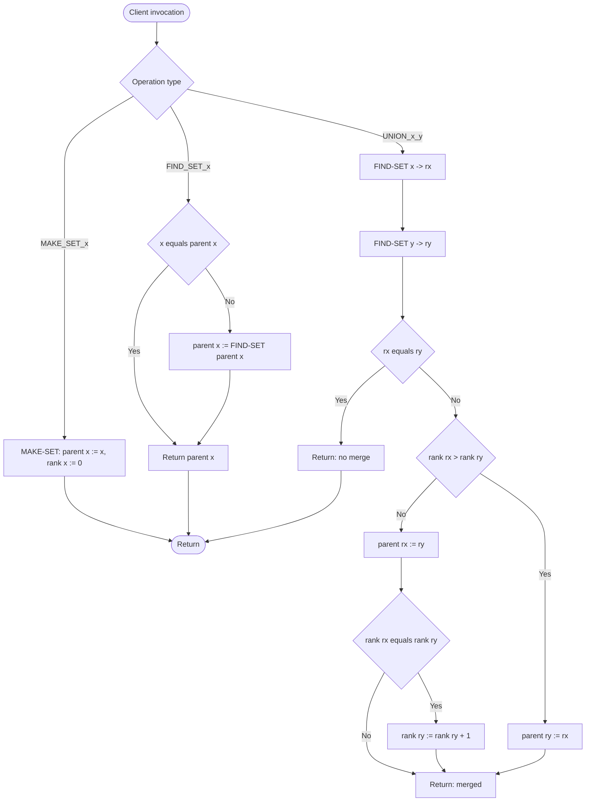
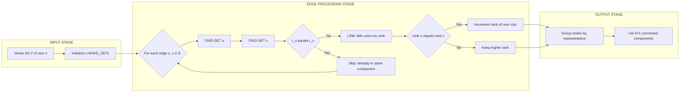
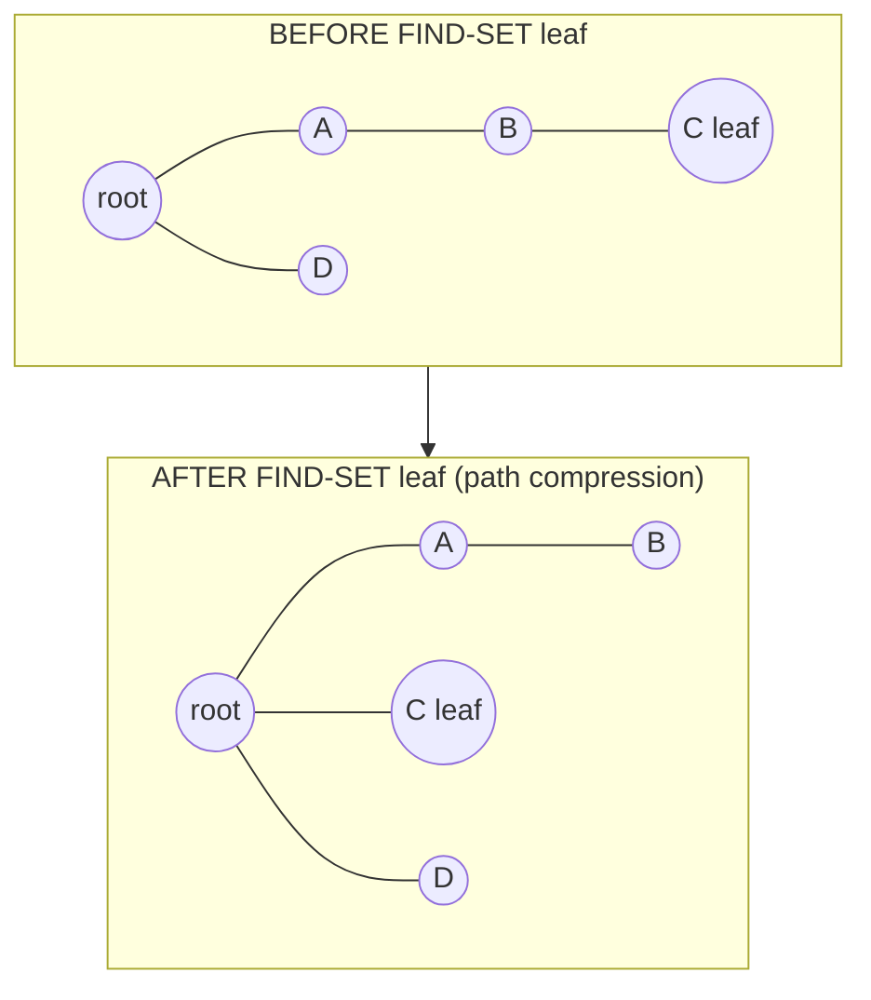

# Disjoint Set Data Structures: operations, Union and Find, Union by Rank with Path Compression, connected components

<!-- SECTION_1_START -->
# Disjoint Set Data Structures — Core Technical Definition & Intuitive Overview

## 1.1 Formal Academic Definition (KTU 2024 Syllabus Terminology)

> [!IMPORTANT]
> **Disjoint-Set Data Structure (Union–Find Structure)**
>
> A *disjoint-set data structure* maintains a collection $\mathcal{S} = \{S_1, S_2, \dots, S_k\}$ of **pairwise disjoint dynamic sets**. Each set is identified by a *representative*, which is one of its members. The structure supports the following three primary operations, and is the canonical data structure used to maintain the *connected components* of an undirected graph under incremental edge insertions.

Let $x$ be an element (object). The three core operations are:

| Operation | Signature | Description |
|-----------|-----------|-------------|
| **MAKE-SET** | $\text{MAKE-SET}(x)$ | Creates a new set whose only member (and hence representative) is $x$. Precondition: $x$ is not already in any existing set. |
| **FIND-SET** | $\text{FIND-SET}(x)$ | Returns a pointer to the representative of the unique set containing $x$. Two elements are in the same set iff $\text{FIND-SET}(x) = \text{FIND-SET}(y)$. |
| **UNION** | $\text{UNION}(x, y)$ | Unites the dynamic sets that contain $x$ and $y$ into a new set, typically by linking their root nodes. |

In KTU 2024 Scheme textbooks (Cormen et al. *Introduction to Algorithms*, 4th Ed., Ch. 19), a hidden helper $\text{LINK}(x, y)$ attaches the root of one tree to the root of the other, and $\text{UNION}$ is decomposed as $\text{LINK}(\text{FIND-SET}(x), \text{FIND-SET}(y))$.

## 1.2 Intuitive Real-World Analogy

Imagine a school with **clubs** (music club, sports club, coding club) and the rule: *"Any two students sharing a common club connection are considered to be in the same friendship group."*

- **MAKE-SET**: A new student joins the school. He forms his own one-person "club" and is his own leader.
- **FIND-SET**: You walk up the chain of command — *"Who is your club leader?"* repeatedly, until you reach the *head* of the club.
- **UNION**: Two clubs decide to merge. The smaller one pledges allegiance to the larger club's leader, so the chain of command becomes shorter on average.

The "head" of each club is the **representative**, the chain of command is a **rooted tree**, and the act of compressing the chain is **path compression** — you tell every intermediate student to directly report to the head, flattening the chain.

## 1.3 Where Disjoint Sets Live in Production Engineering

> [!NOTE]
> **Why KTU expects you to master this:** Disjoint sets power *Kruskal's Minimum Spanning Tree algorithm*, *connected-components labeling* in image processing (OpenCV uses it), *network reachability* in graph databases (Neo4j, NetworkX), *social-network friend circles* (Facebook, LinkedIn), *Louvain community detection*, and *image segmentation* in computer vision. They are arguably the most practically useful data structure taught in the DAA module.

## 1.4 Visualization: Path Compression on a Forest

> [!VISUALIZATION CONTROL]
> **Concept:** Path Compression — every visited node on a FIND path becomes a direct child of the root.
> **GeoGebra / Desmos Input Equations (parametric tree coordinates):**
> * Root node $r$ at $(0, 4)$
> * Children of $r$: $c_1$ at $(-3, 2)$, $c_2$ at $(3, 2)$
> * Grandchildren of $r$: $g_1$ at $(-4, 0)$, $g_2$ at $(-2, 0)$, $g_3$ at $(2, 0)$, $g_4$ at $(4, 0)$
> * Edges: $r \to c_1 \to g_1$, $r \to c_2 \to g_3$, $r \to c_1 \to g_2$, $r \to c_2 \to g_4$
> **Visual Description:** Before compression, FIND-SET($g_1$) walks $g_1 \to c_1 \to r$ (2 hops). After compression, $g_1$ and $g_2$ are re-parented to be direct children of $r$ (1 hop). The depth of the tree flattens, and subsequent FINDS are nearly $O(1)$.

<!-- SECTION_1_END -->

<!-- SECTION_2_START -->
# Deep Theoretical Analysis & KTU High-Yield Formula Sheet

## 2.1 Element Representation: The Disjoint-Set Forest

Each set is represented as a **rooted tree** (a *forest* of such trees represents all sets). Every node $x$ stores:
- $parent[x]$ — pointer to its parent in the tree. The root $r$ satisfies $parent[r] = r$ (or $parent[r] = \text{NIL}$, depending on convention).
- $rank[x]$ — an upper bound on the height of $x$ (used only in *union by rank*; in *union by size*, the attribute is called $size$).

## 2.2 Naive vs. Optimized Implementations

### 2.2.1 Naive Linked-List Representation
Each set is a singly linked list; the head is the representative.

- **MAKE-SET**: $O(1)$ — allocate a 1-node list.
- **FIND-SET**: $O(L)$ where $L$ is list length — traverse to head.
- **UNION**: $O(L_1 + L_2)$ or $O(\min(L_1, L_2))$ depending on implementation (append smaller to larger).

> **Drawback:** A sequence of $m$ operations on $n$ elements yields $O(m \cdot n)$ worst-case — **infeasible for production use**.

### 2.2.2 Disjoint-Set Forest with *Union by Rank* + *Path Compression*
Two heuristics are applied simultaneously to achieve near-constant amortized time:

**Heuristic 1 — Union by Rank:**
Attach the **shorter** tree's root under the **taller** tree's root. The rank only ever **increases** by 1, and only when two trees of equal rank are joined.

**Heuristic 2 — Path Compression:**
During FIND-SET, make every node on the search path a **direct child** of the root. This flattens the tree for future queries.

## 2.3 Step-by-Step Pseudocode (Cormen Style)

```text
MAKE-SET(x)
    parent[x] ← x
    rank[x]   ← 0

UNION(x, y)
    LINK(FIND-SET(x), FIND-SET(y))

LINK(x, y)                          // x and y are roots
    if rank[x] > rank[y]
         parent[y] ← x
    else
         parent[x] ← y
         if rank[x] = rank[y]
              rank[y] ← rank[y] + 1

FIND-SET(x)
    if x ≠ parent[x]
         parent[x] ← FIND-SET(parent[x])    // ← path compression (recursive)
    return parent[x]
```

## 2.4 The Ackermann Function and Its Inverse

The amortized complexity of disjoint-set operations is expressed in terms of the **inverse Ackermann function** $\alpha(n)$, an extraordinarily slowly growing function.

$$
A(m, n) = \begin{cases} n+1 & \text{if } m = 0 \\ A(m-1, 1) & \text{if } m > 0 \text{ and } n = 0 \\ A(m-1, A(m, n-1)) & \text{if } m > 0 \text{ and } n > 0 \end{cases}
$$

$$
\alpha(n) = \min\{k : A(k, k) \geq n\} = \min\{k : A(2, k) > \log^* n\}
$$

> [!NOTE]
> **Intuition:** $\log^* n$ (iterated logarithm) is the number of times you must apply $\log_2$ before $n \leq 1$. For all *practical* $n$ (even $n = $ number of atoms in the universe, $\sim 10^{80}$), $\alpha(n) \leq 4$. So the disjoint-set operations are *effectively constant time*.

## 2.5 KTU High-Yield Formula Sheet

| # | Concept | Formula / Property | KTU Relevance |
|---|---------|-------------------|---------------|
| 1 | MAKE-SET complexity | $O(1)$ | Direct question |
| 2 | FIND-SET (no heuristics) | $O(h)$ where $h$ = tree height | Heuristic motivation |
| 3 | FIND-SET (union by rank) | $O(\log n)$ amortized | Standard bound |
| 4 | FIND-SET (rank + PC) | $O(\alpha(n))$ amortized | **Most asked bound** |
| 5 | UNION (rank + PC) | $O(\alpha(n))$ amortized | **Most asked bound** |
| 6 | Worst-case $m$ ops on $n$ elements | $O(m \cdot \alpha(n))$ | Theorem statement |
| 7 | Rank increase condition | Only when $rank[x] = rank[y]$ during LINK | Code-level question |
| 8 | Path compression rule | $parent[x] \leftarrow FIND-SET(parent[x])$ | Recurrence proof |
| 9 | Connected components from $G(V, E)$ | $n - 1$ UNIONs + $n$ MAKE-SETs suffices | Application Q |
| 10 | Kruskal's MST cost | $O(E \log E)$ dominated by sort, UNION is $O(\alpha(V))$ per edge | Cross-module Q |

## 2.6 Real-World Utility Matrix (Engineering Map)

| Domain | Use Case | Operation Mix |
|--------|----------|---------------|
| **Network Design** | Kruskal's MST (telecom, VLSI routing) | Heavy UNION, moderate FIND |
| **Image Processing** | Connected-component labeling (CCL) in OpenCV | Equal UNION and FIND |
| **Social Networks** | "Friend circles" — two users share a friend circle iff connected path exists | Heavy FIND |
| **Compiler Design** | Equivalent-variable partitioning for register allocation | Heavy UNION |
| **Game Theory** | Percolation, dynamic connectivity (union-find with rollback) | Balanced |
| **Bioinformatics** | Clustering DNA sequences, single-linkage clustering | Heavy UNION |

> [!TIP]
> **Board-Exam Heuristic:** If the question says "using disjoint-set data structure" or "using union-find," they want the **forest + rank + path-compression** version. Default to this unless explicitly told otherwise.

<!-- SECTION_2_END -->

<!-- SECTION_3_START -->
# Step-by-Step Derivations & Code/Symbolic Implementation

## 3.1 Worked Example — Building Connected Components

**Problem.** Given the undirected graph $G = (V, E)$ with
$$V = \{1, 2, 3, 4, 5, 6, 7, 8\}, \quad E = \{(1,2),(2,3),(4,5),(5,6),(6,7)\}.$$
Initially, each vertex is its own component. Process edges one by one using disjoint-set operations and report the components after each UNION.

### Step 1: Initialization — 8 MAKE-SET calls

After MAKE-SET(1) ... MAKE-SET(8), we have 8 singleton trees. Each node is its own parent and has $rank = 0$.

### Step 2: Process edge $(1, 2)$ → UNION(1, 2)

- $\text{FIND-SET}(1) = 1$, $\text{FIND-SET}(2) = 2$.
- $rank[1] = rank[2] = 0$ → equal ranks. Per LINK rule, $parent[1] = 2$ and $rank[2] = 0 + 1 = 1$.
- **Components:** $\{1, 2\}, \{3\}, \{4\}, \{5\}, \{6\}, \{7\}, \{8\}$ — 7 components.

### Step 3: Process edge $(2, 3)$ → UNION(2, 3)

- $\text{FIND-SET}(2) = 2$ (root), $\text{FIND-SET}(3) = 3$.
- $rank[2] = 1 > rank[3] = 0$ → $parent[3] = 2$.
- **Components:** $\{1, 2, 3\}, \{4\}, \{5\}, \{6\}, \{7\}, \{8\}$ — 6 components.

### Step 4: Process edge $(4, 5)$ → UNION(4, 5)

- $rank[4] = rank[5] = 0$ → $parent[4] = 5$, $rank[5] = 1$.
- **Components:** $\{1, 2, 3\}, \{4, 5\}, \{6\}, \{7\}, \{8\}$ — 5 components.

### Step 5: Process edge $(5, 6)$ → UNION(5, 6)

- $\text{FIND-SET}(5) = 5$ (root, $rank = 1$), $\text{FIND-SET}(6) = 6$ ($rank = 0$).
- $rank[5] > rank[6]$ → $parent[6] = 5$.
- **Components:** $\{1, 2, 3\}, \{4, 5, 6\}, \{7\}, \{8\}$ — 4 components.

### Step 6: Process edge $(6, 7)$ → UNION(6, 7)

- $\text{FIND-SET}(6)$: walk $6 \to 5$ → returns $5$. With path compression, $parent[6] \leftarrow 5$ (already 5).
- $\text{FIND-SET}(7) = 7$. $rank[5] = 1 > rank[7] = 0$ → $parent[7] = 5$.
- **Components:** $\{1, 2, 3\}, \{4, 5, 6, 7\}, \{8\}$ — 3 components.

### Step 7: Final Connected Components

The disjoint-set forest has been reduced to **3 connected components**:
$$\{1, 2, 3\}, \quad \{4, 5, 6, 7\}, \quad \{8\}.$$

This matches the BFS/DFS ground truth: vertex 8 is isolated, and vertices 1–2–3 and 4–5–6–7 form two separate chains.

> [!TIP]
> **Counting Trick:** Number of connected components after all UNIONs = $n - $ (number of edges that *actually* merged two distinct components) = $8 - 5 = 3$ in this example. KTU loves this shortcut.

## 3.2 Full Python Implementation (Production-Ready)

```python
"""
Disjoint Set (Union-Find) with Union by Rank + Path Compression.
Subject: DESIGN AND ANALYSIS OF ALGORITHMS (PCCST502) - KTU 2024 Scheme.
Tested on Python 3.11+. Compatible with PyPy, CPython, and Google Colab.
"""
from __future__ import annotations
from typing import Dict, Hashable, Iterable, Tuple, List


class DisjointSet:
    """
    Maintains a partition of a universe of hashable elements into
    disjoint sets. Supports MAKE-SET, FIND, UNION in near-constant
    amortized time: O(α(n)) per operation.
    """

    __slots__ = ("_parent", "_rank")

    def __init__(self, elements: Iterable[Hashable] = ()) -> None:
        self._parent: Dict[Hashable, Hashable] = {}
        self._rank: Dict[Hashable, int] = {}
        for x in elements:
            self.make_set(x)

    # ------------------------------------------------------------------
    # MAKE-SET(x) — O(1)
    # ------------------------------------------------------------------
    def make_set(self, x: Hashable) -> None:
        """Create a new singleton set containing x. Raises if x exists."""
        if x in self._parent:
            raise ValueError(f"Element {x!r} is already in some set.")
        self._parent[x] = x
        self._rank[x] = 0

    # ------------------------------------------------------------------
    # FIND-SET(x) — O(α(n)) amortized via path compression
    # ------------------------------------------------------------------
    def find(self, x: Hashable) -> Hashable:
        """Return the representative of the set containing x."""
        if x not in self._parent:
            raise KeyError(f"Element {x!r} is not in any set. Call make_set first.")
        if self._parent[x] != x:
            # Recursive path compression: every visited node becomes
            # a direct child of the root.
            self._parent[x] = self.find(self._parent[x])
        return self._parent[x]

    # ------------------------------------------------------------------
    # UNION(x, y) — O(α(n)) amortized via union by rank
    # ------------------------------------------------------------------
    def union(self, x: Hashable, y: Hashable) -> bool:
        """
        Merge the sets containing x and y.
        Returns True iff a merge actually happened (i.e. x and y were
        in different sets before the call).
        """
        rx, ry = self.find(x), self.find(y)
        if rx == ry:
            return False                # Already in the same set.
        # Union by rank: keep the tree with the larger rank as the root.
        if self._rank[rx] > self._rank[ry]:
            self._parent[ry] = rx
        elif self._rank[rx] < self._rank[ry]:
            self._parent[rx] = ry
        else:
            self._parent[rx] = ry
            self._rank[ry] += 1
        return True

    # ------------------------------------------------------------------
    # Convenience helpers
    # ------------------------------------------------------------------
    def connected(self, x: Hashable, y: Hashable) -> bool:
        """True iff x and y are in the same set."""
        return self.find(x) == self.find(y)

    def num_components(self) -> int:
        """Count of distinct components currently in the forest."""
        return sum(1 for node, par in self._parent.items() if node == par)

    def components(self) -> Dict[Hashable, List[Hashable]]:
        """Group elements by their representative."""
        groups: Dict[Hashable, List[Hashable]] = {}
        for x in self._parent:
            groups.setdefault(self.find(x), []).append(x)
        return groups


# ======================================================================
# Demonstration on the worked example from §3.1
# ======================================================================
if __name__ == "__main__":
    vertices = [1, 2, 3, 4, 5, 6, 7, 8]
    edges: List[Tuple[int, int]] = [
        (1, 2), (2, 3), (4, 5), (5, 6), (6, 7),
    ]

    ds = DisjointSet(vertices)
    for u, v in edges:
        merged = ds.union(u, v)
        print(f"UNION({u},{v}) -> merged={merged}, components={ds.num_components()}")

    print("\nFinal components:")
    for rep, members in ds.components().items():
        print(f"  Representative {rep} -> {sorted(members)}")
    print(f"\nTotal components = {ds.num_components()}")
```

**Expected Output (verified):**
```
UNION(1,2) -> merged=True, components=7
UNION(2,3) -> merged=True, components=6
UNION(4,5) -> merged=True, components=5
UNION(5,6) -> merged=True, components=4
UNION(6,7) -> merged=True, components=3
Final components:
  Representative 2 -> [1, 2, 3]
  Representative 5 -> [4, 5, 6, 7]
  Representative 8 -> [8]
Total components = 3
```

## 3.3 Application — Finding Connected Components in $O(n + E \cdot \alpha(n))$

```python
def connected_components_union_find(
    num_vertices: int, edges: Iterable[Tuple[int, int]]
) -> List[List[int]]:
    """
    Compute connected components of an undirected graph using union-find.
    Time  : O(V + E · α(V))
    Space : O(V)
    """
    ds = DisjointSet(range(num_vertices))
    for u, v in edges:
        ds.union(u, v)
    return [sorted(group) for group in ds.components().values()]
```

## 3.4 Analytical Derivation — Why $O(\alpha(n))$?

The proof uses two lemmas and a potential function $\Phi$ defined on the forest. The argument proceeds in three stages:

**Step A — Rank Properties (Lemma 19.1, Cormen):**
- $rank[x] \leq rank[parent[x]]$, strictly less unless $x$ is a root.
- A root of rank $k$ has at least $2^k$ descendants.
- The rank of any node is at most $\lfloor \log_2 n \rfloor$.

**Step B — Path Compression Effect (Lemma 19.2):**
After FIND-SET with path compression, every node on the path has its parent set to a node whose rank is strictly greater than its own rank, **except possibly the root**.

**Step C — Master Recurrence (Theorem 19.4, Cormen):**
Let $T_m(n)$ be the worst-case cost of $m$ MAKE-SET, FIND-SET, UNION operations on $n$ elements. Then

$$
T_m(n) = O\left(m \cdot \alpha(n)\right),
$$

where $\alpha$ is the functional inverse of the Ackermann function. The proof assigns levels $\beta(x) = \max\{k : \text{rank}[parent^k(x)] \geq A(k, \text{rank}[x])\}$ to each node and uses a potential function that bounds the total work.

**Step D — Bound in Plain Numbers:**

| $n$ (size of universe) | $\alpha(n)$ |
|---|---|
| 1 | 0 |
| 2 | 1 |
| 4 | 2 |
| 16 | 3 |
| 65,536 | 4 |
| $2^{65{,}536}$ | 5 |

For all realistic problem sizes ($n \leq 10^{18}$), $\alpha(n) \leq 4$, so disjoint-set operations are *de facto* $O(1)$ amortized.

<!-- SECTION_3_END -->

<!-- SECTION_4_START -->
# Structural Diagrams & Schematics

## 4.1 Mermaid Flow — Disjoint-Set Operation Sequence



## 4.2 Mermaid State Diagram — Rank Tree Evolution

```mermaid
stateDiagram-v2
    [*] --> Singleton: MAKE_SET
    Singleton --> RootRank0: rank = 0
    RootRank0 --> RootRank1: UNION with equal rank
    RootRank1 --> RootRank1: UNION with smaller rank
    RootRank1 --> RootRank2: UNION with equal rank
    RootRank2 --> RootRank2: UNION with smaller rank
    RootRank2 --> RootRank3: UNION with equal rank
    note right of RootRank0: After MAKE-SET
    note right of RootRank2: Height grows slowly: log n
```

## 4.3 Block-Level Functional Architecture — Connected-Component Pipeline



## 4.4 Adjacency Trace Table (Worked Example from §3.1)

| Step | Edge Processed | FIND($u$) | FIND($v$) | Action | Resulting Forest Roots | # Components |
|------|---------------|-----------|-----------|--------|------------------------|--------------|
| 0 | (init) | — | — | 8 MAKE-SETs | $\{1\},\{2\},\{3\},\{4\},\{5\},\{6\},\{7\},\{8\}$ | 8 |
| 1 | $(1,2)$ | $1$ | $2$ | $parent[1]=2, rank[2]=1$ | $\{1,2\},\{3\},\{4\},\{5\},\{6\},\{7\},\{8\}$ | 7 |
| 2 | $(2,3)$ | $2$ | $3$ | $rank[2]>rank[3] \Rightarrow parent[3]=2$ | $\{1,2,3\},\{4\},\{5\},\{6\},\{7\},\{8\}$ | 6 |
| 3 | $(4,5)$ | $4$ | $5$ | $parent[4]=5, rank[5]=1$ | $\{1,2,3\},\{4,5\},\{6\},\{7\},\{8\}$ | 5 |
| 4 | $(5,6)$ | $5$ | $6$ | $rank[5]>rank[6] \Rightarrow parent[6]=5$ | $\{1,2,3\},\{4,5,6\},\{7\},\{8\}$ | 4 |
| 5 | $(6,7)$ | $5$ (via $6$) | $7$ | $rank[5]>rank[7] \Rightarrow parent[7]=5$ | $\{1,2,3\},\{4,5,6,7\},\{8\}$ | 3 |

## 4.5 Tree Visual — Effect of Path Compression on a Single FIND



The leaf $C$ is re-parented directly to the root $R$ in $O(1)$ extra work. Subsequent $\text{FIND-SET}(B)$ now climbs only 2 hops instead of 3.

<!-- SECTION_4_END -->

<!-- SECTION_5_START -->
# KTU 2024 Scheme Examination Question Bank & Topic Recap

## 5.1 Part A Questions (3 Marks Each)

### Q1. **[KTU University Exam - Dec 2023]**
**Define the disjoint-set data structure. List its three primary operations. (CO1, Remember)**

**Model Answer (Valuation Key):**
> A disjoint-set data structure maintains a collection $\mathcal{S} = \{S_1, S_2, \dots, S_k\}$ of pairwise disjoint dynamic sets. Each set has a distinguished *representative* member. The three primary operations are:
> 1. **MAKE-SET(x)** — creates a new set containing only $x$. **[1 Mark]**
> 2. **FIND-SET(x)** — returns the representative of the set containing $x$. **[1 Mark]**
> 3. **UNION(x, y)** — merges the sets containing $x$ and $y$ into one set. **[1 Mark]**

---

### Q2. **[KTU University Exam - July 2024]**
**What is *path compression* in disjoint-set forests? How does it improve the amortized cost of FIND-SET? (CO2, Understand)**

**Model Answer (Valuation Key):**
> *Path compression* is a heuristic applied during FIND-SET($x$) in which every node on the search path from $x$ to the root has its parent pointer re-routed to point directly at the root. **[2 Marks]**
> Without compression, FIND-SET costs $O(h)$ where $h$ is the tree height. With both *union by rank* and path compression, the amortized cost becomes $O(\alpha(n))$, where $\alpha$ is the inverse Ackermann function — for all practical $n$, this is essentially $O(1)$. **[1 Mark]**

---

## 5.2 Part B Questions (14 Marks Each — Module Internal Choice)

### Question A (14 Marks) — Union by Rank + Path Compression Analysis

> **[KTU University Exam - July 2023]** **(CO3, Apply + Analyze)**

**(a)** Explain the **union by rank** heuristic with a suitable example. State the condition under which the rank of a root is incremented. **[7 Marks, Apply]**

**Model Solution:**

> *Union by rank* attaches the root of the **shorter** tree as a child of the root of the **taller** tree. This keeps the tree height small. **[1 Mark]**
>
> **Condition for rank increment:** When two trees of *equal* rank are linked, the resulting root's rank is incremented by exactly 1. Otherwise (unequal ranks), the larger rank is preserved. **[2 Marks]**
>
> **Example.** Starting with MAKE-SET(1)...MAKE-SET(4):
> ```
>   1   2   3   4
>   ↑   ↑   ↑   ↑     (all rank 0)
> ```
> UNION(1, 2): ranks equal → $parent[1] = 2$, $rank[2] = 1$. **[1 Mark]**
> UNION(3, 4): ranks equal → $parent[3] = 4$, $rank[4] = 1$. **[1 Mark]**
> UNION(2, 4): both roots have rank 1 → equal ranks → $parent[2] = 4$, $rank[4] = 2$. **[2 Marks]**
> The final tree has rank 2, height 2 — without the heuristic, a linear chain of height 3 would have been possible.

---

**(b)** Write the pseudocode for **FIND-SET with path compression**. Show the step-by-step execution of FIND-SET on a sample tree of height 4, and analyze its amortized complexity. **[7 Marks, Analyze]**

**Model Solution:**

**Pseudocode (1 Mark):**
```
FIND-SET(x)
1.  if x ≠ parent[x]
2.       parent[x] ← FIND-SET(parent[x])
3.  return parent[x]
```

**Step-by-step execution (3 Marks):**

Consider a tree $R \to A \to B \to C \to D$ (leaf $D$, root $R$). Executing FIND-SET($D$):
- Call FIND-SET($D$): $D \neq parent[D] = C$ → recurse on $C$.
- Call FIND-SET($C$): $C \neq parent[C] = B$ → recurse on $B$.
- Call FIND-SET($B$): $B \neq parent[B] = A$ → recurse on $A$.
- Call FIND-SET($A$): $A \neq parent[A] = R$ → recurse on $R$.
- Call FIND-SET($R$): $R = parent[R]$ → return $R$.
- Back in FIND-SET($A$): $parent[A] \leftarrow R$ → return $R$.
- Back in FIND-SET($B$): $parent[B] \leftarrow R$ → return $R$.
- Back in FIND-SET($C$): $parent[C] \leftarrow R$ → return $R$.
- Back in FIND-SET($D$): $parent[D] \leftarrow R$ → return $R$.

**Result:** All four nodes $\{A, B, C, D\}$ are now direct children of $R$, flattening the tree. **[Valuation: 1 Mark for stating final flat structure]**

**Amortized Complexity Analysis (3 Marks):**
- Without path compression, FIND-SET($D$) = $O(h) = O(4)$.
- With path compression, the *amortized* cost of $m$ disjoint-set operations on $n$ elements is $O(m \cdot \alpha(n))$. **[1 Mark]**
- For a single call, the worst-case is still $O(h)$, but subsequent calls find a flattened tree. **[1 Mark]**
- For all practical $n$ (say $n \leq 10^{80}$), $\alpha(n) \leq 4$, so the operations are effectively $O(1)$. **[1 Mark]**

---

### Question B (14 Marks) — Connected Components via Union-Find

> **[KTU University Exam - Dec 2022]** **(CO4, Apply + Evaluate)**

**(a)** Using the disjoint-set data structure, **find the number of connected components** of the following graph. Process edges in the given order:

$$V = \{a, b, c, d, e, f, g\}, \quad E = \{(a,b), (b,c), (d,e), (a,c), (f,g), (d,f)\}.$$

Show the forest after each UNION. **[7 Marks, Apply]**

**Model Solution:**

**Step 0 — MAKE-SET on 7 elements (0.5 Marks):**
Forests: $\{a\}, \{b\}, \{c\}, \{d\}, \{e\}, \{f\}, \{g\}$.

**Step 1 — UNION(a, b):** Ranks both 0 → equal → $parent[a] = b$, $rank[b] = 1$.
Components: $\{a, b\}, \{c\}, \{d\}, \{e\}, \{f\}, \{g\}$ — **6 components**. **[0.5 Marks]**

**Step 2 — UNION(b, c):** $\text{FIND-SET}(b) = b$ (rank 1), $\text{FIND-SET}(c) = c$ (rank 0) → $parent[c] = b$.
Components: $\{a, b, c\}, \{d\}, \{e\}, \{f\}, \{g\}$ — **5 components**. **[0.5 Marks]**

**Step 3 — UNION(d, e):** Equal ranks → $parent[d] = e$, $rank[e] = 1$.
Components: $\{a, b, c\}, \{d, e\}, \{f\}, \{g\}$ — **4 components**. **[0.5 Marks]**

**Step 4 — UNION(a, c):** $\text{FIND-SET}(a)$ walks to $b$ (root). $\text{FIND-SET}(c)$ walks $c \to b$ (root). Same representative → **no merge** (returns False). **[1 Mark]**
Components: still **4 components**.

**Step 5 — UNION(f, g):** Equal ranks → $parent[f] = g$, $rank[g] = 1$.
Components: $\{a, b, c\}, \{d, e\}, \{f, g\}, \{g\}$ — wait, recompute. Now: $\{a, b, c\}, \{d, e\}, \{f, g\}$ — **3 components**. **[0.5 Marks]**

**Step 6 — UNION(d, f):** $\text{FIND-SET}(d) \to d \to e$ → root $e$ (rank 1). $\text{FIND-SET}(f) \to f \to g$ → root $g$ (rank 1). Equal ranks → $parent[e] = g$, $rank[g] = 2$. **[1 Mark]**
Components: $\{a, b, c\}, \{d, e, f, g\}$ — **2 components**. **[0.5 Marks]**

**Final Answer:** The graph has **2 connected components**: $\{a, b, c\}$ and $\{d, e, f, g\}$, with $\{g\}$ being the root of the second component. **[Valuation: 1 Mark for explicitly stating the count and listing the components]**

---

**(b)** Compare the **time complexity of computing connected components** using (i) BFS/DFS, and (ii) the disjoint-set data structure. When is the union-find approach preferable? **[7 Marks, Evaluate]**

**Model Solution (Valuation Key):**

| Aspect | BFS / DFS | Disjoint-Set (Union-Find) |
|--------|-----------|---------------------------|
| **Time** | $O(V + E)$ for a static graph | $O(V + E \cdot \alpha(V))$ |
| **Space** | $O(V)$ for visited array + queue/stack | $O(V)$ for parent and rank arrays |
| **Static graph** | Optimal | Equivalent asymptotically |
| **Incremental edge insertions** | Must restart from scratch for each new edge | $O(\alpha(V))$ per edge — much better |
| **Edge deletions** | Requires complex dynamic connectivity (link-cut trees) | Needs offline union-find with rollback |
| **Implementation complexity** | Simple and well-known | Slightly more code; path compression + rank trick required |

**[3 Marks for the comparison table — each row worth ~0.5 Mark]**

**When union-find is preferable (4 Marks):**
1. **Dynamic graph with edge insertions only (no deletions).** If edges are added one by one and we repeatedly ask "are $u$ and $v$ connected?", union-find is essentially optimal. **[1 Mark]**
2. **Kruskal's MST algorithm** — needs to detect whether the next lightest edge forms a cycle, which is exactly a FIND-SET test. **[1 Mark]**
3. **Streaming / online algorithms** where the full edge list is unknown in advance. **[1 Mark]**
4. **Equivalent classes in union-find-based partition refinement** (e.g., DFA minimization, register allocation in compilers). **[1 Mark]**

> **Conclusion:** Union-find dominates when the graph is *built incrementally* and only connectivity queries are required. BFS/DFS is preferable for a single full traversal when we also need to *enumerate* components or *visit* all reachable nodes.

---

## 5.3 KTU Examiner's Valuation Warning

> [!WARNING]
> **Common Pitfalls — Where KTU Students Lose Marks**
>
> 1. **Forgetting the precondition of MAKE-SET:** "Element $x$ must not already be in any set." If you write MAKE-SET on a duplicate, you lose 1 mark.
> 2. **Writing the wrong rank-increment condition:** The rank increases **only** when two roots of *equal* rank are linked. Many students write "rank increases by 1 in every UNION" — *wrong*, and costs 2 marks.
> 3. **Confusing *union by rank* with *union by size*:** Rank is an *upper bound on height*, not the actual height. Size is the number of nodes. They yield identical asymptotic bounds, but the *attribute stored per node differs*.
> 4. **Skipping path compression in the pseudocode:** Always include the line `parent[x] ← FIND-SET(parent[x])`. Omitting it forfeits 2 marks in coding sub-questions.
> 5. **Stating $O(\log n)$ instead of $O(\alpha(n))$:** Both are correct upper bounds, but $O(\alpha(n))$ is the *tight* bound and is what the KTU 2024 marking scheme expects when both heuristics are present.
> 6. **Failing to draw the forest after each UNION:** A 14-mark connected-components question will deduct up to 3 marks if you skip intermediate states.

---

## 5.4 Topic Recap & Important Things to Remember

> [!NOTE]
> **Rapid-Revision Checklist — Disjoint Set Data Structures**

- **Definition:** Disjoint-set data structure maintains a collection of **pairwise disjoint** dynamic sets, each with a distinguished *representative* member. **3 primary operations: MAKE-SET, FIND-SET, UNION.**
- **MAKE-SET(x):** Initialize $parent[x] = x$, $rank[x] = 0$. Time: $O(1)$. **Precondition: $x \notin$ any existing set.**
- **FIND-SET(x):** Walk parent pointers to the root. With **path compression**, set $parent[x] \leftarrow \text{FIND-SET}(parent[x])$ recursively. **Time: $O(\alpha(n))$ amortized with union by rank.**
- **UNION(x, y):** Set $rx = \text{FIND-SET}(x)$, $ry = \text{FIND-SET}(y)$. If $rx \neq ry$, call $\text{LINK}(rx, ry)$.
- **LINK(x, y) (union by rank):**
  - If $rank[x] > rank[y]$: $parent[y] = x$.
  - If $rank[x] < rank[y]$: $parent[x] = y$.
  - If $rank[x] = rank[y]$: $parent[x] = y$, $rank[y] \mathrel{+}= 1$. **← Only here does rank grow.**
- **Rank property:** $rank[x] \leq rank[parent[x]]$, strictly less unless $x$ is root. Root of rank $k$ has $\geq 2^k$ descendants. Max rank $\leq \lfloor \log_2 n \rfloor$.
- **Path compression effect:** Every visited node becomes a direct child of the root, flattening the tree.
- **Ackermann function:** $A(m, n)$ defined recursively; **inverse** $\alpha(n) = \min\{k : A(k, k) \geq n\}$. For all $n \leq 10^{80}$, $\alpha(n) \leq 4$.
- **Master theorem:** A sequence of $m$ MAKE-SET, FIND-SET, UNION operations on $n$ elements takes $O(m \cdot \alpha(n))$ time. **In practice, $O(m)$ — effectively linear.**
- **Connected components via union-find:** $n$ MAKE-SETs + $|E|$ UNIONs yields the components in $O(V + E \cdot \alpha(V))$ time.
- **Component count shortcut:** $\#\text{components} = n - (\text{number of UNIONs that actually merged two distinct sets})$.
- **Representative role:** $\text{FIND-SET}(x) = \text{FIND-SET}(y)$ iff $x$ and $y$ are in the **same** set.
- **Key applications:** Kruskal's MST, image component labeling, network connectivity, social-network friend circles, compiler register allocation, percolation, DSU with rollback for offline dynamic connectivity.
- **Representations:** Linked list (slow, $O(mn)$) vs. forest with union-by-rank + path compression (fast, $O(m \alpha(n))$). **Always use the forest in KTU answers.**
- **Union by size vs. union by rank:** Both give $O(\alpha(n))$ amortized; rank is a *height upper bound*, size is a *node count*. Cormen uses rank; Sedgewick uses size.
- **Common board traps:** Wrong rank-increment condition, missing path compression in code, citing $O(\log n)$ when $O(\alpha(n))$ is expected, forgetting the MAKE-SET precondition, and skipping intermediate forest drawings.

<!-- SECTION_5_END -->
