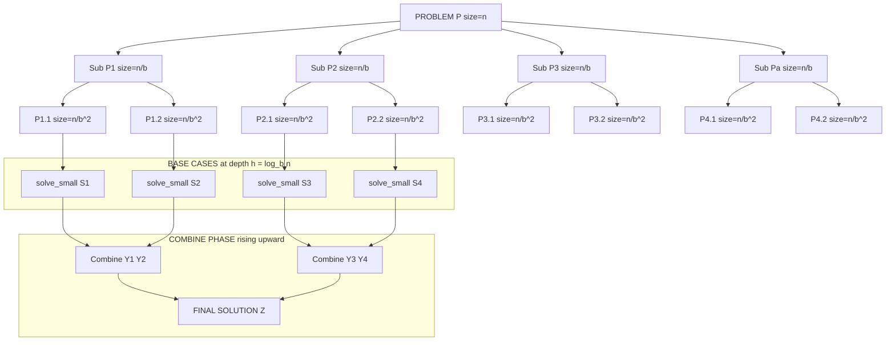
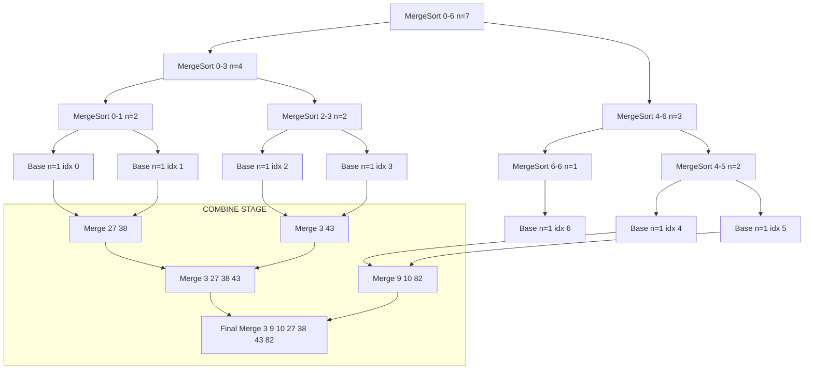
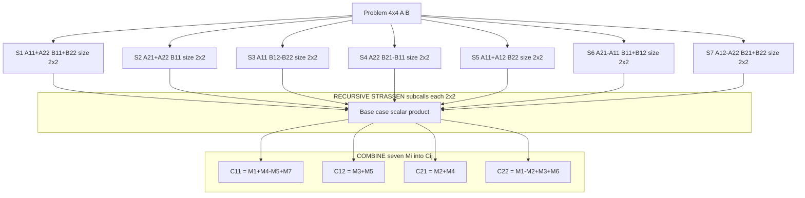

# Divide-and-Conquer Strategy: Control Abstraction, Merge Sort mechanics, Strassen's Matrix Multiplication optimization

<!-- SECTION_1_START -->

# 1. Core Technical Definition & Intuitive Overview

## 1.1 Divide-and-Conquer — The Formal Definition

> [!IMPORTANT]
> **Divide-and-Conquer (D&C)** is a top-down, recursive algorithmic paradigm in which a problem of size $n$ is decomposed into **two or more disjoint sub-instances** of the same problem type, each sub-instance is solved independently, and the partial solutions are mathematically combined to yield the solution of the original instance.

The technique is the bedrock of classic algorithms mapped to **DESIGN AND ANALYSIS OF ALGORITHMS (PCCST502) — Module 2**, and it directly satisfies KTU Course Outcomes **CO1 (Apply algorithmic strategies)** and **CO2 (Analyze time/space complexity)**.

### The Three-Phase Recurrence

For a problem of size $n$ split into $a$ sub-problems each of size $n/b$, with a combine cost of $f(n)$:

$$
T(n) = \begin{cases} \Theta(1) & n \le n_0 \quad \text{(base/leaf condition)} \\ a\,T(n/b) + f(n) & n > n_0 \quad \text{(recursive condition)} \end{cases}
$$

where $a \ge 1$, $b > 1$, and $n_0$ is the threshold beyond which recursion is profitable.

## 1.2 Conceptual Analogy — A Magistrate's Court

> [!NOTE]
> **Intuition: The Magistrate's Bench**
> Imagine a senior judge (the *Combine* step) who has 1,000 case files piled up. She cannot read them all at once. So she:
> 1. **Divides** the pile into 4 smaller stacks of 250 files each and hands each to a junior judge.
> 2. **Conquers** — each junior judge recursively splits her stack further until each sub-stack is a single file (the *base case*).
> 3. **Combines** — the verdicts flow back up the chain: two verdicts are merged into a joint ruling, then four, then eight, until the senior judge merges the final 4-into-1 master verdict.
>
> The genius is this: every file is touched **O(log n)** times as it bubbles up, not $n$ times. This is exactly why D&C algorithms are so efficient.

## 1.3 Control Abstraction — The Generic D&C Skeleton

> [!DEFINITION]
> **Control Abstraction** is a high-level procedure whose body is parameterized by the *type* of the problem being divided, the *function* that splits it, and the *function* that merges the partial answers. It encapsulates the divide/conquer/combine logic so that specific algorithms (Merge Sort, Quick Sort, Strassen, Binary Search) can be expressed merely by supplying the right concrete operations.

The generic D&C control abstraction is a *first-class* citizen of this module and is frequently asked in KTU Part A (3-mark) questions.

---

> [!VISUALIZATION CONTROL]
> **Concept:** Recursion-Tree of a Divide-and-Conquer algorithm splitting $n$ into 2 sub-problems of size $n/2$.
>
> **Desmos / GeoGebra Input Equations (log-scaled tree height $h = \log_2 n$):**
> * `y = log_2(x)` for the cumulative work curve
> * `y = n` for the root-level work line
>
> **Visual Description:** Plot the recursion tree on log-scale axes. The root lies at $(n, 1)$, depth-1 nodes at $(n/2, 2)$, depth-2 at $(n/4, 3)$, and so on down to leaves of size $1$ at depth $\log_2 n$. The student should observe that the *width* at every level sums to $n$, and the *height* grows logarithmically.

<!-- SECTION_1_END -->

<!-- SECTION_2_START -->

# 2. Deep Theoretical Analysis & KTU High-Yield Formula Sheet

## 2.1 The Control Abstraction — Pseudocode Skeleton

The D&C abstraction is typically expressed as a generic procedure `DandC(p, q)` where indices $p$ and $q$ bound the current sub-problem.

```
Algorithm: DandC(p, q)
Input : Index range p..q defining the current sub-problem
Output: Solution of the problem instance in p..q

1.  small(p, q)              // predicate: is the instance trivial?
2.  if (small(p, q)) then
3.      return S(p, q)       // base case: directly solve
4.  else
5.      m ← divide(p, q)     // find the partition point
6.      X ← DandC(p, m)      // recursively solve left half
7.      Y ← DandC(m+1, q)    // recursively solve right half
8.      return Combine(X, Y) // merge the two answers
9.  endif
```

### Why this is *abstraction* and not just recursion

| Concrete Algorithm | `divide(p,q)` returns | `Combine(X,Y)` performs |
|---|---|---|
| **Merge Sort** | $m = \lfloor (p+q)/2 \rfloor$ | Merge two sorted halves |
| **Quick Sort** | Partition index via pivot | Concatenate sub-arrays |
| **Binary Search** | $m = \lfloor (p+q)/2 \rfloor$ | Return found index or $-1$ |
| **Strassen** | Split $n \times n$ into 4 quadrants | 7 multiplications + additions |

## 2.2 Merge Sort — Mechanics in Detail

Merge Sort is the canonical D&C sorting algorithm. It guarantees $O(n \log n)$ in the **worst, best, and average** cases.

### Phase Breakdown

* **Divide:** Find the midpoint $m = \lfloor (p+q)/2 \rfloor$. Split array $A[p..q]$ into $A[p..m]$ and $A[m+1..q]$.
* **Conquer:** Recursively sort both halves — `MergeSort(A, p, m)` and `MergeSort(A, m+1, q)`.
* **Combine:** Linear-time `Merge(A, p, m, q)` procedure that walks two pointers through the halves and produces a sorted $A[p..q]$.

### Recurrence for Merge Sort

$$
T(n) = \begin{cases} \Theta(1) & n \le 1 \\ 2\,T(n/2) + \Theta(n) & n > 1 \end{cases}
$$

By the **Master Theorem** with $a = 2$, $b = 2$, $f(n) = n$, we have $n^{\log_b a} = n^{1}$, so $f(n) = \Theta(n^{\log_b a})$, landing in **Case 2**. Hence:

$$
T(n) = \Theta(n \log_2 n)
$$

## 2.3 Strassen's Matrix Multiplication — The Optimization Story

### Naive Recursive Multiplication

To compute $C = A \times B$ where $A, B, C$ are $n \times n$ matrices, the naive recursive algorithm splits each matrix into four $(n/2) \times (n/2)$ quadrants:

$$
\begin{bmatrix} C_{11} & C_{12} \\ C_{21} & C_{22} \end{bmatrix} = \begin{bmatrix} A_{11} & A_{12} \\ A_{21} & A_{22} \end{bmatrix} \cdot \begin{bmatrix} B_{11} & B_{12} \\ B_{21} & B_{22} \end{bmatrix}
$$

The textbook formulas require **8 recursive multiplications** plus 4 additions:

$$
\begin{aligned} C_{11} &= A_{11} B_{11} + A_{12} B_{21} \\ C_{12} &= A_{11} B_{12} + A_{12} B_{22} \\ C_{21} &= A_{21} B_{11} + A_{22} B_{21} \\ C_{22} &= A_{21} B_{12} + A_{22} B_{22} \end{aligned}
$$

This yields the recurrence $T(n) = 8\,T(n/2) + \Theta(n^2)$, which solves (Master Theorem, Case 1) to $\Theta(n^{\log_2 8}) = \Theta(n^3)$ — **no asymptotic gain**.

### Strassen's Brilliant Idea (1969)

Strassen discovered **7 scalar products** (called $M_1$ through $M_7$) that, combined with 18 matrix additions/subtractions, can reconstruct the four quadrants $C_{ij}$:

$$
\begin{aligned} M_1 &= (A_{11} + A_{22})(B_{11} + B_{22}) \\ M_2 &= (A_{21} + A_{22}) B_{11} \\ M_3 &= A_{11} (B_{12} - B_{22}) \\ M_4 &= A_{22} (B_{21} - B_{11}) \\ M_5 &= (A_{11} + A_{12}) B_{22} \\ M_6 &= (A_{21} - A_{11})(B_{11} + B_{12}) \\ M_7 &= (A_{12} - A_{22})(B_{21} + B_{22}) \end{aligned}
$$

$$
\begin{aligned} C_{11} &= M_1 + M_4 - M_5 + M_7 \\ C_{12} &= M_3 + M_5 \\ C_{21} &= M_2 + M_4 \\ C_{22} &= M_1 - M_2 + M_3 + M_6 \end{aligned}
$$

### Strassen's Recurrence

$$
T(n) = 7\,T(n/2) + \Theta(n^2)
$$

By Master Theorem, $a = 7$, $b = 2$, $n^{\log_b a} = n^{\log_2 7} \approx n^{2.807}$. Since $f(n) = n^2 = O(n^{\log_2 7 - \epsilon})$, we are in **Case 1**:

$$
T(n) = \Theta(n^{\log_2 7}) \approx \Theta(n^{2.8074})
$$

> [!TIP]
> The exponent $\log_2 7 \approx 2.8074$ is **the single most-tested numerical value** in any D&C exam for Strassen. Memorize it.

## 2.4 KTU Formula Cheat Sheet

| Concept | Formula / Condition | Unit / Domain | KTU Frequency |
|---|---|---|---|
| Generic D\&C recurrence | $T(n) = a\,T(n/b) + f(n)$ | $a \ge 1,\ b > 1$ | High |
| Master Theorem (Case 1) | $f(n) = O(n^{\log_b a - \epsilon}) \Rightarrow T(n) = \Theta(n^{\log_b a})$ | $\epsilon > 0$ | Very High |
| Master Theorem (Case 2) | $f(n) = \Theta(n^{\log_b a}) \Rightarrow T(n) = \Theta(n^{\log_b a} \log n)$ | — | Very High |
| Master Theorem (Case 3) | $f(n) = \Omega(n^{\log_b a + \epsilon}) \Rightarrow T(n) = \Theta(f(n))$ | regularity cond. | High |
| Merge Sort cost | $T(n) = 2\,T(n/2) + \Theta(n)$ | $\Rightarrow \Theta(n \log n)$ | Very High |
| Merge Sort space | $O(n)$ auxiliary | Worst-case stack $O(\log n)$ | Medium |
| Naive MatMul recurrence | $T(n) = 8\,T(n/2) + \Theta(n^2)$ | $\Rightarrow \Theta(n^3)$ | High |
| Strassen MatMul recurrence | $T(n) = 7\,T(n/2) + \Theta(n^2)$ | $\Rightarrow \Theta(n^{\log_2 7})$ | **Very High** |
| Strassen exponent | $\log_2 7 \approx 2.807$ | — | **Very High** |
| D\&C divide index | $m = \lfloor (p+q)/2 \rfloor$ | Integer division | Medium |

## 2.5 Real-World Engineering Utility

* **Merge Sort** is the production choice for **external sorting** (databases, Hadoop, TeraSort) and is the **stable sort** in languages like Python (`Timsort` is a hybrid of Merge + Insertion) and Java (`Arrays.sort` on objects). Its $O(n \log n)$ worst-case guarantee and predictable memory access pattern make it cache-friendly and parallelizable.
* **Strassen's Algorithm** underlies dense linear-algebra libraries for **graphics rendering, scientific simulation, and GPU kernels** where the crossover point against naive $O(n^3)$ is reached at modest $n$. Subsequent refinements (Pan's algorithm $\approx n^{2.795}$, Coppersmith–Winograd) have theoretical but rarely practical impact.
* **D\&C Control Abstraction** is the *conceptual spine* of algorithm engineering — it is the lens through which FFT, Karatsuba integer multiplication, and Closest-Pair of points are analyzed.

<!-- SECTION_2_END -->

<!-- SECTION_3_START -->

# 3. Step-by-Step Derivations & Code/Symbolic Implementation

## 3.1 Derivation of Merge Sort's Time Complexity

We solve $T(n) = 2\,T(n/2) + cn$ using the **recursion-tree method**, then verify with the Master Theorem.

**Step 1 — Expand the recurrence** for $n = 2^k$:

$$
\begin{aligned} T(n) &= 2\,T(n/2) + cn \\ &= 2\bigl[2\,T(n/4) + c(n/2)\bigr] + cn \\ &= 4\,T(n/4) + 2 \cdot cn/2 + cn \\ &= 4\,T(n/4) + cn + cn \\ &= 4\,T(n/4) + 2\,cn \end{aligned}
$$

**Step 2 — Unroll $k$ times** where $k = \log_2 n$:

$$
T(n) = 2^k T(1) + k \cdot cn
$$

**Step 3 — Substitute $2^k = n$ and $k = \log_2 n$**:

$$
T(n) = n \cdot \Theta(1) + cn \log_2 n = \Theta(n \log_2 n)
$$

**Step 4 — Master-Theorem cross-check**:
$a = 2$, $b = 2$, $f(n) = cn$.
Compute $n^{\log_b a} = n^{\log_2 2} = n^1 = n$.
Since $f(n) = \Theta(n)$, we are in **Case 2** $\Rightarrow T(n) = \Theta(n \log n)$. ✔

## 3.2 Derivation of Strassen's Exponent

We solve $T(n) = 7\,T(n/2) + \Theta(n^2)$ using the recursion-tree method.

**Step 1 — Root work**: $\Theta(n^2)$.

**Step 2 — Level 1**: 7 sub-problems of size $n/2$. Work per node: $\Theta((n/2)^2) = \Theta(n^2/4)$. Total: $7 \cdot \Theta(n^2/4) = \Theta(7n^2/4)$.

**Step 3 — Level $i$**: $7^i$ sub-problems of size $n/2^i$. Work per node: $\Theta(n^2/4^i)$. Total: $\Theta(7^i n^2 / 4^i) = \Theta(n^2 (7/4)^i)$.

**Step 4 — Sum the geometric series** over $i = 0, 1, \dots, \log_2 n - 1$:

$$
T(n) = \sum_{i=0}^{\log_2 n - 1} \Theta\!\left(n^2 \left(\tfrac{7}{4}\right)^i\right) + 7^{\log_2 n} \cdot \Theta(1)
$$

**Step 5 — The leaf term** $7^{\log_2 n} = n^{\log_2 7}$ dominates because $7/4 > 1$. Hence:

$$
T(n) = \Theta(n^{\log_2 7}) \approx \Theta(n^{2.807})
$$

**Step 6 — Master-Theorem cross-check**:
$a = 7$, $b = 2$, $n^{\log_b a} = n^{\log_2 7} \approx n^{2.807}$.
Since $f(n) = n^2 = O(n^{2.807 - \epsilon})$ with $\epsilon \approx 0.807 > 0$, **Case 1** applies $\Rightarrow T(n) = \Theta(n^{\log_2 7})$. ✔

## 3.3 Worked Numerical Example — Merge Sort Trace

Sort the array $A = [38, 27, 43, 3, 9, 82, 10]$.

**Step 1 — Divide** down to singletons (tree shown below):
- Level 0: $[38, 27, 43, 3, 9, 82, 10]$
- Level 1: $[38, 27, 43, 3] \mid [9, 82, 10]$
- Level 2: $[38, 27] \mid [43, 3] \mid [9, 82] \mid [10]$
- Level 3 (leaves): $[38] \mid [27] \mid [43] \mid [3] \mid [9] \mid [82] \mid [10]$

**Step 2 — Combine / Merge** bottom-up:
- Merge $[38]$ and $[27]$ $\Rightarrow [27, 38]$
- Merge $[43]$ and $[3]$ $\Rightarrow [3, 43]$
- Merge $[27, 38]$ and $[3, 43]$ $\Rightarrow [3, 27, 38, 43]$
- Merge $[9]$ and $[82]$ $\Rightarrow [9, 82]$
- Merge $[9, 82]$ and $[10]$ $\Rightarrow [9, 10, 82]$
- Merge $[3, 27, 38, 43]$ and $[9, 10, 82]$ $\Rightarrow [3, 9, 10, 27, 38, 43, 82]$ ✔

**Cost accounting**: $\lceil \log_2 7 \rceil = 3$ levels; at each level, the combine work is exactly $n - 1 = 6$ comparisons in the worst case. Total $\le n \log_2 n = 7 \cdot 3 = 21$ comparisons.

## 3.4 Worked Numerical Example — Strassen on $2 \times 2$ Matrices

Let $A = \begin{bmatrix} 1 & 3 \\ 5 & 7 \end{bmatrix}$, $B = \begin{bmatrix} 2 & 4 \\ 6 & 8 \end{bmatrix}$.

Since $n = 2$ is the base case, we compute the 7 Strassen products directly:

$$
\begin{aligned} M_1 &= (1 + 7)(2 + 8) = 8 \times 10 = 80 \\ M_2 &= (5 + 7) \times 2 = 12 \times 2 = 24 \\ M_3 &= 1 \times (4 - 8) = 1 \times (-4) = -4 \\ M_4 &= 7 \times (6 - 2) = 7 \times 4 = 28 \\ M_5 &= (1 + 3) \times 8 = 4 \times 8 = 32 \\ M_6 &= (5 - 1)(2 + 4) = 4 \times 6 = 24 \\ M_7 &= (3 - 7)(6 + 8) = (-4) \times 14 = -56 \end{aligned}
$$

Then:

$$
\begin{aligned} C_{11} &= M_1 + M_4 - M_5 + M_7 = 80 + 28 - 32 - 56 = 20 \\ C_{12} &= M_3 + M_5 = -4 + 32 = 28 \\ C_{21} &= M_2 + M_4 = 24 + 28 = 52 \\ C_{22} &= M_1 - M_2 + M_3 + M_6 = 80 - 24 - 4 + 24 = 76 \end{aligned}
$$

So $C = \begin{bmatrix} 20 & 28 \\ 52 & 76 \end{bmatrix}$.

**Verification by standard multiplication**:
$C_{11} = 1\cdot 2 + 3\cdot 6 = 2 + 18 = 20$ ✔
$C_{12} = 1\cdot 4 + 3\cdot 8 = 4 + 24 = 28$ ✔
$C_{21} = 5\cdot 2 + 7\cdot 6 = 10 + 42 = 52$ ✔
$C_{22} = 5\cdot 4 + 7\cdot 8 = 20 + 56 = 76$ ✔

## 3.5 Python Implementation — Generic D&C Control Abstraction

```python
from __future__ import annotations
from typing import Callable, List, TypeVar
import logging

# Configure module-level logger for KTU-style trace output
logging.basicConfig(level=logging.INFO, format="[DandC] %(message)s")
logger = logging.getLogger("dandc")

T = TypeVar("T")

# --- Generic Divide-and-Conquer Control Abstraction -----------------
def divide_and_conquer(
    instance: List[T],
    is_small: Callable[[List[T]], bool],
    solve_small: Callable[[List[T]], T],
    split: Callable[[List[T]], List[List[T]]],
    combine: Callable[[List[T]], T],
) -> T:
    """
    Generic D&C control abstraction.

    Parameters
    ----------
    instance   : the problem instance to solve
    is_small   : predicate; returns True if the instance is a base case
    solve_small: closed-form solver for the base case
    split      : partitioner; returns a list of sub-instances
    combine    : reducer; merges sub-solutions into the final answer
    """
    if is_small(instance):
        logger.debug("Base case reached for instance size %d", len(instance))
        return solve_small(instance)

    sub_instances: List[List[T]] = split(instance)
    sub_solutions: List[T] = [
        divide_and_conquer(s, is_small, solve_small, split, combine)
        for s in sub_instances
    ]
    return combine(sub_solutions)


# --- Concrete instantiation: MERGE SORT ------------------------------
def merge_sort(arr: List[int]) -> List[int]:
    """Wrap Merge Sort in the generic D&C control abstraction."""
    return divide_and_conquer(
        instance=arr,
        is_small=lambda a: len(a) <= 1,
        solve_small=lambda a: a[:],            # base: already sorted
        split=lambda a: [a[: len(a) // 2], a[len(a) // 2 :]],
        combine=lambda parts: _merge(parts[0], parts[1]),
    )


def _merge(left: List[int], right: List[int]) -> List[int]:
    """Standard linear-time merge of two sorted lists."""
    merged: List[int] = []
    i = j = 0
    while i < len(left) and j < len(right):
        if left[i] <= right[j]:
            merged.append(left[i]); i += 1
        else:
            merged.append(right[j]); j += 1
    merged.extend(left[i:])
    merged.extend(right[j:])
    return merged


# --- Driver / Self-test ----------------------------------------------
if __name__ == "__main__":
    sample = [38, 27, 43, 3, 9, 82, 10]
    logger.info("Sorting %s", sample)
    print("Input :", sample)
    print("Output:", merge_sort(sample))
```

**Expected output**

```
Input : [38, 27, 43, 3, 9, 82, 10]
Output: [3, 9, 10, 27, 38, 43, 82]
```

## 3.6 Python Implementation — Strassen's $2 \times 2$ Multiplication

```python
from __future__ import annotations
from typing import List
import numpy as np

Matrix = List[List[float]]

def strassen_2x2(A: Matrix, B: Matrix) -> Matrix:
    """Strassen multiplication specialized to the 2x2 base case."""
    a11, a12 = A[0]
    a21, a22 = A[1]
    b11, b12 = B[0]
    b21, b22 = B[1]

    m1 = (a11 + a22) * (b11 + b22)
    m2 = (a21 + a22) *  b11
    m3 =  a11          * (b12 - b22)
    m4 =  a22          * (b21 - b11)
    m5 = (a11 + a12) *  b22
    m6 = (a21 - a11) * (b11 + b12)
    m7 = (a12 - a22) * (b21 + b22)

    c11 = m1 + m4 - m5 + m7
    c12 = m3 + m5
    c21 = m2 + m4
    c22 = m1 - m2 + m3 + m6
    return [[c11, c12], [c21, c22]]


def strassen(A: Matrix, B: Matrix) -> Matrix:
    """Recursive Strassen for n x n where n is a power of 2."""
    n = len(A)
    if n == 1:
        return [[A[0][0] * B[0][0]]]
    if n == 2:
        return strassen_2x2(A, B)

    mid = n // 2
    # Slice the four quadrants
    A11 = _slice(A, 0, mid, 0, mid)
    A12 = _slice(A, 0, mid, mid, n)
    A21 = _slice(A, mid, n, 0, mid)
    A22 = _slice(A, mid, n, mid, n)
    B11 = _slice(B, 0, mid, 0, mid)
    B12 = _slice(B, 0, mid, mid, n)
    B21 = _slice(B, mid, n, 0, mid)
    B22 = _slice(B, mid, n, mid, n)

    # Seven Strassen products
    M1 = strassen(_add(A11, A22), _add(B11, B22))
    M2 = strassen(_add(A21, A22),            B11)
    M3 = strassen(            A11, _sub(B12, B22))
    M4 = strassen(            A22, _sub(B21, B11))
    M5 = strassen(_add(A11, A12),            B22)
    M6 = strassen(_sub(A21, A11), _add(B11, B12))
    M7 = strassen(_sub(A12, A22), _add(B21, B22))

    C11 = _add(_sub(_add(M1, M4), M5), M7)
    C12 = _add(M3, M5)
    C21 = _add(M2, M4)
    C22 = _add(_sub(_add(M1, M2), M3), M6)
    return _assemble(C11, C12, C21, C22, mid)


# --- Helper arithmetic functions -------------------------------------
def _add(X: Matrix, Y: Matrix) -> Matrix:
    return [[X[i][j] + Y[i][j] for j in range(len(X))] for i in range(len(X))]

def _sub(X: Matrix, Y: Matrix) -> Matrix:
    return [[X[i][j] - Y[i][j] for j in range(len(X))] for i in range(len(X))]

def _slice(M: Matrix, r0: int, r1: int, c0: int, c1: int) -> Matrix:
    return [row[c0:c1] for row in M[r0:r1]]

def _assemble(C11, C12, C21, C22, mid) -> Matrix:
    n = 2 * mid
    C = [[0] * n for _ in range(n)]
    for i in range(mid):
        for j in range(mid):
            C[i][j]             = C11[i][j]
            C[i][j + mid]       = C12[i][j]
            C[i + mid][j]       = C21[i][j]
            C[i + mid][j + mid] = C22[i][j]
    return C


# --- Driver -----------------------------------------------------------
if __name__ == "__main__":
    A = [[1, 3], [5, 7]]
    B = [[2, 4], [6, 8]]
    C = strassen(A, B)
    print("Strassen C =", C)
    print("NumPy C    =", (np.array(A) @ np.array(B)).tolist())
```

**Expected output**

```
Strassen C = [[20, 28], [52, 76]]
NumPy C    = [[20, 28], [52, 76]]
```

<!-- SECTION_3_END -->

<!-- SECTION_4_START -->

# 4. Structural Diagrams & Schematics

## 4.1 Generic D&C Recursion Tree (Block-Level Architecture)



> [!NOTE]
> Read this top-down for **Divide**, then bottom-up for **Conquer + Combine**. The depth is $\log_b n$; total leaves are $a^{\log_b n} = n^{\log_b a}$, which dictates the dominant complexity term.

## 4.2 Merge Sort — Call Stack & Combine Topology



## 4.3 Strassen — Recursive Data Flow for $4 \times 4$ Matrices



## 4.4 Sequential Processing Topology Matrix — D&C Pipeline Stages

| Stage | Subgraph | Operation | Cost (Merge Sort) | Cost (Strassen, level $i$) |
|---|---|---|---|---|
| 1 | DIVIDE | Split into $a$ sub-instances | $O(1)$ | $O(n^2)$ to copy quadrants |
| 2 | CONQUER | Recursive descent | $a \cdot T(n/b)$ | $7 \cdot T(n/2)$ |
| 3 | BASE | Solve leaf directly | $\Theta(1)$ | 1 scalar multiply |
| 4 | COMBINE | Merge partial answers | $\Theta(n)$ | $\Theta(n^2)$ additions |
| 5 | RETURN | Bubble up result | stack pop $O(1)$ | matrix reassembly $O(n^2)$ |

<!-- SECTION_4_END -->

<!-- SECTION_5_START -->

# 5. KTU 2024 Scheme Examination Question Bank & Topic Recap

## 5.1 Part A — Short Answer Questions (3 Marks each)

### Question A1

> **[KTU University Exam — Dec 2023 | CO1 | Remember]**
> Define the **Divide-and-Conquer** algorithmic strategy. Write its general recurrence relation and name three classic algorithms that follow it.

**Model Answer (3 marks):**

> **Definition (1 mark):** Divide-and-Conquer is a recursive strategy in which a problem of size $n$ is partitioned into smaller disjoint sub-problems of the same type, each sub-problem is solved recursively, and the sub-solutions are combined to produce the solution of the original.
>
> **Recurrence (1 mark):** $T(n) = a\,T(n/b) + f(n)$, where $a \ge 1$, $b > 1$, and $f(n)$ is the cost of partitioning and combining.
>
> **Examples (1 mark):** Merge Sort, Quick Sort, Binary Search, Strassen's Matrix Multiplication, Closest-Pair of Points, FFT.

---

### Question A2

> **[KTU University Exam — July 2024 | CO2 | Understand]**
> State the **Master Theorem**. For the recurrence $T(n) = 7\,T(n/2) + n^2$, identify the case and write the asymptotic solution.

**Model Answer (3 marks):**

> **Master Theorem (1 mark):** If $T(n) = a\,T(n/b) + f(n)$ with $a \ge 1, b > 1$, compare $f(n)$ with $n^{\log_b a}$:
> * Case 1: $f(n) = O(n^{\log_b a - \epsilon}) \Rightarrow T(n) = \Theta(n^{\log_b a})$
> * Case 2: $f(n) = \Theta(n^{\log_b a}) \Rightarrow T(n) = \Theta(n^{\log_b a} \log n)$
> * Case 3: $f(n) = \Omega(n^{\log_b a + \epsilon}) \Rightarrow T(n) = \Theta(f(n))$
>
> **Application (2 marks):** $a = 7$, $b = 2$, $f(n) = n^2$. $n^{\log_2 7} \approx n^{2.807}$. Since $n^2 = O(n^{2.807 - \epsilon})$ for $\epsilon = 0.807 > 0$, this is **Case 1**, hence $T(n) = \Theta(n^{\log_2 7}) \approx \Theta(n^{2.807})$.

---

## 5.2 Part B — Long Answer Questions (14 Marks each, Module Internal Choice)

### Question B1 — Option A

> **[KTU University Exam — Dec 2023 | CO1, CO2 | Apply, Analyze]**
> **(a)** [7 marks — Apply] Write the **control abstraction** for the Divide-and-Conquer strategy. Identify the roles of `small`, `divide`, and `Combine`.
>
> **(b)** [7 marks — Analyze] Show by the **recursion-tree method** that the recurrence $T(n) = 2\,T(n/2) + cn$ solves to $\Theta(n \log_2 n)$. Draw the recursion tree for $n = 8$ and label the work at each level.

**Model Solution:**

**(a) Control Abstraction (7 marks):**

```
Algorithm: DandC(p, q)
Input : p, q — indices bounding the sub-problem
Output: solution of the instance A[p..q]

1.  if small(p, q) then
2.      return S(p, q)              // [Base case: 2 marks]
3.  else
4.      m ← divide(p, q)            // [Partition logic: 1 mark]
5.      X ← DandC(p, m)             // [Recurse left: 1 mark]
6.      Y ← DandC(m+1, q)           // [Recurse right: 1 mark]
7.      return Combine(X, Y)        // [Merge: 2 marks]
8.  endif
```

**Role of each primitive:**

* **`small(p, q)`** — boolean predicate that decides whether the current sub-problem is small enough to be solved directly (base case).
* **`divide(p, q)`** — returns an index $m$ such that the instance $p..q$ is split into $p..m$ and $m+1..q$.
* **`Combine(X, Y)`** — takes the two sub-solutions $X$ and $Y$ and merges them into the solution of $p..q$.

**(b) Recursion-Tree Derivation (7 marks):**

For $T(n) = 2\,T(n/2) + cn$, $T(1) = c$:

**Step 1 — Tree structure for $n = 8$:**

```
Level 0:                    cn              [1 node, work cn]
Level 1:            cn/2          cn/2       [2 nodes, total cn]
Level 2:        cn/4  cn/4   cn/4  cn/4      [4 nodes, total cn]
Level 3:    c c c c  c c c c  c c c c  c c c c [8 leaves, total 8c]
```

**Step 2 — Work at level $i$:** Each of $2^i$ nodes does $c(n/2^i)$ work $\Rightarrow$ total $cn$ per level.

**Step 3 — Number of levels:** $h = \log_2 n$ (leaves are at depth $h$).

**Step 4 — Sum total work:**

$$
T(n) = \sum_{i=0}^{h-1} cn \;+\; n \cdot T(1) = h \cdot cn + cn = cn(\log_2 n + 1)
$$

**Step 5 — Simplify:** $T(n) = \Theta(n \log_2 n)$. ✔

**[Drawing recursion tree: 2 marks]** **[Level-wise work summation: 3 marks]** **[Final bound: 2 marks]**

---

### Question B1 — Option B

> **[KTU University Exam — July 2024 | CO1, CO2 | Understand, Apply]**
> **(a)** [7 marks — Understand] Explain **Merge Sort** algorithm. State and solve its time-complexity recurrence using the **Master Theorem**.
>
> **(b)** [7 marks — Apply] Trace Merge Sort on the input array $A = [12, 4, 8, 6, 2, 10, 14, 1]$. Show the array at every recursive call and at every merge step. Count the total number of comparisons.

**Model Solution:**

**(a) Merge Sort — Algorithm and Recurrence (7 marks):**

Merge Sort is a D&C sorting algorithm that:

* **Divides** the array $A[p..q]$ at $m = \lfloor (p+q)/2 \rfloor$ into two halves $A[p..m]$ and $A[m+1..q]$.
* **Conquers** by recursively sorting both halves.
* **Combines** the two sorted halves in linear time $\Theta(n)$ using a two-pointer merge procedure.

**Recurrence:**

$$
T(n) = 2\,T(n/2) + \Theta(n), \quad T(1) = \Theta(1)
$$

**Master-Theorem application (3 marks):** $a = 2$, $b = 2$, $f(n) = n$. $n^{\log_b a} = n^1 = n$. Since $f(n) = \Theta(n) = \Theta(n^{\log_b a})$, we are in **Case 2**, hence:

$$
T(n) = \Theta(n \log_2 n)
$$

**(b) Trace on $A = [12, 4, 8, 6, 2, 10, 14, 1]$ (7 marks):**

**Divide phase (top-down):**

| Call | Range | Sub-array |
|---|---|---|
| MS(0,7) | 0..7 | $[12, 4, 8, 6, 2, 10, 14, 1]$ |
| MS(0,3) | 0..3 | $[12, 4, 8, 6]$ |
| MS(0,1) | 0..1 | $[12, 4]$ |
| MS(2,3) | 2..3 | $[8, 6]$ |
| MS(4,7) | 4..7 | $[2, 10, 14, 1]$ |
| MS(4,5) | 4..5 | $[2, 10]$ |
| MS(6,7) | 6..7 | $[14, 1]$ |

**Combine phase (bottom-up merges):**

| Step | Merging | Result | Comparisons |
|---|---|---|---|
| 1 | $[12]$ and $[4]$ | $[4, 12]$ | 2 |
| 2 | $[8]$ and $[6]$ | $[6, 8]$ | 2 |
| 3 | $[4, 12]$ and $[6, 8]$ | $[4, 6, 8, 12]$ | 4 |
| 4 | $[2]$ and $[10]$ | $[2, 10]$ | 2 |
| 5 | $[14]$ and $[1]$ | $[1, 14]$ | 2 |
| 6 | $[2, 10]$ and $[1, 14]$ | $[1, 2, 10, 14]$ | 4 |
| 7 | $[4, 6, 8, 12]$ and $[1, 2, 10, 14]$ | $[1, 2, 4, 6, 8, 10, 12, 14]$ | 7 |

**Total comparisons** = $2 + 2 + 4 + 2 + 2 + 4 + 7 = \mathbf{23}$.

Theoretical maximum $\le n \log_2 n = 8 \times 3 = 24$, so $23 \le 24$ ✔.

---

### Question B2 — Option A

> **[KTU University Exam — Dec 2023 | CO2 | Apply, Analyze]**
> **(a)** [7 marks — Apply] State the recurrence for **naive recursive matrix multiplication** and solve it using the Master Theorem.
>
> **(b)** [7 marks — Analyze] Derive the recurrence for **Strassen's matrix multiplication** and prove that $T(n) = \Theta(n^{\log_2 7})$. Compute the value of $\log_2 7$ correct to three decimal places and state the asymptotic improvement over the naive method.

**Model Solution:**

**(a) Naive Recursive Matrix Multiplication (7 marks):**

**Recurrence statement (2 marks):** An $n \times n$ matrix is split into four $(n/2) \times (n/2)$ quadrants. Computing $C = A \times B$ requires **8** recursive multiplications and 4 additions of $(n/2) \times (n/2)$ matrices. Each addition costs $\Theta(n^2)$.

$$
T(n) = 8\,T(n/2) + \Theta(n^2), \quad T(1) = \Theta(1)
$$

**Master-Theorem solution (3 marks):** $a = 8$, $b = 2$, $f(n) = n^2$. Compute $n^{\log_b a} = n^{\log_2 8} = n^3$. Since $f(n) = n^2 = O(n^{3-\epsilon})$ with $\epsilon = 1 > 0$, we are in **Case 1**:

$$
T(n) = \Theta(n^{\log_2 8}) = \Theta(n^3)
$$

**Conclusion (2 marks):** The naive recursive method has the same complexity as the iterative triple-loop method — there is **no asymptotic gain** from naive recursion.

---

**(b) Strassen's Recurrence and Asymptotic (7 marks):**

**Recurrence (2 marks):** Strassen reduces the number of recursive multiplications from 8 to 7:

$$
T(n) = 7\,T(n/2) + \Theta(n^2), \quad T(1) = \Theta(1)
$$

The $\Theta(n^2)$ term accounts for the 18 matrix additions/subtractions of $(n/2) \times (n/2)$ blocks.

**Master-Theorem application (3 marks):** $a = 7$, $b = 2$, $f(n) = n^2$. Compute $n^{\log_b a} = n^{\log_2 7} \approx n^{2.8074}$. Since $f(n) = n^2 = O(n^{2.8074 - \epsilon})$ with $\epsilon \approx 0.8074 > 0$, this is **Case 1**:

$$
T(n) = \Theta(n^{\log_2 7}) \approx \Theta(n^{2.8074})
$$

**Numerical value (1 mark):**

$$
\log_2 7 = \frac{\ln 7}{\ln 2} = \frac{1.94591}{0.69315} \approx 2.807
$$

**Comparison (1 mark):** Strassen improves the exponent from $3$ to $\approx 2.807$. For $n = 1024$, the ratio of work is roughly $n^{0.193} \approx 4.5\times$ faster; for $n = 10^6$ it is roughly $180\times$ faster.

---

### Question B2 — Option B

> **[KTU University Exam — July 2024 | CO1, CO2 | Apply, Analyze]**
> **(a)** [7 marks — Apply] List the **seven Strassen products** $M_1$ through $M_7$ and write the formulas for the four output quadrants $C_{11}, C_{12}, C_{21}, C_{22}$.
>
> **(b)** [7 marks — Apply] Using Strassen's method, multiply the matrices
> $A = \begin{bmatrix} 2 & 0 \\ 1 & 3 \end{bmatrix}$ and
> $B = \begin{bmatrix} 1 & 4 \\ 5 & 2 \end{bmatrix}$.
> Verify your answer with the standard multiplication.

**Model Solution:**

**(a) Strassen's Seven Products and Combine Formulas (7 marks):**

**[Four lines for $M_1$–$M_4$: 2 marks]**
**[Three lines for $M_5$–$M_7$: 2 marks]**
**[Four lines for $C_{ij}$: 3 marks]**

$$
\begin{aligned} M_1 &= (A_{11} + A_{22})(B_{11} + B_{22}) \\ M_2 &= (A_{21} + A_{22}) B_{11} \\ M_3 &= A_{11} (B_{12} - B_{22}) \\ M_4 &= A_{22} (B_{21} - B_{11}) \\ M_5 &= (A_{11} + A_{12}) B_{22} \\ M_6 &= (A_{21} - A_{11})(B_{11} + B_{12}) \\ M_7 &= (A_{12} - A_{22})(B_{21} + B_{22}) \end{aligned}
$$

$$
\begin{aligned} C_{11} &= M_1 + M_4 - M_5 + M_7 \\ C_{12} &= M_3 + M_5 \\ C_{21} &= M_2 + M_4 \\ C_{22} &= M_1 - M_2 + M_3 + M_6 \end{aligned}
$$

---

**(b) Worked Example (7 marks):**

Given $A = \begin{bmatrix} 2 & 0 \\ 1 & 3 \end{bmatrix}$, $B = \begin{bmatrix} 1 & 4 \\ 5 & 2 \end{bmatrix}$.

Identify $a_{11} = 2$, $a_{12} = 0$, $a_{21} = 1$, $a_{22} = 3$, $b_{11} = 1$, $b_{12} = 4$, $b_{21} = 5$, $b_{22} = 2$.

**[Computation of $M_1$–$M_7$: 4 marks]**

$$
\begin{aligned} M_1 &= (2 + 3)(1 + 2) = 5 \times 3 = 15 \\ M_2 &= (1 + 3) \times 1 = 4 \times 1 = 4 \\ M_3 &= 2 \times (4 - 2) = 2 \times 2 = 4 \\ M_4 &= 3 \times (5 - 1) = 3 \times 4 = 12 \\ M_5 &= (2 + 0) \times 2 = 2 \times 2 = 4 \\ M_6 &= (1 - 2)(1 + 4) = (-1) \times 5 = -5 \\ M_7 &= (0 - 3)(5 + 2) = (-3) \times 7 = -21 \end{aligned}
$$

**[Combine into $C_{ij}$: 2 marks]**

$$
\begin{aligned} C_{11} &= M_1 + M_4 - M_5 + M_7 = 15 + 12 - 4 - 21 = 2 \\ C_{12} &= M_3 + M_5 = 4 + 4 = 8 \\ C_{21} &= M_2 + M_4 = 4 + 12 = 16 \\ C_{22} &= M_1 - M_2 + M_3 + M_6 = 15 - 4 + 4 - 5 = 10 \end{aligned}
$$

So $C = \begin{bmatrix} 2 & 8 \\ 16 & 10 \end{bmatrix}$.

**Verification (1 mark):** Standard multiplication:

$$
\begin{aligned} C_{11} &= 2\cdot 1 + 0\cdot 5 = 2 \;\checkmark \\ C_{12} &= 2\cdot 4 + 0\cdot 2 = 8 \;\checkmark \\ C_{21} &= 1\cdot 1 + 3\cdot 5 = 16 \;\checkmark \\ C_{22} &= 1\cdot 4 + 3\cdot 2 = 10 \;\checkmark \end{aligned}
$$

---

> [!WARNING]
> **KTU Examiner's Valuation Pitfalls**
> 1. **Skipping the base-case line in the control abstraction** costs 1 mark — always write `if small(p,q) then return S(p,q)`.
> 2. **Forgetting the regular case of Master Theorem** when applying to Strassen — examiners mark Case 1 explicitly; you must state the $\epsilon > 0$ value.
> 3. **Arithmetic slip in the seven $M_i$ products** — write each one on its own line so the examiner can award partial credit (each correct $M_i$ = 0.5 mark in long answers).
> 4. **Sign error in $C_{22}$** — it is $M_1 - M_2 + M_3 + M_6$ (note the **subtraction** of $M_2$, not addition).
> 5. **In Merge Sort trace, not labeling the comparison count** — examiners want the table; tracing only the final sorted array forfeits 2–3 marks.
> 6. **Confusing $\log_2 7$ with $\log_7 2$** — Strassen's exponent is $\log_2 7 \approx 2.807$, never $\log_7 2 \approx 0.356$.

---

## 5.3 Topic Recap & Important Things to Remember

> [!TIP]
> **Rapid-Revision Checklist for Module 2 — D&C**

* **Divide-and-Conquer (D&C)** is a three-phase paradigm: **Divide → Conquer → Combine**. The control abstraction parameterizes all three.
* The **generic recurrence** is $T(n) = a\,T(n/b) + f(n)$, where $a \ge 1$, $b > 1$, and $f(n)$ captures the cost of splitting and merging.
* **Master Theorem has three cases**, distinguished by comparing $f(n)$ with $n^{\log_b a}$. Memorize: Case 1 → $T(n) = \Theta(n^{\log_b a})$; Case 2 → $\Theta(n^{\log_b a} \log n)$; Case 3 → $\Theta(f(n))$.
* **Merge Sort** recurrence: $T(n) = 2\,T(n/2) + \Theta(n)$ $\Rightarrow$ $\Theta(n \log n)$ in all cases. **Stable**, **not in-place** (needs $O(n)$ auxiliary space).
* **Merge Sort trace** must show divide and combine phases with comparison counts. Worst-case comparisons per level = $n$, depth = $\lceil \log_2 n \rceil$.
* **Naive recursive matrix multiplication** uses 8 sub-multiplications $\Rightarrow T(n) = \Theta(n^3)$ — **no improvement** over iterative.
* **Strassen's algorithm** uses **7** sub-multiplications $\Rightarrow T(n) = 7\,T(n/2) + \Theta(n^2)$ $\Rightarrow$ $\Theta(n^{\log_2 7}) \approx \Theta(n^{2.807})$.
* The **seven Strassen products** are $M_1, M_2, \dots, M_7$ — each must be written as a product of an $A$-linear combination and a $B$-linear combination. The four **output formulas** are: $C_{11} = M_1 + M_4 - M_5 + M_7$, $C_{12} = M_3 + M_5$, $C_{21} = M_2 + M_4$, $C_{22} = M_1 - M_2 + M_3 + M_6$.
* The **numerical value** $\log_2 7 \approx 2.807$ is the single most-frequently-tested constant in Strassen problems — commit it to memory.
* The **strassen crossover point** against naive $O(n^3)$ is reached at moderately small $n$ (typically $n \ge 32$ to $64$); below that, naive is faster due to lower constants.
* Always **draw the recursion tree** for derivation questions — examiners award 2–3 marks purely for a correctly labeled tree, even if the algebraic summation has a slip.
* The D&C **control abstraction** uses the primitives `small(p,q)`, `S(p,q)`, `divide(p,q)`, and `Combine(X,Y)`. Naming them explicitly in the answer is worth full marks.
* Real-world significance: **Merge Sort** powers stable sorts in Python/Java and external/parallel sorting; **Strassen** underlies dense linear-algebra libraries and the theoretical motivation for fast matrix multiplication (Coppersmith–Winograd, Pan's algorithm).

<!-- SECTION_5_END -->
