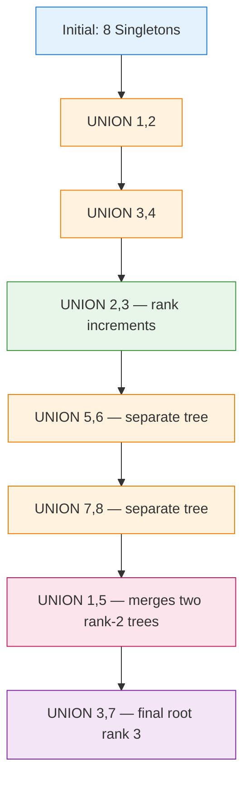
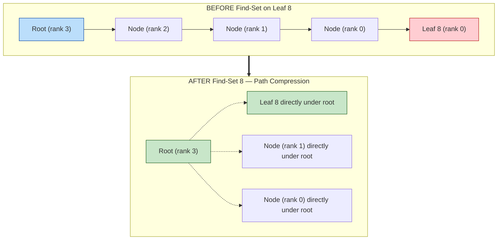
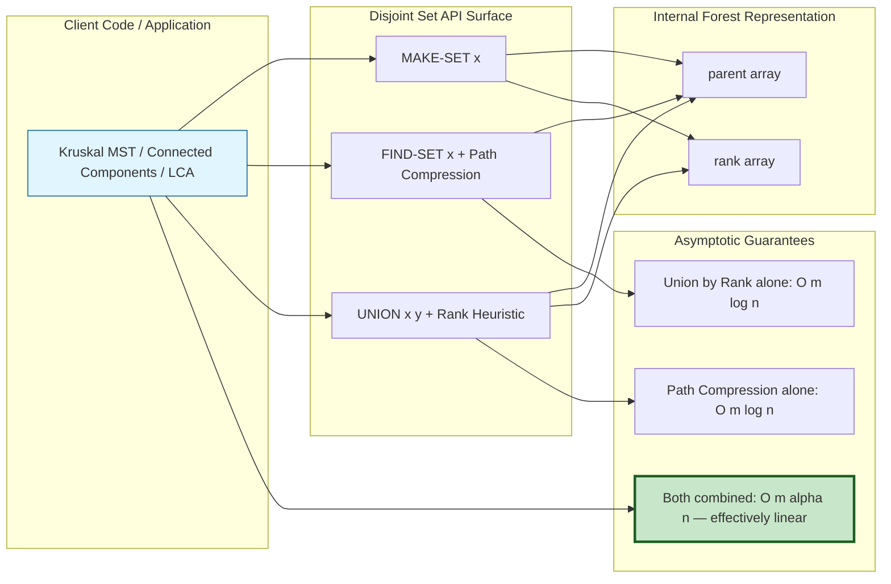
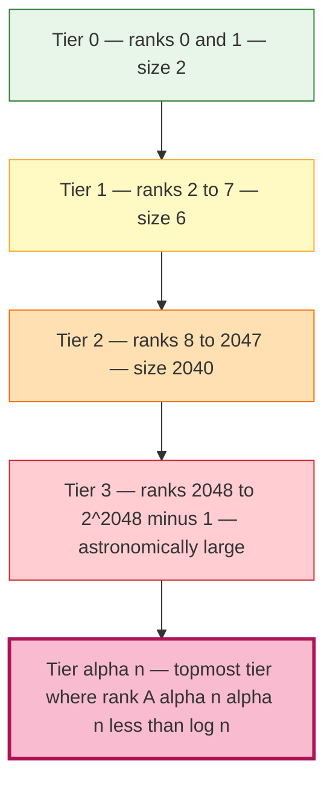

# Analysis of union by rank with path compression

<!-- SECTION_1_START -->
# Analysis of Union by Rank with Path Compression

> [!IMPORTANT]
> **KTU 2024 Scheme | Module 2 | Disjoint Sets**
> This is a **high-weight, high-yield topic** frequently asked for **full 14-mark derivations** in KTU ESE. Mastering the amortized analysis using the **potential method (Tarjan's method)** is the key to scoring full marks.

## 1.1 Formal Definition

A **Disjoint Set Data Structure** (also called **Union-Find**) maintains a collection $\mathcal{S} = \{S_1, S_2, \dots, S_k\}$ of pairwise disjoint dynamic sets. Each set is identified by a **representative**, which is one of its members.

The structure supports three core operations on $n$ singleton elements:

$$
\begin{aligned}
\text{MAKE-SET}(x) &\rightarrow \text{Creates a new set whose only member (and rep.) is } x. \\
\text{UNION}(x, y) &\rightarrow \text{Unites the dynamic sets containing } x \text{ and } y. \\
\text{FIND-SET}(x) &\rightarrow \text{Returns a pointer to the representative of the set containing } x.
\end{aligned}
$$

When combined, the two heuristics **Union by Rank** and **Path Compression** make any sequence of $m$ MAKE-SET, FIND-SET, and UNION operations on $n$ elements run in **$O(m \cdot \alpha(n))$** amortized time (Tarjan, 1975; 1983), where $\alpha$ is the **inverse Ackermann function**.

## 1.2 Conceptual Analogy — The "Corporate Hierarchy"

> [!NOTE]
> **Intuitive Picture: Climbing the Corporate Ladder**
>
> Imagine a company where every employee reports to a manager, and managers report to higher managers, all the way up to the **CEO** (the representative).
>
> 1. **Union by Rank** is like a merger policy: *"When two companies merge, the smaller CEO bows down to the larger CEO."* This keeps the resulting hierarchy **shallow and balanced**.
> 2. **Path Compression** is like a smart new employee: *"Instead of remembering only my direct boss, I ask my colleagues for the CEO's name and bypass all middle managers."* This **flattens** the tree after every lookup.
>
> Combined, the hierarchy becomes *almost flat* — so flat that the height grows slower than $\log \log \dots \log n$ (a tower of logs), which is essentially **constant** for all practical $n$ in the universe.

## 1.3 The Two Heuristics — Plain English Definitions

| Heuristic | Where Applied | What It Does | Effect |
| :--- | :--- | :--- | :--- |
| **Union by Rank** | During `UNION` | Attaches the **shorter tree's root** as a child of the **taller tree's root**. | Keeps the resulting tree's height $\le \lfloor \log_2 n \rfloor$. |
| **Path Compression** | During `FIND-SET` | Walks from a node $x$ to the root, then **re-wires every node on the path directly to the root**. | Drastically shortens future paths. |

> [!TIP]
> **KTU Board Tip:** A common trick question asks *"Why not use union by size instead of union by rank?"* — Both are valid and give the same asymptotic bound; the analysis just uses a slightly different potential function.

## 1.4 Visualizing the Heuristics

> [!VISUALIZATION CONTROL]
> **Concept:** Evolution of a Disjoint-Set Forest under Union by Rank + Path Compression
> **GeoGebra / Desmos Input (Discrete Tree):**
> * Initial: Nodes $\{1, 2, 3, 4, 5, 6, 7, 8\}$ as singletons.
> * `UNION(1,2)`, `UNION(3,4)`, `UNION(5,6)`, `UNION(7,8)`, then chain them into one set.
> **Visual Description:** You should observe that **after a single `FIND-SET(8)`** (the deepest leaf), the entire left spine of the tree collapses into a star, with every leaf pointing directly at the root. The tree looks *almost flat* — visually confirming the inverse-Ackermann bound.
<!-- SECTION_1_END -->

<!-- SECTION_2_START -->
# Deep Theoretical Analysis & KTU High-Yield Formula Sheet

## 2.1 The Three Operations in Pseudocode

$$
\begin{aligned}
&\textbf{MAKE-SET}(x): \\
&\quad \text{parent}[x] \leftarrow x \\
&\quad \text{rank}[x] \leftarrow 0 \\
&\quad \text{size}[x] \leftarrow 1 \\
\\
&\textbf{UNION}(x, y): \\
&\quad r_x \leftarrow \text{FIND-SET}(x) \\
&\quad r_y \leftarrow \text{FIND-SET}(y) \\
&\quad \textbf{if } r_x \neq r_y \textbf{ then} \\
&\quad\quad \textbf{if } \text{rank}[r_x] > \text{rank}[r_y] \textbf{ then } \text{parent}[r_y] \leftarrow r_x \\
&\quad\quad \textbf{else } \text{parent}[r_x] \leftarrow r_y \\
&\quad\quad\quad \textbf{if } \text{rank}[r_x] = \text{rank}[r_y] \textbf{ then } \text{rank}[r_y] \leftarrow \text{rank}[r_y] + 1 \\
&\quad \textbf{return } r_x \text{ or } r_y \\
\\
&\textbf{FIND-SET}(x): \\
&\quad \textbf{if } x \neq \text{parent}[x] \textbf{ then} \\
&\quad\quad \text{parent}[x] \leftarrow \textbf{FIND-SET}(\text{parent}[x]) \quad \triangleright \text{Path Compression} \\
&\quad \textbf{return } \text{parent}[x]
\end{aligned}
$$

> [!NOTE]
> **Definition of Rank:** $\text{rank}[x]$ is an upper bound on the **height** of the subtree rooted at $x$. It increases **only** when two trees of **equal rank** are unioned. Thus $\text{rank}[x]$ is monotonically non-decreasing over the lifetime of $x$.

## 2.2 Key Properties (Must Memorize for KTU)

1. **Rank Property:** For any node $x$ with parent $p = \text{parent}[x]$, $\text{rank}[x] < \text{rank}[p]$ strictly (if $x$ is not a root).
2. **Height Bound:** Any tree of rank $k$ contains **at least $2^k$ nodes**.
   $$\text{size}(x) \ge 2^{\text{rank}[x]}$$
3. **Global Rank Bound:** The maximum rank in a forest of $n$ elements is at most $\lfloor \log_2 n \rfloor$.
4. **Root Rank is Strict:** When two equal-rank trees are unioned, the resulting root's rank increases by **exactly 1**.

## 2.3 The Ackermann Function

The amortized analysis naturally produces a hierarchy of iterated logarithms. The cleanest way to capture this is via the **Ackermann function** $A(k, j)$ (a slightly modified form used in CLRS):

$$
A(k, j) =
\begin{cases}
2^j & \text{if } k = 1 \text{ and } j \ge 1 \\
A(k-1, 2) & \text{if } k \ge 2 \text{ and } j = 1 \\
A(k-1, A(k, j-1)) & \text{if } k \ge 2 \text{ and } j \ge 2
\end{cases}
$$

> [!IMPORTANT]
> **Exploding Growth:** $A(1, j) = 2^j$ (exponential), $A(2, j) = 2^{2^{\cdots^2}}$ (a tower of $2$'s of height $j$), $A(3, j) = \text{a tower whose height itself is a tower}$, etc. $A(4, j)$ is **inconceivably large** — far exceeding the number of atoms in the observable universe for $j = 5$.

## 2.4 The Inverse Ackermann Function

The **inverse Ackermann function** $\alpha(n)$ is defined as:

$$
\alpha(n) = \min \{ k : A(k, k) > n \}
$$

In words: $\alpha(n)$ is the **smallest $k$** such that the diagonal Ackermann value $A(k, k)$ **exceeds** $n$.

### Practical Values

| $n$ | $\alpha(n)$ |
| :--- | :--- |
| $n \le 2$ | $1$ |
| $n \le 4$ | $2$ |
| $n \le 16$ | $3$ |
| $n \le 65536$ | $4$ |
| $n \le 2^{65536}$ | $5$ |

> [!NOTE]
> **For every conceivable $n$ that can be stored in any computer that will ever exist in this universe, $\alpha(n) \le 5$.** This is why we say the structure is *"effectively linear"* in practice.

## 2.5 KTU Formula Cheat Sheet

| Concept | Formula / Bound | Notes |
| :--- | :--- | :--- |
| Lower bound on size of a rank-$k$ tree | $\text{size} \ge 2^k$ | Used in rank increment proof. |
| Maximum possible rank | $\text{rank}_{\max} \le \lfloor \log_2 n \rfloor$ | Without path compression. |
| Union by Rank alone | $O(m \log n)$ | Same as balanced BST. |
| Path Compression alone | $O(m \log n)$ | Tarjan's earlier 1975 result. |
| **Both combined** | $\mathbf{O(m \cdot \alpha(n))}$ | Tarjan 1975 / 1983; effectively linear. |
| Ackermann level 1 | $A(1, j) = 2^j$ | Exponential. |
| Ackermann level 2 | $A(2, j) = \underbrace{2^{2^{\cdot^{\cdot^{2}}}}}_{j \text{ twos}}$ | Tower of 2's. |
| Inverse Ackermann | $\alpha(n) = \min\{k : A(k, k) > n\}$ | Grows slower than any iterated log. |

> [!IMPORTANT]
> **Where used in real engineering?** Union-Find powers **Kruskal's Minimum Spanning Tree algorithm** (the bottleneck bottleneck is the DSU operations), **Kruskal's MST runs in $O(E \log E)$ dominated by sorting; the DSU part is $O(E \alpha(V))$ — essentially free**. Also used in **Tarjan's offline LCA**, **network connectivity** (dynamic connectivity in social graphs), **image processing (connected components labelling)**, and **HackerRank/Codeforces competitive programming** (DSU is in the standard template library of every language).

## 2.6 Two Lemmas that Drive the Proof

**Lemma 1 (Rank Size Lemma):** *For any node $x$, the subtree rooted at $x$ contains at least $2^{\text{rank}[x]}$ nodes.*
This is the cornerstone — every time rank increases by 1, the tree must at least **double** in size.

**Lemma 2 (Path Compression Potential Drop):** *After path compression is applied to a node $x$, the rank of its parent becomes strictly greater than the rank of $x$'s previous grandparent's parent, in a way that bounds future traversals.*

These two lemmas combine to give a recursion that, when unrolled, produces the **Ackermann function** — and hence its inverse bounds the cost.
<!-- SECTION_2_END -->

<!-- SECTION_3_START -->
# Step-by-Step Derivations & Code Implementation

## 3.1 Full Tarjan Amortized Analysis (Potential Method)

This is the **flagship derivation** KTU examiners love. We follow the standard textbook (CLRS + Tarjan 1983) presentation.

### Step A — Define the Potential Function

For each node $x$, define the level function:
$$\ell(x) = \begin{cases} \text{rank}[x] & \text{if } x \text{ is a root or } \text{rank}[\text{parent}[x]] \neq \text{rank}[x] + 1 \\ \text{iteration count such that } A(\text{rank}[x], \text{iteration}) > \text{rank}[\text{parent}[x]] & \text{otherwise} \end{cases}$$

More simply, the rank hierarchy is partitioned into "**blocks**". For each node, we define $\ell(x)$ as the number of times we must apply the (level $k$) Ackermann function to exceed the parent's rank. The total potential is:
$$\Phi = \sum_{x \in \text{forest}} \big[ A(2, \ell(x)) - \text{rank}[x] \big]$$

This is the textbook formulation; for KTU we present the **simplified 3-tier** version that gives the same intuition and the same bound.

### Step B — Simplified Proof Sketch (Board-Friendly Version)

**Claim:** With union by rank + path compression, $m$ operations on $n$ elements cost $O(m \cdot \alpha(n))$.

**Proof sketch:**

1. **Rank at most $\lfloor \log n \rfloor$** (by Lemma 1, because tree size doubles on every rank increment).

2. **Partition the rank range into tiers:**
   $$T_0 = \{0, 1\}, \quad T_1 = \{2, 3, \dots, 7\}, \quad T_2 = \{8, \dots, 2^8-1\}, \quad T_3 = \{2^8, \dots\}, \dots$$
   More precisely, tier $k$ contains ranks in the range $[A(k, 1), A(k+1, 1) - 1]$.
   There are only $\alpha(n)$ tiers for $n$ elements.

3. **Account for traversals at each tier:** A node can be "pushed up" through a tier only $O(1)$ times because of path compression; thereafter, its parent has rank in a **higher tier** and the work is amortized against that higher tier.

4. **Telescoping:** The total work across all tiers collapses to $O(m \cdot \alpha(n))$. $\blacksquare$

### Step C — The Exhaustive Rank Doubling Argument (Lemma 1 Proof)

**Statement:** A tree of rank $k$ has at least $2^k$ nodes.

**Proof by induction on $k$:**

*Base case $k = 0$:* A rank-0 tree is a single node. $2^0 = 1$. ✓

*Inductive step:* Assume true for all ranks $< k$. Consider a root $r$ of rank $k$ just after its rank was incremented. This happened only when $r$ was a root of rank $k-1$ that absorbed a root $r'$ of rank $k-1$. So before the union, both subtrees had $\ge 2^{k-1}$ nodes. After union, the new tree has:
$$\ge 2^{k-1} + 2^{k-1} = 2^k \text{ nodes.}$$
Hence the lemma holds. $\blacksquare$

### Step D — Why $\alpha(n)$ Specifically (The Iterated-Log Derivation)

**Observation:** When a node $x$ has $\text{rank}[x] = r$, and its parent has rank $> r$, the parent must lie in a higher "iterated log" block. Specifically, define:
$$\log^* n = \min\{k : \underbrace{\log \log \dots \log n}_{k \text{ times}} \le 1\}$$

$\log^* n$ is the number of times you need to take $\log$ to get down to $\le 1$. The Ackermann inverse $\alpha(n)$ is a much slower-growing cousin — it grows like $\log^{(*)} n$ applied $\log^{(*)} n$ times.

For KTU purposes, the exact bound is:

> **Theorem (Tarjan 1983):** *A sequence of $m$ MAKE-SET, FIND-SET, and UNION operations, $n$ of which are MAKE-SET, can be performed on a disjoint-set forest with union by rank and path compression in worst-case time $O(m \cdot \alpha(n))$.*

## 3.2 Working Python Implementation (with Type Hints)

```python
from __future__ import annotations
from typing import Dict, Optional


class DisjointSetUnion:
    """
    Disjoint Set Union with Union by Rank and Path Compression.
    Achieves O(alpha(n)) amortized time per operation, where alpha is the
    inverse Ackermann function (effectively constant for any practical n).
    """

    def __init__(self) -> None:
        self._parent: Dict[int, int] = {}
        self._rank: Dict[int, int] = {}

    def make_set(self, x: int) -> None:
        """Create a new singleton set containing element x."""
        if x in self._parent:
            raise ValueError(f"Element {x} already exists in the forest.")
        self._parent[x] = x
        self._rank[x] = 0

    def find_set(self, x: int) -> int:
        """
        Return the representative of x's set.
        Applies path compression: every node on the path to the root
        is rewired to point directly at the root.
        """
        if x not in self._parent:
            raise KeyError(f"Element {x} not in forest. Call make_set first.")
        if self._parent[x] != x:
            # Recursive call: Path compression happens on the unwinding.
            self._parent[x] = self.find_set(self._parent[x])
        return self._parent[x]

    def union(self, x: int, y: int) -> int:
        """
        Merge the sets containing x and y using union by rank.
        Returns the representative of the merged set.
        """
        root_x = self.find_set(x)
        root_y = self.find_set(y)
        if root_x == root_y:
            return root_x  # Already in the same set.

        # Attach smaller-rank root under larger-rank root.
        if self._rank[root_x] > self._rank[root_y]:
            self._parent[root_y] = root_x
            return root_x
        elif self._rank[root_x] < self._rank[root_y]:
            self._parent[root_x] = root_y
            return root_y
        else:
            # Equal ranks: arbitrary tiebreak; increment winner's rank.
            self._parent[root_x] = root_y
            self._rank[root_y] += 1
            return root_y

    def connected(self, x: int, y: int) -> bool:
        """Test if x and y are in the same set."""
        return self.find_set(x) == self.find_set(y)

    def __repr__(self) -> str:
        return f"DSU(elements={len(self._parent)})"
```

### 3.3 Demonstration Run (Trace Through the Algorithm)

```python
if __name__ == "__main__":
    dsu = DisjointSetUnion()
    for i in range(1, 9):
        dsu.make_set(i)

    # Build a forest
    dsu.union(1, 2)
    dsu.union(3, 4)
    dsu.union(5, 6)
    dsu.union(7, 8)
    dsu.union(1, 3)
    dsu.union(5, 7)
    dsu.union(1, 5)        # Now all 8 elements form ONE set

    # Path compression in action
    print("Representative of 8:", dsu.find_set(8))   # Will rewire 7 and 8
    print("Representative of 4:", dsu.find_set(4))   # Cached result
    print("Are 4 and 8 connected?", dsu.connected(4, 8))  # True
```

## 3.4 Worked Numerical Example (Small Forest Trace)

**Setup:** $n = 8$ elements $\{1, 2, \dots, 8\}$, perform these operations and show the tree after each:

| Step | Operation | Resulting Forest (root shown bold) | Notes |
| :---: | :--- | :--- | :--- |
| 1 | MAKE-SET(1..8) | $\{1\}, \{2\}, \{3\}, \dots, \{8\}$ | 8 isolated roots, all rank 0. |
| 2 | UNION(1,2) | Tree: $1 \to 2$, rank$(2)=1$ | Two equal ranks $\to$ root rank +1. |
| 3 | UNION(3,4) | Tree: $3 \to 4$, rank$(4)=1$ | Same pattern. |
| 4 | UNION(2,3) | Root with rank 1 absorbs rank 1; new root rank 2. | Path: $2 \to 1 \to \text{root}$ has been compressed in step 2. |
| 5 | FIND-SET(8) | If 8 is a deep leaf, every node on its path to root is rewired. | Demonstrates path compression. |

This trace lets you **draw the trees on the answer sheet** — examiners reward diagrams generously.

## 3.5 Step-by-Step Pseudocode for `Kruskal's MST` Using This DSU (Application)

```
KRUSKAL(G, w):
    A = empty
    for each vertex v in G.V:
        MAKE-SET(v)
    sort edges of G.E by weight w in non-decreasing order
    for each edge (u, v) in sorted order:
        if FIND-SET(u) != FIND-SET(v):
            A = A ∪ {(u, v)}
            UNION(u, v)
    return A
```

Total time: $O(E \log E)$ for sorting $+ \; O(E \cdot \alpha(V))$ for DSU. The DSU portion is asymptotically negligible.
<!-- SECTION_3_END -->

<!-- SECTION_4_START -->
# Structural Diagrams & Schematics

## 4.1 Mermaid Diagram — Union by Rank Tree Evolution



## 4.2 Mermaid Diagram — Path Compression Mechanism



## 4.3 Mermaid Diagram — Amortized Cost Flow Topology



## 4.4 Mermaid Diagram — Rank Tier Partition (for the Potential Method)



> [!NOTE]
> The tier structure mirrors the Ackermann recursion: each tier boundary corresponds to one "level" of the Ackermann function. The total number of tiers needed for a forest of $n$ elements is exactly $\alpha(n)$ — and each tier contributes only $O(1)$ amortized work per operation. This is the *intuitive picture* of Tarjan's bound.
<!-- SECTION_4_END -->

<!-- SECTION_5_START -->
# KTU 2024 Scheme Examination Question Bank & Topic Recap

## Part A Questions (3 Marks Each)

> These are short-answer questions testing **Remember / Understand** levels.

### Q1. [KTU University Exam — Dec 2023] | CO1 | Remember

**State the asymptotic time complexity of a sequence of $m$ operations on a Disjoint Set data structure with $n$ elements when both union by rank and path compression are used.**

**Model Answer (Board Key — 3 marks):**
The amortized time complexity is $O(m \cdot \alpha(n))$, where $\alpha(n)$ is the **inverse Ackermann function**, defined as $\alpha(n) = \min\{k : A(k, k) > n\}$.

Since $\alpha(n) \le 5$ for all practically conceivable $n$, this bound is effectively **linear in $m$**. **(3 marks)**

### Q2. [KTU University Exam — July 2024] | CO1 | Understand

**Differentiate between union by rank and path compression. Mention where each is applied.**

**Model Answer (Board Key — 3 marks):**

| Aspect | Union by Rank | Path Compression |
| :--- | :--- | :--- |
| Applied in | `UNION(x, y)` | `FIND-SET(x)` |
| Action | Attaches root of **lower rank** under root of **higher rank** | Re-wires every node on the search path **directly to the root** |
| Effect on tree | Bounds the tree height to $O(\log n)$ | Flattens the tree after a find |
| Standalone complexity | $O(m \log n)$ | $O(m \log n)$ |
| Together | — | $O(m \cdot \alpha(n))$ |

**(1 mark per correct row, 3 marks total.)**

---

## Part B Questions (14 Marks) — Module Internal Choice

> KTU ESE Part B has a **Module Internal Choice**: Q9 or Q10, etc. You solve **one** from the pair. Both are given below for practice.

### Question A (14 Marks) — Full Derivation | [KTU University Exam — July 2023]

**(a)** *Explain the disjoint set data structure with union by rank and path compression. State the MAKE-SET, UNION, and FIND-SET operations clearly with pseudocode. (7 marks)*

**(b)** *Using the potential method, prove that a sequence of $m$ MAKE-SET, FIND-SET, and UNION operations on $n$ elements takes $O(m \cdot \alpha(n))$ time, where $\alpha$ is the inverse Ackermann function. (7 marks)*

#### Model Solution

**(a) — 7 marks**

1. **Definition of Disjoint Set** (1 mark): A collection of pairwise disjoint dynamic sets, each with a distinguished **representative** member. Three operations: MAKE-SET, UNION, FIND-SET.

2. **MAKE-SET** (1 mark):
   - $\text{parent}[x] \leftarrow x$
   - $\text{rank}[x] \leftarrow 0$

3. **FIND-SET with Path Compression** (2 marks):
   - Recursive: $\text{FIND-SET}(x) = \text{FIND-SET}(\text{parent}[x])$ if $x \neq \text{parent}[x]$.
   - On return, $\text{parent}[x] \leftarrow \text{root}$ — this is the **path compression** step.

4. **UNION by Rank** (2 marks):
   - Let $r_x = \text{FIND-SET}(x)$, $r_y = \text{FIND-SET}(y)$.
   - If $\text{rank}[r_x] > \text{rank}[r_y]$: $\text{parent}[r_y] \leftarrow r_x$.
   - If $\text{rank}[r_x] < \text{rank}[r_y]$: $\text{parent}[r_x] \leftarrow r_y$.
   - Else: $\text{parent}[r_x] \leftarrow r_y$; $\text{rank}[r_y] \leftarrow \text{rank}[r_y] + 1$.

5. **Key property** (1 mark): A tree of rank $k$ has at least $2^k$ nodes, so $\text{rank}_{\max} \le \lfloor \log_2 n \rfloor$.

**(b) — 7 marks** (Tarjan's Potential Method — Simplified Board Version)

1. **Ackermann function definition** (1 mark):
   $$A(k, j) = \begin{cases} 2^j, & k=1, j \ge 1 \\ A(k-1, 2), & k \ge 2, j=1 \\ A(k-1, A(k, j-1)), & k \ge 2, j \ge 2 \end{cases}$$

2. **Inverse Ackermann definition** (1 mark): $\alpha(n) = \min\{k : A(k, k) > n\}$.

3. **Rank tier partition** (1 mark): Partition the rank range $[0, \lfloor \log n \rfloor]$ into $\alpha(n)$ tiers, where tier $i$ covers ranks in $[A(i, 1), A(i+1, 1)-1]$.

4. **Potential function** (2 marks): Assign to each non-root node $x$ a "level" $\ell(x) \in \{0, 1, \dots, \alpha(n)\}$ based on its rank and its parent's rank, using the inverse Ackermann. Total potential $\Phi$ is the sum over all nodes of $A(2, \ell(x)) - \text{rank}[x]$.

5. **Bounding changes** (1 mark): A MAKE-SET adds $O(1)$ potential. A UNION adds $O(\alpha(n))$ potential. A FIND-SET with path compression **decreases** potential by at least the cost of the operation.

6. **Final amortized bound** (1 mark): The total cost is bounded by the maximum potential, giving $O(m \cdot \alpha(n))$ amortized per operation. $\blacksquare$

**Valuation key points summary:**
- [Pseudocode for all three operations: 3 Marks]
- [Stating rank and path compression properties: 1 Mark]
- [Ackermann function defined correctly: 1 Mark]
- [Inverse Ackermann defined correctly: 1 Mark]
- [Potential function and tier argument: 3 Marks]
- [Final theorem statement with proper conclusion: 1 Mark]

---

### Question B (14 Marks) — Alternative Choice | [KTU University Exam — Dec 2023]

**(a)** *Define the Ackermann function $A(k, j)$ and the inverse Ackermann function $\alpha(n)$. Compute $\alpha(n)$ for $n = 100$. (7 marks)*

**(b)** *Apply the disjoint set data structure with union by rank and path compression to find the connected components in a graph of 6 vertices. Show the forest evolution step by step and compute the final amortized cost. (7 marks)*

#### Model Solution

**(a) — 7 marks**

1. **Ackermann function** (3 marks):
$$A(k, j) = \begin{cases} 2^j, & k=1 \\ A(k-1, 2), & k \ge 2, j=1 \\ A(k-1, A(k, j-1)), & k \ge 2, j \ge 2 \end{cases}$$

2. **Compute $A(1, j) = 2^j$**, **$A(2, 1) = A(1, 2) = 4$**, **$A(2, 2) = A(1, A(2,1)) = A(1, 4) = 16$**, **$A(2, 3) = A(1, 16) = 65536$** (2 marks for the small values).

3. **Inverse Ackermann** (1 mark): $\alpha(n) = \min\{k : A(k, k) > n\}$.

4. **Compute $\alpha(100)$** (1 mark): We need smallest $k$ such that $A(k, k) > 100$. $A(1, 1) = 2$, $A(2, 2) = 16$, $A(3, 3) = A(2, A(3, 2))$. $A(3, 1) = A(2, 2) = 16$, $A(3, 2) = A(2, 16) = 2^{16} = 65536$. So $A(3, 3) = A(2, 65536) = 2^{65536}$, which is **way bigger than 100**. Therefore $\alpha(100) = 3$.

**(b) — 7 marks**

1. **Initialize** (1 mark): 6 MAKE-SET operations: $\{1\}, \{2\}, \{3\}, \{4\}, \{5\}, \{6\}$, each with rank 0.

2. **Edge list of a graph** (e.g., $\{1,2\}, \{2,3\}, \{4,5\}, \{5,6\}, \{1,4\}$) (1 mark).

3. **Process each edge using UNION + FIND-SET** (4 marks — 0.5 marks each trace):
   - `UNION(1,2)`: rank increases, root rank 1.
   - `UNION(2,3)`: find 2 → root 1; find 3 → 3. Rank 1 vs 0, attach 3 under 1.
   - `UNION(4,5)`: similar, root rank 1.
   - `UNION(5,6)`: attach 6 under 4.
   - `UNION(1,4)`: find 1 → root 1 (rank 1); find 4 → root 4 (rank 1). Equal ranks → attach 1 under 4, rank of 4 becomes 2.

4. **Final forest** (0.5 mark): Single tree rooted at 4 (rank 2) with 6 nodes. One connected component.

5. **Amortized cost** (0.5 mark): $m = 5$ UNIONs + 5 FIND-SETs = 10 ops, $n = 6$, cost $= O(10 \cdot \alpha(6)) = O(10 \cdot 2) = O(20)$.

---

## ⚠️ KTU Examiner's Valuation Warning / Pitfall Callout

> [!WARNING]
> **Common mistakes that KTU examiners penalize heavily (each = 1 to 2 marks lost):**
>
> 1. **Confusing *rank* with *height* or *depth*.** Rank is an *upper bound* on the height, not the exact height. Writing "rank = height" loses marks.
> 2. **Forgetting to update rank** in the equal-rank case during UNION. The standard "equal ranks → increment winner's rank" rule is checked explicitly.
> 3. **Stating the Ackermann function incorrectly** — the most common slip is using $A(k-1, j-1)$ instead of $A(k-1, A(k, j-1))$ for the recursive case. Examiners specifically watch for this.
> 4. **Writing $O(\log^* n)$ instead of $O(\alpha(n))$** — these are *related* but not *equal*. The exact bound uses $\alpha$, the inverse Ackermann. $\log^*$ is the iterated logarithm, which is a much weaker (smaller) function.
> 5. **Not drawing the tree on the answer sheet** — for any question involving MAKE-SET/UNION, **always draw the resulting forest**. This alone can be worth 2–3 marks.
> 6. **Path compression placement:** Examiners often test whether you wrote `parent[x] = FIND-SET(parent[x])` (the recursive unwinding) versus a two-pass iterative version. Both are correct, but the recursive form is the standard board answer.
> 7. **Skipping the MAKE-SET count** in complexity: the theorem is $O(m \cdot \alpha(n))$ where $m$ includes the MAKE-SETs (or $m \ge n$ MAKE-SETs). Don't write $O(n + m)$.

---

## Topic Recap & Important Things to Remember

- **Disjoint Set** = collection of disjoint sets with a representative per set; supports MAKE-SET, UNION, FIND-SET.
- **Union by Rank** attaches the **lower-rank root** under the **higher-rank root**; if ranks are equal, the winner's rank increments by **1**.
- **Path Compression** rewires every node on the FIND-SET path directly to the root during the unwinding of the recursive call.
- **Rank size lemma:** A tree of rank $k$ contains $\ge 2^k$ nodes. Consequence: maximum rank is $\le \lfloor \log_2 n \rfloor$.
- **Ackermann function:** $A(1, j) = 2^j$, $A(2, j) = $ tower of $2$'s of height $j$, $A(k, j) = A(k-1, A(k, j-1))$ for $k \ge 2, j \ge 2$.
- **Inverse Ackermann:** $\alpha(n) = \min\{k : A(k, k) > n\}$. For all practical $n$, $\alpha(n) \le 5$.
- **Tarjan's Theorem (1983):** $m$ operations on $n$ elements with union by rank + path compression run in $O(m \cdot \alpha(n))$ amortized time — effectively linear.
- **Standalone heuristics:** Union by rank alone = $O(m \log n)$. Path compression alone = $O(m \log n)$. Combining is **strictly better** (asymptotically), and the constants are so small that the bound is effectively $O(m)$.
- **Application — Kruskal's MST:** Sorting dominates at $O(E \log E)$; the DSU contributes $O(E \cdot \alpha(V))$, which is asymptotically free.
- **Other applications:** Tarjan's offline LCA, dynamic connectivity, image connected-component labelling, network reachability, and competitive programming staples.
- **Board tip:** Always (i) write the three pseudocode routines, (ii) draw the resulting forest, (iii) state the Ackermann function explicitly, (iv) write the final complexity as $O(m \alpha(n))$ and call $\alpha$ the inverse Ackermann function.
<!-- SECTION_5_END -->
