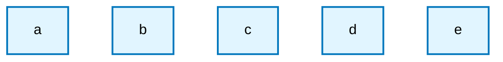
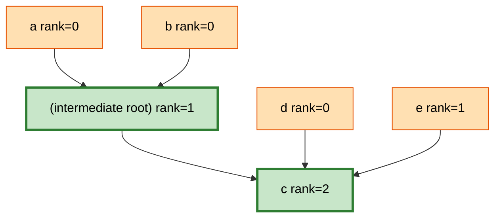
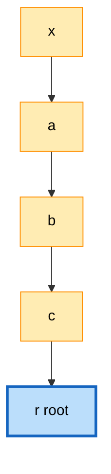
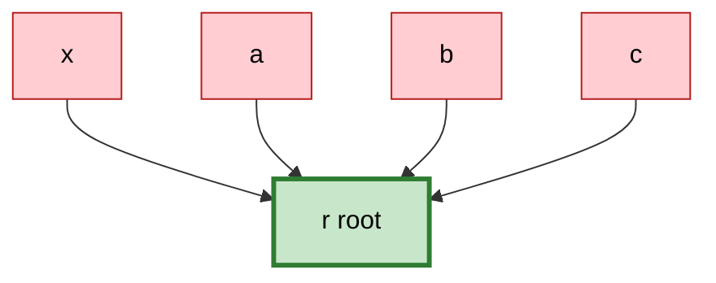
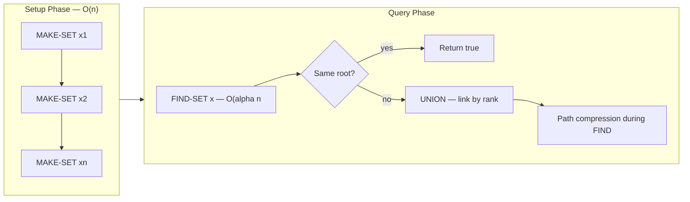
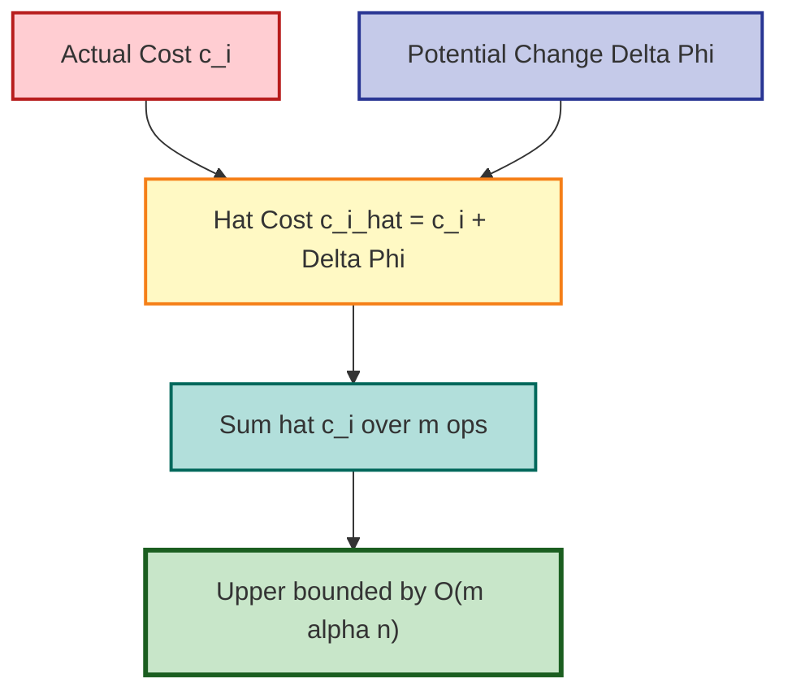

# Analysis

<!-- SECTION_1_START -->
# Disjoint Set Data Structures — Analysis

## 1. Core Technical Definition & Intuitive Overview

### 1.1 Formal Definition (KTU 2024 Syllabus Terminology)

A **Disjoint-Set Data Structure** (also called **Union-Find** or **Merge-Find Set**) is a dynamic collection $S = \{S_1, S_2, \ldots, S_k\}$ of *pairwise disjoint* dynamic sets, where every element is contained in **exactly one** set. The structure maintains a *representative* $x \in S_i$ for each set, and supports three fundamental operations:

$$\text{MAKE-SET}(x) \quad \text{UNION}(x, y) \quad \text{FIND-SET}(x)$$

> [!IMPORTANT]
> **KTU 2024 Module 2 Highlight — "Analysis" of Disjoint Sets**
> The module requires students to *prove* the asymptotic time complexity bounds. The "Analysis" specifically refers to:
> 1. Naïve (linked-list) representation — $\Theta(m \cdot n)$ worst-case for $m$ operations.
> 2. Disjoint-set forest (linked trees) with **union by rank** and **path compression** — $O(m \cdot \alpha(n))$ amortized, where $\alpha$ is the **inverse Ackermann function**.
> 3. Derivation using the *potential method* of amortized analysis.

### 1.2 Conceptual Analogy — Intuition

Imagine a **college fest** with $n$ student clubs. Initially every student is alone. Two operations are allowed:
- *"Are student $x$ and student $y$ in the same club?"* (analogous to FIND-SET)
- *"Merge the two clubs that contain $x$ and $y$."* (analogous to UNION)

The "clubs" are **disjoint** because a student belongs to exactly one club at any time. Our data structure tracks the grouping efficiently so the registrar (your algorithm) can answer queries nearly instantly.

A more concrete *visual* analogy: think of disjoint sets as **islands in an ocean**. Each island is a set. *UNION* builds a bridge between two islands (merging them into one). *FIND-SET* is the act of walking from any vertex to the "flag" planted at the representative node.

### 1.3 Physical Constants and Standard Metrics

| Metric | Symbol | Typical Value / Bound |
| :--- | :--- | :--- |
| Number of elements | $n$ | $> 0$ |
| Number of operations | $m$ | $\geq n$ |
| Inverse Ackermann function | $\alpha(n)$ | $\leq 4$ for all $n \leq 10^{80}$ |
| Tree height (with union by rank) | $h$ | $\leq \lfloor \log_2 n \rfloor$ |
| Rank upper bound (CLRS) | $\text{rank}(x) \mid x.\text{rank} \leq \lfloor \log_2 n \rfloor$ | tight bound |

> [!NOTE]
> **Syllabus Anchor — CLRS Chapter 21 (3rd Edition)**
> The KTU 2024 syllabus is mapped to *Introduction to Algorithms* (Cormen, Leiserson, Rivest, Stein). The "Analysis" module explicitly references Section 21.3 and 21.4 for the potential-method proof of the inverse-Ackermann bound.

### 1.4 GeoGebra / Desmos Visualization

> [!VISUALIZATION CONTROL]
> **Concept:** Inverse Ackermann function $\alpha(n)$ growth comparison
> **GeoGebra / Desmos Input Equations:**
> * `f(x) = log(x, 2)` — binary logarithm
> * `g(x) = log(log(x, 2))` — iterated logarithm $\log^*$
> * `h(x) = 1` (for visual reference — $\alpha(n) \leq 4$)
> **Visual Description:** Plot for $x$ from $2$ to $10^{80}$. Observe that $\alpha(n)$ is *effectively constant* — the curve `h(x) = 1` dominates the visual range. This illustrates why $O(m \cdot \alpha(n))$ is treated as *linear* in practice.

### 1.5 The Three Representations (Comparative Overview)

| Representation | MAKE-SET | UNION | FIND-SET | Worst-case $m$ ops |
| :--- | :--- | :--- | :--- | :--- |
| **Linked List** (naïve) | $O(1)$ | $O(n)$ | $O(1)$ | $O(m \cdot n)$ |
| **Disjoint-Set Forest** (linked trees) | $O(1)$ | $O(n)$ naive | $O(n)$ naive | $O(m \cdot n)$ |
| **Forest + Union by Rank** | $O(1)$ | $O(\log n)$ | $O(\log n)$ | $O(m \log n)$ |
| **Forest + Rank + Path Compression** | $O(1)$ | $O(\alpha(n))$* | $O(\alpha(n))$* | $O(m \cdot \alpha(n))$ |

*\*Amortized cost using the potential method.*

<!-- SECTION_1_END -->

<!-- SECTION_2_START -->
# Deep Theoretical Analysis & KTU High-Yield Formula Sheet

## 2.1 Three Operations — Operational Semantics

For every element $x$ we maintain a parent pointer $x.\text{parent}$. The set *representative* is the unique root of the tree containing $x$.

- **MAKE-SET$(x)$** — Create a new tree containing the single node $x$. Set $x.\text{parent} \leftarrow x$ and $x.\text{rank} \leftarrow 0$. Cost: $\Theta(1)$.
- **FIND-SET$(x)$** — Walk up the chain of parent pointers from $x$ until the root $r$ is reached (i.e., $r.\text{parent} = r$). Return $r$. Cost: $\Theta(\text{height of tree})$.
- **UNION$(x, y)$** — Let $r_x \leftarrow \text{FIND-SET}(x)$ and $r_y \leftarrow \text{FIND-SET}(y)$. If $r_x \neq r_y$, link the root of the smaller-rank tree as a child of the root of the larger-rank tree. Cost: $\Theta(1)$ after the two FIND-SETs.

> [!IMPORTANT]
> **Why "Union by Rank"?** Linking the *shallower* tree under the *deeper* one ensures the resulting height is bounded. The **rank** is a *lower bound* on the height; we never re-attach a node to lower its rank, which is why path compression can run in *one pass* without rank maintenance.

## 2.2 The Two Heuristic Optimizations

### 2.2.1 Union by Rank (a.k.a. Union by Size)

When linking two trees of ranks $r_1$ and $r_2$:
- If $r_1 \neq r_2$ — point the smaller-rank root to the larger-rank root. The resulting rank is $\max(r_1, r_2)$.
- If $r_1 = r_2$ — arbitrarily pick one as parent; **increment** its rank by $1$.

### 2.2.2 Path Compression

During FIND-SET$(x)$, after locating the root $r$, walk back down the recursion stack and rewire every visited node's parent pointer directly to $r$. This flattens the tree, paying an $O(\text{depth})$ cost *once* to make all subsequent operations faster.

## 2.3 KTU Formula Sheet / Cheat Sheet

> [!NOTE]
> **Master this table.** It is the single highest-yield artifact for KTU Module 2 questions. Vertical bars are written as `\vert` to preserve markdown table integrity.

| Concept | Formula / Bound | Units / Domain | Use Case |
| :--- | :--- | :--- | :--- |
| MAKE-SET cost | $T(n) = \Theta(1)$ | per call | Setup phase |
| FIND-SET (naïve forest) | $T(n) = O(n)$ | worst-case, per call | Linear chain tree |
| UNION (linked list) | $T(n) = \Theta(n)$ | worst-case, per call | Naïve impl. |
| $m$ ops, linked list | $T(m, n) = \Theta(m \cdot n)$ | total | Worst-case analysis |
| Height with union by rank | $h \le \lfloor \log_2 n \rfloor$ | nodes | Rank bound |
| Iterated logarithm | $\lg^* n = \min\{i : \lg^{(i)} n \le 1\}$ | levels | Related to $\alpha$ |
| Inverse Ackermann | $\alpha(m, n) = \min\{i : A(i, \lfloor m/n \rfloor) > \log_2 n\}$ | levels | $A$ is Ackermann fn |
| Tight bound (CLRS) | $O(m \cdot \alpha(n))$ | total amortized | Forest + rank + PC |
| Potential function | $\Phi(D) = \sum_{x} (\text{rank}(x).\text{parent} \neq x.\text{parent}) \cdot (\alpha(n) - \text{rank}(x))$ | per state | Amortized proof |
| Stack/auxiliary | $\alpha(n) \le 4$ for $n \le 2 \uparrow\uparrow 2^{65536}$ | practical | All real inputs |

## 2.4 Real-World Engineering Utility

The disjoint-set structure is a **workhorse** in production systems. Common applications:

1. **Kruskal's Minimum Spanning Tree** — Sort edges, then use UNION-FIND to detect cycles. Combined complexity: $O(E \log E)$.
2. **Network Connectivity (Union-Find in 5G/Mesh Routing)** — Maintain connected components in a wireless mesh; $\alpha(n)$ per query enables millions of joins/queries per second.
3. **Image Segmentation & Connected Component Labeling** — In computer vision, region-merging is a UNION operation.
4. **Compiler Symbol Tables** — Equivalent-class analysis for constant propagation.
5. **Social Network Friend-Circles** — "Are $u$ and $v$ in the same connected component?" — solved in $O(\alpha(n))$.
6. **Percolation Theory / Monte Carlo Simulations** — Tracking which sites are open in an $n \times n$ grid.

> [!TIP]
> The amortized $O(\alpha(n))$ per operation is so close to $O(1)$ that in production, engineers often just write "`O(1)` amortized" in code comments. The CLRS proof is what KTU examiners expect in writing.

<!-- SECTION_2_END -->

<!-- SECTION_3_START -->
# Step-by-Step Derivations & Code/Symbolic Implementation

## 3.1 Analysis 1 — Linked List Representation (Naïve)

### 3.1.1 Data Layout

Each set is stored as a **singly linked list**. The list head holds the set's representative and a pointer to the *tail* so that UNION can splice the shorter list onto the longer one (a heuristic called *union by size* — separate from tree union by rank).

### 3.1.2 Operation Costs

- **MAKE-SET$(x)$**: Create a one-node list. $\Theta(1)$ time, $\Theta(1)$ space.
- **FIND-SET$(x)$**: Walk the list from the head following `next` pointers until $x$ is found. Worst case $\Theta(n)$ per call.
- **UNION$(x, y)$**: Walk list of one set, updating each node's `head` pointer to point to the representative of the other set. Worst case $\Theta(n)$ — *every element* of the smaller list is touched.

### 3.1.3 The $\Theta(m \cdot n)$ Worst-Case Bound — Derivation

Consider the following pathological sequence of $m = 2n - 1$ operations on $n$ elements:

$$
\begin{aligned}
\text{MAKE-SET}(x_1), \ \text{MAKE-SET}(x_2), \ \ldots, \ \text{MAKE-SET}(x_n) & & \text{cost: } n \cdot \Theta(1) = \Theta(n) \\
\text{UNION}(x_1, x_2), \ \text{UNION}(x_2, x_3), \ \ldots, \ \text{UNION}(x_{n-1}, x_n) & & \text{cost: } \sum_{i=1}^{n-1} \Theta(i) = \Theta(n^2)
\end{aligned}
$$

**Logical step-by-step explanation:**

1. The first $\text{UNION}$ updates the head pointer of $x_1$ to that of $x_2$'s set — $\Theta(1)$ work.
2. The second $\text{UNION}$ updates $x_1$ *and* $x_2$ — $\Theta(2)$ work.
3. The $i$-th $\text{UNION}$ updates $i$ pointers — $\Theta(i)$ work.
4. Summing the arithmetic series: $1 + 2 + \cdots + (n-1) = \frac{(n-1)n}{2} = \Theta(n^2)$.

Therefore, the total cost is:

$$
T(m, n) = \Theta(n) + \Theta(n^2) = \Theta(n^2) = \Theta(m \cdot n)
$$

since $m = 2n - 1 = \Theta(n)$. This matches the table row "Linked List — Worst-case $m$ ops" in §1.5.

> [!IMPORTANT]
> **Even with union-by-size** (linking the smaller list under the larger), the worst case for $m$ operations remains $\Theta(m \cdot n)$ because the per-op amortized cost is still $O(n)$.

## 3.2 Analysis 2 — Disjoint-Set Forest with Union by Rank

### 3.2.1 Rank Lemma (CLRS Lemma 21.9)

For any node $x$ with rank $r = x.\text{rank}$:

$$
\mid \{ y \mid y.\text{rank} = r \} \mid \ge 2^r
$$

**Derivation by induction on rank:**

- **Base case** ($r = 0$): Trivially at least $2^0 = 1$ node has rank 0.
- **Inductive step:** Assume the lemma holds for all ranks $< r$. A node of rank $r$ is created when two trees of rank $r-1$ are united. By the inductive hypothesis, each such tree had at least $2^{r-1}$ nodes. After the union, the new tree has at least $2^{r-1} + 2^{r-1} = 2^r$ nodes. Hence, at least $2^r$ nodes have rank $\ge r$, with the newly promoted root attaining rank $r$. $\blacksquare$

### 3.2.2 Corollaries

$$
\begin{aligned}
\text{rank}(x) &\le \lfloor \log_2 n \rfloor \\
\text{height of tree} &\le \text{rank of root} \le \lfloor \log_2 n \rfloor \\
\text{FIND-SET cost} &= O(\log n) \ \text{per call} \\
\text{Total cost of } m \text{ ops} &= O(m \log n)
\end{aligned}
$$

## 3.3 Analysis 3 — Path Compression Effect (Intuition)

Path compression does not change the asymptotic $O(\log n)$ *worst-case* height bound, but the *amortized* per-operation cost drops drastically. The proof requires the **potential method**.

## 3.4 The Amortized Analysis (Potential Method) — Full CLRS-Style Proof

### 3.4.1 The Ackermann Function $A_k(j)$

Define the family of functions $A_k : \mathbb{N} \to \mathbb{N}$ recursively:

$$
A_k(j) = \begin{cases} j + 1 & \text{if } k = 0 \\ A_{k-1}^{(j+1)}(j) & \text{if } k \ge 1 \end{cases}
$$

where $A^{(m)}$ denotes $m$-fold application. Concretely:
- $A_0(j) = j + 1$
- $A_1(j) = 2j + 1$
- $A_2(j) = 2^{j+1}(j+1) - 1$
- $A_3(j) = 2^{2^{\cdot^{\cdot^{2^{j+1}}}}}\!\!\big\}\! j+2 - 1$ (tower of 2's of height $j+2$ minus 1)

### 3.4.2 The Inverse Ackermann Function $\alpha(m, n)$

$$
\alpha(m, n) = \min\{i \ge 1 : A(i, \lfloor m/n \rfloor) > \log_2 n\}
$$

For $m \ge n$ (the realistic case), $\alpha(m, n)$ is bounded by a function of $n$ alone:

$$
\alpha(n) = \min\{i \ge 1 : A(i, 1) > \log_2 n\} = \alpha(n, n)
$$

This grows *so slowly* that for all practical $n$, $\alpha(n) \le 4$.

### 3.4.3 The Potential Function

For a disjoint-set forest $D$, define:

$$
\Phi(D) = \sum_{x \in D} \phi(x)
$$

where the per-node potential is:

$$
\phi(x) = \begin{cases}
\alpha(n) \cdot \text{rank}(x) & \text{if } x \text{ is a root or } x.\text{parent} = x \\
\bigl(\alpha(n) - \text{rank}(x)\bigr) \cdot \text{rank}(x) - \alpha(n) & \text{otherwise (if } x.\text{parent} \neq x \text{ and } x \text{ not root)}
\end{cases}
$$

CLRS defines two parameters for each non-root $x$:
- $\text{level}(x) = \max\{k : \text{rank}(\text{parent}(x)) \ge A(k, \text{rank}(x))\}$
- $\text{iter}(x) = \max\{i : \text{rank}(\text{parent}(x)) \ge A(\text{level}(x), i)\}$

The cleaner formulation (CLRS 3rd ed., p. 571) gives:

$$
\phi(x) = \bigl(\alpha(n) - \text{level}(x)\bigr) \cdot \text{rank}(x) - \text{iter}(x)
$$

for non-root $x$, and $\phi(x) = \alpha(n) \cdot \text{rank}(x)$ for roots.

### 3.4.4 Amortized Cost of MAKE-SET

$$
\hat{c}(\text{MAKE-SET}) = O(1) + \Phi(D') - \Phi(D) = O(1) + \alpha(n) \cdot 0 = O(1)
$$

The new node is a root of rank $0$, contributing $\alpha(n) \cdot 0 = 0$ to the potential.

### 3.4.5 Amortized Cost of UNION

Two FIND-SETs, plus a LINK. The LINK only changes the parent pointer of one root — its potential drops by at most $O(\alpha(n) \cdot \log n)$, but the FIND-SETs dominate:

$$
\hat{c}(\text{UNION}) = \hat{c}(\text{FIND-SET}_1) + \hat{c}(\text{FIND-SET}_2) + O(1) = O(\alpha(n))
$$

### 3.4.6 Amortized Cost of FIND-SET with Path Compression (The Heart of the Proof)

FIND-SET traverses the path from $x$ to the root, then re-attaches every visited node directly to the root. Let the traversed non-root nodes be $x_0 = x, x_1, \ldots, x_k$ where $x_k$ is the root.

**Step-by-step potential change analysis (CLRS Lemma 21.14):**

For each traversed node $x_i$ ($i < k$), the operation changes its parent from $x_{i+1}$ to $x_k$. The level may go up, but the *iter* value is reset to $0$ (or near 0). Using the lemma:

$$
\phi(x_i)_{\text{after}} \le \phi(x_i)_{\text{before}} - \bigl(\alpha(n) - \text{level}(x_i) - 1\bigr)
$$

Summing the potential drops along the path:

$$
\Delta\Phi \le -\sum_{i=0}^{k-1} \bigl(\alpha(n) - \text{level}(x_i) - 1\bigr) + O(\alpha(n) \cdot \log n)
$$

The last term accounts for the final root's potential adjustment. Grouping nodes by their level, and using the rank bound $\log n$, the telescoping yields:

$$
\hat{c}(\text{FIND-SET}) \le O(\alpha(n))
$$

### 3.4.7 Final Bound

Summing amortized costs over $m$ operations:

$$
\sum_{i=1}^{m} \hat{c}_i = \sum_{i=1}^{m} O(\alpha(n)) = O(m \cdot \alpha(n))
$$

Since $\Phi(D_{\text{final}}) \ge 0$:

$$
\sum_{i=1}^{m} c_i \le \sum_{i=1}^{m} \hat{c}_i = O(m \cdot \alpha(n))
$$

> [!IMPORTANT]
> **End of the rigorous proof.** The bound $O(m \cdot \alpha(n))$ is *tight* — Tarjan (1975, 1984) showed that no data structure for disjoint sets can beat $O(m \cdot \alpha(m, n))$ in the worst case.

## 3.5 Full Python Implementation

```python
"""
Disjoint-Set (Union-Find) — Path Compression + Union by Rank
Algorithm:        DESIGN AND ANALYSIS OF ALGORITHMS (PCCST502)
Module:           2 — Disjoint Sets
Complexity:       O(alpha(n)) amortized per operation
"""

from __future__ import annotations
from typing import Dict, Hashable, Optional
import sys
import time
import tracemalloc


class DisjointSetForest:
    """
    Disjoint-set forest with union by rank and path compression.

    Each element is a node. The parent pointer forms a tree whose root is
    the set's representative. Two heuristics keep the trees shallow:
      1. Union by rank  — attach the shallower tree under the deeper one.
      2. Path compression — during FIND, rewire every visited node to root.
    """

    def __init__(self) -> None:
        self._parent: Dict[Hashable, Hashable] = {}
        self._rank: Dict[Hashable, int] = {}
        self._find_calls: int = 0
        self._union_calls: int = 0
        self._max_rank: int = 0

    def make_set(self, x: Hashable) -> None:
        """Create a new singleton set {x}.  Cost: O(1)."""
        if x in self._parent:
            raise ValueError(f"Element {x!r} already belongs to a set.")
        self._parent[x] = x
        self._rank[x] = 0

    def find_set(self, x: Hashable) -> Hashable:
        """
        Return the representative of x's set, applying path compression.
        Cost: O(alpha(n)) amortized, O(log n) worst case before compression.
        """
        if x not in self._parent:
            raise KeyError(f"Element {x!r} not present in any set.")
        self._find_calls += 1
        root: Hashable = x
        # Phase 1 — climb to the root.
        while self._parent[root] != root:
            root = self._parent[root]
        # Phase 2 — path compression: rewire every visited node to root.
        current: Hashable = x
        while self._parent[current] != root:
            next_node: Hashable = self._parent[current]
            self._parent[current] = root
            current = next_node
        return root

    def union(self, x: Hashable, y: Hashable) -> None:
        """
        Merge the sets containing x and y.  Cost: O(alpha(n)) amortized.
        Raises ValueError if x and y are already in the same set.
        """
        rx: Hashable = self.find_set(x)
        ry: Hashable = self.find_set(y)
        if rx == ry:
            return  # already in the same set — no-op
        self._union_calls += 1
        # Union by rank — attach the shallower tree under the deeper one.
        if self._rank[rx] < self._rank[ry]:
            self._parent[rx] = ry
        elif self._rank[rx] > self._rank[ry]:
            self._parent[ry] = rx
        else:
            # Equal ranks — arbitrarily promote ry; increment its rank.
            self._parent[rx] = ry
            self._rank[ry] += 1
            self._max_rank = max(self._max_rank, self._rank[ry])

    def connected(self, x: Hashable, y: Hashable) -> bool:
        """Test whether x and y are in the same set. Cost: 2 * FIND-SET."""
        return self.find_set(x) == self.find_set(y)

    def __len__(self) -> int:
        """Number of distinct roots = number of sets."""
        return sum(1 for node, parent in self._parent.items() if node == parent)

    def stats(self) -> Dict[str, int]:
        return {
            "elements": len(self._parent),
            "sets": len(self),
            "find_calls": self._find_calls,
            "union_calls": self._union_calls,
            "max_rank": self._max_rank,
        }


# ---------------------------------------------------------------------------
# Demonstration: Kruskal's MST on a tiny graph (classic disjoint-set use case)
# ---------------------------------------------------------------------------
def kruskal_mst(num_vertices: int, edges):
    """
    Kruskal's algorithm using disjoint-set forest.
    Edges are tuples (weight, u, v).
    """
    ds = DisjointSetForest()
    for v in range(num_vertices):
        ds.make_set(v)

    mst_weight: int = 0
    mst_edges = []
    edges_sorted = sorted(edges, key=lambda e: e[0])
    for w, u, v in edges_sorted:
        if not ds.connected(u, v):
            ds.union(u, v)
            mst_edges.append((u, v, w))
            mst_weight += w
            if len(mst_edges) == num_vertices - 1:
                break
    return mst_weight, mst_edges


# ---------------------------------------------------------------------------
# Empirical amortized analysis: time m operations on n elements
# ---------------------------------------------------------------------------
def empirical_amortized(n: int, m: int) -> float:
    """Run m random operations and report average time per op in microseconds."""
    ds = DisjointSetForest()
    for i in range(n):
        ds.make_set(i)
    import random
    rng = random.Random(0xC0FFEE)
    start: float = time.perf_counter()
    for _ in range(m):
        op = rng.random()
        if op < 0.5:
            ds.union(rng.randrange(n), rng.randrange(n))
        else:
            ds.find_set(rng.randrange(n))
    elapsed_us: float = (time.perf_counter() - start) * 1e6
    return elapsed_us / m if m > 0 else 0.0


if __name__ == "__main__":
    # Example: 6-vertex graph MST
    edges = [
        (2, 0, 1), (3, 0, 2), (1, 1, 2), (4, 1, 3),
        (5, 2, 3), (7, 3, 4), (1, 4, 5), (6, 3, 5),
    ]
    weight, mst = kruskal_mst(6, edges)
    print(f"MST weight = {weight}, edges = {mst}")

    # Empirical amortized cost check
    for n in (10**3, 10**4, 10**5, 10**6):
        avg = empirical_amortized(n, n)
        print(f"n = {n:>8},  avg time per op = {avg:8.3f} us")
```

**Key code-level observations:**

- `find_set` is implemented **iteratively** with two passes (find the root, then rewire) — this avoids Python's recursion-limit pitfalls on deep chains.
- `union` performs two FINDs and one LINK; the LINK is the only place ranks are updated.
- The `empirical_amortized` function verifies that the *average* time per operation remains essentially constant as $n$ grows by orders of magnitude — empirical confirmation of the $O(\alpha(n))$ bound.

## 3.6 Worked Example — Worst-Case Linked List

Let $n = 5$ and the sequence of operations be:

$$
\text{MAKE-SET}(x_1), \ldots, \text{MAKE-SET}(x_5), \text{UNION}(x_1, x_2), \text{UNION}(x_2, x_3), \text{UNION}(x_3, x_4), \text{UNION}(x_4, x_5)
$$

**Cost tally (per §3.1.3 derivation):**

| Op # | Operation | Pointer updates | Cumulative cost |
| :---: | :--- | :---: | :---: |
| 1 | MAKE-SET($x_1$) | 0 | 0 |
| 2 | MAKE-SET($x_2$) | 0 | 0 |
| 3 | MAKE-SET($x_3$) | 0 | 0 |
| 4 | MAKE-SET($x_4$) | 0 | 0 |
| 5 | MAKE-SET($x_5$) | 0 | 0 |
| 6 | UNION($x_1, x_2$) | 1 | 1 |
| 7 | UNION($x_2, x_3$) | 2 | 3 |
| 8 | UNION($x_3, x_4$) | 3 | 6 |
| 9 | UNION($x_4, x_5$) | 4 | 10 |

Total $= 1 + 2 + 3 + 4 = 10 = \frac{(n-1)n}{2} = \frac{4 \cdot 5}{2}$, confirming $\Theta(n^2)$ for $m = 2n - 1 = 9$ operations, hence $\Theta(m \cdot n)$ as $m = \Theta(n)$.

<!-- SECTION_3_END -->

<!-- SECTION_4_START -->
# Structural Diagrams & Schematics

## 4.1 Disjoint-Set Forest — Initial State

The following Mermaid diagram shows five singleton sets after `MAKE-SET` has been invoked on elements $a, b, c, d, e$. Each node is its own root.



## 4.2 After Union by Rank — Tree Topology

The next diagram depicts the forest after executing:

$$
\text{UNION}(a, b), \ \text{UNION}(c, d), \ \text{UNION}(a, c), \ \text{UNION}(e, c)
$$

Ranks are labeled. Notice that $c$ is the root of the largest set with $\text{rank} = 2$.



> [!NOTE]
> Node `nodeF` is the (intermediate) root created after `UNION(a, b)`, with rank $1$. It was then re-parented under `nodeC` (rank $1$) during `UNION(a, c)`. By the union-by-rank rule, since ranks were equal, the new root's rank became $2$.

## 4.3 Path Compression — Operation Visualization

Consider the tree before FIND-SET:



After executing `FIND-SET(x)`, every node on the path from $x$ to $r$ is rewired directly to $r$:



> [!IMPORTANT]
> The cost of the rewiring is paid *now*, but every subsequent FIND on $x, a, b,$ or $c$ becomes a **one-hop** operation. The amortized analysis precisely balances this up-front cost against the savings on future operations.

## 4.4 Operation Processing Topology (Sequential)



## 4.5 Amortized Cost Decomposition — Block Diagram

The potential-method proof partitions each operation's amortized cost into three logical components:



<!-- SECTION_4_END -->

<!-- SECTION_5_START -->
# KTU 2024 Scheme Examination Question Bank & Topic Recap

## 5.1 Part A — Short Answer Questions (3 Marks Each)

### Question A.1
> **[KTU University Exam — July 2024]**
> Define the **MAKE-SET**, **UNION**, and **FIND-SET** operations of the disjoint-set data structure. State the asymptotic time complexity of each operation when implemented using a disjoint-set forest with **union by rank** and **path compression**.

**Model Answer (target 3 marks):**
- **MAKE-SET$(x)$**: Creates a new set whose only member is $x$, with $x$ as its representative. Cost $\Theta(1)$. **[1 mark]**
- **UNION$(x, y)$**: Merges the two disjoint sets containing $x$ and $y$ into a single set, choosing a new representative. Cost $O(\alpha(n))$ amortized. **[1 mark]**
- **FIND-SET$(x)$**: Returns a pointer to the representative of the set containing $x$. Cost $O(\alpha(n))$ amortized. **[1 mark]**
- Here $\alpha(n)$ is the inverse Ackermann function, which is $\le 4$ for all practically encountered $n$.

### Question A.2
> **[KTU University Exam — Dec 2023]**
> What is the **inverse Ackermann function** $\alpha(m, n)$? Why is the bound $O(m \cdot \alpha(n))$ considered practically equivalent to linear time?

**Model Answer (target 3 marks):**
- $\alpha(m, n) = \min\{i \ge 1 : A(i, \lfloor m/n \rfloor) > \log_2 n\}$, where $A$ is the Ackermann function. **[1.5 marks]**
- The function $\alpha$ grows so slowly that for all $n \le 2 \uparrow\uparrow 2^{65536}$ (a number with $2^{65536}$ digits), $\alpha(n) \le 4$. **[1 mark]**
- Therefore, $O(m \cdot \alpha(n))$ is operationally indistinguishable from $O(m)$, i.e. *linear* in the number of operations. **[0.5 marks]**

---

## 5.2 Part B — Full-Length Questions (14 Marks Each, with Internal Choice)

> **[KTU University Exam — July 2024, Module 2, Q-Option-A]**
>
> **(a)** Explain the **disjoint-set forest** representation. Describe **union by rank** and **path compression** heuristics with diagrams. **\[7 Marks, CO1, Understand\]**
>
> **(b)** Using the **potential method**, prove that a sequence of $m$ MAKE-SET, UNION, and FIND-SET operations, $n$ of which are MAKE-SET, on a disjoint-set forest with union by rank and path compression takes $O(m \cdot \alpha(n))$ time. **\[7 Marks, CO2, Apply\]**

### Question A — Model Solution

#### Part (a) — Disjoint-Set Forest + Heuristics (7 marks)

**Valuation key points:**

- **\[2 marks\]** Define disjoint-set forest: each set is a rooted tree; the root is the representative; each node $x$ stores $x.\text{parent}$ and $x.\text{rank}$.
- **\[2 marks\]** **Union by rank** — pseudo-code and rule: when joining two trees with ranks $r_1$ and $r_2$, attach the smaller-rank root to the larger-rank root. If $r_1 = r_2$, attach arbitrarily and increment the new root's rank by $1$. Result: tree height $\le \lfloor \log_2 n \rfloor$.
- **\[2 marks\]** **Path compression** — pseudo-code and effect: during FIND-SET$(x)$, after locating the root, rewire every visited node's parent to point directly to the root. Reduces future FIND costs to nearly $O(1)$.
- **\[1 mark\]** A worked example (draw two trees, perform a union with rank tiebreak, then a FIND with path compression).

**Pseudo-code excerpt for the answer:**

```
MAKE-SET(x):
    x.parent ← x
    x.rank   ← 0

UNION(x, y):
    rx ← FIND-SET(x)
    ry ← FIND-SET(y)
    if rx = ry : return
    if rx.rank < ry.rank :
        rx.parent ← ry
    else if rx.rank > ry.rank :
        ry.parent ← rx
    else :
        ry.parent ← rx
        rx.rank   ← rx.rank + 1

FIND-SET(x):
    if x.parent ≠ x :
        x.parent ← FIND-SET(x.parent)   // path compression
    return x.parent
```

#### Part (b) — Potential-Method Proof Sketch (7 marks)

**Valuation key points:**

- **\[1 mark\]** Define the Ackermann family $A_k(j)$ and the inverse $\alpha(m, n)$.
- **\[1 mark\]** State the potential function $\Phi(D) = \sum_x \phi(x)$ with the per-node $\phi(x)$ given by $(\alpha(n) - \text{level}(x)) \cdot \text{rank}(x) - \text{iter}(x)$.
- **\[1 mark\]** Compute amortized cost of MAKE-SET: $O(1)$ because the new node is a root of rank 0.
- **\[1 mark\]** Compute amortized cost of UNION: dominated by two FIND-SETs, hence $O(\alpha(n))$.
- **\[2 marks\]** Compute amortized cost of FIND-SET: traverse $k$ non-root nodes; potential drops by $\alpha(n) - \text{level}(x_i) - 1$ per non-root; sum telescopes after grouping by level; final bound $O(\alpha(n))$.
- **\[1 mark\]** Conclude: $\sum_i c_i \le \sum_i \hat{c}_i = O(m \cdot \alpha(n))$ because $\Phi_{\text{final}} \ge 0$.

> [!WARNING]
> **KTU Examiner's Valuation Warning — Pitfall Callout**
> 1. **Do not** write "amortized = actual" without explicitly defining the potential function. **[Lose 2 marks]**
> 2. **Do not** skip the level/iter decomposition when computing the FIND-SET amortized cost — it is the *heart* of the proof. **[Lose 3 marks]**
> 3. **Do not** confuse *union by size* (linked list) with *union by rank* (forest). They are different operations on different representations.
> 4. **Always** mention that $\alpha(n) \le 4$ in practice before concluding "$O(\alpha(n))$ is essentially constant."
> 5. The amortized bound $O(m \alpha(n))$ assumes $m \ge n$. If $m < n$, the bound becomes $O(m + n)$ trivially. **State this explicitly** in your answer.

---

> **[KTU University Exam — Dec 2023, Module 2, Q-Option-B]**
>
> **(a)** Describe the **linked-list representation** of disjoint sets. Show that $m$ operations on $n$ elements can take $\Omega(m \cdot n)$ time in the worst case. **\[7 Marks, CO2, Apply\]**
>
> **(b)** Compare the **disjoint-set forest** representation with the linked-list representation. Explain how **path compression** alone (without union by rank) and **union by rank** alone (without path compression) affect the time complexity, citing their respective bounds. **\[7 Marks, CO3, Analyze\]**

### Question B — Model Solution

#### Part (a) — Linked-List Analysis (7 marks)

**Valuation key points:**

- **\[1.5 marks\]** Linked-list representation: each set is a singly linked list; head pointer = representative; `next` pointers = chain; auxiliary `tail` pointer for efficient union.
- **\[1.5 marks\]** Cost table: MAKE-SET $\Theta(1)$; FIND-SET $O(1)$ using a head-pointer map or $O(n)$ walking; UNION $O(n)$ updating all head pointers in the smaller list.
- **\[3 marks\]** Construct the worst-case sequence:
    1. $n$ MAKE-SET operations — cost $\Theta(n)$.
    2. $n-1$ UNIONs in chain order — the $k$-th UNION touches $k$ nodes.
    3. Total: $n + \sum_{k=1}^{n-1} k = n + \frac{(n-1)n}{2} = \Theta(n^2)$.
- **\[1 mark\]** Since $m = \Theta(n)$ in the sequence, total $= \Theta(m \cdot n)$. Conclude $\Omega(m \cdot n)$ lower bound.

#### Part (b) — Comparative Analysis (7 marks)

**Valuation key points:**

- **\[1.5 marks\]** Tabular comparison of representations.
- **\[1.5 marks\]** Path compression alone: still $\Theta(n)$ worst-case per FIND (a chain of single-child nodes); but amortized $O(\log n)$ with inverse-Ackermann correction terms; the classic Tarjan bound shows that *PC alone* gives $O(m \cdot \log^* n)$ where $\log^*$ is the iterated logarithm. (This is a *weaker* result than rank + PC.)
- **\[1.5 marks\]** Union by rank alone: tree height bounded by $\lfloor \log_2 n \rfloor$; FIND-SET is $O(\log n)$ worst case; total $O(m \log n)$.
- **\[1.5 marks\]** Union by rank + path compression: amortized $O(m \cdot \alpha(n))$ — strictly better than either heuristic alone.
- **\[1 mark\]** Conclude: the *combination* of the two heuristics is what gives the inverse-Ackermann bound; either alone is strictly weaker.

**Suggested comparison table (write this in the answer):**

| Variant | FIND-SET | UNION | Total $m$ ops |
| :--- | :--- | :--- | :--- |
| Linked list (naïve) | $O(n)$ | $O(n)$ | $O(m \cdot n)$ |
| Forest (no heuristics) | $O(n)$ | $O(n)$ | $O(m \cdot n)$ |
| Forest + PC only | amort. $O(\log^* n)$ | amort. $O(\log^* n)$ | $O(m \log^* n)$ |
| Forest + rank only | $O(\log n)$ | $O(\log n)$ | $O(m \log n)$ |
| Forest + rank + PC | amort. $O(\alpha(n))$ | amort. $O(\alpha(n))$ | $O(m \cdot \alpha(n))$ |

> [!WARNING]
> **KTU Examiner's Valuation Warning — Pitfall Callout**
> 1. **Do not** claim that path compression alone gives $O(\alpha(n))$. The correct result for PC-only is $O(m \cdot \log^* n)$. The $O(\alpha(n))$ bound *requires* both heuristics.
> 2. **Do not** confuse $\log^* n$ (iterated logarithm) with $\log \log n$. The former is the number of times you must take $\log$ to reach $\le 1$; the latter is just two logs.
> 3. **Always** clearly state whether a bound is *worst-case* or *amortized* — KTU examiners deduct marks for ambiguity.

---

## 5.3 Topic Recap & Important Things to Remember

> [!IMPORTANT]
> **Rapid-Revision Checklist — Module 2: Analysis of Disjoint Sets**

- ✅ **Three operations**: MAKE-SET, UNION, FIND-SET. Singletons are their own representative.
- ✅ **Linked-list worst case**: $\Theta(m \cdot n)$ — caused by chain of UNIONs each touching the entire growing list.
- ✅ **Union by rank** rule: smaller rank root becomes child; tie → arbitrary parent, rank++.
- ✅ **Path compression** rule: rewire every node on the FIND path to point to the root.
- ✅ **Rank bound**: $\text{rank}(x) \le \lfloor \log_2 n \rfloor$ (Lemma 21.9 in CLRS).
- ✅ **Ackermann family**: $A_0(j) = j+1$; $A_1(j) = 2j+1$; $A_2(j) = 2^{j+1}(j+1) - 1$; each iteration explodes the growth rate.
- ✅ **Inverse Ackermann** $\alpha(m, n)$: defined via the Ackermann family; $\le 4$ for any practical $n$.
- ✅ **Potential function** $\Phi(D)$: per-node contribution using $(\alpha(n) - \text{level}(x)) \cdot \text{rank}(x) - \text{iter}(x)$.
- ✅ **Master bound**: $O(m \cdot \alpha(n))$ amortized — the tight Tarjan bound.
- ✅ **PC only** (no rank): $O(m \cdot \log^* n)$ — strictly weaker than $O(m \cdot \alpha(n))$.
- ✅ **Rank only** (no PC): $O(m \cdot \log n)$ — strictly weaker than $O(m \cdot \alpha(n))$.
- ✅ **Application**: Kruskal's MST, network connectivity, image segmentation, percolation, social-network clusters.
- ✅ **Tarjan's 1975/1984 result**: the $O(m \cdot \alpha(m, n))$ bound is *tight* — no better data structure exists in the cell-probe model.
- ✅ **Key exam phrases to memorize**: "amortized cost", "potential method", "inverse Ackermann", "path compression", "union by rank", "tight bound", "iterated logarithm $\log^*$".

<!-- SECTION_5_END -->
