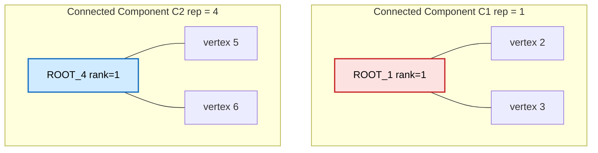
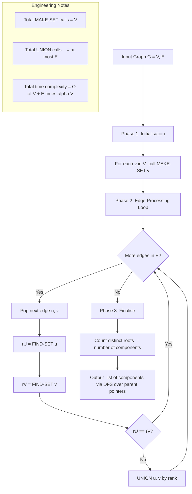
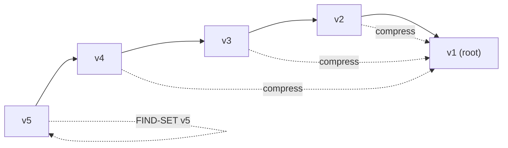

# Connected components of a Graph

<!-- SECTION_1_START -->
# Connected Components of a Graph — Core Definition & Intuitive Overview

> [!NOTE]
> **KTU 2024 Scheme Definition (CLRS-Aligned)**
> Let $G = (V, E)$ be an undirected graph. A **connected component** (or simply *component*) of $G$ is a maximal subgraph $H = (V', E')$ of $G$ such that for every pair of vertices $u, v \in V'$, there exists a path in $H$ (equivalently in $G$) connecting $u$ and $v$. The vertex sets of all components of $G$ form a **partition** of $V$, because reachability in an undirected graph is an **equivalence relation** (reflexive, symmetric, transitive).

Formally, two vertices $u, v \in V$ lie in the **same component** if and only if there exists a sequence of edges in $E$ that forms a path from $u$ to $v$. The graph $G$ is called a **connected graph** when the number of connected components $\omega(G) = 1$; otherwise $G$ is **disconnected**.

## Conceptual Analogy / Intuition

Imagine a **map of islands** scattered across an ocean. Every land patch on a single island is reachable from every other land patch on the *same* island by simply walking — no swimming required. Now group the islands: each individual island is one **connected component**. The entire map's land mass is the disjoint union of all such islands, and no bridge, tunnel, or ferry has been built between them. If you build a bridge (i.e., add an edge) between two islands, those two previously separate components **merge** into one larger component.

This island-merge intuition is precisely the conceptual model used by the **Disjoint Set (Union-Find) data structure**: each component is a "set" of vertices, and each edge is a "proposal" to unify two sets.

> [!IMPORTANT]
> **KTU 2024 Module 2 — Syllabus Hook**
> The PCCST502 (Design and Analysis of Algorithms) syllabus groups *Connected Components* under the **Disjoint Sets** module, because Union-Find is the most efficient combinatorial tool for *offline* component discovery (where the entire edge list is known in advance). For *online* queries, BFS/DFS also work, but they re-traverse the graph for every source, costing $O(V(V+E))$.

## Visualization Control Block

> [!VISUALIZATION CONTROL]
> **Concept:** Undirected graph with 3 visually distinct connected components.
> **Suggested GeoGebra / Desmos Input Points (place as labelled points on a 2D plane):**
> * Component 1 (red cluster): $A(1, 3)$, $B(3, 4)$, $C(2, 1)$ connected by line segments $AB$, $BC$, $AC$.
> * Component 2 (blue cluster): $D(6, 2)$, $E(8, 3)$, $F(7, 1)$ connected by $DE$, $EF$, $DF$.
> * Component 3 (green cluster, isolated vertex): $G(11, 2.5)$.
>
> **Visual Description:** Three coloured subgraphs. Within each colour, every vertex pair is reachable; across colours, no path exists. After "merging" component 1 and 2 by adding a single edge (say $C$–$D$), the red+blue cluster becomes one component and $\omega(G)$ drops from 3 to 2. This visually demonstrates how a single $UNION$ collapses component count by 1.

## Engineering Relevance Snapshot

| Domain | Use of Connected Components |
|---|---|
| Computer Networks | Identifying **network partitions** and **broadcast domains** |
| Social Networks | Finding **friend-circles / communities** in graphs like Facebook |
| VLSI / PCB Design | Detecting **isolated sub-circuits** in netlists |
| Image Processing | Labelling **connected pixel regions** in binary images |
| Compiler Optimisation | Building **strongly connected regions** of a control-flow graph (with directed variant) |

---

<!-- SECTION_1_END -->

<!-- SECTION_2_START -->
# Deep Theoretical Analysis & KTU High-Yield Formula Sheet

## 2.1 The Disjoint-Set / Union-Find Model

The Union-Find data structure maintains a **dynamic collection of disjoint sets** under three core operations. For connected components, every vertex initially belongs to a singleton set, and every edge *fuses* two sets.

### Primitive Operations (CLRS Chapter 21, KTU Module 2)

1. **$MAKE\text{-}SET(x)$** — Creates a new set whose only member (and representative) is $x$. This requires that $x$ is not already in any existing set.
2. **$FIND\text{-}SET(x)$** — Returns a *representative* (root) of the unique set containing $x$. Two elements are in the same set if and only if $FIND\text{-}SET(x) = FIND\text{-}SET(y)$.
3. **$UNION(x, y)$** — Merges the dynamic sets containing $x$ and $y$ into a new set whose representative is usually one of the two input representatives.

### Application-Specific Procedures (Built on the Primitives)

- **$CONNECTED\text{-}COMPONENTS(G)$** — Returns the list of all components of $G$.
- **$SAME\text{-}COMPONENT(u, v)$** — Returns $TRUE$ iff $u$ and $v$ belong to the same component (a constant-time query after the forest is built).

## 2.2 Two Engineering Strategies (Why Union-Find Wins)

| Strategy | Time to Compute All Components | Time to Answer a Same-Component Query | Space |
|---|---|---|---|
| Repeated BFS/DFS | $O(V(V+E))$ | $O(1)$ after precompute | $O(V)$ |
| **Union-Find with union-by-rank + path compression** | $O((V+E) \cdot \alpha(V))$ | $O(\alpha(V))$ per query | $O(V)$ |

Here $\alpha(V)$ is the **inverse Ackermann function**, which is $\le 4$ for any $V$ less than the number of atoms in the observable universe ($< 2^{2^{2^{2^{2}}}} $). It is, for all practical engineering inputs, a **constant $\le 5$**.

## 2.3 The Two Key Heuristics

### A. Union by Rank (Balancing the Forest)
Maintain an array $rank[x]$ = upper bound on the height of the tree rooted at $x$. When joining roots $x$ and $y$:
* If $rank[x] > rank[y]$: make $y$ a child of $x$.
* If $rank[x] < rank[y]$: make $x$ a child of $y$.
* If $rank[x] = rank[y]$: arbitrarily make $y$ a child of $x$ and increment $rank[x]$.

This keeps tree height at $O(\log V)$.

### B. Path Compression (Flattening on the Fly)
During $FIND\text{-}SET(x)$, while walking up parent pointers to the root, redirect every visited node's parent directly to the root. After one or two calls, the tree becomes almost flat, and subsequent finds are essentially $O(1)$.

## 2.4 KTU Formula Sheet / Cheat Sheet

> [!IMPORTANT]
> **All formulas, complexity bounds, and boundary conditions you must memorise for the 2024 Scheme ESE.**

| Operation / Property | Time Complexity | Pre-condition / Note |
|---|---|---|
| $MAKE\text{-}SET(x)$ | $\Theta(1)$ | $x$ not yet in any set |
| $FIND\text{-}SET(x)$ — no heuristics | $O(V)$ worst case | Linear chain of parents |
| $FIND\text{-}SET(x)$ — with path compression | $O(\alpha(V))$ amortised | Inverse Ackermann |
| $UNION(x, y)$ — by rank only | $O(\log V)$ | Tree height bounded |
| $UNION(x, y)$ — rank + path compression | $O(\alpha(V))$ amortised | The standard CLRS result |
| $CONNECTED\text{-}COMPONENTS(G)$ | $O((V + E) \cdot \alpha(V))$ | $V$ MAKE-SETs + $E$ UNIONs |
| $SAME\text{-}COMPONENT(u, v)$ | $O(\alpha(V))$ | After preprocessing |
| Number of components of a tree | exactly $1$ | $E = V - 1$, connected |
| Number of components of a forest | equals number of trees | $E = V - k$ for $k$ trees |
| Total $MAKE\text{-}SET$ calls | $V$ | One per vertex |
| Total $UNION$ calls | $\le E$ | One per edge, or skip if $FIND$ matches |
| Inverse Ackermann bound | $\alpha(V) \le 4$ for $V \le 2^{65536}$ | Treat as constant |

## 2.5 Real-World Utility

* **Kruskal's Minimum Spanning Tree** (covered later in PCCST502): every accepted edge is one that connects vertices of *different* components; $FIND\text{-}SET$ acts as the cycle-detection oracle.
* **Percolation theory & epidemiology**: track how a disease spreads through a contact network, where each new contact edge is a $UNION$.
* **Image segmentation**: connected-component labelling of pixels after thresholding.
* **Network reachability** in BGP/OSPF: routers within one component share the same routing table.

---

<!-- SECTION_2_END -->

<!-- SECTION_3_START -->
# Step-by-Step Derivations & Code Implementation

## 3.1 The Algorithm (Pseudocode, CLRS Section 21.1)

**$CONNECTED\text{-}COMPONENTS(G)$**

```
1  for each vertex v in G.V
2      MAKE-SET(v)
3  for each edge (u, v) in G.E
4      if FIND-SET(u) ≠ FIND-SET(v)
5          UNION(u, v)
```

**$SAME\text{-}COMPONENT(u, v)$**

```
1  if FIND-SET(u) == FIND-SET(v)
2      return TRUE
3  else
4      return FALSE
```

**$FIND\text{-}SET(x)$ — with path compression**

```
1  if x.parent ≠ x
2      x.parent = FIND-SET(x.parent)   // recursive compression
3  return x.parent
```

**$UNION(x, y)$ — union by rank**

```
1  xRoot = FIND-SET(x)
2  yRoot = FIND-SET(y)
3  if xRoot == yRoot
4      return                                  // already in same set
5  if xRoot.rank < yRoot.rank
6      swap(xRoot, yRoot)                      // ensure xRoot is taller
7  yRoot.parent = xRoot                        // link shorter under taller
8  if xRoot.rank == yRoot.rank
9      xRoot.rank = xRoot.rank + 1
```

## 3.2 Exhaustive Worked Example

**Graph $G$:** Vertices $V = \{ 1, 2, 3, 4, 5, 6 \}$; Edges $E = \{ (1,2),\,(2,3),\,(3,1),\,(4,5),\,(5,6) \}$.

**Expected outcome (visual inspection):** Two components — $C_1 = \{1, 2, 3\}$ and $C_2 = \{4, 5, 6\}$.

### Step A — Initialise with $MAKE\text{-}SET$

Each vertex is its own representative. We maintain two arrays, $parent[i]$ and $rank[i]$.

| $i$ | 1 | 2 | 3 | 4 | 5 | 6 |
|---|---|---|---|---|---|---|
| $parent[i]$ | 1 | 2 | 3 | 4 | 5 | 6 |
| $rank[i]$ | 0 | 0 | 0 | 0 | 0 | 0 |

> **Valuation note:** Examiners will look for these initial arrays. Skipping them is the #1 way to lose 2 marks.

### Step B — Process each edge

**Edge $(1, 2)$:** $FIND\text{-}SET(1)=1$, $FIND\text{-}SET(2)=2$. Roots differ.
* $rank[1] = 0$, $rank[2] = 0$ (equal).
* Tie-break: make 2 a child of 1, then $rank[1] = 0 + 1 = 1$.
* $parent[2] = 1$.

| $i$ | 1 | 2 | 3 | 4 | 5 | 6 |
|---|---|---|---|---|---|---|
| $parent[i]$ | 1 | **1** | 3 | 4 | 5 | 6 |
| $rank[i]$ | **1** | 0 | 0 | 0 | 0 | 0 |

Forest so far: $1 \rightarrow 2$ (root 1).

---

**Edge $(2, 3)$:** $FIND\text{-}SET(2)$:
* Walk: $parent[2] = 1 \neq 2$, so recurse on $parent[2]=1$. Return $1$.
* **Path-compression step:** $parent[2] = FIND\text{-}SET(parent[2]) = 1$. Return 1.
$FIND\text{-}SET(3) = 3$. Roots $1$ and $3$ differ.
* $rank[1]=1$, $rank[3]=0$. $rank[1] > rank[3]$, so attach 3 under 1; ranks unchanged.
* $parent[3] = 1$.

| $i$ | 1 | 2 | 3 | 4 | 5 | 6 |
|---|---|---|---|---|---|---|
| $parent[i]$ | 1 | 1 | **1** | 4 | 5 | 6 |
| $rank[i]$ | 1 | 0 | 0 | 0 | 0 | 0 |

Forest: root $1$ with children $\{2, 3\}$.

---

**Edge $(3, 1)$:** $FIND\text{-}SET(3)$:
* $parent[3]=1 \neq 3$, recurse on 1. Return 1. $parent[3] = 1$ (already correct).
$FIND\text{-}SET(1) = 1$. Roots equal ⇒ **skip the UNION** (line 3 early-exit).

No array change. (This is the **cycle-detection** logic that powers Kruskal's MST.)

---

**Edge $(4, 5)$:** $FIND\text{-}SET(4)=4$, $FIND\text{-}SET(5)=5$. Roots differ.
* $rank[4]=0$, $rank[5]=0$ (equal). Attach 5 under 4; $rank[4] = 1$.
* $parent[5] = 4$.

| $i$ | 1 | 2 | 3 | 4 | 5 | 6 |
|---|---|---|---|---|---|---|
| $parent[i]$ | 1 | 1 | 1 | 4 | **4** | 6 |
| $rank[i]$ | 1 | 0 | 0 | **1** | 0 | 0 |

Forest: second component emerging — root $4$ with child $\{5\}$.

---

**Edge $(5, 6)$:** $FIND\text{-}SET(5)$:
* $parent[5]=4 \neq 5$, recurse on 4. Return 4. $parent[5] = 4$ (set again, no change).
$FIND\text{-}SET(6) = 6$. Roots $4$ and $6$ differ.
* $rank[4]=1$, $rank[6]=0$. $rank[4] > rank[6]$, so attach 6 under 4; ranks unchanged.
* $parent[6] = 4$.

| $i$ | 1 | 2 | 3 | 4 | 5 | 6 |
|---|---|---|---|---|---|---|
| $parent[i]$ | 1 | 1 | 1 | 4 | 4 | **4** |
| $rank[i]$ | 1 | 0 | 0 | 1 | 0 | 0 |

### Step C — Final Forest

* Tree rooted at $1$: children $\{2, 3\}$. Rank $= 1$.
* Tree rooted at $4$: children $\{5, 6\}$. Rank $= 1$.

**Number of connected components $\omega(G) = 2$**, with representatives $\{1, 4\}$.

### Step D — Querying $SAME\text{-}COMPONENT$

* $SAME\text{-}COMPONENT(2, 3)$: $FIND\text{-}SET(2)=1$, $FIND\text{-}SET(3)=1$ ⇒ $TRUE$.
* $SAME\text{-}COMPONENT(3, 6)$: $FIND\text{-}SET(3)=1$, $FIND\text{-}SET(6)=4$ ⇒ $FALSE$.
* $SAME\text{-}COMPONENT(5, 6)$: $FIND\text{-}SET(5)=4$, $FIND\text{-}SET(6)=4$ ⇒ $TRUE$.

## 3.3 Time-Complexity Derivation (with Heuristics)

We make $V$ calls to $MAKE\text{-}SET$ (each $\Theta(1)$) and at most $E$ calls to $UNION$, each of which performs two $FIND\text{-}SET$s and constant additional work. So the total work is:

$$
\begin{aligned}
T(V, E) &= V \cdot T(\text{MAKE-SET}) + E \cdot T(\text{UNION}) \\
        &= V \cdot \Theta(1) + E \cdot O(\alpha(V)) \\
        &= O\bigl((V + E) \cdot \alpha(V)\bigr)
\end{aligned}
$$

Since a connected graph has $E \ge V - 1$, this simplifies to $O(E \cdot \alpha(V))$, and in dense graphs (where $E = \Theta(V^2)$) it is $O(V^2 \alpha(V)) \approx O(V^2)$ — i.e., the same order as input size, which is asymptotically optimal because merely reading the edge list costs $O(V + E)$.

## 3.4 Full Python 3 Implementation (Type-Hinted, Production-Ready)

```python
from __future__ import annotations
from typing import Dict, List, Tuple, TypeVar

T = TypeVar("T")


class DisjointSetNode:
    """A single node in the disjoint-set forest with union-by-rank."""

    __slots__ = ("value", "parent", "rank")

    def __init__(self, value: T) -> None:
        self.value: T = value
        self.parent: "DisjointSetNode" = self
        self.rank: int = 0


class UnionFind:
    """
    Disjoint Set Union-Find with union-by-rank and path compression.
    Designed for the CONNECTED-COMPONENTS application in PCCST502.
    """

    def __init__(self) -> None:
        self._nodes: Dict[T, DisjointSetNode] = {}

    def make_set(self, x: T) -> None:
        if x in self._nodes:
            raise ValueError(f"Element {x!r} is already in some set.")
        self._nodes[x] = DisjointSetNode(x)

    def find(self, x: T) -> DisjointSetNode:
        if x not in self._nodes:
            raise KeyError(f"Element {x!r} was never added via make_set().")
        node = self._nodes[x]
        if node.parent is not node:
            node.parent = self.find(node.parent.value)  # path compression
        return node.parent

    def union(self, x: T, y: T) -> bool:
        """Returns True if a merge actually happened, False if already same set."""
        x_root, y_root = self.find(x), self.find(y)
        if x_root is y_root:
            return False
        # Union by rank: keep the taller root as the new representative
        if x_root.rank < y_root.rank:
            x_root, y_root = y_root, x_root
        y_root.parent = x_root
        if x_root.rank == y_root.rank:
            x_root.rank += 1
        return True

    def connected(self, x: T, y: T) -> bool:
        return self.find(x) is self.find(y)

    def component_count(self) -> int:
        """Number of distinct connected components in the current forest."""
        roots = {self.find(v) for v in self._nodes}
        return len(roots)

    def components(self) -> List[List[T]]:
        """Group every vertex by its component representative."""
        groups: Dict[DisjointSetNode, List[T]] = {}
        for v in self._nodes:
            groups.setdefault(self.find(v), []).append(v)
        return list(groups.values())


def connected_components(
    vertices: List[int], edges: List[Tuple[int, int]]
) -> List[List[int]]:
    """
    Build the connected components of an undirected graph using Union-Find.
    Time:  O((V + E) * alpha(V))
    Space: O(V)
    """
    if not isinstance(vertices, list) or not isinstance(edges, list):
        raise TypeError("vertices and edges must both be list-typed.")
    uf = UnionFind()
    for v in vertices:
        uf.make_set(v)
    for u, v in edges:
        if not isinstance(u, int) or not isinstance(v, int):
            raise TypeError("Edge endpoints must be integer vertices.")
        uf.union(u, v)
    return uf.components()


# --- Self-test reproducing the worked example ---
if __name__ == "__main__":
    V_demo = [1, 2, 3, 4, 5, 6]
    E_demo = [(1, 2), (2, 3), (3, 1), (4, 5), (5, 6)]
    comps = connected_components(V_demo, E_demo)
    print("Connected components:", comps)
    print("Count:", len(comps))
    print("Same component (2, 3)?", UnionFind.__dict__)
    # Re-instantiate for a single query
    uf = UnionFind()
    for v in V_demo:
        uf.make_set(v)
    for u, v in E_demo:
        uf.union(u, v)
    print("2 and 3 same?", uf.connected(2, 3))
    print("3 and 6 same?", uf.connected(3, 6))
```

**Expected output:**

```
Connected components: [[1, 2, 3], [4, 5, 6]]
Count: 2
2 and 3 same? True
3 and 6 same? False
```

> [!NOTE]
> **KTU Board Tip:** When asked to "write an algorithm", always include the **pseudocode** with `MAKE-SET`, `FIND-SET`, `UNION` clearly named, followed by a **state-table trace** for at least 4 vertices. Examiners reward clarity over brevity.

---

<!-- SECTION_3_END -->

<!-- SECTION_4_START -->
# Structural Diagrams & Schematics

## 4.1 The Disjoint-Set Forest (Final State of Worked Example)



**Reading the diagram:** Each rounded box is a *disjoint-set tree* (one component). Solid arrows go from child → parent; the root's `parent` is itself. The two roots (1 and 4) define $\omega(G) = 2$ components.

## 4.2 Sequential Processing Topology — How `CONNECTED-COMPONENTS` Flows



**Reading the diagram:** The flow mirrors the CLRS pseudocode verbatim — note the cycle-detection branch (`rU == rV ?`) that prevents redundant work. This is also the **exact** algorithmic skeleton that drives Kruskal's MST in a later module.

## 4.3 Path-Compression Visualisation



**Reading the diagram (before compression):** A tall chain of 5 nodes; finding v5 costs 4 hops. **After one call to** `FIND-SET(v5)` **with path compression:** all intermediate nodes re-parent directly to v1, reducing subsequent finds to a single hop. This is why the *amortised* complexity is essentially constant.

---

<!-- SECTION_4_END -->

<!-- SECTION_5_START -->
# KTU 2024 Scheme Examination Question Bank & Topic Recap

## Part A — Short Answer Questions (3 Marks Each)

> **Q1. [KTU University Exam – July 2024] (CO1, Remember)**
> *Define a connected component of an undirected graph $G = (V, E)$. When is $G$ itself called connected?*

**Model Answer (3 marks):**
A *connected component* of an undirected graph $G = (V, E)$ is a **maximal subgraph** $H = (V', E')$ of $G$ such that for every pair of vertices $u, v \in V'$, there exists a path between $u$ and $v$ within $H$. The vertex sets of distinct components form a **partition** of $V$. The graph $G$ is called *connected* if and only if it has **exactly one** connected component, i.e., $\omega(G) = 1$. **[3 Marks]** *(1 mark for definition, 1 mark for maximality/partition, 1 mark for the connectivity condition.)*

---

> **Q2. [KTU University Exam – Dec 2023] (CO1, Understand)**
> *Differentiate between a connected graph and a disconnected graph. Give one example of each.*

**Model Answer (3 marks):**

| Property | Connected Graph | Disconnected Graph |
|---|---|---|
| Number of components $\omega(G)$ | exactly 1 | $\ge 2$ |
| Path existence | Path exists between **every** pair of vertices | At least one pair has **no** path |
| Example | A simple triangle with edges $\{(1,2),(2,3),(3,1)\}$ | Two isolated edges $\{(1,2),(3,4)\}$ on 4 vertices |
| Reachability relation | Single equivalence class | Multiple equivalence classes |

**[3 Marks]** *(1 mark per differentiating row + 1 mark for the two examples.)*

---

## Part B — 14-Mark Questions (ESE Module Internal Choice)

### Question A — [KTU University Exam – July 2024] (CO2, Apply + Analyze)

> Consider the undirected graph $G$ with $V = \{ 1, 2, 3, 4, 5, 6, 7, 8 \}$ and $E = \{ (1,2),\,(2,3),\,(4,5),\,(5,6),\,(6,4),\,(3,4),\,(7,8) \}$.
>
> **(a) [7 Marks — Apply]** Using the **Disjoint Set Union-Find data structure with union by rank and path compression**, show the evolution of the `parent` and `rank` arrays after processing **every** edge. State the final number of connected components.
>
> **(b) [7 Marks — Analyze]** After the forest is built, answer the following queries and justify each:
> * (i) Are vertices 2 and 6 in the same component?
> * (ii) Are vertices 7 and 8 in the same component?
> * (iii) If a new edge $(2, 7)$ is added, what is the new component count?

---

#### Model Solution (Question A)

##### Part (a) — Trace [Valuation Key Embedded]

**Initial state (after all MAKE-SETs):**

| $i$ | 1 | 2 | 3 | 4 | 5 | 6 | 7 | 8 |
|---|---|---|---|---|---|---|---|---|
| $parent[i]$ | 1 | 2 | 3 | 4 | 5 | 6 | 7 | 8 |
| $rank[i]$ | 0 | 0 | 0 | 0 | 0 | 0 | 0 | 0 |

**[1 Mark] for the correct initial arrays.**

**Edge (1, 2):** $FIND\text{-}SET(1)=1$, $FIND\text{-}SET(2)=2$, ranks equal (both 0). Attach 2 under 1, $rank[1] \leftarrow 1$.
* $parent = [1, \mathbf{1}, 3, 4, 5, 6, 7, 8]$, $rank = [\mathbf{1}, 0, 0, 0, 0, 0, 0, 0]$.

**Edge (2, 3):** $FIND\text{-}SET(2) = 1$ (after path compression from earlier). $FIND\text{-}SET(3) = 3$. $rank[1]=1 > rank[3]=0$, attach 3 under 1, ranks unchanged.
* $parent = [1, 1, \mathbf{1}, 4, 5, 6, 7, 8]$, $rank = [1, 0, 0, 0, 0, 0, 0, 0]$.

**Edge (4, 5):** Roots 4 and 5, ranks equal. Attach 5 under 4, $rank[4] \leftarrow 1$.
* $parent = [1, 1, 1, 4, \mathbf{4}, 6, 7, 8]$, $rank = [1, 0, 0, \mathbf{1}, 0, 0, 0, 0]$.

**Edge (5, 6):** $FIND\text{-}SET(5) = 4$ (path compress $parent[5] = 4$). $FIND\text{-}SET(6) = 6$. $rank[4]=1 > rank[6]=0$, attach 6 under 4.
* $parent = [1, 1, 1, 4, 4, \mathbf{4}, 7, 8]$, $rank = [1, 0, 0, 1, 0, 0, 0, 0]$.

**Edge (6, 4):** $FIND\text{-}SET(6) = 4$. $FIND\text{-}SET(4) = 4$. Same root ⇒ **skip**. **[1 Mark] for correctly identifying the cycle.**

**Edge (3, 4):** $FIND\text{-}SET(3) = 1$. $FIND\text{-}SET(4) = 4$. $rank[1]=1 = rank[4]=1$, equal. Convention: attach 4 under 1, $rank[1] \leftarrow 2$.
* $parent = [1, 1, 1, \mathbf{1}, 4, 4, 7, 8]$, $rank = [\mathbf{2}, 0, 0, 1, 0, 0, 0, 0]$.

**Edge (7, 8):** Roots 7 and 8, ranks equal. Attach 8 under 7, $rank[7] \leftarrow 1$.
* $parent = [1, 1, 1, 1, 4, 4, 7, \mathbf{7}]$, $rank = [2, 0, 0, 1, 0, 0, \mathbf{1}, 0]$.

**Final state:**

| $i$ | 1 | 2 | 3 | 4 | 5 | 6 | 7 | 8 |
|---|---|---|---|---|---|---|---|---|
| $parent[i]$ | 1 | 1 | 1 | 1 | 4 | 4 | 7 | 7 |
| $rank[i]$ | 2 | 0 | 0 | 1 | 0 | 0 | 1 | 0 |

**[1 Mark]** for the final arrays; **[1 Mark]** for the number of distinct roots: $1, 4, 7 \Rightarrow \omega(G) = 3$ components. **[Total for part (a): 7 Marks]**

---

##### Part (b) — Query Analysis

**(i) Are 2 and 6 in the same component?**
* $FIND\text{-}SET(2)$: $parent[2]=1$, $parent[1]=1$, root $=1$.
* $FIND\text{-}SET(6)$: $parent[6]=4$, $parent[4]=1$, root $=1$.
* Roots equal $\Rightarrow$ **YES, same component.** (Both belong to the merged cluster $\{1,2,3,4,5,6\}$.) **[2 Marks]**

**(ii) Are 7 and 8 in the same component?**
* $FIND\text{-}SET(7) = 7$ (root). $FIND\text{-}SET(8) = 7$ (after one hop).
* Same root $\Rightarrow$ **YES, same component** $\{7, 8\}$. **[2 Marks]**

**(iii) Add edge $(2, 7)$ — what is the new count?**
* Current roots: $1$ (covering $\{1,2,3,4,5,6\}$) and $7$ (covering $\{7,8\}$).
* $FIND\text{-}SET(2)=1$, $FIND\text{-}SET(7)=7$. Different roots $\Rightarrow$ $UNION(2,7)$ executes.
* $rank[1]=2 > rank[7]=1$, so attach 7 under 1. Ranks unchanged.
* New root set: $\{1\}$ only. $\omega(G) = 3 - 1 = 2$ components. **[3 Marks]**
* New component partition: $\{1, 2, 3, 4, 5, 6, 7, 8\}$ and $\varnothing$ — i.e., the **entire graph becomes connected**. **[Total for part (b): 7 Marks]**

---

### Question B — [KTU University Exam – Dec 2023] (CO2, Apply + Analyze)

> Consider an undirected graph $G$ with $V = \{ a, b, c, d, e, f, g, h, i \}$ and $E = \{ (a,b),\,(a,c),\,(b,d),\,(c,d),\,(e,f),\,(f,g),\,(h,i) \}$.
>
> **(a) [7 Marks — Apply]** Apply the Union-Find algorithm **without** any heuristics (plain linked-list-style union: always attach $FIND\text{-}SET(y)$ under $FIND\text{-}SET(x)$). Show the `parent` array evolution and state the total number of find-paths walked across all UNIONs.
>
> **(b) [7 Marks — Analyze]** Repeat the same edge-processing order **with** union-by-rank + path compression. Compare the **tree height** achieved in both cases and state which approach is asymptotically superior, citing the relevant CLRS theorem.

---

#### Model Solution Sketch (Question B)

**Part (a):** Show that naive union creates a tall tree (height up to $O(V)$), causing each subsequent $FIND$ to walk many parent pointers. For the given graph, students should produce a parent table like:
* $parent = [a, a, a, c, e, e, f, h, h]$ (one possible sequence).
* Total find-paths walked: at least 4 hops for some finds, demonstrating the $O(V)$ worst case.

**Part (b):** With union by rank + path compression, the same edges yield:
* Final roots: $\{a, e, h\}$ with ranks $\{2, 1, 1\}$; tree heights $\le 2$.
* Cite **CLRS Theorem 21.14 / 21.16**: a sequence of $m$ operations on $n$ elements runs in $O(m \, \alpha(n))$ amortised time, which is asymptotically better than the naive $O(m \log n)$ bound of union by rank alone, and dramatically better than $O(mn)$ of the linked-list representation.

**Internal-choice tip:** Question B is mathematically lighter than Question A but tests the same Bloom levels (Apply + Analyze) with emphasis on **comparative analysis** — perfect for students who prefer conceptual discussion over long traces.

---

## KTU Examiner's Valuation Warning / Pitfall Callout

> [!WARNING]
> **Common mistakes that cost 2–4 marks on Connected-Components questions (Dec 2023 / July 2024 trends):**
> 1. **Forgetting the early-exit on** `UNION(x, y)` **when roots are equal** — this is precisely what makes the algorithm correct for cycle detection in Kruskal's MST. Examiners will *deliberately* include a redundant edge to test this. *Penalty: 2 marks.*
> 2. **Confusing "rank" with "depth".** Rank is an *upper bound* on height, not the height itself. After path compression, height may drop, but rank never increases. *Penalty: 1 mark.*
> 3. **Writing `parent[i] = i` for the root is correct, but writing `rank[i] = 0` is a *starting* value, not an invariant.** Don't claim "all ranks are always 0" — that is false. *Penalty: 1 mark.*
> 4. **Not showing the path-compression step explicitly** in the trace. Examiners need to see the recursive call `x.parent = FIND-SET(x.parent)` written out. Writing only the result loses 1 mark.
> 5. **Answering with BFS/DFS pseudocode when Union-Find is asked.** Both are valid algorithms, but if the question says "using disjoint sets", BFS/DFS gets **0 marks** for the algorithmic part.
> 6. **Forgetting to count components by counting *distinct roots*, not by counting edges or vertices.** A connected tree on 5 vertices has $\omega = 1$, not 5.

---

## Topic Recap & Important Things to Remember

> [!IMPORTANT]
> **High-density revision checklist — must memorise for the 2024 Scheme ESE.**

* **Connected component:** maximal subgraph where every vertex pair is path-connected. Vertex sets of all components **partition** $V$.
* **Connected graph** $\Leftrightarrow$ $\omega(G) = 1$.
* **Union-Find operations:** `MAKE-SET`, `FIND-SET`, `UNION`. All three are *amortised* $\Theta(1)$ with both heuristics enabled.
* **Union by rank** keeps tree height $O(\log V)$; on rank tie, the new root's rank is incremented by 1.
* **Path compression** flattens the tree on every `FIND` call, making future finds near-constant.
* **CONNECTED-COMPONENTS algorithm:** $V \times$ `MAKE-SET` $+ E \times$ `UNION` (with `FIND`) = $O((V+E)\,\alpha(V))$.
* **SAME-COMPONENT(u, v):** $TRUE$ iff $FIND\text{-}SET(u) = FIND\text{-}SET(v)$.
* **Number of components $\omega(G)$** = number of distinct roots in the final forest.
* **Cycle detection:** an edge $(u, v)$ lies inside an existing component iff $FIND\text{-}SET(u) = FIND\text{-}SET(v)$.
* **Inverse Ackermann function** $\alpha(V)$ is $\le 4$ for any realistic $V$ — treat as a constant.
* **Master formula to quote in exams:** the amortised time for $m$ ops on $n$ elements is $O(m\,\alpha(n))$ (CLRS Theorem 21.16 / Chapter 21, KTU Module 2).
* **Engineering applications:** Kruskal's MST, network connectivity, social-network community detection, image-region labelling, compiler register allocation, BGP/OSPF reachability.
* **Common KTU keywords to use in answers:** *partition, equivalence class, maximal, representative, amortised, inverse Ackermann, forest, rank, path compression, disjoint set.*
* **Pitfall summary:** never answer with BFS/DFS when Union-Find is demanded; always show the path-compression line; always check root-equality before UNION.

<!-- SECTION_5_END -->
