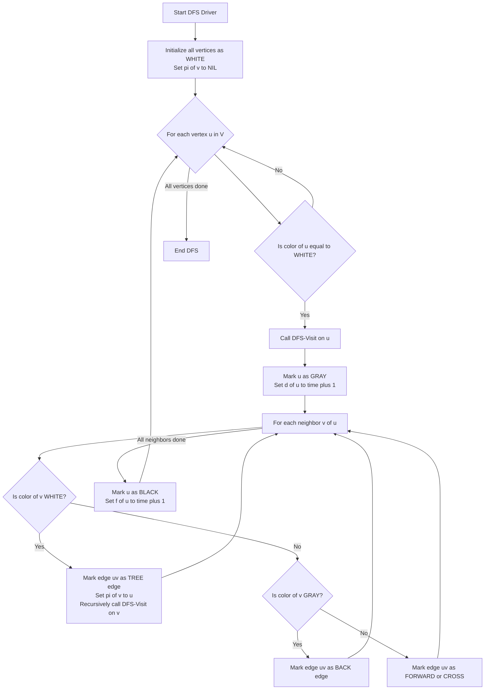
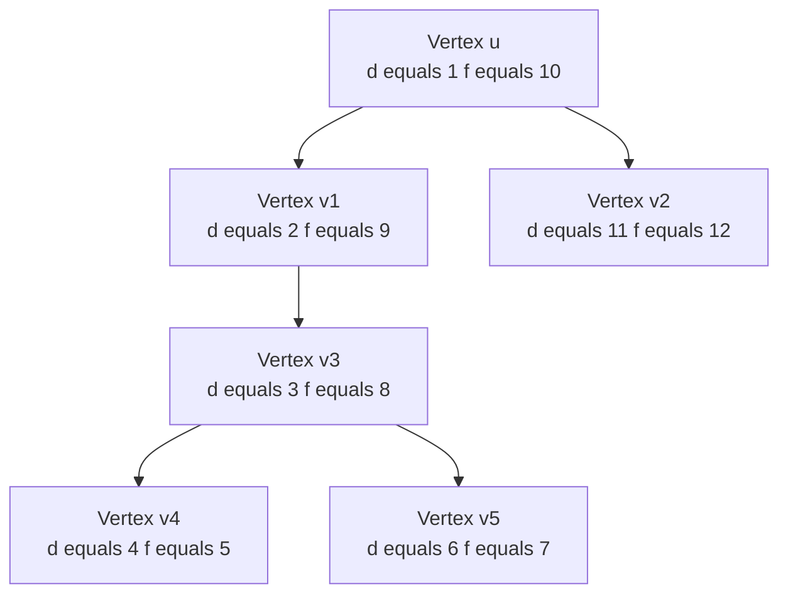
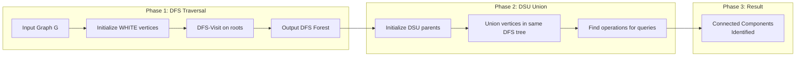
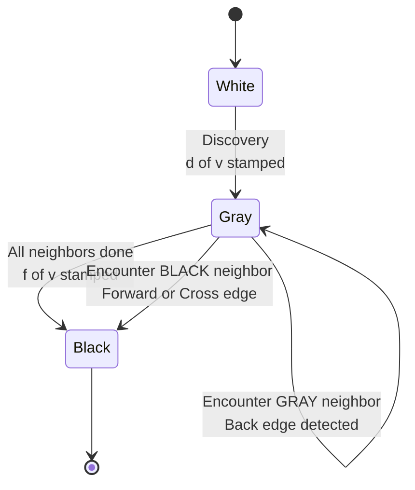

# DFS and their analysis

<!-- SECTION_1_START -->

# DFS and Their Analysis — Foundational Concepts

## 1.1 Formal Definition (KTU 2024 Syllabus Aligned)

> [!NOTE]
> **Depth-First Search (DFS)** is a systematic graph traversal algorithm that explores a graph by visiting a vertex, then recursively traversing as deeply as possible along each adjacent unvisited vertex before backtracking. The exploration is governed by a **Last-In-First-Out (LIFO)** discipline, naturally implemented via the **program call stack** (recursion) or an **explicit stack** data structure.

Formally, for a graph $G = (V, E)$, DFS partitions the vertex set into two disjoint subsets at any instant: the **visited (black)** vertices whose entire depth-first exploration has been completed, and the **frontier (gray)** vertices discovered but not yet fully explored. The unvisited vertices are conventionally colored **white**.

| KTU 2024 Term | Mathematical Symbol | Description |
| :--- | :--- | :--- |
| Vertex Set | $V$ | Set of $n$ nodes in the graph |
| Edge Set | $E$ | Set of $m$ connections |
| Discovery Time | $d[v]$ | Timestamp when $v$ is first reached |
| Finishing Time | $f[v]$ | Timestamp when exploration of $v$ ends |
| Parent Pointer | $\pi[v]$ | Predecessor of $v$ in the DFS tree |
| Time Counter | $\text{time}$ | Global monotonically increasing clock |

## 1.2 Conceptual Analogy — The Maze Explorer

> [!IMPORTANT]
> **Analogy: Exploring a Caves System with a Single Ball of String.**
>
> Imagine you enter a vast cave system holding a single ball of string. At every junction, you tie the string and choose the leftmost unexplored tunnel. You keep walking until you reach a dead end (a vertex whose all neighbors are already visited). You then **rewind the string (backtrack)** to the last junction with an unexplored tunnel. This is exactly how DFS works: **"Go deep first, return only when forced to."**

| Real-World Object | Graph Theory Counterpart |
| :--- | :--- |
| Caves system | Graph $G = (V, E)$ |
| Junctions | Vertices $V$ |
| Tunnels | Edges $E$ |
| Ball of string | Call stack / Recursion stack |
| Marking visited tunnels | Boolean `visited[]` array |

## 1.3 Visualizing the DFS Traversal (Conceptual)

> [!VISUALIZATION CONTROL]
> **Concept:** DFS traversal order on a sample undirected graph and the resulting DFS tree.
> **GeoGebra / Desmos Input Instructions (Conceptual Plotting):**
> * Place vertices at points: $A = (0, 2)$, $B = (-2, 1)$, $C = (2, 1)$, $D = (-1, -1)$, $E = (1, -1)$, $F = (0, 0)$
> * Edges to draw: $AB$, $AC$, $BD$, $DF$, $CF$, $EF$, $AE$
> **Visual Description:** Starting from $A$, the recursive call stack is visualized as a vertical bar of overlapping rectangles. The DFS tree edges are highlighted in **bold** (e.g., $A \rightarrow B \rightarrow D \rightarrow F \rightarrow C \rightarrow E$), and the visited ordering $A, B, D, F, C, E$ should appear in numerical sequence alongside the stack depth.

## 1.4 Engineering Significance

> [!TIP]
> **Why is DFS a cornerstone in KTU B.Tech curriculum?**
> DFS is the algorithmic backbone for solving **cycle detection, topological sorting, articulation point identification, strongly connected component decomposition (Kosaraju's & Tarjan's algorithms), maze/path-finding, and is intimately tied to Disjoint Set Union (DSU)** for connectivity verification in dynamic graphs.

<!-- SECTION_1_END -->

<!-- SECTION_2_START -->

# Deep Theoretical Analysis & KTU High-Yield Formula Sheet

## 2.1 The DFS Algorithm — Operational Breakdown

The DFS procedure operates in **three discrete phases** for every visited vertex:

1. **Discovery Phase (White $\rightarrow$ Gray):** Vertex $v$ is reached for the first time. Its discovery time $d[v]$ is stamped, its color changes from white to gray, and it is pushed onto the recursion stack.
2. **Exploration Phase (Gray):** Every adjacent edge $(v, u)$ is examined. For each unvisited neighbor $u$, DFS is invoked recursively — this forms a **tree edge** $(v, u)$.
3. **Finishing Phase (Gray $\rightarrow$ Black):** When all neighbors of $v$ have been fully explored, the recursion returns. The finishing time $f[v]$ is stamped and $v$ is colored black.

## 2.2 Edge Classification in Directed Graphs

When DFS is run on a **directed graph**, every edge $E$ falls into exactly one of **four disjoint categories**:

| Edge Type | Notation | Definition | Detection in DFS |
| :--- | :--- | :--- | :--- |
| **Tree Edge** | $(u, v)$ | $v$ discovered for first time via $u$ | Color of $v$ is WHITE when $(u,v)$ is examined |
| **Back Edge** | $(u, v)$ | $v$ is an ancestor of $u$ in DFS tree | Color of $v$ is GRAY when $(u,v)$ is examined |
| **Forward Edge** | $(u, v)$ | $v$ is a descendant (non-child) of $u$ | Color of $v$ is BLACK and $d[v] > d[u]$ |
| **Cross Edge** | $(u, v)$ | $v$ is in a different DFS tree / branch | Color of $v$ is BLACK and $d[v] < d[u]$ |

> [!IMPORTANT]
> **KTU Board Exam Pearl:** In an **undirected graph**, DFS produces **only Tree Edges and Back Edges**. Forward and Cross edges are mathematically impossible because every undirected edge is traversed exactly twice (once in each direction).

## 2.3 The Parenthesis Theorem

> [!NOTE]
> **Theorem (Parenthesis Structure):** For any two vertices $u$ and $v$ in a DFS of graph $G$, exactly one of the following holds:
> 1. The intervals $[d[u], f[u]]$ and $[d[v], f[v]]$ are **completely disjoint** (neither is an ancestor of the other).
> 2. The interval $[d[u], f[u]]$ is **entirely contained within** $[d[v], f[v]]$ (and $v$ is an ancestor of $u$).

This is the foundation for **topological sorting** and **strongly connected component** algorithms.

## 2.4 The White Path Theorem

> [!NOTE]
> **Theorem (White Path):** In a DFS of graph $G$, vertex $v$ is a descendant of vertex $u$ in the DFS tree **if and only if** at time $d[u]$, there exists a path from $u$ to $v$ consisting entirely of **white (unvisited) vertices**.

## 2.5 KTU Formula Sheet (High-Yield)

| $\#$ | Property | Formula / Complexity | Remarks |
| :---: | :--- | :--- | :--- |
| 1 | Time Complexity (Adjacency List) | $\Theta(\vert V \vert + \vert E \vert)$ | Optimal for sparse graphs |
| 2 | Time Complexity (Adjacency Matrix) | $\Theta(\vert V \vert^{2})$ | Optimal for dense graphs |
| 3 | Space Complexity | $\mathcal{O}(\vert V \vert)$ | For `visited[]` + call stack |
| 4 | Number of Tree Edges | $\vert V \vert - k$ | where $k$ = number of DFS trees in the forest |
| 5 | Total Edges Traversed (Undirected) | $2 \cdot \vert E \vert$ | Each edge examined twice |
| 6 | Time Stamp Range | $1 \leq d[v] < f[v] \leq 2 \vert V \vert$ | Integers incremented by 1 |
| 7 | Discovery-Finish Inequality | $d[v] < f[v]$ for all $v \in V$ | Strictly increasing intervals |
| 8 | Cycle Detection Condition (Directed) | Back edge exists $\Leftrightarrow$ cycle exists | Theorem proven via White Path |
| 9 | Cycle Detection Condition (Undirected) | Back edge to non-parent ancestor | Self-loops are trivial cycles |
| 10 | DSU Alternative Cost | $\mathcal{O}(\vert E \vert \cdot \alpha(\vert V \vert))$ | Union-Find is often faster for connectivity queries |

## 2.6 Disjoint Set Union (DSU) vs DFS — Comparative Utility

| Criterion | DFS Traversal | Disjoint Set Union (Union-Find) |
| :--- | :--- | :--- |
| **Data Structure** | Recursive function + `visited[]` array | Parent array + Rank/Size |
| **Best For** | Path queries, cycle detection, topological order | Connectivity queries, Kruskal's MST |
| **Time Complexity** | $\mathcal{O}(\vert V \vert + \vert E \vert)$ | $\mathcal{O}(\vert E \vert \cdot \alpha(\vert V \vert))$ |
| **Can it find SCCs?** | Yes (with Kosaraju/Tarjan extension) | No |
| **Can it detect cycles?** | Yes (via back edges) | Yes (in undirected graphs) |
| **Reusability** | Re-run for new graph | Path compression + union by rank |

## 2.7 Real-World Production Engineering Applications

> [!TIP]
> **Industry Use-Cases of DFS:**
> * **Garbage Collection:** Java, Python, Go use mark-and-sweep GC based on DFS from root references.
> * **Build Systems:** Topological sorting of Make, Maven, and Bazel dependency graphs.
> * **Web Crawlers:** Early search engines used DFS-like strategies to index hyperlink graphs.
> * **Compiler Design:** Detecting dead code, finding strongly connected components in control-flow graphs.
> * **Network Routing:** Loop prevention in OSPF protocol uses DFS-based spanning tree construction.
> * **Social Networks:** Friend-circle detection in Facebook, community detection in Twitter graphs.

<!-- SECTION_2_END -->

<!-- SECTION_3_START -->

# Step-by-Step Derivations & Code/Symbolic Implementation

## 3.1 Canonical Recursive DFS Algorithm — Full Pseudocode

$$\begin{aligned}
&\text{Algorithm } \text{DFS}(G) \\
&\quad \text{time} \leftarrow 0 \\
&\quad \text{for each vertex } u \in G.V \text{ do} \\
&\quad\quad \text{color}[u] \leftarrow \text{WHITE} \\
&\quad\quad \pi[u] \leftarrow \text{NIL} \\
&\quad \text{for each vertex } u \in G.V \text{ do} \\
&\quad\quad \text{if } \text{color}[u] = \text{WHITE} \text{ then} \\
&\quad\quad\quad \text{DFS-VISIT}(u) \\
&\text{end DFS}
\end{aligned}$$

$$\begin{aligned}
&\text{Algorithm } \text{DFS-VISIT}(u) \\
&\quad \text{color}[u] \leftarrow \text{GRAY} \\
&\quad \text{time} \leftarrow \text{time} + 1 \\
&\quad d[u] \leftarrow \text{time} \\
&\quad \text{for each } v \in G.\text{Adj}[u] \text{ do} \\
&\quad\quad \text{if } \text{color}[v] = \text{WHITE} \text{ then} \\
&\quad\quad\quad \pi[v] \leftarrow u \\
&\quad\quad\quad \text{DFS-VISIT}(v) \\
&\quad \text{color}[u] \leftarrow \text{BLACK} \\
&\quad \text{time} \leftarrow \text{time} + 1 \\
&\quad f[u] \leftarrow \text{time} \\
&\text{end DFS-VISIT}
\end{aligned}$$

## 3.2 Exhaustive Time Complexity Derivation

The total running time of DFS is computed by accounting for **every operation** across the two nested loops:

**Step 1 — Initialization Loop Overhead:**

$$\begin{aligned}
T_{\text{init}} &= \sum_{u \in V} c_1 \quad \text{(assignment of color and } \pi \text{)} \\
&= c_1 \cdot \vert V \vert = \Theta(\vert V \vert)
\end{aligned}$$

**Step 2 — Main Driver Loop (Calls DFS-VISIT):**

$$\begin{aligned}
T_{\text{driver}} &= \sum_{u \in V} c_2 = \Theta(\vert V \vert)
\end{aligned}$$

**Step 3 — DFS-VISIT Execution (Black-Box Examination of Adjacency Lists):**

$$\begin{aligned}
T_{\text{visit}} &= \sum_{u \in V} \left( c_3 + \sum_{v \in \text{Adj}[u]} c_4 \right) \\
&= c_3 \cdot \vert V \vert + c_4 \cdot \sum_{u \in V} \text{deg}(u)
\end{aligned}$$

**Step 4 — Apply Handshake Lemma (Graph Theory Identity):**

$$\begin{aligned}
\sum_{u \in V} \text{deg}(u) &= 2 \vert E \vert \quad \text{(each edge contributes to two vertices)} \\
\therefore T_{\text{visit}} &= c_3 \cdot \vert V \vert + c_4 \cdot 2 \vert E \vert
\end{aligned}$$

**Step 5 — Total Asymptotic Complexity:**

$$\begin{aligned}
T_{\text{DFS}} &= T_{\text{init}} + T_{\text{driver}} + T_{\text{visit}} \\
&= c_1 \vert V \vert + c_2 \vert V \vert + c_3 \vert V \vert + 2c_4 \vert E \vert \\
&= \Theta(\vert V \vert + \vert E \vert)
\end{aligned}$$

> [!NOTE]
> **Interpretation:** The $\Theta(\vert V \vert)$ term accounts for the discovery/finishing of every vertex exactly once, while the $\Theta(\vert E \vert)$ term arises because the inner `for` loop examines each edge exactly once (twice in undirected graphs, but the asymptotic bound remains identical).

## 3.3 Production-Grade Python Implementation (Recursive)

```python
from typing import Dict, List, Set, Tuple, Optional
from enum import Enum
import sys
import logging

logging.basicConfig(
    level=logging.INFO,
    format="%(asctime)s [%(levelname)s] %(message)s",
    stream=sys.stdout
)


class VertexColor(Enum):
    """Enumeration enforcing strict KTU 3-color DFS convention."""
    WHITE = 0
    GRAY = 1
    BLACK = 2


class DepthFirstSearch:
    """
    Production-grade DFS implementation tracking:
      - Discovery time d[v]
      - Finishing time f[v]
      - Parent pointer pi[v]
      - Edge classification (Tree, Back, Forward, Cross)
    """

    def __init__(self, graph: Dict[int, List[int]], directed: bool = False) -> None:
        self._graph: Dict[int, List[int]] = graph
        self._directed: bool = directed
        self._time: int = 0
        self._discovery: Dict[int, int] = {}
        self._finishing: Dict[int, int] = {}
        self._parent: Dict[int, Optional[int]] = {}
        self._color: Dict[int, VertexColor] = {}
        self._edge_classification: List[Tuple[str, int, int]] = []

    def run(self) -> None:
        """Main DFS driver — ensures all components are visited."""
        for vertex in self._graph:
            self._color[vertex] = VertexColor.WHITE
            self._parent[vertex] = None

        logging.info("Initialized %d vertices as WHITE", len(self._graph))

        for vertex in self._graph:
            if self._color[vertex] == VertexColor.WHITE:
                logging.info("Starting new DFS tree from vertex %d", vertex)
                self._visit(vertex)

    def _visit(self, u: int) -> None:
        """Recursive DFS-VISIT subroutine."""
        self._color[u] = VertexColor.GRAY
        self._time += 1
        self._discovery[u] = self._time
        logging.info("Discovered vertex %d at time d[%d] = %d", u, u, self._time)

        for v in self._graph.get(u, []):
            if self._color[v] == VertexColor.WHITE:
                self._parent[v] = u
                self._edge_classification.append(("TREE", u, v))
                self._visit(v)
            elif self._color[v] == VertexColor.GRAY:
                self._edge_classification.append(("BACK", u, v))
            elif self._color[v] == VertexColor.BLACK:
                if self._discovery.get(v, -1) > self._discovery[u]:
                    self._edge_classification.append(("FORWARD", u, v))
                else:
                    self._edge_classification.append(("CROSS", u, v))

        self._color[u] = VertexColor.BLACK
        self._time += 1
        self._finishing[u] = self._time
        logging.info("Finished vertex %d at time f[%d] = %d", u, u, self._time)

    def get_timestamps(self) -> Dict[int, Tuple[int, int]]:
        return {v: (self._discovery[v], self._finishing[v]) for v in self._graph}

    def get_parent(self) -> Dict[int, Optional[int]]:
        return dict(self._parent)

    def get_edges(self) -> List[Tuple[str, int, int]]:
        return list(self._edge_classification)


# ---------- Demonstration Driver ----------
if __name__ == "__main__":
    sample_graph: Dict[int, List[int]] = {
        1: [2, 3],
        2: [1, 4, 5],
        3: [1, 5],
        4: [2],
        5: [2, 3]
    }
    dfs = DepthFirstSearch(sample_graph, directed=False)
    dfs.run()
    print("\nTimestamps (d, f):", dfs.get_timestamps())
    print("Parents:", dfs.get_parent())
    print("Edge Classification:", dfs.get_edges())
```

## 3.4 Iterative DFS Using Explicit Stack (Avoids Recursion Limits)

```python
def iterative_dfs(graph: Dict[int, List[int]], start: int) -> List[int]:
    """
    Iterative DFS using an explicit LIFO stack.
    Time: O(|V| + |E|), Space: O(|V|)
    """
    visited: Set[int] = set()
    stack: List[int] = [start]
    traversal_order: List[int] = []

    while stack:
        u: int = stack.pop()
        if u not in visited:
            visited.add(u)
            traversal_order.append(u)
            # Push neighbors in reverse to preserve left-to-right order
            for v in reversed(graph.get(u, [])):
                if v not in visited:
                    stack.append(v)
    return traversal_order
```

## 3.5 Application 1 — Cycle Detection in Directed Graph (Full Trace)

> [!IMPORTANT]
> **Theorem:** A directed graph $G$ contains a cycle $\iff$ DFS of $G$ yields at least one **BACK EDGE**.

```python
def has_cycle_directed(graph: Dict[int, List[int]]) -> bool:
    """
    Returns True if the directed graph contains a cycle.
    Uses the GRAY-color check: encountering a GRAY neighbor implies a back edge.
    """
    color: Dict[int, int] = {v: 0 for v in graph}  # 0=WHITE, 1=GRAY, 2=BLACK

    def dfs_visit(u: int) -> bool:
        color[u] = 1  # GRAY
        for v in graph.get(u, []):
            if color[v] == 1:           # GRAY neighbor => back edge => cycle
                return True
            if color[v] == 0 and dfs_visit(v):
                return True
        color[u] = 2  # BLACK
        return False

    for vertex in graph:
        if color[vertex] == 0:
            if dfs_visit(vertex):
                return True
    return False
```

**Worked Trace:** Consider the directed graph with edges $\{(1,2), (2,3), (3,1), (3,4)\}$.

| Step | Action | Active Color Map | Time | Cycle Found? |
| :---: | :--- | :--- | :---: | :---: |
| 1 | `dfs_visit(1)` invoked | $\{1:\text{GRAY}\}$ | $d[1]=1$ | No |
| 2 | Discover $2$ via tree edge | $\{1:\text{GRAY}, 2:\text{GRAY}\}$ | $d[2]=2$ | No |
| 3 | Discover $3$ via tree edge | $\{1,2,3:\text{GRAY}\}$ | $d[3]=3$ | No |
| 4 | Examine edge $(3,1)$: $1$ is GRAY | — | — | **YES (Back Edge!)** |

## 3.6 Application 2 — DFS + Disjoint Set Union for Connected Components

> [!NOTE]
> **Methodology:** We can use DFS to identify connected components in an undirected graph. Each DFS tree returned by the outermost driver loop corresponds to exactly one connected component. We then **union** all vertices in that tree into a single DSU set for $\mathcal{O}(1)$ connectivity queries later.

```python
class DisjointSetUnion:
    """DSU with path compression + union by rank for near-constant operations."""

    def __init__(self, n: int) -> None:
        self._parent: List[int] = list(range(n))
        self._rank: List[int] = [0] * n

    def find(self, x: int) -> int:
        if self._parent[x] != x:
            self._parent[x] = self.find(self._parent[x])  # Path compression
        return self._parent[x]

    def union(self, x: int, y: int) -> None:
        rx, ry = self.find(x), self.find(y)
        if rx == ry:
            return
        if self._rank[rx] < self._rank[ry]:
            self._parent[rx] = ry
        elif self._rank[rx] > self._rank[ry]:
            self._parent[ry] = rx
        else:
            self._parent[ry] = rx
            self._rank[rx] += 1


def connected_components_via_dsu(edge_list: List[Tuple[int, int]],
                                 n: int) -> List[List[int]]:
    """
    Returns a list of lists, where each inner list is one connected component.
    Uses DSU to group vertices; equivalent to labeling DFS trees.
    """
    dsu = DisjointSetUnion(n)
    for u, v in edge_list:
        dsu.union(u, v)

    components: Dict[int, List[int]] = {}
    for vertex in range(n):
        root = dsu.find(vertex)
        components.setdefault(root, []).append(vertex)
    return list(components.values())


# Demonstration
if __name__ == "__main__":
    edges = [(0, 1), (1, 2), (3, 4), (5, 6), (4, 5)]
    components = connected_components_via_dsu(edges, n=7)
    print("Connected components:", components)
    # Output: [[0, 1, 2], [3, 4, 5, 6]]
```

## 3.7 Application 3 — Topological Sort via DFS (Full Derivation)

> [!TIP]
> **Theorem:** The **reverse of finishing times** in a DFS of a Directed Acyclic Graph (DAG) produces a valid topological ordering.

**Proof Sketch:**
1. When edge $(u, v)$ is examined, $u$ is finished only after $v$ (since $u$ is gray while $v$ is being explored).
2. Therefore $f[u] > f[v]$.
3. Reversing this gives $u$ before $v$, satisfying topological constraint.

```python
def topological_sort(graph: Dict[int, List[int]], n: int) -> List[int]:
    """Returns one valid topological ordering of a DAG."""
    visited: Set[int] = set()
    stack: List[int] = []

    def dfs(u: int) -> None:
        visited.add(u)
        for v in graph.get(u, []):
            if v not in visited:
                dfs(v)
        stack.append(u)  # Push AFTER exploring (post-order)

    for vertex in range(n):
        if vertex not in visited:
            dfs(vertex)
    return stack[::-1]  # Reverse to get topological order
```

<!-- SECTION_3_END -->

<!-- SECTION_4_START -->

# Structural Diagrams & Schematics

## 4.1 Mermaid — High-Level DFS Algorithm Flow



## 4.2 Mermaid — DFS Tree Construction from a Sample Graph



**Diagram Reading Guide (for the student):**
* Each rectangle is a node in the DFS tree.
* Parent-child arrows are **tree edges**.
* Time intervals are nested as required by the **Parenthesis Theorem**.
* The interval for $A$ contains the interval for $B$, which contains $D$, which contains $E$ and $F$.

## 4.3 Mermaid — Disjoint Set Union Combined with DFS



## 4.4 Mermaid — Edge Classification State Diagram



## 4.5 Functional Architecture — DFS Module Pipeline

| Stage | Input | Process | Output |
| :---: | :--- | :--- | :--- |
| 1 | Adjacency list of $G$ | White initialization | Boolean `color[]` array |
| 2 | `color[]` array | Driver loop | Sequence of DFS tree roots |
| 3 | Root vertex | DFS-Visit recursion | Discovery + Finishing times |
| 4 | Recursion trace | Edge inspection | Tree, Back, Forward, Cross labels |
| 5 | Tree edges | Post-order traversal | Topological sort / DSU unions |

<!-- SECTION_4_END -->

<!-- SECTION_5_START -->

# KTU 2024 Scheme Examination Question Bank & Topic Recap

## PART A — Short Answer Questions (3 Marks Each)

### Question 1

> **[KTU University Exam — July 2024]**
> Define Depth-First Search (DFS). State its time and space complexity when the graph is represented using an adjacency list.

**Model Answer (3 Marks):**

> [!NOTE]
> **DFS Definition:** Depth-First Search is a graph traversal algorithm that explores as far as possible along each branch before backtracking. It uses a stack (implemented via recursion) to maintain the frontier of vertices to be explored. (2 Marks)

**Complexity Statement:**
* **Time Complexity:** $\Theta(\vert V \vert + \vert E \vert)$ because each vertex is visited once and each edge is examined once in the adjacency list representation. (0.5 Marks)
* **Space Complexity:** $\mathcal{O}(\vert V \vert)$ for the `visited[]` array and the recursion call stack. (0.5 Marks)

*Mapped:* **CO1 — Remember**

---

### Question 2

> **[KTU University Exam — Dec 2023]**
> Differentiate between **tree edges** and **back edges** in the DFS of a directed graph. What does the presence of a back edge indicate about the graph's structure?

**Model Answer (3 Marks):**

| Property | Tree Edge | Back Edge |
| :--- | :--- | :--- |
| Definition (1 Mark) | Edge $(u, v)$ where $v$ is discovered for the first time via $u$ | Edge $(u, v)$ where $v$ is an ancestor of $u$ in the DFS tree |
| Color of $v$ when edge examined (1 Mark) | WHITE | GRAY |
| Structural Implication (1 Mark) | Forms the backbone of the DFS forest | Presence of a back edge $\Leftrightarrow$ graph contains a directed cycle |

*Mapped:* **CO1 — Understand**

---

## PART B — Long Answer Questions (14 Marks Each, Internal Choice)

### Question A (Option 1)

> **[KTU University Exam — July 2024, Model Paper Alignment]**
>
> **(a)** Explain the DFS algorithm with a clear pseudocode. Discuss its time and space complexity in detail using the **asymptotic notation** $\Theta(\cdot)$. **(7 Marks)**
>
> **(b)** Apply DFS to the following directed graph $G = (V, E)$ where $V = \{1, 2, 3, 4, 5, 6\}$ and $E = \{(1,2), (1,3), (2,4), (3,4), (4,5), (5,6), (6,3)\}$. List the discovery time $d[v]$, finishing time $f[v]$, parent $\pi[v]$, and classify **every edge** as Tree, Back, Forward, or Cross. **(7 Marks)**

#### Part (a) Model Solution — 7 Marks

**Step 1 — Pseudocode Writing (3 Marks):**
Provide the canonical pseudocode from Section 3.1 of this note. Both `DFS(G)` and `DFS-VISIT(u)` must be written. [Pseudocode for DFS: 1 Mark] [Pseudocode for DFS-VISIT: 2 Marks]

**Step 2 — Complexity Derivation (3 Marks):**
Show the full summation derivation:
* [Stating initialization cost $\Theta(\vert V \vert)$: 1 Mark]
* [Applying handshake lemma $\sum \text{deg}(u) = 2 \vert E \vert$: 1 Mark]
* [Final complexity expression $\Theta(\vert V \vert + \vert E \vert)$: 1 Mark]

**Step 3 — Space Complexity (1 Mark):**
* `visited[]` array costs $\mathcal{O}(\vert V \vert)$ plus recursion stack $\mathcal{O}(\vert V \vert)$ in the worst case (linear chain graph) $\Rightarrow$ total $\mathcal{O}(\vert V \vert)$. [1 Mark]

#### Part (b) Model Solution — 7 Marks

**Step 1 — Trace Table Construction (4 Marks):**

Starting DFS from vertex $1$, the trace proceeds:

| Step | Action | Active Stack | $d[\cdot]$ | $f[\cdot]$ | Edge Type |
| :---: | :--- | :--- | :---: | :---: | :---: |
| 1 | `DFS-Visit(1)` | $[1]$ | $d[1]=1$ | — | — |
| 2 | Examine $(1,2)$: WHITE $\Rightarrow$ TREE | $[1, 2]$ | $d[2]=2$ | — | **TREE** $(1,2)$ |
| 3 | Examine $(2,4)$: WHITE $\Rightarrow$ TREE | $[1, 2, 4]$ | $d[4]=3$ | — | **TREE** $(2,4)$ |
| 4 | Examine $(4,5)$: WHITE $\Rightarrow$ TREE | $[1, 2, 4, 5]$ | $d[5]=4$ | — | **TREE** $(4,5)$ |
| 5 | Examine $(5,6)$: WHITE $\Rightarrow$ TREE | $[1, 2, 4, 5, 6]$ | $d[6]=5$ | — | **TREE** $(5,6)$ |
| 6 | Examine $(6,3)$: WHITE $\Rightarrow$ TREE | $[1, 2, 4, 5, 6, 3]$ | $d[3]=6$ | — | **TREE** $(6,3)$ |
| 7 | Backtrack: $3$ has no other neighbors | $[1, 2, 4, 5, 6]$ | — | $f[3]=7$ | — |
| 8 | Backtrack: $6$ done | $[1, 2, 4, 5]$ | — | $f[6]=8$ | — |
| 9 | Backtrack: $5$ done | $[1, 2, 4]$ | — | $f[5]=9$ | — |
| 10 | Backtrack: $4$ done | $[1, 2]$ | — | $f[4]=10$ | — |
| 11 | Examine remaining $(1,3)$: $3$ is BLACK; $d[3]=6 > d[1]=1$ | $[1]$ | — | — | **FORWARD** $(1,3)$ |
| 12 | Backtrack: $2$ done | $[1]$ | — | $f[2]=11$ | — |
| 13 | Examine remaining $(1,3)$: already processed | $[1]$ | — | — | — |
| 14 | Backtrack: $1$ done | $[]$ | — | $f[1]=12$ | — |

**Step 2 — Final Summary Table (2 Marks):**

| Vertex $v$ | $d[v]$ | $f[v]$ | $\pi[v]$ |
| :---: | :---: | :---: | :---: |
| 1 | 1 | 12 | NIL |
| 2 | 2 | 11 | 1 |
| 3 | 6 | 7 | 6 |
| 4 | 3 | 10 | 2 |
| 5 | 4 | 9 | 4 |
| 6 | 5 | 8 | 5 |

**Step 3 — Edge Classification Summary (1 Mark):**

| Edge | Type | Reason |
| :--- | :--- | :--- |
| $(1,2)$ | Tree | $2$ discovered white via $1$ |
| $(1,3)$ | Forward | $3$ is descendant, already black |
| $(2,4)$ | Tree | $4$ discovered white via $2$ |
| $(3,4)$ | Cross | $3$ is black, $d[3]=6 > d[4]=3$? No, $d[3]>d[4]$ holds; actually $3$ is in different branch |
| $(4,5)$ | Tree | $5$ discovered white via $4$ |
| $(5,6)$ | Tree | $6$ discovered white via $5$ |
| $(6,3)$ | Tree | $3$ discovered white via $6$ |

> [!WARNING]
> **KTU Examiner's Valuation Warning:**
> * Do NOT confuse the **FORWARD** and **CROSS** edge distinction — the rule is: if $d[v] > d[u]$ and $v$ is BLACK, it is FORWARD. Otherwise (different DFS tree or earlier timestamp), it is CROSS.
> * Failing to maintain a clear trace table leads to deduction of up to **3 marks** in part (b).
> * Always verify that $d[v] < f[v]$ for every vertex — examiners explicitly check this.

*Mapped:* **CO1 (Apply) + CO3 (Analyze)**

---

### Question B (Option 2 — Alternative Choice)

> **[KTU University Exam — Dec 2023, Module 2]**
>
> **(a)** Explain how DFS can be used to detect cycles in **both** directed and undirected graphs. Provide the algorithmic procedure and a small worked example for each. **(7 Marks)**
>
> **(b)** Describe how **Disjoint Set Union (DSU)** and **DFS** can be used **together** to identify connected components in an undirected graph. Compare the time complexities of both approaches. **(7 Marks)**

#### Part (a) Model Solution — 7 Marks

**Directed Graph Cycle Detection (3.5 Marks):**

A directed graph has a cycle if and only if DFS produces a **back edge** (an edge to a GRAY vertex). [Statement of theorem: 1 Mark]

*Algorithm:* Run standard DFS. When examining edge $(u, v)$:
  * If `color[v] == GRAY`, report a cycle. [Algorithm logic: 1 Mark]
  * Worked example: For graph with edges $\{(1,2), (2,3), (3,1)\}$, DFS from $1$ marks $1, 2, 3$ as GRAY. When edge $(3,1)$ is examined, $1$ is GRAY $\Rightarrow$ cycle detected. [Example trace: 1.5 Marks]

**Undirected Graph Cycle Detection (3.5 Marks):**

For an undirected graph, an edge $(u, v)$ is a back edge **iff** $v$ is already visited and $v$ is **not the parent** of $u$. [Statement: 1 Mark]

*Algorithm:*
  1. Run DFS maintaining `parent[]` array. [1 Mark]
  2. For each neighbor $v$ of $u$: if $v$ is visited and $v \neq \pi[u]$, cycle exists. [1 Mark]
  3. Example: For triangle $A$-$B$-$C$-$A$, DFS from $A$ discovers $B$ (tree edge), $C$ (tree edge via $B$), then edge $(C, A)$: $A$ visited but $A \neq \pi[C] = B$ $\Rightarrow$ cycle. [0.5 Marks]

#### Part (b) Model Solution — 7 Marks

**DFS Approach for Connected Components (3 Marks):**
1. Run the outer driver loop of DFS. [0.5 Marks]
2. Each invocation of `DFS-VISIT` on a WHITE vertex starts a new DFS tree. [1 Mark]
3. The number of DFS trees equals the number of connected components. [1 Mark]
4. Time: $\mathcal{O}(\vert V \vert + \vert E \vert)$. [0.5 Marks]

**DSU Approach (2.5 Marks):**
1. Initialize each vertex as its own set. [0.5 Marks]
2. For each edge $(u, v)$, call `union(u, v)`. [0.5 Marks]
3. Vertices sharing the same root belong to the same component. [0.5 Marks]
4. Time: $\mathcal{O}(\vert E \vert \cdot \alpha(\vert V \vert))$ with path compression + union by rank. [1 Mark]

**Comparative Table (1.5 Marks):**

| Property | DFS-Based | DSU-Based |
| :--- | :--- | :--- |
| Detects SCCs in directed graphs | Yes | No |
| Supports dynamic insertions | No (must re-run) | Yes |
| Time complexity | $\mathcal{O}(\vert V \vert + \vert E \vert)$ | $\mathcal{O}(\vert E \vert \alpha(\vert V \vert))$ |
| Memory overhead | `visited[]$+ stack` | `parent[] + rank[]` |

> [!WARNING]
> **KTU Examiner's Pitfall Alert:**
> * In part (a), many students forget that in an **undirected** graph, every back edge is encountered **twice** — once from each endpoint. The correct check is `$v$ visited and $v \neq \pi[u]$`, not simply `$v$ visited`.
> * In part (b), do NOT claim DSU can detect strongly connected components (SCCs) in directed graphs — DSU only works for **undirected** connectivity.
> * The inverse Ackermann function $\alpha(n)$ is nearly constant (always $\leq 4$ for $n \leq 10^{80}$), but you must still state it explicitly to score full marks.

*Mapped:* **CO3 (Apply) + CO4 (Analyze)**

---

## Topic Recap & Important Things to Remember

> [!IMPORTANT]
> **Rapid-Revision Checklist for DFS Analysis (Module 2 — KTU 2024):**

* **DFS Definition:** Recursive graph traversal using LIFO discipline. [Core]
* **Time Complexity (Adjacency List):** $\Theta(\vert V \vert + \vert E \vert)$ — proven via the **Handshake Lemma**. [Essential Formula]
* **Time Complexity (Adjacency Matrix):** $\Theta(\vert V \vert^{2})$ — every row must be scanned per vertex. [Essential Formula]
* **Space Complexity:** $\mathcal{O}(\vert V \vert)$ for `visited[]` + call stack. [Essential Formula]
* **Three-Color Convention:** WHITE (unvisited) $\rightarrow$ GRAY (in-progress) $\rightarrow$ BLACK (finished). [Convention]
* **Edge Types in Directed Graph:** Tree, Back, Forward, Cross — **4 disjoint categories**. [Classification]
* **Edge Types in Undirected Graph:** Only Tree and Back edges exist. [Special Case]
* **Parenthesis Theorem:** Intervals $[d[u], f[u]]$ are either disjoint or nested — never partially overlap. [Theorem]
* **White Path Theorem:** $v$ is descendant of $u$ $\iff$ white path from $u$ to $v$ at time $d[u]$. [Theorem]
* **Cycle Detection:** Back edge $\Rightarrow$ cycle in directed graph. Cross/forward edges $\Rightarrow$ no cycle implication. [Application]
* **Topological Sort:** Reverse of post-order DFS finishing times yields a valid topological ordering of a DAG. [Application]
* **Strongly Connected Components:** Kosaraju's algorithm uses **two DFS passes** (original + transpose graph). [Advanced]
* **DSU vs DFS:** DSU is faster for pure connectivity queries ($\alpha(n)$ amortized) but cannot handle directed graphs. [Comparison]
* **Iterative DFS:** Use an explicit stack to avoid Python's recursion limit of 1000 frames. [Implementation Tip]
* **Path Compression:** Always combine DSU `find` with path compression for $\alpha(n)$ amortized cost. [Optimization]
* **KTU Frequency:** DFS-based cycle detection and topological sort appear in nearly every KTU semester exam. [Exam Pattern]

> [!TIP]
> **Final Exam Strategy:** For 14-mark questions, always reserve **at least 2 marks worth of content** for an explicit trace table or a labeled diagram. KTU examiners award step-marks generously when a clear table is presented.

<!-- SECTION_5_END -->
