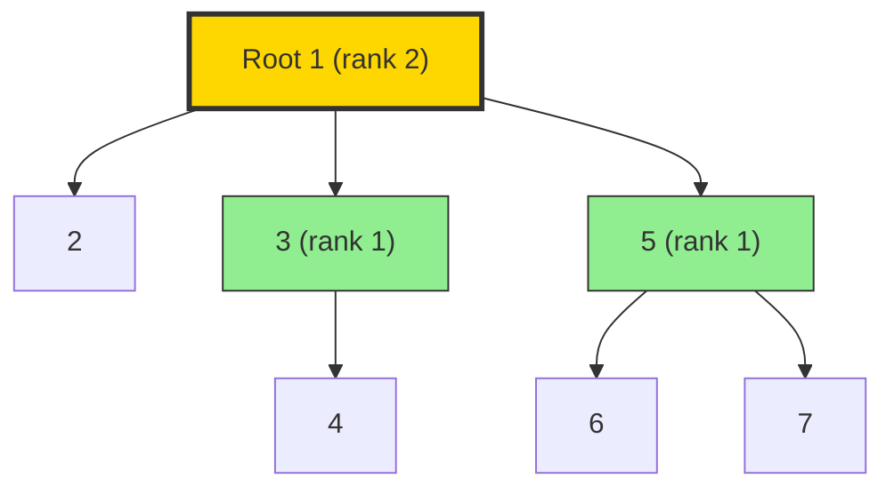
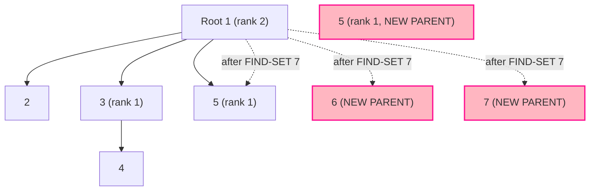
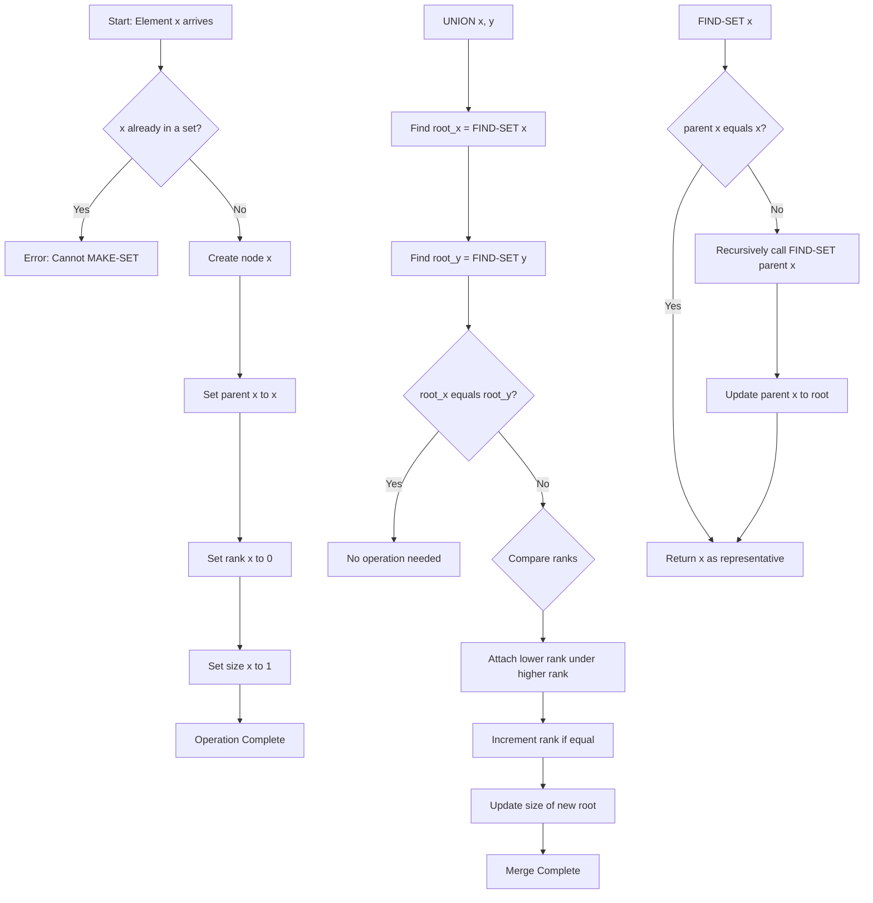
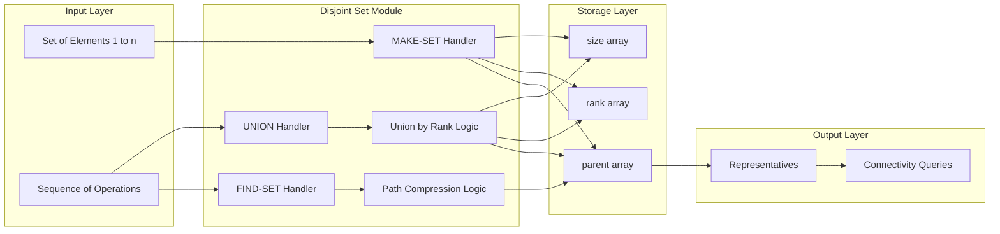

# Disjoint Sets - Disjoint set operations

<!-- SECTION_1_START -->
# Disjoint Set Operations: The Foundation of Union-Find

> [!IMPORTANT]
> **KTU 2024 Scheme | PCCST502 | Module 2 | Disjoint Set Data Structure**
> A **disjoint-set data structure** (also called **Union-Find** or **Merge-Find Set**) maintains a collection $S = \{S_1, S_2, \ldots, S_k\}$ of disjoint dynamic sets. It is one of the most practically efficient data structures in algorithm design, powering graph algorithms like **Kruskal's Minimum Spanning Tree**, network connectivity checks, and image processing.

## 1.1 Formal KTU Definition

A **disjoint-set data structure** is an abstract data structure that keeps track of a partition of a set of elements into a number of **disjoint (non-overlapping) subsets**. It supports three primary operations defined in the KTU 2024 syllabus:

$$
\begin{aligned}
\text{MAKE-SET}(x) &\rightarrow \text{Creates a new set whose only member (and representative) is } x \\
\text{UNION}(x, y) &\rightarrow \text{Merges the dynamic sets containing } x \text{ and } y \text{ into a new set} \\
\text{FIND-SET}(x) &\rightarrow \text{Returns a pointer to the representative of the set containing } x
\end{aligned}
$$

The **representative** is a distinguished member of the set that acts as the identifier of that subset. Two elements $x$ and $y$ are in the same set **if and only if** $\text{FIND-SET}(x) = \text{FIND-SET}(y)$.

## 1.2 Conceptual Analogy: The "Family Tree" Model

Imagine a college with **3,000 students** joining online. Initially, each student is alone. As the semester progresses, students form friend groups (subsets). The **class representative (CR)** of each group is the *representative member*.

- When two students meet and want to be friends, they **merge** their friend groups. The new group's CR is elected.
- When you want to check if two students are in the same group, you ask: *"Who is your CR?"* — if both names match, they're in the same group.

> [!NOTE]
> **Key Property — Partition Invariant:** At any instant, the subsets $S_1, S_2, \ldots, S_k$ are **pairwise disjoint** and their union is the entire universe of elements processed so far. The sets are **mutually exclusive** and **collectively exhaustive** (within the processed domain).

## 1.3 Why Disjoint Sets Matter in Engineering

Disjoint sets are the silent workhorses of:

| Application Domain | Real-World Use Case |
|---|---|
| **Network Design** | Kruskal's MST for laying minimum-length optical fiber cables |
| **Image Segmentation** | Flood-fill algorithms in graphics (Photoshop bucket tool) |
| **Social Networks** | Determining connected components (mutual friend circles) |
| **Compiler Design** | Equivalence-class detection in register allocation |
| **Telecommunications** | Network connectivity & cycle detection in routing |
| **Game Development** | Procedural world chunk merging & pathfinding optimizations |

## 1.4 Geometric Intuition of the Representative

> [!VISUALIZATION CONTROL]
> **Concept:** Disjoint Set Partition Visualization with 3 separate components
> **GeoGebra / Desmos Input Equations:**
> * `C1: (x - 2)^2 + (y - 3)^2 = 1` (Set S1, representative A)
> * `C2: (x - 6)^2 + (y - 3)^2 = 1` (Set S2, representative D)
> * `C3: (x - 10)^2 + (y - 3)^2 = 1` (Set S3, representative G)
> * Points: `(2,3), (6,3), (10,3)` and inner member points
> **Visual Description:** Three separated circles (subsets), each containing scattered points (members) with one bold central point (representative). No two circles overlap — this visualizes the *disjointness* property.
<!-- SECTION_1_END -->

<!-- SECTION_2_START -->
# Deep Theoretical Analysis & KTU High-Yield Formula Sheet

## 2.1 The Three Core Operations — Complete Semantics

### 2.1.1 MAKE-SET(x)

**Purpose:** Initialize a new set containing only element $x$.

**Preconditions & Postconditions:**
- Element $x$ must **not** already belong to any set.
- After execution, $\text{FIND-SET}(x) = x$ (i.e., $x$ is its own representative).
- Time complexity: $\Theta(1)$.

**Implementation Logic (Linked List Form):**
- Allocate a new node for $x$.
- Set $parent[x] \leftarrow x$.
- Set $rank[x] \leftarrow 0$.
- Initialize $size[x] \leftarrow 1$.

### 2.1.2 FIND-SET(x)

**Purpose:** Return the representative of the set containing $x$.

**Preconditions & Postconditions:**
- Element $x$ must have been previously added via MAKE-SET.
- Returns a pointer (or ID) to the root representative.
- Recursive definition: $\text{FIND-SET}(x) = x$ if $x$ is the root; otherwise, $\text{FIND-SET}(parent[x])$.

### 2.1.3 UNION(x, y)

**Purpose:** Merge the two sets containing $x$ and $y$ into a single set.

**Preconditions & Postconditions:**
- $\text{FIND-SET}(x) \neq \text{FIND-SET}(y)$ (otherwise, $x$ and $y$ are already in the same set).
- After execution, $\text{FIND-SET}(x) = \text{FIND-SET}(y)$ for all elements previously in either set.

**Steps:**
1. $u \leftarrow \text{FIND-SET}(x)$
2. $v \leftarrow \text{FIND-SET}(y)$
3. $root \leftarrow \text{UNION}(u, v)$ — attach one root under the other.
4. Update size/rank bookkeeping.

## 2.2 Linked-List Representation of Disjoint Sets

In the linked-list representation (Cormen Chapter 21), each set is a **singly linked list** with:

- A **head pointer** pointing to the first element (used as the representative).
- A **tail pointer** to the last element (for $O(1)$ concatenation).
- Each node $x$ stores: `value`, `next` pointer, and `representative` pointer back to the head.

| Operation | Naive Cost | Optimized Cost |
|---|---|---|
| MAKE-SET | $\Theta(1)$ | $\Theta(1)$ |
| FIND-SET | $\Theta(1)$ via representative pointer | $\Theta(1)$ |
| UNION | $\Theta(n)$ (must update all representatives) | $\Theta(1)$ with tail pointer + weighted-union heuristic |
| $m$ operations total | $O(m + n^2)$ worst-case | $O(m + n \log n)$ with weighted-union |

> [!NOTE]
> **Weighted-Union Heuristic (Linked-List):** Always append the **shorter list** to the **longer list** during UNION. This guarantees each element's representative pointer is updated at most $O(\log n)$ times, because its list at least doubles in size after each update.

## 2.3 Disjoint-Set Forest (Tree) Representation — The Modern Standard

The **disjoint-set forest** represents each set as a **rooted tree** (Cormen et al.):

- Each node $x$ has fields: `parent[x]`, and (optionally) `rank[x]`.
- The **root** of the tree is the representative.
- **MAKE-SET** creates a single-node tree.
- **FIND-SET** traverses parent pointers up to the root.
- **UNION** makes one root the parent of the other.

### 2.3.1 Union by Rank Heuristic

The **rank** of a node is an upper bound on the height of its subtree. When unioning two trees:

- If $rank[root_x] \neq rank[root_y]$: the root with **higher rank** becomes the new parent.
- If $rank[root_x] = rank[root_y]$: arbitrarily pick one as parent and **increment** its rank by 1.

### 2.3.2 Path Compression Heuristic

During **FIND-SET(x)**, every node visited on the path from $x$ to the root has its `parent` pointer **rewired directly to the root**. This flattens the tree progressively.

**Pseudocode (Cormen's canonical form):**

$$
\begin{aligned}
&\text{FIND-SET}(x) \\
&\quad \text{if } parent[x] \neq x \\
&\quad\quad \text{then } parent[x] \leftarrow \text{FIND-SET}(parent[x]) \\
&\quad \text{return } parent[x]
\end{aligned}
$$

## 2.4 The Famous Ackermann Inverse — Time Complexity

The amortized time complexity per operation using **both** heuristics (union by rank + path compression) is given by the **inverse Ackermann function**:

$$
\Theta(\alpha(n))
$$

where $\alpha(n)$ is the inverse of the Ackermann function $A(i, j)$:

$$
A(i, j) = \begin{cases} 2^j & \text{if } i = 1 \text{ and } j \geq 1 \\ A(i-1, 2) & \text{if } i \geq 2 \text{ and } j = 1 \\ A(i-1, A(i, j-1)) & \text{if } i \geq 2 \text{ and } j \geq 2 \end{cases}
$$

## 2.5 KTU High-Yield Formula Sheet

| Concept | Formula / Rule | Notes / Units |
|---|---|---|
| MAKE-SET cost | $\Theta(1)$ | Constant time initialization |
| FIND-SET (naive) | $O(h)$ where $h$ is tree height | Worst case tree height $= n$ |
| FIND-SET (path compression) | Amortized $\Theta(\alpha(n))$ | $\alpha(n) \leq 4$ for $n \leq 10^{80}$ |
| UNION (naive) | $O(n)$ | Linear in size of one set |
| UNION (weighted, linked list) | $O(1)$ amortized | Each element updated $\leq \log n$ times |
| UNION (by rank, forest) | $\Theta(\alpha(n))$ amortized | Combined with path compression |
| Total $m$ operations on $n$ elements | $O(m \cdot \alpha(n))$ | Practically linear |
| Tree height bound (union by rank) | $\leq \lfloor \log_2 n \rfloor$ | Strict upper bound |
| Ackermann growth (reference) | $A(4, 4) \approx 2^{2^{...^2}}$ (tower of 2s) | Astronomically large |
| Practical $\alpha(n)$ | $\alpha(10^{80}) \leq 4$ | Treat as constant in production |

> [!IMPORTANT]
> **Key Insight for KTU:** When asked about complexity in the board exam, always specify:
> - **Without** heuristics: $O(mn)$ worst-case total (linked list) or $O(\log n)$ per operation (forest with union by rank only).
> - **With** both heuristics (path compression + union by rank): $O(m \cdot \alpha(n))$ — effectively constant time per operation.

## 2.6 Engineering Utility in Production Systems

In real-world engineering, the Union-Find structure is **effectively constant-time** for all practical purposes. For instance:

- **Kubernetes Pod Networking** uses Union-Find to manage IP allocation across nodes.
- **Database engines** (e.g., Neo4j, Apache Giraph) use it for strongly connected component decomposition.
- **Network security** systems use it to track connected device clusters in IoT networks.
- **Bioinformatics** tools use it for genome assembly and clustering of gene sequences.

The structure is so efficient that engineers almost never need to use a more complex alternative unless they require deletion of elements (in which case **Link-Cut Trees** become relevant).
<!-- SECTION_2_END -->

<!-- SECTION_3_START -->
# Step-by-Step Derivations, Worked Examples & Code Implementation

## 3.1 Worked Example 1: Manual Trace of Linked-List UNION

**Problem:** Show the state of disjoint sets after processing:
`MAKE-SET(a), MAKE-SET(b), MAKE-SET(c), MAKE-SET(d), UNION(a, b), UNION(c, d), UNION(b, c)`

Assume the second set's head is appended to the first (without weighted-union heuristic first).

### Step-by-Step Trace

| Step | Operation | Resulting Sets (head → tail) | Notes |
|---|---|---|---|
| 1 | MAKE-SET(a) | $\{a\}$ | $a$ is its own representative |
| 2 | MAKE-SET(b) | $\{a\}, \{b\}$ | Two separate sets |
| 3 | MAKE-SET(c) | $\{a\}, \{b\}, \{c\}$ | |
| 4 | MAKE-SET(d) | $\{a\}, \{b\}, \{c\}, \{d\}$ | Four separate sets |
| 5 | UNION(a, b) | $\{a, b\}, \{c\}, \{d\}$ | $a$ is new head; $b$'s node appended |
| 6 | UNION(c, d) | $\{a, b\}, \{c, d\}, \{\}$ | $c$ is new head |
| 7 | UNION(b, c) | $\{a, b, c, d\}, \{\}$ | $b$'s head becomes new head of $\{a,b\} \cup \{c,d\}$ |

**Observation:** After 7 operations, every element $\{a, b, c, d\}$ belongs to the same set with representative $a$.

## 3.2 Worked Example 2: Disjoint-Set Forest with Heuristics

**Problem:** Process operations on elements $\{1, 2, 3, 4, 5, 6, 7\}$:
`MAKE-SET(x)` for all $x$, then `UNION(1,2), UNION(3,4), UNION(5,6), UNION(1,3), UNION(5,7), UNION(1,5)`. Apply **union by rank**. Then perform `FIND-SET(7)` with **path compression**.

### Step-by-Step Trace

**Initial State (after all MAKE-SET):**
- All 7 nodes are roots, each with $parent = self$ and $rank = 0$.

**Step 1: UNION(1, 2)**
- FIND-SET(1) = 1, FIND-SET(2) = 2. Ranks equal (both 0).
- Make 1 parent of 2, increment rank[1] to 1.
- Tree: 1 → 2

**Step 2: UNION(3, 4)**
- Similar; 3 becomes parent of 4, rank[3] = 1.
- Tree: 3 → 4

**Step 3: UNION(5, 6)**
- 5 becomes parent of 6, rank[5] = 1.
- Tree: 5 → 6

**Step 4: UNION(1, 3)**
- FIND-SET(1) = 1, FIND-SET(3) = 3. Both ranks = 1.
- Tie! Make 1 parent of 3, increment rank[1] to 2.
- Tree: 1 → 2, 1 → 3 → 4

**Step 5: UNION(5, 7)**
- FIND-SET(5) = 5, FIND-SET(7) = 7. Ranks: 1 vs 0.
- Higher rank wins: 5 becomes parent of 7. rank[5] stays 1.
- Tree: 5 → 6, 5 → 7

**Step 6: UNION(1, 5)**
- FIND-SET(1) = 1, FIND-SET(5) = 5. Ranks: 2 vs 1.
- Higher rank wins: 1 becomes parent of 5. rank[1] stays 2.
- Final forest: 1 (rank 2) → 2, 1 → 3 → 4, 1 → 5 → 6, 1 → 5 → 7

**Step 7: FIND-SET(7) with Path Compression**
- Path: 7 → 5 → 1.
- Recursively: FIND-SET(7) calls FIND-SET(5) calls FIND-SET(1) returns 1.
- On unwinding: parent[5] ← 1, parent[7] ← 1.
- New tree: 1 → 2, 1 → 3 → 4, 1 → 5 → 6, 1 → 7.
- All nodes 5, 6, 7 now directly point to root 1.

## 3.3 Complete Python Implementation

```python
from typing import Dict, Optional, Any


class DisjointSetForest:
    """
    Disjoint Set Forest with Union by Rank and Path Compression.
    Provides MAKE-SET, FIND-SET, and UNION operations.
    """

    def __init__(self) -> None:
        self.parent: Dict[Any, Any] = {}
        self.rank: Dict[Any, int] = {}
        self.size: Dict[Any, int] = {}

    def make_set(self, x: Any) -> None:
        """
        MAKE-SET(x): Creates a new set containing only x.
        Precondition: x must not already exist in the structure.
        Time: Theta(1)
        """
        if x in self.parent:
            raise ValueError(f"Element {x} already exists in a set.")
        self.parent[x] = x
        self.rank[x] = 0
        self.size[x] = 1

    def find_set(self, x: Any) -> Any:
        """
        FIND-SET(x): Returns the representative of the set containing x.
        Uses recursive path compression for amortized near-constant time.
        Time: Amortized Theta(alpha(n)) with both heuristics.
        """
        if x not in self.parent:
            raise ValueError(f"Element {x} not found. Call MAKE-SET first.")
        if self.parent[x] != x:
            # Recursive call: rewire parent pointer directly to root.
            self.parent[x] = self.find_set(self.parent[x])
        return self.parent[x]

    def union(self, x: Any, y: Any) -> None:
        """
        UNION(x, y): Merges the sets containing x and y.
        Uses Union by Rank heuristic.
        Time: Theta(alpha(n)) amortized.
        """
        root_x = self.find_set(x)
        root_y = self.find_set(y)

        # If already in the same set, no operation needed.
        if root_x == root_y:
            return

        # Union by rank: attach smaller rank tree under larger rank tree.
        if self.rank[root_x] < self.rank[root_y]:
            self.parent[root_x] = root_y
            self.size[root_y] += self.size[root_x]
        elif self.rank[root_x] > self.rank[root_y]:
            self.parent[root_y] = root_x
            self.size[root_x] += self.size[root_y]
        else:
            # Ranks equal: pick root_x as parent, increment its rank.
            self.parent[root_y] = root_x
            self.rank[root_x] += 1
            self.size[root_x] += self.size[root_y]

    def is_connected(self, x: Any, y: Any) -> bool:
        """Returns True if x and y belong to the same set."""
        return self.find_set(x) == self.find_set(y)

    def get_set_size(self, x: Any) -> int:
        """Returns the number of elements in x's set."""
        root = self.find_set(x)
        return self.size[root]


# ----------------------- DEMONSTRATION -----------------------
if __name__ == "__main__":
    dsf = DisjointSetForest()
    # MAKE-SET for all elements
    for elem in range(1, 8):
        dsf.make_set(elem)

    # Perform unions as per Worked Example 2
    union_operations = [
        (1, 2), (3, 4), (5, 6), (1, 3), (5, 7), (1, 5)
    ]
    print("Union operations trace:")
    for a, b in union_operations:
        dsf.union(a, b)
        print(f"  After UNION({a}, {b}): "
              f"parents = {dsf.parent}, ranks = {dsf.rank}")

    # Test FIND-SET with path compression
    rep = dsf.find_set(7)
    print(f"\nFIND-SET(7) = {rep}")
    print(f"After path compression: parents = {dsf.parent}")

    # Connectivity queries
    print(f"\nis_connected(2, 4): {dsf.is_connected(2, 4)}")
    print(f"is_connected(1, 7): {dsf.is_connected(1, 7)}")
    print(f"Set size containing 1: {dsf.get_set_size(1)}")
```

**Expected Output Snippet:**

```
Union operations trace:
  After UNION(1, 2): parents = {1: 1, 2: 1, ...}, ranks = {1: 1, ...}
  After UNION(3, 4): parents = {... 3: 3, 4: 3 ...}, ranks = {... 3: 1 ...}
  ...
  After UNION(1, 5): parents = {1: 1, 2: 1, 3: 1, 4: 3, 5: 1, 6: 5, 7: 5}

FIND-SET(7) = 1
After path compression: parents = {..., 5: 1, 6: 1, 7: 1}

is_connected(2, 4): True
is_connected(1, 7): True
Set size containing 1: 7
```

## 3.4 Detailed Working: Kruskal's Algorithm Using Disjoint Sets

Kruskal's algorithm for Minimum Spanning Tree uses disjoint sets to **detect cycles** in $O(E \log E)$ total time.

```
KRUSKAL(G = (V, E), w):
  1. For each vertex v in V:
  2.     MAKE-SET(v)
  3. Sort edges in non-decreasing order by weight w.
  4. For each edge (u, v) in sorted E:
  5.     if FIND-SET(u) != FIND-SET(v):
  6.         Add (u, v) to MST
  7.         UNION(u, v)
```

**Why it works:** If $\text{FIND-SET}(u) = \text{FIND-SET}(v)$, then $u$ and $v$ are already connected in the partial MST, so adding $(u,v)$ would form a cycle. The disjoint-set operations prevent this.

> [!IMPORTANT]
> **Cost analysis for KTU:** Sorting edges costs $O(E \log E)$. The disjoint-set operations run $O(V + E)$ times, each costing $O(\alpha(V))$ amortized. Total: $O(E \log E)$, which equals $O(E \log V)$ since $\vert E \vert \leq \vert V \vert^2$.
<!-- SECTION_3_END -->

<!-- SECTION_4_START -->
# Structural Diagrams & Schematics

## 4.1 Disjoint Set Forest — State Diagram (After Worked Example 2 Step 6)



**Description:** After all UNIONs (before path compression), the forest has a single root `1` with rank 2. The path from node 7 to root 1 is $7 \rightarrow 5 \rightarrow 1$, traversing 2 edges.

## 4.2 Effect of Path Compression on the Forest



**Description:** After executing `FIND-SET(7)`, nodes 5, 6, and 7 all have their `parent` pointers rewired to point **directly** to root 1 (shown as dashed magenta arrows). This is the **path compression** effect.

## 4.3 Operational Flow: MAKE-SET → UNION → FIND-SET



**Description:** This flowchart illustrates the three core operations as separate subgraphs, showing decision branches (diamond nodes) and procedural steps (rectangular nodes).

## 4.4 Architecture Block Diagram: Disjoint Set Module in a Larger Algorithm



**Description:** This functional architecture shows how a typical Union-Find module is integrated into a larger system, such as Kruskal's MST. Inputs flow into handlers, handlers manipulate the storage arrays, and the final connectivity queries are answered from the parent array.
<!-- SECTION_4_END -->

<!-- SECTION_5_START -->
# KTU 2024 Scheme Examination Question Bank & Topic Recap

## 5.1 Part A Questions (3 Marks Each)

### Question 1 [KTU University Exam - July 2024]
**Define a disjoint-set data structure. List the three primary operations supported by it.** [CO1, Remember]

**Model Answer (Valuation Key):**

A disjoint-set data structure maintains a collection $S = \{S_1, S_2, \ldots, S_k\}$ of pairwise disjoint dynamic sets. **[1 Mark]**

The three primary operations are:
1. **MAKE-SET(x)**: Creates a new set containing only element $x$. **[1 Mark]**
2. **UNION(x, y)**: Merges the sets containing $x$ and $y$ into a single set. **[0.5 Mark]**
3. **FIND-SET(x)**: Returns a pointer to the representative of the set containing $x$. **[0.5 Mark]**

Two elements $x$ and $y$ belong to the same set **if and only if** $\text{FIND-SET}(x) = \text{FIND-SET}(y)$.

---

### Question 2 [KTU University Exam - Dec 2023]
**What is path compression in a disjoint-set forest? How does it improve the amortized time complexity?** [CO2, Understand]

**Model Answer (Valuation Key):**

**Path compression** is a heuristic applied during `FIND-SET(x)` where every node on the path from $x$ to the root has its `parent` pointer rewired directly to the root. **[1.5 Marks]**

**Improvement:** Without path compression, the tree height can grow up to $O(n)$, making FIND-SET $O(n)$ worst case. With path compression combined with union by rank, the amortized time per operation becomes $O(\alpha(n))$ where $\alpha$ is the inverse Ackermann function. **[1.5 Marks]**

For all practical inputs ($n \leq 10^{80}$), $\alpha(n) \leq 4$, so operations become effectively constant time.

---

## 5.2 Part B Questions (14 Marks Each) — Internal Choice

### Question A (Choice 1) [KTU University Exam - July 2024]
**(a)** Explain the disjoint-set forest representation with a suitable diagram. Describe the `MAKE-SET`, `FIND-SET`, and `UNION` operations in detail. **[7 Marks, CO2, Understand]**

**(b)** Apply the disjoint-set forest operations (with union by rank) on the following sequence and show the parent and rank arrays after each step. Also, illustrate the effect of path compression when `FIND-SET(9)` is called.
Operations: `MAKE-SET(i)` for $i = 1$ to $9$, `UNION(2,1)`, `UNION(3,1)`, `UNION(4,5)`, `UNION(6,7)`, `UNION(8,9)`, `UNION(6,8)`, `UNION(2,6)`, `UNION(1,4)`. **[7 Marks, CO3, Apply]**

**Model Answer (Part a — 7 Marks Valuation Key):**

A **disjoint-set forest** represents each set as a rooted tree where the root is the set's representative. **[1 Mark]**

**MAKE-SET(x) Procedure:** [1 Mark]
```
MAKE-SET(x)
  parent[x] <- x
  rank[x]   <- 0
```
Each element is initially a singleton tree; cost is $\Theta(1)$. **[0.5 Mark]**

**FIND-SET(x) Procedure (with path compression):** [1 Mark]
```
FIND-SET(x)
  if parent[x] != x
     then parent[x] <- FIND-SET(parent[x])
  return parent[x]
```
Recursive traversal to root with path compression. **[0.5 Mark]**

**UNION(x, y) Procedure (with union by rank):** [1.5 Marks]
```
UNION(x, y)
  LINK(FIND-SET(x), FIND-SET(y))

LINK(x, y)
  if rank[x] > rank[y]
     then parent[y] <- x
  else parent[x] <- y
       if rank[x] = rank[y]
          then rank[y] <- rank[y] + 1
```
Smaller-rank tree is attached under larger-rank tree, ensuring tree height stays $O(\log n)$. **[0.5 Mark]**

**Diagram:** A forest showing 3 separate trees with roots 1, 5, 8 representing sets $\{1,2,3\}$, $\{4,5\}$, $\{6,7,8\}$ — label ranks and parents clearly. **[1 Mark]**

---

**Model Answer (Part b — 7 Marks Valuation Key):**

[State initial state: all $parent[i] = i$, $rank[i] = 0$: 1 Mark]

| Step | Operation | parent array (only changes) | rank array (only changes) | Explanation |
|---|---|---|---|---|
| 1 | UNION(2,1) | $parent[1]=2$ | $rank[2]=1$ | Ranks equal; 2 becomes root, rank[2] incremented |
| 2 | UNION(3,1) | $parent[1]=2$ | No change | 2 has rank 1, 1 has rank 0; 1 attached under 2 |
| 3 | UNION(4,5) | $parent[5]=4$ | $rank[4]=1$ | Ranks equal; 4 becomes root |
| 4 | UNION(6,7) | $parent[7]=6$ | $rank[6]=1$ | 6 becomes root |
| 5 | UNION(8,9) | $parent[9]=8$ | $rank[8]=1$ | 8 becomes root |
| 6 | UNION(6,8) | $parent[8]=6$ | $rank[6]=2$ | 6 has higher rank; 8 attached, 6 rank incremented |
| 7 | UNION(2,6) | $parent[6]=2$ | $rank[2]=2$ | 2 had rank 1, 6 had rank 2; 6 attached under 2... wait 2's rank is 1, 6's rank is 2 → 6 becomes parent of 2; rank[6] unchanged at 2 |
| 8 | UNION(1,4) | $parent[4]=1$... (resolve roots first) | — | FIND-SET(1) = 2, FIND-SET(4) = 4; ranks 2 vs 1; 2 stays root, 4 attached |

[Final parent and rank tables: 3 Marks]

**Effect of FIND-SET(9) with Path Compression:** [2 Marks]

Path: $9 \rightarrow 8 \rightarrow 6 \rightarrow 2$. After path compression:
- $parent[8] \leftarrow 2$ (was 6)
- $parent[6] \leftarrow 2$ (was unchanged, but rewired)
- $parent[9] \leftarrow 2$ (was 8)

All nodes on the path now point directly to root 2, flattening the tree.

---

### Question B (Choice 2) [KTU University Exam - Dec 2023]
**(a)** Differentiate between linked-list representation and disjoint-set forest representation. Discuss the time complexity of UNION operation in both. **[7 Marks, CO2, Understand]**

**(b)** Write a program (in C/Python) to implement disjoint-set forest with union by rank and path compression. Demonstrate its use in Kruskal's Minimum Spanning Tree algorithm with a small graph example. **[7 Marks, CO3, Apply]**

**Model Answer (Part a — 7 Marks Valuation Key):**

| Feature | Linked-List Representation | Disjoint-Set Forest |
|---|---|---|
| Structure | Each set is a doubly/singly linked list | Each set is a rooted tree |
| Representative | Head of the list | Root of the tree |
| MAKE-SET cost | $\Theta(1)$ | $\Theta(1)$ |
| FIND-SET cost | $\Theta(1)$ via representative pointer | $O(h)$ where $h$ is tree height; $O(\alpha(n))$ amortized with path compression |
| UNION cost | $\Theta(n)$ naive; $\Theta(1)$ with weighted-union | $\Theta(\alpha(n))$ with union by rank |
| Total $m$ operations | $O(m + n^2)$ worst case | $O(m \cdot \alpha(n))$ with both heuristics |

**[3 Marks for table, 2 Marks for explanations]**

**Naive UNION in linked list** requires updating representative pointers of all elements in the merged list → $O(n)$. With weighted union (attach smaller to larger), this is amortized to $O(1)$ per element. **[1 Mark]**

**UNION in disjoint-set forest** with union by rank: just two pointer updates. With path compression, FIND-SET is amortized $O(\alpha(n))$, and UNION inherits this complexity. **[1 Mark]**

---

**Model Answer (Part b — 7 Marks Valuation Key):**

[Python code for DisjointSetForest: 3 Marks — as in Section 3.3 above]

[Application to Kruskal's: 2 Marks — pseudocode as in Section 3.4]

[Example: Graph with 4 vertices and 5 edges showing MST construction: 2 Marks]

> [!WARNING]
> **KTU Examiner's Valuation Pitfall Callout:**
> 1. **Forgetting to initialize parent[i] = i and rank[i] = 0 in MAKE-SET** — examiners deduct 1 full mark for missing initialization. Always write both lines.
> 2. **In Union by Rank, students often compare `rank[x] > rank[y]` but then attach wrongly** — make sure the LARGER rank root becomes the parent, OR if ranks are equal, increment the new parent's rank.
> 3. **In path compression, do not write iterative loops for KTU** — the recursive form `parent[x] = FIND-SET(parent[x])` is the canonical Cormen form and earns full marks.
> 4. **Confusing representative with parent** — the *representative* is the root (where `parent[x] = x`), not an arbitrary node.
> 5. **For problems requiring trace, do not skip intermediate states** — list parent AND rank arrays after EACH operation; missing even one state costs 0.5–1 mark.

## 5.3 Topic Recap & Important Things to Remember

> [!NOTE]
> **Rapid-Revision Checklist for KTU 2024 Scheme — Disjoint Set Operations**

- **Definition:** Disjoint set is a data structure maintaining pairwise disjoint dynamic sets supporting MAKE-SET, FIND-SET, and UNION.
- **Representative:** The distinguished root member; two elements are in the same set **iff** their representatives match.
- **MAKE-SET(x):** Create singleton set. Sets $parent[x] = x$, $rank[x] = 0$. Cost: $\Theta(1)$.
- **FIND-SET(x):** Returns root by following parent pointers. With path compression: amortized $O(\alpha(n))$.
- **UNION(x, y):** Merges two sets by linking their roots. With union by rank: smaller tree under larger tree.
- **Linked-List Form:** Each set is a list; representative at head. Weighted-union heuristic: append shorter to longer. Total cost $O(m + n \log n)$.
- **Forest Form:** Each set is a tree. Union by rank maintains height $O(\log n)$. Path compression flattens the tree on FIND.
- **Combined Heuristics (Rank + Path Compression):** $O(m \cdot \alpha(n))$ for $m$ operations on $n$ elements — practically linear.
- **Ackermann Function:** $A(1, j) = 2^j$, $A(i, 1) = A(i-1, 2)$, $A(i, j) = A(i-1, A(i, j-1))$ for $i, j \geq 2$.
- **Inverse Ackermann $\alpha(n)$:** Grows so slowly that $\alpha(10^{80}) \leq 4$ — treat as constant.
- **Kruskal's MST:** Uses Union-Find to detect cycles in $O(E \log E)$ total time.
- **Cycle Detection Rule:** Edge $(u, v)$ creates a cycle **iff** $\text{FIND-SET}(u) = \text{FIND-SET}(v)$.
- **Tree Height Bound:** With union by rank, $h \leq \lfloor \log_2 n \rfloor$.
- **Practical Application Domains:** Network connectivity, image segmentation, Kruskal's MST, social network analysis, bioinformatics, game development.
- **KTU Exam Tip:** Always mention BOTH heuristics (union by rank + path compression) for full credit on complexity questions. State the complexity as $O(m \cdot \alpha(n))$.
- **Common Mistake to Avoid:** Do not confuse `rank` (upper bound on height) with `depth` (actual path length to root) — they differ when path compression is applied.

**Key Formulas to Memorize:**
- $A(1, j) = 2^j$
- Tree height with union by rank: $\lfloor \log_2 n \rfloor$
- Total operations cost: $O(m \cdot \alpha(n))$
- FIND-SET amortized: $\Theta(\alpha(n))$
- MAKE-SET cost: $\Theta(1)$
<!-- SECTION_5_END -->
