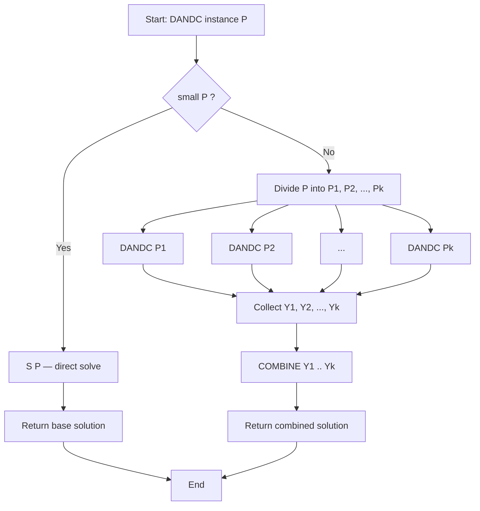
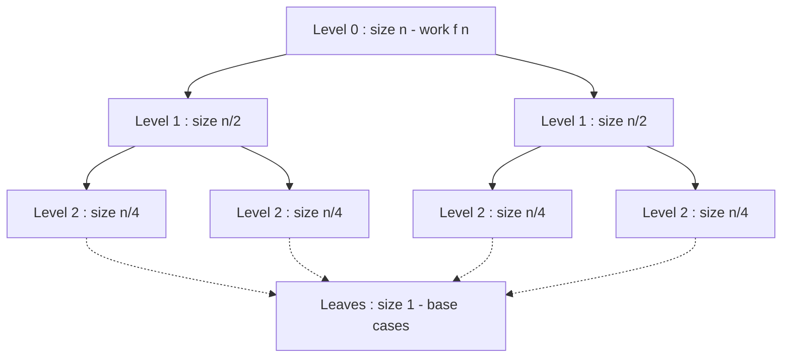
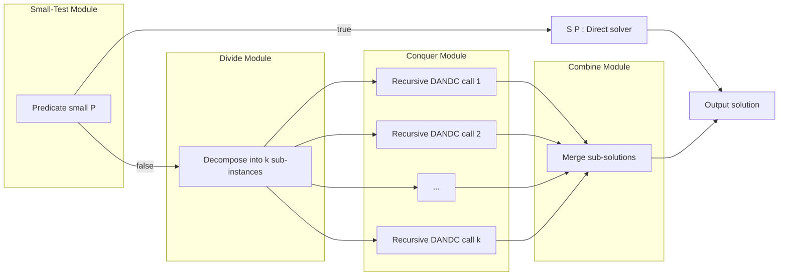

# Divide and Conquer Strategy – Control Abstraction

<!-- SECTION_1_START -->
# Divide and Conquer Strategy — Control Abstraction

> [!IMPORTANT]
> **KTU 2024 Scheme | Module 2 | PCCST502 — Design and Analysis of Algorithms**
> This note builds the **generic, language-independent skeleton** of every Divide and Conquer (D&C) algorithm. Once you internalize the *Control Abstraction*, Merge Sort, Quick Sort, Binary Search, Strassen's Multiplication, and Closest Pair all become instant pattern-matching exercises.

---

## 1.1 Formal Definition (KTU Syllabus Terminology)

**Divide and Conquer (D&C)** is an algorithmic design paradigm in which a problem instance of size $n$ is decomposed into **$a \ge 1$ smaller, independent sub-instances** of size approximately $n \div b$ (where $b > 1$), each of which is solved recursively. The solutions of the sub-problems are then **merged (combined)** to produce the solution of the original problem.

**Control Abstraction** is a *high-level, parameterized subroutine* that captures the recurring structural skeleton common to every D&C algorithm. It abstracts away algorithm-specific details and exposes only four logical phases:

1. **Test for small instance** (Base Case)
2. **Divide** the problem
3. **Conquer** via recursive calls
4. **Combine** the partial answers

Mathematically, the runtime of any D&C algorithm is captured by the **master recurrence**:

$$T(n) = \begin{cases} g(n) & \text{if } n \le n_0 \\ a \, T(n \div b) + D(n) + C(n) & \text{otherwise} \end{cases}$$

where:
- $a$ = number of sub-problems generated
- $n \div b$ = size of each sub-problem
- $D(n)$ = cost of *dividing* the problem
- $C(n)$ = cost of *combining* sub-solutions
- $g(n)$ = cost of solving a *small* instance directly
- $n_0$ = size threshold below which the recursion bottoms out

---

## 1.2 Intuitive Analogy — The "Office Hierarchy" View

Imagine a **CEO** who is given a 1000-page report. The CEO does *not* read it personally. Instead:

| Step | Real-World Action | D&C Phase |
| :--- | :--- | :--- |
| **1** | CEO checks: *"Is the report ≤ 1 page?"* If yes, sign it. | **Small test (Base Case)** |
| **2** | CEO splits the 1000-page stack into 4 stacks of 250 pages each. | **Divide** |
| **3** | Each of 4 VPs handles one stack and recursively delegates to Managers → Team Leads. | **Conquer (recursive DANDC)** |
| **4** | CEO merges the 4 signed summaries into the final report. | **Combine** |

> [!NOTE]
> **Key Intuition:** A D&C solution is a *recursion tree*. The root is the original problem, the leaves are the trivial base cases, and the internal nodes are "divide" / "combine" events. This is why the **Master Theorem** works — it analyzes the *shape* of that tree, not the specific algorithm.

---

## 1.3 Visualization of the Recursion Tree

> [!VISUALIZATION CONTROL]
> **Concept:** Generic Divide and Conquer Recursion Tree (for $a=2$, $b=2$)
> **GeoGebra / Desmos Input Equations (parametric):**
> * Tree height $h = \log_2 n$
> * Nodes at level $i$: $2^i$ sub-problems, each of size $n \div 2^i$
> * Total work at level $i$: $2^i \cdot f(n \div 2^i)$
> **Visual Description:** Imagine an inverted tree. The apex is the original problem of size $n$. Each node spawns $a$ children of size $n/b$. The horizontal width of a level represents the *amount of work done at that depth*. The total runtime is the **sum of the areas of all horizontal slices**.

```
                n                    ← Level 0 : cost D(n) + C(n) [= f(n)]
              /   \
           n/2     n/2               ← Level 1 : 2 sub-problems
          /  \    /  \
        n/4  n/4 n/4  n/4            ← Level 2 : 4 sub-problems
         .    .   .    .
         .    .   .    .             ← ...
         1    1   1    1             ← Leaves : n trivial base cases
```

---

## 1.4 Where the Control Abstraction is Used in Industry

| Domain | Real-World D&C Application |
| :--- | :--- |
| **Databases** | Query optimization (partitioned sorts, distributed joins) |
| **Graphics** | Quadtree/Octree rendering, ray-tracing, fractal generation |
| **Parallel Computing** | MapReduce, Fork-Join pools in Java `java.util.concurrent` |
| **Compilers** | Instruction scheduling, register allocation via graph partitioning |
| **ML / AI** | KD-Trees for nearest-neighbor search, decision-tree pruning |
| **Cryptography** | Karatsuba multiplication, FFT-based polynomial multiplication |

> [!TIP]
> **Exam Tip:** Whenever a KTU question says *"Express [Algorithm X] as a D&C control abstraction"*, your job is to identify the four parameters: the **base-case predicate**, the **division rule**, the **recursive call structure**, and the **combine operator**.
<!-- SECTION_1_END -->

<!-- SECTION_2_START -->
# Deep Theoretical Analysis & KTU High-Yield Formula Sheet

## 2.1 The Four Logical Phases of D&C

### Phase 1 — Small (Base Case) Test
A boolean predicate `small(P)` that returns `TRUE` when the problem instance $P$ is small enough to be solved by a brute-force or direct method. This is essential — **without it the recursion never terminates**.

- Typical triggers: $n \le 1$, $n \le n_0$, or problem structure degenerates (e.g., an array of size 1 is trivially sorted).
- Time cost: $g(n)$, usually $O(1)$ or $O(n)$.

### Phase 2 — Divide
Decompose $P$ into $a$ sub-instances $P_1, P_2, \dots, P_a$, each of size roughly $n \div b$. The split must be:
- **Non-overlapping** (sub-problems are independent — this is what distinguishes D&C from Dynamic Programming).
- **Exhaustive** (the union of sub-problems covers $P$).
- Cost: $D(n)$.

### Phase 3 — Conquer (Recursive Calls)
Invoke `DANDC` on each sub-problem. This is the *self-similar* part of the abstraction — the same procedure is reused. Cost: $a \cdot T(n \div b)$.

### Phase 4 — Combine
Merge the $a$ partial answers $Y_1, Y_2, \dots, Y_a$ into the final solution of $P$. Cost: $C(n)$.

> [!IMPORTANT]
> **Why D&C vs DP?** If sub-problems **overlap** (same sub-problem is solved multiple times), switch to **Dynamic Programming with memoization**. D&C requires **independent** sub-problems.

---

## 2.2 Control Abstraction — Generic Pseudocode

```text
Algorithm: DANDC(P)
Input : A problem instance P of size n
Output: Solution of P

1.  if small(P) then
2.      return S(P)                          // base case — direct solve
3.  else
4.      divide P into smaller sub-instances P1, P2, ..., Pk
5.      for i ← 1 to k do
6.          Yi ← DANDC(Pi)                    // conquer via recursion
7.      end for
8.      return COMBINE(Y1, Y2, ..., Yk)        // merge sub-solutions
9.  end if
```

Here `S(P)` is the trivial solver, `COMBINE` is the merge operator, and `k` is the branching factor (often denoted $a$).

---

## 2.3 The Generic Recurrence and Its Components

$$
T(n) = \begin{cases} g(n), & n \le n_0 \\[4pt] a \, T(n \div b) + D(n) + C(n), & n > n_0 \end{cases}
$$

For asymptotic analysis, we collapse $D(n) + C(n)$ into a single function $f(n)$, giving the **canonical Master Recurrence**:

$$T(n) = a \, T\!\left(\frac{n}{b}\right) + f(n)$$

### KTU Formula Sheet — Master Recurrence Components

| Symbol | Meaning | Typical Range | Notes |
| :--- | :--- | :--- | :--- |
| $a$ | Number of sub-problems | $\ge 1$ (integer) | Branching factor of recursion tree |
| $b$ | Factor by which size shrinks | $> 1$ | Each sub-problem is $1/b$ of the parent |
| $n \div b$ | Size of each sub-problem | integer (use $\lfloor n/b \rfloor$ or $\lceil n/b \rceil$) | Some texts write $n \cdot b^{-1}$ |
| $f(n)$ | Cost of divide + combine (non-recursive work) | $O(n^d)$ in Master Theorem | $D(n) + C(n)$ |
| $g(n)$ | Cost of base case | $O(1)$ most often | Direct solve |
| $n_0$ | Threshold for base case | $\ge 1$ | Often $1$ or $2$ |
| $T(n)$ | Total runtime | to be derived | Closed form via Master Theorem or recursion tree |

### KTU Formula Sheet — Mapping Classic Algorithms to the Recurrence

| Algorithm | $a$ | $b$ | $f(n)$ | Branching |
| :--- | :---: | :---: | :---: | :---: |
| **Binary Search** | $1$ | $2$ | $O(1)$ | Discard one half, recurse on other |
| **Merge Sort** | $2$ | $2$ | $O(n)$ | Split array, merge two sorted halves |
| **Quick Sort** (avg) | $2$ | $2$ | $O(n)$ | Partition around pivot |
| **Quick Sort** (worst) | $1$ | $1$ | $O(n)$ | Degenerate — already sorted pivot choice |
| **Strassen's Matrix Mult** | $7$ | $2$ | $O(n^2)$ | 7 sub-products of $n/2 \times n/2$ matrices |
| **Karatsuba** | $3$ | $2$ | $O(n)$ | Polynomial multiplication |
| **Closest Pair (Plane)** | $2$ | $2$ | $O(n)$ | Geometric split + strip merge |
| **Tower of Hanoi** | $1$ | $1$ | $O(1)$ | Move $n-1$, move 1, move $n-1$ |

> [!NOTE]
> **Recursion Tree Depth:** For a D&C algorithm with branching factor $a$ and size-shrinking factor $b$, the height of the recursion tree is:

$$h = \log_b n \quad \text{levels (excluding the root)}$$

> **Number of leaves:** $a^h = a^{\log_b n} = n^{\log_b a}$
> **Total work at level $i$:** $a^i \cdot f(n / b^i)$

---

## 2.4 Control Abstraction — Why It Matters

1. **Algorithm-Design Reuse:** Once you write the control abstraction, deriving new D&C algorithms becomes a matter of *plugging in* the right divide, base-case, and combine operators.
2. **Complexity Decoupling:** The recurrence separates *algorithmic logic* from *asymptotic cost*. The Master Theorem then takes over to produce a closed form.
3. **Correctness by Structural Induction:** Proving the correctness of *any* D&C algorithm reduces to:
   - **Base case** correctness (small instances).
   - **Inductive step** correctness (combine preserves invariant).
4. **Parallelism:** Because sub-problems are independent, each recursive call can be scheduled on a separate processor — the control abstraction is the natural unit of parallel decomposition (Fork/Join framework in Java, `concurrent.futures` in Python).

---

## 2.5 KTU-Approved Assumptions and Boundary Conditions

- **$b > 1$**: Strictly greater; otherwise the recursion does not make progress.
- **$a \ge 1$**: At least one sub-problem must remain.
- **$f(n) = \Theta(n^d)$ for some $d \ge 0$**: Required to apply the Master Theorem cleanly.
- **Size non-integrity**: When $n$ is not divisible by $b$, use $\lfloor n/b \rfloor$ or $\lceil n/b \rceil$. For asymptotic analysis the difference is absorbed into the recurrence.
- **Stability of $a$ and $b$**: Standard control abstraction assumes *uniform* splitting. Non-uniform splits lead to the **Akra–Bazzi** generalization (beyond KTU scope but mentioned for context).
<!-- SECTION_2_END -->

<!-- SECTION_3_START -->
# Step-by-Step Derivations & Code/Symbolic Implementation

## 3.1 Derivation of the Generic Recurrence

We start with the time taken by `DANDC` on a problem of size $n$:

- **Step 1** — If $n \le n_0$, the cost is just the direct-solve cost:

$$T(n) = g(n)$$

- **Step 2** — Otherwise, we incur the *divide* cost $D(n)$, then make $a$ recursive calls on size $n/b$ (each costing $T(n/b)$), and finally incur the *combine* cost $C(n)$:

$$T(n) = D(n) + a \cdot T(n/b) + C(n)$$

- **Step 3** — Combine the non-recursive terms into $f(n) = D(n) + C(n)$:

$$\boxed{T(n) = a \cdot T\!\left(\frac{n}{b}\right) + f(n)}$$

---

## 3.2 Worked Derivation 1 — Binary Search Recurrence

Binary Search divides a sorted array of size $n$ in half and recurses on *one* half.

| Phase | What happens | Cost |
| :--- | :--- | :--- |
| Small | Array of size $\le 1$ | $O(1)$ |
| Divide | Compare with middle element | $O(1)$ |
| Conquer | Recurse on one half (size $n/2$) | $T(n/2)$ |
| Combine | Nothing — answer is the comparison result | $O(1)$ |

Therefore:

$$T(n) = T(n/2) + O(1)$$

Identifying parameters: $a = 1$, $b = 2$, $f(n) = O(1)$. Solving by expansion:

$$\begin{aligned}
T(n) &= T(n/2) + c \\
     &= T(n/4) + c + c \\
     &= T(n/8) + 3c \\
     &\;\;\vdots \\
     &= T(n/2^k) + k \cdot c
\end{aligned}$$

When $n/2^k = 1$, we have $k = \log_2 n$, so:

$$T(n) = T(1) + c \cdot \log_2 n = \Theta(\log n)$$

---

## 3.3 Worked Derivation 2 — Merge Sort Recurrence

Merge Sort splits the array into two halves, sorts each, and merges them.

| Phase | What happens | Cost |
| :--- | :--- | :--- |
| Small | Array of size $\le 1$ | $O(1)$ |
| Divide | Compute midpoint — no copy needed | $O(1)$ |
| Conquer | Recurse on left half and right half | $2 \, T(n/2)$ |
| Combine | Merge two sorted halves | $O(n)$ |

Therefore:

$$T(n) = 2 \, T(n/2) + O(n)$$

Identifying parameters: $a = 2$, $b = 2$, $f(n) = O(n)$. Solving by recursion-tree summation:

- **Level $i$ has $2^i$ sub-problems**, each of size $n/2^i$, with cost $O(n/2^i)$ per node.
- **Total work at level $i$** = $2^i \cdot O(n/2^i) = O(n)$.
- **Number of levels** = $\log_2 n + 1$.

Summing across all levels:

$$T(n) = (\log_2 n + 1) \cdot O(n) = O(n \log n)$$

---

## 3.4 Worked Derivation 3 — Strassen's Matrix Multiplication

Strassen multiplies two $n \times n$ matrices using 7 (not 8) recursive multiplications of $n/2 \times n/2$ sub-matrices. The divide and combine are pure $O(n^2)$ arithmetic on the quadrants.

| Phase | Cost |
| :--- | :--- |
| Small ($n = 1$) | $O(1)$ |
| Divide (split into 4 quadrants) | $O(1)$ |
| Conquer (7 recursive multiplications) | $7 \, T(n/2)$ |
| Combine (add/subtract 18 quadrant matrices) | $O(n^2)$ |

Recurrence:

$$T(n) = 7 \, T(n/2) + O(n^2)$$

Asymptotic solution (via Master Theorem with $a=7$, $b=2$, $d=2$):

$$T(n) = \Theta(n^{\log_2 7}) \approx \Theta(n^{2.807})$$

> [!IMPORTANT]
> **Note:** Compare with the naive recurrence $T(n) = 8 \, T(n/2) + O(n^2) = O(n^3)$. Reducing $a$ from $8$ to $7$ is what gives Strassen its asymptotic edge.

---

## 3.5 Python Implementation of the Generic Control Abstraction

The following is a fully operational Python 3 implementation of `DANDC` as a generic framework. Every algorithm-specific component is injected through function arguments.

```python
from __future__ import annotations
from typing import Callable, TypeVar, List, Any
import logging

# Configure a logger so the abstraction prints every step (useful for viva demos)
logging.basicConfig(
    level=logging.INFO,
    format="[DANDC] %(message)s"
)
logger = logging.getLogger("DANDC")

P = TypeVar("P")   # Problem type
R = TypeVar("R")   # Result type


def DANDC(
    problem: P,
    small: Callable[[P], bool],
    solve: Callable[[P], R],
    divide: Callable[[P], List[P]],
    combine: Callable[[List[R]], R],
    depth: int = 0
) -> R:
    """
    Generic Divide and Conquer Control Abstraction.

    Parameters
    ----------
    problem : P
        The current problem instance.
    small : Callable[[P], bool]
        Base-case predicate. Returns True when the instance is small enough
        to be solved directly.
    solve : Callable[[P], R]
        Direct (brute-force) solver for small instances.
    divide : Callable[[P], List[P]]
        Splits a large instance into a list of smaller sub-instances.
    combine : Callable[[List[R]], R]
        Merges the sub-solution results into the final result.
    depth : int
        Current recursion depth (used purely for indented logging).

    Returns
    -------
    R
        The solution to `problem`.
    """
    indent = "  " * depth
    logger.info("%sEnter DANDC on instance of type %s", indent, type(problem).__name__)

    # ---- Phase 1 : Small (Base Case) Test ----
    if small(problem):
        logger.info("%sBase case reached. Solving directly.", indent)
        result = solve(problem)
        logger.info("%sBase case result: %s", indent, result)
        return result

    # ---- Phase 2 : Divide ----
    logger.info("%sDividing problem...", indent)
    try:
        sub_problems: List[P] = divide(problem)
    except Exception as exc:
        logger.error("%sDivide failed: %s", indent, exc)
        raise

    if len(sub_problems) == 0:
        raise ValueError("divide() returned an empty list — infinite recursion risk.")

    # ---- Phase 3 : Conquer (Recursive DANDC) ----
    sub_results: List[R] = []
    for idx, sub in enumerate(sub_problems, start=1):
        logger.info("%sRecursing on sub-problem %d/%d", indent, idx, len(sub_problems))
        sub_results.append(
            DANDC(sub, small, solve, divide, combine, depth + 1)
        )

    # ---- Phase 4 : Combine ----
    logger.info("%sCombining %d sub-results...", indent, len(sub_results))
    try:
        final = combine(sub_results)
    except Exception as exc:
        logger.error("%sCombine failed: %s", indent, exc)
        raise

    logger.info("%sReturning combined result: %s", indent, final)
    return final
```

### 3.5.1 Example: Plugging Merge Sort into the Abstraction

```python
from typing import List


def merge_sort(arr: List[int]) -> List[int]:
    """Driver function for Merge Sort using the DANDC abstraction."""

    def small(p: List[int]) -> bool:
        # An array of size <= 1 is trivially sorted.
        return len(p) <= 1

    def solve(p: List[int]) -> List[int]:
        return list(p)   # identity for a singleton

    def divide(p: List[int]) -> List[List[int]]:
        mid = len(p) // 2
        return [p[:mid], p[mid:]]

    def combine(parts: List[List[int]]) -> List[int]:
        left, right = parts
        merged: List[int] = []
        i = j = 0
        while i < len(left) and j < len(right):
            if left[i] <= right[j]:
                merged.append(left[i]); i += 1
            else:
                merged.append(right[j]); j += 1
        merged.extend(left[i:])
        merged.extend(right[j:])
        return merged

    return DANDC(arr, small, solve, divide, combine)


# ------------------ demo ------------------
if __name__ == "__main__":
    data = [38, 27, 43, 3, 9, 82, 10]
    print("Sorted:", merge_sort(data))
```

**Expected output (truncated):**

```text
[DANDC] Enter DANDC on instance of type list
[DANDC] Dividing problem...
[DANDC] Recursing on sub-problem 1/2
  [DANDC] Enter DANDC on instance of type list
  ...
  [DANDC] Base case reached. Solving directly.
[DANDC] Combining 2 sub-results...
[DANDC] Returning combined result: [3, 9, 10, 27, 38, 43, 82]
Sorted: [3, 9, 10, 27, 38, 43, 82]
```

### 3.5.2 Example: Plugging Binary Search into the Abstraction

```python
def binary_search(arr: List[int], target: int) -> int:
    """Returns the index of `target` in sorted `arr`, or -1 if not found."""

    # We carry `target` along with the sub-array via a small closure trick.
    def small(state: tuple) -> bool:
        lo, hi = state
        return lo >= hi

    def solve(state: tuple) -> int:
        return -1   # empty range — target absent

    def divide(state: tuple) -> List[tuple]:
        lo, hi = state
        mid = (lo + hi) // 2
        if arr[mid] == target:
            return [(mid, mid + 1)]      # fake sub-problem that yields the answer
        if target < arr[mid]:
            return [(lo, mid)]
        return [(mid + 1, hi)]

    def combine(results: List[int]) -> int:
        return results[0]

    return DANDC((0, len(arr)), small, solve, divide, combine)
```

> [!TIP]
> The control abstraction cleanly handles both **equal-sized splits** (Merge Sort, $b=2$) and **unequal splits** (Binary Search discards one half entirely, so effectively $a=1$ on size $n/2$).

---

## 3.6 Deriving Recurrences from Scratch — A 4-Step Recipe

This is the *algorithm* a KTU examiner expects you to *verbally* walk through in a 14-mark question.

1. **State the base case.** Write $T(n) = c$ for $n \le n_0$ (or $n = 1$). **[1 Mark]**
2. **Identify the number of recursive calls.** Count how many times `DANDC` invokes itself per execution — call this $a$. **[1 Mark]**
3. **Determine the sub-problem size.** Compute the size of the argument passed to each recursive call as a function of $n$ — call it $n/b$. **[1 Mark]**
4. **Cost the non-recursive work.** Add up the cost of *divide* ($D(n)$) and *combine* ($C(n)$) — call this $f(n)$. **[1 Mark]**
5. **Assemble the recurrence.** $T(n) = a \, T(n/b) + f(n)$ for $n > n_0$. **[1 Mark]**
6. **Solve it.** Use Master Theorem, recursion tree, or substitution. **[Remaining Marks]**

> [!NOTE]
> **Master Theorem (KTU Reference):** If $f(n) = \Theta(n^d)$ and $a > 0$, $b > 1$:
> - If $a < b^d$, then $T(n) = \Theta(n^d)$.
> - If $a = b^d$, then $T(n) = \Theta(n^d \log n)$.
> - If $a > b^d$, then $T(n) = \Theta(n^{\log_b a})$.
<!-- SECTION_3_END -->

<!-- SECTION_4_START -->
# Structural Diagrams & Schematics

## 4.1 Control Flow of the DANDC Abstraction



> Node IDs are alphanumeric (e.g., `A`, `B`, `F1`) to comply with Mermaid's parser rules. All node labels are plain uppercase alphanumeric text wrapped in double quotes — no markdown bold, no special characters.

---

## 4.2 Generic Recursion Tree (a = 2, b = 2)



**Reading the tree:**

- Each level $i$ contains $a^i = 2^i$ nodes.
- Each node at level $i$ represents a sub-problem of size $n / b^i = n / 2^i$.
- The total work at level $i$ is $a^i \cdot f(n / b^i) = 2^i \cdot f(n / 2^i)$.
- For $f(n) = \Theta(n)$, every level does $\Theta(n)$ work; with $\log_2 n$ levels, total is $\Theta(n \log n)$.

---

## 4.3 Block-Level Functional Architecture — Mapping Algorithms to the Abstraction



**Subgraph roles:**

- **SA** decides whether to bottom out.
- **DV** performs the size reduction.
- **CQ** is the only recursive block — it is **self-similar** (it may dispatch back to SA / DV / CQ for each sub-call).
- **CB** aggregates results from the leaves back up the tree.

---

## 4.4 Sequential Processing Topology — D&C Stages Mapped to Algorithms

| Stage | Binary Search | Merge Sort | Quick Sort | Strassen |
| :--- | :--- | :--- | :--- | :--- |
| **Base case test** `small(P)` | `lo $\ge$ hi` | `len $\le$ 1` | `len $\le$ 1` | `n = 1` |
| **Divide operator** | Compare with `mid` | `mid = len // 2` | Partition around pivot | Split 4 quadrants |
| **Number of sub-calls $a$** | $1$ | $2$ | $2$ | $7$ |
| **Sub-problem size $n/b$** | $n/2$ | $n/2$ | $n/2$ (avg) | $n/2$ |
| **Combine operator** | None (answer is the index) | Merge two sorted halves | None (in-place) | Add/subtract 18 quadrant matrices |
| **Divide cost $D(n)$** | $O(1)$ | $O(1)$ | $O(n)$ | $O(1)$ |
| **Combine cost $C(n)$** | $O(1)$ | $O(n)$ | $O(1)$ | $O(n^2)$ |
| **Recurrence** | $T(n) = T(n/2) + 1$ | $T(n) = 2T(n/2) + n$ | $T(n) = 2T(n/2) + n$ (avg) | $T(n) = 7T(n/2) + n^2$ |
| **Asymptotic $T(n)$** | $\Theta(\log n)$ | $\Theta(n \log n)$ | $\Theta(n \log n)$ (avg) | $\Theta(n^{2.807})$ |

> [!IMPORTANT]
> This table is the **single most exam-relevant artifact** in this note. KTU 14-mark questions frequently ask: *"For a given algorithm, identify the control-abstraction parameters and derive the recurrence."* — and the answer is exactly this row.
<!-- SECTION_4_END -->

<!-- SECTION_5_START -->
# KTU 2024 Scheme Examination Question Bank & Topic Recap

---

## Part A — Short Answer Questions (3 Marks Each)

### Q1. **[KTU University Exam — July 2023]**
**Define the Divide and Conquer Control Abstraction. List its four phases.**
**Cognitive Level:** Remember | **CO Mapping:** CO1

**Model Answer:**

> The Divide and Conquer (D&C) Control Abstraction is a generic, parameterized algorithm that captures the common structural skeleton of every D&C algorithm.
>
> Its **four phases** are:
> 1. **Small (Base Case) Test** — Determine whether the problem instance is trivially solvable.
> 2. **Divide** — Decompose the instance into smaller, independent sub-instances.
> 3. **Conquer** — Recursively apply the D&C procedure on each sub-instance.
> 4. **Combine** — Merge the sub-solutions to form the final answer.
>
> The runtime is captured by the recurrence $T(n) = a \, T(n/b) + f(n)$ where $a$ is the number of sub-problems, $n/b$ is the sub-problem size, and $f(n)$ is the non-recursive work.

**[Valuation Key: Definition 1 Mark + Enumeration of four phases 1 Mark + Recurrence statement 1 Mark]**

---

### Q2. **[KTU University Exam — Dec 2022]**
**Differentiate between Divide and Conquer (D&C) and Dynamic Programming (DP) with respect to sub-problem independence and overlap.**
**Cognitive Level:** Understand | **CO Mapping:** CO1

**Model Answer:**

| Aspect | Divide and Conquer | Dynamic Programming |
| :--- | :--- | :--- |
| **Sub-problem overlap** | Sub-problems are **disjoint** / non-overlapping. | Sub-problems **overlap** — same sub-problem is solved many times. |
| **Recursion structure** | Each sub-problem is solved **once and freshly**. | Solutions are **memoized** (stored) to avoid re-computation. |
| **Direction** | Typically **top-down** (recursive). | Can be **top-down with memoization** or **bottom-up tabulation**. |
| **Efficiency strategy** | Recursion tree expansion. | Optimal substructure + overlapping sub-problems. |
| **Example** | Merge Sort, Quick Sort, Binary Search. | Fibonacci numbers, Matrix Chain Multiplication, LCS. |

**[Valuation Key: Distinction on overlap 1 Mark + Example of each 1 Mark + Tabular contrast 1 Mark]**

---

## Part B — Long Answer Questions (14 Marks, with Internal Choice)

### Question A (14 Marks)
**[KTU University Exam — July 2024]**

**(a)** *Explain the generic control abstraction for Divide and Conquer with a clear pseudocode. Identify each of its components. **[7 Marks]***

**(b)** *For the Merge Sort algorithm, identify the parameters $a$, $b$, and $f(n)$ of the control abstraction, and derive the recurrence relation $T(n)$. Solve the recurrence using the recursion-tree method to obtain the asymptotic time complexity. **[7 Marks]***

**Cognitive Levels:** (a) Understand, (b) Apply | **CO Mapping:** CO1, CO2

---

#### Model Solution — (a) [7 Marks]

**Generic Control Abstraction Pseudocode:** **[3 Marks]**

```text
Algorithm DANDC(P)
1.  if small(P) then
2.      return S(P)
3.  else
4.      divide P into sub-instances P1, P2, ..., Pk
5.      for i ← 1 to k do
6.          Yi ← DANDC(Pi)
7.      return COMBINE(Y1, Y2, ..., Yk)
```

**Component Identification:** **[4 Marks]**

| Component | Role | Example (Merge Sort) |
| :--- | :--- | :--- |
| `small(P)` | Base-case predicate | `len(P) ≤ 1` |
| `S(P)` | Direct solver for small instances | Return the array unchanged |
| `Divide` | Partitioning function | `P_left, P_right = P[:mid], P[mid:]` |
| `a` (or $k$) | Number of recursive sub-calls | $a = 2$ |
| `b` | Sub-problem shrink factor | $b = 2$ |
| `COMBINE` | Merge operator | Merge two sorted halves in $O(n)$ |
| `f(n)` | Non-recursive work $D(n) + C(n)$ | $O(1) + O(n) = O(n)$ |

---

#### Model Solution — (b) [7 Marks]

**Step 1 — Identify parameters:** **[2 Marks]**
- Number of recursive calls per level: $a = 2$ (left half and right half).
- Sub-problem size: each call receives an array of size $n/2$, so $b = 2$.
- Non-recursive work: dividing takes $O(1)$, merging takes $O(n)$, hence $f(n) = O(n)$.

**[Stating $a=2$, $b=2$, $f(n)=O(n)$: 2 Marks]**

**Step 2 — Assemble the recurrence:** **[1 Mark]**

$$T(n) = 2 \, T(n/2) + O(n), \quad T(1) = O(1)$$

**Step 3 — Solve using recursion-tree method:** **[4 Marks]**

| Level $i$ | Number of sub-problems | Size of each | Work per node | Total work at level |
| :---: | :---: | :---: | :---: | :---: |
| 0 | $1$ | $n$ | $c \, n$ | $c \, n$ |
| 1 | $2$ | $n/2$ | $c \, n/2$ | $2 \cdot c \, n/2 = c \, n$ |
| 2 | $4$ | $n/4$ | $c \, n/4$ | $4 \cdot c \, n/4 = c \, n$ |
| $\vdots$ | $\vdots$ | $\vdots$ | $\vdots$ | $\vdots$ |
| $h$ | $n$ | $1$ | $c$ | $n \cdot c$ |

The recursion stops when $n / 2^h = 1$, i.e., $h = \log_2 n$. Total levels = $h + 1 = \log_2 n + 1$.

**Sum the work across all levels:**

$$T(n) = (\log_2 n + 1) \cdot c \, n = \Theta(n \log n)$$

**[Drawing recursion tree with 3 levels and per-level work: 2 Marks; Summation and final $\Theta(n \log n)$: 2 Marks]**

---

### Question B (14 Marks) — *Alternative Choice*
**[KTU University Exam — Dec 2023]**

**(a)** *State the generic recurrence relation for a Divide and Conquer algorithm and explain each term. Apply the Master Theorem to derive the asymptotic complexity of $T(n) = 2T(n/2) + n$ and $T(n) = 7T(n/2) + n^2$. **[7 Marks]***

**(b)** *For the Binary Search algorithm on a sorted array of size $n$, write the four phases of the control abstraction, identify the recurrence $T(n)$, and solve it to obtain $\Theta(\log n)$. Show every step of the substitution method. **[7 Marks]***

**Cognitive Levels:** (a) Apply, (b) Analyze | **CO Mapping:** CO1, CO2

---

#### Model Solution — (a) [7 Marks]

**Generic Recurrence:** **[2 Marks]**

$$T(n) = a \, T(n/b) + f(n)$$

| Term | Meaning |
| :--- | :--- |
| $a$ | Number of sub-problems created per recursion |
| $n/b$ | Size of each sub-problem |
| $f(n)$ | Cost of dividing the problem and combining sub-solutions |

**[Stating recurrence and each term: 2 Marks]**

**Master Theorem application to $T(n) = 2T(n/2) + n$:** **[2 Marks]**

- Here $a = 2$, $b = 2$, $f(n) = n = \Theta(n^1)$, so $d = 1$.
- Critical exponent: $\log_b a = \log_2 2 = 1$.
- Since $a = b^d$ (i.e., $2 = 2^1$), we are in **Case 2** of the Master Theorem.

$$T(n) = \Theta(n^d \log n) = \Theta(n \log n)$$

**Master Theorem application to $T(n) = 7T(n/2) + n^2$:** **[2 Marks]**

- Here $a = 7$, $b = 2$, $f(n) = n^2 = \Theta(n^2)$, so $d = 2$.
- Critical exponent: $\log_b a = \log_2 7 \approx 2.807$.
- Since $a < b^d$ (i.e., $7 < 2^2 \cdot 2^{0.807}$ equivalent to $\log_2 7 > 2$), we are in **Case 1** of the Master Theorem.

$$T(n) = \Theta(n^d) = \Theta(n^2)$$

> [!WARNING]
> **Common Exam Mistake (1-Mark Loss):** Students often confuse **Case 1 vs Case 3** by computing $a$ vs $b^d$ numerically *as integers* without taking logs. Always compare $a$ with $b^d$, or equivalently $\log_b a$ with $d$. Both are correct but pick one and stick to it consistently.

---

#### Model Solution — (b) [7 Marks]

**Four Phases for Binary Search:** **[3 Marks]**

1. **Small test:** `small(P)` is TRUE if `lo $\ge$ hi` (empty range).
2. **Divide:** Compare `arr[mid]` with `target`. The comparison decides which half to recurse into.
3. **Conquer:** Recurse on a sub-array of size $\lfloor n/2 \rfloor$ (only **one** recursive call).
4. **Combine:** No merge step — the answer is whatever the matching call returns.

**[Stating base case, divide step, conquer (one sub-call), combine: 3 Marks]**

**Recurrence:** **[1 Mark]**

$$T(n) = T(n/2) + O(1), \quad T(1) = O(1)$$

**Substitution Method — Full Expansion:** **[3 Marks]**

$$\begin{aligned}
T(n) &= T(n/2) + c \\
     &= T(n/4) + c + c \\
     &= T(n/8) + 3c \\
     &= T(n/2^2) + 2c \\
     &\;\;\vdots \\
     &= T(n/2^k) + k \cdot c
\end{aligned}$$

The recursion bottoms out when $n/2^k = 1$, i.e., $2^k = n$, hence $k = \log_2 n$.

Substituting $k = \log_2 n$ and $T(1) = c'$:

$$T(n) = c' + c \cdot \log_2 n = \Theta(\log n)$$

**[Showing $k = \log_2 n$ substitution: 1 Mark; Final $\Theta(\log n)$: 1 Mark; Correctness of substitution: 1 Mark]**

---

## KTU Examiner's Valuation Warning / Pitfall Callout

> [!WARNING]
> **Top 5 ways students LOSE marks on D&C control-abstraction questions:**
>
> 1. **Forgetting the base case.** The recurrence is incomplete without $T(n) = g(n)$ for $n \le n_0$. Examiners explicitly allocate **1 mark** for this.
> 2. **Confusing $a$ and $b$.** $a$ is the **count** of sub-problems; $b$ is the **shrink factor**. Quick sort on average has $a = 2$ and $b = 2$ — students often write $a = 1$ because "we pick one pivot and recurse on the rest", forgetting that the recursion is on **both** sides.
> 3. **Omitting the combine cost.** $f(n) = D(n) + C(n)$. Writing only the divide cost (e.g., $O(1)$ for Merge Sort) and forgetting the $O(n)$ merge is a common 1-mark deduction.
> 4. **Wrong Master Theorem case.** The condition is $a$ vs $b^d$, *not* $a$ vs $b$. Always compute $\log_b a$ or $b^d$ explicitly.
> 5. **No "small instance" predicate in pseudocode.** Writing `DANDC` without an explicit base case is structurally wrong and loses 1–2 marks.

---

## Topic Recap & Important Things to Remember

- **D&C Paradigm** = recursive decomposition into independent sub-problems + combine. Generic recurrence is $T(n) = a \, T(n/b) + f(n)$.
- **Control Abstraction** = parameterised subroutine with four logical phases: **Small test, Divide, Conquer (recursive), Combine**.
- **Branching factor $a$** = number of sub-calls. **Shrink factor $b$** = size ratio (parent/child).
- **Non-recursive work $f(n) = D(n) + C(n)$** is the only "visible" work in the recurrence.
- **Base case threshold $n_0$** must be stated; commonly $n_0 = 1$ or $n_0 = 2$.
- **Recursion-tree depth** is $\log_b n$ levels; total work at level $i$ is $a^i \cdot f(n/b^i)$.
- **Master Theorem** applies only when $f(n) = \Theta(n^d)$ — three cases based on $a$ vs $b^d$ (or $\log_b a$ vs $d$):
  - $a < b^d \Rightarrow T(n) = \Theta(n^d)$
  - $a = b^d \Rightarrow T(n) = \Theta(n^d \log n)$
  - $a > b^d \Rightarrow T(n) = \Theta(n^{\log_b a})$
- **Mapping to classic algorithms** (must memorize):
  - Binary Search: $a=1, b=2, f(n)=O(1) \Rightarrow \Theta(\log n)$.
  - Merge Sort: $a=2, b=2, f(n)=O(n) \Rightarrow \Theta(n \log n)$.
  - Strassen: $a=7, b=2, f(n)=O(n^2) \Rightarrow \Theta(n^{2.807})$.
  - Karatsuba: $a=3, b=2, f(n)=O(n) \Rightarrow \Theta(n^{1.585})$.
- **D&C vs DP** = D&C requires **independent** (non-overlapping) sub-problems; DP exploits **overlapping** sub-problems via memoization.
- **Industry relevance** = Fork/Join parallelism, MapReduce, quadtree rendering, KD-tree nearest-neighbor, distributed sorts.
- **In pseudocode**, always show the **base case first**, then divide, then conquer-loop, then combine — examiners grade on this exact order.
- **For viva**: be ready to (i) draw the recursion tree, (ii) sum the work level by level, (iii) state the Master Theorem case, and (iv) map any new D&C algorithm to $(a, b, f(n))$ in under 60 seconds.
<!-- SECTION_5_END -->
