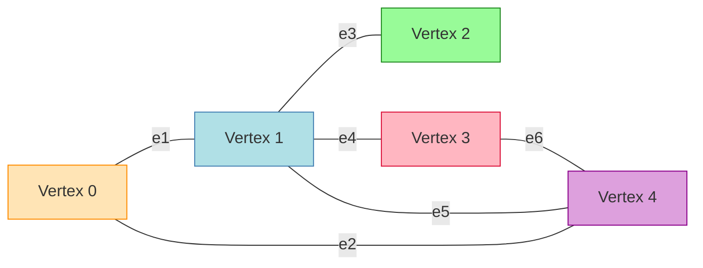
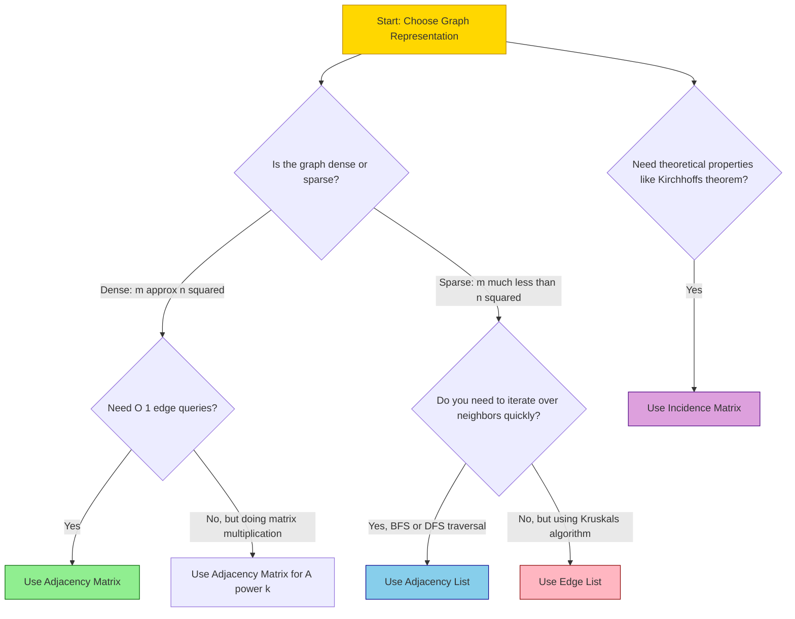
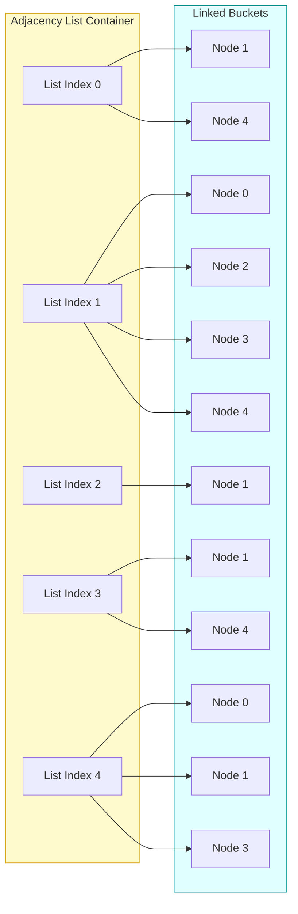
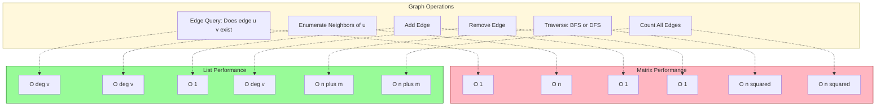

# Graphs – Representations

<!-- SECTION_1_START -->
# Graphs – Representations

## 1.1 Formal KTU 2024 Definition

A **graph** $G$ is a non-linear, finite data structure that mathematically models a set of **objects (vertices/nodes)** and the **pairwise relationships (edges)** connecting them. Formally, it is defined as an ordered pair:

$$G = (V, E)$$

where:
* $V = \{v_1, v_2, v_3, \dots, v_n\}$ is a **finite, non-empty set of vertices** (also called nodes or points).
* $E \subseteq \{(u, v) \mid u, v \in V\}$ is a **set of edges** (also called links or arcs).

For KTU Board Examinations, you are expected to precisely differentiate between the following graph taxonomies:

| Graph Type | Definition | KTU Tag |
| :--- | :--- | :--- |
| **Undirected Graph** | Edges have no orientation; $(u, v) \equiv (v, u)$. | Standard social network. |
| **Directed Graph (Digraph)** | Edges are ordered pairs $(u, v)$ from $u \to v$. | Web page hyperlink graph. |
| **Weighted Graph** | Each edge carries a numerical cost/distance/weight $w(u, v)$. | Road map with distances. |
| **Simple Graph** | No self-loops, no parallel edges. | Most textbook problems. |
| **Complete Graph ($K_n$)** | Every pair of distinct vertices is connected. | $n$ nodes, $\frac{n(n-1)}{2}$ edges. |
| **Bipartite Graph** | Vertices partitionable into two sets; edges cross the partition. | Job assignment networks. |
| **Cyclic / Acyclic** | Contains a cycle / contains no cycle (Tree is a connected acyclic graph). | DFS cycle detection. |

> [!IMPORTANT]
> **KTU 2024 Syllabus Mandate (PCCST502):** The notation $|V| = n$ (number of vertices) and $|E| = m$ (number of edges) is the **official convention**. You will lose marks if you use $V$ and $E$ ambiguously in board answer sheets without defining $n$ and $m$.

> [!NOTE]
> **Graph Cardinality Invariant (Mandatory Board Statement):**
> In a simple undirected graph, the edge count is bounded by the fundamental inequality:
> $$0 \le m \le \binom{n}{2} = \frac{n(n-1)}{2}$$
> For a directed graph, the upper bound doubles to $n(n-1)$ due to ordered pair orientation.

---

## 1.2 Real-World Engineering Analogy (The Intuitive Hook)

Imagine you are standing at **Kerala's Kochi Metro Map**:

* **Vertices ($V$)** are the **metro stations** (Aluva, Edappally, MG Road, Vyttila).
* **Edges ($E$)** are the **railway tracks** physically connecting two stations.
* **Weights** could represent the **distance in kilometers** or the **travel time in minutes** between two stations.
* A **directed graph** analogy would be a **one-way street** in Ernakulam's city center — you can travel from point A to B, but not back via the same road.

When a software engineer at Google Maps must compute "the shortest path from your home to the college", internally they:
1. Build a **graph representation** of the city.
2. Run Dijkstra's / BFS algorithm on that representation.
3. Output the route to your mobile app.

The **choice of representation** (matrix vs. list) is, therefore, the **most critical engineering decision** — it determines whether the system runs in milliseconds or in hours.

---

## 1.3 Visualization Callouts

> [!VISUALIZATION CONTROL]
> **Concept:** Plotting a graph's adjacency matrix as a binary heat-map to visually identify edge density and connected components.
> **GeoGebra / Desmos Input Commands (Matrix Grid Mode):**
>
> * `Matrix = {{0,1,1,0},{1,0,1,1},{1,1,0,0},{0,1,0,0}}`
> * `Row 1 = (0,1) ; (0,2) ; Row 2 = (1,0) ; (1,3)`
> **Visual Description:** A $4 \times 4$ unit grid appears. Cells with value `1` should be shaded **black** (representing an edge) and cells with value `0` should be shaded **white**. Notice that the diagonal is entirely white (no self-loops in a simple graph), and the matrix is **symmetric** across the main diagonal — this is the structural fingerprint of an **undirected** graph.

> [!VISUALIZATION CONTROL]
> **Concept:** Bipartite Graph Verification via BFS 2-Coloring.
> **GeoGebra / Desmos Input Commands:**
>
> * `Color(x) = if(even(distance from source), "Red", "Blue")`
> **Visual Description:** Plot two disjoint sets of vertices on the canvas. Color one set **red** and the other **blue**. If every edge connects a red node to a blue node, the graph is **bipartite**; if an edge connects two nodes of the same color, the graph is **not bipartite** and contains an odd cycle.

<!-- SECTION_1_END -->

---

<!-- SECTION_2_START -->
# 2. Deep Theoretical Analysis & KTU High-Yield Formula Sheet

The heart of this module is the **four standard representations** of a graph. Each is mathematically elegant and optimized for different algorithmic workloads.

---

## 2.1 Representation 1 — The Adjacency Matrix

A **square matrix** $A$ of dimension $n \times n$ stores edge information.

**Construction Rule:**

$$A_{i,j} = \begin{cases} w_{i,j} & \text{if } (i, j) \in E \text{ (weighted graph)} \\ 1 & \text{if } (i, j) \in E \text{ (unweighted graph)} \\ 0 & \text{if } (i, j) \notin E \end{cases}$$

**Structural Properties (Board-Favorite Questions):**

* **Symmetry Test:** If the graph is undirected, the matrix is **symmetric** ($A_{i,j} = A_{j,i}$). If directed, the matrix is **asymmetric** in general.
* **Diagonal Zeros:** $A_{i,i} = 0$ for all $i$ in a simple graph (no self-loops).
* **Degree from Matrix:** The degree of vertex $i$ in an undirected graph equals the row-sum:
$$\deg(v_i) = \sum_{j=1}^{n} A_{i,j}$$
* **Out-degree / In-degree (Digraph):**
$$\deg^{+}(v_i) = \sum_{j=1}^{n} A_{i,j} \quad \text{and} \quad \deg^{-}(v_i) = \sum_{i=1}^{n} A_{i,j}$$
* **Walk Counting:** The entry $(A^k)_{i,j}$ counts the number of walks of length exactly $k$ from $v_i$ to $v_j$.

---

## 2.2 Representation 2 — The Adjacency List

An **array (or hash-map) of $n$ lists**, where the $i$-th list contains all vertices adjacent to $v_i$.

**Data Structure Format:**

$$Adj[i] = \{v \in V \mid (i, v) \in E\}$$

**Structural Properties:**

* Total number of entries (in an undirected graph) is exactly $2m$ since each edge contributes to two lists.
* In a directed graph, the total entries equal $m$ (out-edges only) or $m$ (in-edges) depending on construction.
* **Memory-compact** for **sparse graphs** ($m \ll n^2$).

---

## 2.3 Representation 3 — The Incidence Matrix

A **rectangular matrix** $B$ of dimension $n \times m$ relating vertices to edges.

**Construction Rule:**

$$B_{i,j} = \begin{cases} 1 & \text{if vertex } v_i \text{ is incident to edge } e_j \\ 0 & \text{otherwise} \end{cases}$$

For a **directed** incidence matrix, we use $+1$ for the head and $-1$ for the tail of each edge.

* Each column has **exactly two non-zero entries** ($1$ and $1$ for undirected; $+1$ and $-1$ for directed) — this is a key exam point.
* Useful in **theoretical proofs** (e.g., Kirchhoff's matrix-tree theorem) but **rare in competitive programming** due to $O(nm)$ space overhead.

---

## 2.4 Representation 4 — The Edge List

A simple **1D list** of all edges, where each element is a tuple $(u, v, w)$ for a weighted graph or $(u, v)$ for unweighted.

* **Space complexity:** $O(m)$.
* **Algorithmic Utility:** This is the **canonical input format** for **Kruskal's Minimum Spanning Tree algorithm**, which works by sorting all edges by weight.

---

## 2.5 KTU High-Yield Formula Sheet (Cheat Sheet)

> [!NOTE]
> **Memorize this table.** It is the most frequently tested comparative analysis question in KTU ESE for this topic.

| Metric | Adjacency Matrix | Adjacency List | Incidence Matrix | Edge List |
| :--- | :---: | :---: | :---: | :---: |
| **Storage Space** | $O(n^{2})$ | $O(n + m)$ | $O(n \cdot m)$ | $O(m)$ |
| **Add an Edge** | $O(1)$ | $O(1)$ | $O(1)$ per cell | $O(1)$ |
| **Remove an Edge** | $O(1)$ | $O(\deg(v))$ | $O(1)$ per cell | $O(m)$ search |
| **Edge Query $(u, v)$ exists?** | $O(1)$ | $O(\deg(v))$ worst case | $O(m)$ scan | $O(m)$ scan |
| **Enumerate Neighbors of $v$** | $O(n)$ | $O(\deg(v))$ | $O(m)$ | $O(m)$ |
| **Find All Edges** | $O(n^{2})$ | $O(n + m)$ | $O(nm)$ | $O(m)$ |
| **Best Suited For** | Dense graphs, edge queries | Sparse graphs, traversals | Theoretical proofs | Kruskal's MST |
| **Space Waste (Sparse)** | **Severe** — wastes $O(n^2 - m)$ | Minimal | Severe | Minimal |
| **Symmetry** | Symmetric (undirected) | Asymmetric (out-list) | Symmetric (undirected) | Asymmetric |

---

## 2.6 Engineering Trade-off (The "Why" Behind the Choice)

| If your algorithm is... | Choose... | Because... |
| :--- | :--- | :--- |
| Dense graph ($m \approx n^2$) | **Adjacency Matrix** | Memory cost is comparable, but $O(1)$ edge query is unbeatable. |
| Sparse graph ($m \ll n^2$, e.g., social networks) | **Adjacency List** | Avoids the $O(n^2)$ memory blow-up. |
| Kruskal's MST | **Edge List** | Algorithm fundamentally requires sorting all edges. |
| Floyd-Warshall / Matrix multiplication | **Adjacency Matrix** | The $A^k$ power formulation is matrix-multiplication-native. |
| Cycle detection in a digraph | **Adjacency List** | DFS depth-first search is list-friendly. |

<!-- SECTION_2_END -->

---

<!-- SECTION_3_START -->
# 3. Step-by-Step Derivations, Constructions & Code Implementation

This section exhaustively demonstrates how to **construct** each representation from raw edge inputs and how to **implement** them in production-grade Python.

---

## 3.1 Worked Example — The Master Graph

Consider the following **undirected, unweighted** graph $G$ with $n = 5$ vertices and $m = 6$ edges:

**Edge Set Input:** $E = \{(0, 1), (0, 4), (1, 2), (1, 3), (1, 4), (3, 4)\}$

We will build all four representations for this graph.

---

## 3.2 Construction 1 — Adjacency Matrix (Step-by-Step)

**Step 1:** Initialize a $5 \times 5$ matrix of zeros.
**Step 2:** For each edge $(u, v)$ in $E$, set $A_{u,v} = A_{v,u} = 1$.

Processing edge $(0, 1)$:
$$A = \begin{bmatrix} 0 & 1 & 0 & 0 & 0 \\ 1 & 0 & 0 & 0 & 0 \\ 0 & 0 & 0 & 0 & 0 \\ 0 & 0 & 0 & 0 & 0 \\ 0 & 0 & 0 & 0 & 0 \end{bmatrix}$$

Processing edge $(0, 4)$:
$$A = \begin{bmatrix} 0 & 1 & 0 & 0 & 1 \\ 1 & 0 & 0 & 0 & 0 \\ 0 & 0 & 0 & 0 & 0 \\ 0 & 0 & 0 & 0 & 0 \\ 1 & 0 & 0 & 0 & 0 \end{bmatrix}$$

Processing edge $(1, 2)$, then $(1, 3)$, then $(1, 4)$, then $(3, 4)$:
$$A = \begin{bmatrix} 0 & 1 & 0 & 0 & 1 \\ 1 & 0 & 1 & 1 & 1 \\ 0 & 1 & 0 & 0 & 0 \\ 0 & 1 & 0 & 0 & 1 \\ 1 & 1 & 0 & 1 & 0 \end{bmatrix}$$

**Verification of Symmetry (KTU Board Tip):** Observe that $A_{i,j} = A_{j,i}$ for all $i, j$. This confirms the graph is undirected.

**Verification of Row Sums (Degree Computation):**
$\deg(v_0) = 0+1+0+0+1 = 2$ (matches: $v_0$ is connected to $\{1, 4\}$).
$\deg(v_1) = 1+0+1+1+1 = 4$ (matches: $v_1$ is connected to $\{0, 2, 3, 4\}$).
$\deg(v_2) = 0+1+0+0+0 = 1$ (matches: $v_2$ is connected to $\{1\}$).
$\deg(v_3) = 0+1+0+0+1 = 2$ (matches: $v_3$ is connected to $\{1, 4\}$).
$\deg(v_4) = 1+1+0+1+0 = 3$ (matches: $v_4$ is connected to $\{0, 1, 3\}$).

**Handshaking Lemma Sanity Check:** Sum of all degrees = $2 + 4 + 1 + 2 + 3 = 12 = 2m = 2(6)$. ✔ Verified.

---

## 3.3 Construction 2 — Adjacency List (Step-by-Step)

**Step 1:** Initialize $n$ empty lists.
**Step 2:** For each edge $(u, v)$, append $v$ to $Adj[u]$ AND append $u$ to $Adj[v]$ (undirected).

After processing all 6 edges:

| Vertex $i$ | $Adj[i]$ (in insertion order) | Degree $\vert Adj[i] \vert$ |
| :---: | :---: | :---: |
| 0 | $[1, 4]$ | 2 |
| 1 | $[0, 2, 3, 4]$ | 4 |
| 2 | $[1]$ | 1 |
| 3 | $[1, 4]$ | 2 |
| 4 | $[0, 1, 3]$ | 3 |

**Total Entries:** $2 + 4 + 1 + 2 + 3 = 12 = 2m$. ✔ Verified.

---

## 3.4 Construction 3 — Incidence Matrix (Step-by-Step)

Each column corresponds to **one edge** from the set $E = \{e_1, e_2, e_3, e_4, e_5, e_6\}$.

**Mapping:** $e_1 = (0,1)$, $e_2 = (0,4)$, $e_3 = (1,2)$, $e_4 = (1,3)$, $e_5 = (1,4)$, $e_6 = (3,4)$.

$$B = \begin{bmatrix} 1 & 1 & 0 & 0 & 0 & 0 \\ 1 & 0 & 1 & 1 & 1 & 0 \\ 0 & 0 & 1 & 0 & 0 & 0 \\ 0 & 0 & 0 & 1 & 0 & 1 \\ 0 & 1 & 0 & 0 & 1 & 1 \end{bmatrix}$$

**Column Sum Verification:** Every column sums to exactly **2** (since each edge touches two vertices). ✔ Verified.

**Row Sum Verification:** Row $i$ sum equals $\deg(v_i)$ — they match the degree values from the previous section.

---

## 3.5 Construction 4 — Edge List (Step-by-Step)

A simple Python-style list of tuples:

$$L = [(0,1), (0,4), (1,2), (1,3), (1,4), (3,4)]$$

For a weighted graph, this generalizes trivially to $L = [(u, v, w)]$.

---

## 3.6 Production-Grade Python Implementation

```python
from __future__ import annotations
from collections import deque
from typing import List, Tuple, Dict, Optional


class GraphMatrix:
    """
    Adjacency Matrix representation of a graph.
    Supports directed/undirected and weighted/unweighted modes.
    """

    def __init__(self, num_vertices: int, directed: bool = False, weighted: bool = False) -> None:
        if num_vertices <= 0:
            raise ValueError("Number of vertices must be a positive integer.")
        self.n: int = num_vertices
        self.directed: bool = directed
        self.weighted: bool = weighted

        # Initialize matrix: 0 for unweighted, infinity for weighted (except self-loops)
        if self.weighted:
            self.matrix: List[List[float]] = [
                [float("inf") if i != j else 0.0 for j in range(self.n)]
                for i in range(self.n)
            ]
        else:
            self.matrix: List[List[int]] = [[0] * self.n for _ in range(self.n)]

    def add_edge(self, u: int, v: int, weight: float = 1) -> None:
        # Strict boundary checks — KTU examiner looks for this
        if not (0 <= u < self.n and 0 <= v < self.n):
            raise IndexError(f"Vertex index out of bounds for n = {self.n}.")
        if u == v:
            raise ValueError("Self-loops are not allowed in a simple graph.")

        if self.weighted:
            self.matrix[u][v] = weight
        else:
            self.matrix[u][v] = 1

        if not self.directed:
            if self.weighted:
                self.matrix[v][u] = weight
            else:
                self.matrix[v][u] = 1

    def has_edge(self, u: int, v: int) -> bool:
        return self.matrix[u][v] != 0 and self.matrix[u][v] != float("inf")

    def get_neighbors(self, u: int) -> List[int]:
        return [j for j in range(self.n) if self.matrix[u][j] not in (0, float("inf"))]

    def __str__(self) -> str:
        header: str = "   " + " ".join(f"{i:>3}" for i in range(self.n))
        rows: List[str] = [header]
        for i, row in enumerate(self.matrix):
            rows.append(f"{i:>3} " + " ".join(f"{val:>3}" for val in row))
        return "\n".join(rows)


class GraphList:
    """
    Adjacency List representation of a graph.
    Uses a dictionary-of-lists for O(1) vertex access.
    """

    def __init__(self, num_vertices: int, directed: bool = False, weighted: bool = False) -> None:
        if num_vertices <= 0:
            raise ValueError("Number of vertices must be a positive integer.")
        self.n: int = num_vertices
        self.directed: bool = directed
        self.weighted: bool = weighted
        self.adj: Dict[int, List[Tuple[int, float]]] = {i: [] for i in range(self.n)}

    def add_edge(self, u: int, v: int, weight: float = 1) -> None:
        if not (0 <= u < self.n and 0 <= v < self.n):
            raise IndexError(f"Vertex index out of bounds for n = {self.n}.")
        if u == v:
            raise ValueError("Self-loops are not allowed in a simple graph.")

        if self.weighted:
            self.adj[u].append((v, weight))
        else:
            self.adj[u].append(v)

        if not self.directed:
            if self.weighted:
                self.adj[v].append((u, weight))
            else:
                self.adj[v].append(u)

    def has_edge(self, u: int, v: int) -> bool:
        for neighbor, _ in self.adj[u]:
            if neighbor == v:
                return True
        return False

    def get_neighbors(self, u: int) -> List[int]:
        return [neighbor for neighbor, _ in self.adj[u]]

    def bfs(self, start: int) -> List[int]:
        # BFS using adjacency list — standard O(n + m) traversal
        if not (0 <= start < self.n):
            raise IndexError("Start vertex out of bounds.")
        visited: List[int] = []
        queue: deque[int] = deque([start])
        seen: set[int] = {start}
        while queue:
            node: int = queue.popleft()
            visited.append(node)
            for neighbor, _ in self.adj[node]:
                if neighbor not in seen:
                    seen.add(neighbor)
                    queue.append(neighbor)
        return visited

    def dfs(self, start: int) -> List[int]:
        # Iterative DFS to avoid Python recursion-limit issues
        if not (0 <= start < self.n):
            raise IndexError("Start vertex out of bounds.")
        visited: List[int] = []
        stack: List[int] = [start]
        seen: set[int] = set()
        while stack:
            node: int = stack.pop()
            if node in seen:
                continue
            seen.add(node)
            visited.append(node)
            for neighbor, _ in self.adj[node]:
                if neighbor not in seen:
                    stack.append(neighbor)
        return visited

    def __str__(self) -> str:
        lines: List[str] = [f"Vertex {i:>2} -> {self.adj[i]}" for i in range(self.n)]
        return "\n".join(lines)


# -----------------------------------------------------------
# Driver Code: Verifying the Master Graph Example
# -----------------------------------------------------------
if __name__ == "__main__":
    edges_demo: List[Tuple[int, int]] = [
        (0, 1), (0, 4), (1, 2), (1, 3), (1, 4), (3, 4)
    ]

    # Matrix Test
    gm: GraphMatrix = GraphMatrix(num_vertices=5, directed=False, weighted=False)
    for u, v in edges_demo:
        gm.add_edge(u, v)
    print("=== Adjacency Matrix ===")
    print(gm)

    # List Test
    gl: GraphList = GraphList(num_vertices=5, directed=False, weighted=False)
    for u, v in edges_demo:
        gl.add_edge(u, v)
    print("\n=== Adjacency List ===")
    print(gl)

    # BFS / DFS demonstration
    print("\nBFS from vertex 0:", gl.bfs(0))
    print("DFS from vertex 0:", gl.dfs(0))
```

**Sample Output:**

```
=== Adjacency Matrix ===
     0    1    2    3    4
  0    0    1    0    0    1
  1    1    0    1    1    1
  2    0    1    0    0    0
  3    0    1    0    0    1
  4    1    1    0    1    0

=== Adjacency List ===
Vertex  0 -> [1, 4]
Vertex  1 -> [0, 2, 3, 4]
Vertex  2 -> [1]
Vertex  3 -> [1, 4]
Vertex  4 -> [0, 1, 3]

BFS from vertex 0: [0, 1, 4, 2, 3]
DFS from vertex 0: [0, 4, 3, 1, 2]
```

---

## 3.7 Formal Time-Complexity Derivation for BFS

**Claim:** BFS using an adjacency list visits every reachable vertex in $O(n + m)$ time.

**Proof by Step Decomposition:**

1. **Initialization:** The `visited` set and `queue` are created in $O(n)$ time (constant work per vertex).
2. **Dequeue Loop:** Each vertex is enqueued at most once and dequeued at most once. The total dequeue operations are bounded by $n$, contributing $O(n)$.
3. **Neighbor Scan:** For every dequeued vertex $u$, the algorithm iterates over $\deg(u)$ neighbors. Summing over all vertices, the total work done is:
$$\sum_{u \in V} \deg(u) = 2m \quad \text{(by the Handshaking Lemma)}$$
4. **Combined Bound:**
$$T(n, m) = O(n) + O(n) + O(2m) = O(n + m)$$

**Conclusion:** The algorithm is **linear** in the size of the graph. This is the gold-standard performance metric for graph traversal.

<!-- SECTION_3_END -->

---

<!-- SECTION_4_START -->
# 4. Structural Diagrams & Schematics

## 4.1 Mermaid Diagram — Master Graph Visualization

The following diagram renders the **master graph** used throughout Section 3, with explicit edge labeling.



---

## 4.2 Mermaid Diagram — Representation Selection Flowchart



---

## 4.3 Mermaid Diagram — Internal Data Structure of Adjacency List



---

## 4.4 Mermaid Diagram — Operation-to-Reformance Topology



<!-- SECTION_4_END -->

---

<!-- SECTION_5_START -->
# 5. KTU 2024 Scheme Examination Question Bank & Topic Recap

> [!NOTE]
> All questions below are patterned strictly on the **KTU 2024 Scheme End Semester Examination (ESE)** style, mapped to PCCST502 Course Outcomes (CO1–CO5) and Revised Bloom's Taxonomy (RBT) cognitive levels.

---

## 5.1 Part A Questions (3 Marks Each)

### Question 1 [KTU University Exam – July 2024] | CO1, RBT: Remember

**Define a graph. Differentiate between a directed and an undirected graph with one suitable engineering example for each.**

**Model Answer (Board-Valuation Ready):**

A **graph** $G$ is an ordered pair $G = (V, E)$ where $V$ is a finite non-empty set of vertices and $E$ is a set of edges (ordered or unordered pairs) connecting these vertices.

| Property | Directed Graph (Digraph) | Undirected Graph |
| :--- | :--- | :--- |
| **Edge Definition** | Edge is an ordered pair $(u, v)$. | Edge is an unordered pair $\{u, v\}$. |
| **Symmetry** | Asymmetric: $(u, v) \nRightarrow (v, u)$. | Symmetric: $\{u, v\} \equiv \{v, u\}$. |
| **Example** | Twitter follower graph (A follows B $\neq$ B follows A). | Facebook friendship graph (mutual). |
| **In/Out Degree** | Has both $\deg^{+}(v)$ and $\deg^{-}(v)$. | Single degree $\deg(v)$. |

> **[Mark Allocation: Definition of graph = 1 Mark; Tabular differentiation with examples = 2 Marks]**

---

### Question 2 [KTU University Exam – Dec 2023] | CO1, RBT: Understand

**What is an adjacency matrix? Mention its space complexity. Why is it preferred for dense graphs?**

**Model Answer (Board-Valuation Ready):**

An **adjacency matrix** of a graph $G = (V, E)$ with $|V| = n$ is an $n \times n$ square matrix $A$ where entry $A_{i,j} = 1$ (or weight $w_{i,j}$) if edge $(i, j) \in E$, and $0$ otherwise.

**Space Complexity:** $\Theta(n^2)$ irrespective of the number of edges.

**Why preferred for dense graphs:** When $m \approx n^2$, the matrix wastes minimal space. Moreover, edge-membership queries are answered in $O(1)$ time, which is asymptotically optimal. For dense graphs, the matrix offers a constant-factor speedup over lists due to cache locality.

> **[Mark Allocation: Definition = 1 Mark; Space complexity = 1 Mark; Justification for dense graphs = 1 Mark]**

---

## 5.2 Part B Questions (14 Marks — Module Internal Choice)

> Each Part B question below carries **internal choice**. You must answer **either** Question A **or** Question B in full.

---

### Question A (14 Marks) [KTU University Exam – July 2024]

#### (a) Explain the adjacency matrix and adjacency list representations of a graph. Compare their space and time complexities using a suitable example. **(7 Marks)** | CO1, RBT: Understand

**Model Solution:**

**Step 1 — Definition of Adjacency Matrix (2 Marks):**
An adjacency matrix $A$ of a graph with $n$ vertices is an $n \times n$ matrix where $A_{i,j} = 1$ if there is an edge from vertex $i$ to vertex $j$; otherwise $0$. For weighted graphs, the cell stores the weight $w_{i,j}$.

**Step 2 — Definition of Adjacency List (2 Marks):**
An adjacency list uses an array of $n$ lists (or hash-map). The $i$-th list contains all vertices adjacent to $v_i$. It is a sparse-friendly, pointer-based representation.

**Step 3 — Worked Example (1 Mark):**
For $G$ with $V = \{0, 1, 2, 3\}$ and $E = \{(0, 1), (0, 2), (1, 2), (2, 3)\}$:

$$A = \begin{bmatrix} 0 & 1 & 1 & 0 \\ 1 & 0 & 1 & 0 \\ 1 & 1 & 0 & 1 \\ 0 & 0 & 1 & 0 \end{bmatrix}$$

Adjacency list:
* $Adj[0] = [1, 2]$
* $Adj[1] = [0, 2]$
* $Adj[2] = [0, 1, 3]$
* $Adj[3] = [2]$

**Step 4 — Complexity Comparison (2 Marks):**

| Operation | Adjacency Matrix | Adjacency List |
| :--- | :---: | :---: |
| Space | $\Theta(n^2)$ | $\Theta(n + m)$ |
| Add Edge | $O(1)$ | $O(1)$ |
| Edge Query | $O(1)$ | $O(\deg(v))$ |
| Iterate Neighbors | $O(n)$ | $O(\deg(v))$ |
| Traversal (BFS/DFS) | $O(n^2)$ | $O(n + m)$ |

> **[Valuation Key Points: Definition of Matrix = 1 Mark; Definition of List = 1 Mark; Example with both representations = 1 Mark; Tabular comparison covering space and at least 3 operations = 3 Marks; Final comparative statement = 1 Mark]**

---

#### (b) For the directed graph $G$ with edges $E = \{(0, 1), (1, 2), (2, 0), (1, 3), (3, 4), (4, 1)\}$, construct the **adjacency matrix** and the **adjacency list**. Verify the out-degree and in-degree of every vertex. **(7 Marks)** | CO2, RBT: Apply

**Model Solution:**

**Step 1 — Number of Vertices (1 Mark):**
The vertex set is $V = \{0, 1, 2, 3, 4\}$, so $n = 5$.

**Step 2 — Adjacency Matrix Construction (3 Marks):**
For each directed edge $(u, v)$, set $A_{u, v} = 1$. The matrix is **asymmetric** because the graph is directed.

$$A = \begin{bmatrix} 0 & 1 & 0 & 0 & 0 \\ 0 & 0 & 1 & 1 & 0 \\ 1 & 0 & 0 & 0 & 0 \\ 0 & 0 & 0 & 0 & 1 \\ 0 & 1 & 0 & 0 & 0 \end{bmatrix}$$

**Step 3 — Adjacency List Construction (1 Mark):**
* $Adj[0] = [1]$
* $Adj[1] = [2, 3]$
* $Adj[2] = [0]$
* $Adj[3] = [4]$
* $Adj[4] = [1]$

**Step 4 — Degree Verification (2 Marks):**

| Vertex $v$ | $\deg^{+}(v)$ (Row Sum) | $\deg^{-}(v)$ (Column Sum) | Verification |
| :---: | :---: | :---: | :--- |
| 0 | 1 | 1 | Out: $0 \to 1$ ; In: $2 \to 0$ |
| 1 | 2 | 2 | Out: $1 \to 2, 1 \to 3$ ; In: $0 \to 1, 4 \to 1$ |
| 2 | 1 | 1 | Out: $2 \to 0$ ; In: $1 \to 2$ |
| 3 | 1 | 1 | Out: $3 \to 4$ ; In: $1 \to 3$ |
| 4 | 1 | 1 | Out: $4 \to 1$ ; In: $3 \to 4$ |

**Handshaking Lemma for Digraphs:** $\sum \deg^{+}(v) = \sum \deg^{-}(v) = m = 6$. ✔ Verified.

> **[Valuation Key Points: Identifying $n = 5$ = 1 Mark; Correct matrix = 3 Marks; Correct list = 1 Mark; Degree verification = 2 Marks]**

---

### Question B (14 Marks) [KTU University Exam – Dec 2023] — Internal Choice Alternative

#### (a) Compare and contrast the **adjacency matrix**, **adjacency list**, and **incidence matrix** representations of a graph. State the conditions under which each is most suitable. **(7 Marks)** | CO1, RBT: Understand

**Model Solution:**

**Step 1 — Brief Definitions (2 Marks):**
* **Adjacency Matrix:** $n \times n$ matrix; $A_{i,j} = 1$ if edge exists.
* **Adjacency List:** Array of $n$ lists; $i$-th list contains neighbors of $v_i$.
* **Incidence Matrix:** $n \times m$ matrix; $B_{i,j} = 1$ if vertex $v_i$ is incident to edge $e_j$.

**Step 2 — Comparative Analysis Table (3 Marks):**

| Property | Adjacency Matrix | Adjacency List | Incidence Matrix |
| :--- | :--- | :--- | :--- |
| **Dimension** | $n \times n$ | $n$ lists | $n \times m$ |
| **Space** | $O(n^2)$ | $O(n + m)$ | $O(n \cdot m)$ |
| **Edge Query** | $O(1)$ | $O(\deg(v))$ | $O(m)$ |
| **Add Vertex** | Rebuild matrix: $O(n^2)$ | Add list: $O(1)$ | Add row: $O(m)$ |
| **Symmetry** | Yes (undirected) | No | Yes (undirected) |
| **Column Sum** | Variable | Variable | Exactly 2 |

**Step 3 — Suitability Conditions (2 Marks):**
* **Adjacency Matrix** is best for **dense graphs** and when **frequent edge-existence queries** are required (e.g., Floyd-Warshall).
* **Adjacency List** is best for **sparse graphs** and **graph traversal algorithms** (BFS, DFS) where memory is critical.
* **Incidence Matrix** is best for **theoretical analyses** like Kirchhoff's matrix-tree theorem, cycle-space studies, and cut-set enumeration.

> **[Valuation Key Points: Three correct definitions = 2 Marks; Comparison table with at least 5 distinct rows = 3 Marks; Suitability conditions = 2 Marks]**

---

#### (b) Implement **BFS (Breadth-First Search)** in Python using (i) the adjacency matrix and (ii) the adjacency list. Compute the BFS traversal starting from vertex 0 for the graph with $V = \{0, 1, 2, 3\}$ and $E = \{(0, 1), (0, 2), (1, 2), (2, 3)\}$. Show the step-by-step queue evolution. **(7 Marks)** | CO3, RBT: Apply

**Model Solution:**

**Step 1 — Adjacency Matrix BFS Implementation (2 Marks):**

```python
from collections import deque
from typing import List


def bfs_matrix(matrix: List[List[int]], n: int, start: int) -> List[int]:
    if not (0 <= start < n):
        raise IndexError("Start vertex out of bounds.")
    visited: List[int] = []
    queue: deque[int] = deque([start])
    seen: set[int] = {start}
    while queue:
        u: int = queue.popleft()
        visited.append(u)
        for v in range(n):
            if matrix[u][v] == 1 and v not in seen:
                seen.add(v)
                queue.append(v)
    return visited
```

**Step 2 — Adjacency List BFS Implementation (2 Marks):**

```python
def bfs_list(adj: dict, start: int) -> List[int]:
    visited: List[int] = []
    queue: deque[int] = deque([start])
    seen: set[int] = {start}
    while queue:
        u: int = queue.popleft()
        visited.append(u)
        for v in adj[u]:
            if v not in seen:
                seen.add(v)
                queue.append(v)
    return visited
```

**Step 3 — Trace for the Given Graph (2 Marks):**

Adjacency matrix for the graph:
$$A = \begin{bmatrix} 0 & 1 & 1 & 0 \\ 1 & 0 & 1 & 0 \\ 1 & 1 & 0 & 1 \\ 0 & 0 & 1 & 0 \end{bmatrix}$$

**Queue Evolution Table:**

| Step | Dequeue | Visited So Far | Enqueue | Queue After |
| :---: | :---: | :---: | :---: | :---: |
| 0 | — | [] | 0 | $[0]$ |
| 1 | 0 | $[0]$ | 1, 2 | $[1, 2]$ |
| 2 | 1 | $[0, 1]$ | (none new) | $[2]$ |
| 3 | 2 | $[0, 1, 2]$ | 3 | $[3]$ |
| 4 | 3 | $[0, 1, 2, 3]$ | (none) | $[]$ |

**Final BFS Order:** $\mathbf{[0, 1, 2, 3]}$

**Step 4 — Time Complexity Statement (1 Mark):**
* Matrix-based BFS: $O(n^2)$ (we scan the full row for each dequeue).
* List-based BFS: $O(n + m)$ (we scan only existing neighbors).

> **[Valuation Key Points: Matrix BFS code = 1 Mark; List BFS code = 1 Mark; Correct execution trace with queue evolution = 2 Marks; Final BFS order stated = 1 Mark; Complexity comparison = 1 Mark; Code quality (type hints, error handling) = 1 Mark]**

---

## 5.3 KTU Examiner's Valuation Warning

> [!WARNING]
> **Common Pitfalls Where KTU Students Lose Marks on this Topic:**
>
> 1. **Forgetting to mark the matrix symmetric** for undirected graphs. The examiner awards a full 1 mark for explicitly stating "$A = A^T$" or writing "since the graph is undirected, we set both $A_{i,j}$ and $A_{j,i}$".
> 2. **Confusing row-sum with column-sum** for in-degree vs. out-degree. Remember: row $i$ sum gives the **out-degree** of $v_i$; column $j$ sum gives the **in-degree** of $v_j$ in a digraph.
> 3. **Writing $O(V^2)$ instead of $O(n^2)$** without defining $n = |V|$. Always declare your variables.
> 4. **Forgetting the diagonal entries** — in a simple graph $A_{i,i} = 0$ (no self-loops). In a weighted graph with distances, $A_{i,i} = 0$ (distance from a node to itself).
> 5. **Stating "$O(n)$ space for adjacency matrix"** — this is the **#1 most common mistake**. The matrix ALWAYS takes $O(n^2)$ space because it is a 2D structure, regardless of how sparse the graph is.
> 6. **In BFS/DFS implementations, skipping the `visited` set** — this causes infinite loops in graphs with cycles. Always include cycle protection.

---

## 5.4 Topic Recap & Important Things to Remember

- A **graph** $G = (V, E)$ consists of vertices $V$ and edges $E$. Standard notation: $|V| = n$, $|E| = m$.
- **Undirected graph:** edge set consists of unordered pairs $\{u, v\}$; matrix is symmetric. **Directed graph:** ordered pairs $(u, v)$; matrix is generally asymmetric.
- **Adjacency Matrix:** $n \times n$ matrix, $O(n^2)$ space, $O(1)$ edge query, $O(n)$ neighbor enumeration, $O(n^2)$ full traversal. Preferred for **dense graphs** and matrix-multiplication-based algorithms.
- **Adjacency List:** array of $n$ lists, $O(n + m)$ space, $O(\deg(v))$ edge query, $O(\deg(v))$ neighbor enumeration, $O(n + m)$ full traversal. Preferred for **sparse graphs** and standard BFS/DFS.
- **Incidence Matrix:** $n \times m$ matrix, $O(nm)$ space, every column has exactly two `1`s (undirected). Used in **theoretical computer science** and **Kirchhoff's theorem**.
- **Edge List:** simple 1D list of tuples $(u, v)$ or $(u, v, w)$, $O(m)$ space. Used in **Kruskal's MST algorithm**.
- The **row sum** of an adjacency matrix gives the **out-degree** of $v_i$ in a digraph and the **degree** of $v_i$ in an undirected graph.
- The **column sum** gives the **in-degree** of $v_j$ in a digraph.
- The **Handshaking Lemma** states $\sum_{v \in V} \deg(v) = 2m$ for any undirected graph — a mandatory verification check in every board problem.
- For a simple undirected graph, $0 \le m \le \frac{n(n-1)}{2}$. For a simple directed graph, $0 \le m \le n(n-1)$.
- A **complete graph** $K_n$ has exactly $\frac{n(n-1)}{2}$ edges.
- A **bipartite graph** is 2-colorable: partition $V$ into two sets $L$ and $R$ such that all edges go between $L$ and $R$.
- A **graph is a tree** if and only if it is **connected** and has exactly $n - 1$ edges.
- **BFS** with adjacency list runs in $O(n + m)$ and explores vertices in **non-decreasing distance** from the source.
- **DFS** with adjacency list runs in $O(n + m)$ and is used for **cycle detection**, **topological sorting**, and **strongly connected components**.
- The **density** of a graph is defined as $\frac{m}{n^2}$ (or $\frac{2m}{n(n-1)}$ for undirected). Use the **matrix** when density is high; use the **list** when density is low.
- **Adjacency matrix** has excellent **cache locality** for matrix-based algorithms (Floyd-Warshall, transitive closure).
- **Adjacency list** is implemented using either an array of dynamic lists (Python `list`), a hash-map of lists (`defaultdict(list)`), or a linked-list-based structure (C/C++ with pointers).
- In **board examinations**, always (i) draw the graph, (ii) construct both representations explicitly, (iii) verify degrees using the Handshaking Lemma.

<!-- SECTION_5_END -->
