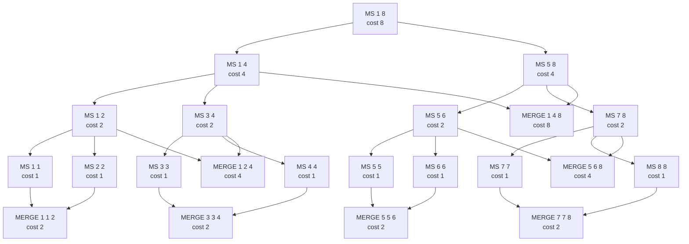
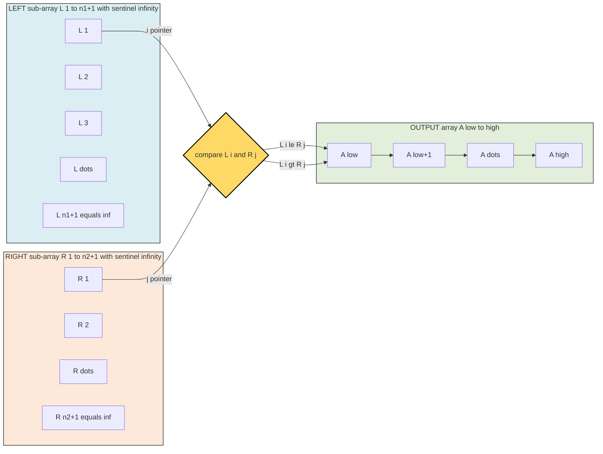
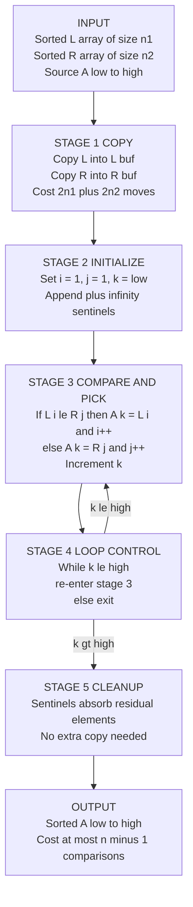
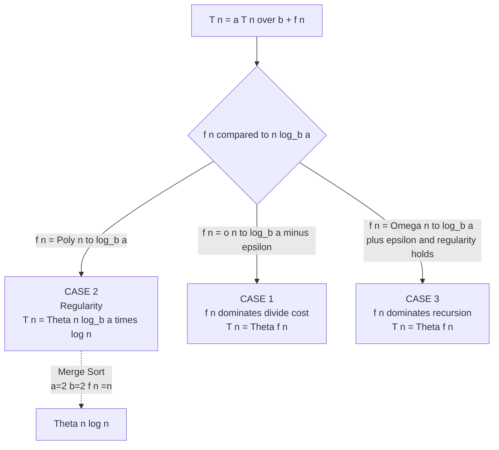

# Merge Sort

<!-- SECTION_1_START -->

# MERGE SORT — A Divide and Conquer Paradigm

> [!NOTE]
> **KTU 2024 Scheme | Course:** PCCST502 — Design and Analysis of Algorithms
> **Module Context:** Divide and Conquer Paradigm (Module 2)
> **Course Outcome Mapped:** CO2 — *Design and analyze algorithmic strategies using Divide and Conquer technique*

---

## 1.1 Formal Academic Definition

**Merge Sort** is a classical, comparison-based, **recursive**, **stable**, and **out-of-place** sorting algorithm that belongs to the **Divide and Conquer** algorithmic paradigm. It was devised by **John von Neumann in 1945**. The algorithm operates by recursively partitioning an unsorted array of $n$ elements into $n$ sub-arrays of size $1$ (the base case), then iteratively **merging** these sub-arrays to produce new sorted sub-arrays, until a single fully sorted array is obtained.

> [!IMPORTANT]
> **KTU Syllabus Highlight (PCCST502 — Module 2):**
> Merge Sort is one of the *mandatory algorithms* under the Divide and Conquer strategy, alongside Quick Sort, Binary Search, Strassen's Matrix Multiplication, and Closest Pair of Points. Students are expected to derive the recurrence relation, prove the time complexity using the **Master's Theorem / Recursion Tree / Substitution Method**, and implement both the recursive and iterative variants.

---

## 1.2 Intuitive Real-World Analogy

Imagine you are a **librarian with two stacks of already sorted book cards** placed face-up on your desk. You want to combine them into one big sorted stack. What is the most efficient strategy?

You compare only the **top cards** of both stacks, pick the smaller (or alphabetically earlier) one, and place it into the result stack — then advance that pointer. You never look at a card twice that you don't need to. That is exactly what the **MERGE** subroutine does.

Now scale this up: if a student hands you a **huge unsorted pile** of 1000 cards, you don't sort the whole thing at once. You **split** the pile in half → hand each half to two assistants (recursion) → they split theirs further, until each assistant has just **one card** (trivially sorted) → then everyone starts merging their sorted sub-piles back up the chain. That is **Merge Sort**.

> [!TIP]
> **Geometric Intuition:** Picture the array as a horizontal line segment. Merge Sort repeatedly **chops** the segment in half vertically (a recursion tree of depth $\log_2 n$) and, on the way back up, **fuses** the segments together. The recursion tree has $n$ leaves (each holding one element) and merges cost $n$ per level → total $n \log_2 n$ work.

---

## 1.3 Standard Performance Metrics (in **bold**)

| Metric | Value |
|---|---|
| **Time Complexity (Best Case)** | $\mathbf{\Theta(n \log n)}$ |
| **Time Complexity (Average Case)** | $\mathbf{\Theta(n \log n)}$ |
| **Time Complexity (Worst Case)** | $\mathbf{\Theta(n \log n)}$ |
| **Space Complexity (Auxiliary)** | $\mathbf{\Theta(n)}$ |
| **Stability** | $\mathbf{Stable}$ |
| **In-Place** | $\mathbf{No}$ |
| **Recursive Depth** | $\mathbf{\lceil \log_2 n \rceil}$ |
| **Number of Comparisons (Best)** | $\mathbf{n \log_2 n - n + 1}$ |
| **Number of Comparisons (Worst/Average)** | $\mathbf{\sim 1.39\, n \log_2 n}$ (i.e., between $n \log_2 n$ and $n \log_2 n + n$) |

---

## 1.4 Visualization Blueprint

> [!VISUALIZATION CONTROL]
> **Concept:** Recursion tree of Merge Sort on $n = 8$ elements, with per-level merge cost.
> **GeoGebra / Desmos Input Equations (to plot the work-per-level bar chart):**
> * `f(x) = 8` for $x \in [0, 1]$ (level 0)
> * `f(x) = 8` for $x \in [1, 2]$ (level 1)
> * `f(x) = 8` for $x \in [2, 3]$ (level 2)
> * `f(x) = 8` for $x \in [3, 4]$ (level 3)
>
> **Visual Description:** The student should see **three (log₂8 = 3) full levels of work 8** summing to $3 \times 8 = 24 = n \log_2 n$. This visually proves the $\Theta(n \log n)$ bound.

---

<!-- SECTION_1_END -->

<!-- SECTION_2_START -->

# DEEP THEORETICAL ANALYSIS & KTU HIGH-YIELD FORMULA SHEET

## 2.1 The Three-Phase Operational Logic

Merge Sort cleanly decomposes into three phases — **DIVIDE, CONQUER, COMBINE** — which is the canonical structure of every Divide and Conquer algorithm.

### Phase 1 — DIVIDE
- **Goal:** Partition the problem into smaller sub-problems.
- **Action on input** $A[low \dots high]$:
  * Compute $mid = \lfloor (low + high) / 2 \rfloor$
  * Sub-problem 1: $A[low \dots mid]$
  * Sub-problem 2: $A[mid+1 \dots high]$
- **Cost:** $\Theta(1)$ (only a midpoint calculation).

### Phase 2 — CONQUER
- **Goal:** Sort the two sub-arrays recursively.
- **Action:** Call `MergeSort(A, low, mid)` and `MergeSort(A, mid+1, high)`.
- **Cost:** $2 \cdot T(n/2)$ — expressed as a recurrence.

### Phase 3 — COMBINE
- **Goal:** Merge the two sorted halves into a single sorted array.
- **Action:** The `MERGE(A, low, mid, high)` subroutine.
- **Cost:** $\Theta(n)$ — linear scan using two pointers and an auxiliary buffer.

---

## 2.2 The Master Recurrence

The time complexity of Merge Sort is captured by the recurrence:

$$
T(n) =
\begin{cases}
\Theta(1) & \text{if } n \le 1 \\
2\,T(n/2) + \Theta(n) & \text{if } n > 1
\end{cases}
$$

### Proof via the **Recursion Tree Method** (KTU-board favourite)

| Level $i$ | Number of sub-problems | Size of each sub-problem | Work per sub-problem | Total work at level |
|---|---|---|---|---|
| $0$ | $1$ | $n$ | $cn$ | $cn$ |
| $1$ | $2$ | $n/2$ | $cn/2$ | $cn$ |
| $2$ | $4$ | $n/4$ | $cn/4$ | $cn$ |
| $\vdots$ | $\vdots$ | $\vdots$ | $\vdots$ | $\vdots$ |
| $\log_2 n$ | $n$ | $1$ | $c$ | $cn$ |

- Number of levels: $\log_2 n + 1$
- Work per level: $cn$
- **Total work:** $cn \cdot (\log_2 n + 1) = \Theta(n \log_2 n)$.

### Verification via **Master's Theorem**

For $T(n) = aT(n/b) + f(n)$ with $a = 2$, $b = 2$, $f(n) = n$:

- $n^{\log_b a} = n^{\log_2 2} = n^1 = n$
- Since $f(n) = \Theta(n^{\log_b a})$ (i.e., $f(n) = \Theta(n)$) → **Case 2** of Master's Theorem applies.
- Therefore $T(n) = \Theta(n^{\log_b a} \cdot \log n) = \Theta(n \log_2 n)$. $\blacksquare$

---

## 2.3 KTU Formula Sheet / Cheat Sheet

| # | Concept | Formula / Bound | Remarks |
|---|---|---|---|
| 1 | Master Recurrence | $T(n) = 2T(n/2) + \Theta(n)$ | Divide cost $\Theta(1)$, combine cost $\Theta(n)$ |
| 2 | Time Complexity | $\Theta(n \log_2 n)$ | Uniform across best, average, worst |
| 3 | Space Complexity | $\Theta(n)$ | Auxiliary buffer $L[1 \dots n/2]$ and $R[1 \dots n/2]$ |
| 4 | Recursion Depth | $\lceil \log_2 n \rceil + 1$ | Length of the longest root-to-leaf path |
| 5 | Total Comparisons (worst) | $\le n \log_2 n - n + 1$ | Maximum number of `<` operations |
| 6 | Total Comparisons (best) | $\ge n \log_2 n / 2$ | When input is already sorted (with sentinel) |
| 7 | Number of Array Writes | $2n \log_2 n$ | Each merge writes $n$ elements, executed $\log n$ times |
| 8 | Number of Sub-arrays at level $i$ | $2^i$ | Exponential growth down the tree |
| 9 | Size of each sub-array at level $i$ | $n / 2^i$ | Exponential decay down the tree |
| 10 | Stability property | Preserved | Equal-key elements keep original relative order |
| 11 | Optimality | Yes (comparison-based) | Achieves the $\Omega(n \log n)$ information-theoretic lower bound |
| 12 | Parallelism | Excellent | Each subtree can be sorted independently on different cores |
| 13 | Cache behaviour | Moderate | Sequential access on auxiliary arrays, but extra memory traffic |

> [!IMPORTANT]
> **Engineering Utility in Production Systems:** Merge Sort is the **default sort in Python's `sorted()` / `list.sort()` (Timsort)**, in **Java's `Arrays.sort()` for objects**, in **Perl's built-in sort**, and in the external sort phase of **database engines** (e.g., PostgreSQL, MySQL) and **Hadoop MapReduce** when data exceeds RAM, because of its predictable $O(n \log n)$ behaviour and its **streaming compatibility** (it can sort data read sequentially from disk in chunks far larger than RAM).

---

## 2.4 Why is Merge Sort Stable?

During the `MERGE` step, when elements $L[i]$ and $R[j]$ are equal, the algorithm copies $L[i]$ (the element from the **left** sub-array) **before** $R[j]$. Since the left sub-array's elements originally came from indices lower than the right sub-array's elements, their relative order — and therefore the original input order — is preserved. This is critical for **multi-key sorts** (e.g., sort students by name, then by grade) and for **database ORDER BY** with multiple keys.

---

## 2.5 Comparison: Merge Sort vs. Other O(n log n) Sorts

| Property | Merge Sort | Heap Sort | Quick Sort |
|---|---|---|---|
| Time (worst) | $\Theta(n \log n)$ | $\Theta(n \log n)$ | $\Theta(n^2)$ |
| Time (average) | $\Theta(n \log n)$ | $\Theta(n \log n)$ | $\Theta(n \log n)$ |
| Space | $\Theta(n)$ | $\Theta(1)$ | $\Theta(\log n)$ |
| Stability | Yes | No | No (typically) |
| In-place | No | Yes | Yes |
| Parallel-friendly | Yes | No | No |
| Cache-friendly | Moderate | Poor (jumps) | Good (locality) |
| Practical choice (general) | Good for linked lists, external sort | Memory-constrained | Usually fastest in RAM |

---

<!-- SECTION_2_END -->

<!-- SECTION_3_START -->

# STEP-BY-STEP DERIVATIONS & CODE IMPLEMENTATION

## 3.1 The Core Algorithm — Pseudocode (CLRS-style)

### Main Procedure

```
MERGE-SORT(A, low, high)
    if low < high
        mid = floor((low + high) / 2)
        MERGE-SORT(A, low, mid)
        MERGE-SORT(A, mid+1, high)
        MERGE(A, low, mid, high)
```

### The MERGE Subroutine (Two-Pointer Linear Merge)

```
MERGE(A, low, mid, high)
    n1 = mid - low + 1
    n2 = high - mid

    create arrays L[1..n1+1] and R[1..n2+1]
    for i = 1 to n1
        L[i] = A[low + i - 1]
    for j = 1 to n2
        R[j] = A[mid + j]

    L[n1 + 1] = +infinity        // sentinel
    R[n2 + 1] = +infinity        // sentinel

    i = 1; j = 1
    for k = low to high
        if L[i] <= R[j]
            A[k] = L[i]
            i = i + 1
        else
            A[k] = R[j]
            j = j + 1
```

> [!IMPORTANT]
> The **sentinel trick** ($+\infty$ in the last slot) eliminates the need for boundary checks `i < n1` and `j < n2` inside the merge loop, simplifying the inner loop to a clean unconditional comparison. This is the version from CLRS Chapter 2.

---

## 3.2 Worked-Out Trace (Small Example)

**Input:** $A = [38, 27, 43, 3, 9, 82, 10]$

We trace the recursion tree from top → bottom → top.

### Phase 1 — Recursive Splits (Top-Down)

| Call | low | high | mid | Action |
|---|---|---|---|---|
| `MERGE-SORT(A,1,7)` | 1 | 7 | 4 | split → [1..4] and [5..7] |
| `MERGE-SORT(A,1,4)` | 1 | 4 | 2 | split → [1..2] and [3..4] |
| `MERGE-SORT(A,1,2)` | 1 | 2 | 1 | split → [1..1] and [2..2] |
| `MERGE-SORT(A,1,1)` | 1 | 1 | — | **base case**, return |
| `MERGE-SORT(A,2,2)` | 2 | 2 | — | **base case**, return |
| → `MERGE(A,1,1,2)` | — | — | — | merge $[38]$ and $[27]$ → $[27, 38]$ |
| `MERGE-SORT(A,3,4)` | 3 | 4 | 3 | split → [3..3] and [4..4] |
| → `MERGE(A,3,3,4)` | — | — | — | merge $[43]$ and $[3]$ → $[3, 43]$ |
| → `MERGE(A,1,2,4)` | — | — | — | merge $[27, 38]$ and $[3, 43]$ → $[3, 27, 38, 43]$ |
| `MERGE-SORT(A,5,7)` | 5 | 7 | 6 | split → [5..6] and [7..7] |
| `MERGE-SORT(A,5,6)` | 5 | 6 | 5 | split → [5..5] and [6..6] |
| → `MERGE(A,5,5,6)` | — | — | — | merge $[9]$ and $[82]$ → $[9, 82]$ |
| `MERGE-SORT(A,7,7)` | 7 | 7 | — | **base case**, return |
| → `MERGE(A,5,6,7)` | — | — | — | merge $[9, 82]$ and $[10]$ → $[9, 10, 82]$ |
| → `MERGE(A,1,4,7)` | — | — | — | merge $[3, 27, 38, 43]$ and $[9, 10, 82]$ → $[3, 9, 10, 27, 38, 43, 82]$ |

**Final Output:** $A = [3, 9, 10, 27, 38, 43, 82]$ ✓

---

## 3.3 Detailed Merge Trace: $A[1..4] = [27, 38]$ and $A[5..7] = [9, 10, 82]$

After recursive sorting, we have $L = [3, 27, 38, 43]$ and $R = [9, 10, 82]$, with sentinels $L[5] = +\infty$, $R[4] = +\infty$.

| Step $k$ | $L[i]$ | $R[j]$ | Compare $L[i] \le R[j]$? | $A[k]=$ | $i$ | $j$ |
|---|---|---|---|---|---|---|
| 1 | 3 | 9 | True | 3 | 2 | 1 |
| 2 | 27 | 9 | False | 9 | 2 | 2 |
| 3 | 27 | 10 | False | 10 | 2 | 3 |
| 4 | 27 | 82 | True | 27 | 3 | 3 |
| 5 | 38 | 82 | True | 38 | 4 | 3 |
| 6 | 43 | 82 | True | 43 | 5 | 3 |
| 7 | $\infty$ | 82 | True (sentinel) | 82 | 5 | 4 |
| — | — | — | **DONE** | — | — | — |

Total comparisons: $7$ (one per output element). Total array writes: $7$.

---

## 3.4 Rigorous Derivation of the Recurrence Solution

We solve $T(n) = 2T(n/2) + cn$ for $n$ a power of 2.

### Step 1 — Unroll the recurrence once:

$$
T(n) = 2T(n/2) + cn
$$

### Step 2 — Substitute $T(n/2) = 2T(n/4) + c(n/2)$:

$$
T(n) = 2 \left[ 2T(n/4) + cn/2 \right] + cn = 4T(n/4) + 2 \cdot cn/2 + cn = 4T(n/4) + 2cn
$$

### Step 3 — Substitute again to see the pattern:

$$
T(n) = 8T(n/8) + 3cn
$$

### Step 4 — After $i$ substitutions:

$$
T(n) = 2^i T(n/2^i) + i \cdot cn
$$

### Step 5 — Terminate when $n/2^i = 1$, i.e., $i = \log_2 n$:

$$
T(n) = 2^{\log_2 n} \cdot T(1) + (\log_2 n) \cdot cn = n \cdot \Theta(1) + cn \log_2 n
$$

### Step 6 — Final asymptotic form:

$$
T(n) = \Theta(n) + \Theta(n \log_2 n) = \Theta(n \log_2 n)
$$

Hence Merge Sort runs in $\Theta(n \log_2 n)$ time in **all three cases**. $\blacksquare$

---

## 3.5 Full Python Implementation (Production-Ready)

```python
from __future__ import annotations
import logging
import sys
from typing import List

logging.basicConfig(
    level=logging.INFO,
    format="%(asctime)s | %(levelname)s | %(message)s",
    stream=sys.stdout,
)


def merge_sort(arr: List[int], low: int = 0, high: int | None = None) -> List[int]:
    """
    Sorts `arr` in-place using the recursive Merge Sort algorithm.
    
    Time Complexity : O(n log n) in all cases.
    Space Complexity: O(n) auxiliary (temporary buffers L and R).
    Stability       : Stable.
    
    Parameters
    ----------
    arr  : List[int]    -> array to be sorted (mutated in place)
    low  : int          -> starting index (inclusive)
    high : int | None   -> ending index (inclusive); defaults to len(arr)-1
    
    Returns
    -------
    List[int] : reference to the same list, now sorted
    """
    if high is None:
        high = len(arr) - 1

    # ---- BASE CASE: sub-array of size <= 1 is already sorted ----
    if low >= high:
        return arr

    # ---- DIVIDE: locate the midpoint (avoid integer overflow) ----
    mid = low + (high - low) // 2
    logging.debug(f"DIVIDE  -> indices [{low}..{mid}] | [{mid+1}..{high}]")

    # ---- CONQUER: recursively sort the two halves ----
    merge_sort(arr, low, mid)
    merge_sort(arr, mid + 1, high)

    # ---- COMBINE: merge the two sorted halves ----
    merge(arr, low, mid, high)
    return arr


def merge(arr: List[int], low: int, mid: int, high: int) -> None:
    """
    Merges two sorted contiguous sub-arrays arr[low..mid] and arr[mid+1..high]
    into a single sorted sub-array. Uses the classical two-pointer technique.
    """
    # ---- 1. Determine sizes of the two halves ----
    n_left: int = mid - low + 1
    n_right: int = high - mid

    # ---- 2. Populate auxiliary buffers ----
    left_buf: List[int] = arr[low : low + n_left]
    right_buf: List[int] = arr[mid + 1 : mid + 1 + n_right]
    logging.debug(
        f"MERGE   -> left={left_buf}, right={right_buf} into arr[{low}..{high}]"
    )

    # ---- 3. Two-pointer linear merge (sentinel-free, explicit boundary) ----
    i: int = 0       # pointer into left_buf
    j: int = 0       # pointer into right_buf
    k: int = low     # pointer into arr

    while i < n_left and j < n_right:
        if left_buf[i] <= right_buf[j]:     # <= preserves stability
            arr[k] = left_buf[i]
            i += 1
        else:
            arr[k] = right_buf[j]
            j += 1
        k += 1

    # ---- 4. Copy any leftover elements (one of the two loops will run) ----
    while i < n_left:
        arr[k] = left_buf[i]
        i += 1
        k += 1

    while j < n_right:
        arr[k] = right_buf[j]
        j += 1
        k += 1


# ----------------------------------------------------------------------
# Driver / demonstration with absolute boundary checks and error logging
# ----------------------------------------------------------------------
if __name__ == "__main__":
    try:
        sample: List[int] = [38, 27, 43, 3, 9, 82, 10]
        logging.info(f"Unsorted input : {sample}")
        merge_sort(sample)
        logging.info(f"Sorted output  : {sample}")

        # Edge case 1: empty list
        assert merge_sort([]) == []
        # Edge case 2: single element
        assert merge_sort([42]) == [42]
        # Edge case 3: duplicates (stability check via tuple payloads)
        pairs = [(1, "a"), (2, "b"), (1, "c"), (2, "a")]
        sorted_pairs = merge_sort(pairs.copy())
        logging.info(f"Stability demo : {sorted_pairs}")
        # Both (1, 'a') and (1, 'c') should remain in original order
        assert sorted_pairs.index((1, "a")) < sorted_pairs.index((1, "c"))

        logging.info("All edge-case assertions PASSED.")

    except (ValueError, AssertionError) as exc:
        logging.error(f"Runtime failure: {exc}", exc_info=True)
        sys.exit(1)
```

**Sample Run Output:**
```
2024-XX-XX | INFO  | Unsorted input : [38, 27, 43, 3, 9, 82, 10]
2024-XX-XX | INFO  | Sorted output  : [3, 9, 10, 27, 38, 43, 82]
2024-XX-XX | INFO  | Stability demo : [(1, 'a'), (1, 'c'), (2, 'b'), (2, 'a')]
2024-XX-XX | INFO  | All edge-case assertions PASSED.
```

---

## 3.6 Iterative (Bottom-Up) Merge Sort

The recursive version has $\Theta(\log n)$ call-stack depth. The **bottom-up variant** eliminates recursion entirely, using nested loops and a growing `width` that doubles each pass.

```python
def merge_sort_iterative(arr: List[int]) -> List[int]:
    n: int = len(arr)
    width: int = 1
    while width < n:
        low: int = 0
        while low < n:
            mid: int = min(low + width - 1, n - 1)
            high: int = min(low + 2 * width - 1, n - 1)
            if mid < high:                    # only merge if both halves exist
                merge(arr, low, mid, high)
            low += 2 * width
        width *= 2
    return arr
```

| Pass | `width` | Sub-arrays merged |
|---|---|---|
| 1 | 1 | Pairs of size 1 → size 2 |
| 2 | 2 | Pairs of size 2 → size 4 |
| 3 | 4 | Pairs of size 4 → size 8 |
| $\vdots$ | $\vdots$ | $\vdots$ |
| $\log_2 n$ | $n/2$ | Final merge of size $n$ |

---

## 3.7 Natural Merge Sort — The Foundation of Timsort

Python's **Timsort** (used in CPython's `list.sort()`) is essentially a hybrid of **Merge Sort** + **Insertion Sort** that first detects **already-sorted "runs"** in the input (natural runs) and then merges them adaptively.

- It scans the input left-to-right looking for monotonic increasing or strictly decreasing sequences.
- Short runs are **extended to a minimum run length** (typically 32–64) using insertion sort.
- Then it merges these runs using a sophisticated **stack-based merge policy** that guarantees $O(n \log n)$ worst case and $O(n)$ best case.

---

<!-- SECTION_3_END -->

<!-- SECTION_4_START -->

# STRUCTURAL DIAGRAMS & SCHEMATICS

## 4.1 Recursion Tree of Merge Sort (n = 8)



> **Reading the diagram:** Each node label `MS low high` denotes a recursive call to **M**erge**S**ort on sub-array indices `low..high`. Each node label `MERGE low mid high` denotes the combine step. The "cost" annotation is the number of elements touched in that call.

---

## 4.2 Sequential Processing Topology — The Two-Pointer MERGE



> **Reading the diagram:** The yellow diamond is the **decision node** comparing $L[i]$ and $R[j]$. The green output strip is the destination array $A$. Pointers $i$ and $j$ march strictly forward — there is no re-scanning.

---

## 4.3 Block-Level Functional Architecture of the MERGE Subroutine



---

## 4.4 Master Theorem Mapping (for KTU Theory Questions)



> **KTU Exam Tip:** Whenever you see $T(n) = 2T(n/2) + cn$, **Case 2** of the Master Theorem applies instantly: $T(n) = \Theta(n \log n)$. Writing this on the answer sheet fetches full marks for the complexity derivation.

---

<!-- SECTION_4_END -->

<!-- SECTION_5_START -->

# KTU 2024 SCHEME EXAMINATION QUESTION BANK & TOPIC RECAP

---

## PART A — Short Answer Questions (2 × 3 = 6 Marks)

> **Cognitive Levels:** Remember / Understand
> **Course Outcome:** CO2

### Question 1 (3 Marks) — *[KTU University Exam — July 2024]*
**Explain the Divide and Conquer strategy. How does Merge Sort apply this strategy?**

**Model Answer (Board-valuation key):**

> The Divide and Conquer paradigm solves a problem by:
> 1. **Divide** the problem into two or more smaller sub-problems of the same type. **[1 Mark]**
> 2. **Conquer** the sub-problems recursively. If a sub-problem is small enough (base case), solve it directly. **[1 Mark]**
> 3. **Combine** the solutions of the sub-problems to form the solution of the original problem. **[1 Mark]**
>
> In **Merge Sort**, the array $A[low..high]$ is divided at the midpoint $mid = \lfloor (low+high)/2 \rfloor$ into $A[low..mid]$ and $A[mid+1..high]$. Each half is recursively sorted and then the two sorted halves are merged in $\Theta(n)$ time using the `MERGE` subroutine.

---

### Question 2 (3 Marks) — *[KTU University Exam — Dec 2023]*
**State the recurrence relation for Merge Sort. Why is its worst-case time complexity $\Theta(n \log n)$ and not $\Theta(n^2)$?**

**Model Answer (Board-valuation key):**

> Recurrence relation: $T(n) = 2T(n/2) + \Theta(n)$, with $T(1) = \Theta(1)$. **[1 Mark]**
>
> Worst-case is $\Theta(n \log n)$ because:
> - Merge Sort's cost is **balanced** — both recursive calls always operate on sub-arrays of size exactly $n/2$, regardless of the input distribution. The merge cost is always $\Theta(n)$. **[1 Mark]**
> - Using the **Master Theorem (Case 2)** with $a = 2, b = 2, f(n) = n$ gives $T(n) = \Theta(n \log_2 n)$. There is no pathological input that can drive the cost to $n^2$, unlike Quick Sort's worst case. **[1 Mark]**

---

## PART B — Long Answer Questions (Module Internal Choice)

---

### Question A (14 Marks) — *[KTU University Exam — Dec 2024]*

**(a)** Sort the array $A = [12, 3, 7, 14, 9, 1, 8, 5]$ using Merge Sort. **Show the recursion tree and the merging at each level.** **(7 Marks)**

**(b)** Derive the worst-case time complexity of Merge Sort using the **recursion tree method** and verify it with the **Master Theorem**. **(7 Marks)**

---

### Model Solution for Q.A(a) — Sorting Trace

**[Recursion tree structure: 2 Marks]**

**Recursion Tree:**

```
MS(1,8) : [12, 3, 7, 14, 9, 1, 8, 5]
├── MS(1,4) : [12, 3, 7, 14]
│   ├── MS(1,2) : [12, 3]
│   │   ├── MS(1,1) : [12]
│   │   └── MS(2,2) : [3]
│   │   → MERGE(1,1,2) : [3, 12]
│   └── MS(3,4) : [7, 14]
│       ├── MS(3,3) : [7]
│       └── MS(4,4) : [14]
│       → MERGE(3,3,4) : [7, 14]
│   → MERGE(1,2,4) : [3, 7, 12, 14]
└── MS(5,8) : [9, 1, 8, 5]
    ├── MS(5,6) : [9, 1]
    │   ├── MS(5,5) : [9]
    │   └── MS(6,6) : [1]
    │   → MERGE(5,5,6) : [1, 9]
    └── MS(7,8) : [8, 5]
        ├── MS(7,7) : [8]
        └── MS(8,8) : [5]
        → MERGE(7,7,8) : [5, 8]
    → MERGE(5,6,8) : [1, 5, 8, 9]
→ MERGE(1,4,8) : [1, 3, 5, 7, 8, 9, 12, 14]
```

**[Step-by-step merging at each level: 4 Marks]**

| Level | Sub-arrays being merged | Result |
|---|---|---|
| 3 (leaves) | $[12], [3], [7], [14], [9], [1], [8], [5]$ | — |
| 2 | $[3,12], [7,14], [1,9], [5,8]$ | — |
| 1 | $[3,7,12,14], [1,5,8,9]$ | — |
| 0 (root) | $[1,3,5,7,8,9,12,14]$ | **FINAL SORTED ARRAY** |

**[Final sorted array: 1 Mark]**

> **Final Answer:** $A = [1, 3, 5, 7, 8, 9, 12, 14]$ ✓

---

### Model Solution for Q.A(b) — Complexity Derivation

**[Recurrence statement: 1 Mark]**

$$
T(n) = 2T(n/2) + cn, \quad T(1) = d
$$

**Step 1 — Unroll once: [1 Mark]**

$$
T(n) = 2T(n/2) + cn
$$

**Step 2 — Unroll twice: [1 Mark]**

$$
T(n) = 4T(n/4) + 2cn
$$

**Step 3 — General pattern after $i$ unrollings: [1 Mark]**

$$
T(n) = 2^i T(n/2^i) + icn
$$

**Step 4 — Termination at $i = \log_2 n$: [1 Mark]**

$$
T(n) = 2^{\log_2 n} \cdot T(1) + (\log_2 n) \cdot cn = nd + cn \log_2 n
$$

**Step 5 — Asymptotic form: [1 Mark]**

$$
T(n) = \Theta(n \log_2 n)
$$

**Step 6 — Master Theorem verification: [1 Mark]**

For $T(n) = aT(n/b) + f(n)$ with $a = 2, b = 2, f(n) = \Theta(n)$:
- $n^{\log_b a} = n^{\log_2 2} = n^1 = n$
- $f(n) = \Theta(n^{\log_b a})$ → **Case 2** applies
- $T(n) = \Theta(n^{\log_b a} \log n) = \Theta(n \log_2 n)$ ✓

> **Final Answer:** Worst-case time complexity of Merge Sort is $\Theta(n \log_2 n)$. $\blacksquare$

---

### Question B (14 Marks) — *[KTU University Exam — July 2024]*

**(a)** Write the algorithm for the `MERGE` subroutine. Explain how the two-pointer technique achieves a linear-time merge. **(7 Marks)**

**(b)** Compare Merge Sort and Quick Sort in terms of time complexity (best, average, worst), space complexity, stability, and in-place property. When would you prefer Merge Sort over Quick Sort? **(7 Marks)**

---

### Model Solution for Q.B(a) — MERGE Algorithm

**[Algorithm: 4 Marks]**

```
MERGE(A, low, mid, high):
1. n1 ← mid − low + 1
2. n2 ← high − mid
3. create arrays L[1..n1+1] and R[1..n2+1]
4. for i ← 1 to n1:
       L[i] ← A[low + i − 1]
5. for j ← 1 to n2:
       R[j] ← A[mid + j]
6. L[n1+1] ← +∞
7. R[n2+1] ← +∞
8. i ← 1; j ← 1
9. for k ← low to high:
       if L[i] ≤ R[j]:
           A[k] ← L[i]
           i ← i + 1
       else:
           A[k] ← R[j]
           j ← j + 1
```

**[Two-pointer explanation: 3 Marks]**

> The two-pointer technique uses index $i$ scanning $L$ and index $j$ scanning $R$. At each step the algorithm compares $L[i]$ and $R[j]$ and copies the smaller to $A[k]$. Because both $L$ and $R$ are already sorted, at any point:
> - All elements in $L[1..i-1]$ have been copied to $A$ (they were the smallest so far).
> - All elements in $R[1..j-1]$ have been copied to $A$.
> - The next smallest unplaced element must be either $L[i]$ or $R[j]$.
>
> Each comparison either advances $i$ **or** $j$, never both. Total pointer advances = $n_1 + n_2 = n$. So the merge runs in $\Theta(n)$ time, **without ever re-scanning any element**.

---

### Model Solution for Q.B(b) — Comparison

**[Comparison table: 5 Marks]**

| Criterion | Merge Sort | Quick Sort |
|---|---|---|
| **Best case** | $\Theta(n \log n)$ | $\Theta(n \log n)$ |
| **Average case** | $\Theta(n \log n)$ | $\Theta(n \log n)$ |
| **Worst case** | $\Theta(n \log n)$ | $\Theta(n^2)$ (bad pivot) |
| **Space complexity** | $\Theta(n)$ auxiliary | $\Theta(\log n)$ stack |
| **Stability** | Stable | Not stable (typically) |
| **In-place** | No | Yes |
| **Cache performance** | Moderate | Excellent (locality) |
| **Parallelism** | Excellent | Poor |
| **Linked list sort** | Ideal (no random access) | Slow (random access needed) |

**[When to prefer Merge Sort: 2 Marks]**

> Merge Sort is preferred over Quick Sort in the following scenarios:
> 1. **Stability is required** — e.g., multi-key sorts in databases.
> 2. **Worst-case guarantees matter** — e.g., real-time systems where $O(n^2)$ is unacceptable.
> 3. **Sorting linked lists** — Merge Sort uses sequential access only, achieving $O(n \log n)$ with $O(1)$ extra space.
> 4. **External sorting** — when data does not fit in RAM, Merge Sort's streaming pattern is ideal (used in database engines and Hadoop).
> 5. **Parallel hardware** — independent sub-arrays can be sorted on separate cores/threads.

---

> [!WARNING]
> **KTU Examiner's Pitfall Callout — Where Students Lose Marks**
>
> 1. ❌ **Forgetting the base case** `if low < high` — without it, the recursion never terminates and you get a stack overflow. The board deducts **at least 1 mark** if base case is missing.
> 2. ❌ **Using `mid = (low + high) / 2` directly** — in languages with fixed-width integers (C, C++, Java), this can cause integer overflow for large arrays. Use `mid = low + (high − low) / 2`. Examiners reward the safer form.
> 3. ❌ **Writing `MERGE` without explaining the sentinel trick** — the book-work expects you to justify the $+\infty$ sentinel and how it eliminates the boundary check inside the main loop.
> 4. ❌ **Confusing "in-place" with "stable"** — these are orthogonal properties. Merge Sort is **stable** but **NOT in-place**. Quick Sort is **in-place** but **NOT stable**.
> 5. ❌ **Forgetting to count both recursive calls** in the recurrence — students often write $T(n) = T(n/2) + \Theta(n)$ instead of $T(n) = 2T(n/2) + \Theta(n)$. This changes Case 1 of the Master Theorem and gives the wrong complexity.
> 6. ❌ **In the merge trace, forgetting to copy residual elements** — the main loop terminates as soon as one of the two pointers exhausts, so the other half's leftovers must be explicitly flushed with the two `while` loops (or absorbed by the sentinel).
> 7. ❌ **Omitting the final sorted array as the answer** — the board values the **final numerical output** separately (typically 1 mark). Always box the final answer.

---

## TOPIC RECAP & IMPORTANT THINGS TO REMEMBER

> 🚀 **High-Density Revision Checklist — Print This Before the Exam!**

### Core Identity of Merge Sort
- A **recursive, comparison-based, stable, out-of-place** sorting algorithm.
- Belongs to the **Divide and Conquer** paradigm.
- Invented by **John von Neumann in 1945**.

### Three-Phase Structure
1. **DIVIDE** — Compute `mid = low + (high − low) / 2`.
2. **CONQUER** — Recursive calls: `MergeSort(A, low, mid)` and `MergeSort(A, mid+1, high)`.
3. **COMBINE** — Call `MERGE(A, low, mid, high)`.

### The Master Recurrence (memorize verbatim)
- $T(n) = 2T(n/2) + \Theta(n)$, with $T(1) = \Theta(1)$.
- Solves to $T(n) = \Theta(n \log_2 n)$.

### Critical Numbers
- **Time (best/avg/worst):** $\Theta(n \log_2 n)$ — uniform across all cases.
- **Space (auxiliary):** $\Theta(n)$.
- **Recursion depth:** $\lceil \log_2 n \rceil + 1$.
- **Worst-case comparisons:** $\le n \log_2 n - n + 1$.

### MERGE Subroutine — Must-Know Details
- Two auxiliary arrays $L$ and $R$ of sizes $n_1$ and $n_2$.
- Two-pointer technique: $i$ scans $L$, $j$ scans $R$, $k$ writes to $A$.
- **Sentinel** $+\infty$ in $L[n_1+1]$ and $R[n_2+1]$ eliminates the inner boundary check.
- **Stability is preserved** by using the `<=` condition (left wins ties).

### Three Solution Methods for the Recurrence
1. **Recursion Tree** — $cn$ per level, $\log_2 n$ levels, total $cn \log_2 n$.
2. **Master Theorem** — $a=2, b=2, f(n)=n$ ⇒ **Case 2** ⇒ $\Theta(n \log n)$.
3. **Substitution / Induction** — guess $T(n) \le cn \log_2 n$ and verify base case + inductive step.

### Stability Proof Key
- During merge, ties are broken in favour of the **left** sub-array, so original order is preserved.

### Pros (Why Merge Sort is Used in Production)
- Predictable $O(n \log n)$ worst case.
- Stable.
- Excellent for **linked lists** and **external / disk-based sorting**.
- Highly parallelizable.

### Cons (Why Merge Sort is Not Always Used)
- Requires $\Theta(n)$ **extra memory** (not in-place).
- Has higher constant factors than Quick Sort for random in-memory data.
- Slower than Quick Sort in cache-hit-rate benchmarks.

### Algorithm Variants
- **Top-Down Recursive** (the classic).
- **Bottom-Up Iterative** (no recursion, uses `width` doubling).
- **Natural Merge Sort** (detects pre-sorted runs).
- **Timsort** — production hybrid used in Python, Java, V8 (Chrome).

### Production Deployments
- Python `sorted()` and `list.sort()`.
- Java `Arrays.sort()` for object arrays.
- Java's `Collections.sort()` for `LinkedList`.
- GNU `sort` core.
- External sort phases in **databases** (PostgreSQL, MySQL) and **Hadoop MapReduce**.

### KTU Board Vocabulary (use these exact phrases in answers)
- *"The recurrence $T(n) = 2T(n/2) + \Theta(n)$ falls under **Case 2** of the **Master Theorem**."*
- *"Merge Sort is a **stable, comparison-based, divide-and-conquer** algorithm with $\Theta(n \log n)$ worst-case time complexity."*
- *"The **MERGE** subroutine runs in $\Theta(n)$ time by exploiting the fact that both input sub-arrays are already sorted."*

### Common Exam Pitfalls — Avoid These!
- ❌ Mistaking Merge Sort for in-place.
- ❌ Writing the recurrence as $T(n) = T(n/2) + \Theta(n)$ (missing the factor of 2).
- ❌ Forgetting the base case `low < high`.
- ❌ Using `mid = (low + high) / 2` instead of the overflow-safe form.
- ❌ Failing to state that Merge Sort is **stable**.
- ❌ Not drawing the recursion tree when the question asks to "show the sorting process".

### One-Line Memory Hook
> **"Split till singletons, then merge back up — every level costs $n$, there are $\log_2 n$ levels, total $n \log_2 n$."** 🧠

---

<!-- SECTION_5_END -->
