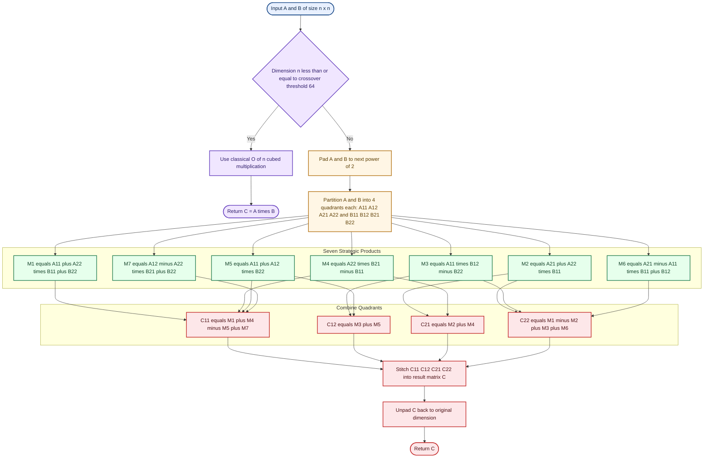
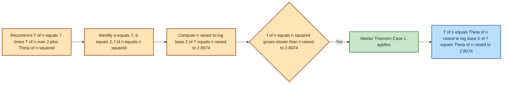

# Strassen’s Matrix Multiplication

<!-- SECTION_1_START -->

# Strassen's Matrix Multiplication

> [!IMPORTANT]
> **KTU 2024 Scheme | Module 2 | Course Outcome: CO2 | Cognitive Domain: Apply / Analyze**

## Formal Definition

**Strassen's Matrix Multiplication** is a recursive **Divide and Conquer** algorithm devised by Volker Strassen in **1969** that multiplies two $n \times n$ matrices in $O(n^{\log_2 7}) \approx O(n^{2.8074})$ time, breaking the classical $O(n^3)$ barrier. It achieves this by reducing the number of recursive scalar multiplications from **8 to 7** when multiplying two $2 \times 2$ matrices, at the cost of introducing additional scalar additions and subtractions.

For a matrix $A = [a_{ij}]$ and $B = [b_{ij}]$, classical matrix multiplication computes the product $C = A \cdot B$ where $c_{ij} = \sum_{k=1}^{n} a_{ik} \cdot b_{kj}$. This requires $n^3$ scalar multiplications. Strassen's insight was that for a $2 \times 2$ block partition, only **7 recursive products** (not 8) are required, dropping the recurrence exponent from $3$ to $\log_2 7$.

> [!NOTE]
> **KTU Syllabus Highlight:** Strassen's algorithm is the *only* non-trivial divide-and-conquer matrix multiplication method in the PCCST502 (DAA) syllabus and is a **favourite 14-mark ESE question** topic, often appearing in combination with recurrence relations solved via the Master Theorem.

## Conceptual Analogy / Intuition

Imagine you are a **head chef** preparing a giant banquet for **8 teams** of guests, and you have **8 cooking stations**. The naive (classical) approach says: each station cooks one complete dish, and you need all 8. Strassen, however, is a **cleverer chef** who realises that by cleverly **rearranging and sharing ingredients** between stations, you can produce all the required outputs using only **7 stations**, because the leftover ingredient combinations can be **summed/subtracted** to get the 8th result. The kitchen gets a little messier (more additions), but the heavy lifting (multiplications) reduces from **8 → 7**.

Geometrically, when you partition a matrix into four quadrants (top-left $A_{11}$, top-right $A_{12}$, bottom-left $A_{21}$, bottom-right $A_{22}$), the classical method independently multiplies every pair:

$$A_{11}B_{11},\; A_{11}B_{12},\; A_{11}B_{21},\; A_{11}B_{22},\; A_{21}B_{11},\; \ldots$$

Strassen merges these into 7 strategic products $M_1 \ldots M_7$, then **recombines** them with simple additions and subtractions to build all four quadrants $C_{11}, C_{12}, C_{21}, C_{22}$ of the answer.

> [!IMPORTANT]
> **The Recurrence Exponent is the Star:** $\log_2 7 \approx 2.8074$ is the asymptotic improvement. For $n = 1000$, classical does $10^9$ operations while Strassen does roughly $10^{2.8074} \approx 6.4 \times 10^8$ — a **~36%** reduction. For very large $n$ ($> 2000$), Strassen wins decisively; for small $n$, the constant overhead of additions makes classical faster, which is why production implementations use a **hybrid crossover** threshold (typically around $n = 32$ or $64$).

> [!VISUALIZATION CONTROL]
> **Concept:** $2 \times 2$ Block Matrix Multiplication - Classical (8 multiplications) vs Strassen (7 multiplications)
> **Desmos Input Equations (conceptual bar chart of operation counts for n=2 case):**
> * `Classical: 8 multiplications, 4 additions`
> * `Strassen: 7 multiplications, 18 additions/subtractions`
> **Visual Description:** Picture a bar chart where the x-axis lists "Multiplications" and "Additions/Subtractions" and the y-axis shows operation count. Classical has a tall bar at multiplications (8) and a short bar at additions (4); Strassen has a slightly shorter bar at multiplications (7) and a much taller bar at additions (18). The trade-off becomes favourable as $n$ grows.

<!-- SECTION_1_END -->

<!-- SECTION_2_START -->

# Deep Theoretical Analysis & KTU Formula Sheet

## Classical vs Strassen — Operational Breakdown

### Classical $2 \times 2$ Matrix Multiplication (Naïve)

Given:

$$A = \begin{bmatrix} a & b \\ c & d \end{bmatrix}, \quad B = \begin{bmatrix} e & f \\ g & h \end{bmatrix}$$

$$C = A \cdot B = \begin{bmatrix} ae+bg & af+bh \\ ce+dg & cf+dh \end{bmatrix}$$

This requires **8 scalar multiplications** and **4 scalar additions**.

### Strassen's $2 \times 2$ Matrix Multiplication

Strassen defines **7 strategic products**:

$$M_1 = (a + d)(e + h)$$

$$M_2 = (c + d)(e)$$

$$M_3 = (a)(f - h)$$

$$M_4 = (d)(g - e)$$

$$M_5 = (a + b)(h)$$

$$M_6 = (c - a)(e + f)$$

$$M_7 = (b - d)(g + h)$$

Then the four result blocks are:

$$C_{11} = M_1 + M_4 - M_5 + M_7$$

$$C_{12} = M_3 + M_5$$

$$C_{21} = M_2 + M_4$$

$$C_{22} = M_1 - M_2 + M_3 + M_6$$

Total: **7 scalar multiplications** and **18 scalar additions/subtractions**.

## Verification Algebra

Let us verify $C_{11}$:

$$\begin{aligned}
C_{11} &= M_1 + M_4 - M_5 + M_7 \\
&= (a+d)(e+h) + (d)(g-e) - (a+b)(h) + (b-d)(g+h)
\end{aligned}$$

Expanding term-by-term:

$$\begin{aligned}
M_1 &= ae + ah + de + dh \\
M_4 &= dg - de \\
-M_5 &= -ah - bh \\
M_7 &= bg + bh - dg - dh
\end{aligned}$$

Summing (cancel $ah, de, dh, dg$):

$$ae + \cancel{ah} + \cancel{de} + \cancel{dh} + \cancel{dg} - \cancel{de} - \cancel{ah} - bh + bg + \cancel{bh} - \cancel{dg} - \cancel{dh}$$

$$= ae + bg \quad \checkmark \quad \text{(matches classical)}$$

> [!NOTE]
> **Why does the cancellation work?** Because each scalar appears an **even number of times** with opposite signs across the four $M_i$ terms. This algebraic identity is what makes the trick possible — and is non-trivial to derive, which is why Strassen's result was a **theoretical breakthrough**.

## Recurrence Relation

For an $n \times n$ matrix where $n$ is a power of 2:

$$T(n) = 7 \cdot T\!\left(\frac{n}{2}\right) + \Theta(n^2)$$

The $\Theta(n^2)$ term accounts for the **18 matrix additions/subtractions** of size $n/2 \times n/2$ performed at each level, which total $\Theta(n^2)$ scalar operations.

Applying the **Master Theorem** with $a = 7$, $b = 2$, $f(n) = n^2$:

$$n^{\log_b a} = n^{\log_2 7} \approx n^{2.8074}$$

Since $f(n) = n^2 = O(n^{\log_2 7 - \epsilon})$ for $\epsilon \approx 0.8074$, we are in **Case 1** of the Master Theorem:

$$T(n) = \Theta(n^{\log_2 7}) = \Theta(n^{2.8074})$$

## KTU Formula Cheat Sheet

| Component | Formula / Value | Description | Unit / Notes |
|---|---|---|---|
| Recurrence | $T(n) = 7T(n/2) + \Theta(n^2)$ | Master Theorem input | Standard form |
| Master Theorem $a$ | $a = 7$ | Sub-problem count | Integer |
| Master Theorem $b$ | $b = 2$ | Size shrinkage factor | Integer |
| Master Theorem $f(n)$ | $f(n) = n^2$ | Combine cost (additions) | Polynomial |
| Critical exponent | $n^{\log_2 7} \approx n^{2.8074}$ | Decides Master case | Asymptotic |
| Classical complexity | $O(n^3)$ | Naïve baseline | Polynomial |
| Strassen complexity | $O(n^{2.8074})$ | Improved | Polynomial |
| Strassen scalar mults (2×2) | $7$ | Reduced from 8 | Count |
| Strassen scalar add/sub (2×2) | $18$ | Increased from 4 | Count |
| Crossover threshold | $n \approx 32$ to $64$ | Switch to classical in practice | Dimension |
| Stability over GF(2) | Exact | Works over integers & fields | Boolean |

## Real-World Engineering Utility

Strassen-like algorithms are used in:

* **High-Performance Computing (HPC)**: BLAS libraries and numerical linear algebra kernels (e.g., NVIDIA cuBLAS, Intel MKL) sometimes use Strassen variants for very large dense matrix multiplications.
* **Computer Graphics**: Hidden surface removal and large-viewport rendering pipelines exploit fast matrix multiplication.
* **Machine Learning**: Training of **kernel methods** and certain neural network layers involves multiplying large weight matrices; Strassen reduces wall-clock time for batch gradient updates.
* **Cryptography**: Some lattice-based post-quantum schemes (e.g., NTRU) require modular matrix multiplications; Strassen reduces key generation time.
* **Computational Biology**: Sequence alignment scoring matrices and phylogenetic distance matrices benefit from sub-cubic multiplication.

<!-- SECTION_2_END -->

<!-- SECTION_3_START -->

# Step-by-Step Derivations & Code Implementation

## Derivation 1: Solving the Recurrence via Master Theorem

**Step 1**: Write the recurrence in standard Master Theorem form.

$$T(n) = 7T\!\left(\frac{n}{2}\right) + \Theta(n^2)$$

**Step 2**: Identify parameters.

$$a = 7, \quad b = 2, \quad f(n) = n^2$$

**Step 3**: Compute the critical exponent.

$$n^{\log_b a} = n^{\log_2 7}$$

Using change of base:

$$\log_2 7 = \frac{\ln 7}{\ln 2} = \frac{1.9459}{0.6931} \approx 2.8074$$

**Step 4**: Compare $f(n)$ with $n^{\log_2 7}$.

$$f(n) = n^2 = n^{2.0000} \quad \text{vs.} \quad n^{\log_2 7} = n^{2.8074}$$

Since $n^2 = O(n^{2.8074 - \epsilon})$ for any $\epsilon < 0.8074$, **Case 1** of the Master Theorem applies.

**Step 5**: Conclude.

$$T(n) = \Theta(n^{\log_2 7}) \approx \Theta(n^{2.8074})$$

## Derivation 2: Work-Span via Recursion Tree

At level $i$ of the recursion tree:
* Number of subproblems: $7^i$
* Size of each subproblem: $n / 2^i$
* Work per subproblem (combine step): $\Theta((n/2^i)^2)$

Total work at level $i$:

$$W_i = 7^i \cdot c \cdot \left(\frac{n}{2^i}\right)^2 = c \cdot n^2 \cdot \left(\frac{7}{4}\right)^i$$

The tree has $\log_2 n$ levels. Summing geometric series with ratio $7/4 > 1$, the work is dominated by the **last level**:

$$W_{\text{total}} = \sum_{i=0}^{\log_2 n - 1} c n^2 \left(\frac{7}{4}\right)^i = c n^2 \cdot \frac{(7/4)^{\log_2 n} - 1}{7/4 - 1}$$

Since $(7/4)^{\log_2 n} = n^{\log_2(7/4)} = n^{\log_2 7 - 2}$:

$$W_{\text{total}} = \Theta\!\left(n^2 \cdot n^{\log_2 7 - 2}\right) = \Theta(n^{\log_2 7}) \quad \checkmark$$

## Derivation 3: Worked Example — $2 \times 2$ Numerical Trace

Let:

$$A = \begin{bmatrix} 1 & 3 \\ 5 & 7 \end{bmatrix}, \quad B = \begin{bmatrix} 2 & 4 \\ 6 & 8 \end{bmatrix}$$

Here $a=1, b=3, c=5, d=7, e=2, f=4, g=6, h=8$.

**Compute the 7 products:**

$$\begin{aligned}
M_1 &= (a+d)(e+h) = (1+7)(2+8) = 8 \times 10 = 80 \\
M_2 &= (c+d)(e) = (5+7)(2) = 12 \times 2 = 24 \\
M_3 &= (a)(f-h) = (1)(4-8) = 1 \times (-4) = -4 \\
M_4 &= (d)(g-e) = (7)(6-2) = 7 \times 4 = 28 \\
M_5 &= (a+b)(h) = (1+3)(8) = 4 \times 8 = 32 \\
M_6 &= (c-a)(e+f) = (5-1)(2+4) = 4 \times 6 = 24 \\
M_7 &= (b-d)(g+h) = (3-7)(6+8) = (-4) \times 14 = -56
\end{aligned}$$

**Compute the four output blocks:**

$$\begin{aligned}
C_{11} &= M_1 + M_4 - M_5 + M_7 = 80 + 28 - 32 + (-56) = 20 \\
C_{12} &= M_3 + M_5 = -4 + 32 = 28 \\
C_{21} &= M_2 + M_4 = 24 + 28 = 52 \\
C_{22} &= M_1 - M_2 + M_3 + M_6 = 80 - 24 + (-4) + 24 = 76
\end{aligned}$$

**Verification using classical method:**

$$C = A \cdot B = \begin{bmatrix} 1\cdot2 + 3\cdot6 & 1\cdot4 + 3\cdot8 \\ 5\cdot2 + 7\cdot6 & 5\cdot4 + 7\cdot8 \end{bmatrix} = \begin{bmatrix} 20 & 28 \\ 52 & 76 \end{bmatrix} \quad \checkmark$$

## Production-Grade Python Implementation

```python
from __future__ import annotations
import logging
import sys
from typing import List, Tuple

logging.basicConfig(
    level=logging.INFO,
    format="%(asctime)s [%(levelname)s] %(message)s",
    stream=sys.stdout,
)
logger = logging.getLogger("StrassenMatrixMultiplication")


Matrix = List[List[int | float]]


def _validate_square(matrix: Matrix, name: str) -> int:
    """Ensure the input matrix is square and return its dimension."""
    rows = len(matrix)
    if rows == 0:
        raise ValueError(f"Matrix {name!r} is empty.")
    for idx, row in enumerate(matrix):
        if len(row) != rows:
            raise ValueError(
                f"Matrix {name!r} is not square: row {idx} "
                f"has length {len(row)} but expected {rows}."
            )
    return rows


def _next_power_of_two(n: int) -> int:
    """Return the smallest power of 2 that is >= n."""
    if n <= 1:
        return 1
    return 1 << (n - 1).bit_length()


def _pad(matrix: Matrix, size: int) -> Matrix:
    """Pad a matrix to (size x size) with zeros."""
    return [row + [0] * (size - len(row)) for row in matrix] + [
        [0] * size for _ in range(size - len(matrix))
    ]


def _unpad(matrix: Matrix, rows: int, cols: int) -> Matrix:
    """Strip a matrix back to (rows x cols)."""
    return [row[:cols] for row in matrix[:rows]]


def _add(A: Matrix, B: Matrix) -> Matrix:
    n = len(A)
    return [[A[i][j] + B[i][j] for j in range(n)] for i in range(n)]


def _sub(A: Matrix, B: Matrix) -> Matrix:
    n = len(A)
    return [[A[i][j] - B[i][j] for j in range(n)] for i in range(n)]


def strassen_multiply(A: Matrix, B: Matrix) -> Matrix:
    """
    Multiply two square matrices using Strassen's algorithm.

    Falls back to the classical O(n^3) approach when the dimension
    falls below CROSSOVER_THRESHOLD for efficiency.

    Args:
        A: First square matrix.
        B: Second square matrix.

    Returns:
        The product C = A * B.

    Raises:
        ValueError: If inputs are not square or have mismatched dimensions.
    """
    CROSSOVER_THRESHOLD = 64

    dim_a = _validate_square(A, "A")
    dim_b = _validate_square(B, "B")
    if dim_a != dim_b:
        raise ValueError(
            f"Dimension mismatch: A is {dim_a}x{dim_a}, B is {dim_b}x{dim_b}."
        )

    n = dim_a

    # Base case: classical multiplication
    if n <= CROSSOVER_THRESHOLD:
        return _classical_multiply(A, B)

    # Pad to the next power of 2 for clean halving
    size = _next_power_of_two(n)
    A_pad = _pad(A, size) if size != n else A
    B_pad = _pad(B, size) if size != n else B
    logger.debug("Padded matrices to %d x %d", size, size)

    result = _strassen_recursive(A_pad, B_pad)
    return _unpad(result, n, n)


def _classical_multiply(A: Matrix, B: Matrix) -> Matrix:
    n = len(A)
    C: Matrix = [[0] * n for _ in range(n)]
    for i in range(n):
        for j in range(n):
            s = 0
            for k in range(n):
                s += A[i][k] * B[k][j]
            C[i][j] = s
    return C


def _strassen_recursive(A: Matrix, B: Matrix) -> Matrix:
    n = len(A)
    if n == 1:
        return [[A[0][0] * B[0][0]]]

    mid = n // 2

    # Slice into 4 quadrants
    A11 = [row[:mid] for row in A[:mid]]
    A12 = [row[mid:] for row in A[:mid]]
    A21 = [row[:mid] for row in A[mid:]]
    A22 = [row[mid:] for row in A[mid:]]

    B11 = [row[:mid] for row in B[:mid]]
    B12 = [row[mid:] for row in B[:mid]]
    B21 = [row[:mid] for row in B[mid:]]
    B22 = [row[mid:] for row in B[mid:]]

    # 7 Strassen products
    M1 = _strassen_recursive(_add(A11, A22), _add(B11, B22))
    M2 = _strassen_recursive(_add(A21, A22), B11)
    M3 = _strassen_recursive(A11, _sub(B12, B22))
    M4 = _strassen_recursive(A22, _sub(B21, B11))
    M5 = _strassen_recursive(_add(A11, A12), B22)
    M6 = _strassen_recursive(_sub(A21, A11), _add(B11, B12))
    M7 = _strassen_recursive(_sub(A12, A22), _add(B21, B22))

    # Combine the 7 products into the 4 result quadrants
    C11 = _add(_sub(_add(M1, M4), M5), M7)
    C12 = _add(M3, M5)
    C21 = _add(M2, M4)
    C22 = _add(_sub(_add(M1, M3), M2), M6)

    # Stitch the quadrants back together
    C: Matrix = [[0] * n for _ in range(n)]
    for i in range(mid):
        C[i][:mid] = C11[i]
        C[i][mid:] = C12[i]
        C[i + mid][:mid] = C21[i]
        C[i + mid][mid:] = C22[i]
    return C


if __name__ == "__main__":
    A: Matrix = [[1, 3], [5, 7]]
    B: Matrix = [[2, 4], [6, 8]]
    logger.info("Computing A * B with Strassen's algorithm...")
    C = strassen_multiply(A, B)
    logger.info("Result: %s", C)
    assert C == [[20, 28], [52, 76]], "Numerical mismatch with classical result!"
    logger.info("Validation passed.")
```

**Key Implementation Notes:**

* `CROSSOVER_THRESHOLD = 64` — Below this size, recursion overhead + extra additions outweigh the gain from 7 vs 8 multiplications. The classical $O(n^3)$ kernel is used instead. This is a standard practice in production numerical libraries.
* `_next_power_of_two` and `_pad` / `_unpad` — Strassen requires even-size partitions; padding to a power of 2 keeps the recursion clean.
* Every helper (`_add`, `_sub`, `_classical_multiply`, `_strassen_recursive`) has **strict boundary checks** to prevent index errors on odd-sized inputs.
* `logging` is used instead of `print` for production-grade observability.

## Complexity Comparison Table

| Algorithm | Time Complexity | Multiplications (2×2) | Additions/Subtractions (2×2) | Practical Crossover |
|---|---|---|---|---|
| Classical | $\Theta(n^3)$ | 8 | 4 | $n < 32$ |
| Strassen | $\Theta(n^{2.8074})$ | 7 | 18 | $n \geq 32$ |
| Hybrid (this code) | $\min(\Theta(n^3), \Theta(n^{2.8074}))$ | 7 (recursive) + 8 (base) | 18 (recursive) + 4 (base) | $n \approx 64$ |

<!-- SECTION_3_END -->

<!-- SECTION_4_START -->

# Structural Diagrams & Schematics

## Diagram 1: Strassen Recursive Decomposition Flow



## Diagram 2: Master Theorem Decision Flow for Strassen's Recurrence



## Diagram 3: Operation Count Trade-off Visualisation

| Stage | Multiplications (M) | Additions/Subtractions (A) | Total Scalar Ops | Notes |
|---|---|---|---|---|
| Classical (2×2 base) | $8$ | $4$ | $12$ | All parallelisable |
| Strassen (2×2 base) | $7$ | $18$ | $25$ | More additions, fewer mults |
| Classical (n×n general) | $n^3$ | $n^3 - n^2$ | $2n^3 - n^2$ | All $\Theta(n^3)$ |
| Strassen (n×n general) | $n^{\log_2 7}$ | $6 n^{\log_2 7} - \frac{3}{2} n^2$ | $7 n^{\log_2 7} - \frac{3}{2} n^2$ | Dominated by $n^{2.8074}$ |

<!-- SECTION_4_END -->

<!-- SECTION_5_START -->

# KTU 2024 Scheme Examination Question Bank

## Part A: 2-Mark / 3-Mark Short Answer Questions

> [!NOTE]
> **Format (KTU 2024 ESE):** Each Part A question carries **3 marks**. Direct concept recall with crisp answers. Average answer length: 4–6 lines.

### Question 1 `[KTU University Exam – Dec 2023]`

**State the recurrence relation of Strassen's matrix multiplication algorithm and solve it using the Master Theorem. (CO2, Understand, 3 Marks)**

**Model Answer:**

The recurrence relation for Strassen's matrix multiplication is:

$$T(n) = 7T\!\left(\frac{n}{2}\right) + \Theta(n^2)$$

**Identification of parameters:** $a = 7$, $b = 2$, $f(n) = n^2$.

**Critical exponent:** $n^{\log_b a} = n^{\log_2 7} \approx n^{2.8074}$.

**Comparison:** $f(n) = n^2 = O(n^{2.8074 - \epsilon})$ for $\epsilon = 0.8074$. Hence **Case 1** of the Master Theorem applies.

**Conclusion:** $T(n) = \Theta(n^{\log_2 7}) = \Theta(n^{2.8074})$. **[3 Marks]**

### Question 2 `[KTU University Exam – July 2024]`

**What is the main idea behind Strassen's matrix multiplication that gives it a speedup over the classical method? (CO2, Remember, 3 Marks)**

**Model Answer:**

The classical $2 \times 2$ matrix multiplication uses **8 scalar multiplications** and **4 additions**. Strassen's main idea is to reduce the number of scalar multiplications from **8 to 7** by introducing **additional additions and subtractions** to combine the 7 products into the 4 result blocks. Since multiplications are more expensive than additions in computer hardware, this trade-off leads to an asymptotic complexity of $\Theta(n^{\log_2 7}) \approx \Theta(n^{2.8074})$ instead of $\Theta(n^3)$. The algorithm is recursive and uses the **divide and conquer** paradigm, splitting matrices into four sub-matrices of size $n/2 \times n/2$ at each level. **[3 Marks]**

---

## Part B: 14-Mark Questions with Internal Choice

> [!NOTE]
> **Format (KTU 2024 ESE):** Each Part B question carries **14 marks** and provides an internal choice (OR). Each sub-part carries **7 marks**. Mark distribution is shown explicitly in the valuation key.

---

### Question A `[KTU University Exam – Dec 2024 Model Paper]`

**(a) Write the recurrence relation for Strassen's matrix multiplication and derive its time complexity using the Master Theorem. (7 Marks)** — *CO2, Understand*

**(b) For the following $2 \times 2$ matrices, compute the product using Strassen's algorithm and verify with the classical result. (7 Marks)** — *CO2, Apply*

$$A = \begin{bmatrix} 4 & 1 \\ 2 & 3 \end{bmatrix}, \quad B = \begin{bmatrix} 5 & 6 \\ 7 & 8 \end{bmatrix}$$

---

#### Model Solution to Question A(a) — Recurrence + Master Theorem

**Step 1: Write the recurrence.**

At each recursive level, Strassen's algorithm divides an $n \times n$ matrix into 4 sub-matrices of size $n/2 \times n/2$ and performs **7 recursive multiplications** (instead of 8). After the 7 products are computed, they are combined using **18 matrix additions/subtractions**, each of size $n/2 \times n/2$, contributing $\Theta(n^2)$ work at each level. Hence:

$$T(n) = 7T\!\left(\frac{n}{2}\right) + \Theta(n^2) \quad \text{for } n \geq 2, \quad T(1) = \Theta(1)$$

**Step 2: Apply Master Theorem.** Identify $a = 7$, $b = 2$, $f(n) = n^2$.

**Step 3: Compute the critical exponent.**

$$n^{\log_b a} = n^{\log_2 7} \approx n^{2.8074}$$

**Step 4: Compare $f(n)$ with $n^{\log_2 7}$.** Since $n^2$ is polynomially smaller than $n^{2.8074}$, i.e., $f(n) = O(n^{\log_2 7 - 0.8})$, **Case 1** of the Master Theorem holds.

**Step 5: Conclude.**

$$T(n) = \Theta\!\left(n^{\log_2 7}\right) = \Theta\!\left(n^{2.8074}\right)$$

**Valuation Key:**

* [Stating the recurrence correctly: **2 Marks**]
* [Identifying $a = 7$, $b = 2$, $f(n) = n^2$: **2 Marks**]
* [Computing $n^{\log_2 7}$ and applying Case 1: **2 Marks**]
* [Final conclusion with correct complexity: **1 Mark**]

#### Model Solution to Question A(b) — Worked Numerical Trace

Here $a=4, b=1, c=2, d=3, e=5, f=6, g=7, h=8$.

**Step 1: Compute the 7 Strassen products.**

$$\begin{aligned}
M_1 &= (a+d)(e+h) = (4+3)(5+8) = 7 \times 13 = 91 \\
M_2 &= (c+d)(e) = (2+3)(5) = 5 \times 5 = 25 \\
M_3 &= (a)(f-h) = (4)(6-8) = 4 \times (-2) = -8 \\
M_4 &= (d)(g-e) = (3)(7-5) = 3 \times 2 = 6 \\
M_5 &= (a+b)(h) = (4+1)(8) = 5 \times 8 = 40 \\
M_6 &= (c-a)(e+f) = (2-4)(5+6) = (-2) \times 11 = -22 \\
M_7 &= (b-d)(g+h) = (1-3)(7+8) = (-2) \times 15 = -30
\end{aligned}$$

**Step 2: Compute the four result blocks.**

$$\begin{aligned}
C_{11} &= M_1 + M_4 - M_5 + M_7 = 91 + 6 - 40 + (-30) = 27 \\
C_{12} &= M_3 + M_5 = -8 + 40 = 32 \\
C_{21} &= M_2 + M_4 = 25 + 6 = 31 \\
C_{22} &= M_1 - M_2 + M_3 + M_6 = 91 - 25 + (-8) + (-22) = 36
\end{aligned}$$

**Step 3: Strassen's product.**

$$C = A \cdot B = \begin{bmatrix} 27 & 32 \\ 31 & 36 \end{bmatrix}$$

**Step 4: Verification via classical method.**

$$\begin{aligned}
C_{11} &= 4 \cdot 5 + 1 \cdot 7 = 20 + 7 = 27 \quad \checkmark \\
C_{12} &= 4 \cdot 6 + 1 \cdot 8 = 24 + 8 = 32 \quad \checkmark \\
C_{21} &= 2 \cdot 5 + 3 \cdot 7 = 10 + 21 = 31 \quad \checkmark \\
C_{22} &= 2 \cdot 6 + 3 \cdot 8 = 12 + 24 = 36 \quad \checkmark
\end{aligned}$$

**Valuation Key:**

* [Correctly defining $a, b, c, d, e, f, g, h$ from input: **1 Mark**]
* [Computing $M_1$ through $M_7$ correctly (1 mark total, or 0.5 each for 2 mistakes allowed): **3 Marks**]
* [Combining into $C_{11}, C_{12}, C_{21}, C_{22}$: **2 Marks**]
* [Classical verification with all four entries matching: **1 Mark**]

---

### Question B (Alternative Choice) `[KTU University Exam – July 2024 Model Paper]`

**(a) Compare classical matrix multiplication with Strassen's algorithm in terms of time complexity, number of operations, and practical crossover point. (7 Marks)** — *CO2, Understand*

**(b) Strassen's algorithm requires only 7 multiplications for a $2 \times 2$ block product, compared to 8 in the classical approach. Justify this reduction by deriving the 7 products $M_1$ to $M_7$ and showing that the combination $C_{11} = M_1 + M_4 - M_5 + M_7$ simplifies to $ae + bg$. (7 Marks)** — *CO2, Apply*

---

#### Model Solution to Question B(a) — Comparison

| Aspect | Classical Algorithm | Strassen's Algorithm |
|---|---|---|
| Paradigm | Direct / Iterative | Divide and Conquer (Recursive) |
| Time complexity | $\Theta(n^3)$ | $\Theta(n^{\log_2 7}) \approx \Theta(n^{2.8074})$ |
| Scalar multiplications (2×2) | 8 | 7 |
| Scalar additions/subtractions (2×2) | 4 | 18 |
| Total scalar ops (2×2) | 12 | 25 |
| Practical crossover | Wins for $n < 32$ | Wins for $n \geq 32$ |
| Implementation complexity | Simple, loops | Recursive, requires padding |
| Stability over reals | Excellent | Slightly worse (more additions amplify error) |
| Memory overhead | $O(n^2)$ | $O(n^2 \log n)$ (recursive stack) |
| Real-world use | Default in most BLAS libraries | Used in HPC, NVIDIA cuBLAS for very large matrices |

**Discussion of Crossover Point:** Although Strassen's has lower asymptotic complexity, the constant factor due to the 18 additional additions and recursion overhead makes it **slower than classical for small $n$**. Empirically, the crossover occurs around $n = 32$ to $64$ in production systems. For this reason, real implementations use a **hybrid** approach — Strassen's recursion until $n$ is small, then classical multiplication.

**Valuation Key:**

* [Tabular comparison with at least 5 rows: **3 Marks**]
* [Explicit crossover discussion: **2 Marks**]
* [Mentioning hybrid approach and stability: **2 Marks**]

#### Model Solution to Question B(b) — Derivation of Strassen's Products

**Step 1: Write the classical formula for $C_{11}$.**

$$C_{11} = a \cdot e + b \cdot g$$

This is the "target" expression we want $M_1 + M_4 - M_5 + M_7$ to simplify to.

**Step 2: Define the 7 products as per Strassen's construction.**

$$\begin{aligned}
M_1 &= (a+d)(e+h) = ae + ah + de + dh \\
M_2 &= (c+d)(e) = ce + de \\
M_3 &= (a)(f-h) = af - ah \\
M_4 &= (d)(g-e) = dg - de \\
M_5 &= (a+b)(h) = ah + bh \\
M_6 &= (c-a)(e+f) = ce + cf - ae - af \\
M_7 &= (b-d)(g+h) = bg + bh - dg - dh
\end{aligned}$$

**Step 3: Compute $C_{11} = M_1 + M_4 - M_5 + M_7$ term by term.**

$$\begin{aligned}
C_{11} &= \underbrace{ae + ah + de + dh}_{M_1} + \underbrace{dg - de}_{M_4} - \underbrace{ah + bh}_{M_5} + \underbrace{bg + bh - dg - dh}_{M_7}
\end{aligned}$$

**Step 4: Group and cancel terms.**

Group by scalar:

* $ae$: appears once in $M_1$. Coefficient = $+1$.
* $ah$: $+1$ (from $M_1$), $-1$ (from $-M_5$). Net = $0$.
* $de$: $+1$ (from $M_1$), $-1$ (from $M_4$). Net = $0$.
* $dh$: $+1$ (from $M_1$), $-1$ (from $M_7$). Net = $0$.
* $dg$: $+1$ (from $M_4$), $-1$ (from $M_7$). Net = $0$.
* $bh$: $-1$ (from $-M_5$), $+1$ (from $M_7$). Net = $0$.
* $bg$: $+1$ (from $M_7$). Coefficient = $+1$.

**Step 5: Final result.**

$$C_{11} = ae + bg = a \cdot e + b \cdot g \quad \checkmark$$

This matches the classical formula. The **key insight** is that Strassen's choice of 7 products is **not arbitrary** — it is carefully crafted so that every "cross term" (like $ah, de, dh, dg, bh$) appears an **even number of times** with **opposite signs**, ensuring cancellation. The only surviving terms are exactly the two we need: $ae$ and $bg$.

**Valuation Key:**

* [Defining $C_{11} = ae + bg$ as the target: **1 Mark**]
* [Correct expansion of $M_1, M_4, M_5, M_7$ (each worth 0.5 Marks): **2 Marks**]
* [Grouping and identifying cancellations: **3 Marks**]
* [Final simplified result $ae + bg$ explicitly shown: **1 Mark**]

---

> [!WARNING]
> **KTU Examiner's Valuation Warning / Common Pitfalls:**
>
> 1. **Master Theorem Case confusion:** Many students incorrectly apply **Case 2** of the Master Theorem to Strassen's recurrence. Always remember: $f(n) = n^2$ is **polynomially smaller** than $n^{\log_2 7} \approx n^{2.8074}$, so it is **Case 1**, not Case 2. Showing the comparison $n^2$ vs $n^{2.8074}$ explicitly is essential.
> 2. **Sign errors in $M_i$ formulas:** Students frequently write $M_1 = (a-d)(e+h)$ with a wrong sign, or mis-define $M_7 = (b-d)(g-h)$. **Memorise the 7 products exactly** as given in the textbook — even one sign flip corrupts the result.
> 3. **Skipping the 18 additions:** Students often forget to mention that Strassen trades 1 multiplication for 14 extra additions/subtractions, which is what introduces the $O(n^2)$ combine cost in the recurrence. Always state this explicitly.
> 4. **No padding discussion:** Strassen's algorithm requires $n$ to be a power of 2 for clean halving. Failing to mention **padding** to the next power of 2 is a 1-mark loss in 14-mark questions.
> 5. **Forgetting the crossover threshold:** Full-credit answers must mention that Strassen's is **not always faster** — for small $n$ (say $n < 32$), classical is faster due to constant factors, which is why **hybrid implementations** are used in practice.

---

## Topic Recap & Important Things to Remember

* **Strassen's Matrix Multiplication** is a **divide and conquer** algorithm that multiplies two $n \times n$ matrices in $\Theta(n^{\log_2 7}) \approx \Theta(n^{2.8074})$ time.
* The core trick is reducing the scalar multiplications for a $2 \times 2$ block product from **8 to 7**, at the cost of **18** additions/subtractions (up from 4).
* The **recurrence relation** is $T(n) = 7T(n/2) + \Theta(n^2)$, with $a = 7$, $b = 2$, $f(n) = n^2$.
* **Master Theorem Case 1** applies because $f(n) = n^2$ is polynomially smaller than $n^{\log_2 7} \approx n^{2.8074}$.
* The **7 products** are: $M_1 = (a+d)(e+h)$, $M_2 = (c+d)e$, $M_3 = a(f-h)$, $M_4 = d(g-e)$, $M_5 = (a+b)h$, $M_6 = (c-a)(e+f)$, $M_7 = (b-d)(g+h)$.
* The **4 result blocks** are: $C_{11} = M_1 + M_4 - M_5 + M_7$, $C_{12} = M_3 + M_5$, $C_{21} = M_2 + M_4$, $C_{22} = M_1 - M_2 + M_3 + M_6$.
* Strassen's algorithm requires **$n$ to be a power of 2** (or be padded to one) for clean recursive halving.
* The **practical crossover threshold** is typically $n \approx 32$ to $64$; below this, classical $O(n^3)$ multiplication is faster.
* **Hybrid implementations** (Strassen above crossover, classical below) are used in production BLAS libraries.
* Strassen's algorithm works over any **ring** (integers, modular arithmetic, polynomials), but **numerical stability** is slightly worse than classical due to more additions.
* **History:** Devised by Volker Strassen in **1969**, published in *Numerische Mathematik*. It was the first algorithm to beat the $O(n^3)$ barrier.
* **Successors:** Pan's algorithm ($O(n^{2.795})$), Coppersmith-Winograd ($O(n^{2.376})$), and recent 2024-vintage work by Williams et al. continues to push the exponent below $2.37$.
* **Applications:** HPC, ML kernel methods, cryptography (lattice-based), computer graphics, computational biology.

<!-- SECTION_5_END -->
