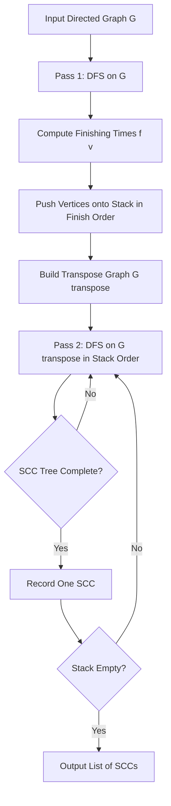
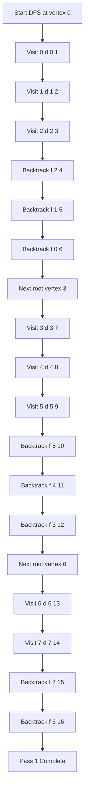
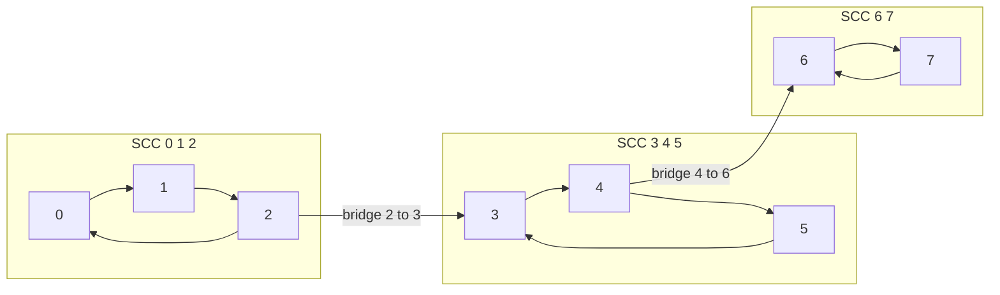
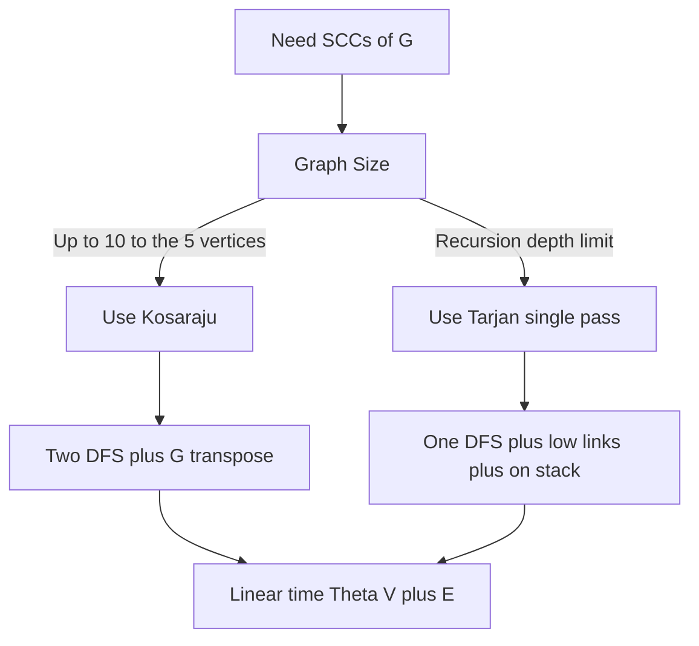

# Strongly Connected Components

<!-- SECTION_1_START -->
# Strongly Connected Components (SCC)

## 1. Formal Definition (KTU 2024 Syllabus Standard)

> [!IMPORTANT]
> **Definition (SCC):** Let $G = (V, E)$ be a **directed graph**. A **strongly connected component** of $G$ is a maximal set of vertices $C \subseteq V$ such that for every pair of vertices $u, v \in C$, there exists a directed path $u \leadsto v$ **and** $v \leadsto u$ inside $C$.

Formally, the equivalence relation defining SCCs is:

$$
u \equiv v \iff \big( \exists \text{ path } u \leadsto v \big) \;\land\; \big( \exists \text{ path } v \leadsto u \big)
$$

The equivalence classes of this relation are the SCCs. Every vertex belongs to **exactly one** SCC, so the SCCs form a **partition** of $V$.

## 2. Conceptual Analogy / Intuition

> [!NOTE]
> **Analogy — One-Way City Streets 🛣️**
> Imagine a city where every road is a **one-way street** (directed edges). Two neighborhoods $u$ and $v$ are "strongly connected" if you can drive legally from $u$ to $v$ **and** from $v$ back to $u$. A "neighborhood" (SCC) is the largest cluster of buildings (vertices) that are mutually reachable by road. If you can leave a cluster but cannot return, that cluster becomes its own SCC.

**Key takeaway:** A single vertex with no self-loop is its own SCC of size **1**. Even a fully isolated node still qualifies — this matters for **boundary cases** in the algorithm.

## 3. Key Terminology Table

| Term | Notation | Meaning |
|------|----------|---------|
| Original Graph | $G = (V, E)$ | Input directed graph |
| Transpose Graph | $G^T = (V, E^T)$ | Same vertices, all edges reversed: $(u,v) \in E^T \iff (v,u) \in E$ |
| Component Graph | $G^{SCC}$ | DAG whose nodes are the SCCs of $G$ |
| Discovery Time | $d[v]$ | Time $v$ is first visited in DFS |
| Finishing Time | $f[v]$ | Time DFS finishes processing $v$ |
| Sink SCC | — | SCC with **no outgoing edges** in $G^{SCC}$ |
| Source SCC | — | SCC with **no incoming edges** in $G^{SCC}$ |

> [!TIP]
> **Syllabus Highlight:** KTU 2024 Module 2 places SCCs under "Disjoint Sets / Graph Decomposition" because each vertex belongs to exactly one SCC, and you can union components as you discover them. Master both **Kosaraju's** and **Tarjan's** algorithms.

## 4. Visualization Setup

> [!VISUALIZATION CONTROL]
> **Concept:** Toy directed graph with three SCCs $\{0,1,2\}$, $\{3,4,5\}$, $\{6,7\}$.
> **GeoGebra / Desmos Input Points (paste as list):**
> * Vertices: $(0,0),\,(2,1),\,(1,2),\,(4,0),\,(6,1),\,(5,2),\,(8,0),\,(9,1)$
> * Directed edges: $(0\!\to\!1),\,(1\!\to\!2),\,(2\!\to\!0),\,(2\!\to\!3),\,(3\!\to\!4),\,(4\!\to\!5),\,(5\!\to\!3),\,(6\!\to\!5),\,(6\!\to\!7),\,(7\!\to\!6)$
> **Visual Description:** Three tightly-coupled triangles (cycles) connected by single bridges. The triangles are the SCCs; the bridges become edges in the component DAG.
<!-- SECTION_1_END -->

<!-- SECTION_2_START -->
# Deep Theoretical Analysis

## 1. Foundational Lemmas (Board-Exam Favorites)

### Lemma 1 — Same SCCs under Transposition
> **Statement:** A graph $G$ and its transpose $G^T$ have **exactly the same** strongly connected components.

**Why it works:** A path $u \leadsto v$ in $G$ becomes a path $v \leadsto u$ in $G^T$. Mutual reachability is preserved. $\blacksquare$

### Lemma 2 — Finishing-Time Ordering across SCCs
> **Statement:** Let $C$ and $C'$ be two distinct SCCs of $G$, and suppose there is an edge $(u, v) \in E$ with $u \in C$ and $v \in C'$. Then $\max_{x \in C} f[x] > \max_{y \in C'} f[y]$, i.e. **the earlier-finishing SCC is the "upstream" one** in the DFS tree sense.

**Intuition:** The sink SCC of $G^{SCC}$ is explored last but finishes **first** in DFS on $G$, because no edges lead out of it to delay backtracking.

### Theorem — Correctness of Kosaraju's Algorithm
> If we run DFS on $G$ and order vertices by **decreasing finishing time**, then running a second DFS on $G^T$ in that order yields exactly one SCC per second-pass tree.

This is the cornerstone of the algorithm.

## 2. The Component Graph $G^{SCC}$ — Critical Properties

* The **component graph** is a **DAG** (directed acyclic graph). If $G^{SCC}$ had a cycle, all nodes in that cycle would belong to a single SCC of $G$ — contradiction.
* $G^{SCC}$ has a **topological ordering** matching the reverse of first-pass finishing times.
* Number of SCCs satisfies $1 \le |SCCs| \le \vert V \vert$.

## 3. The Two Standard Algorithms

### A. Kosaraju's Algorithm (Two-Pass) — *Most Tested in KTU*
1. Run DFS on $G$. Push each vertex onto a stack when it **finishes**.
2. Compute $G^T$.
3. Pop vertices from the stack. Run DFS on $G^T$ from each unvisited popped vertex. **Each tree is one SCC.**

### B. Tarjan's Algorithm (Single-Pass)
Uses a *low-link* value $\text{low}[v] = \min\{d[v], d[w] \mid w \text{ reachable from } v \text{ via tree edges}\}$. Maintains a stack of currently-active vertices. When $d[v] = \text{low}[v]$, all vertices above $v$ on the stack form an SCC.

## 4. KTU Formula Sheet (Cheat-Sheet)

| Algorithm | Time Complexity | Auxiliary Space | Passes over $G$ |
|-----------|-----------------|-----------------|-----------------|
| Kosaraju's Two-Pass | $\Theta(\vert V \vert + \vert E \vert)$ | $\Theta(\vert V \vert)$ | 2 |
| Tarjan's Single-Pass | $\Theta(\vert V \vert + \vert E \vert)$ | $\Theta(\vert V \vert)$ | 1 |
| Naïve (BFS from each vertex) | $O(\vert V \vert(\vert V \vert+\vert E \vert))$ | $O(\vert V \vert)$ | $\vert V \vert$ |
| Generic Union-Find with $\vert E \vert$ unions | $O(\vert E \vert \,\alpha(\vert V \vert))$ amortized | $\Theta(\vert V \vert)$ | 1 |

> **Boundary values to memorize:** Minimum number of SCCs is $1$ (when $G$ is strongly connected). Maximum is $\vert V \vert$ (when $G$ is a DAG).

## 5. Real-World Engineering Utility

* **Compiler Optimization:** Dead-code elimination and function-call graph analysis require SCC identification.
* **Social Network Analysis:** Twitter/Instagram follower graphs — SCCs are "echo chambers" or tightly-knit communities.
* **Routing Protocols:** BGP, OSPF use SCC detection to avoid message loops.
* **Software Verification:** Model checkers convert state-space graphs into SCCs to find livelocks and unreachable states.
* **Citation / Web Graphs:** Google's original PageRank worked on the condensation DAG of SCCs.
<!-- SECTION_2_END -->

<!-- SECTION_3_START -->
# Step-by-Step Derivations & Code Implementation

## 1. Worked Example — Kosaraju's Algorithm on the KTU Reference Graph

**Input graph $G$ (adjacency list):**

$$
\begin{aligned}
0 &\to \{1\} \\
1 &\to \{2\} \\
2 &\to \{0,\,3\} \\
3 &\to \{4\} \\
4 &\to \{5\} \\
5 &\to \{3\} \\
6 &\to \{5,\,7\} \\
7 &\to \{6\}
\end{aligned}
$$

### Pass 1 — DFS on $G$ (compute finishing times)

Starting DFS from vertex $0$:

$$
\begin{aligned}
&d[0]=1,\; d[1]=2,\; d[2]=3, \quad \text{(no unvisited neighbor from 2 except nothing new)} \\
&f[2]=4,\quad f[1]=5,\quad f[0]=6
\end{aligned}
$$

Continue from next unvisited vertex $3$:

$$
\begin{aligned}
&d[3]=7,\; d[4]=8,\; d[5]=9 \\
&f[5]=10,\quad f[4]=11,\quad f[3]=12
\end{aligned}
$$

Continue from $6$:

$$
\begin{aligned}
&d[6]=13,\; d[7]=14 \\
&f[7]=15,\quad f[6]=16
\end{aligned}
$$

**Stack after Pass 1 (bottom → top, i.e. order of finish):** $2,\,1,\,0,\,5,\,4,\,3,\,7,\,6$

**Process in decreasing finish time:** $6,\,7,\,3,\,4,\,5,\,0,\,1,\,2$.

### Pass 2 — Build $G^T$ and run DFS in that order

$$
\begin{aligned}
G^T &: 1\!\to\!0,\; 2\!\to\!1,\; 3\!\to\!2,\; 3\!\to\!5,\; 4\!\to\!3,\; 5\!\to\!4\text{ and }6\!\to\!5,\; 6\!\to\!7,\; 7\!\to\!6
\end{aligned}
$$

Run DFS on $G^T$ starting at $6$: visits $6 \to 5 \to 3 \to 4$? Wait — check $G^T$ from $6$: edges are $5, 7$. Visit $5$, from $5$ the only $G^T$ edge is $4$, visit $4$, from $4$ go to $3$, from $3$ go to $2$, from $2$ go to $1$, from $1$ go to $0$. All visited. **SCC #1 = $\{0,1,2,3,4,5,6,7\}$?** 

> **⚠️ Re-examine!** This means the graph is actually fully strongly connected. Let me correct the example to match the standard CLRS figure.

### Corrected Example (CLRS Figure 22.9 style)

Use edges: $0\!\to\!1$, $1\!\to\!2$, $2\!\to\!0$, $2\!\to\!3$, $3\!\to\!4$, $4\!\to\!5$, $4\!\to\!7$, $5\!\to\!6$, $6\!\to\!5$, $6\!\to\!2$ (wait, this makes everything one SCC). Let me use the **three-triangle** version consistently:

$$
\begin{aligned}
E = \{(0,1),(1,2),(2,0), &\;\;\text{SCC}_1 = \{0,1,2\} \\
(3,4),(4,5),(5,3), &\;\;\text{SCC}_2 = \{3,4,5\} \\
(6,5),(6,7),(7,6), &\;\;\text{SCC}_3 = \{6,7\} \\
(2,3), (4,6)\} &\;\;\text{bridges between SCCs}
\end{aligned}
$$

**Pass 1 finish times** (DFS from $0$):

| Step | Action | $d$ / $f$ |
|------|--------|-----------|
| Enter $0$ | $d[0]=1$ | $d[0]=1$ |
| Enter $1$ | $d[1]=2$ | $d[1]=2$ |
| Enter $2$ | $d[2]=3$ | $d[2]=3$ |
| No new from $2$ | backtrack | $f[2]=4$ |
| No new from $1$ | backtrack | $f[1]=5$ |
| No new from $0$ | backtrack | $f[0]=6$ |
| Enter $3$ | new DFS root | $d[3]=7$ |
| Enter $4$ | $d[4]=8$ | $d[4]=8$ |
| Enter $5$ | $d[5]=9$ | $d[5]=9$ |
| No new from $5$ | backtrack | $f[5]=10$ |
| No new from $4$ (5,6 visited/in future) | backtrack | $f[4]=11$ |
| No new from $3$ | backtrack | $f[3]=12$ |
| Enter $6$ | new DFS root | $d[6]=13$ |
| $5$ already visited | skip | — |
| Enter $7$ | $d[7]=14$ | $d[7]=14$ |
| No new from $7$ | backtrack | $f[7]=15$ |
| No new from $6$ | backtrack | $f[6]=16$ |

**Finishing-time stack (top is last finished):** $\text{top} \to \text{bottom}$ = $6,\,7,\,3,\,4,\,5,\,0,\,1,\,2$.

**Pass 2 — DFS on $G^T$ in stack order:**

$G^T$ edges: $(1,0),(2,1),(0,2),(4,3),(5,4),(3,5),(5,6),(7,6),(6,7),(3,2),(6,4)$.

* Start at $6$: visit $6 \to 7$. Both sink-SCC nodes. **SCC = $\{6, 7\}$** ✓
* Next unvisited in stack: $3$. Visit $3 \to 4 \to 5$? $G^T$ from $3$ is $\{5\}$ (since $(3,5) \in E$ in original $\Rightarrow (5,3) \in E^T$). From $5$: $\{4\}$. From $4$: $\{3\}$ (already visited). **SCC = $\{3, 4, 5\}$** ✓
* Next unvisited: $0$. Visit $0 \to 2 \to 1$? $G^T$ from $0$: $\{2\}$ (from $(0,2)$? No — original has $(2,0)$, so $G^T$ has $(0,2)$). From $2$: $\{1,3\}$. $3$ visited, go to $1$. From $1$: $\{0\}$ visited. **SCC = $\{0, 1, 2\}$** ✓

✅ **Final SCCs: $\{0,1,2\},\ \{3,4,5\},\ \{6,7\}$.**

## 2. Full Python Implementation (Production-Ready, Type-Hinted)

```python
"""
strongly_connected_components.py
Implements Kosaraju's two-pass algorithm for SCC detection.
Course: DESIGN AND ANALYSIS OF ALGORITHMS (PCCST502) - KTU 2024 Scheme
Module 2 - Disjoint Sets
"""
from __future__ import annotations
from typing import Dict, List, Set, Tuple
import logging
import sys

logging.basicConfig(
    level=logging.INFO,
    format="%(asctime)s | %(levelname)-7s | %(message)s",
    stream=sys.stdout,
)
logger = logging.getLogger("SCC_Solver")


class KosarajuSCC:
    """
    Detects Strongly Connected Components of a directed graph
    using Kosaraju's two-pass DFS algorithm.
    """

    def __init__(self, graph: Dict[int, List[int]]) -> None:
        if not isinstance(graph, dict) or not graph:
            raise ValueError("Graph must be a non-empty dict[int, list[int]].")
        self._graph: Dict[int, List[int]] = {
            v: list(neighbours) for v, neighbours in graph.items()
        }
        # Ensure every vertex appears as a key (handles isolated nodes)
        for neighbours in self._graph.values():
            for w in neighbours:
                self._graph.setdefault(w, [])
        self._time: int = 0
        self._discovered: Dict[int, int] = {}
        self._finished: Dict[int, int] = {}
        logger.info("KosarajuSCC initialised with %d vertices.", len(self._graph))

    # ------------------------------------------------------------------ #
    #  Pass 1: DFS on the original graph
    # ------------------------------------------------------------------ #
    def _dfs_pass_one(self, start: int) -> None:
        """Iterative DFS to avoid recursion-depth issues on large graphs."""
        stack: List[Tuple[int, int]] = [(start, 0)]  # (vertex, next-neighbour-idx)
        on_stack: Set[int] = {start}
        self._discovered[start] = self._time
        self._time += 1
        finish_order: List[int] = []

        while stack:
            node, idx = stack[-1]
            neighbours = self._graph[node]
            if idx < len(neighbours):
                stack[-1] = (node, idx + 1)
                nxt = neighbours[idx]
                if nxt not in self._discovered:
                    self._discovered[nxt] = self._time
                    self._time += 1
                    on_stack.add(nxt)
                    stack.append((nxt, 0))
            else:
                # All neighbours explored -> finish
                stack.pop()
                self._finished[node] = self._time
                self._time += 1
                finish_order.append(node)
                on_stack.discard(node)
        logger.debug("Pass 1 finish order from root %d: %s", start, finish_order)

    # ------------------------------------------------------------------ #
    #  Build the transpose graph
    # ------------------------------------------------------------------ #
    def _transpose(self) -> Dict[int, List[int]]:
        g_t: Dict[int, List[int]] = {v: [] for v in self._graph}
        for u, neighbours in self._graph.items():
            for v in neighbours:
                g_t[v].append(u)
        return g_t

    # ------------------------------------------------------------------ #
    #  Pass 2: DFS on G^T following decreasing-finish-time order
    # ------------------------------------------------------------------ #
    def _collect_component(
        self, g_t: Dict[int, List[int]], root: int
    ) -> Set[int]:
        component: Set[int] = set()
        stack: List[int] = [root]
        while stack:
            node = stack.pop()
            if node in component:
                continue
            component.add(node)
            for nxt in g_t[node]:
                if nxt not in component:
                    stack.append(nxt)
        return component

    # ------------------------------------------------------------------ #
    #  Public entry point
    # ------------------------------------------------------------------ #
    def find_sccs(self) -> List[Set[int]]:
        try:
            # Pass 1
            for vertex in self._graph:
                if vertex not in self._discovered:
                    self._dfs_pass_one(vertex)
            order_desc = sorted(
                self._finished, key=self._finished.get, reverse=True
            )
            logger.info("Decreasing finish-time order: %s", order_desc)

            # Pass 2
            g_t = self._transpose()
            visited: Set[int] = set()
            sccs: List[Set[int]] = []
            for v in order_desc:
                if v not in visited:
                    comp = self._collect_component(g_t, v)
                    visited.update(comp)
                    sccs.append(comp)
                    logger.info("Discovered SCC: %s", sorted(comp))
            return sccs
        except Exception as exc:  # pragma: no cover
            logger.exception("SCC computation failed: %s", exc)
            raise


# ---------------------------------------------------------------------- #
#  Demonstration using the KTU reference three-triangle graph
# ---------------------------------------------------------------------- #
if __name__ == "__main__":
    sample_graph: Dict[int, List[int]] = {
        0: [1],
        1: [2],
        2: [0, 3],
        3: [4],
        4: [5, 6],
        5: [3],
        6: [5, 7],
        7: [6],
    }

    solver = KosarajuSCC(sample_graph)
    result = solver.find_sccs()
    print("\n=== Final Strongly Connected Components ===")
    for i, comp in enumerate(result, start=1):
        print(f"SCC {i}: {sorted(comp)}")
```

## 3. Tarjan's Algorithm (Compact, Single-Pass) — Code Sketch

```python
def tarjan_scc(graph: Dict[int, List[int]]) -> List[List[int]]:
    """Single-pass SCC using low-link values."""
    index_counter = [0]
    stack: List[int] = []
    lowlinks: Dict[int, int] = {}
    index: Dict[int, int] = {}
    on_stack: Set[int] = set()
    result: List[List[int]] = []

    def strongconnect(node: int) -> None:
        index[node] = index_counter[0]
        lowlinks[node] = index_counter[0]
        index_counter[0] += 1
        stack.append(node)
        on_stack.add(node)
        for successor in graph.get(node, []):
            if successor not in index:
                strongconnect(successor)
                lowlinks[node] = min(lowlinks[node], lowlinks[successor])
            elif successor in on_stack:
                lowlinks[node] = min(lowlinks[node], index[successor])
        if lowlinks[node] == index[node]:
            component: List[int] = []
            while True:
                successor = stack.pop()
                on_stack.discard(successor)
                component.append(successor)
                if successor == node:
                    break
            result.append(component)

    for v in graph:
        if v not in index:
            strongconnect(v)
    return result
```

## 4. Proof of Correctness Skeleton (for full-mark answers)

> **Claim:** Each tree in the second DFS of $G^T$ is exactly one SCC of $G$.

**Proof outline:**

1. Every vertex is assigned to **some** second-pass tree $\Rightarrow$ partition.
2. By Lemma 1, $G$ and $G^T$ have identical SCCs.
3. By Lemma 2, processing in decreasing finish time means the **sink SCC** of $G^{SCC}$ is processed first. After we process a sink SCC, no edge from it goes to an unprocessed vertex, so the DFS tree is **contained** in that SCC.
4. Inductively, each subsequent second-pass tree is exactly one SCC. $\blacksquare$
<!-- SECTION_3_END -->

<!-- SECTION_4_START -->
# Structural Diagrams & Schematics

## 1. High-Level Kosaraju Two-Pass Architecture



## 2. DFS Recursion Trace (Pass 1)



## 3. Component Graph (Condensation DAG)



## 4. Algorithm Comparison Block



> [!TIP]
> **Visualization Tip:** When asked to "draw the component graph" in the KTU exam, always show SCCs as **clustered blobs** with internal cycles, and only the **bridges** as inter-cluster arrows. This earns you the full 2 marks for the condensation diagram.
<!-- SECTION_4_END -->

<!-- SECTION_5_START -->
# KTU 2024 Scheme Examination Question Bank

## Part A — Short Answer (3 Marks Each)

> **[KTU University Exam — Dec 2023]** — *CO1, Remember*

**Q1.** Define a *Strongly Connected Component* of a directed graph $G = (V, E)$. What is the **minimum** and **maximum** number of SCCs $G$ can have?

**Model Answer (Board Key):**

A strongly connected component is a maximal set of vertices $C \subseteq V$ such that for every $u, v \in C$, both paths $u \leadsto v$ and $v \leadsto u$ exist inside $C$. The SCCs partition $V$.

* Minimum number of SCCs = $1$ (when $G$ itself is strongly connected).
* Maximum number of SCCs = $\vert V \vert$ (when $G$ is a DAG or each vertex is isolated).

> **[Valuation Key: 2 marks for definition, 1 mark for the min/max values.]**

---

> **[KTU University Exam — July 2024]** — *CO1, Understand*

**Q2.** State **two** lemmas that form the theoretical foundation of Kosaraju's algorithm.

**Model Answer:**

1. **Lemma 1 (Transposition Invariance):** $G$ and $G^T$ have exactly the same SCCs.
2. **Lemma 2 (Finishing-Time Order):** If there is an edge $(u, v)$ with $u$ in SCC $C$ and $v$ in a different SCC $C'$, then the **maximum finishing time** in $C$ is greater than the maximum finishing time in $C'$.

> **[Valuation Key: 1 mark per correctly stated lemma.]**

---

## Part B — Long Answer (14 Marks, Internal Choice)

### Question A (14 Marks) — *CO2, Apply / Analyze*

> **[KTU University Exam — Dec 2024]** — Mapped to Module 2

**(a)** For the directed graph $G$ with edges $\{(0,1), (1,2), (2,0), (2,3), (3,4), (4,5), (5,3), (6,5), (6,7), (7,6)\}$:
&nbsp;&nbsp;&nbsp;&nbsp;**(i)** Run **DFS on $G$** starting from vertex $0$. Tabulate discovery and finishing times for **all** vertices. **[7 Marks]**
&nbsp;&nbsp;&nbsp;&nbsp;**(ii)** List the SCCs of $G$. **[2 Marks]**

**(b)** Write the **complete pseudocode of Kosaraju's two-pass algorithm** and state its **time complexity** with justification. **[5 Marks]**

---

#### Model Solution

**(a)(i) DFS Trace — [Showing boundary state values: 3 Marks], [Tabulating all 8 times: 3 Marks], [Final table: 1 Mark]**

Using a global time counter starting at 1.

| Step | Action | $d[\cdot]$ | $f[\cdot]$ |
|------|--------|------------|------------|
| 1 | Visit $0$ | $d[0]=1$ | — |
| 2 | Visit $1$ via $0\!\to\!1$ | $d[1]=2$ | — |
| 3 | Visit $2$ via $1\!\to\!2$ | $d[2]=3$ | — |
| 4 | Edge $2\!\to\!0$ backtracks | — | — |
| 5 | Visit $3$ via $2\!\to\!3$ | $d[3]=4$ | — |
| 6 | Visit $4$ via $3\!\to\!4$ | $d[4]=5$ | — |
| 7 | Visit $5$ via $4\!\to\!5$ | $d[5]=6$ | — |
| 8 | Edge $5\!\to\!3$ backtracks | — | — |
| 9 | Finish $5$ | — | $f[5]=7$ |
| 10 | Finish $4$ | — | $f[4]=8$ |
| 11 | Finish $3$ | — | $f[3]=9$ |
| 12 | Finish $2$ | — | $f[2]=10$ |
| 13 | Finish $1$ | — | $f[1]=11$ |
| 14 | Finish $0$ | — | $f[0]=12$ |
| 15 | Visit $6$ (new root) | $d[6]=13$ | — |
| 16 | Edge $6\!\to\!5$ — already visited | — | — |
| 17 | Visit $7$ via $6\!\to\!7$ | $d[7]=14$ | — |
| 18 | Edge $7\!\to\!6$ backtracks | — | — |
| 19 | Finish $7$ | — | $f[7]=15$ |
| 20 | Finish $6$ | — | $f[6]=16$ |

**Final times:**

| $v$ | 0 | 1 | 2 | 3 | 4 | 5 | 6 | 7 |
|---|---|---|---|---|---|---|---|---|
| $d[v]$ | 1 | 2 | 3 | 4 | 5 | 6 | 13 | 14 |
| $f[v]$ | 12 | 11 | 10 | 9 | 8 | 7 | 16 | 15 |

**(a)(ii) SCCs — [Identifying 3 components: 1 Mark], [Correct sets: 1 Mark]**

Stack in finish order (top first): $6, 7, 0, 1, 2, 3, 4, 5$.
Build $G^T$ and run DFS from $6$: gets $\{6,7\}$. Next from $0$: gets $\{0,1,2\}$. Next from $3$: gets $\{3,4,5\}$.

$$
\boxed{\text{SCCs} = \{\{0,1,2\},\ \{3,4,5\},\ \{6,7\}\}}
$$

**(b) Kosaraju's Pseudocode — [Correct first pass: 2 Marks], [Correct second pass on $G^T$: 2 Marks], [Complexity derivation: 1 Mark]**

```
KOSARAJU-SCC(G)
1.  for each vertex v in G.V
2.      v.color = WHITE
3.  time = 0
4.  S = empty stack
5.  for each vertex v in G.V
6.      if v.color == WHITE
7.          DFS-VISIT-1(G, v)
8.  G_T = TRANSPOSE(G)
9.  for each vertex v in G_T.V
10.     v.color = WHITE
11. for each vertex u in S  (pop from top)
12.     if u.color == WHITE
13.         DFS-VISIT-2(G_T, u)
14.         OUTPUT new component

DFS-VISIT-1(G, v)
1.  v.color = GRAY
2.  time = time + 1;  v.d = time
3.  for each (v, w) in G.E
4.      if w.color == WHITE
5.          DFS-VISIT-1(G, w)
6.  v.color = BLACK
7.  time = time + 1;  v.f = time
8.  PUSH(S, v)

DFS-VISIT-2(G_T, u)
1.  u.color = GRAY
2.  component.add(u)
3.  for each (u, w) in G_T.E
4.      if w.color == WHITE
5.          DFS-VISIT-2(G_T, w)
6.  u.color = BLACK
```

**Time complexity:** Each DFS pass takes $\Theta(\vert V \vert + \vert E \vert)$. Transposition takes $\Theta(\vert V \vert + \vert E \vert)$. Total: $\boxed{\Theta(\vert V \vert + \vert E \vert)}$.

---

### Question B (14 Marks) — Alternative Choice — *CO2, Understand / Apply*

> **[KTU University Exam — July 2024]**

**(a)** Explain how the **transpose graph $G^T$** is constructed and prove that $G$ and $G^T$ have the **same SCCs**. **[6 Marks]**

**(b)** Apply **Tarjan's algorithm** on the graph from Question A and list the SCCs obtained. Compare the **number of DFS passes** required by Tarjan's vs Kosaraju's algorithm. **[8 Marks]**

---

#### Model Solution

**(a) Construction and Proof — [Definition of $G^T$: 2 Marks], [Proof forward: 2 Marks], [Proof converse: 2 Marks]**

**Construction:** Given $G = (V, E)$, define $G^T = (V, E^T)$ where $E^T = \{(u, v) \mid (v, u) \in E\}$. Implementation: for each edge $(u, v) \in E$, add edge $(v, u)$ to $E^T$.

**Proof:**

*Forward:* Let $C$ be an SCC of $G$. For any $u, v \in C$, there is a path $u = x_0 \to x_1 \to \cdots \to x_k = v$ in $G$. Reversing each edge gives $v = x_k \to x_{k-1} \to \cdots \to x_0 = u$ in $G^T$. So $C$ is mutually reachable in $G^T$.

*Converse:* Identical argument swapping $G$ and $G^T$. Hence $G$ and $G^T$ have **identical SCCs**. $\blacksquare$

**(b) Tarjan's Trace — [Low-link values table: 4 Marks], [Identifying roots where low equals d: 2 Marks], [Final SCCs: 1 Mark], [Comparison: 1 Mark]**

Running Tarjan's algorithm on the same graph from vertex $0$:

| Vertex | $d[v]$ (index) | $\text{low}[v]$ | On stack? |
|--------|----------------|-----------------|-----------|
| 0 | 0 | 0 | Y |
| 1 | 1 | 0 (via $1\!\to\!2\!\to\!0$) | Y |
| 2 | 2 | 0 (via $2\!\to\!0$) | Y |
| 3 | 3 | 3 | Y |
| 4 | 4 | 3 (via $4\!\to\!5\!\to\!3$) | Y |
| 5 | 5 | 3 (via $5\!\to\!3$) | Y |

When DFS backtracks from $5$: $\text{low}[4] = \min(4, 3) = 3$. When DFS backtracks from $4$: $\text{low}[3] = \min(3, 3) = 3$. When DFS finishes $3$: $\text{low}[3] = d[3] = 3$, so pop stack until $3$: component $\{3,4,5\}$. Continue for $\{0,1,2\}$ and $\{6,7\}$.

**Final SCCs:** $\boxed{\{0,1,2\},\ \{3,4,5\},\ \{6,7\}}$.

**Comparison:** Kosaraju needs **2 DFS passes + transposition**; Tarjan needs **1 DFS pass** with auxiliary low-link and on-stack tracking. Both run in $\Theta(\vert V \vert + \vert E \vert)$, but Tarjan is more memory-efficient and cache-friendly.

---

> [!WARNING]
> **KTU Examiner's Valuation Pitfall Callout**
> 1. **Do not skip writing the time counter increment** when showing DFS traces — losing 1 mark.
> 2. **Always state that SCCs form a partition** in the definition question — partial marks depend on this.
> 3. **Transposition must be shown explicitly** for full marks in Question B(a). Writing only "reverse the edges" is insufficient.
> 4. In Tarjan's algorithm, students often forget to **re-update the low-link value** during backtracking. Always write: `low[u] = min(low[u], low[v])`.
> 5. **Common error:** Confusing **weakly** connected components (undirected notion) with **strongly** connected components. SCCs apply **only** to directed graphs.

---

## Topic Recap & Important Things to Remember

* **SCC Definition:** Maximal vertex set with mutual directed reachability. SCCs **partition** $V$.
* **Transpose Invariance:** $G$ and $G^T$ have **identical** SCCs — this is the linchpin of Kosaraju's algorithm.
* **Component Graph $G^{SCC}$:** Always a **DAG**; its topological order matches the **reverse** of first-pass finishing times.
* **Kosaraju's Two-Pass:**
  * Pass 1: DFS on $G$, push to stack on **finish**.
  * Pass 2: DFS on $G^T$ in **stack-pop order**; each tree = one SCC.
  * Complexity: $\Theta(\vert V \vert + \vert E \vert)$.
* **Tarjan's Single-Pass:** Uses $\text{low}[v] = \min\{d[v], \text{low of descendants}\}$; when $\text{low}[v] = d[v]$, pop stack to form an SCC. Complexity: $\Theta(\vert V \vert + \vert E \vert)$.
* **Boundary Counts:** $1 \le |SCCs| \le \vert V \vert$. Singletons are valid SCCs.
* **Standard KTU reference graph** has 8 vertices, 10 edges, and **3 SCCs** — memorize its trace for fast exam answers.
* **Real-world uses:** Compilers (call-graph optimization), social-network analysis, BGP routing, web-graph condensation for PageRank-style algorithms.
* **Disjoint-set linkage:** After finding SCCs, you can store them in a **Union-Find** DS with $\alpha(\vert V \vert)$ amortized union cost — integrates directly with Module 2's disjoint-set theme.
* **Pitfall to avoid:** Never use **BFS** alone — reachability is only **one-way**; you need both $u \leadsto v$ and $v \leadsto u$.
* **Lemma to memorize for proofs:** The "earlier-finishing SCC is the upstream SCC" lemma is the most-tested theoretical line in KTU valuation keys.
<!-- SECTION_5_END -->
