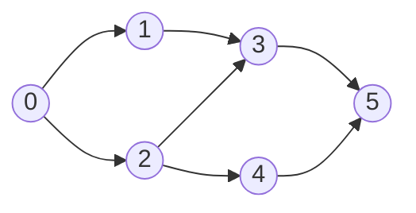
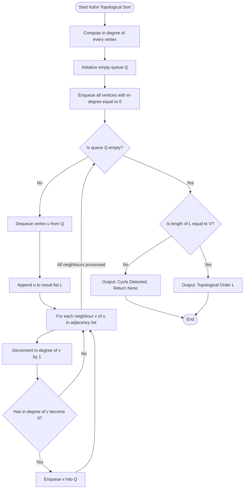
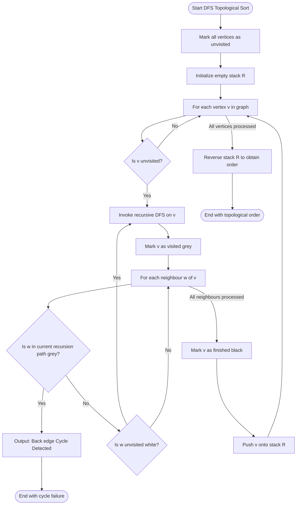
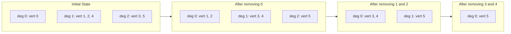

# Topological Sorting

<!-- SECTION_1_START -->

# Topological Sorting

## Formal Definition

> [!NOTE]
> **Topological Sorting** is a linear ordering of the vertices of a **Directed Acyclic Graph (DAG)** such that for every directed edge $(u, v)$ in the graph, the vertex $u$ appears *before* $v$ in the ordering.

Formally, given a DAG $G = (V, E)$, a topological sort is a permutation $\sigma$ of the vertices $V$ such that for every directed edge $(u, v) \in E$, the position of $u$ in $\sigma$ is strictly less than the position of $v$:

$$\forall (u, v) \in E : \text{pos}(u) < \text{pos}(v)$$

**Key Terminology (KTU Syllabus Standard):**

- **Directed Acyclic Graph (DAG):** A directed graph with no directed cycles. Topological sort **exists if and only if** the input graph is a DAG.
- **In-degree:** The number of incoming edges to a vertex, denoted $\text{indeg}(v)$. Vertices with $\text{indeg}(v) = 0$ are *source vertices* with no prerequisites.
- **Partial Order:** A DAG defines a *partial* order — not every pair of vertices is comparable, so multiple valid topological orderings may exist.
- **Source Vertex:** A vertex $v$ with $\text{indeg}(v) = 0$. These always appear first in any topological order.

> [!IMPORTANT]
> **Existence Theorem:** A directed graph admits a topological ordering **if and only if** it is a DAG. The standard KTU board statement: *"Topological sort is possible only for Directed Acyclic Graphs; if a cycle is present, no such linear ordering exists."*

## Conceptual Analogy

> [!TIP]
> **Real-World Analogy — KTU Course Prerequisites:**
> Consider your B.Tech curriculum. To register for *Design and Analysis of Algorithms* (Semester 5), you must have completed *Data Structures* (Semester 3) and *Discrete Mathematical Structures* (Semester 2). Before Data Structures, you need *Programming in C*. Topological sorting is exactly the process of producing a valid semester-wise registration order: $C \to DMS \to DS \to DAA$, ensuring no course is taken before its prerequisites.

**Geometric Intuition:** Imagine a *build system* like `make` or `gradle` compiling your project. The file `main.cpp` depends on `utils.h`; `utils.h` depends on `constants.h`. The compiler must process them in the order: `constants.h` $\to$ `utils.h` $\to$ `main.cpp`. This dependency-respecting linearization *is* topological sorting.

> [!VISUALIZATION CONTROL]
> **Concept:** Topological ordering visualized on a layered DAG
> **GeoGebra / Desmos Input Equations (Vertex Coordinates):**
> * Layer 0: $A = (0, 0)$
> * Layer 1: $B = (2, 1)$, $C = (2, -1)$
> * Layer 2: $D = (4, 0)$
> * Layer 3: $E = (6, 0)$
> **Directed Edges:** $A \to B$, $A \to C$, $B \to D$, $C \to D$, $D \to E$
> **Visual Description:** A graph plotted on the Cartesian plane where each layer corresponds to one "time step" in the topological order. All edges point left-to-right (or top-to-bottom). A valid topological ordering is $A, B, C, D, E$ — the student should observe that no edge ever points *backward* in the sequence.

<!-- SECTION_1_END -->

<!-- SECTION_2_START -->

# Deep Theoretical Analysis

## Algorithmic Strategies

Two principal algorithms produce a topological order. Both share the same asymptotic complexity but differ in data structures and insight.

### Strategy 1: Kahn's Algorithm (BFS-based / Source Removal)

The algorithm repeatedly identifies and removes **source vertices** (those with zero in-degree). Removing a source cannot invalidate the acyclicity property of the remaining graph.

**Operational Logic — Step by Step:**

1. **Compute in-degrees** for every vertex $v \in V$ by scanning all edges.
2. **Initialize a queue** $Q$ with all vertices $v$ such that $\text{indeg}(v) = 0$.
3. **Initialize an empty list** $L$ (the topological order).
4. **While $Q$ is not empty:**
   a. Dequeue a vertex $u$ from $Q$.
   b. Append $u$ to $L$.
   c. For each neighbor $v$ of $u$ (i.e., each edge $u \to v$):
      - Decrement $\text{indeg}(v)$ by $1$.
      - If $\text{indeg}(v)$ becomes $0$, enqueue $v$.
5. **Cycle Check:** If $\vert L \vert < \vert V \vert$, the graph contains a cycle. Otherwise, $L$ is a valid topological ordering.

### Strategy 2: Depth-First Search (DFS) based

A DFS explores each path to completion before backtracking. The trick: **record a vertex into the order only after all its descendants have been fully explored**. Reversing this *finish-time* list yields a topological order.

**Operational Logic — Step by Step:**

1. Maintain a **visited set** $S$ and an **empty stack** $R$ (result).
2. For every vertex $u \in V$:
   a. If $u \notin S$, call $\text{DFS}(u)$.
3. **$\text{DFS}(u)$:**
   a. Mark $u$ as visited.
   b. For each neighbor $v$ of $u$ (each edge $u \to v$):
      - If $v \notin S$, recursively call $\text{DFS}(v)$.
      - If $v$ is in the *current recursion stack*, a **back-edge** exists $\Rightarrow$ cycle detected.
   c. **Push $u$ onto $R$** (this is the "post-visit" step).
4. The final topological order is the **reverse of $R$** (pop in order).

> [!IMPORTANT]
> **Why does DFS work?** In a DAG, every edge $u \to v$ means there is a path from $u$ to $v$. DFS will always finish exploring $v$ *before* $u$ (because we return to $u$ only after $v$'s subtree is exhausted). Hence $v$ gets pushed onto the stack first, and popping in reverse places $u$ before $v$ — exactly the topological property.

## KTU High-Yield Formula Sheet

| Aspect | Kahn's Algorithm (BFS) | DFS-based Algorithm |
| :--- | :--- | :--- |
| **Core Idea** | Repeatedly remove in-degree zero vertices | Record vertices in reverse finish-time of DFS |
| **Primary Data Structure** | Queue (FIFO) + In-degree array | Stack (LIFO) + Visited array + Recursion stack |
| **In-degree Computation** | Required ($\Theta(V + E)$) | Not required |
| **Time Complexity** | $O(V + E)$ | $O(V + E)$ |
| **Space Complexity** | $O(V)$ for queue, in-degrees, result | $O(V)$ for visited array, stack, recursion |
| **Cycle Detection Method** | Check if final result length $< \vert V \vert$ | Detect back-edge (grey-to-grey in 3-color DFS) |
| **Order of Output** | Naturally in topological order | Must reverse the stack at the end |
| **Stability** | Stable w.r.t. insertion order of $Q$ | Stable w.r.t. adjacency list order |

**Boundary Conditions & Edge Cases:**

- **Empty graph** ($V = 0$): Trivially sorted; result is the empty list.
- **Single vertex** ($V = 1$, no edges): That vertex is the only valid order.
- **Disconnected components:** Both algorithms handle them naturally — components are processed independently as their source vertices become available (Kahn's) or as DFS reaches them.
- **Multiple valid orderings:** Any vertex with in-degree $0$ at step $k$ may legally be chosen next, yielding different but equally valid orders.

> [!TIP]
> **Engineering Utility:** Topological sorting is the algorithmic backbone of:
> - **Build systems:** `make`, `maven`, `npm`, `cargo` — compile dependencies in correct order.
> - **Package managers:** Resolving dependency trees in `apt`, `pip`, `npm install`.
> - **Course scheduling:** University curriculum planners and KTU's Choice-Based Credit System.
> - **Spreadsheet engines:** Evaluating cell formulas that reference other cells.
> - **Deadlock detection:** In operating systems, a cycle in the resource allocation graph signals deadlock.
> - **Instruction scheduling:** Compilers reorder instructions respecting data dependencies.
> - **Linker symbol resolution:** ELF/PE linkers resolve symbols in dependency order.

<!-- SECTION_2_END -->

<!-- SECTION_3_START -->

# Step-by-Step Derivations & Symbolic Implementation

## Reference Graph (Used Throughout)

To make derivations concrete, consider this DAG with 6 vertices and 7 edges:

$$V = \{0, 1, 2, 3, 4, 5\}$$
$$E = \{(0, 1), (0, 2), (1, 3), (2, 3), (2, 4), (3, 5), (4, 5)\}$$

The graph is acyclic (verifiable: following any edge moves toward higher numerical labels). **In-degree computation:**

| Vertex $v$ | 0 | 1 | 2 | 3 | 4 | 5 |
| :--- | :---: | :---: | :---: | :---:: | :---: | :---: |
| $\text{indeg}(v)$ | 0 | 1 | 1 | 2 | 1 | 2 |

## Exhaustive Walkthrough — Kahn's Algorithm

**Initialization:**

$$Q = [\,0\,], \quad L = [\,]$$

The only source vertex is $0$, so $Q$ starts with one element.

**Iteration 1:** Dequeue $u = 0$.

$$L = [\,0\,]$$

Process neighbors of $0$: vertices $1$ and $2$.

$$\text{indeg}(1): 1 \to 0 \quad \Rightarrow \quad Q = [\,1\,]$$
$$\text{indeg}(2): 1 \to 0 \quad \Rightarrow \quad Q = [\,1, 2\,]$$

**Iteration 2:** Dequeue $u = 1$.

$$L = [\,0, 1\,]$$

Process neighbor of $1$: vertex $3$.

$$\text{indeg}(3): 2 \to 1 \quad \text{(not zero, do not enqueue)}$$

$$Q = [\,2\,]$$

**Iteration 3:** Dequeue $u = 2$.

$$L = [\,0, 1, 2\,]$$

Process neighbors of $2$: vertices $3$ and $4$.

$$\text{indeg}(3): 1 \to 0 \quad \Rightarrow \quad Q = [\,3\,]$$
$$\text{indeg}(4): 1 \to 0 \quad \Rightarrow \quad Q = [\,3, 4\,]$$

**Iteration 4:** Dequeue $u = 3$.

$$L = [\,0, 1, 2, 3\,]$$

Process neighbor of $3$: vertex $5$.

$$\text{indeg}(5): 2 \to 1 \quad \text{(not zero)}$$

$$Q = [\,4\,]$$

**Iteration 5:** Dequeue $u = 4$.

$$L = [\,0, 1, 2, 3, 4\,]$$

Process neighbor of $4$: vertex $5$.

$$\text{indeg}(5): 1 \to 0 \quad \Rightarrow \quad Q = [\,5\,]$$

**Iteration 6:** Dequeue $u = 5$.

$$L = [\,0, 1, 2, 3, 4, 5\,]$$

No neighbors to process. $Q$ becomes empty.

**Final Verification:** $\vert L \vert = 6 = \vert V \vert$, so no cycle.

$$\boxed{\text{Topological Order: } 0, 1, 2, 3, 4, 5}$$

## Exhaustive Walkthrough — DFS-based Algorithm

We perform DFS from vertex $0$, following the adjacency list order $[1, 2]$ for vertex $0$, $[3]$ for vertex $1$, $[3, 4]$ for vertex $2$, $[5]$ for vertex $3$, $[5]$ for vertex $4$, and $[]$ for vertex $5$.

**Step 1:** $\text{DFS}(0)$. Mark $0$ visited. Visit $1$.

**Step 2:** $\text{DFS}(1)$. Mark $1$ visited. Visit $3$.

**Step 3:** $\text{DFS}(3)$. Mark $3$ visited. Visit $5$.

**Step 4:** $\text{DFS}(5)$. Mark $5$ visited. No neighbors. **Push $5$ to $R$.** Return.

**Step 5:** Back in $\text{DFS}(3)$. No more neighbors. **Push $3$ to $R$.** Return.

**Step 6:** Back in $\text{DFS}(1)$. No more neighbors. **Push $1$ to $R$.** Return.

**Step 7:** Back in $\text{DFS}(0)$. Visit next neighbor $2$.

**Step 8:** $\text{DFS}(2)$. Mark $2$ visited. Visit $3$ (already finished, skip). Visit $4$.

**Step 9:** $\text{DFS}(4)$. Mark $4$ visited. Visit $5$ (already finished, skip). No more neighbors. **Push $4$ to $R$.** Return.

**Step 10:** Back in $\text{DFS}(2)$. No more neighbors. **Push $2$ to $R$.** Return.

**Step 11:** Back in $\text{DFS}(0)$. No more neighbors. **Push $0$ to $R$.** Return.

**Resulting stack** $R = [\,5, 3, 1, 4, 2, 0\,]$.

**Reverse $R$ to obtain topological order:**

$$\boxed{\text{Topological Order: } 0, 2, 4, 1, 3, 5}$$

Note this is a *different but equally valid* topological order compared to Kahn's output — a clear demonstration that topological orderings are generally **not unique**.

## Algorithmic Complexity Derivation

**For Kahn's Algorithm:**

- In-degree computation: scans every edge once and touches every vertex $\Rightarrow \Theta(V + E)$.
- Each vertex is enqueued and dequeued at most once: $\Theta(V)$.
- Each edge is processed exactly once when its source is removed: $\Theta(E)$.
- **Total:** $T(n) = \Theta(V) + \Theta(E) + \Theta(V) + \Theta(E) = \Theta(V + E)$.

**For DFS-based Algorithm:**

- Adjacency list construction: $\Theta(V + E)$.
- Each vertex is visited once; each edge is examined once during DFS: $\Theta(V + E)$.
- Stack push/pop: $\Theta(V)$.
- **Total:** $T(n) = \Theta(V + E)$.

## Production-Grade Python Implementation

```python
from collections import deque
from typing import Dict, List, Optional, Tuple


def topological_sort_kahn(
    num_vertices: int,
    edges: List[Tuple[int, int]]
) -> Optional[List[int]]:
    """
    Performs topological sort using Kahn's algorithm (BFS-based).
    Returns None if the input graph contains a directed cycle.

    Parameters
    ----------
    num_vertices : int
        The number of vertices V in the directed graph. Must be non-negative.
    edges : List[Tuple[int, int]]
        Directed edges as (source, destination) tuples. Vertices are
        expected to be integers in the range [0, num_vertices - 1].

    Returns
    -------
    Optional[List[int]]
        A list representing a valid topological ordering, or
        None if a cycle is detected.
    """
    # --- Defensive boundary checks ---
    if num_vertices < 0:
        raise ValueError("Number of vertices cannot be negative.")
    if num_vertices == 0:
        return []

    # --- Step 1: Build adjacency list and in-degree counter ---
    adjacency: Dict[int, List[int]] = {v: [] for v in range(num_vertices)}
    in_degree: Dict[int, int] = {v: 0 for v in range(num_vertices)}

    for source, destination in edges:
        if not (0 <= source < num_vertices) or not (0 <= destination < num_vertices):
            raise ValueError(
                f"Edge ({source}, {destination}) references a vertex "
                f"outside the valid range [0, {num_vertices - 1}]."
            )
        adjacency[source].append(destination)
        in_degree[destination] += 1

    # --- Step 2: Enqueue all source vertices (in-degree zero) ---
    queue: deque = deque(v for v in range(num_vertices) if in_degree[v] == 0)

    if not queue:
        return None  # No source vertex implies an immediate cycle

    # --- Step 3: Repeatedly remove sources and update in-degrees ---
    topological_order: List[int] = []

    while queue:
        current_vertex: int = queue.popleft()
        topological_order.append(current_vertex)

        for neighbour in adjacency[current_vertex]:
            in_degree[neighbour] -= 1
            if in_degree[neighbour] == 0:
                queue.append(neighbour)

    # --- Step 4: Cycle detection ---
    if len(topological_order) != num_vertices:
        return None  # Cycle exists; not all vertices were processed

    return topological_order


def topological_sort_dfs(
    num_vertices: int,
    edges: List[Tuple[int, int]]
) -> Optional[List[int]]:
    """
    Performs topological sort using the DFS-based (finish-time) algorithm.
    Returns None if the input graph contains a directed cycle.

    Parameters
    ----------
    num_vertices : int
        The number of vertices V in the directed graph.
    edges : List[Tuple[int, int]]
        Directed edges as (source, destination) tuples.

    Returns
    -------
    Optional[List[int]]
        A list representing a valid topological ordering, or
        None if a cycle is detected.
    """
    if num_vertices < 0:
        raise ValueError("Number of vertices cannot be negative.")
    if num_vertices == 0:
        return []

    # --- Build adjacency list ---
    adjacency: Dict[int, List[int]] = {v: [] for v in range(num_vertices)}
    for source, destination in edges:
        if not (0 <= source < num_vertices) or not (0 <= destination < num_vertices):
            raise ValueError(
                f"Edge ({source}, {destination}) references a vertex "
                f"outside the valid range [0, {num_vertices - 1}]."
            )
        adjacency[source].append(destination)

    # --- 3-color DFS state ---
    # 0 = unvisited (white), 1 = in current recursion path (grey),
    # 2 = fully explored (black)
    color: List[int] = [0] * num_vertices
    finish_stack: List[int] = []
    has_cycle: bool = False

    def dfs(vertex: int) -> None:
        nonlocal has_cycle
        if has_cycle:
            return
        color[vertex] = 1  # Mark grey: in current DFS path
        for neighbour in adjacency[vertex]:
            if color[neighbour] == 0:
                dfs(neighbour)
            elif color[neighbour] == 1:
                has_cycle = True  # Back edge: cycle!
                return
        color[vertex] = 2  # Mark black: fully explored
        finish_stack.append(vertex)  # Post-order push

    for vertex in range(num_vertices):
        if color[vertex] == 0:
            dfs(vertex)
            if has_cycle:
                return None

    # Reverse the finish stack to obtain topological order
    return finish_stack[::-1]


# --- Demonstration on the reference graph ---
if __name__ == "__main__":
    V_REF: int = 6
    E_REF: List[Tuple[int, int]] = [
        (0, 1), (0, 2), (1, 3), (2, 3), (2, 4), (3, 5), (4, 5)
    ]

    kahn_result = topological_sort_kahn(V_REF, E_REF)
    print(f"Kahn's order   : {kahn_result}")   # Expected: [0, 1, 2, 3, 4, 5]

    dfs_result = topological_sort_dfs(V_REF, E_REF)
    print(f"DFS-based order: {dfs_result}")    # Expected: [0, 2, 4, 1, 3, 5]

    # Cycle demonstration
    cyclic_edges: List[Tuple[int, int]] = [(0, 1), (1, 2), (2, 0)]
    print(f"Cyclic Kahn    : {topological_sort_kahn(3, cyclic_edges)}")
    print(f"Cyclic DFS     : {topological_sort_dfs(3, cyclic_edges)}")
```

<!-- SECTION_3_END -->

<!-- SECTION_4_START -->

# Structural Diagrams & Schematics

## Diagram 1: Reference DAG Structure



*Visual Note: A directed acyclic graph with 6 vertices. Notice all arrows point from lower-numbered to higher-numbered vertices, confirming acyclicity.*

## Diagram 2: Kahn's Algorithm Control Flow



## Diagram 3: DFS-based Topological Sort Sequence



## Diagram 4: In-degree Evolution During Kahn's Execution



## Diagram 5: Comparison Matrix of Both Algorithms

```mermaid
flowchart TB
    subgraph KAHN[Kahn BFS Algorithm]
        K1[Input: Directed Graph G]
        K2[Compute in-degrees: O of V plus E]
        K3[Initialize queue with sources]
        K4[Loop: dequeue, append, decrement neighbours]
        K5{Result size equals V?}
        K6[Output: Topological order]
        K7[Output: Cycle detected]
        K1 --> K2 --> K3 --> K4 --> K5
        K5 -->|Yes| K6
        K5 -->|No| K7
    end

    subgraph DFS[DFS based Algorithm]
        D1[Input: Directed Graph G]
        D2[Mark all vertices white]
        D3[For each unvisited vertex call DFS]
        D4[DFS: visit neighbours recursively]
        D5[On finish push vertex to stack]
        D6{Back edge found?}
        D7[Output: Reverse stack]
        D8[Output: Cycle detected]
        D1 --> D2 --> D3 --> D4 --> D5 --> D6
        D6 -->|No| D7
        D6 -->|Yes| D8
    end
```



<!-- SECTION_4_END -->

<!-- SECTION_5_START -->

# KTU 2024 Scheme Examination Question Bank

## Part A — Short Answer Questions (3 Marks Each)

### Question 1 (3 Marks)

> **[KTU University Exam - Dec 2023 | CO1 | Remember]**
> Define topological sorting. State the necessary and sufficient condition for its existence in a directed graph.

**Model Answer:**

> **Definition:** Topological sorting of a Directed Acyclic Graph (DAG) $G = (V, E)$ is a linear ordering $\sigma$ of its vertices such that for every directed edge $(u, v) \in E$, vertex $u$ appears *before* $v$ in the ordering. **[1 Mark]**
>
> Formally: $\forall (u, v) \in E : \text{pos}_{\sigma}(u) < \text{pos}_{\sigma}(v)$. **[1 Mark]**
>
> **Necessary and Sufficient Condition:** A directed graph admits a topological ordering **if and only if** the graph is a **Directed Acyclic Graph (DAG)**, i.e., it contains no directed cycle. **[1 Mark]**
>
> If any directed cycle $C = v_1 \to v_2 \to \ldots \to v_k \to v_1$ exists, no linear ordering can place each $v_i$ before $v_{i+1}$ simultaneously with $v_k$ before $v_1$.

---

### Question 2 (3 Marks)

> **[KTU University Exam - July 2024 | CO2 | Understand]**
> Compare Kahn's algorithm and the DFS-based approach for topological sorting. Mention the data structure used and the method of cycle detection in each.

**Model Answer:**

| Parameter | Kahn's Algorithm | DFS-based Algorithm |
| :--- | :--- | :--- |
| **Data Structure** | Queue and In-degree array **[0.5 Mark]** | Recursion stack and Visited array **[0.5 Mark]** |
| **Working Principle** | Repeatedly remove source vertices (in-degree 0) **[0.5 Mark]** | Push vertex to stack after exploring all descendants **[0.5 Mark]** |
| **Cycle Detection** | If $\vert \text{result} \vert < \vert V \vert$, cycle exists **[0.5 Mark]** | If a grey vertex is encountered via a back edge, cycle exists **[0.5 Mark]** |
| **Time Complexity** | $O(V + E)$ | $O(V + E)$ |

---

## Part B — Long Answer Questions (14 Marks with Internal Choice)

> **Module 2 Reference Note:** Topological sorting is typically covered in **Module 2** of PCCST502 (Disjoint Sets and Graph Algorithms). The 14-mark KTU ESE question tests both algorithmic knowledge and execution ability.

---

### Question A (14 Marks)

> **[KTU University Exam - July 2024 Model Question | CO2 | Apply / Analyze]**
>
> **(a)** Explain Kahn's algorithm for topological sorting with its time complexity. Apply it to find the topological order of the following DAG with vertices $V = \{A, B, C, D, E, F\}$ and edges:
> $$E = \{(A, B), (A, C), (B, D), (C, D), (D, E), (E, F)\}$$
> Show the state of the queue and result list at every step. **[7 Marks — Understand + Apply]**

**Model Answer for (a):**

**Algorithm Description (Kahn's Algorithm):** **[2 Marks]**

1. Compute the in-degree of every vertex.
2. Initialize a queue $Q$ with all vertices of in-degree $0$.
3. While $Q$ is not empty, dequeue a vertex $u$, add it to the result, and for each edge $u \to v$, decrement $\text{indeg}(v)$. If $\text{indeg}(v)$ becomes $0$, enqueue $v$.
4. If the result has fewer than $\vert V \vert$ vertices, the graph contains a cycle.

**Time Complexity:** $O(V + E)$ — each vertex and each edge is processed exactly once. **[1 Mark]**

**Step 1: In-degree Computation:** **[1 Mark]**

| Vertex | A | B | C | D | E | F |
| :--- | :---: | :---: | :---: | :---: | :---: | :---: |
| In-degree | 0 | 1 | 1 | 2 | 1 | 1 |

**Step 2: Execution Trace:** **[3 Marks]**

| Step | Action | Queue (after) | Result |
| :---: | :--- | :---: | :--- |
| 1 | $A$ is only source; enqueue $A$ | $[A]$ | $[]$ |
| 2 | Dequeue $A$; decrement $B \to 0$, $C \to 0$ | $[B, C]$ | $[A]$ |
| 3 | Dequeue $B$; decrement $D: 2 \to 1$ | $[C]$ | $[A, B]$ |
| 4 | Dequeue $C$; decrement $D: 1 \to 0$; enqueue $D$ | $[D]$ | $[A, B, C]$ |
| 5 | Dequeue $D$; decrement $E: 1 \to 0$; enqueue $E$ | $[E]$ | $[A, B, C, D]$ |
| 6 | Dequeue $E$; decrement $F: 1 \to 0$; enqueue $F$ | $[F]$ | $[A, B, C, D, E]$ |
| 7 | Dequeue $F$ | $[]$ | $[A, B, C, D, E, F]$ |

**Final Topological Order:** $\boxed{A, B, C, D, E, F}$ **[Stating final result: 1 Mark]**

---

> **(b)** Explain the DFS-based approach for topological sorting. Apply it on the *same* graph to produce an alternative topological order. Compare the time and space complexity of the DFS approach with Kahn's algorithm. **[7 Marks — Apply + Analyze]**

**Model Answer for (b):**

**DFS-based Algorithm Description:** **[2 Marks]**

Run a depth-first traversal. When the recursive call for a vertex $u$ returns (i.e., all descendants of $u$ have been fully explored), push $u$ onto a stack $R$. The reverse of the final stack $R$ is the topological order.

**Execution Trace on the Reference Graph:** **[3 Marks]**

Starting DFS from $A$, following adjacency order $[B, C]$ for $A$, $[D]$ for $B$, $[D, E]$ for $C$, $[E]$ for $D$, $[F]$ for $E$:

- $\text{DFS}(A)$ $\to$ $\text{DFS}(B)$ $\to$ $\text{DFS}(D)$ $\to$ $\text{DFS}(E)$ $\to$ $\text{DFS}(F)$: $F$ has no children $\Rightarrow$ push $F$.
- Return to $E$, push $E$.
- Return to $D$, push $D$.
- Return to $B$, push $B$.
- Back in $A$, next neighbour $C$ $\to$ $\text{DFS}(C)$: $D$ already finished, $E$ already finished $\Rightarrow$ push $C$.
- Return to $A$, push $A$.

Stack $R = [F, E, D, B, C, A]$. Reversing:

$$\boxed{\text{Topological Order (DFS): } A, C, B, D, E, F}$$

**Complexity Comparison:** **[2 Marks]**

| Metric | Kahn's Algorithm | DFS-based |
| :--- | :---: | :---: |
| Time | $O(V + E)$ | $O(V + E)$ |
| Space | $O(V)$ for queue, in-degrees, adjacency list | $O(V)$ for visited array, stack, recursion call stack |

Both are asymptotically equivalent. The choice between them is implementation-driven: Kahn's is preferred when an iterative solution is needed or when a lexicographically smallest order is desired (using a priority queue); DFS is preferred for naturally recursive problems and is easier to extend for cycle detection via 3-coloring.

---

### Question B (14 Marks — Alternative Choice)

> **[KTU University Exam - Dec 2023 Model Question | CO2, CO3 | Understand / Analyze]**
>
> **(a)** Discuss the real-world engineering applications of topological sorting. Explain how it is used in (i) build systems like `make`, and (ii) university course scheduling. **[7 Marks — Understand]**

**Model Answer for (a):**

**Definition Recap:** Topological sorting linearly orders tasks with dependencies, ensuring that every prerequisite precedes the task that depends on it. **[1 Mark]**

**Application (i) — Build Systems (`make`):** **[3 Marks]**

In a `Makefile`, each *target* (e.g., `main.o`) has *prerequisites* (e.g., `main.c utils.h`). The `make` tool represents the project as a DAG where nodes are targets and edges are dependencies. Topological sort determines the correct compilation sequence. For example, given:
```
main.o : main.c utils.h
utils.o : utils.c utils.h
app : main.o utils.o
```
The DAG yields the order: `utils.h` $\to$ `utils.c` $\to$ `utils.o` $\to$ `main.c` $\to$ `main.o` $\to$ `app`, which guarantees no file is compiled before its dependencies.

**Application (ii) — University Course Scheduling:** **[3 Marks]**

KTU's B.Tech curriculum imposes prerequisite chains (e.g., *DAA* requires *Data Structures*; *Data Structures* requires *Programming in C*). The course dependency graph is a DAG. Topological sort produces a valid semester-wise registration order satisfying all prerequisites. Beyond courses, the technique schedules examination slots ensuring no student has conflicting exams sharing prerequisite relationships.

> **[Stating each application with example: 1.5 Marks each = 3 Marks; Coherent explanation: 1 Mark]**

---

> **(b)** Design an algorithm to detect a cycle in a directed graph using topological sorting. Apply your algorithm to detect the cycle in the graph:
> $$V = \{1, 2, 3, 4, 5\}, \quad E = \{(1, 2), (2, 3), (3, 4), (4, 5), (5, 2)\}$$
> Show all steps and the state of in-degrees. **[7 Marks — Apply + Analyze]**

**Model Answer for (b):**

**Cycle Detection Algorithm (using Kahn's):** **[2 Marks]**

```
1. Compute in-degrees of all vertices.
2. Run Kahn's algorithm (BFS-based topological sort).
3. After the algorithm terminates:
       IF (length of topological result) == (number of vertices V)
              THEN graph is a DAG (no cycle)
              ELSE graph contains a directed cycle
```

The principle: in a cycle, no vertex has in-degree $0$, so the queue starts empty, or vertices on the cycle never get their in-degrees reduced to zero, leaving them unprocessed.

**Step 1: In-degree Computation:** **[1 Mark]**

| Vertex | 1 | 2 | 3 | 4 | 5 |
| :--- | :---: | :---: | :---: | :---: | :---: |
| In-degree | 0 | 2 | 1 | 1 | 1 |

**Step 2: Trace:** **[3 Marks]**

| Step | Action | Queue (after) | Result |
| :---: | :--- | :---: | :--- |
| 1 | Only source is $1$; enqueue $1$ | $[1]$ | $[]$ |
| 2 | Dequeue $1$; decrement $2: 2 \to 1$ | $[]$ | $[1]$ |
| 3 | Queue empty; algorithm halts | $[]$ | $[1]$ |

**Step 3: Cycle Verification:** **[1 Mark]**

Length of result $= 1 < \vert V \vert = 5$, so the algorithm correctly reports a cycle.

The cycle is: $\boxed{2 \to 3 \to 4 \to 5 \to 2}$ (a directed cycle of length 4) — verified by tracing the edge set. **[1 Mark]**

---

## KTU Examiner's Valuation Warning

> [!WARNING]
> **Common Pitfalls — Where Students Lose Marks:**
>
> 1. **Forgetting the in-degree computation step.** Always compute and tabulate the in-degree of every vertex before starting Kahn's algorithm. Examiners explicitly check for the initial state table. **[Lose up to 1 Mark]**
>
> 2. **Conflating the result and the queue.** When tracing, clearly distinguish between the *queue* (waiting list) and the *result/topological order* (output). A common mistake is appending the dequeued vertex to the queue instead of to the result.
>
> 3. **Skipping the cycle-detection conclusion.** Even when the trace is perfect, omitting the final check *"Is $\vert L \vert = \vert V \vert$?"* costs 1 mark. Always end with a verification statement.
>
> 4. **Using the wrong algorithm for the wrong question.** If asked for *Kahn's*, do not produce a DFS-based trace. If asked for DFS-based, you must show the *recursion tree* and the *post-order push* explicitly.
>
> 5. **In DFS-based answers, forgetting to reverse the stack.** Many students output the stack directly instead of reversing it. The reverse of the finish-stack *is* the topological order.
>
> 6. **Missing the DFS 3-coloring nuance for cycle detection.** A simple "visited" flag is insufficient for cycle detection in DFS. The 3-color scheme (white/grey/black) is required to distinguish "already explored" from "currently in recursion path".

---

## Topic Recap & Important Things to Remember

> [!IMPORTANT]
> **Rapid Revision Checklist — Topological Sorting**

- **Definition:** Linear ordering of a DAG's vertices such that for every edge $(u, v)$, $u$ precedes $v$ in the ordering. **[Core Concept]**
- **Existence:** Possible **iff** the graph is a **DAG** (no directed cycles). **[Exam Favorite]**
- **Two Algorithms:** Kahn's (BFS/source-removal) and DFS-based (finish-time reversal). Both have $O(V + E)$ time and $O(V)$ space. **[Must Know]**
- **In-degree of vertex $v$:** Number of edges entering $v$. Source vertices have $\text{indeg}(v) = 0$ and always appear first. **[KTU Definition]**
- **Kahn's Procedure:** Compute in-degrees $\to$ enqueue all sources $\to$ repeatedly dequeue, append, and decrement neighbours' in-degrees $\to$ enqueue new sources. **[Algorithm Steps]**
- **Cycle Detection (Kahn's):** If final result size $< \vert V \vert$, a cycle exists. **[Pitfall Question]**
- **DFS Procedure:** Visit vertex, recursively explore unvisited neighbours, push vertex to stack on finish, reverse stack at end. **[Algorithm Steps]**
- **Cycle Detection (DFS):** A back-edge (grey-to-grey in 3-coloring) signals a cycle. **[Pitfall Question]**
- **Multiple Valid Orderings:** A DAG may admit many distinct topological sorts; any source vertex may legally be chosen next at each step. **[Conceptual]**
- **Uniqueness:** The topological order is *unique* **iff** the DAG has a **Hamiltonian path** (visits every vertex exactly once). **[Advanced]**
- **Source vertex** = vertex with $\text{indeg}(v) = 0$. **Sink vertex** = vertex with $\text{outdeg}(v) = 0$. Sinks appear last in topological order. **[Terminology]**
- **Applications:** Build systems, package managers, course scheduling, deadlock detection, instruction scheduling, spreadsheet engines. **[Real-world]**
- **Lexicographically Smallest Order:** Use a **min-heap (priority queue)** instead of a plain queue in Kahn's algorithm. **[Enhancement]**
- **Related Concept:** **Disjoint Set Union (Union-Find)** from Module 2 is often combined with graph algorithms; topological sort itself does not require DSU but shares the theme of structural graph processing.

<!-- SECTION_5_END -->
