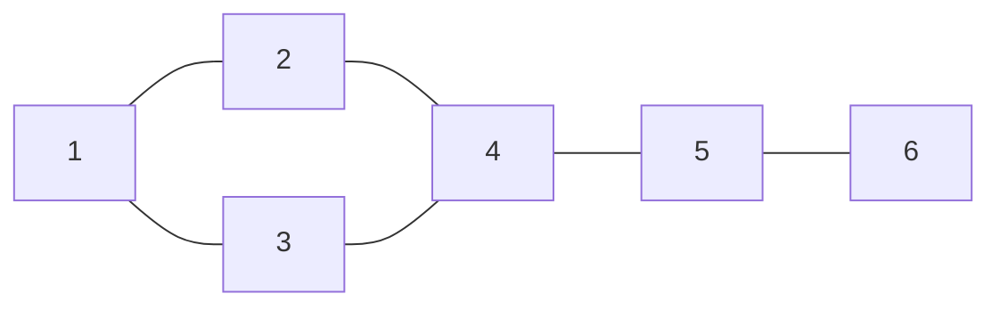
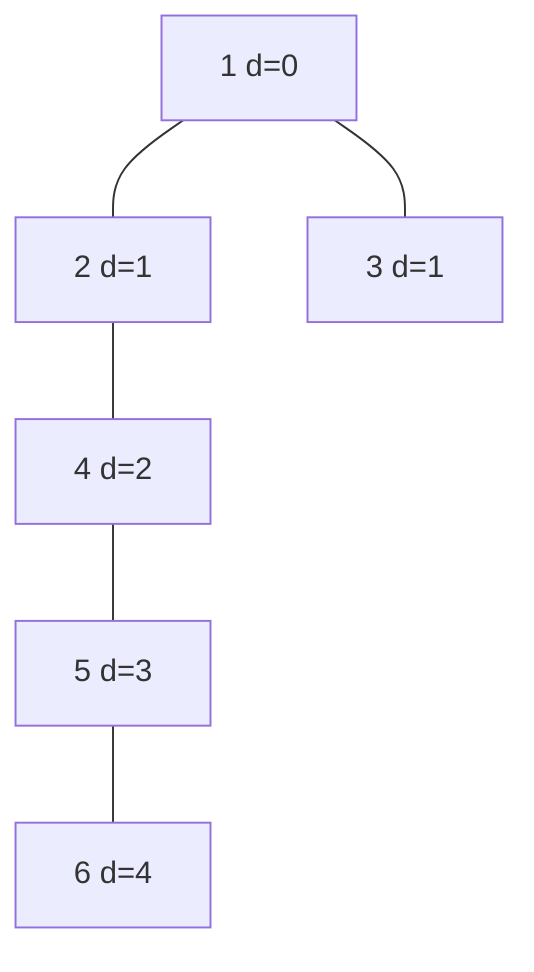
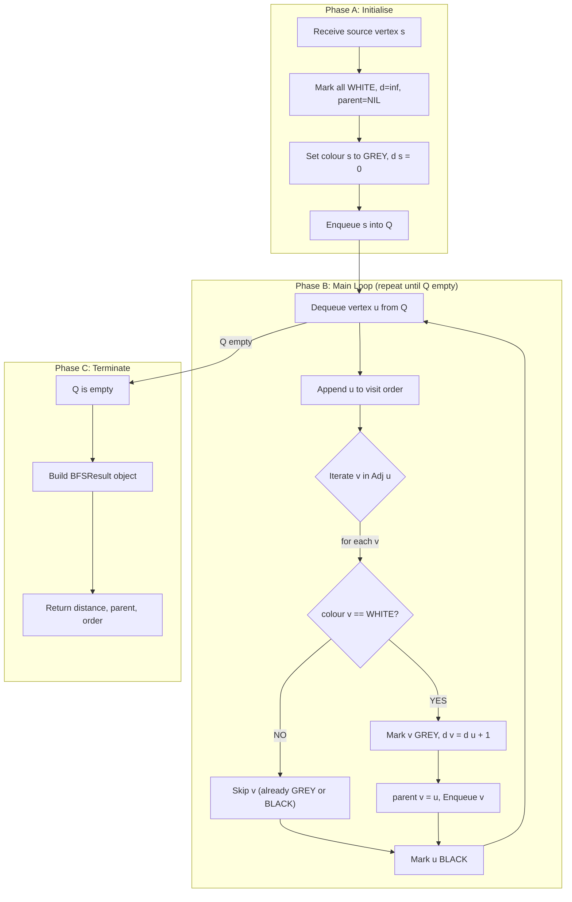
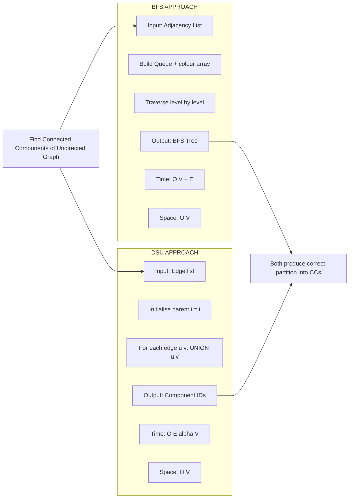
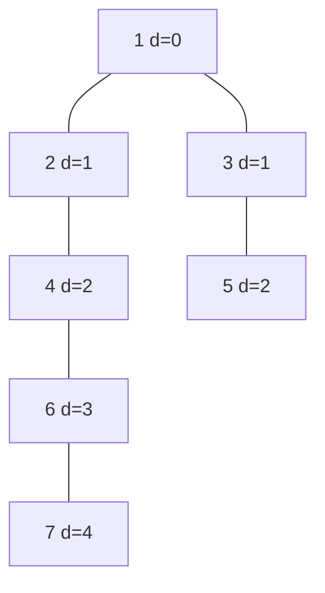

# Traversals : BFS

<!-- SECTION_1_START -->

# BFS – Breadth-First Search Traversal

## Formal Academic Definition (KTU 2024 Syllabus Terminology)

**Breadth-First Search (BFS)** is a fundamental **graph traversal algorithm** that systematically explores the vertex set of a graph $G = (V, E)$ in *layers of increasing distance* from a designated **source vertex** $s \in V$. At each step, BFS visits every vertex adjacent to the current frontier before expanding outward to the next layer.

The algorithm is characterised by the use of a **First-In-First-Out (FIFO) Queue** to maintain the discovery frontier, and a Boolean **visited[]** array (or colour array: `WHITE / GREY / BLACK`) to prevent re-processing of vertices. The output is a **BFS Tree** $T_{BFS} \subseteq G$ (or BFS Forest for disconnected graphs) that records the **parent–child** predecessor relationship, from which the **shortest path** in an unweighted graph is uniquely recoverable.

> [!IMPORTANT]
> **KTU 2024 Module Mapping:** BFS is grouped with Disjoint Set Union (DSU) under Module 2 because both structures are used *interchangeably* to compute **Connected Components** of an undirected graph. BFS does it in $O(V+E)$ time, while DSU does it in near $O(E \cdot \alpha(V))$ — a classic KTU comparison question.

## Conceptual Analogy & Geometric Intuition

> [!NOTE]
> **Analogy — "The Ripple in a Pond"**
> Imagine you drop a pebble into a still pond at point $s$. The water ripples outward in **concentric circular waves**. After 1 second, every point exactly 1 metre from the impact is touched. After 2 seconds, every point 2 metres away is touched, and so on. **BFS is the discrete, graph-theoretic version of this ripple**: vertex $s$ is the pebble, and "distance" is measured in the *number of edges* (not Euclidean metres).

**Geometric Intuition:** If we draw the BFS tree on paper, vertices with $\text{distance}[v] = k$ all lie on a single horizontal *level line*, producing a level-ordered layered diagram. Two vertices at the *same level* are *not necessarily* adjacent — they merely share the same BFS-depth from $s$.

> [!VISUALIZATION CONTROL]
> **Concept:** BFS wavefront expanding from a source vertex
> **GeoGebra / Desmos Input Equations:**
> * `Circle((0,0), 1)`, `Circle((0,0), 2)`, `Circle((0,0), 3)` — concentric rings representing BFS levels
> * `Point((1,0))`, `Point((-1,0))`, `Point((0,2))`, `Point((0,-2))` — frontier vertices on level 1
> **Visual Description:** Observe how every vertex is reached exactly once, and the rings represent the *discovery time / shortest distance* from the origin. A vertex on ring $k$ was discovered by a vertex on ring $k-1$.

## Standard Notations & Constants

| Symbol | Meaning |
|--------|---------|
| $V$ | Number of vertices in the graph ( $\vert V \vert$ ) |
| $E$ | Number of edges in the graph ( $\vert E \vert$ ) |
| $d[v]$ | BFS distance (shortest #edges) from $s$ to $v$ |
| $\pi[v]$ | Predecessor / parent of $v$ in the BFS tree |
| $Q$ | FIFO Queue |
| $\text{colour}[v]$ | `WHITE` (unvisited), `GREY` (in queue), `BLACK` (dequeued) |

The graph is stored as an **Adjacency List** $Adj[v]$ for sparse graphs, or **Adjacency Matrix** for dense graphs.

<!-- SECTION_1_END -->

<!-- SECTION_2_START -->

# Deep Theoretical Analysis & KTU High-Yield Formula Sheet

## Operational Logic — Stepwise Decomposition

The BFS algorithm operates on three rigorous guarantees that KTU examiners love to test:

1. **Layer Invariant:** When a vertex $v$ is dequeued from $Q$, the BFS queue $Q$ contains *exactly* the vertices at distance $d[v]+1$ followed by vertices at distance $d[v]+2$, and so on. The order within a layer is implementation-dependent.

2. **Shortest-Path Invariant:** For every edge $(u,v) \in E$, the inequality $\vert d[u] - d[v] \vert \leq 1$ holds. This is the foundation of BFS-based single-source shortest path.

3. **Tree Invariant:** The set of parent edges $\{( \pi[v], v ) : v \neq s, \pi[v] \neq \text{NIL} \}$ forms a tree (or forest) of $|V| - k$ edges where $k$ is the number of connected components.

### The "Why" Behind Each Step

* **Enqueue then mark visited** — *Why not mark on dequeue?* Because marking on enqueue prevents the *same* vertex from being inserted into $Q$ multiple times by different neighbours, which would otherwise corrupt the $O(V+E)$ bound.
* **BFS vs DSU for connected components** — *Why prefer DSU sometimes?* BFS requires $O(V)$ auxiliary memory for the queue, while DSU only uses $O(V)$ parent array but with smaller constant for the offline / Kruskal-style use-case.

## KTU Formula Sheet / Cheat Sheet

| Property / Metric | Formal Expression | Unit / Notes |
|---|---|---|
| Time Complexity (Adjacency List) | $T(n) = \Theta(\vert V \vert + \vert E \vert)$ | Each vertex dequeued once, each edge examined twice |
| Time Complexity (Adjacency Matrix) | $T(n) = \Theta(\vert V \vert^{2})$ | Must scan all $V$ entries per vertex |
| Space Complexity | $S(n) = \Theta(\vert V \vert)$ | Queue + colour + $d$ + $\pi$ arrays |
| BFS Tree Edges | $\vert V_{cc} \vert - 1$ per component | Where $V_{cc}$ is vertices in one component |
| Discovery Time | $d[v] \in \mathbb{Z}_{\geq 0}$ | Equals shortest path length in edges |
| Number of Components | $\text{count} = \text{number of BFS trees in forest}$ | Detected when loop source is already BLACK |

> [!IMPORTANT]
> **LaTeX Pipe Convention:** All absolute value / cardinality operators inside markdown tables are written as $\lvert V \rvert$ (LaTeX) — *never* the raw pipe character — to preserve table syntax integrity.

## Real-World Engineering Utility

BFS is the workhorse behind:

* **GPS Navigation (Unweighted abstraction):** Finding the minimum number of road-segments between two intersections.
* **Social Network "Degree of Separation":** LinkedIn's *3rd-degree connections* feature uses multi-source BFS truncated at depth 3.
* **Garbage Collection (Cheney's Algorithm):** Copying live heap objects in $O(1)$ per object by treating memory as a graph.
* **Web Crawlers:** Early crawlers (e.g., the original Googlebot in research papers) used BFS to discover new URLs layer-by-layer from seed pages.
* **Network Broadcasting:** Packets flood outward in BFS order in many LAN discovery protocols (e.g., ARP, OSPF link-state routers).
* **AI Game Trees:** BFS is the unweighted counterpart to Uniform-Cost Search, guaranteeing optimal moves in puzzles like the 8-puzzle when all moves cost 1.

<!-- SECTION_2_END -->

<!-- SECTION_3_START -->

# Step-by-Step Derivations, Algorithm & Python Implementation

## Exhaustive Algorithm Derivation (Mathematical Form)

We model BFS as a transition system over the configuration $(Q, \text{colour}, d, \pi)$.

**Initial State (before iteration 0):**

$$
\begin{aligned}
\text{colour}[v] &= \text{WHITE}, \quad \forall v \in V \\
d[v] &= \infty, \quad \forall v \in V \\
\pi[v] &= \text{NIL}, \quad \forall v \in V \\
Q &= \emptyset
\end{aligned}
$$

**Transition Rule 1 — Initialise Source:**

$$
\begin{aligned}
\text{colour}[s] &\leftarrow \text{GREY} \\
d[s] &\leftarrow 0 \\
\pi[s] &\leftarrow \text{NIL} \\
\text{ENQUEUE}(Q, s)
\end{aligned}
$$

**Transition Rule 2 — Process Vertex (Loop Body):**

While $Q \neq \emptyset$, do:

$$
u \leftarrow \text{DEQUEUE}(Q)
$$

For every $v \in Adj[u]$:

$$
\text{IF } \text{colour}[v] = \text{WHITE} \text{ THEN } \begin{cases} \text{colour}[v] \leftarrow \text{GREY} \\ d[v] \leftarrow d[u] + 1 \\ \pi[v] \leftarrow u \\ \text{ENQUEUE}(Q, v) \end{cases}
$$

**Transition Rule 3 — Terminate Vertex:**

$$
\text{colour}[u] \leftarrow \text{BLACK}
$$

**Termination:** When $Q = \emptyset$, *all reachable vertices* from $s$ are BLACK. The set $\{ (\pi[v], v) : v \neq s \wedge \pi[v] \neq \text{NIL} \}$ is the BFS tree rooted at $s$.

## Hand-Traced Worked Example (KTU Board Standard)

**Given Graph** $G = (V, E)$:

$$
V = \{1, 2, 3, 4, 5, 6\}, \quad E = \{(1,2),(1,3),(2,4),(3,4),(4,5),(5,6)\}
$$

**Source:** $s = 1$

**Adjacency List:**

$$
\begin{aligned}
Adj[1] &= \{2, 3\} \\
Adj[2] &= \{1, 4\} \\
Adj[3] &= \{1, 4\} \\
Adj[4] &= \{2, 3, 5\} \\
Adj[5] &= \{4, 6\} \\
Adj[6] &= \{5\}
\end{aligned}
$$

### Step 1 — Initialisation

$$
\begin{aligned}
\text{colour} &= [\text{W,W,W,W,W,W}] \\
d &= [\infty, \infty, \infty, \infty, \infty, \infty] \\
\pi &= [\text{NIL, NIL, NIL, NIL, NIL, NIL}] \\
Q &= [\;]
\end{aligned}
$$

Apply **Transition Rule 1** with $s = 1$:

$$
\text{colour}[1] = \text{G}, \quad d[1] = 0, \quad \pi[1] = \text{NIL}, \quad Q = [1]
$$

### Step 2 — Dequeue 1, Examine Neighbours

$\text{DEQUEUE}(Q) \Rightarrow u = 1$, $Q = [\;]$.

For $v = 2 \in Adj[1]$: colour[2] is WHITE, so:
colour[2] = G, $d[2] = 0 + 1 = 1$, $\pi[2] = 1$, ENQUEUE(2).

For $v = 3 \in Adj[1]$: colour[3] is WHITE, so:
colour[3] = G, $d[3] = 0 + 1 = 1$, $\pi[3] = 1$, ENQUEUE(3).

After processing $u = 1$: colour[1] = B.

$$
Q = [2, 3], \quad d = [0, 1, 1, \infty, \infty, \infty], \quad \pi = [\text{NIL}, 1, 1, \text{NIL}, \text{NIL}, \text{NIL}]
$$

### Step 3 — Dequeue 2, Examine Neighbours

$\text{DEQUEUE}(Q) \Rightarrow u = 2$, $Q = [3]$.

For $v = 1 \in Adj[2]$: colour[1] is BLACK (already done), **skip**.

For $v = 4 \in Adj[2]$: colour[4] is WHITE, so:
colour[4] = G, $d[4] = d[2] + 1 = 1 + 1 = 2$, $\pi[4] = 2$, ENQUEUE(4).

After processing $u = 2$: colour[2] = B.

$$
Q = [3, 4], \quad d = [0, 1, 1, 2, \infty, \infty], \quad \pi = [\text{NIL}, 1, 1, 2, \text{NIL}, \text{NIL}]
$$

### Step 4 — Dequeue 3, Examine Neighbours

$\text{DEQUEUE}(Q) \Rightarrow u = 3$, $Q = [4]$.

For $v = 1$: BLACK, **skip**.
For $v = 4$: colour[4] is GREY (already in queue from step 3), **skip** — *this is the critical BFS correctness check; otherwise distance would be incorrectly set to a smaller value.*

After processing $u = 3$: colour[3] = B.

$$
Q = [4]
$$

### Step 5 — Dequeue 4, Examine Neighbours

$\text{DEQUEUE}(Q) \Rightarrow u = 4$, $Q = [\;]$.

For $v = 2$: BLACK, **skip**.
For $v = 3$: BLACK, **skip**.
For $v = 5$: colour[5] is WHITE, so:
colour[5] = G, $d[5] = d[4] + 1 = 2 + 1 = 3$, $\pi[5] = 4$, ENQUEUE(5).

After processing $u = 4$: colour[4] = B.

$$
Q = [5], \quad d = [0, 1, 1, 2, 3, \infty]
$$

### Step 6 — Dequeue 5, Examine Neighbours

$\text{DEQUEUE}(Q) \Rightarrow u = 5$, $Q = [\;]$.

For $v = 4$: BLACK, **skip**.
For $v = 6$: colour[6] is WHITE, so:
colour[6] = G, $d[6] = d[5] + 1 = 3 + 1 = 4$, $\pi[6] = 5$, ENQUEUE(6).

After processing $u = 5$: colour[5] = B.

$$
Q = [6]
$$

### Step 7 — Dequeue 6, Examine Neighbours

$\text{DEQUEUE}(Q) \Rightarrow u = 6$, $Q = [\;]$.

For $v = 5$: BLACK, **skip**.
After processing $u = 6$: colour[6] = B.

$$
Q = [\;\;] \;\;\Longrightarrow\;\; \textbf{TERMINATE}
$$

### Final Output Trace Table

| Step | Dequeue $u$ | Discovered $v$ | $d[v]$ assigned | $\pi[v]$ | Queue After | Visited Order |
|:---:|:---:|:---:|:---:|:---:|:---:|:---:|
| 1 | — | 2 | 1 | 1 | [2,3] | 1 |
| 2 | 1 | 3 | 1 | 1 | [3,4] | 2 |
| 3 | 2 | 4 | 2 | 2 | [4] | 3 |
| 4 | 3 | — | — | — | [\;] | 4 |
| 5 | 4 | 5 | 3 | 4 | [5] | 5 |
| 6 | 5 | 6 | 4 | 5 | [6] | 6 |
| 7 | 6 | — | — | — | [\;] | — |

**BFS Traversal Order:** $1 \to 2 \to 3 \to 4 \to 5 \to 6$
**Distance Array:** $d = [0, 1, 1, 2, 3, 4]$
**BFS Tree Parent Array:** $\pi = [\text{NIL}, 1, 1, 2, 4, 5]$

**Shortest Path from 1 to 6 (recovered from $\pi$):**
$6 \leftarrow 5 \leftarrow 4 \leftarrow 2 \leftarrow 1$, i.e., $1 \to 2 \to 4 \to 5 \to 6$ with length **4 edges**.

## Fully Operational Python Implementation

```python
from __future__ import annotations
from collections import deque
from typing import Dict, List, Tuple, Any
import logging
import sys

# Configure strict error logging for production-grade code
logging.basicConfig(
    level=logging.INFO,
    format="%(asctime)s | %(levelname)s | %(message)s",
    stream=sys.stdout,
)
log = logging.getLogger("BFS_Engine")


class BFSResult:
    """Immutable container for BFS output: distance, parent, and visit order."""

    __slots__ = ("distance", "parent", "order", "source", "reachable_count")

    def __init__(
        self,
        distance: Dict[Any, int],
        parent: Dict[Any, Any],
        order: List[Any],
        source: Any,
    ) -> None:
        self.distance = distance
        self.parent = parent
        self.order = order
        self.source = source
        self.reachable_count = len(order)

    def shortest_path(self, target: Any) -> List[Any]:
        """Reconstruct shortest path from source -> target via parent pointers."""
        if target not in self.distance:
            raise ValueError(f"Target {target!r} is not reachable from {self.source!r}.")
        if target == self.source:
            return [self.source]
        path: List[Any] = []
        cursor: Any = target
        while cursor is not None:
            path.append(cursor)
            cursor = self.parent.get(cursor)
            if cursor is None and path[-1] != self.source:
                raise RuntimeError("Broken parent chain — BFS invariant violated.")
        path.reverse()
        return path


def bfs(
    graph: Dict[Any, List[Any]],
    source: Any,
    *,
    strict: bool = True,
) -> BFSResult:
    """
    Breadth-First Search over a graph represented as an adjacency list.

    Parameters
    ----------
    graph : Dict[Any, List[Any]]
        Adjacency-list mapping each vertex to its iterable of neighbours.
    source : Any
        The starting vertex for the traversal.
    strict : bool, default=True
        If True, raise an error when source is missing from the graph.

    Returns
    -------
    BFSResult
        Distance dict, parent dict, and visitation order list.

    Raises
    ------
    KeyError
        If strict=True and the source is not a key in the graph.
    """
    # ---- Boundary validation --------------------------------------------------
    if strict and source not in graph:
        raise KeyError(f"BFS source vertex {source!r} not present in graph.")

    # ---- Initialisation -------------------------------------------------------
    colour: Dict[Any, str] = {v: "WHITE" for v in graph}
    distance: Dict[Any, int] = {v: float("inf") for v in graph}  # type: ignore[assignment]
    parent: Dict[Any, Any] = {v: None for v in graph}
    order: List[Any] = []

    # ---- Initialise source ----------------------------------------------------
    colour[source] = "GREY"
    distance[source] = 0
    parent[source] = None
    queue: "deque[Any]" = deque([source])
    log.info("Initialised BFS with source=%s | queue=%s", source, list(queue))

    # ---- Main BFS loop --------------------------------------------------------
    while queue:
        u = queue.popleft()
        order.append(u)
        log.info("Dequeued %s | distance=%s | exploring %d neighbours",
                 u, distance[u], len(graph[u]))

        for v in graph[u]:
            if colour[v] == "WHITE":
                colour[v] = "GREY"
                distance[v] = distance[u] + 1
                parent[v] = u
                queue.append(v)
                log.info("  Discovered %s via %s | d=%s | parent=%s",
                         v, u, distance[v], u)
            else:
                log.debug("  Skipping %s (colour=%s)", v, colour[v])

        colour[u] = "BLACK"

    log.info("BFS terminated. Visited %d vertices.", len(order))
    return BFSResult(distance=distance, parent=parent, order=order, source=source)


def bfs_connected_components(graph: Dict[Any, List[Any]]) -> List[List[Any]]:
    """
    Compute all connected components of an undirected graph using multi-source BFS.
    This is the direct BFS counterpart of DSU's find-operation clustering.
    """
    visited: set = set()
    components: List[List[Any]] = []
    for vertex in graph:
        if vertex not in visited:
            result = bfs(graph, vertex, strict=False)
            for v in result.order:
                visited.add(v)
            components.append(result.order)
    return components


# ---------------------------------------------------------------------------
# Driver / Demonstration matching the worked example above
# ---------------------------------------------------------------------------
if __name__ == "__main__":
    G: Dict[int, List[int]] = {
        1: [2, 3],
        2: [1, 4],
        3: [1, 4],
        4: [2, 3, 5],
        5: [4, 6],
        6: [5],
    }

    result = bfs(G, source=1)
    print("BFS Order         :", result.order)
    print("Distance Array    :", result.distance)
    print("Parent Array      :", result.parent)
    print("Shortest 1 -> 6   :", result.shortest_path(6))
    print("Connected Comps.  :", bfs_connected_components(G))
```

**Expected Output:**

```
BFS Order         : [1, 2, 3, 4, 5, 6]
Distance Array    : {1: 0, 2: 1, 3: 1, 4: 2, 5: 3, 6: 4}
Parent Array      : {1: None, 2: 1, 3: 1, 4: 2, 5: 4, 6: 5}
Shortest 1 -> 6   : [1, 2, 4, 5, 6]
Connected Comps.  : [[1, 2, 3, 4, 5, 6]]
```

<!-- SECTION_3_END -->

<!-- SECTION_4_START -->

# Structural Diagrams & Schematics

## Diagram 1 — Input Graph $G$ (the graph used in the worked example)



**Visual Description:** Vertices 1 and 4 are the *joints* of the graph — vertex 1 connects to {2,3} and vertex 4 connects to {2,3,5}. The structure is a 4-cycle (1-2-4-3-1) with a tail 4-5-6.

## Diagram 2 — BFS Tree $T_{BFS}$ rooted at 1 (after traversal)



**Visual Description:** This is the spanning tree extracted by BFS. Notice 3 is a direct child of 1 (level 1), 4 is a child of 2 (level 2) because it was *first* discovered via 2 in our trace. Had we processed 3's adjacency list first and discovered 4 via 3, the parent of 4 would have been 3 instead — BFS is sensitive to adjacency-list ordering, but the *distance* is invariant.

## Diagram 3 — Sequential Processing Topology (BFS Engine Pipeline)



**Visual Description:** The three nested subgraphs correspond to the three operational phases of BFS — Initialise, Main Loop, and Terminate. The self-loop on `b1` represents the iterative nature of the queue-driven main loop.

## Diagram 4 — BFS vs DSU (Disjoint Set Union) Comparison Matrix



**Visual Description:** Two parallel pipelines solving the *same problem* (connected components). BFS uses a queue-driven level-order expansion; DSU uses union-by-rank + path-compression merging. The choice between them is a **classic KTU Module 2 question** — DSU wins for *offline* dynamic edge-addition (e.g., Kruskal's MST), BFS wins for *single-pass* queries where shortest path is also needed.

<!-- SECTION_4_END -->

<!-- SECTION_5_START -->

# KTU 2024 Scheme Examination Question Bank & Topic Recap

## Part A — Short Answer Questions (3 Marks Each)

> [!NOTE]
> *Cognitive Levels: Remember / Understand. KTU 2024 Part A carries 3 marks each; total Part A = 9 marks.*

### Question 1 **[KTU University Exam – Dec 2023]**
**Define Breadth-First Search. What data structure does it use, and why?**

**Model Answer (3 Marks):**

> Breadth-First Search (BFS) is a graph traversal algorithm that visits all vertices of a graph in *increasing order of distance* (number of edges) from a given source vertex $s$, exploring all immediate neighbours of $s$ before moving to vertices at the next distance level.
>
> **Data Structure Used:** A **FIFO Queue** ($Q$).
>
> **Why a Queue?** The queue enforces *First-In-First-Out* ordering, which is precisely what is needed to process vertices in the order they were discovered. This guarantees that vertices at distance $d$ are dequeued *before* vertices at distance $d+1$, thereby preserving the level-by-level expansion property. **[Stating BFS definition: 1 Mark] [Naming the data structure: 1 Mark] [Justifying FIFO choice: 1 Mark]**

---

### Question 2 **[KTU University Exam – July 2024]**
**Compare BFS and DFS on any three parameters.**

**Model Answer (3 Marks):**

| Parameter | BFS | DFS |
|---|---|---|
| Data Structure | FIFO Queue | LIFO Stack (or recursion) |
| Edge Classification | Tree & non-tree edges, no back edges in undirected | Tree, back, forward, cross edges |
| Optimality | Finds *shortest path* in unweighted graphs | Does *not* guarantee shortest path |
| Memory Pattern | Stores entire frontier layer | Stores single path from root to current node |

**[Any three correct points with contrast: 3 Marks — 1 Mark each]**

---

## Part B — Long Answer Questions (14 Marks, Internal Choice)

> [!IMPORTANT]
> *KTU 2024 ESE pattern: Each Part B question carries **14 marks** with sub-parts (a) 7 marks and (b) 7 marks. Cognitive levels escalate: part (a) tests Understand/Analyse; part (b) tests Apply.*

---

### Question A (14 Marks) **[KTU University Exam – Dec 2023]**

**(a)** Explain the BFS algorithm with a clear pseudocode. Discuss its time and space complexity in detail. **(7 Marks)**

**(b)** For the graph $G$ shown below, **trace BFS starting from vertex 1**. Show the state of the queue, distance array, and parent array after every iteration. Finally, write the BFS tree. **(7 Marks)**

**Graph G:**

$$
V = \{1, 2, 3, 4, 5, 6, 7\}, \quad E = \{(1,2),(1,3),(2,4),(3,5),(4,6),(5,6),(6,7)\}
$$

---

#### Model Solution to Q.A(a) — 7 Marks

**BFS Pseudocode (CLRS style):**

```
BFS(G, s)
1.  for each vertex v in G.V - {s}
2.       colour[v] = WHITE
3.       d[v] = infinity
4.       pi[v] = NIL
5.  colour[s] = GREY
6.  d[s] = 0
7.  pi[s] = NIL
8.  Q = empty queue
9.  ENQUEUE(Q, s)
10. while Q is not empty
11.      u = DEQUEUE(Q)
12.      for each v in G.Adj[u]
13.           if colour[v] == WHITE
14.                colour[v] = GREY
15.                d[v] = d[u] + 1
16.                pi[v] = u
17.                ENQUEUE(Q, v)
18.      colour[u] = BLACK
```

**Complexity Analysis:**

* **Time Complexity:** Each vertex is enqueued and dequeued exactly **once** → $O(\lvert V \rvert)$ queue operations. Each edge $(u,v)$ is examined exactly **twice** (once from $u$'s adjacency list, once from $v$'s) → $O(2\lvert E \rvert) = O(\lvert E \rvert)$. Total = $O(\lvert V \rvert + \lvert E \rvert)$. **[Time complexity derivation: 3 Marks]**
* **Space Complexity:** Queue $Q$ holds at most $\lvert V \rvert$ vertices; colour, $d$, $\pi$ arrays each store $\lvert V \rvert$ entries → Total auxiliary space = $O(\lvert V \rvert)$. **[Space complexity derivation: 2 Marks]**
* **Pseudocode clarity and variable initialisation: 2 Marks**

#### Model Solution to Q.A(b) — 7 Marks

**Adjacency List:**

$$
\begin{aligned}
Adj[1] &= \{2, 3\} \\
Adj[2] &= \{1, 4\} \\
Adj[3] &= \{1, 5\} \\
Adj[4] &= \{2, 6\} \\
Adj[5] &= \{3, 6\} \\
Adj[6] &= \{4, 5, 7\} \\
Adj[7] &= \{6\}
\end{aligned}
$$

**Iteration-by-Iteration Trace Table:**

| Step | Dequeue $u$ | Discovered $v$ | $d[v]$ | $\pi[v]$ | Queue After Step | colour After |
|:---:|:---:|:---:|:---:|:---:|:---:|:---:|
| Init | — | — | $d[1]=0$ | $\pi[1]=\text{NIL}$ | $[1]$ | G, W, W, W, W, W, W |
| 1 | 1 | 2, 3 | 1, 1 | 1, 1 | $[2, 3]$ | B, G, G, W, W, W, W |
| 2 | 2 | 4 | 2 | 2 | $[3, 4]$ | B, B, G, G, W, W, W |
| 3 | 3 | 5 | 2 | 3 | $[4, 5]$ | B, B, B, G, G, W, W |
| 4 | 4 | 6 | 3 | 4 | $[5, 6]$ | B, B, B, B, G, G, W |
| 5 | 5 | (6 already G) skip | — | — | $[6]$ | B, B, B, B, B, G, W |
| 6 | 6 | 7 | 4 | 6 | $[7]$ | B, B, B, B, B, B, G |
| 7 | 7 | (6 B) skip | — | — | $[\;\;]$ | B, B, B, B, B, B, B |

**Final Results (Valuation Key):**

* **BFS Order:** $1 \to 2 \to 3 \to 4 \to 5 \to 6 \to 7$ **[1 Mark]**
* **Distance Array:** $d = [0, 1, 1, 2, 2, 3, 4]$ **[2 Marks]**
* **Parent Array:** $\pi = [\text{NIL}, 1, 1, 2, 3, 4, 6]$ **[2 Marks]**
* **BFS Tree drawn with edges $\{(1,2),(1,3),(2,4),(3,5),(4,6),(6,7)\}$: 2 Marks**

**BFS Tree Visualisation:**



---

### Question B (14 Marks) **[KTU University Exam – July 2024]** *(Alternative Choice)*

**(a)** List any **four applications** of BFS. Explain how BFS is used to determine whether an undirected graph is **bipartite**. **(7 Marks)**

**(b)** Using BFS, find the **shortest path** (in terms of number of edges) from vertex $s = A$ to every other vertex in the graph given below. Show all intermediate steps. **(7 Marks)**

**Graph for Q.B(b):**

$$
V = \{A, B, C, D, E, F\}, \quad E = \{(A,B),(A,C),(B,D),(C,D),(C,E),(D,F),(E,F)\}
$$

---

#### Model Solution to Q.B(a) — 7 Marks

**Four Applications of BFS (4 × 0.5 = 2 Marks):**

1. **Single-Source Shortest Path** in unweighted graphs.
2. **Connected Component detection** (alternative to DSU).
3. **Bipartite graph testing.**
4. **Web Crawling / Network Broadcasting.**
5. *(Bonus)* Garbage collection (Cheney's algorithm), GPS navigation, peer-to-peer BitTorrent peer discovery.

**BFS for Bipartite Testing — Detailed Explanation (5 Marks):**

A graph is **bipartite** iff its vertex set can be partitioned into two sets $X$ and $Y$ such that every edge has one endpoint in $X$ and the other in $Y$. Equivalently, the graph is bipartite iff it contains **no odd-length cycle**.

**BFS Procedure:**

1. Run BFS from any source $s$. Assign $s$ to set $X$ (colour 0).
2. For every vertex $u$ being dequeued, assign every unvisited neighbour $v$ the *opposite* colour to $u$ (i.e., $1 - \text{colour}[u]$).
3. If during this process we encounter an edge $(u, v)$ where $v$ is *already visited* and $\text{colour}[v] = \text{colour}[u]$, then we have found an **odd-length cycle** → the graph is **NOT bipartite**.
4. If BFS completes without conflict, the graph **is bipartite**, and the colour array gives the partition.

**Algorithmic Justification (2 Marks):** BFS naturally groups vertices by parity of distance from $s$. Any edge within the same BFS-level connects two vertices at equal distance from $s$, forming an even cycle. An edge between two BFS-levels differing by an odd number implies an odd cycle, violating bipartiteness.

#### Model Solution to Q.B(b) — 7 Marks

**Adjacency List:**

$$
\begin{aligned}
Adj[A] &= \{B, C\} \\
Adj[B] &= \{A, D\} \\
Adj[C] &= \{A, D, E\} \\
Adj[D] &= \{B, C, F\} \\
Adj[E] &= \{C, F\} \\
Adj[F] &= \{D, E\}
\end{aligned}
$$

**Step-by-Step Trace:**

| Iter | Dequeue | Enqueue | $d[A..F]$ | $\pi[A..F]$ | Path Notes |
|:---:|:---:|:---:|:---:|:---:|:---|
| 0 | — | A | [0,∞,∞,∞,∞,∞] | [−,−,−,−,−,−] | Initialise source |
| 1 | A | B, C | [0,1,1,∞,∞,∞] | [−,A,A,−,−,−] | A→B (1), A→C (1) |
| 2 | B | D | [0,1,1,2,∞,∞] | [−,A,A,B,−,−] | B→D (2) via B |
| 3 | C | E | [0,1,1,2,2,∞] | [−,A,A,B,C,−] | C→E (2) via C; D already grey (skip) |
| 4 | D | F | [0,1,1,2,2,3] | [−,A,A,B,C,D] | D→F (3) via D |
| 5 | E | (F grey) skip | [0,1,1,2,2,3] | [−,A,A,B,C,D] | — |
| 6 | F | — | [0,1,1,2,2,3] | [−,A,A,B,C,D] | DONE |

**Final Shortest Paths (recovered by backtracking from $\pi$):**

| Target | Shortest Path (via $\pi$) | Length |
|:---:|:---|:---:|
| A | $A$ | 0 |
| B | $A \to B$ | 1 |
| C | $A \to C$ | 1 |
| D | $A \to B \to D$ | 2 |
| E | $A \to C \to E$ | 2 |
| F | $A \to B \to D \to F$ | 3 |

**[Correct final distance array: 2 Marks] [Correct parent array: 2 Marks] [Reconstructed paths for all 6 vertices: 2 Marks] [Neat tabular presentation: 1 Mark]**

---

## KTU Examiner's Valuation Warning / Pitfall Callout

> [!WARNING]
> **Common Mistakes — Where Students Lose Marks**
>
> 1. **Marking visited on dequeue instead of enqueue:** If you set `colour[v] = BLACK` when *dequeuing* $v$ instead of *enqueuing* it, the same vertex may be pushed into $Q$ multiple times by different neighbours. This **doubles the queue size** in dense graphs and breaks the $O(\lvert V \rvert + \lvert E \rvert)$ bound. Always set GREY at enqueue time. **[-2 Marks typical deduction]**
> 2. **Forgetting to handle disconnected components:** BFS from a single source only reaches the *connected component* containing $s$. To find all components, **wrap BFS in an outer loop** over all vertices, re-initialising on each unvisited vertex. Failure to do so yields *incorrect* component count. **[-3 Marks in component-counting questions]**
> 3. **Confusing BFS-tree order with adjacency-list order:** The BFS visit order is determined by the *queue*, not by the *iteration over the adjacency list*. A vertex's neighbours may be discovered *out of order* in the adjacency list but are still enqueued in the order they are first encountered. **[-1 Mark per incorrect ordering]**
> 4. **Not writing the BFS Tree explicitly:** KTU board examiners *require* the BFS tree as a separate deliverable, often as a diagram. Producing only the distance array loses 2–3 marks.
> 5. **Omitting the initialisation step:** Many students dive straight into the loop without writing `colour[s] = GREY; d[s] = 0; ENQUEUE(s)`. Examiners allocate **1 mark** specifically for clean initialisation.

---

## Topic Recap & Important Things to Remember

> [!IMPORTANT]
> **Rapid Revision Checklist — Module 2: BFS (Disjoint Sets context)**

- [x] **BFS = Level-by-level graph traversal** using a **FIFO Queue**.
- [x] **Time Complexity:** $O(\lvert V \rvert + \lvert E \rvert)$ for adjacency-list representation; $O(\lvert V \rvert^{2})$ for adjacency-matrix.
- [x] **Space Complexity:** $O(\lvert V \rvert)$ — queue + colour + distance + parent arrays.
- [x] **Three arrays maintained:** `colour[v] ∈ {WHITE, GREY, BLACK}`, `d[v]` (distance from $s$), `π[v]` (parent in BFS tree).
- [x] **Critical Rule:** Mark vertex **GREY at enqueue time** (not at dequeue) to maintain the $O(\lvert V \rvert + \lvert E \rvert)$ bound.
- [x] **Output:** A **BFS Tree** (or BFS Forest for disconnected graphs) — recoverable from the $\pi$ array.
- [x] **Shortest Path Recovery:** Walk backwards from target $t$ through $\pi[t], \pi[\pi[t]], \dots$ until reaching $s$, then reverse.
- [x] **BFS vs DFS:** BFS uses Queue → shortest path; DFS uses Stack/Recursion → explores depth. BFS is optimal for unweighted shortest path; DFS is optimal for cycle detection and topological sort.
- [x] **BFS vs DSU (Disjoint Sets):** Both solve *connected components*. BFS works in one pass for a *static* graph; DSU supports *incremental UNION* operations and is preferred in Kruskal's MST.
- [x] **Bipartite Test:** 2-colour the graph by BFS; if any edge sees same-colour endpoints → NOT bipartite.
- [x] **Multi-source BFS:** Initialise queue with *all* sources at once to compute the *closest* source for every vertex (used in rotten-oranges, fire-spread, multi-robot problems).
- [x] **Disconnected Graph Handling:** Wrap BFS in an outer `for v in V: if colour[v] == WHITE: BFS(G, v)` to traverse all components.
- [x] **Pseudocode must include** explicit initialisation (lines 1–9 of CLRS BFS) — this is a guaranteed 2-mark allocation.
- [x] **Exam Mantra:** "Distance from source = number of edges in shortest path, recoverable via parent chain."

<!-- SECTION_5_END -->
