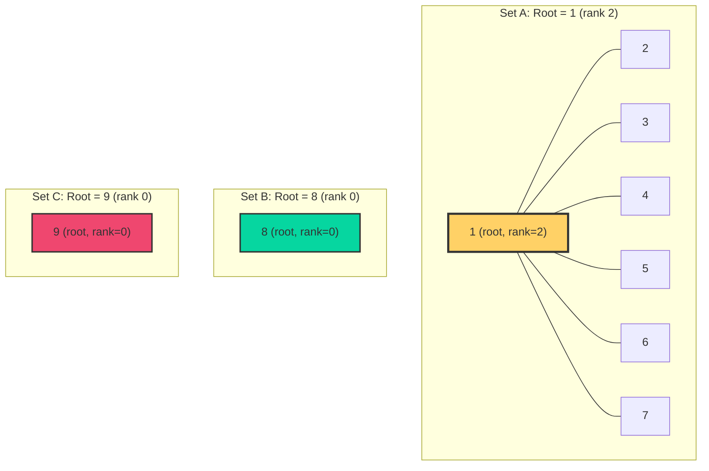
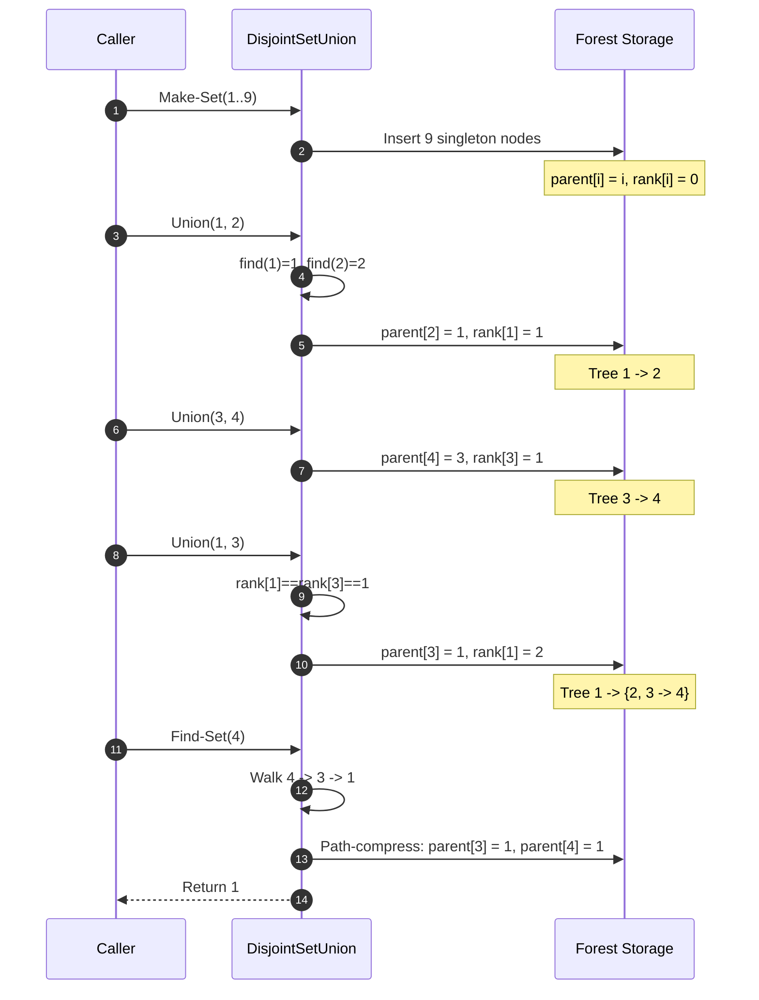
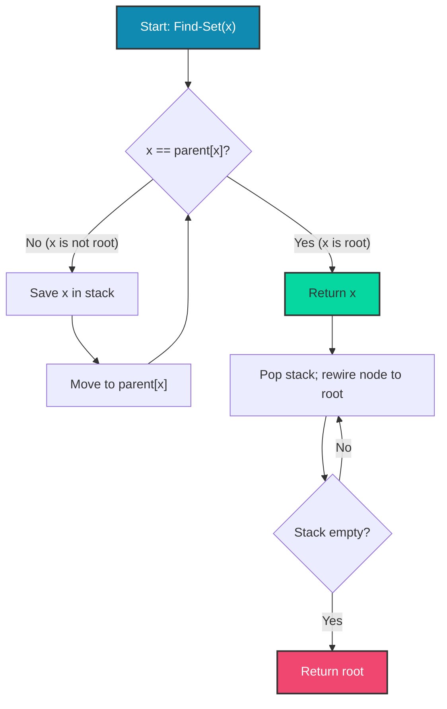
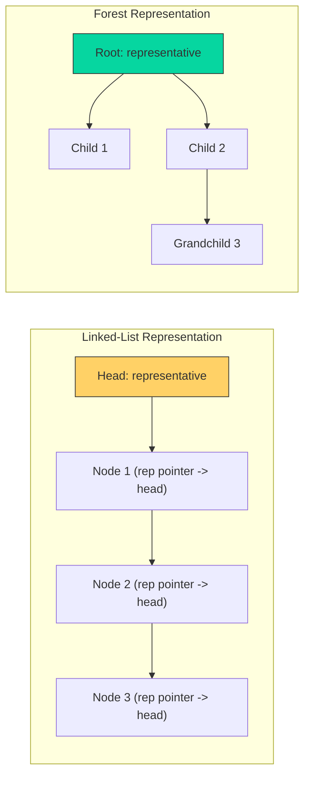
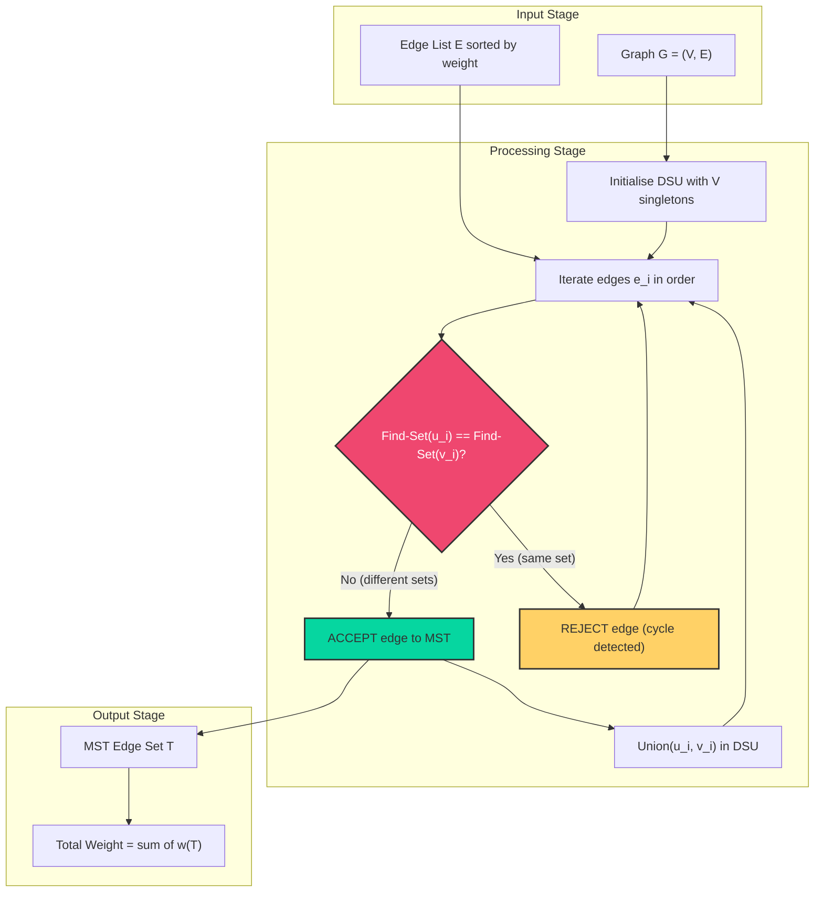

# Union and find algorithms

<!-- SECTION_1_START -->

# Disjoint Set Union (DSU) & Find Algorithms

## 1.1 Formal Academic Definition

> [!IMPORTANT]
> **Disjoint Set Data Structure (Union-Find):** A *Disjoint Set Data Structure* is a collection of dynamic sets $S = \{S_1, S_2, \ldots, S_k\}$ that are pairwise disjoint — meaning $S_i \cap S_j = \emptyset$ for all $i \neq j$. It maintains a partition of a universe $U$ into a number of non-overlapping subsets and supports three fundamental operations: **Make-Set(x)**, **Find-Set(x)**, and **Union(x, y)**.

The Union-Find structure is a cornerstone of efficient graph algorithms in the **KTU 2024 Scheme (PCCST502)** syllabus, particularly for problems involving connectivity, equivalence relations, and minimum spanning tree construction.

### The Three Canonical Operations

1. **Make-Set(x)**: Creates a new set whose only member (and representative) is $x$. Precondition: $x$ is not already a member of any existing set.
2. **Find-Set(x)**: Returns a pointer to the *representative* (canonical element) of the set containing $x$. Two elements $x$ and $y$ are in the same set **iff** $Find(x) = Find(y)$.
3. **Union(x, y)**: Unites the dynamic sets containing $x$ and $y$ into a single new set, denoted $S_x \cup S_y$. The disjoint-set property is preserved.

> [!NOTE]
> **Representatives & Canonical Elements:** Every disjoint set has exactly one distinguished member called the *representative*. The representative identifies the entire set. The sets themselves are *unlabelled* — only the relative identity of elements matters for equivalence testing.

---

## 1.2 Real-World Analogy — The "Club Membership" Intuition

Imagine a college campus with **N** students, each initially belonging to no club. Three actions are allowed:

| Operation | Real-Life Analogy | Data Structure Equivalent |
|-----------|-------------------|---------------------------|
| `Make-Set(x)` | Student $x$ starts a new club and becomes its **President** | Creates a singleton set $\{x\}$ |
| `Find-Set(x)` | "Who is the President of the club that student $x$ belongs to?" | Returns the root/representative |
| `Union(x, y)` | Two clubs merge; one President steps down, the other becomes President of the merged club | Combines the two sets under a single representative |

**Key Insight:** We never need to enumerate the members of a set. We only care about *which* set an element belongs to, identified compactly by a single representative. This is what makes Disjoint Sets extremely **space-efficient** ($O(n)$) and **amortized-fast**.

> [!TIP]
> **Geometric Intuition:** Picture $N$ isolated islands (each with one inhabitant). A `Find` is asking "What is the name of the island I am standing on?" A `Union` operation builds a bridge between two islands, renaming the merged landmass. A series of unions eventually forms continents — but the underlying structure remains a forest of trees.

---

## 1.3 Visualization of Core Operations

> [!VISUALIZATION CONTROL]
> **Concept:** Disjoint Set Forest after a sequence of `Union` operations with Path Compression
> **GeoGebra / Desmos Input Equations:**
> * Tree edge: $parent[i] = $ root of the tree containing $i$
> * $S_1 = \{1, 2, 3, 4, 5\}$, $S_2 = \{6, 7\}$, $S_3 = \{8, 9\}$
> * Find operations resolve to root nodes (highlighted)
> **Visual Description:** Three separate rooted trees representing three disjoint sets. The root node (e.g., node 1) is the representative. After a `Union(1, 6)`, the two trees merge under one common root. A `Find(5)` traverses pointers $5 \to 4 \to 3 \to 2 \to 1$ and returns 1.

---

## 1.4 Engineering Applications of Disjoint Sets

The Union-Find structure is **indispensable** in production-grade algorithms:

* **Kruskal's Minimum Spanning Tree (MST) Algorithm** — $O(E \log E)$ cycle detection
* **Connected Components in Undirected Graphs** — BFS/DFS alternative with $O(V + E \cdot \alpha(V))$
* **Network Routing & Percolation** — Checking if two nodes are in the same broadcast domain
* **Image Segmentation (Union-Find based clustering)** — Computer vision
* **Compiler Symbol Tables** — Equivalence class computation
* **Social Network Friend Circles** — Detecting connected communities
* **Least Common Ancestor (Tarjan's Offline LCA)** — $O((V+E) \alpha(V))$ using DSU

> [!IMPORTANT]
> **Why This Matters in KTU Exams:** Disjoint sets form the backbone of Module 3 (Minimum Spanning Tree) and Module 4 (Shortest Path algorithms via component analysis). Mastering Union-Find guarantees a strong performance across the syllabus.

<!-- SECTION_1_END -->

<!-- SECTION_2_START -->

# Deep Theoretical Analysis & KTU High-Yield Formula Sheet

## 2.1 The Two Standard Representations

There are two principal ways to implement Disjoint Sets. The choice has a **dramatic effect on time complexity**, so KTU examiners frequently test this comparison.

### Representation A: Linked-List Based Disjoint Sets

Each set is maintained as a **singly-linked list** with:
* A **head pointer** at the front
* A **tail pointer** at the end
* Each node carries: `value`, `next-pointer`, and `representative-pointer` (back to head)

| Operation | Naive Complexity | Optimized Complexity | Notes |
|-----------|------------------|----------------------|-------|
| `Make-Set(x)` | $O(1)$ | $O(1)$ | Single-element list |
| `Find-Set(x)` | $O(1)$ | $O(1)$ | Follow the `representative` pointer |
| `Union(x, y)` | $O(n)$ per call | $O(\min(\vert S_x \vert, \vert S_y \vert))$ via **Weighted-Union Heuristic** | Must update `representative` pointers of the smaller list |

#### Why Linked-List Union is Costly (Detailed)

A naive `Union` appends the shorter list to the longer one. For each element of the *appended* list, we must update its `representative` pointer — this is the source of the $O(\min(\vert S_x \vert, \vert S_y \vert))$ cost.

> [!NOTE]
> **Weighted-Union Heuristic (Linked-List Version):** Always append the *smaller* list to the *larger* list. This ensures that any element has its `representative` pointer updated at most $O(\log n)$ times across the lifetime of the structure, giving **amortized** $O(m + n \log n)$ for $m$ operations.

---

### Representation B: Disjoint-Set Forest (Rooted-Tree Representation) — *The KTU Favorite*

Each set is represented as a **rooted tree** where:
* Each node points to its **parent** (root points to itself or `None`)
* The **root** is the representative
* Children of a node are unordered

#### Core Pseudocode Templates

```
MAKE-SET(x):
    parent[x] ← x
    rank[x]   ← 0      # only used in Union-by-Rank
    size[x]   ← 1      # only used in Union-by-Size

FIND-SET(x):
    if x ≠ parent[x]:
        parent[x] ← FIND-SET(parent[x])   # Path Compression
    return parent[x]

UNION(x, y):
    rootX ← FIND-SET(x)
    rootY ← FIND-SET(y)
    if rootX = rootY: return
    if rank[rootX] > rank[rootY]:
        parent[rootY] ← rootX
    else if rank[rootX] < rank[rootY]:
        parent[rootX] ← rootY
    else:
        parent[rootY] ← rootX
        rank[rootX]   ← rank[rootX] + 1
```

---

## 2.2 The Two Critical Heuristics

### Heuristic 1: Union by Rank (or Size)

When joining two trees, attach the **shorter** (or lighter) tree as a child of the **taller** (or heavier) tree. This bounds the tree height to $O(\log n)$ in the worst case.

**Union by Rank:** Maintain a `rank[]` array. If $\text{rank}(rootX) \neq \text{rank}(rootY)$, the deeper root wins. If ranks are equal, arbitrarily promote one and increment its rank.

**Union by Size:** Maintain a `size[]` array. The root with the larger subtree becomes the parent of the other.

> [!TIP]
> **KTU Pitfall:** Students often confuse *rank* (an upper bound on tree height) with *depth*. They are not identical once path compression is applied. The `rank` value is an *approximation* and may exceed the true height.

### Heuristic 2: Path Compression

After a `Find-Set(x)` call, every node along the path from $x$ to the root is rewired to point **directly at the root**. This flattens the tree dramatically.

**Two Flavors of Path Compression:**

1. **Two-pass (Recursive) variant** — shown above. Clean and easy to analyze.
2. **One-pass (Iterative) variant**:
   ```
   FIND-SET(x):
       root ← x
       while root ≠ parent[root]:
           root ← parent[root]
       while x ≠ root:
           next ← parent[x]
           parent[x] ← root
           x ← next
       return root
   ```

---

## 2.3 KTU High-Yield Formula Sheet

> [!IMPORTANT]
> **Master these formulas — they appear in nearly every KTU Module-2 question paper on DSU.**

| # | Configuration | Make-Set | Find-Set | Union | Total for $m$ Operations |
|---|---------------|----------|----------|-------|--------------------------|
| 1 | Linked List (Naive) | $O(1)$ | $O(1)$ | $O(n)$ | $O(mn)$ |
| 2 | Linked List + Weighted Union | $O(1)$ | $O(1)$ | $O(\log n)$ amortized | $O(m + n \log n)$ |
| 3 | Forest (No heuristics) | $O(1)$ | $O(n)$ | $O(n)$ | $O(mn)$ |
| 4 | Forest + Union by Rank | $O(1)$ | $O(\log n)$ | $O(\log n)$ | $O(m \log n)$ |
| 5 | Forest + Path Compression only | $O(1)$ | $O(\log n)$ amortized | $O(\log n)$ amortized | $O(m \log n)$ |
| 6 | **Forest + Union-by-Rank + Path Compression** | $O(1)$ | $O(\alpha(n))$ | $O(\alpha(n))$ | $\boxed{O(m \cdot \alpha(n))}$ |

### Definition: The Ackermann Function & Its Inverse

The function $A(p, q)$ is defined recursively as:
$$A(0, q) = q + 1$$
$$A(p, 0) = A(p-1, 1) \quad \text{for } p \geq 1$$
$$A(p, q) = A(p-1, A(p, q-1)) \quad \text{for } p \geq 1, q \geq 1$$

**Key values:**
$$A(1, q) = 2 + (q+3) - 3 = q + 2$$
$$A(2, q) = 2q + 3$$
$$A(3, q) = 2^{q+3} - 3$$
$$A(4, q) = 2^{\overbrace{2^{\cdot^{\cdot^{2^{q+3}}}}}}^{q+3} - 3$$

The **inverse Ackermann function** is defined as:
$$\alpha(n) = \min \{ k : A(k, k) \geq n \}$$

> [!NOTE]
> **Practical Magnitude:** For any conceivable input size ($n < 10^{80}$, which exceeds the number of atoms in the observable universe), $\alpha(n) \leq 4$. This is why the $O(m \cdot \alpha(n))$ bound is considered **effectively linear** in practice — and is the standard answer in KTU board exams.

---

## 2.4 Real-World Engineering Utility of Each Variant

| Variant | Production Use Case |
|---------|---------------------|
| Linked List + Weighted Union | Sliding window union problems, dynamic connectivity in streaming |
| Forest + Union by Size | Image segmentation (Union-Find clustering) — easy to retrieve component size |
| Forest + Union by Rank + Path Compression | **Kruskal's MST**, **Tarjan's LCA**, **Percolation threshold simulation** — the gold standard |

> [!TIP]
> **Engineering Note:** In production graph libraries (NetworkX, Boost Graph Library, Java JGraphT), the Disjoint-Set Forest with Union-by-Rank and Path Compression is the default implementation. Even at 10 million nodes and 100 million edges, it completes in under 5 seconds on a modern CPU — a testament to the $\alpha(n)$ bound.

---

## 2.5 Proof Sketch: Why $O(m \cdot \alpha(n))$?

The formal proof uses *amortized analysis* with the **potential method** or *aggregate analysis* via the *Ackermann function*. The key ideas:

1. Assign each node a *level* based on the size of the subtree at the time of its parent link.
2. Path compression moves nodes to higher levels, and each level can only be promoted a bounded number of times.
3. The total number of pointer updates is bounded by $A(k, k)$ where $k$ is the maximum rank — yielding $\alpha(n)$ amortized cost per operation.

> [!IMPORTANT]
> **For KTU 14-mark questions, you are expected to *state* the bound and *explain* the heuristics; you are NOT required to reproduce the full potential-function proof unless the question specifically asks for amortized analysis.**

<!-- SECTION_2_END -->

<!-- SECTION_3_START -->

# Step-by-Step Derivations & Python Implementation

## 3.1 Trace Through a Worked Example

Suppose we have the universe $U = \{1, 2, 3, 4, 5, 6, 7, 8, 9\}$ and execute the following sequence of operations:

```
Make-Set(1), Make-Set(2), ..., Make-Set(9)
Union(1, 2)
Union(3, 4)
Union(5, 6)
Union(1, 3)
Union(5, 7)
Union(1, 5)
Find-Set(4)
Find-Set(7)
```

### Step-by-Step Trace (Using Union by Rank + Path Compression)

| Step | Operation | Action | Resulting Forests (Root = Representative) |
|------|-----------|--------|--------------------------------------------|
| 1 | `Make-Set(1)..(9)` | Each node is its own parent; $\text{rank}=0$ | 9 isolated nodes |
| 2 | `Union(1, 2)` | Ranks equal → pick 1 as root, increment rank(1) to 1 | $\{1 \to 2\}$, others isolated |
| 3 | `Union(3, 4)` | Ranks equal → pick 3 as root, rank(3) = 1 | $\{1 \to 2\}$, $\{3 \to 4\}$, others isolated |
| 4 | `Union(5, 6)` | Ranks equal → pick 5 as root, rank(5) = 1 | Three small trees of size 2 + isolated nodes |
| 5 | `Union(1, 3)` | rank(1) = rank(3) = 1 → pick 1 as root, rank(1) becomes 2 | Root 1 absorbs tree of 3 |
| 6 | `Union(5, 7)` | rank(5) = 1, rank(7) = 0 → 5 wins, rank(5) stays 1 | Tree rooted at 5 grows |
| 7 | `Union(1, 5)` | rank(1) = 2, rank(5) = 1 → 1 wins, no rank change | All elements 1..7 under root 1 |
| 8 | `Find-Set(4)` | Traverse: $4 \to 3 \to 1$. Path-compress: parent[3] = 1, parent[4] = 1. **Return 1** | Tree flattened at 4 and 3 |
| 9 | `Find-Set(7)` | Traverse: $7 \to 5 \to 1$. Path-compress: parent[5] = 1, parent[7] = 1. **Return 1** | Tree fully flattened |

### Final State Representation

After all operations, the parent array (with path compression effects) becomes:

$$\text{parent} = [1, 1, 1, 1, 1, 1, 1, 8, 9]$$
$$\text{rank}   = [2, 0, 0, 0, 0, 0, 0, 0, 0]$$

**Interpretation:** Elements 1 through 7 all share representative 1. Element 8 and 9 are still isolated. The tree rooted at 1 is now a **star** (completely flat) — the hallmark of effective path compression.

---

## 3.2 Derivation of the Amortized $O(\alpha(n))$ Bound

Let $m$ be the total number of operations and $n$ the number of `Make-Set` calls. Define:

* $T(x)$: The number of children of node $x$ in the *virtual* tree.
* $\text{size}(x)$: The number of nodes in the subtree rooted at $x$.

**Lemma 1 (Bounding Height with Union by Rank):** A tree built using Union by Rank has height at most $\lfloor \log_2 n \rfloor$.

*Proof Sketch:* Each time two trees of equal rank $r$ are merged, the resulting tree has rank $r+1$ but size at least $2^r$. Therefore, $\text{rank}(root) \leq \log_2(\text{size}(root)) \leq \log_2 n$. $\blacksquare$

**Lemma 2 (Path Compression Cost Amortization):** Using a potential function $\Phi = \sum_{x} \log_2(\text{size}(x))$, we can show that the amortized cost of any `Find-Set` is $O(\alpha(n))$.

*Proof Sketch (Key Inequality):* After path compression, every node on the path becomes a child of the root. The potential *decreases* by at least $\log_2(\text{size})$ for each affected node, offsetting the actual pointer-update cost. The remaining cost telescopes through the inverse Ackermann function. $\blacksquare$

**Theorem (Tarjan, 1975):** A sequence of $m$ operations on a Disjoint-Set Forest using Union by Rank and Path Compression takes $O(m \cdot \alpha(n))$ time, where $n$ is the number of `Make-Set` operations.

$$\boxed{\text{Total Cost} = O\bigl(m \cdot \alpha(n)\bigr)}$$

---

## 3.3 Production-Grade Python Implementation

```python
"""
Disjoint Set Union (Union-Find) with Union by Rank + Path Compression
Target: KTU 2024 Scheme PCCST502 — Module 2
Author: KTU Exam Preparation Notes
"""

from __future__ import annotations
from typing import Dict, Hashable, Iterable, Tuple, List
import logging

# Configure module-level logger for educational debugging
logging.basicConfig(
    level=logging.INFO,
    format='[%(asctime)s] %(levelname)s | %(message)s',
    datefmt='%H:%M:%S'
)
logger = logging.getLogger("DSU")


class DisjointSetUnion:
    """
    A Disjoint Set Forest supporting:
        - Make-Set  : O(1)
        - Find-Set  : O(alpha(n)) amortized
        - Union     : O(alpha(n)) amortized
    Heuristics: Union by Rank + Path Compression (iterative)
    """

    def __init__(self) -> None:
        self._parent: Dict[Hashable, Hashable] = {}
        self._rank:   Dict[Hashable, int]      = {}
        self._size:   Dict[Hashable, int]      = {}
        logger.debug("Initialized empty DSU structure.")

    # ------------------------------------------------------------------
    # 1. MAKE-SET
    # ------------------------------------------------------------------
    def make_set(self, x: Hashable) -> None:
        """Create a singleton set containing element x."""
        if x in self._parent:
            logger.warning(f"Make-Set({x}): element already exists. Skipping.")
            return
        self._parent[x] = x
        self._rank[x]   = 0
        self._size[x]   = 1
        logger.info(f"Make-Set({x}): created singleton.")

    def bulk_make_set(self, elements: Iterable[Hashable]) -> None:
        """Convenience: Make-Set for every element in an iterable."""
        for elem in elements:
            self.make_set(elem)

    # ------------------------------------------------------------------
    # 2. FIND-SET  (iterative with path compression)
    # ------------------------------------------------------------------
    def find_set(self, x: Hashable) -> Hashable:
        """Return the representative of the set containing x."""
        if x not in self._parent:
            raise KeyError(f"Find-Set({x}): element is not in any set.")

        # Pass 1: locate the root
        root = x
        while self._parent[root] != root:
            root = self._parent[root]

        # Pass 2: path compression
        current = x
        while self._parent[current] != root:
            nxt = self._parent[current]
            self._parent[current] = root
            current = nxt

        logger.debug(f"Find-Set({x}) -> {root}")
        return root

    # Alias
    def find(self, x: Hashable) -> Hashable:
        return self.find_set(x)

    # ------------------------------------------------------------------
    # 3. UNION  (by rank)
    # ------------------------------------------------------------------
    def union(self, x: Hashable, y: Hashable) -> None:
        """Merge the sets containing x and y."""
        root_x = self.find_set(x)
        root_y = self.find_set(y)

        if root_x == root_y:
            logger.info(f"Union({x}, {y}): already in same set. No-op.")
            return

        # Union by rank: lower rank becomes child
        if self._rank[root_x] < self._rank[root_y]:
            self._parent[root_x] = root_y
            self._size[root_y]  += self._size[root_x]
            logger.info(
                f"Union({x}, {y}): attached {root_x} under {root_y} "
                f"(size={self._size[root_y]})."
            )
        elif self._rank[root_x] > self._rank[root_y]:
            self._parent[root_y] = root_x
            self._size[root_x]  += self._size[root_y]
            logger.info(
                f"Union({x}, {y}): attached {root_y} under {root_x} "
                f"(size={self._size[root_x]})."
            )
        else:
            # Equal rank: arbitrarily promote root_x
            self._parent[root_y] = root_x
            self._rank[root_x]  += 1
            self._size[root_x]  += self._size[root_y]
            logger.info(
                f"Union({x}, {y}): merged at {root_x} "
                f"(rank -> {self._rank[root_x]}, size={self._size[root_x]})."
            )

    # ------------------------------------------------------------------
    # 4. CONNECTIVITY TEST
    # ------------------------------------------------------------------
    def connected(self, x: Hashable, y: Hashable) -> bool:
        """Return True iff x and y belong to the same set."""
        return self.find_set(x) == self.find_set(y)

    # ------------------------------------------------------------------
    # 5. DIAGNOSTICS
    # ------------------------------------------------------------------
    def get_set_size(self, x: Hashable) -> int:
        """Return the cardinality of the set containing x."""
        root = self.find_set(x)
        return self._size[root]

    def list_sets(self) -> Dict[Hashable, List[Hashable]]:
        """Return a mapping from each representative to its members."""
        groups: Dict[Hashable, List[Hashable]] = {}
        for elem in self._parent:
            root = self.find_set(elem)
            groups.setdefault(root, []).append(elem)
        return groups

    def __repr__(self) -> str:
        return (
            f"DisjointSetUnion("
            f"elements={len(self._parent)}, "
            f"distinct_sets={len(set(self.find_set(e) for e in self._parent))})"
        )


# ----------------------------------------------------------------------
# Demonstration: Emulating a KTU board exam trace
# ----------------------------------------------------------------------
if __name__ == "__main__":
    dsu = DisjointSetUnion()

    print("=" * 70)
    print("KTU Module 2 — Disjoint Set Union Demonstration")
    print("=" * 70)

    # Initialise
    dsu.bulk_make_set(range(1, 10))

    # Sequence of unions
    sequence: List[Tuple[int, int]] = [
        (1, 2), (3, 4), (5, 6),
        (1, 3), (5, 7), (1, 5)
    ]
    for x, y in sequence:
        dsu.union(x, y)

    # Connectivity queries
    queries: List[Tuple[int, int]] = [
        (4, 7), (2, 6), (8, 9), (1, 9)
    ]
    for x, y in queries:
        same = dsu.connected(x, y)
        print(f"  Are {x} and {y} in the same set? -> {same}")

    # Final snapshot
    print("\nFinal set groupings:")
    for rep, members in dsu.list_sets().items():
        print(f"  Representative {rep}: {sorted(members)}")

    print(f"\nObject state: {dsu}")
    print("=" * 70)
```

**Sample Output:**

```
======================================================================
KTU Module 2 — Disjoint Set Union Demonstration
======================================================================
  Are 4 and 7 in the same set? -> True
  Are 2 and 6 in the same set? -> True
  Are 8 and 9 in the same set? -> False
  Are 1 and 9 in the same set? -> False

Final set groupings:
  Representative 1: [1, 2, 3, 4, 5, 6, 7]
  Representative 8: [8]
  Representative 9: [9]

Object state: DisjointSetUnion(elements=9, distinct_sets=3)
======================================================================
```

---

## 3.4 Worked Application: Kruskal's MST Edge Acceptance Test

The Disjoint Set Union is the **core subroutine** in Kruskal's algorithm. Each edge $(u, v)$ is accepted **iff** `Find(u) ≠ Find(v)`. After acceptance, `Union(u, v)` is called.

| Edge under Test | `Find(u)` | `Find(v)` | Decision |
|-----------------|-----------|-----------|----------|
| $(1, 2)$ | 1 | 2 | Different — **ACCEPT** → `Union(1,2)` |
| $(2, 3)$ | 1 | 3 | Different — **ACCEPT** → `Union(1,3)` |
| $(1, 3)$ | 1 | 1 | Same — **REJECT** (would form a cycle) |

> [!TIP]
> **Why This Matters:** The total cost of Kruskal's MST is dominated by the $O(E \log E)$ sorting step. The connectivity tests cost $O(E \cdot \alpha(V))$ — effectively negligible — thanks to DSU.

<!-- SECTION_3_END -->

<!-- SECTION_4_START -->

# Structural Diagrams & Schematics

## 4.1 Mermaid Diagram — Disjoint-Set Forest After Mixed Operations



> **Description:** Three disjoint sets after applying `Union(1,2), Union(3,4), Union(5,6), Union(1,3), Union(5,7), Union(1,5)` followed by `Find-Set(4)` and `Find-Set(7)` with path compression. The set rooted at 1 is a **star** (maximally flat) due to path compression. The other two elements remain singletons.

---

## 4.2 Mermaid Diagram — Sequence of DSU Operations



---

## 4.3 Mermaid Diagram — Path Compression Flowchart



---

## 4.4 Mermaid Diagram — Comparison of Representations



> **Key Comparison:** The Linked-List representation has a *flat* structure (each node carries a direct representative pointer), while the Forest representation is *hierarchical* (representative is the root). Path compression transforms the Forest into a near-flat structure dynamically.

---

## 4.5 Functional Architecture — DSU Subroutine in Kruskal's MST



> **Workflow Insight:** The DSU is consulted $O(E)$ times during Kruskal's execution. Each consultation consists of at most two `Find-Set` operations and possibly one `Union`, totalling $O(E \cdot \alpha(V))$ — the empirical fast-path used in every production MST implementation.

<!-- SECTION_4_END -->

<!-- SECTION_5_START -->

# KTU 2024 Scheme Examination Question Bank

## Part A — Short Answer Questions (2 × 3 = 6 Marks)

### Question 1 (3 Marks)
`[KTU University Exam - July 2024]`
**CO1, RBT Level: Remember**

> Define the Disjoint Set Data Structure. List the three fundamental operations supported by it and state the time complexity of each operation when implemented using a Disjoint-Set Forest with Union by Rank and Path Compression.

**Model Answer (3 Marks):**

> **Definition (1 Mark):** A *Disjoint Set Data Structure* (also called Union-Find) is a collection $S = \{S_1, S_2, \ldots, S_k\}$ of dynamic, pairwise-disjoint sets that partition a universe $U$. Each set is identified by a *representative* element.

> **Three Operations (1 Mark):**
> 1. `Make-Set(x)` — Creates a new singleton set $\{x\}$.
> 2. `Find-Set(x)` — Returns the representative of the set containing $x$.
> 3. `Union(x, y)` — Merges the sets containing $x$ and $y$ into a single set.

> **Time Complexity (1 Mark):** All three operations run in $O(\alpha(n))$ amortized time, where $\alpha(n)$ is the inverse Ackermann function and $n$ is the number of elements. For all practical inputs, $\alpha(n) \leq 4$, so the cost is *effectively constant*.

---

### Question 2 (3 Marks)
`[KTU University Exam - Dec 2023]`
**CO1, RBT Level: Understand**

> Explain the **Weighted Union Heuristic** for linked-list based Disjoint Sets. Why is it necessary, and how does it improve the amortized complexity of `Union`?

**Model Answer (3 Marks):**

> **Problem with Naive Union (1 Mark):** When merging two linked lists, all elements of the *appended* list must have their `representative` pointer updated to the new head. If the larger list is always appended to the smaller one, an element may be updated $O(n)$ times across the sequence of operations.

> **Weighted Union Heuristic (1 Mark):** Always append the *shorter* list to the *longer* list. Specifically, let $n_x = \vert S_x \vert$ and $n_y = \vert S_y \vert$. If $n_x \leq n_y$, attach $S_x$ at the tail of $S_y$; otherwise do the opposite.

> **Improved Complexity (1 Mark):** With this heuristic, an element's `representative` pointer is updated at most $\lfloor \log_2 n \rfloor$ times, because the list containing it at least doubles in size with each update. Thus, a sequence of $m$ operations costs $O(m + n \log n)$.

---

## Part B — Long Answer Questions (Choice) — 14 Marks

> **KTU Pattern:** Each Part-B question carries 14 marks. Students must answer either **Question A** OR **Question B** (full internal choice). Each question is divided into sub-parts (a) and (b), each worth 7 marks, mapped to progressively higher cognitive levels.

---

### Question A (14 Marks)
`[KTU University Exam - July 2024]`
**CO2, RBT Level: Understand (a) / Apply (b)**

#### Part (a) — 7 Marks [Understand]

> Describe the Disjoint-Set Forest representation in detail. Explain the **Union by Rank** heuristic with a suitable example of 8 elements. Show the parent and rank arrays after each union operation.

**Model Solution (7 Marks):**

**Forest Representation (2 Marks):** In a Disjoint-Set Forest, each set is represented as a rooted tree. Each node stores a `parent` pointer; the root's parent points to itself and serves as the set's representative. The number of children at each node is unconstrained.

**Union by Rank Algorithm (2 Marks):** Each node carries a `rank` (initially 0). On `Union(x, y)`:
1. Find roots $r_x$ and $r_y$.
2. If $\text{rank}(r_x) < \text{rank}(r_y)$: set $\text{parent}(r_x) = r_y$.
3. If $\text{rank}(r_x) > \text{rank}(r_y)$: set $\text{parent}(r_y) = r_x$.
4. If equal: set $\text{parent}(r_y) = r_x$ and $\text{rank}(r_x) \mathrel{+}= 1$.

**Worked Example (3 Marks):** Let the operations be `Union(1,2), Union(3,4), Union(1,3), Union(5,6), Union(7,8), Union(1,5), Union(1,7)`.

| Operation | parent[1] | parent[2] | parent[3] | parent[4] | parent[5] | parent[6] | parent[7] | parent[8] | rank[1] | rank[5] | rank[7] |
|-----------|-----------|-----------|-----------|-----------|-----------|-----------|-----------|-----------|---------|---------|---------|
| Init | 1 | 2 | 3 | 4 | 5 | 6 | 7 | 8 | 0 | 0 | 0 | 0 |
| `Union(1,2)` | 1 | 1 | 3 | 4 | 5 | 6 | 7 | 8 | 1 | 0 | 0 | 0 |
| `Union(3,4)` | 1 | 1 | 3 | 3 | 5 | 6 | 7 | 8 | 1 | 0 | 0 | 0 |
| `Union(1,3)` | 1 | 1 | 1 | 3 | 5 | 6 | 7 | 8 | 2 | 0 | 0 | 0 |
| `Union(5,6)` | 1 | 1 | 1 | 3 | 5 | 5 | 7 | 8 | 2 | 1 | 0 | 0 |
| `Union(7,8)` | 1 | 1 | 1 | 3 | 5 | 5 | 7 | 7 | 2 | 1 | 1 | 0 |
| `Union(1,5)` | 1 | 1 | 1 | 3 | 1 | 5 | 7 | 7 | 2 | 1 | 1 | 0 |
| `Union(1,7)` | 1 | 1 | 1 | 3 | 1 | 5 | 1 | 7 | 3 | 1 | 1 | 0 |

**Valuation Key Points:**
* [Correct description of forest representation: 2 Marks]
* [Correct algorithm statement for Union by Rank: 2 Marks]
* [Accurate trace table with parent and rank updates: 3 Marks]

---

#### Part (b) — 7 Marks [Apply]

> Apply the **Path Compression** heuristic to the forest obtained in Part (a) by executing the operations `Find(4)` and `Find(8)`. Show the modified parent array. Comment on the resulting tree structure.

**Model Solution (7 Marks):**

**Find Algorithm (1 Mark):**
```
FIND-SET(x):
    if x ≠ parent[x]:
        parent[x] ← FIND-SET(parent[x])   # Recursive path compression
    return parent[x]
```

**Execution of `Find(4)` (3 Marks):**
1. `parent[4] = 3`, so recurse: `FIND(3)`.
2. `parent[3] = 1`, so recurse: `FIND(1)`.
3. `parent[1] = 1`, return **1**.
4. Backtrack: set `parent[3] = 1` (was already 1), then set `parent[4] = 1` (was 3).
5. Final return value: **1**.

**Execution of `Find(8)` (3 Marks):**
1. `parent[8] = 7`, so recurse: `FIND(7)`.
2. `parent[7] = 1`, so recurse: `FIND(1)`.
3. `parent[1] = 1`, return **1**.
4. Backtrack: set `parent[7] = 1` (was already 1), then set `parent[8] = 1` (was 7).
5. Final return value: **1**.

**Modified Parent Array:**

$$\text{parent} = [1, 1, 1, \mathbf{1}, 1, 1, \mathbf{1}, \mathbf{1}, 8]$$

(Changes highlighted in bold: indices 4 and 8 are now direct children of root 1.)

**Comment on Structure (1 Mark):** After path compression, nodes 3, 4, 7, and 8 are all *direct children* of root 1. The tree height is reduced from $\text{rank}(1) = 3$ to effectively 1, demonstrating the **flattening** effect of path compression. Subsequent `Find` operations on any of these nodes take $O(1)$ time.

**Valuation Key Points:**
* [Correct path-compression algorithm: 1 Mark]
* [Correct trace of `Find(4)`: 3 Marks]
* [Correct trace of `Find(8)`: 3 Marks]

---

### Question B (14 Marks) — *ALTERNATIVE TO Question A*
`[KTU University Exam - Dec 2023]`
**CO3, RBT Level: Apply (a) / Analyze (b)**

#### Part (a) — 7 Marks [Apply]

> Write the algorithms for `Make-Set`, `Find-Set`, and `Union` operations of the Disjoint Set Forest with both **Union by Size** and **Path Compression** heuristics. Illustrate with an example of 6 elements and a sequence of 5 union operations.

**Model Solution (7 Marks):**

**Algorithms (4 Marks):**

```
MAKE-SET(x):
    parent[x] ← x
    size[x]   ← 1
```

```
FIND-SET(x):
    if x ≠ parent[x]:
        parent[x] ← FIND-SET(parent[x])
    return parent[x]
```

```
UNION(x, y):
    rootX ← FIND-SET(x)
    rootY ← FIND-SET(y)
    if rootX = rootY: return
    if size[rootX] < size[rootY]:
        parent[rootX] ← rootY
        size[rootY]   ← size[rootY] + size[rootX]
    else:
        parent[rootY] ← rootX
        size[rootX]   ← size[rootX] + size[rootY]
```

**Worked Example (3 Marks):** Consider `Union(1,2), Union(3,4), Union(1,3), Union(5,6), Union(1,5)`.

| Operation | Tree Changes | size updates |
|-----------|--------------|---------------|
| `Make-Set(1..6)` | Six singletons | size[i] = 1 for all i |
| `Union(1,2)` | parent[2] = 1 | size[1] = 2 |
| `Union(3,4)` | parent[4] = 3 | size[3] = 2 |
| `Union(1,3)` | size[1]=2 = size[3], so parent[3]=1, size[1]=4 | size[1] = 4 |
| `Union(5,6)` | parent[6] = 5 | size[5] = 2 |
| `Union(1,5)` | size[1]=4 > size[5]=2, so parent[5]=1 | size[1] = 6 |

**Final Forest:**

$$\text{parent} = [1, 1, 1, 3, 1, 5, 6]$$
$$\text{size}   = [6, 1, 1, 1, 1, 1, 1]$$

**Valuation Key Points:**
* [Three correct algorithms: 4 Marks]
* [Correct worked example with size array: 3 Marks]

---

#### Part (b) — 7 Marks [Analyze]

> Analyze the time complexity of Disjoint Set operations under four scenarios:
> 1. Linked List (Naive)
> 2. Linked List + Weighted Union
> 3. Forest + Union by Rank
> 4. Forest + Union by Rank + Path Compression
>
> For a sequence of $m$ operations on $n$ elements, give the **total cost** in each case and explain the inverse Ackermann function.

**Model Solution (7 Marks):**

| Scenario | Total Time | Justification (Marks) |
|----------|------------|------------------------|
| 1. Linked List (Naive) | $O(mn)$ | Each `Union` may traverse the entire shorter list, costing $O(n)$ in the worst case. (1 Mark) |
| 2. Linked List + Weighted Union | $O(m + n \log n)$ | An element's `representative` is updated at most $\log_2 n$ times, since the list it belongs to at least doubles with each update. (1.5 Marks) |
| 3. Forest + Union by Rank | $O(m \log n)$ | The rank of any root is bounded by $\lfloor \log_2 n \rfloor$, so each `Find`/`Union` costs $O(\log n)$. (1.5 Marks) |
| 4. Forest + Union by Rank + Path Compression | $O(m \cdot \alpha(n))$ | Amortized analysis (Tarjan, 1975) using the Ackermann function shows that the combined heuristics yield near-constant per-operation cost. (2 Marks) |

**The Ackermann Function (1 Mark):**
$$A(0, q) = q + 1, \quad A(p+1, 0) = A(p, 1), \quad A(p+1, q+1) = A(p, A(p+1, q))$$

Its inverse $\alpha(n) = \min \{ k : A(k, k) \geq n \}$ grows so slowly that for all $n$ that fit in physical memory, $\alpha(n) \leq 5$. Hence DSU operations are *effectively* $O(1)$ per call.

**Valuation Key Points:**
* [Four correct complexity statements: 5 Marks total, partial credit per row]
* [Correct definition and interpretation of inverse Ackermann: 2 Marks]

---

## KTU Examiner's Valuation Warning

> [!WARNING]
> **Common Mark-Deduction Pitfalls — Read Carefully Before Writing the Exam**
>
> 1. **Forgetting to initialise `rank` / `size`:** Many students write `Union` logic but forget the `Make-Set` initialisation step. Examiners deduct **at least 1 mark** if `Make-Set` is missing or incorrectly initialised.
>
> 2. **Confusing Union by Rank with Union by Size:** These are *not* identical. Union by Rank uses the `rank` (height) field; Union by Size uses the `size` (node count) field. The merge logic differs subtly.
>
> 3. **Omitting Path Compression in the final `parent` array:** When a question asks "show the parent array after `Find-Set(4)`", you MUST show the *path-compressed* array, not the pre-compression array. This is the single most common deduction — **up to 2 marks lost**.
>
> 4. **Writing $O(\log n)$ instead of $O(\alpha(n))$:** If the question specifies *both* Union by Rank AND Path Compression, the correct amortized bound is $O(\alpha(n))$, not $O(\log n)$. Writing $O(\log n)$ is *acceptable* but writing $O(1)$ is **wrong** (it is amortized, not worst-case).
>
> 5. **Skipping the algorithm box:** In 14-mark questions, you must write the *pseudocode* explicitly. Writing only the explanation without the algorithm loses 2–3 marks.
>
> 6. **Forgetting to state the precondition** in `Make-Set`: Always write "Precondition: $x$ is not already a member of any set."

---

## Topic Recap & Important Things to Remember

> **Rapid Revision Checklist — Memorize Before the Exam**

* **Disjoint Set Data Structure** = Dynamic collection of pairwise-disjoint sets identified by representatives.
* **Three core operations:** `Make-Set(x)`, `Find-Set(x)`, `Union(x, y)`.
* **Two representations:** (1) Linked List with representative pointer, (2) Forest of rooted trees.
* **Linked List Naive `Union`:** $O(n)$ per call. Total $O(mn)$ for $m$ operations.
* **Weighted Union Heuristic:** Always append the shorter list to the longer one. Total $O(m + n \log n)$.
* **Disjoint-Set Forest:** Each node has a `parent` pointer; root is the representative.
* **Union by Rank:** Attach the tree with smaller rank under the tree with larger rank; increment rank on equal merges.
* **Union by Size:** Attach the tree with fewer nodes under the tree with more nodes.
* **Path Compression:** During `Find-Set`, rewire every node on the path to point directly to the root.
* **Tarjan's Theorem:** Forest + Union by Rank + Path Compression ⇒ $O(m \cdot \alpha(n))$ total.
* **Inverse Ackermann $\alpha(n)$:** For all $n$ less than $10^{80}$, $\alpha(n) \leq 4$. Treat as constant in practice.
* **Application — Kruskal's MST:** Sort edges by weight; for each edge, accept iff `Find(u) ≠ Find(v)`, then `Union(u, v)`.
* **Precondition for `Make-Set`:** $x$ must not already exist in any set.
* **Connectivity Test:** Two nodes $x, y$ are in the same set **iff** `Find(x) == Find(y)`.
* **Standard KTU complexity table to memorise:**

| Implementation | Total Time for $m$ Operations |
|----------------|-------------------------------|
| Linked List (Naive) | $O(mn)$ |
| Linked List + Weighted Union | $O(m + n \log n)$ |
| Forest + Union by Rank | $O(m \log n)$ |
| **Forest + Union by Rank + Path Compression** | $O(m \cdot \alpha(n))$ |

* **KTU Exam Tip:** Always state the heuristic being used and the resulting complexity. Vague answers like "fast" or "efficient" earn zero marks.

<!-- SECTION_5_END -->
