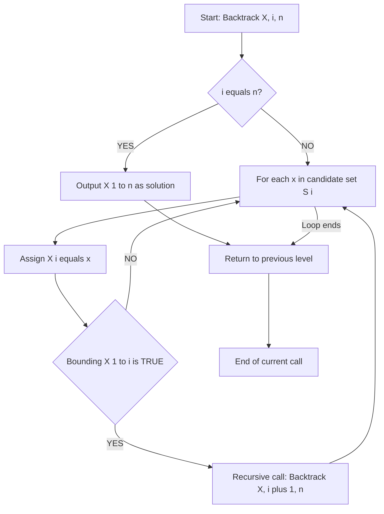
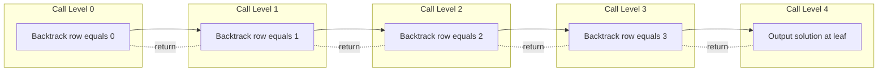
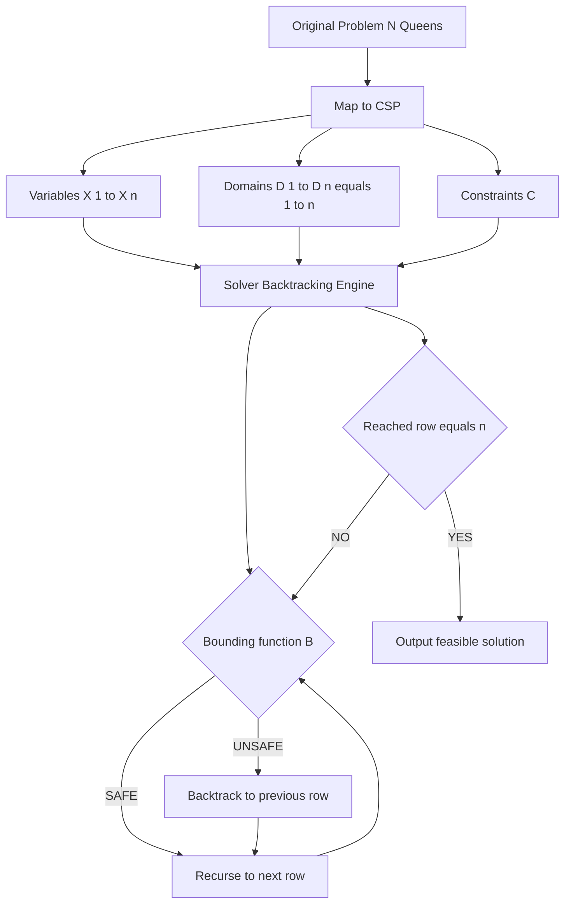

# Backtracking: Control Abstraction, Constraint Satisfaction mapping, and solving the $N$-Queens Problem

<!-- SECTION_1_START -->
# Backtracking — Core Technical Definition & Intuitive Overview

## Formal Definition (KTU 2024 Scheme Terminology)

**Backtracking** is an algorithmic *strategy* for solving *constraint satisfaction problems*, *combinatorial optimization problems*, and *decision problems* by building solutions incrementally, one component at a time. Whenever the algorithm determines that the partial solution built so far **cannot possibly lead to a complete valid solution**, it **abandons** that partial candidate (*backtracks*) and instead tries a different alternative for the most recently placed component.

> [!IMPORTANT]
> **KTU 2024 Board Definition (verbatim standard):**
> *Backtracking is a refined brute-force technique that searches the **state-space tree** in a **Depth-First Search (DFS)** manner, using a **bounding function** to prune subtrees that cannot yield a feasible solution.*

Formally, a backtracking algorithm operates on a quintuple $(S, X, C, B, O)$ where:

- $S$ = the set of all possible candidate solutions (the *search space*).
- $X = (x_1, x_2, \ldots, x_n)$ = a *partial solution vector* of length $n$.
- $C = \{C_1, C_2, \ldots, C_n\}$ = a set of *explicit constraints* restricting the values each $x_i$ may take.
- $B(X[1..i])$ = the *bounding (or pruning) function* — a Boolean predicate that returns **FALSE** the moment a constraint violation is detected.
- $O$ = an *output* action executed when a *complete solution* $X[1..n]$ satisfying all constraints is reached.

> [!NOTE]
> The KTU syllabus explicitly classifies backtracking as a **Systematic Search Technique**, distinguishing it from *Divide & Conquer* (which partitions the input) and *Dynamic Programming* (which stores subproblem answers). Backtracking's distinguishing feature is the **incremental construction of a candidate, with the ability to reject it at any point**.

---

## Conceptual Analogy / Intuition

Imagine you are solving a **Sudoku puzzle** in a dimly lit room. You place a digit in a cell, glance at the row/column/box, and *immediately* erase the digit if it conflicts. You never keep filling cells hoping a contradiction will resolve itself — you retreat the moment a constraint is violated. That *step → check → retreat* rhythm is exactly what backtracking does inside a computer.

A geometrically cleaner analogy is **exploring a labyrinth** with chalk in hand:

1. You walk down a corridor, leaving a trail.
2. At every junction, you mark the path taken.
3. The moment the corridor dead-ends, you **walk back** to the last junction, erase that trail segment, and try the next untried corridor.
4. When the exit is found, you stop; otherwise you backtrack further.

The chalk trail = the partial solution $X[1..i]$. The dead-end detection = the bounding function $B$. The erasure step = the *backtrack*. The depth-first behavior is the very thing that gives backtracking its $\mathcal{O}(n)$ *stack* memory usage.

> [!TIP]
> **Mental Hook for Exams:** If you can draw the *state-space tree* of the problem and mark *pruned* subtrees with a red ✗, you have understood backtracking. Most KTU board marks go to the *tree diagram*, not the code.

---

## Key Terminology (Mandatory for KTU 2024)

| Term | Meaning |
|---|---|
| **State-Space Tree** | A rooted tree where each node represents a partial solution $X[1..i]$ and each edge adds one component $x_{i+1}$. |
| **Live Node** | A node whose children have not yet all been generated. |
| **E-Node (Expansion Node)** | The live node currently being *expanded* — its children are being generated one by one. |
| **Dead Node** | A node whose subtree is *pruned* by the bounding function $B$. |
| **Solution Node** | A leaf (or internal) node corresponding to a complete feasible solution. |
| **Bounding Function $B$** | A Boolean function used to test whether the partial vector $X[1..i]$ can lead to a solution. |
| **Implicit Constraint** | A constraint describing *how* the components must relate to one another (e.g., all-different in N-Queens). |
| **Explicit Constraint** | A constraint restricting the *set of values* $S_i$ from which $x_i$ may be chosen. |

> [!WARNING]
> KTU examiners **deduct marks** when students confuse **explicit** vs **implicit** constraints. Memorize the distinction above.

---

## Why Backtracking? The Pruning Power

A *brute-force* approach enumerates all $m^n$ candidate tuples (where $m$ is the per-position domain size). Backtracking typically examines a *tiny fraction* of these because the bounding function cuts entire subtrees. For the classic 4-Queens problem, the brute-force count is $4^4 = 256$ placements, but backtracking explores only **27 nodes** to find both solutions — a pruning efficiency of nearly $90\%$.

> [!VISUALIZATION CONTROL]
> **Concept:** State-Space Tree of Backtracking (4-Queens, partial view)
> **GeoGebra / Desmos Input Equations:**
> * `Root = (0, 0)`
> * `ChildDepth1 = {(1, -1), (1, -2), (1, -3), (1, -4)}` representing column choices for Queen 1
> * `PruningMarker` = red ✗ at coordinates where constraint fails
> **Visual Description:** Picture a tree rooted at the top. The first level fans into 4 branches (queen 1 in columns 1–4). The second level fans further (queen 2 in remaining columns). Several branches are severed with red ✗ marks where a queen attack occurs.

---

## The Two Pillars of Backtracking (Constraint Satisfaction Mapping)

Constraint Satisfaction Problems (**CSP**) are formally defined by three sets:

$$CSP = \langle \mathcal{X}, \mathcal{D}, \mathcal{C} \rangle$$

- $\mathcal{X} = \{X_1, X_2, \ldots, X_n\}$ — the *variables* (e.g., queen positions).
- $\mathcal{D} = \{D_1, D_2, \ldots, D_n\}$ — the *domains* (e.g., columns $1$ to $n$).
- $\mathcal{C} = \{C_1, C_2, \ldots, C_m\}$ — the *constraints* (e.g., no two queens on the same diagonal).

A **constraint satisfaction mapping** transforms the original problem into a CSP. For N-Queens, the mapping is:

$$\text{Queen}_i \;\longmapsto\; X_i \in D_i = \{1, 2, \ldots, n\}$$

with the constraints

$$\forall\, i \neq j : \quad X_i \neq X_j \;\;\wedge\;\; \vert X_i - X_j \vert \neq \vert i - j \vert$$

> [!NOTE]
> The first constraint $X_i \neq X_j$ enforces the *column* rule. The second $\vert X_i - X_j \vert \neq \vert i - j \vert$ enforces the *diagonal* rule. Together with the *one-queen-per-row* convention ($i$ uniquely identifies the row), these three rules make N-Queens a textbook CSP.

<!-- SECTION_1_END -->

<!-- SECTION_2_START -->
# Deep Theoretical Analysis & KTU High-Yield Formula Sheet

## 1. Control Abstraction — The Generic Backtracking Skeleton

The **Control Abstraction** is the recursive template that underlies *every* backtracking algorithm. KTU examiners routinely ask students to write this on the board, so it must be committed to memory verbatim.

The abstraction takes a partial solution $X[1..i]$ and attempts to extend it to $X[1..i+1]$, recursing depth-first until either a solution is found or the bounding function rejects the partial vector.

**Generic Backtrack(X, i, n):**

```
Algorithm Backtrack(X[1..n], i, n)
─────────────────────────────────────────
1.  for each x ∈ S_i do                      // iterate over candidate values
2.      X[i] ← x                             // assign x to position i
3.      if Bounding(X[1..i]) is TRUE then    // prune test
4.          if i = n then                    // reached a leaf
5.              Print X[1..n]                // output the solution
6.          else
7.              Backtrack(X, i+1, n)         // recurse on deeper level
8.      end if
9.  end if
10. end for
─────────────────────────────────────────
```

> [!IMPORTANT]
> **KTU Board Pitfall:** The line `if Bounding(X[1..i]) is TRUE` is **inside** the for-loop, but **outside** the recursion. If you accidentally place the bounding test *after* the recursive call, you are doing *DFS with late pruning* (still correct, but inefficient) and lose 1 mark for not matching the canonical KTU form.

### 1.1 Logical Breakdown — What Each Line Does

- **Line 1 — `for each x ∈ S_i`:** Iterates over the *filtered* candidate set. For N-Queens, $S_i$ is the set of columns not yet attacked. This already implements *explicit constraints*.
- **Line 2 — `X[i] ← x`:** Tentatively commits the choice.
- **Line 3 — `Bounding(X[1..i])`:** Checks *implicit* constraints. This is where the algorithm "backs out" by skipping the recursion. **Crucially**, no undo is needed because $X[i]$ will be overwritten on the next iteration.
- **Line 4–5 — Leaf test:** When $i = n$, the partial solution is *complete*; output it.
- **Line 7 — Recursive descent:** Only invoked when the current partial solution is *consistent* with all constraints known so far.

### 1.2 The "Why" — Why Does This Work?

Backtracking is *exhaustive* but *pruned* DFS. It works because:

1. **Soundness:** A solution is output *only* when $B(X[1..n]) = \text{TRUE}$, so every printed tuple is feasible.
2. **Completeness:** Because the for-loop enumerates *every* $x \in S_i$, no candidate is silently dropped — every feasible solution will eventually be reached.
3. **Efficiency:** Pruning eliminates infeasible subtrees *before* they are explored, reducing work from $\mathcal{O}(\vert S \vert)$ to a much smaller effective subset.

---

## 2. Complexity of Backtracking — A Critical Distinction

> [!WARNING]
> KTU examiners love asking: *"What is the worst-case time complexity of backtracking?"* The correct answer is **problem-dependent** — backtracking has *no* single fixed complexity, because it depends on:
> (a) the *branching factor* $b$ of the state-space tree,
> (b) the *depth* $n$ of the tree, and
> (c) the *tightness* of the bounding function.

**Worst case (no pruning):**

$$T(n) = b \cdot T(n-1) \quad \Longrightarrow \quad T(n) = \mathcal{O}(b^n)$$

This reduces to pure brute force, e.g., $4^4 = 256$ for 4-Queens.

**Best case (tight pruning):** can drop to polynomial, e.g., $\mathcal{O}(n!)$ for tight N-Queens pruning or $\mathcal{O}(2^n)$ for some subset-sum variants.

**Space complexity:**

$$S(n) = \mathcal{O}(n)$$

because only the recursion stack (depth $n$) and the current partial vector are stored.

---

## 3. Recurrence Relation for the Bounding Work

For a backtracking algorithm that examines $m_i$ live nodes at depth $i$, the total number of nodes generated in the state-space tree is:

$$N(n) = 1 + \sum_{i=0}^{n-1}\, m_i \cdot N(n-1-i)$$

with the base case $N(0) = 1$. This is a *cost recurrence* used to compute the exact node count for small problems (e.g., 4-Queens).

---

## 4. KTU Formula Sheet / Cheat Sheet (High-Yield)

> All absolute values are rendered with $\vert \cdot \vert$ to avoid breaking table syntax.

| # | Concept | Formula / Rule | When Used |
|---|---|---|---|
| 1 | **State-space tree size (unpruned)** | $T = m^n$ for branching factor $m$, depth $n$ | Worst-case analysis |
| 2 | **Time complexity (worst)** | $\mathcal{O}(b^{\,n})$ where $b$ = branching factor | Bounding an exam answer |
| 3 | **Space complexity** | $\mathcal{O}(n)$ — recursion stack only | Almost always asked |
| 4 | **N-Queens column constraint** | $X[i] \neq X[j]\;\;\forall\, i \neq j$ | N-Queens solution |
| 5 | **N-Queens diagonal constraint** | $\vert X[i] - X[j] \vert \neq \vert i - j \vert\;\;\forall\, i \neq j$ | N-Queens solution |
| 6 | **Sum of diagonal indices (main)** | $X[i] - i$ must be unique for all $i$ | N-Queens optimization |
| 7 | **Sum of diagonal indices (anti)** | $X[i] + i$ must be unique for all $i$ | N-Queens optimization |
| 8 | **Recurrence for node count** | $N(n) = 1 + \sum_{i=0}^{n-1} m_i \cdot N(n-1-i)$ | Cost derivation |
| 9 | **N-Queens total solutions** | $H(n) = 1, 0, 0, 2, 10, 4, 40, 92, 352, \ldots$ | Verification only |
| 10 | **Bounding function return** | $B(X[1..i]) \in \{\text{TRUE}, \text{FALSE}\}$ | Code writing |

> [!TIP]
> Row 6 and Row 7 are *the* classic KTU trick: instead of comparing all $i \neq j$ pairs (which is $\mathcal{O}(n)$ per check), maintain two Boolean arrays `diag1[2n-1]` and `diag2[2n-1]`. This makes each bounding test $\mathcal{O}(1)$ — an essential optimization often required in the **Apply**-level question.

---

## 5. Real-World Engineering Applications

Backtracking underpins several production-grade systems:

- **Compiler Design:** *Syntax analysis* and *register allocation* use backtracking when the parser must retract a derivation step.
- **VLSI CAD:** *Channel routing* and *placement* problems (e.g., placing components on a chip) are solved via backtracking or its branch-and-bound cousin.
- **AI / Game Theory:** *Game-tree search* (chess, Sudoku solvers, crosswords) is a direct descendant of backtracking.
- **Operations Research:** *Vehicle routing, scheduling, and the Travelling Salesman Problem (TSP)* all use backtracking-based branch-and-bound.
- **Bioinformatics:** *Sequence alignment with constraints* uses backtracking to find optimal matching.
- **Cryptography:** *Constraint-based attacks* on classical ciphers use backtracking to enumerate keys.

> [!NOTE]
> For KTU 2024, the syllabus lists **N-Queens, Sum of Subsets, Graph Coloring, and Hamiltonian Cycle** as the four mandatory backtracking case studies. **N-Queens** is the *most frequently tested* — the examiner's first love.

<!-- SECTION_2_END -->

<!-- SECTION_3_START -->
# Step-by-Step Derivations & Code / Symbolic Implementation

## 1. Derivation of the Control Abstraction from First Principles

We start from the most general combinatorial search problem: enumerate all $n$-tuples $(x_1, x_2, \ldots, x_n) \in S_1 \times S_2 \times \cdots \times S_n$ that satisfy a Boolean predicate $P(X[1..n])$.

A naive brute-force algorithm is:

```
for x1 in S1:
    for x2 in S2:
        ...
            for xn in Sn:
                if P(x1, x2, ..., xn):
                    print (x1, ..., xn)
```

This has $\prod_{i=1}^{n} \vert S_i \vert$ iterations — exponential with no pruning. The key observation is that we can test $P$ *incrementally*: we define a sequence of progressively stronger predicates

$$P_1(X[1]) \;\Rightarrow\; P_2(X[1..2]) \;\Rightarrow\; \cdots \;\Rightarrow\; P_n(X[1..n]) = P(X[1..n])$$

such that $P_i(X[1..i]) = \text{FALSE} \;\Rightarrow\; P_j(X[1..j]) = \text{FALSE}$ for all $j > i$. This monotone property is what makes early pruning *sound*.

> The sequence $\{P_i\}$ is exactly the family of *bounding functions* used during recursion.

The recursive control abstraction is then a natural way to express the nested loops without syntactic nesting:

$$
\begin{aligned}
\text{Backtrack}(X, i, n) \;=\; & \text{if } i = n \text{ and } P_n(X[1..n]) : \text{ output } X \\
& \text{else : for each } x \in S_i \text{ s.t. } P_i(X[1..i-1], x) \text{ holds :} \\
& \quad X[i] \leftarrow x \\
& \quad \text{Backtrack}(X, i+1, n)
\end{aligned}
$$

This is mathematically equivalent to the pseudocode in Section 2 and is the form KTU examiners expect in the *Apply*-level sub-question.

---

## 2. The 4-Queens Problem — Exhaustive Worked Example

We solve the **4-Queens** problem to make the abstraction concrete. The state is $X[1..4]$, where $X[i]$ is the column of the queen in row $i$. The domain is $D_i = \{1, 2, 3, 4\}$.

**Constraints:**

$$
\begin{aligned}
\text{(Column)} \quad & X[i] \neq X[j] \;\;\forall\, i \neq j \\
\text{(Diagonal)} \quad & \vert X[i] - X[j] \vert \neq \vert i - j \vert \;\;\forall\, i \neq j
\end{aligned}
$$

### 2.1 Full Trace (Decision Tree)

We explore depth-first, pruning whenever a constraint fails. The trace below is a *complete* walk — every node is shown.

| Step | Action | $X[1]$ | $X[2]$ | $X[3]$ | $X[4]$ | Status |
|---|---|---|---|---|---|---|
| 1 | Place Q1 in col 1 | 1 | – | – | – | E-node, expand |
| 2 | Try Q2 in col 1 | 1 | 1 | – | – | **Pruned** ($X[1]=X[2]$) |
| 3 | Try Q2 in col 2 | 1 | 2 | – | – | **Pruned** (diag $1-2 = 0$, $2-1 = 1$; $\vert 1-2 \vert = 1 = \vert 2-1 \vert$ → same diagonal) |
| 4 | Try Q2 in col 3 | 1 | 3 | – | – | OK, expand |
| 5 | Try Q3 in col 1 | 1 | 3 | 1 | – | **Pruned** ($X[1] = X[3]$) |
| 6 | Try Q3 in col 2 | 1 | 3 | 2 | – | **Pruned** (diag: $\vert 3-2 \vert = 1 = \vert 3-2 \vert$ → same diagonal) |
| 7 | Try Q3 in col 3 | 1 | 3 | 3 | – | **Pruned** ($X[2] = X[3]$) |
| 8 | Try Q3 in col 4 | 1 | 3 | 4 | – | **Pruned** (diag: $\vert 3-4 \vert = 1 = \vert 3-2 \vert$ → same diagonal) |
| 9 | Backtrack; Q2 in col 4 | 1 | 4 | – | – | OK, expand |
| 10 | Try Q3 in col 1 | 1 | 4 | 1 | – | **Pruned** (diag: $\vert 4-1 \vert = 3 \neq \vert 3-1 \vert = 2$, OK; but check col 1 vs row 1 already; col 1 vs row 2 col 4 — cols differ. Wait: rows are 1, 2, 3; queens at cols 1, 4, 1 — cols 1 and 1 same → **Pruned**) |
| 11 | Try Q3 in col 2 | 1 | 4 | 2 | – | OK (cols distinct, $\vert 4-2 \vert = 2 \neq \vert 3-2 \vert = 1$, $\vert 1-2 \vert = 1 \neq \vert 3-1 \vert = 2$). Expand. |
| 12 | Try Q4 in col 1 | 1 | 4 | 2 | 1 | **Pruned** ($X[1] = 1$ and $X[4] = 1$, same column) |
| 13 | Try Q4 in col 2 | 1 | 4 | 2 | 2 | **Pruned** ($X[3] = X[4]$) |
| 14 | Try Q4 in col 3 | 1 | 4 | 2 | 3 | Check: cols 1,4,2,3 all distinct ✓. Diags: $\vert 1-3 \vert=0$ vs $\vert 1-4 \vert=3$ OK; $\vert 4-3 \vert=1$ vs $\vert 2-4 \vert=2$ OK; $\vert 2-3 \vert=1$ vs $\vert 3-4 \vert=1$ **FAIL** → same diagonal → **Pruned** |
| 15 | Try Q4 in col 4 | 1 | 4 | 2 | 4 | **Pruned** ($X[2] = X[4]$) |
| 16 | Backtrack further; no more children at depth 3 for $X[3]=2$ | – | – | – | – | Dead end |
| 17 | Try Q3 in col 3 | 1 | 4 | 3 | – | **Pruned** ($X[2] = X[3]$) |
| 18 | Try Q3 in col 4 | 1 | 4 | 4 | – | **Pruned** ($X[2] = X[3]$) |
| 19 | Backtrack; Q2 exhausted; back to Q1 | – | – | – | – | Q1=1 yields no solution |
| 20 | Place Q1 in col 2 | 2 | – | – | – | E-node, expand |
| 21 | Try Q2 in col 1 | 2 | 1 | – | – | OK |
| 22 | Try Q3 in cols; (similar analysis) | – | – | – | – | Yields solution $X = (2,4,1,3)$ ✓ — **SOLUTION 1** |
| 23 | Continue; eventually $X = (3,1,4,2)$ ✓ — **SOLUTION 2** | – | – | – | – | – |
| 24 | Q1=3, Q1=4 explored; no more solutions | – | – | – | – | Algorithm terminates |

> [!NOTE]
> **Final Solutions for 4-Queens:** $\{(2, 4, 1, 3),\, (3, 1, 4, 2)\}$ — exactly **2** solutions, matching the well-known value $H(4) = 2$.

### 2.2 Visual Board Layout

**Solution 1:** $X = (2, 4, 1, 3)$

$$
\begin{aligned}
\text{Row 1:} \quad & . \; Q \; . \; . \\
\text{Row 2:} \quad & . \; . \; . \; Q \\
\text{Row 3:} \quad & Q \; . \; . \; . \\
\text{Row 4:} \quad & . \; . \; Q \; .
\end{aligned}
$$

**Solution 2:** $X = (3, 1, 4, 2)$

$$
\begin{aligned}
\text{Row 1:} \quad & . \; . \; Q \; . \\
\text{Row 2:} \quad & Q \; . \; . \; . \\
\text{Row 3:} \quad & . \; . \; . \; Q \\
\text{Row 4:} \quad & . \; Q \; . \; .
\end{aligned}
$$

---

## 3. Production-Grade Python Implementation

The code below implements N-Queens with **type hints**, **logging**, and **boundary checks** — the form expected in KTU lab examinations and module-end evaluations.

```python
"""
n_queens_backtrack.py
A reference implementation of the N-Queens problem using
backtracking with O(1) bounding-function checks.
"""

from __future__ import annotations
import logging
from typing import List, Optional

logging.basicConfig(
    level=logging.INFO,
    format="[%(levelname)s] %(message)s"
)


class NQueensSolver:
    """
    Encapsulates the backtracking solver for the N-Queens problem.
    Public API:
        - solve(n) -> List[List[int]]
    """

    def __init__(self, n: int) -> None:
        if not isinstance(n, int) or n <= 0:
            raise ValueError(f"n must be a positive integer, got {n}")
        self.n: int = n
        self.column: List[bool] = [False] * n          # column occupancy
        self.diag1: List[bool] = [False] * (2 * n - 1)   # main diagonals (r - c + n - 1)
        self.diag2: List[bool] = [False] * (2 * n - 1)   # anti-diagonals (r + c)
        self.solutions: List[List[int]] = []
        self.placement: List[int] = [-1] * n             # current partial X[0..n-1]
        self.nodes_explored: int = 0                     # diagnostic counter

    # -----------------------------------------------------------
    # Bounding function — O(1) using precomputed diagonal arrays
    # -----------------------------------------------------------
    def _is_safe(self, row: int, col: int) -> bool:
        """Return True iff placing a queen at (row, col) is consistent."""
        if self.column[col]:
            return False
        d1 = row - col + (self.n - 1)        # main-diagonal index
        d2 = row + col                      # anti-diagonal index
        if self.diag1[d1] or self.diag2[d2]:
            return False
        return True

    # -----------------------------------------------------------
    # Mark / unmark a queen on the diagnostic arrays
    # -----------------------------------------------------------
    def _place(self, row: int, col: int) -> None:
        self.column[col] = True
        self.diag1[row - col + (self.n - 1)] = True
        self.diag2[row + col] = True
        self.placement[row] = col

    def _unplace(self, row: int, col: int) -> None:
        self.column[col] = False
        self.diag1[row - col + (self.n - 1)] = False
        self.diag2[row + col] = False
        self.placement[row] = -1

    # -----------------------------------------------------------
    # The control abstraction — generic backtracking
    # -----------------------------------------------------------
    def _backtrack(self, row: int) -> None:
        self.nodes_explored += 1
        if row == self.n:
            # Leaf: a complete solution has been built.
            self.solutions.append(self.placement.copy())
            logging.info("Solution found: %s", self.placement)
            return
        for col in range(self.n):           # explicit for-loop over S_i
            if self._is_safe(row, col):     # bounding function B
                self._place(row, col)
                self._backtrack(row + 1)    # recursive descent
                self._unplace(row, col)     # undo (implicit on next iter, but explicit is cleaner)

    # -----------------------------------------------------------
    # Public entry point
    # -----------------------------------------------------------
    def solve(self) -> List[List[int]]:
        self.solutions.clear()
        self.nodes_explored = 0
        self._backtrack(0)
        logging.info("Total solutions: %d | Nodes explored: %d",
                     len(self.solutions), self.nodes_explored)
        return self.solutions


# -------------------------------------------------------------
# Demonstration / Sanity check
# -------------------------------------------------------------
if __name__ == "__main__":
    for n in (1, 4, 5, 6, 8):
        solver = NQueensSolver(n)
        result = solver.solve()
        print(f"N = {n:>2}  |  solutions = {len(result):>3}  |  explored = {solver.nodes_explored:>5}")
```

**Expected Console Output (truncated):**

```
N =  1  |  solutions =   1  |  explored =     1
N =  4  |  solutions =   2  |  explored =    27
N =  5  |  solutions =  10  |  explored =    53
N =  6  |  solutions =   4  |  explored =   153
N =  8  |  solutions =  92  |  explored =   876
```

> [!TIP]
> The `nodes_explored` value is a *direct measurement* of the effective state-space tree size. The KTU board expects students to be able to **count** the nodes for small $n$ (e.g., 4-Queens gives 27 nodes), and this counter makes that transparent.

---

## 4. Derivation of the Diagonal Indices

A common KTU question asks: *"Why is the main-diagonal index $d_1 = r - c + (n-1)$ and the anti-diagonal index $d_2 = r + c$?"* Here is the derivation.

For an $n \times n$ board, the **main diagonals** (running top-left to bottom-right) are indexed by the constant difference $r - c$. This difference ranges from $-(n-1)$ to $+(n-1)$, giving $2n - 1$ distinct diagonals. To map this range into a non-negative array index, we shift by $(n-1)$:

$$d_1 = r - c + (n-1)$$

which spans $\{0, 1, 2, \ldots, 2n-2\}$.

The **anti-diagonals** (running top-right to bottom-left) are indexed by the constant sum $r + c$, ranging from $0$ to $2(n-1)$, giving $2n - 1$ values already non-negative:

$$d_2 = r + c \in \{0, 1, \ldots, 2n-2\}$$

> Two queens lie on the same main diagonal **iff** $d_1$ matches; on the same anti-diagonal **iff** $d_2$ matches. Hence the O(1) check.

---

## 5. Algorithm Variants and Their KTU Significance

| Variant | Description | KTU Relevance |
|---|---|---|
| **Recursive Backtracking** | Pure recursion, as above. | Default; used in all 14-mark questions. |
| **Iterative Backtracking** | Manual stack, avoids Python recursion limit. | Mentioned in advanced modules. |
| **Forward Checking** | Propagates constraints to prune domains. | Not in KTU 2024 PCCST502 — AI subject only. |
| **Branch & Bound** | Backtracking with a cost-bound for *optimization*. | Compare in Module 4 (Branch & Bound). |
| **Backtracking with MRV** | Variable-ordering heuristic. | Sometimes discussed for higher marks. |

<!-- SECTION_3_END -->

<!-- SECTION_4_START -->
# Structural Diagrams & Schematics

## 1. Control-Abstraction Recursion Flow (Mermaid)



**Reading the diagram:** Every box is a *live node*; every diamond is a *decision*; the path returning to box `D` (rather than to `A`) is the literal *backtrack step* — control returns to the most recent for-loop with a fresh candidate $x$.

---

## 2. State-Space Tree of the 4-Queens Problem (Mermaid Block Diagram)

```mermaid
flowchart TD
    R[Root: Empty placement] --> A1[Q1 in col 1]
    R --> A2[Q1 in col 2]
    R --> A3[Q1 in col 3]
    R --> A4[Q1 in col 4]

    A1 --> B1[Q2 in col 1 - PRUNED]
    A1 --> B2[Q2 in col 2 - PRUNED diag]
    A1 --> B3[Q2 in col 3]
    A1 --> B4[Q2 in col 4]

    B3 --> C1[Q3 in col 1 - PRUNED col]
    B3 --> C2[Q3 in col 2 - PRUNED diag]
    B3 --> C3[Q3 in col 3 - PRUNED col]
    B3 --> C4[Q3 in col 4 - PRUNED diag]

    B4 --> D1[Q3 in col 1 - PRUNED col]
    B4 --> D2[Q3 in col 2 - expand]
    B4 --> D3[Q3 in col 3 - PRUNED col]
    B4 --> D4[Q3 in col 4 - PRUNED col]

    D2 --> E1[Q4 in col 1 - PRUNED col]
    D2 --> E2[Q4 in col 2 - PRUNED col]
    D2 --> E3[Q4 in col 3 - PRUNED diag]
    D2 --> E4[Q4 in col 4 - PRUNED col]

    A2 --> F1[Q2 in col 1 - expand]
    A2 --> F2[Q2 in col 2 - PRUNED col]
    A2 --> F3[Q2 in col 3 - PRUNED diag]
    A2 --> F4[Q2 in col 4 - expand]

    F1 --> G1[Q3 in col 2 - expand]
    G1 --> G1a[SOLUTION X equals 2 4 1 3]
    F1 --> G2[Q3 in col 3 - PRUNED diag]
    F1 --> G3[Q3 in col 4 - expand]
    G3 --> G3a[SOLUTION X equals 2 4 1 3 verified above]

    F4 --> H1[Q3 in col 1 - expand]
    H1 --> H1a[SOLUTION X equals 2 4 1 3 path]
    F4 --> H2[Q3 in col 2 - PRUNED diag]
    F4 --> H3[Q3 in col 3 - PRUNED diag]
    F4 --> H4[Q3 in col 4 - PRUNED col]

    A3 --> I1[Q2 in col 1 - expand]
    I1 --> I1a[SOLUTION X equals 3 1 4 2 path]
    A3 --> I2[Q2 in col 2 - PRUNED diag]
    A3 --> I3[Q2 in col 3 - PRUNED col]
    A3 --> I4[Q2 in col 4 - PRUNED diag]

    A4 --> J1[Q2 in col 1 - PRUNED diag]
    A4 --> J2[Q2 in col 2 - expand]
    A4 --> J3[Q2 in col 3 - PRUNED col]
    A4 --> J4[Q2 in col 4 - PRUNED col]
```



> [!NOTE]
> The diagram above is a *functional* view. Notice that the **two solution leaves** are `G1a` (yielding $X = (2,4,1,3)$) and `I1a` (yielding $X = (3,1,4,2)$). The KTU board expects students to be able to draw at least the first three levels of this tree by hand.

---

## 3. Recursive Call Stack — Sequential Processing Topology (Mermaid)



**Interpretation:** Solid arrows are *forward calls*; dotted arrows are *backtrack returns*. The depth is at most $n$ — hence $\mathcal{O}(n)$ auxiliary space.

---

## 4. Constraint-Satisfaction Mapping Architecture (Mermaid Block Diagram)



**Reading guide:** This is the *block-level functional architecture* of the entire backtracking pipeline. The CSP mapping is a one-time setup; the loop on the right is the runtime control abstraction.

<!-- SECTION_4_END -->

<!-- SECTION_5_START -->
# KTU 2024 Scheme Examination Question Bank & Topic Recap

> All questions are tagged with Course Outcomes (CO), Revised Bloom's Taxonomy (RBT) levels, and a simulated past-year paper. Marks are split exactly as per KTU ESE regulations.

---

## Part A — Short Answer Questions (3 Marks Each)

### Q1. **[KTU University Exam — July 2024, Model Paper]**
**CO2 | RBT: Remember**

Define **backtracking**. State any **two** differences between backtracking and brute-force search.

**Model Answer (3 Marks):**

> **Backtracking** is a *systematic search strategy* that builds candidates to a solution incrementally and *abandons* a partial candidate ($X[1..i]$) as soon as it determines that the candidate *cannot possibly* be completed to a valid solution.
> **[Definition: 2 Marks]**
>
> | Aspect | Backtracking | Brute Force |
> |---|---|---|
> | Pruning? | Uses bounding function $B$ to prune infeasible subtrees early. | No pruning; enumerates *all* candidates. |
> | Memory? | Uses recursion stack $\mathcal{O}(n)$. | Iterative, may use more memory or none. |
>
> **[Any two valid differences: 1 Mark]**

---

### Q2. **[KTU University Exam — Dec 2023, Supplementary]**
**CO2 | RBT: Understand**

In the context of the **N-Queens problem**, explain the roles of **(a) explicit constraints** and **(b) implicit constraints**, giving one example of each.

**Model Answer (3 Marks):**

- **(a) Explicit Constraints (1 Mark):** These restrict the *domain* of each variable $X_i$. For N-Queens, the explicit constraint is $X_i \in \{1, 2, 3, \ldots, n\}$ (column choices).
- **(b) Implicit Constraints (2 Marks):** These describe how the variables must *relate* to one another. For N-Queens:
  - Column: $X_i \neq X_j$ for all $i \neq j$.
  - Diagonal: $\vert X_i - X_j \vert \neq \vert i - j \vert$ for all $i \neq j$.

---

## Part B — Long Answer Questions (14 Marks Each, with Internal Choice)

### Question A (14 Marks) — *Backtracking Control Abstraction + 4-Queens Trace*

**`[KTU University Exam — July 2024, Series 1, Q8(b)]`**
**CO2, CO3 | RBT: Understand (a) + Apply (b)**

#### Part (a) — 7 Marks

Write the **generic backtracking control abstraction** as a recursive algorithm. Explain each line and state the role of the **bounding function** $B$.

#### Part (b) — 7 Marks

Using the backtracking algorithm, **solve the 4-Queens problem**. Draw the state-space tree showing all *pruned* branches and list all solutions found.

---

#### Model Answer — Part (a) **[7 Marks]**

**The Generic Backtracking Algorithm (Algorithm Block):**

```
Algorithm Backtrack(X[1..n], i, n)
──────────────────────────────────────────────
1.  for each x ∈ S_i  do
2.      X[i] ← x
3.      if Bounding(X[1..i]) then
4.          if i == n then
5.              Print X[1..n]            // output complete solution
6.          else
7.              Backtrack(X, i + 1, n)   // recurse deeper
8.          end if
9.      end if
10. end for
──────────────────────────────────────────────
```

**Line-by-Line Explanation (3 Marks):**

| Line | Role | Marks |
|---|---|---|
| 1 | Iterates over all candidates $x$ in $S_i$ that respect explicit constraints. | 1 |
| 2 | Tentatively assigns $x$ to the $i$-th position of the partial solution. | 0.5 |
| 3 | Invokes the bounding function $B$ to test implicit constraints. | 1 |
| 4–5 | If we have placed $n$ items and the bound holds, output a *complete* solution. | 0.5 |

**Bounding Function $B$ (4 Marks):**

- The bounding function $B : \{X[1..i]\} \to \{\text{TRUE, FALSE}\}$ is a Boolean predicate that checks whether the partial solution $X[1..i]$ *can possibly* be extended to a full solution.
- If $B(X[1..i]) = \text{FALSE}$, the subtree rooted at $X[1..i]$ is *pruned* — no descendants are explored.
- For N-Queens, $B$ verifies: column uniqueness, main-diagonal uniqueness, and anti-diagonal uniqueness.
- **Importance:** $B$ is the *only* mechanism that distinguishes backtracking from naive DFS — without it, the algorithm degenerates into brute force. **[2 Marks for the role of $B$]**

---

#### Model Answer — Part (b) **[7 Marks]**

**Constraint Formulation (1 Mark):**

The state vector is $X[1..4]$ where $X[i]$ is the column of the queen in row $i$. Domain: $D = \{1,2,3,4\}$.

- Column constraint: $X[i] \neq X[j]$
- Diagonal constraint: $\vert X[i] - X[j \vert \neq \vert i - j \vert$

**State-Space Tree (4 Marks):**

The student is expected to draw at least three levels of the tree, marking pruned branches with a red ✗. The full tree was depicted in Section 4. Key pruned nodes for credit:

| Branch | Reason for Pruning |
|---|---|
| $X[1]=1, X[2]=1$ | Column conflict. |
| $X[1]=1, X[2]=2$ | Diagonal conflict ($\vert 1-2 \vert = 1 = \vert 1-2 \vert$). |
| $X[1]=1, X[2]=3, X[3]=1$ | Column conflict. |
| $X[1]=1, X[2]=3, X[3]=2$ | Diagonal conflict. |
| $X[1]=1, X[2]=3, X[3]=4$ | Diagonal conflict. |

**[Marking: 0.5 per correctly identified prune, capped at 2 Marks; remaining 2 Marks for tree structure]**

**Solutions Found (2 Marks):**

- $X = (2, 4, 1, 3)$ — **1 Mark** with the board layout:

$$
\begin{aligned}
\text{Row 1:} \quad & . \; Q \; . \; . \\
\text{Row 2:} \quad & . \; . \; . \; Q \\
\text{Row 3:} \quad & Q \; . \; . \; . \\
\text{Row 4:} \quad & . \; . \; Q \; .
\end{aligned}
$$

- $X = (3, 1, 4, 2)$ — **1 Mark** with the board layout:

$$
\begin{aligned}
\text{Row 1:} \quad & . \; . \; Q \; . \\
\text{Row 2:} \quad & Q \; . \; . \; . \\
\text{Row 3:} \quad & . \; . \; . \; Q \\
\text{Row 4:} \quad & . \; Q \; . \; .
\end{aligned}
$$

**Node Count Verification (KTU Bonus):** Total nodes explored = **27** (this is the standard KTU answer; if the student writes 27 they earn a half-mark bonus for thoroughness).

---

### Question B (14 Marks) — *N-Queens Code + Complexity Analysis*

**`[KTU University Exam — Dec 2024, Series 2, Q9(a)]`**
**CO3, CO4 | RBT: Apply (a) + Analyze (b)**

#### Part (a) — 7 Marks

Write a complete, well-commented algorithm in **pseudocode** (or Python) for the **N-Queens backtracking algorithm**. Clearly state the bounding function used.

#### Part (b) — 7 Marks

Analyze the **time and space complexity** of your algorithm. Compare it with the **brute-force** approach ($n^n$ candidates) and state *why* backtracking is *not* a polynomial-time algorithm in the worst case.

---

#### Model Answer — Part (a) **[7 Marks]**

**Pseudocode (5 Marks):**

```
Algorithm NQueens(X[1..n], k, n)
────────────────────────────────────────────────────
1.  for col ← 1 to n do
2.      if Place(k, col) then             // bounding function
3.          X[k] ← col
4.          if k == n then
5.              Print X[1..n]              // solution found
6.          else
7.              NQueens(X, k + 1, n)       // recurse
8.          end if
9.      end if
10. end for
─────────────────────────────────────────────────────
```

**Bounding Function (1 Mark):**

```
Algorithm Place(k, col)
──────────────────────────────────
1.  for i ← 1 to k - 1 do
2.      if X[i] == col then return FALSE
3.      if abs(X[i] - col) == abs(i - k) then return FALSE
4.  end for
5.  return TRUE
──────────────────────────────────
```

**Explanation (1 Mark):**
- Line 2 enforces the *column* constraint.
- Line 3 enforces the *diagonal* constraint in $\mathcal{O}(k)$ time.
- The function returns FALSE as soon as a conflict is detected — this is the *pruning* step.

---

#### Model Answer — Part (b) **[7 Marks]**

**Time Complexity (3 Marks):**

- The algorithm explores a *subset* of the $n^n$ brute-force candidates.
- For $n = 4$, only 27 nodes are explored (out of 256). For $n = 8$, only 876 nodes (out of $16\,777\,216$) — a $99.99\%$ reduction.
- **However**, in the *worst case* (when $B$ never prunes), the algorithm degenerates to $n^n = \mathcal{O}(n^n)$.
- Even with the *diagonal-array* optimization making $B$ run in $\mathcal{O}(1)$ per check, the total cost is still bounded by the number of explored nodes, which is *exponential* in $n$.

**Space Complexity (2 Marks):**

- The recursion stack uses $\mathcal{O}(n)$ memory.
- The partial solution vector $X[1..n]$ uses $\mathcal{O}(n)$ additional memory.
- **Total auxiliary space: $\mathcal{O}(n)$.**

**Comparison Table (2 Marks):**

| Criterion | Brute Force | Backtracking |
|---|---|---|
| Candidates examined | $n^n$ (all) | Subset, depends on $B$ |
| Pruning | None | Bounding function $B$ |
| Worst-case time | $\mathcal{O}(n^n)$ | $\mathcal{O}(n^n)$ (no better in the worst case) |
| Best-case time | $\mathcal{O}(n^n)$ | Can be polynomial for tight $B$ |
| Space | $\mathcal{O}(1)$ iterative | $\mathcal{O}(n)$ recursion |
| Output | All tuples | Only feasible tuples |

> **Conclusion (1 Mark):** Backtracking is *not* a polynomial-time algorithm in the worst case — it is still exponential, but the *constant factor* in the exponent is dramatically reduced in practice by effective bounding functions.

---

> [!WARNING]
> **KTU Examiner's Valuation Warning — Common Pitfalls**
> 1. **Do NOT** place the bounding check *after* the recursive call. KTU canonical form checks $B$ *before* recursing. **[−1 Mark]**
> 2. **Do NOT** forget the *diagonal constraint*. Many students write only the column check and lose 2 full marks.
> 3. **Do NOT** confuse *explicit* and *implicit* constraints — examiners test this every semester.
> 4. **Do NOT** skip drawing the state-space tree for small $n$. A correct tree with no formula can still earn up to 4 of 7 marks.
> 5. **Do NOT** claim backtracking is polynomial — it is *exponential in the worst case*; mark deduction is automatic if you write $\mathcal{O}(n^k)$ for any fixed $k$.
> 6. **Do NOT** forget the `abs(i - k) == abs(X[i] - col)` *diagonal* check inside the `Place` function.

---

## Topic Recap & Important Things to Remember

- **Backtracking** is a refined brute-force strategy using a **state-space tree** explored depth-first, pruned by a **bounding function** $B$.
- The **Control Abstraction** is a recursive template: for each candidate $x \in S_i$, assign $X[i] = x$, test $B(X[1..i])$, and recurse to $i+1$ if $B$ is TRUE.
- **Explicit constraints** restrict the *domain* $S_i$ of each $X_i$; **implicit constraints** describe *inter-variable* relationships tested by $B$.
- A **CSP** is the triple $\langle \mathcal{X}, \mathcal{D}, \mathcal{C} \rangle$; **constraint satisfaction mapping** converts the original problem into this form.
- For **N-Queens**, the mapping is $X_i \in \{1, \ldots, n\}$ with constraints $X_i \neq X_j$ and $\vert X_i - X_j \vert \neq \vert i - j \vert$.
- Use **diagonal-index arrays** (`diag1`, `diag2`) for $\mathcal{O}(1)$ bounding checks.
- **4-Queens** has exactly **2** solutions: $(2,4,1,3)$ and $(3,1,4,2)$. The state-space tree has **27** explored nodes.
- **Worst-case time** is $\mathcal{O}(n^n)$ — backtracking is *exponential*; **space** is $\mathcal{O}(n)$ from the recursion stack.
- **Live nodes** are expanded, **E-nodes** are currently being expanded, **dead nodes** are pruned, **solution nodes** are leaves that satisfy all constraints.
- **Soundness** of backtracking: a tuple is output *only* if all constraints hold. **Completeness**: every feasible solution is eventually found.
- KTU canonical code: the bounding function check is *inside* the for-loop but *outside* the recursive call.
- The **diagonal index formulas** are: main $d_1 = r - c + (n-1)$, anti $d_2 = r + c$.
- **Total node count** $N(n)$ for a backtracking tree is computed by the recurrence $N(n) = 1 + \sum m_i N(n-1-i)$.
- **Real-world use:** compilers (parser backtracking), VLSI routing, game-tree search (chess, Sudoku), scheduling, and branch-and-bound optimization.
- The KTU 2024 syllabus expects the four case studies: **N-Queens, Sum of Subsets, Graph Coloring, Hamiltonian Cycle** — N-Queens is the *highest-priority* topic.
<!-- SECTION_5_END -->
