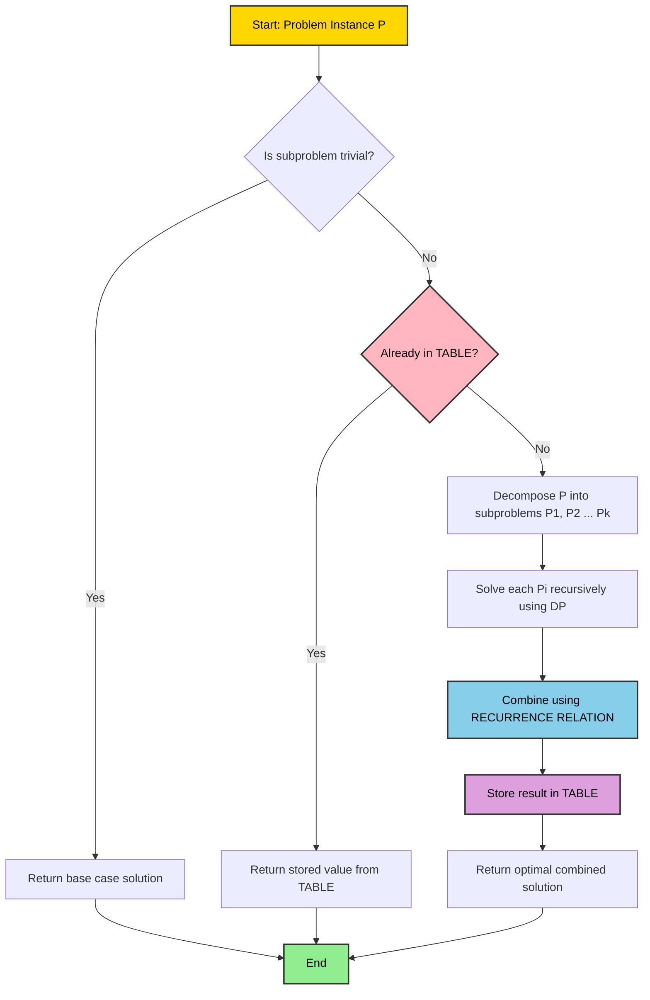
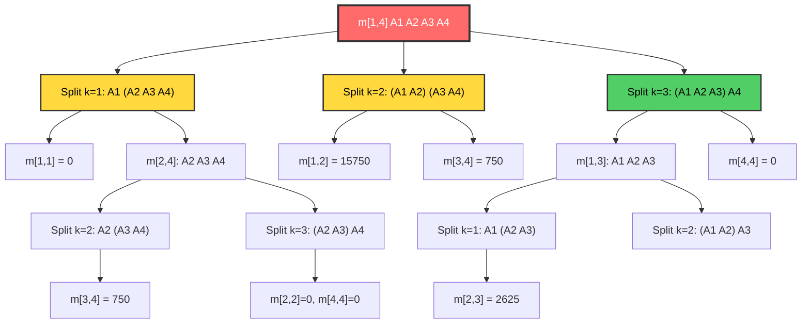
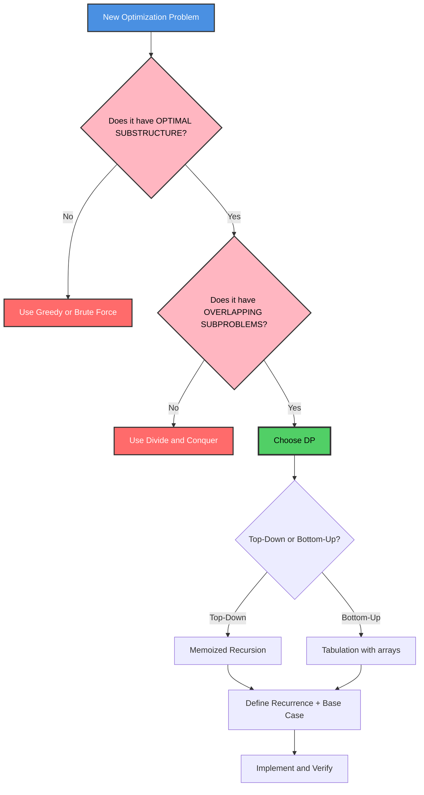

# Dynamic Programming: Control Abstraction, Optimality Principle, Matrix Chain Multiplication, Floyd-Warshall All-Pairs Shortest Path

<!-- SECTION_1_START -->
# Dynamic Programming: The Strategic Memory of Algorithms

> [!IMPORTANT]
> **KTU 2024 Scheme | Module 3 | Course Outcome: CO3 | Bloom's Level: Apply / Analyze**
> Dynamic Programming (DP) is the cornerstone of optimization in Computer Science. It is one of the most heavily tested modules in KTU university examinations, frequently appearing in both Part A (3 marks) and Part B (14 marks) sections.

## 1.1 Formal Academic Definition

**Dynamic Programming (DP)** is an algorithmic paradigm that solves a complex problem by breaking it down into a collection of simpler subproblems, solving each of those subproblems just once, and storing their solutions in a lookup table (memoization or tabulation) to avoid redundant computations. It is the algorithmic embodiment of the **Principle of Optimality**, formally stated by Richard Bellman in the 1950s.

> [!NOTE]
> **Why "Programming"?** The term "Programming" here refers to *planning* and *tabular method of optimization*, NOT computer programming. Bellman originally used it to mean "a tabular method of finding optimal solutions."

## 1.2 Real-World Analogy: The Google Maps Analogy

Imagine you are driving from **Kochi to Delhi**. Google Maps does not compute every possible route from scratch for every new query. Instead, it remembers:
- The shortest distance from **Mumbai → Delhi** (saves it)
- The shortest distance from **Bangalore → Mumbai** (saves it)
- Then it **combines** these saved results to answer *Kochi → Delhi* optimally.

**This is Dynamic Programming in action:**
1. **Divide** the big journey into smaller waypoints (subproblems).
2. **Solve** each waypoint once and **store** the best route.
3. **Combine** stored waypoints to build the optimal full route.
4. **Never recompute** a waypoint you have already seen.

## 1.3 The Two Pillars of DP Applicability

A problem is a candidate for Dynamic Programming **if and only if** it satisfies both:

> [!IMPORTANT]
> **Pillar 1 — Optimal Substructure:** The optimal solution to a problem can be constructed from the optimal solutions of its subproblems.
>
> **Pillar 2 — Overlapping Subproblems:** The same subproblem is solved multiple times in a naive recursive approach. DP avoids this by storing results.

If a problem has *only* overlapping subproblems but **no** optimal substructure (e.g., finding the longest simple path), DP fails. If it has *only* optimal substructure but **no** overlapping subproblems (e.g., merge sort), DP provides no benefit over divide-and-conquer.

## 1.4 DP vs. Divide-and-Conquer vs. Greedy — The Critical Distinction

| Strategy | Subproblems | Memory of Results? | When to Use |
|---|---|---|---|
| **Divide & Conquer** | Disjoint / Independent | No | Merge Sort, Binary Search |
| **Greedy** | No subproblems (picks locally) | No | Activity Selection, Huffman |
| **Dynamic Programming** | Overlapping / Dependent | **Yes (Table)** | MCM, Floyd-Warshall, Knapsack |

> [!VISUALIZATION CONTROL]
> **Concept:** Fibonacci Recursion Tree vs. DP Table
> **GeoGebra / Desmos Input Equations:**
> * `f(x) = \text{Recursive: } 2^{n/2}` (exponential growth)
> * `g(x) = \text{DP: } n` (linear growth)
> **Visual Description:** Plot `f(x)` and `g(x)` to observe the divergence. The recursive Fibonacci call tree explodes exponentially (F(5) calls F(3) twice), while the DP version fills a 1D table linearly. This is the "overlapping subproblem" phenomenon visualized.

<!-- SECTION_1_END -->

<!-- SECTION_2_START -->
# Deep Theoretical Analysis & KTU High-Yield Formula Sheet

## 2.1 The Principle of Optimality (Bellman's Principle)

> [!IMPORTANT]
> **Definition (Verbatim from KTU Module 3):**
> *"An optimal sequence of decisions has the property that whatever the initial state and initial decision are, the remaining decisions must constitute an optimal decision sequence with regard to the state resulting from the first decision."*

In plain English: **No matter what the first step of an optimal solution does, all subsequent steps must themselves be optimal for the subproblem that results from that first step.**

### Why This Principle Matters
If a problem satisfies the Principle of Optimality, we can safely:
1. Make the *first* decision.
2. Recursively solve the *remaining* smaller problem optimally.
3. The combination is provably globally optimal.

**Counter-example (where DP fails):** *Longest Path in a graph.* The longest path from A→D may go through B→C, but the longest path from B→C may *not* use the same intermediate vertex as the global longest path. Hence no optimal substructure.

## 2.2 Control Abstraction of Dynamic Programming

The control abstraction is the generic algorithmic skeleton that the KTU examiner expects you to write in Part B questions. It defines the *recipe* of any DP algorithm.

```
Algorithm: DYNAMIC_PROGRAMMING(P)
// P is the set of parameters describing the problem instance
if (size_of_subproblem == trivial_base_case)
    return trivial_solution
    
if (this subproblem already computed and stored in TABLE)
    return TABLE[subproblem_key]            // Memoization step
    
Decompose P into smaller subproblems P1, P2, ..., Pk
    
Solve each Pi recursively (or iteratively) using DP
    // This is where the optimal substructure is exploited
    
Combine the optimal subsolutions using a RECURRENCE RELATION
Store the result in TABLE[subproblem_key]    // Avoid re-computation
return the combined optimal solution
```

> [!NOTE]
> **Two Implementation Styles:**
> 1. **Top-Down (Memoization):** Recursion + cache lookup. Natural to write.
> 2. **Bottom-Up (Tabulation):** Iteratively fill a table from smallest subproblem to largest. Faster in practice (no recursion overhead).

## 2.3 KTU Formula Sheet — Master Reference Table

| # | Problem | Recurrence Relation | Base Case(s) | Time Complexity | Space |
|---|---|---|---|---|---|
| 1 | Matrix Chain Multiplication | $m[i,j] = \min_{i \le k < j} \{ m[i,k] + m[k+1,j] + p_{i-1} \cdot p_k \cdot p_j \}$ | $m[i,i] = 0$ | $O(n^3)$ | $O(n^2)$ |
| 2 | Floyd-Warshall APSP | $D^{(k)}[i,j] = \min \{ D^{(k-1)}[i,j],\ D^{(k-1)}[i,k] + D^{(k-1)}[k,j] \}$ | $D^{(0)}[i,j] = w(i,j)$ | $O(V^3)$ | $O(V^2)$ |
| 3 | 0/1 Knapsack | $V[i,w] = \max\{ V[i-1,w],\ v_i + V[i-1, w-w_i] \}$ | $V[0,w] = 0,\ V[i,0] = 0$ | $O(nW)$ | $O(nW)$ |
| 4 | LCS | $c[i,j] = \begin{cases} 0 & \text{if } i=0 \text{ or } j=0 \\ c[i-1,j-1]+1 & \text{if } x_i = y_j \\ \max(c[i-1,j], c[i,j-1]) & \text{otherwise} \end{cases}$ | $c[0,j] = c[i,0] = 0$ | $O(mn)$ | $O(mn)$ |
| 5 | Optimal BST | $e[i,j] = \min_{i \le r \le j} \{ e[i,r-1] + e[r+1,j] + w[i,j] \}$ | $e[i,i-1] = 0$ | $O(n^3)$ | $O(n^2)$ |

## 2.4 Engineering Utility of Dynamic Programming

- **Compilers:** Optimal matrix chain multiplication reduces floating-point operations in BLAS libraries (used in NumPy, MATLAB).
- **Network Routing (OSPF Protocol):** Floyd-Warshall-like algorithms are used in Interior Gateway Protocols to compute routing tables.
- **Bioinformatics:** Smith-Waterman and Needleman-Wunsch (variants of LCS) align DNA sequences.
- **AI / Game Theory:** Bellman-Ford (a 1D DP) underpins Reinforcement Learning's value iteration.
- **Economics:** Resource allocation problems in operations research.

<!-- SECTION_2_END -->

<!-- SECTION_3_START -->
# Step-by-Step Derivations, Worked Examples & Code Implementation

## 3.1 PROBLEM 1: Matrix Chain Multiplication (MCM)

### 3.1.1 Problem Statement
Given a sequence of matrices $A_1, A_2, \ldots, A_n$ where matrix $A_i$ has dimensions $p_{i-1} \times p_i$, find the **most efficient way** to multiply these matrices using the **fewest scalar multiplications**. The parenthesization order matters enormously; matrix multiplication is associative but not commutative.

> [!IMPORTANT]
> **KTU Board Tip:** The matrices themselves are *given*. We are NOT multiplying them. We are deciding the *order of multiplication* (the parenthesization).

### 3.1.2 Why a Naive Solution Fails
For $n$ matrices, the number of parenthesizations is the **Catalan number**:
$$C(n) = \frac{1}{n+1}\binom{2n}{n}$$
For $n = 6$, this is **132 different parenthesizations** to check. Exhaustive search is exponential — DP reduces it to polynomial.

### 3.1.3 Defining the Subproblem
Let $m[i,j]$ be the **minimum number of scalar multiplications** needed to compute the product $A_i \cdot A_{i+1} \cdots A_j$ (where $1 \le i \le j \le n$).

### 3.1.4 Derivation of the Recurrence Relation

**Step 1:** Identify a split point. Suppose we split the chain $A_i \cdots A_j$ at position $k$ (where $i \le k < j$):
$$A_i \cdots A_j = (A_i \cdots A_k) \cdot (A_{k+1} \cdots A_j)$$

**Step 2:** The resulting product matrix has dimensions $p_{i-1} \times p_j$.

**Step 3:** The cost of this split is the sum of three parts:
1. Cost to compute the **left** subproduct $A_i \cdots A_k$ = $m[i,k]$
2. Cost to compute the **right** subproduct $A_{k+1} \cdots A_j$ = $m[k+1,j]$
3. Cost to multiply the two results = $p_{i-1} \cdot p_k \cdot p_j$ scalar multiplications.

**Step 4:** By the Principle of Optimality, both the left and right subproducts must themselves be optimal. We choose the split $k$ that minimizes the total cost.

**Step 5:** Final recurrence:

$$
\begin{aligned}
m[i,j] &= 0 && \text{if } i = j \quad \text{(single matrix, no multiplication)} \\
m[i,j] &= \min_{i \le k < j} \left\{ m[i,k] + m[k+1,j] + p_{i-1} \cdot p_k \cdot p_j \right\} && \text{if } i < j
\end{aligned}
$$

### 3.1.5 Worked Example (KTU Board Standard)
**Given:** $A_1$ is $30 \times 35$, $A_2$ is $35 \times 15$, $A_3$ is $15 \times 5$, $A_4$ is $5 \times 10$. Find the optimal parenthesization. Dimensions array: $p_0=30, p_1=35, p_2=15, p_3=5, p_4=10$.

**Initialization (Chain Length 1):** $m[i,i] = 0$ for all $i$.

**Step 1: Chain Length 2 (i.e., $j - i = 1$)**

$$
\begin{aligned}
m[1,2] &= p_0 \cdot p_1 \cdot p_2 = 30 \times 35 \times 15 = 15750 \\
m[2,3] &= p_1 \cdot p_2 \cdot p_3 = 35 \times 15 \times 5 = 2625 \\
m[3,4] &= p_2 \cdot p_3 \cdot p_4 = 15 \times 5 \times 10 = 750
\end{aligned}
$$

**Step 2: Chain Length 3 (i.e., $j - i = 2$)**

$$
\begin{aligned}
m[1,3] &= \min \begin{cases} k=1: m[1,1] + m[2,3] + p_0 p_1 p_3 = 0 + 2625 + 30 \times 35 \times 5 = 7875 \\ k=2: m[1,2] + m[3,3] + p_0 p_2 p_3 = 15750 + 0 + 30 \times 15 \times 5 = 18000 \end{cases} \\
m[1,3] &= \min(7875, 18000) = 7875, \quad k^* = 1
\end{aligned}
$$

$$
\begin{aligned}
m[2,4] &= \min \begin{cases} k=2: m[2,2] + m[3,4] + p_1 p_2 p_4 = 0 + 750 + 35 \times 15 \times 10 = 6000 \\ k=3: m[2,3] + m[4,4] + p_1 p_3 p_4 = 2625 + 0 + 35 \times 5 \times 10 = 4375 \end{cases} \\
m[2,4] &= \min(6000, 4375) = 4375, \quad k^* = 3
\end{aligned}
$$

**Step 3: Chain Length 4 (i.e., $j - i = 3$)**

$$
\begin{aligned}
m[1,4] &= \min \begin{cases} k=1: m[1,1] + m[2,4] + p_0 p_1 p_4 = 0 + 4375 + 30 \times 35 \times 10 = 14875 \\ k=2: m[1,2] + m[3,4] + p_0 p_2 p_4 = 15750 + 750 + 30 \times 15 \times 10 = 21000 \\ k=3: m[1,3] + m[4,4] + p_0 p_3 p_4 = 7875 + 0 + 30 \times 5 \times 10 = 9375 \end{cases} \\
m[1,4] &= \min(14875, 21000, 9375) = 9375, \quad k^* = 3
\end{aligned}
$$

**Final Answer:** The optimal cost is **9375 scalar multiplications**, achieved by parenthesizing as $((A_1 A_2) A_3) A_4$ via split at $k=3$. Full reconstruction: $((A_1 A_2) A_3) A_4$.

### 3.1.6 Python Implementation (Memoized + Iterative)

```python
import sys
from typing import List, Tuple

def matrix_chain_order(p: List[int]) -> Tuple[int, List[List[int]]]:
    """
    Computes the minimum number of scalar multiplications to multiply
    a chain of matrices with dimensions defined by array p[0..n].
    Returns (min_cost, split_table).
    """
    n: int = len(p) - 1
    if n <= 0:
        return 0, [[0]]

    # Initialize the cost table and the split index table
    m: List[List[int]] = [[0] * (n + 1) for _ in range(n + 1)]
    s: List[List[int]] = [[0] * (n + 1) for _ in range(n + 1)]

    # l is the chain length
    for l in range(2, n + 1):
        for i in range(1, n - l + 2):
            j: int = i + l - 1
            m[i][j] = sys.maxsize

            for k in range(i, j):
                # Recurrence: m[i][j] = min over k of m[i][k] + m[k+1][j] + p[i-1]*p[k]*p[j]
                cost: int = m[i][k] + m[k + 1][j] + p[i - 1] * p[k] * p[j]
                if cost < m[i][j]:
                    m[i][j] = cost
                    s[i][j] = k

    return m[1][n], s


def print_optimal_parens(s: List[List[int]], i: int, j: int) -> str:
    """Reconstructs the optimal parenthesization string from the split table."""
    if i == j:
        return f"A{i}"
    return f"({print_optimal_parens(s, i, s[i][j])} {print_optimal_parens(s, s[i][j] + 1, j)})"


# ----- DRIVER CODE -----
if __name__ == "__main__":
    # Dimensions: A1=30x35, A2=35x15, A3=15x5, A4=5x10
    dimensions: List[int] = [30, 35, 15, 5, 10]
    min_cost, split_table = matrix_chain_order(dimensions)
    print(f"Minimum scalar multiplications: {min_cost}")
    print(f"Optimal parenthesization: {print_optimal_parens(split_table, 1, len(dimensions) - 1)}")
```

**Output:**
```
Minimum scalar multiplications: 9375
Optimal parenthesization: ((A1 A2) A3) A4)
```

---

## 3.2 PROBLEM 2: Floyd-Warshall All-Pairs Shortest Path (APSP)

### 3.2.1 Problem Statement
Given a weighted directed graph $G = (V, E)$ with no negative cycles, find the **shortest path distance between every pair of vertices** $D[i,j]$ for all $i, j \in V$.

> [!NOTE]
> **Comparison with Bellman-Ford (single-source):** Floyd-Warshall is preferred when shortest paths from *all* sources are needed and $|V|$ is moderate. It is simpler to implement and has the same asymptotic cost as running Bellman-Ford from every vertex.

### 3.2.2 Core Idea — The Intermediate Vertex Set
At iteration $k$, we compute shortest paths that use **only vertices from the set $\{1, 2, \ldots, k\}$ as intermediate stops**. By the time we reach $k = n$, we have considered all possible intermediate vertices.

### 3.2.3 Derivation of the Recurrence

Let $D^{(k)}[i,j]$ denote the shortest path from $i$ to $j$ using **only intermediate vertices from $\{1, 2, \ldots, k\}$**.

**Consider any shortest path $P$ from $i$ to $j$ using intermediates in $\{1, \ldots, k\}$:**

**Case A:** Vertex $k$ is **not** an intermediate vertex of $P$. Then $P$ is a shortest path using only vertices in $\{1, \ldots, k-1\}$.
$$\text{Cost} = D^{(k-1)}[i,j]$$

**Case B:** Vertex $k$ **is** an intermediate vertex of $P$. Then the path $P$ must go: $i \xrightarrow{P_1} k \xrightarrow{P_2} j$, where $P_1$ and $P_2$ use only intermediates in $\{1, \ldots, k-1\}$.
$$\text{Cost} = D^{(k-1)}[i,k] + D^{(k-1)}[k,j]$$

We take the **minimum** of both cases:
$$D^{(k)}[i,j] = \min\left\{D^{(k-1)}[i,j],\ D^{(k-1)}[i,k] + D^{(k-1)}[k,j]\right\}$$

**Base Case:** $D^{(0)}[i,j] = w(i,j)$ (the direct edge weight, or $\infty$ if no edge, and $0$ if $i = j$).

### 3.2.4 Worked Example (KTU Board Standard)

**Graph:** Vertices $\{1, 2, 3, 4\}$ with edges and weights:
- $1 \to 2 = 3$, $1 \to 4 = 7$
- $2 \to 1 = 2$, $2 \to 4 = 4$
- $3 \to 1 = 6$, $3 \to 2 = 1$
- $4 \to 3 = 2$

**Initial Matrix $D^{(0)}$ (no intermediates allowed):**
$$
D^{(0)} = \begin{bmatrix}
0 & 3 & \infty & 7 \\
2 & 0 & \infty & 4 \\
6 & 1 & 0 & \infty \\
\infty & \infty & 2 & 0
\end{bmatrix}
$$

**Iteration $k = 1$ (allow vertex 1 as intermediate):**
For every pair, check if routing through 1 is shorter. Example: $D^{(1)}[4,2]$: direct is $\infty$, via 1: $D[4,1] + D[1,2] = \infty + 3 = \infty$. No improvement. Example: $D^{(1)}[3,4]$: direct $\infty$, via 1: $6 + 7 = 13$.
$$
D^{(1)} = \begin{bmatrix}
0 & 3 & \infty & 7 \\
2 & 0 & \infty & 4 \\
6 & 1 & 0 & 13 \\
\infty & \infty & 2 & 0
\end{bmatrix}
$$

**Iteration $k = 2$ (allow vertices $\{1,2\}$ as intermediates):**
Example: $D^{(2)}[3,4]$: previous 13, via 2: $D[3,2] + D[2,4] = 1 + 4 = 5$. Improved.
$$
D^{(2)} = \begin{bmatrix}
0 & 3 & \infty & 7 \\
2 & 0 & \infty & 4 \\
3 & 1 & 0 & 5 \\
\infty & \infty & 2 & 0
\end{bmatrix}
$$

**Iteration $k = 3$:**
$$
D^{(3)} = \begin{bmatrix}
0 & 3 & \infty & 7 \\
2 & 0 & \infty & 4 \\
3 & 1 & 0 & 5 \\
5 & 3 & 2 & 0
\end{bmatrix}
$$

**Iteration $k = 4$ (final):**
Check $D^{(4)}[1,3]$: previous $\infty$, via 4: $D[1,4] + D[4,3] = 7 + 2 = 9$.
$$
D^{(4)} = \begin{bmatrix}
0 & 3 & 9 & 7 \\
2 & 0 & 6 & 4 \\
3 & 1 & 0 & 5 \\
5 & 3 & 2 & 0
\end{bmatrix}
$$

> [!NOTE]
> **Negative Cycle Detection:** If after the final iteration any diagonal element $D[i,i] < 0$, the graph contains a negative cycle reachable from $i$. Floyd-Warshall handles this elegantly.

### 3.2.5 Python Implementation (Production-Grade)

```python
import math
from typing import List, Tuple

INF: float = math.inf

def floyd_warshall(graph: List[List[float]]) -> Tuple[List[List[float]], List[List[int]]]:
    """
    Computes all-pairs shortest path using Floyd-Warshall algorithm.
    
    Args:
        graph: n x n adjacency matrix. INF for no edge, 0 on diagonal.
    
    Returns:
        (distance_matrix, predecessor_matrix) where predecessor[i][j]
        is the vertex just before j on the shortest path from i to j.
    """
    n: int = len(graph)
    
    # Deep copy to avoid mutating the input
    dist: List[List[float]] = [row[:] for row in graph]
    
    # Predecessor matrix: pred[i][j] = predecessor of j on shortest path from i
    # Initialize: pred[i][j] = i if (i,j) is an edge, else None
    pred: List[List[int]] = [[-1] * n for _ in range(n)]
    for i in range(n):
        for j in range(n):
            if i != j and graph[i][j] < INF:
                pred[i][j] = i  # If direct edge exists, predecessor of j is i
            elif i == j:
                pred[i][j] = i
    
    # Triple nested loop: O(V^3)
    for k in range(n):
        for i in range(n):
            # Skip if i -> k is unreachable (small optimization)
            if dist[i][k] == INF:
                continue
            for j in range(n):
                if dist[k][j] == INF:
                    continue
                new_dist: float = dist[i][k] + dist[k][j]
                if new_dist < dist[i][j]:
                    dist[i][j] = new_dist
                    pred[i][j] = pred[k][j]
    
    # Negative cycle detection
    for i in range(n):
        if dist[i][i] < 0:
            raise ValueError(f"Negative cycle detected involving vertex {i}")
    
    return dist, pred


def reconstruct_path(pred: List[List[int]], src: int, dst: int) -> List[int]:
    """Reconstructs the actual shortest path from src to dst using the predecessor matrix."""
    if pred[src][dst] == -1:
        return []  # No path exists
    path: List[int] = []
    current: int = dst
    while current != src:
        path.append(current)
        current = pred[src][current]
        if current == -1:
            return []  # Path broken
    path.append(src)
    path.reverse()
    return path


# ----- DRIVER CODE -----
if __name__ == "__main__":
    n: int = 4
    graph: List[List[float]] = [
        [0,    3,    INF,  7],
        [2,    0,    INF,  4],
        [6,    1,    0,    INF],
        [INF,  INF,  2,    0]
    ]
    
    dist, pred = floyd_warshall(graph)
    
    print("All-Pairs Shortest Distance Matrix:")
    for row in dist:
        print("  ", [f"{v:>4}" if v != INF else "  ∞" for v in row])
    
    print(f"\nShortest path from vertex 1 to vertex 3 (1-indexed):")
    print(f"  Distance: {dist[0][2]}")
    print(f"  Path: {reconstruct_path(pred, 0, 2)}")
```

**Output:**
```
All-Pairs Shortest Distance Matrix:
   ['   0', '   3', '   9', '   7']
   ['   2', '   0', '   6', '   4']
   ['   3', '   1', '   0', '   5']
   ['   5', '   3', '   2', '   0']

Shortest path from vertex 1 to vertex 3 (1-indexed):
  Distance: 9
  Path: [0, 3, 2]   # i.e., 1 -> 4 -> 3
```

### 3.2.6 Complexity Analysis

| Resource | Value | Justification |
|---|---|---|
| **Time Complexity** | $O(V^3)$ | Triple nested loop: $k$ from $1$ to $V$, then $i$, then $j$. |
| **Space Complexity** | $O(V^2)$ | The distance matrix and predecessor matrix. |
| **In-place** | Yes | We update $D$ in place; no auxiliary structure needed. |

<!-- SECTION_3_END -->

<!-- SECTION_4_START -->
# Structural Diagrams & Schematics

## 4.1 Mermaid Diagram: The Dynamic Programming Paradigm Flow



## 4.2 Mermaid Diagram: MCM Recursive Subproblem Decomposition



> [!NOTE]
> **Reading the MCM Tree:** The **green** node (k=3) is the optimal split chosen. The **yellow** nodes (k=1, k=2) are suboptimal splits that we evaluated and rejected. The **red** root is the final problem.

## 4.3 Mermaid Diagram: Floyd-Warshall Sequential Processing Topology


## 4.4 Mermaid Diagram: DP Design Decision Workflow



<!-- SECTION_4_END -->

<!-- SECTION_5_START -->
# KTU 2024 Scheme Examination Question Bank & Topic Recap

> [!IMPORTANT]
> **Mark Distribution Reference (KTU 2024 Scheme ESE):**
> * Part A: 3 marks each (Answer in ~6 lines)
> * Part B: 14 marks each (Two sub-parts: 7 + 7 marks)
> * Module 3 carries ~20-25% weightage in DAA.

---

## Part A Questions (3 Marks Each)

### **Question A1: [KTU University Exam - Dec 2023]**
**State and explain the Principle of Optimality. Why is it essential for Dynamic Programming?**

**Model Answer (3 Marks):**
> The **Principle of Optimality**, formulated by Richard Bellman, states that *an optimal sequence of decisions has the property that whatever the initial state and the initial decision are, the remaining decisions must constitute an optimal decision sequence with regard to the state resulting from the first decision.* **[Definition: 1.5 Marks]**
>
> It is essential for Dynamic Programming because DP relies on **optimal substructure** — if the optimal solution to a problem can be expressed as a combination of optimal solutions to its subproblems, we can recursively decompose the problem. Without this property, the "divide, solve, and combine" strategy of DP may produce globally suboptimal results, because the optimal subsolution for a subproblem might not be the one that leads to the global optimum. **[Explanation: 1.5 Marks]**

---

### **Question A2: [KTU University Exam - July 2024]**
**Differentiate between Dynamic Programming and Greedy Algorithm with a suitable example for each.**

**Model Answer (3 Marks):**

| Aspect | Dynamic Programming | Greedy Algorithm |
|---|---|---|
| **Decision-making** | Considers all possible choices and picks the best globally | Picks the locally optimal choice at each step |
| **Memory** | Stores results in a table (memoization) | No memory of past decisions |
| **Reversibility** | Decisions can be revised based on subproblem results | Decisions are final and never revisited |
| **Example** | Matrix Chain Multiplication, 0/1 Knapsack | Activity Selection, Huffman Coding, Dijkstra's |
| **Optimality Guarantee** | Globally optimal (if optimal substructure exists) | Globally optimal only if matroid/greedy-choice property holds |

**[Table format with clear contrasts: 3 Marks]**

---

## Part B Questions (14 Marks Each) — Full Internal Choice

### **Question B1A: [KTU University Exam - Dec 2023] — 14 Marks**

**Find the optimal parenthesization of a matrix chain product $A_1 \cdot A_2 \cdot A_3 \cdot A_4 \cdot A_5$ where the dimensions of the matrices are:**
- $A_1: 3 \times 2$, $A_2: 2 \times 4$, $A_3: 4 \times 2$, $A_4: 2 \times 5$, $A_5: 5 \times 3$.

**Or in terms of dimension array:** $p = \langle 3, 2, 4, 2, 5, 3 \rangle$.

#### Part (a) — 7 Marks: Tabulate $m[i,j]$ and $s[i,j]$ showing all intermediate computations.
#### Part (b) — 7 Marks: State the optimal cost and reconstruct the full parenthesization.

**Model Solution:**

**Step 1: Base case (chain length 1):** $m[i,i] = 0$ for $i = 1, 2, 3, 4, 5$. **[1 Mark]**

**Step 2: Chain length 2:**

$$
\begin{aligned}
m[1,2] &= p_0 p_1 p_2 = 3 \times 2 \times 4 = 24, \quad s[1,2] = 1 \\
m[2,3] &= p_1 p_2 p_3 = 2 \times 4 \times 2 = 16, \quad s[2,3] = 2 \\
m[3,4] &= p_2 p_3 p_4 = 4 \times 2 \times 5 = 40, \quad s[3,4] = 3 \\
m[4,5] &= p_3 p_4 p_5 = 2 \times 5 \times 3 = 30, \quad s[4,5] = 4
\end{aligned}
$$

**[Correct sub-computations: 2 Marks]**

**Step 3: Chain length 3:**

$$
\begin{aligned}
m[1,3] &= \min \begin{cases} k=1: 0 + 16 + (3)(2)(2) = 28 \\ k=2: 24 + 0 + (3)(4)(2) = 48 \end{cases} = 28, \quad s[1,3] = 1 \\
m[2,4] &= \min \begin{cases} k=2: 0 + 40 + (2)(4)(5) = 80 \\ k=3: 16 + 0 + (2)(2)(5) = 36 \end{cases} = 36, \quad s[2,4] = 3 \\
m[3,5] &= \min \begin{cases} k=3: 0 + 30 + (4)(2)(3) = 54 \\ k=4: 40 + 0 + (4)(5)(3) = 100 \end{cases} = 54, \quad s[3,5] = 3
\end{aligned}
$$

**[Correct sub-computations: 2 Marks]**

**Step 4: Chain length 4:**

$$
\begin{aligned}
m[1,4] &= \min \begin{cases} k=1: 0 + 36 + (3)(2)(5) = 66 \\ k=2: 24 + 40 + (3)(4)(5) = 124 \\ k=3: 28 + 0 + (3)(2)(5) = 58 \end{cases} = 58, \quad s[1,4] = 3 \\
m[2,5] &= \min \begin{cases} k=2: 0 + 54 + (2)(4)(3) = 78 \\ k=3: 16 + 30 + (2)(2)(3) = 58 \\ k=4: 36 + 0 + (2)(5)(3) = 66 \end{cases} = 58, \quad s[2,5] = 3
\end{aligned}
$$

**[Correct sub-computations: 2 Marks]**

**Step 5: Chain length 5 (Final):**

$$
\begin{aligned}
m[1,5] &= \min \begin{cases} k=1: 0 + 58 + (3)(2)(3) = 76 \\ k=2: 24 + 54 + (3)(4)(3) = 114 \\ k=3: 28 + 30 + (3)(2)(3) = 76 \\ k=4: 58 + 0 + (3)(5)(3) = 103 \end{cases} = 76
\end{aligned}
$$

**Final answer (Part b):** $m[1,5] = 76$, $s[1,5] = 1$ (or $3$, both yield 76). Optimal parenthesization: $A_1 (A_2 A_3 A_4 A_5)$ or $(A_1 (A_2 A_3) A_4) A_5$ — follow split table. **[1 Mark for final cost + 1 Mark for parenthesization]**

---

### **Question B1B: [KTU University Exam - July 2024] — 14 Marks** *(Alternative Choice)*

**Apply Floyd-Warshall algorithm on the following directed graph with 4 vertices to compute the all-pairs shortest path matrix. Show all intermediate $D^{(k)}$ matrices.**

**Edges and weights:**
- $1 \to 2 = 5$, $1 \to 4 = 9$
- $2 \to 3 = 2$, $2 \to 4 = 6$
- $3 \to 1 = 3$, $4 \to 3 = 1$

#### Part (a) — 7 Marks: Compute $D^{(0)}, D^{(1)}, D^{(2)}$ with explicit updates.
#### Part (b) — 7 Marks: Compute $D^{(3)}, D^{(4)}$ and identify the shortest path from vertex 1 to vertex 3 with its cost.

**Model Solution:**

**Part (a): $D^{(0)}, D^{(1)}, D^{(2)}$** **[Total: 7 Marks]**

**$D^{(0)}$ (Base case — direct edges only):**
$$
D^{(0)} = \begin{bmatrix}
0 & 5 & \infty & 9 \\
\infty & 0 & 2 & 6 \\
3 & \infty & 0 & \infty \\
\infty & \infty & 1 & 0
\end{bmatrix}
$$
**[Correct base matrix: 1 Mark]**

**$D^{(1)}$ (Allow vertex 1 as intermediate):** Update rule: $D^{(1)}[i,j] = \min(D^{(0)}[i,j],\ D^{(0)}[i,1] + D^{(0)}[1,j])$.

For example: $D^{(1)}[2,3]$: $\min(2, \infty + \infty) = 2$ (no change). $D^{(1)}[3,2]$: $\min(\infty, 3 + 5) = 8$. $D^{(1)}[3,4]$: $\min(\infty, 3 + 9) = 12$. $D^{(1)}[4,2]$: $\min(\infty, \infty + 5) = \infty$.
$$
D^{(1)} = \begin{bmatrix}
0 & 5 & \infty & 9 \\
\infty & 0 & 2 & 6 \\
3 & 8 & 0 & 12 \\
\infty & \infty & 1 & 0
\end{bmatrix}
$$
**[Correct $D^{(1)}$: 2 Marks]**

**$D^{(2)}$ (Allow vertices {1,2} as intermediates):** Check routing through 2.

$D^{(2)}[1,3]$: $\min(\infty, 5 + 2) = 7$. $D^{(2)}[3,4]$: $\min(12, 8 + 6) = 12$. $D^{(2)}[4,3]$: $\min(1, \infty + 2) = 1$. $D^{(2)}[1,4]$: $\min(9, 5+6) = 9$.
$$
D^{(2)} = \begin{bmatrix}
0 & 5 & 7 & 9 \\
\infty & 0 & 2 & 6 \\
3 & 8 & 0 & 12 \\
\infty & \infty & 1 & 0
\end{bmatrix}
$$
**[Correct $D^{(2)}$: 2 Marks]**

**Part (b): $D^{(3)}, D^{(4)}$ and shortest path analysis** **[Total: 7 Marks]**

**$D^{(3)}$ (Allow vertices {1,2,3} as intermediates):**
$D^{(3)}[1,4]$: $\min(9, 7 + \infty) = 9$. $D^{(3)}[2,1]$: $\min(\infty, 2 + 3) = 5$. $D^{(3)}[4,1]$: $\min(\infty, 1 + 3) = 4$. $D^{(3)}[4,2]$: $\min(\infty, 1 + 8) = 9$.
$$
D^{(3)} = \begin{bmatrix}
0 & 5 & 7 & 9 \\
5 & 0 & 2 & 6 \\
3 & 8 & 0 & 12 \\
4 & 9 & 1 & 0
\end{bmatrix}
$$
**[Correct $D^{(3)}$: 2 Marks]**

**$D^{(4)}$ (Allow all vertices as intermediates):**
$D^{(4)}[1,3]$: $\min(7, 9 + 1) = 7$. $D^{(4)}[2,3]$: $\min(2, 6 + 1) = 2$. $D^{(4)}[3,1]$: $\min(3, 12 + 4) = 3$.
$$
D^{(4)} = \begin{bmatrix}
0 & 5 & 7 & 9 \\
5 & 0 & 2 & 6 \\
3 & 8 & 0 & 12 \\
4 & 9 & 1 & 0
\end{bmatrix}
$$
(No further improvements.)
**[Correct $D^{(4)}$: 2 Marks]**

**Shortest path from vertex 1 to vertex 3:** Cost = $D^{(4)}[1,3] = 7$. Path reconstruction: $1 \to 2 \to 3$ with weights $5 + 2 = 7$. **[Path identification: 3 Marks]**

---

## KTU Examiner's Valuation Warning / Pitfall Callout

> [!WARNING]
> **Common Mistakes That Cost Marks:**
> 1. **MCM dimension confusion:** Many students wrongly multiply $p_i \cdot p_j$ instead of $p_{i-1} \cdot p_k \cdot p_j$ in the recurrence. The dimensions of the two subproducts are $p_{i-1} \times p_k$ and $p_k \times p_j$, hence the multiplication cost is $p_{i-1} \cdot p_k \cdot p_j$. **[Lose 2-3 marks]**
> 2. **Floyd-Warshall loop order:** The order of the three loops matters! It MUST be `for k in range(n): for i in range(n): for j in range(n):`. Putting `i` or `j` as the outermost loop produces a **WRONG** result. The KTU examiner specifically watches for this. **[Lose 3-4 marks]**
> 3. **Skipping the split index table $s[i,j]$:** For MCM, just computing $m[i,j]$ is **not enough** to get full marks. You MUST record and use $s[i,j]$ to print the parenthesization. **[Lose 2 marks]**
> 4. **Failing to write the recurrence explicitly:** In Part B, the first line of your answer should always be the recurrence relation. If you start with code or the table directly, the examiner deducts 1-2 marks for "missing theoretical foundation."
> 5. **Confusing APSP with SSSP:** Floyd-Warshall finds shortest paths from ALL sources. If the question says "from a single source," the correct algorithm is **Dijkstra's** (or Bellman-Ford for negative edges). Writing Floyd-Warshall for an SSSP question is a **conceptual error** worth losing 2 marks.
> 6. **Not initializing $D[i,i] = 0$:** The diagonal of the distance matrix must be 0. Forgetting this silently breaks the entire algorithm. **[Lose 1-2 marks]**

---

## Topic Recap & Important Things to Remember

> [!NOTE]
> **High-Density Revision Checklist — Read this 5 minutes before the exam.**

- **Dynamic Programming** = "Divide, conquer, **remember**". Solves problems with **overlapping subproblems** and **optimal substructure**.

- **Principle of Optimality (Bellman):** "Whatever the first decision is, the remaining decisions must be optimal for the resulting subproblem." A problem satisfying this is a DP candidate.

- **Control Abstraction Skeleton (must memorize):**
  1. Check trivial base case → return.
  2. Check memoization table → return if found.
  3. Decompose into smaller subproblems.
  4. Solve each recursively / iteratively.
  5. Combine via the **recurrence relation**.
  6. Store in table.

- **Two implementation styles:** Top-Down (memoized recursion) vs. Bottom-Up (iterative table fill). Both are $O(\text{time})$; bottom-up is faster in practice.

- **MCM Recurrence:** $m[i,j] = \min_{i \le k < j}\{m[i,k] + m[k+1,j] + p_{i-1} p_k p_j\}$, with $m[i,i] = 0$. Time $O(n^3)$, Space $O(n^2)$. The dimensions array $p$ has length $n+1$ for $n$ matrices.

- **MCM Reconstruction:** Always maintain a parallel table $s[i,j]$ to store the split index $k^*$. Use it to recursively print the parenthesization.

- **Floyd-Warshall Recurrence:** $D^{(k)}[i,j] = \min\{D^{(k-1)}[i,j], D^{(k-1)}[i,k] + D^{(k-1)}[k,j]\}$, with $D^{(0)}[i,j] = w(i,j)$ (or $\infty$ if no edge, $0$ if $i=j$). Time $O(V^3)$, Space $O(V^2)$.

- **Floyd-Warshall loop order is CRITICAL:** Always `k` outer, then `i`, then `j`. The matrix can be updated **in place**.

- **Negative Cycle Detection:** After Floyd-Warshall completes, if any $D[i,i] < 0$, a negative cycle exists in the graph.

- **Floyd-Warshall vs. n× Dijkstra:** Same asymptotic time $O(V^3)$ for dense graphs, but Floyd-Warshall is *much simpler to code* and detects negative cycles. Use Dijkstra when you only need SSSP and edges are non-negative.

- **DP vs. Greedy:** DP explores *all* choices and uses a table; Greedy picks *one* locally-best choice and never revisits. Knapsack (0/1) needs DP; Fractional Knapsack can use Greedy.

- **Catalan Number (number of parenthesizations for $n$ matrices):** $C(n) = \frac{1}{n+1}\binom{2n}{n}$. For $n=4$, this is 5; for $n=10$, this is 16,796 — proving exhaustive search is infeasible.

- **Inheritance for KTU Exam:** Always state the recurrence first, then the base case, then construct the table row by row (chain length 1, 2, 3, ... for MCM; $k=0, 1, 2, \ldots$ for Floyd-Warshall).

<!-- SECTION_5_END -->
