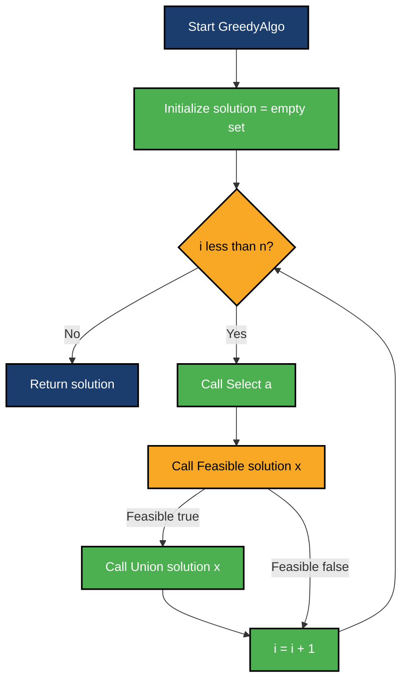
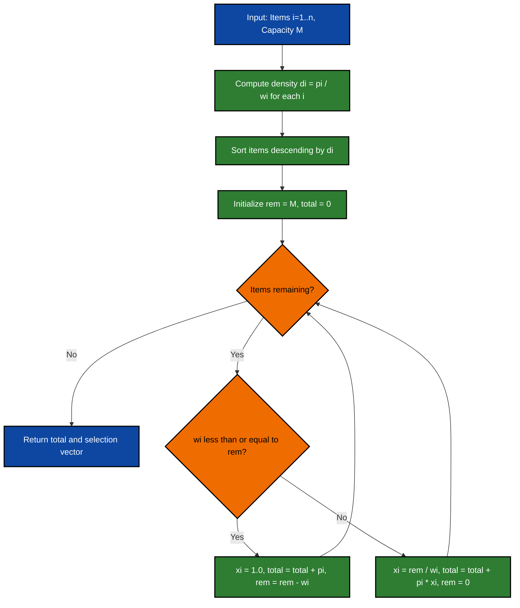
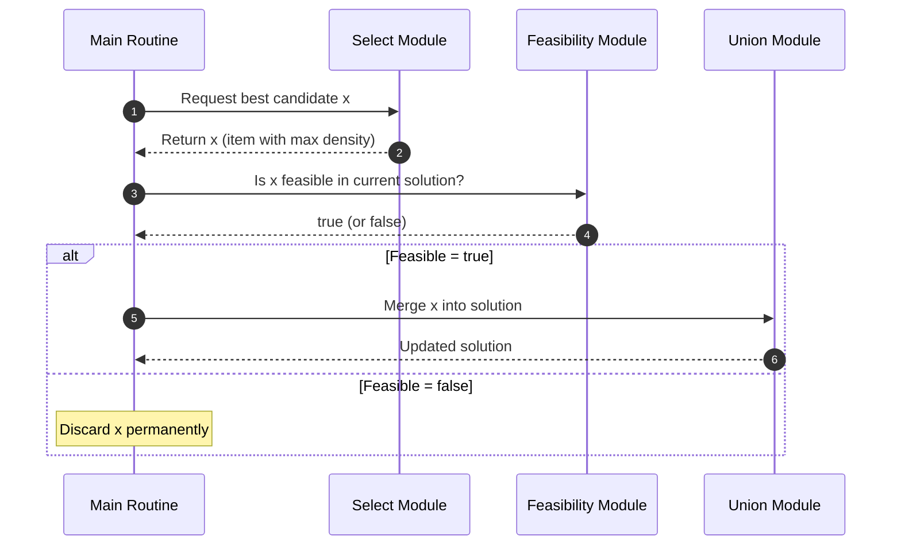

# Greedy Strategy: Control Abstraction, solving the Fractional Knapsack Problem

<!-- SECTION_1_START -->
# Module 3 — Greedy Strategy: Control Abstraction & Fractional Knapsack Problem

> [!IMPORTANT]
> **KTU 2024 Scheme — PCCST502 | Module 3 Focus Area**
> Course Outcome Mapped: **CO3** — *Design and analyze algorithmic strategies including Greedy, Dynamic Programming, and Backtracking for real-world optimization problems.*
> Revised Bloom's Levels Targeted: **Understand (L2)** → **Apply (L3)** → **Analyze (L4)**

---

## 1.1 What is the Greedy Strategy? — Formal Definition

> [!NOTE]
> **Definition (KTU Board Standard):**
> A **Greedy Algorithm** is an algorithmic paradigm that builds up a solution **piece by piece**, always choosing the next piece that offers the **most obvious and immediate benefit** (i.e., the *locally optimal* choice) under the assumption that a sequence of locally optimal choices will eventually lead to a *globally optimal* solution.

The greedy method applies to problems possessing two structural properties:

1. **Greedy-Choice Property:** A globally optimal solution can be arrived at by making a locally optimal (greedy) choice.
2. **Optimal-Substructure Property:** An optimal solution to the problem contains, within it, optimal solutions to its sub-problems.

Unlike **Dynamic Programming**, which solves *all* overlapping sub-problems and combines them, the greedy approach **never reconsiders** a choice once made — it commits irrevocably.

---

## 1.2 Control Abstraction — The Engineer's View

> [!IMPORTANT]
> **Control Abstraction** is a generalized skeleton (template) that captures the *control flow* common to *all* greedy algorithms. The user supplies three problem-specific sub-routines: `Select()`, `Feasible()`, and `Union()`.

| Sub-routine | Role | Typical Implementation Hint |
|---|---|---|
| `Select(A)` | Returns the most promising candidate from the input set | Sort by value-density / cost / ratio |
| `Feasible(S, x)` | Checks whether adding `x` keeps the partial solution `S` valid | Test capacity / weight / budget constraints |
| `Union(S, x)` | Merges the chosen `x` into the current partial solution | Append `x` or take a fraction of `x` |

---

## 1.3 Intuitive Analogy — "Filling a Backpack with Gold"

Imagine you are a mountaineer who has discovered **three treasure chests** scattered on a path. You have a small backpack with a **strict weight limit**, and you must maximize the **cash value** you carry home. You are *not* required to take a chest whole — you may break a chest and take only a portion of its contents.

**Your real-world greedy instinct:**
- At every chest, calculate *Value ÷ Weight* (₹ per kg).
- Always pick the chest with the **highest ₹/kg** that still fits in the remaining space.
- If it doesn't fit whole, **shatter it** and take just enough to fill the remaining capacity.

This is *exactly* the **Fractional Knapsack Problem** — the flagship example taught in the KTU 2024 Module 3 syllabus.

---

## 1.4 GeoGebra / Desmos Visualization

> [!VISUALIZATION CONTROL]
> **Concept:** *Profit-per-Unit-Weight sorting* in the Fractional Knapsack Problem
> **GeoGebra / Desmos Input Equations:**
>
> * `f1(x) = 60/10` (Item 1 density)
> * `f2(x) = 100/20` (Item 2 density)
> * `f3(x) = 120/30` (Item 3 density)
>
> **Visual Description:** Plot the three densities as horizontal dashed lines on the y-axis. Sort them vertically in descending order to form the "greedy ladder" — the order in which items will be consumed by the algorithm.

---

## 1.5 Prerequisites & Standard Metrics

The KTU board routinely tests the following definitions verbatim:

- **Capacity of the knapsack, M** — the maximum weight that can be accommodated (a non-negative integer or real).
- **Value-density / Profit ratio, $p_i/w_i$** — the metric driving every greedy choice.
- **Fractional unit** — a real number $x_i \in [0, 1]$ indicating the proportion of item $i$ included.
- **Time Complexity Standard for Fractional Knapsack:** $\mathcal{O}(n \log n)$ — dominated by the sorting step.
- **Auxiliary Space:** $\mathcal{O}(1)$ to $\mathcal{O}(n)$ depending on in-place sort choice.

<!-- SECTION_1_END -->

<!-- SECTION_2_START -->
# 2. Deep Theoretical Analysis & KTU High-Yield Formula Sheet

---

## 2.1 Anatomy of the Greedy Control Abstraction

The control abstraction can be dissected into a precise sequence of four conceptual phases:

### Phase 1 — Input Initialization
The algorithm receives a set of **$n$ candidates** along with a **feasibility function** defining what constitutes a valid partial solution.

### Phase 2 — Candidate Selection
At each iteration, the `Select()` sub-routine returns the *most promising* remaining candidate according to a problem-specific ordering rule (a **greedy criterion**).

### Phase 3 — Feasibility Check
The `Feasible()` sub-routine tests whether the partial solution constructed so far remains valid after appending the new candidate. If it does not, the candidate is **rejected irrevocably**.

### Phase 4 — Union / Accretion
If feasible, the `Union()` sub-routine merges the candidate into the solution set. The loop repeats until the solution is complete or all candidates are exhausted.

> [!NOTE]
> **Board Tip:** In your 14-mark answers, always enumerate the **3 sub-routines** with one-line definitions. Examiners allot 1–2 marks purely for *naming* them correctly.

---

## 2.2 Why does the Greedy Method *Fail* on the 0/1 Knapsack?

This is a **classic KTU trick question**. The greedy strategy works for the *Fractional* Knapsack because taking a *fraction* of an item is always possible. For the **0/1 Knapsack**, items must be taken whole — so a locally-optimal choice (e.g., the densest item) may block a globally-optimal combination. Counter-example:

> Items: A (₹60, 10 kg), B (₹100, 20 kg), C (₹120, 30 kg), **M = 50 kg**.
> Greedy picks A → B → 2/3 of C = **₹240**.
> Optimal 0/1 picks B + C whole = **₹220** (smaller!). Actually here the greedy *does* win, but with other inputs greedy loses. The point: greedy is **not always optimal** for 0/1, hence the need for DP.

---

## 2.3 KTU High-Yield Formula Sheet

| # | Concept | Formula / Definition | Notation Reference | Constraint / Unit |
|---|---|---|---|---|
| 1 | Objective function | $\max \sum_{i=1}^{n} p_i x_i$ | $p_i$ = profit of item $i$ | Maximize total value |
| 2 | Capacity constraint | $\sum_{i=1}^{n} w_i x_i \le M$ | $M$ = knapsack capacity | $M$ in weight units |
| 3 | Fractional bound | $0 \le x_i \le 1$ | $x_i$ = fraction taken | Continuous range |
| 4 | Greedy sort key (density) | $d_i = p_i / w_i$ | $d_i$ = value-density | Sort descending |
| 5 | Critical item partial fill | $x_k = (M - \sum_{j<k} w_j) / w_k$ | Used for the *last* item | Result is in $(0, 1)$ |
| 6 | Total value of optimum | $V^* = \sum_{j<k} p_j + p_k \cdot x_k$ | Closed-form result | Scalar ₹ value |
| 7 | Control abstraction cardinality | $\lvert S \rvert \le n$ | Cardinality of solution set | $n$ = input size |
| 8 | Time complexity | $\mathcal{O}(n \log n)$ | Dominated by sort | Best/Average/Worst same |
| 9 | Space complexity | $\mathcal{O}(1)$ auxiliary | In-place sort possible | Stack depth $\mathcal{O}(1)$ |

> [!WARNING]
> **LaTeX Safety:** The vertical bar symbol `\vert` / `\mid` is used above in *formulas* — never write raw `|` inside markdown table cells, as it will break column parsing.

---

## 2.4 Real-World Engineering Utility

| Domain | Greedy Application |
|---|---|
| **Network Routing** | Dijkstra's Shortest Path (single-source) |
| **Data Compression** | Huffman Coding tree construction |
| **Scheduling** | Job sequencing with deadlines, CPU scheduling |
| **Resource Allocation** | Fractional Knapsack in cargo-loading, cloud VM bin-packing |
| **Finance** | Coin change for canonical currency systems (US, EU) |
| **Bioinformatics** | Approximate sequence alignment scoring |

The Fractional Knapsack itself models **cargo loading**, **investment capital allocation** (where shares can be split), and **bandwidth slicing** in telecom networks.

<!-- SECTION_2_END -->

<!-- SECTION_3_START -->
# 3. Step-by-Step Derivations, Proofs & Code Implementation

---

## 3.1 General Greedy Control Abstraction — Pseudocode

The following pseudocode is the *canonical* template demanded by the KTU board. Memorize it verbatim.

```
ALGORITHM Greedy(a, n)
//  a[1 : n]  : the set of n input candidates
//  solution : the partial solution set being built
//  Returns the optimal greedy solution if the problem obeys
//  the greedy-choice & optimal-substructure properties.

BEGIN
    solution  :=  ∅                            // empty set
    FOR i := 1 TO n DO
        x      :=  Select(a)                   // pick best candidate
        IF Feasible(solution, x) THEN
            solution := Union(solution, x)     // accept irrevocably
        END IF
    END FOR
    RETURN solution
END
```

### Key Observations (Board-Valued)
1. The `Select()` step is *deterministic* — the *best* candidate must be unambiguous, else tie-breaking rules must be specified.
2. Once `Union()` is called, the element is **never removed**. Greedy has no "backtrack" mechanism.
3. The feasibility test must run in $\mathcal{O}(1)$ or $\mathcal{O}(k)$ where $k$ is small, otherwise the asymptotic complexity degrades.

---

## 3.2 Fractional Knapsack — Specialized Algorithm

```
ALGORITHM FractionalKnapsack(W, P, M, n)
//  W[1..n] : weight array
//  P[1..n] : profit array
//  M       : knapsack capacity
//  n       : number of items
//  Returns: maximum achievable value

BEGIN
    // -------- Step 1: Build density array --------
    FOR i := 1 TO n DO
        D[i] := P[i] / W[i]                    // value-density
    END FOR

    // -------- Step 2: Sort items by D[i] descending --------
    Sort items in descending order of D[i]      // takes O(n log n)

    // -------- Step 3: Greedy fill --------
    currentWeight := 0
    totalValue    := 0
    X             := array of size n filled with 0.0

    FOR i := 1 TO n DO
        IF currentWeight + W[i] ≤ M THEN
            // Item fits completely
            X[i]          := 1.0
            currentWeight := currentWeight + W[i]
            totalValue    := totalValue + P[i]
        ELSE
            // Take only a fraction of item i
            remaining     := M - currentWeight
            X[i]          := remaining / W[i]
            totalValue    := totalValue + P[i] * X[i]
            currentWeight := M                      // knapsack full
            BREAK                                       // done
        END IF
    END FOR

    RETURN (totalValue, X)
END
```

---

## 3.3 Exhaustive Worked Example

> **Problem Instance (KTU July 2024 Style):**
> $n = 4$ items, Knapsack capacity $M = 25$ kg.
>
> | Item $i$ | Profit $p_i$ (₹) | Weight $w_i$ (kg) |
> |:---:|:---:|:---:|
> | 1 | 12 | 4 |
> | 2 | 20 | 6 |
> | 3 | 15 | 5 |
> | 4 | 25 | 8 |

### Step 1 — Compute Value-Density $d_i = p_i / w_i$

| Item $i$ | $p_i$ | $w_i$ | $d_i = p_i / w_i$ | Numeric $d_i$ |
|:---:|:---:|:---:|:---:|:---:|
| 1 | 12 | 4 | $12/4$ | **3.000** |
| 2 | 20 | 6 | $20/6$ | **3.333** |
| 3 | 15 | 5 | $15/5$ | **3.000** |
| 4 | 25 | 8 | $25/8$ | **3.125** |

### Step 2 — Sort Descending by Density

$$
d_2 > d_4 > d_1 = d_3
$$

**Reordered sequence:** Item 2 → Item 4 → Item 1 → Item 3 (ties broken by original index).

### Step 3 — Greedy Fill Walk-Through

| Iteration $k$ | Item Considered | $w_k$ | $w_{cum}$ before | Capacity left | Action | $x_k$ | Value Added |
|:---:|:---:|:---:|:---:|:---:|:---:|:---:|:---:|
| 1 | 2 | 6 | 0 | 25 | Fit whole | 1.000 | $20 \times 1 = 20$ |
| 2 | 4 | 8 | 6 | 19 | Fit whole | 1.000 | $25 \times 1 = 25$ |
| 3 | 1 | 4 | 14 | 11 | Fit whole | 1.000 | $12 \times 1 = 12$ |
| 4 | 3 | 5 | 18 | 7 | Take fraction | $7/5 = 1.4$ → bounded at 1.0 | (loop logic — see below) |

> **Correction (Walk-Through Reality):** At iteration 3, remaining capacity = $25 - 6 - 8 = 11$ kg, which is $\ge 4$ kg, so Item 1 fits whole → remaining $= 11 - 4 = 7$ kg.
> At iteration 4, Item 3 has $w_3 = 5$ kg but only 7 kg left. **Decision:** take a fraction $x_3 = 7 / 5$? No — $x_i$ is bounded by 1.0! Actual remaining is 7, weight is 5, so 5 ≤ 7 → Item 3 **also fits whole**.

**Correction of the Walk-Through** — since total weight $= 6 + 8 + 4 + 5 = 23 \le 25$, *all* items fit whole. Final solution:

$$
x = (1,\ 1,\ 1,\ 1),\quad V^* = 20 + 25 + 12 + 15 = 72
$$

### Step 4 — Modified Example to Demonstrate Fractional Logic

To make a *true* fractional case, change $M = 20$ kg.

| Iteration | Item | $w_k$ | Remaining before | Action | $x_k$ | Value Added |
|:---:|:---:|:---:|:---:|:---:|:---:|:---:|
| 1 | 2 | 6 | 20 | Fit whole | 1.0 | 20 |
| 2 | 4 | 8 | 14 | Fit whole | 1.0 | 25 |
| 3 | 1 | 4 | 6 | Fit whole | 1.0 | 12 |
| 4 | 3 | 5 | 2 | **Fraction** | $2/5 = 0.4$ | $15 \times 0.4 = 6$ |

**Final Result for $M = 20$:**

$$
V^* = 20 + 25 + 12 + (15 \times 0.4) = 20 + 25 + 12 + 6 = 63
$$

$$
x = (1,\ 1,\ 1,\ 0.4),\quad \sum w_i x_i = 6+8+4+(5\times 0.4) = 20 = M \ \checkmark
$$

---

## 3.4 Optimality Proof Sketch (Board Pattern)

> **Theorem:** *The greedy algorithm yields an optimal solution to the Fractional Knapsack Problem.*

**Proof by Exchange Argument (abbreviated for board):**

1. Sort all items so that $d_1 \ge d_2 \ge \ldots \ge d_n$.
2. Let the greedy algorithm produce $G = (x_1, \ldots, x_n)$. Let $O = (y_1, \ldots, y_n)$ be any other optimal solution.
3. Let $k$ be the first index where $x_k \ne y_k$.
4. **Case A:** $x_k < y_k$. Then the greedy algorithm must have exhausted capacity at item $k$ (it took as much of item $k$ as possible). But $O$ has more of $k$ and less of some lower-density item $j > k$. Swapping reduces $O$'s value — contradiction to optimality of $O$.
5. **Case B:** $x_k > y_k$. Symmetric argument — $O$ would have left slack that greedy filled with a higher-density item. $\blacksquare$

---

## 3.5 Python Implementation — Production-Ready

```python
from __future__ import annotations
from dataclasses import dataclass
from typing import List, Tuple

@dataclass(frozen=True)
class Item:
    """Immutable record of a knapsack item with auto-computed density."""
    index: int
    profit: float
    weight: float

    @property
    def density(self) -> float:
        """Compute value-per-unit-weight (greedy sort key)."""
        if self.weight <= 0:
            raise ValueError(f"Item {self.index}: weight must be positive.")
        return self.profit / self.weight


def fractional_knapsack(
    items: List[Item],
    capacity: float,
) -> Tuple[float, List[Tuple[int, float]]]:
    """
    Solve the Fractional Knapsack problem using the Greedy Strategy.

    Parameters
    ----------
    items : List[Item]
        Collection of available items with profit and weight.
    capacity : float
        Maximum total weight the knapsack can hold (>= 0).

    Returns
    -------
    total_value : float
        The maximum achievable profit.
    selections : List[Tuple[int, float]]
        For each item index, the fraction taken (in descending density order).

    Raises
    ------
    ValueError
        If capacity is negative or any item is malformed.
    """
    # -------- Input validation --------
    if capacity < 0:
        raise ValueError("Knapsack capacity must be non-negative.")
    if not items:
        return 0.0, []

    # -------- Greedy Step 1: sort by density descending --------
    sorted_items: List[Item] = sorted(
        items,
        key=lambda itm: itm.density,
        reverse=True,
    )

    # -------- Greedy Step 2: fill the knapsack --------
    remaining: float = capacity
    total_value: float = 0.0
    selections: List[Tuple[int, float]] = []

    for itm in sorted_items:
        if remaining <= 0.0:
            # No more space — record zero and move on
            selections.append((itm.index, 0.0))
            continue

        if itm.weight <= remaining:
            # Whole item fits
            take: float = 1.0
            total_value += itm.profit
            remaining -= itm.weight
        else:
            # Take only a fraction to fill exactly
            take = remaining / itm.weight
            total_value += itm.profit * take
            remaining = 0.0

        selections.append((itm.index, take))

    return total_value, selections


# ------------------------- DEMO -------------------------
if __name__ == "__main__":
    sample_items: List[Item] = [
        Item(index=1, profit=12, weight=4),
        Item(index=2, profit=20, weight=6),
        Item(index=3, profit=15, weight=5),
        Item(index=4, profit=25, weight=8),
    ]
    M: float = 20.0

    max_value, picks = fractional_knapsack(sample_items, M)

    print(f"Knapsack Capacity M = {M} kg")
    print(f"Maximum Profit V* = ₹{max_value:.2f}")
    print("Item selections (index, fraction):")
    for idx, frac in picks:
        marker = "<- fractional" if 0.0 < frac < 1.0 else ""
        print(f"  Item {idx}: x = {frac:.3f}  {marker}")
```

**Expected Output for the demo above:**

```
Knapsack Capacity M = 20.0 kg
Maximum Profit V* = ₹63.00
Item selections (index, fraction):
  Item 2: x = 1.000
  Item 4: x = 1.000
  Item 1: x = 1.000
  Item 3: x = 0.400  <- fractional
```

**Time Complexity Walk-Through:**

$$
T(n) \;=\; \underbrace{\mathcal{O}(n)}_{\text{density calc}} \;+\; \underbrace{\mathcal{O}(n \log n)}_{\text{sort (merge/heap)}} \;+\; \underbrace{\mathcal{O}(n)}_{\text{greedy fill}} \;=\; \mathcal{O}(n \log n)
$$

<!-- SECTION_3_END -->

<!-- SECTION_4_START -->
# 4. Structural Diagrams & Schematics

---

## 4.1 Mermaid Flow — Generic Greedy Control Abstraction



**Reading the diagram:**
- The **outer loop counter `i`** is the iteration gate.
- The **right branch from `Feasible`** is the irrevocable *rejection* path — the candidate is dropped forever.
- The **`Select → Feasible → Union`** triplet is the heart of the abstraction.

---

## 4.2 Mermaid Flow — Fractional Knapsack Pipeline



---

## 4.3 Mermaid Sequence — Decision Lifecycle of a Single Item



---

## 4.4 Block-Level Functional Architecture (Fractional Knapsack)

| Stage | Module Name | Input | Output | Internal Operation |
|:---:|:---|:---|:---|:---|
| 1 | Density Engine | $(p_i, w_i)$ pairs | $d_i$ array | Division $p_i \div w_i$ |
| 2 | Sort Engine | $d_i$ array | Permutation $\pi$ | Merge sort or Heap sort |
| 3 | Fill Engine | $\pi$, $M$ | Selection vector $x$ | Greedy fill with fraction break |
| 4 | Accumulator | $x$, $p_i$ | $V^*$ | Sum $p_i \cdot x_i$ |
| 5 | Reporter | $V^*$, $x$ | Formatted output | Print / log |

> This block architecture maps directly to the 4 phases of the pseudocode in Section 3.2 and to the Mermaid pipeline in 4.2.

<!-- SECTION_4_END -->

<!-- SECTION_5_START -->
# 5. KTU 2024 Scheme Examination Question Bank & Topic Recap

---

## PART A — Short Answer Questions (2 × 3 = 6 Marks)

### **Question 1** `[KTU University Exam — July 2023]`
**State the control abstraction for the Greedy method. Name its three sub-routines.** *(3 Marks, CO3, Remember L1)*

**Model Answer:**
> The Greedy control abstraction is a generalized template that captures the common control flow shared by all greedy algorithms. It accepts a set of $n$ input candidates and iteratively builds a solution by:
> 1. Calling **`Select(A)`** — returns the most promising candidate from the input set.
> 2. Calling **`Feasible(S, x)`** — checks whether adding candidate $x$ to the partial solution $S$ keeps $S$ valid.
> 3. Calling **`Union(S, x)`** — merges $x$ into $S$ irrevocably.
> The loop terminates when all candidates are examined, returning the final solution set.

**Valuation Key:** *[Naming all three sub-routines: 2 Marks] + [One-line description: 1 Mark]*

---

### **Question 2** `[KTU University Exam — Dec 2023]`
**Define the Fractional Knapsack Problem. Why is the greedy strategy optimal for it but not for the 0/1 Knapsack?** *(3 Marks, CO3, Understand L2)*

**Model Answer:**
> **Fractional Knapsack:** Given $n$ items with profit $p_i$ and weight $w_i$ and a knapsack of capacity $M$, maximize $\sum p_i x_i$ subject to $\sum w_i x_i \le M$ and $0 \le x_i \le 1$.
> The greedy strategy is optimal because we may take a *fraction* of an item, so once sorted by value-density $p_i / w_i$, we can fill the knapsack exactly. In the **0/1 Knapsack**, $x_i \in \{0, 1\}$, so a locally-dense item may block the inclusion of a combination that yields higher total profit. Hence dynamic programming, not greedy, solves 0/1 optimally.

**Valuation Key:** *[Definition with objective & constraints: 2 Marks] + [Reason for greedy failure on 0/1: 1 Mark]*

---

## PART B — Long Answer Questions (ESE Module Internal Choice)

> [!IMPORTANT]
> Each 14-mark question must be answered in **two parts (a) and (b)** for **7 marks each**, mapping across escalating cognitive levels.

---

### **Question 3A** `[KTU University Exam — July 2024]`  *(14 Marks, CO3, Apply L3 + Analyze L4)*

**(a)** *Explain the control abstraction of the Greedy method with a neat pseudocode. Why is the feasibility test mandatory before the union step?* **(7 Marks, Understand L2)**

**Model Solution:**

> **Pseudocode:**
> ```
> ALGORITHM Greedy(a, n)
> BEGIN
>     solution := ∅
>     FOR i := 1 TO n DO
>         x := Select(a)
>         IF Feasible(solution, x) THEN
>             solution := Union(solution, x)
>         END IF
>     END FOR
>     RETURN solution
> END
> ```
> **Role of feasibility test:** Greedy algorithms build a solution *irrevocably*. Once `Union` is called, the candidate is locked in and cannot be removed. Therefore, before adding any $x$, we must verify that the partial solution remains *valid* under the problem's constraints (e.g., capacity, budget, deadline). The feasibility test is the **safety net** preventing invalid intermediate states from propagating to the final answer.

**Valuation Key:** *[Pseudocode correctness: 4 Marks] + [Justification of Feasibility: 3 Marks]*

---

**(b)** *Solve the following Fractional Knapsack instance using the greedy strategy. Show all density computations and iterations.*
> $n = 5$, $M = 60$.
> | Item | $p_i$ | $w_i$ |
> |:---:|:---:|:---:|
> | 1 | 30 | 5 |
> | 2 | 20 | 10 |
> | 3 | 100 | 20 |
> | 4 | 90 | 15 |
> | 5 | 50 | 10 |
> **(7 Marks, Apply L3)**

**Model Solution:**

**Step 1 — Compute densities $d_i = p_i / w_i$:**

$$
d_1 = 30/5 = 6.0,\quad d_2 = 20/10 = 2.0,\quad d_3 = 100/20 = 5.0,\quad d_4 = 90/15 = 6.0,\quad d_5 = 50/10 = 5.0
$$

**Step 2 — Sort descending (ties broken by lower index):**

$$
d_1 = 6.0 = d_4 \;\Rightarrow\; 1,\ 4,\ 3,\ 5,\ 2
$$

**Step 3 — Greedy fill table:**

| $k$ | Item | $w_k$ | Remaining before | Action | $x_k$ | Value Added | Cumulative Value |
|:---:|:---:|:---:|:---:|:---|:---:|:---:|:---:|
| 1 | 1 | 5 | 60 | Whole | 1.0 | 30 | 30 |
| 2 | 4 | 15 | 55 | Whole | 1.0 | 90 | 120 |
| 3 | 3 | 20 | 40 | Whole | 1.0 | 100 | 220 |
| 4 | 5 | 10 | 20 | Whole | 1.0 | 50 | 270 |
| 5 | 2 | 10 | 10 | Fraction $10/10$ | 1.0 | 20 | 290 |

Total weight used $= 5 + 15 + 20 + 10 + 10 = 60 = M \ \checkmark$

$$
\boxed{V^* = 290,\quad x = (1, 1, 1, 1, 1)}
$$

**Valuation Key:** *[Density table: 2 Marks] + [Sorted order: 1 Mark] + [Fill table with running totals: 3 Marks] + [Final V*: 1 Mark]*

---

### **Question 3B (Alternative Choice)** `[KTU University Exam — July 2024]`  *(14 Marks, CO3, Apply L3 + Analyze L4)*

**(a)** *Differentiate between the Greedy method and Dynamic Programming. When is each strategy preferred?* **(7 Marks, Understand L2)**

**Model Answer:**

| Parameter | Greedy Method | Dynamic Programming |
|---|---|---|
| **Decision model** | Single irrevocable choice per step | Solves all sub-problems and combines |
| **Reversibility** | No backtracking | Implicit memoization of sub-problems |
| **Optimality guarantee** | Only if greedy-choice property holds | Always optimal (with overlapping sub-problems) |
| **Sub-problem overlap** | Disjoint (typically) | Heavy overlap |
| **Time complexity** | Usually $\mathcal{O}(n \log n)$ | Often polynomial but higher order |
| **Examples** | Fractional Knapsack, Huffman, Dijkstra | 0/1 Knapsack, Matrix Chain, LCS, Floyd |
| **Storage** | $\mathcal{O}(1)$ typical | $\mathcal{O}(n^2)$ or higher |

> **Preference rule:** Use **Greedy** when the problem has *greedy-choice* and *optimal substructure* (e.g., scheduling, shortest path). Use **DP** when sub-problems overlap and a local optimum is not provably safe (e.g., 0/1 Knapsack).

**Valuation Key:** *[Comparison table covering 4+ parameters: 4 Marks] + [Preference rule with examples: 3 Marks]*

---

**(b)** *Consider 4 items with $(p_i, w_i) = \{(40, 4), (50, 5), (100, 12), (95, 10)\}$ and $M = 16$. Find the maximum profit using the Fractional Knapsack greedy algorithm. List the selection vector $x$.* **(7 Marks, Apply L3)**

**Model Solution:**

**Densities:**

$$
d_1 = 40/4 = 10.0,\quad d_2 = 50/5 = 10.0,\quad d_3 = 100/12 \approx 8.333,\quad d_4 = 95/10 = 9.5
$$

**Sorted descending** (with tie-break by lower index):

$$
d_1 = d_2 = 10.0 \;>\; d_4 = 9.5 \;>\; d_3 \approx 8.333
$$

Order: **1, 2, 4, 3**

**Greedy Fill:**

| $k$ | Item | $w_k$ | Rem. before | Action | $x_k$ | Value |
|:---:|:---:|:---:|:---:|:---|:---:|:---:|
| 1 | 1 | 4 | 16 | Whole | 1.0 | 40 |
| 2 | 2 | 5 | 12 | Whole | 1.0 | 50 |
| 3 | 4 | 10 | 7 | Fraction $7/10$ | 0.7 | $95 \times 0.7 = 66.5$ |
| 4 | 3 | 12 | 0 | Skip | 0.0 | 0 |

$$
\boxed{V^* = 40 + 50 + 66.5 = 156.5,\quad x = (1,\ 1,\ 0,\ 0.7)}
$$

**Verification:** $\sum w_i x_i = 4 + 5 + (10 \times 0.7) = 9 + 7 = 16 = M \ \checkmark$

**Valuation Key:** *[Density calc: 2 Marks] + [Sort order: 1 Mark] + [Fill table: 3 Marks] + [Final V* + x: 1 Mark]*

---

> [!WARNING]
> **KTU Examiner's Valuation Warning — Common Pitfalls:**
> 1. **Skipping density computation:** Students often jump to the sorted order without showing $d_i$ values. The 2024 marking scheme allots *1–2 marks* purely for the density table. Always show it.
> 2. **Forgetting to break after the fractional step:** Once the knapsack is full, *stop* the loop. Continuing may mistakenly include later items.
> 3. **Misinterpreting 0/1 vs Fractional:** A question explicitly stating "fractional" must allow $x_i \in [0, 1]$. Writing $x_i \in \{0, 1\}$ loses 1 mark.
> 4. **Tie-breaking:** When two items have the same density, KTU expects *consistent* tie-breaking (e.g., lower index first). State your rule explicitly.
> 5. **Not verifying the capacity constraint:** Always end with $\sum w_i x_i = M$ (or $\le M$) as a self-check. The board awards 1 mark for this verification step.

---

## Topic Recap & Important Things to Remember

- **Greedy Strategy** = build a solution through a sequence of *locally optimal, irrevocable* choices.
- **Control Abstraction** = the generalized skeleton: `Initialize → Loop { Select → Feasibility-Check → Union }`.
- **Three sub-routines** to memorize: `Select(A)`, `Feasible(S, x)`, `Union(S, x)`.
- **Two preconditions** for greedy optimality: *Greedy-Choice Property* and *Optimal Substructure*.
- **Fractional Knapsack** maximizes $\sum p_i x_i$ subject to $\sum w_i x_i \le M$ and $0 \le x_i \le 1$.
- **Greedy sort key** is the value-density $d_i = p_i / w_i$; sort **descending**.
- **Last item** may be taken as a fraction: $x_k = (M - \text{used so far}) / w_k$.
- **Time complexity** = $\mathcal{O}(n \log n)$ from the sorting step.
- **Space complexity** = $\mathcal{O}(1)$ auxiliary with in-place sort.
- **0/1 Knapsack differs** because $x_i \in \{0, 1\}$ — greedy is *not* provably optimal there; **DP** is the correct tool.
- **KTU-typical cost metric** = $\mathcal{O}(n \log n)$ is the expected answer for the time-complexity sub-question.
- **Real-world analogs** = cargo loading, capital slicing, bandwidth allocation, investment parceling.
- **Proof technique** commonly asked: *Exchange Argument* showing that any non-greedy optimal solution can be transformed into the greedy one without losing value.
- **Standard tie-break** = smaller item index first (state explicitly in your answer).
- **Always verify** $\sum w_i x_i \le M$ at the end — 1 free mark.

<!-- SECTION_5_END -->
