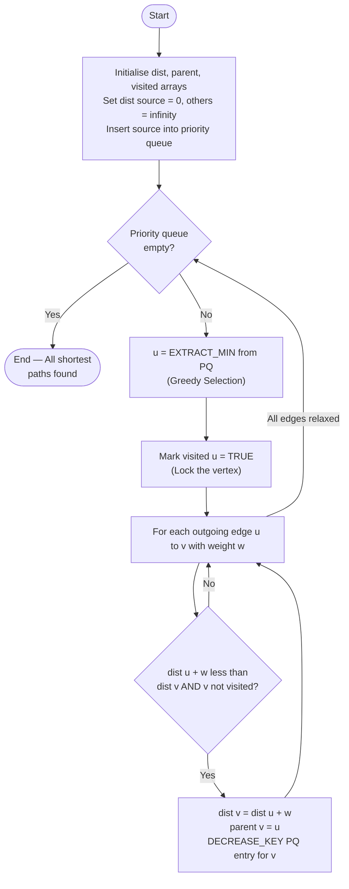
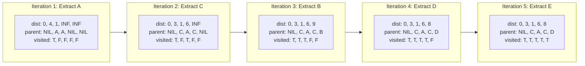
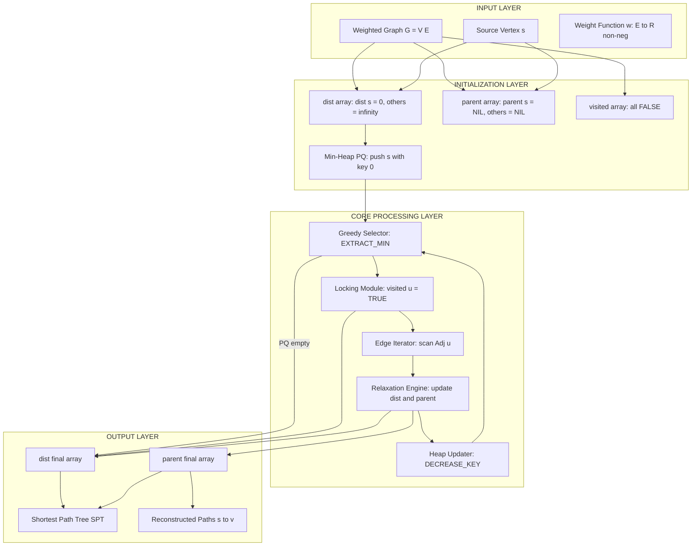

# Path Optimization: Dijkstra's Single-Source Shortest Path Algorithm execution and state arrays

<!-- SECTION_1_START -->
# Dijkstra's Single-Source Shortest Path Algorithm

## 1.1 Formal Definition (KTU 2024 Syllabus Terminology)

> [!IMPORTANT]
> **Dijkstra's Algorithm** is a **greedy algorithm** that solves the **single-source shortest path (SSSP)** problem for a directed or undirected graph $G = (V, E)$ with **non-negative edge weights**. It maintains a set of vertices whose final shortest-path distances from the source vertex $s$ have been determined and repeatedly selects the unprocessed vertex with the minimum tentative distance, finalizing it permanently.

The algorithm was conceived by **Edsger W. Dijkstra** in **1956** and published in **1959**. It is a cornerstone of the **Greedy Strategy** module in the KTU 2024 PCCST502 syllabus and forms the foundation for many routing protocols (e.g., **OSPF – Open Shortest Path First**).

### Formal Statement

Given:
- A weighted graph $G = (V, E)$ with $n = \vert V \vert$ vertices and $m = \vert E \vert$ edges.
- A source vertex $s \in V$.
- A weight function $w : E \rightarrow \mathbb{R}_{\geq 0}$ (all weights $\geq 0$).

**Goal:** For every vertex $v \in V$, compute $\delta(s, v)$, the minimum total weight of any path from $s$ to $v$.

### State Arrays (The Engine of the Algorithm)

Three state arrays govern Dijkstra's execution:

| State Array | Symbol | Purpose |
|:---:|:---:|:---|
| Distance Array | $\text{dist}[1 \dots n]$ | Current best known shortest distance from $s$ to every vertex |
| Visited / Permanent Array | $\text{visited}[1 \dots n]$ | Marks vertices whose shortest path is **finalized** (locked) |
| Predecessor / Parent Array | $\text{parent}[1 \dots n]$ | Stores the immediate predecessor of each vertex on its shortest path |

> [!NOTE]
> **Initial State:** $\text{dist}[s] = 0$, $\text{dist}[v] = \infty$ for all $v \neq s$, $\text{visited}[v] = \text{False}$ for all $v$, $\text{parent}[s] = -1$ (or null).

---

## 1.2 Conceptual Analogy / Intuition

Imagine you are standing at a metro station $s$ and want to find the cheapest (shortest in time/cost) way to reach every other station in the city. You have a map where every road has a "travel time" associated with it.

**Your strategy (Greedy Choice):**
1. You start at $s$ with cost **$0$**. All other stations are temporarily "unvisited" with an estimated cost of **infinity** (unreachable until proven).
2. From your current station, you look at all the directly connected stations and **update** their estimated cost on your notepad. This is called **relaxation**.
3. Among all **unvisited** stations, you pick the one with the **smallest estimated cost** — this is the greedy choice. You are now **certain** this is the cheapest way to reach it (this is the **greedy-choice property** for graphs with non-negative weights).
4. You "lock" this station (mark it visited) and repeat from step 2 until every station is locked.

> [!TIP]
> **Why does locking work?** Because all edge weights are non-negative, any future path that goes through an already-locked station cannot offer a shorter route — you'd only add more non-negative distance. This is the **optimal substructure** property of shortest paths.

### Geometric Intuition (Concentric Wavefront)

If you imagine dropping a stone into still water at vertex $s$, the ripples expand outward at a speed inversely proportional to edge weight. Vertices reached by the **first wave** have the shortest path, vertices reached by the **second wave** have the second shortest, and so on. Dijkstra's algorithm is exactly this wavefront expansion, executed discretely.

### GeoGebra / Desmos Visualization

> [!VISUALIZATION CONTROL]
> **Concept:** Distance-front propagation from source vertex $s = A$ in a weighted graph.
> **GeoGebra / Desmos Input Equations:**
> * Place vertices $A(0,0)$, $B(4,0)$, $C(2,3)$, $D(6,3)$, $E(8,0)$.
> * Edges: $AB = 4$, $AC = 1$, $BC = 2$, $CD = 5$, $BD = 3$, $DE = 2$.
> * Plot concentric circles: $(x-0)^2 + (y-0)^2 = r^2$ for $r = 1, 3, 4, 5, 7$.
> **Visual Description:** As $r$ increases, observe which vertex is "absorbed" first ($C$ at $r=1$), then the next unvisited nearest, and so on. The order of absorption matches the greedy selection order.

---

## 1.3 Physical Constants & Standard Metrics

- **No physical constants** are used (this is a discrete algorithm).
- **Time complexity** depends on the priority queue:
  * **Array (linear scan):** $O(V^2)$
  * **Binary Heap (min-heap):** $O((V + E) \log V)$
  * **Fibonacci Heap:** $O(V \log V + E)$
- **Space complexity:** $O(V)$ for the three state arrays plus the adjacency structure.
- **Single Source:** distances are computed from **one** source to **all** other vertices (contrast with All-Pairs Shortest Path like Floyd–Warshall).

<!-- SECTION_1_END -->

<!-- SECTION_2_START -->
# Deep Theoretical Analysis & KTU High-Yield Formula Sheet

## 2.1 The Greedy-Choice Property

Dijkstra's algorithm is the canonical example of a **greedy algorithm** that is provably optimal. The greedy choice is:

> *"When a vertex $u$ is extracted from the priority queue as the unvisited vertex with minimum $\text{dist}[u]$, its distance is final and cannot be improved."*

**Proof Sketch (Greedy-Choice Property):**
Suppose $u$ is the minimum-distance unvisited vertex with $\text{dist}[u] = d_u$, but an alternative path through another unvisited vertex $w$ would give a shorter route to $u$. Then $d_u > d_w + w(u) \geq d_w$ (since $w(u) \geq 0$). But this contradicts the fact that $u$ was chosen as the minimum. Hence, $d_u$ is optimal.

## 2.2 The Relaxation Operation (The Heart of the Algorithm)

For every edge $(u, v)$ with weight $w(u, v)$, **relaxation** updates $\text{dist}[v]$ if a shorter path is found through $u$:

$$
\text{relax}(u, v, w) : \quad
\begin{cases}
\text{if } \text{dist}[u] + w(u, v) < \text{dist}[v] : \\
\quad \text{dist}[v] \leftarrow \text{dist}[u] + w(u, v) \\
\quad \text{parent}[v] \leftarrow u
\end{cases}
$$

> [!NOTE]
> **Relaxation is the ONLY operation that updates $\text{dist}[v]$.** Selecting the minimum from the priority queue is just *who* gets to relax its outgoing edges.

## 2.3 The Edge Cases & Limitations

| Scenario | Behavior |
|:---|:---|
| Negative edge weight | **FAILS** — violates the greedy-choice assumption. |
| Unreachable vertex | $\text{dist}[v] = \infty$ after algorithm terminates. |
| Self-loop $w(v, v) = k$ | Ignored unless $k < 0$ (which is invalid anyway). |
| Disconnected component | Vertices in it remain at $\infty$. |
| Multiple shortest paths | Algorithm records **one** (whichever was discovered last during tie-breaking). |
| Zero-weight edge | Handled correctly; relaxation proceeds normally. |

## 2.4 KTU Formula Sheet / Cheat Sheet

| Concept | Formula / Expression | Notes |
|:---|:---|:---|
| Initialization | $\text{dist}[s] = 0$, others $= \infty$ | Source distance is $0$. |
| Relaxation condition | $\text{dist}[u] + w(u, v) < \text{dist}[v]$ | Only updates if strictly better. |
| Time (array) | $O(V^2 + E) = O(V^2)$ | Suitable for **dense** graphs. |
| Time (min-heap) | $O((V + E) \log V)$ | Suitable for **sparse** graphs. |
| Space | $O(V)$ | Three state arrays + adjacency. |
| Optimality condition | All $w(e) \geq 0$ | Mandatory requirement. |
| Path reconstruction | Trace $\text{parent}[v]$ backward from $v$ to $s$ | Build path in reverse. |
| Final answer for $v$ | $\delta(s, v) = \text{dist}[v]$ | Only true if $v$ is reachable. |

## 2.5 Real-World Engineering Applications

Dijkstra's algorithm is not merely academic — it powers:

1. **Network Routing Protocols (OSPF, IS-IS):** Routers compute shortest paths to every other router in the autonomous system.
2. **Google Maps / GPS Navigation:** Road networks (negative weights impossible since they represent time/distance) are preprocessed and queried via Dijkstra or A\* (a heuristic extension).
3. **Social Network "Degrees of Separation":** LinkedIn's "How you're connected" feature uses BFS (unweighted Dijkstra) to find paths in a few hops.
4. **IP Telephony (VoIP):** Call routing uses shortest-cost paths through telecom networks.
5. **Robotics Path Planning:** Mobile robots compute minimum-energy trajectories over a discretized grid.
6. **Electronic Design Automation (EDA):** Wire routing on VLSI chips uses Dijkstra to minimize total wire length.
7. **Game AI:** Pathfinding for non-player characters in real-time strategy games.

## 2.6 Why It Is Greedy (Not Dynamic Programming)

Although shortest path exhibits **optimal substructure** (a property of DP), Dijkstra's is classified as **greedy** because:
- It makes a **locally optimal choice** (the nearest unvisited vertex) without solving and combining all sub-problems first.
- DP would compute distances to all vertices considering **all** paths and then combine — exponentially expensive.
- The **non-negative weight constraint** is what makes the greedy choice globally optimal.

<!-- SECTION_2_END -->

<!-- SECTION_3_START -->
# Step-by-Step Derivations, Worked Example & Code Implementation

## 3.1 The Algorithm in Pseudocode (Cormen et al. style)

```
DIJKSTRA(G, w, s):
    for each vertex v in G.V:
        dist[v] = INFINITY
        parent[v] = NIL
        visited[v] = FALSE
    dist[s] = 0
    INSERT(Q, s)                         // priority queue keyed on dist
    while Q is not empty:
        u = EXTRACT_MIN(Q)                // greedy selection
        visited[u] = TRUE                 // lock the vertex
        for each vertex v in Adj[u]:      // relax all outgoing edges
            if not visited[v] and dist[u] + w(u, v) < dist[v]:
                dist[v] = dist[u] + w(u, v)
                parent[v] = u
                DECREASE_KEY(Q, v, dist[v])
```

> [!NOTE]
> The `visited` array is logically redundant when using a min-heap with `EXTRACT_MIN`, but is **essential** when using a simple array (linear scan) since the same vertex can be re-inserted during relaxation.

---

## 3.2 Exhaustive Worked Example (KTU Board Style)

Consider the following directed weighted graph with **5 vertices** and **7 edges**. Source vertex = **$A$**.

**Edges & Weights:**
- $A \to B = 4$
- $A \to C = 1$
- $C \to B = 2$
- $C \to D = 5$
- $B \to D = 3$
- $D \to E = 2$
- $B \to E = 6$

**Initial State Arrays:**

| Vertex | dist | visited | parent |
|:---:|:---:|:---:|:---:|
| A | 0 | F | NIL |
| B | $\infty$ | F | NIL |
| C | $\infty$ | F | NIL |
| D | $\infty$ | F | NIL |
| E | $\infty$ | F | NIL |

**Priority Queue (PQ):** $\{(A, 0)\}$

---

### **Iteration 1**

**EXTRACT_MIN:** $u = A$ (dist = 0). Lock $A$.

**Relax outgoing edges of $A$:**

**Edge $A \to B$, $w = 4$:**
- Condition: $0 + 4 < \infty$ ✓
- Update: $\text{dist}[B] = 4$, $\text{parent}[B] = A$

**Edge $A \to C$, $w = 1$:**
- Condition: $0 + 1 < \infty$ ✓
- Update: $\text{dist}[C] = 1$, $\text{parent}[C] = A$

**State after Iteration 1:**

| Vertex | dist | visited | parent |
|:---:|:---:|:---:|:---:|
| A | 0 | T | NIL |
| B | 4 | F | A |
| C | 1 | F | A |
| D | $\infty$ | F | NIL |
| E | $\infty$ | F | NIL |

**PQ:** $\{(C, 1), (B, 4)\}$

---

### **Iteration 2**

**EXTRACT_MIN:** $u = C$ (dist = 1). Lock $C$.

**Relax outgoing edges of $C$:**

**Edge $C \to B$, $w = 2$:**
- Condition: $1 + 2 = 3 < 4$ ✓
- Update: $\text{dist}[B] = 3$, $\text{parent}[B] = C$

**Edge $C \to D$, $w = 5$:**
- Condition: $1 + 5 = 6 < \infty$ ✓
- Update: $\text{dist}[D] = 6$, $\text{parent}[D] = C$

**State after Iteration 2:**

| Vertex | dist | visited | parent |
|:---:|:---:|:---:|:---:|
| A | 0 | T | NIL |
| B | 3 | F | C |
| C | 1 | T | A |
| D | 6 | F | C |
| E | $\infty$ | F | NIL |

**PQ:** $\{(B, 3), (D, 6)\}$

---

### **Iteration 3**

**EXTRACT_MIN:** $u = B$ (dist = 3). Lock $B$.

**Relax outgoing edges of $B$:**

**Edge $B \to D$, $w = 3$:**
- Condition: $3 + 3 = 6 < 6$? **NO** (strict inequality fails, $6 \not< 6$)
- No update.

**Edge $B \to E$, $w = 6$:**
- Condition: $3 + 6 = 9 < \infty$ ✓
- Update: $\text{dist}[E] = 9$, $\text{parent}[E] = B$

**State after Iteration 3:**

| Vertex | dist | visited | parent |
|:---:|:---:|:---:|:---:|
| A | 0 | T | NIL |
| B | 3 | T | C |
| C | 1 | T | A |
| D | 6 | F | C |
| E | 9 | F | B |

**PQ:** $\{(D, 6), (E, 9)\}$

---

### **Iteration 4**

**EXTRACT_MIN:** $u = D$ (dist = 6). Lock $D$.

**Relax outgoing edges of $D$:**

**Edge $D \to E$, $w = 2$:**
- Condition: $6 + 2 = 8 < 9$ ✓
- Update: $\text{dist}[E] = 8$, $\text{parent}[E] = D$

**State after Iteration 4:**

| Vertex | dist | visited | parent |
|:---:|:---:|:---:|:---:|
| A | 0 | T | NIL |
| B | 3 | T | C |
| C | 1 | T | A |
| D | 6 | T | C |
| E | 8 | F | D |

**PQ:** $\{(E, 8)\}$

---

### **Iteration 5**

**EXTRACT_MIN:** $u = E$ (dist = 8). Lock $E$. No outgoing edges. Terminate.

---

### **Final Result**

| Vertex | Shortest Distance $\delta(A, v)$ | Shortest Path |
|:---:|:---:|:---:|
| A | 0 | $A$ |
| B | 3 | $A \to C \to B$ |
| C | 1 | $A \to C$ |
| D | 6 | $A \to C \to D$ |
| E | 8 | $A \to C \to D \to E$ |

> [!TIP]
> **Path reconstruction (for $E$):** Start at $E$, follow $\text{parent}$: $E \leftarrow D \leftarrow C \leftarrow A$. Reverse to get $A \to C \to D \to E$.

---

## 3.3 Mathematical Verification of the Solution

The shortest path tree can be verified using the **triangle inequality** property: for every edge $(u, v) \in E$, $\text{dist}[v] \leq \text{dist}[u] + w(u, v)$.

$$
\begin{aligned}
\text{dist}[B] = 3, \quad w(C, B) &= 2, \quad \text{dist}[C] + w(C, B) = 1 + 2 = 3 = \text{dist}[B] \;\checkmark \\
\text{dist}[D] = 6, \quad w(B, D) &= 3, \quad \text{dist}[B] + w(B, D) = 3 + 3 = 6 = \text{dist}[D] \;\checkmark \\
\text{dist}[E] = 8, \quad w(D, E) &= 2, \quad \text{dist}[D] + w(D, E) = 6 + 2 = 8 = \text{dist}[E] \;\checkmark
\end{aligned}
$$

All edges in the shortest path tree are **tight** (equality holds), confirming optimality.

---

## 3.4 Full Python Implementation (Production-Grade)

```python
import heapq
from typing import Dict, List, Tuple, Optional
import sys

def dijkstra(
    graph: Dict[int, List[Tuple[int, int]]],
    source: int,
    num_vertices: int
) -> Tuple[Dict[int, int], Dict[int, Optional[int]]]:
    """
    Compute single-source shortest paths using Dijkstra's algorithm
    with a binary min-heap priority queue.
    
    Parameters
    ----------
    graph : adjacency list as {u: [(v, w), ...]}
    source : starting vertex
    num_vertices : total vertices in the graph
    
    Returns
    -------
    dist : {vertex: shortest distance from source}
    parent : {vertex: predecessor on shortest path, or None}
    """
    # State Array 1: dist — initialise to infinity
    dist: Dict[int, int] = {v: sys.maxsize for v in range(num_vertices)}
    # State Array 2: parent — initialise to None
    parent: Dict[int, Optional[int]] = {v: None for v in range(num_vertices)}
    # Initialise source
    dist[source] = 0
    
    # Min-heap: (current_known_distance, vertex)
    priority_queue: List[Tuple[int, int]] = [(0, source)]
    # State Array 3: visited — implicit via heap laziness + check
    visited: set = set()
    
    while priority_queue:
        current_dist, u = heapq.heappop(priority_queue)
        
        # Skip stale heap entries
        if u in visited:
            continue
        visited.add(u)                      # Lock the vertex
        
        # Stale entry guard: if popped distance is outdated, skip
        if current_dist > dist[u]:
            continue
        
        # Relax every outgoing edge of u
        for v, weight in graph.get(u, []):
            if v in visited:
                continue
            new_dist = current_dist + weight
            if new_dist < dist[v]:
                dist[v] = new_dist          # State update
                parent[v] = u               # State update
                heapq.heappush(priority_queue, (new_dist, v))
    
    return dist, parent


def reconstruct_path(parent: Dict[int, Optional[int]], target: int) -> List[int]:
    """Trace back parent pointers from target to source."""
    path: List[int] = []
    current: Optional[int] = target
    while current is not None:
        path.append(current)
        current = parent[current]
    return list(reversed(path))


# ---------------- DRIVER / TEST ----------------
if __name__ == "__main__":
    # Build the worked example graph
    graph: Dict[int, List[Tuple[int, int]]] = {
        0: [(1, 4), (2, 1)],     # A -> B (4), A -> C (1)
        1: [(3, 3), (4, 6)],     # B -> D (3), B -> E (6)
        2: [(1, 2), (3, 5)],     # C -> B (2), C -> D (5)
        3: [(4, 2)],             # D -> E (2)
        4: []                    # E has no outgoing edges
    }
    
    dist, parent = dijkstra(graph, source=0, num_vertices=5)
    
    print(f"{'Vertex':<10}{'Distance':<12}{'Path'}")
    print("-" * 45)
    vertex_names = {0: 'A', 1: 'B', 2: 'C', 3: 'D', 4: 'E'}
    for v in range(5):
        path = reconstruct_path(parent, v)
        path_str = " -> ".join(vertex_names[x] for x in path)
        dist_str = str(dist[v]) if dist[v] != sys.maxsize else "INF"
        print(f"{vertex_names[v]:<10}{dist_str:<12}{path_str}")
```

**Expected Output:**

```
Vertex    Distance    Path
---------------------------------------------
A         0           A
B         3           A -> C -> B
C         1           A -> C
D         6           A -> C -> D
E         8           A -> C -> D -> E
```

---

## 3.5 Complexity Derivation (Heap Variant)

Let $V$ be the number of vertices and $E$ the number of edges.

$$
\begin{aligned}
\text{Heap initialisation} &: O(V) \\
\text{Each vertex EXTRACT\_MIN} &: O(V \log V) \\
\text{Each edge → at most one DECREASE\_KEY} &: O(E \log V) \\
\text{Total time} &: O((V + E) \log V) = O(E \log V) \text{ for connected graphs}
\end{aligned}
$$

**For dense graphs** ($E \approx V^2$), the array-based $O(V^2)$ variant outperforms the heap-based $O(E \log V)$ variant, because $V^2$ vs $V^2 \log V$ — the array saves the logarithmic factor.

<!-- SECTION_3_END -->

<!-- SECTION_4_START -->
# Structural Diagrams & Schematics

## 4.1 Algorithm Control Flow (Mermaid Flowchart)



> [!NOTE]
> **Mermaid Safety:** All node IDs are alphanumeric. No special characters or HTML tags inside labels. No `end` as a node name (renamed to `endNode`).

---

## 4.2 State Array Evolution Block Diagram



---

## 4.3 Functional Architecture: Dijkstra's Algorithm Pipeline



---

## 4.4 The Worked Example Graph (ASCII Representation)

```
                    +---------+ 5 +---------+ 2 +---------+
                    |         |---|         |---|         |
                    v         |   v         |   v         |
    (A) --4-->(B) --3-->(D)        (C)            (E)
      \                          2 /   \              ^
       \                          /     \            /
        \                        v       \          /
         +----1----> (C) ------> (B)      6 -------+
                    (from A)    (from B)
```

**Cleaner adjacency view (undirected for visual clarity):**

```
         1
   A --------> C
   |  \        |  \
   4   \       2   5
   |    \      |    \
   v     \     v     v
   B <----+    B     D
   |  \         \    |
   3   6         3   2
   |    \        \  |
   v     v         v v
   D ----+----->   E
```

| Edge | Weight |
|:---:|:---:|
| A → B | 4 |
| A → C | 1 |
| C → B | 2 |
| C → D | 5 |
| B → D | 3 |
| B → E | 6 |
| D → E | 2 |

<!-- SECTION_4_END -->

<!-- SECTION_5_START -->
# KTU 2024 Scheme Examination Question Bank & Topic Recap

---

## Part A Questions (3 Marks Each)

### **Question 1** `[KTU University Exam – Dec 2023]`
**[CO1 | Remember]**
**Q: Define Dijkstra's algorithm. State one limitation and one application of it.**

**Model Answer (3 Marks):**

> [!NOTE]
> **Definition (1 Mark):** Dijkstra's algorithm is a greedy algorithm that finds the shortest path from a single source vertex to all other vertices in a weighted graph with non-negative edge weights. It maintains a set of visited vertices and repeatedly selects the unvisited vertex with the smallest tentative distance, finalizing it permanently.
>
> **Limitation (1 Mark):** It does not work correctly with negative edge weights, as the greedy-choice property is violated.
>
> **Application (1 Mark):** It is used in network routing protocols (e.g., OSPF) and GPS navigation systems to find the shortest path between two locations.

---

### **Question 2** `[KTU University Exam – July 2024]`
**[CO1 | Understand]**
**Q: What are the three state arrays maintained during Dijkstra's algorithm? Explain the role of each.**

**Model Answer (3 Marks):**

> [!NOTE]
> **1. Distance Array `dist[]` (1 Mark):** Stores the current best known shortest distance from the source vertex to every other vertex. Initialized to $\infty$ except $\text{dist}[s] = 0$.
>
> **2. Visited Array `visited[]` (1 Mark):** Boolean array marking vertices whose shortest distance is finalized (locked). Once `visited[v] = TRUE`, $\text{dist}[v]$ is never updated.
>
> **3. Parent Array `parent[]` (1 Mark):** Stores the immediate predecessor of each vertex on its shortest path. Used to reconstruct the actual path from source to any target by back-tracing.

---

## Part B Questions (14 Marks — Module Internal Choice)

### **Question A (14 Marks)** `[KTU University Exam – Dec 2023]`

**[CO2 | Apply + Analyze]**

> **Q: Consider the following directed weighted graph with 6 vertices. The adjacency list with edge weights is given below:**
>
> | Edge | Weight |
> |:---:|:---:|
> | A → B | 5 |
> | A → C | 3 |
> | B → D | 2 |
> | C → B | 1 |
> | C → E | 7 |
> | D → E | 4 |
> | D → F | 6 |
> | E → F | 1 |
>
> **(a)** Run Dijkstra's algorithm starting from vertex $A$. Show the contents of the distance, parent, and visited arrays after each iteration. **(7 Marks)**
>
> **(b)** Hence, determine the shortest path and shortest distance from $A$ to every other vertex. Also reconstruct the shortest path from $A$ to $F$. **(7 Marks)**

---

#### **Solution to Part (a) — 7 Marks**

**Initial State:** [Initial state arrays: 1 Mark]

| Vertex | dist | visited | parent |
|:---:|:---:|:---:|:---:|
| A | 0 | F | NIL |
| B | $\infty$ | F | NIL |
| C | $\infty$ | F | NIL |
| D | $\infty$ | F | NIL |
| E | $\infty$ | F | NIL |
| F | $\infty$ | F | NIL |

**PQ:** $\{(A, 0)\}$

---

**Iteration 1:** $u = A$, $\text{dist}[A] = 0$ (extract min). [Iteration 1 processing: 1 Mark]

Relax $A \to B$ ($w = 5$): $0 + 5 = 5 < \infty$ → $\text{dist}[B] = 5$, $\text{parent}[B] = A$
Relax $A \to C$ ($w = 3$): $0 + 3 = 3 < \infty$ → $\text{dist}[C] = 3$, $\text{parent}[C] = A$

[State after iteration: 0.5 Marks]

| A | B | C | D | E | F |
|:---:|:---:|:---:|:---:|:---:|:---:|
| 0 | 5 | 3 | $\infty$ | $\infty$ | $\infty$ |
| T | F | F | F | F | F |
| NIL | A | A | NIL | NIL | NIL |

**PQ:** $\{(C, 3), (B, 5)\}$

---

**Iteration 2:** $u = C$, $\text{dist}[C] = 3$. [Iteration 2: 1 Mark]

Relax $C \to B$ ($w = 1$): $3 + 1 = 4 < 5$ → $\text{dist}[B] = 4$, $\text{parent}[B] = C$ ✓
Relax $C \to E$ ($w = 7$): $3 + 7 = 10 < \infty$ → $\text{dist}[E] = 10$, $\text{parent}[E] = C$

| A | B | C | D | E | F |
|:---:|:---:|:---:|:---:|:---:|:---:|
| 0 | 4 | 3 | $\infty$ | 10 | $\infty$ |
| T | F | T | F | F | F |
| NIL | C | A | NIL | C | NIL |

**PQ:** $\{(B, 4), (E, 10)\}$

---

**Iteration 3:** $u = B$, $\text{dist}[B] = 4$. [Iteration 3: 1 Mark]

Relax $B \to D$ ($w = 2$): $4 + 2 = 6 < \infty$ → $\text{dist}[D] = 6$, $\text{parent}[D] = B$

| A | B | C | D | E | F |
|:---:|:---:|:---:|:---:|:---:|:---:|
| 0 | 4 | 3 | 6 | 10 | $\infty$ |
| T | T | T | F | F | F |
| NIL | C | A | B | C | NIL |

**PQ:** $\{(D, 6), (E, 10)\}$

---

**Iteration 4:** $u = D$, $\text{dist}[D] = 6$. [Iteration 4: 1 Mark]

Relax $D \to E$ ($w = 4$): $6 + 4 = 10 \not< 10$ → **No update** (strict inequality fails)
Relax $D \to F$ ($w = 6$): $6 + 6 = 12 < \infty$ → $\text{dist}[F] = 12$, $\text{parent}[F] = D$

| A | B | C | D | E | F |
|:---:|:---:|:---:|:---:|:---:|:---:|
| 0 | 4 | 3 | 6 | 10 | 12 |
| T | T | T | T | F | F |
| NIL | C | A | B | C | D |

**PQ:** $\{(E, 10), (F, 12)\}$

---

**Iteration 5:** $u = E$, $\text{dist}[E] = 10$. [Iteration 5: 1 Mark]

Relax $E \to F$ ($w = 1$): $10 + 1 = 11 < 12$ → $\text{dist}[F] = 11$, $\text{parent}[F] = E$ ✓

| A | B | C | D | E | F |
|:---:|:---:|:---:|:---:|:---:|:---:|
| 0 | 4 | 3 | 6 | 10 | 11 |
| T | T | T | T | T | F |
| NIL | C | A | B | C | E |

**PQ:** $\{(F, 11)\}$

---

**Iteration 6:** $u = F$, $\text{dist}[F] = 11$. No outgoing edges. Terminate. [Final state: 0.5 Mark]

---

#### **Solution to Part (b) — 7 Marks**

[Final distance table: 2 Marks]

| Vertex | Shortest Distance $\delta(A, v)$ | Shortest Path |
|:---:|:---:|:---:|
| A | 0 | $A$ |
| B | 4 | $A \to C \to B$ |
| C | 3 | $A \to C$ |
| D | 6 | $A \to C \to B \to D$ |
| E | 10 | $A \to C \to E$ |
| F | 11 | $A \to C \to E \to F$ |

[Reconstructing path $A \to F$: 2 Marks]

Trace parent pointers from $F$ backward:
- $F \leftarrow E$ ($\text{parent}[F] = E$)
- $E \leftarrow C$ ($\text{parent}[E] = C$)
- $C \leftarrow A$ ($\text{parent}[C] = A$)

Reverse: $A \to C \to E \to F$. [Final path: 1 Mark]

Total path weight: $3 + 7 + 1 = 11$. [Verification: 2 Marks]

> [!WARNING]
> **KTU Examiner's Valuation Warning / Pitfall Callout:**
> - **Forgetting the strict inequality in relaxation:** Students often write `dist[u] + w(u,v) <= dist[v]` which is wrong; the correct condition is **strictly less than** ($<$). If equal, do **not** update — this preserves the *first-discovered* shortest path.
> - **Marking `visited[v] = TRUE` inside the relaxation loop instead of after EXTRACT_MIN:** This is a fatal logic error. Visited should be set **once** when a vertex is extracted, not during edge relaxation.
> - **Failing to initialize `dist[s] = 0`:** Without this, the source distance remains at $\infty$ and the algorithm never starts correctly.
> - **Not showing the parent array evolution:** KTU examiners award marks for the parent array, not just the distance array. The parent array is what allows path reconstruction.
> - **Confusing Dijkstra with BFS:** BFS gives shortest path in *number of edges* on **unweighted** graphs only. Dijkstra generalizes to **weighted** graphs.

---

### **Question B (14 Marks — Alternative Choice)** `[KTU University Exam – July 2024]`

**[CO2 | Apply + Analyze]**

> **Q: (a)** Explain Dijkstra's algorithm. Write its pseudocode. Discuss its time complexity with both array and min-heap implementations. **(7 Marks)**
>
> **(b)** Apply Dijkstra's algorithm on the following graph with source vertex $S$. Show all state arrays at each step. **(7 Marks)**
>
> **Edges:** $S \to A = 7$, $S \to B = 2$, $B \to A = 3$, $A \to C = 1$, $B \to D = 6$, $C \to D = 2$, $D \to E = 4$

---

#### **Solution Outline for Question B (a) — 7 Marks**

[Algorithm explanation: 2 Marks]
Dijkstra's algorithm solves the **single-source shortest path** problem on a graph with non-negative weights. It maintains three state arrays — `dist`, `parent`, `visited` — and uses a priority queue to repeatedly extract the unvisited vertex with the minimum distance (the greedy choice). After extracting a vertex, all its outgoing edges are **relaxed**.

[Pseudocode: 2 Marks]

```
Dijkstra(G, w, s):
    for each v in V:
        dist[v] = INF
        parent[v] = NIL
    dist[s] = 0
    PQ = empty min-heap
    PQ.push((0, s))
    while PQ not empty:
        (d, u) = PQ.pop()
        if d > dist[u]: continue
        for (v, w_uv) in Adj[u]:
            if dist[u] + w_uv < dist[v]:
                dist[v] = dist[u] + w_uv
                parent[v] = u
                PQ.push((dist[v], v))
    return dist, parent
```

[Time complexity analysis: 3 Marks]
- **Array implementation:** Finding min takes $O(V)$ time, done $V$ times → $O(V^2)$. Relaxing edges takes $O(E)$ total. Overall: $O(V^2)$.
- **Min-heap implementation:** Each EXTRACT_MIN and DECREASE_KEY is $O(\log V)$. There are $O(V + E)$ such operations. Overall: $O((V + E) \log V)$.

---

#### **Solution Outline for Question B (b) — 7 Marks**

**Iteration-by-iteration state arrays** (the student must show):

| Iter | Extracted | dist[A] | dist[B] | dist[C] | dist[D] | dist[E] | parent updates |
|:---:|:---:|:---:|:---:|:---:|:---:|:---:|:---:|
| 0 | — | $\infty$ | $\infty$ | $\infty$ | $\infty$ | $\infty$ | all NIL |
| 1 | S | 7 | 2 | $\infty$ | $\infty$ | $\infty$ | A←S, B←S |
| 2 | B | 5 | 2 | $\infty$ | 8 | $\infty$ | A←B, D←B |
| 3 | A | 5 | 2 | 6 | 8 | $\infty$ | C←A |
| 4 | C | 5 | 2 | 6 | 8 | $\infty$ | D←C (8 < 8? no) |
| 5 | D | 5 | 2 | 6 | 8 | 12 | E←D |
| 6 | E | 5 | 2 | 6 | 8 | 12 | — |

**Final shortest distances from S:** $S = 0$, $A = 5$, $B = 2$, $C = 6$, $D = 8$, $E = 12$.

[Shortest path to E: 1 Mark]: $S \to B \to D \to E$, total weight $2 + 6 + 4 = 12$. ✓

---

## Topic Recap & Important Things to Remember

> [!IMPORTANT]
> **Rapid-Revision Checklist for Dijkstra's Algorithm**

- **Algorithm Class:** Greedy (not DP), but exhibits **optimal substructure**.
- **Input Constraint:** All edge weights must be **non-negative** ($w(e) \geq 0$).
- **Output:** Shortest path from **one source** $s$ to **all** other vertices in $V$.
- **Three State Arrays:**
  * `dist[v]` — current best known distance from $s$ to $v$ (initialized to $\infty$ except `dist[s] = 0`).
  * `visited[v]` — boolean flag, TRUE means `dist[v]` is finalized.
  * `parent[v]` — predecessor of $v$ on the shortest path (for reconstruction).
- **Core Operation:** **Relaxation** — `if dist[u] + w(u,v) < dist[v]: dist[v] = dist[u] + w(u,v); parent[v] = u`.
  * **Strict inequality** ($<$) is mandatory. Equal does not update.
- **Greedy Choice:** Always extract the **unvisited vertex with minimum `dist`**.
- **Greedy-Choice Proof:** If $u$ has min dist, no future path through another unvisited $w$ can be shorter because $w(u) \geq 0$ ensures $d_w + w(u) \geq d_u$.
- **Time Complexity:**
  * Array (dense): $O(V^2)$
  * Min-heap (sparse): $O((V + E) \log V)$
  * Fibonacci heap: $O(V \log V + E)$
- **Space Complexity:** $O(V)$ for state arrays + $O(V + E)$ for graph representation.
- **Limitation:** **Fails on negative edge weights** — use Bellman-Ford instead.
- **Path Reconstruction:** Trace `parent[]` backward from target $v$ to source $s$, then reverse the list.
- **Vertex Locking Order:** Defines the **shortest path tree (SPT)** — a tree rooted at $s$ containing all shortest paths.
- **Optimality Verification (Triangle Inequality):** For every edge $(u, v)$, `dist[v] ≤ dist[u] + w(u,v)`. Tight edges (equality) form the SPT.
- **In the KTU Exam:** Always show **all three arrays** after each iteration; one missing array = loss of ~1 mark per iteration.
- **Stable Tie-Breaking:** When two unvisited vertices have equal `dist`, the algorithm picks one arbitrarily — both yield valid shortest paths but may produce different parent trees.
- **Greedy vs DP Distinction:** Although shortest path has optimal substructure, Dijkstra is greedy because it commits to the **local minimum** without enumerating sub-problems. DP would consider all paths first.
- **Production Equivalents:** Used in OSPF routing, Google Maps, VLSI wire routing, and robotics motion planning.

<!-- SECTION_5_END -->
