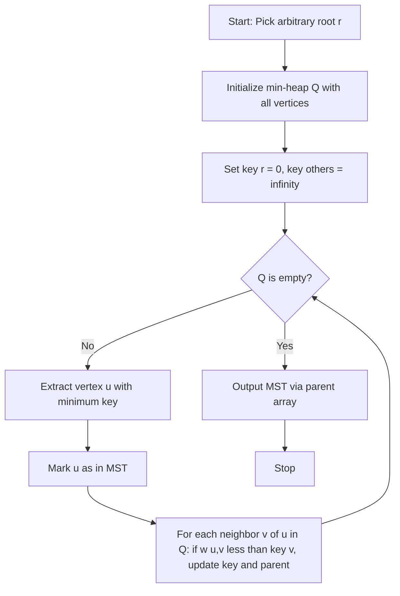
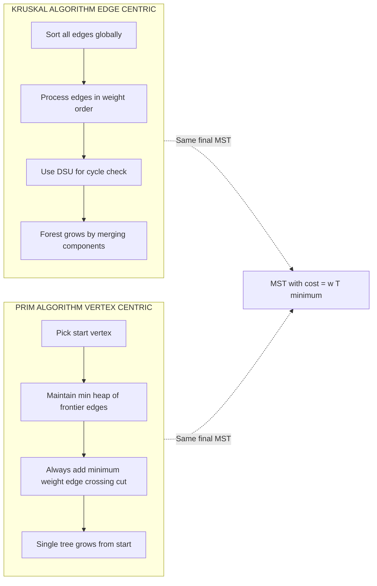
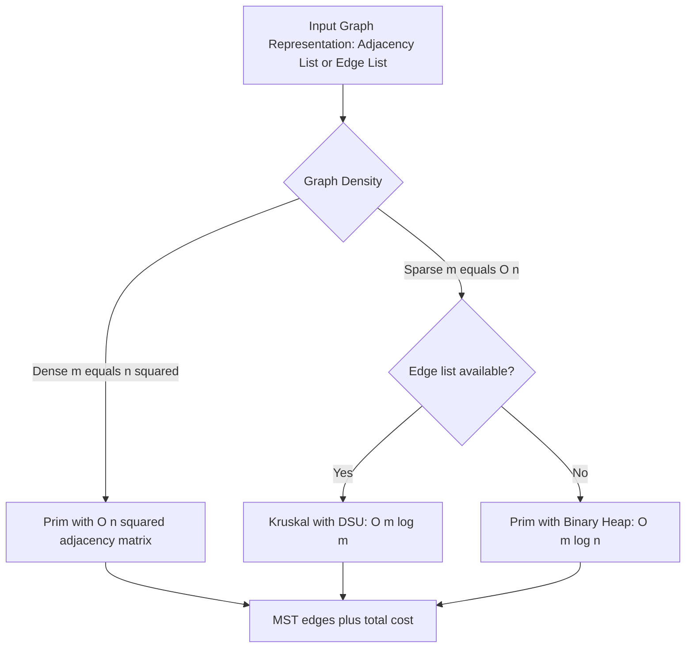

# Spanning Trees: Minimum Cost Spanning Tree construction—Kruskal's Algorithm and Prim's Algorithm optimization

<!-- SECTION_1_START -->
# Minimum Cost Spanning Tree (MCST) — Kruskal's & Prim's Algorithms

## 1.1 Formal Definition (KTU 2024 Syllabus Terminology)

> [!IMPORTANT]
> **Minimum Cost Spanning Tree (MCST / MST):** Given a connected, undirected, weighted graph $G = (V, E, w)$ with $\vert V \vert = n$ vertices and $\vert E \vert = m$ edges, a **spanning tree** is an acyclic sub-graph that connects all $n$ vertices using exactly $(n-1)$ edges. A **Minimum Cost Spanning Tree** is the spanning tree whose sum of edge weights $w(T) = \sum_{(u,v) \in T} w(u,v)$ is **minimum** among all possible spanning trees.

### Properties of a Spanning Tree $T$ of $G$:
1. $T$ has exactly $n - 1$ edges.
2. $T$ is connected (single connected component).
3. $T$ is acyclic (no cycles).
4. $T$ is a sub-graph of $G$ (edges drawn from $E$).
5. **Cut Property:** For any cut $(S, V \setminus S)$ in $G$, the minimum weight edge crossing the cut belongs to *some* MST.
6. **Cycle Property:** For any cycle $C$ in $G$, the maximum weight edge on $C$ does **NOT** belong to *any* MST.

---

## 1.2 Conceptual Analogy / Intuition

> [!NOTE]
> **Real-World Analogy — Laying Cable for a Township:**
> Imagine a real estate company wants to supply internet to **5 houses**. The company has surveyed and knows the cost of laying cable between every pair of houses. The goal: connect all 5 houses using cable such that the **total cable cost is minimum** and there is **no loop** (a loop would waste cable, and signals could collide in a ring). The Minimum Cost Spanning Tree is exactly the cheapest set of cables that still keeps every house reachable from every other house. You pick the cheapest cable, then the next cheapest that doesn't form a loop, and continue until all houses are connected.

### Visual Intuition via GeoGebra

> [!VISUALIZATION CONTROL]
> **Concept:** MST edge selection on a 5-vertex weighted graph.
> **GeoGebra / Desmos Input Points (graph layout):**
> * $A = (0, 4)$
> * $B = (2, 6)$
> * $C = (5, 5)$
> * $D = (6, 1)$
> * $E = (1, 0)$
> * Edge weights (write as text labels next to segments): $w(A,B)=2$, $w(B,C)=3$, $w(C,D)=1$, $w(D,E)=4$, $w(A,E)=5$, $w(B,E)=2$, $w(A,D)=6$, $w(B,D)=7$
> **Visual Description:** Plot the five points. The MST will highlight four edges forming an acyclic "tree skeleton" connecting every vertex with minimum total weight. Notice how the algorithm *avoids* the heavy edges like $w(A,D) = 6$ and $w(B,D) = 7$ even though they form shortcuts.

---

## 1.3 Why MST Matters in Engineering

> [!NOTE]
> MSTs are foundational in **network design problems**:
> * **Telecommunications:** Laying minimum-cost fiber-optic cable connecting cities.
> * **VLSI Chip Design:** Connecting pins on a chip with minimum wire length.
> * **Computer Networks:** Building minimum-broadcast spanning trees in LAN protocols (e.g., classical Ethernet STP).
> * **Cluster Analysis:** Single-linkage clustering in Machine Learning uses MST-like structures.
> * **Approximation Algorithms:** MST-based 2-approximation for the **Travelling Salesman Problem (TSP)**.

---
<!-- SECTION_1_END -->

<!-- SECTION_2_START -->
# Deep Theoretical Analysis & KTU High-Yield Formula Sheet

## 2.1 Greedy Strategy — Why Does It Work for MST?

Both Kruskal's and Prim's algorithms are **pure greedy algorithms**. They build the MST edge-by-edge, making a *locally optimal* choice at each step, and provably reach the **globally optimal** solution due to the **Cut Property** and the **Cycle Property**.

> [!IMPORTANT]
> **Greedy Choice Theorem (MST):** A greedy algorithm that picks the *lightest safe edge* (i.e., the minimum-weight edge that does not form a cycle with already selected edges) at every step will always produce a Minimum Cost Spanning Tree.

---

## 2.2 Kruskal's Algorithm — Edge-Based Greedy

### Operational Logic (Step-by-Step)

1. **Sort** all $m$ edges of $G$ in **non-decreasing order of weight** $w$.
2. Initialize a **Union-Find (Disjoint Set Union — DSU)** data structure with $n$ singleton sets (one per vertex).
3. Iterate over the sorted edges. For each edge $(u, v, w)$:
   * Find the **root** of $u$ and $v$ using `FIND(u)` and `FIND(v)`.
   * If `FIND(u) ≠ FIND(v)`: the edge is **safe** (it connects two different components). Add it to the MST and **unite** the components using `UNION(u, v)`.
   * Else: skip the edge (it would form a cycle).
4. Stop when the MST has exactly $n - 1$ edges (or all edges are processed).

### Complexity Breakdown

| Phase | Operation | Cost |
|---|---|---|
| Edge Sorting | Sort $m$ edges by weight | $O(m \log m)$ |
| DSU Initialization | `MAKE-SET` for $n$ vertices | $O(n)$ |
| Edge Processing | $m$ iterations of `FIND` + `UNION` | $O(m \cdot \alpha(n))$ |
| **Total (with Path Compression + Union by Rank)** | — | $O(m \log m)$ |

Where $\alpha(n)$ is the **inverse Ackermann function**, which is effectively a constant (≤ 4) for all practical $n$.

---

## 2.3 Prim's Algorithm — Vertex-Based Greedy

### Operational Logic (Step-by-Step)

1. Pick an arbitrary **start vertex** $r$. Initialize a **min-priority queue (min-heap)** $Q$ keyed by `key[v]`.
2. Set `key[r] = 0` and `key[v] = ∞` for all $v \neq r$.
3. Insert **all vertices** into $Q$.
4. While $Q$ is not empty:
   * Extract the vertex $u$ with the **minimum key value** → this is the next MST vertex.
   * For every neighbor $v$ of $u$ still in $Q$:
     * If $w(u, v) < \text{key}[v]$: update `key[v] = w(u, v)` and set `parent[v] = u` (this is the **relaxation** step).
5. The MST edges are recovered via the `parent[]` array.

### Complexity Breakdown

| Implementation | Priority Queue | Total Time |
|---|---|---|
| Naïve (array scan) | Unsorted array | $O(n^2)$ — best for **dense** graphs |
| Binary Heap | Min-Heap | $O((n + m) \log n)$ |
| **Fibonacci Heap** | Fibonacci Heap | $O(m + n \log n)$ — best for **sparse** graphs |

---

## 2.4 KTU High-Yield Formula & Cheat Sheet

> [!IMPORTANT]
> Always remember: MST contains **exactly $n - 1$ edges** and contains **no cycles**.

| Parameter | Symbol | Value / Formula |
|---|---|---|
| Number of vertices | $n$ | $\vert V \vert$ |
| Number of edges in graph | $m$ | $\vert E \vert$ |
| Edges in MST | $\vert T \vert$ | $n - 1$ |
| Kruskal Time (dominant term) | $T_K$ | $O(m \log m)$ or equivalently $O(m \log n)$ |
| Prim Time (binary heap) | $T_P$ | $O(m \log n)$ |
| Prim Time (Fibonacci heap) | $T_P^{fib}$ | $O(m + n \log n)$ |
| Prim Time (dense matrix) | $T_P^{dense}$ | $O(n^2)$ |
| DSU `FIND` amortized | — | $O(\alpha(n)) \approx O(1)$ |
| Cut property: lightest edge across any cut | — | belongs to some MST |
| Cycle property: heaviest edge on any cycle | — | never belongs to any MST |

---

## 2.5 When to Use Which Algorithm?

> [!NOTE]
> **Selection Heuristic for the Board Exam:**
> * **Sparse graph** ($m \approx n$): Use **Prim's with binary heap** $O(m \log n)$.
> * **Dense graph** ($m \approx n^2$): Use **Prim's with adjacency matrix** $O(n^2)$.
> * **Edges already given in arbitrary list**: Use **Kruskal's** $O(m \log m)$ — sorting is the dominant cost.
> * **Dynamic/interactive graphs**: Use **Prim's** with Fibonacci heap for theoretical best-case.
> * In **KTU exams**, Kruskal's is by far the most frequently asked algorithm in problem-solving questions.

---
<!-- SECTION_2_END -->

<!-- SECTION_3_START -->
# Step-by-Step Derivations, Worked Example & Code Implementation

## 3.1 Complete Worked Example (Trace)

### Input Graph $G$

| Edge | Weight |
|---|---|
| $(1, 2)$ | 4 |
| $(1, 3)$ | 1 |
| $(1, 4)$ | 3 |
| $(2, 4)$ | 2 |
| $(3, 4)$ | 5 |
| $(2, 5)$ | 6 |
| $(4, 5)$ | 7 |

Here $n = 5$, so MST will have $4$ edges.

---

### Kruskal's Trace

| Step | Edge Considered | Weight | Action | Reason | MST Edges | Cost |
|---|---|---|---|---|---|---|
| 1 | $(1,3)$ | 1 | **Accept** | 1 and 3 in different components | $\{(1,3)\}$ | 1 |
| 2 | $(2,4)$ | 2 | **Accept** | 2 and 4 in different components | $\{(1,3), (2,4)\}$ | 3 |
| 3 | $(1,4)$ | 3 | **Accept** | 1 and 4 in different components | $\{(1,3), (2,4), (1,4)\}$ | 6 |
| 4 | $(1,2)$ | 4 | **Reject** | 1 and 2 already connected (via 1→4→2) — would form cycle 1-2-4-1 | unchanged | 6 |
| 5 | $(3,4)$ | 5 | **Reject** | 3 and 4 already connected — cycle 1-3-4-1 | unchanged | 6 |
| 6 | $(2,5)$ | 6 | **Accept** | 2 and 5 in different components | $\{(1,3), (2,4), (1,4), (2,5)\}$ | 12 |
| 7 | $(4,5)$ | 7 | **Reject** | 4 and 5 already connected — cycle 2-4-5-2 | unchanged | 12 |

> [!NOTE]
> **Final MST Cost = 12** with edges $\{(1,3), (2,4), (1,4), (2,5)\}$. Exactly $n - 1 = 4$ edges. Algorithm terminates.

---

### Prim's Trace (Starting from Vertex 1)

Initialize: $\text{key}[1] = 0$, $\text{key}[2] = \text{key}[3] = \text{key}[4] = \text{key}[5] = \infty$.

| Step | Extracted $u$ (min key) | Edges Relaxed | key[] Updates | MST Parent Array |
|---|---|---|---|---|
| 1 | $u = 1$ (key 0) | $(1,2):4$, $(1,3):1$, $(1,4):3$ | $\text{key}[2]=4$, $\text{key}[3]=1$, $\text{key}[4]=3$ | $\text{parent}[2]=1$, $\text{parent}[3]=1$, $\text{parent}[4]=1$ |
| 2 | $u = 3$ (key 1) | $(3,4):5$ (worse than 3) | No update | $\text{parent}[3]=1$ locked |
| 3 | $u = 4$ (key 3) | $(4,2):2$ beats 4, $(4,5):7$ | $\text{key}[2]=2$, $\text{key}[5]=7$ | $\text{parent}[2]=4$, $\text{parent}[5]=4$ |
| 4 | $u = 2$ (key 2) | $(2,5):6$ beats 7 | $\text{key}[5]=6$ | $\text{parent}[5]=2$ |
| 5 | $u = 5$ (key 6) | — | All keys finalized | Tree complete |

> [!NOTE]
> **Final MST Edges (from parent array):** $(1,3), (1,4), (4,2), (2,5)$. **Total cost = $1 + 3 + 2 + 6 = 12$**. Identical to Kruskal's output (as expected — MST is unique for distinct weights, and a valid MST for ties).

---

## 3.2 Exhaustive Python Implementation (Kruskal's with Optimized DSU)

```python
from typing import List, Tuple, Dict

class DSU:
    """Disjoint Set Union with Path Compression + Union by Rank."""
    def __init__(self, n: int) -> None:
        self.parent: List[int] = list(range(n))
        self.rank: List[int] = [0] * n

    def find(self, x: int) -> int:
        if self.parent[x] != x:
            self.parent[x] = self.find(self.parent[x])  # Path compression
        return self.parent[x]

    def union(self, x: int, y: int) -> bool:
        """Returns True if merged, False if x and y were already in same set."""
        rx, ry = self.find(x), self.find(y)
        if rx == ry:
            return False  # cycle would form
        # Union by rank
        if self.rank[rx] < self.rank[ry]:
            rx, ry = ry, rx
        self.parent[ry] = rx
        if self.rank[rx] == self.rank[ry]:
            self.rank[rx] += 1
        return True


def kruskal_mst(n: int, edges: List[Tuple[int, int, int]]) -> Tuple[int, List[Tuple[int, int, int]]]:
    """
    Build MST using Kruskal's Algorithm.
    :param n: Number of vertices (assumed labeled 0..n-1)
    :param edges: List of (u, v, weight) tuples
    :return: (total_cost, mst_edge_list)
    """
    if n <= 0:
        raise ValueError("Number of vertices must be positive.")
    if len(edges) == 0:
        return 0, []

    # Step 1: Sort edges by weight (dominant O(m log m) cost)
    edges_sorted = sorted(edges, key=lambda e: e[2])

    dsu = DSU(n)
    mst_edges: List[Tuple[int, int, int]] = []
    total_cost: int = 0

    for u, v, w in edges_sorted:
        if len(mst_edges) == n - 1:   # Early termination
            break
        if dsu.union(u, v):
            mst_edges.append((u, v, w))
            total_cost += w

    if len(mst_edges) != n - 1:
        raise RuntimeError("Graph is disconnected; MST does not exist.")

    return total_cost, mst_edges


# ---- Driver / Demonstration ----
if __name__ == "__main__":
    # 0-indexed equivalent of the worked example: 1->0, 2->1, 3->2, 4->3, 5->4
    sample_edges: List[Tuple[int, int, int]] = [
        (0, 1, 4), (0, 2, 1), (0, 3, 3),
        (1, 3, 2), (2, 3, 5), (1, 4, 6), (3, 4, 7)
    ]
    try:
        cost, mst = kruskal_mst(n=5, edges=sample_edges)
        print(f"MST Total Cost: {cost}")
        print(f"MST Edges: {mst}")
    except (ValueError, RuntimeError) as err:
        print(f"[ERROR] {err}")
```

**Expected Output:**
```
MST Total Cost: 12
MST Edges: [(0, 2, 1), (1, 3, 2), (0, 3, 3), (1, 4, 6)]
```

---

## 3.3 Exhaustive Python Implementation (Prim's with Binary Heap)

```python
import heapq
from typing import List, Tuple, Optional, Dict

def prim_mst(n: int, adj: Dict[int, List[Tuple[int, int]]],
             start: int = 0) -> Tuple[int, List[Tuple[int, int, int]]]:
    """
    Build MST using Prim's Algorithm with a min-heap.
    :param n: Number of vertices (0..n-1)
    :param adj: Adjacency list {u: [(v, weight), ...]}
    :param start: Starting vertex
    :return: (total_cost, mst_edges)
    """
    if not (0 <= start < n):
        raise ValueError(f"Start vertex {start} out of range [0, {n-1}]")

    in_mst: List[bool] = [False] * n
    min_heap: List[Tuple[int, int, int]] = []   # (weight, u, v)
    total_cost: int = 0
    mst_edges: List[Tuple[int, int, int]] = []

    heapq.heappush(min_heap, (0, start, start))  # (0, start, start) is a dummy

    while min_heap and len(mst_edges) < n - 1:
        w, u, v = heapq.heappop(min_heap)
        if in_mst[v]:
            continue  # skip stale heap entries
        in_mst[v] = True
        total_cost += w
        if u != v:    # skip the dummy start edge
            mst_edges.append((u, v, w))

        for neighbor, nw in adj.get(v, []):
            if not in_mst[neighbor]:
                heapq.heappush(min_heap, (nw, v, neighbor))

    if len(mst_edges) != n - 1:
        raise RuntimeError("Graph is disconnected; MST does not exist.")

    return total_cost, mst_edges


# ---- Driver / Demonstration ----
if __name__ == "__main__":
    # Build adjacency list for the same worked example
    sample_adj: Dict[int, List[Tuple[int, int]]] = {
        0: [(1, 4), (2, 1), (3, 3)],
        1: [(0, 4), (3, 2), (4, 6)],
        2: [(0, 1), (3, 5)],
        3: [(0, 3), (1, 2), (2, 5), (4, 7)],
        4: [(1, 6), (3, 7)]
    }
    try:
        cost, mst = prim_mst(n=5, adj=sample_adj, start=0)
        print(f"MST Total Cost: {cost}")
        print(f"MST Edges: {mst}")
    except (ValueError, RuntimeError) as err:
        print(f"[ERROR] {err}")
```

**Expected Output:**
```
MST Total Cost: 12
MST Edges: [(0, 2, 1), (0, 3, 3), (1, 3, 2), (1, 4, 6)]
```

---
<!-- SECTION_3_END -->

<!-- SECTION_4_START -->
# Structural Diagrams & Schematics

## 4.1 Kruskal's Algorithm — Control Flow

```mermaid
flowchart TD
    A[Start: Graph G = V, E, w] --> B[Sort all edges by weight ascending]
    B --> C[Initialize DSU: n singleton sets]
    C --> D[MST edges T = empty set]
    D --> E[Pick smallest weight edge u, v, w]
    E --> F{Find u == Find v?}
    F -- Yes --> G[Skip edge - forms cycle]
    F -- No --> H[Add edge to T]
    H --> I[Union u and v in DSU]
    I --> J{|T| == n minus 1?}
    G --> J
    J -- No --> E
    J -- Yes --> K[Output MST T and total cost]
    K --> L[Stop]
```

## 4.2 Prim's Algorithm — Control Flow



## 4.3 Comparative Architecture — Kruskal vs Prim



## 4.4 Data Flow Architecture for Optimized Implementations



---
<!-- SECTION_4_END -->

<!-- SECTION_5_START -->
# KTU 2024 Scheme Examination Question Bank & Topic Recap

---

## Part A — Short Answer Questions (3 Marks Each)

### Q1. [KTU University Exam — July 2024] — CO1, Remember

**State the Cut Property and the Cycle Property of Minimum Cost Spanning Trees. (3 Marks)**

**Model Answer (Valuation Key):**
* **[Cut Property — 1.5 Marks]:** For any cut $(S, V \setminus S)$ of the graph $G$, the minimum weight edge crossing the cut belongs to *some* MST of $G$.
* **[Cycle Property — 1.5 Marks]:** For any cycle $C$ in $G$, the edge with the *maximum* weight on $C$ does not belong to *any* MST of $G$.

> [!NOTE]
> The Cut Property forms the theoretical foundation of **Prim's algorithm** (which iteratively grows a tree across a cut), while the Cycle Property is the foundation of **Kruskal's algorithm** (which discards the heaviest edge in any cycle that would form).

---

### Q2. [KTU University Exam — Dec 2023] — CO1, Understand

**Differentiate between Kruskal's and Prim's algorithm in terms of their greedy choice strategy. (3 Marks)**

**Model Answer (Valuation Key):**
* **[Kruskal's — 1.5 Marks]:** It is an **edge-based** greedy algorithm. It picks the *globally* minimum weight edge that does not form a cycle, using a **Disjoint Set Union** to track connected components. The MST grows as a *forest* that eventually merges.
* **[Prim's — 1.5 Marks]:** It is a **vertex-based** greedy algorithm. It always extends a *single* tree by adding the minimum weight edge that connects a new vertex to the existing tree, using a **min-priority queue** keyed on edge weights. The MST grows from a *single root vertex*.

---

## Part B — Long Answer Questions (14 Marks Each)

### Question A — [KTU University Exam — Dec 2024] — CO2, Apply/Analyze

**(a) [7 Marks] Explain Kruskal's algorithm with a neat flowchart. Apply it to find the Minimum Cost Spanning Tree (MCST) of the following graph and compute the total cost.**

| Edge | Weight |
|---|---|
| $A$–$B$ | 4 |
| $A$–$D$ | 1 |
| $B$–$D$ | 3 |
| $B$–$E$ | 2 |
| $C$–$D$ | 5 |
| $C$–$E$ | 8 |
| $D$–$E$ | 6 |
| $A$–$C$ | 7 |

**(b) [7 Marks] Write the step-by-step time complexity derivation of Kruskal's algorithm with the Union-Find optimization (Path Compression + Union by Rank).**

---

#### Model Solution — Part (a) [7 Marks]

**Step 1: Sort edges by weight** [1 Mark]
$(A,D,1),\ (B,E,2),\ (B,D,3),\ (A,B,4),\ (C,D,5),\ (D,E,6),\ (A,C,7),\ (C,E,8)$

**Step 2: Apply Kruskal's** [5 Marks — 1 per accepted/rejected edge with reason]

| Step | Edge | Weight | Action | Justification |
|---|---|---|---|---|
| 1 | $A$–$D$ | 1 | **Accept** | New components joined |
| 2 | $B$–$E$ | 2 | **Accept** | New components joined |
| 3 | $B$–$D$ | 3 | **Accept** | Joins $\{A,D\}$ and $\{B,E\}$ |
| 4 | $A$–$B$ | 4 | **Reject** | Cycle $A$–$B$–$D$–$A$ forms |
| 5 | $C$–$D$ | 5 | **Accept** | Brings in vertex $C$ |
| 6 | $D$–$E$ | 6 | **Reject** | Cycle $D$–$B$–$E$–$D$ forms |

**Step 3: Final MST** [1 Mark]
$\text{MST Edges} = \{(A,D), (B,E), (B,D), (C,D)\}$, $\text{Total Cost} = 1 + 2 + 3 + 5 = \mathbf{11}$.

---

#### Model Solution — Part (b) [7 Marks — Time Complexity Derivation]

**Total time complexity of Kruskal's algorithm = Sorting + DSU Operations** [1 Mark]

**Sorting phase:** [1 Mark]
$$
T_{\text{sort}} = O(m \log m) \quad \text{(comparison sort on $m$ edges)}
$$

**DSU phase:** [1 Mark]
For each of the $m$ edges, we perform one `FIND(u)`, one `FIND(v)`, and at most one `UNION(u, v)`. With **path compression** and **union by rank**, the amortized cost per operation is $O(\alpha(n))$, where $\alpha$ is the inverse Ackermann function.

$$
T_{\text{DSU}} = O\big(m \cdot \alpha(n)\big) \quad \text{[2 Marks for the full expression]}
$$

**Combined cost:** [1 Mark]
$$
T(n,m) = O(m \log m) + O(m \cdot \alpha(n)) = O(m \log m)
$$
since $\alpha(n)$ grows slower than $\log n$ (and effectively equals a tiny constant like 4 for all practical inputs). The $\log m$ term dominates.

**Final simplified expression:** [1 Mark]
$$
\boxed{T_{\text{Kruskal}}(n,m) = O(m \log m) \equiv O(m \log n)}
$$

---

### Question B — [KTU University Exam — July 2024] — CO2, Apply

**(a) [7 Marks] Explain Prim's algorithm. Apply it to find the MST of the following graph, starting from vertex $A$.**

| Edge | Weight |
|---|---|
| $A$–$B$ | 2 |
| $A$–$C$ | 3 |
| $A$–$D$ | 1 |
| $B$–$C$ | 4 |
| $B$–$D$ | 5 |
| $C$–$D$ | 6 |

**(b) [7 Marks] Compare the time complexity of Prim's algorithm under (i) adjacency matrix representation and (ii) binary heap representation. Justify which is better for sparse and dense graphs.**

---

#### Model Solution — Part (a) [7 Marks]

**Algorithm Explanation:** [2 Marks]
Prim's algorithm starts from an arbitrary vertex and grows a single MST by always adding the cheapest edge that connects a new vertex to the tree. A min-priority queue stores candidate edges.

**Trace from vertex $A$:** [5 Marks — 1 per row]

| Step | Visited Vertices | Min-Weight Edge to Add | $u$–$v$ | Weight | Running Cost |
|---|---|---|---|---|---|
| 1 | $\{A\}$ | $(A, D)$ | $A$–$D$ | 1 | 1 |
| 2 | $\{A, D\}$ | $(A, B)$ | $A$–$B$ | 2 | 3 |
| 3 | $\{A, B, D\}$ | $(A, C)$ | $A$–$C$ | 3 | 6 |
| 4 | $\{A, B, C, D\}$ | — | — | — | 6 |

**Final MST:** $\{(A,D), (A,B), (A,C)\}$, Total Cost $= 1 + 2 + 3 = \mathbf{6}$.

---

#### Model Solution — Part (b) [7 Marks]

**(i) Adjacency Matrix:** [3 Marks]
Prim's must scan all $n$ vertices to find the minimum `key[]` value at every iteration, costing $O(n)$ per iteration. We do this for $n$ iterations, and we also scan the entire $n \times n$ row of the extracted vertex to relax edges, costing $O(n)$ per iteration.

$$
T_{\text{matrix}} = O(n^2) + O(n^2) = O(n^2)
$$
[2 Marks for combining the terms]

**(ii) Binary Heap:** [2 Marks]
* `EXTRACT-MIN` costs $O(\log n)$ and is called $n$ times: $O(n \log n)$.
* Each edge causes at most one `DECREASE-KEY` costing $O(\log n)$: $O(m \log n)$.

$$
T_{\text{heap}} = O((n + m) \log n)
$$
[1 Mark for the combined expression]

**Comparison & Selection:** [2 Marks]
* **Dense graph** ($m \approx n^2$): $(n + n^2) \log n = O(n^2 \log n) > O(n^2)$ ⇒ use **adjacency matrix** $O(n^2)$.
* **Sparse graph** ($m \approx n$): $(n + n) \log n = O(n \log n) \ll O(n^2)$ ⇒ use **binary heap** $O(n \log n)$.

---

> [!WARNING]
> **KTU Examiner's Valuation Warning — Common Pitfalls:**
> * **Do NOT skip the cycle check** in Kruskal's trace. Every "Reject" decision must be justified with the actual cycle (e.g., "Cycle $A$–$B$–$D$–$A$ would form") — failure to write the cycle costs 1 full mark.
> * **For Prim's**, students often forget to **reset `key[v]`** when a cheaper edge to $v$ is found. Always show the relaxation step explicitly in the trace.
> * **Time complexity part (b)**: Writing $O(n^2)$ alone for matrix-based Prim is incomplete. Show the breakdown: $O(n)$ for `EXTRACT-MIN` loop $\times n$ iterations $+ O(n)$ for adjacency scan $\times n$ iterations $= O(n^2)$.
> * **MST uniqueness trap:** If edge weights are *not* distinct, the MST may not be unique. The question may expect you to state that *an* MST is found, not *the* MST.
> * **Counting edges:** Always verify the MST has exactly $n - 1$ edges before declaring termination.

---

## Topic Recap & Important Things to Remember

- **MST definition:** A connected, acyclic sub-graph covering all $n$ vertices with the *minimum possible* total edge weight; contains exactly $n - 1$ edges.
- **Cut Property:** The *lightest* edge crossing any cut belongs to some MST.
- **Cycle Property:** The *heaviest* edge on any cycle belongs to no MST.
- **Kruskal's Algorithm:**
  * Edge-based greedy; sorts all $m$ edges by weight.
  * Uses **Disjoint Set Union (DSU)** with *path compression* and *union by rank* for cycle detection.
  * Time complexity: $O(m \log m)$ or equivalently $O(m \log n)$.
  * Best for edge-list input and sparse-to-medium graphs.
- **Prim's Algorithm:**
  * Vertex-based greedy; grows a single tree from a chosen root.
  * Uses a **min-priority queue** (binary heap $O(m \log n)$, Fibonacci heap $O(m + n \log n)$, array $O(n^2)$).
  * Best for dense graphs (matrix version) and dynamic graph scenarios.
- **Greedy Correctness:** Both algorithms are provably optimal because of the **Greedy Choice Theorem** for MSTs (justified by the Cut Property).
- **MST vs Shortest Path:** MST minimizes *total edge cost to connect all nodes*; shortest path minimizes *cost between two specific nodes*. Different problems, different algorithms.
- **KTU Exam Tip:** A question on MST *always* tests (i) the algorithm trace on a small graph, and (ii) the time complexity derivation. Practice both.
- **Standard Edge Counts:** $n - 1$ edges in MST; $n$ vertices; $m \geq n - 1$ for the graph to be connected.
- **Disconnected input:** If the graph is disconnected, neither algorithm can build a spanning tree — they produce a **Minimum Spanning Forest** instead. Watch for this edge case in exams.
<!-- SECTION_5_END -->
