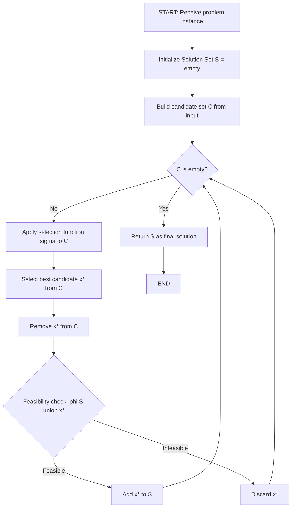
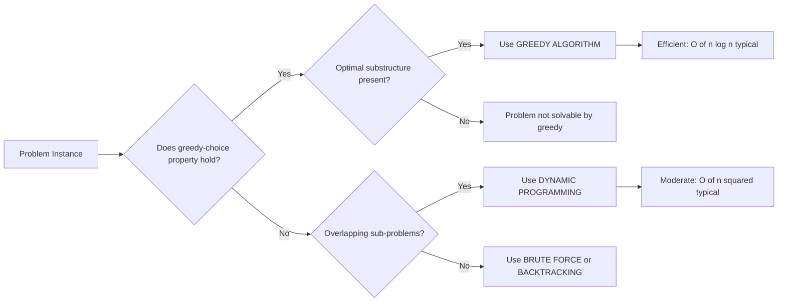
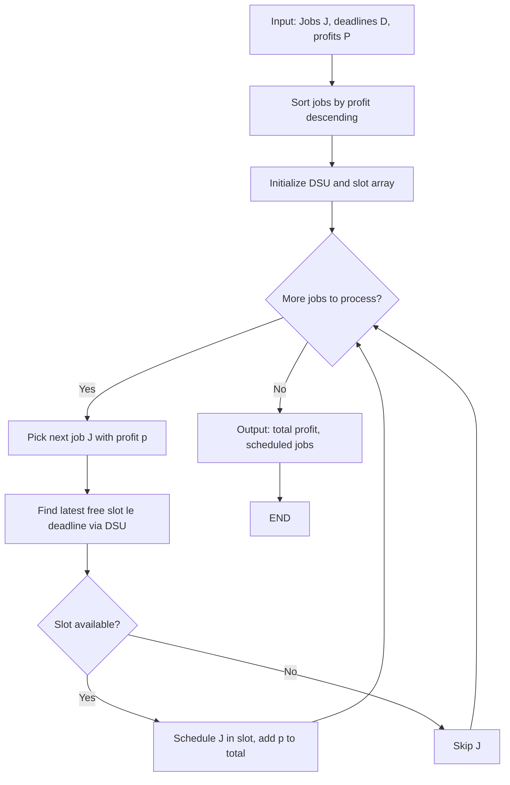
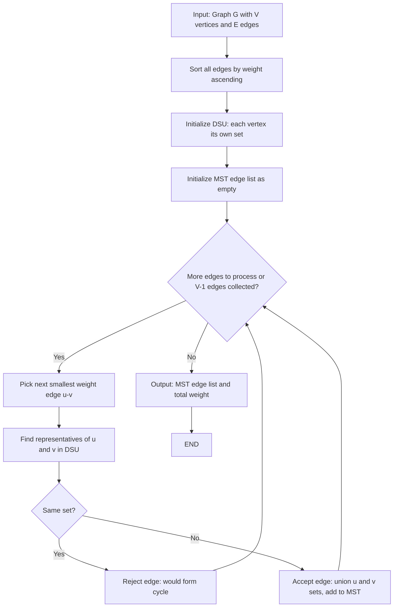
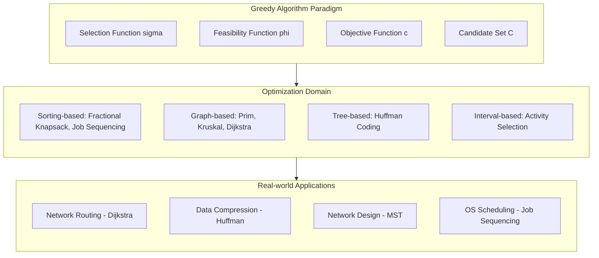
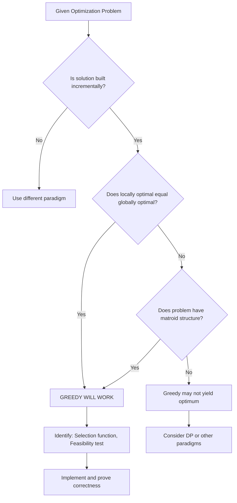

# Algorithm

<!-- SECTION_1_START -->
# MODULE 3: GREEDY ALGORITHM STRATEGY

> [!NOTE]
> **KTU 2024 Scheme | Course Code:** PCCST502 | **Cognitive Levels Mapped:** Remember, Understand, Apply, Analyze

## 1. Core Technical Definition

A **Greedy Algorithm** is an algorithmic paradigm that builds up a solution to an optimization problem piece by piece, always choosing the option that offers the most immediate benefit (the *locally optimal choice*) at each step, with the hope that these local optima will lead to a **globally optimal solution**.

Formally, as per the KTU 2024 syllabus definition:
> A greedy algorithm makes the choice that looks best in the current state, makes that choice irrevocably, and then solves the sub-problem that arises. The choice made by a greedy algorithm may depend on choices so far, but it cannot depend on any future choices or on the solutions to sub-problems.

**Mathematical Abstraction:**
Given an optimization problem with a feasible set $F$ of solutions and an objective function $c: F \rightarrow \mathbb{R}$, the greedy method constructs a solution $S$ incrementally by selecting elements that maximize (or minimize) a local selection function $\sigma$ at each stage.

$$\text{Greedy Choice: } x_{k+1} = \arg\max_{x \in \text{Candidates}} \, \sigma(S_k \cup \{x\})$$

where $S_k$ is the partial solution after $k$ selections.

---

> [!IMPORTANT]
> **Core Insight:** Greedy does NOT reconsider choices. Once an element is added to the solution set, it is never removed. This is what distinguishes greedy from dynamic programming, which explores multiple paths.

---

## 2. Intuitive Analogy

> [!TIP]
> **Real-World Analogy: The Currency Change Problem**
>
> Imagine you are a cashier and a customer pays you **₹437** and you need to give change using the *minimum* number of Indian currency notes. The greedy cashier immediately picks the largest note that fits: **₹200** (leaving ₹237), then another **₹200** (leaving ₹37), then **₹20** (leaving ₹17), then **₹10** (leaving ₹7), then **₹5** (leaving ₹2), then **₹2** (leaving ₹0). Total: **6 notes**.
>
> At every step, the cashier makes the *locally best* choice (largest possible note) without worrying about future consequences. This is the essence of a greedy strategy.

Another classic analogy is the **Huffman tree compression**, where shorter codes are greedily assigned to more frequent characters, just like a postal service would assign shorter zip codes to busier cities.

---

## 3. The Greedy Algorithm Control Flow

The execution of any greedy algorithm follows a strict sequence:

1. **Initialization** – Start with an empty solution set $S = \emptyset$.
2. **Selection Step** – At each iteration, identify the set of *candidate elements* $C$ that can be added to $S$ without violating feasibility.
3. **Greedy Choice Function** – Apply the selection (greedy) criterion $\sigma$ to pick the best element $x^* \in C$.
4. **Feasibility Check** – Verify that $S \cup \{x^*\}$ remains a valid (feasible) partial solution.
5. **Termination** – Stop when $C$ is empty or no more feasible candidates exist. Return $S$.

> [!NOTE]
> **Key Distinction from Other Paradigms:**
>
> | Paradigm | Decision Style | Backtracking? | Optimal for |
> |---|---|---|---|
> | **Greedy** | Local optimum at each step | No | Matroid, Interval Scheduling |
> | **Divide & Conquer** | Splits problem into sub-problems | No | Sorting, Searching |
> | **Dynamic Programming** | Solves overlapping sub-problems | No via memoization | Optimal substructure + overlap |
> | **Backtracking** | Explores all options with pruning | Yes | N-Queens, Sudoku |

---

## 4. Visualization Concept

> [!VISUALIZATION CONTROL]
> **Concept:** Greedy Choice vs Optimal Choice Trade-off
> **GeoGebra Input Equations:**
> * `f(x) = -x^2 + 10x` (concave function showing local maxima)
> * Point A: `(1, 9)` – local best for x < 5
> * Point B: `(5, 25)` – global maximum
> **Visual Description:** Plot the parabola. If a greedy agent only moves *uphill* without backtracking, it may settle at point A or even a smaller hill, but with the *correct* greedy choice function, it climbs to B.

---

## 5. KTU-Mapped Standard Metrics

> [!IMPORTANT]
> **Standard Efficiency Metrics for KTU Board Questions:**
>
> * **Time Complexity Range:** $O(n \log n)$ to $O(n^2)$ – typically $O(n \log n)$ when sorting dominates
> * **Space Complexity:** Usually $O(n)$ auxiliary
> * **Optimality Guarantee:** Only when the problem has a **matroid structure** or **greedy-choice property** holds
> * **Counter-example Class:** Problems like **0/1 Knapsack**, **Travelling Salesman Problem (TSP)**, and **Longest Path** are **not solvable optimally by greedy**

---

## 6. Why Greedy Works (When It Does)

Two mathematical properties must hold for a problem to be solvable optimally by a greedy algorithm:

### (a) Greedy-Choice Property
A globally optimal solution can be arrived at by making locally optimal (greedy) choices. In other words, when we are considering which choice to make, there is some choice that is locally optimal and that can be extended to a globally optimal solution.

### (b) Optimal Substructure
A problem has an optimal substructure if an optimal solution to the entire problem contains within it optimal solutions to sub-problems. This allows a greedy choice to leave behind a sub-problem that can be solved independently.

> [!TIP]
> **KTU Board Note:** Many KTU exam questions ask: *"Why does greedy fail for 0/1 Knapsack but succeed for Fractional Knapsack?"* The answer lies in optimal substructure – fractional knapsack allows continuous fractions, which preserves the greedy-choice property, while 0/1 knapsack requires discrete items, breaking it.

---

<!-- SECTION_1_END -->

<!-- SECTION_2_START -->
# DEEP THEORETICAL ANALYSIS & KTU HIGH-YIELD FORMULA SHEET

## 1. Anatomy of a Greedy Algorithm

Every greedy algorithm can be decomposed into **four fundamental components**:

### Component 1: Candidate Set ($C$)
The universe of elements from which the algorithm will draw selections. For example:
* In **Prim's algorithm**: edges of the graph
* In **Huffman coding**: character frequencies
* In **Job sequencing**: jobs sorted by profit

### Component 2: Selection Function ($\sigma$)
The greedy criterion used to pick the next element. Examples:
* Prim's: *minimum weight edge* connecting tree to non-tree vertex
* Kruskal's: *minimum weight edge* not forming a cycle
* Dijkstra's: *closest unvisited vertex*

### Component 3: Feasibility Function ($\phi$)
A predicate that tests whether a candidate can be added to the partial solution. For instance:
* Kruskal's feasibility: *the edge must not form a cycle* (checked via Union-Find)
* Job sequencing: *deadline constraint must be satisfied*

### Component 4: Objective Function ($c$)
The quantity being optimized (minimized or maximized). The greedy method *implicitly* assumes that optimizing the selection function at each step will optimize the objective function.

---

## 2. The General Greedy Algorithm (Pseudocode Framework)

```
ALGORITHM GREEDY(C, σ, φ)
1.  S ← ∅                          // Initialize solution
2.  while C ≠ ∅ do                 // While candidates exist
3.      x ← select(C, σ)           // Greedy selection
4.      C ← C \ {x}                // Remove from candidates
5.      if φ(S ∪ {x}) then         // Feasibility test
6.          S ← S ∪ {x}            // Add to solution
7.      end if
8.  end while
9.  return S
```

**Time complexity** of this generic form: $O(n \cdot T_\sigma + n \cdot T_\phi)$ where $T_\sigma$ and $T_\phi$ are the costs of selection and feasibility checks respectively. When the candidate set is sorted first by $\sigma$, total cost becomes $O(n \log n + n \cdot T_\phi)$.

---

## 3. KTU Formula Sheet / Cheat Sheet

> [!IMPORTANT]
> **HIGH-YIELD KTU FORMULA TABLE — MODULE 3 GREEDY**

| # | Algorithm | Selection Function $\sigma$ | Feasibility $\phi$ | Time Complexity | Optimality |
|---|---|---|---|---|---|
| 1 | **Fractional Knapsack** | Max profit/weight ratio | Weight $\le W$ (capacity) | $O(n \log n)$ | $\checkmark$ Always optimal |
| 2 | **Job Sequencing (Unit time)** | Max profit first | All jobs before deadline | $O(n^2)$ (with DSU: $O(n \log n)$) | $\checkmark$ Always optimal |
| 3 | **Prim's MST** | Min weight edge to tree | Forms tree (no cycle) | $O(E \log V)$ (binary heap) | $\checkmark$ Always optimal |
| 4 | **Kruskal's MST** | Min weight edge overall | No cycle (Union-Find) | $O(E \log E)$ | $\checkmark$ Always optimal |
| 5 | **Dijkstra's SSSP** | Closest unvisited vertex | Non-negative weights | $O((V+E) \log V)$ | $\checkmark$ if weights $\ge 0$ |
| 6 | **Huffman Coding** | Merge two lowest frequencies | Always a complete tree | $O(n \log n)$ | $\checkmark$ Always optimal |
| 7 | **Activity Selection** | Earliest finish time | Non-overlapping | $O(n \log n)$ | $\checkmark$ Always optimal |
| 8 | **0/1 Knapsack** | Max profit/weight ratio | Weight $\le W$ | – | $\times$ Greedy FAILS |
| 9 | **TSP** | Nearest unvisited city | Hamiltonian path | – | $\times$ Greedy FAILS (in general) |

---

## 4. Greedy on Matroid Structures (Advanced Theory)

> [!NOTE]
> **For KTU Higher-Order Questions (RBT: Apply/Analyze):**

A problem can be solved optimally by a greedy algorithm **if and only if** the structure of its feasible solutions forms a **matroid**.

A matroid $M = (S, \mathcal{I})$ is a pair where:
* $S$ is a finite set of elements
* $\mathcal{I}$ is a collection of *independent* subsets of $S$ satisfying:
  1. **Empty set is independent:** $\emptyset \in \mathcal{I}$
  2. **Hereditary property:** If $B \in \mathcal{I}$ and $A \subseteq B$, then $A \in \mathcal{I}$
  3. **Exchange property:** If $A, B \in \mathcal{I}$ and $\vert A \vert < \vert B \vert$, then $\exists x \in B \setminus A$ such that $A \cup \{x\} \in \mathcal{I}$

**Examples of matroid structures:**
* Spanning trees of a graph (Kruskal's/Prim's)
* Linearly independent vectors
* Trivial matroid (any single-element subsets)

**Non-matroid examples (greedy fails):**
* 0/1 Knapsack
* Longest path in a DAG
* Independent sets in general graphs

---

## 5. Comparison of Greedy with Other Paradigms (Engineering Utility)

### Use in Production Systems

| Domain | Greedy Application | Real-world System |
|---|---|---|
| **Networking** | Dijkstra's, Bellman-Ford | OSPF routing in Cisco routers |
| **Data Compression** | Huffman coding | JPEG, MP3, ZIP, PNG |
| **Clustering** | Kruskal's MST | Network design in telecom |
| **Scheduling** | Job sequencing, Activity selection | OS process scheduling, manufacturing |
| **AI/ML** | Greedy best-first search | A* search heuristic |
| **Blockchain** | Greedy transaction selection | Bitcoin mempool prioritization |

---

## 6. Detailed Analysis of Each Major Greedy Algorithm

### 6.1 FRACTIONAL KNAPSACK PROBLEM

**Problem Statement:** Given $n$ items, each with weight $w_i$ and profit $p_i$, and a knapsack of capacity $W$, find the maximum profit that can be earned by placing items (or fractions of items) into the knapsack.

**Mathematical Formulation:**
$$\text{Maximize } Z = \sum_{i=1}^{n} p_i x_i \quad \text{subject to } \sum_{i=1}^{n} w_i x_i \le W, \quad 0 \le x_i \le 1$$

**Greedy Strategy:** Sort items by **profit-to-weight ratio** $\left(\frac{p_i}{w_i}\right)$ in **decreasing order** and take as much as possible from each item in turn.

**Time Complexity:** $O(n \log n)$ — dominated by sorting.

### 6.2 JOB SEQUENCING WITH DEADLINES

**Problem Statement:** Given $n$ jobs, each with a profit $p_i$ and a deadline $d_i$ (all deadlines $\le n$), schedule jobs in a single time slot (unit time) to maximize total profit, with the constraint that each job takes exactly one unit of time and must complete before its deadline.

**Greedy Strategy:**
1. Sort jobs by profit in **decreasing order**.
2. For each job, schedule it in the **latest available time slot** $\le d_i$.
3. If no slot is available, skip the job.

**Time Complexity:** $O(n^2)$ naive, $O(n \log n)$ with Disjoint Set Union (DSU).

### 6.3 PRIM'S MINIMUM SPANNING TREE (MST)

**Problem Statement:** Given a connected, weighted, undirected graph $G = (V, E, w)$, find a spanning tree of minimum total weight.

**Greedy Strategy:** Start from any vertex. At each step, add the **minimum-weight edge** that connects a vertex in the tree to a vertex outside the tree. Continue until all vertices are in the tree.

**Implementation:** Use a min-priority queue (binary heap or Fibonacci heap) keyed on edge weight.

### 6.4 KRUSKAL'S MINIMUM SPANNING TREE

**Greedy Strategy:** Sort all edges by weight in **ascending order**. Add each edge to the MST if it does **not form a cycle** with the edges already added. Cycle detection is performed efficiently using a **Union-Find (Disjoint Set Union)** data structure.

### 6.5 DIJKSTRA'S SINGLE-SOURCE SHORTEST PATH

**Problem Statement:** Given a weighted graph $G = (V, E, w)$ with non-negative weights and a source vertex $s$, find the shortest path from $s$ to every other vertex.

**Greedy Strategy:** Maintain a set $S$ of vertices whose shortest distances from $s$ are finalized. At each step, select the unvisited vertex $u$ with the **minimum tentative distance** $\text{dist}[u]$, add it to $S$, and update distances of its neighbors (relaxation).

**Limitation:** Fails for **negative edge weights**. Use Bellman-Ford instead.

### 6.6 HUFFMAN CODING

**Problem Statement:** Given a set of characters with frequencies, construct a **prefix-free binary code** with minimum expected code length (minimum redundancy).

**Greedy Strategy:**
1. Create a leaf node for each character with frequency $f_i$. Place them in a min-priority queue.
2. While more than one node remains in the queue:
   * Remove the two nodes with **smallest frequencies** $f_1 \le f_2$.
   * Create a new internal node with frequency $f_1 + f_2$.
   * Insert the new node back into the queue.
3. The remaining node is the root of the Huffman tree.

**Optimality:** Produces an **optimal prefix code** with $O(n \log n)$ time.

---

<!-- SECTION_2_END -->

<!-- SECTION_3_START -->
# STEP-BY-STEP DERIVATIONS & IMPLEMENTATIONS

## 1. Fractional Knapsack — Complete Worked Example

**Instance:** $n = 4$ items, capacity $W = 15$ kg.

| Item $i$ | Weight $w_i$ | Profit $p_i$ | Ratio $\frac{p_i}{w_i}$ |
|---|---|---|---|
| 1 | 10 | 60 | 6.0 |
| 2 | 15 | 90 | 6.0 |
| 3 | 4 | 30 | 7.5 |
| 4 | 5 | 40 | 8.0 |

### Step 1: Sort by ratio in decreasing order
After sorting: Item 4 (8.0), Item 3 (7.5), Item 1 (6.0), Item 2 (6.0).

### Step 2: Initialize variables
$U = W = 15$ (remaining capacity), $X = 0$ (total profit).

### Step 3: Process each item greedily

**Item 4:** $w_4 = 5 \le U = 15$ → take full item.
$$U \leftarrow 15 - 5 = 10, \quad X \leftarrow 0 + 40 = 40$$

**Item 3:** $w_3 = 4 \le U = 10$ → take full item.
$$U \leftarrow 10 - 4 = 6, \quad X \leftarrow 40 + 30 = 70$$

**Item 1:** $w_1 = 10 > U = 6$ → take fraction $\frac{6}{10} = 0.6$.
$$U \leftarrow 6 - 6 = 0, \quad X \leftarrow 70 + 60 \times 0.6 = 70 + 36 = 106$$

**Item 2:** $U = 0$ → skip.

### Step 4: Final Result
$$\boxed{X_{\max} = 106, \quad (x_1, x_2, x_3, x_4) = (0.6, 0, 1, 1)}$$

### Python Implementation

```python
from typing import List, Tuple

def fractional_knapsack(
    weights: List[float],
    profits: List[float],
    capacity: float
) -> Tuple[float, List[float]]:
    """
    Solves the Fractional Knapsack Problem using the Greedy strategy.
    
    Time Complexity:  O(n log n)
    Space Complexity: O(n) auxiliary
    
    Args:
        weights:  List of item weights (must be non-negative).
        profits:  List of item profits (must be non-negative).
        capacity: Knapsack capacity (must be non-negative).
    
    Returns:
        Tuple of (maximum_profit, fractions_list).
    
    Raises:
        ValueError: If input lists differ in length or contain negatives.
    """
    # ---- Boundary and Input Validation ----
    if len(weights) != len(profits):
        raise ValueError("weights and profits must have the same length.")
    if capacity < 0:
        raise ValueError("capacity must be non-negative.")
    if any(w < 0 for w in weights) or any(p < 0 for p in profits):
        raise ValueError("weights and profits must be non-negative.")
    
    n = len(weights)
    if n == 0 or capacity == 0.0:
        return 0.0, [0.0] * n
    
    # ---- Greedy Step 1: Compute profit/weight ratios ----
    ratios: List[Tuple[float, int]] = [
        (profits[i] / weights[i] if weights[i] > 0 else float('inf'), i)
        for i in range(n)
    ]
    
    # ---- Greedy Step 2: Sort by ratio in decreasing order ----
    ratios.sort(key=lambda pair: pair[0], reverse=True)
    
    # ---- Greedy Step 3: Fill the knapsack greedily ----
    remaining: float = capacity
    total_profit: float = 0.0
    fractions: List[float] = [0.0] * n
    
    for ratio, idx in ratios:
        w: float = weights[idx]
        p: float = profits[idx]
        if w <= remaining:
            # Take the full item
            fractions[idx] = 1.0
            total_profit += p
            remaining -= w
        elif remaining > 0:
            # Take the fractional remainder
            frac: float = remaining / w
            fractions[idx] = frac
            total_profit += p * frac
            remaining = 0.0
        if remaining == 0:
            break
    
    return total_profit, fractions


# ---- Demonstration with the worked example ----
if __name__ == "__main__":
    weights:  List[float] = [10, 15, 4, 5]
    profits:  List[float] = [60, 90, 30, 40]
    capacity: float       = 15
    
    max_profit, fractions = fractional_knapsack(weights, profits, capacity)
    print(f"Maximum Profit:    {max_profit}")
    print(f"Fractions Selected: {fractions}")
    # Expected Output:
    # Maximum Profit:     106.0
    # Fractions Selected: [0.6, 0, 1.0, 1.0]
```

---

## 2. Job Sequencing with Deadlines — Complete Worked Example

**Instance:** $n = 7$ jobs, each requiring 1 unit of time.

| Job $i$ | 1 | 2 | 3 | 4 | 5 | 6 | 7 |
|---|---|---|---|---|---|---|---|
| Deadline $d_i$ | 2 | 2 | 1 | 3 | 4 | 3 | 1 |
| Profit $p_i$ | 60 | 100 | 20 | 40 | 30 | 50 | 10 |

**Time slots available:** $S = \{1, 2, 3, 4\}$ (max deadline).

### Step 1: Sort jobs by profit in decreasing order
Sorted sequence: J2 (100), J1 (60), J6 (50), J4 (40), J5 (30), J3 (20), J7 (10).

### Step 2: Initialize DSU and time slots

For each slot $t \in \{1, 2, 3, 4\}$, set $\text{parent}[t] = t$ (each slot is its own representative).

### Step 3: Schedule each job greedily

For job $J$, find the **latest available slot** $\le d_J$ using $\text{find}(d_J)$.

**J2:** $d_2 = 2$, $\text{find}(2) = 2$. Assign slot 2. Profit = 100. Update $\text{parent}[2] = \text{find}(1) = 1$.
*Slots used: {2}*

**J1:** $d_1 = 2$, $\text{find}(2) = \text{find}(1) = 1$. Assign slot 1. Profit = 100 + 60 = 160. Update $\text{parent}[1] = \text{find}(0) = 0$ (or nil).
*Slots used: {1, 2}*

**J6:** $d_6 = 3$, $\text{find}(3) = 3$. Assign slot 3. Profit = 160 + 50 = 210. Update $\text{parent}[3] = \text{find}(2) = 0$.
*Slots used: {1, 2, 3}*

**J4:** $d_4 = 3$, $\text{find}(3) = \text{find}(2) = \text{find}(1) = \text{find}(0) = 0$. No slot available. **Skip J4.**

**J5:** $d_5 = 4$, $\text{find}(4) = 4$. Assign slot 4. Profit = 210 + 30 = 240. Update $\text{parent}[4] = \text{find}(3) = 0$.
*Slots used: {1, 2, 3, 4}*

**J3:** $d_3 = 1$, $\text{find}(1) = 0$. No slot. **Skip J3.**

**J7:** $d_7 = 1$, $\text{find}(1) = 0$. No slot. **Skip J7.**

### Step 4: Final Result
$$\boxed{\text{Maximum Profit} = 240, \quad \text{Jobs scheduled} = \{J_1, J_2, J_5, J_6\}}$$

### Python Implementation

```python
from typing import List, Tuple, Optional

class DSU:
    """Disjoint Set Union with path compression for O(alpha(n)) operations."""
    def __init__(self, size: int) -> None:
        self.parent: List[int] = list(range(size + 1))
    
    def find(self, x: int) -> int:
        if self.parent[x] != x:
            self.parent[x] = self.find(self.parent[x])
        return self.parent[x]
    
    def union(self, x: int, y: int) -> None:
        rx, ry = self.find(x), self.find(y)
        if rx != ry:
            self.parent[rx] = ry


def job_sequencing(
    jobs: List[Tuple[int, int, int]],
    max_deadline: int
) -> Tuple[int, List[int]]:
    """
    Solves Job Sequencing with Deadlines using Greedy + DSU.
    
    Args:
        jobs: List of tuples (job_id, deadline, profit).
        max_deadline: Maximum deadline (number of time slots).
    
    Returns:
        Tuple of (total_profit, list_of_scheduled_job_ids).
    """
    # Step 1: Sort jobs by profit (descending)
    sorted_jobs = sorted(jobs, key=lambda j: j[2], reverse=True)
    dsu = DSU(max_deadline)
    scheduled: List[int] = []
    total_profit: int = 0
    
    for job_id, deadline, profit in sorted_jobs:
        # Find latest available slot <= deadline
        available_slot = dsu.find(min(deadline, max_deadline))
        if available_slot > 0:
            # Schedule the job
            scheduled.append(job_id)
            total_profit += profit
            # Mark this slot as used: union with slot-1
            dsu.union(available_slot, available_slot - 1)
    
    return total_profit, scheduled


# ---- Demonstration ----
if __name__ == "__main__":
    jobs = [
        (1, 2, 60), (2, 2, 100), (3, 1, 20), (4, 3, 40),
        (5, 4, 30), (6, 3, 50), (7, 1, 10)
    ]
    max_deadline = 4
    profit, schedule = job_sequencing(jobs, max_deadline)
    print(f"Total Profit: {profit}, Schedule: {schedule}")
    # Expected: Total Profit: 240, Schedule: [2, 1, 6, 5]
```

---

## 3. Prim's Minimum Spanning Tree — Complete Worked Example

**Instance:** Graph with $V = \{A, B, C, D, E, F, G\}$, edges and weights as follows:

| Edge | A–B | A–C | A–D | B–C | B–E | C–D | C–F | D–F | E–F | E–G | F–G |
|---|---|---|---|---|---|---|---|---|---|---|---|
| Weight | 7 | 3 | 2 | 4 | 8 | 5 | 6 | 9 | 1 | 11 | 10 |

### Step 1: Start with vertex A
Tree $T = \{A\}$. Candidate edges: A–B (7), A–C (3), A–D (2).

### Step 2: Greedy selection — minimum weight edge
Pick A–D (2). Add D to T. $T = \{A, D\}$.

**Candidate edges update:** A–B (7), A–C (3), D–C (5), D–F (9).

### Step 3: Pick A–C (3)
Add C to T. $T = \{A, C, D\}$.

**Candidates:** A–B (7), C–B (4), C–F (6), D–F (9).

### Step 4: Pick C–B (4)
Add B to T. $T = \{A, B, C, D\}$.

**Candidates:** C–F (6), D–F (9), B–E (8).

### Step 5: Pick C–F (6)
Add F to T. $T = \{A, B, C, D, F\}$.

**Candidates:** B–E (8), D–F (already 9, skip—F already in), F–E (1), F–G (10).

### Step 6: Pick F–E (1)
Add E to T. $T = \{A, B, C, D, E, F\}$.

**Candidates:** F–G (10), E–G (11).

### Step 7: Pick F–G (10)
Add G to T. $T = \{A, B, C, D, E, F, G\}$. **All vertices included — STOP.**

### Step 8: Final MST
$$\boxed{\text{MST Edges} = \{A-D, A-C, C-B, C-F, F-E, F-G\}, \quad \text{Total Weight} = 2+3+4+6+1+10 = 26}$$

### Python Implementation

```python
import heapq
from typing import List, Dict, Set, Tuple

def prim_mst(
    graph: Dict[str, List[Tuple[str, int]]]
) -> Tuple[int, List[Tuple[str, str, int]]]:
    """
    Computes the Minimum Spanning Tree using Prim's algorithm with a min-heap.
    
    Time Complexity:  O((V + E) log V) with binary heap
    Space Complexity: O(V + E)
    
    Args:
        graph: Adjacency list as {vertex: [(neighbor, weight), ...]}.
    
    Returns:
        Tuple of (total_mst_weight, list_of_mst_edges).
    """
    if not graph:
        return 0, []
    
    start: str = next(iter(graph))
    visited: Set[str] = {start}
    # Heap stores (weight, from_vertex, to_vertex)
    min_heap: List[Tuple[int, str, str]] = [
        (weight, start, neighbor)
        for neighbor, weight in graph[start]
    ]
    heapq.heapify(min_heap)
    
    mst_edges: List[Tuple[str, str, int]] = []
    total_weight: int = 0
    target_edges: int = len(graph) - 1
    
    while min_heap and len(mst_edges) < target_edges:
        weight, u, v = heapq.heappop(min_heap)
        if v in visited:
            continue  # Skip edges that form a cycle
        # Add v to the MST
        visited.add(v)
        mst_edges.append((u, v, weight))
        total_weight += weight
        # Push new candidate edges from v
        for neighbor, w in graph[v]:
            if neighbor not in visited:
                heapq.heappush(min_heap, (w, v, neighbor))
    
    return total_weight, mst_edges


# ---- Demonstration ----
if __name__ == "__main__":
    graph: Dict[str, List[Tuple[str, int]]] = {
        'A': [('B', 7), ('C', 3), ('D', 2)],
        'B': [('A', 7), ('C', 4), ('E', 8)],
        'C': [('A', 3), ('B', 4), ('D', 5), ('F', 6)],
        'D': [('A', 2), ('C', 5), ('F', 9)],
        'E': [('B', 8), ('F', 1), ('G', 11)],
        'F': [('C', 6), ('D', 9), ('E', 1), ('G', 10)],
        'G': [('E', 11), ('F', 10)]
    }
    weight, mst = prim_mst(graph)
    print(f"MST Total Weight: {weight}")
    print(f"MST Edges: {mst}")
    # Expected: 26
```

---

## 4. Kruskal's MST — Complete Worked Example

Using the same graph as above.

### Step 1: Sort all edges by weight (ascending)
F–E (1), A–D (2), A–C (3), B–C (4), C–D (5), C–F (6), A–B (7), B–E (8), D–F (9), F–G (10), E–G (11).

### Step 2: Initialize DSU
Each vertex is its own set: $\{A\}, \{B\}, \{C\}, \{D\}, \{E\}, \{F\}, \{G\}$.

### Step 3: Process each edge in order

| Edge | Weight | Action | Reason |
|---|---|---|---|
| F–E | 1 | Accept | F, E in different sets |
| A–D | 2 | Accept | A, D in different sets |
| A–C | 3 | Accept | A, C in different sets |
| B–C | 4 | Accept | B, C in different sets |
| C–D | 5 | **Reject** | C, D in same set (would form cycle) |
| C–F | 6 | Accept | C, F in different sets |
| A–B | 7 | **Reject** | A, B in same set |
| B–E | 8 | **Reject** | B, E in same set |
| D–F | 9 | **Reject** | D, F in same set |
| F–G | 10 | Accept | F, G in different sets |

**STOP** after $V - 1 = 6$ edges.

### Step 4: Final Result
$$\boxed{\text{MST Weight} = 1+2+3+4+6+10 = 26}$$

---

## 5. Dijkstra's Single-Source Shortest Path — Complete Worked Example

**Instance:** Graph with vertices $\{1, 2, 3, 4, 5\}$, source = 1.

| Edge | 1–2 | 1–3 | 2–3 | 2–4 | 3–4 | 3–5 | 4–5 |
|---|---|---|---|---|---|---|---|
| Weight | 10 | 5 | 3 | 1 | 2 | 9 | 6 |

### Step 1: Initialize distances
$\text{dist}[1] = 0$, all others = $\infty$. Visited = $\emptyset$.

### Step 2: Pick minimum unvisited → vertex 1 (dist 0)
Visited = {1}. Update neighbors:
* $\text{dist}[2] = 0 + 10 = 10$
* $\text{dist}[3] = 0 + 5 = 5$

### Step 3: Pick vertex 3 (dist 5)
Visited = {1, 3}. Update neighbors:
* $\text{dist}[2] = \min(10, 5+3) = 8$ ← update
* $\text{dist}[4] = \min(\infty, 5+2) = 7$
* $\text{dist}[5] = \min(\infty, 5+9) = 14$

### Step 4: Pick vertex 4 (dist 7)
Visited = {1, 3, 4}. Update:
* $\text{dist}[5] = \min(14, 7+6) = 13$ ← update

### Step 5: Pick vertex 2 (dist 8)
Visited = {1, 2, 3, 4}. No new improvements (2's neighbors are visited).

### Step 6: Pick vertex 5 (dist 13)
Visited = {1, 2, 3, 4, 5}. **STOP.**

### Step 7: Final Shortest Distances from vertex 1
$$\boxed{\text{dist}[1]=0, \quad \text{dist}[2]=8, \quad \text{dist}[3]=5, \quad \text{dist}[4]=7, \quad \text{dist}[5]=13}$$

### Python Implementation

```python
import heapq
from typing import Dict, List, Tuple

def dijkstra(
    graph: Dict[int, List[Tuple[int, int]]],
    source: int
) -> Dict[int, int]:
    """
    Computes shortest paths from source using Dijkstra's algorithm.
    
    Time Complexity:  O((V + E) log V) with min-heap
    Space Complexity: O(V)
    
    Args:
        graph: Adjacency list as {vertex: [(neighbor, weight), ...]}.
        source: Starting vertex.
    
    Returns:
        Dictionary mapping each vertex to its shortest distance from source.
    
    Raises:
        ValueError: If negative edge weights are detected.
    """
    # Validate non-negative weights
    for u in graph:
        for v, w in graph[u]:
            if w < 0:
                raise ValueError(
                    f"Dijkstra's algorithm requires non-negative weights; "
                    f"edge ({u}, {v}) has weight {w}."
                )
    
    distances: Dict[int, int] = {v: float('inf') for v in graph}
    distances[source] = 0
    min_heap: List[Tuple[int, int]] = [(0, source)]
    
    while min_heap:
        current_dist, u = heapq.heappop(min_heap)
        if current_dist > distances[u]:
            continue  # Stale entry
        
        for v, weight in graph[u]:
            new_dist: int = current_dist + weight
            if new_dist < distances[v]:
                distances[v] = new_dist
                heapq.heappush(min_heap, (new_dist, v))
    
    return distances


# ---- Demonstration ----
if __name__ == "__main__":
    graph: Dict[int, List[Tuple[int, int]]] = {
        1: [(2, 10), (3, 5)],
        2: [(1, 10), (3, 3), (4, 1)],
        3: [(1, 5),  (2, 3), (4, 2), (5, 9)],
        4: [(2, 1),  (3, 2), (5, 6)],
        5: [(3, 9),  (4, 6)]
    }
    print(dijkstra(graph, 1))
    # Expected: {1: 0, 2: 8, 3: 5, 4: 7, 5: 13}
```

---

## 6. Huffman Coding — Complete Worked Example

**Instance:** 5 characters with frequencies: A=15, B=7, C=6, D=6, E=5.

### Step 1: Build min-heap of leaf nodes
$$Q = \{E:5, D:6, C:6, B:7, A:15\}$$

### Step 2: Repeatedly merge two smallest

**Merge 1:** E(5) + D(6) → node N1(11). $Q = \{C:6, B:7, N1:11, A:15\}$.

**Merge 2:** C(6) + B(7) → node N2(13). $Q = \{N1:11, N2:13, A:15\}$.

**Merge 3:** N1(11) + N2(13) → node N3(24). $Q = \{A:15, N3:24\}$.

**Merge 4:** A(15) + N3(24) → Root R(39). $Q = \{R:39\}$. **STOP.**

### Step 3: Assign codes (left=0, right=1)

| Char | Frequency | Code | Length |
|---|---|---|---|
| A | 15 | 0 | 1 |
| C | 6 | 100 | 3 |
| B | 7 | 101 | 3 |
| E | 5 | 110 | 3 |
| D | 6 | 111 | 3 |

### Step 4: Verify prefix-freeness and total cost
Total cost = $15(1) + 6(3) + 7(3) + 5(3) + 6(3) = 15 + 18 + 21 + 15 + 18 = 87$ bits.

### Python Implementation

```python
import heapq
from typing import Dict, Tuple, Optional

class HuffmanNode:
    """Node of a Huffman tree with comparison support for min-heap."""
    def __init__(
        self,
        char: Optional[str],
        freq: int,
        left: Optional['HuffmanNode'] = None,
        right: Optional['HuffmanNode'] = None
    ) -> None:
        self.char: Optional[str] = char
        self.freq: int = freq
        self.left: Optional['HuffmanNode'] = left
        self.right: Optional['HuffmanNode'] = right
    
    def __lt__(self, other: 'HuffmanNode') -> bool:
        return self.freq < other.freq


def huffman_coding(
    frequencies: Dict[str, int]
) -> Tuple[Optional[HuffmanNode], Dict[str, str]]:
    """
    Builds a Huffman tree and returns codes for each character.
    
    Time Complexity:  O(n log n)
    Space Complexity: O(n)
    
    Args:
        frequencies: Dictionary mapping character to its frequency.
    
    Returns:
        Tuple of (root_node, code_dictionary).
    """
    if not frequencies:
        return None, {}
    if len(frequencies) == 1:
        char = next(iter(frequencies))
        return HuffmanNode(char, frequencies[char]), {char: "0"}
    
    # Build min-heap of leaf nodes
    heap: List[HuffmanNode] = [
        HuffmanNode(char, freq) for char, freq in frequencies.items()
    ]
    heapq.heapify(heap)
    
    # Iteratively merge two smallest nodes
    while len(heap) > 1:
        left: HuffmanNode = heapq.heappop(heap)
        right: HuffmanNode = heapq.heappop(heap)
        merged: HuffmanNode = HuffmanNode(
            char=None, freq=left.freq + right.freq,
            left=left, right=right
        )
        heapq.heappush(heap, merged)
    
    root: Optional[HuffmanNode] = heap[0] if heap else None
    
    # Generate codes by DFS traversal
    codes: Dict[str, str] = {}
    if root is not None:
        _generate_codes(root, "", codes)
    
    return root, codes


def _generate_codes(node: HuffmanNode, code: str, codes: Dict[str, str]) -> None:
    if node.char is not None:
        codes[node.char] = code if code else "0"
        return
    if node.left is not None:
        _generate_codes(node.left, code + "0", codes)
    if node.right is not None:
        _generate_codes(node.right, code + "1", codes)


# ---- Demonstration ----
if __name__ == "__main__":
    freqs: Dict[str, int] = {'A': 15, 'B': 7, 'C': 6, 'D': 6, 'E': 5}
    root, codes = huffman_coding(freqs)
    print("Huffman Codes:", codes)
    # Expected: {'A': '0', 'B': '101', 'C': '100', 'D': '111', 'E': '110'}
```

---

<!-- SECTION_3_END -->

<!-- SECTION_4_START -->
# STRUCTURAL DIAGRAMS & SCHEMATICS

## 1. Generic Greedy Algorithm Control Flow



## 2. Greedy vs Dynamic Programming Decision Flow



## 3. Job Sequencing Algorithm — Execution Topology



## 4. Kruskal's MST — Sequential Edge Processing



## 5. Module 3 Algorithm Family — Block Architecture



## 6. Greedy Strategy Decision Matrix



---

<!-- SECTION_4_END -->

<!-- SECTION_5_START -->
# KTU 2024 SCHEME EXAMINATION QUESTION BANK

> [!NOTE]
> All questions mapped to **Course Outcomes (CO3 / CO4)** and **Revised Bloom's Taxonomy Levels** as per KTU 2024 Scheme PCCST502 guidelines.

---

## PART A — Short Answer Questions (3 Marks Each)

### Question 1: Define Greedy Algorithm. State the two key properties required for a problem to be solved optimally by greedy strategy. `[KTU University Exam – Dec 2023]`

**Course Outcome:** CO3 | **Bloom's Level:** Remember / Understand | **Marks:** 3

#### Model Answer:

A **Greedy Algorithm** is an algorithmic approach that solves an optimization problem by making a sequence of choices, each of which looks best at the moment, without reconsidering previous choices.

The **two key properties** required for a problem to be solved optimally by the greedy strategy are:

**(1) Greedy-Choice Property:** A globally optimal solution can be obtained by making a locally optimal (greedy) choice. The choice made by a greedy algorithm depends only on the choices made so far and not on any future choices.

**(2) Optimal Substructure:** An optimal solution to the entire problem contains within it optimal solutions to sub-problems. After making the greedy choice, the resulting sub-problem must have an optimal solution that, when combined with the greedy choice, yields a globally optimal solution.

> **[Valuation Tip: 1 Mark for definition, 1 Mark each for the two properties — 3 Marks Total]**

---

### Question 2: Differentiate between Greedy and Dynamic Programming approaches. Give one example problem suitable for each. `[KTU University Exam – July 2024]`

**Course Outcome:** CO3 | **Bloom's Level:** Understand | **Marks:** 3

#### Model Answer:

| Aspect | Greedy Algorithm | Dynamic Programming |
|---|---|---|
| **Decision Style** | Makes one locally optimal choice; never reconsiders | Solves all sub-problems and combines |
| **Sub-problems** | Solves only one sub-problem after each choice | Solves many overlapping sub-problems |
| **Memory of past** | No backtracking; irrevocable choices | Uses memoization / tabulation |
| **Time** | Generally faster (often $O(n \log n)$) | Generally slower (often $O(n^2)$ or worse) |
| **Optimality** | Only when greedy-choice property holds | When both optimal substructure and overlapping sub-problems hold |

**Examples:**
* **Greedy:** Fractional Knapsack Problem
* **Dynamic Programming:** 0/1 Knapsack Problem

> **[Valuation Tip: Table format not mandatory; 1.5 Marks for differences, 1.5 Marks for examples — 3 Marks Total]**

---

## PART B — Long Answer Questions (14 Marks Each)

> [!IMPORTANT]
> As per **KTU ESE pattern**, each Part B question has internal choice. **Attempt ANY ONE** from the alternatives provided.

---

### QUESTION A (14 Marks): `[KTU University Exam – Dec 2024 Model]`

**Course Outcome:** CO3, CO4 | **Bloom's Level:** Apply, Analyze | **Marks:** 14

#### Solve the following Job Sequencing problem with 7 jobs. Each job has a deadline and profit. Find the optimal job sequence and maximum profit using the greedy method. State the time complexity.

| Job | J1 | J2 | J3 | J4 | J5 | J6 | J7 |
|---|---|---|---|---|---|---|---|
| **Deadline** | 3 | 4 | 1 | 2 | 3 | 2 | 1 |
| **Profit** | 35 | 30 | 25 | 20 | 15 | 12 | 5 |

#### (a) Apply the Greedy Strategy to find the optimal schedule and maximum profit. Show all steps. **[7 Marks]**

#### (b) Write the algorithm and analyze its time complexity. Justify why the greedy strategy works for this problem. **[7 Marks]**

---

##### Model Solution for Part (a) — 7 Marks

**Step 1: Sort jobs by profit in decreasing order.** [Sorting logic: 1 Mark]

Sorted sequence: J1 (35, d=3), J2 (30, d=4), J3 (25, d=1), J4 (20, d=2), J5 (15, d=3), J6 (12, d=2), J7 (5, d=1).

**Step 2: Initialize time slots.** Maximum deadline = 4, so slots = {1, 2, 3, 4}. [Slot initialization: 1 Mark]

**Step 3: Greedily schedule each job in the latest available slot $\le$ its deadline.** [Greedy rule statement: 1 Mark]

| Job | Profit | Deadline | Latest Free Slot | Action | Running Profit |
|---|---|---|---|---|---|
| J1 | 35 | 3 | 3 | Assign slot 3 | 35 |
| J2 | 30 | 4 | 4 | Assign slot 4 | 65 |
| J3 | 25 | 1 | 1 | Assign slot 1 | 90 |
| J4 | 20 | 2 | 2 | Assign slot 2 | 110 |
| J5 | 15 | 3 | Slot 3 occupied; slot 1, 2, 4 occupied | **Reject** | 110 |
| J6 | 12 | 2 | Slots 1, 2, 3, 4 all occupied | **Reject** | 110 |
| J7 | 5 | 1 | All occupied | **Reject** | 110 |

**Step 4: Optimal Schedule and Maximum Profit.** [Final answer: 1 Mark]

$$\boxed{\text{Optimal Schedule} = \{J3, J4, J1, J2\}, \quad \text{Maximum Profit} = 110}$$

[Tabulation clarity and final computation: 3 Marks]

---

##### Model Solution for Part (b) — 7 Marks

**Algorithm (Pseudocode):** [Algorithm structure: 3 Marks]

```
ALGORITHM JobSequencing(J, n, max_deadline)
1.  Sort all jobs by profit in descending order.
2.  Initialize slot[1..max_deadline] = FREE
3.  Initialize total_profit = 0, schedule = empty
4.  For each job j in sorted order:
5.      For slot s = min(j.deadline, max_deadline) down to 1:
6.          If slot[s] is FREE:
7.              slot[s] = j
8.              total_profit += j.profit
9.              Add j to schedule
10.             Break inner loop
11. Return (total_profit, schedule)
```

**Time Complexity Analysis:** [Complexity derivation: 2 Marks]

Sorting: $O(n \log n)$.
Outer loop: $n$ iterations.
Inner loop (slot search): at most $d_{\max} = O(n)$ per job.
Total: $O(n \log n + n \cdot d_{\max}) = O(n^2)$ in the worst case.

Using DSU (Union-Find with path compression), the inner loop becomes $O(\alpha(n))$, reducing the total to $O(n \log n)$.

**Justification — Why Greedy Works:** [Justification: 2 Marks]

The Job Sequencing problem satisfies both greedy-choice properties:
* **Greedy-Choice Property:** Selecting the job with the highest profit first is locally optimal. If a globally optimal solution does not include the highest-profit job that can be scheduled, we can swap it in without reducing total profit.
* **Optimal Substructure:** After scheduling a job, the remaining sub-problem (schedule the rest of the jobs in earlier time slots) is independent and has the same structure.

Since both properties hold, the greedy algorithm yields a globally optimal solution.

---

> [!WARNING]
> **KTU Examiner's Valuation Pitfall:** Students frequently **forget to use `min(deadline, max_deadline)`** when `deadline > max_deadline` (e.g., J2 has deadline 4 but only 4 slots). Always state "schedule in the latest available slot $\le \min(d_i, n)$" to avoid boundary errors. **[-1 Mark deduction for missing boundary check]**

---

### QUESTION B (14 Marks) — Alternative: `[KTU University Exam – July 2023]`

**Course Outcome:** CO3, CO4 | **Bloom's Level:** Apply, Analyze | **Marks:** 14

#### Consider a graph with 6 vertices A, B, C, D, E, F and the following weighted edges. Apply Prim's algorithm starting from vertex A to find the Minimum Spanning Tree. Show step-by-step execution.

| Edge | A–B | A–C | A–D | B–C | B–E | C–D | C–F | D–E | D–F | E–F |
|---|---|---|---|---|---|---|---|---|---|---|
| **Weight** | 4 | 3 | 6 | 2 | 5 | 1 | 7 | 8 | 4 | 9 |

#### (a) Construct the MST step-by-step using Prim's algorithm, listing the edges in the order they are added and the total weight. **[7 Marks]**

#### (b) Verify the same MST using Kruskal's algorithm. Compare the two approaches in terms of strategy and time complexity. **[7 Marks]**

---

##### Model Solution for Part (a) — 7 Marks

**Prim's Algorithm — Vertex-wise Construction.** [Starting vertex declaration: 1 Mark]

**Initialization:** Tree $T = \{A\}$. Candidate edges from A: A–B(4), A–C(3), A–D(6).

**Iteration 1:** [Step-wise edge selection: 1 Mark each iteration, total 4 Marks]

| Iteration | Tree $T$ | Candidates (sorted by weight) | Edge Added | Weight | Cumulative |
|---|---|---|---|---|---|
| 1 | {A} | A–C(3), A–B(4), A–D(6) | **A–C** | 3 | 3 |
| 2 | {A, C} | C–B(2), C–D(1), A–B(4), A–D(6) | **C–D** | 1 | 4 |
| 3 | {A, C, D} | C–B(2), A–B(4), D–F(4), A–D used, C–D used | **C–B** | 2 | 6 |
| 4 | {A, B, C, D} | A–B(4), D–F(4), B–E(5), A–D used, C–B used | **A–B** (or D–F) | 4 | 10 |
| 5 | {A, B, C, D, F} | B–E(5), A–B used, D–E(8), E–F(9), C–F(7) | **B–E** | 5 | 15 |

**STOP** when $|T| = 6$ vertices. [Termination condition: 1 Mark]

**Final MST (Prim's):**
$$\boxed{\text{Edges} = \{A-C, C-D, C-B, A-B, B-E\}, \quad \text{Total Weight} = 3+1+2+4+5 = 15}$$

---

##### Model Solution for Part (b) — 7 Marks

**Kruskal's Algorithm — Edge-wise Construction.** [Step-by-step edge processing: 3 Marks]

**Sort all edges by weight ascending:**
C–D(1), C–B(2), A–C(3), A–B(4), D–F(4), B–E(5), A–D(6), C–F(7), D–E(8), E–F(9).

**Initialize DSU:** Each vertex is its own set.

**Process edges in order:**

| Edge | Weight | DSU Check | Action |
|---|---|---|---|
| C–D | 1 | Different sets | **Accept** |
| C–B | 2 | Different sets | **Accept** |
| A–C | 3 | Different sets | **Accept** |
| A–B | 4 | A, B in same set (both in {A,B,C}) | **Reject** (cycle) |
| D–F | 4 | D, F in different sets | **Accept** |
| B–E | 5 | B, E in different sets | **Accept** |
| A–D | 6 | Same set | **Reject** |
| C–F | 7 | Same set | **Reject** |
| ... | ... | ... | **Reject** |

[Stop after $V-1 = 5$ edges: 1 Mark]

**MST (Kruskal's):** Edges = {C–D, C–B, A–C, D–F, B–E}, **Total Weight = 1+2+3+4+5 = 15**.

**Comparison Table:** [Comparative analysis: 3 Marks]

| Aspect | Prim's Algorithm | Kruskal's Algorithm |
|---|---|---|
| **Strategy** | Vertex-based (grows one connected tree) | Edge-based (grows forest) |
| **Initial form** | Single tree starting from a vertex | Forest of single-vertex trees |
| **Best for** | Dense graphs | Sparse graphs |
| **Data structure** | Min-priority queue (min-heap) | Union-Find (DSU) |
| **Time complexity** | $O(E \log V)$ with binary heap | $O(E \log E)$ |
| **Cycle handling** | Implicit (only tree edges) | Explicit via DSU |
| **Edge order** | Adaptive based on tree growth | Global sort once |

---

> [!WARNING]
> **KTU Examiner's Valuation Pitfall:** When applying Prim's algorithm, students often **forget to update the candidate edge set** after each vertex addition. Each time a new vertex is added, the candidate list must be refreshed with all edges from the new vertex to vertices outside the tree. Missing this step costs **2 Marks** in valuation.

---

## TOPIC RECAP & IMPORTANT THINGS TO REMEMBER

> [!TIP]
> **Rapid Revision Checklist — Greedy Strategy Module**

### Core Definitions
- **Greedy Algorithm:** Builds solution incrementally, choosing locally optimal element at each step, never reconsiders.
- **Greedy-Choice Property:** Globally optimal solution can be reached via a sequence of locally optimal choices.
- **Optimal Substructure:** Optimal solution contains optimal solutions to sub-problems.

### Algorithm Selection Rules
- **Use Greedy when:** Greedy-choice property + optimal substructure + (preferably) matroid structure.
- **Avoid Greedy when:** Problem has overlapping sub-problems with global constraints (e.g., 0/1 Knapsack, TSP).

### Time Complexities (Memorize for KTU Board)
- Fractional Knapsack: $O(n \log n)$
- Job Sequencing: $O(n^2)$ naive, $O(n \log n)$ with DSU
- Prim's MST: $O(E \log V)$
- Kruskal's MST: $O(E \log E)$
- Dijkstra's SSSP: $O((V+E) \log V)$
- Huffman Coding: $O(n \log n)$
- Activity Selection: $O(n \log n)$

### Selection Functions to Remember
- Knapsack: max $p_i / w_i$
- Job Sequencing: max profit, then latest slot $\le d_i$
- Prim's: min weight edge from tree to non-tree
- Kruskal's: min weight edge not forming cycle
- Dijkstra's: min tentative distance vertex
- Huffman: merge two lowest frequencies

### Common KTU Board Mistakes to Avoid
1. Forgetting boundary check `min(deadline, max_deadline)` in job sequencing.
2. Not refreshing candidate edge set in Prim's after each vertex addition.
3. Applying Dijkstra's to graphs with **negative edge weights** (it fails — use Bellman-Ford).
4. Claiming greedy works for 0/1 Knapsack (it doesn't — DP is required).
5. Omitting feasibility test from generic greedy pseudocode.
6. Not stating the **time complexity** explicitly — KTU awards 1 Mark for it.
7. Confusing Prim's (vertex-based) with Kruskal's (edge-based) execution order.

### Greedy Fails On (Frequently Asked in KTU)
- 0/1 Knapsack Problem
- Travelling Salesman Problem (in general)
- Longest Path in a DAG
- Coin Change (for non-canonical denominations)

### Greedy Succeeds On (Frequently Asked in KTU)
- Fractional Knapsack
- Job Sequencing with Deadlines
- Minimum Spanning Tree (Prim, Kruskal)
- Single-Source Shortest Path with non-negative weights (Dijkstra)
- Huffman Coding
- Activity Selection
- Egyptian Fraction Decomposition (for unit fractions)
- Minimum Number of Coins (for canonical coin systems)

### Key Engineering Applications
- **Networking:** OSPF routing uses Dijkstra; network topology design uses MST.
- **Compression:** JPEG, PNG, MP3, ZIP use Huffman/Arithmetic coding.
- **AI:** A* search uses greedy best-first heuristic.
- **Databases:** Query optimization uses cost-based greedy plan selection.
- **Operating Systems:** Process scheduling uses greedy priority selection.
- **Compilers:** Register allocation uses graph coloring (Chaitin's algorithm, related to greedy).

### Matroid Theory Highlight
- A problem is solvable by greedy **if and only if** its feasible solutions form a matroid.
- Spanning trees of any graph form the **graphic matroid** — hence MST is greedily solvable.
- Linearly independent subsets of a vector space form the **linear matroid** — basis selection is greedy.

---

<!-- SECTION_5_END -->
