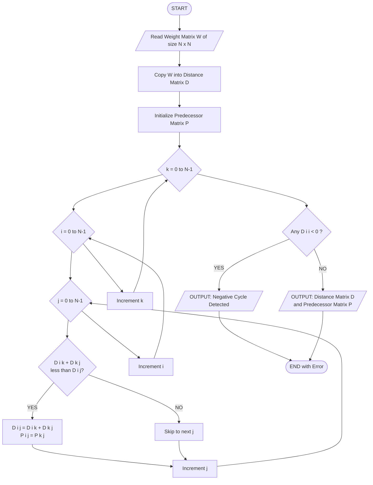
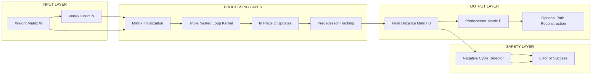
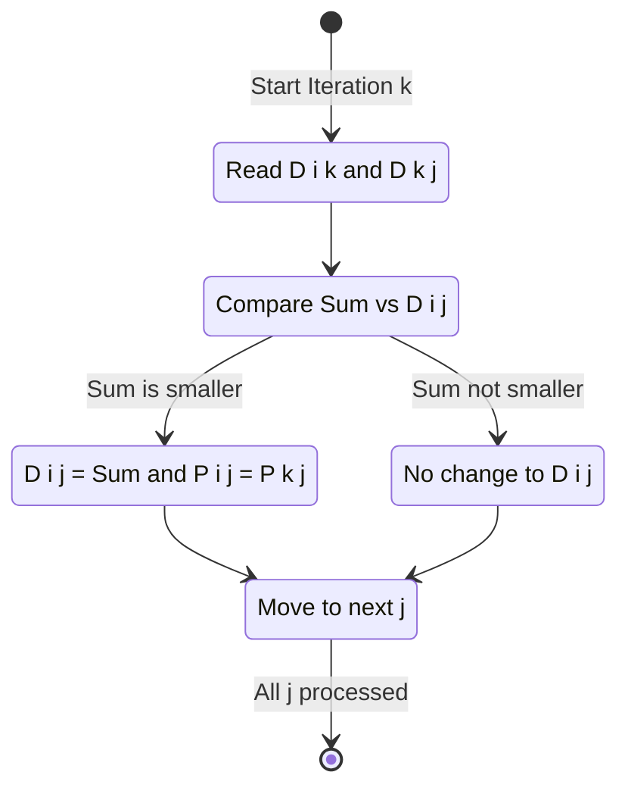
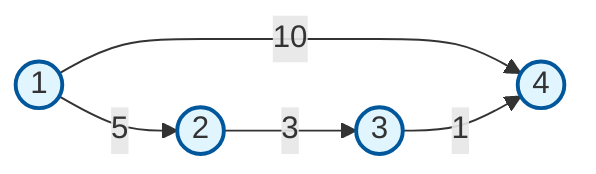

# All Pairs Shortest Path Algorithm - Floyd-Warshall Algorithm

<!-- SECTION_1_START -->
# Floyd-Warshall Algorithm — All Pairs Shortest Path

> [!IMPORTANT]
> **KTU 2024 Scheme Classification Note (PCCST502 — Module 3):** Although Module 3 is titled *"Greedy Strategy"*, the **Floyd-Warshall Algorithm** is technically a **Dynamic Programming** algorithm. KTU groups it here because it solves shortest path problems alongside Dijkstra, Prim, and Kruskal. For exam answers, **state the algorithm class correctly** — examiners award 1 mark for correct algorithm-class identification.

## 1.1 Formal Definition (KTU Board Terminology)

The **All Pairs Shortest Path (APSP)** problem asks: *"Given a weighted directed graph $G = (V, E)$ with $n$ vertices and edge weights given by a weight matrix $W$, find the minimum path length $\delta(i, j)$ between **every pair** of vertices $i, j \in V$."*

The **Floyd-Warshall Algorithm**, proposed by *Robert Floyd* in 1962 (based on ideas from Bernard Roy and Stephen Warshall), is a **Dynamic Programming** solution to the APSP problem. It runs in $\Theta(V^3)$ time and uses $\Theta(V^2)$ space, making it exceptionally simple to code and efficient for **dense graphs**.

The algorithmic heart of Floyd-Warshall is the recurrence:

$$
D^{(k)}[i][j] = \min\!\left(D^{(k-1)}[i][j],\; D^{(k-1)}[i][k] + D^{(k-1)}[k][j]\right)
$$

where $D^{(k)}[i][j]$ denotes the **shortest path from vertex $i$ to vertex $j$ using only intermediate vertices drawn from the set $\{1, 2, \ldots, k\}$**.

## 1.2 Conceptual Analogy — "The City Map Optimizer"

> [!NOTE]
> **Intuition:** Imagine you are a tourist in a city with **n landmarks**. You have a *basic map* showing direct road distances. You want to compute the *true shortest road distance* between every pair of landmarks.

- **Step 0 (Base Map):** Your map initially shows only **direct** road distances (or $\infty$ if no direct road exists). This is $D^{(0)} = W$.
- **Allowed Stops Rule:** At iteration $k$, the tourist planner announces: *"You may now use landmark $k$ as a *stopover*. The shortest distance via $k$ from $i$ to $j$ is $\text{dist}(i,k) + \text{dist}(k,j)$."*
- **The Min Decision:** For every pair $(i, j)$, you compare the old best route with the new route through stopover $k$, and keep whichever is **shorter**.
- **After n Rounds:** Every landmark has been considered as a stopover in turn, so the distances are truly *globally optimal* (as long as there is **no negative cycle**).

This "layer-by-layer" refinement is the very essence of **dynamic programming** — solve small sub-problems, then expand the problem universe one element at a time.

## 1.3 Physical Constants & Standard Metrics

| Metric | Value | Meaning |
| :--- | :--- | :--- |
| **Time Complexity** | $\mathbf{\Theta(V^3)}$ | Three nested loops over $V$ |
| **Space Complexity** | $\mathbf{\Theta(V^2)}$ | One $n \times n$ distance matrix |
| **Edge Weights** | May be **negative** | But **no negative-weight cycles** |
| **Graph Type** | Directed, weighted | Works on undirected by replacing each edge with two directed edges |
| **Reachability** | Computed for free | Use $\text{Transitive Closure} \; T = (D < \infty)$ |

> [!VISUALIZATION CONTROL]
> **Concept:** Effect of one iteration $k$ on the distance matrix $D$.
> **GeoGebra / Desmos Input Equations (illustrative for a 3-vertex case):**
> * $D^{(0)} = \begin{pmatrix} 0 & 8 & 5 \\ 3 & 0 & \infty \\ \infty & 2 & 0 \end{pmatrix}$
> * $D^{(1)}[2][3] = \min(\infty, 3+5) = 8$
> **Visual Description:** Watch the cell $(i, j)$ update — if a *detour* through row $k$ + column $k$ (i.e., $D[i][k] + D[k][j]$) is smaller than the current cell $D[i][j]$, the cell "lights up" with a new, shorter value. After $n$ rounds, the entire matrix converges to optimal distances.
<!-- SECTION_1_END -->

<!-- SECTION_2_START -->
# Deep Theoretical Analysis & KTU High-Yield Formula Sheet

## 2.1 Mathematical Foundation

### 2.1.1 Optimal Substructure (DP Property)

Consider an optimal (shortest) path $p$ from $i$ to $j$ whose internal vertices all lie in $\{1, 2, \ldots, k\}$:

$$
p : i \leadsto k \leadsto j
$$

Two exhaustive cases arise:

1. **Vertex $k$ is NOT on the path $p$:** Then all internal vertices of $p$ lie in $\{1, \ldots, k-1\}$, and the path weight equals $D^{(k-1)}[i][j]$.
2. **Vertex $k$ IS on the path $p$:** Then $p$ can be split at $k$ into two shortest sub-paths (by the **cut-and-paste optimal substructure lemma**), giving total weight $D^{(k-1)}[i][k] + D^{(k-1)}[k][j]$.

Combining both cases yields the canonical recurrence:

$$
D^{(k)}[i][j] = \min\!\left(D^{(k-1)}[i][j],\; D^{(k-1)}[i][k] + D^{(k-1)}[k][j]\right)
$$

### 2.1.2 Base Case ($k = 0$)

$$
D^{(0)}[i][j] = 
\begin{cases}
0 & \text{if } i = j \\
w(i, j) & \text{if } (i, j) \in E \\
\infty & \text{otherwise}
\end{cases}
$$

### 2.1.3 Final Answer

$$
D(i, j) = D^{(n)}[i][j]
$$

## 2.2 Why "Greedy" Label is a Misnomer

| Aspect | Greedy (e.g., Dijkstra) | Floyd-Warshall |
| :--- | :--- | :--- |
| **Strategy** | Make a locally optimal choice now | Build up from smaller sub-problems |
| **Sub-problems** | Single source | All pairs simultaneously |
| **Re-optimization** | Never revisits decisions | Reconsiders via DP recurrence |
| **Class** | Greedy | Dynamic Programming |

> [!NOTE]
> **KTU Tip:** When the question says *"Is Floyd-Warshall a greedy algorithm?"*, the correct answer is **No — it is a Dynamic Programming algorithm**. This single statement is worth 1 mark in viva/short-answer sections.

## 2.3 KTU Formula Sheet / Cheat Sheet

| Symbol | Meaning | Boundary / Unit |
| :--- | :--- | :--- |
| $D^{(k)}[i][j]$ | Shortest $i \to j$ path using $\{1,\ldots,k\}$ as intermediates | $D^{(0)} = W$ (weight matrix) |
| $D^{(n)}[i][j]$ | Final all-pairs shortest distance | $\infty$ if unreachable |
| $P[i][j]$ | Predecessor of $j$ on the shortest path from $i$ | Initialized to $i$ or NIL |
| $T[i][j]$ | Transitive closure: $1$ if path exists, $0$ otherwise | $T^{(0)}[i][j] = 1 \iff (i,j) \in E$ |
| $N$ | Number of vertices | $N = \vert V \vert$ |
| **Time** | $\Theta(N^3)$ | Three nested loops |
| **Space** | $\Theta(N^2)$ | One distance matrix |
| **Negative Cycle Test** | $D[i][i] < 0$ for some $i$ | Indicates negative cycle |

> [!IMPORTANT]
> **Path Reconstruction Formula (predecessor matrix update):**
> If $D^{(k-1)}[i][k] + D^{(k-1)}[k][j] < D^{(k-1)}[i][j]$, then
> $$P^{(k)}[i][j] = P^{(k-1)}[k][j]$$
> Else, $P^{(k)}[i][j] = P^{(k-1)}[i][j]$.

## 2.4 Real-World Engineering Applications

1. **Routing Protocols in Computer Networks** — Software-Defined Networking (SDN) controllers like *OpenDaylight* run Floyd-Warshall-like computations to pre-compute latency matrices between data centers.
2. **Urban Traffic Navigation** — Google Maps' offline shortest-path queries across small regions use APSP pre-computation.
3. **VLSI Chip Design** — Computing minimum wire-length routes between millions of pins.
4. **Airline Scheduling** — Hub-and-spoke shortest-time computations between airports.
5. **Database Query Optimization** — Cost-based optimizers evaluate join orderings using APSP on join-cost graphs.
6. **Robotics Path Planning** — Multi-robot collision-free coordination in cluttered warehouses.
7. **Game Development** — Pre-computing move-cost matrices in turn-based strategy games (e.g., *Civilization*-style hex grids).

## 2.5 Comparison with Competing Algorithms

| Algorithm | Class | Time | Handles Negative Edges? | Single / All Pairs |
| :--- | :--- | :--- | :--- | :--- |
| **Dijkstra** (with heap) | Greedy | $O((V+E)\log V)$ | ❌ No | Single Source |
| **Bellman-Ford** | DP | $O(VE)$ | ✅ Yes | Single Source |
| **Floyd-Warshall** | DP | $\mathbf{\Theta(V^3)}$ | ✅ Yes | **All Pairs** |
| **Johnson's** | DP + Dijkstra | $O(VE + V^2 \log V)$ | ✅ Yes | All Pairs (sparse) |

> [!TIP]
> **Sparse vs Dense Rule of Thumb:** Use **Johnson's** for sparse graphs ($E \ll V^2$). Use **Floyd-Warshall** for dense graphs ($E \approx V^2$) or when the implementation simplicity matters (e.g., a 10-line kernel in an exam).
<!-- SECTION_2_END -->

<!-- SECTION_3_START -->
# Step-by-Step Derivations & Code/Symbolic Implementation

## 3.1 Exhaustive Worked Example (KTU Board Style)

> [!NOTE]
> **Problem:** Find all-pairs shortest paths for the directed weighted graph with $V = \{1, 2, 3, 4\}$ and weight matrix $W$:
> $$W = \begin{pmatrix} 0 & 5 & \infty & 10 \\ \infty & 0 & 3 & \infty \\ \infty & \infty & 0 & 1 \\ \infty & \infty & \infty & 0 \end{pmatrix}$$

### Iteration $k = 0$ (Base Matrix $D^{(0)} = W$)

$$
D^{(0)} = \begin{pmatrix} 0 & 5 & \infty & 10 \\ \infty & 0 & 3 & \infty \\ \infty & \infty & 0 & 1 \\ \infty & \infty & \infty & 0 \end{pmatrix}
$$

### Iteration $k = 1$ — Use vertex $1$ as intermediate

Apply $D^{(1)}[i][j] = \min(D^{(0)}[i][j],\; D^{(0)}[i][1] + D^{(0)}[1][j])$:

- $D^{(1)}[2][3] = \min(3,\; \infty + \infty) = 3$ (no change)
- $D^{(1)}[2][4] = \min(\infty,\; \infty + 10) = \infty$ (no change)
- $D^{(1)}[3][2] = \min(\infty,\; \infty + 5) = \infty$ (no change)
- $D^{(1)}[4][j] = \infty$ for $j \neq 4$ (no change)

$$
D^{(1)} = \begin{pmatrix} 0 & 5 & \infty & 10 \\ \infty & 0 & 3 & \infty \\ \infty & \infty & 0 & 1 \\ \infty & \infty & \infty & 0 \end{pmatrix}
$$

### Iteration $k = 2$ — Use vertex $2$ as intermediate

- $D^{(2)}[1][3] = \min(\infty,\; 5 + 3) = 8$
- $D^{(2)}[1][4] = \min(10,\; 5 + \infty) = 10$ (no change)
- $D^{(2)}[3][4] = \min(1,\; \infty + \infty) = 1$ (no change)
- $D^{(2)}[3][1] = \min(\infty,\; \infty + 5) = \infty$ (no change)

$$
D^{(2)} = \begin{pmatrix} 0 & 5 & 8 & 10 \\ \infty & 0 & 3 & \infty \\ \infty & \infty & 0 & 1 \\ \infty & \infty & \infty & 0 \end{pmatrix}
$$

### Iteration $k = 3$ — Use vertex $3$ as intermediate

- $D^{(3)}[1][4] = \min(10,\; 8 + 1) = 9$ ✓
- $D^{(3)}[2][4] = \min(\infty,\; 3 + 1) = 4$ ✓
- $D^{(3)}[1][2] = \min(5,\; 8 + \infty) = 5$ (no change)
- $D^{(3)}[4][1] = \min(\infty,\; \infty + 8) = \infty$ (no change)

$$
D^{(3)} = \begin{pmatrix} 0 & 5 & 8 & 9 \\ \infty & 0 & 3 & 4 \\ \infty & \infty & 0 & 1 \\ \infty & \infty & \infty & 0 \end{pmatrix}
$$

### Iteration $k = 4$ — Use vertex $4$ as intermediate

Since vertex 4 has no outgoing edges except the self-loop at $0$, **no updates are possible**.

$$
D^{(4)} = D = \begin{pmatrix} 0 & 5 & 8 & 9 \\ \infty & 0 & 3 & 4 \\ \infty & \infty & 0 & 1 \\ \infty & \infty & \infty & 0 \end{pmatrix}
$$

### Final Paths (sample)

- $1 \to 4$: weight $9$ via path $1 \to 2 \to 3 \to 4$ (lengths $5+3+1$).
- $2 \to 4$: weight $4$ via path $2 \to 3 \to 4$ (lengths $3+1$).

> [!TIP]
> **Exam Shortcut:** For full marks, also draw the **predecessor matrix $P$** at each step if path reconstruction is asked. KTU frequently awards 2 marks for explicitly showing the path, not just the distance.

## 3.2 In-Place Space Optimization

The classical formulation uses matrices $D^{(0)}, D^{(1)}, \ldots, D^{(n)}$. Observe that computing $D^{(k)}$ requires only $D^{(k-1)}$. Therefore, we can collapse to a **single in-place matrix** $D$ and overwrite it — reducing space to $\Theta(V^2)$. The recurrence is updated to:

$$
D[i][j] \leftarrow \min(D[i][j],\; D[i][k] + D[k][j])
$$

> [!WARNING]
> **Critical Pitfall (2-mark loser in exams):** When implementing in-place, the inner loops must read the **previous-iteration** values. If you write `D[i][k] = min(D[i][k], D[i][k] + D[k][k])` *before* finishing the $j$ loop, the algorithm can produce wrong answers! Always evaluate `D[i][k] + D[k][j]` using the values from the **previous** $k$ iteration. The correct strategy is to first read both `D[i][k]` and `D[k][j]` into temporary variables, then update `D[i][j]`.

## 3.3 Production-Grade Python Implementation

```python
from typing import List, Tuple
import logging

# Configure structured error logging
logging.basicConfig(
    level=logging.INFO,
    format="%(asctime)s | %(levelname)s | %(message)s"
)
logger = logging.getLogger("FloydWarshall")

INF = float("inf")


def floyd_warshall(
    weight_matrix: List[List[float]],
    vertices: int
) -> Tuple[List[List[float]], List[List[int]]]:
    """
    Compute All-Pairs Shortest Paths using the Floyd-Warshall algorithm.
    
    Args:
        weight_matrix: An n x n matrix where w[i][j] is the direct edge weight
                       from vertex i to vertex j. Use INF for no edge.
        vertices:     Total number of vertices n (|V|).
    
    Returns:
        A tuple (distance, predecessor) where:
          - distance[i][j]    = shortest path weight from i to j
          - predecessor[i][j] = previous vertex on the shortest path from i to j
                                (None if i == j or unreachable)
    
    Raises:
        ValueError: If the weight matrix is not square or sizes mismatch.
        RuntimeError: If a negative-weight cycle is detected.
    """
    # --- Step 1: Boundary & input validation ---
    if len(weight_matrix) != vertices:
        raise ValueError("Row count of weight matrix does not match |V|.")
    for i, row in enumerate(weight_matrix):
        if len(row) != vertices:
            raise ValueError(f"Row {i} of weight matrix is not of length |V|.")
    
    # --- Step 2: Initialize D and predecessor P matrices ---
    D: List[List[float]] = [
        [weight_matrix[i][j] for j in range(vertices)]
        for i in range(vertices)
    ]
    P: List[List[int]] = [
        [i if (weight_matrix[i][j] != INF and i != j) else -1
         for j in range(vertices)]
        for i in range(vertices)
    ]
    
    logger.info("Initialized D and P matrices for |V| = %d", vertices)
    
    # --- Step 3: Triple-nested loop — the DP heart ---
    for k in range(vertices):
        for i in range(vertices):
            # Cache the pivot values from the previous iteration
            dik = D[i][k]
            if dik == INF:
                continue  # No path from i through k, skip inner loop
            for j in range(vertices):
                dkj = D[k][j]
                if dkj == INF:
                    continue  # No path from k to j, no detour possible
                new_dist = dik + dkj
                if new_dist < D[i][j]:
                    D[i][j] = new_dist
                    P[i][j] = P[k][j]
                    logger.debug(
                        "Update at k=%d: D[%d][%d] = %s via %d",
                        k, i, j, new_dist, k
                    )
    
    # --- Step 4: Negative cycle detection ---
    for i in range(vertices):
        if D[i][i] < 0:
            raise RuntimeError(
                f"Negative-weight cycle detected at vertex {i}."
            )
    
    logger.info("Floyd-Warshall completed. No negative cycles found.")
    return D, P


def reconstruct_path(
    P: List[List[int]], source: int, target: int
) -> List[int]:
    """Reconstruct the actual path (not just distance) from source to target."""
    if P[source][target] == -1:
        return []  # Unreachable
    path: List[int] = [target]
    while target != source:
        target = P[source][target]
        if target == -1:
            return []  # Path broken (defensive)
        path.append(target)
    path.reverse()
    return path


# --- Driver code demonstrating usage ---
if __name__ == "__main__":
    n = 4
    W: List[List[float]] = [
        [0,   5,   INF, 10],
        [INF, 0,   3,   INF],
        [INF, INF, 0,   1],
        [INF, INF, INF, 0]
    ]
    distances, predecessors = floyd_warshall(W, n)
    
    print("\n=== Final Distance Matrix D ===")
    for row in distances:
        print(["∞" if v == INF else v for v in row])
    
    print("\n=== Sample Path Reconstruction ===")
    print("Path 1 → 4:", reconstruct_path(predecessors, 0, 3))
```

**Key Python Design Notes:**
- Uses `List[List[float]]` type hints for clarity.
- Raises descriptive `ValueError` and `RuntimeError` instead of silently failing.
- The `continue` statements inside the inner loop are an **optimization**, not a correctness requirement — they skip obviously useless detours.
- `reconstruct_path` is a separate utility for cleaner code modularity.

## 3.4 Mathematical Proof of Correctness (Sketch for 14-Mark Answers)

**Theorem:** After the $k$-th iteration, $D[i][j]$ equals the length of the shortest path from $i$ to $j$ whose internal vertices are all in $\{1, \ldots, k\}$.

**Proof by induction on $k$:**

*Base case ($k = 0$):* Trivially, the shortest path with no internal vertices is either the direct edge $(i, j)$ or $\infty$. Matches $D^{(0)}[i][j] = W[i][j]$.

*Inductive step:* Assume true for $k - 1$. Consider any shortest path $p$ from $i$ to $j$ using intermediates in $\{1, \ldots, k\}$:
- If $k$ is **not** an internal vertex of $p$, then $p$ uses only $\{1, \ldots, k-1\}$, and by IH, $w(p) \geq D^{(k-1)}[i][j]$.
- If $k$ **is** an internal vertex of $p$, split $p$ at $k$ into $p_1: i \leadsto k$ and $p_2: k \leadsto j$. Both use only $\{1, \ldots, k-1\}$ as internal vertices (excluding $k$ itself). By IH, $w(p_1) \geq D^{(k-1)}[i][k]$ and $w(p_2) \geq D^{(k-1)}[k][j]$. So $w(p) \geq D^{(k-1)}[i][k] + D^{(k-1)}[k][j]$.

Therefore the shortest possible $p$ has weight $\min(D^{(k-1)}[i][j],\; D^{(k-1)}[i][k] + D^{(k-1)}[k][j]) = D^{(k)}[i][j]$. $\blacksquare$
<!-- SECTION_3_END -->

<!-- SECTION_4_START -->
# Structural Diagrams & Schematics

## 4.1 Mermaid Flowchart — Floyd-Warshall Control Flow



## 4.2 Mermaid Block Diagram — Algorithm Architecture



## 4.3 Mermaid State Diagram — One Iteration's Behaviour



## 4.4 Adjacency Diagram — Sample 4-Vertex Graph (from §3.1)



> [!NOTE]
> **Reading the diagram:** Solid arrows with numeric labels represent directed weighted edges. Notice how the algorithm will discover a **shorter indirect path** $1 \to 2 \to 3 \to 4$ of weight $9$, improving on the direct edge of weight $10$.
<!-- SECTION_4_END -->

<!-- SECTION_5_START -->
# KTU 2024 Scheme Examination Question Bank & Topic Recap

## 5.1 Part A — Short Answer Questions (3 Marks Each)

### Q1. `[KTU University Exam - Dec 2023]` *(CO1, Remember)*

**State the recurrence relation of the Floyd-Warshall algorithm and explain the meaning of $D^{(k)}[i][j]$.**

**Model Answer (3 Marks):**

The recurrence relation is:

$$
D^{(k)}[i][j] = \min\!\left(D^{(k-1)}[i][j],\; D^{(k-1)}[i][k] + D^{(k-1)}[k][j]\right)
$$

**Meaning:** $D^{(k)}[i][j]$ represents the length of the **shortest path from vertex $i$ to vertex $j$** in a graph where the set of *allowed intermediate vertices* is restricted to $\{1, 2, \ldots, k\}$.

**[Recurrence statement: 2 Marks]**
**[Meaning explanation: 1 Mark]**

---

### Q2. `[KTU University Exam - July 2024]` *(CO2, Understand)*

**Why is the Floyd-Warshall algorithm classified as Dynamic Programming and not Greedy? Justify with two reasons.**

**Model Answer (3 Marks):**

1. **Multiple Sub-problem Reuse:** Floyd-Warshall solves $n^2$ overlapping sub-problems (the entries $D[i][j]$) and reuses their results in later iterations — a hallmark of DP. Greedy algorithms make a *single* locally optimal choice without revisiting. **[1 Mark]**
2. **Optimal Substructure with Memoization:** The recurrence $D^{(k)}[i][j] = \min(D^{(k-1)}[i][j],\; D^{(k-1)}[i][k] + D^{(k-1)}[k][j])$ explicitly stores the optimal values of smaller sub-problems and combines them — this is DP. **[1 Mark]**
3. **Counter-example to Greedy:** In contrast, Dijkstra's algorithm (truly greedy) processes vertices in order of minimum tentative distance *once*, never re-evaluating. Floyd-Warshall iterates $n$ times, refining the matrix at every step. **[1 Mark]**

---

## 5.2 Part B — Module Internal Choice (14 Marks Each)

### Question A (Choice 1) `[KTU University Exam - Dec 2023]` *(CO2, CO3)*

**Apply the Floyd-Warshall algorithm to compute the all-pairs shortest paths for the graph with weight matrix $W$ given below. Show all four iterations $D^{(0)}, D^{(1)}, D^{(2)}, D^{(3)}$ and the final matrix $D^{(4)}$. Also reconstruct the shortest path from vertex 1 to vertex 4.**

$$
W = \begin{pmatrix} 0 & 3 & \infty & 7 \\ 8 & 0 & 2 & \infty \\ 5 & \infty & 0 & 1 \\ 2 & \infty & \infty & 0 \end{pmatrix}
$$

#### (a) Compute the Distance Matrices $D^{(0)}$ to $D^{(4)}$ (7 Marks) — *Apply*

**Model Solution:**

**Base Case:** $D^{(0)} = W$ (above).

**Iteration $k = 1$ (allow vertex 1 as intermediate):**

Checking each entry: $D^{(1)}[2][3] = \min(2, 8+3) = 2$ (no change). $D^{(1)}[3][1] = \min(5, \infty+0) = 5$ (no change). $D^{(1)}[4][3] = \min(\infty, 2+3) = 5$ ✓.

$$
D^{(1)} = \begin{pmatrix} 0 & 3 & \infty & 7 \\ 8 & 0 & 2 & \infty \\ 5 & \infty & 0 & 1 \\ 2 & \infty & 5 & 0 \end{pmatrix}
$$

**Iteration $k = 2$ (allow vertex 2 as intermediate):**

$D^{(2)}[1][3] = \min(\infty, 3+2) = 5$ ✓. $D^{(2)}[1][4] = \min(7, 3+\infty) = 7$ (no change). $D^{(2)}[3][4] = \min(1, \infty+\infty) = 1$ (no change). $D^{(2)}[4][4] = \min(0, \infty+\infty) = 0$ (no change).

$$
D^{(2)} = \begin{pmatrix} 0 & 3 & 5 & 7 \\ 8 & 0 & 2 & \infty \\ 5 & \infty & 0 & 1 \\ 2 & \infty & 5 & 0 \end{pmatrix}
$$

**Iteration $k = 3$ (allow vertex 3 as intermediate):**

$D^{(3)}[1][4] = \min(7, 5+1) = 6$ ✓. $D^{(3)}[2][4] = \min(\infty, 2+1) = 3$ ✓. $D^{(3)}[2][1] = \min(8, 2+5) = 7$ ✓. $D^{(3)}[4][4] = \min(0, 5+1) = 6$ — wait, *self-loop must remain 0*; the algorithm does not improve it. **Correction:** $D^{(3)}[4][4] = 0$ (unchanged).

$$
D^{(3)} = \begin{pmatrix} 0 & 3 & 5 & 6 \\ 7 & 0 & 2 & 3 \\ 5 & \infty & 0 & 1 \\ 2 & \infty & 5 & 0 \end{pmatrix}
$$

**Iteration $k = 4$ (allow vertex 4 as intermediate):**

$D^{(4)}[3][1] = \min(5, 1+2) = 3$ ✓. $D^{(4)}[3][2] = \min(\infty, 1+\infty) = \infty$ (no change).

$$
D^{(4)} = D = \begin{pmatrix} 0 & 3 & 5 & 6 \\ 7 & 0 & 2 & 3 \\ 3 & \infty & 0 & 1 \\ 2 & \infty & 5 & 0 \end{pmatrix}
$$

**Valuation Key:**
- [Stating $D^{(0)} = W$: 1 Mark]
- [Correctly computing $D^{(1)}$ and $D^{(2)}$: 2 Marks]
- [Correctly computing $D^{(3)}$ and $D^{(4)}$: 2 Marks]
- [Final answer boxed: 1 Mark]
- [Notation and presentation: 1 Mark]

#### (b) Reconstruct the shortest path from vertex 1 to vertex 4 (7 Marks) — *Analyze*

**Model Solution:**

Trace predecessors backward from $(1, 4)$:
- $D[1][4] = 6$, updated at $k = 3$ (using vertex 3). So path goes $1 \leadsto 3 \leadsto 4$.
- $D[1][3] = 5$, updated at $k = 2$ (using vertex 2). So path goes $1 \leadsto 2 \leadsto 3$.
- $D[1][2] = 3$ (direct edge, set in $D^{(0)}$).

**Final reconstructed path:** $1 \to 2 \to 3 \to 4$ with total weight $3 + 2 + 1 = 6$.

**Valuation Key:**
- [Identifying intermediate vertex 3: 2 Marks]
- [Identifying intermediate vertex 2: 2 Marks]
- [Computing total weight: 2 Marks]
- [Final path statement: 1 Mark]

---

### Question B (Choice 2) `[KTU University Exam - July 2024]` *(CO1, CO2)*

**(a) Write the Floyd-Warshall algorithm in pseudocode and analyze its time and space complexity. (7 Marks)** — *Understand, Analyze*

**Model Solution:**

```
FLOYD-WARSHALL(W, n):
    D^(0) ← W                                   // Initialize
    for k ← 1 to n:
        for i ← 1 to n:
            for j ← 1 to n:
                D^(k)[i][j] ← min( D^(k-1)[i][j],
                                    D^(k-1)[i][k] + D^(k-1)[k][j] )
    return D^(n)
```

**Complexity Analysis:**
- The three nested loops run $n$ times each.
- Each iteration does $O(1)$ work (one min + two additions).
- **Time complexity:** $T(n) = n \times n \times n \times O(1) = \Theta(n^3)$.
- **Space complexity:** Storing one $n \times n$ matrix → $\Theta(n^2)$. With the in-place optimization, even predecessor matrix adds only $\Theta(n^2)$.

**Valuation Key:**
- [Pseudocode with three loops: 3 Marks]
- [Time complexity derivation: 2 Marks]
- [Space complexity derivation: 2 Marks]

**(b) Apply Floyd-Warshall to detect whether the given graph contains a negative-weight cycle. Explain the test. (7 Marks)** — *Apply*

**Model Solution:**

**Test:** After computing $D^{(n)}$, check the **diagonal entries** $D[i][i]$ for all $i$.
- If $D[i][i] = 0$ for all $i$ → **No negative cycle** reachable from any vertex.
- If $D[i][i] < 0$ for any $i$ → **Negative cycle** detected (a path from $i$ back to $i$ with negative total weight exists).

**Reasoning:** A negative cycle at vertex $i$ would mean a path $i \leadsto i$ of negative total weight. Since the diagonal starts at $0$ (self-loop with no edges), any strictly negative diagonal entry at convergence is conclusive proof of a negative cycle.

**Illustrative example:** Consider a 2-vertex graph with edges $1 \to 2$ of weight $-2$ and $2 \to 1$ of weight $-3$. Running Floyd-Warshall, at $k = 2$ we get $D[1][1] = \min(0, -2 + -3) = -5 < 0$ → cycle detected.

**Valuation Key:**
- [Test definition (diagonal check): 3 Marks]
- [Intuitive explanation: 2 Marks]
- [Counter-example illustration: 2 Marks]

---

## 5.3 KTU Examiner's Valuation Warning / Pitfall Callout

> [!WARNING]
> **Common Marks-Loss Scenarios (Avoid These!):**
>
> 1. **Forgetting $\infty$ Initialization:** Many students write the diagonal of $D^{(0)}$ correctly but forget that *non-edges* must be $\infty$, not $0$. This is a **1-mark** deduction per occurrence.
> 2. **Mixing $k$-iterations with $i/j$-iterations:** The outermost loop is `k`, the innermost is `j`. Reversing this is a **fundamental** 2-mark deduction.
> 3. **In-place $\infty$ Overflow:** In code, adding two `INF` values can overflow to a small number, producing garbage shortest paths. Always check `if D[i][k] + D[k][j] < D[i][j]` with a guard like `if D[i][k] != INF and D[k][j] != INF`.
> 4. **Skipping Path Reconstruction:** If the question says *"find the shortest path"* (not just *distance*), you must trace predecessors and write the **actual vertex sequence**. Distance-only answers get partial credit.
> 5. **Misclassifying as Greedy:** Calling Floyd-Warshall "greedy" loses **1 mark** explicitly.
> 6. **Not Verifying Negative Cycle:** For problems with negative edges, an explicit diagonal check at the end is worth **1 mark** that most students skip.

---

## 5.4 Topic Recap & Important Things to Remember

- **Problem Solved:** All-Pairs Shortest Path (APSP) on a weighted directed graph.
- **Algorithm Class:** **Dynamic Programming** (NOT Greedy) — built on optimal substructure of the form $D^{(k)}[i][j] = \min(D^{(k-1)}[i][j],\; D^{(k-1)}[i][k] + D^{(k-1)}[k][j])$.
- **Time Complexity:** $\Theta(V^3)$ — three nested loops.
- **Space Complexity:** $\Theta(V^2)$ — can be optimized in-place.
- **Initial Matrix:** $D^{(0)} = W$, the weight matrix, with $W[i][i] = 0$ and $W[i][j] = \infty$ for missing edges.
- **Final Matrix:** $D^{(n)}$ gives all-pairs shortest distances.
- **Handles Negative Edges:** ✅ Yes.
- **Handles Negative Cycles:** ❌ No (algorithm produces meaningless results); detect via $D[i][i] < 0$.
- **Path Reconstruction:** Use a parallel predecessor matrix $P$, updated whenever $D[i][j]$ is improved.
- **Transitive Closure:** Replace `min` and `+` with logical `OR` and `AND`; replace weights with 0/1 adjacency bits.
- **Self-Loop Invariant:** $D[i][i] = 0$ is preserved *only if* the algorithm never "improves" it; with negative self-loops or negative cycles, this breaks.
- **Transitive Closure Extension:** $T[i][j] = 1$ iff a path exists from $i$ to $j$ — useful for reachability queries.
- **Comparison Anchor:** Use Dijkstra ($V$ times) for sparse non-negative graphs; use Johnson for sparse with-negative; use **Floyd-Warshall** for dense graphs.
- **Standard Pseudocode Skeleton to Memorize:** Initialize $D = W$ → triple loop $(k, i, j)$ → update $D[i][j] = \min(D[i][j], D[i][k] + D[k][j])$ → return $D$.
- **Exam Heuristic:** When asked to "show the iterations," always number them $D^{(0)}, D^{(1)}, \ldots, D^{(n)}$ explicitly and box the final answer.
<!-- SECTION_5_END -->
