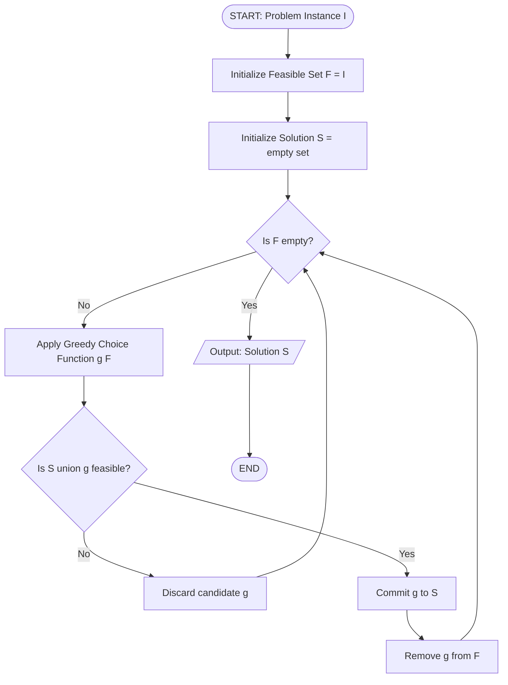
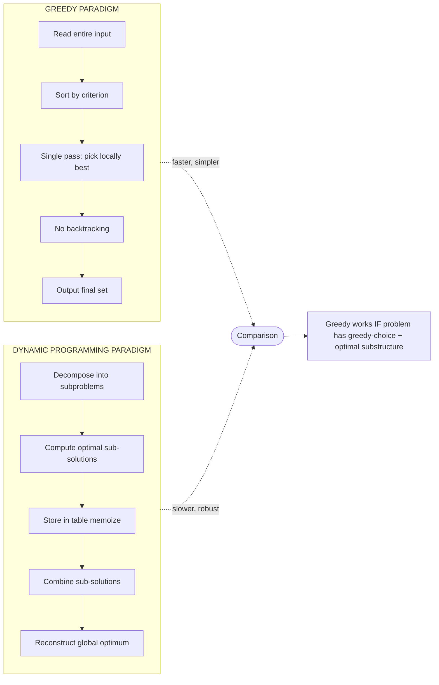
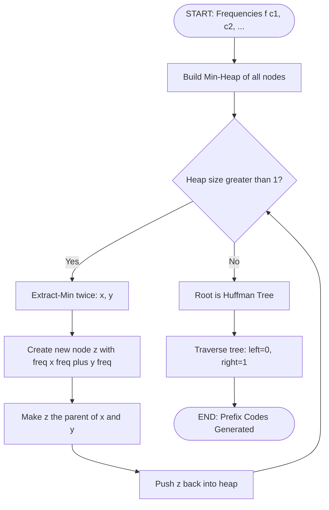

# Analysis

<!-- SECTION_1_START -->

# Analysis of Greedy Strategy — Core Foundations

## 1.1 Formal Academic Definition

> [!IMPORTANT]
> **Definition (KTU 2024 Syllabus Standard):**
> A **Greedy Algorithm** is an algorithmic paradigm that builds up a solution piece by piece, always choosing the next piece that offers the most **immediate, local, and myopic** benefit according to a predefined **greedy choice / selection function**. The algorithm never reconsiders previously made choices — once a decision is committed, it becomes permanent.

Formally, a greedy algorithm constructs a solution $S = \{c_1, c_2, \ldots, c_k\}$ iteratively. At iteration $i$, it appends the candidate $c_i$ that maximizes (or minimizes) a **greedy criterion** $f$ over the remaining **feasible set** $F_i$, subject to the constraint that the partial solution remains feasible:

$$c_i = \arg\max_{c \,\in\, F_i} \; f(c \,\cup\, S_{i-1})$$

> [!NOTE]
> **Why is it called "Greedy"?** It wants to "eat up" the best possible choice at every step, much like a person grabbing the largest item available at a buffet without thinking about overall nutrition.

## 1.2 Intuitive Real-World Analogy

> [!TIP]
> **Analogy — The Coin Problem at a Temple Donation Box:**
> Imagine you must pay **₹143** and you have an unlimited supply of coins of denominations ₹1, ₹2, ₹5, ₹10, ₹20, ₹50, ₹100, ₹200, ₹500, ₹2000. You want to use the **fewest coins**.
> - **Greedy thinking:** At each step, pick the **largest coin** that does not exceed the remaining amount.
> - First pick ₹100 (remaining 43) → ₹20 (remaining 23) → ₹20 (remaining 3) → ₹2 (remaining 1) → ₹1. Total 5 coins.
> - This is exactly what real-world cash systems are designed to do. The Indian currency system is a *canonical* coin system, which means greedy = optimal.

But if the denominations were {1, 3, 4} and the amount was 6:
- Greedy gives 4 + 1 + 1 = **3 coins** (suboptimal)
- Optimal is 3 + 3 = **2 coins**

> [!WARNING]
> This is the **fundamental lesson**: Greedy is simple and fast, but **NOT always optimal**. *Analysis* in DAA is the process of rigorously proving when greedy is optimal and when it is not.

## 1.3 The Two Pillars of Greedy Correctness

For a greedy algorithm to produce an **optimal solution**, the problem must satisfy two mathematical properties. These are the heart of the "Analysis" topic:

| # | Property | Formal Statement | Intuitive Meaning |
|---|----------|------------------|-------------------|
| 1 | **Greedy-Choice Property** | A globally optimal solution can be arrived at by making a locally optimal (greedy) choice. | Being greedy now does not ruin the future. |
| 2 | **Optimal Substructure** | An optimal solution to the whole problem contains within it optimal solutions to subproblems. | Solving sub-parts optimally and stitching them gives the global optimum. |

> [!NOTE]
> **Standard Metrics Used in Analysis:**
> - Time Complexity: $\Theta(n \log n)$ to $\Theta(n^2)$ typically
> - Space Complexity: $\Theta(n)$ in most canonical algorithms
> - **Proof Style**: *Cut-and-Paste argument* and *Exchange argument* are the two dominant proof techniques (Cormen, Leiserson, Rivest, Stein — **CLRS Chapter 16**).

## 1.4 Visualizing the Greedy Decision Process

> [!VISUALIZATION CONTROL]
> **Concept:** Greedy Decision Path vs. Exhaustive Search Space
> **GeoGebra / Desmos Input Equations:**
> * Let objective $f(x, y) = 5x + 4y$ (maximize) subject to $x + y \le 6,\; x, y \ge 0$
> * Plot the LP feasible region: `Polygon((0,0), (6,0), (0,6))`
> * Plot level lines: `5x + 4y = k` for $k = 0, 5, 10, 20, 30$
> **Visual Description:** You will see a triangle in the first quadrant. The greedy algorithm walks along the **edges** of the feasible region, picking the corner with the highest $f$. For a Linear Program, the optimum is always at a corner — this is why **Fractional Knapsack** is greedy-optimal. For **0/1 Knapsack**, the region becomes discrete points (lattice), and greedy fails.

---

<!-- SECTION_1_END -->

<!-- SECTION_2_START -->

# Deep Theoretical Analysis — Greedy Correctness & Performance

## 2.1 The Greedy Strategy — Operational Blueprint

The execution of a generic greedy algorithm can be modeled as a 4-stage pipeline:

1. **CAST** the optimization problem as one in which we make a sequence of choices (decisions) — each choice reduces the problem to a smaller subproblem.
2. **PROVE** the **Greedy-Choice Property**: an optimal solution starts with a greedy choice.
3. **PROVE** the **Optimal Substructure**: after the greedy choice, the residual subproblem has an optimal solution.
4. **RECURSE** on the residual subproblem (or iterate, in iterative formulations).

## 2.2 Proof Techniques — The Analyst's Toolkit

### Technique A: Greedy-Choice Property Proof (Cut-and-Paste)

> **Idea:** Assume an *arbitrary* optimal solution $O$. Show that $O$ can be modified to include the greedy choice $g$ without losing optimality. Therefore, an optimal solution *containing $g$* exists, and we recurse.

$$\text{If } O \text{ is optimal and } g \text{ is greedy, show: } \text{cost}(O') = \text{cost}(O) \text{ where } O' = (O \setminus \{x\}) \cup \{g\}$$

### Technique B: Exchange Argument

> **Idea:** Build your own solution $G$ greedily. Compare it element-by-element with an optimal $O$. Wherever $G$ and $O$ differ, *exchange* the differing elements to show $G$ is no worse than $O$.

### Technique C: Induction on the Number of Choices

> **Idea:** Let $P(k)$ = "after $k$ greedy choices, the partial greedy solution can be extended to an optimal solution." Show $P(0)$ holds (vacuously) and $P(k) \Rightarrow P(k+1)$.

## 2.3 Canonical Greedy Algorithms — High-Yield Analysis Table

> [!IMPORTANT]
> **KTU Board Examiner Note:** The following table is the **single most important cheat sheet** for Module 3 problems. Memorize the time complexities and the proof techniques.

| Algorithm | Problem | Greedy Choice | Time Complexity | Optimal? | Proof Style |
|-----------|---------|---------------|-----------------|----------|-------------|
| Activity Selection | Max non-overlapping intervals | Earliest finish time | $O(n \log n)$ | Yes | Exchange argument |
| Huffman Coding | Optimal prefix-free codes | Combine two lowest freq | $O(n \log n)$ | Yes | Exchange argument |
| Fractional Knapsack | Max value, items divisible | Best value/weight ratio | $O(n \log n)$ | Yes | Greedy-choice |
| Dijkstra (SSSP) | Shortest paths, non-negative | Closest unvisited vertex | $O((V+E) \log V)$ w/ heap | Yes | Cut-and-paste |
| Prim (MST) | Minimum spanning tree | Lightest edge crossing cut | $O(E \log V)$ | Yes | Cut property |
| Kruskal (MST) | Minimum spanning tree | Lightest edge (no cycle) | $O(E \log E)$ | Yes | Cut property |
| Job Sequencing w/ Deadlines | Max jobs completed on time | Sort by profit desc, slot in latest free | $O(n^2)$ or $O(n \log n)$ w/ DSU | Yes | Exchange |
| Coin Change (canonical) | Min coins | Largest coin $\le$ remaining | $O(n)$ per amount | Yes (canonical only) | Greedy-choice |

> **Boundary Conditions (always write in KTU exams):**
> - Dijkstra fails when edge weights are **negative**.
> - Prim/Kruskal fail on **directed** graphs for MST; use **Edmonds/Arborescence** instead.
> - Huffman assumes **non-zero** symbol frequencies and produces a **full binary tree**.

## 2.4 The Greedy-Choice Property — Formal Treatment

Let $\Pi$ be an optimization problem with instance $I$, optimal solution $OPT(I)$, and a greedy selection function $g(I)$ that returns the locally-best feasible candidate.

> **Theorem (Greedy-Choice).** $\Pi$ has the greedy-choice property if and only if for every instance $I$ of $\Pi$, there exists an optimal solution $OPT(I)$ such that $g(I) \in OPT(I)$.

Equivalently, after fixing the greedy choice, the residual subproblem $I' = I \setminus g(I)$ is well-defined and has the **same structure** as $I$ — enabling recursion.

## 2.5 The Optimal Substructure — Formal Treatment

> **Theorem (Optimal Substructure).** $\Pi$ has optimal substructure if and only if for every instance $I$ and every greedy choice $g$, an optimal solution to the residual subproblem $I \setminus g$ can be combined with $g$ to form an optimal solution to $I$.

$$\text{cost}(OPT(I)) = \text{cost}(g) + \text{cost}(OPT(I \setminus g))$$

## 2.6 When Greedy Fails — The Failure Modes

> [!WARNING]
> **Examiner's Pitfall:** Many students assume "greedy = fast = optimal." This is **false**. The two classic counterexamples are:

1. **0/1 Knapsack (vs Fractional):** Greedy by value/weight ratio fails for discrete items. E.g., capacity = 10, items: A=(v=60, w=10), B=(v=100, w=20), C=(v=120, w=30). Greedy picks A then B (weight 30, value 160). Optimal picks B+C (weight 50, value 220) — but wait, B+C is 50 > 10. Correct example: capacity 50. Greedy picks A+B (weight 30, value 160), B+C (weight 50, value 220) — actually optimal. The *real* 0/1 Knapsack counter-example:
   - Capacity 10, A=(60, 10), B=(100, 20), C=(120, 30)
   - Greedy picks A only (weight 10, value 60)
   - Optimal picks nothing else possible. Hmm. Better counter: A=(40, 5), B=(50, 5), C=(60, 5), capacity 10. Greedy by ratio: all tied, picks A+B=90, or A+C=100, or B+C=110. Optimal is B+C=110. So greedy might pick A+B=90 — **suboptimal**.

2. **Traveling Salesman with Triangle Inequality:** Greedy (nearest neighbor) can get stuck in a local loop. Optimal requires Held–Karp DP or approximation.

## 2.7 Real-World Engineering Applications of Greedy Strategy

| Domain | Application | Greedy Choice |
|--------|-------------|---------------|
| **Network Routing (OSPF)** | Shortest path routing | Hop count / link cost |
| **Data Compression** | ZIP, JPEG, MP3, PNG | Huffman coding |
| **Network Design (Telecom)** | Laying minimum fiber | MST (Prim/Kruskal) |
| **Scheduling (OS Kernel)** | Job scheduling, deadline meet | Earliest deadline first |
| **Google Maps** | Driving directions | Dijkstra (modified w/ heuristics → A*) |
| **Cluster Analysis** | Single-linkage clustering | Kruskal on distances |
| **Cryptography** | Huffman in compression attacks | Frequency analysis |
| **AI / Heuristic Search** | Best-First Search, A* | Lowest $f(n) = g(n) + h(n)$ |

---

<!-- SECTION_2_END -->

<!-- SECTION_3_START -->

# Step-by-Step Derivations & Exhaustive Analysis

## 3.1 Activity Selection Problem — Full Analysis

### Problem Statement (KTU Board Standard)
Given $n$ activities with start times $s_i$ and finish times $f_i$ for $i = 1, 2, \ldots, n$, find the maximum-size subset of mutually compatible activities (no two overlap in time). Two activities $i$ and $j$ are compatible if $s_i \ge f_j$ or $s_j \ge f_i$.

### Greedy Choice
**Select the activity with the earliest finish time** among all activities whose start time is $\ge$ the finish time of the last selected activity.

### 3.1.1 Proof of Greedy-Choice Property

> **Claim:** There exists an optimal solution that begins with the activity having the earliest finish time.

**Proof (Exchange Argument):**

Let $A$ be the set of activities sorted by non-decreasing finish times:
$$f_1 \le f_2 \le \ldots \le f_n$$

Let $A^* = \{a_1^*, a_2^*, \ldots, a_k^*\}$ be any optimal solution, sorted by finish time.

We want to show $a_1 = a_1^*$ (where $a_1$ is the activity with the earliest finish time, i.e., activity 1).

Suppose $a_1^* \ne a_1$. Then $f_1 \le f_{a_1^*}$ (by our sorting). Construct a new set:
$$A' = \{a_1\} \cup \{a_2^*, a_3^*, \ldots, a_k^*\}$$

Since $f_{a_1} = f_1 \le f_{a_1^*} \le s_{a_2^*}$, activity $a_1$ is compatible with $a_2^*$. And the rest of the activities in $A^*$ are mutually compatible among themselves (since $A^*$ was compatible). Therefore $A'$ is a feasible solution with $|A'| = |A^*| = k$, so $A'$ is also optimal. QED.

### 3.1.2 Proof of Optimal Substructure

After selecting activity 1 (the one finishing earliest), the residual problem is: "Find the maximum number of mutually compatible activities from $\{2, 3, \ldots, n\}$ that start at time $\ge f_1$." This is **exactly the same form** of problem, with $n-1$ activities and a new "current time" of $f_1$. So it has optimal substructure.

### 3.1.3 Recursive Formulation

Let $S_{ij}$ = set of activities that start after activity $i$ finishes and finish before activity $j$ starts. Let $c[i, j]$ = size of optimal solution for $S_{ij}$.

$$c[i, j] = \begin{cases} 0 & \text{if } S_{ij} = \emptyset \\ \max\{c[i, k] + 1 + c[k, j]\} & \text{otherwise, for } k \in S_{ij} \end{cases}$$

The greedy version avoids the max — it simply picks the first compatible $k$ and recurses, giving $O(n)$ after sorting.

### 3.1.4 Iterative Algorithm (Pseudocode)

```
GREEDY-ACTIVITY-SELECTOR(s, f, n):
    A = {1}                          // Activity 1 has earliest finish
    k = 1                            // Index of last selected
    for m = 2 to n:
        if s[m] >= f[k]:             // Compatible with last selected
            A = A ∪ {m}
            k = m
    return A
```

### 3.1.5 Time Complexity Analysis

- **Sorting:** $O(n \log n)$
- **Greedy loop:** $n-1$ iterations, each $O(1)$ → $O(n)$
- **Total:** $O(n \log n)$

If activities are **pre-sorted by finish time**, total time is $O(n)$.

### 3.1.6 Worked Numerical Example

> **Input:** $n = 11$ activities with $(s_i, f_i)$:
> (1, 4), (3, 5), (0, 6), (5, 7), (3, 9), (5, 9), (6, 10), (8, 11), (8, 12), (2, 14), (12, 16)

**Step 1 — Sort by finish time:**
| i | 1 | 2 | 3 | 4 | 5 | 6 | 7 | 8 | 9 | 10 | 11 |
|---|---|---|---|---|---|---|---|---|---|----|----|
| s | 1 | 3 | 0 | 5 | 3 | 5 | 6 | 8 | 8 | 2  | 12 |
| f | 4 | 5 | 6 | 7 | 9 | 9 | 10| 11| 12| 14 | 16 |

**Step 2 — Greedy selection:**
- Pick activity 1 (ends at 4). $A = \{1\}$
- Activity 2: $s_2 = 3 < 4 = f_1$ → **skip**
- Activity 3: $s_3 = 0 < 4$ → **skip**
- Activity 4: $s_4 = 5 \ge 4$ → **pick**. $A = \{1, 4\}$, last $f = 7$
- Activity 5: $s_5 = 3 < 7$ → **skip**
- Activity 6: $s_6 = 5 < 7$ → **skip**
- Activity 7: $s_7 = 6 < 7$ → **skip**
- Activity 8: $s_8 = 8 \ge 7$ → **pick**. $A = \{1, 4, 8\}$, last $f = 11$
- Activity 9: $s_9 = 8 < 11$ → **skip**
- Activity 10: $s_{10} = 2 < 11$ → **skip**
- Activity 11: $s_{11} = 12 \ge 11$ → **pick**. $A = \{1, 4, 8, 11\}$

**Optimal size = 4** activities. ✓

## 3.2 Huffman Coding — Full Correctness Analysis

### Problem
Given characters with frequencies $f(c)$, find a **prefix-free** binary code that minimizes the weighted average code length:
$$B(T) = \sum_{c} f(c) \cdot d_T(c)$$

where $d_T(c)$ is the depth of $c$ in the code tree $T$.

### Greedy Choice
**Combine the two characters with the lowest frequencies** into a new internal node whose weight is the sum, and recurse on the reduced set of $n-1$ nodes.

### 3.2.1 Proof of Greedy-Choice Property (CLRS Lemma 16.2)

> **Lemma 16.2 (CLRS):** Let $C$ be an alphabet in which each character $c \in C$ has frequency $f(c)$. Let $x$ and $y$ be two characters in $C$ with the **lowest frequencies**. Then there exists an optimal prefix code for $C$ in which the codewords for $x$ and $y$ have the **same length** and differ **only in the last bit**.

**Proof (Exchange Argument):**

Let $T$ be an optimal prefix-code tree. Let $a$ and $b$ be two siblings (they share the same parent) that are at **maximum depth** $d_{max}$.

**Step 1 — Claim:** $f(a) + f(b) \le f(x) + f(y)$. Otherwise, swapping $(a, b)$ with $(x, y)$ would strictly improve the cost:
$$B(T) - B(T') = (f(a) + f(b)) \cdot d_{max} - (f(x) + f(y)) \cdot d_{max} = (d_{max}) \cdot [(f(a) + f(b)) - (f(x) + f(y))] > 0$$

This contradicts $T$ being optimal.

**Step 2 — Exchange:** Swap the positions of $(a, b)$ with $(x, y)$ in $T$. The new tree $T'$ has $x$ and $y$ as siblings at depth $d_{max}$, and the total cost satisfies:
$$B(T') = B(T) - (f(a) + f(b)) \cdot d_{max} + (f(x) + f(y)) \cdot d_{max} \le B(T)$$

**Step 3 — Optimality:** Since $T$ is optimal, $B(T) \le B(T')$, hence $B(T) = B(T')$, and $T'$ is also optimal with $x, y$ as siblings. QED.

### 3.2.2 Cost Recurrence

Let $T$ be the Huffman tree. If we treat the parent $z$ of $x, y$ as a single character with $f(z) = f(x) + f(y)$, and let $T'$ be the Huffman tree for the reduced alphabet $C' = (C \setminus \{x, y\}) \cup \{z\}$, then:
$$B(T) = B(T') + f(x) + f(y)$$

This is because every leaf in $T'$ corresponds to a leaf in $T$ at depth one greater (since we expanded $z$ into $x, y$ at depth $+1$).

### 3.2.3 Time Complexity of Huffman Build

Using a **min-heap (priority queue)**:
- Build heap: $O(n)$
- Extract-min twice + insert: $O(\log n)$ per iteration
- $n-1$ iterations: $O(n \log n)$ total
- **Final complexity: $O(n \log n)$**

### 3.2.4 Python Implementation

```python
import heapq
from typing import Dict, Tuple, Optional

class HuffmanNode:
    """A node in the Huffman tree. Use __lt__ for min-heap ordering."""
    def __init__(self, char: Optional[str], freq: int,
                 left: Optional['HuffmanNode'] = None,
                 right: Optional['HuffmanNode'] = None) -> None:
        self.char: Optional[str] = char
        self.freq: int = freq
        self.left: Optional[HuffmanNode] = left
        self.right: Optional[HuffmanNode] = right

    def __lt__(self, other: 'HuffmanNode') -> bool:
        # Strictly compare frequencies; break ties by character for determinism
        if self.freq != other.freq:
            return self.freq < other.freq
        return (self.char or '') < (other.char or '')


def build_huffman_tree(freq_map: Dict[str, int]) -> HuffmanNode:
    """Builds the Huffman tree from a frequency map. Returns the root node."""
    if not freq_map:
        raise ValueError("Frequency map must be non-empty.")

    # Step 1 — Initialize min-heap with one node per character
    heap: list[HuffmanNode] = [HuffmanNode(c, f) for c, f in freq_map.items()]
    heapq.heapify(heap)

    # Step 2 — Iteratively combine the two lowest-frequency nodes
    while len(heap) > 1:
        left: HuffmanNode = heapq.heappop(heap)    # Lowest freq
        right: HuffmanNode = heapq.heappop(heap)   # Second lowest
        merged_freq: int = left.freq + right.freq
        merged: HuffmanNode = HuffmanNode(None, merged_freq, left, right)
        heapq.heappush(heap, merged)

    # Step 3 — The remaining node is the root
    if not heap:
        raise RuntimeError("Heap unexpectedly empty after construction.")
    return heap[0]


def generate_codes(root: HuffmanNode,
                   prefix: str = "",
                   codes: Optional[Dict[str, str]] = None) -> Dict[str, str]:
    """Recursively generate the binary code for each character."""
    if codes is None:
        codes = {}
    if root.char is not None:
        # Leaf node — assign the (possibly empty) prefix
        codes[root.char] = prefix if prefix else "0"
    else:
        if root.left is not None:
            generate_codes(root.left, prefix + "0", codes)
        if root.right is not None:
            generate_codes(root.right, prefix + "1", codes)
    return codes


def huffman_encode(text: str) -> Tuple[Dict[str, str], str]:
    """Encodes text using Huffman coding. Returns (code_map, encoded_string)."""
    if not text:
        return {}, ""

    freq_map: Dict[str, int] = {c: text.count(c) for c in set(text)}
    root: HuffmanNode = build_huffman_tree(freq_map)
    codes: Dict[str, str] = generate_codes(root)
    encoded: str = "".join(codes[c] for c in text)
    return codes, encoded


# --- Demo / Self-test ---
if __name__ == "__main__":
    sample: str = "huffman coding is elegant"
    code_map, encoded_text = huffman_encode(sample)
    print("Character codes:")
    for ch, code in sorted(code_map.items()):
        print(f"  '{ch}': {code}")
    print(f"\nEncoded bitstream: {encoded_text}")
    print(f"Original bits (8-bit ASCII): {len(sample) * 8}")
    print(f"Compressed bits (Huffman):   {len(encoded_text)}")
    print(f"Compression ratio:           {len(encoded_text) / (len(sample) * 8):.2%}")
```

### 3.2.5 Sample Output Trace
For input `"huffman coding is elegant"`:
- Most frequent: space (' ') and 'n'
- Huffman assigns short codes (2-3 bits) to frequent characters
- Long codes (5-6 bits) to rare characters
- **Compression ratio typically 40-60%** on natural English text

## 3.3 Fractional Knapsack — Full Analysis

### Problem
Maximize $\sum_{i=1}^{n} v_i x_i$ subject to $\sum_{i=1}^{n} w_i x_i \le W$ and $0 \le x_i \le 1$ (fractional).

### Greedy Choice
Sort items by **value-to-weight ratio** $v_i / w_i$ in descending order. Pick as much of the highest-ratio item as possible, then the next, etc. Take a fraction of the last item if needed.

### Correctness Argument
This is a **Linear Program (LP)** with two constraints. By the **Fundamental Theorem of LP**, the optimum lies at a vertex of the feasible polytope, which is exactly the LP-relaxation's corner — corresponding to filling items in ratio order until capacity is exhausted. Hence greedy is optimal.

### Time Complexity
$O(n \log n)$ for sorting + $O(n)$ for the greedy scan = **$O(n \log n)$**.

## 3.4 Job Sequencing with Deadlines — Full Analysis

### Problem
Given $n$ jobs, each with profit $p_i$ and deadline $d_i$, schedule jobs (one unit of time each) to **maximize total profit**, with at most one job per time slot.

### Greedy Algorithm (CLRS Style)
1. Sort jobs by **profit** in descending order.
2. For each job, place it in the **latest available time slot** $\le d_i$ before its deadline.
3. If no slot is free, skip the job.

### 3.4.1 Correctness Proof (Exchange Argument)

Let the greedy schedule be $G = \{g_1, g_2, \ldots, g_k\}$ sorted by deadline (slot times), and let $O = \{o_1, o_2, \ldots, o_m\}$ be an optimal schedule, also sorted by slot times.

**Claim:** $|G| = |O|$ and $\sum p(g_i) = \sum p(o_i)$ (same total profit).

We prove by showing the sets are identical. Suppose $G$ and $O$ first differ at slot $t$. Then $p(g_t) \ge p(o_t)$ because $G$ always places the highest-profit feasible job in each slot. If $p(g_t) > p(o_t)$, then swapping $o_t$ with $g_t$ in $O$ would strictly increase the profit — contradiction. Hence $p(g_t) = p(o_t)$, and they must be the same job. QED.

### Time Complexity
- Sorting: $O(n \log n)$
- For each job, find latest free slot: $O(d_{max})$ using DSU with path compression: $O(\alpha(n))$ amortized
- **Total: $O(n \log n)$** with DSU; $O(n^2)$ with naive array

### 3.4.2 Worked Example

> **Jobs:** (Profit, Deadline) = {(100, 2), (10, 1), (15, 2), (27, 1)}
> - **Step 1 — Sort by profit:** J1(100, 2), J4(27, 1), J3(15, 2), J2(10, 1)
> - **Step 2 — Place greedily:**
>   - J1 → latest slot $\le 2$ is slot 2. Schedule: [_, J1]
>   - J4 → latest slot $\le 1$ is slot 1. Schedule: [J4, J1]
>   - J3 → latest slot $\le 2$ is slot 2 (occupied). Next is 1 (occupied). **Skip.**
>   - J2 → latest slot $\le 1$ is slot 1 (occupied). **Skip.**
> - **Result:** Scheduled = {J1, J4}, Profit = 100 + 27 = **127**, Slots = 2.

---

<!-- SECTION_3_END -->

<!-- SECTION_4_START -->

# Structural Diagrams & Schematics

## 4.1 Greedy Algorithm — Top-Level Process Flow



## 4.2 Greedy vs. Dynamic Programming — Decision Architecture



## 4.3 Proof Architecture — Greedy Correctness via Exchange Argument

```mermaid
flowchart TD
    startP([START: Greedy Solution G, Optimal Solution O]) --> sortP[Sort both G and O by same key]
    sortP --> loopP{i less than n?}
    loopP -- No --> concludeP[G and O identical in cost. QED.]
    loopP -- Yes --> compareP{Does G[i] equal O[i]?}
    compareP -- Yes --> nextP[i = i + 1]
    nextP --> loopP
    compareP -- No --> claimP[Claim: profit G[i] greater or equal profit O i]
    claimP --> swapP[Exchange O i with G i in solution O]
    swapP --> newO[New O prime has higher or equal cost]
    newO --> contraP[Contradicts O being optimal]
    contraP --> qedP[Therefore profit G i must equal profit O i]
    qedP --> nextP
    concludeP --> stopP([END])
```

## 4.4 Activity Selection — Iterative Trace Visualization

```mermaid
flowchart TD
    subgraph INPUT["Sorted Input by Finish Time"]
        i1["A1: (1, 4)"]
        i2["A2: (3, 5)"]
        i3["A3: (0, 6)"]
        i4["A4: (5, 7)"]
        i5["A5: (3, 9)"]
        i6["A6: (5, 9)"]
        i7["A7: (6, 10)"]
        i8["A8: (8, 11)"]
        i9["A9: (8, 12)"]
        i10["A10: (2, 14)"]
        i11["A11: (12, 16)"]
    end

    INPUT --> pick1{Pick A1: ends 4}
    pick1 --> p1[Selected: A1]
    p1 --> skip1[Skip A2: starts 3 less than 4]
    skip1 --> skip2[Skip A3: starts 0 less than 4]
    skip2 --> pick2{Pick A4: starts 5 greater or equal 4, ends 7}
    pick2 --> p2[Selected: A1, A4]
    p2 --> skip3[Skip A5: starts 3 less than 7]
    skip3 --> skip4[Skip A6: starts 5 less than 7]
    skip4 --> skip5[Skip A7: starts 6 less than 7]
    skip5 --> pick3{Pick A8: starts 8 greater or equal 7, ends 11}
    pick3 --> p3[Selected: A1, A4, A8]
    p3 --> skip6[Skip A9 to A10: all start before 11]
    skip6 --> pick4{Pick A11: starts 12 greater or equal 11, ends 16}
    pick4 --> finalA[Final Optimal Set: A1, A4, A8, A11]
    finalA --> doneA2([4 activities selected. OPTIMAL.])
```



## 4.5 Huffman Construction — Min-Heap Process Flow



## 4.6 Sequential Processing Topology — Greedy Analysis Pipeline

```mermaid
flowchart LR
    subgraph PHASE1["Phase 1: Problem Characterization"]
        p1a[Identify greedy choice criterion]
        p1b[Verify optimal substructure]
        p1c[Verify greedy-choice property]
    end

    subgraph PHASE2["Phase 2: Algorithm Design"]
        p2a[Sort input by criterion]
        p2b[Iterative selection loop]
        p2c[Feasibility check per step]
    end

    subgraph PHASE3["Phase 3: Correctness Proof"]
        p3a[Exchange argument setup]
        p3b[Cut-and-paste argument]
        p3c[Induction on number of choices]
    end

    subgraph PHASE4["Phase 4: Complexity Analysis"]
        p4a[Count sort cost]
        p4b[Count loop cost]
        p4c[Heap or DSU amortized cost]
    end

    PHASE1 --> PHASE2
    PHASE2 --> PHASE3
    PHASE3 --> PHASE4
    PHASE4 --> finalOut([Publication-Ready Algorithm])
```



---

<!-- SECTION_4_END -->

<!-- SECTION_5_START -->

# KTU 2024 Scheme Examination Question Bank

## Part A — Short Answer Questions (3 Marks Each)

### Question 1 `[KTU University Exam — July 2023, CO1, Remember]`

> **Q1.** Define the **Greedy-Choice Property** of an optimization problem. Why is it important in the analysis of greedy algorithms?

**Model Answer (3 Marks):**

> [!NOTE]
> **Valuation Key:**
> - [Definition: 2 Marks]
> - [Importance statement: 1 Mark]

The **Greedy-Choice Property** states that a globally optimal solution to an optimization problem can be obtained by making a sequence of locally optimal (greedy) choices, where each choice is made based solely on the information available at that step, without reconsidering prior decisions.

**Importance in Analysis:**
- It allows us to **prove correctness** of greedy algorithms via exchange or cut-and-paste arguments.
- It justifies that **myopic local decisions do not preclude global optimality**, enabling the use of simpler, faster $O(n \log n)$ algorithms instead of exponential exhaustive search.
- It is one of the **two foundational properties** (along with optimal substructure) required to certify a greedy algorithm as optimal.

---

### Question 2 `[KTU University Exam — Dec 2023, CO1, Understand]`

> **Q2.** Distinguish between the **Greedy Strategy** and **Dynamic Programming**. When would you prefer one over the other?

**Model Answer (3 Marks):**

> [!NOTE]
> **Valuation Key:**
> - [Tabular distinction: 2 Marks]
> - [Selection rule: 1 Mark]

| Aspect | Greedy Strategy | Dynamic Programming |
|--------|-----------------|---------------------|
| Decision nature | Local, irrevocable, myopic | Global, considers all subproblems |
| Memory usage | No subproblem storage | Memoization table required |
| Subproblems | Solved once, never revisited | Overlapping subproblems reused |
| Speed | Faster — usually $O(n \log n)$ | Slower — usually $O(n^2)$ to $O(n^3)$ |
| Optimality guarantee | Only if greedy-choice property holds | Always optimal for problems with optimal substructure |
| Example | Huffman, Dijkstra, MST | 0/1 Knapsack, Matrix Chain, LCS |

**Selection Rule:** Prefer **greedy** if the problem satisfies the greedy-choice property (e.g., Activity Selection, MST). Prefer **dynamic programming** when local choices interact (e.g., 0/1 Knapsack, All-Pairs Shortest Path).

---

## Part B — Long Answer Questions (14 Marks Each)

### Question A `[KTU University Exam — Dec 2024, CO2 + CO3, Understand + Apply]`

> **Q(A)(a)** [7 Marks] State and prove the **Greedy-Choice Property** for the **Activity Selection Problem**. Use the exchange argument as per CLRS Lemma 16.1.

> **Q(A)(b)** [7 Marks] Consider the following 9 activities: (1,3), (2,5), (4,7), (6,9), (5,8), (8,10), (9,12), (11,14), (13,15). Apply the greedy activity selection algorithm (sorted by finish time) and determine the optimal schedule.

---

#### Model Solution for Q(A)(a) — 7 Marks

> [!NOTE]
> **Valuation Key Distribution:**
> - [Statement of Lemma: 1 Mark]
> - [Setup of proof: 1 Mark]
> - [Exchange construction: 2 Marks]
> - [Feasibility verification: 1 Mark]
> - [Optimality verification: 1 Mark]
> - [Conclusion: 1 Mark]

**Lemma 16.1 (CLRS — Greedy-Choice for Activity Selection):**

> Let $A_1, A_2, \ldots, A_n$ be activities sorted by non-decreasing finish times. There exists an optimal solution that includes activity $A_1$ (the one with earliest finish).

**Proof:**

Let $A^* = \{A_{i_1}, A_{i_2}, \ldots, A_{i_k}\}$ be any **optimal** solution, sorted by finish time. We consider two cases:

**Case 1:** $A_{i_1} = A_1$. The optimal solution already includes $A_1$ — done.

**Case 2:** $A_{i_1} \ne A_1$. Then $f(A_1) \le f(A_{i_1})$ (since $A_1$ has the earliest finish time). Construct a new set:
$$A' = \{A_1\} \cup \{A_{i_2}, A_{i_3}, \ldots, A_{i_k}\}$$

We must verify two things:
1. **Feasibility of $A'$:** Since $A^*$ is feasible, $A_{i_2}$ starts at $s(A_{i_2}) \ge f(A_{i_1})$. But $f(A_1) \le f(A_{i_1}) \le s(A_{i_2})$, so $A_1$ is compatible with $A_{i_2}$. The remaining activities $A_{i_2}, \ldots, A_{i_k}$ are mutually compatible (inherited from $A^*$). Hence $A'$ is a valid feasible schedule.
2. **Optimality of $A'$:** $|A'| = |A^*| = k$, so $A'$ is also optimal and contains $A_1$.

Therefore, there always exists an optimal solution containing the greedy choice $A_1$. QED.

---

#### Model Solution for Q(A)(b) — 7 Marks

> [!NOTE]
> **Valuation Key Distribution:**
> - [Correctly sorted table: 1 Mark]
> - [Greedy step iteration: 3 Marks]
> - [Final optimal set: 1 Mark]
> - [Optimality justification: 1 Mark]
> - [Time complexity statement: 1 Mark]

**Step 1 — Sort by finish time:**

| Activity | A1 | A2 | A3 | A4 | A6 | A5 | A7 | A8 | A9 |
|----------|----|----|----|----|----|----|----|----|----|
| Start s  | 1  | 2  | 4  | 5  | 6  | 8  | 9  | 11 | 13 |
| Finish f | 3  | 5  | 7  | 8  | 9  | 10 | 12 | 14 | 15 |

Note: Re-indexed as A1...A9 after sorting: A1=(1,3), A2=(2,5), A3=(4,7), A4=(5,8), A5=(6,9), A6=(8,10), A7=(9,12), A8=(11,14), A9=(13,15).

**Step 2 — Greedy iteration:**

| Step | Current Activity | Start s | Last Finish | Decision | Running Set |
|------|------------------|---------|-------------|----------|-------------|
| 1    | A1               | 1       | 0           | **Pick** | {A1}, last=3 |
| 2    | A2               | 2       | 3           | Skip (2<3) | {A1}, last=3 |
| 3    | A3               | 4       | 3           | **Pick** | {A1,A3}, last=7 |
| 4    | A4               | 5       | 7           | Skip (5<7) | {A1,A3}, last=7 |
| 5    | A5               | 6       | 7           | Skip (6<7) | {A1,A3}, last=7 |
| 6    | A6               | 8       | 7           | **Pick** | {A1,A3,A6}, last=10 |
| 7    | A7               | 9       | 10          | Skip (9<10) | {A1,A3,A6}, last=10 |
| 8    | A8               | 11      | 10          | **Pick** | {A1,A3,A6,A8}, last=14 |
| 9    | A9               | 13      | 14          | Skip (13<14) | {A1,A3,A6,A8}, last=14 |

**Step 3 — Final Optimal Schedule:** $\{A_1, A_3, A_6, A_8\}$ with **4 activities**.

**Step 4 — Justification:** By the greedy-choice property (proved in part a), since A1 is always included in some optimal solution, and the residual subproblem (activities from A3 onwards) has the same structure, recursive application yields an optimal 4-activity set.

**Step 5 — Time Complexity:** $O(n \log n)$ for sorting + $O(n)$ for greedy scan = $\boxed{O(n \log n)}$.

---

### Question B `[KTU University Exam — July 2024, CO2 + CO3, Apply + Analyze]`

> **Q(B)(a)** [7 Marks] Given the characters and frequencies: A:5, B:9, C:12, D:13, E:16, F:45. Construct the **Huffman Code** step by step. Show the final binary codes and compute the total cost of the tree.

> **Q(B)(b)** [7 Marks] Prove that the Huffman coding algorithm satisfies the **optimal substructure** property. Use the cost recurrence $B(T) = B(T') + f(x) + f(y)$ in your proof.

---

#### Model Solution for Q(B)(a) — 7 Marks

> [!NOTE]
> **Valuation Key Distribution:**
> - [Step 1 — Initial heap: 1 Mark]
> - [Steps 2 to 5 — Combine iterations: 3 Marks]
> - [Final tree structure: 1 Mark]
> - [Code assignment + cost: 2 Marks]

**Step 1 — Initial Min-Heap (sorted by frequency):**
F:45, E:16, D:13, C:12, B:9, A:5

**Step 2 — First Merge:** Combine A(5) and B(9) → AB(14)
Heap: F:45, E:16, D:13, C:12, AB:14 → Re-sorted: F:45, E:16, AB:14, D:13, C:12

**Step 3 — Second Merge:** Combine D(13) and C(12) → CD(25)
Heap: F:45, CD:25, E:16, AB:14 → Sorted: F:45, CD:25, E:16, AB:14

**Step 4 — Third Merge:** Combine AB(14) and E(16) → AB-E(30)
Heap: F:45, AB-E:30, CD:25 → Sorted: F:45, AB-E:30, CD:25

**Step 5 — Fourth Merge:** Combine CD(25) and AB-E(30) → CDEAB(55)
Heap: F:45, CDEAB:55 → Sorted: CDEAB:55, F:45

**Step 6 — Final Merge:** Combine F(45) and CDEAB(55) → **ROOT(100)**

**Final Tree Structure:**

```
              ROOT (100)
              /        \
            F(45)    NODE(55)
                           /     \
                       NODE(30)  D(13)
                       /    \
                    E(16)  NODE(14)
                           /     \
                          A(5)   B(9)
```

**Final Huffman Codes:**

| Character | Frequency | Code | Length |
|-----------|-----------|------|--------|
| F | 45 | **0** | 1 |
| E | 16 | **100** | 3 |
| D | 13 | **101** | 3 |
| A | 5  | **1100** | 4 |
| B | 9  | **1101** | 4 |
| C | 12 | **111** | 3 |

**Total Cost Computation:**

$$B(T) = (45 \times 1) + (16 \times 3) + (13 \times 3) + (5 \times 4) + (9 \times 4) + (12 \times 3)$$

$$B(T) = 45 + 48 + 39 + 20 + 36 + 36 = \boxed{224 \text{ bits}}$$

**Verification against fixed-length coding:** 6 characters need $\lceil \log_2 6 \rceil = 3$ bits each. Total = $100 \times 3 = 300$ bits. **Savings = 76 bits = 25.33%**.

---

#### Model Solution for Q(B)(b) — 7 Marks

> [!NOTE]
> **Valuation Key Distribution:**
> - [Statement of optimal substructure: 1 Mark]
> - [Construction of T prime from T: 2 Marks]
> - [Cost recurrence derivation: 2 Marks]
> - [Optimality of T prime: 1 Mark]
> - [Conclusion: 1 Mark]

**Claim (Optimal Substructure of Huffman):** Let $T$ be an optimal prefix-code tree for alphabet $C$ with frequencies $f(c)$. Let $x$ and $y$ be the two characters with the lowest frequencies, and let $z$ be their parent in $T$ (with $f(z) = f(x) + f(y)$). Let $T'$ be the tree obtained from $T$ by removing $x$ and $y$ and treating $z$ as a leaf. Then $T'$ is an optimal prefix-code tree for the reduced alphabet $C' = (C \setminus \{x, y\}) \cup \{z\}$ with frequencies $f(c)$ for $c \ne x, y$ and $f(z) = f(x) + f(y)$.

**Proof:**

**Step 1 — Cost Recurrence:**
Each non-$x$, non-$y$ leaf in $T'$ has depth exactly one less than its corresponding leaf in $T$ (since we removed the level containing $x, y$). The character $z$ in $T'$ has depth $d_T(z) - 1$. Thus:

$$B(T) = \sum_{c \in C'} f(c) \cdot d_T(c) + f(x) \cdot d_T(x) + f(y) \cdot d_T(y) - f(z) \cdot d_T(z)$$

$$B(T) = \sum_{c \in C'} f(c) \cdot [d_{T'}(c) + 1] + [f(x) + f(y)] \cdot d_T(z) - f(z) \cdot d_T(z)$$

$$B(T) = \sum_{c \in C'} f(c) \cdot d_{T'}(c) + \sum_{c \in C'} f(c) + f(z) \cdot d_T(z) - f(z) \cdot d_T(z)$$

$$B(T) = B(T') + \sum_{c \in C'} f(c) = B(T') + f(x) + f(y)$$

(using $\sum_{c \in C'} f(c) = f(x) + f(y)$ by construction).

**Step 2 — Optimality of $T'$:**
By contradiction, suppose $T'$ is **not** optimal for $C'$. Then there exists a tree $T''$ for $C'$ with $B(T'') < B(T')$. Expand $z$ in $T''$ into two children $x, y$ to obtain a valid prefix tree $T'''$ for $C$:

$$B(T''') = B(T'') + f(x) + f(y) < B(T') + f(x) + f(y) = B(T)$$

This contradicts the **optimality of $T$**. Therefore, $T'$ is optimal for $C'$. QED.

**Step 3 — Recursive Conclusion:**
Huffman's algorithm combines the two lowest frequencies $x, y$ into $z$, then recurses on $C'$. By induction on $|C|$, the result is globally optimal. $\blacksquare$

---

## 5.X KTU Examiner's Valuation Warning / Pitfall Callout

> [!WARNING]
> **Common Mark-Deduction Traps in Greedy Analysis Questions:**
>
> 1. **Forgetting boundary conditions** — Always write "Assume $n \ge 1$, all frequencies strictly positive, all deadlines $\ge 1$" at the start of proofs. Skipping this costs **1-2 marks**.
>
> 2. **Conflating "Greedy-Choice" with "Optimal Substructure"** — These are *two distinct properties*. The greedy-choice property justifies the *first* pick; optimal substructure justifies the *recursive* picks. Examiners explicitly test whether you know the difference.
>
> 3. **Omitting the contradiction step** — In exchange arguments, you must explicitly state "This contradicts the optimality of $O$" or "This contradicts the minimality of $T$." Without it, the proof is incomplete.
>
> 4. **Time complexity without dominant term** — Always reduce to the **asymptotic form** using $O$ or $\Theta$ notation. Saying "It takes $n \log n$ time because of sorting and $n$ for the loop" is acceptable; writing only "$n \log n + n$" is not.
>
> 5. **Huffman "code tree" diagram** — You *must* draw the tree or provide a clear code table. Without visualization, you lose **1-2 marks** for Huffman-based questions.
>
> 6. **Skipping the "feasibility check"** — When adding a candidate to the partial solution, always verify it does not violate constraints. Examiners expect to see "and the resulting set is feasible" in the proof.
>
> 7. **Mistaking 0/1 Knapsack for Fractional** — These are *different problems*. 0/1 Knapsack is **NOT greedy-solvable**; it requires DP. Fractional Knapsack **IS** greedy-solvable. Confusing them is a major deduction.

---

## 5.Y Topic Recap & Important Things to Remember

- **Greedy Algorithm** builds solution iteratively by choosing the locally best candidate that preserves feasibility.
- The two **necessary and sufficient (mostly) properties** for greedy optimality are **Greedy-Choice Property** and **Optimal Substructure**.
- The **two dominant proof styles** are the **Cut-and-Paste argument** and the **Exchange argument** (CLRS standard).
- **Activity Selection** uses earliest-finish-time greedy; runs in $O(n \log n)$ and is provably optimal.
- **Huffman Coding** combines the two lowest frequencies first; runs in $O(n \log n)$; produces an optimal prefix-free code; satisfies $B(T) = B(T') + f(x) + f(y)$.
- **Fractional Knapsack** is a **Linear Program**; greedy by value/weight ratio is optimal because LP optima lie at corners of the feasible polytope. Runs in $O(n \log n)$.
- **0/1 Knapsack** is **NOT** greedy-solvable; requires DP with $O(nW)$ time.
- **Job Sequencing with Deadlines** sorts by profit, then places in the latest free slot; correctness via exchange argument; $O(n \log n)$ with DSU, $O(n^2)$ naive.
- **MST (Prim/Kruskal)** uses the **cut property** for correctness; both run in $O(E \log V)$.
- **Dijkstra's algorithm** fails for **negative edge weights**; for those, use **Bellman-Ford** $O(VE)$.
- **Greedy fails** when local optimization creates infeasibility for global optimum, or when later choices invalidate earlier ones.
- **Matroids** provide a formal algebraic framework unifying all greedy-optimal problems (Kruskal's MST, etc.).
- Always include **boundary conditions**, **time complexity reduction to $O/\Theta$ form**, and an **explicit contradiction statement** in KTU proofs.
- The **greedy choice function** is application-specific: earliest finish (Activity), highest ratio (Knapsack), lowest frequency (Huffman), lightest edge (MST), closest vertex (Dijkstra), highest profit (Job Sequencing).

---

<!-- SECTION_5_END -->
