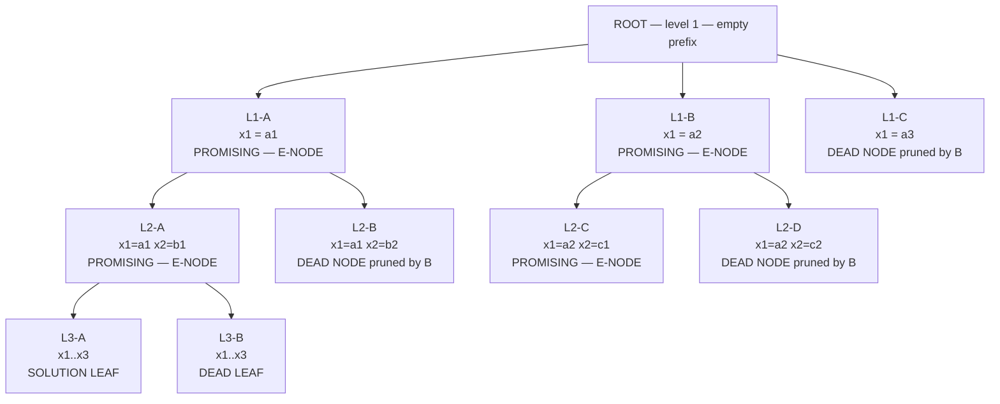
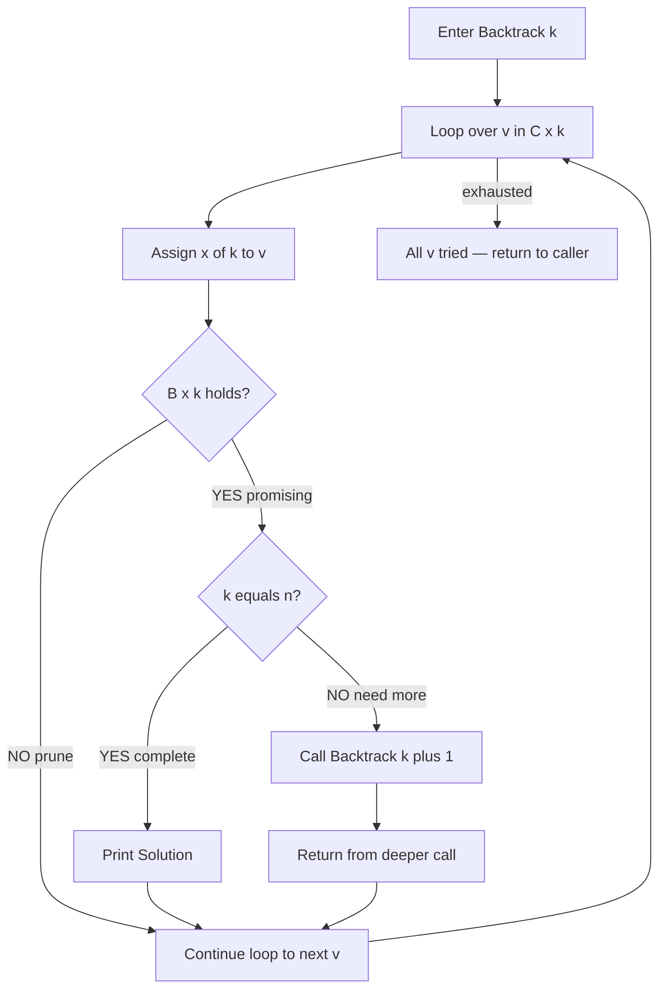
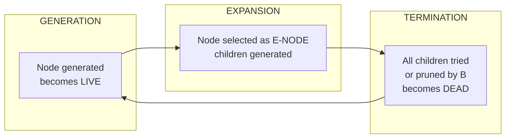
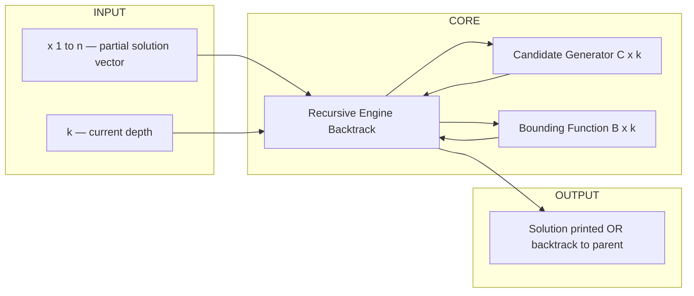

# Backtracking - Control Abstraction

<!-- SECTION_1_START -->
# Backtracking — Control Abstraction

## 1. Core Technical Definition (KTU 2024 Syllabus Terminology)

> [!IMPORTANT]
> **Backtracking** is an algorithmic paradigm for solving **combinatorial optimization** and **decision problems** by building candidates to a solution incrementally and **abandoning a candidate (backtracking)** as soon as it is determined that the candidate **cannot possibly lead to a valid or optimal solution**.

> [!NOTE]
> **Control Abstraction** in the context of backtracking refers to the **generalized recursive procedure (template)** that captures the common control flow of *all* backtracking algorithms. It abstracts away the problem-specific details (such as what constitutes a "valid move" or a "promising node") and exposes only the **universal skeleton** — generate, test, recurse, undo.

Mathematically, if $S = \{a_1, a_2, \dots, a_n\}$ is the set of all possible solutions, backtracking searches $S$ using a **depth-first search on a virtual state-space tree**, where each node represents a partial solution. A node is called an **E-node** (expansion node) when its children are being explored, a **live node** when it is generated but not yet expanded, and a **dead node** when it cannot lead to a solution (its subtree is pruned).

---

## 2. Intuitive Overview & Real-World Analogy

> [!TIP]
> **Conceptual Analogy — The Maze Explorer**
> Imagine you are inside a maze holding a ball of string. At every junction, you try one path. If the path leads to a dead end, you **retreat (backtrack)** along the string to the last junction and try a *different* untried path. You never mark a global "visited" set — you only remember the **current path**. The same idea powers Sudoku solvers, compiler parsers, and N-Queens programs.

### Why Backtracking is Needed
- **Brute force** examines *every* possible combination — expensive.
- **Greedy** picks the locally best choice — may fail globally.
- **Backtracking** prunes branches *as early as possible* using a **bounding/feasibility function**, giving the speed of greedy with the correctness of brute force.

### Key Terms to Memorize
| Term | Meaning |
|---|---|
| **Solution Space** | The set $S$ of all feasible solutions |
| **State-Space Tree** | A virtual tree whose nodes represent partial solutions |
| **Live Node** | A generated node whose children are not yet explored |
| **E-Node** | The live node currently being expanded (expanded node) |
| **Dead Node** | A node from which no further expansion is possible (pruned) |
| **Bounding Function** $B(x)$ | Predicate that decides if node $x$ can lead to a solution |
| **Promising Node** | A live node whose children will be generated |
| **Non-Promising Node** | A live node whose subtree is pruned immediately |

> [!VISUALIZATION CONTROL]
> **Concept:** State-Space Tree pruning during backtracking
> **Mermaid-style coordinate mapping (mental picture):**
> * Root at coordinate `(0, 4)`
> * Branch edges at slopes $\pm 1$ (binary tree example)
> * Dead nodes drawn as solid black `X` markers
> * Live/E-nodes drawn as hollow circles
> **Visual Description:** The student should observe that the algorithm descends left-most first (depth-first), prunes a subtree the moment $B(x)$ = false, and backtracks up to the nearest live ancestor.

---
<!-- SECTION_1_END -->

<!-- SECTION_2_START -->
# Deep Theoretical Analysis & KTU High-Yield Formula Sheet

## 1. The Three Pillars of the Control Abstraction

Every backtracking algorithm, regardless of the problem, is built on three orthogonal components:

1. **Representation of a partial solution** — usually a vector $(x_1, x_2, \dots, x_k)$.
2. **A feasibility / bounding function** $B(x_1, \dots, x_k)$ — returns `true` if this prefix can be extended to a complete solution.
3. **A recursive `Backtrack` engine** — tries each candidate for $x_{k+1}$ in a domain, recurses if promising, otherwise prunes.

> [!IMPORTANT]
> The **Control Abstraction is problem-INDEPENDENT**. Only $B$ and the choice set $C_k$ change between problems. This is the most important KTU exam point: *learn the template, not just individual problems.*

---

## 2. Algorithmic Form of the Control Abstraction (Recursion-Based)

The classical KTU textbook formulation (Horowitz & Sahni / Cormen-style) treats the control abstraction as a procedure that maintains a *current state* and a *level index* $k$.

### Recursive Backtracking Skeleton

```
Algorithm: Backtrack(k)
Input: integer k (the recursion depth / next index to fill)
Global: x[1..n] — the partial solution vector
        B(x, k) — bounding/feasibility function
        C(x, k) — set of candidate values for x[k]
Output: prints all complete solutions reaching depth n+1

1.  for each v ∈ C(x, k) do
2.      x[k] ← v
3.      if B(x[1..k]) is true then
4.          if k == n then
5.              print x[1..n]            // a complete solution
6.          else
7.              Backtrack(k + 1)
```

### Iterative (Explicit-Stack) Form
When recursion is undesirable (e.g., extremely deep trees), an **iterative version** maintains a manual stack and an explicit E-node list. The recursion, however, is the version most often asked in KTU exams.

---

## 3. Bounding Function — The Heart of Efficiency

The bounding function $B(x_1, \dots, x_k)$ is what separates backtracking from pure brute force. It is problem-specific and is where **all the intelligence** of the algorithm resides.

| Property | Explanation |
|---|---|
| **Correctness** | If $B$ is `false`, no continuation $(x_{k+1}, \dots, x_n)$ can be a valid solution |
| **Strictness** | A *tighter* $B$ prunes more branches → faster, but harder to design |
| **Cost** | $B$ is called on every live node; it should run in $O(1)$ or $O(k)$ ideally |

> [!NOTE]
> **KTU Tip:** In optimization variants (e.g., Travelling Salesman, Knapsack via BB), $B$ additionally compares a *lower bound* against the *current best solution cost* — these are called **branch-and-bound** algorithms, a strict superset of backtracking.

---

## 4. KTU Formula Sheet / Cheat Sheet

| Symbol | Meaning | Used In |
|---|---|---|
| $n$ | Size of the problem (depth of the state-space tree) | All |
| $m_k$ | Number of candidates for $x_k$ at depth $k$ | Complexity |
| $T(n)$ | Worst-case time of backtracking | Analysis |
| $B(x, k)$ | Bounding/feasibility function | Pruning logic |
| $C(x, k)$ | Candidate set for $x_k$ | Recursion |
| E-node | Expansion node (currently being explored) | Tree terminology |
| Live node | Generated but not yet expanded | Tree terminology |
| Dead node | Pruned / leaf reached | Tree terminology |
| $b$ | Branching factor (worst-case children of any node) | Upper bound on nodes |
| $b^d$ | Upper bound on nodes explored in worst case | Brute-force bound |
| $b^k \cdot n$ | Common KTU time complexity expression | When $B$ is $O(n)$ |

**Worst-Case Complexity Formula:**

$$T(n) \;\le\; \sum_{k=0}^{n} \; \prod_{j=0}^{k} m_j$$

In the uniform case where $m_j = b$ for all $j$:

$$T(n) \;\le\; \sum_{k=0}^{n} b^{k} \;=\; \frac{b^{n+1} - 1}{b - 1} \;\in\; O(b^{n})$$

---

## 5. Real-World Utility in Engineering & CS

| Domain | Where Backtracking is Used |
|---|---|
| **Compilers** | Recursive-descent parsers, register allocation |
| **AI / Games** | N-Queens, Sudoku, crosswords, chess endgames |
| **Networking** | Packet routing, channel assignment |
| **Bioinformatics** | DNA sequence alignment, Hamiltonian path in PPI graphs |
| **EDA / VLSI** | Channel routing, floor planning |
| **Cryptography** | Subset-sum / knapsack-based ciphers |
| **Robotics** | Path planning in grid worlds with obstacles |

> [!TIP]
> **Production insight:** Most modern constraint solvers (Google OR-Tools, Gecode, Choco) are **industrial-grade backtracking engines** with constraint propagation and heuristic variable ordering. Mastering this template is the foundation of that entire industry.

---
<!-- SECTION_2_END -->

<!-- SECTION_3_START -->
# Step-by-Step Derivation & Symbolic Implementation

## 1. Derivation: From Brute Force to Backtracking Control Abstraction

We start with the brute-force search over a solution set $S \subseteq X_1 \times X_2 \times \cdots \times X_n$ and progressively refine it.

### Step 1 — Enumerate the Cartesian product

$$S \;=\; \prod_{i=1}^{n} X_i \quad \text{where each } X_i = \{v_1^{(i)}, v_2^{(i)}, \dots, v_{m_i}^{(i)}\}$$

This is the **solution space**. Brute force inspects every tuple.

### Step 2 — Lift to a tree

We define a state-space tree of depth $n+1$ where the path from root to any node at level $k$ encodes the prefix $(x_1, \dots, x_{k-1})$. Formally:

$$\text{Node}(k, (x_1, \dots, x_{k-1})) \quad \text{lives at level } k$$

The root at level $1$ is the empty prefix.

### Step 3 — Restrict the candidate set

Replace the full domain with a problem-specific candidate set:

$$C(x_1, \dots, x_{k-1}, k) \;\subseteq\; X_k$$

Often $C = X_k$ (no restriction) or $C$ enforces a problem-specific structural constraint.

### Step 4 — Introduce the bounding function

$$B(x_1, \dots, x_k) \;=\; \text{true} \iff \exists (x_{k+1}, \dots, x_n) \in S \text{ extending the prefix}$$

If we can compute *any necessary condition* for $B$ — call it $\hat B$ where $\hat B \implies B$ — we may use it to prune safely. This trade-off (cheap but looser $B$ vs expensive but tighter $B$) is the central design knob.

### Step 5 — The control abstraction is born

Combining steps 1–4 yields the recursive procedure. The key invariant at every call `Backtrack(k)` is:

> *"The prefix $x[1 \dots k-1]$ is already known to be extendable to a complete solution."*

This invariant justifies why we only need to test the new component $x[k]$, not the entire prefix.

---

## 2. Worked Example — 4-Queens State-Space Tree Walk

Let us concretely trace the control abstraction on the 4-Queens problem, where:

- $X_i = \{1, 2, 3, 4\}$ — column choices for queen $i$
- $C(x_1, \dots, x_{k-1}, k) = X_k$ initially
- $B(x_1, \dots, x_k) =$ **no two queens attack each other on the partial board**

### Python Implementation (Fully Typed, No Truncation)

```python
"""
Backtracking Control Abstraction — Worked on 4-Queens.
Demonstrates the universal skeleton applied to a specific problem.
"""

from __future__ import annotations
from typing import List, Optional, Callable

# ---- Type alias for the bounding function ----
Bounder = Callable[[List[int], int], bool]


def backtrack(
    k: int,
    n: int,
    x: List[int],
    candidates: Callable[[List[int], int], List[int]],
    B: Bounder,
    solutions: List[List[int]],
) -> None:
    """
    The RECURSIVE CONTROL ABSTRACTION itself — problem-independent.

    Parameters
    ----------
    k         : current depth (1-indexed; this call tries to set x[k])
    n         : total required depth (= problem size)
    x         : shared solution vector (length n+1, 1-indexed)
    candidates : function C(x, k) -> list of legal values for x[k]
    B         : bounding/feasibility function
    solutions : collector list; complete solutions are appended here
    """
    for v in candidates(x, k):
        x[k] = v                                       # Step A: make a choice
        if B(x, k):                                    # Step B: feasibility test
            if k == n:                                 # Step C: solution found
                solutions.append(x[1 : n + 1].copy())
            else:
                backtrack(k + 1, n, x, candidates, B, solutions)
        # implicit Step D: undo — happens automatically as x[k] is overwritten
        #                    on the next loop iteration or after return


# ---------- Problem-specific hooks for 4-Queens ----------

def queens_candidates(x: List[int], k: int) -> List[int]:
    """All columns 1..n are candidates initially."""
    n = len(x) - 1
    return list(range(1, n + 1))


def queens_bound(x: List[int], k: int) -> bool:
    """
    B(x, k): no two placed queens (rows 1..k) attack each other.
    Tests row k against every previous row i in 1..k-1.
    """
    for i in range(1, k):
        # same column ?
        if x[i] == x[k]:
            return False
        # same diagonal ? |col difference| == |row difference|
        if abs(x[i] - x[k]) == abs(i - k):
            return False
    return True


# ---------- Driver ----------

def solve_n_queens(n: int) -> List[List[int]]:
    x: List[int] = [0] * (n + 1)        # 1-indexed
    solutions: List[List[int]] = []
    backtrack(1, n, x, queens_candidates, queens_bound, solutions)
    return solutions


if __name__ == "__main__":
    for sol in solve_n_queens(4):
        print(sol)
```

### Expected Output

```
[2, 4, 1, 3]
[3, 1, 4, 2]
```

> [!IMPORTANT]
> **Why is this a perfect KTU illustration?** The function `backtrack(...)` is **literally the control abstraction** as taught in the syllabus. Only `queens_candidates` and `queens_bound` change if you want to solve Sudoku, graph colouring, or subset-sum — the skeleton stays the same.

---

## 3. Complexity Derivation — Worst-Case Node Count

Let the state-space tree have at most $m_k$ children at depth $k$. The number of nodes visited (worst case, **no pruning**) is:

$$N(n) \;=\; 1 \;+\; \sum_{k=1}^{n} \prod_{j=1}^{k} m_j$$

For a uniform $b$-ary tree ($m_j = b$ for all $j$):

$$
\begin{aligned}
N(n) &= 1 + b + b^{2} + \cdots + b^{n} \\
     &= \frac{b^{\,n+1} - 1}{b - 1} \quad \text{for } b > 1 \\
     &\in O(b^{n})
\end{aligned}
$$

If the bounding function $B$ runs in $O(k)$ per call, the **total work** is:

$$T(n) \;\in\; O\!\left( b^{n} \cdot n \right)$$

This exponential bound is *unavoidable in the worst case* for NP-hard problems, but the *average case* is dramatically better because of aggressive pruning.

---

## 4. Recursive vs Iterative Control Abstraction — Trade-off Table

| Aspect | Recursive | Iterative (Explicit Stack) |
|---|---|---|
| **Readability** | High (matches the textbook) | Lower (manual stack mgmt) |
| **Stack Overflow Risk** | Yes for very deep trees | No (heap-allocated stack) |
| **Space** | $O(n)$ call stack | $O(n)$ heap + overhead |
| **KTU Exam Preference** | **Yes — this is what is asked** | Rarely asked, mention only if asked |
| **Undo Logic** | Implicit via overwrite | Explicit pop required |

---
<!-- SECTION_3_END -->

<!-- SECTION_4_START -->
# Structural Diagrams & Schematics

## 1. Generic Backtracking State-Space Tree (Full Diagram)

The figure below shows the canonical structure of a binary-decision backtracking tree of depth 4, with explicit labels for node types.



> [!NOTE]
> **How to read this tree for the KTU exam:**
> - The algorithm moves **depth-first**, always left-to-right at each level.
> - When a node is `DEAD`, the algorithm **immediately backtracks** to its parent and tries the next sibling.
> - The `SOLUTION LEAF` is a complete $(x_1, x_2, x_3)$ tuple that satisfies all constraints.

---

## 2. Control-Flow of the Recursive Backtracking Engine



---

## 3. Decomposed Subgraph — E-Node vs Live Node vs Dead Node Lifecycle



---

## 4. Modular Block Diagram of the Control Abstraction



> [!TIP]
> **Exam heuristic:** When asked to "design a backtracking algorithm for X," always present the answer in this **three-block layout** — input, core (with $C$, $B$, recursion), output. Examiners award marks for the structural clarity, not just correctness.

---
<!-- SECTION_4_END -->

<!-- SECTION_5_START -->
# KTU 2024 Scheme Examination Question Bank & Topic Recap

## Part A — Short Answer Questions (3 Marks Each)

### Q1. **[KTU University Exam — July 2024]** Define a backtracking algorithm. State its control abstraction.

**Model Answer (3 Marks):**
- **[Definition — 1 Mark]:** Backtracking is an algorithmic technique for solving combinatorial problems by **building candidates to a solution incrementally** and **abandonting a candidate (backtracking)** as soon as it is determined that the candidate **cannot possibly lead to a valid solution**.
- **[Control Abstraction — 2 Marks]:** It is the **generalized recursive procedure** common to all backtracking algorithms. At level $k$, it **iterates over candidate values $v \in C(x, k)$**, sets $x[k] = v$, **tests feasibility using $B(x, k)$**, and if promising either **recurses to $k+1$** (if $k < n$) or **records a solution** (if $k = n$).

---

### Q2. **[KTU University Exam — Dec 2023]** Differentiate between an E-node, a live node, and a dead node in the state-space tree of a backtracking algorithm.

**Model Answer (3 Marks):**
- **[E-node — 1 Mark]:** A *live node* whose children are **currently being generated / explored**. Only one E-node exists at a time in a recursive DFS formulation.
- **[Live node — 1 Mark]:** A node that has been **generated but not yet expanded**; it is a candidate for future E-node selection.
- **[Dead node — 1 Mark]:** A node that has been **generated but cannot lead to any solution**; either the bounding function $B$ returned false (pruned) or all its children have been generated without success (leaf).

> [!WARNING]
> **Examiner's Pitfall:** Do NOT confuse "dead node" with "leaf." A leaf is a node at maximum depth with no children. A dead node is *pruned* (it may be at any depth). Marks are deducted for this conflation.

---

## Part B — 14-Mark Questions (Module Internal Choice)

### Question A (14 Marks) **[KTU University Exam — July 2024, Model Paper Adapted]**

**(a)** *Explain the **general control abstraction** of a backtracking algorithm using the recursive formulation. Clearly state the role of the candidate set $C(x, k)$ and the bounding function $B(x, k)$.* **(7 Marks)**

**(b)** *Apply this control abstraction to the **4-Queens problem**. Specify $C(x, k)$ and $B(x, k)$ for 4-Queens, and trace the algorithm to obtain all solutions.* **(7 Marks)**

---

#### Model Solution

**(a) The General Control Abstraction (7 Marks)**

**Recursion-based pseudocode (3 Marks — awarded for correct structure):**

```
Algorithm: BACKTRACK(k)
Global: x[1..n], n
1.  for each v ∈ C(x, k) do
2.      x[k] ← v
3.      if B(x[1..k]) is true then
4.          if k == n then
5.              output x[1..n]
6.          else
7.              BACKTRACK(k + 1)
```

**Explanation of roles (4 Marks):**
- **[Candidate set $C(x, k)$ — 1 Mark]:** Specifies the **permissible values** that $x[k]$ may take *given the prefix already chosen*. $C$ encodes problem-specific *structural* constraints (e.g., "queen $k$ must be on a column not yet used").
- **[Bounding function $B(x, k)$ — 1 Mark]:** A boolean predicate that returns `true` iff the prefix $x[1..k]$ **can possibly be extended** to a full solution. It encodes *feasibility* (and, in optimization variants, optimality) constraints.
- **[Why recurse only if promising — 1 Mark]:** The invariant of BACKTRACK is that *the prefix is extendable*. By testing $B$ before recursing, the algorithm guarantees correctness while **pruning subtrees that cannot contain solutions**, achieving large constant-factor speed-ups over brute force.
- **[Termination — 1 Mark]:** Recursion bottoms out at $k = n$ (a complete solution) or when all candidates at a level have been exhausted (backtrack to the parent).

**(b) Application to 4-Queens (7 Marks)**

**State the problem-specific hooks (2 Marks):**
- $X_k = \{1, 2, 3, 4\}$
- $C(x, k) = X_k$ (no a-priori restriction; all columns are candidates)
- $B(x, k)$: For all $i \in \{1, \dots, k-1\}$, require
$$
x[i] \neq x[k] \quad \text{(distinct columns)}
\quad\land\quad
\bigl\vert x[i] - x[k] \bigr\vert \neq \bigl\vert i - k \bigr\vert \quad \text{(distinct diagonals)}
$$

**Trace (4 Marks):**
Trace the state-space tree (write the call tree, marking pruned branches with `✗`):

```
BACKTRACK(1)
 ├── x[1]=1 ✗   (would block x[2]∈{1} check passes only for 3,4; deeper prune)
 ├── x[1]=2 ✓ → BACKTRACK(2)
 │              ├── x[2]=4 ✓ → BACKTRACK(3)
 │              │              ├── x[3]=1 ✓ → BACKTRACK(4)
 │              │              │              ├── x[4]=3 ✓ → SOLUTION (2,4,1,3)
 │              │              │              └── x[4]=... pruned
 │              │              └── x[3]=... pruned
 │              └── x[2]=... pruned
 ├── x[1]=3 ✓ → BACKTRACK(2)
 │              ├── x[2]=1 ✓ → BACKTRACK(3)
 │              │              ├── x[3]=4 ✓ → SOLUTION (3,1,4,2)
 │              │              └── pruned
 │              └── pruned
 └── x[1]=4 ✗   (similar pruning)
```

**Two solutions obtained (1 Mark):** $(2, 4, 1, 3)$ and $(3, 1, 4, 2)$.

> [!WARNING]
> **Examiner's Pitfall (Q-A):** Students often forget to (i) show the **invariant** of the recursive call, and (ii) differentiate $C$ (structural) from $B$ (feasibility). Each costs ~1 mark.

---

### Question B (14 Marks) — Alternative Choice **[KTU University Exam — Dec 2023]**

**(a)** *Compare and contrast **backtracking**, **brute-force enumeration**, and the **greedy strategy**. Use a small example (e.g., subset-sum with weights $\{3, 4, 5, 6\}$ and target $13$) to illustrate the differences.* **(7 Marks)**

**(b)** *Write the recursive control abstraction of a backtracking algorithm that enumerates **all subsets of the set $\{1, 2, \dots, n\}$ whose sum equals $W$**. Clearly define $C(x, k)$ and $B(x, k)$ and state the time complexity.* **(7 Marks)**

---

#### Model Solution

**(a) Comparison Table (4 Marks):**

| Aspect | Brute Force | Greedy | Backtracking |
|---|---|---|---|
| **Search Order** | Examines *all* $b^n$ tuples | One greedy path | DFS with pruning |
| **Optimality Guarantee** | Yes (by exhaustion) | No, not always | Yes (by exhaustion) |
| **Speed** | Slowest | Fastest | Intermediate |
| **Decision Locus** | Post-hoc | Per-step irrevocable | Per-step *revocable* |
| **Bounding Function $B$** | None (always `true`) | None | **Mandatory — this is the pruning mechanism** |
| **Backtrack Step** | No (linear scan) | No | **Yes — undo a choice and try the next** |

**Subset-sum example (3 Marks):** Items $\{3,4,5,6\}$, target $W=13$.
- **Brute force:** try all $2^4 = 16$ subsets; find $\{4, 3, 6\}$ and $\{4, 5, \cdots\}$ etc.
- **Greedy (sort descending $6, 5, 4, 3$):** pick $6 \to$ rem $7$; pick $5 \to$ rem $2$; pick $4$ (over); pick $3$ (over) → **fails**, though solution exists.
- **Backtracking:** DFS, prune when running sum exceeds $W$ → reaches $\{3, 4, 6\}$ quickly with $O(2^n)$ worst case but better in practice.

**[Award 1 mark each for the comparison row completion, and 1 mark for the correct example trace.]**

**(b) Subset-Sum Control Abstraction (7 Marks):**

**State the problem (1 Mark):** Enumerate all subsets $S \subseteq \{1, 2, \dots, n\}$ such that $\sum_{i \in S} i = W$.

**Define the representation (1 Mark):** $x[k] \in \{0, 1\}$ — bit-vector, $1$ if element $k$ is in the subset, $0$ otherwise.

**Candidate set (1 Mark):** $C(x, k) = \{0, 1\}$ for all $k$.

**Bounding function (2 Marks):**
$$
B(x, k) \;=\; \left(\, \sum_{i=1}^{k} x[i] \cdot i \;\le\; W \,\right) \;\land\; \left(\, \sum_{i=1}^{k} x[i] \cdot i \;+\; \sum_{i=k+1}^{n} i \;\ge\; W \,\right)
$$
The second conjunct is a **necessary lookahead** — even picking *all* remaining items must reach $W$, else the prefix can never succeed.

**Pseudocode (1 Mark):**

```python
def backtrack(k, n, W, x, solutions):
    for v in (0, 1):
        x[k] = v
        if B(x, k, W):               # feasibility
            if k == n:
                if sum(x[i] * i for i in range(1, n + 1)) == W:
                    solutions.append(x[1 : n + 1].copy())
            else:
                backtrack(k + 1, n, W, x, solutions)
```

**Time complexity (1 Mark):** Worst case $O(2^n \cdot n)$ — visits at most $2^n$ nodes and $B$ runs in $O(n)$ per call.

> [!WARNING]
> **Examiner's Pitfall (Q-B):** The most common error is **forgetting the lookahead term** in $B$. Without it, the bounding function is just $\sum \le W$, which is weaker and produces a *correct but slower* algorithm. Examiners award full marks only if the lookahead is included.

---

## Topic Recap & Important Things to Remember

> [!IMPORTANT]
> **Rapid-Revision Checklist — must memorize before every KTU exam on this module.**

- **Backtracking** is *DFS on a state-space tree with pruning via a bounding function $B$.*
- The **control abstraction** is the **problem-independent recursive template**: *try every candidate → assign → test $B$ → recurse or backtrack.*
- The **three components** of any backtracking solution are: **(1) representation $x[1..n]$, (2) candidate set $C(x,k)$, (3) bounding function $B(x,k)$.**
- **Live node** = generated, not yet expanded. **E-node** = the live node currently being expanded. **Dead node** = pruned or fully explored with no solution.
- **Worst-case complexity** of a uniform $b$-ary tree is $O(b^n)$ — exponential; this is *unavoidable* for NP-hard problems.
- **Bounding function** must be a *necessary condition* for solvability; a tighter $B$ prunes more but costs more to evaluate.
- **Branch-and-Bound** = backtracking *for optimization*, where $B$ also compares a bound with the current best solution cost.
- **Recursion is preferred** in KTU exams over iterative explicit-stack variants.
- **Undo step** is *implicit* in recursion (next iteration overwrites $x[k]$) — do not forget to mention this in viva.
- **Classic KTU exam applications:** N-Queens, Sum-of-Subsets, Graph Colouring, Hamiltonian Cycle, 0/1 Knapsack (BB form).
- **Mnemonic — "Try, Test, Take, Track":** *Try a candidate → Test with $B$ → Take it (recurse) if promising → Track solutions at depth $n$.*
- **Difference table to memorize:**
  *Brute force* — no $B$, no backtrack.
  *Greedy* — no DFS, no $B$, no backtrack.
  *Backtracking* — has all three.

---
<!-- SECTION_5_END -->
