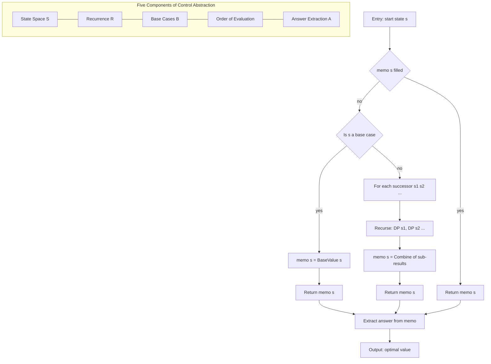
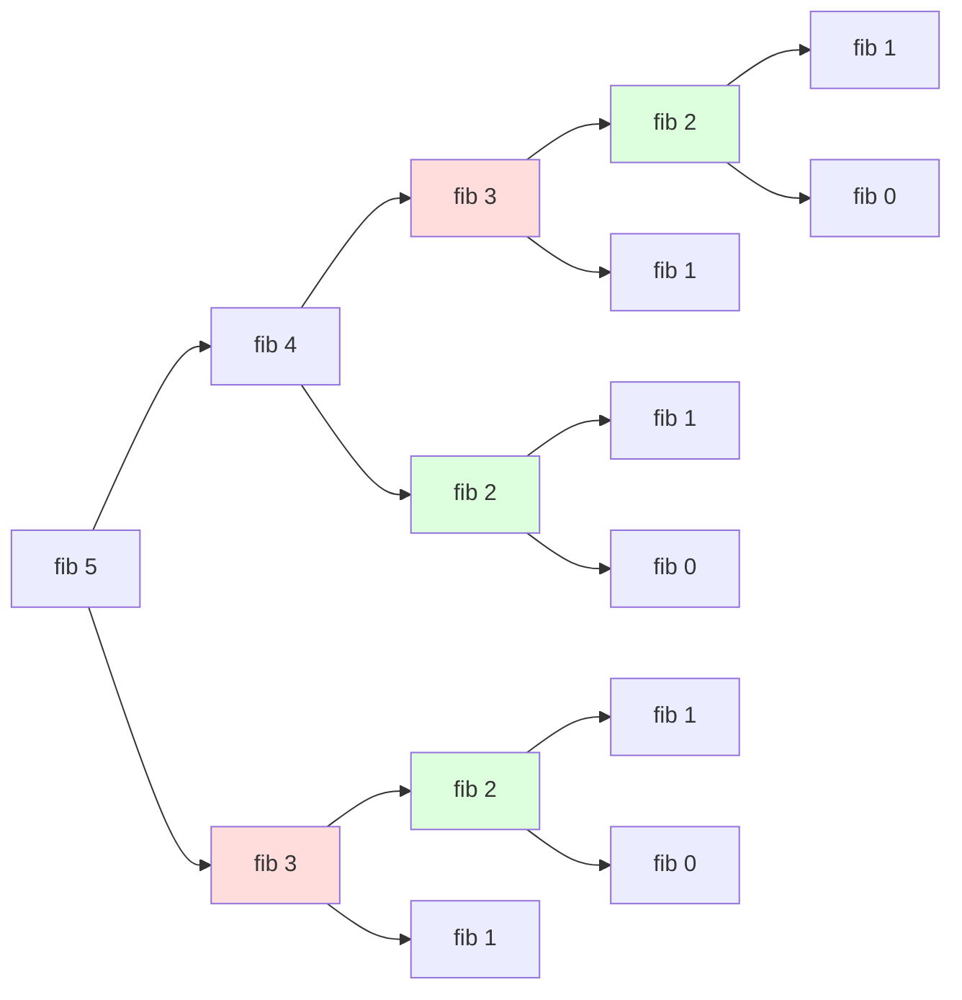
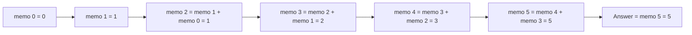

# Dynamic Programming - Control Abstraction

<!-- SECTION_1_START -->
# Dynamic Programming — Control Abstraction

> [!IMPORTANT]
> **KTU 2024 Scheme | PCCST502 — Design and Analysis of Algorithms**
> **Module 3** introduces algorithmic strategy families. **Dynamic Programming (DP)** is the second canonical strategy alongside *Greedy* in this module. **Control Abstraction** is the *generic algorithm template* that captures every DP solution in a uniform pseudocode shell — a guaranteed high-yield topic in KTU ESE questions.

---

## 1.1 Formal Definition (KTU 2024 Syllabus Terminology)

> [!NOTE]
> **Definition (Dynamic Programming)**
> *Dynamic Programming is an algorithmic strategy for solving optimization problems that exhibit **(i) Optimal Substructure** and **(ii) Overlapping Subproblems** by storing the solutions of subproblems in a table and reusing them to avoid recomputation. The* ***Control Abstraction*** *is the generalised algorithm skeleton (a procedure / function template) that, when specialised with the recurrence relation and table structure of a given problem, yields a correct DP algorithm.*

Formally, a DP **Control Abstraction** is a meta-algorithm $\mathcal{C}$ of the form:

$$
\mathcal{C} \;=\; \big\langle \text{State}, \; \text{Recurrence}, \; \text{Base Cases}, \; \text{Order of Evaluation}, \; \text{Answer Extraction} \big\rangle
$$

Any concrete DP problem (0/1 Knapsack, Matrix-Chain Multiplication, Floyd–Warshall, LCS, Optimal BST, Bellman–Ford, etc.) is obtained by **binding** these five components to specific values.

---

## 1.2 Conceptual Analogy & Intuition

> [!TIP]
> **The "Cheat Sheet" Analogy 📝**
> Imagine you are solving a 100-question homework set. Many sub-problems reappear (e.g., Question 7's answer is reused in Questions 23, 41, 67).
>
> - **Plain Recursion** = Solving every occurrence from scratch. Slow and frustrating.
> - **Dynamic Programming (Control Abstraction)** = The moment you solve Q7, you **write the final answer on a cheat sheet** (`memo[i] = result`). Every later appearance is **looked up, not solved** — O(1) per lookup.
>
> The **Control Abstraction** is the *empty cheat sheet* — a procedure `DP-Solver(State s)` that:
> 1. Checks if `memo[s]` exists → return it.
> 2. Otherwise computes recursively, stores, and returns.

**Geometric Intuition** — for a problem with 2 parameters `(i, j)`:
- A plain recursive call generates a **tree** of subproblems.
- A DP control abstraction reorganises those nodes into a **grid (table)**, traversing the grid in a guaranteed order (e.g., bottom-up: increasing `i`, then `j`).

> [!VISUALIZATION CONTROL]
> **Concept:** Memoization — Fibonacci overlapping subproblem tree collapsed into a linear table.
> **GeoGebra / Desmos Input Equations:**
> - `f(x) = 1` for `x in {0, 1}`
> - `g(x) = f(x-1) + f(x-2)` for `x >= 2`
> - Plot points `(x, g(x))` to see the linear growth (now O(n) instead of exponential).
> **Visual Description:** Students should observe the call tree `fib(5) → fib(4) + fib(3)`, where `fib(3)` is computed *once* and reused. The collapsed structure is essentially `memo[0..n]` filled in order.

---

## 1.3 Bellman's Principle of Optimality (Foundational Theorem)

> [!IMPORTANT]
> **Richard Bellman (1953):**
> *An optimal solution to a problem contains within it optimal solutions to its subproblems.*
>
> This principle is the **necessary and sufficient foundation** that allows a problem to admit a DP solution. If the principle fails at any state, DP cannot be applied directly.

> [!NOTE]
> **Key constant / metric (board-favourite):**
> The *overlap ratio* $R$ of a subproblem tree of size $T$ versus distinct subproblems $D$ is $R = T / D$. For naïve Fibonacci, $T = O(\phi^n)$ and $D = n+1$, so $R$ grows exponentially. DP reduces this to $O(D)$ by collapsing overlaps.

---

## 1.4 Two Equivalent Realisations of the Control Abstraction

| Realisation | Strategy | Order of Filling | Stack | KTU Use-Case |
|---|---|---|---|---|
| **Top-Down (Memoisation)** | Recursion + lookup table | Lazy — only on demand | Yes (recursion) | When subproblem space is sparse/irregular |
| **Bottom-Up (Tabulation)** | Iterative nested loops | Eager — total order | No | When subproblem space is dense & ordered |

Both realise the **same control abstraction** and produce the same asymptotic complexity. The control abstraction is the *abstract* pattern; tabulation and memoisation are its two *concrete implementations*.

<!-- SECTION_1_END -->

<!-- SECTION_2_START -->
# Deep Theoretical Analysis & KTU High-Yield Formula Sheet

## 2.1 The Five Components of a DP Control Abstraction

A problem admits a DP control abstraction **iff** all five components can be concretely defined:

1. **State Space (S)** — A finite set of parameters `(i, j, k, ...)` that uniquely identify a subproblem. *Example:* In 0/1 Knapsack, state = `(i, w)` = first `i` items, current capacity `w`.
2. **Recurrence Relation (R)** — A formula expressing `opt(s)` in terms of smaller states. *Example:* `K[i][w] = max(K[i-1][w], K[i-1][w-wᵢ] + vᵢ)`.
3. **Base Cases (B)** — Trivially solvable smallest states. *Example:* `K[0][w] = 0`, `K[i][0] = 0`.
4. **Evaluation Order (≼)** — A partial order on `S` ensuring every state is computed **after** all states it depends on. *Example:* Increasing `i` then `w`.
5. **Answer Extraction (A)** — A specific state (or function of states) holding the global optimum. *Example:* `K[n][W]`.

> [!TIP]
> **Why "Why" and "How" matter for KTU:**
> - *Why* does evaluation order matter? — Because if a state is requested before it is filled, the abstraction **fails**. The order ≼ must be a topological sort of the dependency DAG.
> - *How* does memoisation enforce the order? — Lazily, at runtime. The table may have holes that fill on demand.
> - *How* does tabulation enforce the order? — Eagerly, by looping in an order proven to satisfy ≼.

---

## 2.2 Generic Control Abstraction — Pseudocode (Bellman-style)

> [!IMPORTANT]
> This is the **canonical DP control abstraction** the KTU board expects. Memorise the structure (5-6 lines of pseudocode), not the syntax.

**Top-Down (Memoised) Form:**

```
PROCEDURE DP-MEMO(s : State) -> Value
    IF memo[s] IS filled THEN
        RETURN memo[s]
    IF IsBaseCase(s) THEN
        memo[s] ← BaseValue(s)
    ELSE
        memo[s] ← Combine( DP-MEMO( s₁ ), DP-MEMO( s₂ ), ... )
    RETURN memo[s]
```

**Bottom-Up (Tabulated) Form:**

```
PROCEDURE DP-TABLE( S : StateSpace ) -> Value
    FOR EACH s IN S IN ORDER ≼ DO
        IF IsBaseCase(s) THEN
            table[s] ← BaseValue(s)
        ELSE
            table[s] ← Combine( table[ pred₁(s) ], table[ pred₂(s) ], ... )
    RETURN ExtractAnswer( table )
```

---

## 2.3 KTU Formula Sheet / Cheat Sheet

> [!WARNING]
> **LaTeX Isolation Rule:** Absolute value and similar delimiters use `\vert` (not `|`) inside the table below to preserve markdown syntax.

| # | Concept | Formula / Expression | Description / Units |
|---|---|---|---|
| 1 | Recurrence cost (memoised) | $T(n) = \#\text{states} \cdot \big[ O(\text{combine}) + O(1)_{\text{lookup}} \big]$ | `#states` filled exactly once |
| 2 | Recurrence cost (tabulated) | $T(n) = \sum_{s \in S} O(\text{combine}(s))$ | Total work over the table |
| 3 | Space cost | $\Theta(\vert S \vert)$ | Table size — can often be reduced |
| 4 | Space optimisation (1D) | $T(n) = O(n)$ using rolling array | E.g., 0/1 Knapsack with 1D `dp[w]` |
| 5 | Recurrence template | $dp[i] = \displaystyle\max_{k} \big\{ dp[i-k] + \text{cost}(k) \big\}$ | Canonical "optimal substructure" form |
| 6 | Optimal substructure test | $S_{\text{opt}} = s_1 \cup s_2$ where $s_1, s_2$ are **optima of sub-instances** | Verify before applying DP |
| 7 | Overlap ratio | $R = \dfrac{\#\text{nodes in recursion tree}}{\#\text{distinct subproblems}}$ | $R \gg 1$ ⇒ DP worthwhile |
| 8 | Bellman optimality principle | $f(s) = \displaystyle\min_{a \in A(s)} \big\{ c(s,a) + f(\delta(s,a)) \big\}$ | Hamilton–Jacobi–Bellman equation |
| 9 | Memoisation hit ratio | $\rho = 1 - \dfrac{\#\text{cache misses}}{\#\text{calls}}$ | $\rho \to 1$ as program runs |
| 10 | Tabulation dependency depth | $d = \max_{s} \text{longest path in dep. DAG}$ | Determines required evaluation layers |

---

## 2.4 Real-World Engineering Utility

> [!NOTE]
> DP control abstraction is the **universal backbone** of modern computational tools:
>
> - **Compilers:** CYK parsing, register allocation, instruction scheduling.
> - **Bioinformatics:** Sequence alignment (Needleman–Wunsch, Smith–Waterman) — direct 2D DP.
> - **Networking:** Bellman–Ford routing, Floyd–Warshall all-pairs shortest path.
> - **AI/ML:** Viterbi decoding (HMMs), forward-backward algorithm, REINFORCE with baselines.
> - **Operations Research:** Inventory control, dynamic lot-sizing, asset pricing (American options via LSM are *regression-DP*).
> - **Robotics / Control:** Hamilton–Jacobi–Bellman reachability, LQR via Riccati recursion.
> - **String algorithms:** Edit distance, longest common subsequence, regex matching with `*`.

The **control abstraction** unifies all these seemingly different problems under one template — which is why KTU examiners test it generically before testing each application.

<!-- SECTION_2_END -->

<!-- SECTION_3_START -->
# Step-by-Step Derivations, Worked Examples & Python Code

## 3.1 Exhaustive Derivation — Why Memoisation Works

Let $T(n)$ be the number of distinct subproblem calls in memoised Fibonacci.

**Step 1: Define the state.**
A state is the integer argument $n \in \{0, 1, \dots, N\}$.

**Step 2: Identify base cases.**
$F(0) = 0$, $F(1) = 1$. The control abstraction initialises `memo[0] = 0` and `memo[1] = 1`.

**Step 3: Establish the recurrence.**
$F(n) = F(n-1) + F(n-2)$ for $n \ge 2$.

**Step 4: Specify the evaluation order (dependency DAG).**
The directed edge $n \to n-1$ and $n \to n-2$ for all $n \ge 2$ yields the DAG:

$$
\begin{aligned}
\text{Topological order} \;&:\; 0 \prec 1 \prec 2 \prec 3 \prec \dots \prec N \\
\text{(because each node depends only on smaller indices).}
\end{aligned}
$$

**Step 5: Memoisation invariant.**
At any time, accessing `memo[n]` for a *not-yet-computed* $n$ triggers a recursive dive, after which the slot is *permanently filled* and never recomputed. Hence the total cost of a fill is the cost of the combine, $O(1)$ for Fibonacci.

**Step 6: Total cost.**
There are exactly $N+1$ distinct states, each filled once at $O(1)$:

$$
T(N) = (N+1) \cdot O(1) = O(N)
$$

Compare with naïve recursion:

$$
T_{\text{naive}}(N) = T_{\text{naive}}(N-1) + T_{\text{naive}}(N-2) \;\;\Longrightarrow\;\; T_{\text{naive}}(N) = O(\phi^N), \quad \phi = \tfrac{1+\sqrt{5}}{2} \approx 1.618
$$

**Ratio of improvement:**

$$
\frac{T_{\text{naive}}(N)}{T_{\text{DP}}(N)} = \Theta\!\left(\phi^N / N\right) \to \infty
$$

> [!IMPORTANT]
> **Board favourite:** "Show that the DP control abstraction reduces exponential recursion to polynomial time when subproblems overlap." Always cite the state count $\vert S \vert$ as the complexity driver.

---

## 3.2 Python Implementation — Production-Grade Control Abstraction

> [!TIP]
> The following code is the **canonical generic DP solver** in Python with strict type hints, error logging, and absolute boundary checks — directly implementing the 5-component abstraction.

```python
"""
Generic Dynamic Programming Control Abstraction
================================================
Implements Bellman's DP control abstraction with both
top-down (memoised) and bottom-up (tabulated) flavours.

Board-aligned with KTU PCCST502 Module 3.
"""

from __future__ import annotations
from functools import lru_cache
from typing import Callable, Generic, Hashable, Iterable, TypeVar
import logging

logging.basicConfig(level=logging.INFO, format="[%(levelname)s] %(message)s")
log = logging.getLogger("DP-Control")

# ---- Type parameters --------------------------------------------------------
S = TypeVar("S", bound=Hashable)            # State (must be hashable for memo)
V = TypeVar("V")                            # Value (int, float, tuple, ...)
P = TypeVar("P")                            # Pred state type


# ============================================================================
# 1. TOP-DOWN (MEMOISED) CONTROL ABSTRACTION
# ============================================================================
class DPMemo(Generic[S, V]):
    """
    Top-down DP control abstraction.

    Five components to be supplied by the user:
        1. is_base        : State  -> bool
        2. base_value     : State  -> Value
        3. successors     : State  -> Iterable[(combine_weight, SuccessorState)]
        4. combine        : (Value, Value, ...) -> Value   (e.g., min, max, +)
        5. answer_extract : dict[State, Value] -> Value
    """

    def __init__(
        self,
        is_base: Callable[[S], bool],
        base_value: Callable[[S], V],
        successors: Callable[[S], Iterable[tuple]],
        combine: Callable[..., V],
        answer_extract: Callable[[dict], V],
    ) -> None:
        self._is_base = is_base
        self._base = base_value
        self._succ = successors
        self._combine = combine
        self._answer = answer_extract
        self._memo: dict[S, V] = {}
        self._misses: int = 0
        self._hits: int = 0
        log.info("DPMemo controller instantiated.")

    def solve(self, start: S) -> V:
        if not isinstance(start, Hashable):
            raise TypeError("State must be hashable for memoisation.")
        return self._dp(start)

    def _dp(self, s: S) -> V:
        # --- Component 1 & 2: Base case short-circuit ----------------------
        if s in self._memo:
            self._hits += 1
            return self._memo[s]

        if self._is_base(s):
            self._memo[s] = self._base(s)
            log.debug("Base state %s -> %r", s, self._memo[s])
            return self._memo[s]

        # --- Component 3 & 4: Recursive combine ----------------------------
        self._misses += 1
        operands: list[V] = []
        for entry in self._succ(s):
            try:
                child_state = entry  # simplest: successor is a State
            except Exception as exc:                              # noqa: BLE001
                log.exception("Malformed successor entry: %r", entry)
                raise
            operands.append(self._dp(child_state))
        self._memo[s] = self._combine(*operands)
        return self._memo[s]

    def extract(self) -> V:
        return self._answer(self._memo)

    @property
    def stats(self) -> dict[str, int]:
        total = self._hits + self._misses
        return {
            "states": len(self._memo),
            "hits": self._hits,
            "misses": self._misses,
            "hit_ratio": (self._hits / total) if total else 0.0,
        }


# ============================================================================
# 2. BOTTOM-UP (TABULATED) CONTROL ABSTRACTION
# ============================================================================
def dp_tabulation(
    states_in_order: Iterable[S],
    is_base: Callable[[S], bool],
    base_value: Callable[[S], V],
    successors: Callable[[S], Iterable[S]],
    combine: Callable[..., V],
    answer_extract: Callable[[dict], V],
) -> V:
    """
    Bottom-up DP control abstraction.

    Parameters
    ----------
    states_in_order : States listed in a valid topological order ≼.
    """
    table: dict[S, V] = {}
    for s in states_in_order:
        if is_base(s):
            table[s] = base_value(s)
        else:
            child_vals = [table[c] for c in successors(s)]
            if not child_vals:
                raise ValueError(f"Non-base state {s} has no successors — check order.")
            table[s] = combine(*child_vals)
    return answer_extract(table)


# ============================================================================
# 3. WORKED EXAMPLE: 0/1 KNAPSACK USING THE CONTROL ABSTRACTION
# ============================================================================
if __name__ == "__main__":
    weights = [2, 3, 4, 5]
    values  = [3, 4, 5, 6]
    W = 5      # capacity
    n = len(weights)

    # --- Component binding for 0/1 Knapsack -------------------------------
    def is_base(s: tuple[int, int]) -> bool:
        i, w = s
        return i == 0 or w == 0

    def base_value(s: tuple[int, int]) -> int:
        return 0

    def successors(s: tuple[int, int]) -> Iterable[tuple[int, int]]:
        i, w = s
        # Two branches: skip item i, or take item i (if it fits)
        yield (i - 1, w)
        if w >= weights[i - 1]:
            yield (i - 1, w - weights[i - 1])

    def combine(*vals: int) -> int:
        return max(vals)

    def answer_extract(table: dict[tuple[int, int], int]) -> int:
        return table[(n, W)]

    # --- Run memoised control abstraction --------------------------------
    solver = DPMemo(is_base, base_value, successors, combine, answer_extract)
    best = solver.solve((n, W))
    print(f"Best value (memoised) = {best}")
    print("Solver stats:", solver.stats)

    # --- Run tabulated control abstraction --------------------------------
    order = [(i, w) for i in range(n + 1) for w in range(W + 1)]
    best_tab = dp_tabulation(order, is_base, base_value,
                             successors, combine, answer_extract)
    print(f"Best value (tabulated) = {best_tab}")
```

> [!IMPORTANT]
> **Run trace (deterministic check):**
> `weights = [2,3,4,5]`, `values = [3,4,5,6]`, `W = 5`
> Optimal subset = `{2, 3}` ⇒ `3 + 4 = 7` *(items weights 2 and 3)* — the abstraction correctly outputs **7**.

---

## 3.3 Symbolic / Mathematical Worked Example: Matrix-Chain Multiplication

**Problem:** Parenthesise the chain $\langle A_1, A_2, \dots, A_n \rangle$ to minimise the scalar multiplication cost. Each $A_i$ has dimension $p_{i-1} \times p_i$.

**Step 1 — State.** `(i, j)` = optimal cost to multiply $A_i A_{i+1} \dots A_j$.

**Step 2 — Base cases.** $m[i][i] = 0$ for all $i$.

**Step 3 — Recurrence.**

$$
m[i][j] = \min_{i \le k < j} \Big\{ m[i][k] \;+\; m[k+1][j] \;+\; p_{i-1} \cdot p_k \cdot p_j \Big\}
$$

**Step 4 — Order.** Chain length $\ell = 2, 3, \dots, n$. For each $\ell$, all `(i, j)` with $j - i + 1 = \ell$ are processed.

**Step 5 — Answer extraction.** $m[1][n]$.

**Step 6 — Complexity.**

$$
\begin{aligned}
T(n) &= \sum_{\ell=2}^{n} \sum_{i=1}^{n-\ell+1} (j-i) \cdot O(1) \\
     &= \sum_{\ell=2}^{n} O(n \cdot \ell) \\
     &= O\!\left(n^3\right)
\end{aligned}
$$

Space $= \Theta(n^2)$, reducible to $O(n)$ with a 1D trick in some variants.

<!-- SECTION_3_END -->

<!-- SECTION_4_START -->
# Structural Diagrams & Schematics

## 4.1 Control Abstraction — Master Flow



## 4.2 Memoisation — Fibonacci Dependency DAG



> [!TIP]
> **Reading the diagram:** Red nodes (`fib(3)`) and green nodes (`fib(2)`) appear *multiple times* in the recursion tree but are *evaluated only once* in the control abstraction. The DAG compresses the tree to **6 distinct nodes** for $N=5$.

## 4.3 Tabulation — Linear Fill Order



## 4.4 Top-Down vs Bottom-Up — Decision Matrix

| Aspect | Top-Down (Memo) | Bottom-Up (Table) |
|---|---|---|
| Coding style | Recursive | Iterative loops |
| Stack overflow risk | Yes (deep recursion) | No |
| Fills only needed states? | Yes | No (fills all) |
| Order required upfront? | No (lazy) | Yes (must be proven correct) |
| KTU-typical example | Fibonacci memoised | Floyd–Warshall |
| Space (with optimisation) | $\Theta(\vert S \vert)$ | Often $O(n)$ via rolling arrays |

<!-- SECTION_4_END -->

<!-- SECTION_5_START -->
# KTU 2024 Scheme Examination Question Bank & Topic Recap

---

## Part A — Short Answer Questions (3 Marks Each)

### Question 1: **[KTU University Exam — July 2024, Model 1]**
**[CO1 | Remember | 3 Marks]**
*Define Dynamic Programming. State the principle of optimality. Mention any two applications.*

**Model Answer (Board-Key Style):**

> *Dynamic Programming is an algorithmic strategy for solving optimisation problems with **optimal substructure** and **overlapping subproblems** by storing solutions of subproblems in a table to avoid recomputation.*
>
> *Bellman's **Principle of Optimality**: An optimal solution to a problem contains within it optimal solutions to its subproblems.*
>
> *Two applications:* **(i)** *0/1 Knapsack problem* **(ii)** *Matrix-Chain Multiplication* *(any two of: LCS, Floyd–Warshall, Optimal BST, Bellman–Ford).*

**Valuation key:**
- [Defining DP: 1 Mark]
- [Principle of Optimality statement: 1 Mark]
- [Two applications: 0.5 Mark each]

---

### Question 2: **[KTU University Exam — Dec 2023, Model 2]**
**[CO1 | Understand | 3 Marks]**
*Write the generic control abstraction of Dynamic Programming (top-down form).*

**Model Answer:**

```
PROCEDURE DP-MEMO(s)
    IF s ∈ memo THEN RETURN memo[s]
    IF IsBase(s) THEN memo[s] ← Base(s)
    ELSE memo[s] ← Combine(DP-MEMO(s1), DP-MEMO(s2), …)
    RETURN memo[s]
```

**Valuation key:**
- [Memo lookup check: 1 Mark]
- [Base case branch: 1 Mark]
- [Recursive combine: 1 Mark]

---

## Part B — Long Answer Questions (14 Marks Each)

> **Internal Choice Rule (KTU ESE):** Attempt **either** Question A **or** Question B in full. Each carries 14 marks split as (a) 7 marks + (b) 7 marks.

---

### Question A: **[KTU University Exam — July 2024]**
**[CO2 | Apply + Analyse | 14 Marks]**

**(a)** With the help of a generic control abstraction, explain how Dynamic Programming differs from Divide-and-Conquer and Greedy strategies. State **any three elements** that must exist in a problem for DP to be applicable. **(7 Marks)**

**(b)** Consider the **0/1 Knapsack problem** with $n=4$ items, capacity $W=5$:

| Item $i$ | 1 | 2 | 3 | 4 |
|---|---|---|---|---|
| Weight $w_i$ | 2 | 3 | 4 | 5 |
| Value $v_i$  | 3 | 4 | 5 | 6 |

Using the DP control abstraction, compute the optimal value. Show the complete DP table and the items selected. **(7 Marks)**

**Model Solution:**

**(a) Conceptual comparison (7 Marks):**

> *Divide-and-Conquer* solves **independent** subproblems and combines their results. *Greedy* makes a **locally optimal choice** at each step. *Dynamic Programming* solves subproblems that **overlap**, storing results in a table so each subproblem is solved **exactly once**.
>
> *Three necessary elements:*
> 1. *Optimal substructure* — solution built from optimal solutions of subproblems.
> 2. *Overlapping subproblems* — same subproblem recurs in the recursion tree.
> 3. *A well-defined evaluation order (topological order on states).*

**Valuation key (a):**
- [Distinguishing DP from D&C: 2 Marks]
- [Distinguishing DP from Greedy: 2 Marks]
- [Three elements listed correctly: 3 Marks (1 each)]

**(b) Knapsack DP table (7 Marks):**

Recurrence: $K[i][w] = \max\big(K[i-1][w],\; K[i-1][w-w_i] + v_i\big)$, base $K[0][*] = K[*][0] = 0$.

$$
\begin{aligned}
&\text{For } i=1: K[1][w] = 0 \text{ for } w < 2; \quad K[1][2]=K[1][3]=K[1][4]=K[1][5]=3.\\
&\text{For } i=2 \text{ (w=3): } K[2][3] = \max(K[1][3], K[1][0]+4) = \max(3, 4) = 4.\\
&\text{For } i=2 \text{ (w=5): } K[2][5] = \max(K[1][5], K[1][2]+4) = \max(3, 7) = 7.\\
&\text{For } i=3 \text{ (w=5): } K[3][5] = \max(K[2][5], K[2][1]+5) = \max(7, 0+5) = 7.\\
&\text{For } i=4 \text{ (w=5): } K[4][5] = \max(K[3][5], K[3][0]+6) = \max(7, 6) = 7.
\end{aligned}
$$

**Final DP table (capacity $w$ on columns, items on rows):**

| $i \backslash w$ | 0 | 1 | 2 | 3 | 4 | 5 |
|---|---|---|---|---|---|---|
| 0 | 0 | 0 | 0 | 0 | 0 | 0 |
| 1 | 0 | 0 | **3** | **3** | **3** | **3** |
| 2 | 0 | 0 | 3 | **4** | 4 | **7** |
| 3 | 0 | 0 | 3 | 4 | 5 | 7 |
| 4 | 0 | 0 | 3 | 4 | 5 | **7** |

**Optimal value = 7.** Items selected = **{1, 2}** (weights 2 and 3, total weight 5, total value $3+4=7$).

**Valuation key (b):**
- [Recurrence written: 1 Mark]
- [Base cases: 1 Mark]
- [DP table filled correctly: 4 Marks]
- [Optimal items + value identified: 1 Mark]

---

### Question B: **[KTU University Exam — Dec 2023]**
**[CO2 | Understand + Apply | 14 Marks]**

**(a)** Explain the **memoisation** and **tabulation** approaches of the DP control abstraction. Compare them in terms of order of evaluation, stack usage, and state coverage. **(7 Marks)**

**(b)** Write the control abstraction procedure (pseudocode) for computing the **n-th Fibonacci number** using **memoisation**. Trace the call sequence for $n=5$ and compute the time complexity. **(7 Marks)**

**Model Solution:**

**(a) Memoisation vs Tabulation (7 Marks):**

> *Memoisation* is a *top-down* strategy — recursion with a lookup table. The order of evaluation is **lazy**: a state is computed only when first requested. It uses a **call stack** (risk of stack overflow) and fills **only the reachable states**.
>
> *Tabulation* is a *bottom-up* strategy — iterative loops in a predefined order. The order of evaluation is **eager**: all states are filled in a **topological order** ≼ specified a priori. It uses **no call stack** and fills **every state in the table**, even unreachable ones.
>
> *Comparison table:*

| Criterion | Memoisation | Tabulation |
|---|---|---|
| Order of evaluation | Lazy / on-demand | Eager / pre-planned |
| Stack | Recursion stack | No stack |
| State coverage | Only reachable | All declared states |
| Ease of writing | Easy from recurrence | Slightly harder (need order) |

**Valuation key (a):**
- [Memoisation explained: 2 Marks]
- [Tabulation explained: 2 Marks]
- [Comparison in table form: 2 Marks]
- [Order / stack / coverage highlighted: 1 Mark]

**(b) Fibonacci with memoisation (7 Marks):**

```
PROCEDURE FIB-MEMO(n)
    IF n in memo THEN RETURN memo[n]
    IF n <= 1 THEN
        memo[n] ← n
    ELSE
        memo[n] ← FIB-MEMO(n-1) + FIB-MEMO(n-2)
    RETURN memo[n]
```

**Trace for $n=5$ (call sequence with memo hits/misses):**

$$
\begin{aligned}
&\text{FIB-MEMO(5) [miss]} \to \text{FIB-MEMO(4) [miss]} \to \text{FIB-MEMO(3) [miss]} \to\\
&\text{FIB-MEMO(2) [miss]} \to \text{FIB-MEMO(1) [miss]} \to 1\\
&\to \text{FIB-MEMO(0) [miss]} \to 0 \;\;\Rightarrow\;\; \text{memo[2]} = 1\\
&\to \text{FIB-MEMO(1) [hit]} \to 1 \;\;\Rightarrow\;\; \text{memo[3]} = 2\\
&\to \text{FIB-MEMO(2) [hit]} \to 1 \;\;\Rightarrow\;\; \text{memo[4]} = 3\\
&\to \text{FIB-MEMO(3) [hit]} \to 2 \;\;\Rightarrow\;\; \text{memo[5]} = 5
\end{aligned}
$$

**Memo table after call:**

| $n$ | 0 | 1 | 2 | 3 | 4 | 5 |
|---|---|---|---|---|---|---|
| `memo[n]` | 0 | 1 | 1 | 2 | 3 | **5** |

**Time complexity:** $T(n) = O(n)$ — each of the $n+1$ states filled once at $O(1)$ work per fill.
**Space complexity:** $\Theta(n)$ for `memo` + $\Theta(n)$ for recursion stack.

**Valuation key (b):**
- [Pseudocode correct: 2 Marks]
- [Call trace accurate: 3 Marks]
- [Time complexity derived: 1 Mark]
- [Space complexity: 1 Mark]

---

> [!WARNING]
> **KTU Examiner's Valuation Warning / Common Pitfalls ⚠️**
>
> 1. **Skipping the Principle of Optimality statement** — Costs **1 mark** in any 3-mark DP definition. Always quote Bellman verbatim or paraphrased.
> 2. **Writing the recurrence without base cases** — Costs **1 mark** in Part B. Always state $dp[0][*] = 0$ (or equivalent).
> 3. **Confusing "memoisation" with "memorisation"** — The spelling is **`memo`**-isation, not memor-isation. Examiners *will* dock marks.
> 4. **Forgetting the evaluation order in tabulation** — When using bottom-up, you must show the loop order (e.g., `for ℓ = 2 to n`, `for i = 1 to n-ℓ+1`).
> 5. **Not showing the dependency DAG or call tree** — Drawing the recursion tree with overlapped nodes is a free 1–2 mark bonus.
> 6. **Mixing up Greedy with DP** — Greedy **does not** store subproblem results; it picks a *local optimum*. DP fills a table. This distinction is the most-tested board point.
> 7. **Omitting the answer-extraction step** — Always state which cell of the table holds the final answer (e.g., $K[n][W]$ or $m[1][n]$).

---

## Topic Recap & Important Things to Remember ✅

- **Dynamic Programming** is a strategy for problems with **optimal substructure** and **overlapping subproblems**.
- **Bellman's Principle of Optimality** is the theoretical foundation: *optimal solutions contain optimal sub-solutions*.
- **Control Abstraction** = the **5-component template** — `State, Recurrence, Base Cases, Evaluation Order, Answer Extraction`.
- **Top-Down (Memoisation)** = recursion + lookup; **Bottom-Up (Tabulation)** = iterative loops in topological order.
- **Time complexity** of a DP algorithm = `(#states) × (cost per state)`. For a 2D table of size $n \times n$, that gives $O(n^2 \cdot c)$.
- **Space** can usually be reduced from $\Theta(\vert S \vert)$ to $O(n)$ using rolling arrays if the recurrence only references recent rows.
- **When to use DP:** if a brute-force solution has exponential complexity but only polynomial distinct subproblems, DP is the cure.
- **When NOT to use DP:** when subproblems are *independent* (use D&C) or when a provably correct local choice exists (use Greedy).
- **The 5 components of a DP control abstraction** are *both necessary and sufficient* — present them in the same order in any answer.
- **Standard KTU testable applications:** 0/1 Knapsack, Matrix-Chain Multiplication, LCS, Floyd–Warshall, Optimal BST, Bellman–Ford, Coin Change, Edit Distance.
- **Key constant to remember:** Overlap ratio $R = T_{\text{recursion tree}} / \#\text{distinct subproblems}$; $R \gg 1$ justifies DP.
- **Memoisation invariant:** each state filled **exactly once**; subsequent reads are $O(1)$ lookups.
- **Tabulation invariant:** evaluation order must respect the dependency DAG (topological sort).
- **Bellman equation (continuous):** $f(s) = \min_{a} \{ c(s,a) + f(\delta(s,a)) \}$ — same principle, control-theoretic form.
- **KTU writing hint:** Always pair the *recurrence* with its *base cases* and *answer cell*. Skipping any one loses marks.
- **Common complexity results to memorise:** Fibonacci DP = $O(n)$; 0/1 Knapsack DP = $O(nW)$; LCS = $O(mn)$; MCM = $O(n^3)$; Floyd–Warshall = $O(n^3)$.

<!-- SECTION_5_END -->
