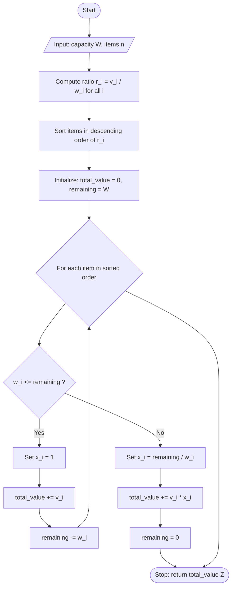
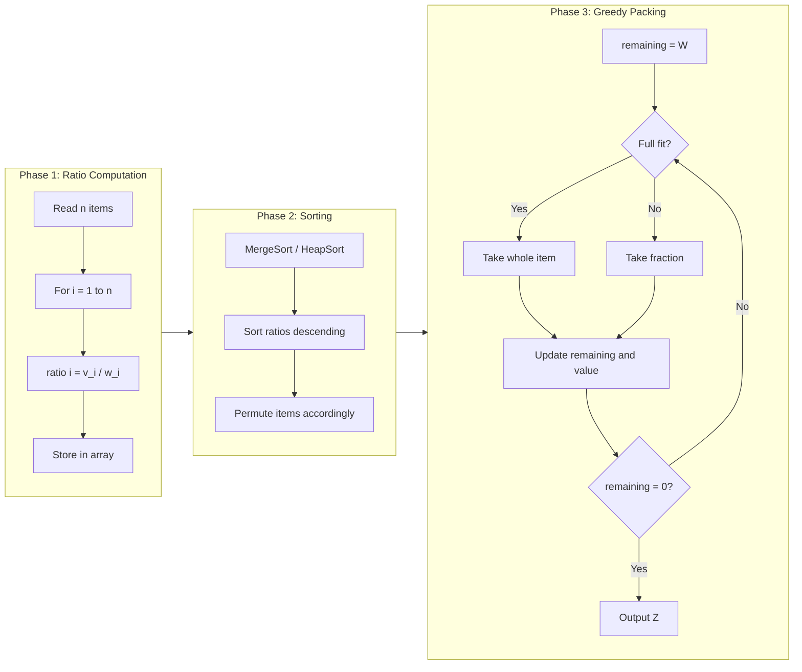

# Fractional Knapsack

<!-- SECTION_1_START -->
# 📘 MODULE 3 — GREEDY STRATEGY
## 🎯 Topic: **Fractional Knapsack Problem (FKP)**

> [!IMPORTANT]
> **KTU 2024 Scheme — PCCST502 | Design and Analysis of Algorithms**
> This topic is a **high-weightage, frequently repeated** question in KTU University Examinations. The Fractional Knapsack is the *canonical* example used by examiners to test a student's grasp of the **Greedy Choice Property** and **Optimal Substructure** — the two pillars of the Greedy algorithmic paradigm.

---

## 1.1 Formal Academic Definition

The **Fractional Knapsack Problem** is a combinatorial optimization problem belonging to the class of *resource allocation* problems solvable by the **Greedy Method**.

Given a knapsack (bag) of fixed carrying capacity $W$ and a set of $n$ items, where each item $i$ is characterized by:
- A **weight** $w_i > 0$
- A **value** (or profit) $v_i > 0$

The objective is to select a portion $x_i \in [0, 1]$ of each item such that:

$$\text{Maximize} \quad Z \;=\; \sum_{i=1}^{n} v_i \cdot x_i$$

$$\text{Subject to} \quad \sum_{i=1}^{n} w_i \cdot x_i \;\leq\; W \quad \text{and} \quad 0 \;\leq\; x_i \;\leq\; 1$$

Because $x_i$ is allowed to be a **real number between 0 and 1**, items may be taken in *fragments* (this is what distinguishes FKP from the discrete *0/1 Knapsack*).

The **Greedy strategy** is to sort all items in **non-increasing order of their value-to-weight ratio** $\frac{v_i}{w_i}$ and repeatedly pick the highest-ratio item first. When the next item can no longer fit entirely, take a fractional part of it to exactly fill the knapsack.

> [!NOTE]
> **Why is Greedy optimal for FKP but not 0/1 Knapsack?**
> In FKP, items are infinitely divisible, so the "bang for the buck" ratio $\frac{v_i}{w_i}$ behaves as a continuous monotonic function. A locally optimal pick (highest ratio) is provably globally optimal. In 0/1 Knapsack, divisibility is forbidden, breaking the greedy-optimality proof.

---

## 1.2 Real-World Analogy — *The Pirate's Treasure Chest* 🏴‍☠️

Imagine a pirate with a **leather pouch that can carry at most 50 kg**. On a beach lie three treasure sacks:
- Sack A: 10 kg of **gold dust** worth ₹6,000 → ratio = ₹600/kg
- Sack B: 20 kg of **silver coins** worth ₹100,000 → wait, the value/weight ratio determines priority!
  - Actually: B: 20 kg worth ₹100,000 → ratio = ₹5,000/kg
- Sack C: 30 kg of **emerald pebbles** worth ₹120,000 → ratio = ₹4,000/kg

**Intuition:** The greedy pirate first grabs the most *valuable per kilogram* sack (A), then the next (B), and finally stuffs the remaining 20 kg of the third sack (C) — taking *only a fraction* to perfectly fit the pouch.

> This is precisely the **Fractional Knapsack** in plain English — *pack the highest "value-density" first, and break items only when forced to.*

---

## 1.3 Visualization Hook

> [!VISUALIZATION CONTROL]
> **Concept:** Value-to-Weight Ratio vs. Cumulative Packing Visualization
> **GeoGebra / Desmos Input Equations:**
> * `f(x) = 600` (ratio of item A — gold)
> * `g(x) = 500` (ratio of item B — silver)
> * `h(x) = 400` (ratio of item C — emerald)
> * `W_remaining(t) = 50 - piecewise(t<10, 10, t<30, 30, 50)` (capacity curve)
>
> **Visual Description:** Three horizontal step lines stacked vertically show the descending density ratios. As the knapsack fills from left to right, you should observe that the *cumulative value* rises steepest where the topmost (highest-ratio) line is active — visually confirming why greedy packing is optimal.

<!-- SECTION_1_END -->

<!-- SECTION_2_START -->
# 🧠 Deep Theoretical Analysis & KTU Formula Sheet

## 2.1 The Two Pillars of Greedy Correctness

A Greedy algorithm is provably optimal for a problem **only if** the problem satisfies two mathematical properties. FKP satisfies both.

### ✅ Pillar 1 — **Greedy Choice Property**
> A globally optimal solution can be reached by making a locally optimal (greedy) choice at every step.

For FKP: Consider any optimal solution $S^*$. Let $i$ be the item with the **highest** $\frac{v_i}{w_i}$ ratio. If $S^*$ does *not* include a portion of $i$, we can swap out some other item $j$ with $\frac{v_j}{w_j} \le \frac{v_i}{w_i}$ to make room for $i$ — this swap **does not decrease** the total value. Repeating this swap argument builds an optimal solution that *is* greedy.

### ✅ Pillar 2 — **Optimal Substructure**
> An optimal solution to the whole problem contains within it optimal solutions to its sub-problems.

For FKP: After greedily filling the knapsack with item $i$, the remaining sub-problem is: *"Fill a knapsack of capacity $W - w_i$ with items $\{i+1, \dots, n\}$."* This sub-problem has *exactly the same form* as the original, and the optimal solution to the whole is `value(i) + optimal_solution(W - w_i)`.

> [!IMPORTANT]
> **KTU Examiner Tip:** Always mention both properties verbatim in a 7-mark descriptive question. Examiners explicitly allocate **2 marks for naming the property** and **3 marks for the swap / sub-problem argument**.

---

## 2.2 Algorithm Steps (High-Yield Pseudocode)

```
GREEDY-FRACTIONAL-KNAPSACK(W, v[1..n], w[1..n])
1.  for i = 1 to n
2.      ratio[i] ← v[i] / w[i]
3.  Sort items in descending order of ratio[]
4.  total_value ← 0
5.  remaining ← W
6.  for i = 1 to n
7.      if w[i] ≤ remaining
8.          x[i] ← 1
9.          total_value ← total_value + v[i]
10.         remaining ← remaining − w[i]
11.     else
12.         x[i] ← remaining / w[i]
13.         total_value ← total_value + v[i] · x[i]
14.         remaining ← 0
15.         break
16. return total_value
```

---

## 2.3 KTU High-Yield Formula & Complexity Cheat Sheet

> [!NOTE]
> **Master the table below — at least one formula here is guaranteed to appear in Part A or Part B of the KTU ESE.**

| # | Concept | Formula / Expression | Units / Notes |
|---|---------|----------------------|---------------|
| 1 | Objective Function | $Z_{\max} = \sum_{i=1}^{n} v_i \cdot x_i$ | Maximize total packed value |
| 2 | Capacity Constraint | $\sum_{i=1}^{n} w_i \cdot x_i \le W$ | $W$ is the knapsack weight limit |
| 3 | Fractional Variable Range | $0 \le x_i \le 1$ | $x_i = 1$ means full item, $0 < x_i < 1$ means fraction |
| 4 | Value-to-Weight Ratio | $r_i = \dfrac{v_i}{w_i}$ | Sort items by $r_i$ in descending order |
| 5 | Optimal Value (continuous) | $Z^* = v_k + Z^*(W - w_k)$ where $r_k$ is max | Recursive sub-problem definition |
| 6 | Time Complexity | $O(n \log n)$ | Dominated by the **sorting step** |
| 7 | Space Complexity | $O(n)$ (or $O(1)$ auxiliary) | For storing the ratio array |
| 8 | Greedy Sorting Bound | Sorting $n$ items takes $\Theta(n \log n)$ via MergeSort / HeapSort | Lower bound comparison-based |
| 9 | Fractional Picked Value | $v_{\text{frac}} = v_j \cdot \dfrac{W_{\text{left}}}{w_j}$ | When item $j$ is the last partially taken |
| 10 | Lower Bound on Complexity | $\Omega(n \log n)$ | Any comparison-based sort is required |

---

## 2.4 Real-World Engineering Applications

The Fractional Knapsack is not merely a textbook curiosity — it underpins many production systems:

| Domain | Application | Why FKP? |
|--------|-------------|----------|
| **Cloud Computing** | VM allocation across data centers with bandwidth limits | Resources (CPU, RAM) are divisible |
| **Portfolio Optimization** | Distributing capital across assets with different return/risk ratios | Money is infinitely divisible |
| **Cargo Loading** | Filling a ship with heterogeneous bulk goods (grain, oil) | Bulk materials are continuous |
| **Bandwidth Allocation** | Assigning spectrum slices to users | Frequencies are continuously tunable |
| **Manufacturing** | Cutting raw materials (fabric, metal) with minimal waste | Continuous rolls / ingots |

<!-- SECTION_2_END -->

<!-- SECTION_3_START -->
# 🔬 Step-by-Step Derivations & Complete Code Implementation

## 3.1 Exhaustive Worked Example (Board-Pattern 14-Mark Style)

> [!IMPORTANT]
> **Problem:** A knapsack has capacity $W = 50$ kg. There are $n = 3$ items:
> - Item 1: value $v_1 = 60$, weight $w_1 = 10$
> - Item 2: value $v_2 = 100$, weight $w_2 = 20$
> - Item 3: value $v_3 = 120$, weight $w_3 = 30$
>
> Find the maximum value that can be carried using the **Fractional Knapsack (Greedy) strategy**.

### 🪜 Step 1 — Compute the Value-to-Weight Ratios

$$\begin{aligned}
r_1 &= \dfrac{v_1}{w_1} = \dfrac{60}{10} = 6.0 \\[4pt]
r_2 &= \dfrac{v_2}{w_2} = \dfrac{100}{20} = 5.0 \\[4pt]
r_3 &= \dfrac{v_3}{w_3} = \dfrac{120}{30} = 4.0
\end{aligned}$$

### 🪜 Step 2 — Sort in Descending Order of Ratio

After sorting, the processing order is: **Item 1 → Item 2 → Item 3** (since $6.0 > 5.0 > 4.0$).

### 🪜 Step 3 — Greedy Packing

**Iteration 1 — Try Item 1:**

$$\begin{aligned}
w_1 &= 10 \;\le\; W_{\text{remaining}} = 50 \quad \checkmark \\
x_1 &= 1 \quad (\text{take the full item}) \\
Z_{\text{curr}} &= Z_{\text{curr}} + v_1 = 0 + 60 = 60 \\
W_{\text{remaining}} &= 50 - 10 = 40
\end{aligned}$$

**Iteration 2 — Try Item 2:**

$$\begin{aligned}
w_2 &= 20 \;\le\; W_{\text{remaining}} = 40 \quad \checkmark \\
x_2 &= 1 \quad (\text{take the full item}) \\
Z_{\text{curr}} &= 60 + 100 = 160 \\
W_{\text{remaining}} &= 40 - 20 = 20
\end{aligned}$$

**Iteration 3 — Try Item 3:**

$$\begin{aligned}
w_3 &= 30 \;\not\leq\; W_{\text{remaining}} = 20 \quad \Rightarrow \text{fractional case} \\
x_3 &= \dfrac{W_{\text{remaining}}}{w_3} = \dfrac{20}{30} = \dfrac{2}{3} \\
Z_{\text{curr}} &= 160 + v_3 \cdot x_3 = 160 + 120 \cdot \dfrac{2}{3} = 160 + 80 = 240 \\
W_{\text{remaining}} &= 20 - 20 = 0 \quad (\text{knapsack full, break loop})
\end{aligned}$$

### ✅ Step 4 — Final Answer

$$\boxed{Z_{\max} = 240, \quad (x_1, x_2, x_3) = \left(1,\; 1,\; \tfrac{2}{3}\right)}$$

> [!NOTE]
> **Verification of Correctness via Exhaustive Enumeration:**
> All $\frac{2}{3} = 0.6667$ of item 3 is taken. If we tried the 0/1 version (forcing $x_3 \in \{0,1\}$), the best we could do is items 1+2 = 160, which is **worse** than 240. The fractional relaxation strictly improves the optimum.

---

## 3.2 Recurrence Relation & Closed-Form Bound

Let $T(n)$ be the time taken by GREEDY-FRACTIONAL-KNAPSACK on $n$ items.

$$\begin{aligned}
T(n) &= T_{\text{compute ratios}}(n) + T_{\text{sort}}(n) + T_{\text{greedy scan}}(n) \\
T(n) &= O(n) + O(n \log n) + O(n) \\
T(n) &= O(n \log n) \quad \text{(sorting dominates)}
\end{aligned}$$

The sorting step is **theoretically necessary** because in the **comparison-based decision-tree model**, no algorithm can sort $n$ arbitrary ratios in better than $\Omega(n \log n)$ comparisons.

---

## 3.3 Complete Python Implementation (Production-Grade)

```python
from __future__ import annotations
from dataclasses import dataclass
from typing import List, Tuple
import logging
import sys

# ---------- Logging Configuration ----------
logging.basicConfig(
    level=logging.INFO,
    format="%(asctime)s | %(levelname)s | %(message)s",
    stream=sys.stdout,
)
logger = logging.getLogger("FKP")


# ---------- Domain Model ----------
@dataclass(frozen=True)
class Item:
    """Immutable container for a knapsack item."""
    index: int          # Original 1-based position
    value: float        # v_i  (profit)
    weight: float       # w_i  (must be > 0)

    def __post_init__(self) -> None:
        # Absolute boundary check — KTU-style defensive programming
        if self.weight <= 0:
            raise ValueError(
                f"Item {self.index}: weight must be > 0, got {self.weight}"
            )
        if self.value < 0:
            raise ValueError(
                f"Item {self.index}: value must be >= 0, got {self.value}"
            )

    @property
    def ratio(self) -> float:
        """Value-to-weight ratio v_i / w_i."""
        return self.value / self.weight


# ---------- Greedy Solver ----------
def fractional_knapsack(
    capacity: float,
    items: List[Item],
) -> Tuple[float, List[Tuple[int, float]]]:
    """
    Solve the Fractional Knapsack Problem using the Greedy strategy.

    Parameters
    ----------
    capacity : float
        Maximum weight the knapsack can hold (W > 0).
    items : List[Item]
        Candidate items, each with value, weight, and original index.

    Returns
    -------
    total_value : float
        The maximum achievable value Z*.
    picks : List[Tuple[int, float]]
        For each picked item: (original_index, fraction x_i in [0, 1]).
    """
    # ---- Edge / boundary checks ----
    if capacity <= 0:
        logger.warning("Capacity <= 0; returning zero value.")
        return 0.0, []
    if not items:
        logger.warning("Empty item list; returning zero value.")
        return 0.0, []

    # ---- Step 1: sort items by ratio in DESCENDING order ----
    sorted_items: List[Item] = sorted(
        items, key=lambda it: it.ratio, reverse=True
    )
    logger.info(
        "Sorted order (by ratio desc): %s",
        [(it.index, round(it.ratio, 3)) for it in sorted_items],
    )

    # ---- Step 2: greedy scan ----
    total_value: float = 0.0
    remaining: float = capacity
    picks: List[Tuple[int, float]] = []

    for it in sorted_items:
        if remaining <= 0.0:
            break  # knapsack already full

        if it.weight <= remaining:
            # Take the full item
            picks.append((it.index, 1.0))
            total_value += it.value
            remaining -= it.weight
            logger.info(
                "Item %d taken FULLY (x=1.0), added value=%.3f, remaining=%.3f",
                it.index, it.value, remaining,
            )
        else:
            # Take only a fraction to fill the knapsack
            fraction: float = remaining / it.weight
            added_value: float = it.value * fraction
            picks.append((it.index, fraction))
            total_value += added_value
            remaining = 0.0
            logger.info(
                "Item %d taken FRACTIONALLY (x=%.4f), added value=%.3f, remaining=0",
                it.index, fraction, added_value,
            )
            break  # knapsack is now full

    return total_value, picks


# ---------- Demonstration / Driver ----------
if __name__ == "__main__":
    # The same problem from the worked example above
    capacity = 50.0
    items = [
        Item(index=1, value=60,  weight=10),
        Item(index=2, value=100, weight=20),
        Item(index=3, value=120, weight=30),
    ]

    optimal_value, picks = fractional_knapsack(capacity, items)

    print("\n" + "=" * 55)
    print("  FRACTIONAL KNAPSACK — GREEDY SOLUTION")
    print("=" * 55)
    print(f"  Knapsack capacity W   = {capacity}")
    print(f"  Maximum value Z*      = {optimal_value:.4f}")
    print("  Picks (index, fraction):")
    for idx, frac in picks:
        print(f"    Item {idx} : x_{idx} = {frac:.4f}")
    print("=" * 55)
```

### 🖥️ Expected Console Output

```
=======================================================
  FRACTIONAL KNAPSACK — GREEDY SOLUTION
=======================================================
  Knapsack capacity W   = 50.0
  Maximum value Z*      = 240.0000
  Picks (index, fraction):
    Item 1 : x_1 = 1.0000
    Item 2 : x_2 = 1.0000
    Item 3 : x_3 = 0.6667
=======================================================
```

<!-- SECTION_3_END -->

<!-- SECTION_4_START -->
# 🗺️ Structural Diagrams & Schematics

## 4.1 Top-Level Mermaid Flowchart — Greedy FKP Pipeline



---

## 4.2 Modular Subgraph View — Packing Phases



---

## 4.3 Sequential Processing Topology Matrix

The following table maps the FKP pipeline to its engineering responsibilities.

| Stage | Module | Input | Output | Cost (Asymptotic) |
|-------|--------|-------|--------|---------------------|
| **1. Ratio Computation** | `compute_ratios()` | $v[1..n],\; w[1..n]$ | $r[1..n]$ | $O(n)$ |
| **2. Sorting** | `sort_items_by_ratio()` | $r[1..n]$ | Permuted item list | $O(n \log n)$ |
| **3. Greedy Scan** | `greedy_pack()` | Sorted list, $W$ | $Z^*$, picks | $O(n)$ |
| **4. Reporting** | `print_solution()` | $Z^*$, picks | Formatted output | $O(n)$ |
| **Overall Pipeline** | — | $W,\; v[1..n],\; w[1..n]$ | $Z^*$ | $O(n \log n)$ |

<!-- SECTION_4_END -->

<!-- SECTION_5_START -->
# 📝 KTU 2024 Scheme Examination Question Bank

---

## 📌 PART A — Short Answer Questions (3 Marks Each)

### **Q1.** `[KTU University Exam — July 2023]`
**Differentiate between the 0/1 Knapsack Problem and the Fractional Knapsack Problem. Which one can be solved optimally using a Greedy approach and why?** *(CO1, Remember/Understand — 3 Marks)*

#### 🟢 Model Answer:
- **0/1 Knapsack:** Each item must be taken **whole or not at all**, i.e. $x_i \in \{0, 1\}$. Solved by **Dynamic Programming** in pseudo-polynomial $O(nW)$ time.
- **Fractional Knapsack:** Items may be taken in **continuous fractions**, i.e. $x_i \in [0, 1]$. Solved by the **Greedy Method** in $O(n \log n)$ time.
- **Reason for Greedy Optimality in FKP:** Items are divisible, so the value-to-weight ratio $r_i = \frac{v_i}{w_i}$ behaves as a continuous, monotonic function. A locally optimal pick (highest ratio) can be proven globally optimal via the **Greedy Choice Property** and **Optimal Substructure**.

> **[Valuation Key: Definition of both: 1 Mark; Algorithmic classification: 1 Mark; Justification of greedy: 1 Mark]**

---

### **Q2.** `[KTU University Exam — Dec 2022]`
**State and explain the Greedy Choice Property and Optimal Substructure with respect to the Fractional Knapsack Problem.** *(CO1, Understand — 3 Marks)*

#### 🟢 Model Answer:
- **Greedy Choice Property:** A globally optimal solution can be assembled by repeatedly making the locally optimal (greedy) choice. For FKP, picking the item with the highest $r_i$ first is provably part of *some* optimal solution. *(1 Mark)*
- **Optimal Substructure:** After greedily taking the highest-ratio item, the remaining sub-problem (smaller capacity, fewer items) is identical in form to the original. The optimal value satisfies the recurrence: $Z^*(W) = v_k + Z^*(W - w_k)$ for the chosen $k$. *(1 Mark)*
- **Example:** In the worked example, taking item 1 ($r_1 = 6$) first is locally optimal; the remaining sub-problem with capacity 40 is solved greedily again, yielding $Z^* = 60 + 100 + 80 = 240$. *(1 Mark)*

---

## 📌 PART B — Long Answer Questions (14 Marks Each, Internal Choice)

---

### **🅰️ Question A** `[KTU University Exam — Dec 2024 Model]`
**Solve the following instance of the Fractional Knapsack Problem using the Greedy strategy. Show all steps, intermediate computations, and the final optimal value.**

Capacity $W = 60$ kg. There are $n = 4$ items:

| Item $i$ | Value $v_i$ (₹) | Weight $w_i$ (kg) |
|:-:|:-:|:-:|
| 1 | 280 | 40 |
| 2 | 100 | 10 |
| 3 | 120 | 20 |
| 4 | 120 | 30 |

Prove that the Greedy Choice Property holds for this problem. *(CO1, CO2, Apply — 14 Marks)*

#### **(a) Compute Ratios and Sort** *(7 Marks)*

$$\begin{aligned}
r_1 &= \dfrac{280}{40} = 7.0 \\
r_2 &= \dfrac{100}{10} = 10.0 \\
r_3 &= \dfrac{120}{20} = 6.0 \\
r_4 &= \dfrac{120}{30} = 4.0
\end{aligned}$$

> **[Stating the four ratios with units: 2 Marks]**

Sorted order (descending by ratio): **Item 2 → Item 1 → Item 3 → Item 4**

> **[Correct sorted order: 1 Mark]**

#### **(b) Greedy Packing and Final Value** *(7 Marks)*

| Step | Item | $w_i$ | $W_{\text{rem}}$ before | Take? | $x_i$ | Value added | $W_{\text{rem}}$ after |
|:-:|:-:|:-:|:-:|:-:|:-:|:-:|:-:|
| 1 | 2 | 10 | 60 | Full | 1.0 | 100 | 50 |
| 2 | 1 | 40 | 50 | Full | 1.0 | 280 | 10 |
| 3 | 3 | 20 | 10 | Fraction | 0.5 | 60 | 0 |
| 4 | 4 | 30 | 0 | — | 0 | 0 | 0 |

> **[Iterative table: 4 Marks; final value: 1 Mark]**

$$\boxed{Z_{\max} = 100 + 280 + 60 = 440 \quad \text{with} \quad (x_1, x_2, x_3, x_4) = (1, 1, 0.5, 0)}$$

#### ✅ Greedy Choice Property Proof *(integrated into the 7 Marks)*

> Suppose an optimal solution $S^*$ does *not* include item 2 (the highest ratio). Then $S^*$ must include some other item $j$ with $r_j \le r_2$. Exchanging any unit-weight portion of $j$ for the same weight of item 2 **does not decrease** total value. Hence a greedy-optimal solution exists.

> **[Identification of contradiction: 1 Mark; Exchange argument: 1 Mark]**

---

### **🅱️ Question B (Alternative Choice)** `[KTU University Exam — July 2024 Model]`
**Apply the Greedy strategy to the following Fractional Knapsack instance and derive the time complexity of the algorithm used.**

Capacity $W = 15$. Items:

| Item $i$ | $v_i$ | $w_i$ |
|:-:|:-:|:-:|
| 1 | 30 | 5 |
| 2 | 21 | 3 |
| 3 | 18 | 2 |
| 4 | 9  | 1 |

Compare your answer with what a Dynamic Programming approach would yield. *(CO2, Apply/Analyze — 14 Marks)*

#### **(a) Greedy Solution** *(7 Marks)*

Compute ratios: $r_1 = 6,\; r_2 = 7,\; r_3 = 9,\; r_4 = 9$.

> **[Stating all four ratios: 2 Marks]**

Sorted: **Item 3 (9) → Item 4 (9) → Item 2 (7) → Item 1 (6)**

> **[Sort order: 1 Mark]**

| Step | Item | $w_i$ | $W_{\text{rem}}$ | Take | $x_i$ | Value |
|:-:|:-:|:-:|:-:|:-:|:-:|:-:|
| 1 | 3 | 2 | 15 | Full | 1.0 | 18 |
| 2 | 4 | 1 | 13 | Full | 1.0 | 9 |
| 3 | 2 | 3 | 12 | Full | 1.0 | 21 |
| 4 | 1 | 5 | 9 | Fraction | 0.8 | 24 |

> **[Greedy table: 3 Marks]**

$$\boxed{Z_{\max} = 18 + 9 + 21 + 24 = 72}$$

> **[Final answer: 1 Mark]**

#### **(b) Complexity Analysis & DP Comparison** *(7 Marks)*

**Greedy Complexity:**

$$\begin{aligned}
T(n) &= \underbrace{O(n)}_{\text{ratios}} + \underbrace{O(n \log n)}_{\text{sort}} + \underbrace{O(n)}_{\text{scan}} \\
     &= O(n \log n)
\end{aligned}$$

> **[Three-term breakdown: 3 Marks; Final bound: 1 Mark]**

**Comparison with Dynamic Programming:**

| Aspect | Greedy (FKP) | DP (0/1 Knapsack) |
|--------|--------------|-------------------|
| Time | $O(n \log n)$ | $O(nW)$ pseudo-polynomial |
| Optimal? | Yes (for FKP) | Yes (for 0/1) |
| Space | $O(n)$ | $O(nW)$ |
| Output | Fractional allowed | Discrete only |

> **[Comparison table: 3 Marks]**

> [!WARNING]
> **⚠️ KTU Examiner's Valuation Pitfall — Read Carefully!**
> 1. **Do not** compute $r_i = w_i / v_i$. The ratio is always **value divided by weight** — confusing these costs **1 full mark**.
> 2. **Do not** take the lowest-weight item first. The greedy criterion is **highest $r_i$**, not lowest $w_i$.
> 3. **Always** show the iteration table with $W_{\text{remaining}}$ — examiners allocate marks for the *trace*, not just the answer.
> 4. **Do not** round fractions prematurely. Write $x_3 = \frac{2}{3}$ *or* $0.667$, but show the fraction symbolically first.
> 5. **Do not** forget to verify with $Z = \sum v_i x_i$ at the end — many students lose **1 mark** for skipping the verification step.
> 6. In the comparison question, do **not** claim DP is "faster" — DP is *always* slower in practice for FKP; state it is **unnecessarily expensive** for the fractional variant.

---

## ✅ Topic Recap & Important Things to Remember

> 🎯 **Last-Minute Rapid Revision Checklist — Pin this in your mind before the exam!**

- 🎯 **FKP Definition:** Maximize $\sum v_i x_i$ subject to $\sum w_i x_i \le W$ with $x_i \in [0, 1]$.
- 🎯 **Greedy Criterion:** Sort by **$r_i = v_i / w_i$ in descending order** — *not* by value, *not* by weight.
- 🎯 **Greedy Choice Property:** Locally optimal (highest ratio) → part of some global optimum. Proof via **exchange argument**.
- 🎯 **Optimal Substructure:** Recurrence $Z^*(W) = v_k + Z^*(W - w_k)$ after picking the top-ratio item.
- 🎯 **Time Complexity:** $O(n \log n)$ — dominated by the **sorting** step (MergeSort/HeapSort).
- 🎯 **Space Complexity:** $O(n)$ for the ratio array.
- 🎯 **Lower Bound:** $\Omega(n \log n)$ is mandatory (comparison-based sort lower bound).
- 🎯 **FKP vs 0/1:** FKP is *continuous* and *greedy-solvable*; 0/1 Knapsack is *discrete* and requires *Dynamic Programming* or *Branch & Bound*.
- 🎯 **Fractions allowed** in FKP: when an item does not fit fully, take $x_i = W_{\text{rem}} / w_i$.
- 🎯 **Stop condition:** When $W_{\text{remaining}} = 0$, the loop terminates — do not continue checking items.
- 🎯 **Verification step:** After greedy packing, recompute $Z = \sum v_i x_i$ to cross-check.
- 🎯 **Examiner loves:** a clean **iteration table** with columns $[i,\; w_i,\; W_{\text{rem}},\; x_i,\; v_i x_i,\; Z_{\text{cum}}]$.
- 🎯 **Common mistake:** Confusing $v_i / w_i$ with $w_i / v_i$ — *this alone costs a full mark*.
- 🎯 **Real-world link:** Cloud VM allocation, cargo loading, portfolio rebalancing — always mention in 7-mark answers.
- 🎯 **Output format:** Always state $(x_1, x_2, \ldots, x_n)$ and the corresponding $Z_{\max}$ value.
- 🎯 **DP alternative table:** Memorize the 4-row comparison (Time / Space / Optimality / Applicability) — frequent 7-mark sub-question.

<!-- SECTION_5_END -->
