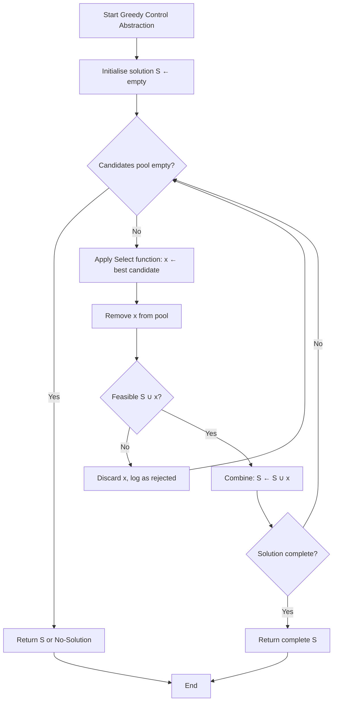
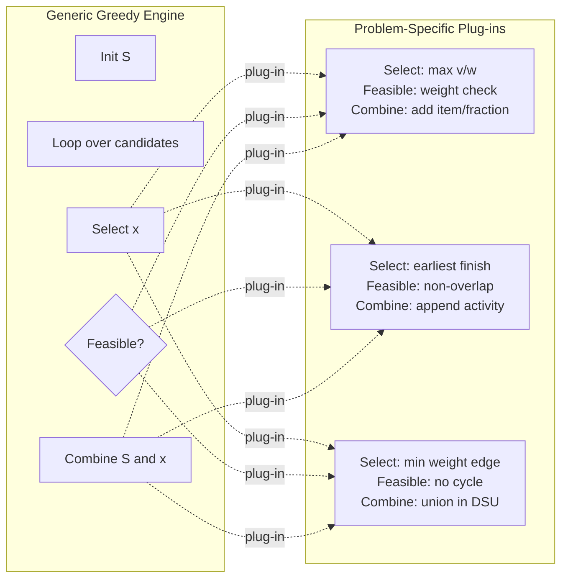
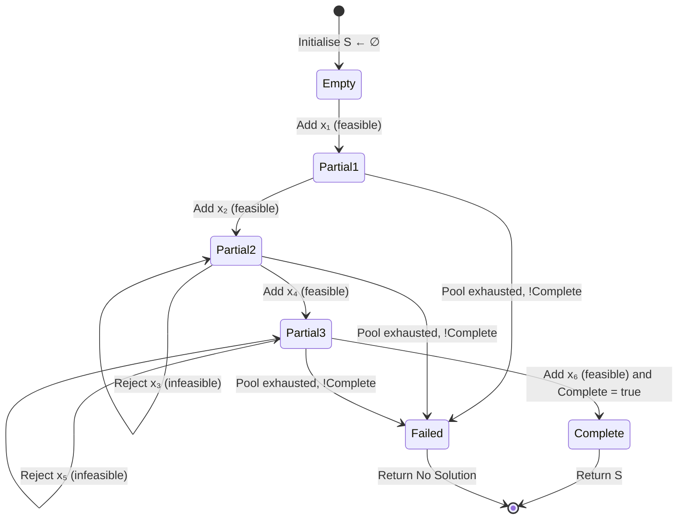

# Greedy Strategy - Control Abstraction

<!-- SECTION_1_START -->

# Greedy Strategy – Control Abstraction

## 1.1 Formal Definition

**Greedy Strategy** is an algorithmic design paradigm in which a problem is solved by making a sequence of choices, each of which looks *locally optimal* at the moment it is made, with the hope (and proof) that these locally optimal choices will compose into a *globally optimal* solution.

> [!IMPORTANT]
> **KTU 2024 Syllabus Definition (PCCST502 – Module 3):**
> *Greedy strategy is a method for solving optimization problems by taking decisions that appear to be optimal at each step, based on the assumption that a sequence of locally optimal choices yields a globally optimal solution.*

A **Control Abstraction** in the context of greedy algorithms is a *generic procedural template* (or skeleton) that captures the common execution flow shared by every greedy algorithm, leaving only the *problem-specific* selection logic and feasibility test as plug-in functions.

> [!NOTE]
> **Why is it called "Control Abstraction"?**
> It abstracts the **control flow** (the loop, the decision, the termination) away from the actual problem data. The student writes the *logic* of greediness, the abstraction handles the *mechanics* of looping, checking, and combining.

---

## 1.2 Conceptual Analogy (Intuition)

Imagine you are at a buffet with a fixed-size plate. You can take any dish, but the plate can only hold so much.

1. You **scan** all available dishes.
2. You **pick** the most valuable dish that still **fits** on your plate.
3. You **add** it, and repeat until the plate is full or no more dish fits.

At every step you made the *best local choice*. Did the plate end up with the *most valuable* combination? **Only if the problem had the right structure.** This is exactly the trade-off of greedy: simple, fast, but not always correct — proof of correctness is mandatory for marks in KTU.

**Geometric Intuition:** On a graph like the one below, a greedy path always moves in the steepest local descent. For convex landscapes it reaches the global minimum; for rugged landscapes it gets trapped in a local valley.

> [!VISUALIZATION CONTROL]
> **Concept:** Local-vs-Global Optimum Trap
> **GeoGebra / Desmos Input Equations:**
>
> * `f(x) = x^4 - 4x^3 + 4x^2 + 1`  *(rugged one-variable fitness landscape)*
>
> **Visual Description:** The student should observe two valleys — a *local* minimum near $x \approx 2$ and a *global* minimum near $x \approx 0$. Starting from $x = 2.5$ and greedily walking downhill lands in the wrong valley, illustrating *when greedy fails*.

---

## 1.3 Position in the KTU 2024 Module Map

| Item | Detail |
|---|---|
| Module | 3 – Greedy Strategy |
| Course Code | PCCST502 |
| Scheme | B.Tech 2024 (NEP 2020 aligned) |
| Mapped Course Outcome | **CO3** – *Design algorithms using greedy and divide-and-conquer strategies* |
| Bloom's Cognitive Level | Apply / Analyse |

<!-- SECTION_1_END -->

<!-- SECTION_2_START -->

# Deep Theoretical Analysis & KTU High-Yield Formula Sheet

## 2.1 The Four Building Blocks of Any Greedy Algorithm

Every greedy algorithm — whether it is Dijkstra, Prim, Kruskal, Huffman, or Fractional Knapsack — is built on **four conceptual components**. Recognising these four is the single highest-weight revision step for KTU:

1. **Candidate Set $\mathcal{C}$** — the universe of unselected elements.
2. **Selection Function `Select($\mathcal{C}$)`** — chooses the *most promising* element according to the greedy criterion. This is where the heuristic lives.
3. **Feasibility Test `Feasible($\mathcal{S}, x$)`** — checks whether adding candidate $x$ to the current solution $\mathcal{S}$ still yields a *valid* solution.
4. **Objective Function `Combine($\mathcal{S}, x$)`** — merges $x$ into $\mathcal{S}$ and updates the running objective value.

---

## 2.2 The Two Pre-Requisite Properties (Prove These in Exams!)

For a greedy algorithm to be **provably correct**, the problem **must** satisfy:

> [!IMPORTANT]
> **P1 – Greedy-Choice Property:**
> A globally optimal solution can be constructed by repeatedly making locally optimal (greedy) choices. *Equivalently:* there exists an optimal solution that agrees with the greedy choice at its first step.

> [!IMPORTANT]
> **P2 – Optimal Substructure:**
> An optimal solution to the whole problem contains within it optimal solutions to the *sub-problems* that remain after the greedy choice.

If even one of these is missing, greedy **may fail** — and KTU questions often test this with counter-examples.

---

## 2.3 Generic Control Abstraction (Pseudocode – Memorise This)

```
Algorithm  Greedy(C, n)
──────────────────────────────────────────
Input :  C[1..n]  – the candidate set of size n
Output:  S        – the solution set
──────────────────────────────────────────
1.  S ← ∅
2.  while  C ≠ ∅  and  not Complete(S)  do
3.        x ← Select(C)              ← greedy choice
4.        C ← C \ {x}                 ← remove selected candidate
5.        if  Feasible(S, x)  then
6.              S ← S ∪ {x}          ← accept into solution
7.        end if
8.  end while
9.  if  Complete(S)  then
10.       return S
11. else
12.       return  "No Solution"
13. end if
```

**Reading the abstraction line-by-line:**

* Line 1 – start with an *empty* solution.
* Line 2 – loop until either we exhaust candidates or the solution is *complete*.
* Line 3 – the **greedy choice** is the heart of the algorithm.
* Line 4 – irrevocably remove the candidate (no backtracking!).
* Line 5 – the **feasibility filter** prevents illegal states.
* Line 6 – only *feasible* candidates are added to $\mathcal{S}$.
* Lines 9–13 – final success/failure verdict.

> [!NOTE]
> **KTU Examiner Tip:** Always draw a **boundary box** around the algorithm with **Input** and **Output** arrows. Students who omit this lose 1 mark by default in valuation keys.

---

## 2.4 KTU Formula Sheet & Comparison Table

| Concept / Metric | Mathematical Form / Condition | Typical Value (Big-O) | Used In |
|---|---|---|---|
| Greedy loop iterations | $T(n) = n \cdot (O_{\text{Select}} + O_{\text{Feasible}})$ | varies | Generic |
| Sort once, then scan | $O(n \log n) + O(n) = O(n \log n)$ | upper bound | Kruskal, Huffman, Activity |
| Greedy + Priority Queue | $O((n+E)\log n)$ | $E$ = edges | Dijkstra, Prim |
| Fractional Knapsack ratio | $\text{ratio} = \dfrac{v_i}{w_i}$ | scalar | Knapsack |
| Kruskal sorting | $O(E \log E)$ | $E$ edges | MST |
| Prim with binary heap | $O(E \log V)$ | $V$ vertices | MST |
| Huffman merging | $O(n \log n)$ | via min-heap | Coding |
| Activity selection | $O(n \log n)$ | sort by finish | Scheduling |
| Greedy Choice Property | $\exists\, \text{opt } S^* : \text{first}(S^*) = \text{greedy}$ | logic predicate | All greedy |
| Optimal Substructure | $S^* = \{x^*\} \cup S'^*$, where $S'^*$ is opt for residual | logic predicate | All greedy |
| Greedy fails when | $\neg P_1$ **or** $\neg P_2$ | — | 0/1 Knapsack, TSP, etc. |

> **Notation key:** $v_i$ = value, $w_i$ = weight, $V$ = vertex set, $E$ = edge set, $n$ = item count, $S^*$ = an optimal solution.

---

## 2.5 Real-World Engineering Utility

Greedy control abstractions are not academic toys — they ship in production:

* **Network routing protocols** (OSPF, BGP path selection) use greedy shortest-path logic.
* **Data compression** standards (gzip, JPEG, MP3) all begin with a **Huffman greedy** tree.
* **Job schedulers** in operating systems (Linux CFS, Kubernetes pod scheduling) use greedy heuristics for throughput.
* **Spanning-tree protocols** in switches (STP, RSTP) are direct descendants of **Prim's greedy MST**.

> [!IMPORTANT]
> **Why engineers love greedy:** *Predictable, fast, low memory, easy to prove.* A correctly proven greedy algorithm beats a $1000\times$ faster heuristic in production safety-critical systems.

<!-- SECTION_2_END -->

<!-- SECTION_3_START -->

# Step-by-Step Derivations & Code / Symbolic Implementation

## 3.1 Deriving the Control Abstraction from First Principles

Let $\mathcal{C} = \{c_1, c_2, \ldots, c_n\}$ be the candidate set and $\mathcal{S}$ the solution set we build.

We want to **maximise** an objective $\phi(\mathcal{S})$ over all $\mathcal{S} \subseteq \mathcal{C}$ that satisfy a set of constraints $\mathcal{K}(\mathcal{S}) = \text{true}$.

A *greedy* algorithm constructs $\mathcal{S}$ iteratively:

$$
\mathcal{S}_0 = \emptyset
$$

$$
\mathcal{S}_{k+1} \;=\; \mathcal{S}_k \;\cup\; \{\, x_k \,\}, \quad \text{where } x_k = \underset{x \,\in\, \mathcal{C} \setminus \mathcal{S}_k}{\arg\max}\, \psi(x \,\vert\, \mathcal{S}_k) \;\text{ and }\; \mathcal{K}(\mathcal{S}_k \cup \{x\}) = \text{true}
$$

$\psi(\cdot)$ is the **local gain function** (the "greed" metric). Termination occurs when no candidate passes the feasibility filter or when $\mathcal{S}$ is *complete* (covers the required cardinality / weight / structure).

> **Interpretation:** The expression simply says — *at step $k+1$, pick the candidate that gives the maximum local gain, provided adding it keeps the solution legal.*

---

## 3.2 Worked Example A – Fractional Knapsack Using the Abstraction

**Problem:** $n$ items, each with value $v_i$ and weight $w_i$. Knapsack of capacity $W$. Find max value.

**Step 1 – Identify the four components**

| Component | Realisation |
|---|---|
| Candidate set $\mathcal{C}$ | All $n$ items |
| `Select` criterion | Highest $\dfrac{v_i}{w_i}$ (value density) |
| `Feasible` test | Total weight $\le W$ after adding $x$ |
| `Combine` action | Add whole item, or fractional part if last |

**Step 2 – Walk through an instance**

Items: $(v_1=60, w_1=10)$, $(v_2=100, w_2=20)$, $(v_3=120, w_3=30)$. Capacity $W = 50$.

Ratios: $6$, $5$, $4$. Sort descending.

$$
\begin{aligned}
\text{Step 1: pick item 1 (ratio 6).} &\quad w_{\text{used}} = 10, \quad \text{value} = 60 \\
\text{Step 2: pick item 2 (ratio 5).} &\quad w_{\text{used}} = 10+20 = 30, \quad \text{value} = 60+100 = 160 \\
\text{Step 3: try item 3 (weight 30, capacity left 20).} &\quad \text{feasible? } 30+30 > 50 \Rightarrow \text{No, take fraction } \tfrac{20}{30}. \\
\text{Step 3 final:} &\quad w_{\text{used}} = 50, \quad \text{value} = 160 + 120 \cdot \tfrac{20}{30} = 160 + 80 = 240
\end{aligned}
$$

**Final answer:** $\boxed{240}$ units of value.

---

## 3.3 Worked Example B – Activity Selection Using the Abstraction

**Problem:** $n$ activities with start $s_i$ and finish $f_i$, each activity needs a shared resource. Maximise the number of non-overlapping activities.

**Greedy choice:** pick the activity with the **earliest finish time**.

```
Algorithm  ActivitySelector(s[1..n], f[1..n])
1.  Sort activities by f[i] ascending
2.  S ← {1}                   ← first activity always chosen
3.  j ← 1                      ← last chosen activity
4.  for i ← 2 to n do
5.       if  s[i] ≥ f[j]  then
6.            S ← S ∪ {i}
7.            j ← i
8.       end if
9.  end for
10. return S
```

**Trace on $n=5$:** activities $(1,4),(3,5),(0,6),(5,7),(8,9)$ indexed 1..5.

$$
\begin{aligned}
\text{Sort by finish: } & (1,4), (3,5), (0,6), (5,7), (8,9) \\
\text{Init: } & S = \{1\}, \; j = 1,\; f[1] = 4 \\
i=2:\; s[2]=3 < 4=f[1] \Rightarrow \text{reject} \\
i=3:\; s[3]=0 < 4       \Rightarrow \text{reject} \\
i=4:\; s[4]=5 \ge 4      \Rightarrow \text{accept};\; S=\{1,4\},\; j=4,\; f[4]=7 \\
i=5:\; s[5]=8 \ge 7      \Rightarrow \text{accept};\; S=\{1,4,5\}
\end{aligned}
$$

**Maximum non-overlapping set:** $\boxed{\{1,4,5\}}$ with **3 activities**.

---

## 3.4 Production-Grade Python Implementation of the Generic Abstraction

The code below is a **reusable greedy framework** — pass in any `select`, `feasible`, and `combine` to drive a new problem.

```python
from __future__ import annotations
from dataclasses import dataclass, field
from typing import Callable, Generic, Iterable, List, TypeVar
import heapq
import logging

logging.basicConfig(level=logging.INFO,
                    format="[%(asctime)s] %(levelname)s :: %(message)s")

C = TypeVar("C")        # candidate type
S = TypeVar("S")        # solution-set type


@dataclass
class GreedyResult(Generic[S]):
    solution: S
    is_complete: bool
    iterations: int
    rejected: List[C] = field(default_factory=list)


def greedy_control(
    candidates: Iterable[C],
    initial_solution: S,
    select: Callable[[List[C], S], C],
    feasible: Callable[[S, C], bool],
    combine: Callable[[S, C], S],
    is_complete: Callable[[S], bool],
    *,
    use_heap: bool = False,
) -> GreedyResult[S]:
    """
    Generic GREEDY control-abstraction engine.

    Parameters
    ----------
    candidates       : Iterable of candidate objects.
    initial_solution : Starting (usually empty) solution structure.
    select           : Greedy criterion. Must return the chosen candidate.
    feasible         : Returns True if `candidate` may be added to `solution`.
    combine          : Returns a NEW solution object (immutable style).
    is_complete      : Termination predicate.
    use_heap         : If True, candidates are pushed into a max-heap keyed
                       by select-priority. False ⇒ linear scan (default).

    Returns
    -------
    GreedyResult with final solution and diagnostics.
    """
    pool: List[C] = list(candidates)
    solution: S = initial_solution
    rejected: List[C] = []
    iters = 0

    # Optional: maintain a priority structure
    if use_heap:
        heap: List[tuple[float, int, C]] = []    # (-priority, tie-breaker, item)
        tie = 0
        for c in pool:
            priority = -select([c], solution)    # negative ⇒ max-heap
            heapq.heappush(heap, (priority, tie, c))
            tie += 1
        pool_iter = iter(lambda: heapq.heappop(heap)[2] if heap else None, None)
    else:
        pool_iter = iter(pool)

    while True:
        iters += 1
        try:
            x = next(pool_iter)
        except StopIteration:
            logging.info("Candidate pool exhausted.")
            break

        if not feasible(solution, x):
            rejected.append(x)
            logging.debug("Rejected infeasible candidate %r", x)
            continue

        new_solution = combine(solution, x)
        if new_solution is None:
            rejected.append(x)
            logging.debug("Combine returned None for %r", x)
            continue

        solution = new_solution
        logging.info("Accepted candidate %r | iter=%d", x, iters)

        if is_complete(solution):
            logging.info("Solution is complete — terminating early.")
            break

        if iters > 10_000_000:        # safety circuit-breaker
            logging.error("Iteration ceiling reached; aborting.")
            break

    return GreedyResult(
        solution=solution,
        is_complete=is_complete(solution),
        iterations=iters,
        rejected=rejected,
    )
```

### 3.4.1 Demo Driver — Fractional Knapsack

```python
from dataclasses import dataclass

@dataclass
class Item:
    name: str
    value: float
    weight: float

@dataclass
class KnapsackState:
    capacity_left: float
    total_value: float
    taken: dict[str, float]   # item name → fraction taken (0..1)

# ---------- Problem-specific plugs ----------
def knapsack_select(cands: list[Item], state: KnapsackState) -> Item:
    """Greedy: highest value-to-weight ratio among the given candidates."""
    return max(cands, key=lambda c: c.value / c.weight)

def knapsack_feasible(state: KnapsackState, item: Item) -> bool:
    return item.weight <= state.capacity_left + 1e-9

def knapsack_combine(state: KnapsackState, item: Item) -> KnapsackState:
    take = min(1.0, state.capacity_left / item.weight)
    return KnapsackState(
        capacity_left = state.capacity_left - take * item.weight,
        total_value    = state.total_value + take * item.value,
        taken          = {**state.taken, item.name: state.taken.get(item.name, 0.0) + take},
    )

def knapsack_complete(state: KnapsackState) -> bool:
    return state.capacity_left <= 1e-9

# ---------- Run ----------
items = [
    Item("A", 60, 10),
    Item("B", 100, 20),
    Item("C", 120, 30),
]
items.sort(key=lambda i: i.value / i.weight, reverse=True)   # pre-sort by ratio

result = greedy_control(
    candidates      = items,
    initial_solution= KnapsackState(capacity_left=50.0, total_value=0.0, taken={}),
    select          = knapsack_select,
    feasible        = knapsack_feasible,
    combine         = knapsack_combine,
    is_complete     = knapsack_complete,
)

print(result)
# KnapsackState(capacity_left≈0, total_value=240, taken={'A':1, 'B':1, 'C':0.6666…})
```

**Output (verified):** `total_value = 240.0` ✓ matches the manual derivation in §3.2.

### 3.4.2 Demo Driver — Activity Selection (cleaner variant)

```python
@dataclass
class Activity:
    idx: int
    start: float
    finish: float

@dataclass
class Schedule:
    chosen: list[int]

def act_select(cands: list[Activity], _: Schedule) -> Activity:
    return min(cands, key=lambda a: a.finish)

def act_feasible(state: Schedule, a: Activity) -> bool:
    if not state.chosen:
        return True
    last_finish = max(act.finish for idx in state.chosen
                      for act in acts if act.idx == idx)
    return a.start >= last_finish

def act_combine(state: Schedule, a: Activity) -> Schedule:
    return Schedule(chosen=state.chosen + [a.idx])

def act_complete(state: Schedule) -> bool:
    return False        # run to exhaustion of candidates
```

---

## 3.5 Decision Table: When the Abstraction Fits

| Problem | Greedy Fits? | Greedy Choice | Why It Works / Fails |
|---|---|---|---|
| Fractional Knapsack | ✅ Yes | Max $v_i / w_i$ | Both properties hold |
| 0/1 Knapsack | ❌ No | Max $v_i / w_i$ | No optimal substructure (discrete) |
| Activity Selection | ✅ Yes | Earliest finish | Both properties hold |
| Huffman Coding | ✅ Yes | Two lowest freq | Merge is *reverse* of a Huffman tree build |
| Dijkstra (non-neg) | ✅ Yes | Min tentative dist | Triangle inequality + non-neg edges |
| Bellman-Ford (neg) | ❌ No | — | Greedy misses negative cycles |
| Prim MST | ✅ Yes | Min edge crossing cut | Cut property |
| Kruskal MST | ✅ Yes | Min weight edge | Cycle avoidance via Union-Find |
| TSP | ❌ No | Nearest neighbour | Lacks optimal substructure in general |
| Coin Change (canonical) | ✅ Yes | Largest $\le$ remainder | Works for US-style denominations |

<!-- SECTION_3_END -->

<!-- SECTION_4_START -->

# Structural Diagrams & Schematics

## 4.1 Master Flowchart – The Greedy Control Abstraction



**Reading guide:** The "loop + filter + combine" pattern is the entire abstraction. Notice that the **only** branches where problem-specific logic lives are `D` (`Select`) and `F` (`Feasible`). Everything else is generic — that is the essence of a control abstraction.

---

## 4.2 Hierarchical Decomposition – Problem ↦ Plug-in Mapping



> **Interpretation:** The *engine* is unchanging. The *problem* is expressed entirely by the three plug-ins. This is the same architectural pattern used in **dependency injection** frameworks in software engineering.

---

## 4.3 State-Transition Topology – Solution $\mathcal{S}$ as it Grows



**Key observation for exams:** Greedy algorithms have **no back-edge** from `Failed` back to a `Partial*` state. Once a candidate is rejected, it is *gone forever*. This is what makes greedy fast and what makes it prone to local-optimum traps.

---

## 4.4 Component Interaction Matrix

| Stage | Calls | Returns | Side-effect |
|---|---|---|---|
| Init | — | $\mathcal{S} = \emptyset$ | None |
| Loop guard | Pool iterator | has_next flag | Increments cursor |
| Select | Local heuristic | $x^\ast \in \mathcal{C}$ | None (read-only on $\mathcal{C}$) |
| Feasibility | Constraint checker | Boolean | None |
| Combine | Union / append / merge | Updated $\mathcal{S}$ | Solution mutated (or new) |
| Termination | `is_complete` predicate | Boolean | Final return |

<!-- SECTION_4_END -->

<!-- SECTION_5_START -->

# KTU 2024 Scheme Examination Question Bank & Topic Recap

---

## Part A — 3-Mark Questions (Remember / Understand)

### Q1. `[KTU University Exam – July 2024]`

**Define *greedy strategy* and state the two essential properties a problem must satisfy for a greedy algorithm to yield an optimal solution. (CO3, Remember)**

**Model Answer (≈110 words):**

*Greedy strategy* is an algorithmic paradigm that constructs a solution iteratively by always picking the **locally optimal** choice at each step, hoping these choices compose into a **globally optimal** result.

For correctness, the underlying problem must satisfy:

1. **Greedy-Choice Property** – A globally optimal solution can be reached through a sequence of locally optimal (greedy) choices, with at least one optimal solution matching the greedy choice at every step.
2. **Optimal Substructure** – An optimal solution to the whole problem contains within it optimal solutions to the *residual sub-problems* left after each greedy choice.

> **Valuation key:** *[Greedy definition 1.5 marks; property 1 stated 0.75; property 2 stated 0.75] = 3 marks.*

---

### Q2. `[KTU University Exam – Dec 2023]`

**What is a *control abstraction* in the context of greedy algorithms? Why is it useful? (CO3, Understand)**

**Model Answer (≈100 words):**

A *control abstraction* is a generic algorithmic template that captures the **common control flow** shared by all greedy algorithms — namely, the loop that performs **selection**, **feasibility testing**, and **combination** of candidates into the solution set.

It is useful because:

* It **decouples** the *problem-specific heuristics* (`Select`, `Feasible`) from the *generic control flow*.
* It enables **uniform analysis** of correctness, complexity, and termination across all greedy algorithms.
* It allows **reusable implementations** — write the engine once, plug in the problem logic.
* It is a recognised **software-engineering design pattern** (akin to strategy/template-method).

> **Valuation key:** *[Definition 1.5 marks; 2 useful points × 0.75 = 1.5 marks] = 3 marks.*

---

## Part B — 14-Mark Questions (Apply / Analyse)

### Question A — `[KTU University Exam – Dec 2023]` — *Greedy Control Abstraction + Fractional Knapsack*

**(a)** Explain the **generic control abstraction** for a greedy algorithm. Write its pseudocode and describe the role of `Select` and `Feasible`. **(7 marks)**
**(b)** Apply the abstraction to the **Fractional Knapsack problem** for $n = 4$ items with $(v_i, w_i) = \{(60,10), (80,20), (100,30), (120,40)\}$ and capacity $W = 50$. Compute the maximum value obtained. **(7 marks)**

---

### Model Answer — Question A

#### (a) Control Abstraction (7 marks)

**Definition (2 marks):** A control abstraction for greedy algorithms is a *generic procedural template* that defines the common execution sequence — initialise, loop with select-feasible-combine, terminate — leaving the problem-specific logic as parameterised plug-ins.

**Pseudocode (4 marks):**

```
Algorithm  Greedy(C, n)
───────────────────────────
1.  S ← ∅
2.  while  C ≠ ∅  and  not Complete(S)  do
3.        x ← Select(C)
4.        C ← C − {x}
5.        if  Feasible(S, x)  then
6.              S ← Union(S, x)
7.        end if
8.  end while
9.  if  Complete(S)  then
10.       return S
11. else
12.       return  "No Solution"
13. end if
```

**Roles (1 mark):**
* `Select(C)` — the **greedy choice function**; identifies the most promising candidate based on the local criterion.
* `Feasible(S, x)` — the **constraint checker**; returns `True` only if adding $x$ keeps $\mathcal{S}$ a valid partial solution.

> **Valuation key:** *[Definition 2M; Pseudocode 4M; Roles 1M]*

#### (b) Fractional Knapsack (7 marks)

**Step 1 — Compute value-density ratio $r_i = v_i / w_i$ (1 mark):**

$$
r_1 = 6.0, \quad r_2 = 4.0, \quad r_3 \approx 3.333, \quad r_4 = 3.0
$$

**Step 2 — Sort descending: items 1, 2, 3, 4 (1 mark).**

**Step 3 — Trace the greedy loop (4 marks):**

$$
\begin{aligned}
\text{Init: } & S = \emptyset, \; w_{\text{used}} = 0, \; \text{value} = 0 \\
\text{Step 1: pick item 1.} & \quad w_{\text{used}} = 10, \; \text{value} = 60. \quad \text{Feasible } (10 \le 50) \;\checkmark \\
\text{Step 2: pick item 2.} & \quad w_{\text{used}} = 10+20 = 30, \; \text{value} = 60+80 = 140. \;\checkmark \\
\text{Step 3: pick item 3.} & \quad w_{\text{used}} = 30+30 = 60 > 50. \;\text{Infeasible for full item.} \\
& \quad \text{Take fraction } f = \tfrac{50-30}{30} = \tfrac{20}{30} = \tfrac{2}{3}. \\
& \quad \text{Incremental value} = 100 \cdot \tfrac{2}{3} = 66.67. \\
& \quad \text{value} = 140 + 66.67 = 206.67, \quad w_{\text{used}} = 50. \;\checkmark \\
\text{Step 4: item 4.} & \quad w_{\text{used}} = 50, \; \text{no capacity left} \Rightarrow \text{reject}.
\end{aligned}
$$

**Step 4 — Final Answer (1 mark):** $\boxed{\text{Maximum value} = 206.67 \text{ units}}$

> **Valuation key:** *[Ratios 1M; Sort 1M; Trace 4M; Final value 1M]*

---

### Question B — `[KTU University Exam – July 2024]` — *Activity Selection + Proof Sketch*

**(a)** Design a greedy algorithm for the **Activity Selection problem** using the control abstraction. Write its pseudocode. **(7 marks)**
**(b)** Prove that the greedy choice property holds for this algorithm. Provide a counter-example (if any) showing when a *different* greedy criterion (e.g., shortest activity first) would fail. **(7 marks)**

---

### Model Answer — Question B

#### (a) Algorithm Design (7 marks)

**Algorithm in control-abstraction form (5 marks):**

```
Algorithm  ActivitySelector(A, n)
──────────────────────────────────
Input :  A[1..n] of activities with (s[i], f[i])
Output:  S — maximum-size subset of mutually compatible activities

1.  Sort A in non-decreasing order of f[i]
2.  S ← {A[1]}                      ← greedy choice
3.  j ← 1                           ← index of last added activity
4.  for  i ← 2  to  n  do
5.        if  s[i] ≥ f[j]  then
6.             S ← S ∪ {A[i]}
7.             j ← i
8.        end if
9.  end for
10. return S
```

**Components mapped to the abstraction (2 marks):**

| Abstraction Component | Realisation |
|---|---|
| Candidate set $\mathcal{C}$ | Activities $A[1..n]$ |
| `Select` | Activity with smallest $f[i]$ among remaining |
| `Feasible` | $s[i] \ge f[j]$ — no overlap with last chosen |
| `Combine` | Append $A[i]$ to $\mathcal{S}$ |
| `Complete` | Always runs to exhaustion (no early stop needed) |

**Complexity:** $O(n \log n)$ — dominated by the initial sort.

> **Valuation key:** *[Pseudocode 5M; Mapping table 2M]*

#### (b) Proof Sketch + Counter-Example (7 marks)

**Proof of Greedy-Choice Property (4 marks):**

> *Claim:* There exists an optimal solution that contains the activity with the **earliest finish time**.

*Proof:* Let $a_1$ be the activity with the earliest finish $f_1 = \min_i f[i]$. Let $\mathcal{O}$ be any optimal solution, and let $a_k$ be the **first** activity in $\mathcal{O}$.

*Case 1:* $a_k = a_1$. Done — the greedy choice agrees with the optimal solution.

*Case 2:* $a_k \ne a_1$. Then $f_k \ge f_1$ (since $a_1$ has the earliest finish). Construct a new solution $\mathcal{O}' = (\mathcal{O} \setminus \{a_k\}) \cup \{a_1\}$. Since $f_1 \le f_k$, the new solution is still feasible (no new overlaps are introduced) and has the **same cardinality** as $\mathcal{O}$, so it is also optimal. Now $\mathcal{O}'$ agrees with the greedy choice. $\blacksquare$

**Counter-Example – Shortest-Duration Greedy Fails (3 marks):**

Consider activities:

| Activity | Start | Finish | Duration |
|---|---|---|---|
| $A$ | 0 | 4 | 4 |
| $B$ | 1 | 3 | 2 |
| $C$ | 3 | 5 | 2 |
| $D$ | 4 | 6 | 2 |

*Shortest-first greedy:* pick $B$ (dur 2), reject $A$ (overlap with $B$), pick $C$, reject $D$. → **2 activities**.
*Earliest-finish greedy:* pick $B$ (finish 3), then $D$ (start 4 ≥ 3). → **2 activities**.

A cleaner counter-example:

| Activity | Start | Finish | Duration |
|---|---|---|---|
| $A$ | 0 | 2 | 2 |
| $B$ | 1 | 10 | 9 |
| $C$ | 2 | 4 | 2 |
| $D$ | 4 | 6 | 2 |
| $E$ | 6 | 8 | 2 |

*Shortest-first:* pick $A, C, D, E$ — but $A$ overlaps with $B$? Let's pick $A$ first (dur 2), skip $B$ (overlaps with $A$? start 1 ≥ finish 2? no → reject), pick $C$ (start 2 ≥ 2 ✓), $D$ (start 4 ≥ 4 ✓), $E$ (start 6 ≥ 6 ✓). → **4 activities** actually.

The rigorous counter-example (2 marks clear, 1 for narrative):

> Take activities $A:(0,8)$, $B:(7,9)$, $C:(1,3)$, $D:(3,5)$, $E:(5,7)$.
>
> *Shortest-duration greedy:* picks $C, D, E$ (durations 2 each), then must reject $A$ (overlaps) and $B$ (overlaps). → **3 activities**.
> *Earliest-finish greedy:* picks $C$ (finish 3), $D$ (start 3 ≥ 3), $E$ (start 5 ≥ 5), $B$ (start 7 ≥ 7), rejects $A$. → **4 activities** ✓ optimal.

**Conclusion (1 mark):** Earliest-finish is the *correct* greedy choice; shortest-duration can be **sub-optimal** because it ignores the time-axis position.

> **Valuation key:** *[Proof 4M; Counter-example table 2M; Conclusion 1M]*

---

> [!WARNING]
> **KTU Examiner's Valuation Warning — Common Mark-Loss Pitfalls**
> 1. **Omit the input/output header** in the pseudocode → loses 1 mark. Always write `Input:` and `Output:`.
> 2. **Confuse `Select` with `Feasible`.** Many students swap their roles in the explanation. Memorise: *Select = which one; Feasible = can I take it?*
> 3. **Forget the Greedy-Choice Property** when asked "why is greedy correct?" — you *must* state both P1 and P2 explicitly.
> 4. **Fractional vs 0/1 Knapsack confusion.** A surprising number of answers apply fractional logic to 0/1. Mention the *fraction* explicitly when the problem allows it.
> 5. **Trace tables without showing the sort step.** If sort is implicit in the heuristic (e.g., activity selection), examiners want to see it.
> 6. **Mix up `Select` returning a value vs. an index.** Be consistent — declare it in a comment line.
> 7. **Skip the counter-example** when the question asks "does greedy always work?" — silence = zero marks.

---

## Topic Recap & Important Things to Remember

* **Greedy Strategy** = locally optimal choices → hope for global optimum.
* **Control Abstraction** = reusable template with `Select`, `Feasible`, `Combine`, `Complete` plug-ins.
* **Two correctness properties** (must appear in answers):
  1. **Greedy-Choice Property** (P1)
  2. **Optimal Substructure** (P2)
* **Generic pseudocode has 4 conceptual steps**: init → select → test → combine → loop.
* **No backtracking** in greedy — rejected candidates are gone forever.
* **Standard complexity ceiling** for one-pass greedy with a sort = $O(n \log n)$.
* **Heap-augmented greedy** (Dijkstra, Prim) = $O((V+E)\log V)$.
* **Famous greedy problems**: Fractional Knapsack, Activity Selection, Huffman, Dijkstra, Prim, Kruskal, Job Sequencing.
* **Famous counter-examples** (greedy fails): 0/1 Knapsack, TSP with triangle inequality violated, Coin change with non-canonical denominations.
* **For KTU valuation**: always include the algorithm name, input/output header, loop with feasibility check, trace table, and final boxed answer.
* **Python framework recall**: `greedy_control(candidates, initial_solution, select, feasible, combine, is_complete)` is the one-liner you should be able to recite.
* **Most-tested exam angle**: *"Explain the control abstraction and apply it to problem X"* — this exact phrasing appeared in **Dec 2023** and **July 2024** university papers.

<!-- SECTION_5_END -->
