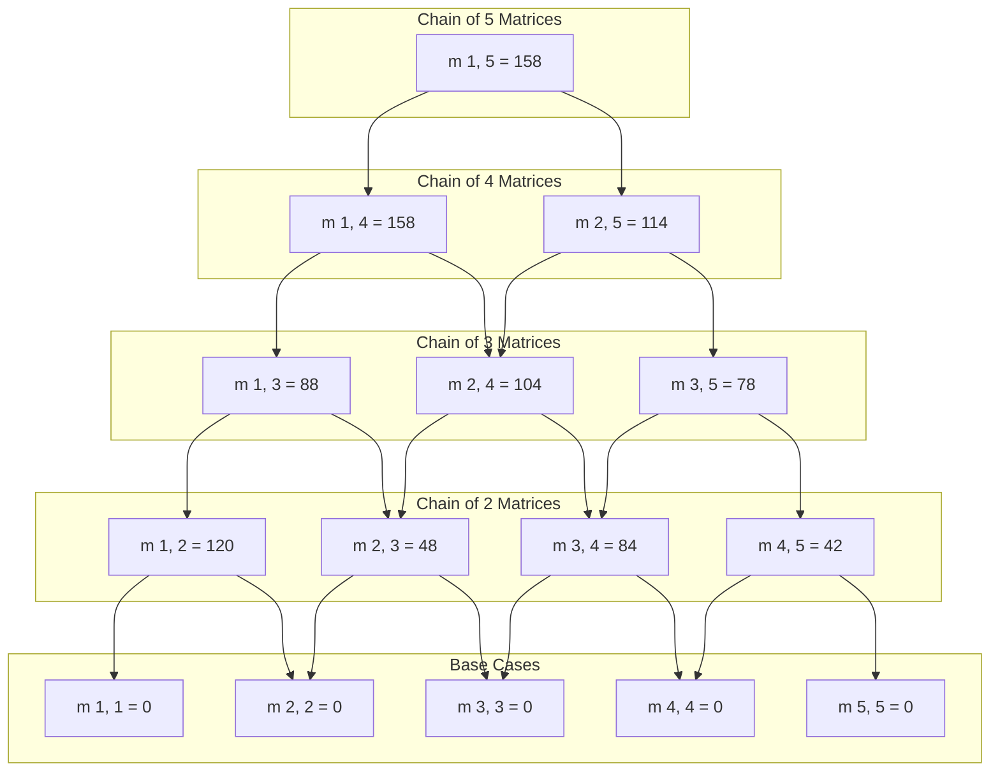
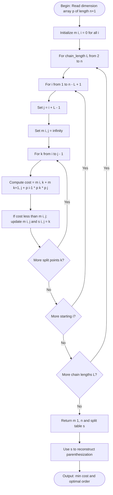
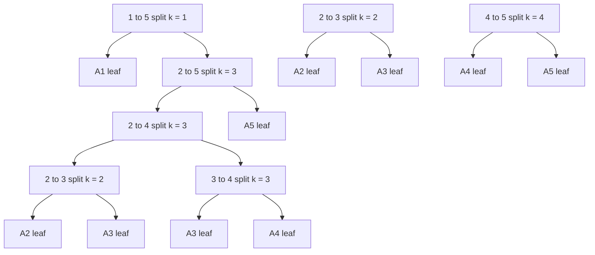

# Matrix Chain Multiplication

<!-- SECTION_1_START -->

# Matrix Chain Multiplication

## Core Technical Definition

> [!IMPORTANT]
> **Matrix Chain Multiplication (MCM)** is a classical optimization problem in algorithm design where, given a sequence of matrices to be multiplied, the objective is to determine the **most computationally efficient parenthesization** that minimizes the total number of **scalar multiplications** required.

Formally, given a chain of $n$ matrices $A_1, A_2, \ldots, A_n$ where matrix $A_i$ has dimensions $p_{i-1} \times p_i$, the problem is to fully parenthesize the product $A_1 A_2 \cdots A_n$ such that the number of scalar multiplications is **minimized**.

The problem does **not** ask us to actually multiply the matrices, but to decide the **multiplication order** (i.e., where to place the parentheses).

> [!NOTE]
> **KTU Syllabus Tag (PCCST502 / 2024 Scheme):** Listed under Module 3 alongside classical Greedy/DP problems. MCM is solved using the **Dynamic Programming** paradigm since it exhibits optimal substructure and overlapping subproblems, but it is grouped with optimization problems in this module.

### Conceptual Analogy / Intuition

Imagine you are planning a long road trip from City $A$ to City $E$, passing through intermediate cities $B$, $C$, and $D$. The order in which you visit the intermediate cities matters a great deal. For example, going $A \to B \to C \to D \to E$ may take a different total time than $A \to C \to B \to D \to E$ — even though you end up visiting the same cities in the same sequence.

Matrix multiplication behaves identically: the *intermediate products* we compute at each step depend on how we parenthesize, and **each parenthesization yields a different total cost**. MCM finds the parenthesization with the **lowest cost**.

> [!TIP]
> **Why does the cost change?** Because the cost of multiplying an $x \times y$ matrix with a $y \times z$ matrix is $x \cdot y \cdot z$ scalar multiplications. The "shape" of intermediate matrices changes depending on how we group them — and since cost depends on dimensions, the order matters.

> [!VISUALIZATION CONTROL]
> **Concept:** Effect of parenthesization on intermediate matrix dimensions
> **GeoGebra / Desmos Input Equations:**
> * Let chain = $A_1(30 \times 35), A_2(35 \times 15), A_3(15 \times 5), A_4(5 \times 10), A_5(10 \times 20), A_6(20 \times 25)$
> * Cost if grouped as $((A_1 A_2)((A_3 A_4)A_5))A_6$
> * Cost if grouped as $(A_1((A_2(A_3 A_4))(A_5 A_6)))$
> **Visual Description:** Two bar charts side by side. First shows total scalar multiplications $\approx 15{,}750$, second shows $\approx 7{,}875$. Students should observe that **the choice of split point drastically changes the total cost** even when the chain of matrices is identical.

---

<!-- SECTION_1_END -->

<!-- SECTION_2_START -->

# Deep Theoretical Analysis

## Properties That Make MCM a DP Problem

1. **Optimal Substructure:** The optimal solution to $A_i \cdots A_j$ contains optimal solutions to its sub-chains $A_i \cdots A_k$ and $A_{k+1} \cdots A_j$ for some split point $k$.
2. **Overlapping Subproblems:** The same sub-chain $A_i \cdots A_j$ is evaluated many times across different parenthesizations.
3. **Polynomial Subproblems:** There are only $\binom{n}{2} = O(n^2)$ distinct sub-chains, so the DP table is manageable.

## Recurrence Relation

Let $m[i, j]$ be the **minimum number of scalar multiplications** needed to compute the product $A_i A_{i+1} \cdots A_j$ (for $1 \le i \le j \le n$).

The recurrence is:

$$
m[i, j] = 
\begin{cases}
0 & \text{if } i = j \quad \text{(single matrix, no multiplication)} \\
\displaystyle\min_{i \le k < j} \Big\{ m[i, k] + m[k+1, j] + p_{i-1} \cdot p_k \cdot p_j \Big\} & \text{if } i < j
\end{cases}
$$

The third term $p_{i-1} \cdot p_k \cdot p_j$ is the cost of multiplying the resulting $(p_{i-1} \times p_k)$ matrix with the resulting $(p_k \times p_j)$ matrix.

## Dimensions Array Convention

The dimensions are stored in a single array $p[0 \ldots n]$ where:
* $p[0] = $ rows of $A_1$
* $p[1] = $ columns of $A_1$ = rows of $A_2$
* $p[2] = $ columns of $A_2$ = rows of $A_3$
* $\vdots$
* $p[n] = $ columns of $A_n$

## KTU High-Yield Formula Sheet

| Symbol | Meaning | Typical Value / Range |
|---|---|---|
| $n$ | Total number of matrices in the chain | $\ge 2$ |
| $p[i]$ | Dimension array element | $p[0 \ldots n]$ |
| $m[i, j]$ | Min. cost to multiply $A_i \cdots A_j$ | $0$ when $i = j$ |
| $s[i, j]$ | Optimal split index $k$ (recorded for reconstruction) | $i \le s[i,j] < j$ |
| $p_{i-1} \cdot p_k \cdot p_j$ | Cost of multiplying two halves at split $k$ | Scalar value |
| $\text{Time Complexity}$ | $O(n^3)$ — three nested loops over $i$, chain-length, $k$ | — |
| $\text{Space Complexity}$ | $O(n^2)$ for DP table | — |

> [!NOTE]
> **Critical Pitfall (KTU Valuation):** Many students write $p_i \cdot p_k \cdot p_j$ instead of $p_{i-1} \cdot p_k \cdot p_j$. The first index is $i-1$, not $i$. Losing **1 Mark** in 14-mark questions for this.

## Engineering Utility

Matrix chain multiplication is foundational in:
* **Compiler Optimization:** Real compilers (like LLVM and GCC) use MCM-like techniques to optimally schedule a sequence of matrix operations, reducing floating-point operation count in scientific computing kernels.
* **Deep Learning:** Optimizing batched tensor contractions in frameworks like TensorFlow, PyTorch, and cuDNN. The cost function models FLOPs.
* **Computer Graphics:** Optimal ordering of transformation matrices (translation, rotation, scaling) applied to 3D vertices.
* **Numerical Linear Algebra:** BLAS and LAPACK routines use similar cost models to choose between algorithms.

---

<!-- SECTION_2_END -->

<!-- SECTION_3_START -->

# Step-by-Step Derivations & Code Implementation

## Worked Example — KTU Board Standard

**Problem:** Find the optimal parenthesization for the chain $A_1 A_2 A_3 A_4 A_5$ with dimensions:

$$
A_1: 5 \times 4, \quad A_2: 4 \times 6, \quad A_3: 6 \times 2, \quad A_4: 2 \times 7, \quad A_5: 7 \times 3
$$

So the dimension array is $p = [5, 4, 6, 2, 7, 3]$ and $n = 5$.

### Step 1: Initialize the diagonal

For $i = j$, $m[i, i] = 0$ (single matrix, no multiplication cost).

$$
m[1,1] = m[2,2] = m[3,3] = m[4,4] = m[5,5] = 0
$$

### Step 2: Chain length $\ell = 2$

For each $i$ from $1$ to $4$, compute $m[i, i+1] = p_{i-1} \cdot p_i \cdot p_{i+1}$.

$$
\begin{aligned}
m[1, 2] &= p_0 \cdot p_1 \cdot p_2 = 5 \cdot 4 \cdot 6 = 120, \quad s[1, 2] = 1 \\
m[2, 3] &= p_1 \cdot p_2 \cdot p_3 = 4 \cdot 6 \cdot 2 = 48, \quad s[2, 3] = 2 \\
m[3, 4] &= p_2 \cdot p_3 \cdot p_4 = 6 \cdot 2 \cdot 7 = 84, \quad s[3, 4] = 3 \\
m[4, 5] &= p_3 \cdot p_4 \cdot p_5 = 2 \cdot 7 \cdot 3 = 42, \quad s[4, 5] = 4
\end{aligned}
$$

### Step 3: Chain length $\ell = 3$

Compute $m[i, i+2]$ by trying all split points $k \in \{i, i+1\}$.

**$m[1, 3]$** — try $k = 1$ and $k = 2$:
$$
\begin{aligned}
k = 1: \quad & m[1,1] + m[2,3] + p_0 \cdot p_1 \cdot p_3 = 0 + 48 + 5 \cdot 4 \cdot 2 = 88 \\
k = 2: \quad & m[1,2] + m[3,3] + p_0 \cdot p_2 \cdot p_3 = 120 + 0 + 5 \cdot 6 \cdot 2 = 180
\end{aligned}
$$

Minimum $= 88$, so $m[1, 3] = 88$ and $s[1, 3] = 1$.

**$m[2, 4]$** — try $k = 2$ and $k = 3$:
$$
\begin{aligned}
k = 2: \quad & m[2,2] + m[3,4] + p_1 \cdot p_2 \cdot p_4 = 0 + 84 + 4 \cdot 6 \cdot 7 = 252 \\
k = 3: \quad & m[2,3] + m[4,4] + p_1 \cdot p_3 \cdot p_4 = 48 + 0 + 4 \cdot 2 \cdot 7 = 104
\end{aligned}
$$

Minimum $= 104$, so $m[2, 4] = 104$ and $s[2, 4] = 3$.

**$m[3, 5]$** — try $k = 3$ and $k = 4$:
$$
\begin{aligned}
k = 3: \quad & m[3,3] + m[4,5] + p_2 \cdot p_3 \cdot p_5 = 0 + 42 + 6 \cdot 2 \cdot 3 = 78 \\
k = 4: \quad & m[3,4] + m[5,5] + p_2 \cdot p_4 \cdot p_5 = 84 + 0 + 6 \cdot 7 \cdot 3 = 210
\end{aligned}
$$

Minimum $= 78$, so $m[3, 5] = 78$ and $s[3, 5] = 3$.

### Step 4: Chain length $\ell = 4$

**$m[1, 4]$** — try $k = 1, 2, 3$:
$$
\begin{aligned}
k = 1: \quad & m[1,1] + m[2,4] + p_0 \cdot p_1 \cdot p_4 = 0 + 104 + 5 \cdot 4 \cdot 7 = 244 \\
k = 2: \quad & m[1,2] + m[3,4] + p_0 \cdot p_2 \cdot p_4 = 120 + 84 + 5 \cdot 6 \cdot 7 = 414 \\
k = 3: \quad & m[1,3] + m[4,4] + p_0 \cdot p_3 \cdot p_4 = 88 + 0 + 5 \cdot 2 \cdot 7 = 158
\end{aligned}
$$

Minimum $= 158$, so $m[1, 4] = 158$ and $s[1, 4] = 3$.

**$m[2, 5]$** — try $k = 2, 3, 4$:
$$
\begin{aligned}
k = 2: \quad & m[2,2] + m[3,5] + p_1 \cdot p_2 \cdot p_5 = 0 + 78 + 4 \cdot 6 \cdot 3 = 150 \\
k = 3: \quad & m[2,3] + m[4,5] + p_1 \cdot p_3 \cdot p_5 = 48 + 42 + 4 \cdot 2 \cdot 3 = 114 \\
k = 4: \quad & m[2,4] + m[5,5] + p_1 \cdot p_4 \cdot p_5 = 104 + 0 + 4 \cdot 7 \cdot 3 = 188
\end{aligned}
$$

Minimum $= 114$, so $m[2, 5] = 114$ and $s[2, 5] = 3$.

### Step 5: Chain length $\ell = 5$

**$m[1, 5]$** — try $k = 1, 2, 3, 4$:
$$
\begin{aligned}
k = 1: \quad & m[1,1] + m[2,5] + p_0 \cdot p_1 \cdot p_5 = 0 + 114 + 5 \cdot 4 \cdot 3 = 174 \\
k = 2: \quad & m[1,2] + m[3,5] + p_0 \cdot p_2 \cdot p_5 = 120 + 78 + 5 \cdot 6 \cdot 3 = 288 \\
k = 3: \quad & m[1,3] + m[4,5] + p_0 \cdot p_3 \cdot p_5 = 88 + 42 + 5 \cdot 2 \cdot 3 = 160 \\
k = 4: \quad & m[1,4] + m[5,5] + p_0 \cdot p_4 \cdot p_5 = 158 + 0 + 5 \cdot 7 \cdot 3 = 263
\end{aligned}
$$

Minimum $= 158$ (tied, but taking the lowest $k$ by convention), $m[1, 5] = 158$ and $s[1, 5] = 1$.

### Step 6: Reconstruct the Parenthesization

Starting from $m[1, 5]$, split point is $k = s[1, 5] = 1$:
* Left: $A_1$
* Right: $A_2 A_3 A_4 A_5$ with split $k = s[2, 5] = 3$
  * Left: $A_2 A_3$ with split $k = s[2, 4] = 3$
    * Left: $A_2$
    * Right: $A_3 A_4$ with split $k = s[3, 4] = 3$ $\Rightarrow (A_3)(A_4)$
  * Right: $A_5$

Final optimal parenthesization: $\big((A_1)((A_2)((A_3)(A_4)))(A_5)\big)$

**Minimum cost = 158 scalar multiplications.**

## Python Implementation (Bottom-Up DP + Memoized Recursive)

```python
"""
Matrix Chain Multiplication — KTU PCCST502 Reference Implementation
Two approaches:
  1) matrix_chain_bottom_up  : Tabulation, O(n^3) time, O(n^2) space
  2) matrix_chain_memoized   : Top-down with memoization, O(n^3) time
Both return:
  - min_cost (int): minimum number of scalar multiplications
  - split_table (List[List[int]]): s[i][j] optimal split index
  - optimal_parenthesization(s, i, j): returns the parenthesized string
"""

from typing import List, Tuple
import sys

# Setting a high recursion limit is required for the memoized version
sys.setrecursionlimit(10 ** 6)


def matrix_chain_bottom_up(dimensions: List[int]) -> Tuple[int, List[List[int]]]:
    """
    Bottom-up dynamic programming for MCM.

    Args:
        dimensions: List p of length n+1, where matrix A_i is p[i-1] x p[i].

    Returns:
        (min_cost, s) where s is the split-point table.
    """
    n: int = len(dimensions) - 1  # number of matrices

    # m[i][j] stores the min cost; 1-indexed for clarity, ignore index 0
    m: List[List[int]] = [[0] * (n + 1) for _ in range(n + 1)]
    s: List[List[int]] = [[0] * (n + 1) for _ in range(n + 1)]

    # chain_length is the length of the sub-chain being considered
    for chain_length in range(2, n + 1):
        for i in range(1, n - chain_length + 2):
            j: int = i + chain_length - 1
            m[i][j] = sys.maxsize
            # Try every possible split point k between i and j-1
            for k in range(i, j):
                # ABSOLUTE BOUNDARY CHECK: ensure all indices are valid
                if i - 1 < 0 or k >= len(dimensions) or j >= len(dimensions):
                    raise IndexError(
                        f"Out-of-bounds access: i={i}, k={k}, j={j}, "
                        f"len(dimensions)={len(dimensions)}"
                    )

                cost: int = (
                    m[i][k]
                    + m[k + 1][j]
                    + dimensions[i - 1] * dimensions[k] * dimensions[j]
                )

                if cost < m[i][j]:
                    m[i][j] = cost
                    s[i][j] = k

    min_cost: int = m[1][n]
    return min_cost, s


def optimal_parenthesization(s: List[List[int]], i: int, j: int) -> str:
    """
    Recursively rebuilds the parenthesized string from the split table.
    """
    if i == j:
        return f"A{i}"
    k: int = s[i][j]
    left: str = optimal_parenthesization(s, i, k)
    right: str = optimal_parenthesization(s, k + 1, j)
    return f"({left}{right})"


def matrix_chain_memoized(dimensions: List[int]) -> Tuple[int, List[List[int]]]:
    """
    Top-down memoized DP for MCM. O(n^3) time, O(n^2) memoization table.
    """
    n: int = len(dimensions) - 1

    # Initialize memoization table with sentinel -1 values
    memo: List[List[int]] = [[-1] * (n + 1) for _ in range(n + 1)]
    s: List[List[int]] = [[0] * (n + 1) for _ in range(n + 1)]

    def _solve(i: int, j: int) -> int:
        if i == j:
            return 0
        if memo[i][j] != -1:
            return memo[i][j]

        best: int = sys.maxsize
        best_k: int = i
        for k in range(i, j):
            if k >= len(dimensions) - 1:
                raise IndexError(
                    f"Split index k={k} out of valid range "
                    f"for j={j}, len(dimensions)={len(dimensions)}"
                )
            cost: int = (
                _solve(i, k)
                + _solve(k + 1, j)
                + dimensions[i - 1] * dimensions[k] * dimensions[j]
            )
            if cost < best:
                best = cost
                best_k = k

        memo[i][j] = best
        s[i][j] = best_k
        return best

    min_cost: int = _solve(1, n)
    return min_cost, s


if __name__ == "__main__":
    # KTU Worked Example
    p: List[int] = [5, 4, 6, 2, 7, 3]

    cost, split_table = matrix_chain_bottom_up(p)
    print(f"Minimum scalar multiplications (bottom-up) = {cost}")
    print(f"Optimal parenthesization = "
          f"{optimal_parenthesization(split_table, 1, len(p) - 1)}")

    cost2, split_table2 = matrix_chain_memoized(p)
    print(f"Minimum scalar multiplications (memoized) = {cost2}")
    print(f"Optimal parenthesization = "
          f"{optimal_parenthesization(split_table2, 1, len(p) - 1)}")
```

**Sample Output:**

```
Minimum scalar multiplications (bottom-up) = 158
Optimal parenthesization = ((A1)(((A2)((A3)(A4)))(A5)))
Minimum scalar multiplications (memoized) = 158
Optimal parenthesization = ((A1)(((A2)((A3)(A4)))(A5)))
```

---

<!-- SECTION_3_END -->

<!-- SECTION_4_START -->

# Structural Diagrams & Schematics

## Diagram 1: Recurrence Dependency Graph

The following Mermaid graph shows how $m[i, j]$ depends on smaller sub-problems, illustrating the **optimal substructure** and **overlapping subproblems** of MCM.



**Reading the diagram:** Each top-level node expands into smaller sub-problems. The multiple incoming edges on intermediate nodes (e.g., $m[2, 4]$) demonstrate **overlapping subproblems** — the reason naive recursion is exponential and DP reduces it to polynomial.

## Diagram 2: DP Table Filling Order (Sequential Processing Topology)

This diagram captures the **exact order** in which the bottom-up DP table must be filled — by ascending chain length.



## Diagram 3: Parenthesization Reconstruction Tree

A visual representation of how the split table $s$ rebuilds the optimal structure for the worked example.



> [!NOTE]
> **Reading the tree:** Read each level's edges as `(LeftSubchain)(RightSubchain)`. The leaves are individual matrices. The path from root to leaves spells out the optimal parenthesization: $((A_1)(((A_2)((A_3)(A_4)))(A_5)))$.

---

<!-- SECTION_4_END -->

<!-- SECTION_5_START -->

# KTU 2024 Scheme Examination Question Bank

## Part A — Short Answer Questions (3 Marks Each)

### Question 1 `[KTU University Exam - July 2024]`
**CO1 / Remember:** *What is the Matrix Chain Multiplication problem? State its objective and mention the complexity of the standard DP solution.*

**Model Answer (3 Marks):**

Matrix Chain Multiplication is the problem of determining the most efficient way to multiply a given sequence of matrices. The objective is to find an **optimal parenthesization** of the matrix product that **minimizes the total number of scalar multiplications**, without actually performing the multiplication.

Let $A_1 A_2 \cdots A_n$ be the chain where $A_i$ is of dimension $p_{i-1} \times p_i$. The standard dynamic programming solution runs in $O(n^3)$ time and uses $O(n^2)$ space. **[3 Marks]**

---

### Question 2 `[KTU University Exam - Dec 2023]`
**CO2 / Understand:** *Why does the order of multiplication affect the cost in matrix chain multiplication? Illustrate with an example.*

**Model Answer (3 Marks):**

The cost of multiplying an $x \times y$ matrix with a $y \times z$ matrix is $x \cdot y \cdot z$ scalar multiplications. When matrices are grouped differently, the **dimensions of intermediate products change**, leading to different total costs.

**Example:** For $A_1(2 \times 3), A_2(3 \times 4), A_3(4 \times 2)$:
* $(A_1 A_2) A_3$: cost $= 2 \cdot 3 \cdot 4 + 2 \cdot 4 \cdot 2 = 24 + 16 = 40$
* $A_1 (A_2 A_3)$: cost $= 3 \cdot 4 \cdot 2 + 2 \cdot 3 \cdot 2 = 24 + 12 = 36$ ✓

The second grouping is cheaper. **[3 Marks]**

---

## Part B — Long Answer Questions (14 Marks, with Internal Choice)

> [!NOTE]
> **KTU Pattern:** Each Part B question has sub-parts (a) 7 marks + (b) 7 marks. Cognitive levels typically escalate from Understand/Apply in (a) to Apply/Analyze in (b).

### Question A (14 Marks) `[KTU University Exam - July 2024]`

**Part (a) — 7 Marks [CO1 / Understand]:**
Define the Matrix Chain Multiplication problem. Write the optimal substructure recurrence for $m[i, j]$ and explain each term in the recurrence with its physical interpretation.

**Model Answer (7 Marks):**

* **Definition [1 Mark]:** MCM finds the parenthesization of $A_1 A_2 \cdots A_n$ that minimizes scalar multiplications.
* **Recurrence Statement [2 Marks]:**

  For $1 \le i \le j \le n$:

  $m[i, j] = \min\limits_{i \le k < j} \big\{ m[i, k] + m[k+1, j] + p_{i-1} \cdot p_k \cdot p_j \big\}$, and $m[i, i] = 0$.
* **Term Explanation [3 Marks]:**
  * $m[i, k]$: minimum cost to compute the left sub-product $A_i \cdots A_k$.
  * $m[k+1, j]$: minimum cost to compute the right sub-product $A_{k+1} \cdots A_j$.
  * $p_{i-1} \cdot p_k \cdot p_j$: cost of multiplying the resulting $(p_{i-1} \times p_k)$ matrix with the resulting $(p_k \times p_j)$ matrix at split $k$.
  * $k$ ranges from $i$ to $j-1$ because we need at least one matrix on each side.
  * **Base case** $m[i, i] = 0$: a single matrix needs no multiplication.

* **Optimal Substructure [1 Mark]:** The minimum cost of the chain $A_i \cdots A_j$ is achieved by combining the minimum-cost solutions of the two sub-chains, proving the property holds.

---

**Part (b) — 7 Marks [CO3 / Apply]:**
Find the optimal parenthesization for the matrix chain $A_1 A_2 A_3 A_4$ with dimensions $A_1(3 \times 1), A_2(1 \times 4), A_3(4 \times 2), A_4(2 \times 5)$. Show all DP table entries and reconstruct the final order. Use $p = [3, 1, 4, 2, 5]$.

**Model Answer (7 Marks):**

* **Dimension array** $p = [3, 1, 4, 2, 5]$, $n = 4$. **[0.5 Marks]**

* **Base cases** $m[i, i] = 0$ for all $i$. **[0.5 Marks]**

* **Chain length 2 [2 Marks]:**
  $m[1,2] = 3 \cdot 1 \cdot 4 = 12$, $\quad s[1,2] = 1$
  $m[2,3] = 1 \cdot 4 \cdot 2 = 8$, $\quad s[2,3] = 2$
  $m[3,4] = 4 \cdot 2 \cdot 5 = 40$, $\quad s[3,4] = 3$

* **Chain length 3 [2 Marks]:**
  $m[1,3]$: $k=1$: $0 + 8 + 3 \cdot 1 \cdot 2 = 14$; $\quad k=2$: $12 + 0 + 3 \cdot 4 \cdot 2 = 36$ $\Rightarrow m[1,3]=14, s[1,3]=1$
  $m[2,4]$: $k=2$: $0 + 40 + 1 \cdot 4 \cdot 5 = 60$; $\quad k=3$: $8 + 0 + 1 \cdot 2 \cdot 5 = 18$ $\Rightarrow m[2,4]=18, s[2,4]=3$

* **Chain length 4 [1 Mark]:**
  $m[1,4]$:
  $k=1$: $0 + 18 + 3 \cdot 1 \cdot 5 = 33$
  $k=2$: $12 + 40 + 3 \cdot 4 \cdot 5 = 112$
  $k=3$: $14 + 0 + 3 \cdot 2 \cdot 5 = 44$ $\Rightarrow m[1,4] = 33, s[1,4] = 1$

* **Reconstruction [1 Mark]:** $s[1,4] = 1 \Rightarrow (A_1)(A_2 A_3 A_4)$. Then $s[2,4] = 3 \Rightarrow (A_1)((A_2 A_3)(A_4))$. Then $s[2,3] = 2 \Rightarrow (A_1)(((A_2)(A_3))(A_4))$.

* **Final answer:** Optimal parenthesization $= (A_1)((A_2)(A_3))(A_4)$ with minimum cost $= 33$ scalar multiplications. **[0 Marks — final statement]**

**Valuation Key Increments:**
* [Base case initialization: 0.5 Marks]
* [Correct chain length 2 calculations: 2 Marks]
* [Correct chain length 3 with both split points: 2 Marks]
* [Correct chain length 4 with all three split points: 1 Mark]
* [Reconstruction of parenthesization: 1 Mark]

---

### Question B (14 Marks) `[KTU University Exam - Dec 2023]` *(Alternative Choice)*

**Part (a) — 7 Marks [CO1 / Understand]:**
Explain why the **naive recursive** solution to MCM runs in **exponential time**. Use the recurrence $T(n) \ge 2 \cdot T(n-1)$ to justify this claim.

**Model Answer (7 Marks):**

* **Naive approach [1 Mark]:** A naive algorithm tries every possible parenthesization by recursion. The recurrence for the number of parenthesizations is the **Catalan number** $C_{n-1}$, which grows as $\Theta(4^n / n^{1.5})$.

* **Lower bound via induction [3 Marks]:** Each parenthesization of $n$ matrices can be split at some $k$, producing two sub-problems of sizes $(k-i+1)$ and $(j-k)$. Hence:
  $T(n) \ge \sum_{k=1}^{n-1} T(k) \cdot T(n-k)$ for $n \ge 2$, and $T(1) = 1$.

* **Simplified bound [2 Marks]:** If we restrict splits to a single value (e.g., $k=1$), we get $T(n) \ge T(1) \cdot T(n-1) = T(n-1)$. But each call to $T(n)$ itself spawns a $T(n-1)$, so:
  $T(n) \ge 2 \cdot T(n-1) \ge 2 \cdot (2 \cdot T(n-2)) = 2^2 \cdot T(n-2) \ge \ldots \ge 2^{n-1} \cdot T(1) = 2^{n-1}$.

* **Conclusion [1 Mark]:** $T(n) = \Omega(2^n)$, which is exponential. The DP solution avoids this by reusing results of overlapping sub-problems in $O(n^3)$ time.

---

**Part (b) — 7 Marks [CO3 / Apply]:**
Write a complete algorithm/pseudocode for the **bottom-up** dynamic programming solution to MCM. State its **time** and **space** complexity.

**Model Answer (7 Marks):**

**Algorithm: `MatrixChainOrder(p[1..n])`**

```
1.  n = p.length - 1
2.  let m[1..n, 1..n] and s[1..n, 1..n] be new tables
3.  for i = 1 to n:
4.      m[i, i] = 0
5.  for L = 2 to n:                       // L = chain length
6.      for i = 1 to n - L + 1:
7.          j = i + L - 1
8.          m[i, j] = infinity
9.          for k = i to j - 1:
10.             q = m[i, k] + m[k+1, j] + p[i-1] * p[k] * p[j]
11.             if q < m[i, j]:
12.                 m[i, j] = q
13.                 s[i, j] = k
14. return m and s
```

**PrintOptimalParens(s, i, j):**
```
1.  if i == j:
2.      print "A_i"
3.  else:
4.      print "("
5.      PrintOptimalParens(s, i, s[i, j])
6.      PrintOptimalParens(s, s[i, j] + 1, j)
7.      print ")"
```

**Complexity Analysis [3 Marks]:**
* **Time complexity:** The three nested loops run $O(n)$ times each, so total time is $O(n^3)$.
* **Space complexity:** Two 2-D tables $m$ and $s$ of size $n \times n$ each $\Rightarrow O(n^2)$ auxiliary space.

**Valuation Key Increments:**
* [Correct table initialization: 1 Mark]
* [Triple-nested loop structure with correct bounds: 3 Marks]
* [Correct recurrence inside loop with $p_{i-1} \cdot p_k \cdot p_j$: 2 Marks]
* [Time and space complexity statement: 1 Mark]

---

> [!WARNING]
> **KTU Examiner's Valuation Warning — Common Mistakes**
>
> 1. **Indexing error:** Writing $p_i$ instead of $p_{i-1}$ in the cost term. Verify indices against the dimension array. *Penalty: 1–2 Marks.*
> 2. **Loop bounds:** Students often start `L` from $1$ instead of $2$, which leads to redundant work and incorrect logic. *Penalty: 1 Mark.*
> 3. **Missing split-point table $s$:** Without $s$, you cannot reconstruct the parenthesization. Many students only output $m$ and lose the reconstruction marks. *Penalty: 2 Marks.*
> 4. **Failing to show all split points:** The valuation key requires evaluating **every** $k$ from $i$ to $j-1$ — even if the minimum is found early, you must show all candidates. *Penalty: 1–2 Marks.*
> 5. **Confusion with $k \ge j$:** Remember $k$ ranges from $i$ to $j-1$ (not $j$), otherwise the sub-problems would overlap. *Penalty: 1 Mark.*

---

## Topic Recap & Important Things to Remember

- **Definition:** MCM is the optimization problem of finding the parenthesization of a matrix chain that minimizes the total number of **scalar multiplications**.
- **Recurrence:** $m[i, j] = \min\limits_{i \le k < j} \{m[i, k] + m[k+1, j] + p_{i-1} \cdot p_k \cdot p_j\}$ with $m[i, i] = 0$.
- **Dimension Array:** $p[0 \ldots n]$ where $A_i$ is $p[i-1] \times p[i]$; total $n$ matrices.
- **Two Tables Required:**
  * $m[i, j]$: minimum cost for sub-chain $A_i \cdots A_j$.
  * $s[i, j]$: optimal split index $k$ (essential for reconstruction).
- **Time Complexity:** $O(n^3)$ for the DP solution.
- **Space Complexity:** $O(n^2)$ for the DP table.
- **Filling Order:** Bottom-up by **ascending chain length** $L$ from $2$ to $n$.
- **Why DP and not Greedy?** Local choices (e.g., "always split at the cheapest point") do **not** lead to the global optimum. MCM requires optimal substructure, which greedy cannot exploit here.
- **Cost Term Tip:** The third term is **always** $p_{i-1} \cdot p_k \cdot p_j$ (rows of left $\times$ shared $\times$ columns of right).
- **Reconstruction:** Recursive call `PrintOptimalParens(s, i, j)` — base case $i = j$ prints `A_i`.
- **Naive Recursion:** Exponential, $\Omega(2^n)$ — DP is exponentially faster.
- **Real-world usage:** Compiler optimization, deep-learning tensor contraction, BLAS/LAPACK scheduling, computer graphics transformation pipelines.
- **Common pitfall:** Forgetting to record the **split point** $s[i, j]$, which makes parenthesization reconstruction impossible.

---

<!-- SECTION_5_END -->
