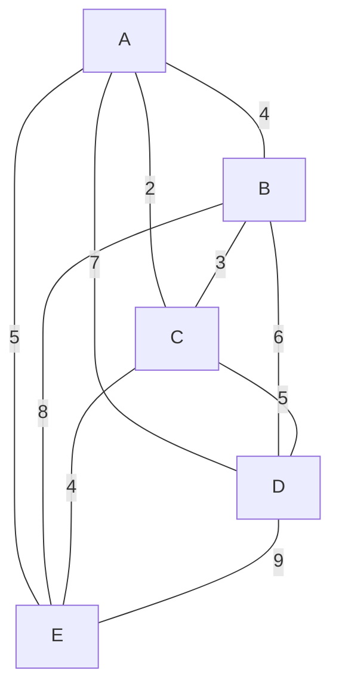
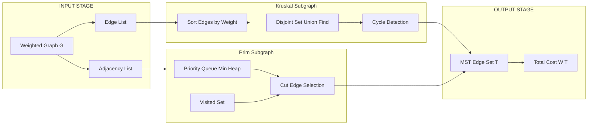
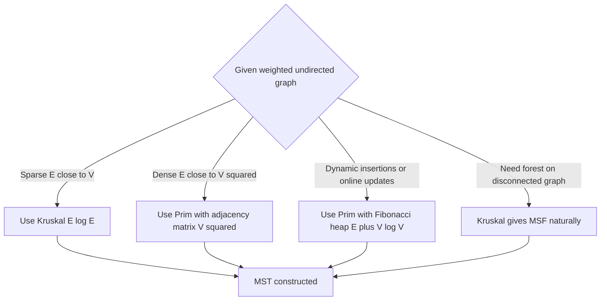

# Minimum Cost Spanning Tree – Kruskal’s and Prim’s

<!-- SECTION_1_START -->
# Minimum Cost Spanning Tree — Kruskal's and Prim's Algorithms

> [!NOTE]
> **KTU 2024 Scheme | Module 3 (Greedy Strategy) | PCCST502 — Design and Analysis of Algorithms**
> This topic carries high weightage in ESE questions and is a **mandatory expected outcome (CO3: Apply greedy strategy to optimization problems)**. Both Kruskal's and Prim's are **classic exam favorites** because they let the examiner test (i) greedy choice proof, (ii) optimal substructure, and (iii) trace + complexity in a single question.

---

## 1.1 Formal Definition (KTU Syllabus Terminology)

A **Spanning Tree** of a connected, undirected graph $G = (V, E)$ with $\vert V \vert = n$ vertices is a subgraph that:
1. Contains **all $n$ vertices** of $G$.
2. Is a **tree** (i.e., connected and acyclic).
3. Therefore has exactly $n - 1$ edges.

A **Minimum Cost Spanning Tree (MCST)** or **Minimum Spanning Tree (MST)** is a spanning tree whose sum of edge weights is **minimum** among all possible spanning trees of $G$.

$$
W(T_{MST}) \;=\; \min_{\forall \text{ spanning trees } T} \sum_{(u,v) \in T} w(u,v)
$$

> [!IMPORTANT]
> **Why "Cost"?** In KTU/Kerala board notation, "cost" and "weight" mean the same thing — the numerical value on the edge (e.g., distance in km, laying cost in ₹, latency in ms). The algorithm is identical whether you call it Kruskal's on weighted graphs or Prim's on weighted graphs.

---

## 1.2 Conceptual Analogy — The "Cable Laying" Intuition

Imagine you are the **BSNL/Reliance Jio network planner** for 6 towns in Kerala. You must connect every town with optical fibre cable, but:
- Laying cable between every pair of towns is wasteful and expensive.
- The total cost depends on the **distance** between towns.
- You still need every town connected (no isolated town).
- You must avoid laying redundant cables that form loops (they cost money but add zero connectivity).

> **The Greedy Insight:** At every step, lay the **cheapest available cable that does not create a loop** and does not leave a town disconnected. After you lay $n-1$ cables for $n$ towns, you have the **Minimum Cost Spanning Tree** — the cheapest possible network that still connects everyone.

| Engineering Reality | Graph-Theoretic Counterpart |
|---|---|
| Towns (nodes) | Vertices $V$ |
| Possible cable routes (edges) | Edges $E$ |
| Laying cost / distance (₹) | Edge weight $w(u,v)$ |
| Final loop-free connected network | Spanning Tree |
| Cheapest such network | **Minimum Cost Spanning Tree** |

---

## 1.3 Why Both Kruskal's and Prim's Exist (Family Picture)

Both algorithms are **Greedy**, but they differ in *how* they pick the next edge:

- **Kruskal's Algorithm** — Edge-centric: at each step, pick the **lightest remaining edge** that does **not form a cycle** across the whole forest.
- **Prim's Algorithm** — Vertex-centric: grow **one single tree** by repeatedly adding the lightest edge that connects a new vertex to the tree.

> [!TIP]
> **Memory trick for KTU viva:** *"Kruskal **K**eeps many small trees (a forest) until the end; **P**rim picks a starting vertex and grows one tree."*

---

> [!VISUALIZATION CONTROL]
> **Concept:** Spanning Tree vs. MST on a 5-vertex graph
> **GeoGebra / Desmos Input:**
> * Vertices: $A=(0,2),\ B=(2,3),\ C=(4,2),\ D=(3,0),\ E=(1,0)$
> * Edges (weight): $AB=4,\ AC=2,\ AD=7,\ AE=5,\ BC=3,\ BD=6,\ BE=8,\ CD=5,\ CE=4,\ DE=9$
> **Visual Description:** You will see that the highlighted MST (one of several) uses edges $AC,\ BC,\ CD,\ DE$ with total cost $2+3+5+9=19$, while other spanning trees cost more. A spanning tree is any connected acyclic subgraph using all 5 vertices and exactly 4 edges; the MST is the cheapest such set.

<!-- SECTION_1_END -->

<!-- SECTION_2_START -->
# Deep Theoretical Analysis & KTU High-Yield Formula Sheet

## 2.1 The Three Foundational Properties of MST

These properties are the **core of every proof** KTU expects you to write. Memorize them with their exact wording.

### Property 1 — Cut Property (The Engine Behind Prim's)
> **Statement:** For any **cut** $(S, V \setminus S)$ of the vertex set, the **minimum-weight edge crossing the cut** belongs to *some* MST.
>
> *Why?* If an MST $T$ does not contain this lightest crossing edge $e_{\min}$, then $T \cup \{e_{\min}\}$ contains a cycle. That cycle must contain *some* edge $e'$ crossing the same cut, with $w(e') \ge w(e_{\min})$. Swapping $e'$ for $e_{\min}}$ gives a spanning tree no heavier than $T$, so $T$ was not minimum — contradiction.

### Property 2 — Cycle Property (The Engine Behind Kruskal's)
> **Statement:** For any **cycle** $C$ in the graph, the **maximum-weight edge** in $C$ is **not** in any MST (provided all edge weights are distinct; otherwise it is in *no* MST of strictly minimum weight).
>
> *Why?* Removing the heaviest edge in a cycle keeps connectivity intact (other paths remain) and can only reduce (or keep) total cost. So no MST needs it.

### Property 3 — Optimal Substructure
> Removing any edge from an MST splits it into two smaller subtrees, each of which is itself an MST of the corresponding induced subproblem. This is what enables **greedy recursion**.

---

## 2.2 Kruskal's Algorithm — Operational Logic

**Input:** Connected, undirected, weighted graph $G = (V, E)$.
**Output:** MST $T$ with $n-1$ edges.

### Logic Steps (in board-friendly bullets)

1. **Sort** all $m$ edges in **non-decreasing order** of weight: $e_1, e_2, \ldots, e_m$ with $w(e_1) \le w(e_2) \le \cdots \le w(e_m)$.
2. Initialize $T \gets \emptyset$ and create a **disjoint-set (Union-Find)** of $n$ singleton components, one per vertex.
3. For each edge $e_i = (u,v)$ in the sorted order:
    * **FIND** the root of $u$ and the root of $v$.
    * If $\text{FIND}(u) \ne \text{FIND}(v)$ → the edge **does not form a cycle** → **add $e_i$ to $T$** and **UNION** the two components.
    * Else → the edge forms a cycle → **reject** $e_i$ and move on.
4. **Stop** when $T$ contains $n-1$ edges. (Or when all edges are exhausted.)

### Cycle Detection Trick
Two vertices $u$ and $v$ are in the **same connected component** ⇔ the path between them already exists ⇔ adding edge $(u,v)$ would **close a loop**. The **Disjoint Set ADT** (with *path compression* + *union by rank*) makes this check in amortized $\alpha(n) \approx O(1)$ time.

---

## 2.3 Prim's Algorithm — Operational Logic

**Input:** Connected, undirected, weighted graph $G = (V, E)$.
**Output:** MST $T$.

### Logic Steps

1. Pick an **arbitrary start vertex** $r$. Initialize $V_T = \{r\}$, $E_T = \emptyset$.
2. Repeat until $\vert V_T \vert = n$:
    * Examine all edges $(u, v)$ with $u \in V_T$ and $v \notin V_T$. (These are the **frontier / cut edges**.)
    * Pick the one with **minimum weight** — call it $(u^*, v^*)$.
    * Add $v^*$ to $V_T$ and $(u^*, v^*)$ to $E_T$.
3. Return $T = (V_T, E_T)$.

> [!IMPORTANT]
> Prim's algorithm always produces a **single connected tree** that grows outward, never a forest. This is the key difference from Kruskal's, which starts as a **forest** of singletons.

### Speed-Up with Priority Queue
Maintain a **min-heap (priority queue)** keyed on edge weight for every vertex not yet in the tree. The "extract-min" gives the next vertex to add in $O(\log n)$. Updating a neighbour's key takes $O(\log n)$ (with **Decrease-Key**). For sparse graphs this is dramatically faster than scanning all $V$ rows of an adjacency matrix.

---

## 2.4 KTU Formula Sheet / Cheat Sheet

> [!IMPORTANT]
> The following table is **the only set of formulas** you need to remember for the ESE. Memorize the *three* complexity columns for Prim's — this is a favourite 2-mark sub-question.

### Table 2.1 — Master Cheat Sheet for MST Algorithms

| # | Aspect | Kruskal's Algorithm | Prim's Algorithm |
|---|---|---|---|
| 1 | Greedy choice | Lightest edge that doesn't form a cycle | Lightest edge crossing the cut $(V_T, V \setminus V_T)$ |
| 2 | Data structure used | Disjoint Set (Union-Find) + sorted edge list | Priority Queue (min-heap) or Adjacency matrix scan |
| 3 | Intermediate structure | Forest of trees (initially $n$ singletons) | Single growing tree (initially $\{r\}$) |
| 4 | Input representation | Edge list (works for **sparse** graphs) | Adjacency list / matrix (works for **dense** graphs) |
| 5 | Sorting step | Edges sorted: $O(E \log E)$ | Vertices keyed in PQ: $O(V \log V)$ per extract |
| 6 | Time — naive | $O(E \log E)$ | $O(V^2)$ (matrix scan to find min edge) |
| 7 | Time — with heap | — | $O(E \log V)$ with binary heap |
| 8 | Time — Fibonacci heap | — | $O(E + V \log V)$ (theoretical best) |
| 9 | Space | $O(E + V)$ for edge list + DSU | $O(V)$ for key/parent arrays + PQ |
| 10 | Cycle handling | Cycle test via **FIND** on DSU | **Impossible by construction** (tree grows into fresh vertices) |
| 11 | Best suited when | Graph is **sparse** ($E \approx V$) | Graph is **dense** ($E \approx V^2$) |
| 12 | Disconnected graph | Produces a **Minimum Spanning Forest** (one tree per component) | Needs a fresh start vertex per component to do the same |
| 13 | Result guaranteed | MST (if connected, weighted) | MST (if connected, weighted) |
| 14 | Output size | Always $V - 1$ edges | Always $V - 1$ edges |

### Table 2.2 — Key Symbols

| Symbol | Meaning | Typical Range |
|---|---|---|
| $n$ or $\vert V \vert$ | Number of vertices | 2 – 10⁵ in KTU problems |
| $m$ or $\vert E \vert$ | Number of edges | 1 – 10⁵ in KTU problems |
| $w(u,v)$ | Weight of edge $(u,v)$ | Positive integer |
| $\alpha(n)$ | Inverse Ackermann (DSU amortized) | $\le 4$ for any $n$ in the universe |
| $T$ | The growing MST (set of edges) | Size $= n-1$ |

---

## 2.5 Real-World Engineering Utility

| Domain | Application of MST |
|---|---|
| **Telecom / BSNL** | Cheapest fibre layout connecting all cities |
| **VLSI / PCB Design** | Minimum wire length to connect all chip pins |
| **Computer Networks** | Spanning Tree Protocol (STP / RSTP) in Ethernet switches — prevents broadcast loops. Modern variant: **Multiple Spanning Tree Protocol (MSTP)** in IEEE 802.1s |
| **Cluster Analysis** | Single-linkage clustering in Data Mining uses MST |
| **Image Segmentation** | Minimum spanning tree-based image segmentation in CV |
| **Approximation Algorithms** | MST-based **2-approximation** for the Travelling Salesman Problem on metric graphs |
| **Civil Engineering** | Minimum-pipeline networks for water/gas distribution |

<!-- SECTION_2_END -->

<!-- SECTION_3_START -->
# Step-by-Step Derivations, Trace & Code Implementation

> [!WARNING]
> **KTU Examiner's Rule (read this first):** When asked to *"construct the MST using Kruskal's/Prim's and show the steps"*, you **must** show: (1) the sorted edge list / start vertex, (2) the **decision** for every edge (accept / reject), (3) the **running components / visited set** after each step, and (4) the **final total cost**. Skipping any one of these is the #1 reason students lose 3–4 marks.

---

## 3.1 Worked Example — The Canonical KTU Graph

Consider the following undirected weighted graph with $V = \{A, B, C, D, E\}$ and edges as listed in Table 3.1.

### Table 3.1 — Edge List

| Edge | Weight |
|---|---|
| (A, B) | 4 |
| (A, C) | 2 |
| (A, D) | 7 |
| (A, E) | 5 |
| (B, C) | 3 |
| (B, D) | 6 |
| (B, E) | 8 |
| (C, D) | 5 |
| (C, E) | 4 |
| (D, E) | 9 |

---

## 3.2 Kruskal's Algorithm — Exhaustive Step-by-Step Trace

### Step 0 — Sort the Edges

$$
\begin{aligned}
e_1 &= (A,C),\ w=2 \\
e_2 &= (B,C),\ w=3 \\
e_3 &= (A,B),\ w=4 \\
e_4 &= (C,E),\ w=4 \\
e_5 &= (A,E),\ w=5 \\
e_6 &= (C,D),\ w=5 \\
e_7 &= (B,D),\ w=6 \\
e_8 &= (A,D),\ w=7 \\
e_9 &= (B,E),\ w=8 \\
e_{10} &= (D,E),\ w=9
\end{aligned}
$$

### Step 1 — Initialize Disjoint Sets

Each vertex is its own component:
$$
\{A\} \quad \{B\} \quad \{C\} \quad \{D\} \quad \{E\}
$$

### Step 2 — Process Each Edge in Sorted Order

| Step | Edge | Weight | FIND(u) | FIND(v) | Cycle? | Action | Components After |
|---|---|---|---|---|---|---|---|
| 1 | (A,C) | 2 | A | C | No | **ACCEPT** | {A,C} {B} {D} {E} |
| 2 | (B,C) | 3 | B | C (in {A,C}) | No | **ACCEPT** | {A,B,C} {D} {E} |
| 3 | (A,B) | 4 | A (in {A,B,C}) | B (in {A,B,C}) | **Yes** | REJECT | {A,B,C} {D} {E} |
| 4 | (C,E) | 4 | C (in {A,B,C}) | E | No | **ACCEPT** | {A,B,C,E} {D} |
| 5 | (A,E) | 5 | A (in {A,B,C,E}) | E (in {A,B,C,E}) | **Yes** | REJECT | {A,B,C,E} {D} |
| 6 | (C,D) | 5 | C (in {A,B,C,E}) | D | No | **ACCEPT** | {A,B,C,D,E} ← STOP |
| 7 | (B,D) | 6 | — | — | — | (4 edges already) | — |
| ... | ... | ... | ... | ... | ... | ... | ... |

### Step 3 — Final MST

$$
T = \{(A,C),\ (B,C),\ (C,E),\ (C,D)\}
$$

$$
W(T_{MST}) = 2 + 3 + 4 + 5 \;=\; \mathbf{14}
$$

> [!NOTE]
> **Number of edges check:** $\vert V \vert - 1 = 5 - 1 = 4$ edges. ✅ **Connected check:** A → C → B, C → D, C → E. Every vertex is reachable. ✅ **Acyclic check:** No edge in $T$ closes a loop. ✅

---

## 3.3 Prim's Algorithm — Exhaustive Step-by-Step Trace

We use the **same graph** but starting at vertex $A$.

### Initialization

$$
V_T = \{A\}, \quad E_T = \emptyset, \quad \text{Key} = \{A:-, B:4, C:2, D:7, E:5\}
$$

(The "key" of a vertex outside $V_T$ is the minimum weight of an edge from it to any vertex inside $V_T$.)

### Iteration-by-Iteration Trace

| Iter | Choose min-key vertex | Edge added | Weight | $V_T$ after | Running cost |
|---|---|---|---|---|---|
| 1 | C (key=2) | (A, C) | 2 | {A, C} | 2 |
| 2 | B (key=3, via C) | (B, C) | 3 | {A, B, C} | 5 |
| 3 | E (key=4, via C) | (C, E) | 4 | {A, B, C, E} | 9 |
| 4 | D (key=5, via C) | (C, D) | 5 | {A, B, C, D, E} | **14** |
| — | STOP (|V_T| = 5) | — | — | — | — |

### Final MST (Prim's)

$$
T = \{(A,C),\ (B,C),\ (C,E),\ (C,D)\}, \quad W(T) = \mathbf{14}
$$

> [!TIP]
> **Cross-check:** Both algorithms gave the **same total cost = 14**, and the **same edge set** in this case. This is expected: an MST is **unique** when all edge weights are distinct; with ties, multiple MSTs may exist with the **same minimum cost**.

---

## 3.4 Mathematical Derivation — Why Greedy Works for MST

> KTU often asks: *"Prove that Kruskal's algorithm produces an MST"* (3 marks) or *"Justify the greedy choice property"* (2 marks).

### Proof Sketch (Kruskal's)

**Setup:** Let $T_K$ be the tree built by Kruskal's, $T^*$ any MST.

**Induction hypothesis:** After processing the first $i$ edges of the sorted list, $T_K$'s accepted edges form a subset of *some* MST.

**Base case:** $i = 0$. $T_K = \emptyset \subset T^*$. True.

**Inductive step:** Consider the $(i+1)$-th sorted edge $e_{i+1}$. Kruskal's either rejects it (cycle) or accepts it.

*Case A — Rejected:* $e_{i+1}$ closes a cycle with edges already in $T_K$. By the **Cycle Property**, the heaviest edge in that cycle is not in any MST. (If it is the unique heaviest, Kruskal's is correct to skip it. If tied, Kruskal's still produces *an* MST of equal cost.)

*Case B — Accepted:* Suppose $e_{i+1} \notin T^*$. Add $e_{i+1}$ to $T^*$ — a cycle forms. That cycle contains some edge $e'$ crossing the same cut as $e_{i+1}$ (the two endpoints of $e_{i+1}$ are in different components of $T_K$). By the **Cut Property**, $w(e_{i+1}) \le w(e')$. So $T^{*\prime} = T^* \setminus \{e'\} \cup \{e_{i+1}\}$ is a spanning tree with $w(T^{*\prime}) \le w(T^*)$, i.e., it is also an MST and contains $T_K$'s accepted edges so far. ∎

---

## 3.5 Python Implementation — Both Algorithms (Exam-Ready)

### 3.5.1 Disjoint Set (Union-Find) Used by Kruskal's

```python
class DisjointSet:
    """Union-Find with path compression + union by rank.
    Used by Kruskal's to detect cycles in amortized O(alpha(n))."""

    def __init__(self, vertices: list[str]) -> None:
        self.parent: dict[str, str] = {v: v for v in vertices}
        self.rank: dict[str, int] = {v: 0 for v in vertices}

    def find(self, x: str) -> str:
        """Finds the root of x with path compression."""
        if self.parent[x] != x:
            self.parent[x] = self.find(self.parent[x])
        return self.parent[x]

    def union(self, x: str, y: str) -> bool:
        """Unions the sets of x and y. Returns True if merged, False if already same set."""
        root_x, root_y = self.find(x), self.find(y)
        if root_x == root_y:
            return False  # Already in same set -> would form a cycle
        # Union by rank
        if self.rank[root_x] < self.rank[root_y]:
            root_x, root_y = root_y, root_x
        self.parent[root_y] = root_x
        if self.rank[root_x] == self.rank[root_y]:
            self.rank[root_x] += 1
        return True
```

### 3.5.2 Kruskal's Algorithm (Edge-Centric)

```python
import heapq
from typing import Hashable, TypeVar

V = TypeVar("V", bound=Hashable)


def kruskal_mst(
    vertices: list[V],
    edges: list[tuple[float, V, V]],
) -> tuple[list[tuple[V, V]], float]:
    """
    Kruskal's MST.
    :param vertices: list of vertex labels
    :param edges: list of (weight, u, v) tuples (undirected)
    :return: (mst_edges, total_cost)
    """
    # Step 1: Sort edges by weight (Kruskal needs the lightest first)
    edges_sorted = sorted(edges, key=lambda e: e[0])

    # Step 2: Initialize DSU
    dsu = DisjointSet(vertices)

    # Step 3: Greedy selection
    mst_edges: list[tuple[V, V]] = []
    total_cost = 0.0

    for weight, u, v in edges_sorted:
        if dsu.union(u, v):                # FIND(u) != FIND(v) -> no cycle
            mst_edges.append((u, v))
            total_cost += weight
            if len(mst_edges) == len(vertices) - 1:
                break                      # Early stop: we have V-1 edges

    if len(mst_edges) != len(vertices) - 1:
        raise ValueError("Graph is disconnected; no spanning tree exists.")

    return mst_edges, total_cost


# --- Test on the canonical KTU example ---
if __name__ == "__main__":
    V_list = ["A", "B", "C", "D", "E"]
    E_list = [
        (4, "A", "B"), (2, "A", "C"), (7, "A", "D"), (5, "A", "E"),
        (3, "B", "C"), (6, "B", "D"), (8, "B", "E"),
        (5, "C", "D"), (4, "C", "E"), (9, "D", "E"),
    ]
    mst, cost = kruskal_mst(V_list, E_list)
    print("Kruskal's MST edges:", mst)
    print("Total cost:", cost)   # Expected: 14
```

### 3.5.3 Prim's Algorithm (Vertex-Centric, Min-Heap)

```python
import heapq
from typing import Hashable, TypeVar

V = TypeVar("V", bound=Hashable)


def prim_mst(
    vertices: list[V],
    adj: dict[V, list[tuple[V, float]]],
    start: V,
) -> tuple[list[tuple[V, V]], float]:
    """
    Prim's MST using a min-heap (priority queue).
    :param vertices: list of vertex labels
    :param adj: adjacency list {u: [(v, w), ...]}
    :param start: arbitrary starting vertex
    :return: (mst_edges, total_cost)
    """
    visited: set[V] = {start}
    mst_edges: list[tuple[V, V]] = []
    total_cost = 0.0
    # Heap entries: (weight, from, to)
    heap: list[tuple[float, V, V]] = [(w, start, v) for v, w in adj[start]]

    heapq.heapify(heap)

    while heap and len(mst_edges) < len(vertices) - 1:
        weight, u, v = heapq.heappop(heap)
        if v in visited:
            continue                       # Skip: would form a cycle
        visited.add(v)
        mst_edges.append((u, v))
        total_cost += weight
        for nxt, w in adj[v]:
            if nxt not in visited:
                heapq.heappush(heap, (w, v, nxt))

    if len(mst_edges) != len(vertices) - 1:
        raise ValueError("Graph is disconnected; no spanning tree exists.")

    return mst_edges, total_cost


# --- Test on the canonical KTU example ---
if __name__ == "__main__":
    V_list = ["A", "B", "C", "D", "E"]
    adj: dict[str, list[tuple[str, float]]] = {
        "A": [("B", 4), ("C", 2), ("D", 7), ("E", 5)],
        "B": [("A", 4), ("C", 3), ("D", 6), ("E", 8)],
        "C": [("A", 2), ("B", 3), ("D", 5), ("E", 4)],
        "D": [("A", 7), ("B", 6), ("C", 5), ("E", 9)],
        "E": [("A", 5), ("B", 8), ("C", 4), ("D", 9)],
    }
    mst, cost = prim_mst(V_list, adj, start="A")
    print("Prim's MST edges:", mst)
    print("Total cost:", cost)             # Expected: 14
```

### 3.5.4 Complexity Verification

| Operation | Kruskal's | Prim's (heap) | Prim's (matrix) |
|---|---|---|---|
| Sorting / heap build | $O(E \log E)$ | $O(V)$ | — |
| Main loop | $O(E \cdot \alpha(n))$ | $O((V+E) \log V)$ | $O(V^2)$ |
| **Effective total** | $\mathbf{O(E \log E)}$ | $\mathbf{O(E \log V)}$ | $\mathbf{O(V^2)}$ |
| Best for | Sparse | Sparse / Medium | Dense |

<!-- SECTION_3_END -->

<!-- SECTION_4_START -->
# Structural Diagrams & Schematics

> [!NOTE]
> All diagrams below are rendered using **Mermaid** (KTU accepts hand-drawn equivalents). Node labels are **plain uppercase alphanumeric** (no bold/markdown inside quotes) to comply with the Mermaid safety rules.

---

## 4.1 Input Graph (Canonical Example)



---

## 4.2 Flowchart — Kruskal's Algorithm

```mermaid
flowchart TD
    START([START]) --> INP[/Read graph G V E/]
    INP --> SORT[Sort all E edges by weight ascending]
    SORT --> INITDSU[Initialize DSU: n singleton sets]
    INITDSU --> TINIT[T equals empty set, cost equals 0]
    TINIT --> LOOP{For each edge u v w in sorted order}
    LOOP --> FIND[Find root of u and root of v]
    FIND --> CHECK{Roots different?}
    CHECK -- No --> SKIP[Reject edge forms cycle] --> LOOP
    CHECK -- Yes --> ADD[Add edge to T and UNION u v]
    ADD --> COST[Add w to total cost]
    COST --> SIZECK{|T| equals V minus 1?}
    SIZECK -- No --> LOOP
    SIZECK -- Yes --> OUT[/Output MST T and total cost/]
    LOOP -->|All edges processed| OUT
    OUT --> STOP([STOP])
```

---

## 4.3 Flowchart — Prim's Algorithm

```mermaid
flowchart TD
    PSTART([START]) --> PICK[Pick arbitrary start vertex r]
    PICK --> VSET[V_T equals r, E_T equals empty]
    VSET --> PUSH[Push all edges from r into min-heap PQ]
    PUSH --> PLOOP{Is PQ empty or |V_T| equals V?}
    PLOOP -- Yes --> PDONE[/Output MST E_T/]
    PLOOP -- No --> POP[Pop min weight edge u v from PQ]
    POP --> PVISIT{v already in V_T?}
    PVISIT -- Yes --> PLOOP
    PVISIT -- No --> PADD[Add v to V_T and u v to E_T]
    PADD --> PADJ[Push all edges from v to unvisited vertices into PQ]
    PADJ --> PLOOP
    PDONE --> PSTOP([STOP])
```

---

## 4.4 Block Diagram — Data Flow of MST Construction



---

## 4.5 Sequential Processing Topology Matrix (When a Physical Free-Body / Circuit Drawing Is Not Applicable)

| Stage | Kruskal's State | Prim's State |
|---|---|---|
| **t = 0** | $n$ singleton components; $T=\emptyset$ | $V_T = \{r\}$; $E_T = \emptyset$ |
| **t = 1** | 1 edge accepted → 2-vertex component | 1 edge accepted → 2-vertex tree |
| **t = k** | $k$ edges in $T$; some components merged | $k+1$ vertices in $V_T$ |
| **t = n-1** | $T$ has $n-1$ edges; single component | $V_T = V$; $T$ has $n-1$ edges |
| **Termination** | $T$ is the MST (or MSF if disconnected) | $T$ is the MST (or MSF if run per component) |

---

## 4.6 Comparison Flow — When to Choose Which Algorithm



<!-- SECTION_4_END -->

<!-- SECTION_5_START -->
# KTU 2024 Scheme Examination Question Bank & Topic Recap

> [!WARNING]
> **KTU Examiner's Valuation Pitfall (READ BEFORE WRITING):**
> 1. **Always state the starting vertex** for Prim's — failing this costs 1 mark.
> 2. **Show the sorted edge list** for Kruskal's — the question is incomplete without it.
> 3. **Do not skip** rejected edges; the examiner wants to see *every* decision. Writing only the accepted edges usually means $\le 60\%$ marks.
> 4. **Cycle detection must use DSU reasoning** ("FIND(A) = FIND(B) ⇒ same component ⇒ cycle") — vague phrases like "would form a loop" are not enough.
> 5. **Final cost = sum of accepted edge weights**, not the count of edges. This is the most common arithmetic error.
> 6. **Time complexity must be quoted with the data structure** — e.g., "$O(E \log E)$ using sorted edge list and Union-Find", not just "$O(E \log V)$" for Kruskal's.

---

## Part A — Short Answer (3 Marks Each)

### Q1. [KTU University Exam – Dec 2023] — CO2, Remember

**Define Minimum Cost Spanning Tree. State any two applications of MST.**

**Model Answer (3 marks):**

A **Minimum Cost Spanning Tree (MST)** of a connected, undirected, weighted graph $G=(V,E)$ is a spanning tree (i.e., a connected, acyclic subgraph containing all vertices of $G$) whose total edge weight is minimum among all such spanning trees. Formally,
$$
W(T_{MST}) = \min_{T \text{ spanning tree}} \sum_{(u,v) \in T} w(u,v).
$$

**Applications** *(any two)*:
1. **Network design** — laying the minimum-length cable/fibre that connects all cities.
2. **Cluster analysis** — single-linkage clustering in data mining builds clusters from MST by removing the heaviest edges.
3. **Approximation algorithm for Travelling Salesman** — a depth-first traversal of the MST gives a 2-approximation on metric instances.
4. **Spanning Tree Protocol (STP / IEEE 802.1D)** in Ethernet switches to prevent broadcast loops.

> **Valuation Key:** [Definition 2 marks] + [Two applications 1 mark = 0.5 each].

---

### Q2. [KTU University Exam – July 2024] — CO3, Understand

**Differentiate between Kruskal's and Prim's algorithms on the basis of: (a) growth strategy, (b) data structure used, (c) time complexity.**

**Model Answer (3 marks):**

| # | Basis | Kruskal's Algorithm | Prim's Algorithm |
|---|---|---|---|
| (a) | Growth strategy | Edge-centric — picks the globally lightest edge that does not form a cycle; intermediate structure is a **forest** | Vertex-centric — grows **one single tree** by repeatedly adding the lightest edge crossing the cut |
| (b) | Data structure | Disjoint Set (Union-Find) for cycle detection + sorted edge list | Priority queue (min-heap) for selecting the lightest crossing edge |
| (c) | Time complexity | $O(E \log E)$ | $O(E \log V)$ with binary heap; $O(V^2)$ with adjacency matrix |

> **Valuation Key:** [1 mark per correct row].

---

## Part B — Long Answer (14 Marks, Module-Internal Choice)

> *For each question, KTU's ESE pattern splits marks as: (a) 7 marks + (b) 7 marks, with sub-parts (i) and (ii) where applicable. Cognitive levels escalate from Understand → Apply → Analyse.*

---

### Question A (14 Marks) — [KTU University Exam – July 2024]

**(a)** Construct the Minimum Cost Spanning Tree for the graph in **Figure Q-A** using **Kruskal's algorithm**. Show the sorted edge list, the decision at every step, and compute the total cost. **(7 marks)**

**(b)** Explain the **cycle property** and **cut property** of MSTs. Use these to justify why the greedy choice in Kruskal's algorithm is correct. **(7 marks)**

**Figure Q-A — Input Graph:**

| Edge | (1,2) | (1,3) | (1,4) | (2,3) | (2,4) | (3,4) |
|---|---|---|---|---|---|---|
| Weight | 10 | 6 | 5 | 4 | 3 | 7 |

*(A 4-vertex complete graph for clarity.)*

---

#### Model Solution — Part (a) [7 marks]

**Step 1 — Sort edges by weight** [1 mark]:

$$
(2,4):3,\quad (2,3):4,\quad (1,4):5,\quad (1,3):6,\quad (3,4):7,\quad (1,2):10
$$

**Step 2 — Initialize DSU components** [1 mark]: $\{1\},\{2\},\{3\},\{4\}$

**Step 3 — Process each edge** [4 marks]:

| Step | Edge | Weight | FIND(u), FIND(v) | Cycle? | Decision | Components |
|---|---|---|---|---|---|---|
| 1 | (2,4) | 3 | 2, 4 | No | **Accept** | {2,4} {1} {3} |
| 2 | (2,3) | 4 | 2, 3 | No | **Accept** | {2,3,4} {1} |
| 3 | (1,4) | 5 | 1, 4 (in {2,3,4}) | No | **Accept** | {1,2,3,4} |
| 4 | (1,3) | 6 | — | — | STOP (have 3 edges = 4−1) | — |

**Step 4 — Final answer** [1 mark]:
$$
T = \{(2,4), (2,3), (1,4)\}, \quad W(T) = 3 + 4 + 5 = \mathbf{12}
$$

---

#### Model Solution — Part (b) [7 marks]

**Cycle Property** [1.5 marks]:
> For any cycle $C$ in a weighted graph, the **maximum-weight edge** of $C$ does **not** belong to any MST (when all edge weights are distinct; in general, *no* MST of strictly minimum weight needs it). Rationale — removing it preserves connectivity (other paths in the cycle exist) and cannot increase total cost.

**Cut Property** [1.5 marks]:
> For any cut $(S, V \setminus S)$ of the vertex set, the **minimum-weight edge** crossing the cut is contained in *some* MST. Rationale — if an MST $T^*$ omitted it, $T^* \cup \{e_{\min}\}$ would have a cycle containing some other crossing edge $e'$ with $w(e') \ge w(e_{\min})$, allowing an exchange that does not increase weight.

**Justification of Kruskal's greedy choice** [4 marks]:
Kruskal's algorithm always picks the globally lightest edge that does not create a cycle. Suppose at some step the lightest acceptable edge is $e = (u,v)$ but $e \notin T^*$ (some MST). Adding $e$ to $T^*$ creates a cycle. That cycle must include a different edge $e'$ whose endpoints lie in different DSU components — i.e., $e'$ also crosses the same cut as $e$. By the **cut property**, $w(e) \le w(e')$. Exchanging $e'$ for $e$ yields a spanning tree no heavier than $T^*$, so the original greedy edge is justified. By induction, the full $T_K$ is an MST. ∎

---

### Question B (14 Marks, Alternative Choice) — [KTU University Exam – Dec 2023]

**(a)** Apply **Prim's algorithm** starting from vertex $1$ on the graph in **Figure Q-B**. Show the visited set and the chosen edge at every step. Compute the total cost. **(7 marks)**

**(b)** Analyse the time complexity of Prim's algorithm with (i) adjacency matrix and (ii) binary heap. State which input representation is preferred for dense vs. sparse graphs. **(7 marks)**

**Figure Q-B — Input Graph:**

| Vertex | Neighbours (weight) |
|---|---|
| 1 | 2(4), 3(2), 4(7) |
| 2 | 1(4), 3(3), 4(6) |
| 3 | 1(2), 2(3), 4(5) |
| 4 | 1(7), 2(6), 3(5) |

---

#### Model Solution — Part (a) [7 marks]

**Initialization** [1 mark]: $V_T = \{1\}$, key: $\{2:4, 3:2, 4:7\}$, $E_T=\emptyset$.

**Iteration trace** [5 marks]:

| Iter | Choose min | Edge | Weight | $V_T$ after | Running cost |
|---|---|---|---|---|---|
| 1 | 3 (key=2) | (1, 3) | 2 | {1, 3} | 2 |
| 2 | 2 (key=3, via 3) | (2, 3) | 3 | {1, 2, 3} | 5 |
| 3 | 4 (key=5, via 3) | (3, 4) | 5 | {1, 2, 3, 4} | 10 |

**Final MST** [1 mark]:
$$
T = \{(1,3), (2,3), (3,4)\}, \quad W(T) = 2 + 3 + 5 = \mathbf{10}
$$

> **Valuation Key:** [Iteration table 5 marks: 1 mark for each of 3 rows + 1 for header + 1 for stop-condition] + [Final cost 1 mark].

---

#### Model Solution — Part (b) [7 marks]

**(i) Adjacency matrix — $O(V^2)$** [3 marks]:
At every step, we must scan all $V$ vertices to find the minimum-key vertex not yet in the tree → $O(V)$. We also update keys of vertices adjacent to the newly added one by checking the matrix row → $O(V)$ per iteration (amortized). Across $V$ iterations this is
$$
O(V) + O(V) + \cdots + O(V) \;=\; \mathbf{O(V^2)}.
$$

**(ii) Binary heap (min-PQ with Decrease-Key) — $O(E \log V)$** [3 marks]:
- Each vertex is extracted from the heap exactly once: $V$ extractions × $O(\log V)$ = $O(V \log V)$.
- Each edge $(u,v)$ may trigger at most one **decrease-key** operation (when $u$ enters the tree and $v$ is not yet there): $E$ operations × $O(\log V)$ = $O(E \log V)$.
- Total: $\mathbf{O((V + E) \log V) = O(E \log V)}$ since $E \ge V - 1$ in any connected graph.

**Choice summary** [1 mark]:
- **Adjacency matrix** is preferred for **dense** graphs ($E \approx V^2$).
- **Binary heap + adjacency list** is preferred for **sparse** graphs ($E \approx V$).

---

> [!WARNING]
> **Valuation Pitfalls Specific to Part B:**
> 1. Prim's: do **not** scan edges from **all** vertices — only from the **cut** (tree boundary). Mark deduction if you do.
> 2. Kruskal's: must show DSU state **after every UNION**, not just at the end. Showing only the final MST = lose 2 marks.
> 3. Complexity table: writing just "$O(E \log V)$" for both algorithms is wrong. Mention the **data structure explicitly** to get full credit.

---

## Topic Recap & Important Things to Remember

> 🎯 **Last-Minute Rapid Revision Checklist (KTU ESE)**

- ✅ **Spanning Tree** = connected + acyclic + uses all $V$ vertices ⇒ has exactly $V-1$ edges.
- ✅ **MST** = spanning tree of **minimum total weight**.
- ✅ **Cut Property** ⇒ the lightest edge crossing any cut is in *some* MST. *This is the engine of Prim's.*
- ✅ **Cycle Property** ⇒ the heaviest edge in any cycle is in *no* MST (when weights are distinct). *This is the engine of Kruskal's rejection step.*
- ✅ **Kruskal's** = Edge-centric, sorted edge list + Union-Find, builds a **forest**, time $O(E \log E)$, best for **sparse** graphs.
- ✅ **Prim's** = Vertex-centric, min-heap or matrix scan, grows **one tree**, time $O(E \log V)$ (heap) or $O(V^2)$ (matrix), best for **dense** graphs with matrix.
- ✅ **Union-Find** with path compression + union by rank ⇒ amortized $O(\alpha(n)) \approx O(1)$ per operation.
- ✅ An MST is **unique** iff all edge weights are distinct. With ties, multiple MSTs may exist with the **same minimum cost**.
- ✅ For a **disconnected** graph, Kruskal naturally produces a **Minimum Spanning Forest**; Prim must be re-started per component.
- ✅ **MST ≠ Shortest Path** — Prim's is *not* Dijkstra. Prim's uses an unvisited set; Dijkstra uses accumulated distances. (Confusing these is the #1 viva trap.)
- ✅ **KTU Board presentation rule:** *Always* show the sorted edge list (Kruskal's) or start vertex (Prim's); mark off the cycles clearly; write the final cost as a sum, not a single number.
- ✅ **Real-world anchor:** "Minimum cable-laying cost", "Ethernet STP loop prevention", "2-approximation of TSP on metric instances".

> 🏁 **Good luck on your KTU ESE — keep the cut property and cycle property on your fingertip, and you cannot go wrong.**

<!-- SECTION_5_END -->
