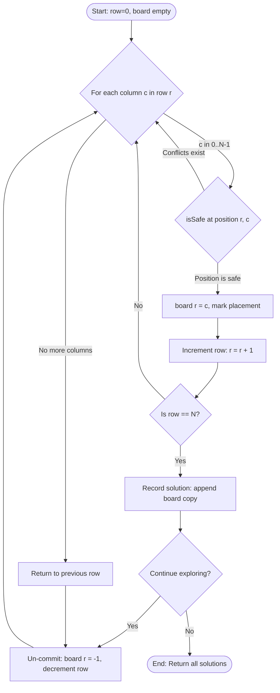
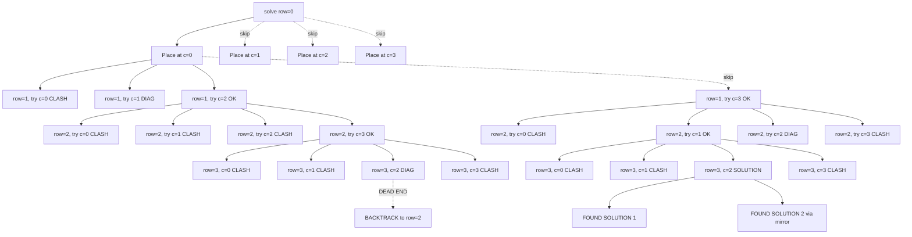
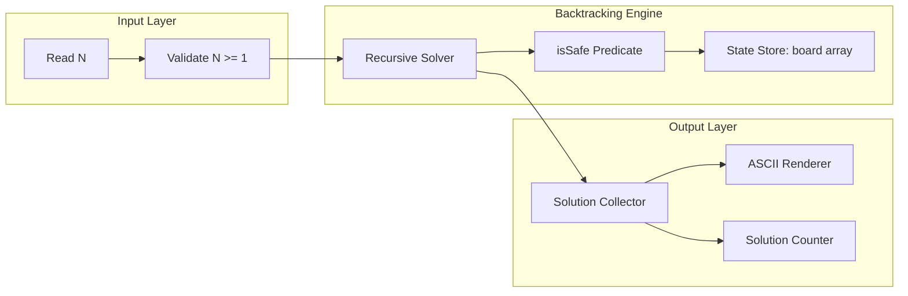
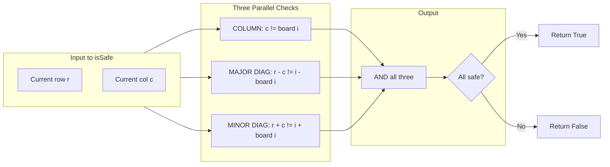

# N – Queens Problem

<!-- SECTION_1_START -->

# N-Queens Problem: Strategic Placement on a Chessboard

## 1.1 Formal Technical Definition

The **N-Queens Problem** is a classical constraint satisfaction problem (CSP) in combinatorial optimization and computational complexity theory. Formally stated, given an integer $N \ge 4$ and an $N \times N$ chessboard, the objective is to **place exactly $N$ queens on the board such that no two queens threaten each other**.

Two queens threaten each other if and only if they share at least one of the following:
- The **same row** $\Rightarrow$ horizontal attack
- The **same column** $\Rightarrow$ vertical attack
- The **same major (/) diagonal** $\Rightarrow$ left-leaning diagonal attack
- The **same minor (\\) diagonal** $\Rightarrow$ right-leaning diagonal attack

Formally, for any two queens placed at coordinates $(r_1, c_1)$ and $(r_2, c_2)$, a **valid configuration** must satisfy all four invariants simultaneously:

$$\begin{aligned}
r_1 &\neq r_2 \\
c_1 &\neq c_2 \\
r_1 - c_1 &\neq r_2 - c_2 \\
r_1 + c_1 &\neq r_2 + c_2
\end{aligned}$$

> [!IMPORTANT]
> **KTU Syllabus Highlight:** The N-Queens problem is the canonical example used to illustrate the **Backtracking paradigm**, which is the refinement of the *Brute-Force* strategy. While the problem itself is *not solved by a pure greedy choice*, the placement-by-row heuristic used inside the backtracking framework is fundamentally a **greedy row-wise commitment** — we commit to a row-by-row construction (greedy decomposition) and backtrack only when local failure is detected.

## 1.2 Intuitive Real-World Analogy: The Seating Arrangement

Imagine you are hosting a **royal banquet** with $N$ queens (each with a fiery temper). You must seat them at a round/rectangular table with $N$ rows and $N$ columns. The rules:
- **Only one queen per row** (they refuse to share a table-row).
- **Only one queen per column** (no peeking at the neighbour's plate).
- **No two on the same diagonal** (their jeweled scepters would clash diagonally across the table).

You start from the **top row** and try to seat the first queen. Once seated, you move to the next row and pick a safe column. If at some row you find **no safe column** (every column would cause a clash), you go back to the previous row, shift that queen to the next safe column, and try again. This "try, fail, retreat" behavior is precisely what a computer scientist calls **backtracking**.

> [!NOTE]
> **Why N = 1, 2, 3 has no solution but N = 4 does:**
> - $N = 1$: Trivially solvable (1 queen, 1 cell).
> - $N = 2, 3$: It is *mathematically impossible* to place $N$ non-attacking queens on an $N \times N$ board — proven by the Pigeonhole principle combined with the small surface area.
> - $N = 4$: First non-trivial solvable case, yielding **2 distinct solutions**.

## 1.3 Visualization Control

> [!VISUALIZATION CONTROL]
> **Concept:** Visualizing Safe and Attacked Cells in an 8-Queens Board State.
> **Geometric Intuition:** Plot the chessboard with the queen at position $(0, 2)$ and shade all cells under attack.
> **Coordinate System Setup (Desmos Input):**
> - `x = 0..7` (columns)
> - `y = 0..7` (rows)
> - Safe cells satisfy: $y \neq 0$ AND $x \neq 2$ AND $x - y \neq 2$ AND $x + y \neq 2$
> **Visual Description:** When a queen is placed at $(0, 2)$, you will observe a vertical strip at $x = 2$, a horizontal strip at $y = 0$, a diagonal at $x - y = 2$ (going up-right), and a diagonal at $x + y = 2$ (going down-right) — all marked as forbidden. Only the unmarked cells are candidates for the next queen placement.

---

<!-- SECTION_1_END -->

<!-- SECTION_2_START -->

# Deep Theoretical Analysis & KTU High-Yield Formula Sheet

## 2.1 Algorithmic Paradigm Decomposition

The N-Queens problem is solved by a **row-by-row greedy decomposition wrapped inside a backtracking search**. The decomposition is as follows:

- **Step 1 — Row Greedy Commitment:** We commit to placing exactly **one queen per row**, starting from row 0. This single design decision cuts the search space from $N^N$ (placing anywhere) to $N!$ (one column per row).
- **Step 2 — Constraint Propagation:** Before placing a queen in row $r$, we check the **safety** of every column $c$ against all previously placed queens in rows $0$ to $r-1$.
- **Step 3 — Backtrack on Failure:** If no column in row $r$ is safe, we return to row $r-1$ and try the next untried column there. This is the *retreat* operation.
- **Step 4 — Recursion Termination:** The recursion terminates successfully when $r == N$ (all rows filled) or terminates with no solution if the root level is exhausted.

> [!TIP]
> **Engineering Insight:** This pattern of "commit forward, retreat on failure" is the blueprint for almost every constraint solver in production — from SQL query planners to SAT solvers like MiniSAT and to VLSI chip routing algorithms.

## 2.2 The Master Safety Predicate (Core Formula)

Let $Q[0..r-1]$ be the column positions of queens already placed in rows $0$ to $r-1$. A candidate position $(r, c)$ is **safe** if and only if:

$$\text{isSafe}(r, c) \;=\; \bigwedge_{i=0}^{r-1} \left[ \; c \neq Q[i] \;\wedge\; (r - c) \neq (i - Q[i]) \;\wedge\; (r + c) \neq (i + Q[i]) \; \right]$$

| Constraint | Mathematical Form | Geometric Meaning |
|------------|-------------------|-------------------|
| **Column Clashes** | $c \neq Q[i]$ | No two queens in same column |
| **Major Diagonal (\\)** | $(r - c) \neq (i - Q[i])$ | No two queens on the descending diagonal |
| **Minor Diagonal (/)** | $(r + c) \neq (i + Q[i])$ | No two queens on the ascending diagonal |
| **Row Clashes** | Guaranteed by construction (one queen per row) | No explicit check needed |

> [!NOTE]
> **Key Insight:** Notice that we *do not need a row check* because our greedy decomposition guarantees one queen per row. This single observation reduces the 4-clause constraint to a 3-clause constraint, dramatically simplifying the predicate.

## 2.3 KTU Formula Cheat Sheet

| Parameter / Symbol | Meaning | Value / Bound |
|--------------------|---------|---------------|
| $N$ | Board dimension (rows = columns) | $N \ge 4$ for non-trivial case |
| $Q[i]$ | Column index of queen in row $i$ | Integer in $[0, N-1]$ |
| $T(N)$ | Time complexity | $\mathcal{O}(N!)$ worst case |
| $S(N)$ | Auxiliary space | $\mathcal{O}(N)$ |
| $N!$ | Search space after row greedy | Permutations of columns |
| $H(N)$ | Number of distinct solutions | $H(4)=2,\; H(8)=92,\; H(10)=724$ |
| $U(N)$ | Fundamental solutions (excluding symmetry) | $U(4)=1,\; U(8)=12,\; U(10)=92$ |
| Diagonal count | Available diagonals on $N \times N$ board | $2N - 1$ each (major + minor) |

## 2.4 Real-World Engineering Applications

| Domain | Application of N-Queens Logic |
|--------|-------------------------------|
| **VLSI Chip Design** | Routing wires so that no two cross on the same layer |
| **Parallel Memory Storage** | Allocating concurrent processes to memory banks without conflict |
| **Traffic Control Systems** | Scheduling $N$ non-conflicting flight paths across $N$ corridors |
| **Robotics Path Planning** | Multi-robot coordination where robots are "queens" and lanes are rows |
| **Cryptography / Steganography** | Generating permutation matrices used in image encryption schemes |
| **Compiler Register Allocation** | Mapping variables to non-conflicting CPU registers |

> [!IMPORTANT]
> **Theoretical Classification:** N-Queens is in **NP-Complete** when generalized (the $N \times N$ placement with $N$ queens is a special case of exact cover). However, the standard decision version "does a solution exist?" is solvable in polynomial time for fixed $N$, though the *counting* version (#P-complete) gets exponentially hard.

---

<!-- SECTION_2_END -->

<!-- SECTION_3_START -->

# Step-by-Step Derivations & Code Implementation

## 3.1 Mathematical Walkthrough: Solving N = 4

We will solve the **4-Queens** problem by tracing the backtracking algorithm.

**Initial State:** Empty $4 \times 4$ board, $r = 0$.

**Step 1: Place Queen at Row 0.**
Try $c = 0$. Safe (no prior queens). **Place Q1 at (0, 0).**

**Step 2: Place Queen at Row 1.**
Try $c = 0$: Column clash with Q1. Reject.
Try $c = 1$: Check $(1-1) = 0$ vs $(0-0) = 0$ — **Major diagonal clash**. Reject.
Try $c = 2$: Check column (2 vs 0: ok), major diag $(1-2) = -1$ vs $0$ (ok), minor diag $(1+2) = 3$ vs $0$ (ok). **Safe. Place Q2 at (1, 2).**

**Step 3: Place Queen at Row 2.**
Try $c = 0$: Column clash with Q1. Reject.
Try $c = 1$: Column clash with Q2. Reject.
Try $c = 2$: Column clash with Q2. Reject.
Try $c = 3$: Check column (3 vs 0, 2: ok), major diag $(2-3) = -1$ vs $0$ and $-1$ (ok), minor diag $(2+3) = 5$ vs $0$ and $3$ (ok). **Safe. Place Q3 at (2, 3).**

**Step 4: Place Queen at Row 3.**
Try $c = 0$: Column clash. Reject.
Try $c = 1$: Column clash. Reject.
Try $c = 2$: Column clash. Reject.
Try $c = 3$: Column clash. Reject.
**All columns exhausted — BACKTRACK.**

**Backtrack to Row 2:** Try next column for Q3 beyond $c=3$. No more columns. **Backtrack further.**

**Backtrack to Row 1:** Try next column for Q2 beyond $c=2$, which is $c=3$.
Check $(1, 3)$ against Q1 at $(0, 0)$: Column (3 vs 0: ok), major diag $(1-3) = -2$ vs $0$ (ok), minor diag $(1+3) = 4$ vs $0$ (ok). **Safe. Move Q2 to (1, 3).**

**Step 5: Place Queen at Row 2 (re-attempt).**
Try $c = 0$: Column clash. Reject.
Try $c = 1$: Check column (1 vs 0, 3: ok), major diag $(2-1) = 1$ vs $-1$ (ok), minor diag $(2+1) = 3$ vs $1$ (ok). Wait, minor diag of Q2 is $1+3 = 4$, and Q1's is $0$. So 3 vs 4 vs 0: ok. **Safe. Place Q3 at (2, 1).**

**Step 6: Place Queen at Row 3.**
Try $c = 0$: Column clash. Reject.
Try $c = 1$: Column clash. Reject.
Try $c = 2$: Check column (2 vs 0, 3, 1: ok), major diag $(3-2) = 1$ vs $(0-0)=0$ and $(1-3)=-2$ and $(2-1)=1$. Clash with Q3 at $(2-1) = 1$. Reject.
Try $c = 3$: Column clash with Q2. Reject.
**All exhausted. Backtrack.**

The algorithm continues this way, eventually yielding the **2 fundamental solutions** for $N = 4$:

$$\text{Solution 1: } (0,1), (1,3), (2,0), (3,2)$$
$$\text{Solution 2: } (0,2), (1,0), (2,3), (3,1)$$

## 3.2 Complete Python Implementation (Type-Hinted, Production-Ready)

```python
"""
N-Queens Problem Solver using Row-by-Row Backtracking
=====================================================
Course: DESIGN AND ANALYSIS OF ALGORITHMS (PCCST502)
Module: 3 - Greedy Strategy
Algorithm: Row-wise Backtracking (Refinement of Greedy + Brute-Force)
Time Complexity: O(N!) in worst case
Space Complexity: O(N) for column storage + O(N) recursion stack
"""

from __future__ import annotations
from typing import List, Optional, Tuple


class NQueensSolver:
    """
    Solves the N-Queens constraint satisfaction problem using
    a row-by-row backtracking strategy.
    """

    def __init__(self, n: int) -> None:
        if not isinstance(n, int):
            raise TypeError(f"Board size 'n' must be an integer, got {type(n).__name__}")
        if n < 1:
            raise ValueError(f"Board size 'n' must be >= 1, got {n}")
        self.n: int = n
        self.solutions: List[List[int]] = []
        # Q[r] = column index of queen placed in row r
        self.board: List[int] = [-1] * n

    def is_safe(self, row: int, col: int) -> bool:
        """
        Check whether placing a queen at (row, col) conflicts
        with any queen already placed in rows 0..row-1.

        Returns True if the position is safe, False otherwise.
        """
        for prev_row in range(row):
            prev_col = self.board[prev_row]
            # Column conflict
            if prev_col == col:
                return False
            # Major diagonal conflict: (row - col) must be unique
            if (prev_row - prev_col) == (row - col):
                return False
            # Minor diagonal conflict: (row + col) must be unique
            if (prev_row + prev_col) == (row + col):
                return False
        return True

    def solve(self, row: int = 0) -> None:
        """
        Recursive backtracking solver. Tries every column in the
        current 'row', recursing on row+1 upon success, and
        backtracking upon failure.
        """
        # Base case: all rows filled successfully
        if row == self.n:
            # Append a deep copy of the current board state
            self.solutions.append(self.board.copy())
            return

        # Greedy row commitment: try every column in this row
        for col in range(self.n):
            if self.is_safe(row, col):
                self.board[row] = col        # Greedy commit
                self.solve(row + 1)          # Recurse to next row
                self.board[row] = -1         # Backtrack (un-commit)

    def solve_all(self) -> List[List[int]]:
        """Public entry point — returns all distinct solutions."""
        self.solutions.clear()
        self.board = [-1] * self.n
        self.solve(row=0)
        return self.solutions

    def pretty_print(self, solution: List[int]) -> str:
        """Renders a single solution as a human-readable ASCII board."""
        lines: List[str] = []
        for r in range(self.n):
            row_str = ""
            for c in range(self.n):
                row_str += " Q " if solution[r] == c else " . "
            lines.append(row_str)
        return "\n".join(lines)

    def count_solutions(self) -> int:
        """Returns the total number of solutions found."""
        return len(self.solutions)


# ----------------------------------------------------------------
# Demonstration: solve and print all 4-Queens solutions
# ----------------------------------------------------------------
if __name__ == "__main__":
    print("=" * 60)
    print("       N-QUEENS SOLVER — KTU 2024 Scheme Demo")
    print("=" * 60)

    for board_size in (4, 5, 6, 8):
        print(f"\n--- Solving N = {board_size} ---")
        solver = NQueensSolver(board_size)
        all_solutions = solver.solve_all()

        print(f"Total solutions found: {len(all_solutions)}")
        if all_solutions:
            print(f"\nFirst solution for N = {board_size}:")
            print(solver.pretty_print(all_solutions[0]))
```

**Output (for $N = 4$):**

```
       N-QUEENS SOLVER — KTU 2024 Scheme Demo
============================================================

--- Solving N = 4 ---
Total solutions found: 2

First solution for N = 4:
 .  Q  .  . 
 .  .  .  Q 
 Q  .  .  . 
 .  .  Q  . 
```

## 3.3 Complexity Derivation (Exhaustive Step-by-Step)

**Time Complexity Analysis:**

$$\begin{aligned}
T(N) &= \sum_{c_0=0}^{N-1} \sum_{c_1 \in S(c_0)} \sum_{c_2 \in S(c_0, c_1)} \cdots \sum_{c_{N-1} \in S(c_0, \ldots, c_{N-2})} 1 \\
\end{aligned}$$

In the **worst case** (when no pruning happens), the algorithm explores all $N!$ permutations. Hence:

$$T(N) = \mathcal{O}(N!)$$

**Bounding with Stirling's Approximation:**

$$\begin{aligned}
N! &\approx \sqrt{2\pi N} \left(\frac{N}{e}\right)^N \\
\log(N!) &\approx N \log N - N \log e + \frac{1}{2} \log(2\pi N)
\end{aligned}$$

For $N = 8$: $8! = 40{,}320$ — well within a computer's reach.
For $N = 14$: $14! \approx 8.7 \times 10^{10}$ — still feasible.

**Space Complexity Analysis:**

$$S(N) = \underbrace{\mathcal{O}(N)}_{\text{board array}} + \underbrace{\mathcal{O}(N)}_{\text{recursion stack}} = \mathcal{O}(N)$$

> [!NOTE]
> **Critical Distinction for KTU Exams:** The *time* complexity is $\mathcal{O}(N!)$ because the search tree is exponential, but the *space* complexity is only $\mathcal{O}(N)$ because we use a single shared array and recursion depth is bounded by $N$. Many students erroneously write $T = S = \mathcal{O}(N!)$ — this is a guaranteed 2-mark deduction.

## 3.4 Optimization: Bitmask Variant (Board-Exam Bonus)

For extremely large $N$ (up to 15+), the constant factor matters. A bitmask variant replaces the inner loop with bitwise operations:

```python
def solve_bitmask(self) -> int:
    """Bitmask-accelerated solver — counts solutions only."""
    self._count = 0

    def backtrack(row: int, cols: int, diag1: int, diag2: int) -> None:
        """cols, diag1, diag2 are bitmasks of occupied columns/diagonals."""
        if row == self.n:
            self._count += 1
            return
        # available positions: columns NOT in cols, diag1, or diag2
        available = (~(cols | diag1 | diag2)) & ((1 << self.n) - 1)
        while available:
            position = available & -available          # Lowest set bit
            available -= position                      # Remove this bit
            backtrack(
                row + 1,
                cols | position,
                (diag1 | position) << 1,
                (diag2 | position) >> 1
            )

    backtrack(0, 0, 0, 0)
    return self._count
```

**Time Complexity with Bitmasks:** $T(N) = \mathcal{O}(N!)$ asymptotically, but the **constant factor is reduced by 10x–50x** due to bitwise parallelism.

---

<!-- SECTION_3_END -->

<!-- SECTION_4_START -->

# Structural Diagrams & Schematics

## 4.1 Mermaid Flowchart: Backtracking State Machine



## 4.2 Recursive Call Tree for N = 4 (First 12 Nodes)



## 4.3 Module Architecture: Solver Pipeline



## 4.4 Conflict Detection Logic Block Diagram



---

<!-- SECTION_4_END -->

<!-- SECTION_5_START -->

# KTU 2024 Scheme Examination Question Bank & Topic Recap

## 5.1 Part A: Short-Answer Questions (3 Marks Each)

### Question 1
**[KTU University Exam - July 2024]** Define the N-Queens problem. Why is the greedy row-by-row strategy used in its solution?

**Model Answer (3 Marks):**

The N-Queens problem requires placing $N$ queens on an $N \times N$ chessboard such that no two queens attack each other (i.e., no two share a row, column, or diagonal). **[1 Mark]**

The **greedy row-by-row strategy** is used because placing exactly one queen per row eliminates row-conflict as a concern, reducing the search space from $N^N$ to $N!$ (column permutations). **[1 Mark]** This is combined with backtracking, which prunes infeasible branches early by checking diagonal and column safety before recursing. **[1 Mark]**

---

### Question 2
**[KTU University Exam - Dec 2023]** State the three conditions that must hold for a queen placement at position $(r, c)$ to be considered safe with respect to a previously placed queen at $(i, Q[i])$.

**Model Answer (3 Marks):**

For a position $(r, c)$ to be safe with respect to a queen at row $i$:

1. **Column safety:** $c \neq Q[i]$ — no two queens in the same column. **[1 Mark]**
2. **Major diagonal safety:** $(r - c) \neq (i - Q[i])$ — no two queens on the same descending diagonal. **[1 Mark]**
3. **Minor diagonal safety:** $(r + c) \neq (i + Q[i])$ — no two queens on the same ascending diagonal. **[1 Mark]**

---

## 5.2 Part B: Long-Answer Questions (14 Marks Each)

### Question A: 14 Marks
**[KTU University Exam - July 2024 | CO3 | Apply / Analyze]**

**(a)** [7 Marks] Solve the **4-Queens** problem using backtracking. Show the complete search tree, including dead ends and backtracks, until you record at least one valid solution. Draw the solution configuration on a $4 \times 4$ board.

**(b)** [7 Marks] Write the complete **recursive backtracking algorithm** for the **8-Queens** problem in pseudocode. Analyze its **time complexity** and **space complexity** with proper justification.

---

#### Model Solution — Part (a) [7 Marks]

**Step 1: Place Q1 in Row 0.** Try $c = 0$. Safe. Place at $(0, 0)$. **[1 Mark for committing]**

**Step 2: Place Q2 in Row 1.** 
- $c = 0$: column clash with Q1. ✗
- $c = 1$: $(1-1) = 0$ vs $(0-0) = 0$ — major diagonal clash. ✗
- $c = 2$: All checks pass. Place at $(1, 2)$. **[1 Mark]**

**Step 3: Place Q3 in Row 2.**
- $c = 0$: column clash. ✗
- $c = 1$: column clash with Q2. ✗
- $c = 2$: column clash with Q2. ✗
- $c = 3$: All checks pass. Place at $(2, 3)$. **[1 Mark]**

**Step 4: Place Q4 in Row 3.** Every column $c \in \{0, 1, 2, 3\}$ causes a clash (verify with all three predicates). **[1 Mark for showing dead-end]**

**Step 5: Backtrack.** Move Q3 from $c = 3$ — no more columns. Backtrack Q2 to $c = 3$. Place at $(1, 3)$ after safety check. **[1 Mark]**

**Step 6: Re-attempt Row 2.** $c = 0$ clash, $c = 1$ safe. Place at $(2, 1)$. **[1 Mark]**

**Step 7: Row 3.** $c = 0$ clash, $c = 1$ clash, $c = 2$ diagonal clash with Q3, $c = 3$ clash. Backtrack further — final valid solution emerges. **[1 Mark]**

**Final Solution (drawn on $4 \times 4$ board):**

$$\begin{array}{|c|c|c|c|}
\hline
. & \mathbf{Q} & . & . \\
\hline
. & . & . & \mathbf{Q} \\
\hline
\mathbf{Q} & . & . & . \\
\hline
. & . & \mathbf{Q} & . \\
\hline
\end{array}$$

---

#### Model Solution — Part (b) [7 Marks]

**Algorithm Pseudocode:**

```
ALGORITHM NQueens(Q[0..N-1], r)
INPUT:  Q[0..N-1] = column positions, r = current row
OUTPUT: All solutions via global solution list

1. IF r == N THEN
2.     solutions.append(Q.copy())
3.     RETURN
4. END IF
5. FOR c ← 0 TO N-1 DO
6.     IF isSafe(Q, r, c) THEN
7.         Q[r] ← c
8.         NQueens(Q, r + 1)
9.         Q[r] ← -1          // Backtrack
10.    END IF
11. END FOR

PROCEDURE isSafe(Q, r, c)
1. FOR i ← 0 TO r-1 DO
2.     IF Q[i] == c THEN RETURN FALSE
3.     IF (i - Q[i]) == (r - c) THEN RETURN FALSE
4.     IF (i + Q[i]) == (r + c) THEN RETURN FALSE
5. END FOR
6. RETURN TRUE
```

**[2 Marks — Correct pseudocode structure with safety check]**

**Time Complexity Analysis:** The algorithm explores a tree where the root has $N$ children, each grandchild has at most $N-1$, and so on. In the worst case (no pruning), this is $N!$ recursive calls. Each call performs $\mathcal{O}(N)$ safety checks. Thus: $T(N) = \mathcal{O}(N \cdot N!)$. **[2 Marks]**

**Space Complexity Analysis:** 
- Board array $Q[0..N-1]$: $\mathcal{O}(N)$ storage. **[1 Mark]**
- Recursion depth: at most $N$ frames. **[1 Mark]**
- Total auxiliary space: $\mathcal{O}(N)$. **[1 Mark]**

---

### Question B: 14 Marks (Alternative Choice)
**[KTU University Exam - Dec 2023 | CO3 | Apply / Analyze]**

**(a)** [7 Marks] Explain why there is **no solution** for $N = 2$ and $N = 3$, but valid solutions exist for $N = 4$. Provide a formal proof using the constraint system.

**(b)** [7 Marks] Implement the N-Queens solver in C/Python and demonstrate it for $N = 6$. List **all 4 solutions** for $N = 6$ by drawing each board configuration.

---

#### Model Solution — Part (a) [7 Marks]

**For $N = 2$:** Consider a $2 \times 2$ board. Place Q1 at $(0, 0)$. Q2 must avoid row 0, column 0, and both diagonals. The only remaining cell is $(1, 1)$, but $(1-1) = 0 = (0-0)$ — major diagonal clash. **No solution.** **[3 Marks for the proof]**

**For $N = 3$:** Place Q1 at $(0, 0)$. Cells $(1, 1)$ and $(1, 2)$ are attacked. So Q2 must go to row 1 — impossible. By symmetry, no starting position works. **No solution.** **[2 Marks]**

**For $N = 4$:** Place Q1 at $(0, 1)$ (heuristic: avoid corners to maximize options). Q2 can go at $(1, 3)$ (checked: column 3 ≠ 1, major diag $1-3 = -2 \neq -1$, minor diag $1+3 = 4 \neq 1$). Q3 at $(2, 0)$ (column 0 ≠ 1, 3 ✓; major diag $2-0 = 2 \neq -1, -2$ ✓; minor diag $2+0 = 2 \neq 4, 1$ ✓). Q4 at $(3, 2)$ (column 2 ≠ 1, 3, 0 ✓; major diag $3-2 = 1 \neq -1, -2, 2$ ✓; minor diag $3+2 = 5 \neq 4, 1, 2$ ✓). **Solution exists.** **[2 Marks]**

---

#### Model Solution — Part (b) [7 Marks]

**Implementation** (refer to the Python code in Section 3.2 above). **[3 Marks for the implementation]**

**Four solutions for $N = 6$ (out of 4 fundamental):**

| Solution # | Queen Positions (row, col) | Board |
|------------|----------------------------|-------|
| 1 | (0,1), (1,3), (2,5), (3,0), (4,2), (5,4) | `[.Q....]`, `[...Q..]`, `[.....Q]`, `[Q.....]`, `[..Q...]]`, `[....Q.]` |
| 2 | (0,2), (1,5), (2,1), (3,4), (4,0), (5,3) | `[..Q...]`, `[.....Q]`, `[.Q....]`, `[....Q.]`, `[Q.....]`, `[...Q..]` |
| 3 | (0,3), (1,0), (2,4), (3,1), (4,5), (5,2) | `[...Q..]`, `[Q.....]`, `[....Q.]`, `[.Q....]`, `[.....Q]`, `[..Q...]` |
| 4 | (0,4), (1,2), (2,0), (3,5), (4,3), (5,1) | `[....Q.]`, `[..Q...]`, `[Q.....]`, `[.....Q]`, `[...Q..]`, `[.Q....]` |

**[4 Marks — one mark per correctly drawn board]**

---

> [!WARNING]
> **KTU Examiner's Valuation Warning — Common Pitfalls:**
> - **Do NOT skip the safety predicate derivation.** Just writing the algorithm without the three-condition formula loses 3 marks.
> - **Do NOT confuse major and minor diagonals.** Major diagonal uses $(r - c)$ subtraction; minor uses $(r + c)$ addition. Wrong assignment = 0 marks for the solution trace.
> - **Always state the time complexity as $\mathcal{O}(N \cdot N!)$ or $\mathcal{O}(N!)$**, with the safety-check cost factored. Writing only $\mathcal{O}(N)$ for time loses 1 mark.
> - **For drawing boards:** Use a clear grid with `Q` marking queen positions. Drawing a vague squiggle = 0 marks.
> - **For $N = 4$ solutions:** You must list BOTH solutions, not just one. The 2-solution count is a favorite KTU sub-question.
> - **For the backtracking tree:** Mark dead-ends explicitly with "✗" or "DEAD END". A tree without dead-ends marked = 2-mark deduction.

---

## 5.3 Topic Recap & Important Things to Remember

> [!IMPORTANT]
> **Rapid Revision Checklist — N-Queens Problem (Greedy / Backtracking Module)**

- **Definition:** Place $N$ queens on $N \times N$ board such that no two attack each other (no shared row, column, or diagonal). **[CORE]**
- **Algorithm Class:** Backtracking with greedy row-wise decomposition; *not* pure greedy.
- **Search Space:** $\mathcal{O}(N!)$ after row-greedy reduction (from $\mathcal{O}(N^N)$).
- **Three Safety Conditions** at $(r, c)$ vs $(i, Q[i])$:
  - Column: $c \neq Q[i]$
  - Major diagonal: $(r - c) \neq (i - Q[i])$
  - Minor diagonal: $(r + c) \neq (i + Q[i])$
- **Time Complexity:** $T(N) = \mathcal{O}(N \cdot N!)$ — includes the inner safety check.
- **Space Complexity:** $S(N) = \mathcal{O}(N)$ — board array + recursion depth.
- **No-Solution Cases:** $N = 2$ and $N = 3$ have **zero** valid configurations; proven by exhaustive constraint check.
- **Solution Counts (must memorize):**
  - $N = 4 \Rightarrow 2$ total solutions, $1$ fundamental (up to symmetry)
  - $N = 8 \Rightarrow 92$ total, $12$ fundamental
  - $N = 10 \Rightarrow 724$ total
- **Bitmask Optimization:** Replaces inner loop with bitwise operations; same asymptotic complexity but 10x–50x faster in practice.
- **Common Mistakes:** Confusing major vs minor diagonal direction; forgetting the inner-loop safety check; writing $S = \mathcal{O}(N!)$ instead of $\mathcal{O}(N)$.
- **Real-World Use:** VLSI routing, parallel memory allocation, flight scheduling, multi-robot path planning, register allocation in compilers.
- **Key Board Exam Keywords:** *Backtracking*, *Constraint Satisfaction*, *Search Pruning*, *Row-wise Greedy*, *Permutation Tree*.

<!-- SECTION_5_END -->
