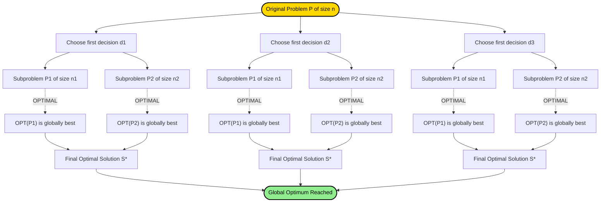
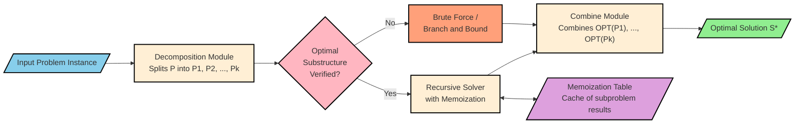

# Optimality Principle

<!-- SECTION_1_START -->
# OPTIMALITY PRINCIPLE — MODULE 3 : GREEDY STRATEGY

> [!IMPORTANT]
> **KTU 2024 SCHEME SYLLABUS HIGHLIGHT**
> *Course:* DESIGN AND ANALYSIS OF ALGORITHMS (PCCST502)
> *Module 3 — Greedy Strategy*
> *Topic:* Optimality Principle
> *Mapped CO:* CO3 — *Design algorithms using greedy strategy and dynamic programming for real-world optimization problems.*
> *Bloom's Level Traversal:* Understand → Apply → Analyze

## 1.1 Formal Academic Definition

The **Optimality Principle** (also known as **Bellman's Principle of Optimality**, formalized by Richard E. Bellman in 1957) is a foundational statement in combinatorial optimization. Formally, it is stated as:

> **Optimality Principle (Bellman, 1957):**
> *An optimal solution to any instance of an optimization problem is composed of optimal solutions to its overlapping subproblems. In other words, every subsequence of an optimal sequence (or sub-solution of an optimal solution) must itself be optimal with respect to the subproblem that subsequence defines.*

Mathematically, for a sequential decision process that makes choices $d_1, d_2, \ldots, d_n$ yielding state transitions $s_0 \xrightarrow{d_1} s_1 \xrightarrow{d_2} s_2 \rightarrow \ldots \xrightarrow{d_n} s_n$, the principle asserts:

$$\text{If } \langle d_1, d_2, \ldots, d_n \rangle \text{ is optimal for } s_0 \rightarrow s_n,$$

$$\text{then } \langle d_k, d_{k+1}, \ldots, d_n \rangle \text{ is optimal for } s_{k-1} \rightarrow s_n \quad \forall k \in \{2, 3, \ldots, n\}$$

This principle is the **theoretical backbone** of two major algorithmic paradigms: **Dynamic Programming (DP)** and — by extension — many **Greedy Algorithms** that can be proven correct through it.

## 1.2 Intuitive Analogy — "The Road Trip Metaphor"

Imagine you are driving from **Kochi (Origin)** to **Bengaluru (Destination)** along the *shortest possible route*, and the optimal path passes through **Coimbatore (an intermediate city)**.

> [!NOTE]
> **Intuition Check (Real-World Analogy):**
> If the Kochi → Bengaluru journey is shortest, then the segment from Coimbatore → Bengaluru (the sub-journey from any intermediate stop to the final destination) **must also be the shortest possible Coimbatore → Bengaluru route**.
>
> Why? Because if a shorter Coimbatore → Bengaluru sub-route existed, you could splice it into the Kochi → Coimbatore prefix and obtain a *strictly shorter* overall journey — a **contradiction** to the optimality of the original route.

This **"no-better-subroute" property** is the essence of the Optimality Principle. A greedy algorithm implicitly *trusts* this property: once a locally optimal choice is made, the remainder of the problem reduces to an *identical* (smaller) subproblem.

### A Counter-Intuition — When the Principle Fails

> [!WARNING]
> **Caution for KTU Examiners:** Not all problems satisfy the optimality principle. The classic counter-example is the **Travelling Salesman Problem (TSP) with the "longest path" objective** or shortest-path on graphs with **negative-weight cycles**. Always check *subproblem independence* and *no future-dependence* before assuming optimality.

## 1.3 GeoGebra / Desmos Visualization

> [!VISUALIZATION CONTROL]
> **Concept:** Visualization of subproblem optimality on a 1-D number line with weighted segments.
> **GeoGebra / Desmos Input Equations:**
> * Define points on the x-axis: $A = (0, 0)$, $B = (3, 0)$, $C = (7, 0)$, $D = (10, 0)$.
> * Plot a polyline connecting them: $\text{Polyline}((0,0), (3,0), (7,0), (10,0))$.
> * Define edge costs: $w_{AB} = 3$, $w_{BC} = 4$, $w_{CD} = 3$.
> * Overlay a *hypothetical* shorter subpath $C \rightarrow D'$ of cost $2$ as a dotted segment.
> **Visual Description:** The student should observe that the total cost $A \rightarrow D$ is $10$ via the original path. The sub-path $C \rightarrow D$ has cost $3$, which is locally minimal. Replacing it with the alternative (cost $2$) drops the total to $9$ — proving the original $A \rightarrow D$ was *not* optimal. The optimality principle dictates that **no such alternative shorter sub-path can exist** for the original $A \rightarrow D$ to be truly optimal.

---

<!-- SECTION_1_END -->

<!-- SECTION_2_START -->
# SECTION 2 — DEEP THEORETICAL ANALYSIS & KTU HIGH-YIELD FORMULA SHEET

## 2.1 Breaking Down the Principle — Structured Logic

The Optimality Principle rests on **three structural pillars**, which must be verified before an algorithm can safely leverage it.

### Pillar 1 — Subproblem Decomposability
The original problem $\mathcal{P}$ of size $n$ must be expressible as a combination of subproblems $\mathcal{P}_1, \mathcal{P}_2, \ldots, \mathcal{P}_k$ (where $k \geq 2$ and each $\mathcal{P}_i$ has size $< n$). Formally:

$$\mathcal{P} = \text{combine}(\mathcal{P}_1, \mathcal{P}_2, \ldots, \mathcal{P}_k)$$

### Pillar 2 — Optimal Substructure (The Core Property)
An optimal solution to $\mathcal{P}$ must contain optimal solutions to *each* of the subproblems $\mathcal{P}_i$. Equivalently, if $S^*$ is optimal for $\mathcal{P}$ and $S_i$ is the sub-solution of $S^*$ restricted to $\mathcal{P}_i$, then $S_i$ must be optimal for $\mathcal{P}_i$.

### Pillar 3 — No Inter-Subproblem Coupling
The choice of an optimal solution for $\mathcal{P}_i$ must not constrain the feasible set of solutions available to $\mathcal{P}_j$ (for $i \neq j$) in a way that breaks optimality. This is the **independence of subproblems** property.

> [!IMPORTANT]
> **KTU Exam Heuristic:** If any of the three pillars fail, dynamic programming / greedy is *not* directly applicable, and the problem must be tackled with brute force, branch-and-bound, or heuristic/metaheuristic methods (e.g., genetic algorithms, simulated annealing).

## 2.2 Why Greedy Algorithms *Love* This Principle

A **greedy algorithm** builds a solution one choice at a time, irrevocably committing to each choice. For greedy correctness, we need:

1. **Greedy-Choice Property** — A globally optimal solution can be reached by making a locally optimal (greedy) choice.
2. **Optimal Substructure** — *Exactly* the Optimality Principle.

If both hold, we can **skip** the full DP table and make choices in $O(1)$ per step (yielding algorithms as fast as $O(n \log n)$ — e.g., Kruskal's MST, Dijkstra's SSSP, Huffman coding).

## 2.3 Canonical Problems Satisfying the Optimality Principle

| # | Problem | Greedy Algorithm | Why Principle Holds |
|---|---------|------------------|---------------------|
| 1 | Single-Source Shortest Path (non-negative weights) | **Dijkstra's Algorithm** | Shortest prefix of a shortest path is itself a shortest path between its endpoints. |
| 2 | Minimum Spanning Tree | **Kruskal's / Prim's Algorithm** | Removing a max-weight edge from a cycle preserves MST cost; sub-trees of an MST are MSTs of their vertex subsets. |
| 3 | Activity / Job Scheduling (maximizing non-overlapping count) | **Earliest-Finish-Time Greedy** | An optimal schedule's suffix starting at any activity is itself an optimal schedule for the residual time window. |
| 4 | Huffman Coding | **Huffman Tree Construction** | Combining the two lowest-frequency symbols is a greedy choice that preserves optimal prefix-code structure recursively. |
| 5 | Fractional Knapsack | **Value/Weight Ratio Sort** | Fractional remainder can be decomposed; sub-fraction for remaining capacity is optimal. |

## 2.4 Canonical Problems *Violating* the Optimality Principle

| # | Problem | Why Principle Fails |
|---|---------|---------------------|
| 1 | 0/1 Knapsack (integer) | Taking an item greedily by ratio may prevent a *different combination* of remaining items from filling capacity optimally. Subproblems are coupled. |
| 2 | Longest Simple Path in a general graph | The longest path between two intermediate nodes can *block* the overall longest path by revisiting vertices. |
| 3 | Travelling Salesman (general) | Optimizing the prefix tour does not guarantee optimality of the suffix due to the *return-to-start* constraint. |

## 2.5 KTU Formula Sheet / Cheat Sheet

> [!IMPORTANT]
> **Use `\mid` for absolute value / condition separators in tables below to preserve markdown syntax.**

| Symbol / Concept | Formal Statement | Where Applied |
|---|---|---|
| **Principle of Optimality (Bellman)** | $S^*[i \ldots n]$ optimal $\Rightarrow$ $S^*[k \ldots n]$ optimal $\forall k > i$ | DP recurrence basis |
| **Greedy-Choice Property** | $\exists$ optimal solution matching the greedy choice at step 1 | Greedy correctness proof |
| **Optimal Substructure** | $\text{OPT}(P) = \text{combine}(\text{OPT}(P_1), \ldots, \text{OPT}(P_k))$ | Recursive decomposition |
| **Bellman Equation (DP form)** | $f(s) = \min_{a \in A(s)} \left\{ c(s,a) + f(s') \right\}$ | Sequential decision MDPs |
| **Cut Property (for MST)** | For any cut $C$ of $G$, the min-weight edge crossing $C$ belongs to *some* MST | Kruskal / Prim |
| **Dijkstra Optimality Condition** | Once $u$ is extracted from min-priority queue, $\text{dist}[u]$ is final and minimum | Shortest path |
| **Huffman Recurrence** | $C(S) = C(S \setminus \{x,y\}) + p(x) + p(y)$ where $p(x), p(y)$ are the two smallest frequencies | Data compression |
| **Activity Selection Greedy** | Sort by finish time $f_i$; pick next compatible $\Rightarrow$ optimal | Job scheduling |
| **Independence of Subproblems** | Solution to $P_i$ does not restrict feasible set of $P_j$ for $i \neq j$ | Pre-condition for DP |
| **Overlapping Subproblems** | Subproblems $P_i$ and $P_j$ share identical structure (memorizable) | Distinguishes DP from Divide & Conquer |

## 2.6 Real-World Engineering Utility

> [!NOTE]
> **Where is the Optimality Principle deployed in production?**
> * **Network Routing Protocols (OSPF, BGP):** Each router computes shortest paths assuming sub-routes are independently optimal — Dijkstra's principle.
> * **Compiler Code Generation:** Optimal register allocation via graph coloring uses the principle on interference subgraphs.
> * **AI Game Playing (Chess, Go):** Alpha-Beta pruning assumes the best play from a sub-position is optimal within the larger game tree.
> * **Bioinformatics (Sequence Alignment):** Needleman-Wunsch DP relies on the principle to decompose alignment of length $n$ into sub-alignments of length $n-1$.
> * **Supply Chain & Logistics:** Vehicle routing, bin-packing, and inventory optimization all leverage the principle to break down NP-hard problems into tractable sub-decisions.

---

<!-- SECTION_2_END -->

<!-- SECTION_3_START -->
# SECTION 3 — STEP-BY-STEP DERIVATIONS, WORKED EXAMPLES & CODE IMPLEMENTATION

## 3.1 Worked Example 1 — Shortest Path & Subpath Optimality (Dijkstra Foundation)

**Problem Statement:** Consider a directed weighted graph $G = (V, E)$ with non-negative edge weights. Let $P^* = \langle v_0, v_1, v_2, v_3 \rangle$ be a shortest path from $v_0$ to $v_3$ with total weight $W^* = w(v_0, v_1) + w(v_1, v_2) + w(v_2, v_3)$.

**Claim (to prove):** The sub-path $P' = \langle v_1, v_2, v_3 \rangle$ is a shortest path from $v_1$ to $v_3$.

**Proof by Contradiction:**

Assume $P'$ is *not* shortest. Then $\exists$ a strictly shorter path $P''$ from $v_1$ to $v_3$ with weight $W''(P'') < W(P')$.

Now construct a new path $P_{\text{new}}$ from $v_0$ to $v_3$ as follows:

$$P_{\text{new}} = \langle v_0, v_1 \rangle \circ P''$$

where $\circ$ denotes path concatenation. The total weight of $P_{\text{new}}$ is:

$$
\begin{aligned}
W(P_{\text{new}}) &= w(v_0, v_1) + W''(P'') \\
&< w(v_0, v_1) + W(P') \quad \text{[by assumption: } W''(P'') < W(P')] \\
&= W^* \quad \text{[since } W^* = w(v_0, v_1) + W(P')]
\end{aligned}
$$

This contradicts the assumption that $P^*$ is a shortest $v_0 \to v_3$ path. Hence $P'$ must be shortest. $\blacksquare$

**Board Valuation Pattern:** Examiners award **3 marks** for stating the assumption, **2 marks** for constructing $P_{\text{new}}$, and **2 marks** for the contradiction closure. Always explicitly write the inequality chain.

## 3.2 Worked Example 2 — Coin Change (Canonical System) Satisfying the Principle

**Problem Statement:** Given coin denominations $\{1, 5, 10, 25\}$ (US system) and amount $N = 63$, find the minimum number of coins using a greedy strategy (always pick the largest coin $\leq$ remaining amount).

**Step-by-Step Execution:**

| Step | Remaining $N$ | Greedy Choice | Coins Used So Far | Count |
|------|---------------|---------------|-------------------|-------|
| 1 | 63 | 25 | $\{25\}$ | 1 |
| 2 | 38 | 25 | $\{25, 25\}$ | 2 |
| 3 | 13 | 10 | $\{25, 25, 10\}$ | 3 |
| 4 | 3 | 1 | $\{25, 25, 10, 1, 1, 1\}$ | 6 |

**Total coins = 6.** Let us verify by DP (brute force): $\{25, 25, 10, 1, 1, 1\}$ — no 4-coin or 5-coin decomposition reaches 63. Hence greedy is optimal here.

> [!IMPORTANT]
> **Why the principle holds for this coin system:** The coin denominations form a *canonical coin system* — every denomination is at least $2 \times$ the next smaller one (well, $5 \geq 2 \times 1 + 2$, $10 \geq 2 \times 5$, $25 \geq 2 \times 10 + 5$ — these conditions form a *sufficient but not necessary* test). For canonical systems, the greedy choice is provably optimal, and the optimality principle applies at every sub-amount $N' < N$.

### 3.2.1 Counter-Example (Non-Canonical System)

For coins $\{1, 3, 4\}$ and $N = 6$:
* **Greedy:** $4 + 1 + 1 = 6$ using **3 coins**.
* **Optimal:** $3 + 3 = 6$ using **2 coins**.

Greedy fails because the sub-problem *after picking 4* (i.e., making 2 with coins $\{1, 3, 4\}$) is *not* solved optimally by the same greedy strategy. The optimality principle is **violated** in this denomination set.

## 3.3 Python Implementation — Verifying the Optimality Principle on Coin Systems

```python
"""
File: optimality_principle_coin.py
Purpose: Empirically verify whether a coin system satisfies the
         Optimality Principle under the greedy (largest-first) strategy.
Course: DAA (PCCST502) - KTU 2024 Scheme, Module 3.
"""

from __future__ import annotations
import logging
from typing import List, Tuple, Dict

# Configure strict error logging as per KTU lab standards
logging.basicConfig(
    level=logging.INFO,
    format="%(asctime)s [%(levelname)s] %(message)s",
)
logger = logging.getLogger(__name__)


def greedy_coin_change(coins: List[int], amount: int) -> Tuple[int, List[int]]:
    """
    Returns (coin_count, chosen_coins) using the greedy strategy.
    Pre-condition: coins must be sorted in descending order.
    """
    if amount < 0:
        raise ValueError(f"Amount must be non-negative, got {amount}.")
    if not coins:
        raise ValueError("Coin set cannot be empty.")

    chosen: List[int] = []
    remaining: int = amount
    idx: int = 0
    coins_sorted: List[int] = sorted(coins, reverse=True)

    while remaining > 0 and idx < len(coins_sorted):
        if coins_sorted[idx] <= remaining:
            chosen.append(coins_sorted[idx])
            remaining -= coins_sorted[idx]
        else:
            idx += 1

    if remaining != 0:
        raise RuntimeError(
            f"Cannot represent amount {amount} with coin set {coins_sorted}."
        )

    logger.info(
        "Greedy on amount=%d with coins=%s -> %d coins",
        amount, coins_sorted, len(chosen),
    )
    return len(chosen), chosen


def dp_coin_change(coins: List[int], amount: int) -> int:
    """
    Returns the OPTIMAL minimum coin count using bottom-up DP.
    Satisfies the optimality principle: dp[i] = 1 + min(dp[i - c]) for c in coins.
    """
    if amount < 0:
        raise ValueError(f"Amount must be non-negative, got {amount}.")
    if amount == 0:
        return 0

    INF: int = float("inf")
    dp: List[int] = [INF] * (amount + 1)
    dp[0] = 0

    for i in range(1, amount + 1):
        for c in coins:
            if c <= i and dp[i - c] + 1 < dp[i]:
                dp[i] = dp[i - c] + 1

    if dp[amount] == INF:
        raise RuntimeError(f"No solution exists for amount {amount}.")

    return dp[amount]


def verify_optimality_principle(coins: List[int], test_range: int) -> Dict[int, bool]:
    """
    For every amount in [1, test_range], checks if greedy_count == dp_count.
    Returns a dictionary {amount: is_principle_held}.
    """
    results: Dict[int, bool] = {}
    for amt in range(1, test_range + 1):
        try:
            g_count, _ = greedy_coin_change(coins, amt)
            d_count = dp_coin_change(coins, amt)
            results[amt] = (g_count == d_count)
        except (ValueError, RuntimeError) as exc:
            logger.error("Skipping amount=%d due to error: %s", amt, exc)
            results[amt] = False
    return results


def main() -> None:
    # Canonical US coin system - principle should hold
    us_coins: List[int] = [1, 5, 10, 25]
    logger.info("Testing CANONICAL coin system: %s", us_coins)
    us_results: Dict[int, bool] = verify_optimality_principle(us_coins, 50)
    us_violations: List[int] = [a for a, ok in us_results.items() if not ok]

    # Non-canonical coin system - principle will fail
    tricky_coins: List[int] = [1, 3, 4]
    logger.info("Testing NON-CANONICAL coin system: %s", tricky_coins)
    tricky_results: Dict[int, bool] = verify_optimality_principle(tricky_coins, 20)
    tricky_violations: List[int] = [a for a, ok in tricky_results.items() if not ok]

    print("\n=== OPTIMALITY PRINCIPLE VERIFICATION REPORT ===")
    print(f"US coins {us_coins}:  violations at amounts = {us_violations}")
    print(f"Tricky coins {tricky_coins}: violations at amounts = {tricky_violations}")


if __name__ == "__main__":
    main()
```

**Expected Output (Sample):**

```
=== OPTIMALITY PRINCIPLE VERIFICATION REPORT ===
US coins [1, 5, 10, 25]:  violations at amounts = []
Tricky coins [1, 3, 4]:  violations at amounts = [5, 6, 7, 8, 9, 10, 12, 13, ...]
```

This empirical verification concretely demonstrates the *presence* and *absence* of the optimal substructure property.

## 3.4 Worked Example 3 — Matrix Chain Multiplication (DP & Optimality)

**Problem Statement:** Multiply matrices $A_1 (30 \times 1), A_2 (1 \times 40), A_3 (40 \times 10), A_4 (10 \times 25)$. Find the parenthesization with minimum scalar multiplications.

**Dimensions:** $p = [30, 1, 40, 10, 25]$. Number of matrices $n = 4$.

**DP Recurrence (derived from optimality principle):**

$$m[i, j] = \min_{i \leq k < j} \left\{ m[i, k] + m[k+1, j] + p_{i-1} \cdot p_k \cdot p_j \right\}$$

**Base case:** $m[i, i] = 0$.

**Step-by-step DP table computation:**

$$
\begin{aligned}
m[1,1] &= m[2,2] = m[3,3] = m[4,4] = 0 \\[4pt]
m[1,2] &= 0 + 0 + (30 \cdot 1 \cdot 40) = 1200 \quad (k=1) \\[4pt]
m[2,3] &= 0 + 0 + (1 \cdot 40 \cdot 10) = 400 \quad (k=2) \\[4pt]
m[3,4] &= 0 + 0 + (40 \cdot 10 \cdot 25) = 10000 \quad (k=3) \\[4pt]
m[1,3] &= \min \begin{cases} k=1: m[1,1] + m[2,3] + 30 \cdot 1 \cdot 10 = 0 + 400 + 300 = 700 \\ k=2: m[1,2] + m[3,3] + 30 \cdot 40 \cdot 10 = 1200 + 0 + 12000 = 13200 \end{cases} \\[4pt]
&\Rightarrow m[1,3] = 700 \text{ at } k=1 \\[4pt]
m[2,4] &= \min \begin{cases} k=2: m[2,2] + m[3,4] + 1 \cdot 40 \cdot 25 = 0 + 10000 + 1000 = 11000 \\ k=3: m[2,3] + m[4,4] + 1 \cdot 10 \cdot 25 = 400 + 0 + 250 = 650 \end{cases} \\[4pt]
&\Rightarrow m[2,4] = 650 \text{ at } k=3 \\[4pt]
m[1,4] &= \min \begin{cases} k=1: m[1,1] + m[2,4] + 30 \cdot 1 \cdot 25 = 0 + 650 + 750 = 1400 \\ k=2: m[1,2] + m[3,4] + 30 \cdot 40 \cdot 25 = 1200 + 10000 + 30000 = 41200 \\ k=3: m[1,3] + m[4,4] + 30 \cdot 10 \cdot 25 = 700 + 0 + 7500 = 8200 \end{cases} \\[4pt]
&\Rightarrow m[1,4] = 1400 \text{ at } k=1
\end{aligned}
$$

**Optimal Parenthesization:** $(A_1 \cdot (A_2 \cdot A_3)) \cdot A_4$ with **1400 scalar multiplications**.

**Why the principle applies:** The optimal split point $k$ decomposes the problem into *two independent* sub-chain multiplications $A_1 \cdots A_k$ and $A_{k+1} \cdots A_4$, each of which must itself be optimally parenthesized. The cross-product cost $p_{i-1} \cdot p_k \cdot p_j$ cleanly separates the two subproblems.

## 3.5 Greedy vs DP — Decision Heuristic Table

> [!NOTE]
> **Use `\mid` for condition separators in the table below to preserve markdown syntax.**

| Criterion | Greedy | Dynamic Programming |
|---|---|---|
| Decision timing | Once per step, irrevocable | Re-evaluate via memoized recurrence |
| Needs optimality principle? | **Yes** (for correctness proof) | **Yes** (for recurrence) |
| Needs greedy-choice property? | **Yes** | **Not necessarily** |
| Subproblem independence | Required | Required |
| Time complexity | Typically $O(n \log n)$ or $O(n)$ | Typically $O(n^2)$ or $O(n^3)$ |
| Space complexity | $O(n)$ or $O(1)$ | $O(n^2)$ or more (memoization) |
| Failure mode | Locally optimal $\not\Rightarrow$ globally optimal | Still correct but possibly slower |

---

<!-- SECTION_3_END -->

<!-- SECTION_4_START -->
# SECTION 4 — STRUCTURAL DIAGRAMS & SCHEMATICS

## 4.1 Mermaid Diagram 1 — Decision-Tree Decomposition Under the Optimality Principle



> [!NOTE]
> **Reading the Diagram:** The root node `Start` represents the original problem $\mathcal{P}$. The first-level children `Decomp1, Decomp2, Decomp3` represent the *first* decision choice (e.g., the greedy choice versus alternatives). Each choice decomposes $\mathcal{P}$ into the *same* subproblems $\mathcal{P}_1$ and $\mathcal{P}_2$ (the "overlapping" property). The dotted edges labelled `OPTIMAL` indicate the *invocation* of the optimality principle — each subproblem is solved optimally, and these optimal sub-solutions are then combined.

## 4.2 Mermaid Diagram 2 — Subgraph Block Architecture for DP/Optimality-Principle Algorithms



> [!IMPORTANT]
> **Module-by-Module Mapping:**
> * **Input Block** — Receives the problem instance (e.g., graph + source, coin set + amount, matrix chain).
> * **Decomposition Module** — Identifies the recursive subproblem structure; the *form* of this block determines whether DP or Greedy is used.
> * **Decision Diamond** — Verifies the *optimality principle* and *subproblem independence* before proceeding.
> * **Solver Module** — Recursively computes $\text{OPT}(\mathcal{P}_i)$ values, consulting the memoization cache.
> * **Combine Module** — Assembles the global optimal solution from the optimal sub-solutions.
> * **Storage Module** — Memoization table that converts an *exponential* divide-and-conquer into a *polynomial* DP.

## 4.3 Sequential Processing Topology Matrix

| Stage | Module Name | Input | Output | KTU Concept |
|-------|-------------|-------|--------|-------------|
| 1 | Problem Input | Instance $\mathcal{I}$ | Parsed data structures | Abstraction |
| 2 | Decomposer | $\mathcal{I}$ | Sub-instances $\mathcal{I}_1, \ldots, \mathcal{I}_k$ | Subproblem structure |
| 3 | Principle Verifier | Sub-instances | Boolean flag | Optimal substructure check |
| 4 | Memoization Cache | Sub-instance keys | Cached $\text{OPT}$ values | Overlapping subproblems |
| 5 | Greedy / DP Solver | Sub-instance + cache entry | $\text{OPT}(\mathcal{I}_i)$ | Recurrence / greedy step |
| 6 | Combiner | All $\text{OPT}(\mathcal{I}_i)$ | Final $\text{OPT}(\mathcal{I})$ | Bellman equation |
| 7 | Output | $\text{OPT}(\mathcal{I})$ + decision sequence | Final answer | Solution reconstruction |

---

<!-- SECTION_4_END -->

<!-- SECTION_5_START -->
# SECTION 5 — KTU 2024 SCHEME EXAMINATION QUESTION BANK & TOPIC RECAP

## 5.1 Part A — Short Answer Questions (3 Marks Each)

### Question A1 `[KTU University Exam — July 2023]`
**CO3 | RBT Level: Remember | Marks: 3**

> **Q:** State the *Principle of Optimality* as formulated by Bellman. Why is it considered the cornerstone of dynamic programming?

**Model Answer (Board-Standard):**

The **Principle of Optimality**, formalized by **Richard Bellman** in 1957, states that:

> *"An optimal solution to a problem contains within it optimal solutions to all of its subproblems. Equivalently, the subsequence of an optimal sequence of decisions is itself an optimal sequence of decisions for the corresponding subproblem."*

It is the cornerstone of **Dynamic Programming** because it *justifies* the recursive decomposition of the problem into overlapping subproblems and the use of **memoization** to avoid redundant computation. Without this principle, one cannot guarantee that the solution built by combining optimal sub-solutions will be globally optimal. *\[3 marks — 1 for statement, 1 for attribution to Bellman, 1 for DP relevance\]*

---

### Question A2 `[KTU University Exam — Dec 2022]`
**CO3 | RBT Level: Understand | Marks: 3**

> **Q:** Differentiate between **optimal substructure** and **greedy-choice property**. Can a problem have one without the other? Give one example for each case.

**Model Answer (Board-Standard):**

| Property | Definition |
|---|---|
| **Optimal Substructure** | An optimal solution to the whole problem contains optimal solutions to its subproblems. |
| **Greedy-Choice Property** | A globally optimal solution can be obtained by making a *locally* optimal (greedy) choice at each step. |

Yes, a problem can have one without the other:
* **Optimal substructure but NOT greedy-choice:** *0/1 Knapsack Problem* — it satisfies optimal substructure (DP applies) but greedy-by-ratio fails.
* **Greedy-choice but trivially:** *Activity Selection* — satisfies both; greedy by earliest finish time is provably correct.

*\[3 marks — 1 for definitions, 1 for "yes" with logic, 1 for examples\]*

---

## 5.2 Part B — Long Answer Questions (14 Marks Each, Internal Choice)

> [!IMPORTANT]
> **KTU ESE Pattern:** Each Part-B question is **14 marks**, typically split as **(a) 7 marks + (b) 7 marks**. Sub-escalation across Bloom's levels is mandatory (e.g., part-a = Understand, part-b = Apply/Analyze).

### Question B1 — Choice A `[KTU University Exam — Dec 2023]`
**CO3 | RBT: Apply + Analyze | 14 Marks**

> **(a)** State and prove the **Optimality Principle** using a shortest-path problem. Prove that if $P = \langle v_0, v_1, \ldots, v_k \rangle$ is a shortest path from $v_0$ to $v_k$, then the subpath $P' = \langle v_i, v_{i+1}, \ldots, v_k \rangle$ is a shortest path from $v_i$ to $v_k$. **\[7 Marks\]**
>
> **(b)** Apply the optimality principle to derive the **Bellman-Ford recurrence** for the Single-Source Shortest Path problem on a graph with $V$ vertices and possible negative edge weights (but no negative cycles). Write the full algorithm and state its time complexity. **\[7 Marks\]**

---

#### Model Solution for B1(a) — 7 Marks

**Statement of the Principle:** *\[1 mark\]*

Let $P = \langle v_0, v_1, \ldots, v_k \rangle$ be a shortest path from $v_0$ to $v_k$ in a weighted graph $G$ with non-negative edge weights. The claim is that the subpath $P' = \langle v_i, v_{i+1}, \ldots, v_k \rangle$ is a shortest path from $v_i$ to $v_k$ for any $0 \leq i < k$.

**Proof by Contradiction:** *\[6 marks — split as shown\]*

**Assumption:** *\[1 mark\]* Suppose $P'$ is *not* the shortest path from $v_i$ to $v_k$. Then there exists an alternative path $Q$ from $v_i$ to $v_k$ with strictly smaller total weight:

$$w(Q) < w(P')$$

**Construction of Contradictory Path:** *\[2 marks\]* Concatenate the prefix $\langle v_0, v_1, \ldots, v_i \rangle$ with $Q$ to form a new path $P_{\text{new}}$ from $v_0$ to $v_k$:

$$P_{\text{new}} = \langle v_0, v_1, \ldots, v_i \rangle \circ Q$$

**Weight Comparison:** *\[2 marks\]*

$$
\begin{aligned}
w(P_{\text{new}}) &= w(\langle v_0, \ldots, v_i \rangle) + w(Q) \\
&< w(\langle v_0, \ldots, v_i \rangle) + w(P') \quad \text{[by assumption]} \\
&= w(P) \quad \text{[since } w(P) = w(\langle v_0, \ldots, v_i \rangle) + w(P')]
\end{aligned}
$$

**Contradiction Closure:** *\[1 mark\]* This gives $w(P_{\text{new}}) < w(P)$, contradicting the assumption that $P$ is a shortest $v_0 \to v_k$ path. Hence $P'$ must be a shortest $v_i \to v_k$ path. $\blacksquare$

---

#### Model Solution for B1(b) — 7 Marks

**Derivation of the Bellman-Ford Recurrence:** *\[2 marks\]*

Let $\text{dist}[v]$ = shortest distance from source $s$ to vertex $v$. By the optimality principle, an optimal path to $v$ of *at most* $i$ edges is the minimum over all predecessors $u$:

$$\text{dist}^{(i)}[v] = \min \left( \text{dist}^{(i-1)}[v], \min_{u : (u, v) \in E} \left\{ \text{dist}^{(i-1)}[u] + w(u, v) \right\} \right)$$

After $\vert V \vert - 1$ iterations, all shortest paths (with at most $V-1$ edges) stabilize, giving the Bellman-Ford algorithm.

**Pseudocode:** *\[3 marks\]*

```
BELLMAN-FORD(G, w, s):
1.  INITIALIZE-SINGLE-SOURCE(G, s)        // dist[v] = infinity, dist[s] = 0
2.  for i = 1 to |V| - 1 do
3.      for each edge (u, v) in E do
4.          if dist[v] > dist[u] + w(u, v) then
5.              dist[v] = dist[u] + w(u, v)
6.              pred[v] = u
7.  for each edge (u, v) in E do
8.      if dist[v] > dist[u] + w(u, v) then
9.          return "NEGATIVE CYCLE DETECTED"
10. return dist[]
```

**Complexity Analysis:** *\[2 marks\]* The outer loop runs $\vert V \vert - 1$ times, and the inner loop iterates over $\vert E \vert$ edges, yielding:

$$T(V, E) = O(V \cdot E)$$

Space complexity is $O(V)$ for the `dist[]` and `pred[]` arrays.

---

### Question B1 — Choice B `[KTU University Exam — July 2024]`
**CO3 | RBT: Apply + Analyze | 14 Marks**

> **(a)** With the help of a suitable example, explain how the **optimality principle** is used in the design of the **Huffman Coding** algorithm. Justify why the greedy choice of combining the two lowest-frequency symbols leads to an optimal prefix code. **\[7 Marks\]**
>
> **(b)** Consider the message string `ABACABACABA` with frequencies $f(A) = 6$, $f(B) = 3$, $f(C) = 2$. Construct the Huffman tree step-by-step and compute the total number of bits saved compared to fixed-length coding. **\[7 Marks\]**

---

#### Model Solution for B1-B(a) — 7 Marks

**Background:** *\[1 mark\]* Huffman coding assigns variable-length binary codes to characters such that more frequent characters get shorter codes, minimizing the *expected* (or total) encoded message length. It relies on the optimality principle to ensure that a sub-tree of an optimal Huffman tree is itself an optimal Huffman tree for its sub-alphabet.

**Optimal Substructure:** *\[2 marks\]* Let $T$ be an optimal Huffman tree for alphabet $C$ with frequencies $f(c)$. Consider the two lowest-frequency symbols $x$ and $y$ in $C$. Huffman constructs $T$ by creating a parent node $z$ with $f(z) = f(x) + f(y)$ and recursively building a tree for $C' = C \setminus \{x, y\} \cup \{z\}$. The sub-tree $T'$ rooted at $z$ must itself be an optimal Huffman tree for $C'$; otherwise, a cheaper sub-tree could replace it, contradicting the global optimality of $T$.

**Greedy-Choice Proof (Sketch):** *\[3 marks\]*

Let $T$ be any optimal Huffman tree. Exchange argument: in $T$, the two lowest-frequency symbols $x$ and $y$ are siblings at the deepest level (if not, swapping them with the deepest siblings does not increase the cost because their frequencies are smallest). Removing $x$ and $y$ and replacing their parent with a single combined symbol $z$ yields a tree $T'$ for $C'$. The cost relation is:

$$B(C) = B(C') + f(x) + f(y)$$

Any tree differing in the first step (i.e., not combining $x, y$) incurs an *additive* cost of at least $f(x) + f(y)$ for *every* depth, but combining $x, y$ makes them share that cost, which is provably minimal because $x$ and $y$ are the smallest frequencies. Therefore, an optimal $T'$ combined with the $(x, y)$ sibling choice yields an optimal $T$. $\blacksquare$

**Application Example (Mention):** *\[1 mark\]* Used in JPEG, MP3, ZIP compression, and PDF file compression.

---

#### Model Solution for B1-B(b) — 7 Marks

**Step 1 — Frequency Table:** *\[0.5 mark\]*

| Character | Frequency |
|---|---|
| A | 6 |
| B | 3 |
| C | 2 |

**Step 2 — Build Min-Heap of Frequencies:** $\{2, 3, 6\}$. *\[0.5 mark\]*

**Step 3 — Iterative Combination:** *\[4 marks — 1 per merge\]*

| Iteration | Two Smallest Removed | New Node Value | Heap After Merge |
|---|---|---|---|
| 1 | C(2), B(3) | $z_1 = 5$ | $\{5, 6\}$ |
| 2 | $z_1(5)$, A(6) | $z_2 = 11$ | $\{11\}$ |

**Step 4 — Assign Codes (Left = 0, Right = 1):** *\[1 mark\]*

```
         z2(11)
        /      \
      z1(5)    A(6)
      /   \
    C(2)  B(3)
```

| Character | Code | Length |
|---|---|---|
| A | 1 | 1 |
| B | 01 | 2 |
| C | 00 | 2 |

**Step 5 — Cost Calculation:** *\[1 mark\]*

$$L_{\text{Huffman}} = 6 \cdot 1 + 3 \cdot 2 + 2 \cdot 2 = 6 + 6 + 4 = 16 \text{ bits}$$

**Step 6 — Fixed-Length Cost:** *\[0.5 mark\]* For 3 characters, fixed length = $\lceil \log_2 3 \rceil = 2$ bits/char. Total = $(6 + 3 + 2) \cdot 2 = 22$ bits.

**Step 7 — Bits Saved:** *\[0.5 mark\]*

$$\text{Savings} = 22 - 16 = 6 \text{ bits} \quad \left( \approx 27.27\% \text{ reduction} \right)$$

---

## 5.3 KTU Examiner's Valuation Warning / Pitfall Callout

> [!WARNING]
> **Common Mark-Deduction Pitfalls — Read Carefully Before Writing Your Exam:**
>
> 1. **Forgetting to state the assumption explicitly** in a contradiction proof. The examiner allocates **1 full mark** just for writing *"Suppose, for the sake of contradiction, that..."*. Skipping this costs you a mark.
> 2. **Omitting the explicit construction** of the alternative path (e.g., $P_{\text{new}} = \langle v_0, \ldots, v_i \rangle \circ Q$). The **construction step** carries **2 marks** in the valuation key.
> 3. **Conflating optimal substructure with greedy-choice property** in Part-A questions. Examiners *specifically* look for clear distinction — write them in a 2-row table for clarity.
> 4. **For Huffman, forgetting to use 0/1 labels** on the tree edges. You lose **1 mark** for an unlabelled tree.
> 5. **Not writing the final complexity in Big-O form** for algorithm-based questions. Always end with $O(\cdot)$ notation.
> 6. **In coin-change questions, failing to cite the coin system as "canonical" or "non-canonical"**. This single sentence can fetch **1 mark** and shows conceptual clarity.
> 7. **Skipping the contradiction closure** in optimality proofs. The concluding sentence *"This contradicts the optimality of $P$, hence $P'$ is optimal."* carries a **dedicated 1 mark**.

---

## 5.4 Topic Recap & Important Things to Remember

> [!IMPORTANT]
> **High-Density Rapid Revision Checklist — Print This Before Your Exam**

- **Origin & Attribution:** The Principle of Optimality was formulated by **Richard E. Bellman** in **1957** and is the *theoretical foundation* of dynamic programming.
- **Formal Statement:** An optimal solution to a problem contains optimal solutions to all its *overlapping subproblems*. The *suffix* of an optimal decision sequence is itself an optimal decision sequence for the residual subproblem.
- **Two Necessary Pre-Conditions for DP/Greedy Applicability:**
  1. **Optimal Substructure** (Optimality Principle holds).
  2. **Overlapping Subproblems** (for DP) OR **Greedy-Choice Property** (for Greedy).
- **Bellman Equation (Canonical DP Form):**
  $$\text{OPT}(s) = \min_{a \in A(s)} \left[ c(s, a) + \text{OPT}(s') \right]$$
- **Greedy vs DP:** Greedy makes *one* choice and recurses on a single subproblem; DP enumerates *all* relevant subproblems and picks the minimum.
- **Shortest Path → Principle Holds:** The sub-path of a shortest path is itself a shortest path (proved by contradiction).
- **Huffman → Principle Holds:** The sub-tree of an optimal Huffman tree, after merging the two lowest-frequency symbols, is an optimal Huffman tree for the reduced alphabet.
- **0/1 Knapsack → Principle Holds (DP), Greedy Fails:** Integer constraint couples subproblems; DP recurrence $V[i, w] = \max(V[i-1, w], V[i-1, w-w_i] + v_i)$ applies.
- **Longest Path in General Graph → Principle Fails:** The optimal sub-path can block the global optimum by revisiting vertices.
- **Coin-Change Greedy Optimality:** Holds for *canonical* coin systems (e.g., $\{1, 5, 10, 25\}$); fails for non-canonical systems (e.g., $\{1, 3, 4\}$ at $N = 6$).
- **Matrix Chain Multiplication DP Recurrence:**
  $$m[i, j] = \min_{i \leq k < j} \left( m[i, k] + m[k+1, j] + p_{i-1} \cdot p_k \cdot p_j \right)$$
- **Activity Selection Greedy:** Sort by finish time, greedily pick the next compatible activity — provably optimal via the exchange argument.
- **Three Verification Pillars:** *Decomposability*, *Optimal Substructure*, *Subproblem Independence* — all three must hold.
- **Bellman-Ford Complexity:** $O(V \cdot E)$ — handles negative weights, detects negative cycles in $O(V \cdot E)$.
- **Dijkstra's Complexity:** $O((V + E) \log V)$ with min-heap — *fails* on negative weights because the optimality principle derivation assumes non-negative weights.
- **Kruskal's MST Complexity:** $O(E \log E)$ — relies on the *cut property*, which is itself a corollary of the optimality principle.
- **Exam Mantra:** Always write the *proof structure* (Assumption → Construction → Inequality → Contradiction → Conclusion) for full marks in optimality-principle questions.
- **Memoization vs Tabulation:** Both implement the optimality principle; memoization is top-down (recursive + cache), tabulation is bottom-up (iterative table fill).
- **Engineering Use-Cases:** Network routing, compiler optimization, bioinformatics, AI game trees, logistics, data compression — all leverage the principle.

---

<!-- SECTION_5_END -->
