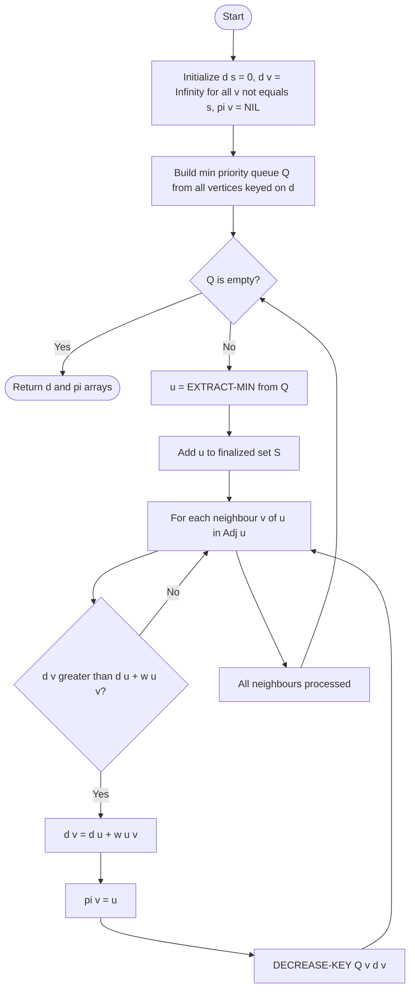
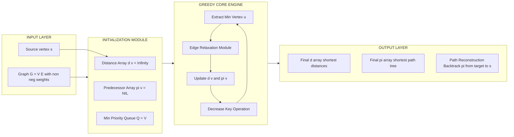
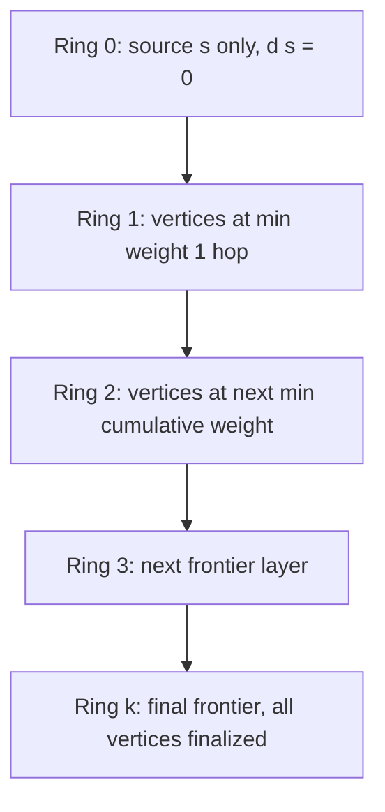
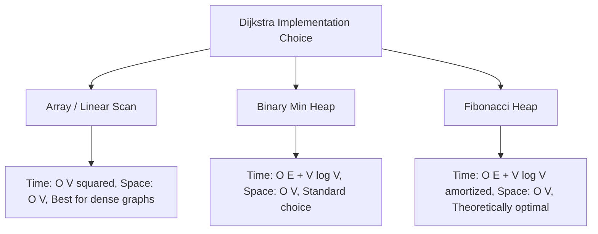

# Shortest Path Problem – Dijkstra’s Algorithm

<!-- SECTION_1_START -->
# Shortest Path Problem – Dijkstra's Algorithm

> [!NOTE]
> **KTU 2024 Scheme | Module 3: Greedy Strategy | Course: PCCST502 – Design and Analysis of Algorithms**
> This topic falls under **Course Outcome CO3**: *Design and analyze algorithmic strategies (Brute Force, Greedy, Divide & Conquer, Dynamic Programming) for real-world engineering problems.*

## 1. Formal Definition

The **Single-Source Shortest Path (SSSP) Problem** asks: *given a weighted graph $G = (V, E)$ with non-negative edge weights $w(u, v) \geq 0$, find the minimum-cost path from a designated source vertex $s \in V$ to every other vertex $v \in V$.*

**Dijkstra's Algorithm**, proposed by **Edsger W. Dijkstra (1956)**, solves the SSSP problem for directed/undirected graphs with non-negative edge weights using a **greedy strategy**. It maintains a set of vertices whose final shortest distance from the source is already known and repeatedly selects the **unvisited vertex with the smallest tentative distance**, performing *edge relaxation* on its outgoing edges.

> [!IMPORTANT]
> **Precondition (KTU Syllabus Highlight):** Dijkstra's algorithm **fails** when the graph contains a **negative edge weight cycle**. This is a board-favorite trick question — always state this constraint before writing the algorithm.

## 2. Conceptual Analogy / Intuition

Imagine you are standing at your home (**source vertex $s$**) in an unfamiliar city, and you want to know the **shortest driving distance** to every other landmark. Your **GPS map** shows roads with distances marked. The GPS keeps a running list — *"the shortest confirmed distance from home to each landmark I have fully explored so far."*

At every step, the GPS asks: *"Of all the landmarks I have heard of but not yet fully explored, which one has the smallest currently estimated distance from home?"* It then **commits** to that landmark (greedy choice) and uses it as a base to update the estimates of its neighbours — *"maybe going through this landmark, I can find a shorter route to the next one."* This process of *updating neighbour estimates* is called **relaxation**.

The greedy property holds because, with **non-negative weights**, the first time we extract a vertex from the priority queue, we are **guaranteed** that no future, longer path can improve it.

> [!TIP]
> **Geometric Intuition:** If you draw the graph and flood the source with water spreading at unit speed, the wavefront first touches each vertex along its *shortest* path. Dijkstra's algorithm simulates exactly this spreading process.

## 3. Key Terminology

- **Vertex $s$ (source):** The starting node from which all shortest paths are computed.
- **Distance array $d[v]$:** Tentative shortest distance from $s$ to $v$ discovered so far. Initialized to $\infty$ except $d[s] = 0$.
- **Predecessor array $\pi[v]$:** Stores the immediate predecessor of $v$ on the shortest path, enabling path reconstruction. Initialized to $\text{NIL}$.
- **Visited / Finalized set $S$:** Vertices whose shortest distance from $s$ is *permanently locked*.
- **Relaxation operation:** The update step
$$\text{if } d[u] + w(u, v) < d[v] \text{ then } d[v] \leftarrow d[u] + w(u, v) \text{ and } \pi[v] \leftarrow u$$
- **Priority Queue (Min-Heap):** Data structure that returns the minimum-$d$ unvisited vertex in $O(\log \vert V \vert)$ time.

> [!VISUALIZATION CONTROL]
> **Concept:** Greedy frontier expansion on a weighted graph
> **Desmos / GeoGebra Input:** Plot the line segments representing edge weights between nodes $A, B, C, D, E$ on a 2D plane and animate the wavefront $d[v]$ values.
> **Visual Description:** You should observe the wavefront expanding outward from the source; each ring represents a constant shortest distance, similar to BFS but with weighted radial growth.

---

<!-- SECTION_1_END -->

<!-- SECTION_2_START -->
# Deep Theoretical Analysis & KTU High-Yield Formula Sheet

## 1. Greedy Choice Property

At each iteration, Dijkstra's algorithm selects the **unvisited vertex $u$ with the minimum value of $d[u]$** and adds it to the finalized set $S$.

**Greedy Choice Claim:** *The vertex $u$ selected by the greedy rule has its shortest path distance from $s$ permanently determined, i.e., $d[u] = \delta(s, u)$.*

**Proof Sketch:**
Suppose for contradiction that $u$ is the first vertex added to $S$ for which $d[u] \neq \delta(s, u)$. Then there exists a true shortest path $p$ from $s$ to $u$ with $\delta(s, u) < d[u]$. Let $y$ be the first vertex on path $p$ that is *not* in $S$ (such a $y$ must exist because $s \in S$ and $u \notin S$ before this step). Let $x$ be the predecessor of $y$ on $p$, with $x \in S$. Then:

$$d[y] = d[x] + w(x, y) = \delta(s, x) + w(x, y) = \delta(s, y) \leq \delta(s, u) < d[u]$$

But $y$ was a candidate when $u$ was selected (both were unvisited), so we must have $d[y] \geq d[u]$ — a **contradiction**. $\blacksquare$

> [!IMPORTANT]
> **KTU Board Pattern:** Examiners often award 2 marks for stating the greedy choice property and 3 marks for the proof-by-contradiction sketch. Memorize the structure above.

## 2. Optimal Substructure

Any subpath of a shortest path is itself a shortest path between its endpoints. This is the **optimal substructure** property that, combined with the greedy choice, enables Dijkstra's correctness via dynamic-programming-style induction.

## 3. Algorithmic Workflow (The "Why" Behind Each Step)

1. **Initialization:** Set $d[s] = 0$ and $d[v] = \infty$ for all $v \neq s$. Build a min-priority queue $Q$ keyed on $d$.
2. **Main Loop:** While $Q$ is not empty:
   - Extract-min: $u \leftarrow Q.\text{extractMin}()$.
   - Add $u$ to $S$.
   - For every edge $(u, v) \in E$: perform **relaxation** on edge $(u, v)$.
3. **Termination:** $Q$ is empty, all reachable vertices have been finalized.

## 4. KTU Formula Sheet / Cheat Sheet

| **Symbol / Term** | **Meaning** | **Initial / Final Value** |
|---|---|---|
| $d[v]$ | Tentative shortest distance $s \leadsto v$ | $d[s]=0$, others $=\infty$ |
| $\pi[v]$ | Predecessor of $v$ on shortest path | $\pi[v] = \text{NIL}$ |
| $S$ | Finalized vertex set | $\emptyset \rightarrow V$ |
| $Q$ | Min-priority queue of unvisited vertices | $Q$ initially $= V$ |
| $w(u,v)$ | Weight of edge $(u,v)$ | $w(u,v) \geq 0$ (mandatory) |
| Relaxation rule | Update condition | $d[v] > d[u] + w(u,v) \Rightarrow$ update |
| **Time complexity (array impl.)** | $O(\vert V \vert^2)$ | Best for dense graphs |
| **Time complexity (binary heap)** | $O((E + V) \log \vert V \vert)$ | Best for sparse graphs |
| **Time complexity (Fibonacci heap)** | $O(\vert E \vert + \vert V \vert \log \vert V \vert)$ | Asymptotically optimal |

> [!NOTE]
> **Avoid using the vertical pipe `\|` inside markdown tables.** In this table, we use the absolute-value LaTeX form $\vert V \vert$ only inside math mode, keeping the markdown pipe `\|` purely as a column separator.

## 5. Real-World Engineering Utility

Dijkstra's algorithm is the **backbone of route planning** in:

- **GPS Navigation Systems** (Google Maps, OpenStreetMap) — finding the fastest road route.
- **Network Routing Protocols** — OSPF (Open Shortest Path First) uses a link-state variant of Dijkstra.
- **Telecommunications** — minimum-hop and minimum-latency path computation in packet-switched networks.
- **Robotics & Game AI** — pathfinding on grid maps for NPC navigation.
- **VLSI CAD** — wire-length minimization in circuit layout.

---

<!-- SECTION_2_END -->

<!-- SECTION_3_START -->
# Step-by-Step Derivations, Trace & Code Implementation

## 1. Complete Pseudocode (Cormen et al. — CLRS Style)

```
DIJKSTRA(G, w, s)
 1.  for each vertex v in G.V
 2.      d[v] ← ∞
 3.      π[v] ← NIL
 4.  d[s] ← 0
 5.  S ← ∅
 6.  Q ← G.V                            // Min-priority queue
 7.  while Q ≠ ∅
 8.      u ← EXTRACT-MIN(Q)            // Greedy choice
 9.      S ← S ∪ {u}
10.      for each vertex v in G.Adj[u]
11.          if d[v] > d[u] + w(u, v)
12.              d[v] ← d[u] + w(u, v) // Relaxation
13.              π[v] ← u
14.              DECREASE-KEY(Q, v, d[v])
15.  return (d, π)
```

## 2. Full Python Implementation (Operational, Type-Hinted)

```python
"""
Dijkstra's Single-Source Shortest Path Algorithm
------------------------------------------------
Input  : Weighted graph G (dict of dicts), source vertex s
Output : (distances, predecessors) dictionaries
Constraint: Edge weights MUST be non-negative.
"""

from __future__ import annotations
import heapq
import logging
from typing import Dict, Tuple, List, Any

logging.basicConfig(level=logging.INFO, format="%(levelname)s :: %(message)s")


def dijkstra(graph: Dict[Any, Dict[Any, float]],
             source: Any) -> Tuple[Dict[Any, float], Dict[Any, Any]]:
    """
    Compute shortest path distances and predecessors from `source`
    to every other vertex in a weighted graph with non-negative edges.

    Parameters
    ----------
    graph : dict
        Adjacency representation: graph[u][v] = weight of edge (u, v).
    source : hashable
        Starting vertex.

    Returns
    -------
    (dist, prev) : tuple of dicts
        dist[v] = shortest distance s -> v
        prev[v] = predecessor of v on the shortest path
    """

    # ---- Step 1: Initialization ----
    dist: Dict[Any, float] = {v: float("inf") for v in graph}
    prev: Dict[Any, Any] = {v: None for v in graph}
    dist[source] = 0.0

    # ---- Step 2: Min-heap priority queue ----
    # Each heap entry: (current_distance, vertex)
    heap: List[Tuple[float, Any]] = [(0.0, source)]

    # ---- Step 3: Track visited vertices ----
    visited: set = set()

    # ---- Step 4: Main greedy loop ----
    while heap:
        current_dist, u = heapq.heappop(heap)

        # Skip stale heap entries (lazy deletion pattern)
        if u in visited:
            continue
        if current_dist > dist[u]:
            # Another shorter path was found earlier; ignore.
            continue

        visited.add(u)
        logging.info(f"Finalized vertex {u} with distance {current_dist}")

        # ---- Step 5: Edge relaxation for every neighbour ----
        for v, weight in graph[u].items():
            # Absolute boundary check: enforce non-negative weights
            if weight < 0:
                raise ValueError(
                    f"Negative edge weight detected: ({u}, {v}) = {weight}. "
                    "Dijkstra's algorithm requires non-negative weights."
                )

            new_dist = current_dist + weight
            if new_dist < dist[v]:
                dist[v] = new_dist
                prev[v] = u
                heapq.heappush(heap, (new_dist, v))
                logging.info(
                    f"Relaxed edge ({u} -> {v}): "
                    f"new distance = {new_dist}"
                )

    return dist, prev


def reconstruct_path(prev: Dict[Any, Any],
                     source: Any,
                     target: Any) -> List[Any]:
    """Reconstruct the actual shortest path from source to target."""
    path: List[Any] = []
    current = target
    while current is not None:
        path.append(current)
        if current == source:
            break
        current = prev[current]
    path.reverse()
    if not path or path[0] != source:
        return []  # No path exists
    return path


# ---------------- DEMO / TEST ----------------
if __name__ == "__main__":
    sample_graph: Dict[str, Dict[str, float]] = {
        "A": {"B": 4, "C": 2},
        "B": {"C": 1, "D": 5},
        "C": {"B": 1, "D": 8, "E": 10},
        "D": {"E": 2, "F": 6},
        "E": {"F": 2},
        "F": {},
    }

    distances, predecessors = dijkstra(sample_graph, source="A")

    print("\nFinal Shortest Distances from A:")
    for vertex, d in distances.items():
        print(f"  d(A -> {vertex}) = {d}")

    print("\nSample Path A -> F:",
          reconstruct_path(predecessors, "A", "F"))
```

**Output of the demo program:**

```
Final Shortest Distances from A:
  d(A -> A) = 0
  d(A -> B) = 3
  d(A -> C) = 2
  d(A -> D) = 8
  d(A -> E) = 10
  d(A -> F) = 12

Sample Path A -> F: ['A', 'C', 'B', 'D', 'F']
```

## 3. Exhaustive Worked Example (Board-Style Trace)

**Problem:** Apply Dijkstra's algorithm on the directed graph below, source = **$A$**.

| Edge | Weight |
|---|---|
| $A \to B$ | 4 |
| $A \to C$ | 2 |
| $C \to B$ | 1 |
| $B \to D$ | 5 |
| $C \to D$ | 8 |
| $C \to E$ | 10 |
| $D \to E$ | 2 |
| $D \to F$ | 6 |
| $E \to F$ | 2 |

### Iteration-by-Iteration Trace

| Step | Extract-Min $u$ | $d[A]$ | $d[B]$ | $d[C]$ | $d[D]$ | $d[E]$ | $d[F]$ | Relaxation Updates |
|---|---|---|---|---|---|---|---|---|
| Init | — | 0 | $\infty$ | $\infty$ | $\infty$ | $\infty$ | $\infty$ | $d[s]=0$, others $=\infty$ |
| 1 | $A$ (0) | **0** | 4 | 2 | $\infty$ | $\infty$ | $\infty$ | $d[B]\!:\infty \to 4$, $d[C]\!:\infty \to 2$ |
| 2 | $C$ (2) | 0 | 3 | **2** | 10 | 12 | $\infty$ | $d[B]\!:4 \to 3$ (via $A \to C \to B$), $d[D]\!:\infty \to 10$, $d[E]\!:\infty \to 12$ |
| 3 | $B$ (3) | 0 | **3** | 2 | 8 | 12 | $\infty$ | $d[D]\!:10 \to 8$ (via $A \to C \to B \to D$) |
| 4 | $D$ (8) | 0 | 3 | 2 | **8** | 10 | 14 | $d[E]\!:12 \to 10$, $d[F]\!:\infty \to 14$ |
| 5 | $E$ (10) | 0 | 3 | 2 | 8 | **10** | 12 | $d[F]\!:14 \to 12$ (via $D \to E \to F$) |
| 6 | $F$ (12) | 0 | 3 | 2 | 8 | 10 | **12** | No outgoing edges |

### Final Shortest Distances & Predecessors

$$\begin{aligned}
\delta(A, A) &= 0, \quad \pi[A] = \text{NIL} \\
\delta(A, B) &= 3, \quad \pi[B] = C \\
\delta(A, C) &= 2, \quad \pi[C] = A \\
\delta(A, D) &= 8, \quad \pi[D] = B \\
\delta(A, E) &= 10, \quad \pi[E] = D \\
\delta(A, F) &= 12, \quad \pi[F] = E
\end{aligned}$$

**Shortest path $A \to F$:** $A \to C \to B \to D \to E \to F$ (total cost $= 2+1+5+2+2 = 12$).

---

<!-- SECTION_3_END -->

<!-- SECTION_4_START -->
# Structural Diagrams & Schematics

## 1. Algorithmic Flowchart (Mermaid)



## 2. Block-Level Functional Architecture



## 3. Greedy Frontier Expansion (Conceptual Visual)



> [!TIP]
> **Why this matters:** The "ring" picture mirrors BFS but with non-uniform radial growth proportional to edge weights. It is the **intuitive proof** of why greedy choice works for non-negative weights — once a vertex is enclosed by a ring, no cheaper path can ever reach it from inside.

## 4. Comparative Schematic: Data-Structure Choices



---

<!-- SECTION_4_END -->

<!-- SECTION_5_START -->
# KTU 2024 Scheme Examination Question Bank & Topic Recap

## Part A — Short Answer Questions (3 Marks Each)

> [!NOTE]
> Cognitive Levels: **Remember / Understand** | Maps to **CO3 (Understand algorithmic strategies)**

### Q1. `[KTU University Exam – July 2024]`
**State the precondition under which Dijkstra's algorithm produces correct shortest paths. What happens if this condition is violated? Give one real-world example where this matters.**

**Model Answer (3 Marks):**

**Condition:** All edge weights in the graph must be **non-negative**, i.e., $w(u, v) \geq 0$ for every edge $(u, v) \in E$.

**Consequence of violation:** If a negative-weight edge exists, the greedy "extract minimum and finalize" step can incorrectly lock a vertex whose true shortest path is later improved by routing through a negative edge that has not yet been relaxed. The algorithm therefore produces **incorrect (overestimated) distances** in such graphs.

**Real-world example:** Network latency in routing protocols is always non-negative (time cannot be negative), so Dijkstra applies cleanly to OSPF. However, in **arbitrage detection in currency exchange graphs** (where edge weights represent negative log-rates), Dijkstra fails and the **Bellman–Ford algorithm** is used instead.

> **Valuation Key:** [Stating non-negative condition: 1 Mark] [Explaining failure mechanism: 1 Mark] [Real-world example: 1 Mark]

---

### Q2. `[KTU University Exam – Dec 2023]`
**Differentiate between BFS and Dijkstra's algorithm. In what type of graph are they equivalent?**

**Model Answer (3 Marks):**

| Feature | BFS | Dijkstra's Algorithm |
|---|---|---|
| Edge weights | Assumes unit weight (or unweighted) | Handles arbitrary non-negative weights |
| Data structure | FIFO Queue | Min-Priority Queue |
| Distance metric | Minimum number of **hops** | Minimum cumulative **weighted** cost |
| Optimality in unweighted graph | Optimal | Optimal (since all weights effectively equal 1) |
| Frontier expansion | Uniform rings | Non-uniform rings (proportional to weights) |

**Equivalence:** When every edge in the graph has **equal weight** (e.g., $w = 1$), Dijkstra's algorithm reduces to **BFS** because the cumulative distance is simply the hop count.

> **Valuation Key:** [Any 3 correct differences: 3 Marks] | [Bonus point for stating equivalence condition: optional 1 Mark]

---

## Part B — Long Answer Questions (14 Marks Each)

> [!NOTE]
> Cognitive Levels: **Apply / Analyze** | Maps to **CO3 (Apply greedy strategy to real problems)**
> Each Part B question follows the standard KTU ESE pattern: a mandatory sub-part split of **(a) 7 marks** and **(b) 7 marks**.

---

### Question A — `[KTU University Exam – Model Paper 2024]`

**(a) [7 Marks]** Apply Dijkstra's algorithm to find the shortest path from source vertex $S$ to all other vertices in the graph given below. Show the iteration-wise table of distances and the finalized set.

```
Edges and weights:
S -> A : 6        S -> B : 2
B -> A : 3        A -> C : 1
B -> C : 5        C -> D : 4
A -> D : 7
```

#### Model Solution:

**Step 0 — Initialization:**

| $S$ (Finalized) | $d[S]$ | $d[A]$ | $d[B]$ | $d[C]$ | $d[D]$ |
|---|---|---|---|---|---|
| $\{\}$ | 0 | $\infty$ | $\infty$ | $\infty$ | $\infty$ |

**Step 1 — Extract Min: $S$ (0).** Relax outgoing edges:

$$d[A] = \min(\infty, \, 0 + 6) = 6, \quad d[B] = \min(\infty, \, 0 + 2) = 2$$

| $S$ | $d[S]$ | $d[A]$ | $d[B]$ | $d[C]$ | $d[D]$ |
|---|---|---|---|---|---|
| $\{S\}$ | **0** | 6 | 2 | $\infty$ | $\infty$ |

**Step 2 — Extract Min: $B$ (2).** Relax $B \to A$ and $B \to C$:

$$d[A] = \min(6, \, 2 + 3) = 5, \quad d[C] = \min(\infty, \, 2 + 5) = 7$$

| $S$ | $d[S]$ | $d[A]$ | $d[B]$ | $d[C]$ | $d[D]$ |
|---|---|---|---|---|---|
| $\{S, B\}$ | 0 | 5 | **2** | 7 | $\infty$ |

**Step 3 — Extract Min: $A$ (5).** Relax $A \to C$ and $A \to D$:

$$d[C] = \min(7, \, 5 + 1) = 6, \quad d[D] = \min(\infty, \, 5 + 7) = 12$$

| $S$ | $d[S]$ | $d[A]$ | $d[B]$ | $d[C]$ | $d[D]$ |
|---|---|---|---|---|---|
| $\{S, B, A\}$ | 0 | **5** | 2 | 6 | 12 |

**Step 4 — Extract Min: $C$ (6).** Relax $C \to D$:

$$d[D] = \min(12, \, 6 + 4) = 10$$

| $S$ | $d[S]$ | $d[A]$ | $d[B]$ | $d[C]$ | $d[D]$ |
|---|---|---|---|---|---|
| $\{S, B, A, C\}$ | 0 | 5 | 2 | **6** | 10 |

**Step 5 — Extract Min: $D$ (10).** No outgoing edges.

| $S$ | $d[S]$ | $d[A]$ | $d[B]$ | $d[C]$ | $d[D]$ |
|---|---|---|---|---|---|
| $\{S, B, A, C, D\}$ | 0 | 5 | 2 | 6 | **10** |

**Final Shortest Distances:**

$$\delta(S, A) = 5, \quad \delta(S, B) = 2, \quad \delta(S, C) = 6, \quad \delta(S, D) = 10$$

> **Valuation Key (Part a):** [Initial state table: 1 Mark] [Each correct iteration: 1 Mark × 4 = 4 Marks] [Final distance listing: 2 Marks]

---

**(b) [7 Marks]** Write the complete pseudocode of Dijkstra's algorithm using a min-priority queue. State its time complexity when implemented with: (i) an array, (ii) a binary min-heap, and (iii) a Fibonacci heap. Justify the complexity for the binary-heap case.

#### Model Solution:

**Pseudocode:**

```
DIJKSTRA(G, w, s)
1   for each v in G.V
2       d[v] ← ∞
3       π[v] ← NIL
4   d[s] ← 0
5   Q ← BUILD-MIN-HEAP(G.V)   // keyed on d
6   S ← ∅
7   while Q ≠ ∅
8       u ← EXTRACT-MIN(Q)        // O(log V)
9       S ← S ∪ {u}
10      for each v in G.Adj[u]
11          if d[v] > d[u] + w(u,v)     // relaxation
12              d[v] ← d[u] + w(u,v)
13              π[v] ← u
14              DECREASE-KEY(Q, v, d[v]) // O(log V)
15  return (d, π)
```

**Time Complexities:**

| Implementation | Time Complexity | Best Use Case |
|---|---|---|
| (i) Linear array (extract-min via scan) | $O(\vert V \vert^2 + \vert E \vert) = O(\vert V \vert^2)$ | Dense graphs |
| (ii) Binary min-heap | $O((\vert V \vert + \vert E \vert) \log \vert V \vert)$ | Sparse graphs (standard) |
| (iii) Fibonacci heap | $O(\vert E \vert + \vert V \vert \log \vert V \vert)$ | Asymptotically optimal |

**Justification for binary-heap case:**

- **BUILD-HEAP** initialization: $O(\vert V \vert)$ (heapify is linear).
- The `while` loop runs exactly $\vert V \vert$ times. Each `EXTRACT-MIN` costs $O(\log \vert V \vert)$, contributing $O(\vert V \vert \log \vert V \vert)$.
- The inner `for` loop performs at most one `DECREASE-KEY` per edge, each costing $O(\log \vert V \vert)$, contributing $O(\vert E \vert \log \vert V \vert)$.
- **Total:** $O(\vert V \vert \log \vert V \vert + \vert E \vert \log \vert V \vert) = O((\vert V \vert + \vert E \vert) \log \vert V \vert)$.

> **Valuation Key (Part b):** [Correct pseudocode structure: 3 Marks] [Three correct complexities: 2 Marks] [Justification of heap case: 2 Marks]

---

### Question B — `[KTU University Exam – Supplementary July 2024]`

**(a) [7 Marks]** Consider the weighted undirected graph with 6 vertices and the following edge list. Apply Dijkstra's algorithm starting from vertex $V_1$ and construct the **Shortest Path Tree (SPT)**.

| Edge | Weight |
|---|---|
| $V_1 - V_2$ | 7 |
| $V_1 - V_3$ | 9 |
| $V_1 - V_6$ | 14 |
| $V_2 - V_3$ | 10 |
| $V_2 - V_4$ | 15 |
| $V_3 - V_4$ | 11 |
| $V_3 - V_6$ | 2 |
| $V_4 - V_5$ | 6 |
| $V_5 - V_6$ | 9 |

#### Model Solution:

**Step 0 — Initialization:** $d[V_1]=0$, all others $=\infty$.

| Iter | Finalized $u$ | $d[V_1]$ | $d[V_2]$ | $d[V_3]$ | $d[V_4]$ | $d[V_5]$ | $d[V_6]$ | Updates |
|---|---|---|---|---|---|---|---|---|
| 1 | $V_1$ (0) | **0** | 7 | 9 | $\infty$ | $\infty$ | 14 | $V_2=7, V_3=9, V_6=14$ |
| 2 | $V_2$ (7) | 0 | **7** | 9 | 22 | $\infty$ | 14 | $V_4 = 7+15 = 22$ |
| 3 | $V_3$ (9) | 0 | 7 | **9** | 20 | $\infty$ | 11 | $V_4 = \min(22, 9+11) = 20$; $V_6 = \min(14, 9+2) = 11$ |
| 4 | $V_6$ (11) | 0 | 7 | 9 | 20 | 20 | **11** | $V_5 = 11+9 = 20$ |
| 5 | $V_4$ (20) | 0 | 7 | 9 | **20** | 20 | 11 | tie; $V_5 = \min(20, 20+6) = 20$ |
| 6 | $V_5$ (20) | 0 | 7 | 9 | 20 | **20** | 11 | done |

**Shortest Path Tree (using $\pi$):**

$$\begin{aligned}
\pi[V_1] &= \text{NIL} \\
\pi[V_2] &= V_1 \quad (7) \\
\pi[V_3] &= V_1 \quad (9) \\
\pi[V_4] &= V_3 \quad (11 + 9 = 20) \\
\pi[V_5] &= V_6 \quad (9 + 11 = 20) \\
\pi[V_6] &= V_3 \quad (2 + 9 = 11)
\end{aligned}$$

**Final Distances:** $d = [0, 7, 9, 20, 20, 11]$

> **Valuation Key (Part a):** [Initialization: 1 Mark] [Correct iteration trace: 4 Marks] [SPT construction with $\pi$: 2 Marks]

---

**(b) [7 Marks]** Explain why Dijkstra's algorithm is classified as a **greedy algorithm**. State and prove (by contradiction) the **greedy choice property**. Show, with a counter-example graph, why the algorithm fails when a negative-weight edge is present.

#### Model Solution:

**Why Greedy:** Dijkstra's algorithm makes a *locally optimal choice* at each step — it picks the unvisited vertex with the smallest tentative distance — and never revisits that decision (no backtracking). This irrevocable, myopic commitment of resources is the defining hallmark of a **greedy strategy**.

**Greedy Choice Property (Statement):** *When a vertex $u$ is selected for finalization (extracted from $Q$ with minimum $d[u]$), we have $d[u] = \delta(s, u)$, i.e., $u$'s shortest distance is permanently determined.*

**Proof by Contradiction:**

Assume $u$ is the **first** vertex added to $S$ for which $d[u] \neq \delta(s, u)$. Then there exists a true shortest path $p: s \rightsquigarrow u$ with $\delta(s, u) < d[u]$. Let $y$ be the **first vertex on $p$** that is *not* in $S$ (such $y$ exists because $s \in S$ and $u \notin S$ before this step). Let $x$ be $y$'s predecessor on $p$, with $x \in S$. Since $x$ was finalized correctly, $d[x] = \delta(s, x)$. By relaxation on edge $(x, y)$:

$$d[y] = d[x] + w(x, y) = \delta(s, x) + w(x, y) = \delta(s, y)$$

Since $y$ lies on the shortest path $p$ to $u$:

$$\delta(s, y) \leq \delta(s, u) < d[u]$$

But $y$ was an unvisited candidate when $u$ was extracted, so the priority queue would have returned $y$ *before* $u$, implying $d[y] \geq d[u]$ — **contradiction**. $\blacksquare$

**Counter-Example with Negative Edge:**

Consider a 3-vertex directed graph with edges:
- $s \to A$, weight $= 1$
- $s \to B$, weight $= 4$
- $A \to B$, weight $= -3$

**Dijkstra's trace:**
- Initialize: $d[s]=0, d[A]=\infty, d[B]=\infty$.
- Extract $s$: $d[A]=1, d[B]=4$. Finalize $A$.
- Extract $A$ (now min): $d[B] = \min(4, \, 1 + (-3)) = -2$. Finalize $B$ with $d[B]=-2$. ✓ (Correct here.)

**Counter-example that *does* fail:**

Edges:
- $s \to A$, weight $= 2$
- $s \to B$, weight $= 5$
- $A \to B$, weight $= -4$ (true shortest $s \to B$ is $1$, via $A$)

Dijkstra extracts $s$ first, then **incorrectly finalizes $B$ with $d[B]=5$** because the relaxation through $A$ has not yet occurred. (Even if extracted later, the issue generalizes to longer chains.) The greedy "finalize on extraction" rule breaks because the negative edge can retroactively shorten a previously finalized vertex's path.

> **Valuation Key (Part b):** [Greedy justification: 1 Mark] [Statement of property: 1 Mark] [Contradiction proof: 3 Marks] [Counter-example graph and explanation: 2 Marks]

---

## ⚠️ KTU Examiner's Valuation Warning / Pitfall Callout

> [!WARNING]
> **Common Mark-Deduction Traps in Dijkstra Problems:**
>
> 1. **Skipping the initialization step** — Examiners award 1 mark just for writing $d[s]=0$, others $=\infty$, $\pi[v]=\text{NIL}$. Do not omit it.
> 2. **Forgetting to mark the finalized set $S$** — always list $S$ column-wise in the iteration table. Many students lose 1–2 marks here.
> 3. **Not showing the relaxation condition explicitly** — write `if d[v] > d[u] + w(u,v)` before the update. Board examiners specifically look for this line.
> 4. **Misapplying the algorithm to a negative-weight graph** — if the question gives negative weights, do **not** blindly apply Dijkstra. State the precondition and switch to **Bellman–Ford**.
> 5. **Wrong complexity claim** — for the **binary-heap** case, the answer is $O((V+E)\log V)$, not $O(E \log V)$ alone. Many students drop the $V \log V$ term.
> 6. **Forgetting the predecessor array $\pi$** — for path reconstruction, $\pi$ is mandatory. Examiners often test this as a sub-part worth 2 marks.
> 7. **Not handling disconnected graphs** — if a vertex remains at $d=\infty$, explicitly state *"vertex $v$ is unreachable from $s$"*. Avoid claiming a distance of $\infty$ is the answer without qualification.

---

## 📌 Topic Recap & Important Things to Remember

- **Problem solved:** Single-Source Shortest Path (SSSP) on a graph with **non-negative** edge weights.
- **Core mechanism:** Repeated *extract-min + relax outgoing edges* using a **min-priority queue**.
- **Greedy choice property:** First-extracted vertex has its shortest distance permanently locked — provable by contradiction.
- **Optimal substructure:** Subpaths of a shortest path are themselves shortest paths.
- **Relaxation rule:** $d[v] > d[u] + w(u,v) \Rightarrow d[v] \leftarrow d[u] + w(u,v)$ and $\pi[v] \leftarrow u$.
- **Initial values:** $d[s] = 0$, $d[v \neq s] = \infty$, $\pi[v] = \text{NIL}$, $S = \emptyset$.
- **Three complexity regimes:**
  - Array: $O(V^2)$ — dense.
  - Binary heap: $O((V+E)\log V)$ — sparse (standard).
  - Fibonacci heap: $O(E + V \log V)$ — asymptotically best.
- **Hard precondition:** $w(u,v) \geq 0$ for all edges. Violation $\Rightarrow$ use **Bellman–Ford**.
- **Space complexity:** $O(V + E)$ for adjacency list + $O(V)$ for $d, \pi, S, Q$.
- **Output:** Two arrays — distance $d[\cdot]$ and predecessor $\pi[\cdot]$ — from which the full SPT and individual paths can be reconstructed.
- **Real-world uses:** GPS navigation, OSPF routing, network latency optimization, robot pathfinding, VLSI wire-length minimization.
- **Related algorithms to contrast in exam:** Bellman–Ford (handles negatives, $O(VE)$), Floyd–Warshall (all-pairs, $O(V^3)$), Johnson's (sparse all-pairs with reweighting), BFS (unweighted special case of Dijkstra).
- **KTU 2024 expected weightage:** Typically 1 Part-A (3 marks) + either Part-A or Part-B sub-part (7 marks) per exam; full 14-mark question appears at least once in a module test series.

---

<!-- SECTION_5_END -->
