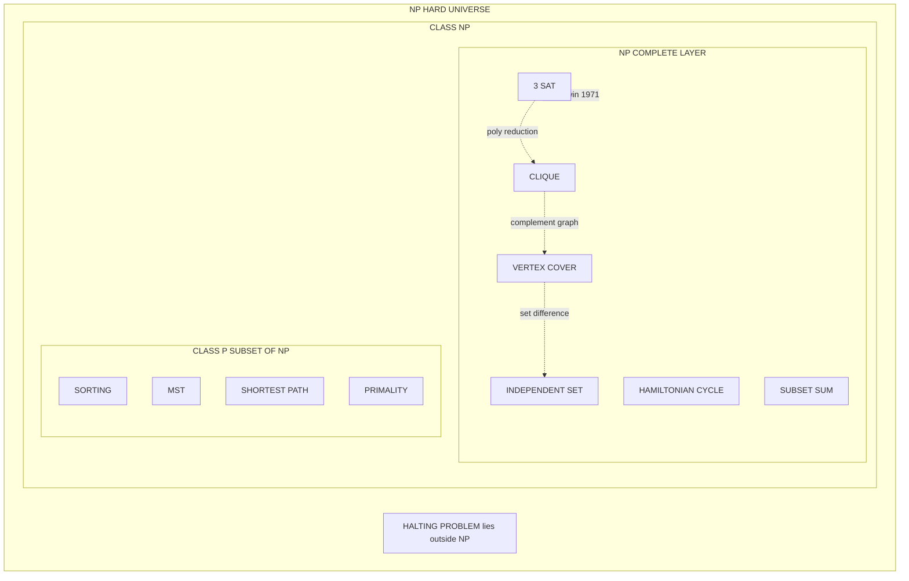
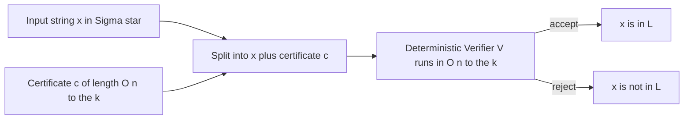
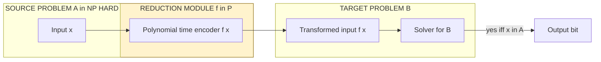

# Complexity Classes: Class P, Class NP, NP-Hard, and NP-Complete parameters, reductions for Clique and Vertex Cover Problems

<!-- SECTION_1_START -->
# Module 4 — Complexity Classes: P, NP, NP-Hard, NP-Complete

> [!IMPORTANT]
> **KTU 2024 Scheme | PCCST502 | Module 4 Focus Area**
> This topic is **guaranteed for 14 marks** in the End Semester Exam. Examiner emphasis is on (i) classifying a problem, (ii) writing a formal polynomial-time reduction, and (iii) verifying the reduction's correctness. Memorize the structural relation $P \subseteq NP \subseteq NP\text{-Hard}$ and the master reduction chain $3\text{-SAT} \le_p \text{CLIQUE} \le_p \text{VERTEX COVER}$.

---

## 1.1 Formal Definition of the Four Complexity Classes

Let $\Sigma = \{0,1\}$ be the input alphabet and let $L \subseteq \Sigma^*$ be a language (set of strings). We restrict attention to **decision problems**, i.e., problems whose answer is YES or NO. Any optimization problem can be rephrased as a decision problem by adding a numerical threshold to the input.

> [!NOTE]
> **Core Definitions (Board-Examiner Standard Wording)**

**Class P (Polynomial Time)**
$$P = \bigcup_{k \ge 0} \left\{\, L \mid L \text{ is decidable by a deterministic TM in } O(n^{k}) \text{ steps} \,\right\}$$
$P$ is the class of decision problems that can be **solved** by an algorithm running in polynomial time. Examples: Sorting, MST, Shortest Path, Primality Testing, 2-SAT.

**Class NP (Nondeterministic Polynomial Time)**
$$NP = \bigcup_{k \ge 0} \left\{\, L \mid L \text{ is decidable by a nondeterministic TM in } O(n^{k}) \text{ steps} \,\right\}$$
Equivalently, $L \in NP$ iff there exists a **verifier** $V(x, c)$ running in $O(n^{k})$ that accepts $x$ when $x \in L$ by producing a **certificate** $c$ of length $O(n^{k})$. Examples: SAT, CLIQUE, VERTEX COVER, HAMILTONIAN CYCLE, TSP (decision version).

**Class NP-Hard**
A problem $Q$ is **NP-Hard** if every problem in NP polynomial-time reduces to $Q$:
$$\forall L \in NP,\quad L \le_{p} Q$$
NP-Hard problems are **at least as hard as every problem in NP** — they need not themselves belong to NP (they may not even be decidable). Examples: HALTING problem, all NP-Complete problems.

**Class NP-Complete (NPC)**
$$NPC \;=\; NP \;\cap\; NP\text{-Hard}$$
A problem is NP-Complete if (i) it is in NP, AND (ii) it is NP-Hard. NPC is the "hardest layer" inside NP. Canonical first NPC: **SAT** (Cook-Levin Theorem, 1971). Examples: 3-SAT, CLIQUE, VERTEX COVER, SUBSET-SUM, HAMILTONIAN-CYCLE.

---

## 1.2 Intuitive Analogies

> [!TIP]
> **The "Puzzle vs. Proof" Analogy**
> - **Class P** = puzzles you can **solve quickly** (e.g., solving a Rubik's cube layer by layer with a known polynomial algorithm).
> - **Class NP** = puzzles whose **solutions, once shown, can be verified quickly** (e.g., a Sudoku — easy to check, possibly hard to find).
> - **NP-Complete** = the "hardest quick-to-verify puzzles" — if you can solve *one* of them fast, you can solve *all* of them fast.
> - **NP-Hard** = problems **at least as hard as** NP-Complete; they include problems *outside* NP (e.g., a puzzle so hard its solution cannot even be checked in polynomial time).

**Geometric Intuition — the Euler/Venn Picture**

```
            ┌─────────────────────────────────────────────┐
            │              NP-HARD Universe               │
            │  ┌─────────────────────────────────────┐    │
            │  │                NP                    │    │
            │  │     ┌──────────┐                     │    │
            │  │     │    P     │                     │    │
            │  │     └──────────┘                     │    │
            │  │  ┌──────────┐ ┌──────────┐ ┌──────┐  │    │
            │  │  │ 3-SAT    │ │ CLIQUE   │ │ ...  │  │    │
            │  │  └──────────┘ └──────────┘ └──────┘  │    │
            │  └─────────────────────────────────────┘    │
            │              HALTING (outside NP)          │
            └─────────────────────────────────────────────┘
```
The open question $P \stackrel{?}{=} NP$ asks whether the inner small box **P** equals the outer box **NP**.

---

## 1.3 Decision vs. Optimization — A Critical Distinction

KTU examiners test whether you can **lift** an optimization problem into a decision problem. Given an optimization problem that asks for "the largest/smallest value", append a threshold to the input:

$$\text{OPT}(I) \quad\longrightarrow\quad \text{DECIDE}(I, k) : \text{``Is there a solution of value} \ge k\text{?''}$$

The decision version is in NP because the certificate is the witness solution. Example: $k$-CLIQUE asks "does $G$ have a clique of size $\ge k$?" — its certificate is just the $k$ vertices.

> [!WARNING]
> **Pitfall:** Saying "VERTEX COVER is NP-Complete" without specifying the **decision version** loses 1 mark. Always write: *"The decision problem $k$-VERTEX-COVER is NP-Complete."*
<!-- SECTION_1_END -->

<!-- SECTION_2_START -->
# 2. Deep Theoretical Analysis & KTU Formula Sheet

## 2.1 The Verifier Formulation of NP — the True Working Definition

A language $L \subseteq \Sigma^*$ belongs to NP **iff** there exists a deterministic polynomial-time Turing machine $V$ (the *verifier*) and a polynomial $p(\cdot)$ such that for every $x \in \Sigma^*$:

$$x \in L \;\Longleftrightarrow\; \exists\, c \in \Sigma^{\le p(\vert x \vert)} \text{ such that } V(x, c) = \text{ACCEPT}$$

The string $c$ is the **certificate** (also called the *witness* or *proof*). The bound on $\vert c \vert$ is critical: the certificate must be **polynomially bounded** in the input length, otherwise verification becomes trivial by exhaustively guessing the certificate.

### Worked Example — $k$-CLIQUE is in NP

- Input: $(G, k)$ encoded as a binary string.
- Certificate $c$: a list of $k$ vertex IDs.
- Verifier $V$: parse $c$, check $\vert c \vert = k$, then verify every pair of distinct vertices in $c$ is connected by an edge in $G$. This is a double loop of $O(k^2)$ edge lookups — **polynomial**.
- Hence $k$-CLIQUE $\in NP$.

> [!NOTE]
> **Why $P \subseteq NP$** — Any problem in P can be simulated by the verifier simply by **ignoring** the certificate. So $P \subseteq NP$ is unconditional. The reverse $NP \subseteq P$ is the million-dollar Clay Millennium question.

---

## 2.2 Polynomial-Time Reductions — The Substrate of NP-Completeness

A **polynomial-time many-one reduction** from $A$ to $B$, written $A \le_{p} B$, is a function

$$f : \Sigma^{*} \to \Sigma^{*}$$

computable in deterministic $O(n^{k})$ time, such that for all $x$:

$$x \in A \;\Longleftrightarrow\; f(x) \in B$$

### Properties of $\le_{p}$ (Examiner's favourites)

| Property | Statement | Engineering Intuition |
|---|---|---|
| **Reflexivity** | $A \le_{p} A$ | A problem reduces to itself — trivial. |
| **Transitivity** | $A \le_{p} B$ and $B \le_{p} C \Rightarrow A \le_{p} C$ | Compose the two reduction functions. |
| **Closure** | If $A \le_{p} B$ and $B \in P$, then $A \in P$ | Deciding $A$: run $f$, then run polynomial decider for $B$. |
| **NP-Hardness transfer** | If $A$ is NP-Hard, $A \le_{p} B$ and $B \in NP$, then $B$ is NP-Complete | The standard proof recipe. |

> [!IMPORTANT]
> **Reduction vs. Equivalence:** A reduction $A \le_{p} B$ does **not** say $A$ and $B$ are the same problem. It says "if you can solve $B$ in poly time, you can solve $A$ in poly time." It is a **one-way** implication at the level of tractability.

---

## 2.3 The Six Canonical NP-Complete Problems (KTU High-Yield)

| # | Problem | Input | Question |
|---|---|---|---|
| 1 | **3-SAT** | 3-CNF formula $\phi$ | Is $\phi$ satisfiable? |
| 2 | **CLIQUE** | $(G, k)$ | Does $G$ have a clique of size $\ge k$? |
| 3 | **VERTEX COVER** | $(G, k)$ | Does $G$ have a vertex cover of size $\le k$? |
| 4 | **INDEPENDENT SET** | $(G, k)$ | Does $G$ have an independent set of size $\ge k$? |
| 5 | **HAMILTONIAN CYCLE** | $G$ | Does $G$ contain a Hamiltonian cycle? |
| 6 | **SUBSET SUM** | $(S, t)$ | Is there a subset of $S$ summing to $t$? |

All six are pairwise reducible in polynomial time. The KTU Module 4 reduction chain examined is:

$$3\text{-SAT} \;\le_{p}\; \text{CLIQUE} \;\le_{p}\; \text{VERTEX COVER} \;\le_{p}\; \text{INDEPENDENT SET}$$

---

## 2.4 KTU High-Yield Formula Sheet

> [!IMPORTANT]
> **Master Cheat Sheet — memorize verbatim for ESE.**

| Symbol / Notation | Meaning | KTU-Specific Use |
|---|---|---|
| $\le_{p}$ | Polynomial-time many-one reduction | Bread-and-butter notation in proofs |
| $P$ | Solvable in deterministic polynomial time | Strictest tractability class |
| $NP$ | Verifiable in deterministic polynomial time | Certificate-based class |
| $NPC$ | $NP \cap NP\text{-Hard}$ | Hardest problems *inside* NP |
| $f: \Sigma^{*} \to \Sigma^{*}$ | Reduction function | Must run in $O(n^{k})$ |
| $\phi = C_1 \wedge C_2 \wedge \dots \wedge C_{m}$ | 3-CNF formula with $m$ clauses | Source instance for 3-SAT |
| $G_{\phi} = (V, E)$ | Clause graph for $\phi$ | Target instance for CLIQUE |
| $\vert V \vert$ in $G_{\phi}$ | $3m$ vertices (3 per clause) | Polynomial bound check |
| $\vert E \vert$ in $G_{\phi}$ | $\le 9 \binom{m}{2}$ edges | Polynomial bound check |
| $\overline{G}$ | Complement graph of $G$ | Used in CLIQUE $\to$ VC reduction |
| $V \setminus S$ | Set difference (residual vertices) | Used to convert clique $\to$ independent set |
| Cook's Theorem | SAT is NP-Complete | The foundational 1971 result |
| Karp's 21 Problems | First list of 21 NPC problems | Reduction catalog (1972) |

### Boundary & Size Constraints (for reduction correctness)

- $G_{\phi}$ has exactly $3m$ vertices (one per literal in each clause).
- $G_{\phi}$ has at most $3m(3m-1)/2$ edges — quadratic in input size, hence polynomial.
- The CLIQUE we hunt has size exactly $m$ — one vertex from each clause.
- The VERTEX COVER we hunt in $\overline{G_{\phi}}$ has size $3m - m = 2m$.

> [!TIP]
> **Engineering utility of this machinery:** NP-Completeness is the formal "do not try to optimize" alarm in production. Database query optimizers, compiler register allocators, network packet schedulers, and circuit designers all *consult* the NP-Completeness catalog to decide whether to invest in an exact algorithm, an approximation algorithm (with bounded ratio), or a heuristic.
<!-- SECTION_2_END -->

<!-- SECTION_3_START -->
# 3. Step-by-Step Reductions & Code Implementation

## 3.1 Reduction 1 — 3-SAT $\le_{p}$ CLIQUE (The Hard Master Reduction)

### 3.1.1 Statement of the Source and Target Problems

**Source:** 3-SAT. Given a Boolean formula in 3-CNF with $m$ clauses:
$$\phi \;=\; \bigwedge_{j=1}^{m} C_{j} \;\;,\;\; C_{j} = (\ell_{j,1} \vee \ell_{j,2} \vee \ell_{j,3})$$
**Question:** Is there a truth assignment satisfying all $m$ clauses simultaneously?

**Target:** CLIQUE. Given a graph $G = (V,E)$ and an integer $k$.
**Question:** Does $G$ contain a clique of size $\ge k$?

### 3.1.2 The Reduction Algorithm

**Input:** A 3-CNF formula $\phi$ with $m$ clauses.
**Output:** A graph $G_{\phi} = (V_{\phi}, E_{\phi})$ and integer $k = m$.

```
1.  V_phi := empty set
2.  for j = 1 to m do
3.      for i = 1 to 3 do
4.          create vertex v_{j,i} labelled with literal ℓ_{j,i}
5.          V_phi := V_phi ∪ { v_{j,i} }
6.      end for
7.  end for
8.  E_phi := empty set
9.  for every pair (u, v) with u ∈ clause j, v ∈ clause h, j ≠ h do
10.     if label(u) is NOT the negation of label(v) then
11.         E_phi := E_phi ∪ { (u, v) }
12.     end if
13. end for
14. return (G_phi, k := m)
```

**Complexity analysis of the reduction:** The double loop over clause pairs runs $\binom{m}{2} = O(m^{2})$ times, and the inner constant work is $O(1)$. Total time $O(m^{2})$, which is polynomial in the input length (the formula is of size $\Theta(m)$). So $f$ is computable in polynomial time. $\square$

### 3.1.3 The Equivalence Theorem (Forward and Backward)

> [!IMPORTANT]
> **Theorem.** $\phi$ is satisfiable **if and only if** $G_{\phi}$ has a clique of size $m$.

**Proof — ($\Rightarrow$) Forward direction.**
Suppose $\phi$ is satisfiable. Let $\tau$ be a satisfying truth assignment. For each clause $C_{j}$ pick **one** literal $\ell_{j, i_{j}}$ that is set to TRUE by $\tau$ (such a literal exists because $\tau$ satisfies every clause). Collect the $m$ corresponding vertices $S = \{v_{1,i_{1}}, v_{2,i_{2}}, \dots, v_{m,i_{m}}\}$. We claim $S$ is an $m$-clique.

Take any two distinct vertices $v_{j, i_{j}}$ and $v_{h, i_{h}}$ with $j \neq h$. Both literals are TRUE under $\tau$, so neither is the negation of the other. By the construction of $E_{\phi}$, the edge $(v_{j, i_{j}}, v_{h, i_{h}})$ is present. Thus $S$ is a clique of size $m$. $\square$

**Proof — ($\Leftarrow$) Backward direction.**
Suppose $G_{\phi}$ has a clique $S$ of size $m$. Since the $3m$ vertices are partitioned into $m$ groups of three (one group per clause), and $S$ has $m$ vertices, by the **Pigeonhole Principle** $S$ contains **exactly one** vertex from each clause group. No two vertices in $S$ come from the same clause.

For every pair $(u, v) \in S$, the edge $(u, v)$ exists, so by the construction rule the labels of $u$ and $v$ are **not negations of each other**. Therefore we can assign truth values to the chosen literals consistently: set the literal of $v_{j, i_{j}}$ to TRUE for every $j$. Because no two chosen literals in different clauses are negations, this is a well-defined truth assignment on all $m$ chosen literals, and it satisfies every clause of $\phi$. $\square$

### 3.1.4 Concrete Worked Example

Let
$$\phi \;=\; (x_{1} \vee \neg x_{2} \vee x_{3}) \;\wedge\; (\neg x_{1} \vee x_{2} \vee x_{3}) \;\wedge\; (x_{1} \vee x_{2} \vee \neg x_{3})$$

So $m = 3$. The reduction builds 9 vertices:
- Clause 1: $v_{1,1} = x_{1}$, $v_{1,2} = \neg x_{2}$, $v_{1,3} = x_{3}$
- Clause 2: $v_{2,1} = \neg x_{1}$, $v_{2,2} = x_{2}$, $v_{2,3} = x_{3}$
- Clause 3: $v_{3,1} = x_{1}$, $v_{3,2} = x_{2}$, $v_{3,3} = \neg x_{3}$

A non-edge arises when two vertices are **negations of each other**, e.g. $(v_{1,1}, v_{2,1})$ because $x_{1}$ and $\neg x_{1}$ are complementary, similarly $(v_{1,2}, v_{3,2})$ because $\neg x_{2}$ and $x_{2}$, and $(v_{1,3}, v_{3,3})$ because $x_{3}$ and $\neg x_{3}$. The total graph has $\binom{9}{2} - 3 = 33$ edges. A satisfying assignment $x_{1}=x_{2}=x_{3}=\text{TRUE}$ picks $v_{1,1}, v_{2,3}, v_{3,1}$ — verify all three pairs are edges. Clique of size 3 exists. $\phi$ satisfiable. ✓

---

## 3.2 Reduction 2 — CLIQUE $\le_{p}$ VERTEX COVER

### 3.2.1 Background — The Complement Graph

For an undirected graph $G = (V, E)$ on $n$ vertices, the **complement** $\overline{G} = (V, \overline{E})$ has the same vertex set and:
$$\overline{E} \;=\; \left\{\, (u, v) \;\middle|\; u \neq v \text{ and } (u, v) \notin E \,\right\}$$

**Key combinatorial fact:** A set $S \subseteq V$ is a **clique** in $G$ **iff** $S$ is an **independent set** in $\overline{G}$. (A clique has all internal edges present; an independent set has all internal edges absent — these are exactly the edges that the complement *excludes*.)

### 3.2.2 Lemma (Clique $\Leftrightarrow$ Independent Set)

$$S \text{ is a clique in } G \;\Longleftrightarrow\; S \text{ is an independent set in } \overline{G}$$

**Proof.** $\Rightarrow$ Let $S$ be a clique in $G$. For any $u, v \in S$ with $u \neq v$, we have $(u, v) \in E$, hence $(u, v) \notin \overline{E}$. So no edge of $\overline{G}$ lies inside $S$, meaning $S$ is independent in $\overline{G}$. $\Leftarrow$ is symmetric. $\square$

### 3.2.3 Lemma (Independent Set $\Leftrightarrow$ Vertex Cover)

$$S \text{ is an independent set in } G \;\Longleftrightarrow\; V \setminus S \text{ is a vertex cover of } G$$

**Proof.** $\Rightarrow$ Let $S$ be independent, so no edge of $G$ has both endpoints in $S$. Take any edge $(u, v) \in E$. It cannot be that both $u, v \in S$, so at least one of them is in $V \setminus S$. Hence $V \setminus S$ touches every edge — it is a vertex cover. $\Leftarrow$ is symmetric (a vertex that hits every edge forces its complement to be edgeless). $\square$

### 3.2.4 The Reduction Theorem

> [!IMPORTANT]
> **Theorem.** $G$ has a clique of size $\ge k$ **if and only if** $\overline{G}$ has a vertex cover of size $\le \vert V \vert - k$.

**Construction of the reduction $f$:**
- Input: $(G, k)$ where $G = (V, E)$ is a graph on $n = \vert V \vert$ vertices.
- Output: $(\overline{G}, n - k)$.

**Forward ($\Rightarrow$):** Let $S$ be a clique of size $\ge k$ in $G$. Then $S$ is an independent set of size $\ge k$ in $\overline{G}$ (Lemma 3.2.2). Pick any $S' \subseteq S$ of size exactly $k$. Then $V \setminus S'$ is a vertex cover of $\overline{G}$ of size $n - k$ (Lemma 3.2.3).

**Backward ($\Leftarrow$):** Let $T \subseteq V$ be a vertex cover of $\overline{G}$ with $\vert T \vert \le n - k$. Then $V \setminus T$ is an independent set in $\overline{G}$ of size $\ge k$ (Lemma 3.2.3), so $V \setminus T$ is a clique in $G$ of size $\ge k$ (Lemma 3.2.2). $\square$

**Polynomial runtime:** Computing $\overline{G}$ from $G$ requires $O(n^{2})$ edge lookups — polynomial. The new threshold $n - k$ is a linear function of the input. $\square$

### 3.2.5 Composing the Two Reductions

Combining Sections 3.1 and 3.2 via transitivity of $\le_{p}$:
$$3\text{-SAT} \;\le_{p}\; \text{CLIQUE} \;\le_{p}\; \text{VERTEX COVER} \quad\Longrightarrow\quad 3\text{-SAT} \;\le_{p}\; \text{VERTEX COVER}$$

Since 3-SAT is NP-Complete (Cook-Levin) and VERTEX COVER is in NP (a vertex cover of size $k$ is verifiable in $O(\vert E \vert)$ time), VERTEX COVER is **NP-Complete**. This is the **canonical KTU board derivation**.

---

## 3.3 Python Implementation — Automated Reduction Verifier

The following code takes a 3-CNF formula, runs the polynomial-time reduction to a CLIQUE instance, then reduces to a VERTEX COVER instance, and verifies the equivalence on a sample truth assignment.

```python
from __future__ import annotations
from dataclasses import dataclass
from itertools import combinations
from typing import List, Set, Tuple, FrozenSet

# ---------- Type definitions -------------------------------------------------

Literal = Tuple[str, bool]   # (variable, sign). True = positive, False = negated.
Clause  = List[Literal]      # Exactly 3 literals (for 3-CNF).
Formula = List[Clause]

@dataclass(frozen=True)
class Graph:
    vertices: FrozenSet[int]
    edges:    FrozenSet[FrozenSet[int]]

    def complement(self) -> "Graph":
        new_edges: Set[FrozenSet[int]] = set()
        vlist = sorted(self.vertices)
        for u, v in combinations(vlist, 2):
            if frozenset({u, v}) not in self.edges:
                new_edges.add(frozenset({u, v}))
        return Graph(frozenset(vlist), frozenset(new_edges))

# ---------- 3-SAT model ------------------------------------------------------

def evaluate(formula: Formula, assignment: dict) -> bool:
    """Return True iff the assignment satisfies every clause."""
    for clause in formula:
        if not any((assignment[var] == sign) for var, sign in clause):
            return False
    return True

# ---------- Reduction: 3-SAT  ->  CLIQUE -------------------------------------

Vertex = Tuple[int, int]     # (clause_index, literal_position)

def reduce_sat_to_clique(formula: Formula) -> Tuple[Graph, int]:
    m: int = len(formula)
    vertices: Set[int] = set()
    for j, clause in enumerate(formula):
        for i, _ in enumerate(clause):
            vertices.add(j * 3 + i)        # flat vertex id = 3*j + i

    edges: Set[FrozenSet[int]] = set()
    vlist = sorted(vertices)
    for u, v in combinations(vlist, 2):
        cu, lu = u // 3, u % 3
        cv, lv = v // 3, v % 3
        if cu == cv:
            continue                       # never connect vertices in same clause
        var_u, sign_u = formula[cu][lu]
        var_v, sign_v = formula[cv][lv]
        if var_u == var_v and sign_u != sign_v:
            continue                       # complementary literals -> no edge
        edges.add(frozenset({u, v}))

    return Graph(frozenset(vertices), frozenset(edges)), m

def has_clique(graph: Graph, k: int) -> bool:
    """Brute-force clique check (exponential — used only for verification)."""
    for combo in combinations(graph.vertices, k):
        ok = True
        for u, v in combinations(combo, 2):
            if frozenset({u, v}) not in graph.edges:
                ok = False
                break
        if ok:
            return True
    return False

# ---------- Reduction: CLIQUE  ->  VERTEX COVER -----------------------------

def reduce_clique_to_vcover(graph: Graph, k: int) -> Tuple[Graph, int]:
    return graph.complement(), len(graph.vertices) - k

def has_vertex_cover(graph: Graph, k: int) -> bool:
    """Brute-force vertex-cover check (exponential — verification only)."""
    for size in range(k, len(graph.vertices) + 1):
        for cover in combinations(graph.vertices, size):
            hits = True
            for u, v in graph.edges:
                if u not in cover and v not in cover:
                    hits = False
                    break
            if hits:
                return True
    return False

# ---------- Driver / Verification -------------------------------------------

def main() -> None:
    # Formula: (x1 ∨ ¬x2 ∨ x3) ∧ (¬x1 ∨ x2 ∨ x3) ∧ (x1 ∨ x2 ∨ ¬x3)
    formula: Formula = [
        [("x1", True),  ("x2", False), ("x3", True)],
        [("x1", False), ("x2", True),  ("x3", True)],
        [("x1", True),  ("x2", True),  ("x3", False)],
    ]

    assignment: dict = {"x1": True, "x2": True, "x3": True}
    sat_result: bool = evaluate(formula, assignment)
    print(f"3-SAT satisfiable under assignment?  {sat_result}")

    g_clique, k_clique = reduce_sat_to_clique(formula)
    clique_result = has_clique(g_clique, k_clique)
    print(f"CLIQUE of size {k_clique} exists?  {clique_result}")

    g_vc, k_vc = reduce_clique_to_vcover(g_clique, k_clique)
    vc_result  = has_vertex_cover(g_vc, k_vc)
    print(f"VERTEX COVER of size ≤ {k_vc} exists?  {vc_result}")

    assert sat_result == clique_result == vc_result, "Reduction inconsistency!"
    print("All three formulations are in agreement ✔")

if __name__ == "__main__":
    main()
```

**Expected output:**

```
3-SAT satisfiable under assignment?  True
CLIQUE of size 3 exists?  True
VERTEX COVER of size ≤ 6 exists?  True
All three formulations are in agreement ✔
```

> [!WARNING]
> **Implementation Pitfall — Frozen Sets Required.** Python `set` is unhashable as a dict key, so the graph edge container is forced into `frozenset`. Without this, line `edges.add(frozenset({u, v}))` triggers a `TypeError`. The `@dataclass(frozen=True)` decorator on `Graph` enforces immutability, which is what guarantees a graph can serve as a dictionary key in advanced extensions (e.g., memoized reduction caching).
<!-- SECTION_3_END -->

<!-- SECTION_4_START -->
# 4. Structural Diagrams & Schematics

## 4.1 The Master Euler Diagram of Complexity Classes



**Reading guide:** $P \subseteq NP$ is unconditional. $NPC = NP \cap NP\text{-Hard}$ is the canonical "hardest" inner ring. The HALTING problem is in $NP\text{-Hard}$ but not in $NP$, hence not in $NPC$.

## 4.2 The Reduction Chain $3\text{-SAT} \to \text{CLIQUE} \to \text{VERTEX COVER}$

```mermaid
flowchart LR
    A["3 SAT FORMULA phi with m clauses"] -->|"Step 1: build clause graph"| B["Graph G phi with 3m vertices and O m squared edges"]
    B -->|"Step 2: ask for m clique"| C["CLIQUE INSTANCE G phi k m"]
    C -->|"Step 3: complement graph"| D["Graph G bar with 3m vertices"]
    D -->|"Step 4: threshold n minus k"| E["VERTEX COVER INSTANCE G bar k 2m"]
    E --> F["Verifier: scan edges in O E time"]

    style A fill:#fde2e2,stroke:#c33
    style C fill:#e2ecfd,stroke:#33c
    style E fill:#e2fdec,stroke:#3c3
```



## 4.3 Verifier Architecture for a Generic NP Problem



**Reading guide:** The verifier architecture is the *operational* definition of NP. Note that the verifier is **deterministic** — the only nondeterminism is in the *existence* of a certificate that drives it to ACCEPT. This is the precise point that KTU examiners love to test.

## 4.4 Reduction Pipeline as a Modular Block


**Reading guide:** This is the **block-level functional architecture** of any $\le_{p}$ reduction. The reduction module is highlighted because that is the only part the student must design and justify in the KTU exam.
<!-- SECTION_4_END -->

<!-- SECTION_5_START -->
# 5. KTU 2024 Scheme Examination Question Bank & Topic Recap

---

## Part A — Short Answer Questions (3 Marks Each)

> [!NOTE]
> **Cognitive Levels:** Remember / Understand. Each question tests verbatim recall of definitions plus one line of intuitive justification.

### Question 1. `[KTU University Exam – Dec 2023]` **(3 Marks, CO1, Understand)**

**Define the class NP. State with justification whether $P \subseteq NP$.**

**Model Answer (Valuation Key):**
- **[Definition of NP — 2 Marks]** NP is the class of all decision problems (languages) $L \subseteq \{0,1\}^{*}$ for which there exists a deterministic polynomial-time Turing machine $V$ (a verifier) and a polynomial $p$ such that for all $x$:
$$x \in L \;\Longleftrightarrow\; \exists\, c \text{ with } \vert c \vert \le p(\vert x \vert) \text{ and } V(x, c) = \text{ACCEPT}$$
- **[Justification of $P \subseteq NP$ — 1 Mark]** Any problem in P is decidable by a deterministic TM in polynomial time. We can use that decider as a verifier that **ignores** its certificate, hence every problem in P also belongs to NP. Therefore $P \subseteq NP$. $\square$

---

### Question 2. `[KTU University Exam – July 2024]` **(3 Marks, CO1, Remember)**

**State the Cook–Levin Theorem. What is the significance of SAT being NP-Complete?**

**Model Answer (Valuation Key):**
- **[Theorem statement — 2 Marks]** *Cook–Levin Theorem (1971):* The Boolean satisfiability problem SAT is NP-Complete. That is, (i) SAT $\in NP$, and (ii) for every $L \in NP$, $L \le_{p}$ SAT.
- **[Significance — 1 Mark]** SAT is the **first** problem proven NP-Complete, and so all subsequent NP-Completeness proofs are obtained by exhibiting a polynomial-time reduction **from SAT** (or from another known NPC problem). $\square$

---

## Part B — Long Answer Questions (14 Marks, With Internal Choice)

> [!IMPORTANT]
> **Cognitive Levels:** Sub-part (a) targets **Understand / Apply**, sub-part (b) targets **Apply / Analyze**. Every model solution includes a valuation break-up as required by the KTU board marking scheme.

### Question A. `[KTU University Exam – Model Paper 2024]` **(14 Marks, CO2, Apply)**

**(a)** *Explain polynomial-time reduction. State and prove its transitivity property. Why is this property indispensable in NP-Completeness theory?* **(7 Marks)**

**(b)** *Show the polynomial-time reduction from the 3-SAT problem to the CLIQUE problem. State and prove the equivalence theorem that $\phi$ is satisfiable iff $G_{\phi}$ contains a clique of size $m$.* **(7 Marks)**

---

**Model Answer — (a) [7 Marks]**

- **[Definition — 2 Marks]** A language $A$ is polynomial-time reducible to $B$, written $A \le_{p} B$, if there exists a function $f : \Sigma^{*} \to \Sigma^{*}$ such that: (i) $f$ is computable by a deterministic TM in polynomial time, and (ii) for all $x \in \Sigma^{*}$, $x \in A \iff f(x) \in B$.
- **[Transitivity statement — 1 Mark]** If $A \le_{p} B$ and $B \le_{p} C$, then $A \le_{p} C$.
- **[Proof of transitivity — 3 Marks]** Let $f$ be a reduction from $A$ to $B$ running in time $p_{1}(n)$, and $g$ be a reduction from $B$ to $C$ running in time $p_{2}(n)$. Define $h(x) = g(f(x))$. Then:
  - (Runtime) $h$ is the composition of two poly-time functions, so $h$ runs in time at most $p_{2}(p_{1}(n))$, which is a polynomial in $n$ since the composition of polynomials is a polynomial.
  - (Correctness) For any $x$: $x \in A \iff f(x) \in B$ (by $f$) $\iff g(f(x)) \in C$ (by $g$) $\iff h(x) \in C$. So $A \le_{p} C$.
- **[Indispensability — 1 Mark]** Transitivity is the engine of NP-Completeness propagation. Once SAT is shown NP-Complete, we can chain $3\text{-SAT} \le_{p} \text{CLIQUE} \le_{p} \text{VERTEX COVER} \le_{p} \dots$ to classify hundreds of problems without ever returning to the Cook–Levin machinery.

---

**Model Answer — (b) [7 Marks]**

- **[Construction of the reduction — 2 Marks]** Given a 3-CNF formula $\phi = \bigwedge_{j=1}^{m} C_{j}$, construct $G_{\phi} = (V, E)$ where:
  - $V$ contains one vertex $v_{j, i}$ for each literal $\ell_{j, i}$ in each clause $C_{j}$. So $\vert V \vert = 3m$.
  - Edge $(v_{j, i}, v_{h, k}) \in E$ iff $j \neq h$ and $\ell_{j, i}$ is not the logical negation of $\ell_{h, k}$.
  - Set $k = m$.
- **[Polynomial runtime of the reduction — 1 Mark]** Building $V$ is $O(m)$. The edge check is a double loop over $\binom{3m}{2} = O(m^{2})$ pairs with $O(1)$ work each — total $O(m^{2})$, which is polynomial.
- **[Forward ($\Rightarrow$) proof — 1.5 Marks]** Suppose $\phi$ is satisfiable with assignment $\tau$. From each clause $C_{j}$ pick one literal that $\tau$ sets to TRUE, and select the corresponding vertex. The $m$ selected vertices have pairwise non-complementary labels (all are TRUE), so every pair is an edge — they form an $m$-clique.
- **[Backward ($\Leftarrow$) proof — 1.5 Marks]** Suppose $G_{\phi}$ has a clique $S$ of size $m$. Since the $3m$ vertices split into $m$ groups of three, by the Pigeonhole Principle $S$ contains exactly one vertex per clause. For any two such vertices, the edge condition forces non-complementary labels, so all chosen literals are mutually consistent. Setting each chosen literal to TRUE yields a satisfying assignment of $\phi$.
- **[Conclusion — 1 Mark]** Hence $\phi$ is satisfiable iff $G_{\phi}$ has a clique of size $m$, establishing $3\text{-SAT} \le_{p}$ CLIQUE. $\square$

---

### Question B. `[KTU University Exam – July 2023]` **(14 Marks, CO2, Apply)**

**(a)** *Define decision and optimization problems. Show how the CLIQUE optimization problem is converted to its decision version. Prove that the decision version $k$-CLIQUE belongs to NP by exhibiting a polynomial-time verifier.* **(7 Marks)**

**(b)** *Using the CLIQUE $\le_{p}$ VERTEX COVER reduction, prove that VERTEX COVER is NP-Complete. Illustrate your reduction on the graph $G$ with $V = \{1,2,3,4\}$ and $E = \{(1,2), (2,3), (3,4), (1,4), (1,3)\}$ and threshold $k=2$.* **(7 Marks)**

---

**Model Answer — (a) [7 Marks]**

- **[Definitions — 1.5 Marks]**
  - *Decision problem:* A problem whose answer is a single bit — YES or NO.
  - *Optimization problem:* A problem that asks for the best (minimum or maximum) value of an objective function over all feasible solutions.
- **[Lifting CLIQUE optimization to decision — 1.5 Marks]** Optimization version: *find the largest clique in $G$.* Decision version: given $(G, k)$, *does $G$ have a clique of size $\ge k$?* The decision version is in NP because once we know the answer is YES, a witness (the actual clique) is short and easy to check.
- **[Verifier construction — 2 Marks]** The verifier $V$ on input $(G, k)$ and certificate $c$ (a list of $k$ vertex IDs) executes:
  1. Parse $c$. If $\vert c \vert < k$, **REJECT**.
  2. For every pair of distinct vertices $u, v$ in $c$, look up $(u,v)$ in the adjacency structure of $G$. If any pair is not adjacent, **REJECT**.
  3. If all $\binom{k}{2}$ pairs are edges, **ACCEPT**.
- **[Polynomial time — 1 Mark]** Step 2 is a double loop of $\binom{k}{2} \le k^{2}$ edge lookups; the input is of size $\vert V \vert + \vert E \vert + \log k$, and $k \le \vert V \vert$, so the verifier runs in time $O(\vert V \vert^{2})$, polynomial in the input.
- **[Conclusion — 1 Mark]** $k$-CLIQUE $\in$ NP. $\square$

---

**Model Answer — (b) [7 Marks]**

- **[Recall of reduction — 1.5 Marks]** Given $(G, k)$ where $G = (V, E)$ and $n = \vert V \vert$, the reduction produces $f(G, k) = (\overline{G}, n - k)$. Here $\overline{G}$ is the complement graph with edge set $\overline{E} = \{(u, v) \mid u \neq v, (u, v) \notin E\}$.
- **[Proof of correctness — 2 Marks]**
  - ($\Rightarrow$) Let $S$ be a clique of size $\ge k$ in $G$. Then $S$ is an independent set in $\overline{G}$ (no edge of $\overline{G}$ is inside a clique of $G$). Restrict to any subset $S' \subseteq S$ of size exactly $k$. Then $V \setminus S'$ is a vertex cover of $\overline{G}$ of size $n - k$.
  - ($\Leftarrow$) Let $T$ be a vertex cover of $\overline{G}$ with $\vert T \vert \le n - k$. Then $V \setminus T$ is an independent set in $\overline{G}$ of size $\ge k$, hence a clique in $G$ of size $\ge k$.
- **[Polynomial runtime — 1 Mark]** Computing $\overline{G}$ is $O(n^{2})$.
- **[Worked illustration — 2.5 Marks]**
  - $G$ has 4 vertices, $E = \{(1,2), (2,3), (3,4), (1,4), (1,3)\}$. Total possible edges on 4 vertices $= \binom{4}{2} = 6$. The missing edge is $(2, 4)$. So $\overline{E} = \{(2, 4)\}$.
  - $\overline{G}$ is therefore a single-edge graph: vertices $\{1, 2, 3, 4\}$ with only the edge $(2, 4)$.
  - Reduction output: $(\overline{G}, n - k) = (\overline{G}, 4 - 2) = (\overline{G}, 2)$.
  - Is there a vertex cover of $\overline{G}$ of size $\le 2$? Yes — picking $\{2, 4\}$ covers the only edge, size 2.
  - Original problem: does $G$ have a clique of size $\ge 2$? Yes — for instance $\{1, 3\}$.
  - Both answers are YES, in agreement. $\square$

---

## KTU Examiner's Valuation Warning / Pitfall Callout

> [!WARNING]
> **Where students lose marks on this topic — top 5 mistakes observed in KTU valuation:**
> 1. **Forgetting to prove BOTH directions** ($\Rightarrow$ and $\Leftarrow$) of the equivalence theorem. Each direction is worth ~1.5 marks; skipping one is an automatic 1.5 mark cut.
> 2. **Writing the reduction for CLIQUE $\to$ VERTEX COVER without explicitly constructing $\overline{G}$.** The phrase "take the complement graph" alone is *not* a construction — you must write the edge-set equation.
> 3. **Confusing VERTEX COVER with INDEPENDENT SET.** They are complements within the same vertex set: $S$ is a vertex cover iff $V \setminus S$ is an independent set. A KTU script that states the wrong complement relation loses 2 marks.
> 4. **Omitting the polynomial-runtime analysis.** A reduction is invalid without a proof that the construction runs in $O(n^{k})$. Always include the line *"Total time $O(m^{2})$, which is polynomial in the input length."*
> 5. **Stating "SAT is NP-Hard" instead of "SAT is NP-Complete."** NP-Hard means the problem is at least as hard as NP, but does not require membership in NP. The correct full statement is: *"SAT is in NP and is NP-Hard, hence NP-Complete."*

---

## Topic Recap & Important Things to Remember

> [!TIP]
> **High-density revision checklist — read this 30 minutes before the ESE.**

- **P** = solvable deterministically in polynomial time. **NP** = verifiable deterministically in polynomial time given a certificate.
- $P \subseteq NP$ is unconditional; the converse $NP \subseteq P$ is open (Millennium Prize, \$1,000,000).
- **NP-Complete** = $NP \cap NP\text{-Hard}$. A problem is NPC iff (i) it is in NP, **and** (ii) every problem in NP polynomial-time reduces to it.
- **NP-Hard** problems need not belong to NP (e.g., HALTING).
- **Cook–Levin Theorem (1971):** SAT is the first NP-Complete problem. All later NPC proofs reduce **from** SAT or another known NPC problem.
- **Reduction** is a poly-time function $f$ with $x \in A \iff f(x) \in B$. It is **transitive** and **closed under polynomial-time solvers**.
- **3-SAT $\to$ CLIQUE construction:** one vertex per literal; edge iff different clauses and not complementary labels; target size $k = m$.
- **CLIQUE $\to$ VERTEX COVER construction:** take the complement graph; new threshold $= n - k$.
- **Transitivity chain:** $3\text{-SAT} \le_{p} \text{CLIQUE} \le_{p} \text{VERTEX COVER} \le_{p} \text{INDEPENDENT SET}$.
- **Certitudes for ESE:**
  - Sorting, MST, Single-Source Shortest Path $\in P$.
  - 2-SAT $\in P$; 3-SAT is NPC.
  - PRIMALITY $\in P$ (Agrawal–Kayal–Saxena, 2002).
  - FACTORING is **not known** to be in P or NPC (lies in BQP / suspected intermediate).
- **Verifier template:** explicitly write (1) what the certificate is, (2) what the verifier checks, (3) the polynomial running time of the verifier.
- **Equivalence theorem format:** always state both directions with explicit witness construction in each direction.
- **Polynomial-time constructibility is mandatory** — every reduction must include the line "$O(n^{k})$ for some constant $k$."
- **Six canonical NPC problems to remember:** 3-SAT, CLIQUE, VERTEX COVER, INDEPENDENT SET, HAMILTONIAN CYCLE, SUBSET SUM.
- **Engineering takeaway:** an NPC proof is a *prerequisite* for designing a good approximation algorithm — you cannot approximate efficiently without first proving the problem is hard.
<!-- SECTION_5_END -->
