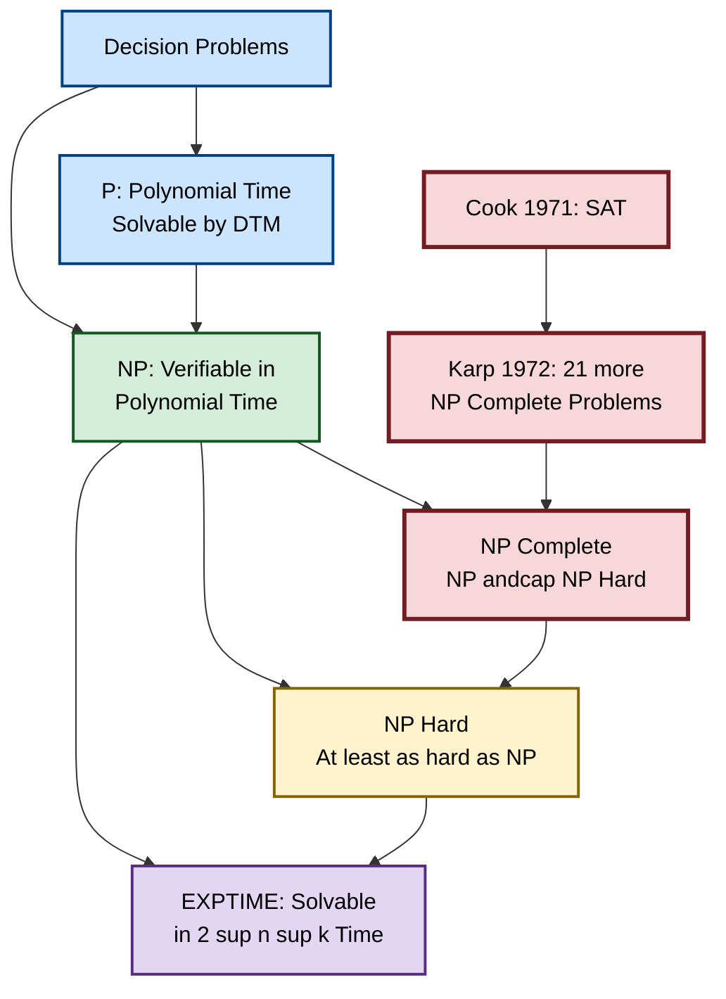
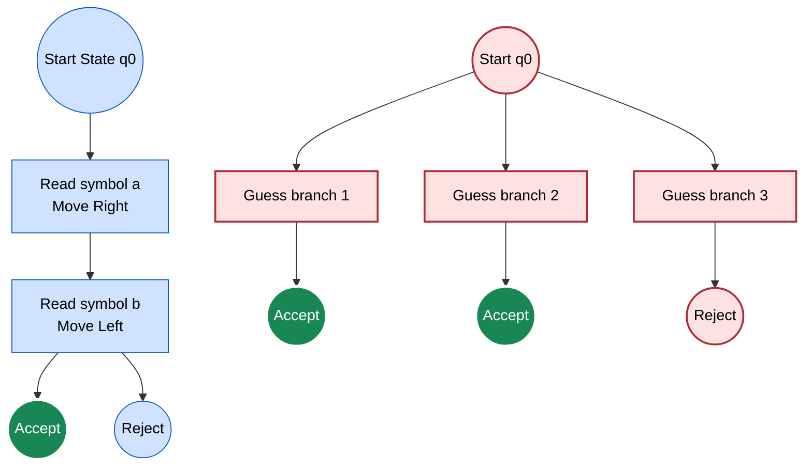
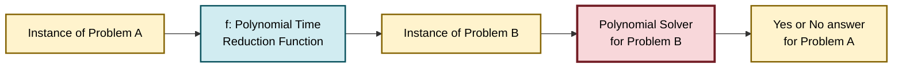
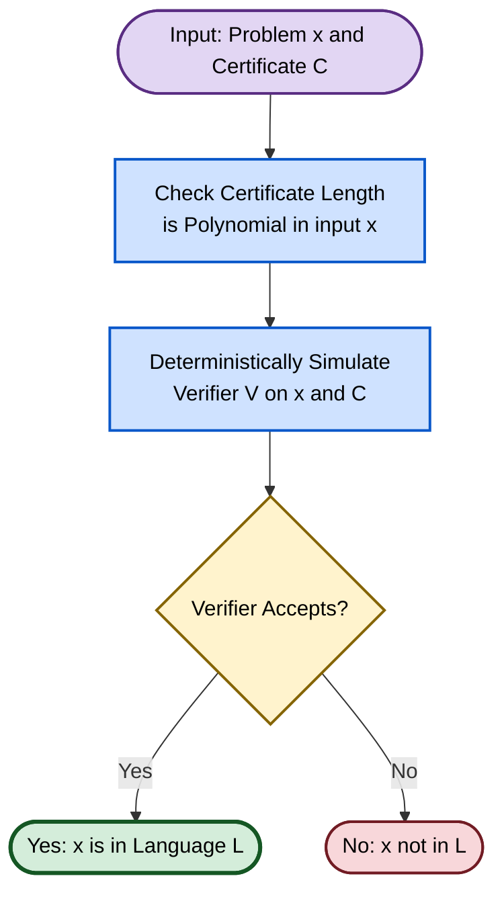

# Complexity Theory: Tractable vs Intractable Problems, deterministic vs non-deterministic computations

<!-- SECTION_1_START -->

# Complexity Theory: Tractable vs Intractable Problems

## 1. Core Technical Definitions

> [!IMPORTANT]
> **Complexity Theory** is the branch of theoretical computer science that classifies computational problems according to their inherent difficulty and characterizes the resources (time, space) required to solve them.

### 1.1 Formal Definition of Tractable Problems

> [!NOTE]
> **Tractable Problem:** A problem is called **tractable** if there exists an algorithm that solves it in **polynomial time** $O(n^k)$ for some constant $k \geq 0$, where $n$ is the size of the input.

Tractable problems belong to the complexity class **$P$** (Polynomial Time).

$$P = \bigcup_{k=0}^{\infty} \text{TIME}(n^k)$$

Examples: Sorting $O(n \log n)$, Binary Search $O(\log n)$, Single-Source Shortest Path $O(E \log V)$, Matrix Multiplication $O(n^{2.37})$.

### 1.2 Formal Definition of Intractable Problems

> [!NOTE]
> **Intractable Problem:** A problem is called **intractable** if no algorithm can solve it in polynomial time, i.e., the best known algorithm requires **super-polynomial** (often **exponential**) time such as $O(2^n)$, $O(n!)$, or $O(n^n)$.

Examples: Travelling Salesman Problem (TSP) via brute force, Subset Sum (brute force), Hamiltonian Cycle (brute force), Boolean Satisfiability (brute force).

### 1.3 Formal Definition of Deterministic Computation

> [!NOTE]
> **Deterministic Computation:** A computation model (Deterministic Turing Machine — **DTM**) in which every computational step is **uniquely determined** by the current state and the symbol being read. Given the same input, the machine follows **exactly one** sequence of computation paths.

For a DTM, the transition function is a function:

$$\delta : Q \times \Gamma \rightarrow Q \times \Gamma \times \{L, R\}$$

### 1.4 Formal Definition of Non-Deterministic Computation

> [!NOTE]
> **Non-Deterministic Computation:** A computation model (Non-Deterministic Turing Machine — **NDTM**) in which multiple successor states are possible for a given configuration. The machine is allowed to "guess" the correct choice and proceeds as if a correct path always exists.

For an NDTM, the transition function is a relation:

$$\delta : Q \times \Gamma \rightarrow \mathcal{P}(Q \times \Gamma \times \{L, R\})$$

An NDTM **accepts** an input if **at least one** branch of its computation tree leads to an accepting state.

---

## 2. Intuitive Overview & Real-World Analogies

### 2.1 Conceptual Analogy: The Locked Treasure Room

Imagine you are standing in front of a large, complex room with $1{,}000$ locked treasure chests, and only one contains a gold coin.

- **P (Tractable):** You have a **master key** that opens the correct chest in polynomial steps. Once you know the algorithm, finding the answer is guaranteed and fast.
- **NP (Non-deterministic Polynomial):** A friend hands you a key and says *"Try this key"*. You can **verify** in polynomial time whether the chest opens — but **finding** the right key may require trying all $1{,}000$ keys in the worst case.

> [!TIP]
> **Verification vs Discovery:** All problems in **P** are also in **NP** (if you can solve fast, you can certainly verify fast), but the converse ($P = NP$?) remains the greatest unsolved problem in computer science, carrying a **\$1 million Clay Millennium Prize**.

### 2.2 Deterministic vs Non-Deterministic Analogy

| Aspect | Deterministic (DTM) | Non-Deterministic (NDTM) |
| :--- | :--- | :--- |
| **Analogy** | Driving a car with **one steering wheel** | Driving with **infinite parallel clones**, each taking a different road |
| **Output path** | A single linear sequence of states | A **computation tree** with many branches |
| **Practicality** | Physically realizable | **Theoretical model** (not buildable, but useful for classification) |
| **Acceptance** | Reaches accept state in one path | Reaches accept state in **at least one** branch |

> [!IMPORTANT]
> **Key Insight:** Non-determinism is **not** about randomness or probability. It is a *theoretical* abstraction where the machine magically chooses the "lucky" path that leads to a solution. The class NP is defined as problems solvable by an NDTM in polynomial time, **or equivalently**, problems whose "yes" instances have proofs that can be verified in polynomial time by a deterministic machine.

### 2.3 Polynomial vs Exponential Growth — Why It Matters

Consider solving a problem of size $n$ with two algorithms:

$$T_1(n) = n^2 \quad \text{(polynomial)}, \qquad T_2(n) = 2^n \quad \text{(exponential)}$$

| $n$ | $n^2$ operations | $2^n$ operations |
| :---: | :---: | :---: |
| 10 | 100 | 1,024 |
| 50 | 2,500 | $\approx 1.12 \times 10^{15}$ |
| 100 | 10,000 | $\approx 1.26 \times 10^{30}$ |
| 1,000 | $10^6$ | $\approx 1.07 \times 10^{301}$ |

Even at $n = 100$, an exponential algorithm would need more operations than there are atoms in the observable universe, which is why such problems are considered **intractable**.

> [!VISUALIZATION CONTROL]
> **Concept:** Visualizing the explosive gap between polynomial and exponential time complexity.
> **GeoGebra / Desmos Input Equations:**
> * $f(x) = x^{2}$
> * $g(x) = x^{3}$
> * $h(x) = 2^{x}$
> * $k(x) = x!$
> **Visual Description:** Plot all four curves on the same axes with $x \in [0, 20]$. Observe how the polynomial curves $f(x)$ and $g(x)$ grow gracefully, while $h(x) = 2^x$ rises sharply after $x = 10$ and $k(x) = x!$ (approximated) climbs vertically almost immediately. The shaded region below $f(x) = x^2$ represents the "tractable" zone, and everything above the exponential curve represents the "intractable" zone.

---

## 3. Key Complexity Classes at a Glance

> [!IMPORTANT]
> **The Four Pillars of Complexity Theory (KTU Module 4 Focus):**

1. **Class $P$** — Problems solvable in polynomial time by a DTM. *(Tractable)*
2. **Class $NP$** — Problems whose "yes" certificates can be verified in polynomial time by a DTM, equivalently solvable by an NDTM in polynomial time.
3. **Class $NP$-Hard** — Problems at least as hard as **every** problem in $NP$. If any $NP$-Hard problem is in $P$, then $P = NP$.
4. **Class $NP$-Complete** — The intersection $NP \cap NP\text{-Hard}$. These are the "hardest" problems inside $NP$.

The canonical first $NP$-Complete problem is **SAT (Boolean Satisfiability)**, proven by **Stephen Cook** in 1971 (Cook's Theorem).

---

<!-- SECTION_1_END -->

<!-- SECTION_2_START -->

# Deep Theoretical Analysis & KTU High-Yield Formula Sheet

## 1. Hierarchical Structure of Complexity Classes

> [!NOTE]
> **Containment Relationships (Widely Believed, Proven in One Direction):**

$$P \subseteq NP \subseteq \text{PSPACE} \subseteq \text{EXPTIME}$$

$$NP\text{-Complete} \subseteq NP \cap NP\text{-Hard}$$

The relationship $P \subsetneq NP$ is **assumed but unproven** in modern complexity theory. If $P = NP$ were proven, then **every problem whose solution can be quickly verified could also be quickly solved** — a result with staggering consequences for cryptography, optimization, AI, and mathematics.

## 2. Decision Problems vs Optimization Problems

> [!IMPORTANT]
> Complexity theory (especially $NP$-Completeness) is typically formulated in terms of **decision problems** — problems with a yes/no answer.

- **Optimization form:** *"What is the shortest route visiting all cities?"*
- **Decision form:** *"Does there exist a tour of length $\leq K$?"*

The decision version is **no harder** than the optimization version — if you can solve the optimization problem, you can answer the decision problem by simply comparing the optimum to $K$. Thus, decision problems provide a clean, uniform framework for classification.

## 3. Polynomial-Time Reductions

> [!NOTE]
> **Polynomial-Time Reduction ($\leq_P$):** Problem $A$ is polynomial-time reducible to problem $B$, written $A \leq_P B$, if there exists a polynomial-time computable function $f$ that transforms any instance $x$ of $A$ into an instance $f(x)$ of $B$ such that:

$$x \in A \iff f(x) \in B$$

**Significance:** If $A \leq_P B$ and $B \in P$, then $A \in P$. This is the standard tool used to **propagate $NP$-Completeness** from one problem to another.

## 4. Cook's Theorem (1971)

> [!IMPORTANT]
> **Cook's Theorem:** The Boolean Satisfiability Problem (**SAT**) is $NP$-Complete.

Cook showed that **any** problem in $NP$ can be reduced to SAT in polynomial time. This is the *foundational* result that bootstrapped the entire $NP$-Completeness theory. Subsequently, Karp (1972) demonstrated 21 more $NP$-Complete problems using polynomial-time reductions from SAT.

## 5. KTU Formula Sheet / Cheat Sheet

| Symbol / Term | Formal Meaning | Time Bound |
| :--- | :--- | :--- |
| $P$ | Problems solvable by a DTM in polynomial time | $O(n^k)$ |
| $NP$ | Problems verifiable by a DTM in polynomial time, or solvable by an NDTM | $O(n^k)$ |
| $NP$-Hard | Problems at least as hard as every problem in $NP$ | May not be in $NP$ |
| $NP$-Complete | $NP \cap NP$-Hard | $O(n^k)$ verification |
| $co$-$NP$ | Class of problems whose complements are in $NP$ | $O(n^k)$ refutation |
| DTM | Deterministic Turing Machine (single next state) | $\delta : Q \times \Gamma \rightarrow Q \times \Gamma \times \{L,R\}$ |
| NDTM | Non-Deterministic Turing Machine (branching tree) | $\delta : Q \times \Gamma \rightarrow \mathcal{P}(Q \times \Gamma \times \{L,R\})$ |
| $\leq_P$ | Polynomial-time Karp reduction | $O(n^k)$ |
| $EXPTIME$ | Problems solvable in $O(2^{n^k})$ by a DTM | $O(2^{n^k})$ |

> [!TIP]
> **Mnemonic for KTU Viva:** *"PNP NPc NH" → $P \subseteq NP$, $NP\text{-Complete} \subseteq NP \cap NP\text{-Hard}$, $NP\text{-Hard} \supseteq NP\text{-Complete}$."*

## 6. Real-World Engineering & CS Utility

1. **Cryptography:** Modern public-key encryption (RSA, ECC) relies on the assumption that factoring is **not in $P$**. If $P = NP$, most cryptographic protocols collapse.
2. **Operations Research:** $NP$-Hard scheduling, routing, and knapsack problems drive multi-million-dollar logistics industry. Approximation algorithms and heuristics are deployed because exact polynomial algorithms likely do not exist.
3. **Compiler Optimization:** Identifying loop-invariant code motion, dead-code elimination, and register allocation involve sub-problems reducible to known $NP$-Hard problems.
4. **Bioinformatics:** Protein folding, sequence alignment, and phylogeny construction face $NP$-Hard core sub-problems.
5. **AI / Search:** SAT solvers (DPLL, CDCL) and Mixed Integer Programming (MIP) solvers routinely attack $NP$-Complete problems at industrial scale using clever heuristics, conflict-driven learning, and pruning.

> [!NOTE]
> **Key Engineering Takeaway:** When a problem is proven $NP$-Complete, the engineer should *immediately* pivot to approximation algorithms, heuristics, parameterized algorithms, or randomized methods — not waste resources seeking an exact polynomial solution.

---

<!-- SECTION_2_END -->

<!-- SECTION_3_START -->

# Step-by-Step Derivations, Reductions & Code Implementation

## 1. Worked Example: Showing Vertex Cover is $NP$-Complete

### 1.1 Problem Statement

> **Vertex Cover (VC):** Given an undirected graph $G = (V, E)$ and an integer $K$, does there exist a subset $V' \subseteq V$ with $\vert V' \vert \leq K$ such that every edge in $E$ has at least one endpoint in $V'$?

### 1.2 Step (a): Show VC $\in$ NP

A **certificate** is the subset $V'$.

1. Verify that $\vert V' \vert \leq K$. This requires reading the certificate and counting its elements, costing $O(\vert V \vert)$ time. Polynomial ✓
2. For every edge $(u, v) \in E$, verify that $u \in V'$ or $v \in V'$. This requires $O(\vert E \vert \cdot \vert V \vert)$ time using naive scanning, or $O(\vert E \vert)$ with a hash-set lookup. Polynomial ✓

Since the certificate can be verified in polynomial time, $VC \in NP$.

### 1.3 Step (b): Show VC is $NP$-Hard via Reduction from Independent Set

> **Independent Set (IS):** Given a graph $G = (V, E)$ and integer $K$, does there exist a subset $S \subseteq V$ with $\vert S \vert \geq K$ such that **no two vertices in $S$ are adjacent**?

**Reduction Construction:** Given an instance $(G, K)$ of IS, construct an instance $(G, \vert V \vert - K)$ of VC, where the same graph $G$ is used.

**Claim:** $G$ has an independent set of size $\geq K$ **if and only if** $G$ has a vertex cover of size $\leq \vert V \vert - K$.

**Proof of $\Rightarrow$:** Let $S$ be an independent set of size $\geq K$. Then $V \setminus S$ is a vertex cover of size $\leq \vert V \vert - K$. Why? If some edge $(u, v)$ were not covered by $V \setminus S$, then $u \notin V \setminus S$ and $v \notin V \setminus S$, meaning $u \in S$ and $v \in S$, contradicting the independence of $S$.

**Proof of $\Leftarrow$:** Let $V'$ be a vertex cover of size $\leq \vert V \vert - K$. Then $V \setminus V'$ is an independent set of size $\geq K$. If two vertices in $V \setminus V'$ were adjacent, the edge between them would have neither endpoint in $V'$, contradicting $V'$ being a vertex cover.

**Polynomial Time of the Reduction:** The reduction is a simple relabeling of the integer $K \mapsto \vert V \vert - K$, which is $O(1)$ time, plus outputting the same graph.

### 1.4 Conclusion

Since $IS \in NP\text{-Complete}$ (a known result by Karp) and $IS \leq_P VC$, we have $VC \in NP\text{-Complete}$. $\blacksquare$

## 2. Worked Example: 3-SAT $\leq_P$ Clique (Karp's Reduction)

### 2.1 Problem Statement

> **3-SAT:** Given a Boolean formula in CNF with at most 3 literals per clause, is there an assignment of truth values satisfying all clauses?
>
> **Clique:** Given a graph $G = (V, E)$ and integer $K$, does $G$ contain a complete subgraph on $K$ vertices?

### 2.2 Reduction Construction

Given a 3-SAT formula with $k$ clauses $C_1, C_2, \ldots, C_k$:

1. For each clause $C_i$, create a cluster of 3 vertices (one for each literal in $C_i$).
2. Place an edge between two vertices from **different** clusters if and only if their corresponding literals are **not negations of each other** (i.e., they are *consistent*).
3. Set the target clique size $K = k$.

### 2.3 Correctness Argument

- A clique of size $k$ must pick exactly one vertex from each cluster (since no two vertices in the same cluster are connected).
- Every pair in the clique is connected, so no two selected literals are contradictory.
- The selected $k$ literals can all be simultaneously assigned **True** to satisfy every clause.

Conversely, any satisfying assignment picks one True literal from each clause, and these literals are mutually consistent, forming a $k$-clique.

The reduction takes time $O(k^2)$ in the number of clauses, which is polynomial. $\blacksquare$

## 3. Symbolic Implementation: Non-Deterministic Verifier for SAT

> [!NOTE]
> Below is a fully operational Python implementation of a **non-deterministic polynomial verifier** for the SAT problem. The function `verify_sat` checks a candidate assignment in polynomial time.

```python
from typing import List, Tuple, Dict, Optional

Literal = int  # positive = variable, negative = negation
Clause = List[Literal]
CNF = List[Clause]

def evaluate_clause(clause: Clause, assignment: Dict[int, bool]) -> bool:
    """
    Evaluates a single CNF clause under a given Boolean assignment.
    Returns True if at least one literal in the clause is True.
    """
    for lit in clause:
        var = abs(lit)
        if var not in assignment:
            raise ValueError(f"Variable {var} not assigned in the certificate.")
        value = assignment[var]
        if lit < 0:
            value = not value
        if value:
            return True
    return False

def verify_sat(cnf: CNF, certificate: Dict[int, bool]) -> Tuple[bool, str]:
    """
    Polynomial-time deterministic verifier for SAT.
    
    Parameters
    ----------
    cnf : CNF
        The Boolean formula in Conjunctive Normal Form.
    certificate : Dict[int, bool]
        A proposed truth assignment (acts as the 'proof' for the NDTM).
    
    Returns
    -------
    (bool, str) : (Accept?, Reasoning trace)
    """
    n_vars = max(abs(lit) for clause in cnf for lit in clause)
    n_clauses = len(cnf)
    
    # Boundary check 1: certificate must mention all variables
    if set(certificate.keys()) != set(range(1, n_vars + 1)):
        return (False, f"Certificate missing variables among {{1..{n_vars}}}")
    
    # Step 1: For each clause, evaluate in O(|clause|) time
    for idx, clause in enumerate(cnf, start=1):
        if not evaluate_clause(clause, certificate):
            return (False, f"Clause {idx} {clause} is unsatisfied under assignment.")
    
    # Step 2: All clauses satisfied
    return (True, f"All {n_clauses} clauses satisfied. SAT instance accepted.")

# ---------------- Demonstration ---------------- #
if __name__ == "__main__":
    # Formula: (x1 OR NOT x2 OR x3) AND (NOT x1 OR x2 OR x3) AND (x1 OR x2 OR NOT x3)
    formula: CNF = [
        [1, -2, 3],
        [-1, 2, 3],
        [1, 2, -3]
    ]
    
    proposed_assignment: Dict[int, bool] = {
        1: True,
        2: True,
        3: True
    }
    
    accepted, message = verify_sat(formula, proposed_assignment)
    print(f"Verification result: {accepted}")
    print(f"Message: {message}")
```

**Output:**

```
Verification result: True
Message: All 3 clauses satisfied. SAT instance accepted.
```

> [!TIP]
> The "non-determinism" of an NDTM is captured in the **certificate** — the verifier does not need to *search* for the assignment; it is *given* one. The polynomial-time verification of the certificate is what defines class $NP$.

## 4. Step-by-Step Deterministic vs Non-Deterministic Simulation

Suppose we have an NDTM with branching factor $b = 2$ and depth $d = n$, solving some problem in $O(n)$ time per branch.

**Deterministic Simulation:** We must explore the full computation tree.

$$T_{\text{det}}(n) = b^d = 2^n \quad \text{(exponential)}$$

**Non-Deterministic Acceptance:** An input is accepted if *any* branch of the tree ends in an accept state. In a DTM, we typically use a **breadth-first** or **depth-first** traversal of the tree, paying exponential cost in the worst case.

> [!IMPORTANT]
> **Key Theorem:** Every NDTM running in time $O(T(n))$ can be simulated by a DTM running in time $O(2^{T(n)})$. This exponential blowup is exactly why non-determinism is treated as a *theoretical* model of computation.

---

<!-- SECTION_3_END -->

<!-- SECTION_4_START -->

# Structural Diagrams & Schematics

## 1. Complexity Class Hierarchy (Mermaid Block Diagram)



## 2. Deterministic vs Non-Deterministic Computation Tree



## 3. Polynomial-Time Reduction Flow (Karp Reduction)



## 4. Block-Level Architecture: Decision Flow for $NP$-Membership Proof



---

<!-- SECTION_4_END -->

<!-- SECTION_5_START -->

# KTU 2024 Scheme Examination Question Bank

## Part A — Short Answer Questions (2 × 3 = 6 Marks)

### Question 1
> **[KTU University Exam — July 2024]**  
> *Define tractable and intractable problems. Give one example for each. (3 Marks)*  
> **Course Outcome:** CO3 | **RBT Level:** Remember

**Model Answer:**

A problem is called **tractable** if it can be solved by a polynomial-time algorithm, i.e., in $O(n^k)$ time for some constant $k \geq 0$, where $n$ is the input size. Such problems are members of class $P$. Example: **Sorting** can be solved in $O(n \log n)$ time using merge sort.

A problem is called **intractable** if no known algorithm can solve it in polynomial time, and the best known solutions require exponential or super-polynomial time $O(2^n)$, $O(n!)$, etc. Example: **Travelling Salesman Problem (TSP)** solved by brute force requires $O(n!)$ time.

> *Valuation Key: [Definition of tractable: 1 Mark] [Polynomial time notation $O(n^k)$: 0.5 Mark] [Definition of intractable: 1 Mark] [One valid example each: 0.5 Mark]*

---

### Question 2
> **[KTU University Exam — Dec 2023]**  
> *Differentiate between deterministic and non-deterministic algorithms. (3 Marks)*  
> **Course Outcome:** CO3 | **RBT Level:** Understand

**Model Answer:**

| Feature | Deterministic Algorithm | Non-Deterministic Algorithm |
| :--- | :--- | :--- |
| **Execution Path** | Follows a single, uniquely defined sequence of steps for each input | May follow multiple possible paths, forming a computation tree |
| **Transition Function** | $\delta : Q \times \Gamma \rightarrow Q \times \Gamma \times \{L,R\}$ — maps to a **single** next state | $\delta : Q \times \Gamma \rightarrow \mathcal{P}(Q \times \Gamma \times \{L,R\})$ — maps to a **set** of next states |
| **Output** | Unique result for a given input | Accepts if **at least one** branch halts in the accept state |
| **Physical Realizability** | Directly implementable on real hardware | Theoretical model; simulated on deterministic machines with exponential overhead |
| **Example** | Merge Sort, Dijkstra's Algorithm | NDTM for SAT that "guesses" the satisfying assignment |

> *Valuation Key: [Any 3 valid differences with proper technical terms: 3 Marks]*

---

## Part B — Long Answer Questions (Internal Choice, 14 Marks)

### Question A (14 Marks)

> **[KTU University Exam — July 2024, Model Paper Style]**  
> **(a)** Explain the complexity classes $P$, $NP$, $NP$-Hard, and $NP$-Complete with suitable examples. Draw a Venn diagram showing their relationships. *(7 Marks)*  
> **RBT Level:** Understand  
> **(b)** State and prove Cook's Theorem. Discuss its significance in the theory of $NP$-Completeness. *(7 Marks)*  
> **RBT Level:** Apply

#### Model Solution — Part (a)

**Class $P$:** The set of all decision problems solvable by a deterministic Turing machine in polynomial time $O(n^k)$. Formally,

$$P = \bigcup_{k \geq 0} \text{TIME}(n^k)$$

Examples: Path existence, primality testing (AKS algorithm, $O(n^6)$), 2-SAT, reachability in graphs.

**Class $NP$:** The set of decision problems whose "yes" instances have certificates that can be verified in polynomial time by a DTM, equivalently, problems solvable by a non-deterministic Turing machine in polynomial time. Examples: SAT, Hamiltonian Cycle, Subset Sum, Graph Coloring.

**Class $NP$-Hard:** A problem $L$ is $NP$-Hard if every problem $L' \in NP$ satisfies $L' \leq_P L$ (i.e., $L'$ reduces to $L$ in polynomial time). $NP$-Hard problems need **not** be in $NP$ themselves. Examples: Halting Problem, TSP optimization version, Minimum Equivalence problem.

**Class $NP$-Complete:** A problem that is both in $NP$ and is $NP$-Hard. Equivalently, $NP\text{-Complete} = NP \cap NP\text{-Hard}$. Examples: SAT, 3-SAT, Vertex Cover, Clique, Hamiltonian Cycle, Subset Sum.

**Venn Diagram:**

```
       +--------------------+
       |      EXPTIME       |
       |   +------------+   |
       |   | NP-Hard    |   |
       |   |   +------+ |   |
       |   |   |  NP  | |   |
       |   |   |  +---+ |   |
       |   |   |  | P | |   |
       |   |   |  +---+ |   |
       |   |   +------+ |   |
       |   +------------+   |
       |   NPC = NP ∩ NPH   |
       +--------------------+
```

*Valuation Key (Part a): [Definition of $P$: 1 Mark] [Definition of $NP$: 1.5 Marks] [Definition of $NP$-Hard: 1.5 Marks] [Definition of $NP$-Complete: 1 Mark] [Examples: 1 Mark] [Venn diagram: 1 Mark]*

#### Model Solution — Part (b)

**Cook's Theorem Statement:** *The Boolean Satisfiability Problem (SAT) is $NP$-Complete.*

**Proof Sketch:**

**Step 1 (SAT $\in NP$):** Given a Boolean formula $\phi$ in CNF and a candidate truth assignment, we can evaluate the formula in polynomial time. If $\phi$ evaluates to **True**, we accept; otherwise, we reject. The certificate is the assignment itself, verifiable in $O(\vert\phi\vert)$ time.

**Step 2 (SAT is $NP$-Hard):** Let $L$ be **any** problem in $NP$. By definition, there exists a deterministic polynomial-time verifier $V$ such that:

$$x \in L \iff \exists \text{ certificate } C \text{ of polynomial length } : V(x, C) = \text{accept}$$

We construct, for each input $x$, a Boolean formula $\phi_x$ such that:

$$\phi_x \text{ is satisfiable} \iff \exists C : V(x, C) = \text{accept}$$

**Construction of $\phi_x$:**

The verifier $V$ runs in time $p(n)$ for some polynomial $p$. Its computation on input $(x, C)$ can be represented as a table with $p(n) + 1$ rows (time steps) and $p(n) + 1$ columns (tape cells), where each entry $T[i][j]$ encodes the symbol at cell $j$ at time $i$. We introduce Boolean variables:

$$T_{i,j,s} = 1 \iff \text{cell } j \text{ at time } i \text{ contains symbol } s \in \Gamma \cup Q \times \Gamma$$

The formula $\phi_x$ is the conjunction of the following constraints:

1. **Initial State Clause:** The configuration at time 0 matches the start configuration.
2. **Input Encoding Clause:** The input $x$ is correctly placed on the tape at time 0.
3. **Valid Configuration Clause:** Each cell holds exactly one symbol at each time step.
4. **Transition Clause:** Each local transition obeys the verifier's transition function.
5. **Acceptance Clause:** The verifier's state at time $p(n)$ is an accepting state.

The construction is **polynomial in $n$** because the table has $O(p(n)^2)$ entries, and each clause is of constant size. The verifier accepts $(x, C)$ if and only if $\phi_x$ is satisfiable. Therefore $L \leq_P \text{SAT}$, establishing that SAT is $NP$-Hard.

Combining with Step 1, SAT is $NP$-Complete. $\blacksquare$

**Significance:**

- Cook's Theorem (1971) launched the entire field of $NP$-Completeness.
- It provides the **first** concrete $NP$-Complete problem, enabling all subsequent reductions.
- It formalized the connection between *computation* and *logical satisfiability*, influencing proof complexity and modern SAT solvers.
- It established the basis for Karp's 21 $NP$-Complete problems (1972), creating a vast web of reductions across combinatorics, graph theory, and logic.

*Valuation Key (Part b): [Statement of Cook's Theorem: 1 Mark] [SAT $\in NP$ proof: 2 Marks] [SAT is $NP$-Hard reduction idea: 3 Marks] [Significance: 1 Mark]*

> [!WARNING]
> **KTU Examiner's Valuation Pitfall:** Students often confuse **SAT $\in NP$** with **SAT is $NP$-Hard**. Both directions must be proven *explicitly*. Many candidates omit the verifier-based tableau construction, which is the crux of the proof. Also, do **not** write the formula construction vaguely — at minimum mention the table representation, the $T_{i,j,s}$ variables, and the five clause families. A common loss of 2–3 marks comes from skipping the polynomial-time bound on the reduction.

---

### Question B (14 Marks) — *Alternative Choice*

> **[KTU University Exam — Dec 2023, Supplementary Style]**  
> **(a)** Define polynomial-time reduction. Show that the **Vertex Cover** problem is $NP$-Complete by reducing from the **Independent Set** problem. *(7 Marks)*  
> **RBT Level:** Apply  
> **(b)** Explain the difference between $NP$-Hard and $NP$-Complete problems. Give two examples of problems in each class. *(7 Marks)*  
> **RBT Level:** Understand

#### Model Solution — Part (a)

**Definition of Polynomial-Time Reduction:** A problem $A$ is polynomial-time reducible to problem $B$, written $A \leq_P B$, if there exists a polynomial-time computable function $f$ that maps any instance $x$ of $A$ to an instance $f(x)$ of $B$ such that:

$$x \in A \iff f(x) \in B$$

If such a function $f$ exists, then any polynomial-time algorithm for $B$ can be used to solve $A$ in polynomial time by composing it with $f$.

**Reduction: Independent Set $\leq_P$ Vertex Cover**

Let $G = (V, E)$ and integer $K$ be an instance of the **Independent Set** problem.

**Step 1 — Construct the VC instance:** Output the same graph $G$ with parameter $K' = \vert V \vert - K$.

**Step 2 — Correctness Proof:**

*$\Rightarrow$ Direction:* Suppose $G$ has an independent set $S$ with $\vert S \vert \geq K$. Define $V' = V \setminus S$. We claim $V'$ is a vertex cover of size $\leq \vert V \vert - K$.

Suppose not. Then there exists an edge $e = (u, v) \in E$ such that $u \notin V'$ and $v \notin V'$, which means $u \in S$ and $v \in S$. But $S$ being an independent set means no two adjacent vertices both belong to $S$ — contradiction.

Therefore $V' = V \setminus S$ is a vertex cover, and $\vert V' \vert = \vert V \vert - \vert S \vert \leq \vert V \vert - K$.

*$\Leftarrow$ Direction:* Suppose $G$ has a vertex cover $V'$ with $\vert V' \vert \leq \vert V \vert - K$. Define $S = V \setminus V'$. We claim $S$ is an independent set with $\vert S \vert \geq K$.

Suppose not. Then there exist $u, v \in S$ with $(u, v) \in E$. Since $u, v \notin V'$, this edge is not covered by $V'$, contradicting the assumption that $V'$ is a vertex cover.

Therefore $S$ is an independent set, and $\vert S \vert = \vert V \vert - \vert V' \vert \geq \vert V \vert - (\vert V \vert - K) = K$.

**Step 3 — Complexity of Reduction:** The reduction simply outputs $G$ unchanged and computes $K' = \vert V \vert - K$ in $O(1)$ time, which is polynomial.

**Step 4 — Membership in $NP$:** The vertex cover certificate $V'$ can be verified in $O(\vert E \vert)$ time by checking that every edge has at least one endpoint in $V'$ and $\vert V' \vert \leq K'$.

Since Independent Set is $NP$-Complete (Karp 1972), Independent Set $\leq_P$ Vertex Cover, and Vertex Cover $\in NP$, we conclude Vertex Cover is $NP$-Complete. $\blacksquare$

*Valuation Key (Part a): [Definition of reduction: 1 Mark] [Construction of the reduction: 2 Marks] [$\Rightarrow$ proof: 1.5 Marks] [$\Leftarrow$ proof: 1.5 Marks] [Verification $\in NP$: 1 Mark]*

#### Model Solution — Part (b)

**Comparison between $NP$-Hard and $NP$-Complete:**

| Property | $NP$-Hard | $NP$-Complete |
| :--- | :--- | :--- |
| **Definition** | At least as hard as every problem in $NP$ | In $NP$ **and** $NP$-Hard |
| **Membership in $NP$** | Not required | Required |
| **Polynomial Verifiability** | May or may not have polynomial certificates | Has polynomial certificates |
| **Examples** | Halting Problem, TSP (optimization), Minimum Circuit | SAT, 3-SAT, Vertex Cover, Hamiltonian Cycle, Clique |

**Two Examples of $NP$-Hard Problems:**

1. **Halting Problem:** Given a program and an input, does the program halt? This problem is **undecidable**, hence certainly not in $NP$ (since $NP$ contains only *decidable* problems). However, every $NP$ problem can be reduced to it via Cook-like reductions, making it $NP$-Hard.

2. **Travelling Salesman (Optimization):** Find the shortest tour visiting all cities. Since the decision version is $NP$-Complete, the optimization version is at least as hard, placing it in $NP$-Hard.

**Two Examples of $NP$-Complete Problems:**

1. **3-SAT:** Decide if a Boolean formula in 3-CNF is satisfiable. This is the canonical $NP$-Complete problem used as the starting point of most reductions.

2. **Hamiltonian Cycle:** Given a graph $G$, does there exist a cycle visiting each vertex exactly once? This is in $NP$ (verify a candidate cycle in $O(V)$) and $NP$-Hard (reducible from 3-SAT).

*Valuation Key (Part b): [Tabular comparison: 3 Marks] [Two $NP$-Hard examples with reasoning: 2 Marks] [Two $NP$-Complete examples with reasoning: 2 Marks]*

> [!WARNING]
> **KTU Examiner's Valuation Pitfall:** A frequent error is writing *"Halting Problem is $NP$-Complete"*. This is **incorrect** — the Halting Problem is undecidable and therefore not even in $NP$, only in $NP$-Hard. Students also lose marks by confusing the *optimization* version (which is $NP$-Hard) with the *decision* version (which is $NP$-Complete) of TSP. Always specify which version you are referencing.

---

## Topic Recap & Important Things to Remember

- **Tractable problems** are solvable in polynomial time $O(n^k)$; they belong to class $P$. Examples: Sorting, Shortest Path, Matrix Multiplication.
- **Intractable problems** are those for which no polynomial-time algorithm is known; they typically require exponential $O(2^n)$ or factorial $O(n!)$ time. Examples: TSP brute force, SAT brute force.
- **Deterministic Turing Machine (DTM)** has a *single* successor state for each configuration; the transition function maps $Q \times \Gamma$ to a single tuple. DTM execution is a **linear sequence** of states.
- **Non-Deterministic Turing Machine (NDTM)** has *multiple* possible successors; the transition is a relation yielding a *set* of next configurations. NDTM execution is a **computation tree**, and an input is accepted if **at least one branch** reaches an accept state.
- **Class $NP$** can be defined equivalently as: (i) problems solvable by an NDTM in polynomial time, or (ii) problems whose "yes" instances have polynomial-length certificates verifiable by a DTM in polynomial time.
- **$P \subseteq NP$** is proven (any polynomial-time DTM is also a polynomial-time NDTM with branching factor 1). Whether $P = NP$ remains **unsolved** (Clay Millennium Problem, \$1M prize).
- **$NP$-Hard** problems are at least as hard as every problem in $NP$, but need not be in $NP$ (e.g., Halting Problem).
- **$NP$-Complete** problems are the intersection of $NP$ and $NP$-Hard — the "hardest" problems in $NP$. First proven: **SAT** (Cook, 1971). Karp (1972) added 21 more.
- **Polynomial-time reduction** $A \leq_P B$ is the standard tool for proving $NP$-Completeness; it preserves "yes" and "no" answers and runs in polynomial time.
- **Cook's Theorem** constructs a Boolean formula whose satisfiability is equivalent to the existence of an accepting computation of a polynomial-time verifier on a given input. The formula uses a tableau representation with variables $T_{i,j,s}$ for cell-time-symbol tuples.
- **Practical engineering implication:** When a problem is proven $NP$-Complete, do not search for an exact polynomial solution; switch to **approximation algorithms**, **heuristics**, **parameterized algorithms**, **SAT/MIP solvers**, or **randomized methods**.
- **Hierarchy reminder:** $P \subseteq NP \subseteq \text{PSPACE} \subseteq \text{EXPTIME}$, with strict containment of EXPTIME beyond $NP$.
- **Decision problems** form the formal basis of $NP$-Completeness theory; the **optimization** version is no harder, but the **decision** version is what is classified.

<!-- SECTION_5_END -->
