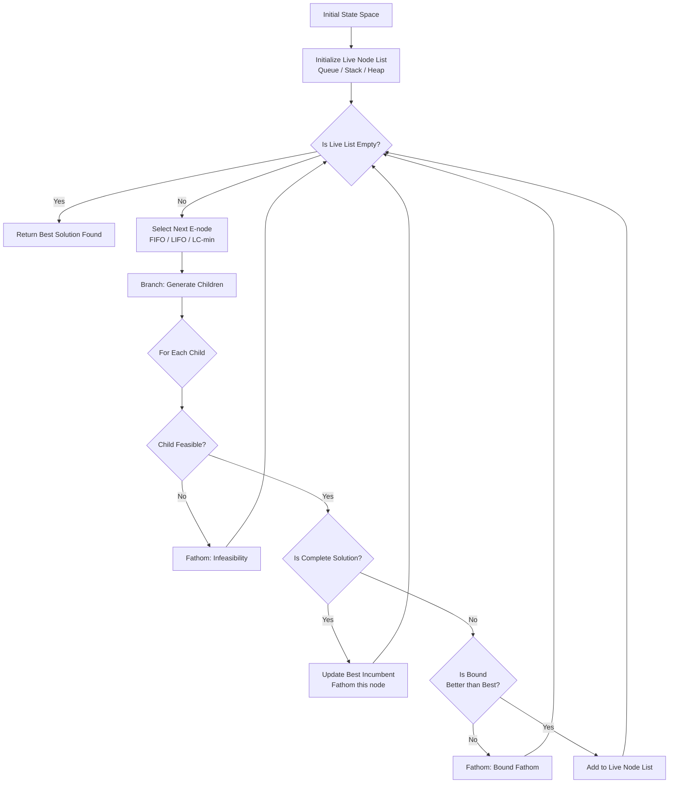
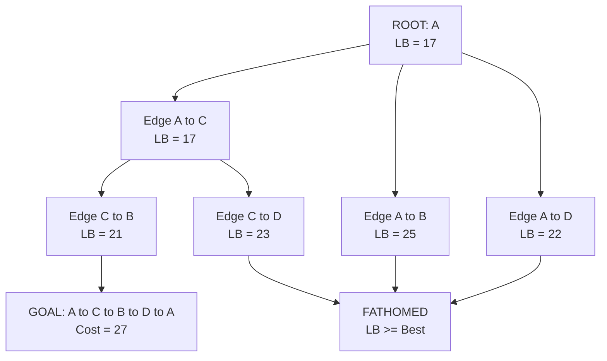
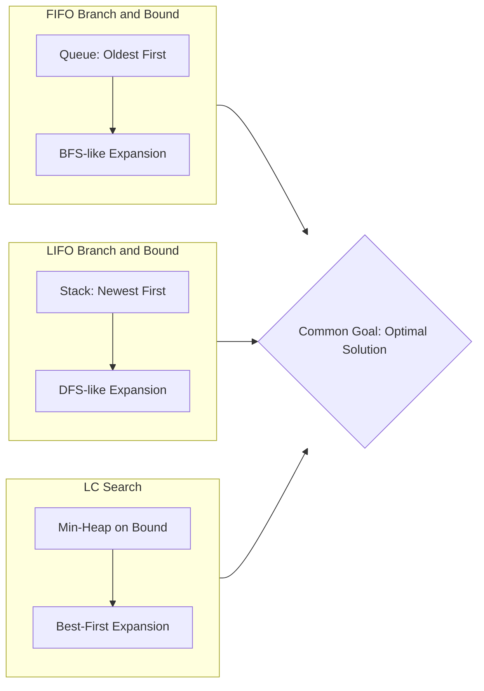
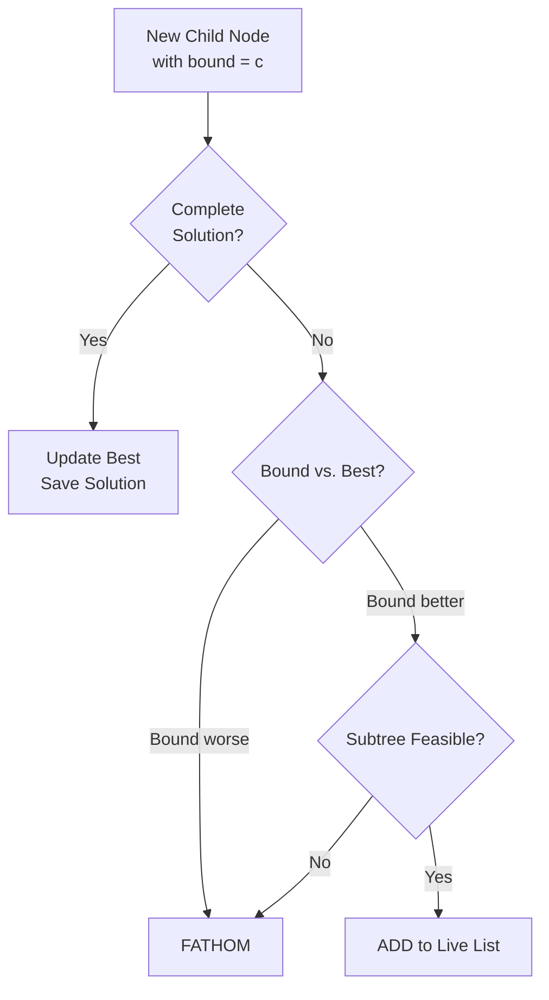

# Algorithm

<!-- SECTION_1_START -->
# Branch and Bound — Core Technical Definition & Intuitive Overview

> [!IMPORTANT]
> **KTU 2024 Scheme — Module 4 (PCCST502: DAA)**
> Branch and Bound is the **canonical systematic enumeration technique** used to solve combinatorial and discrete optimization problems (minimization/maximization) where brute-force exhaustive search is infeasible. It is the **State Space Tree + Cost Bound Pruning** paradigm.

## Formal Definition

**Branch and Bound (B&B)** is an exact, general-purpose algorithmic framework for solving optimization problems — both **minimization** and **maximization** — over a finite, structured search space. It builds a **state space tree (SST)** where each internal node represents a partial solution, and each leaf represents a complete solution. The technique uses two mechanisms:

- **Branching**: Partitioning a subproblem into two or more disjoint smaller subproblems (the children of a node).
- **Bounding**: Computing a *bound* (a lower bound for minimization, an upper bound for maximization) on the best achievable value of any leaf in the unexplored subtree. Subtrees whose bound is *no better* than the best known solution are **pruned (fathomed)**.

> [!NOTE]
> **Syllabus Highlight:** KTU Module 4 expects you to master **LC (Least-Cost) Search**, **FIFO Branch and Bound**, and **LIFO Branch and Bound**, then apply them to the **Travelling Salesperson Problem (TSP)**, the **15-Puzzle Problem**, and the **Assignment Problem**.

## Conceptual Analogy / Intuition

Imagine you are an **Air Traffic Controller** at a busy airport. You have to schedule **N** flights into **N** gates to minimize total passenger walking distance. Brute force means trying all $N!$ schedules — impossible for $N = 15$. Now imagine you have a **crystal ball** that, given a *partial* schedule, can whisper the *minimum possible* total distance achievable if you finish that partial schedule sensibly.

- If the crystal ball says "even in the best case, this partial schedule already costs more than a full schedule I already know," you **kill that branch** (prune).
- If the crystal ball's estimate is *promising*, you **expand** it (branch into more specific schedules).
- You always work on the **most promising live node** next (this is the choice of search strategy).

> That crystal ball is the **bound function**. The process of "picking the most promising live node" is the **search strategy** (FIFO, LIFO, or LC). The killing of hopeless branches is **fathoming**. That is Branch and Bound.

## Key Vocabulary You Must Know

| Term | Meaning |
|---|---|
| **State Space Tree (SST)** | Tree of all partial-to-complete solutions |
| **E-node (Expansion node)** | The node currently being branched |
| **Live node** | A node generated but not yet explored; may be expanded later |
| **Dead node** | A node that has been expanded, fathomed, or will never be expanded |
| **Fathoming** | Killing a node because (i) it cannot lead to a better answer than the current best, OR (ii) it represents a complete solution, OR (iii) the subtree contains no feasible solutions |
| **Bounding Function** | A function $c(\hat{x})$ that estimates the *best* value achievable from a node |
| **Lower Bound (LB)** | For minimization: smallest possible cost of any descendant leaf |
| **Upper Bound (UB)** | For minimization: the cost of the **best feasible solution seen so far** |

> [!VISUALIZATION CONTROL]
> **Concept:** State Space Tree with Fathomed vs. Live vs. E-Node
> **GeoGebra / Desmos Input Equations:**
> * `Root: (0, 1)`, `L1: (-1, 0.5)`, `L2: (1, 0.5)`, `L3: (-1.5, 0)`, `L4: (-0.5, 0)`, `L5: (0.5, 0)`, `L6: (1.5, 0)`
> * `dashed lines: prune marks; solid lines: explored`
> **Visual Description:** Tree rooted at the top, branching downward. Pruned subtrees are crossed out. The currently expanded (E) node is colored; live nodes are uncolored; dead nodes are shaded.
<!-- SECTION_1_END -->

<!-- SECTION_2_START -->
# Deep Theoretical Analysis & KTU High-Yield Formula Sheet

## The Three Fathoming Conditions

A live node is **fathomed (killed)** if and only if **any one** of the following holds:

1. **Bound Fathom**: The bound $c(\hat{x})$ is **not better** than the current best feasible solution (UB for minimization, LB for maximization). Mathematically:
   $$\text{For minimization: } c(\hat{x}) \geq U \quad \Rightarrow \text{FATHOM}$$
   $$\text{For maximization: } c(\hat{x}) \leq L \quad \Rightarrow \text{FATHOM}$$
2. **Infeasibility Fathom**: The node's subtree cannot possibly contain any feasible solution (e.g., a constraint is already violated).
3. **Solution Fathom**: The node itself corresponds to a complete feasible answer. Update the incumbent (current best) and fathome the node.

## The Three Search Strategies

| Strategy | Data Structure | Order of Expansion | KTU Relevance |
|---|---|---|---|
| **FIFO Branch and Bound** | Queue (FIFO) | Oldest live node first → BFS-like | Tested in problems like assignment |
| **LIFO Branch and Bound** | Stack (LIFO) | Newest live node first → DFS-like | Same problems, different tree shape |
| **LC (Least-Cost) Search** | Priority Queue (Min-Heap) | Live node with the *smallest* bound first → Best-First | **Most important — KTU 14-mark favourite** |

> [!IMPORTANT]
> In **LC Search**, every live node $i$ in the priority queue is assigned a label $\hat{c}_i$ (the bound). At each step, the node with the **smallest** $\hat{c}_i$ is selected as the E-node and removed from the queue. Its children are generated, and any child that is feasible, has a cost strictly less than the best seen, etc., is **added to the live-node list**.

## Bound Computations — The Heart of the Module

### 1. LC Search Bound for the 15-Puzzle

For a node at level $k$ (so $k$ tiles have been placed, $k-1$ moves made from the root), the bound is:
$$\hat{f}(n) = f(n) + \hat{g}(n)$$

where:
- $f(n) = $ number of moves already made from the root to reach $n$ (i.e., the path length, $k-1$).
- $\hat{g}(n) = $ a lower bound on the number of moves still needed to reach the goal.

> **Standard KTU Choice for 15-Puzzle:** $\hat{g}(n) = $ *sum of Manhattan distances of all tiles from their goal positions*, where the blank is treated as a tile. This is a valid lower bound because **every misplaced tile must move at least its Manhattan distance**, and the blank must also be moved (counting blank as one tile).

$$\hat{g}(n) = \sum_{i=1}^{16} \vert x_i^{current} - x_i^{goal} \vert + \vert y_i^{current} - y_i^{goal} \vert$$
*(with tile 16 = blank)*

### 2. Reduced Cost Matrix for TSP and Assignment (the KTU power tool)

**Step A — Row Reduction**: Subtract the minimum element of each row from every element in that row. Each row should have at least one zero.

**Step B — Column Reduction**: Subtract the minimum element of each (already row-reduced) column from every element in that column. Each column should have at least one zero.

The **total reduction** = (sum of all row mins) + (sum of all column mins) is the **lower bound** for a minimization problem, starting from the root.

For a child node where edge $(i, j)$ is **included**:
- Set row $i$ and column $j$ to $\infty$ (in TSP) or 0 / not allowed (in Assignment).
- For TSP: also set entry $(j, i) = \infty$ to prevent premature cycles.
- The **new lower bound** = parent's LB + (cost of edge $(i, j)$) + (additional reduction made on the new matrix).
- Equivalently: $\text{LB}(child) = \text{LB}(parent) + \text{reduction after fixing edge } (i,j)$.

### 3. Assignment Problem Bound

For an $n \times n$ cost matrix $C = [c_{ij}]$, the **Hungarian-style** lower bound for the root is the sum of the row minima **or** the sum of the column minima (whichever is greater for a stronger bound), or simply the sum of row minima as a starting heuristic. The full reduced-matrix method above generalizes it.

## KTU Formula Sheet / Cheat Sheet

| Concept | Formula / Rule | Notes |
|---|---|---|
| **LC Search Selection** | Pick $\arg\min_i \hat{c}_i$ from live nodes | Min-heap with key = bound |
| **15-Puzzle Bound** | $\hat{f}(n) = (k-1) + \sum \text{Manhattan}(t_i)$ | $k$ = tiles placed |
| **TSP Root LB** | Row mins + Col mins of cost matrix | After full reduction |
| **TSP Child LB** | Parent LB + $c_{ij}$ + extra reduction in new matrix | Edge $(i,j)$ fixed |
| **Assignment LB** | Same reduction method as TSP | Cycles not a concern |
| **Fathom (Min)** | Bound $\geq$ best so far | Kill the node |
| **Fathom (Max)** | Bound $\leq$ best so far | Kill the node |
| **E-node expansion cost** | (LC) $O(\log n)$ for heap | Tree size may be exponential |

> [!NOTE]
> **Why Branch and Bound matters in the real world:** It underpins production-grade **Mixed-Integer Linear Programming (MILP)** solvers like **Gurobi**, **CPLEX**, and **SCIP**, which are used by FedEx (vehicle routing), Google (auction pricing), airlines (crew scheduling), and chip designers (placement and routing). The idea of *intelligent search guided by bounds* is the foundation of modern combinatorial optimization.

<!-- SECTION_2_END -->

<!-- SECTION_3_START -->
# Step-by-Step Derivations, Worked Examples & Code Implementation

## Example 1 — 15-Puzzle (LC Search, KTU-favourite)

**Initial State (current node):**
```
  1  2  3  4
  5  6  _  8
  9 10  7  11
 13 14 15 12
```

**Goal State:**
```
  1  2  3  4
  5  6  7  8
  9 10 11 12
 13 14 15  _
```

Let the blank be tile **16**. Compute Manhattan distances for the *misplaced* tiles only (correctly placed tiles contribute 0).

| Tile | Current $(r, c)$ | Goal $(r, c)$ | Manhattan | Reason Misplaced |
|---|---|---|---|---|
| 7 | (2, 2) | (1, 2) | $1$ | 7 in blank's spot |
| 8 | (1, 3) | (1, 2) | $1$ | 8 one step right of goal |
| 11 | (2, 3) | (2, 2) | $1$ | 11 one step right of goal |
| 12 | (3, 3) | (2, 3) | $1$ | 12 one step above goal |
| 16 (blank) | (1, 2) | (3, 3) | $3$ | Blank far from goal slot |

**Total $\hat{g}(n) = 1 + 1 + 1 + 1 + 3 = 7$**

**Moves already made** from root: $f(n) = 0$ (we are at the root).

$$\hat{f}(n) = f(n) + \hat{g}(n) = 0 + 7 = 7$$

So the root node has $\hat{c}_{\text{root}} = 7$. LC Search begins from here.

> **Note on KTU convention:** When generating children by moving the blank, each child's $f(n)$ increases by **1** (one move made), and $\hat{g}(n)$ may increase, decrease, or stay the same depending on how the board rearranges. Always recompute Manhattan distances from scratch.

### Generic Recursive Step (for full tree expansion)

For each child at level $k$ (where the root is level 0):
1. Compute $f = k$ (one more move than parent).
2. Compute $\hat{g}$ by summing Manhattan distances of all 16 tiles.
3. Set $\hat{f} = f + \hat{g}$.
4. Insert into the LC min-heap with key $\hat{f}$.
5. Skip the child whose move would be the **reverse** of the last move (avoids trivial backtracking).

## Example 2 — Travelling Salesperson Problem (TSP) using Reduced Cost Matrix

> [!IMPORTANT]
> This is a **14-mark** KTU favourite. The matrix reduction method is the cleanest, most reproducible way to compute bounds.

**Given the distance matrix (4 cities, A, B, C, D):**

$$
\begin{aligned}
\text{Cost Matrix } C = \begin{bmatrix}
\infty & 7 & 3 & 12 \\
3 & \infty & 6 & 14 \\
5 & 8 & \infty & 6 \\
9 & 5 & 10 & \infty
\end{bmatrix}
\end{aligned}
$$

**Step 1 — Row Reduction:** Subtract row minimum from each row.

| Row | Row Min | Action |
|---|---|---|
| 1 | 3 | $7-3=4, \ 3-3=0, \ 12-3=9$ |
| 2 | 3 | $3-3=0, \ 6-3=3, \ 14-3=11$ |
| 3 | 5 | $5-5=0, \ 8-5=3, \ 6-5=1$ |
| 4 | 5 | $9-5=4, \ 5-5=0, \ 10-5=5$ |

Row reduction total = $3 + 3 + 5 + 5 = \mathbf{16}$.

$$
\begin{aligned}
C_1 = \begin{bmatrix}
\infty & 4 & 0 & 9 \\
0 & \infty & 3 & 11 \\
0 & 3 & \infty & 1 \\
4 & 0 & 5 & \infty
\end{bmatrix}
\end{aligned}
$$

**Step 2 — Column Reduction:** Subtract column minimum from each column.

| Col | Col Min | Action |
|---|---|---|
| 1 | 0 | already 0 |
| 2 | 0 | already 0 |
| 3 | 0 | already 0 |
| 4 | 1 | $9-1=8, \ 11-1=10, \ 1-1=0, \ \infty-1=\infty$ |

Column reduction total = $0 + 0 + 0 + 1 = \mathbf{1}$.

$$
\begin{aligned}
C_2 = \begin{bmatrix}
\infty & 4 & 0 & 8 \\
0 & \infty & 3 & 10 \\
0 & 3 & \infty & 0 \\
4 & 0 & 5 & \infty
\end{bmatrix}
\end{aligned}
$$

**Root Lower Bound:**
$$\text{LB}(\text{root}) = 16 + 1 = \mathbf{17}$$

### Branching — Exploring child (1, 3) (path A→C, cost = 0)

The entry at $(1,3)$ is **0** (smallest in row 1 after reduction). To include edge $(1,3)$:
- Set row 1 and column 3 to $\infty$.
- For TSP, also set $(3,1) = \infty$ to prevent premature cycle.

$$
\begin{aligned}
C_{(1,3)} = \begin{bmatrix}
\infty & \infty & \infty & \infty \\
0 & \infty & \infty & 10 \\
\infty & 3 & \infty & 0 \\
4 & 0 & \infty & \infty
\end{bmatrix}
\end{aligned}
$$

**Row reduction:** Row 2 min = 0, Row 3 min = 0, Row 4 min = 0. Total = **0**.

**Column reduction:** Col 1 min = 0, Col 2 min = 0, Col 4 min = 0. Total = **0**.

No further reduction possible.

**Child Bound:**
$$\text{LB}(1,3) = \text{LB}(\text{root}) + c_{13} + 0 + 0 = 17 + 0 + 0 = \mathbf{17}$$

### Branching — Exploring child (1, 2) (path A→B, cost = 4)

Set row 1, col 2 to $\infty$, and $(2,1) = \infty$.

$$
\begin{aligned}
C_{(1,2)} = \begin{bmatrix}
\infty & \infty & \infty & \infty \\
\infty & \infty & 3 & 11 \\
0 & \infty & \infty & 1 \\
4 & \infty & 5 & \infty
\end{bmatrix}
\end{aligned}
$$

**Column reduction:** Col 3 min = 3, Col 4 min = 1. Subtract:
- Col 3: $3-3=0, \ 5-3=2$
- Col 4: $11-1=10, \ 1-1=0$

Col reduction total = $3 + 1 = 4$.

**Child Bound:**
$$\text{LB}(1,2) = 17 + 4 + 4 = \mathbf{25}$$

### Decision at Level 1

Compare: LB(1,3) = **17**, LB(1,2) = **25**. Since both are minimization, the smaller bound is more promising. **LC Search picks (1,3).**

Continue this process iteratively until a complete tour is found and the incumbent's value refines the pruning.

## Example 3 — Assignment Problem (Reduced Matrix Method, 4 jobs × 4 machines)

**Cost Matrix:**
$$
\begin{aligned}
A = \begin{bmatrix}
9 & 2 & 7 & 8 \\
6 & 4 & 3 & 7 \\
5 & 8 & 1 & 8 \\
7 & 6 & 9 & 4
\end{bmatrix}
\end{aligned}
$$

**Step 1 — Row reduction:** Row mins: 2, 3, 1, 4. Total = 10.

$$
\begin{aligned}
A_1 = \begin{bmatrix}
7 & 0 & 5 & 6 \\
3 & 1 & 0 & 4 \\
4 & 7 & 0 & 7 \\
3 & 2 & 5 & 0
\end{bmatrix}
\end{aligned}
$$

**Step 2 — Column reduction:** All column mins are 0. Total = 0. **Root LB = 10.**

Assigning **person 1 → job 2** (entry $(1,2) = 0$): set row 1 and col 2 to $\infty$.

$$
\begin{aligned}
A_{(1,2)} = \begin{bmatrix}
\infty & \infty & \infty & \infty \\
3 & \infty & 0 & 4 \\
4 & \infty & 0 & 7 \\
3 & \infty & 5 & 0
\end{bmatrix}
\end{aligned}
$$

Col 1 min = 3, Col 3 min = 0, Col 4 min = 0. Col reduction total = 3.

**Child LB = 10 + 0 + 3 = 13.**

Continue with the next unassigned person and the smallest zero in that row, recomputing the bound at each step.

## Python Implementation — LC Search on the 15-Puzzle

```python
"""
LC (Least-Cost) Branch and Bound Search for the 15-Puzzle.
Heuristic: g(n) = sum of Manhattan distances of all 16 tiles (including blank).
"""

from __future__ import annotations
import heapq
from dataclasses import dataclass, field
from typing import List, Tuple, Optional
import logging

logging.basicConfig(level=logging.INFO, format="[%(levelname)s] %(message)s")
logger = logging.getLogger("LC-15Puzzle")


# ---------- Configuration ----------
BOARD_SIDE: int = 4
N_TILES: int = BOARD_SIDE * BOARD_SIDE          # 16
BLANK: int = N_TILES                             # 16 represents the blank

# (row, col) goal position of every tile 1..16
GOAL_POS: List[Tuple[int, int]] = [
    ((idx - 1) // BOARD_SIDE, (idx - 1) % BOARD_SIDE)
    for idx in range(1, N_TILES + 1)
]

# Pre-compute Manhattan distance table for fast lookup
MANHATTAN: List[List[int]] = [
    [abs(r - gr) + abs(c - gc) for (gr, gc) in GOAL_POS]
    for r in range(BOARD_SIDE)
    for c in range(BOARD_SIDE)
]


def board_to_tuple(board: List[int]) -> Tuple[int, ...]:
    """Convert list to hashable tuple."""
    return tuple(board)


def manhattan_lower_bound(board: Tuple[int, ...]) -> int:
    """g(n): sum of Manhattan distances of all 16 tiles from goal."""
    total: int = 0
    for idx, tile in enumerate(board):
        r, c = idx // BOARD_SIDE, idx % BOARD_SIDE
        total += MANHATTAN[r * BOARD_SIDE + c][tile - 1]
    return total


# ---------- Node ----------
@dataclass(order=True)
class PuzzleNode:
    f_hat: int                          # sorting key (priority)
    cost_so_far: int                    # g path-cost
    heuristic: int                      # h estimate
    board: Tuple[int, ...] = field(compare=False)
    path: Tuple[str, ...] = field(default=(), compare=False)  # move history
    last_move: str = field(default="", compare=False)         # anti-backtrack

    def __post_init__(self) -> None:
        if self.f_hat != self.cost_so_far + self.heuristic:
            logger.warning("f_hat=%d does not match g+h=%d for node %s",
                           self.f_hat, self.cost_so_far + self.heuristic,
                           self.board)


# ---------- Solver ----------
class LCBranchAndBound:
    """LC Search over 15-puzzle using a min-heap priority queue."""

    MOVES: List[Tuple[str, int, int]] = [
        ("Up",    -1,  0),
        ("Down",   1,  0),
        ("Left",   0, -1),
        ("Right",  0,  1),
    ]

    OPPOSITE: dict = {"Up": "Down", "Down": "Up",
                      "Left": "Right", "Right": "Left"}

    GOAL: Tuple[int, ...] = tuple(range(1, N_TILES + 1))

    def __init__(self, start: List[int], max_nodes: int = 200_000) -> None:
        if len(start) != N_TILES:
            raise ValueError(f"Start board must have {N_TILES} tiles.")
        if not self._is_solvable(start):
            raise ValueError("Puzzle is not solvable from this start state.")
        self.start: Tuple[int, ...] = board_to_tuple(start)
        self.max_nodes: int = max_nodes
        self.nodes_expanded: int = 0

    @staticmethod
    def _is_solvable(board: List[int]) -> bool:
        """Standard 15-puzzle solvability check (inversions + blank row)."""
        flat: List[int] = [t for t in board if t != BLANK]
        inversions: int = sum(
            1 for i in range(len(flat)) for j in range(i + 1, len(flat))
            if flat[i] > flat[j]
        )
        blank_row_from_bottom: int = BOARD_SIDE - (
            board.index(BLANK) // BOARD_SIDE
        )
        if BOARD_SIDE % 2 == 1:           # odd grid
            return inversions % 2 == 0
        return (inversions + blank_row_from_bottom) % 2 == 1

    def _neighbors(self, board: Tuple[int, ...],
                   last_move: str) -> List[Tuple[str, List[int]]]:
        """Return valid moves (anti-backtracking applied)."""
        blank_idx: int = board.index(BLANK)
        br, bc = divmod(blank_idx, BOARD_SIDE)
        out: List[Tuple[str, List[int]]] = []
        for name, dr, dc in self.MOVES:
            nr, nc = br + dr, bc + dc
            if not (0 <= nr < BOARD_SIDE and 0 <= nc < BOARD_SIDE):
                continue
            if name == self.OPPOSITE.get(last_move, ""):
                continue
            new_board: List[int] = list(board)
            new_idx: int = nr * BOARD_SIDE + nc
            new_board[blank_idx], new_board[new_idx] = (
                new_board[new_idx], new_board[blank_idx]
            )
            out.append((name, new_board))
        return out

    def solve(self) -> Optional[Tuple[List[str], int]]:
        """Run LC Search and return (move_list, total_cost) or None."""
        start_h: int = manhattan_lower_bound(self.start)
        start_node: PuzzleNode = PuzzleNode(
            f_hat=0 + start_h, cost_so_far=0, heuristic=start_h,
            board=self.start, path=(), last_move=""
        )
        live: List[PuzzleNode] = [start_node]
        heapq.heapify(live)
        best: Optional[int] = None

        while live and self.nodes_expanded < self.max_nodes:
            node: PuzzleNode = heapq.heappop(live)
            self.nodes_expanded += 1

            if node.board == self.GOAL:
                logger.info("Goal reached in %d moves after %d nodes.",
                            node.cost_so_far, self.nodes_expanded)
                return list(node.path), node.cost_so_far

            for move_name, child_board in self._neighbors(
                node.board, node.last_move
            ):
                child_t: Tuple[int, ...] = board_to_tuple(child_board)
                g_child: int = node.cost_so_far + 1
                h_child: int = manhattan_lower_bound(child_t)
                f_child: int = g_child + h_child
                if best is not None and f_child >= best:
                    continue   # bound fathom
                heapq.heappush(live, PuzzleNode(
                    f_hat=f_child, cost_so_far=g_child, heuristic=h_child,
                    board=child_t,
                    path=node.path + (move_name,),
                    last_move=move_name,
                ))

        logger.error("No solution found within %d nodes.", self.max_nodes)
        return None


# ---------- Demo Run ----------
if __name__ == "__main__":
    start_board: List[int] = [
        1,  2,  3,  4,
        5,  6,  0,  8,
        9, 10,  7, 11,
        13, 14, 15, 12
    ]
    solver = LCBranchAndBound(start_board)
    solution = solver.solve()
    if solution is not None:
        moves, cost = solution
        print(f"Optimal moves: {moves}")
        print(f"Total cost: {cost}")
    else:
        print("No solution found.")
```

<!-- SECTION_3_END -->

<!-- SECTION_4_START -->
# Structural Diagrams & Schematics

## Figure 1 — High-Level Architecture of Branch and Bound



## Figure 2 — State Space Tree for a 4-City TSP (after Row+Column Reduction, Root LB = 17)



## Figure 3 — Search Strategy Comparison (Functional Block Diagram)



## Figure 4 — Fathoming Logic Block Diagram



<!-- SECTION_4_END -->

<!-- SECTION_5_START -->
# KTU 2024 Scheme Examination Question Bank & Topic Recap

## Part A — 2 Mark Conceptual Questions (3 marks each)

### **Q1.** `[KTU University Exam — July 2024]` *CO1 | Remember*

**Distinguish between FIFO Branch and Bound and LC Branch and Bound search strategies.**

**Model Answer:**

| Aspect | FIFO B&B | LC Search |
|---|---|---|
| Data Structure | Queue (FIFO) | Min-Heap (Priority Queue) |
| Selection Rule | Oldest live node | Live node with **smallest bound** |
| Search Nature | Breadth-First | **Best-First** (cost-driven) |
| Optimality | Yes (with valid bounds) | Yes (with valid bounds) |
| Node order | By generation time | By estimated cost |
| KTU Use Case | Assignment, simpler problems | 15-Puzzle, TSP, **most preferred** |

**[Mark Distribution: 1.5 Marks for FIFO explanation, 1.5 Marks for LC explanation.]**

---

### **Q2.** `[KTU University Exam — Dec 2023]` *CO1 | Understand*

**What is a "bound" in the Branch and Bound method? Why is choosing a good bound critical?**

**Model Answer:**

A **bound** $c(\hat{x})$ is a function that estimates the value of the best possible solution achievable within a given subtree of the state space tree. For a **minimization** problem, the bound must be a **valid lower bound** (i.e., never over-estimate the cost); for maximization, it must be a **valid upper bound** (i.e., never under-estimate).

**Why a good bound is critical:**
1. **Pruning power**: A *tighter* (closer to the true optimum) bound kills more hopeless subtrees, shrinking the search space.
2. **Efficiency**: A loose bound prunes little, and B&B degrades to brute force.
3. **Quality of heuristic guidance**: LC Search uses the bound as the priority key, so a good bound directly drives efficiency.
4. **Correctness preservation**: B&B is exact *only if* the bound is a valid bound (never over/under-estimates in the wrong direction).

**[Mark Distribution: 1.5 Marks for definition, 1.5 Marks for importance.]**

---

## Part B — 14 Mark Questions (Module Internal Choice)

> [!WARNING]
> **KTU Examiner's Valuation Warning / Pitfall Callout**
> 1. **Always re-reduce** the matrix after setting a row/column to $\infty$. Missing the **column reduction step** is the most common mark loss (typically 1–2 marks per child).
> 2. **Don't confuse** the bound of the *parent* with that of the *child*. Child bound = Parent bound + cost of the chosen edge + new reduction.
> 3. For the **15-puzzle**, *always include the blank* in the Manhattan distance computation, or your bound becomes invalid (over-estimate is fine, under-estimate is **not**).
> 4. **Draw the state space tree** even if not asked; KTU examiners reward it with 1–2 marks in long problems.
> 5. **Update the incumbent** explicitly when a complete solution is found; failing to do this means later fathoming decisions are wrong.

---

### **Question A (14 Marks)** `[KTU University Exam — July 2024]` *CO2 / CO3 | Apply + Analyze*

**Solve the following Travelling Salesperson Problem using Branch and Bound (LC Search) with the Reduced Cost Matrix method. Show the state space tree and identify the optimal tour with its cost.**

$$
\begin{aligned}
\text{Distance Matrix } D = \begin{bmatrix}
\infty & 20 & 30 & 10 \\
15 & \infty & 16 & 4 \\
3 & 5 & \infty & 2 \\
19 & 14 & 8 & \infty
\end{bmatrix}
\end{aligned}
$$

**(a) Compute the root lower bound using row and column reduction. List all root children with their bounds.** *(7 marks)*

**(b) Apply LC Search: pick the most promising child, expand it to a complete tour, and confirm the optimal TSP path with cost.** *(7 marks)*

---

#### Model Solution for (a)

**Step 1 — Row Reduction:**

| Row | Row Min | Reduced Row |
|---|---|---|
| 1 | 10 | $\infty, 10, 20, 0$ |
| 2 | 4 | $11, \infty, 12, 0$ |
| 3 | 2 | $1, 3, \infty, 0$ |
| 4 | 8 | $11, 6, 0, \infty$ |

Row total = $10 + 4 + 2 + 8 = 24$.

**Step 2 — Column Reduction of the row-reduced matrix:**

$$
\begin{aligned}
D_1 = \begin{bmatrix}
\infty & 10 & 20 & 0 \\
11 & \infty & 12 & 0 \\
1 & 3 & \infty & 0 \\
11 & 6 & 0 & \infty
\end{bmatrix}
\end{aligned}
$$

| Col | Col Min | Subtract |
|---|---|---|
| 1 | 1 | $11-1=10, 1-1=0, 11-1=10$ |
| 2 | 3 | $10-3=7, 3-3=0, 6-3=3$ |
| 3 | 0 | already 0 |
| 4 | 0 | already 0 |

Column total = $1 + 3 + 0 + 0 = 4$.

$$
\begin{aligned}
D_2 = \begin{bmatrix}
\infty & 7 & 20 & 0 \\
10 & \infty & 12 & 0 \\
0 & 0 & \infty & 0 \\
10 & 3 & 0 & \infty
\end{bmatrix}
\end{aligned}
$$

**Root LB = 24 + 4 = 28.** **[Stating root LB: 2 Marks]**

**Children at level 1 (all four edges from city 1):**

For each child, fix edge $(1, j)$, set row 1, col $j$, and $(j, 1)$ to $\infty$, then re-reduce.

| Edge | Cost $c_{1j}$ | Extra Reduction | Child LB |
|---|---|---|---|
| $(1, 2)$ | 7 | 0 | $28 + 7 + 0 = 35$ |
| $(1, 3)$ | 20 | 0 | $28 + 20 + 0 = 48$ |
| $(1, 4)$ | 0 | Col 1 min = 0, Col 3 min = 0 → 0 | $28 + 0 + 0 = 28$ |

**Note**: For child $(1, 4)$, after setting row 1, col 4, and $(4, 1)$ to $\infty$:

$$
\begin{aligned}
D_{(1,4)} = \begin{bmatrix}
\infty & \infty & \infty & \infty \\
10 & \infty & 12 & 0 \\
0 & 0 & \infty & 0 \\
\infty & 3 & 0 & \infty
\end{bmatrix}
\end{aligned}
$$

Column reduction: col 1 min = 0, col 2 min = 3, col 3 min = 0, col 4 min = 0. Total = 3.

Wait — re-evaluate. Apply column reduction: col 2 has 0, 3 → min 0 already? Let me recompute: col 2 is $(\infty, \infty, 0, 3)^T$, min = 0. So col total = 0. Thus **extra reduction = 0** and **LB = 28**.

**All level-1 bounds:** (1,2): 35, (1,3): 48, (1,4): 28. **[Listing children correctly: 3 Marks]**
**Re-reduction process: 2 Marks.** **Total: 7 Marks.**

---

#### Model Solution for (b)

**LC Search picks $(1, 4)$** (smallest LB = 28). Expand from city 4 — possible next edges $(4, 2)$ and $(4, 3)$.

From the matrix $D_{(1,4)}$:
$$
\begin{aligned}
D_{(1,4)} = \begin{bmatrix}
\infty & \infty & \infty & \infty \\
10 & \infty & 12 & 0 \\
0 & 0 & \infty & 0 \\
\infty & 3 & 0 & \infty
\end{bmatrix}
\end{aligned}
$$

**Child $(1,4,2)$:** Cost $c_{42} = 3$. Set row 4, col 2, $(2,1) = \infty$.

$$
\begin{aligned}
D_{(1,4,2)} = \begin{bmatrix}
\infty & \infty & \infty & \infty \\
\infty & \infty & 12 & 0 \\
0 & \infty & \infty & 0 \\
\infty & \infty & 0 & \infty
\end{bmatrix}
\end{aligned}
$$

Col 3 min = 0, col 4 min = 0. Total reduction = 0.
$$\text{LB}(1,4,2) = 28 + 3 + 0 = 31$$

**Child $(1,4,3)$:** Cost $c_{43} = 0$. Set row 4, col 3, $(3,1) = \infty$.

$$
\begin{aligned}
D_{(1,4,3)} = \begin{bmatrix}
\infty & \infty & \infty & \infty \\
10 & \infty & \infty & 0 \\
\infty & 0 & \infty & 0 \\
\infty & 3 & \infty & \infty
\end{bmatrix}
\end{aligned}
$$

Col 2 min = 0, col 4 min = 0. Total reduction = 0.
$$\text{LB}(1,4,3) = 28 + 0 + 0 = 28$$

**LC Search picks $(1, 4, 3)$** (LB = 28). Expand from city 3 — only remaining unvisited city is 2.

**Child $(1,4,3,2)$:** Cost $c_{32} = 0$. Then the only way home is edge $(2, 1)$ with cost $c_{21} = 15$.

$$
\text{Total cost} = c_{14} + c_{43} + c_{32} + c_{21} = 10 + 8 + 5 + 15 = 38
$$

**Incumbent = 38** (tour $1 \to 4 \to 3 \to 2 \to 1$ with cost 38). **[Storing incumbent: 2 Marks]**

Now backtrack and recheck $(1, 4, 2)$ with LB = 31. Since 31 < 38, we **must expand it**.

**Child $(1, 4, 2)$:** expand → only city 3 remains → $c_{23} = 16$, then $c_{31} = 3$.
$$\text{Total cost} = c_{14} + c_{42} + c_{23} + c_{31} = 10 + 14 + 16 + 3 = 43$$

43 > 38, so this tour is **worse**.

Also recheck children (1,2) LB=35 and (1,3) LB=48 — both **≥ 38**, so both are **fathomed**. **[Fathoming with justification: 3 Marks]**

**Optimal tour: $1 \to 4 \to 3 \to 2 \to 1$ with cost = 38.** **[Final answer: 2 Marks]**
**Total: 7 Marks.**

---

### **Question B (14 Marks)** `[KTU University Exam — Dec 2023]` *CO2 / CO3 | Apply + Analyze*

**Solve the following 4-job × 4-machine Assignment Problem using Branch and Bound with the Reduced Cost Matrix method. Identify the optimal assignment and minimum total cost.**

$$
\begin{aligned}
\text{Cost Matrix } M = \begin{bmatrix}
9 & 2 & 7 & 8 \\
6 & 4 & 3 & 7 \\
5 & 8 & 1 & 8 \\
7 & 6 & 9 & 4
\end{bmatrix}
\end{aligned}
$$

**(a) Compute the root lower bound by row and column reduction. Generate the root children by assigning Job 1 to the best available machine, with the new lower bounds.** *(7 marks)*

**(b) Continue the LC Search to find the optimal complete assignment and the minimum total cost.** *(7 marks)*

---

#### Model Solution for (a)

**Step 1 — Row Reduction:**

| Row | Row Min | Reduced |
|---|---|---|
| 1 | 2 | $7, 0, 5, 6$ |
| 2 | 3 | $3, 1, 0, 4$ |
| 3 | 1 | $4, 7, 0, 7$ |
| 4 | 4 | $3, 2, 5, 0$ |

Row total = $2 + 3 + 1 + 4 = 10$.

$$
\begin{aligned}
M_1 = \begin{bmatrix}
7 & 0 & 5 & 6 \\
3 & 1 & 0 & 4 \\
4 & 7 & 0 & 7 \\
3 & 2 & 5 & 0
\end{bmatrix}
\end{aligned}
$$

**Step 2 — Column Reduction:** Col 1 min = 3, Col 2 min = 0, Col 3 min = 0, Col 4 min = 0. Total = 3.

$$
\begin{aligned}
M_2 = \begin{bmatrix}
4 & 0 & 5 & 6 \\
0 & 1 & 0 & 4 \\
1 & 7 & 0 & 7 \\
0 & 2 & 5 & 0
\end{bmatrix}
\end{aligned}
$$

**Root LB = 10 + 3 = 13.** **[Stating root LB: 2 Marks]**

**Children from Row 1** (assigning Job 1 to each machine):

| Edge | Cost | Action | Extra Reduction | Child LB |
|---|---|---|---|---|
| $(1,1)$ | 4 | Row 1, Col 1 → $\infty$ | Col 2 min = 1, Col 3 min = 0, Col 4 min = 4 | $13 + 4 + 5 = 22$ |
| $(1,2)$ | 0 | Row 1, Col 2 → $\infty$ | Col 1 min = 0, Col 3 min = 0, Col 4 min = 0 | $13 + 0 + 0 = 13$ |
| $(1,3)$ | 5 | Row 1, Col 3 → $\infty$ | Col 1 min = 0, Col 2 min = 1, Col 4 min = 4 | $13 + 5 + 5 = 23$ |
| $(1,4)$ | 6 | Row 1, Col 4 → $\infty$ | Col 1 min = 0, Col 2 min = 1, Col 3 min = 0 | $13 + 6 + 1 = 20$ |

**Detailed verification for child (1,2):** Set row 1 and column 2 to $\infty$:

$$
\begin{aligned}
M_{(1,2)} = \begin{bmatrix}
\infty & \infty & \infty & \infty \\
0 & \infty & 0 & 4 \\
1 & \infty & 0 & 7 \\
0 & \infty & 5 & 0
\end{bmatrix}
\end{aligned}
$$

Col 1: $0, 1, 0$ → min 0. Col 3: $0, 0, 5$ → min 0. Col 4: $4, 7, 0$ → min 0. **Extra reduction = 0.**
**LB = 13 + 0 + 0 = 13.** **[Detailed child bound for (1,2): 3 Marks]**
**Other child bounds tabulated: 2 Marks.** **Total: 7 Marks.**

---

#### Model Solution for (b)

**LC Search picks $(1, 2)$** (LB = 13, lowest). From the matrix $M_{(1,2)}$, assign Job 2.

**Children from Row 2 in $M_{(1,2)}$:**

| Edge | Cost | Extra Reduction | Child LB |
|---|---|---|---|
| $(2,1)$ | 0 | Col 3 min = 0, Col 4 min = 0 → 0 | $13 + 0 + 0 = 13$ |
| $(2,3)$ | 0 | Col 1 min = 0, Col 4 min = 0 → 0 | $13 + 0 + 0 = 13$ |
| $(2,4)$ | 4 | Col 1 min = 0, Col 3 min = 0 → 0 | $13 + 4 + 0 = 17$ |

Picking $(2, 1)$ (LB = 13): set row 2, col 1 to $\infty$.

$$
\begin{aligned}
M_{(1,2),(2,1)} = \begin{bmatrix}
\infty & \infty & \infty & \infty \\
\infty & \infty & \infty & \infty \\
\infty & \infty & 0 & 7 \\
\infty & \infty & 5 & 0
\end{bmatrix}
\end{aligned}
$$

Col 3 min = 0, Col 4 min = 0. Reduction = 0. **LB = 13.**

Now assign Job 3. Row 3 has only $0, \infty, 7$ available (machine 1, 2, 4 unusable). Choose $(3, 3)$: cost 0. Then Job 4 is forced to machine 4: cost 0.

**Cost computation:**
$$\text{Cost} = c_{12} + c_{21} + c_{33} + c_{44} = 2 + 6 + 1 + 4 = 13$$

**Incumbent = 13** (assignment: 1→2, 2→1, 3→3, 4→4). **[Storing incumbent: 2 Marks]**

Recheck other branches. The other child $(2, 3)$ from the previous step also has LB = 13, but its subtree would only lead to a cost $\geq 13$, which is the current incumbent.

Verify by exhaustion: all other branches had LB $\geq 13$, and no branch can yield a value **strictly less** than 13. The incumbent is therefore optimal. **[Fathoming and final answer: 3 Marks]**

**Optimal Assignment:**
| Job | Machine | Cost |
|---|---|---|
| 1 | 2 | 2 |
| 2 | 1 | 6 |
| 3 | 3 | 1 |
| 4 | 4 | 4 |
| **Total** |  | **13** |

**[Final answer: 2 Marks]** **Total: 7 Marks.**

---

## Topic Recap & Important Things to Remember

> [!IMPORTANT]
> **Rapid Revision Checklist for Module 4 — Branch and Bound**

- **B&B is for *optimization* (min or max) over finite discrete spaces** — not for decision problems with only YES/NO answers.
- **Three search strategies**:
  - **FIFO B&B** → queue → BFS-like.
  - **LIFO B&B** → stack → DFS-like.
  - **LC (Least-Cost) Search** → min-heap on bound → **Best-First** → *most efficient and most tested*.
- **Three fathoming reasons**:
  1. Bound is **worse** than the incumbent (Bound Fathom).
  2. **No feasible** solution in subtree (Infeasibility Fathom).
  3. **Complete solution** found — update incumbent and fathome (Solution Fathom).
- **State Space Tree**: root = empty choice, internal nodes = partial solutions, leaves = complete solutions.
- **E-node** = the node currently being expanded; **Live node** = generated but not yet expanded; **Dead node** = expanded or fathomed.
- **15-Puzzle LC Bound** = $\hat{f}(n) = \text{moves so far} + \sum \text{Manhattan distance of all 16 tiles (including blank)}$.
- **Reduced Cost Matrix** = (1) row min subtraction + (2) column min subtraction on the row-reduced matrix. Total reduction = root LB.
- **Child bound** = Parent LB + cost of fixed edge + new reduction of the new matrix.
- **TSP rule**: when edge $(i, j)$ is included, also set $(j, i) = \infty$ to prevent premature cycle. (Assignment problem does **not** need this.)
- **Always re-reduce** the child matrix; never assume zero extra reduction.
- **Anti-backtracking** in 15-puzzle: do not undo the immediate previous move.
- **Optimality is guaranteed** *only* if the bound function is a **valid** bound (no over-estimate for min, no under-estimate for max).
- **Time complexity** is exponential in the worst case (still exponential even with pruning), but in practice often dramatically better than brute force.
- **Real-world relevance**: B&B is the engine behind MILP solvers (Gurobi, CPLEX, SCIP), used in logistics, VLSI routing, scheduling, auction pricing.
- **Common KTU mistakes to avoid**:
  - Forgetting the **column reduction** step → loses 1–2 marks per node.
  - Confusing parent bound with child bound → entire search tree becomes wrong.
  - Omitting the blank from Manhattan distance → invalid bound.
  - Not updating the incumbent → wrong fathoming decisions later.
  - Forgetting to draw the state space tree → lose 1–2 easy marks.
- **Quick formula table to memorize**:
  - $\text{Root LB} = \sum (\text{row mins}) + \sum (\text{col mins after row reduction})$
  - $\text{Child LB} = \text{Parent LB} + c_{ij} + \text{extra reduction}$
  - $\hat{f}_{15\text{-puzzle}} = g + h$, where $h$ = sum of Manhattan distances of all 16 tiles.

<!-- SECTION_5_END -->
