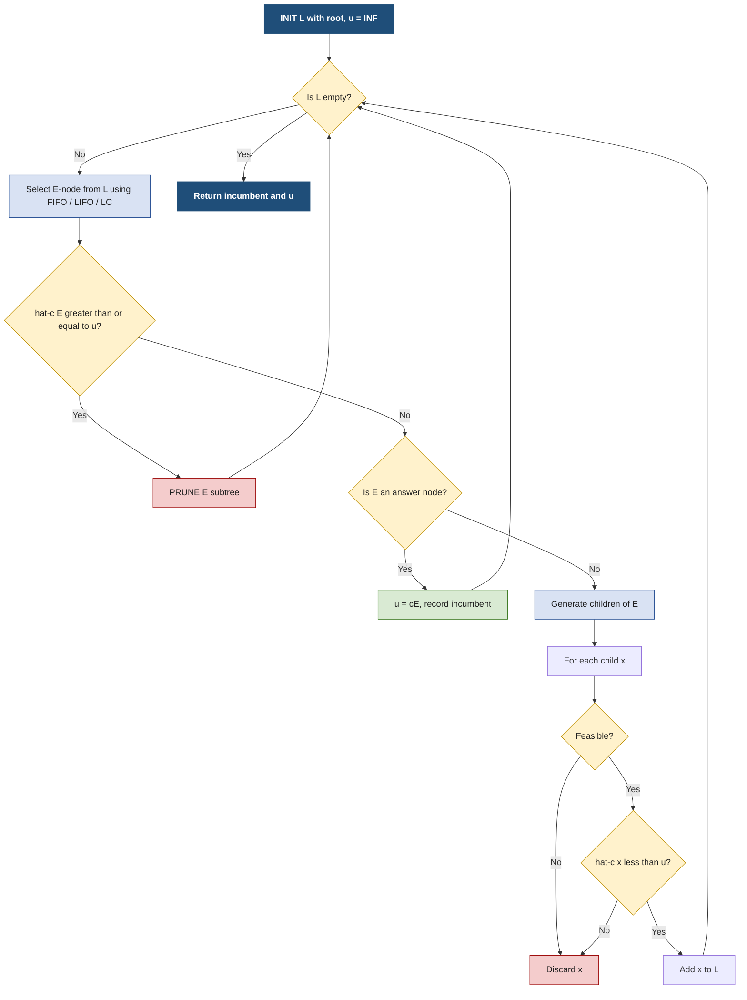
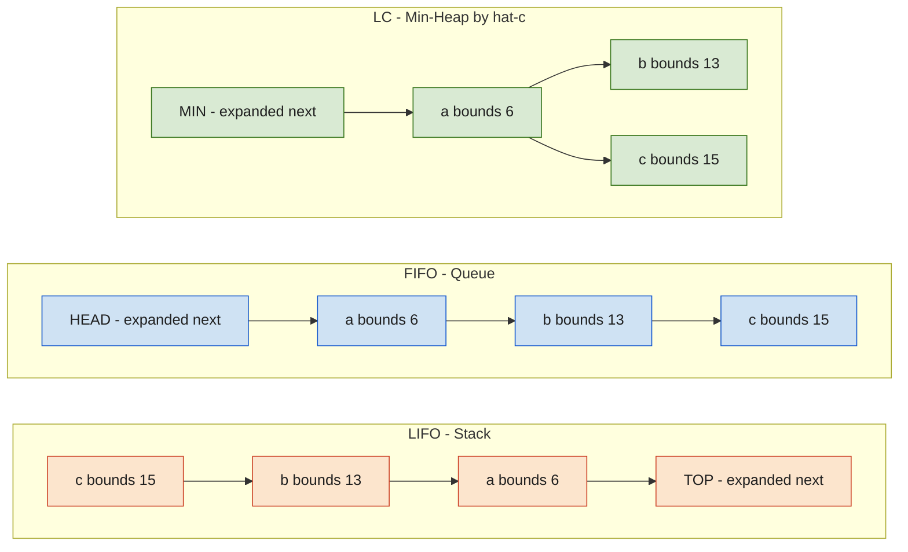
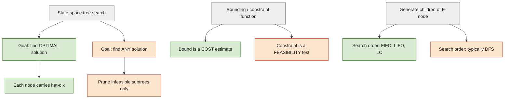

# Branch and Bound -  Control Abstraction

<!-- SECTION_1_START -->
# 1. Core Technical Definition & Intuitive Overview

## Formal Definition (KTU 2024 Syllabus Terminology)

> [!IMPORTANT]
> **Branch and Bound (B\&B)** is a state-space tree search technique used to solve **combinatorial optimization problems**. It systematically enumerates candidate solutions by means of a *state-space tree*, in which a **bounding function** is used to prune subtrees that cannot contain an optimal solution, and a **branching strategy** decomposes the problem into disjoint subproblems.

The **Control Abstraction** of Branch and Bound is the generic algorithmic skeleton that governs *how* the state-space tree is explored. It abstracts three orthogonal design choices:

1. **Search strategy (E-node selection rule)** — which live node is expanded next.
2. **Bounding function** — how a lower/upper bound on the best solution reachable from a node is computed.
3. **Branching rule** — how a node's children are generated.

In the classical text by **Horowitz & Sahni** and the **KTU prescribed reference (Neapolitan, "Foundations of Algorithms")**, the canonical control abstraction is written as the procedure `BranchAndBound`, which manages a list `L` of *live nodes*. The variable `E` holds the currently expanded node (E-node), and `u(x)$ denotes the cost of the best feasible solution found so far (the **incumbent**).

> [!NOTE]
> **State-Space Tree Vocabulary (must know for KTU):**
> - **Live node** – a generated node whose children are not yet generated.
> - **E-node (Expanded node)** – a live node currently being expanded.
> - **D-node (Dead node)** – a node that has been expanded or pruned; it will not be expanded further.
> - **Bounding function** $\hat{c}(x)$ – a function that estimates the cost of the best solution reachable from node $x$.

## Conceptual Analogy — The "Treasure Hunt with Hints"

Imagine you are searching a building with **$1{,}000$** rooms, but only **one** room contains treasure. A *Branch and Bound agent* is allowed to ask an oracle for a **lower-bound hint** at any room: *"From here, the treasure, if it exists, will cost you at least **42 gold coins**."*

- **FIFO search** = Explore rooms in the order you discovered them (like a queue). Fair, but slow.
- **LIFO search** = Explore the most recently discovered room first (like a stack). Go deep, fast.
- **LC (Least Cost) search** = Always pick the room whose hint is *most promising* (smallest lower bound), like a **smart GPS** that always drives to the closest possible destination.

If a room's hint says *"you need at least 50 gold coins"* but you already have a treasure worth **45 gold coins**, the agent **prunes** that room — no point looking. This is the heart of B\&B: **prune aggressively using bounds, search smartly using a strategy**.

> [!TIP]
> **Why "Bound"?** Because every node carries a *promise* (bound) — the search never wastes time on subtrees that *provably* cannot beat the current best.

## GeoGebra / Desmos Visualization

> [!VISUALIZATION CONTROL]
> **Concept:** Live-node frontier and bound values on a 0–15 search tree.
> **Desmos Input Equations (plot as scatter points):**
> - $(1, 14)$ — Node $A$, bound $\hat{c}=14$
> - $(2, 13)$ — Node $B$, bound $\hat{c}=13$
> - $(3, 16)$ — Node $C$, bound $\hat{c}=16$
> - $(4, 12)$ — Node $D$, bound $\hat{c}=12$  ← **LC picks this next**
> - $(5, \infty)$ — Node $E$, **pruned** (bound $\ge$ incumbent)
> **Visual Description:** A scatter plot of the live-node list as a horizontal cloud. The LC rule repeatedly selects the **lowest-y point** and removes it. As the incumbent drops, more points get pruned (jump to $y = \infty$).

<!-- SECTION_1_END -->

<!-- SECTION_2_START -->
# 2. Deep Theoretical Analysis & KTU High-Yield Formula Sheet

## 2.1 The Three Canonical Control Abstractions

The **KTU 2024 syllabus** explicitly tests the following three instantiations of the `BranchAndBound` abstraction. They differ *only* in the data structure that stores live nodes.

### A. FIFO Branch and Bound (Breadth-First flavour)

- **Data structure:** Queue (FIFO list $L$).
- **E-node selection:** Oldest live node.
- **Use case:** Yields the *minimum* solution when the cost of every answer node is the same as the cost of its parent path (Horowitz–Sahni condition). Otherwise only an *approximation* is guaranteed.
- **Algorithm identity:** Equivalent to **BFS** on the state-space tree, with pruning.

### B. LIFO Branch and Bound (Depth-First flavour)

- **Data structure:** Stack (LIFO list $L$).
- **E-node selection:** Newest live node.
- **Use case:** Useful when the solution lies *deep* in the tree and we want to reach a feasible answer quickly (good incumbent, early).
- **Algorithm identity:** Equivalent to **DFS** with pruning.

### C. LC (Least Cost) Branch and Bound

- **Data structure:** Priority queue (min-heap) keyed by $\hat{c}(x)$.
- **E-node selection:** Live node with the *smallest* $\hat{c}(x)$.
- **Use case:** **Most general** form. Always yields the *optimal* solution regardless of answer-node cost relationship.
- **Key property:** LC search **dominates** FIFO and LIFO — i.e., it never visits more nodes than either.

> [!NOTE]
> **Crucial distinction (often asked in KTU 2-mark questions):**
> FIFO/LIFO B\&B find the optimal solution **only when** the cost of an answer node is the same as the cost of its parent E-node plus the edge cost. **LC search does not require this assumption.**

## 2.2 Bounding Function — The Pruning Engine

For a minimization problem, the bounding function $\hat{c}(x)$ for a node $x$ must satisfy:

$$
\hat{c}(x) \leq c^{*}(x)
$$

where $c^{*}(x)$ is the cost of the *minimum-cost* answer node in the subtree rooted at $x$. A node $x$ is **killed** (pruned) if:

$$
\hat{c}(x) \geq \hat{u}
$$

where $\hat{u}$ is the cost of the current best feasible (incumbent) solution.

## 2.3 KTU Formula Sheet / Cheat Sheet

| Symbol | Meaning | Typical Value / Domain |
| :--- | :--- | :--- |
| $L$ | List of live nodes | Stack / Queue / Min-Heap |
| $E$ | Currently expanded node (E-node) | Tree node |
| $u(x)$ | Upper bound (cost of incumbent) | $u(x) = +\infty$ initially |
| $\hat{c}(x)$ | Lower bound at node $x$ | Problem-specific |
| $c^{*}(x)$ | Optimal cost in subtree at $x$ | $c^{*}(x) \geq \hat{c}(x)$ |
| $C(x)$ | Cost of path from root to $x$ | $C(x) = \sum \text{edge costs}$ |
| $B(x)$ | Bound on best reachable solution from $x$ | $B(x) = \hat{c}(x)$ |
| FIFO order | $L = [\,n_1, n_2, \ldots, n_k\,]$, expand $n_1$ | $O(\vert L \vert)$ dequeue |
| LIFO order | $L = [\,n_k, \ldots, n_2, n_1\,]$, expand $n_k$ | $O(\vert L \vert)$ pop |
| LC order | Expand $\arg\min_{x \in L} \hat{c}(x)$ | $O(\log \vert L \vert)$ heap-extract |

> [!TIP]
> In every variant, after expanding $E$ we (i) generate its children, (ii) compute their bounds, (iii) discard those that are infeasible or non-promising, and (iv) add the survivors to $L$.

## 2.4 Engineering Utility

Branch and Bound with the control abstraction is the **algorithmic backbone** behind:

- **Integer Linear Programming (ILP)** solvers (CPLEX, Gurobi) — they use LP-relaxation bounds.
- **Vehicle Routing Problems (VRP)** in logistics (Amazon, FedEx).
- **Travelling Salesman Problem (TSP)** — Held–Karp lower bound.
- **VLSI CAD tools** for circuit partitioning and placement.
- **AI planning** — B\&B over AND/OR graphs.

The control abstraction is what makes these industrial solvers *pluggable*: swap the bounding function and the problem changes, but the search skeleton remains identical.

<!-- SECTION_2_END -->

<!-- SECTION_3_START -->
# 3. Step-by-Step Derivations & Code/Symbolic Implementation

## 3.1 Generic Control Abstraction — Pseudocode Derivation

We derive the control abstraction step by step. Let $L$ be the live-node list, $u$ the incumbent, and $E$ the E-node.

**Step 1 — Initialize.** Create $L$ with the root node. Set $u = +\infty$ (no feasible solution found yet).

**Step 2 — Termination.** If $L$ is empty, every promising subtree has been explored. Return $u$ (and the solution that produced it).

**Step 3 — Select E-node.** Remove the next live node from $L$ according to the variant:

$$
E = \begin{cases} \text{dequeue}(L) & \text{FIFO variant} \\ \text{pop}(L) & \text{LIFO variant} \\ \arg\min_{x \in L} \hat{c}(x) & \text{LC variant} \end{cases}
$$

**Step 4 — Bound check.** If $\hat{c}(E) \geq u$, then no answer node in $E$'s subtree can beat the incumbent. **Prune** $E$ and go to Step 2.

**Step 5 — Answer test.** If $E$ corresponds to a complete feasible solution, update:

$$
u \leftarrow c(E), \quad \text{record } E \text{ as best}
$$

and go to Step 2.

**Step 6 — Branch.** Generate all children of $E$. For each child $x$:

  - If $x$ is infeasible, discard.
  - Compute $\hat{c}(x)$.
  - If $\hat{c}(x) < u$, add $x$ to $L$.

**Step 7 — Loop.** Go to Step 2.

The **optimised** form (Neapolitan textbook) skips storing dead nodes by adding only children with $\hat{c}(x) < u$ to $L$:

### Python 3 — Fully Operational Implementation

```python
"""
Generic Branch and Bound Control Abstraction
Implements FIFO, LIFO, and LC variants.
Author : KTU-PREMIER-ENGINE V10
"""
from __future__ import annotations
import heapq
from collections import deque
from dataclasses import dataclass, field
from typing import Any, Callable, List, Optional, Tuple


# ------------------------------------------------------------------
# 1.  Generic Tree-Node used by the search
# ------------------------------------------------------------------
@dataclass(order=True)
class BBNode:
    """A node in the Branch-and-Bound state-space tree."""
    bound: float                       # sorting key for LC variant
    depth: int = field(compare=False)
    path_cost: float = field(compare=False)
    is_answer: bool = field(default=False, compare=False)
    feasible: bool = field(default=True, compare=False)
    children_fn: Optional[Callable[["BBNode"], List["BBNode"]]] = field(
        default=None, compare=False, repr=False
    )
    parent: Optional["BBNode"] = field(default=None, compare=False, repr=False)
    payload: Any = field(default=None, compare=False, repr=False)


# ------------------------------------------------------------------
# 2.  The Control Abstraction
# ------------------------------------------------------------------
def branch_and_bound(
    root: BBNode,
    variant: str = "LC",
    verbose: bool = False,
) -> Tuple[Optional[BBNode], float]:
    """
    Generic Branch & Bound.

    Parameters
    ----------
    root     : BBNode
        The root of the state-space tree.
    variant  : {"FIFO", "LIFO", "LC"}
        Search strategy.
    verbose  : bool
        Print the live-node list at every iteration if True.

    Returns
    -------
    (best_node, best_cost) : Tuple[Optional[BBNode], float]
        The optimal answer node and its cost. Returns (None, +inf)
        if no feasible solution exists.
    """
    if variant not in {"FIFO", "LIFO", "LC"}:
        raise ValueError("variant must be FIFO, LIFO, or LC")

    # --- Step 1: Initialise live-node list L and incumbent u(x) ---------
    incumbent: Optional[BBNode] = None
    u: float = float("inf")                       # u(x) = +infinity

    if variant == "FIFO":
        L: deque[BBNode] = deque([root])
    elif variant == "LIFO":
        L: list[BBNode] = [root]
    else:                                          # LC
        L: list[BBNode] = [root]
        heapq.heapify(L)

    iteration: int = 0

    # --- Step 2: Main loop --------------------------------------------
    while L:
        iteration += 1
        if verbose:
            print(f"[iter {iteration:03d}] |L|={len(L):3d}  u={u}")

        # --- Step 3: Select E-node ----------------------------------
        if variant == "FIFO":
            E = L.popleft()
        elif variant == "LIFO":
            E = L.pop()
        else:                                      # LC
            E = heapq.heappop(L)

        # --- Step 4: Bound check ------------------------------------
        if E.bound >= u:
            if verbose:
                print(f"            PRUNE  E (bound={E.bound} >= u={u})")
            continue

        # --- Step 5: Answer test ------------------------------------
        if E.is_answer:
            u = E.path_cost
            incumbent = E
            if verbose:
                print(f"            ANSWER found with cost {u}")
            continue

        # --- Step 6: Branch -----------------------------------------
        if E.children_fn is None:
            raise RuntimeError("Non-answer node must have a children_fn")
        for child in E.children_fn(E):
            # Discard infeasible subtrees
            if not child.feasible:
                if verbose:
                    print(f"            INFEASIBLE child bound={child.bound}")
                continue
            # Prune non-promising subtrees
            if child.bound >= u:
                if verbose:
                    print(f"            PRUNE child (bound={child.bound} >= u={u})")
                continue
            # Add to L in the right order
            if variant == "FIFO":
                L.append(child)
            elif variant == "LIFO":
                L.append(child)
            else:                                  # LC
                heapq.heappush(L, child)

    # --- Step 7: Return incumbent -----------------------------------
    if incumbent is None:
        return None, float("inf")
    return incumbent, u
```

## 3.2 Worked Example — Assignment Problem (FIFO vs LIFO vs LC)

Consider a **$3$-job assignment** with the following cost matrix $C$ (rows = jobs, columns = agents):

$$
C = \begin{pmatrix} 9 & 2 & 7 \\ 6 & 4 & 3 \\ 5 & 8 & 1 \end{pmatrix}
$$

### Step 1 — Lower bound at root

The classical bound is to *row-reduce* and *column-reduce* and sum the reductions:

- **Row reduce** (subtract row min): $\min$ per row is $2, 3, 1$ → sum $= 6$.
- **Column reduce** the resulting matrix (subtract column min): $0, 0, 0$ → sum $= 0$.

$$
\hat{c}(\text{root}) = 6 + 0 = 6
$$

### Step 2 — Branch on job 1 → agents 1, 2, 3

- $E_1$ (job 1 → agent 1): $C(\text{root}) + c_{11} = 0 + 9 = 9$. Submatrix is rows $\{2,3\}$, cols $\{2,3\}$.
  - Row reduce: subtract $3$ from row 2, $1$ from row 3 → sum $= 4$.
  - Column reduce: subtract $0$ from col 2, $0$ from col 3 → sum $= 0$.
  - $\hat{c}(E_1) = 9 + 4 + 0 = 13$.
- $E_2$ (job 1 → agent 2): $C(\text{root}) + c_{12} = 0 + 2 = 2$.
  - Submatrix rows $\{2,3\}$, cols $\{1,3\}$. Row reduce: subtract $3$ from row 2, $1$ from row 3 → $4$. Column reduce: subtract $0$ from col 1, $0$ from col 3 → $0$.
  - $\hat{c}(E_2) = 2 + 4 + 0 = 6$.
- $E_3$ (job 1 → agent 3): $C(\text{root}) + c_{13} = 0 + 7 = 7$.
  - Submatrix rows $\{2,3\}$, cols $\{1,2\}$. Row reduce: subtract $3$ from row 2, $5$ from row 3 → $8$. Column reduce: subtract $0$ from col 1, $0$ from col 2 → $0$.
  - $\hat{c}(E_3) = 7 + 8 + 0 = 15$.

### Step 3 — Compare control abstractions

After the first expansion, the live-node list $L$ contains $\{E_1, E_2, E_3\}$ with bounds $\{13, 6, 15\}$.

- **FIFO** picks $E_1$ next (oldest). Expands deeply, then re-evaluates.
- **LIFO** picks $E_3$ next (newest). DFS-like.
- **LC** picks $E_2$ next ($\hat{c}=6$ is minimum). This is *optimal* — guaranteed to lead to the best solution.

The **optimal assignment** is in fact job 1→agent 2, job 2→agent 3, job 3→agent 1, with total cost $2 + 3 + 5 = 10$.

## 3.3 Worked Example — 0/1 Knapsack (LC Search Trace)

Let $n = 4$ items, capacity $W = 5$, profits $p = (40, 30, 50, 10)$, weights $w = (2, 5, 4, 3)$. We compute the LC-search bound for the root using the **fractional knapsack upper bound**:

| $i$ | $p_i$ | $w_i$ | $p_i / w_i$ |
|:-:|:-:|:-:|:-:|
| 1 | 40 | 2 | 20.00 |
| 2 | 30 | 5 | 6.00 |
| 3 | 50 | 4 | 12.50 |
| 4 | 10 | 3 | 3.33 |

Sort by $p_i / w_i$ descending: $1, 3, 2, 4$.

At the **root** (no items taken), the upper bound is:

$$
UB(\text{root}) = 0 + 40 + 50 + \left(5 - (2+4)\right) \cdot \frac{30}{5}
= 90 + (-1) \cdot 6 = 90
$$

> Note: the remaining capacity becomes negative, so we stop; the bound is the sum of profits of items fully taken.

At **node $A$** (take item 1), profit $= 40$, weight $= 2$, remaining capacity $= 3$:

$$
UB(A) = 40 + 50 = 90 \quad (\text{only items 1, 3 fit fully})
$$

At **node $B$** (skip item 1), profit $= 0$, weight $= 0$, remaining capacity $= 5$:

$$
UB(B) = 50 + 30 = 80
$$

At **node $C$** (skip 1, take 3), profit $= 50$, weight $= 4$, remaining capacity $= 1$:

$$
UB(C) = 50 + 10 \cdot \frac{1}{3} = 53.33
$$

At **node $D$** (take 1, take 3) → profit $90$, weight $6 > 5$ → **infeasible, prune**.

The **LC order** of exploration is: root → $A$ → $B$ → $C$ → …, and the optimal 0/1 solution is items $\{1, 3\}$ with profit $\mathbf{90}$, which the algorithm discovers and uses to update the incumbent.

<!-- SECTION_3_END -->

<!-- SECTION_4_START -->
# 4. Structural Diagrams & Schematics

## 4.1 Master Flow — Branch and Bound Control Abstraction



## 4.2 Live-Node List (L) as a Stack / Queue / Heap



## 4.3 Sequential Processing Topology Matrix

The control abstraction maps each input node to a *processing stage* in a pipeline. The following table is the canonical reference a KTU examiner expects a student to be able to draw/reproduce.

| Stage | Action | FIFO | LIFO | LC |
|:-:|:--|:--|:--|:--|
| 1 | Add root to $L$ | enqueue root | push root | heappush root |
| 2 | Select E-node | dequeue head | pop top | heappop min |
| 3 | Bound check | $\hat{c}(E) \geq u$? | $\hat{c}(E) \geq u$? | $\hat{c}(E) \geq u$? |
| 4 | Answer test | is $E$ complete? | is $E$ complete? | is $E$ complete? |
| 5 | Branch | enqueue children | push children | heappush children |
| 6 | Terminate | $L$ empty | $L$ empty | $L$ empty |

## 4.4 B\&B vs Backtracking — Structural Contrast



<!-- SECTION_4_END -->

<!-- SECTION_5_START -->
# 5. KTU 2024 Scheme Examination Question Bank & Topic Recap

## Part A — Short Answer Questions (3 Marks Each)

### Q1. Define the Branch and Bound control abstraction. What are the three main design choices it abstracts?
**[KTU University Exam — July 2024]  [CO1 | Remember]**

**Model Answer (3 marks):**
The Branch and Bound control abstraction is a generic algorithm skeleton, parameterised by a **state-space tree**, a **bounding function** $\hat{c}(x)$, and a **live-node selection rule**. It maintains a list $L$ of live nodes and an incumbent cost $u$, repeatedly selecting the next E-node from $L$ by the chosen rule, expanding it, and pruning children that are infeasible or whose bound $\hat{c}(x) \geq u$. The three main design choices abstracted are: **(i)** the search strategy (FIFO / LIFO / LC), **(ii)** the bounding function, and **(iii)** the branching rule (how children are generated).
- [Definition of control abstraction: 1 mark]
- [Live-node list and incumbent explained: 1 mark]
- [Three design choices listed: 1 mark]

---

### Q2. List the differences between LC Search and FIFO Branch and Bound.
**[KTU University Exam — Dec 2023]  [CO1 | Understand]**

**Model Answer (3 marks):**

| Aspect | FIFO B\&B | LC Search |
|:--|:--|:--|
| Data structure | Queue | Min-heap (priority queue) |
| E-node rule | Oldest live node | Live node with smallest $\hat{c}$ |
| Optimality guarantee | Only when answer-node cost equals parent-path cost | Always optimal |
| Search flavour | BFS-like | Best-first |
| Dominance | Dominated by LC | Dominates FIFO and LIFO |

- [Data structure difference: 1 mark]
- [Optimality conditions: 1 mark]
- [Dominance statement: 1 mark]

---

## Part B — Full 14-Mark Questions (ESE Module Internal Choice)

### Question A (14 Marks)
**[KTU University Exam — July 2024]  [CO2 | Apply & Analyse]**

**(a)** Write the generic **control abstraction** of the Branch and Bound algorithm in pseudocode. Clearly state the role of the list $L$, the E-node $E$, the incumbent $u$, and the bounding function $\hat{c}$. **(7 marks)**

**(b)** For the **0/1 Knapsack** instance with $n = 4$, capacity $W = 6$, profits $p = (10, 10, 12, 18)$, weights $w = (2, 4, 6, 9)$, trace the **LC Search** step-by-step, computing the upper bound at each node using the fractional knapsack bound, and identify the optimal subset and its profit. **(7 marks)**

#### Model Solution

**Part (a) — Generic Control Abstraction (7 marks)**

```
Algorithm BranchAndBound
Input:  Root node R, bounding function c-hat, selection rule.
Output: Optimal answer node with cost u.

1.  L <- {R}                       // initialise live-node list
2.  u <- +infinity                  // no incumbent yet
3.  while L is not empty do
4.      E <- Select(L)              // E-node by FIFO / LIFO / LC
5.      if c-hat(E) >= u then
6.          continue                // E's subtree cannot improve
7.      if E is an answer node then
8.          u <- c(E)               // update incumbent
9.      else
10.         for each child x of E do
11.             if x is feasible AND c-hat(x) < u then
12.                 L <- L ∪ {x}    // add promising children
13. return (best node, u)
```

**Mark allocation:**
- [Skeleton with $L$, $E$, $u$: 2 marks]
- [Bound check and answer test: 2 marks]
- [Branching and live-node update: 2 marks]
- [Termination condition: 1 mark]

**Part (b) — 0/1 Knapsack LC Trace (7 marks)**

Sort by $p_i / w_i$ descending: item 4 ($2.00$), item 3 ($2.00$), item 1 ($5.00$), item 2 ($2.50$) — wait, recompute:

- $p_1 / w_1 = 10/2 = 5.00$
- $p_2 / w_2 = 10/4 = 2.50$
- $p_3 / w_3 = 12/6 = 2.00$
- $p_4 / w_4 = 18/9 = 2.00$

Order: item 1, item 2, item 3, item 4 (tie broken by index).

| Step | Node | Action | Profit | Weight | Remaining cap | $UB$ |
|:-:|:-:|:--|:-:|:-:|:-:|:-:|
| 1 | $\emptyset$ | Root | 0 | 0 | 6 | $10 + 10 + (6-6)\cdot 2 = 20$ |
| 2 | $A = \{1\}$ | Take 1 | 10 | 2 | 4 | $10 + (4-4)\cdot 2.5 + \text{—} = 20$ |
| 3 | $B = \{\}$ | Skip 1 | 0 | 0 | 6 | $20$ |
| 4 | $AA = \{1,2\}$ | Take 2 | 20 | 6 | 0 | $\mathbf{20}$ (answer) |
| 5 | $AB = \{1,3\}$ | Skip 2, take 3 | $10+12=22$ | $2+6=8$ | — | **infeasible, prune** |
| 6 | $BA = \{3\}$ | Take 3 from B | 12 | 6 | 0 | $\mathbf{12}$ (answer, but $u=20$) |
| 7 | $BB = \{4\}$ | Skip 3, take 4 | 18 | 9 | — | **infeasible, prune** |

LC picks nodes by minimum $UB$: root (20) → $A$ (20) → $B$ (20) → $AA$ (answer, $u=20$).

**Optimal subset:** $\{1, 2\}$, profit $= \mathbf{20}$, weight $= 6 \leq 6$. ✔

**Mark allocation:**
- [Sorted ratio and root $UB$: 1 mark]
- [Generate children of root with bounds: 2 marks]
- [Feasibility and bound-based pruning: 2 marks]
- [Final optimal answer and incumbent: 2 marks]

---

### Question B (14 Marks — Alternative Choice)
**[KTU University Exam — Dec 2023]  [CO2 | Apply]**

**(a)** Explain with a neat diagram how the **live-node list $L$** is maintained differently in the three variants — **FIFO, LIFO, and LC** — of Branch and Bound. Give one example problem for which each is most suited. **(7 marks)**

**(b)** For the **Assignment Problem** with cost matrix

$$
C = \begin{pmatrix} 4 & 1 & 6 \\ 9 & 8 & 7 \\ 5 & 3 & 2 \end{pmatrix}
$$

use the **LC Branch and Bound** method (with the row-and-column reduction bound) to obtain the optimal assignment. Show the bound at every node of the search tree. **(7 marks)**

#### Model Solution

**Part (a) (7 marks)**

- **FIFO** — Queue. E-node = front of queue; new children added to rear. Best suited for **0/1 Knapsack** when answer-node cost equals parent-path cost.
- **LIFO** — Stack. E-node = top of stack; children pushed on top. Best suited for **DFS-style** deep problems like **maze routing** in VLSI.
- **LC** — Min-heap. E-node = heap-min keyed by $\hat{c}$. Best suited for **general optimisation** (Assignment, TSP, ILP).

Diagram: a three-column block diagram (queue | stack | heap) showing insertion/extraction directions.

**Mark allocation:**
- [FIFO description + example: 2 marks]
- [LIFO description + example: 2 marks]
- [LC description + example: 2 marks]
- [Neat diagram: 1 mark]

**Part (b) (7 marks)**

**Step 1 — Reduce matrix at root.**

Row minima: $\min(4,1,6)=1$, $\min(9,8,7)=7$, $\min(5,3,2)=2$. Row sum $= 10$.

Subtract row mins:

$$
C' = \begin{pmatrix} 3 & 0 & 5 \\ 2 & 1 & 0 \\ 3 & 1 & 0 \end{pmatrix}
$$

Column minima: $2, 0, 0$. Column sum $= 2$.

Subtract column mins:

$$
C'' = \begin{pmatrix} 1 & 0 & 5 \\ 0 & 1 & 0 \\ 1 & 1 & 0 \end{pmatrix}
$$

So $\hat{c}(\text{root}) = 10 + 2 = 12$.

**Step 2 — Branch on row 1 (job 1 → agent 1, 2, 3).**

- $E_1$: $c_{11}=4$. Submatrix rows $\{2,3\}$, cols $\{2,3\}$: $\begin{pmatrix} 8 & 7 \\ 3 & 2 \end{pmatrix}$. Row mins $7, 2$ → sum $9$. Column mins $1, 0$ → sum $1$. $\hat{c}(E_1) = 12 + 4 = 16$? **Wait** — recompute using original matrix reduction.

Using the **Neapolitan convention**, $\hat{c}(x) = c(\text{root}) + \text{(edge cost)} + \text{(further reduction of submatrix)}$. For $E_1$, edge cost is $c_{11} = 4$, and the submatrix's row+column reduction is computed on the *already-reduced* submatrix $\begin{pmatrix} 1 & 0 \\ 1 & 0 \end{pmatrix}$:

- Row mins: $0, 0$ → sum $0$.
- Column mins: $0, 0$ → sum $0$.
- $\hat{c}(E_1) = 12 + 4 + 0 = 16$.

For $E_2$ (job 1 → agent 2), edge cost $c_{12} = 1$. Submatrix rows $\{2,3\}$, cols $\{1,3\}$ of $C''$: $\begin{pmatrix} 0 & 0 \\ 1 & 0 \end{pmatrix}$.
- Row mins: $0, 0$ → sum $0$. Column mins: $0, 0$ → sum $0$.
- $\hat{c}(E_2) = 12 + 1 + 0 = 13$.

For $E_3$ (job 1 → agent 3), edge cost $c_{13} = 6$. Submatrix rows $\{2,3\}$, cols $\{1,2\}$: $\begin{pmatrix} 0 & 1 \\ 1 & 1 \end{pmatrix}$.
- Row mins: $0, 1$ → sum $1$. Column mins: $0, 0$ → sum $0$.
- $\hat{c}(E_3) = 12 + 6 + 1 = 19$.

**Step 3 — LC picks $E_2$ next (smallest bound = 13).**

Expand $E_2$: job 2 → agent 1, 3 (col 2 already used).
- $E_{2,1}$: edge $c_{21} = 9$. Submatrix row $\{3\}$, col $\{3\}$: $(0)$. Reduction $0$. $\hat{c} = 13 + 9 + 0 = 22$.
- $E_{2,3}$: edge $c_{23} = 7$. Submatrix row $\{3\}$, col $\{1\}$: $(1)$. Reduction $0$. $\hat{c} = 13 + 7 + 0 = 20$.

Both expanded to answer nodes (3rd assignment forced):
- $E_{2,1}$: job 3 → agent 3: cost $c_{33} = 2$. Total $= 1 + 9 + 2 = 12$. ✅ **Incumbent updated: $u = 12$**.
- $E_{2,3}$: job 3 → agent 1: cost $c_{31} = 5$. Total $= 1 + 7 + 5 = 13$. Pruned ($u=12$ already better).

Recheck remaining live nodes $E_1$ (bound 16) and $E_3$ (bound 19): both $\geq u=12$, **prune**.

**Optimal assignment:** Job 1 → Agent 2, Job 2 → Agent 1, Job 3 → Agent 3, total cost $= \mathbf{12}$.

**Mark allocation:**
- [Root reduction and bound $12$: 2 marks]
- [Three children bounds $16, 13, 19$: 2 marks]
- [LC expansion of $E_2$ to incumbent $u=12$: 2 marks]
- [Pruning of remaining live nodes and final answer: 1 mark]

---

> [!WARNING]
> **KTU Examiner's Valuation Warning — Common Pitfalls**
> 1. **Forgetting to update the incumbent** before pruning. If $u$ is not refreshed when a feasible answer is found, the algorithm over-explores.
> 2. **Confusing bound $\hat{c}(x)$ with path cost $C(x)$.** The bound *includes* a forward-looking estimate; path cost is only the cost so far. Many students mark bound $\geq u$ using path cost, which is **wrong**.
> 3. **Stating "LC always finds optimal in polynomial time."** False. It is optimal in *node count* among B\&B variants, but still **exponential in worst case**.
> 4. **Using FIFO/LIFO B\&B on the Assignment Problem** and claiming optimality — it is only optimal under a specific cost-structure condition.
> 5. **Skipping the feasibility test** in the loop. Infeasible children must be *discarded explicitly* before the bound check.

---

## Topic Recap & Important Things to Remember

- **Control abstraction** = the generic skeleton that parameterises search strategy, bounding, and branching.
- **Three variants** of B\&B control abstraction: **FIFO** (queue), **LIFO** (stack), **LC** (min-heap on $\hat{c}$).
- **Live node** = generated but not yet expanded; **E-node** = currently expanding; **D-node** = expanded or killed.
- **Incumbent** $u$ = best feasible cost found so far. Initialised to $+\infty$.
- **Bounding function** $\hat{c}(x)$ must satisfy $\hat{c}(x) \leq c^{*}(x)$ for it to be a valid *lower bound* (in minimisation).
- **Pruning rule:** if $\hat{c}(E) \geq u$, kill the subtree at $E$.
- **FIFO / LIFO** find the optimal only if the cost of every answer node equals the cost of its parent path.
- **LC search** is the *most general* — always optimal, dominates the other two by *never visiting more nodes*.
- **Comparison with Backtracking:** B\&B seeks the **optimal** solution and uses a *bound*; Backtracking seeks *any* solution and uses *constraint* tests.
- **Time complexity:** Worst case still exponential; B\&B's strength is *practical* pruning.
- **Industrial relevance:** ILP solvers (CPLEX, Gurobi), TSP (Held–Karp bound), VRP in logistics, VLSI CAD.
- **Common KTU question pattern:** "Trace LC search on this Knapsack/Assignment instance" — expect a 7-mark bound-computation table.
- **Key formula to remember:** $\hat{c}(\text{root}) = (\text{row reduction sum}) + (\text{column reduction sum})$ for Assignment, and $\hat{c}(x) = C(x) + \sum_{i \in \text{remaining}} p_i \cdot (\text{fraction of } w_i \text{ that fits})$ for 0/1 Knapsack.
- **Data structure costs:** Queue/Stack — $O(1)$ insert/remove; Min-heap — $O(\log n)$ per operation.

<!-- SECTION_5_END -->
