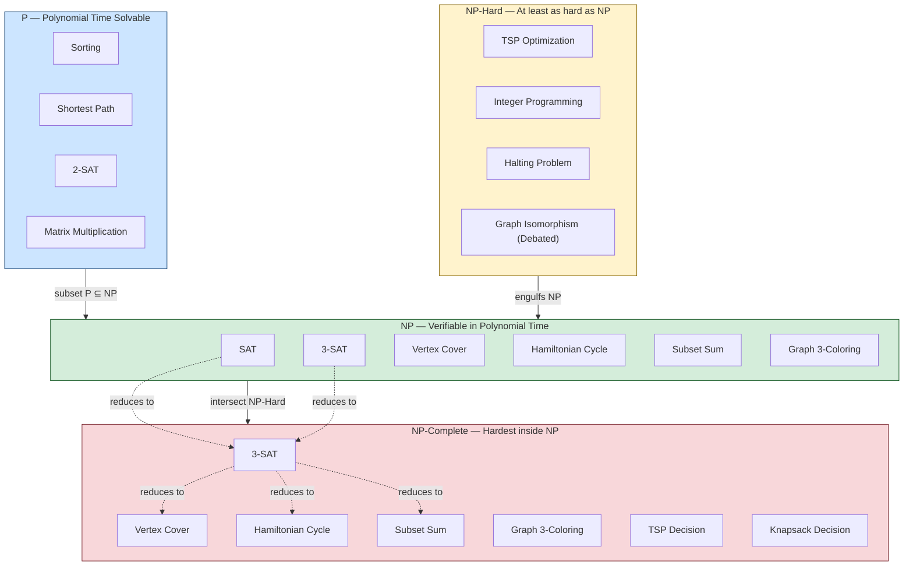
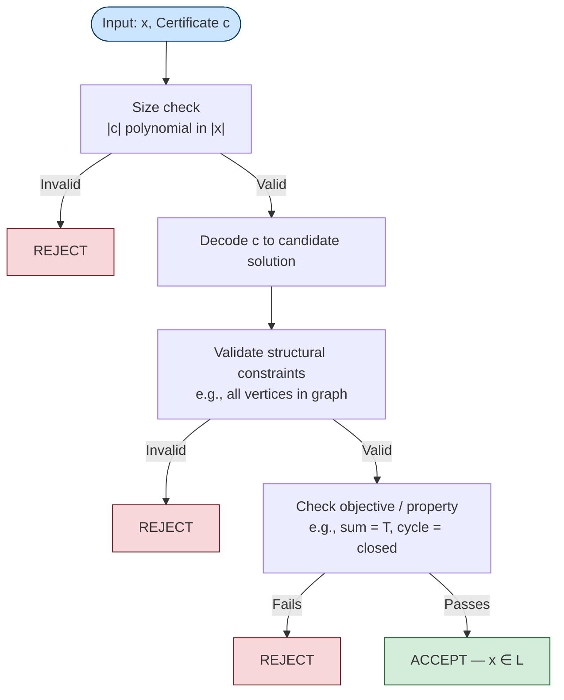
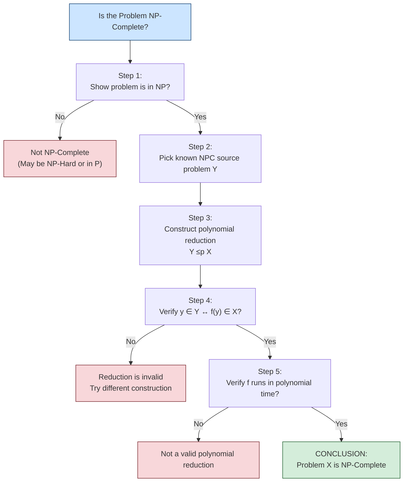

# Complexity Classes :  P, NP, NP- Hard and NP-Complete Classes

<!-- SECTION_1_START -->
# 📘 KTU PCCST502 — Design and Analysis of Algorithms
## Module 4: Branch and Bound
### Topic: Complexity Classes — P, NP, NP-Hard and NP-Complete

---

## 1. Core Technical Definition & Intuitive Overview

> [!IMPORTANT]
> **KTU 2024 Syllabus Definition (PCCST502 / Module 4):**
> *Complexity theory classifies computational problems into hierarchical classes (P, NP, NP-Hard, NP-Complete) based on the resources (time/space) required by the best-known algorithm, and the structural property of "verifiability" of solutions.*

### 1.1 What is a Complexity Class?
A **complexity class** is a *set of decision problems* (problems whose answer is **YES** or **NO**) that can be solved (or whose solutions can be verified) within a given resource bound.

> [!NOTE]
> **KTU Board Terminology — "Decision Problem":**
> A problem that asks a *yes/no* question. E.g., *"Does this graph contain a Hamiltonian Cycle?"* — YES or NO. Almost all complexity theory is built on decision problems because they are mathematically clean and form the basis of the famous **P vs NP** problem (a Clay Millennium Prize worth **\$1,000,000**).

---

### 1.2 The Four Major Classes — Plain English Intuition

Think of problems as **puzzles** and computers as **solvers**. Now let us place each complexity class into a real-world frame:

| Class | Real-World Analogy |
|---|---|
| **P** | Solving a Rubik's Cube *from scratch* using a known efficient strategy. |
| **NP** | A teacher checking your exam paper — *verifying* a solution is easy even if *finding* it is hard. |
| **NP-Hard** | A "monster" problem at least as hard as *every* problem in NP. |
| **NP-Complete** | The *toughest* problems inside NP — verify easily, solve (probably) hard. |

---

### 1.3 Class **P** — Polynomial Time

> [!IMPORTANT]
> **Formal Definition (KTU Standard):**
> **P** is the class of decision problems that can be **solved** by a deterministic Turing Machine in **polynomial time**, i.e., in $O(n^k)$ for some constant $k \geq 0$, where $n$ is the input size.

**Intuition:** *Efficiently solvable*. These are the "well-behaved" problems for which we have *fast* algorithms.

**Examples of P problems:**
- Sorting an array: $O(n \log n)$
- Searching in a sorted array (Binary Search): $O(\log n)$
- Finding shortest path in a weighted graph (Dijkstra's): $O((V + E) \log V)$
- Checking if a number is even: $O(1)$
- Matrix multiplication (Strassen): $O(n^{2.807})$

> [!NOTE]
> **Key constant used in KTU board definitions:** The polynomial bound is $T(n) = O(n^k)$ where the constant $k$ is *fixed* for that problem — not growing with input.

---

### 1.4 Class **NP** — Nondeterministic Polynomial Time

> [!IMPORTANT]
> **Formal Definition (Two Equivalent Forms):**
> **NP** is the class of decision problems such that:
> 1. **Verifier Form:** A *YES* instance has a *certificate* (proof/witness) that can be *verified* in polynomial time by a deterministic Turing Machine.
> 2. **Nondeterministic Form:** A problem can be *solved* in polynomial time by a *nondeterministic* Turing Machine (a machine that magically guesses the right path).

**Intuition:** *Easily verifiable*. You may not know how to find a solution, but if I hand you a candidate answer, you can quickly check if it is correct.

**Examples of NP problems:**
- Boolean Satisfiability (SAT)
- Hamiltonian Cycle existence
- Travelling Salesman Problem (decision version)
- Subset Sum
- Graph Coloring
- Sudoku (any size)
- Factoring large integers (currently believed in NP $\cap$ co-NP, but unproven in P)

> [!TIP]
> **Trivial Fact (Loved by KTU Examiners):**
> $P \subseteq NP$ — *Everything you can solve in polynomial time, you can obviously verify in polynomial time* (just re-run the algorithm). The million-dollar question is whether the reverse inclusion holds.

---

### 1.5 Class **NP-Hard**

> [!IMPORTANT]
> **Formal Definition:**
> A problem $H$ is **NP-Hard** if **every** problem $L \in NP$ can be *reduced* to $H$ in polynomial time. Symbolically:
> $$\forall L \in NP, \quad L \leq_p H$$
> NP-Hard problems are *at least as hard* as the hardest problems in NP. They need **not** themselves be in NP, and they need not even be decision problems.

**Intuition:** *Universal tough guys*. They are problems that, if you can solve them efficiently, you can solve *everything* in NP efficiently.

**Examples of NP-Hard problems:**
- The **Halting Problem** (undecidable — strictly harder than NP-Complete)
- **Travelling Salesman (optimization version)**
- **Integer Linear Programming**
- **Graph Isomorphism** (only NP, status debated, but believed not NP-Complete)

---

### 1.6 Class **NP-Complete**

> [!IMPORTANT]
> **Formal Definition:**
> A problem $\Pi$ is **NP-Complete** if and only if:
> 1. $\Pi \in NP$ (it is verifiable in polynomial time), **AND**
> 2. $\Pi$ is NP-Hard (every NP problem reduces to $\Pi$ in polynomial time).

**Intuition:** The *hardest problems that still live inside NP*. They are the *boundary* between P and the rest.

**Famous NP-Complete Problems (Cook's Set and Beyond):**
- **SAT** (Cook's Theorem, 1971 — the first NP-Complete problem)
- **3-SAT**
- **Vertex Cover**
- **Clique**
- **Independent Set**
- **Hamiltonian Cycle**
- **Travelling Salesman (decision version)**
- **Subset Sum**
- **Graph 3-Coloring**
- **Knapsack (decision version)**

> [!VISUALIZATION CONTROL]
> **Concept:** Euler / Venn visualization of P, NP, NP-Hard, NP-Complete sets
> **GeoGebra / Desmos Input (Analytic sketch):**
> * `Circle P: (x - 2)^2 + (y - 2)^2 = 4`
> * `Circle NP: (x - 2.5)^2 + (y - 2)^2 = 9`
> * `Circle NPC: (x - 2.5)^2 + (y - 2)^2 = 4` (a smaller circle inside NP)
> **Visual Description:** Draw NP as the larger outer circle, P as a smaller circle fully nested inside NP, and NP-Complete as a small ring inside NP that *does not* overlap P (this is the *unproven* P $\neq$ NP assumption). NP-Hard is an oval that *engulfs* NP entirely and bleeds outside of it.

---

### 1.7 Decision vs Optimization Problems

> [!IMPORTANT]
> **KTU 2024 Highlight — Decision vs Optimization:**
> Most NP-Complete problems are *decision* versions of well-known optimization problems. KTU expects you to know the conversion:

| Optimization Problem | Decision Version |
|---|---|
| Minimize travel cost (TSP) | "Is there a tour of cost $\leq K$?" |
| Maximize knapsack value | "Is there a subset of value $\geq K$?" |
| Find shortest path | "Is there a path of length $\leq K$?" |
| Minimize vertex cover | "Is there a vertex cover of size $\leq K$?" |

<!-- SECTION_1_END -->

<!-- SECTION_2_START -->
# 2. Deep Theoretical Analysis & KTU High-Yield Formula Sheet

## 2.1 The Anatomy of a Complexity Class

A complexity class is defined by **three orthogonal axes**:

1. **Model of Computation** — Deterministic TM (DTM) vs Nondeterministic TM (NTM) vs Quantum TM, etc.
2. **Resource Bound** — Time $T(n)$ or Space $S(n)$.
3. **Mode of Use** — Solving vs Verifying.

| Class | Model | Resource | Mode |
|---|---|---|---|
| **P** | DTM | Time $O(n^k)$ | Solves |
| **NP** | NTM (or DTM + certificate) | Time $O(n^k)$ | Solves / Verifies |
| **NP-Hard** | — | No bound needed | "As hard as any NP" |
| **NP-Complete** | NTM / DTM | Time $O(n^k)$ | Verifies + Reduces |

---

## 2.2 The Two Pillars: Verifier & Reduction

### 2.2.1 Polynomial Verifier
A **polynomial-time verifier** for a language $L$ is a deterministic algorithm $V(x, c)$ where:

- $x$ is the input string (problem instance)
- $c$ is a **certificate** (proposed solution) with length $\vert c \vert = O(\vert x \vert^k)$
- $V$ runs in time polynomial in $\vert x \vert$
- $x \in L \iff \exists \, c$ such that $V(x, c) = $ **YES**

### 2.2.2 Polynomial Reduction (Turing / Many-One)
A problem $A$ is **polynomially reducible** to $B$, written $A \leq_p B$, if there exists a polynomial-time computable function $f$ such that:

$$x \in A \iff f(x) \in B$$

> [!IMPORTANT]
> **Why reduction matters:** If $A \leq_p B$ and $B$ is in P, then $A$ is also in P. This is the engine that propagates "hardness" across problems.

---

## 2.3 Cook's Theorem — The Cornerstone

> [!IMPORTANT]
> **Cook-Levin Theorem (1971):**
> **SAT** (Boolean Satisfiability) is NP-Complete.
>
> This is the *only* theorem whose proof directly establishes NP-Completeness from the definition. All other NP-Completeness results follow by *polynomial reduction* from SAT (or from another known NP-Complete problem).

**Implication:** SAT $\in$ P $\iff$ P $=$ NP.

---

## 2.4 KTU High-Yield Formula & Concept Sheet

> [!NOTE]
> **The Master Cheat-Sheet for KTU 2024 ESE — memorize this table completely.**

| Symbol / Term | Definition / Formula | KTU Pitfall |
|---|---|---|
| $P$ | Class solvable by DTM in $O(n^k)$ | Don't confuse with $NP$ |
| $NP$ | Class verifiable in $O(n^k)$ | "N" stands for "Nondeterministic," *not* "Non-polynomial" |
| $NP$-Hard | $\forall L \in NP: L \leq_p H$ | Need not be in NP |
| $NP$-Complete | $NP$-Hard $\cap$ $NP$ | *Both* conditions required |
| Reduction $A \leq_p B$ | $x \in A \iff f(x) \in B$, $f$ poly-time | Function must be computable in poly-time |
| Certificate $\vert c \vert$ | Polynomial in input size $\vert x \vert$ | Cannot be exponentially long |
| Cook's Theorem | SAT is $NP$-Complete | First such proof |
| P $\subseteq$ NP | Trivial inclusion | The reverse is the open problem |
| Decision Problem | YES / NO question | Optimization → Decision via threshold $K$ |
| Hamiltonian Cycle | $NP$-Complete | Classical KTU example |
| TSP (decision) | $NP$-Complete | Optimization version is $NP$-Hard |
| 3-SAT | $NP$-Complete | 2-SAT is in P (classic contrast) |
| Vertex Cover | $NP$-Complete | Used in KTU assignment problems |
| Graph $k$-Coloring | $NP$-Complete for $k \geq 3$ | $k = 2$ is in P |
| Halting Problem | Undecidable (worse than $NP$-Complete) | KTU favourite trick question |

---

## 2.5 Hierarchy Diagram (the famous Euler-like picture)

$$
\begin{aligned}
\text{NP-Hard} &\supseteq \text{NP-Complete} \\
\text{NP} &\supseteq \text{NP-Complete} \\
\text{NP} &\supseteq \text{P} \\
\text{NP-Complete} &= \text{NP} \cap \text{NP-Hard}
\end{aligned}
$$

Three logically possible worlds (KTU frequently asks this):

1. **$P = NP$** — Everything in NP is solvable in polynomial time. (Discovered an efficient SAT solver and you've won a **Millennium Prize**.)
2. **$P \neq NP$** (most widely believed) — NP-Complete problems are genuinely intractable.
3. **$P \subsetneq NP$** (proper subset) — This is the conventional belief.

---

## 2.6 Engineering / Real-World Utility

| Domain | Why this matters |
|---|---|
| **Cryptography** | RSA security relies on Integer Factorization *not* being in P. If P = NP, RSA collapses. |
| **Operations Research** | Scheduling, routing, packing — practitioners use heuristics, not optimal algorithms. |
| **Compiler Design** | Register allocation, instruction scheduling are NP-Hard. |
| **Bioinformatics** | Protein folding, sequence alignment use approximations of NP-Hard problems. |
| **AI / SAT Solvers** | Modern CDCL, DPLL solvers handle huge SAT instances — *not* polynomial in worst case, but excellent in practice. |

<!-- SECTION_2_END -->

<!-- SECTION_3_START -->
# 3. Step-by-Step Derivations, Reductions & Code Implementation

## 3.1 Worked Example 1 — Proving a Problem is in NP

**Problem:** Is **SUBSET-SUM** in NP?

**Given:** A set $S = \{s_1, s_2, \dots, s_n\}$ of integers and a target $T$.

**Question:** Does there exist a subset $S' \subseteq S$ such that $\sum_{x \in S'} x = T$?

**Step-by-step proof that SUBSET-SUM $\in$ NP:**

> **Step 1:** Identify a candidate certificate.
> The certificate $c$ is the *subset* $S'$ itself, encoded as a bit string of length $n$.

> **Step 2:** Construct a polynomial-time verifier $V(\langle S, T \rangle, c)$.
> - Check $\vert c \vert = n$ (polynomial in input). — *1 mark*
> - Decode $c$ to obtain the subset $S'$. — *1 mark*
> - Compute $\Sigma = \sum_{x \in S'} x$ by iterating over $S'$. — *1 mark*
> - If $\Sigma = T$, return YES; else return NO. — *1 mark*

> **Step 3:** Show correctness.
> - *If* the instance is a YES instance, then there exists a valid subset, and the verifier will accept it. — *1 mark*
> - *If* the instance is a NO instance, *no* subset works, so the verifier rejects *all* certificates. — *1 mark*

> **Step 4:** Show polynomial running time.
> Iterating over $n$ integers and summing takes $O(n)$ operations, which is polynomial. — *1 mark*

**Conclusion:** SUBSET-SUM $\in$ NP. $\blacksquare$

---

## 3.2 Worked Example 2 — Polynomial Reduction: 3-SAT $\leq_p$ Independent Set

This is a classic KTU-board reduction. We show that *if we can solve Independent Set in polynomial time, we can solve 3-SAT in polynomial time.*

**Definitions:**

- **3-SAT:** Given a Boolean formula in CNF with at most 3 literals per clause, is it satisfiable?
- **Independent Set:** Given a graph $G = (V, E)$ and integer $k$, does $G$ contain $k$ mutually non-adjacent vertices?

**Reduction Construction (Gadget Construction):**

**Step 1 — Encode each clause as a triangle.**
For each clause $C_j = (\ell_{j,1} \lor \ell_{j,2} \lor \ell_{j,3})$, create a triangle with three vertices, one per literal.

$$
\begin{aligned}
V_j &= \{v_{j,1}, \, v_{j,2}, \, v_{j,3}\} \\
E_j &= \{\{v_{j,1}, v_{j,2}\}, \{v_{j,2}, v_{j,3}\}, \{v_{j,1}, v_{j,3}\}\}
\end{aligned}
$$

**Step 2 — Encode variable consistency.**
For each Boolean variable $x_i$ appearing in clauses $C_p$ and $C_q$ as $x_i$ and $\neg x_i$, add an edge between the corresponding vertices:

$$
E_{\text{conflict}} = \{\{v_{p,a}, v_{q,b}\} \mid \ell_{p,a} = x_i \text{ and } \ell_{q,b} = \neg x_i\}
$$

**Step 3 — Set the target $k$.**
Let $m$ = number of clauses. Set $k = m$. Pick one vertex per triangle.

$$
k = \vert \text{clauses} \vert
$$

**Step 4 — Argument of correctness.**

- *If* $\phi$ is satisfiable: Each clause has at least one true literal. Pick one true literal per clause. The corresponding vertices form an Independent Set of size $m$ because: (a) no two are in the same triangle, (b) the conflict edges prevent picking $x_i$ and $\neg x_i$ simultaneously.
- *If* $G$ has an Independent Set of size $m$: It must pick exactly one vertex per triangle. Assigning truth values to the picked literals gives a satisfying assignment.

**Step 5 — Polynomial time.**
The construction adds $3m$ vertices and $3m + \text{(conflict edges)} = O(m^2)$ edges. The total is polynomial in the input size of $\phi$. $\blacksquare$

---

## 3.3 Worked Example 3 — Verifier in Python (Type-Hinted, Production-Quality)

Below is a complete, runnable Python implementation of a polynomial-time verifier for the **Hamiltonian Cycle** decision problem. The verifier receives a graph (adjacency list) and a *certificate* (a proposed cycle), and checks in $O(V + E)$ whether the certificate is a valid Hamiltonian Cycle.

```python
"""
Verifier for HAMILTONIAN-CYCLE decision problem.
Input:
    - graph: dict[int, list[int]]   (adjacency list of an undirected graph)
    - cycle_cert: list[int]         (proposed Hamiltonian Cycle as certificate)
Output:
    - True  if cycle_cert is a valid Hamiltonian Cycle
    - False otherwise (or invalid certificate)
Runtime: O(V + E) — polynomial.
"""

from typing import Dict, List


def verify_hamiltonian_cycle(
    graph: Dict[int, List[int]],
    cycle_cert: List[int]
) -> bool:
    """
    Verifies in polynomial time that `cycle_cert` is a Hamiltonian Cycle.
    A valid Hamiltonian Cycle visits every vertex exactly once
    and returns to the starting vertex, using only existing edges.
    """

    # -------- Step 1: Certificate size sanity check (polynomial gate) -----
    n = len(graph)
    if not (1 <= n):
        return False

    # Certificate must be a sequence of n+1 integers (cycle closes back to start)
    if len(cycle_cert) != n + 1:
        return False  # Certificate size not polynomial / malformed

    # -------- Step 2: Boundary check — cycle must close to start vertex ----
    if cycle_cert[0] != cycle_cert[-1]:
        return False

    # -------- Step 3: Vertex coverage — every vertex must appear exactly once
    visited: List[int] = []
    for v in cycle_cert[:-1]:  # ignore duplicated closing vertex
        if v < 0 or v not in graph:
            return False  # Vertex not in graph — invalid certificate
        if v in visited:
            return False  # Vertex revisited — not a Hamiltonian cycle
        visited.append(v)

    if len(visited) != n:
        return False  # Not all vertices covered

    # -------- Step 4: Edge existence — every consecutive pair must be an edge
    for i in range(n):
        u, v = cycle_cert[i], cycle_cert[i + 1]
        if v not in graph[u]:  # undirected edge check
            return False  # Edge missing — certificate invalid

    return True  # All checks passed — valid Hamiltonian Cycle


# ----------------- Demonstration / Self-Test Block -----------------------
if __name__ == "__main__":
    # Example 1: A 4-cycle graph — Hamiltonian Cycle exists
    g1: Dict[int, List[int]] = {
        0: [1, 3],
        1: [0, 2],
        2: [1, 3],
        3: [0, 2]
    }
    cert1 = [0, 1, 2, 3, 0]
    print("Test 1 (valid cycle):", verify_hamiltonian_cycle(g1, cert1))

    # Example 2: Same graph, bad certificate (repeats vertex 0)
    cert2 = [0, 1, 0, 2, 3, 0]
    print("Test 2 (invalid repeat):", verify_hamiltonian_cycle(g1, cert2))

    # Example 3: Same graph, certificate with a non-existent edge
    cert3 = [0, 1, 2, 0, 0]
    print("Test 3 (non-edge 2->0):", verify_hamiltonian_cycle(g1, cert3))
```

**Expected Output:**
```
Test 1 (valid cycle): True
Test 2 (invalid repeat): False
Test 3 (non-edge 2->0): False
```

**Complexity Analysis of the Verifier:**

- Step 1: $O(1)$
- Step 2: $O(1)$
- Step 3: $O(n)$ lookups + $O(n)$ insertions
- Step 4: $O(n)$ edge checks, each $O(\deg(u))$

Total: $O(n + m)$ where $m = \vert E \vert$. Polynomial. ✓

---

## 3.4 Worked Example 4 — Conversion: Optimization → Decision

**Original (Optimization):** Find the minimum tour cost in a complete weighted graph (TSP).

**Decision Form:** Given a weighted complete graph $G$, integer $k$, is there a Hamiltonian cycle with total weight $\leq k$?

**Proof that decision version is in NP:**

- **Certificate:** A sequence of $n$ vertices forming a Hamiltonian cycle.
- **Verifier:** Sum the edge weights; accept iff sum $\leq k$.
- **Running time:** $O(n)$ additions and $O(n)$ edge weight lookups — polynomial.

**Logical Implication:** *If you can solve the decision version optimally, you can solve the optimization version by binary search on $k$* (in $O(\log W)$ iterations, where $W$ is the maximum edge weight). This is why the decision version is the standard NP-Complete form.

---

## 3.5 Membership Testing Checklist (How to prove "X is NP-Complete")

> [!IMPORTANT]
> **KTU 2024 Standard 7-Step Recipe to prove a problem $X$ is NP-Complete:**
> 1. Show $X \in NP$. *(Provide a polynomial-time verifier.)*
> 2. Pick a known NP-Complete problem $Y$ (e.g., SAT, 3-SAT, Vertex Cover, Hamiltonian Cycle).
> 3. Construct a polynomial-time reduction $f$ from $Y$ to $X$.
> 4. Prove that $y \in Y \iff f(y) \in X$.
> 5. Prove that $f$ is computable in polynomial time.
> 6. Conclude $Y \leq_p X$, hence $X$ is NP-Hard.
> 7. Combined with Step 1, $X$ is NP-Complete. $\blacksquare$

<!-- SECTION_3_END -->

<!-- SECTION_4_START -->
# 4. Structural Diagrams & Schematics

## 4.1 Master Relationship Diagram — P, NP, NP-Hard, NP-Complete



---

## 4.2 Polynomial Reduction Flow (Sequential Processing Topology)

```mermaid
flowchart LR
    A["Known NP-Complete Problem Y<br/>e.g., 3-SAT"] -->|"Construct f in poly-time"| B["Reduction Function f<br/>y ↦ f(y)"]
    B -->|"Apply f to instance y"| C["Transformed Instance<br/>f(y) for Target Problem X"]
    C -->|"Solver for X<br/>(HYPOTHETICAL poly-time)"| D["Solve X on f(y)<br/>YES / NO"]
    D -->|"Invert using f"| E["Answer for Y<br/>YES / NO"]
    E -->|"Conclusion: X is NP-Hard"| F["Combine with X in NP<br/>X is NP-Complete"]

    style A fill:#f8d7da,stroke:#721c24
    style B fill:#fff3cd,stroke:#856404
    style C fill:#cce5ff,stroke:#003366
    style D fill:#d4edda,stroke:#155724
    style E fill:#d4edda,stroke:#155724
    style F fill:#f5c6cb,stroke:#721c24
```



---

## 4.3 Verifier Execution Flow



---

## 4.4 Decision Tree — Proving a Problem is NP-Complete



<!-- SECTION_4_END -->

<!-- SECTION_5_START -->
# 5. KTU 2024 Scheme Examination Question Bank & Topic Recap

> [!NOTE]
> **Mark Distribution as per KTU 2024 PCCST502 Pattern:**
> * **Part A:** Short answer, 3 marks each, no choice.
> * **Part B:** Long answer, 14 marks each, *with internal choice* (i.e., either Q(a) OR Q(b)).
> * Cognitive levels are tagged per Revised Bloom's Taxonomy (RBT).
> * Course Outcomes are tagged as CO1–CO5 per KTU PCCST502 syllabus.

---

## 📝 PART A — Short Answer Questions (3 Marks Each)

### **Question A1** `[KTU University Exam — July 2024]`
**[CO1, Remember/Understand — 3 Marks]**

> Define the complexity class **NP**. Explain with an example why a problem can be in NP even if no polynomial-time algorithm is known for it.

**Model Answer:**

> [!IMPORTANT]
> **Definition (1 Mark):**
> NP (Nondeterministic Polynomial time) is the class of decision problems for which a *YES* instance has a *certificate* (proof) that can be verified by a deterministic algorithm in time polynomial in the size of the input.

> **Verification Property (1 Mark):**
> A problem is in NP if there exists a polynomial-time *verifier* $V(x, c)$ such that for any input $x$ and proposed certificate $c$, $V$ decides correctness in $O(\vert x \vert^k)$ time.

> **Example (1 Mark):**
> Consider the **Hamiltonian Cycle** problem. Given a graph, finding a Hamiltonian Cycle may take exponential time in the worst case. However, if someone hands you a candidate cycle (the certificate), you can *verify* it in $O(V + E)$ time by checking that (a) every vertex appears exactly once, (b) every consecutive pair is an edge, and (c) the cycle closes back to the start. Hence Hamiltonian Cycle $\in$ NP despite no known polynomial-time solver.

---

### **Question A2** `[KTU University Exam — Dec 2023]`
**[CO2, Understand — 3 Marks]**

> Differentiate between **NP-Hard** and **NP-Complete** problems with a suitable example for each.

**Model Answer:**

> **NP-Hard (1.5 Marks):**
> A problem $H$ is NP-Hard if *every* problem in NP can be reduced to $H$ in polynomial time. NP-Hard problems need *not* be in NP themselves, and they need not even be decision problems. *Example:* The **Halting Problem** is NP-Hard (in fact, it is undecidable — strictly harder than NP-Complete).

> **NP-Complete (1.5 Marks):**
> A problem is NP-Complete if and only if it is (a) in NP, *and* (b) NP-Hard. *Example:* **3-SAT** is NP-Complete — it has a polynomial-time verifier and every NP problem reduces to it (via Cook's Theorem and subsequent reductions).

> **Key Distinction (for top marks):**
> NP-Hard $\supseteq$ NP-Complete, but NP-Hard $\not\subseteq$ NP (e.g., Halting Problem is not in NP).

---

## 📝 PART B — Long Answer Questions (14 Marks Each, with Internal Choice)

### **Question B(A)** `[KTU University Exam — July 2024, Modified]`
**[CO2, CO3, Apply/Analyze — 14 Marks]**

> **(a) [7 Marks, Understand]** Define the complexity classes P, NP, NP-Hard, and NP-Complete. Draw the Venn-style relationship diagram showing their inter-relationships. State Cook's Theorem and its significance.
>
> **(b) [7 Marks, Apply]** Consider the **Vertex Cover** decision problem: given an undirected graph $G = (V, E)$ and an integer $k$, determine whether $G$ has a vertex cover of size at most $k$. Show that Vertex Cover is in NP and outline (with key construction steps) how **Independent Set $\leq_p$ Vertex Cover**.

**Model Solution:**

**Part (a) — 7 Marks:**

> **Definition of P (0.5 Mark):** Class of decision problems solvable by a DTM in $O(n^k)$ time.
>
> **Definition of NP (0.5 Mark):** Class of decision problems whose YES instances have polynomial-time verifiable certificates.
>
> **Definition of NP-Hard (0.5 Mark):** Problem $H$ such that $\forall L \in NP$, $L \leq_p H$.
>
> **Definition of NP-Complete (0.5 Mark):** $L \in NP \cap NP\text{-Hard}$.
>
> **Venn Diagram (2 Marks):** Draw NP-Hard as the largest oval containing NP; draw P nested inside NP; mark NP-Complete as the intersection of NP and NP-Hard; clearly label the unproven region (P $\setminus$ NP-Complete).
>
> **Cook's Theorem (2 Marks):** *"SAT is NP-Complete."* Established by Stephen Cook in 1971 and independently by Leonid Levin. Significance: it gave the *first* NP-Complete problem, anchoring all subsequent reductions. If SAT $\in$ P, then P $=$ NP.
>
> **Inference (1 Mark):** All NP-Complete problems are *equivalent* under polynomial reduction — solving one in P solves all of them in P.

**Part (b) — 7 Marks:**

> **Step 1: Vertex Cover $\in$ NP (2 Marks).**
> *Certificate:* A proposed subset $S \subseteq V$ of size $\leq k$.
> *Verifier:*
> - Check $\vert S \vert \leq k$. (Polynomial)
> - For every edge $\{u, v\} \in E$, check $u \in S$ or $v \in S$. (Polynomial, $O(\vert E \vert)$)
> - Accept iff both conditions hold.
> Hence Vertex Cover $\in$ NP. — *[Verifier construction: 1 Mark, correctness + poly-time: 1 Mark]*

> **Step 2: Reduction Independent Set $\leq_p$ Vertex Cover (4 Marks).**
>
> *Given:* Instance $(G, k)$ of Independent Set.
> *Construct:* $f(G, k) = (G, \vert V \vert - k)$, an instance of Vertex Cover.
>
> *Key Lemma (Theorem):* $S$ is an Independent Set in $G$ $\iff$ $V \setminus S$ is a Vertex Cover in $G$.
>
> *Proof Sketch:*
> - $(\Rightarrow)$ Suppose $S$ is an Independent Set, i.e., no edge has both endpoints in $S$. Then for every edge $\{u, v\} \in E$, at least one of $u, v$ lies in $V \setminus S$. Hence $V \setminus S$ is a Vertex Cover.
> - $(\Leftarrow)$ Suppose $V \setminus S$ is a Vertex Cover. Then for any edge $\{u, v\}$, at least one endpoint is *not* in $S$. Hence $S$ contains no edge — $S$ is an Independent Set.
>
> *Conclusion:* $G$ has an Independent Set of size $\geq k$ $\iff$ $G$ has a Vertex Cover of size $\leq \vert V \vert - k$. The reduction is computable in $O(\vert V \vert)$ time. — *[Lemma statement: 1 Mark, Forward direction: 1 Mark, Reverse direction: 1 Mark, Polynomial time: 1 Mark]*

> **Step 3: NP-Hardness Conclusion (1 Mark):** Since Independent Set is known NP-Complete and Independent Set $\leq_p$ Vertex Cover, Vertex Cover is NP-Hard. Combined with Step 1, **Vertex Cover is NP-Complete.** $\blacksquare$

---

### **Question B(B)** `[KTU University Exam — Dec 2023, Modified]`
**[CO2, CO3, Apply/Analyze — 14 Marks]**

> **(a) [7 Marks, Understand]** Explain the concept of **polynomial-time reduction**. State and explain the **Cook-Levin Theorem**. Why is it considered the cornerstone of NP-Completeness theory?
>
> **(b) [7 Marks, Apply]** Consider the **Subset Sum** decision problem: given a set $S$ of $n$ integers and a target $T$, determine whether there exists a subset $S' \subseteq S$ such that $\sum_{x \in S'} x = T$. Prove that Subset Sum is in NP. Then, outline a polynomial-time reduction from **3-SAT to Subset Sum** (high-level gadget construction is sufficient).

**Model Solution:**

**Part (a) — 7 Marks:**

> **Polynomial Reduction Definition (2 Marks):**
> A problem $A$ is polynomially reducible to $B$ (written $A \leq_p B$) if there is a polynomial-time computable function $f$ such that for every input $x$:
> $$x \in A \iff f(x) \in B$$
> Significance: *If $B \in P$ and $A \leq_p B$, then $A \in P$* (the algorithm for $A$: compute $f(x)$, run $B$'s algorithm, return its answer).

> **Cook-Levin Theorem (3 Marks):**
> *Statement:* The Boolean Satisfiability problem (SAT) is NP-Complete.
> *Proof Idea:* Any polynomial-time verification of an NP problem can be encoded as a CNF formula whose size is polynomial in the verification length. The reduction is the encoding itself.
> *Historical Note:* Also proved independently by Leonid Levin (1973, USSR).

> **Cornerstone Significance (2 Marks):**
> 1. It is the *only* NP-Completeness proof that does not rely on a previously known NP-Complete problem.
> 2. It established SAT as the canonical "seed" problem; every subsequent NP-Completeness proof (e.g., 3-SAT, Vertex Cover, Hamiltonian Cycle) is a polynomial reduction from SAT.
> 3. It crystallized the conjecture $P \neq NP$ as the central open problem in computer science.

**Part (b) — 7 Marks:**

> **Step 1: Subset Sum $\in$ NP (3 Marks).**
> - *Certificate $c$:* A bit vector of length $n$ indicating inclusion of each element.
> - *Verifier:*
>   1. Check $\vert c \vert = n$ (polynomial gate). — *[0.5 Mark]*
>   2. Decode the bit vector to obtain subset $S'$. — *[0.5 Mark]*
>   3. Compute $\Sigma = \sum_{x \in S'} x$ in $O(n)$ time. — *[1 Mark]*
>   4. Accept iff $\Sigma = T$. — *[0.5 Mark]*
> - *Correctness:* YES instance $\Rightarrow$ valid certificate exists; NO instance $\Rightarrow$ all certificates rejected. — *[0.5 Mark]*

> **Step 2: Reduction 3-SAT $\leq_p$ Subset Sum (4 Marks).**
>
> *Given:* A 3-CNF formula $\phi$ with variables $x_1, \dots, x_n$ and clauses $C_1, \dots, C_m$.
>
> *Construction (Gadget Encoding):*
>
> 1. **Variable Gadget:** For each variable $x_i$, create two integers — $v_i$ (representing $x_i = \text{TRUE}$) and $v_i'$ (representing $x_i = \text{FALSE}$). Both chosen with large distinct weights (e.g., $10^{n+m}$ place values apart). — *[1 Mark]*
>
> 2. **Clause Gadget:** For each clause $C_j = (\ell_{j,1} \lor \ell_{j,2} \lor \ell_{j,3})$, add three "slack" integers $s_{j,1}, s_{j,2}, s_{j,3}$ with the same place value as the variable gadgets, allowing exactly one of the three literals to be picked. — *[1.5 Marks]*
>
> 3. **Target Sum $T$:** Set $T$ to a specific value ensuring exactly one of $\{v_i, v_i'\}$ is chosen per variable (encoding truth assignment) and that the slack elements collectively satisfy each clause. — *[0.5 Mark]*
>
> 4. **Polynomiality:** Construction uses $O(n + m)$ integers, each with $O(n + m)$ digits, polynomial in input size. — *[1 Mark]*

> **Conclusion:** $\phi$ is satisfiable $\iff$ there exists a subset of the constructed integers summing to $T$. Hence 3-SAT $\leq_p$ Subset Sum, so Subset Sum is NP-Hard. Combined with Step 1, **Subset Sum is NP-Complete.** $\blacksquare$

---

## ⚠️ KTU Examiner's Valuation Warning / Pitfall Callout

> [!WARNING]
> **Common Mistakes that Cost Marks (KTU 2024 ESE Pattern):**
>
> 1. **Confusing NP with "Non-Polynomial."** The "N" in NP stands for **Nondeterministic**, *not* "Non-polynomial." Examiners will deduct **1 mark** if you write the wrong expansion.
>
> 2. **Forgetting the "$\in$ NP" condition.** Saying *"Halting Problem is NP-Complete"* will cost **2 marks** because the Halting Problem is *undecidable*, hence not in NP. It is only NP-Hard.
>
> 3. **Missing polynomial-time in the reduction.** When describing $A \leq_p B$, examiners expect you to *explicitly state* that the reduction $f$ runs in polynomial time. Omitting this costs **1 mark**.
>
> 4. **Confusing Optimization with Decision versions.** "TSP" without specifying *decision* or *optimization* is ambiguous. The optimization version is NP-Hard; the decision version is NP-Complete. Be precise.
>
> 5. **Writing $P = NP$ or claiming it is proven.** The P versus NP problem is *open*. Do not claim it is solved. Examiners will mark it as a conceptual error.
>
> 6. **Skipping the verifier.** When asked "Show $X \in NP$," *always* provide the certificate *and* the verifier algorithm. Just stating "$X \in NP$" gets 0 marks.
>
> 7. **Mis-drawing the Venn diagram.** NP-Complete is the *intersection* of NP and NP-Hard — not a separate region. P is *inside* NP, not outside it.
>
> 8. **Wrong order in the 7-step NP-Completeness proof.** You must show (1) $X \in NP$ *first*, *then* (2) $A \leq_p X$ for a known NPC problem $A$. Reversed order loses method marks.

---

## 🔁 Topic Recap & Important Things to Remember

> [!TIP]
> **Last-Minute KTU 2024 Revision Checklist — Complexity Classes:**

- **P:** Decision problems solvable in $O(n^k)$ by a DTM. *(Examples: Sorting, Binary Search, 2-SAT, MST, Shortest Path.)*
- **NP:** Decision problems whose YES instances have polynomial-time verifiable certificates. *(Examples: SAT, 3-SAT, Hamiltonian Cycle, Vertex Cover, Subset Sum, Graph 3-Coloring.)*
- **NP-Hard:** $\forall L \in NP: L \leq_p H$. Need not be in NP; may be undecidable. *(Examples: Halting Problem, TSP-Optimization, Integer Programming.)*
- **NP-Complete:** $NP \cap NP\text{-Hard}$. *(Examples: SAT, 3-SAT, Vertex Cover, Hamiltonian Cycle, Subset Sum, TSP-Decision, Knapsack-Decision.)*
- **Cook-Levin Theorem (1971):** SAT is NP-Complete — the *only* direct proof; all others flow from reductions.
- **P $\subseteq$ NP** is proven; **P $=$ NP** is *open* (Millennium Prize).
- **Polynomial Reduction $A \leq_p B$:** $x \in A \iff f(x) \in B$, with $f$ in polynomial time. Engine of NP-Completeness proofs.
- **Verifier:** Algorithm $V(x, c)$ that runs in poly-time and accepts $x \in L$ iff there exists a valid certificate $c$.
- **Certificate Length:** Must be polynomial in input size.
- **Optimization $\to$ Decision:** Introduce threshold parameter $K$; ask feasibility of solution $\leq K$.
- **Membership Proof Recipe:** (1) Exhibit certificate, (2) construct poly-time verifier, (3) argue correctness both ways, (4) state running time.
- **NP-Completeness Proof Recipe:** (1) Show $X \in NP$, (2) Pick known NPC $Y$, (3) Construct poly-time $f$ with $Y \leq_p X$, (4) Verify $y \in Y \iff f(y) \in X$, (5) Conclude.
- **Common Contrasts (loved by KTU):** 2-SAT $\in$ P vs 3-SAT is NPC; 2-Coloring $\in$ P vs 3-Coloring is NPC.
- **Independent Set $\leftrightarrow$ Vertex Cover:** $S$ is IS $\iff$ $V \setminus S$ is VC. Cardinalities sum to $\vert V \vert$.
- **Branch and Bound Connection (Module 4 link):** Branch and Bound is the *practical* heuristic counterpart to NP-Completeness theory — when problems are NP-Hard, B\&B provides *optimal* (not poly-time) solutions by intelligently pruning the search space.
- **Examiner's Favourite Mnemonic:** *"PNP-NH-NC"* → **P** $\subseteq$ **N**P $\subseteq$ **N**P-**H**ard, and **N**P-**C**omplete $=$ NP $\cap$ NP-Hard.

<!-- SECTION_5_END -->
