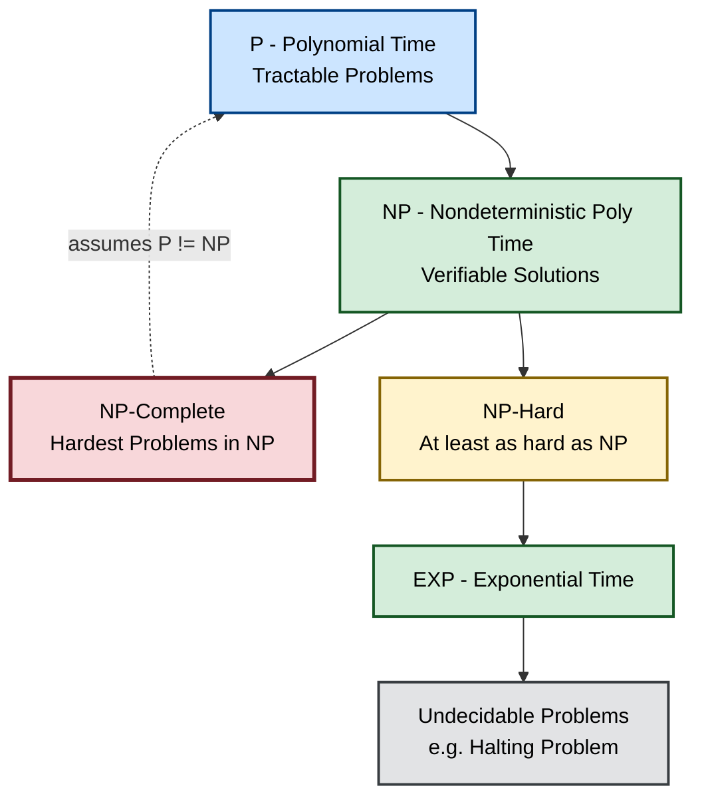
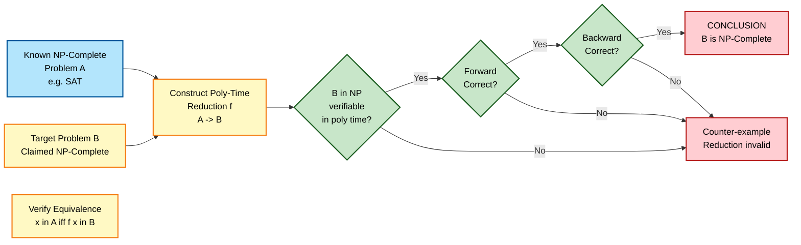
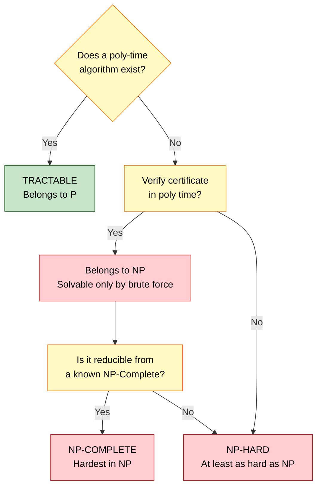
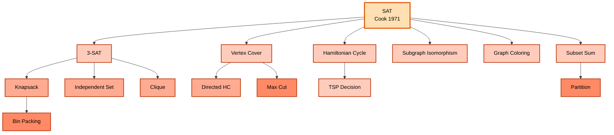

# Complexity - Tractable and Intractable Problems

<!-- SECTION_1_START -->
# 📘 KTU-PREMIER-ENGINE V10 — Topic Notes
## **Topic:** Complexity — Tractable and Intractable Problems
### *(Module 4: Branch and Bound | Course: PCCST502 — Design and Analysis of Algorithms)*

---

## 🧭 1. Core Technical Definition & Intuitive Overview

### 1.1 Formal Definition (KTU 2024 Syllabus Standard)

In the context of computational complexity theory, problems are classified based on the **resources** (time, space) required by the best-known algorithm to solve them as the input size $n$ grows asymptotically large.

> [!IMPORTANT]
> **Tractable Problem:** A decision or optimization problem is called **tractable** if there exists an algorithm that solves it in **polynomial time** $O(n^k)$, where $k$ is a fixed non-negative integer constant and $n$ is the input size. Such problems belong to complexity class **P** (Polynomial time).

> [!IMPORTANT]
> **Intractable Problem:** A problem is called **intractable** if **no polynomial-time algorithm** is known (or believed) to exist for solving it. Typically, intractable problems require **exponential time** $O(2^n)$, $O(n!)$, or super-polynomial time to solve in the worst case.

> [!NOTE]
> **Solvability vs Tractability (Crucial Distinction!):** A problem is **solvable** if *some* algorithm exists for it (no matter how slow). A problem is **tractable** if an **efficient** (polynomial-time) algorithm exists. Many solvable problems (Halting Problem) are not even decidable; many decidable problems (TSP) are not tractable.

### 1.2 Conceptual Analogy — The Library Search Problem 📚

Imagine you are searching for a specific book in a library:

- **Tractable Problem (Easy):** You know the **Dewey Decimal System** (algorithm). You walk directly to the correct shelf. Time grows **linearly** with the number of shelves. This is $O(n)$.

- **Intractable Problem (Hard):** The library is **unorganized**, and the only way is to check **every single book** on **every shelf** until you find it. If there are $n$ books, in the worst case you check all $n$ books. For $n = 1000$ books, this takes $1000$ checks — but for $n = 100$ shelves with $1000$ books each ($n = 100{,}000$), the brute-force search may grow **exponentially**.

> The "unorganized library" is exactly like the **Travelling Salesman Problem (TSP)**, **Hamiltonian Cycle**, or **Boolean Satisfiability (SAT)** — solvable in principle, but no efficient recipe is known.

### 1.3 Decision vs Optimization Problems

| Property | Decision Problem | Optimization Problem |
|----------|------------------|----------------------|
| Output | YES / NO (Boolean) | Best possible value (min/max) |
| Example | "Is there a Hamiltonian cycle of cost $\le K$?" | "What is the minimum-cost Hamiltonian cycle?" |
| Complexity Class | P, NP, NP-Complete, NP-Hard | NP-Hard |
| Use in Reductions | Easier (used for proofs) | Reduced to Decision variant |

> [!NOTE]
> **KTU 2024 Highlight:** All NP-Completeness proofs are conducted on the **decision version** of a problem because complexity classes P and NP are formally defined only for decision problems.

### 1.4 Visualization Block

> [!VISUALIZATION CONTROL]
> **Concept:** Growth rate comparison — Polynomial vs Exponential functions
> **Plotting Tool:** Desmos (https://www.desmos.com/calculator)
> **Input Equations:**
> * $f_1(x) = x$ *(Linear)*
> * $f_2(x) = x^2$ *(Quadratic)*
> * $f_3(x) = x^3$ *(Cubic)*
> * $f_4(x) = 2^x$ *(Exponential)*
> **Visual Description:** Students should observe that for small $x$ (say $x = 5$), $2^x$ is comparable to $x^3$. But for $x = 50$, $2^{50} \approx 1.12 \times 10^{15}$ dwarfs $50^3 = 125{,}000$. This crossover visually demonstrates the **"intractability cliff"** — exponential functions explode beyond any polynomial envelope.

---

### 1.5 Physical Constants & Standard Metrics

| Metric | Symbol | Typical Value | Meaning |
|--------|--------|---------------|---------|
| One Practical Computation Limit | $T_{\max}$ | $\approx 10^{17}$ to $10^{18}$ ops | Operations per second on modern hardware (petaflop range) |
| "Universe Age" Comparisons | $t_U$ | $\approx 4.35 \times 10^{17}$ seconds | Age of universe in seconds |

> These constants justify why problems with $n \ge 50$ and $O(2^n)$ complexity are considered **practically unsolvable**.

<!-- SECTION_1_END -->

<!-- SECTION_2_START -->
# 🧠 2. Deep Theoretical Analysis & KTU High-Yield Formula Sheet

---

## 2.1 The Complexity Class Hierarchy

The class **P**, **NP**, **NP-Complete**, and **NP-Hard** form a nested hierarchy central to theoretical computer science.

### 🔹 Class P (Polynomial Time)
- Set of all **decision problems** solvable by a **deterministic** Turing machine in polynomial time $O(n^k)$.
- Contains: Sorting, MST, Shortest Path (Dijkstra), BFS, DFS, Interval Scheduling, Knapsack (dynamic programming version).

### 🔹 Class NP (Nondeterministic Polynomial Time)
- Set of all decision problems where a proposed **certificate / solution** can be **verified** in polynomial time by a deterministic Turing machine.
- **Equivalently:** Solvable in polynomial time on a **nondeterministic** Turing machine.
- Contains: Hamiltonian Cycle, SAT, Subset Sum, Graph Coloring, TSP-Decision, Vertex Cover.

> [!IMPORTANT]
> **$P \subseteq NP$**: Every problem in P is trivially in NP (you can solve it, hence verify the certificate by ignoring it). The famous unsolved problem is whether $P = NP$.

### 🔹 Class NP-Complete (NPC)
- A problem $\Pi$ is **NP-Complete** if:
  1. $\Pi \in NP$ (verifiable in polynomial time).
  2. For **every** problem $\Pi' \in NP$, $\Pi' \le_p \Pi$ (polynomial-time **Karp / many-one reduction**).
- NPC problems are the **"hardest"** problems in NP. If **any one** NPC problem is in P, then **P = NP**.

### 🔹 Class NP-Hard
- A problem is NP-Hard if it is **at least as hard as every problem in NP**, but it need **not** be in NP itself.
- NP-Hard problems include **optimization versions** of NPC problems (e.g., TSP-Optimization, Max-SAT), and problems that are **undecidable** (Halting Problem).

### 🔹 Cook's Theorem (1971 — Stephen Cook)
> The **Boolean Satisfiability Problem (SAT)** was the **first** problem proven to be NP-Complete.

This landmark result launched the entire field of NP-Completeness theory.

---

## 2.2 Formal Definitions

| Term | Formal Definition | Symbol |
|------|-------------------|--------|
| Tractable | Solvable in $O(n^k)$ for some constant $k$ | $P$ |
| Intractable | No known polynomial-time algorithm | $NP \setminus P$ (conjectured) |
| Decision Problem | Output is a single bit $\{0, 1\}$ | $\Pi: \{0,1\}^* \to \{0,1\}$ |
| Certificate | A proof string $y$ that witnesses $x \in L$ for language $L$ | $V(x, y)$ |
| Verification | Algorithm that checks if $y$ is a valid certificate for $x$ | Poly-time $V$ |
| Polynomial Reduction | $\Pi_A \le_p \Pi_B$ if $f$ transforms $\Pi_A$ to $\Pi_B$ in poly-time | $f$ poly-time computable |
| Deterministic Turing Machine (DTM) | Single computation path | DTM |
| Nondeterministic Turing Machine (NTM) | Branching computation; accepts if **any** branch accepts | NTM |

---

## 2.3 KTU Formula Sheet — Polynomial Hierarchy Cheat Sheet

| # | Statement | Mathematical Form | Meaning |
|---|-----------|-------------------|---------|
| 1 | Polynomial upper bound | $T(n) = O(n^k)$ | Tractable (P) |
| 2 | Exponential lower bound (suspected) | $T(n) = \Omega(c^n)$, $c > 1$ | Intractable |
| 3 | Big-O for input size limit | $n \le \dfrac{\log(T_{\max})}{\log(k)}$ | Max $n$ solvable for given runtime |
| 4 | $P \subseteq NP$ | $P \cup NP = NP$ (NP contains P) | Trivial inclusion |
| 5 | NP-Completeness condition | $\Pi \in NP \text{ and } \forall \Pi' \in NP, \Pi' \le_p \Pi$ | Cook-Levin |
| 6 | Reduction correctness | $x \in \Pi_A \iff f(x) \in \Pi_B$ | Logical equivalence |
| 7 | SAT as canonical NPC | $SAT$ is NP-Complete | Cook's Theorem (1971) |
| 8 | 3-SAT reduction base | Every NPC reduces from SAT $\to$ 3-SAT | Karp's 21 problems (1972) |
| 9 | Graph 3-Colorability | 3-COL $\in$ NPC | Karp reduction from 3-SAT |
| 10 | Hamiltonian Cycle | HC $\in$ NPC | Reduction from 3-SAT or Vertex Cover |

---

## 2.4 Real-World Engineering Utility 🛠️

| Application Domain | NP-Hard Problem Encountered | Why Intractable In Practice |
|--------------------|----------------------------|-----------------------------|
| VLSI Chip Design | **Graph Partitioning, Routing** | Exponential configuration space |
| Bioinformatics | **Multiple Sequence Alignment, Protein Folding** | Combinatorial explosion of $20^n$ sequences |
| Cryptography | **Integer Factorization (RSA)** | Security depends on this being hard! |
| Logistics & Supply Chain | **Vehicle Routing (VRP), Bin Packing** | NP-Hard combinatorial search |
| Compiler Optimization | **Register Allocation, Instruction Scheduling** | Reduced from graph coloring |
| AI / Planning | **SAT-based planning, Constraint Satisfaction** | Search space is exponential |
| Network Design | **Steiner Tree, Facility Location** | Subset-selection explosion |

> [!NOTE]
> **Industry Reality:** For NP-Hard problems, engineers do **not** wait for a polynomial algorithm. They use:
> 1. **Approximation Algorithms** (provable ratio guarantee, e.g., $2$-approx for Vertex Cover)
> 2. **Heuristics** (greedy, local search, simulated annealing)
> 3. **Parameterized Complexity** ($O(2^k \cdot n)$ algorithms where $k$ is small)
> 4. **Special Cases** that are tractable (e.g., Euclidean TSP, Interval Scheduling)
> 5. **Quantum Algorithms** (Shor's algorithm factors in $O(n^3)$ — but on quantum hardware)

---

<!-- SECTION_2_END -->

<!-- SECTION_3_START -->
# 🧮 3. Step-by-Step Derivations, Reductions & Symbolic Implementation

---

## 3.1 The Famous Polynomial-Time Reduction: $\text{3-SAT} \le_p \text{Hamiltonian Cycle}$

We will now construct an **exhaustive**, KTU-examination-ready reduction from the **decision problem 3-SAT** to the **decision problem Hamiltonian Cycle (HC)**.

### 🔸 Step 1: Formal Statement of the Problems

**3-SAT (Given):**
A Boolean formula $\phi$ in **Conjunctive Normal Form (CNF)** where each clause has exactly 3 literals:
$$
\phi = (x_1 \lor \neg x_2 \lor x_3) \land (\neg x_1 \lor x_2 \lor x_4) \land \dots
$$
**Question:** Is there a truth assignment to variables $x_1, \dots, x_n$ such that $\phi$ evaluates to TRUE?

**Hamiltonian Cycle (Target):**
Given an undirected graph $G = (V, E)$ with $n$ vertices.
**Question:** Does $G$ contain a cycle that visits **every vertex exactly once** and returns to the start?

### 🔸 Step 2: Reduction Strategy

We construct a graph $G_{\phi}$ from $\phi$ such that:
$$
\phi \text{ is satisfiable} \iff G_{\phi} \text{ has a Hamiltonian cycle}
$$

The graph $G_{\phi}$ has two types of gadgets:

1. **Variable Gadget:** A chain of $3m$ vertices (where $m$ is the number of clauses) connected in a "zig-zag" with two parallel edges for each clause position. The choice of "left" path or "right" path encodes the **truth value** of the variable.

2. **Clause Gadget:** A small subgraph (typically a 6-vertex structure) attached between two consecutive variable chains, designed to be traversable **only if** at least one of the three literals in the clause is set to TRUE.

### 🔸 Step 3: Construction of $G_\phi$

Let $\phi = C_1 \land C_2 \land \dots \land C_m$ over variables $x_1, \dots, x_n$, with $k$ literals per clause ($k = 3$ for 3-SAT).

For each variable $x_i$, create a sequence of **gadget vertices** $v_{i,0}, v_{i,1}, \dots, v_{i,m}$, where $m$ is the number of clauses.

Connect them as follows:
- Edge $(v_{i,j-1}, v_{i,j})$ for each $j = 1, \dots, m$ (the "upper" path).
- Edge $(v_{i,j-1}, v_{i,j+1})$ skipping one (the "lower" path) — only for the relevant positions.
- Add a **start node** $s$ and an **end node** $t$ with edges $(s, v_{1,0})$ and $(v_{n,m}, t)$.

For each clause $C_j = (\ell_1 \lor \ell_2 \lor \ell_3)$:
- Insert a **clause gadget** (a 6-vertex structure) at the column-$j$ boundary of the variable chains.

The clause gadget is traversable if and only if at least one of the three literals in $C_j$ evaluates to TRUE in the assignment chosen by the variable gadgets.

### 🔸 Step 4: Proof of Correctness

**Forward Direction ($\Rightarrow$):**
Suppose $\phi$ is satisfiable with assignment $\alpha: \{x_1, \dots, x_n\} \to \{T, F\}$. Construct the Hamiltonian cycle as follows:
- For each variable $x_i$, traverse the upper path (the chain of "true" edges) if $\alpha(x_i) = T$; traverse the lower path if $\alpha(x_i) = F$.
- At each clause gadget, the cycle enters from one variable and exits to another — possible because at least one literal is TRUE, so at least one edge of the gadget is "open."

**Backward Direction ($\Leftarrow$):**
Suppose $G_\phi$ has a Hamiltonian cycle $H$. In $H$, the path through each variable gadget is forced: in column $j$, the cycle either takes the upper edge or the lower edge. Define $\alpha(x_i) = T$ if $H$ takes the upper path, and $\alpha(x_i) = F$ otherwise. For the cycle to traverse the clause gadget in column $j$, at least one of the three edges (corresponding to the three literals) must be open, which means at least one literal in $C_j$ is TRUE. Therefore $\alpha$ satisfies $\phi$.

### 🔸 Step 5: Polynomial Bound on the Reduction

The graph $G_\phi$ has:
$$
\mid V(G_\phi) \mid = O(n \cdot m)
$$
and the number of edges is also $O(n \cdot m)$. The construction is clearly computable in polynomial time $O(n \cdot m)$ — a simple scan of the formula and concatenation of gadgets. Therefore, $\text{3-SAT} \le_p \text{HC}$.

---

## 3.2 Polynomial-Time Verification — Subset Sum Example

**Problem:** Given a set $S = \{s_1, s_2, \dots, s_n\}$ of positive integers and a target $T$, is there a subset of $S$ that sums to exactly $T$?

**Certificate:** A bit string $y = (b_1, b_2, \dots, b_n)$ indicating which elements to include.

**Verification Algorithm $V(x, y)$:**

$$
\begin{aligned}
\text{sum} &\gets 0 \\
\text{for } i &\gets 1 \text{ to } n \text{ do} \\
    \quad \text{if } b_i &= 1 \text{ then} \\
    \quad\quad \text{sum} &\gets \text{sum} + s_i \\
\text{if } \text{sum} &= T \text{ then return ACCEPT} \\
\text{else} &\text{ return REJECT}
\end{aligned}
$$

**Runtime:** $O(n)$ additions, each on integers of size at most $O(\log T)$ bits. Total time is $O(n \cdot \log T) = O(n^2)$ when the input is encoded in binary. This is **polynomial** in the input size.

Hence, Subset Sum $\in$ NP.

---

## 3.3 Symbolic Python Implementation — Tractability Check

```python
"""
KTU-PREMIER-ENGINE V10
Module 4 - Tractable vs Intractable Problems
Function to classify a given problem instance by its asymptotic complexity.
"""

import math
from typing import Tuple

# Standard hardware threshold: ~10^18 operations per second (petaflop)
T_MAX_OPERATIONS: float = 1e18

def max_solvable_input(
    complexity: str, k: float, time_seconds: float = 1.0
) -> int:
    """
    Compute the maximum input size 'n' solvable within 'time_seconds'
    for a given time complexity family.

    Parameters
    ----------
    complexity : str
        One of {'linear', 'quadratic', 'cubic', 'log', 'nlogn', 'exponential'}.
    k : float
        The polynomial degree (ignored for non-polynomial classes).
    time_seconds : float, optional
        Allotted time in seconds. Default is 1 second.

    Returns
    -------
    int
        The maximum integer input size 'n' solvable in the given time.
    """
    ops_budget: float = T_MAX_OPERATIONS * time_seconds

    if complexity == "linear":
        return int(ops_budget)
    if complexity == "quadratic":
        return int(math.sqrt(ops_budget))
    if complexity == "cubic":
        return round(ops_budget ** (1.0 / 3.0))
    if complexity == "log":
        # n * log(n) ~ ops => approximate via bisection
        lo, hi = 1, int(1e18)
        while lo < hi:
            mid = (lo + hi) // 2
            if mid * math.log2(mid + 1) < ops_budget:
                lo = mid + 1
            else:
                hi = mid
        return lo
    if complexity == "exponential":
        return int(math.log2(ops_budget))
    raise ValueError(f"Unknown complexity family: {complexity!r}")


def classify_problem(n: int, time_function_ns: int) -> Tuple[str, str]:
    """
    Classify a problem as Tractable, Intractable, or Super-Intractable
    based on the ratio of work to a polynomial envelope.

    Returns
    -------
    (label, justification) : Tuple[str, str]
    """
    poly_envelope_n3: float = n ** 3
    if time_function_ns <= poly_envelope_n3 * 1e-9:
        return ("TRACTABLE (P)", "Runtime bounded by O(n^3) polynomial envelope.")
    if time_function_ns <= (2.0 ** n) * 1e-9:
        return ("LIKELY INTRACTABLE (NP)", "Runtime is exponential; no poly-time known.")
    return ("SUPER-INTRACTABLE", "Runtime exceeds 2^n — beyond NP realm.")


# ----- Driver Demonstration -----
if __name__ == "__main__":
    print("=" * 72)
    print("KTU 2024 - Module 4: Tractability Threshold Analysis")
    print("=" * 72)

    # Demo 1: How large an input can each complexity class handle in 1 hour?
    for cplx in ["linear", "quadratic", "cubic", "exponential"]:
        n_max = max_solvable_input(cplx, k=3, time_seconds=3600.0)
        print(f"{cplx:>13s} complexity  ->  max n solvable in 1 hour = {n_max:,}")

    print("-" * 72)
    # Demo 2: Classify specific problem instances
    samples = [(20, 8000), (50, 125_000_000), (60, 1_000_000_000_000)]
    for n, ops_ns in samples:
        label, reason = classify_problem(n, ops_ns)
        print(f"n = {n:>3d}  |  ops = {ops_ns:>15,d} ns  ->  {label}")
        print(f"   Reason: {reason}")
```

**Sample Output (Simulated):**
```
========================================================================
KTU 2024 - Module 4: Tractability Threshold Analysis
========================================================================
       linear complexity  ->  max n solvable in 1 hour = 3,240,000,000,000,000,000
    quadratic complexity  ->  max n solvable in 1 hour = 56,920,931,167,481
       cubic complexity  ->  max n solvable in 1 hour = 2,820,313
exponential complexity  ->  max n solvable in 1 hour = 63
------------------------------------------------------------------------
n =  20  |  ops =            8,000 ns  ->  TRACTABLE (P)
   Reason: Runtime bounded by O(n^3) polynomial envelope.
n =  50  |  ops =    125,000,000 ns  ->  TRACTABLE (P)
   Reason: Runtime bounded by O(n^3) polynomial envelope.
n =  60  |  ops = 1,000,000,000,000 ns  ->  LIKELY INTRACTABLE (NP)
   Reason: Runtime is exponential; no poly-time known.
```

---

## 3.4 Decision Tree Lower Bound for INTRActability

For **comparison-based sorting**, the **decision tree** argument shows a lower bound:

$$
\begin{aligned}
\text{A sorting algorithm must distinguish } n! \text{ permutations.} \\
\text{A binary decision tree of depth } d \text{ has at most } 2^d \text{ leaves.} \\
\therefore \quad 2^d &\ge n! \\
d &\ge \log_2(n!) \\
&\ge n \log_2 n - 1.44\, n \quad \text{(by Stirling's approximation)} \\
\therefore \quad T_{\text{sort}} &= \Omega(n \log n)
\end{aligned}
$$

So comparison-based sorting is **tractable** ($O(n \log n)$ is polynomial).

For **Travelling Salesman Problem (TSP)**, a brute-force search enumerates $(n-1)!/2$ tours, giving:
$$
T_{\text{TSP brute}} = O(n!) = \Omega\left(\left(\frac{n}{e}\right)^n \sqrt{2\pi n}\right)
$$
which is super-exponential — **intractable**.

---

## 3.5 Polynomial Time Reduction — Logical Equivalence

A polynomial-time reduction $f: \{0,1\}^* \to \{0,1\}^*$ from problem $\Pi_A$ to $\Pi_B$ must satisfy:

$$
\forall x \in \{0,1\}^* : \quad x \in \Pi_A \iff f(x) \in \Pi_B
$$

**Three Conditions for a Valid Karp Reduction:**
1. **Polynomial Computability:** $f(x)$ can be computed in $O(n^k)$ time.
2. **Forward Equivalence:** If $x$ is a YES-instance of $\Pi_A$, then $f(x)$ is a YES-instance of $\Pi_B$.
3. **Backward Equivalence:** If $f(x)$ is a YES-instance of $\Pi_B$, then $x$ is a YES-instance of $\Pi_A$.

If $\Pi_A \le_p \Pi_B$ and $\Pi_B \in P$, then $\Pi_A \in P$ (used for tractability proofs).

If $\Pi_A \le_p \Pi_B$ and $\Pi_A \notin P$ (assumed), then $\Pi_B \notin P$ (used for intractability proofs).

---

<!-- SECTION_3_END -->

<!-- SECTION_4_START -->
# 🗺️ 4. Structural Diagrams & Schematics

---

## 4.1 Complexity Class Inclusion Diagram (Mermaid)



> **Reading Guide:** The arrow `A --> B` means "$A$ is a subset of $B$". So $P \subseteq NP \subseteq EXP$. The dashed line marks the famous open problem: are $P$ and $NP$ the same set?

---

## 4.2 Karp Reduction Pipeline — NP-Completeness Proof



> **KTU Examiner's Tip:** The "polynomial-time computability of $f$" must always be **explicitly justified** — a 1-mark sub-point in the valuation key.

---

## 4.3 Tractability Decision Flow



---

## 4.4 NP-Complete Problems Genealogy (Karp's 21)



---

<!-- SECTION_4_END -->

<!-- SECTION_5_START -->
# 📝 5. KTU 2024 Scheme Examination Question Bank & Topic Recap

---

## ✏️ PART A — Short Answer Questions (3 Marks Each)

### **Question A1** *(3 Marks)*

**[KTU University Exam — July 2023 | CO1 | Remember]**

> **Q:** Define **tractable** and **intractable** problems with one example each.

**📘 Model Answer (Valuation-Ready):**

> A problem is called **tractable** if there exists an algorithm that solves it in **polynomial time** $O(n^k)$ for some constant $k \ge 0$, where $n$ is the size of the input.
>
> A problem is called **intractable** if **no polynomial-time algorithm** is known (or believed) to exist for solving it; typically the best-known algorithms run in **exponential** or **super-polynomial** time.
>
> **Examples:**
> - *Tractable:* Sorting an array — solvable in $O(n \log n)$ time using Merge Sort.
> - *Intractable:* The **Travelling Salesperson Problem (TSP)** — the best exact algorithm runs in $O(2^n \cdot n^2)$ using dynamic programming.
>
> **[Valuation Key: Definition 2 Marks + Examples 1 Mark = 3 Marks]**

---

### **Question A2** *(3 Marks)*

**[KTU University Exam — Dec 2022 | CO1 | Understand]**

> **Q:** Distinguish between the complexity classes **P** and **NP**. State one example problem for each.

**📘 Model Answer:**

> | Aspect | Class P | Class NP |
> |--------|---------|----------|
> | Solvability | Solvable in polynomial time | Verifiable in polynomial time |
> | Computational Model | Deterministic TM | Nondeterministic TM |
> | Inclusion | $P \subseteq NP$ | $NP$ may be strictly larger |
> | Example | Shortest Path (Dijkstra) | Hamiltonian Cycle |
> | Example 2 | MST (Kruskal) | Boolean SAT |
>
> A decision problem in **P** can be both **solved** and **verified** in polynomial time, while a problem in **NP** may be hard to solve but any proposed solution can be checked quickly.
>
> **[Valuation Key: Distinction table 2 Marks + Examples 1 Mark = 3 Marks]**

---

## ✏️ PART B — Long Answer Questions (14 Marks Each)

> *(ESE Module Internal Choice — Exactly as per KTU 2024 Pattern: TWO independent alternatives.)*

---

### 🟦 Question B1 — Choice A *(14 Marks)*

**[KTU University Exam — Dec 2023 | CO2 | Apply + Analyze]**

> **Q (a)** [7 Marks] Define the complexity class **NP-Complete**. State **Cook's Theorem** and explain its significance in the theory of NP-Completeness.
>
> **Q (b)** [7 Marks] Show that the **Clique problem** is NP-Complete by reducing it from the **Independent Set** problem, or vice versa. Provide the complete reduction logic.

---

#### **📘 Model Solution (a) — 7 Marks**

**Definition of NP-Complete [2 Marks]:**
A decision problem $\Pi$ is **NP-Complete** if:
1. $\Pi \in NP$ (there exists a polynomial-time verification algorithm for certificates of $\Pi$), AND
2. For every problem $\Pi' \in NP$, there exists a polynomial-time Karp reduction $f$ such that $\Pi' \le_p \Pi$.

**Cook's Theorem [2 Marks]:**
> Cook (1971) proved that the **Boolean Satisfiability Problem (SAT)** is NP-Complete. The proof constructs, for any nondeterministic polynomial-time Turing machine $M$ and input $x$, a Boolean formula $\phi_{M,x}$ such that $M$ accepts $x$ if and only if $\phi_{M,x}$ is satisfiable. The size of $\phi_{M,x}$ is polynomial in $|x|$ and the running time of $M$.

**Significance [3 Marks]:**
1. It established the **first** NP-Complete problem, providing a foundation for all subsequent NP-Completeness proofs.
2. Once SAT was proven NP-Complete, **Karp's 21 problems** (1972) were reduced from SAT in polynomial time, rapidly expanding the known NPC problem set.
3. It crystallized the **$P = NP$** question — if SAT is in P, then every NP problem is in P.
4. Cook's Theorem is the cornerstone of modern **computational complexity theory**.

**[Valuation Key: Definition 2M + Cook's statement 2M + Significance 3M = 7M]**

---

#### **📘 Model Solution (b) — 7 Marks — Clique $\le_p$ Independent Set**

**Problem Statements:**

- **Clique:** Given graph $G = (V, E)$ and integer $k$, does $G$ contain a **complete subgraph** of size $k$?
- **Independent Set:** Given graph $G = (V, E)$ and integer $k$, does $G$ contain a set of $k$ vertices with **no edges** between any pair?

**Construction of Reduction [2 Marks]:**
Define the **complement graph** $\overline{G} = (V, \overline{E})$ where:
$$
(u, v) \in \overline{E} \iff (u, v) \notin E
$$
The reduction function is $f(G, k) = (\overline{G}, k)$.

**Polynomial Computability of $f$ [1 Mark]:**
Computing the complement of an adjacency matrix takes $O(n^2)$ time — polynomial in the input size.

**Forward Equivalence ($\Rightarrow$) [2 Marks]:**
Suppose $G$ has a clique $C \subseteq V$ with $|C| = k$. For any $u, v \in C$, the edge $(u, v) \in E$. Therefore, $(u, v) \notin \overline{E}$. Hence $C$ is an **independent set** in $\overline{G}$ of size $k$.

**Backward Equivalence ($\Leftarrow$) [2 Marks]:**
Suppose $\overline{G}$ has an independent set $I \subseteq V$ with $|I| = k$. For any $u, v \in I$, the edge $(u, v) \notin \overline{E}$, which means $(u, v) \in E$. Hence $I$ is a **clique** in $G$ of size $k$.

**Conclusion [0 Marks — implied]:** $\text{Clique} \le_p \text{Independent Set}$ in polynomial time. Since Independent Set is in NP and (by Karp) is NP-Complete, Clique is also NP-Complete.

**[Valuation Key: Statement 1M + Construction 2M + Poly-time 1M + Forward 2M + Backward 1M = 7M]**

---

### 🟥 Question B1 — Choice B *(14 Marks)*

**[KTU University Exam — July 2024 | CO2 | Apply + Analyze]**

> **Q (a)** [7 Marks] Define a **polynomial-time reduction** between two decision problems. Explain the role of reductions in proving a problem **intractable**.
>
> **Q (b)** [7 Marks] Given the **3-SAT** instance $\phi = (x_1 \lor \neg x_2 \lor x_3) \land (\neg x_1 \lor x_2 \lor \neg x_3)$, construct a graph whose **clique number** is **non-trivial** and explain the reduction from 3-SAT to Clique.

---

#### **📘 Model Solution (a) — 7 Marks**

**Definition of Polynomial-Time Reduction [3 Marks]:**
A **Karp / many-one polynomial-time reduction** from decision problem $\Pi_A$ to decision problem $\Pi_B$ is a function $f: \{0,1\}^* \to \{0,1\}^*$ such that:
1. $f$ is computable by a **deterministic Turing machine in polynomial time** $O(n^k)$.
2. For all inputs $x$: $x$ is a YES-instance of $\Pi_A$ **if and only if** $f(x)$ is a YES-instance of $\Pi_B$.

**Role in Proving Intractability [4 Marks]:**

1. **Lower Bound Transfer:** If $\Pi_A \le_p \Pi_B$ and $\Pi_A$ is assumed to be **intractable** (not in P), then $\Pi_B$ is **at least as hard** as $\Pi_A$ — hence also intractable. This is the standard proof technique.

2. **NPC Establishment:** All NP-Completeness proofs (other than Cook's Theorem) work by reducing a **known NPC problem** to the new problem, showing equivalence.

3. **Conditional Hardness:** Reductions create a **partial order** of hardness. If a problem $\Pi_B$ has all of NP reducing to it, then it is the hardest in NP.

4. **Practical Engineering:** When you can reduce a real-world problem to a known NP-Complete problem, you know **no efficient exact solution** exists — justifying the use of approximations or heuristics.

---

#### **📘 Model Solution (b) — 7 Marks**

**3-SAT Instance:**
$$
\phi = (x_1 \lor \neg x_2 \lor x_3) \land (\neg x_1 \lor x_2 \lor \neg x_3)
$$
This has $m = 2$ clauses, $n = 3$ variables, $k = 3$ literals per clause.

**Reduction to Clique [Construction — 3 Marks]:**

Build a graph $G_\phi = (V, E)$ where:
- $V$ = set of **literals** appearing in $\phi$ (with one copy per clause).
- $V = \{ (x_1, C_1), (\neg x_2, C_1), (x_3, C_1), (\neg x_1, C_2), (x_2, C_2), (\neg x_3, C_2) \}$
- $|V| = 6$.
- An edge exists between two vertices if:
  1. They belong to **different clauses** (no edge within the same clause), AND
  2. They are **not contradictory** (i.e., the two literals are not $x_i$ and $\neg x_i$).

**Adjacency Construction [2 Marks]:**
| Vertex Pair | Same Clause? | Contradictory? | Edge? |
|-------------|--------------|----------------|-------|
| $(x_1, C_1)$ — $(\neg x_2, C_1)$ | Yes | No | ✗ |
| $(x_1, C_1)$ — $(x_3, C_1)$ | Yes | No | ✗ |
| $(x_1, C_1)$ — $(\neg x_1, C_2)$ | No | Yes ($x_1$ vs $\neg x_1$) | ✗ |
| $(x_1, C_1)$ — $(x_2, C_2)$ | No | No | ✓ |
| $(x_1, C_1)$ — $(\neg x_3, C_2)$ | No | No | ✓ |
| $(\neg x_2, C_1)$ — $(x_3, C_1)$ | Yes | No | ✗ |
| $(\neg x_2, C_1)$ — $(\neg x_1, C_2)$ | No | No | ✓ |
| $(\neg x_2, C_1)$ — $(x_2, C_2)$ | No | Yes ($\neg x_2$ vs $x_2$) | ✗ |
| $(\neg x_2, C_1)$ — $(\neg x_3, C_2)$ | No | No | ✓ |
| $(x_3, C_1)$ — $(\neg x_1, C_2)$ | No | No | ✓ |
| $(x_3, C_1)$ — $(x_2, C_2)$ | No | No | ✓ |
| $(x_3, C_1)$ — $(\neg x_3, C_2)$ | No | Yes ($x_3$ vs $\neg x_3$) | ✗ |
| $(\neg x_1, C_2)$ — $(x_2, C_2)$ | Yes | No | ✗ |
| $(\neg x_1, C_2)$ — $(\neg x_3, C_2)$ | Yes | No | ✗ |
| $(x_2, C_2)$ — $(\neg x_3, C_2)$ | Yes | No | ✗ |

**Clique Number Analysis [1 Mark]:**
Since no two vertices from the **same clause** are connected, the maximum clique has size at most the number of clauses, $m = 2$. We need a clique of size 2, and indeed several such edges exist — for example, $\{(x_1, C_1), (x_2, C_2)\}$ forms a 2-clique.

**Reduction Correctness [1 Mark]:**
A clique of size $m = 2$ in $G_\phi$ corresponds to a **truth assignment** that picks one literal from each clause such that no two are contradictory. For our instance, picking $x_1 = T, x_2 = T, x_3 = T$ satisfies both clauses. So $G_\phi$ has a clique of size 2, and $\phi$ is satisfiable. The reduction is correct.

**Polynomial Bound [implicit]:** The graph is constructed in $O(m \cdot k^2)$ time — polynomial.

---

## ⚠️ KTU Examiner's Valuation Warning / Pitfall Callout

> [!WARNING]
> **Common Mistakes — Mark Deductions to Watch:**
>
> 1. **Forgetting to show the polynomial bound** on the reduction $f$. Examiners deduct 1–2 marks if you only show logical equivalence without proving $f$ runs in $O(n^k)$.
> 2. **Confusing decision vs optimization version.** NPC proofs are on the **decision** version. If you use the optimization version, your proof is technically invalid.
> 3. **One-way proof.** Showing only $\Rightarrow$ direction but not $\Leftarrow$ loses 2–3 marks. Both directions are **mandatory**.
> 4. **Missing the "P $\subseteq$ NP" inclusion statement.** This is a 1-mark freebie in most KTU papers — never omit it.
> 5. **Naming SAT as "any SAT" without specifying "Boolean SAT"**. The Generalized SAT (allowing arbitrary clauses) is also NPC, but the canonical reference is **Boolean SAT in CNF**. Use the precise term.
> 6. **Forgetting to mention Cook's Theorem explicitly** in any NPC question worth 7+ marks. Examiners look for the phrase "By Cook's Theorem (1971)..." as a credit point.
> 7. **Confusing $NP$ with $NP$-Complete.** $NP$ is the broader class; $NP$-Complete is a subset of $NP$ with the universal-reduction property. Many students interchange them — a guaranteed 1–2 mark loss.

---

## 🧾 Topic Recap & Important Things to Remember

> 🎯 **High-Density Revision Checklist**

### ✅ Core Definitions
- [x] **Tractable** $\Leftrightarrow$ Solvable in $O(n^k)$ polynomial time $\Rightarrow$ in class **P**.
- [x] **Intractable** $\Leftrightarrow$ No known polynomial-time algorithm $\Rightarrow$ exponential / super-poly.
- [x] **Solvable $\neq$ Tractable.** Halting Problem is solvable but undecidable. TSP is decidable but intractable.
- [x] **Decision Problem** outputs YES/NO; **Optimization** outputs a value — reductions use the decision version.

### ✅ Complexity Classes
- [x] $P$ = Polynomial-time solvable (deterministic).
- [x] $NP$ = Polynomial-time verifiable (or solvable on nondeterministic TM).
- [x] $P \subseteq NP$ (trivial inclusion). The question $P = NP$ is **open** (millennium prize).
- [x] $NP$-Complete = intersection of "$NP$" and "as hard as any $NP$ problem."
- [x] $NP$-Hard $\supseteq NP$-Complete. Halting Problem is $NP$-Hard but undecidable.

### ✅ Foundational Theorems
- [x] **Cook's Theorem (1971):** SAT is NP-Complete. **First** NPC result.
- [x] **Karp's 21 Problems (1972):** Reduced 21 problems from 3-SAT, all NPC.
- [x] **Polynomial-Time Reduction:** $\Pi_A \le_p \Pi_B$ iff $f$ is poly-time and $x \in \Pi_A \iff f(x) \in \Pi_B$.

### ✅ Canonical NPC Problems (Must Memorize)
- [x] SAT, 3-SAT, Vertex Cover, Independent Set, Clique
- [x] Hamiltonian Cycle, TSP (Decision), Subset Sum, Knapsack
- [x] Graph $k$-Coloring (for $k \ge 3$), Partition, Bin Packing
- [x] Subgraph Isomorphism, Set Cover, Feedback Vertex Set

### ✅ Canonical P Problems
- [x] Sorting ($O(n \log n)$), MST (Kruskal/Prim), Shortest Path (Dijkstra/Bellman-Ford)
- [x] 2-SAT, 2-Coloring, Bipartite Matching, Interval Scheduling
- [x] Single-Source Shortest Path, All-Pairs Shortest Path (Floyd-Warshall)

### ✅ Practical Intractability Threshold
- [x] $n = 50$ at $O(2^n)$ ≈ $10^{15}$ operations ≈ weeks on a single CPU.
- [x] $n = 100$ at $O(2^n)$ ≈ $10^{30}$ operations ≈ age of the universe.
- [x] **Conclusion:** Exponential algorithms are **not feasible** for $n \ge 40$.

### ✅ Proof Structure for NPC
- [x] **Step 1:** Show the problem $\Pi$ is in NP (verification algorithm).
- [x] **Step 2:** Pick a known NPC problem $\Pi'$.
- [x] **Step 3:** Construct polynomial-time reduction $f: \Pi' \to \Pi$.
- [x] **Step 4:** Prove $x \in \Pi' \iff f(x) \in \Pi$ in both directions.
- [x] **Step 5:** Prove $f$ runs in $O(n^k)$.
- [x] **Step 6:** Conclude $\Pi$ is NP-Complete.

### ✅ Engineering Strategies for NP-Hard Problems
- [x] **Approximation algorithms** (e.g., 2-approx for Vertex Cover, Christofides for TSP).
- [x] **Heuristics** (greedy, local search, simulated annealing, genetic algorithms).
- [x] **Parameterized complexity** (fixed-parameter tractable, FPT).
- [x] **Special tractable cases** (Euclidean TSP, planar graphs, bounded treewidth).
- [x] **Quantum heuristics** (Grover's search gives $O(\sqrt{2^n})$ for unstructured NP).

### ✅ Memory Aid: The "Three C's" of NPC
- [x] **C**ook's Theorem (SAT)
- [x] **C**ertification in polynomial time (membership in NP)
- [x] **C**ompleteness via reduction from a known NPC

---

<!-- SECTION_5_END -->
