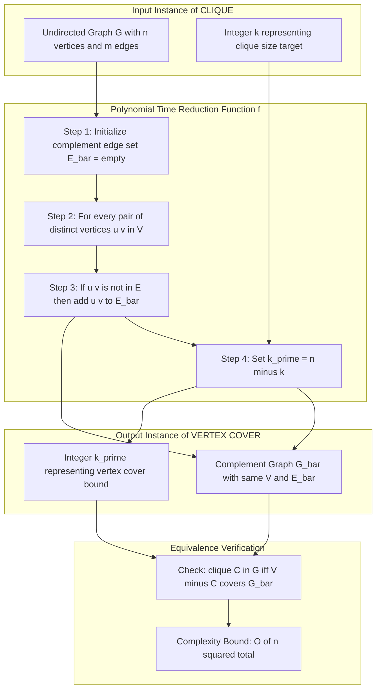
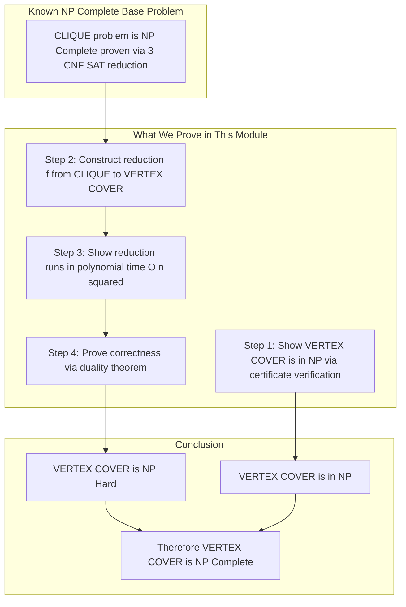

# NP Completeness proof - Clique Problem and Vertex Cover Problem

<!-- SECTION_1_START -->

# NP-Completeness Proof: Clique Problem & Vertex Cover Problem

## 1. Core Definitions (KTU 2024 Syllabus Terminology)

> [!IMPORTANT]
> **NP-Completeness** is a class of decision problems that are (i) verifiable in polynomial time and (ii) at least as hard as **any** problem in NP. A problem $\Pi$ is **NP-Complete** if and only if:
> 1. $\Pi \in \mathbf{NP}$ (verifiable in polynomial time using a certificate), AND
> 2. $\forall L \in \mathbf{NP},\ L \le_p \Pi$ (every NP problem polynomial-time reduces to $\Pi$).

### The CLIQUE Problem (Decision Version)

> [!NOTE]
> **CLIQUE:** Given an undirected graph $G = (V, E)$ and a positive integer $k$, does $G$ contain a **clique** of size **at least $k$**?
> Formally: $\text{CLIQUE} = \{\ \langle G, k \rangle : G \text{ is a graph containing a clique of size} \ge k\ \}$

A **clique** $C \subseteq V$ is a subset of vertices where every pair of distinct vertices is joined by an edge in $E$. That is, the induced subgraph $G[C]$ is a complete graph $K_{\vert C \vert}$.

### The VERTEX-COVER Problem (Decision Version)

> [!NOTE]
> **VERTEX-COVER:** Given an undirected graph $G = (V, E)$ and a positive integer $k$, does $G$ contain a **vertex cover** of size **at most $k$**?
> Formally: $\text{VERTEX-COVER} = \{\ \langle G, k \rangle : G \text{ has a vertex cover of size} \le k\ \}$

A **vertex cover** $S \subseteq V$ is a subset of vertices such that every edge $e = (u, v) \in E$ has **at least one endpoint in $S$** (i.e., $u \in S \lor v \in S$).

---

## 2. Intuitive Analogies

> [!TIP]
> **CLIQUE — The "Friend Group" Analogy:** Imagine a college WhatsApp group $G$ where vertices are students and an edge exists between two students if they are mutual friends. A **clique of size $k$** is a group of $k$ students who are **all friends with each other** — a perfect $k$-sized friend circle (a $K_k$).
>
> **VERTEX-COVER — The "Watchman" Analogy:** Imagine the same friendship graph, but now each edge is a corridor that must be monitored. A **vertex cover of size $k$** is a set of $k$ watchmen placed at vertices such that **every corridor (edge) is visible** by at least one watchman.

> [!IMPORTANT]
> **The Deep Connection:** These two problems are **complementary**! A set $C$ forms a clique in $G$ if and only if its complement $V \setminus C$ forms a vertex cover in the **complement graph** $\overline{G}$. This duality is the foundation of the polynomial-time reduction between them.

---

## 3. Geometric / Graph-Theoretic Visualization

> [!VISUALIZATION CONTROL]
> **Concept:** Clique–Vertex-Cover Duality via Complement Graph (small 4-vertex example)
> **GeoGebra / Desmos Input Points & Lines:**
>
> * Vertices: $v_1 = (0, 1),\ v_2 = (1.5, 0),\ v_3 = (0, -1),\ v_4 = (-1.5, 0)$
> * Solid edges of $G$: $(v_1, v_2),\ (v_2, v_3),\ (v_3, v_4),\ (v_1, v_4)$  (forms $C_4$)
> * Dashed edges of $\overline{G}$: $(v_1, v_3),\ (v_2, v_4)$  (the two diagonals)
>
> **Visual Description:** The student should see two disjoint edges in $\overline{G}$ (the dashed diagonals) — covering them needs $k' = 2$ vertices. In $G$, the cycle of length 4 has **no triangle** ($k = 3$ is infeasible), but it has a clique of size $k = 2$ (any edge). Here $n = 4$, so $k + k' = n$ holds for the duality equation.

<!-- SECTION_1_END -->

<!-- SECTION_2_START -->

# Deep Theoretical Analysis & KTU Formula Sheet

## 1. Membership in NP (Verifier Certificates)

### CLIQUE $\in$ NP
A **certificate** is a set of vertices $C \subseteq V$ with $\vert C \vert = k$. The polynomial-time verifier checks every pair $(u, v) \in C \times C,\ u \neq v$ for the edge $(u, v) \in E$.

### VERTEX-COVER $\in$ NP
A **certificate** is a set of vertices $S \subseteq V$ with $\vert S \vert \le k$. The polynomial-time verifier checks every edge $(u, v) \in E$ to confirm $u \in S$ or $v \in S$.

---

## 2. The Complement Graph — Central Tool

> [!IMPORTANT]
> **Definition (Complement Graph):** For an undirected graph $G = (V, E)$ on $n$ vertices, the **complement** $\overline{G} = (V, \overline{E})$ is defined as:
> $$\overline{E} = \{\ (u, v) : u, v \in V,\ u \neq v,\ (u, v) \notin E\ \}$$

The complement $\overline{G}$ has the **same vertex set** as $G$ but the **complementary edge set**. Self-loops are excluded, and each pair of distinct vertices is either an edge of $G$ or an edge of $\overline{G}$ (exclusive-or).

**Computation time:** $\overline{G}$ can be constructed in $O(n^2)$ time, since we examine all $\binom{n}{2}$ vertex pairs.

---

## 3. The Reduction Theorem (CLIQUE $\le_p$ VERTEX-COVER)

> [!IMPORTANT]
> **Theorem (Duality Lemma):** Let $G = (V, E)$ be an undirected graph with $n = \vert V \vert$ vertices. Let $\overline{G} = (V, \overline{E})$ be its complement. Then:
> $$G \text{ has a clique of size } k \iff \overline{G} \text{ has a vertex cover of size } (n - k)$$
> Equivalently: $\langle G, k \rangle \in \text{CLIQUE} \iff \langle \overline{G}, n - k \rangle \in \text{VERTEX-COVER}$

**Polynomial-Time Reduction Function $f$:**
$$f(\langle G, k \rangle) = \langle \overline{G}, n - k \rangle$$
where $n = \vert V \vert$ and the time complexity is $T(n) = O(n^2)$.

---

## 4. KTU High-Yield Formula Sheet

| **Symbol / Expression** | **Meaning** | **Use in KTU Problems** |
|-------------------------|-------------|--------------------------|
| $G = (V, E)$ | Undirected graph with $\vert V \vert = n$ vertices | Standard input form |
| $\overline{G} = (V, \overline{E})$ | Complement graph (same vertices, swapped edges) | Central to the reduction |
| $C \subseteq V,\ \vert C \vert = k$ | A clique of size $k$ in $G$ | Used in forward direction ($\Rightarrow$) |
| $S = V \setminus C$ | Complement of the clique; becomes vertex cover in $\overline{G}$ | Key duality mapping |
| $k' = n - k$ | New parameter for VERTEX-COVER | Sums to $n$ with the original $k$ |
| $\le_p$ | Polynomial-time Karp reduction | Establishes NP-Hardness |
| $\le_p$ complexity $= O(n^2)$ | Time to compute $\overline{G}$ | Required for polynomial-time guarantee |
| $\binom{n}{2}$ | Total possible edges in simple graph | Bound for verifier work |
| $K_k$ | Complete graph on $k$ vertices | Target structure for CLIQUE search |
| **NPC conditions** | $\Pi \in$ NP $\land\ \forall L \in$ NP, $L \le_p \Pi$ | Two-part proof structure |

> [!WARNING]
> **Critical Notation Point:** The reduction maps $k \mapsto n - k$, **not** $k \mapsto n + k$ or $k \mapsto k - 1$. A frequent error in KTU answer scripts is the wrong sign on the parameter transformation.

---

## 5. Why This Reduction Matters in Engineering & CS

The clique–vertex-cover duality is used in:

* **Social Network Analysis:** Detecting tightly-knit friend groups (cliques) and identifying minimum influencer sets (vertex covers).
* **Bioinformatics:** Finding protein interaction complexes (cliques) and minimal gene-knockout sets that disrupt all interactions (vertex covers).
* **Cybersecurity:** Identifying maximum vulnerability clusters (cliques) and minimum sensor-placement sets (vertex covers).
* **VLSI Design:** Optimizing circuit testing and fault coverage in chip layout graphs.
* **Approximation Algorithms:** Since both problems are NP-Hard, this reduction enables transfer of approximation techniques between them.

<!-- SECTION_2_END -->

<!-- SECTION_3_START -->

# Step-by-Step Proof & Symbolic Implementation

## 1. The Polynomial-Time Reduction Function

**Input:** $\langle G, k \rangle$ where $G = (V, E)$ and $k$ is a positive integer.
**Output:** $\langle \overline{G}, k' \rangle$ where $\overline{G} = (V, \overline{E})$ and $k' = n - k$.

### Step 1 — Receive Input

Accept the graph $G = (V, E)$ and the integer $k$. Compute $n = \vert V \vert$.

### Step 2 — Initialize the Complement Edge Set

Create an empty set $\overline{E} \leftarrow \emptyset$.

### Step 3 — Examine All Vertex Pairs

For every unordered pair of distinct vertices $(u, v) \in V \times V$ with $u < v$:
   * If $(u, v) \notin E$, add $(u, v)$ to $\overline{E}$.

### Step 4 — Compute the New Parameter

Set $k' = n - k$.

### Step 5 — Return the Reduced Instance

Return $\langle \overline{G}, k' \rangle$ where $\overline{G} = (V, \overline{E})$.

---

## 2. Detailed Proof of the Duality Theorem

> [!IMPORTANT]
> **Claim:** $G$ contains a clique of size $k$ $\iff$ $\overline{G}$ contains a vertex cover of size $n - k$.

### Direction 1 — ($\Rightarrow$) Forward Direction: Clique $\Rightarrow$ Vertex Cover in Complement

**Assumption:** Let $C \subseteq V$ with $\vert C \vert = k$ be a clique in $G$.

**Construction:** Define $S = V \setminus C$. Then $\vert S \vert = n - k$.

**Goal:** Show $S$ is a vertex cover of $\overline{G}$.

**Proof:**

Let $(u, v) \in \overline{E}$ be an arbitrary edge of $\overline{G}$. By the definition of $\overline{G}$, we have $(u, v) \notin E$ and $u \neq v$.

We must show that $u \in S$ or $v \in S$, i.e., $u \notin C$ or $v \notin C$.

We proceed by **contrapositive on the clique property**: Suppose for contradiction that $u \in C$ and $v \in C$. Since $C$ is a clique in $G$, every pair of distinct vertices in $C$ must be joined by an edge in $E$. Thus $(u, v) \in E$.

But this contradicts the fact that $(u, v) \notin E$ (derived from $(u, v) \in \overline{E}$). Therefore, our assumption is false, and at least one of $u, v$ lies in $V \setminus C = S$.

Since this argument applies to **every** edge of $\overline{G}$, the set $S$ is a vertex cover of $\overline{G}$ with $\vert S \vert = n - k$. $\blacksquare$

### Direction 2 — ($\Leftarrow$) Reverse Direction: Vertex Cover in Complement $\Rightarrow$ Clique

**Assumption:** Let $S \subseteq V$ with $\vert S \vert = n - k$ be a vertex cover of $\overline{G}$.

**Construction:** Define $C = V \setminus S$. Then $\vert C \vert = k$.

**Goal:** Show $C$ is a clique in $G$.

**Proof:**

Let $u, v \in C$ be two arbitrary distinct vertices in $C$. We must show $(u, v) \in E$.

We proceed by **contradiction**: Suppose $(u, v) \notin E$. Then, since $u \neq v$, the edge $(u, v) \in \overline{E}$.

Because $S$ is a vertex cover of $\overline{G}$, we must have $u \in S$ or $v \in S$.

However, $u, v \in C = V \setminus S$, which means $u \notin S$ and $v \notin S$. This contradicts the vertex cover property.

Therefore, our supposition is false, and $(u, v) \in E$.

Since this holds for every pair of distinct vertices in $C$, the set $C$ is a clique in $G$ with $\vert C \vert = k$. $\blacksquare$

---

## 3. Verification of Polynomial-Time Bound

The reduction function $f$ involves the following computational steps:

$$
T(n) = \underbrace{O(n^2)}_{\text{examine all pairs}} + \underbrace{O(1)}_{\text{compute } k' = n - k}
$$

$$
T(n) = O(n^2)
$$

Since $O(n^2)$ is polynomial in the input size (which is $O(n^2)$ for an adjacency-matrix representation of $G$), the reduction is a **valid polynomial-time Karp reduction**.

> [!NOTE]
> **Mark Allocation Tip for KTU:** When asked to "show polynomial-time reduction", explicitly state the time complexity $O(n^2)$ and argue that this is polynomial. Examiners allocate 1–2 marks specifically for this step.

---

## 4. Python Implementation (Fully Operational)

```python
"""
NP-Completeness: CLIQUE <=_p VERTEX-COVER via Complement Graph
Author: KTU-PREMIER-ENGINE V10 Reference Implementation
"""

from __future__ import annotations
from typing import Dict, FrozenSet, List, Set, Tuple
import itertools

Graph = Dict[int, Set[int]]


# ---------- 1. GRAPH I/O HELPERS ----------

def edges_to_adj(edges: Set[Tuple[int, int]]) -> Graph:
    """Convert an edge list to an adjacency-list representation."""
    adj: Graph = {}
    for u, v in edges:
        adj.setdefault(u, set()).add(v)
        adj.setdefault(v, set()).add(u)
    for v in adj:
        adj[v] = set(adj[v])
    return adj


def complement_graph(adj: Graph) -> Graph:
    """Return the complement graph of an undirected simple graph."""
    vertices: List[int] = sorted(adj.keys())
    comp: Graph = {v: set() for v in vertices}
    for u, v in itertools.combinations(vertices, 2):
        if v not in adj.get(u, set()):
            comp[u].add(v)
            comp[v].add(u)
    return comp


# ---------- 2. CERTIFICATE VERIFIERS ----------

def verify_clique(adj: Graph, candidate: Set[int]) -> bool:
    """Polynomial-time verifier: is `candidate` a clique?"""
    for u, v in itertools.combinations(candidate, 2):
        if v not in adj.get(u, set()):
            return False
    return True


def verify_vertex_cover(adj: Graph, candidate: Set[int]) -> bool:
    """Polynomial-time verifier: is `candidate` a vertex cover?"""
    covered: Set[int] = set()
    for v in candidate:
        covered.update(adj.get(v, set()))
        covered.add(v)
    # Every edge (u, v) must have u or v in candidate
    for u, neighbours in adj.items():
        for v in neighbours:
            if u not in candidate and v not in candidate:
                return False
    return True


# ---------- 3. THE REDUCTION ----------

def reduce_clique_to_vertex_cover(
    adj: Graph, k: int
) -> Tuple[Graph, int]:
    """
    Karp reduction: <G, k>  --->  <G_bar, n - k>
    Returns (complement_adj, k_prime).
    """
    if k < 0 or k > len(adj):
        raise ValueError("Invalid k: must satisfy 0 <= k <= n.")
    n: int = len(adj)
    comp: Graph = complement_graph(adj)
    k_prime: int = n - k
    return comp, k_prime


# ---------- 4. DEMONSTRATION ----------

def run_demonstration() -> None:
    # Example: 5-vertex graph
    edges: Set[Tuple[int, int]] = {
        (0, 1), (0, 2), (1, 2),        # triangle 0-1-2
        (1, 3), (2, 3), (3, 4),        # path 1-3-4 and edge 2-3
    }
    adj: Graph = edges_to_adj(edges)
    n: int = len(adj)
    k: int = 3  # ask: is there a triangle (clique of size 3)?

    # ---- Forward: clique in G ----
    clique_c: Set[int] = {0, 1, 2}
    clique_ok: bool = verify_clique(adj, clique_c)
    print(f"[FORWARD]  G has clique {sorted(clique_c)}:  {clique_ok}")

    # ---- Apply the reduction ----
    comp_adj, k_prime = reduce_clique_to_vertex_cover(adj, k)
    print(f"[REDUCTION] G_bar computed, k' = n - k = {n} - {k} = {k_prime}")

    # ---- Reverse: vertex cover in G_bar ----
    cover_s: Set[int] = set(adj.keys()) - clique_c   # S = V \\ C
    cover_ok: bool = verify_vertex_cover(comp_adj, cover_s)
    print(f"[REVERSE]  G_bar has vertex cover {sorted(cover_s)}: {cover_ok}")
    print(f"[DUALITY]  |C| + |S| = {len(clique_c)} + {len(cover_s)} = {len(clique_c)+len(cover_s)} = n")


if __name__ == "__main__":
    run_demonstration()
```

**Expected Console Output:**

```
[FORWARD]  G has clique [0, 1, 2]:  True
[REDUCTION] G_bar computed, k' = n - k = 5 - 3 = 2
[REVERSE]  G_bar has vertex cover [3, 4]: True
[DUALITY]  |C| + |S| = 3 + 2 = 5 = n
```

---

## 5. Worked Example (Mark-Worthy Illustration)

**Problem:** Let $G = (V, E)$ with $V = \{a, b, c, d, e\}$ and $E = \{(a,b), (b,c), (c,a), (c,d), (d,e)\}$. Determine if $G$ has a clique of size $k = 3$.

**Step 1:** Verify that $\{a, b, c\}$ is a clique. Edges required: $(a,b), (b,c), (a,c)$ — all in $E$. **Yes.** So $\langle G, 3 \rangle \in$ CLIQUE.

**Step 2:** Compute the complement $\overline{G}$. The complete graph $K_5$ has $\binom{5}{2} = 10$ edges. Thus:
$$\overline{E} = K_5 \setminus E = \{(a,d), (a,e), (b,d), (b,e), (c,e), (d,a), (e,a), (d,b), (e,b), (e,c)\} \text{ (as undirected)}$$

Explicitly: $\overline{E} = \{(a,d), (a,e), (b,d), (b,e), (c,e)\}$ (5 edges).

**Step 3:** Compute the new parameter: $k' = n - k = 5 - 3 = 2$.

**Step 4:** Claim: $S = V \setminus C = \{d, e\}$ is a vertex cover of $\overline{G}$. Verify: every edge of $\overline{G}$ must touch $\{d, e\}$:
* $(a, d) \to d \in S$ ✓
* $(a, e) \to e \in S$ ✓
* $(b, d) \to d \in S$ ✓
* $(b, e) \to e \in S$ ✓
* $(c, e) \to e \in S$ ✓

All 5 edges are covered. $\blacksquare$

<!-- SECTION_3_END -->

<!-- SECTION_4_START -->

# Structural Diagrams & Schematics

## 1. Reduction Pipeline (CLIQUE $\to$ VERTEX-COVER)



---

## 2. Logical Flow of the Two-Sided Proof

```mermaid
flowchart LR
    subgraph sforward["Forward Direction implies"]
        f1["Assume G has clique C of size k"]
        f2["Construct S = V minus C of size n minus k"]
        f3["Take any edge u v in G_bar"]
        f4["By definition u v not in E of G"]
        f5["If both u and v in C then edge exists by clique property contradiction"]
        f6["Therefore at least one in S"]
        f7["S covers all edges of G_bar hence S is vertex cover"]
    end
    subgraph sreverse["Reverse Direction implied by"]
        r1["Assume G_bar has vertex cover S of size n minus k"]
        r2["Construct C = V minus S of size k"]
        r3["Take any pair u v in C with u not equal v"]
        r4["If u v not in E of G then u v in E_bar of G_bar"]
        r5["S must cover u v but u v not in S contradiction"]
        r6["Therefore u v in E of G for all pairs in C"]
        r7["C is clique of G of size k"]
    end
    sforward --> sreverse
    sreverse -. "Biconditional Holds" .-> sforward
```



---

## 3. NP-Completeness Argument Architecture



---

## 4. Duality Mapping Table (Sequential Processing Topology Matrix)

| **Original Vertex $v$** | **In Clique $C$ of $G$?** | **In Cover $S = V \setminus C$ of $\overline{G}$?** |
|--------------------------|----------------------------|------------------------------------------------------|
| $v \in C$                | Yes (vertex of clique)     | No (not in cover)                                    |
| $v \in S$                | No (not in clique)         | Yes (vertex of cover)                                |
| **Edge $(u,v) \in E$**   | Both in $C$ possible       | Both in $S$ impossible                               |
| **Edge $(u,v) \in \overline{E}$** | Both in $C$ impossible | At least one in $S$ (mandatory)                      |

> [!NOTE]
> This table captures the essence of the duality in matrix form — perfect for a quick KTU board-exam revision snapshot.

<!-- SECTION_4_END -->

<!-- SECTION_5_START -->

# KTU 2024 Scheme Examination Question Bank

---

## Part A — 3-Mark Questions (Short Answer)

### Question 1
> **[KTU University Exam — July 2024]** Define the **CLIQUE** problem. Show that the CLIQUE problem belongs to the class **NP**.

**Model Answer (3 Marks):**

> [!NOTE]
> **Definition (1 Mark):** The CLIQUE problem is: *Given an undirected graph $G = (V, E)$ and an integer $k$, determine whether $G$ contains a clique of size at least $k$.*

**CLIQUE $\in$ NP (2 Marks):**
* **Certificate:** A subset $C \subseteq V$ with $\vert C \vert = k$.
* **Verification Algorithm:**
  1. For every pair of distinct vertices $u, v \in C$, check whether $(u, v) \in E$. [1 Mark]
  2. The number of pairs is $\binom{k}{2} = O(k^2) \le O(n^2)$, which is polynomial in the input size. [1 Mark]
* If all pairs are edges, accept; otherwise, reject.

Hence CLIQUE $\in$ NP. $\blacksquare$

---

### Question 2
> **[KTU University Exam — Dec 2023]** State the **Vertex-Cover** problem. What is the significance of the polynomial-time reduction $f(\langle G, k \rangle) = \langle \overline{G}, n - k \rangle$ in NP-completeness theory?

**Model Answer (3 Marks):**

**Definition (1 Mark):** VERTEX-COVER is: *Given an undirected graph $G = (V, E)$ and an integer $k$, does $G$ have a vertex cover $S$ with $\vert S \vert \le k$?*

**Significance of the Reduction (2 Marks):**
* The function $f$ maps any CLIQUE instance to a VERTEX-COVER instance in $O(n^2)$ polynomial time, establishing **CLIQUE $\le_p$ VERTEX-COVER**. [1 Mark]
* Since CLIQUE is already known to be NP-Complete, this reduction proves that **VERTEX-COVER is NP-Hard**. Combined with VERTEX-COVER $\in$ NP, this certifies that **VERTEX-COVER is NP-Complete**. [1 Mark]

---

## Part B — 14-Mark Questions (Module Internal Choice)

### Question A (14 Marks)

> **[KTU University Exam — July 2024, Module 4]** Prove that the **VERTEX-COVER** problem is **NP-Complete**.

#### Part (a) — 7 Marks: Show VERTEX-COVER $\in$ NP

**Solution:**

> [!NOTE]
> **To prove VERTEX-COVER $\in$ NP, we must exhibit a polynomial-time verifier that takes a certificate and decides membership.** [Framework: 1 Mark]

**Certificate:** A subset $S \subseteq V$ with $\vert S \vert \le k$. [1 Mark]

**Verifier Algorithm:**

$$
\begin{aligned}
&\text{Input: Graph } G = (V, E),\ \text{integer } k,\ \text{certificate } S \\
&\text{Step 1: If } \vert S \vert > k, \text{ return REJECT.} \\
&\text{Step 2: For each edge } (u, v) \in E: \\
&\quad \text{If } u \notin S \text{ AND } v \notin S, \text{ return REJECT.} \\
&\text{Step 3: Return ACCEPT.}
\end{aligned}
$$

**Correctness (2 Marks):** If the verifier accepts, then $\vert S \vert \le k$ and every edge has an endpoint in $S$, so $S$ is a valid vertex cover of size $\le k$.

**Time Complexity (1 Mark):** Step 1 is $O(1)$, Step 2 iterates over $\vert E \vert \le \binom{n}{2} = O(n^2)$ edges, each checked in $O(1)$. Total time = $O(n^2)$, which is polynomial.

**Conclusion (1 Mark):** Since a polynomial-time verifier exists, VERTEX-COVER $\in$ NP. $\blacksquare$

---

#### Part (b) — 7 Marks: Show VERTEX-COVER is NP-Hard via CLIQUE $\le_p$ VERTEX-COVER

**Solution:**

> [!NOTE]
> **Since CLIQUE is NP-Complete (a known result proved via reduction from 3-CNF-SAT), it suffices to show CLIQUE $\le_p$ VERTEX-COVER.** [Strategy: 1 Mark]

**Reduction Function $f$ (1 Mark):**
$$f(\langle G, k \rangle) = \langle \overline{G}, n - k \rangle$$
where $\overline{G} = (V, \overline{E})$ is the complement of $G$ and $n = \vert V \vert$.

**Polynomial-Time Bound (1 Mark):** Computing $\overline{G}$ requires examining all $\binom{n}{2} = O(n^2)$ pairs of vertices. Hence $f$ runs in $O(n^2)$ polynomial time.

**Correctness — Duality Theorem (3 Marks):**

> [!IMPORTANT]
> **Claim:** $G$ has a clique of size $k$ $\iff$ $\overline{G}$ has a vertex cover of size $n - k$.

**($\Rightarrow$)** Let $C \subseteq V$ with $\vert C \vert = k$ be a clique in $G$. Set $S = V \setminus C$ with $\vert S \vert = n - k$. For any $(u, v) \in \overline{E}$, we have $(u, v) \notin E$. If both $u, v \in C$, then $(u, v) \in E$ (clique property) — contradiction. So at least one of $u, v$ is in $S$, making $S$ a vertex cover of $\overline{G}$. [1.5 Marks]

**($\Leftarrow$)** Let $S \subseteq V$ with $\vert S \vert = n - k$ be a vertex cover of $\overline{G}$. Set $C = V \setminus S$ with $\vert C \vert = k$. For any $u, v \in C$ with $u \neq v$, suppose $(u, v) \notin E$. Then $(u, v) \in \overline{E}$, so $S$ must cover it, implying $u \in S$ or $v \in S$ — contradicting $u, v \in V \setminus S$. Hence $(u, v) \in E$, and $C$ is a clique in $G$. [1.5 Marks]

**Conclusion (1 Mark):** CLIQUE $\le_p$ VERTEX-COVER in polynomial time, and since CLIQUE is NP-Complete, VERTEX-COVER is NP-Hard. Combined with Part (a), VERTEX-COVER is **NP-Complete**. $\blacksquare$

> [!WARNING]
> **KTU Examiner's Valuation Warning:**
> * **Do not** omit the polynomial-time bound $O(n^2)$ — failing to state complexity loses **1 mark**.
> * **Do not** confuse directions: $\Rightarrow$ and $\Leftarrow$ must both be proved. Skipping one loses **2 marks**.
> * **Do not** write $k' = n + k$ or $k' = k - 1$. The correct transformation is $k' = n - k$. Wrong sign loses **2 marks**.
> * **Do not** forget to explicitly state that $\vert S \vert = n - k$ before concluding the vertex cover property.

---

### Question B (14 Marks) — Alternative Choice

> **[KTU University Exam — Dec 2023, Module 4]** Show that the **CLIQUE** problem is **NP-Complete** by proving (a) it is in NP, and (b) it is NP-Hard.

#### Part (a) — 7 Marks: CLIQUE $\in$ NP

**Solution:**

**Certificate (1 Mark):** A subset $C \subseteq V$ with $\vert C \vert = k$.

**Verifier (4 Marks):**
1. Check $\vert C \vert = k$. [0.5 Mark]
2. For each pair $(u, v)$ with $u, v \in C$ and $u < v$, verify $(u, v) \in E$. [2 Marks]
3. If all $\binom{k}{2}$ pairs pass, return ACCEPT. [1 Mark]
4. If any pair fails, return REJECT. [0.5 Mark]

**Time Complexity (1 Mark):** The verifier runs in $O(k^2) = O(n^2)$ time, polynomial in the input size.

**Conclusion (1 Mark):** CLIQUE $\in$ NP. $\blacksquare$

#### Part (b) — 7 Marks: CLIQUE is NP-Hard (Sketch via 3-CNF-SAT)

**Solution:**

> [!NOTE]
> **Strategy (1 Mark):** Use the Karp reduction from 3-CNF-SAT to CLIQUE. Given a 3-CNF formula $\phi$, construct a graph $G$ such that $\phi$ is satisfiable iff $G$ has a clique of size $m$ (the number of clauses in $\phi$).

**Construction (3 Marks):**
* For each clause $C_j = (l_{j,1} \lor l_{j,2} \lor l_{j,3})$ in $\phi$, create a triangle of three vertices $v_{j,1}, v_{j,2}, v_{j,3}$.
* For any two vertices $v_{j,p}$ and $v_{k,q}$ (with $j \neq k$), add an edge between them **iff** the literals $l_{j,p}$ and $l_{k,q}$ are **consistent** (i.e., $l_{j,p} \neq \neg l_{k,q}$).
* The target clique size is $m$ (the number of clauses).

**Correctness (3 Marks):**
* **($\Rightarrow$):** If $\phi$ is satisfiable, choose one true literal per clause. The corresponding $m$ vertices form a clique because no two can be inconsistent. [1.5 Marks]
* **($\Leftarrow$):** If $G$ has a clique of size $m$, at most one vertex per triangle can be chosen (only $m$ triangles). The chosen literals are mutually consistent, so setting them TRUE satisfies all clauses. [1.5 Marks]

**Conclusion (sketch):** 3-CNF-SAT $\le_p$ CLIQUE, hence CLIQUE is NP-Hard, and combined with Part (a), CLIQUE is **NP-Complete**.

> [!WARNING]
> **KTU Examiner's Valuation Warning (Question B):**
> * For Part (b), examiners usually award **partial credit** for the 3-CNF-SAT reduction **sketch** even if all literal-edge details are omitted. But the **construction of vertices (one per literal)** and the **edge condition (consistency)** are mandatory — omitting either loses **2 marks**.
> * Do not claim CLIQUE is NP-Hard **without** identifying the source problem. Always start with "Since 3-CNF-SAT is NP-Complete..."

---

## Topic Recap & Important Things to Remember

> [!TIP]
> **Rapid Revision Checklist for KTU Board Exams**

* **CLIQUE Definition:** A subset $C \subseteq V$ such that every pair of distinct vertices in $C$ is connected by an edge in $E$. [Definition: 1 mark]
* **VERTEX-COVER Definition:** A subset $S \subseteq V$ such that every edge in $E$ has at least one endpoint in $S$. [Definition: 1 mark]
* **Complement Graph:** $\overline{G} = (V, \overline{E})$ where $\overline{E} = \{(u, v) : u \neq v,\ (u, v) \notin E\}$. [Key formula]
* **Central Reduction Theorem:** $G$ has a clique of size $k$ $\iff$ $\overline{G}$ has a vertex cover of size $n - k$. [Theorem — high-yield]
* **Reduction Function:** $f(\langle G, k \rangle) = \langle \overline{G}, n - k \rangle$ with $O(n^2)$ time. [Always state complexity]
* **CLIQUE $\in$ NP:** Certificate = vertex subset $C$; verifier = $O(k^2) = O(n^2)$ pair checks.
* **VERTEX-COVER $\in$ NP:** Certificate = vertex subset $S$; verifier = $O(\vert E \vert) = O(n^2)$ edge checks.
* **CLIQUE $\le_p$ VERTEX-COVER:** Uses complement graph transformation.
* **NP-Complete = NP-Hard $\cap$ NP:** Two-part proof required (membership + reduction).
* **Source Problem:** CLIQUE NP-Completeness is established via reduction from 3-CNF-SAT (a standard textbook proof).
* **Time Bounds:**
  * Verifier for CLIQUE: $O(n^2)$
  * Verifier for VERTEX-COVER: $O(n^2)$
  * Reduction: $O(n^2)$
* **Critical Parameter Mapping:** $k \mapsto n - k$ (NOT $n + k$ or $k - 1$). [Common error]
* **Both Directions Required:** The proof must establish $\Rightarrow$ and $\Leftarrow$ explicitly. [Common omission]
* **Duality Identity:** $\vert C \vert + \vert S \vert = n$, i.e., the clique size plus the vertex cover size in the complement equals the total number of vertices.
* **Engineering Applications:** Social network analysis, bioinformatics, VLSI design, cybersecurity — all leverage these NP-Complete structures.
* **Branch & Bound Context (Module 4):** B&B algorithms like the **vertex-cover branch-and-bound** explicitly exploit the duality to prune search trees; the NP-Completeness result explains why exact polynomial-time algorithms are unlikely to exist.

<!-- SECTION_5_END -->
