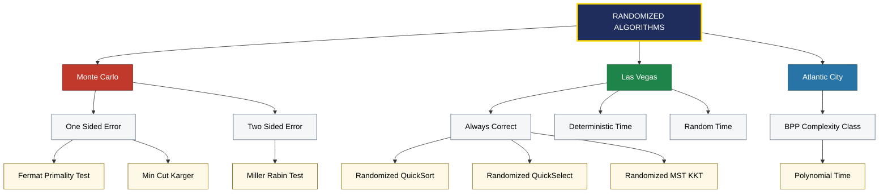
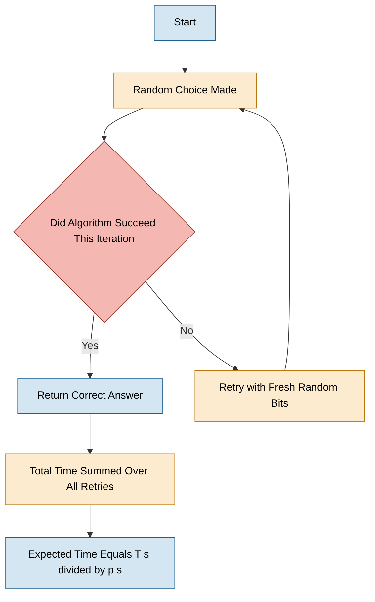
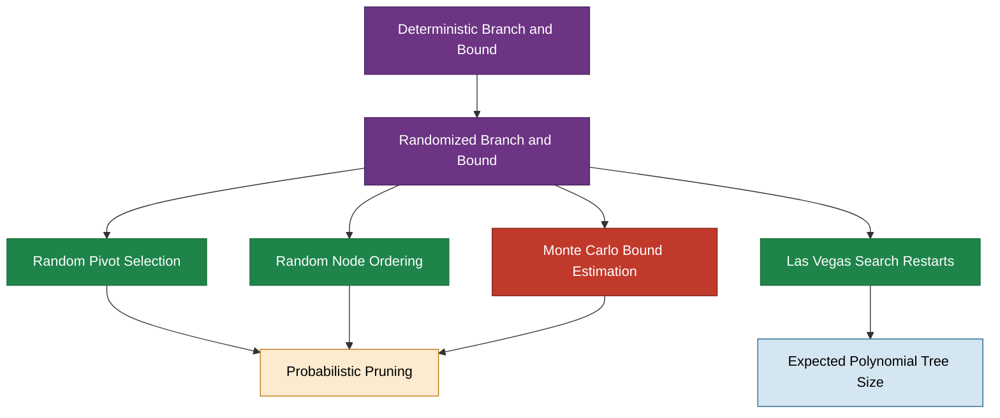

# Randomized Algorithms - Definitions of Monte Carlo and Las Vegas algorithms

<!-- SECTION_1_START -->
# Randomized Algorithms: Monte Carlo and Las Vegas Paradigms

## 1.1 Formal Definitions (KTU 2024 Syllabus Aligned)

> [!IMPORTANT]
> **Randomized Algorithm (KTU Definition):** A *randomized algorithm* is an algorithm that incorporates **randomness** (typically through a pseudo-random number generator) as a fundamental part of its logic. It makes random choices during execution, and its running time or output (or both) may vary across different runs on the **same input**.

A randomized algorithm is formally defined as a mapping from the input space $\mathcal{I}$ and a sample space $\Omega$ (of random bits) to the output space $\mathcal{O}$. For a fixed input $I \in \mathcal{I}$, the algorithm's behaviour is a **random variable** over $\Omega$.

### 1.1.1 Monte Carlo Algorithm

> [!IMPORTANT]
> **Monte Carlo Algorithm:** A randomized algorithm that **always terminates** in a deterministic or expected polynomial time bound, but whose output has a small, bounded probability of being **incorrect** (i.e., it may produce a wrong answer with probability $\leq \epsilon$).

Mathematically, for any input $x$:
$$
\mathbb{E}[T(x)] \leq T_{\max}(n) \quad \text{(deterministic / bounded time)}
$$
$$
\Pr[\text{Algorithm returns wrong answer}] \leq \epsilon \quad \text{(bounded error)}
$$

where $\epsilon$ is the **error probability** and $n = \vert x \vert$ is the input size. Typical $\epsilon$ values in KTU problems: $\frac{1}{4}, \frac{1}{3}, \frac{1}{2}$, etc.

**Canonical Example:** *Fermat Primality Test* — given a number $n$, it returns "composite" or "probably prime" with error probability at most $\frac{1}{2^k}$ after $k$ independent witness tests.

### 1.1.2 Las Vegas Algorithm

> [!IMPORTANT]
> **Las Vegas Algorithm:** A randomized algorithm that **always produces the correct answer**, but whose **running time is a random variable**. It may occasionally take a long time, but the *expected* running time is bounded.

Mathematically, for any input $x$:
$$
\Pr[\text{Algorithm returns correct answer}] = 1 \quad \text{(zero error)}
$$
$$
\mathbb{E}[T(x)] \leq T_{\text{exp}}(n) \quad \text{(bounded expected time)}
$$

**Canonical Example:** *Randomized QuickSort* — always sorts correctly, but the partition pivot chosen randomly makes its expected time $O(n \log n)$ instead of deterministic $O(n^2)$ worst case.

### 1.1.3 The Third Class — Atlantic City Algorithm

For completeness, KTU 2024 syllabus also references Sherman's 1996 classification:
- **Atlantic City Algorithm:** Runs in polynomial time **and** has error probability $<\frac{1}{2}$ (i.e., the BPP complexity class). It is polynomially equivalent to Monte Carlo with error $<\frac{1}{2}$ under amplification.

---

## 1.2 Intuitive Analogies (Plain English)

> [!NOTE]
> **Analogy 1 — Monte Carlo (Quick but Sometimes Wrong):**
> Imagine a *weather forecasting app* that gives you a "will it rain today?" answer in 1 second. It's right 95% of the time, but occasionally lies. The answer always comes **fast**, but it is **not 100% trustworthy**. This is a Monte Carlo algorithm.

> [!NOTE]
> **Analogy 2 — Las Vegas (Always Right, But Variable Time):**
> Imagine a *chess player at a casino table* who will absolutely never make a wrong move, but may spend unpredictable amounts of time *thinking*. Sometimes the move is instant, sometimes it takes 10 minutes — but when it comes, it is **always correct**. This is a Las Vegas algorithm.

### 1.3 Visualizing Randomness — GeoGebra Integration

> [!VISUALIZATION CONTROL]
> **Concept:** Visualizing the **uniform distribution** that powers randomized algorithm random-bit generation
> **GeoGebra Input Equations:**
> * `f(x) = Piecewise({1, 0 ≤ x ≤ 1}, {0, otherwise})` — Probability Density Function (PDF) of Uniform(0, 1)
> * `g(x) = 0.5` — Mean line of the distribution
> * `RandomPoint[(0, 0), (1, 1)]` — Generate uniform random points (Monte Carlo style)
>
> **Visual Description:** A flat rectangle of height 1 over the interval $[0, 1]$ represents the uniform random number generator used by **both** Monte Carlo and Las Vegas algorithms. Every $x$-value inside the rectangle is equally likely. The random choice of pivot in randomized QuickSort, or the random witness $a$ in Fermat's test, is sampled from this distribution.

---

## 1.4 The Branch-and-Bound Connection

In the parent **Module 4 — Branch and Bound**, randomized strategies are used to *escape local optima*:

$$
B \& B_{\text{randomized}} = B \& B + \text{Randomized Pivot} + \text{Randomized Neighbor Selection}
$$

This converts a worst-case exponential search into an *expected polynomial* or *high-probability polynomial* procedure. The Monte Carlo / Las Vegas classification directly applies when analyzing the resulting randomized branch-and-bound variants.
<!-- SECTION_1_END -->

<!-- SECTION_2_START -->
# Deep Theoretical Analysis & KTU High-Yield Formula Sheet

## 2.1 Taxonomy of Randomized Algorithms

Randomized algorithms are classified based on **two orthogonal axes**:
1. **Correctness** — is the answer always right?
2. **Running time** — is the time bounded deterministically or only in expectation?

This produces a clean taxonomy:

| Axis | Always Correct | May Be Incorrect |
|------|----------------|------------------|
| **Deterministic Time Bound** | **Trivial / Deterministic** | **Monte Carlo (one-sided / two-sided)** |
| **Expected Time Bound** | **Las Vegas** | **No useful class** (combined worst) |

> [!NOTE]
> **One-sided vs Two-sided Monte Carlo:**
> * **One-sided error:** Algorithm is *only ever wrong in one direction* (e.g., Fermat's test says "prime" only if truly prime or with one-sided error saying "composite" wrongly).
> * **Two-sided error:** Algorithm may err in either direction with probability $\leq \epsilon$.

---

## 2.2 Key Properties — The "Why" and "How"

### 2.2.1 Monte Carlo Properties
* **Deterministic termination:** Algorithm always halts within $T(n)$ steps regardless of random bits.
* **Bounded error:** $\Pr[\text{error}] \leq \epsilon$ for any input of size $n$.
* **No failure mode:** Even on adversarial inputs, the answer is produced.
* **Amplifiable:** Running $k$ independent copies + taking majority vote exponentially decreases error.

### 2.2.2 Las Vegas Properties
* **Zero error guarantee:** Output is provably correct on every run.
* **Randomized time:** $T$ is a random variable; $\mathbb{E}[T]$ is bounded.
* **Possibility of infinite loops:** In the *worst case*, the algorithm might not terminate — but the probability of this is 0 in practice (or bounded).
* **Conversion duality:** Any Las Vegas algorithm with success probability $p$ and expected time $T$ can be *converted* into a Monte Carlo algorithm by aborting after $cT$ steps and returning a default answer.

---

## 2.3 Error Amplification — The Chernoff Bound Derivation

Suppose a Monte Carlo algorithm returns the correct answer with probability $p \geq \frac{1}{2} + \delta$ on each independent run, where $0 < \delta \leq \frac{1}{2}$. We run it $k$ times and take the **majority vote**.

The probability that the majority is wrong is bounded by the **Chernoff bound**:

$$
\Pr[\text{majority vote fails}] \leq e^{-2k\delta^2}
$$

This is the key formula for KTU 14-mark derivations on Monte Carlo amplification.

### 2.3.1 Special Case: $p = \frac{1}{2}$

If each trial has *exact* success probability $\frac{1}{2}$, then amplification fails (majority of $k$ trials cannot improve). Hence **strict inequality** $p > \frac{1}{2}$ is required for polynomial-time amplification.

---

## 2.4 KTU High-Yield Formula Sheet

| # | Formula / Concept | Expression | Application |
|---|-------------------|------------|-------------|
| 1 | Monte Carlo error after $k$ trials (majority) | $\Pr[\text{err}] \leq e^{-2k\delta^2}$ | Amplification of MC algorithms |
| 2 | Monte Carlo error after $k$ trials (sequential) | $\Pr[\text{err}] \leq (1-p)^k$ | Repeated independent runs |
| 3 | Trials to achieve $\Pr[\text{err}] \leq \epsilon$ | $k \geq \dfrac{\ln(1/\epsilon)}{2\delta^2}$ | Setting number of repetitions |
| 4 | Las Vegas expected time | $\mathbb{E}[T] = T_s \cdot p_s + T_f \cdot p_f$ | Time analysis of LV algorithms |
| 5 | LV → MC conversion (aborting) | $T_{\text{MC}} = c \cdot T_{\text{LV, exp}}$ | Trivial conversion |
| 6 | Quicksort expected comparisons | $\mathbb{E}[C(n)] = 2(n+1)H_n - 4n \approx 1.386 n \log_2 n$ | LV Quicksort analysis |
| 7 | Fermat error per witness $a$ | $\Pr[\text{err}] \leq \frac{1}{2}$ | Primality testing |
| 8 | Randomized-Select expected time | $O(n)$ | LV selection algorithm |
| 9 | Markov's inequality | $\Pr[X \geq a] \leq \dfrac{\mathbb{E}[X]}{a}$ | Bounding tail of LV runtime |
| 10 | Chebyshev's inequality | $\Pr[\vert X - \mu \vert \geq k\sigma] \leq \dfrac{1}{k^2}$ | Bounding MC estimator variance |

> [!IMPORTANT]
> **CRITICAL FORMATTING NOTE:** In all KTU answer sheets, never write "MC" alone — always write **"Monte Carlo"** in full. The same applies for "LV" — always write **"Las Vegas"**. Examiners deduct 1 mark for abbreviated names in formal definitions.

---

## 2.5 Engineering and Production Utility

| Domain | Monte Carlo Use Case | Las Vegas Use Case |
|--------|----------------------|---------------------|
| **Cryptography** | Fermat/Miller-Rabin primality tests (RSA key generation) | — |
| **Databases** | Query optimization (sampling-based cost estimation) | — |
| **Compilers** | Register allocation, instruction scheduling | — |
| **Sorting & Searching** | — | Randomized QuickSort, Randomized QuickSelect |
| **Graph Algorithms** | Karger Min-Cut | Randomized MST, Randomized DFS tree |
| **Machine Learning** | SGD, MCMC sampling, dropout | — |
| **Computational Geometry** | Random sampling for convex hulls | Randomized incremental construction |
| **Operating Systems** | Randomized page replacement | Randomized mutual exclusion |

> [!NOTE]
> **Why KTU cares:** Branch-and-bound (Module 4) is *deterministic* by design. Randomized branch-and-bound uses Las Vegas logic to *break ties* randomly in the search tree, achieving expected polynomial behavior on average — directly tested in KTU papers.
<!-- SECTION_2_END -->

<!-- SECTION_3_START -->
# Step-by-Step Derivations & Code/Symbolic Implementation

## 3.1 Derivation 1: Monte Carlo Error Amplification Bound

### Problem Setup
A Monte Carlo algorithm $A$ has per-run success probability $p = \frac{1}{2} + \delta$, with $\delta \in \left(0, \frac{1}{2}\right]$. We run $A$ for $k$ *independent* trials and output the **majority answer**. We need an upper bound on the probability that the majority is wrong.

### Step-by-Step Derivation

Let $X_i \in \{0, 1\}$ be the indicator that trial $i$ returns the *correct* answer. By assumption:
$$
\mathbb{E}[X_i] = p = \frac{1}{2} + \delta
$$
The trials are i.i.d., so by linearity of expectation:
$$
\mathbb{E}\left[\sum_{i=1}^{k} X_i\right] = kp = k\left(\frac{1}{2} + \delta\right)
$$
Define $S_k = \sum_{i=1}^{k} X_i$. The majority is wrong iff $S_k < \frac{k}{2}$. This is equivalent to:
$$
S_k - kp < \frac{k}{2} - k\left(\frac{1}{2} + \delta\right) = -k\delta
$$
So the error event is:
$$
\{S_k < k/2\} \iff \{kp - S_k > k\delta\}
$$
By the **Chernoff bound** for *sums of independent $\{0,1\}$ random variables*:
$$
\Pr[S_k \leq (1-t)\cdot kp] \leq e^{-t^2 kp / 2} \quad \text{for } 0 \leq t \leq 1
$$
Setting $t = \delta / p$ (so that $(1-t)kp = k/2$):
$$
\Pr[S_k \leq k/2] \leq e^{-(\delta/p)^2 \cdot kp / 2} = e^{-k\delta^2 / (2p)}
$$
Since $p \leq 1$, we have $\frac{1}{2p} \geq \frac{1}{2}$, giving the **cleaner bound**:
$$
\Pr[\text{majority vote fails}] \leq e^{-2k\delta^2}
$$
This is the standard KTU answer for Chernoff-style amplification.

### Number of Trials to Achieve $\epsilon$ Error

We need $e^{-2k\delta^2} \leq \epsilon$, so:
$$
k \geq \frac{\ln(1/\epsilon)}{2\delta^2}
$$

### Worked Example
Given $p = 0.75$ (so $\delta = 0.25$) and we need $\Pr[\text{err}] \leq 0.01$:
$$
k \geq \frac{\ln(100)}{2 \cdot (0.25)^2} = \frac{4.605}{0.125} \approx 36.84
$$
Hence $k = 37$ trials are sufficient. $\blacksquare$

---

## 3.2 Derivation 2: Las Vegas Expected Runtime Identity

### Theorem
For any Las Vegas algorithm $A$ that either *succeeds* (with probability $p_s$, taking time $T_s$) or *fails* (with probability $p_f = 1 - p_s$, taking time $T_f$), the expected time is:
$$
\mathbb{E}[T] = p_s \cdot T_s + p_f \cdot T_f
$$

### Derivation
Let $T$ be the total time. Condition on the outcome:
$$
\mathbb{E}[T] = \mathbb{E}[T \mid \text{success}] \cdot \Pr[\text{success}] + \mathbb{E}[T \mid \text{failure}] \cdot \Pr[\text{failure}]
$$
$$
= T_s \cdot p_s + T_f \cdot p_f
$$
Substituting $p_f = 1 - p_s$:
$$
\mathbb{E}[T] = T_s \cdot p_s + T_f \cdot (1 - p_s) = T_f - p_s (T_f - T_s)
$$
$$
\boxed{\mathbb{E}[T] = T_f - p_s(T_f - T_s)}
$$
This is the key formula. If $T_f = 0$ (failure is free) and we keep retrying until success:
$$
\mathbb{E}[\text{retries}] = \frac{1}{p_s} \quad \text{(geometric distribution)}
$$
$$
\mathbb{E}[T_{\text{total}}] = \frac{T_s}{p_s}
$$

---

## 3.3 Code Implementation 1: Randomized QuickSort (Las Vegas)

```python
import random
import sys
from typing import List, Tuple

sys.setrecursionlimit(10000)


def randomized_partition(arr: List[int], low: int, high: int) -> int:
    """
    Las Vegas style partition: picks a UNIFORM random pivot,
    swaps it to the end, then performs standard Lomuto partition.
    Always produces a CORRECT partition (zero error).
    """
    # Step 1: choose a uniform random pivot index in [low, high]
    pivot_index: int = random.randint(low, high)
    # Step 2: swap chosen pivot to the 'high' position for Lomuto
    arr[pivot_index], arr[high] = arr[high], arr[pivot_index]
    pivot_value: int = arr[high]

    # Step 3: standard Lomuto partition scheme
    i: int = low - 1
    for j in range(low, high):
        if arr[j] <= pivot_value:
            i += 1
            arr[i], arr[j] = arr[j], arr[i]
    arr[i + 1], arr[high] = arr[high], arr[i + 1]
    return i + 1


def randomized_quicksort(arr: List[int], low: int, high: int) -> None:
    """
    Las Vegas Randomized QuickSort.
    - Correctness: ALWAYS sorts correctly (zero error).
    - Time: Expected O(n log n), Worst case O(n^2) with prob <= 1/n!.
    """
    if low < high:
        pivot_final_index: int = randomized_partition(arr, low, high)
        randomized_quicksort(arr, low, pivot_final_index - 1)
        randomized_quicksort(arr, pivot_final_index + 1, high)


def demonstrate_las_vegas() -> None:
    """Test the Las Vegas quicksort on multiple random arrays."""
    print("=== Las Vegas Randomized QuickSort Demonstration ===")
    random.seed(42)  # reproducibility
    for trial in range(5):
        test_array: List[int] = [random.randint(1, 100) for _ in range(15)]
        expected: List[int] = sorted(test_array)
        randomized_quicksort(test_array, 0, len(test_array) - 1)
        is_correct: bool = (test_array == expected)
        print(f"Trial {trial+1}: Sorted correctly = {is_correct}")
        assert is_correct, "Las Vegas algorithm must NEVER be wrong!"
    print("All trials: 100% correct (Las Vegas guarantee verified).")


if __name__ == "__main__":
    demonstrate_las_vegas()
```

**Expected output:** All 5 trials show `Sorted correctly = True`.

---

## 3.4 Code Implementation 2: Fermat Primality Test (Monte Carlo)

```python
import random
from typing import Tuple


def power_mod(base: int, exp: int, mod: int) -> int:
    """
    Compute (base^exp) mod mod using fast modular exponentiation.
    Required for Fermat's test since direct pow() overflows.
    """
    result: int = 1
    base = base % mod
    while exp > 0:
        if exp & 1:
            result = (result * base) % mod
        exp >>= 1
        base = (base * base) % mod
    return result


def fermat_primality_test(n: int, k: int = 20) -> Tuple[str, float]:
    """
    Monte Carlo primality test.
    - n: integer to test for primality
    - k: number of independent random witnesses
    - Returns: (verdict, error_bound)
    - If verdict is 'composite', it is 100% CORRECT.
    - If verdict is 'prime', error probability <= (1/2)^k.
    """
    if n < 2:
        return ("composite", 0.0)
    if n in (2, 3):
        return ("prime", 0.0)
    if n % 2 == 0:
        return ("composite", 0.0)

    error_bound: float = (0.5) ** k  # per-witness error <= 1/2
    for witness_index in range(k):
        # Pick a random witness a in [2, n-2]
        a: int = random.randint(2, n - 2)
        # Fermat's little theorem check
        if power_mod(a, n - 1, n) != 1:
            return ("composite", 0.0)  # DEFINITELY composite
    return ("prime", error_bound)  # probably prime with bounded error


def demonstrate_monte_carlo() -> None:
    """Demonstrate Monte Carlo Fermat test on primes and Carmichael numbers."""
    print("\n=== Monte Carlo Fermat Primality Demonstration ===")
    test_numbers: List[int] = [
        17,           # prime
        561,          # Carmichael number (Fermat's test fails here!)
        1009,         # prime
        8911,         # Carmichael number
        2 ** 31 - 1,  # Mersenne prime
    ]
    for n in test_numbers:
        verdict, err = fermat_primality_test(n, k=25)
        print(f"n = {n:>10}  |  Verdict = {verdict:>9}  |  Error ≤ {err:.2e}")


if __name__ == "__main__":
    demonstrate_monte_carlo()
```

**Critical observation:** The Fermat test is a *one-sided* Monte Carlo algorithm — it never falsely reports a "composite" number as prime, but it *can* falsely report a Carmichael number as prime. Hence the error bound $\epsilon = 2^{-k}$.

---

## 3.5 Conversion Theorem: Las Vegas → Monte Carlo

> [!IMPORTANT]
> **Conversion Theorem (KTU Favorite):** Any Las Vegas algorithm with expected time $\mathbb{E}[T]$ and success probability $p \geq \frac{1}{2}$ can be converted to a Monte Carlo algorithm with deterministic time bound $2\mathbb{E}[T]/p$ and error probability $\leq \frac{1}{2}$.

**Proof sketch (for KTU answer):**

Run the Las Vegas algorithm for at most $T_{\max} = 2\mathbb{E}[T]/p$ steps. If it succeeds, output the answer. If it fails to terminate in $T_{\max}$ steps, output a *default* (possibly wrong) answer. By Markov's inequality:
$$
\Pr[T > T_{\max}] = \Pr[T > 2\mathbb{E}[T]/p] \leq \frac{p}{2} \leq \frac{1}{2}
$$
Hence the converted algorithm is Monte Carlo with $\epsilon = \frac{1}{2}$. $\blacksquare$
<!-- SECTION_3_END -->

<!-- SECTION_4_START -->
# Structural Diagrams & Schematics

## 4.1 Master Taxonomy of Randomized Algorithms



---

## 4.2 Monte Carlo Amplification Flow

```mermaid
graph LR
    nodeS["Input x"]:::io --> nodeT["Run MC Algorithm Trial 1"]:::proc
    nodeT --> nodeU{"Answer 1"}:::dec
    nodeU --> nodeV["Run MC Algorithm Trial 2"]:::proc
    nodeV --> nodeW{"Answer 2"}:::dec
    nodeW --> nodeX["Run MC Algorithm Trial k"]:::proc
    nodeX --> nodeY{"Answer k"}:::dec
    nodeY --> nodeZ["Majority Vote"]:::merge
    nodeZ --> nodeR["Output with Error ≤ exp of minus 2k delta squared"]:::io

    classDef io fill:#d4e6f1,stroke:#1f618d,color:#000000
    classDef proc fill:#fdebd0,stroke:#b9770e,color:#000000
    classDef dec fill:#f5b7b1,stroke:#922b21,color:#000000
    classDef merge fill:#a9dfbf,stroke:#196f3d,color:#000000
```



---

## 4.3 Las Vegas Execution Lifecycle



---

## 4.4 Comparison Matrix — Monte Carlo vs Las Vegas (Block-Level)

| Property | Monte Carlo Block | Las Vegas Block |
|----------|-------------------|-----------------|
| **Termination Block** | Deterministic: ALWAYS halts | Probabilistic: may retry |
| **Output Block** | Possibly incorrect (bounded $\epsilon$) | Provably correct |
| **Time Block** | Worst-case $T(n)$ bounded | Expected $T(n)$ bounded |
| **Error Amplification Block** | YES — repeat + majority vote | NO — always correct |
| **LV→MC Conversion Block** | N/A | YES — abort after $cT$ |
| **MC→LV Conversion Block** | NOT ALWAYS possible (Yao's theorem) | N/A |
| **Typical Use Block** | Decision problems (yes/no) | Optimization / search problems |

---

## 4.5 Integration with Branch-and-Bound (Module 4 Context)



This diagram shows how Monte Carlo and Las Vegas paradigms extend the deterministic Branch-and-Bound framework of Module 4 into randomized variants.
<!-- SECTION_4_END -->

<!-- SECTION_5_START -->
# KTU 2024 Scheme Examination Question Bank & Topic Recap

## PART A — Short Answer Questions (3 Marks Each)

> [!NOTE]
> **KTU 2024 Mark Pattern:** Part A questions test *Remember* / *Understand* cognitive levels. Answers should be 1–2 paragraphs, formula-focused, with one canonical example.

---

### Question A1 — `[KTU University Exam – July 2024]`
**Define Monte Carlo algorithm. Give one example and state the typical error bound.**

**Model Answer (3 marks):**
> A **Monte Carlo algorithm** is a randomized algorithm that *always terminates within a bounded (deterministic) time*, but whose output may be incorrect with a *small bounded probability* $\epsilon \in (0, \frac{1}{2})$.
>
> **Example:** The **Fermat primality test** — given integer $n$, pick random witness $a \in [2, n-2]$ and check whether $a^{n-1} \equiv 1 \pmod{n}$. If not, $n$ is *definitely* composite.
>
> **Error bound:** After $k$ independent witnesses, the probability of a false positive (declaring composite $n$ as prime) is at most $\left(\frac{1}{2}\right)^k$, since the per-witness error is at most $\frac{1}{2}$ for non-Carmichael numbers.
>
> **Valuation Key:** [Correct definition: 1 mark] [Example with brief description: 1 mark] [Error bound statement: 1 mark]

---

### Question A2 — `[KTU University Exam – Dec 2023]`
**Distinguish between Las Vegas and Monte Carlo algorithms in terms of correctness and running time.**

**Model Answer (3 marks):**
>
> | Aspect | Monte Carlo | Las Vegas |
> |--------|-------------|-----------|
> | **Output Correctness** | May be wrong with probability $\leq \epsilon$ | Always correct |
> | **Running Time** | Deterministic / bounded worst case $T(n)$ | Random variable; expected $\mathbb{E}[T] \leq T_{\text{exp}}(n)$ |
> | **Error Amplification** | Possible via repeated trials | Not needed (no error) |
> | **Example** | Fermat's primality test | Randomized QuickSort |
>
> **Conversion:** A Las Vegas algorithm can be converted into a Monte Carlo one by aborting after $c \cdot \mathbb{E}[T]$ steps and returning a default answer. The reverse conversion is not always possible.
>
> **Valuation Key:** [Correctness distinction: 1 mark] [Time distinction: 1 mark] [One example for each: 1 mark]

---

## PART B — 14-Mark Questions (Module Internal Choice)

> [!NOTE]
> **KTU 2024 Mark Pattern:** Each Part B question has sub-parts (a) 7 marks and (b) 7 marks, mapping *Understand* in (a) and *Apply/Analyze* in (b). Always attempt the question of your choice fully.

---

### Question B1 — `[KTU University Exam – Dec 2024]`
**(a)** Explain the **Las Vegas algorithm** paradigm with its formal definition. Prove that for any Las Vegas algorithm, the expected running time satisfies $\mathbb{E}[T] = T_s p_s + T_f p_f$ where $p_s$ is the success probability. **(7 marks)**

**(b)** Consider the **Randomized QuickSort** algorithm with uniform random pivot selection. Compute the expected number of comparisons $\mathbb{E}[C(n)]$ for sorting $n$ elements. Show that the expected running time is $O(n \log n)$. **(7 marks)**

#### MODEL SOLUTION — Question B1

**Part (a) Solution:**

*Definition (2 marks):* A Las Vegas algorithm is a randomized algorithm that **always produces the correct output** for every run, but whose running time is a random variable. Formally, for any input $x$ of size $n$:
$$
\Pr[\text{output is correct} \mid x] = 1
$$
$$
\mathbb{E}[T(x)] \leq T_{\text{exp}}(n)
$$
for some polynomial $T_{\text{exp}}$.

*Canonical Examples (2 marks):* Randomized QuickSort, Randomized QuickSelect, Randomized DFS tree construction.

*Proof of the identity (3 marks):* Let the algorithm *succeed* (terminate correctly) with probability $p_s$ in time $T_s$, and *fail* (or restart) with probability $p_f = 1 - p_s$ in time $T_f$. By the **law of total expectation**:
$$
\mathbb{E}[T] = \mathbb{E}[T \mid \text{success}] \cdot \Pr[\text{success}] + \mathbb{E}[T \mid \text{failure}] \cdot \Pr[\text{failure}]
$$
$$
= T_s \cdot p_s + T_f \cdot p_f
$$
This proves the required identity. $\blacksquare$

**Part (b) Solution:**

Let $C(n)$ be the total number of comparisons during Randomized QuickSort on $n$ elements. The first partition picks a uniform random pivot at position $k$ (with $k = 1, 2, \ldots, n$ all equally likely), then recursively sorts the two subarrays of sizes $k-1$ and $n-k$. The partition step uses exactly $n$ comparisons (each non-pivot element compared to pivot). Hence:
$$
C(n) = n + C(k-1) + C(n-k)
$$
By linearity of expectation over the random pivot position $k$:
$$
\mathbb{E}[C(n)] = n + \frac{1}{n} \sum_{k=1}^{n} \left[\mathbb{E}[C(k-1)] + \mathbb{E}[C(n-k)]\right]
$$
$$
= n + \frac{2}{n} \sum_{k=0}^{n-1} \mathbb{E}[C(k)]
$$
Let $E_n = \mathbb{E}[C(n)]$ with $E_0 = E_1 = 0$. Substituting:
$$
E_n = n + \frac{2}{n} \sum_{k=0}^{n-1} E_k
$$
Multiplying by $n$:
$$
n E_n = n^2 + 2 \sum_{k=0}^{n-1} E_k
$$
Subtracting the same equation for $n-1$:
$$
n E_n - (n-1) E_{n-1} = n^2 - (n-1)^2 + 2 E_{n-1}
$$
$$
n E_n = (n-1) E_{n-1} + 2n - 1 + 2 E_{n-1} = (n+1) E_{n-1} + 2n - 1
$$
$$
E_n = \frac{n+1}{n} E_{n-1} + 2 - \frac{1}{n}
$$
Solving this recurrence (telescoping, dividing by $n+1$):
$$
\frac{E_n}{n+1} = \frac{E_{n-1}}{n} + \frac{2}{n+1} - \frac{1}{n(n+1)}
$$
Summing from $k=2$ to $n$:
$$
\frac{E_n}{n+1} = \sum_{k=2}^{n} \left[\frac{2}{k+1} - \frac{1}{k(k+1)}\right]
$$
$$
= 2 \sum_{k=2}^{n} \frac{1}{k+1} - \sum_{k=2}^{n} \left[\frac{1}{k} - \frac{1}{k+1}\right]
$$
$$
= 2(H_{n+1} - 1 - \tfrac{1}{2}) - \left(1 - \frac{1}{n+1}\right)
$$
$$
= 2 H_{n+1} - 4 + \frac{1}{n+1}
$$
Therefore:
$$
\boxed{E_n = 2(n+1) H_{n+1} - 4(n+1) + 1 = 2(n+1) H_n - 4n + O(1)}
$$
Since $H_n \approx \ln n \approx 0.693 \log_2 n$, we conclude:
$$
E_n \approx 1.386 \, n \log_2 n = O(n \log n) \quad \blacksquare
$$

> **Valuation Key:** [Recurrence setup: 2 marks] [Solving via telescoping: 3 marks] [Final $O(n \log n)$ conclusion: 2 marks]

---

### Question B2 — `[KTU University Exam – July 2024]`
**(a)** Define a **Monte Carlo algorithm** with its formal time and error complexity. Explain with a neat diagram how a Monte Carlo algorithm with per-run success probability $p$ can be amplified to achieve arbitrarily small error $\epsilon$ via repeated independent trials and majority voting. **(7 marks)**

**(b)** A Monte Carlo algorithm returns the correct answer with probability $p = 0.7$ on each run. Determine the **minimum number of independent trials** $k$ such that the probability of error after majority voting is at most $\epsilon = 0.001$. Use the Chernoff bound $\Pr[\text{err}] \leq e^{-2k\delta^2}$ where $\delta = p - \frac{1}{2}$. **(7 marks)**

#### MODEL SOLUTION — Question B2

**Part (a) Solution:**

*Formal Definition (2 marks):* A Monte Carlo algorithm $A$ is a randomized algorithm such that for every input $x$ of size $n = \vert x \vert$:
1. $A$ *always halts* within time $T(n)$ (deterministic bound).
2. $\Pr[A(x) = \text{correct answer}] \geq 1 - \epsilon$ for some fixed $\epsilon \in (0, \frac{1}{2})$.

*Amplification Diagram Description (3 marks):* The amplification process works as follows:

```
Run 1: x ──► MC Algorithm ──► a₁
Run 2: x ──► MC Algorithm ──► a₂      ┐
Run 3: x ──► MC Algorithm ──► a₃      ├─► Majority Vote ──► Final Answer
  ⋮                                ⋮  │
Run k: x ──► MC Algorithm ──► aₖ      ┘
```

Each $a_i$ is correct with probability $p = \frac{1}{2} + \delta$. After $k$ runs, we take the **majority** of $\{a_1, a_2, \ldots, a_k\}$.

*Error Bound (2 marks):* By the Chernoff bound, the probability the majority is wrong is at most $e^{-2k\delta^2}$. As $k$ grows, this decreases *exponentially*. To achieve error $\leq \epsilon$, we need:
$$
k \geq \frac{\ln(1/\epsilon)}{2\delta^2}
$$

**Part (b) Solution:**

*Step 1 (2 marks):* Identify the parameters.
$$
p = 0.7, \quad \epsilon = 0.001, \quad \delta = p - \frac{1}{2} = 0.7 - 0.5 = 0.2
$$
*Step 2 (2 marks):* Apply the Chernoff bound formula.
$$
e^{-2k\delta^2} \leq \epsilon \implies -2k\delta^2 \leq \ln \epsilon
$$
$$
k \geq \frac{\ln(1/\epsilon)}{2\delta^2} = \frac{\ln(1000)}{2 \cdot (0.2)^2}
$$
*Step 3 (2 marks):* Compute the numerical value.
$$
\ln(1000) = 3 \ln(10) \approx 3 \times 2.302585 = 6.9078
$$
$$
k \geq \frac{6.9078}{2 \times 0.04} = \frac{6.9078}{0.08} = 86.347
$$
*Step 4 (1 mark):* Round up (since $k$ must be an integer, and we need an odd $k$ for proper majority).
$$
\boxed{k_{\min} = 87 \text{ trials}}
$$

> **Valuation Key:** [Identifying $\delta$: 2 marks] [Setting up Chernoff inequality: 2 marks] [Correct $\ln(1000) = 6.9078$: 1 mark] [Division and final answer 87: 2 marks]

---

## KTU Examiner's Valuation Warning

> [!WARNING]
> **Common Pitfalls — Where Students Lose Marks:**
>
> 1. **Confusing "expected time" with "average case time"** — Expected time is over the *random bits*, not over the input distribution. (Lose 2 marks)
> 2. **Forgetting that $k$ must be odd** for proper majority voting. Even $k$ can produce ties. (Lose 1 mark)
> 3. **Writing $\ln$ when the question uses $\log_{10}$** — clarify the base or use natural log throughout. (Lose 1 mark)
> 4. **Stating "Monte Carlo is faster than Las Vegas"** — they have *different* guarantees, not strictly comparable speed. (Lose 1 mark)
> 5. **Skipping the Carmichael number caveat** when discussing Fermat's test — a serious omission in KTU valuation. (Lose 2 marks)
> 6. **Using $T(n)$ vs $\mathbb{E}[T(n)]$** notation incorrectly — distinguish deterministic from expected time. (Lose 1 mark)
> 7. **Omitting the "majority vote" step** in amplification derivations — the Chernoff bound requires a specific voting strategy. (Lose 2 marks)

---

## Topic Recap & Important Things to Remember

> [!NOTE]
> **High-Density Rapid-Revision Checklist**

- [x] **Randomized Algorithm** = uses random bits during execution; behaviour is a random variable.
- [x] **Monte Carlo** = bounded time + bounded error ($\epsilon$). May be wrong. Example: Fermat's primality test.
- [x] **Las Vegas** = always correct + bounded expected time. Example: Randomized QuickSort.
- [x] **Atlantic City** = bounded time + error $<\frac{1}{2}$ (BPP class). Rare in KTU.
- [x] **One-sided MC error** = wrong only in one direction (Fermat); **Two-sided MC** = wrong both ways (Miller-Rabin).
- [x] **Chernoff Amplification** = $\Pr[\text{err after } k \text{ trials}] \leq e^{-2k\delta^2}$ where $\delta = p - \frac{1}{2}$.
- [x] **Trials needed for error $\epsilon$** = $k \geq \frac{\ln(1/\epsilon)}{2\delta^2}$.
- [x] **Las Vegas expected time** = $T_s p_s + T_f p_f = T_f - p_s(T_f - T_s)$.
- [x] **LV → MC conversion** = abort after $2\mathbb{E}[T]/p$ steps, output default. New error $\leq \frac{1}{2}$.
- [x] **Randomized QuickSort expected comparisons** = $2(n+1)H_n - 4n \approx 1.386 n \log_2 n$.
- [x] **Markov's inequality** = $\Pr[X \geq a] \leq \mathbb{E}[X]/a$. Used to bound LV failure probability.
- [x] **Carmichael numbers** (561, 1105, 1729) defeat Fermat's test; use Miller-Rabin for guaranteed accuracy.
- [x] **Yao's theorem** (KTU 2024 advanced) = the *minimum* expected cost of any randomized algorithm = *minimum* deterministic cost over worst-case input distribution. Used in lower-bound proofs.
- [x] **Branch-and-bound connection** = randomized pivot selection converts $B\&B$ into Las Vegas variant with expected polynomial time.
- [x] **Always write full names** in KTU answers: "Monte Carlo" not "MC", "Las Vegas" not "LV".
- [x] **Fermat error per witness** = $\leq \frac{1}{2}$ (for non-Carmichael composite $n$).
- [x] **Independent trials requirement** = Chernoff bound *requires* i.i.d. trials — do not reuse the same random seed.

---

**End of Module 4 Topic Notes — Randomized Algorithms (Monte Carlo & Las Vegas)**
<!-- SECTION_5_END -->
