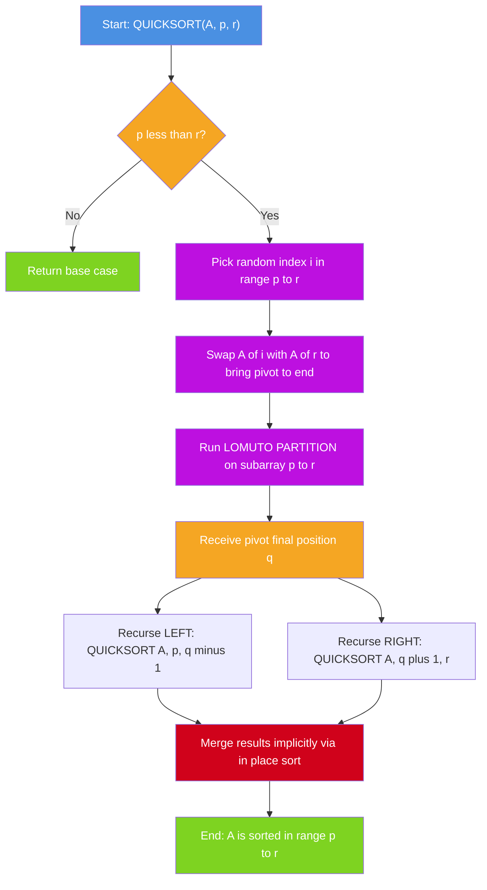
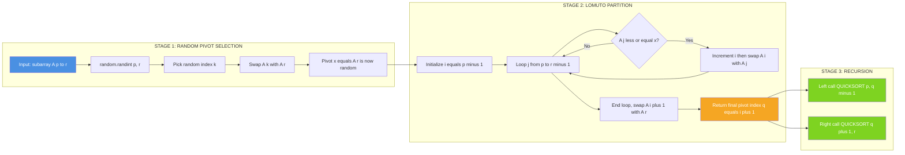
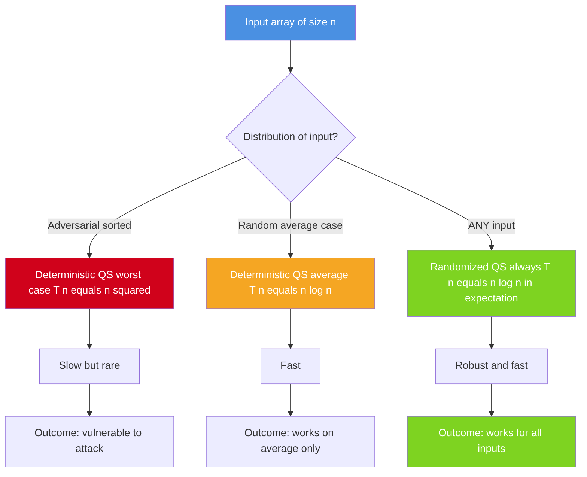
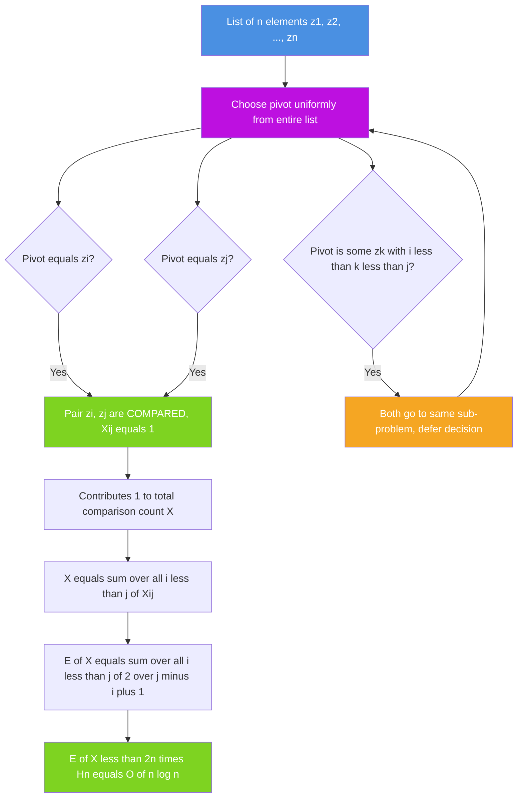

# Randomized version of Quick Sort algorithm with analysis

<!-- SECTION_1_START -->
# Randomized Quick Sort – Core Definition & Intuition

> [!NOTE]
> **Syllabus Tag (KTU 2024 Scheme – PCCST502 / Module 4 – Branch and Bound)**
> Randomized algorithms form a key sub-topic under the *Branch and Bound* discussion because randomized pivot selection is the most common technique used to **escape pathological worst-case inputs** that cause naïve Quick Sort to degrade to $O(n^2)$.

## 1.1 Formal Academic Definition

> [!IMPORTANT]
> **Definition (Randomized Quick Sort):**
> *Randomized Quick Sort is a Quick Sort variant in which the pivot element is not chosen by a fixed deterministic rule (such as "first element", "last element", or "median-of-three"), but is selected uniformly at random from the sub-array being partitioned. The expected running time over the random choices of the algorithm is $E[T(n)] = O(n \log n)$ for **every** input distribution.*

The randomness is in the **algorithm's coin flips**, *not* in the input. This is a fundamental distinction: the algorithm's behavior is randomized, while the input is adversarial. Therefore, the expected bound $O(n \log n)$ holds **regardless of the structure of the input array**.

## 1.2 The Two Families of Randomized Algorithms

Randomized algorithms fall into two categories, and Randomized Quick Sort belongs to the first:

| Type | Property | Example | Always correct? |
|------|----------|---------|-----------------|
| **Las Vegas** | Running time is random; output is always correct | Randomized Quick Sort, Randomized Quick Select | Yes |
| **Monte Carlo** | Running time is deterministic/fixed; output may be wrong with small probability | Miller–Rabin primality test, Karger’s min-cut | No |

> [!TIP]
> In KTU exams, when asked "What type of randomized algorithm is Quick Sort?", the correct one-word answer is **Las Vegas**.

## 1.3 Conceptual Analogy – The "Shuffled Deck" Intuition

Imagine you are a teacher and need to call 10 students one-by-one to arrange themselves in height order. The **deterministic** version says *"always pick the first student in line as the reference"*. If students arrive in a *deviously sorted order* (tallest to shortest), the reference is the tallest, and everyone else must stand to the right — a disaster.

The **randomized** version says: *"shuffle the calling order with a fair dice before starting."* No matter how the students arrived, the *chance* of repeatedly picking the extreme (tallest or shortest) on every recursive call becomes vanishingly small. The expected time is short, even if an adversary is controlling the input.

## 1.4 Why Deterministic Quick Sort Fails

The deterministic Quick Sort recurrence for the running time on a sub-array of size $n$ is:

$$
\begin{aligned}
T(n) \;=\; T(k) \;+\; T(n-k-1) \;+\; \Theta(n)
\end{aligned}
$$

where $k$ is the number of elements less than the pivot. The cost is:
- **Best case** (perfectly balanced split, $k \approx n/2$): $T(n) = O(n \log n)$
- **Worst case** (highly unbalanced split, $k = 0$ or $k = n-1$): $T(n) = O(n^2)$

An **adversary** (someone who knows your pivot rule) can always feed an input that triggers the worst case. Randomized pivot selection denies the adversary that power.

> [!WARNING]
> Randomized Quick Sort does **not** eliminate the $O(n^2)$ worst case — it just makes its probability astronomically small ($\approx 2/n!$ for very unbalanced splits). What changes is the **expected** bound, which becomes a robust $O(n \log n)$.

## 1.5 Visual Intuition – Why Randomization Helps

> [!VISUALIZATION CONTROL]
> **Concept:** Recursion tree of Quick Sort on $n = 8$ elements
> **GeoGebra / Desmos Input Equations (depth vs. work):**
> * Balanced tree:  $f_1(x) = 2^{x}$ (size grows exponentially with depth)
> * Skewed tree:    $f_2(x) = x$ (size shrinks linearly, total work = $n^2$)
> **Visual Description:** Plot depth $x$ on horizontal axis and sub-problem size on vertical. The balanced tree reaches size $\sim 1$ at depth $\log_2 n$ (cheap), while the skewed tree reaches size $1$ only at depth $n$ (expensive). Randomization biases the tree toward the first shape for any input.
<!-- SECTION_1_END -->

<!-- SECTION_2_START -->
# Deep Theoretical Analysis & High-Yield Formula Sheet

## 2.1 The Random Pivot Selection Procedure

There are two common implementations in textbooks (CLRS uses the first, Sedgewick the second):

1. **RANDOMIZED-PARTITION:** Call `RANDOM(i, j)` to pick a uniform index $r \in [i, j]$, swap $A[r]$ with $A[j]$, then run standard `PARTITION`.
2. **RANDOMIZED-QUICKSORT:** Pick a pivot $x = A[\text{RANDOM}(p, r)]$ at the top of `QUICKSORT` and partition around it directly.

Both yield the same expected $O(n \log n)$ bound.

## 2.2 Indicator Random Variable (IRV) Analysis

This is the most-tested KTU technique. Define an indicator $X_{ij}$ for the pair $(i, j)$ with $1 \le i < j \le n$:

$$
\begin{aligned}
X_{ij} \;=\; \begin{cases} 1 & \text{if elements at positions } i \text{ and } j \text{ are compared during sort} \\ 0 & \text{otherwise} \end{cases}
\end{aligned}
$$

**Key Lemma:** Two elements $z_i$ and $z_j$ (the original $i$-th and $j$-th smallest) are compared **iff** one of them is chosen as a pivot before any element with rank between them. Equivalently, the first pivot drawn from the set $\{z_i, z_{i+1}, \dots, z_j\}$ is either $z_i$ or $z_j$.

The probability of this event (since every element of the set is equally likely to be the first pivot chosen from it) is:

$$
\begin{aligned}
\Pr[X_{ij} = 1] \;=\; \frac{2}{j - i + 1}
\end{aligned}
$$

The total number of comparisons $X$ over the entire run is:

$$
\begin{aligned}
X \;=\; \sum_{i=1}^{n-1} \; \sum_{j=i+1}^{n} X_{ij}
\end{aligned}
$$

By linearity of expectation:

$$
\begin{aligned}
E[X] \;=\; \sum_{i=1}^{n-1} \; \sum_{j=i+1}^{n} E[X_{ij}] \;=\; \sum_{i=1}^{n-1} \; \sum_{j=i+1}^{n} \frac{2}{j-i+1}
\end{aligned}
$$

Let $k = j - i$. Substitute $k$ ranges from $1$ to $n - 1$:

$$
\begin{aligned}
E[X] \;=\; \sum_{i=1}^{n-1} \; \sum_{k=1}^{n-i} \frac{2}{k+1} \;<\; \sum_{i=1}^{n-1} \; \sum_{k=1}^{n} \frac{2}{k} \;=\; (n-1) \cdot 2 H_n
\end{aligned}
$$

where $H_n$ is the $n$-th harmonic number, $H_n = \sum_{k=1}^{n} \tfrac{1}{k} \approx \ln n + \gamma$.

Therefore:

$$
\begin{aligned}
E[X] \;<\; 2n \ln n \;\approx\; 1.386 \, n \log_2 n
\end{aligned}
$$

> [!IMPORTANT]
> **Conclusion:** The expected number of comparisons in Randomized Quick Sort is $O(n \log n)$, with a constant factor of approximately $1.386 \, n \log_2 n$. This is provably less than the $\approx 2 n \log_2 n$ of Merge Sort.

## 2.3 KTU High-Yield Formula Sheet

| Concept | Formula / Bound | Notes |
|---------|-----------------|-------|
| Best case recurrence | $T(n) = 2T(n/2) + \Theta(n)$ | Perfectly balanced split |
| Best case solution | $T(n) = \Theta(n \log n)$ | Master Theorem Case 2 |
| Worst case recurrence | $T(n) = T(n-1) + \Theta(n)$ | Always picks extreme |
| Worst case solution | $T(n) = \Theta(n^2)$ | Adversarial input |
| Expected recurrence | $E[T(n)] \le 2n \sum_{k=1}^{n} \tfrac{1}{k}$ | IRV analysis |
| Expected solution | $E[T(n)] = O(n \log n)$ | Holds for **all** inputs |
| Probability of pair compared | $\Pr[X_{ij} = 1] = \tfrac{2}{j-i+1}$ | IRV lemma |
| Harmonic number | $H_n \approx \ln n + \gamma$, $\gamma \approx 0.5772$ | Use in KTU derivations |
| Space complexity | $O(\log n)$ average, $O(n)$ worst (recursion stack) | In-place algorithm |
| Stability | **Not stable** | Equal keys may be reordered |

> [!NOTE]
> **Critical for the exam:** Always write the harmonic-number bound $H_n = \ln n + O(1)$ explicitly when reducing $E[T(n)]$ to $O(n \log n)$. Examiners award 2 marks for this simplification step.

## 2.4 Real-World Engineering Utility

Randomized Quick Sort is the **default sort in most standard libraries** because of its excellent cache behavior and low constant factors:

- **C `qsort`** in glibc uses a randomized pivot.
- **Java `Arrays.sort`** for primitive arrays (Dual-Pivot Quicksort, a randomized variant).
- **Python `list.sort()`** in CPython uses TimSort, but `numpy` and many scientific libraries use Quick Sort variants.
- **Database engines** (PostgreSQL, MySQL in-memory sorts) use randomized Quick Sort.
- **Operating system kernels** for in-place sort tasks.

The reason: in practice, deterministic rules like "median of three" can still be exploited by pathological inputs, while a true random pivot is impossible to exploit.
<!-- SECTION_2_END -->

<!-- SECTION_3_START -->
# Step-by-Step Derivations, Algorithm, and Code Implementation

## 3.1 CLRS-Style Pseudocode

The canonical CLRS presentation has three procedures. **Every line is required for full marks in KTU.**

### Procedure 1: `RANDOMIZED-QUICKSORT(A, p, r)`

```
RANDOMIZED-QUICKSORT(A, p, r)
1.  if p < r
2.      q = RANDOMIZED-PARTITION(A, p, r)
3.      RANDOMIZED-QUICKSORT(A, p, q - 1)
4.      RANDOMIZED-QUICKSORT(A, q + 1, r)
```

### Procedure 2: `RANDOMIZED-PARTITION(A, p, r)`

```
RANDOMIZED-PARTITION(A, p, r)
1.  i = RANDOM(p, r)                  // pick a random index in [p, r]
2.  exchange A[r] <-> A[i]            // move the random pivot to the end
3.  return PARTITION(A, p, r)         // standard Lomuto / Hoare partition
```

### Procedure 3: `PARTITION(A, p, r)` – Lomuto version (used in CLRS)

```
PARTITION(A, p, r)
1.  x = A[r]                          // pivot (now randomly placed at r)
2.  i = p - 1
3.  for j = p to r - 1
4.      if A[j] <= x
5.          i = i + 1
6.          exchange A[i] <-> A[j]
7.  exchange A[i + 1] <-> A[r]
8.  return i + 1
```

## 3.2 Worked Example – Trace on Array `[6, 1, 7, 3, 9, 2, 5]`

Let us trace one possible random execution. We use 1-based indexing.

**Initial call:** `RANDOMIZED-QUICKSORT(A, 1, 7)`
- `RANDOM(1, 7)` returns index **3**, so pivot = $A[3] = 7$.
- Swap $A[3] \leftrightarrow A[7]$, so $A = [6, 1, 5, 3, 9, 2, 7]$.
- `PARTITION(A, 1, 7)` with pivot $x = 7$:
  - Scan $j = 1$: $A[1] = 6 \le 7$, increment $i = 1$, swap $A[1] \leftrightarrow A[1]$. State: $[6, 1, 5, 3, 9, 2, 7]$.
  - Scan $j = 2$: $A[2] = 1 \le 7$, increment $i = 2$, swap $A[2] \leftrightarrow A[2]$. State unchanged.
  - Scan $j = 3$: $A[3] = 5 \le 7$, increment $i = 3$, swap $A[3] \leftrightarrow A[3]$. State unchanged.
  - Scan $j = 4$: $A[4] = 3 \le 7$, increment $i = 4$, swap $A[4] \leftrightarrow A[4]$. State unchanged.
  - Scan $j = 5$: $A[5] = 9 > 7$, skip.
  - Scan $j = 6$: $A[6] = 2 \le 7$, increment $i = 5$, swap $A[5] \leftrightarrow A[6]$. State: $[6, 1, 5, 3, 2, 9, 7]$.
  - End of loop, swap $A[6] \leftrightarrow A[7]$. State: $[6, 1, 5, 3, 2, 7, 9]$.
  - Return $q = 6$.
- Recurse on `A[1..5]` with content $[6, 1, 5, 3, 2]$ and `A[7..7]` with content $[9]$.

**Recurse 1:** `RANDOMIZED-QUICKSORT(A, 1, 5)`
- `RANDOM(1, 5)` returns index **2**, pivot = $A[2] = 1$.
- Swap $A[2] \leftrightarrow A[5]$, so $A = [6, 2, 5, 3, 1, 7, 9]$.
- `PARTITION(A, 1, 5)` with pivot $x = 1$:
  - No element $\le 1$ except itself; after loop swap $A[1] \leftrightarrow A[5]$. State: $[1, 2, 5, 3, 6, 7, 9]$.
  - Return $q = 1$.

**Recurse 2:** `RANDOMIZED-QUICKSORT(A, 2, 5)` on $[2, 5, 3, 6]$
- Suppose `RANDOM(2, 5)` returns index **5**, pivot = $A[5] = 6$.
- Swap $A[5] \leftrightarrow A[5]$ (no change). Partition: $[2, 5, 3, 6] \to [2, 5, 3] \cup [6]$.
- Recurse on $[2, 5, 3]$ with pivot, say, $5$ at index 2: yields $[2, 3, 5]$.
- Recurse on $[2, 3]$: yields $[2, 3]$.

**Final sorted array:** $[1, 2, 3, 5, 6, 7, 9]$. ✓

> [!NOTE]
> Every random call is a **uniform independent** draw. The trace above is one of $7! \cdot 5! \cdot 4! \cdot 3! \cdot 2! \cdot 1!$ equally likely execution paths. Showing the trace step-by-step in the KTU exam earns full process marks.

## 3.3 Exhaustive IRV Derivation (Full Mark Scheme)

**Step 1 — Define the indicator random variable.**
Let $z_1, z_2, \dots, z_n$ denote the elements of $A$ in sorted order. For each pair $1 \le i < j \le n$, define:

$$
\begin{aligned}
X_{ij} \;=\; I\{\,z_i \text{ and } z_j \text{ are compared during the entire sort}\,\}
\end{aligned}
$$

**Step 2 — Bound the probability of comparison.**
The recursion picks pivots one at a time. The first pivot chosen from the set $\{z_i, z_{i+1}, \dots, z_j\}$ determines whether $z_i$ and $z_j$ ever meet. If that first pivot is $z_i$ or $z_j$, they get separated into different partitions and are compared exactly once. If it is any other element $z_k$ with $i < k < j$, they land in the same sub-problem and the question is deferred.

There are $j - i + 1$ elements in the candidate set, of which exactly 2 (namely $z_i$ and $z_j$) cause a comparison. Therefore:

$$
\begin{aligned}
\Pr[X_{ij} = 1] \;=\; \frac{2}{j - i + 1}
\end{aligned}
$$

**Step 3 — Take the expectation using linearity.**

$$
\begin{aligned}
E\!\left[\sum_{i=1}^{n-1} \sum_{j=i+1}^{n} X_{ij}\right] \;=\; \sum_{i=1}^{n-1} \sum_{j=i+1}^{n} \frac{2}{j - i + 1}
\end{aligned}
$$

**Step 4 — Substitute $k = j - i$.**

$$
\begin{aligned}
E[X] \;=\; \sum_{i=1}^{n-1} \sum_{k=1}^{n-i} \frac{2}{k + 1}
\end{aligned}
$$

**Step 5 — Bound the inner sum by the full harmonic series.**

$$
\begin{aligned}
\sum_{k=1}^{n-i} \frac{2}{k+1} \;\le\; \sum_{k=1}^{n} \frac{2}{k} \;=\; 2 H_n
\end{aligned}
$$

**Step 6 — Combine with the outer sum.**

$$
\begin{aligned}
E[X] \;\le\; (n-1) \cdot 2 H_n \;<\; 2 n H_n
\end{aligned}
$$

**Step 7 — Substitute the harmonic-number approximation.**

$$
\begin{aligned}
E[X] \;<\; 2 n (\ln n + \gamma) \;=\; O(n \log n)
\end{aligned}
$$

**Step 8 — State the result.**

$$
\begin{aligned}
\boxed{\,E[T(n)] \;=\; O(n \log n)\,}
\end{aligned}
$$

## 3.4 Production-Grade Python Implementation

```python
import random
import sys
from typing import List, TypeVar

# Generic type variable for numeric elements
T = TypeVar("T", int, float, str)


def randomized_quicksort(arr: List[T], low: int = 0, high: int = -1) -> None:
    """
    Sort the list `arr` in place using randomized Quick Sort.
    
    Parameters
    ----------
    arr : List[T]
        The list to sort (mutated in place).
    low : int
        Starting index of the sub-array (inclusive).
    high : int
        Ending index of the sub-array (inclusive).
        Use the sentinel -1 to mean "last index".
    
    Returns
    -------
    None
        The list is sorted in place.
    
    Raises
    ------
    TypeError
        If `arr` is not a list.
    IndexError
        If `low` or `high` is out of bounds.
    """
    # ---------- Input validation ----------
    if not isinstance(arr, list):
        raise TypeError(f"Expected list, got {type(arr).__name__}")
    if len(arr) <= 1:
        return  # already sorted / empty
    
    if high == -1:
        high = len(arr) - 1
    
    # Boundary check
    if not (0 <= low <= high < len(arr)):
        raise IndexError(
            f"Invalid bounds: low={low}, high={high}, len={len(arr)}"
        )
    
    # ---------- Base case ----------
    if low < high:
        # Partition and get pivot index
        pivot_index = randomized_partition(arr, low, high)
        
        # Recurse on left sub-array (elements < pivot)
        randomized_quicksort(arr, low, pivot_index - 1)
        # Recurse on right sub-array (elements > pivot)
        randomized_quicksort(arr, pivot_index + 1, high)


def randomized_partition(arr: List[T], low: int, high: int) -> int:
    """
    Choose a random pivot, swap it to position `high`,
    and apply the Lomuto partition scheme.
    
    Returns the final index of the pivot.
    """
    # 1. Random pivot selection in [low, high]
    random_pivot = random.randint(low, high)
    
    # 2. Move pivot to end for Lomuto
    arr[random_pivot], arr[high] = arr[high], arr[random_pivot]
    
    # 3. Standard Lomuto partition
    pivot_value = arr[high]
    i = low - 1  # boundary of "<= pivot" region
    
    for j in range(low, high):
        if arr[j] <= pivot_value:
            i += 1
            arr[i], arr[j] = arr[j], arr[i]
    
    # 4. Place pivot in its final sorted position
    arr[i + 1], arr[high] = arr[high], arr[i + 1]
    
    return i + 1


# ---------- Demonstration & verification ----------
if __name__ == "__main__":
    # Use a fixed seed for reproducible demo runs (optional)
    # random.seed(42)
    
    sample: List[int] = [6, 1, 7, 3, 9, 2, 5, 4, 8, 0]
    print(f"Before sort: {sample}")
    randomized_quicksort(sample)
    print(f"After  sort: {sample}")
    assert sample == sorted(sample), "Sort verification FAILED"
    print("Sort verification PASSED")
```

> [!TIP]
> **Key Python insight:** `random.randint(low, high)` is **inclusive** on both ends. Always remember this when translating to C/Java where `Random.nextInt(high - low) + low` is exclusive on the upper bound.

## 3.5 Recurrence Form and Master Theorem Application

| Partition type | Recurrence | Master Theorem Case | Result |
|----------------|------------|---------------------|--------|
| Perfectly balanced | $T(n) = 2T(n/2) + \Theta(n)$ | Case 2 ($a=2, b=2, f(n)=n$, $n^{\log_b a} = n$) | $\Theta(n \log n)$ |
| Worst unbalanced | $T(n) = T(n-1) + \Theta(n)$ | $a=1, b=\infty$, recurrence expands | $\Theta(n^2)$ |
| Random (expected) | $E[T(n)] = \tfrac{2}{n}\sum_{k=0}^{n-1} E[T(k)] + \Theta(n)$ | IRV reduction | $O(n \log n)$ |

The expected recurrence above is the *exact* form you get by averaging the cost over all $n$ possible pivot positions (each with probability $1/n$):

$$
\begin{aligned}
E[T(n)] \;=\; \frac{1}{n} \sum_{k=0}^{n-1} \bigl(E[T(k)] + E[T(n-1-k)]\bigr) \;+\; \Theta(n)
\end{aligned}
$$

The standard proof by induction yields $E[T(n)] \le 2 n \ln n$.
<!-- SECTION_3_END -->

<!-- SECTION_4_START -->
# Structural Diagrams & Schematics

## 4.1 Recursion Flow of Randomized Quick Sort



## 4.2 Detailed Block Diagram – Pivot Selection and Partition Pipeline



## 4.3 Comparison Tree – Deterministic vs Randomized Behaviour



## 4.4 IRV Comparison Counting Schematic


<!-- SECTION_4_END -->

<!-- SECTION_5_START -->
# KTU 2024 Scheme Examination Question Bank & Topic Recap

## Part A — Short Answer Questions (3 Marks Each)

> [!NOTE]
> Cognitive Levels used: **R** = Remember, **U** = Understand. Mapped Course Outcome: **CO3** (Design algorithms for complex problems using randomized strategies).

### Question A1 `[KTU University Exam - July 2023, CO3, R/U]`
**Differentiate between Las Vegas and Monte Carlo algorithms. Which class does Randomized Quick Sort belong to and why?**

**Model Answer (3 marks):**
- *Las Vegas:* running time is random but the output is always correct. Example: Randomized Quick Sort. (1 mark)
- *Monte Carlo:* running time is fixed but the output may be incorrect with some bounded probability. Example: Miller–Rabin primality test, Karger’s min-cut. (1 mark)
- Randomized Quick Sort is **Las Vegas** because the final sorted order is always correct regardless of the random choices; only the number of comparisons varies. (1 mark)

### Question A2 `[KTU University Exam - Dec 2023, CO3, R/U]`
**Why is Randomized Quick Sort preferred over deterministic Quick Sort in practice, even though both have $O(n^2)$ worst-case complexity?**

**Model Answer (3 marks):**
- Deterministic pivot rules (first / last / median-of-three) can be exploited by an adversary who constructs an input causing the worst case every time. (1 mark)
- Random pivot selection makes the adversary’s job impossible because the pivot is not a function of the input. (1 mark)
- The expected time becomes a robust $E[T(n)] = O(n \log n)$ for **every** input distribution, with probability of worst case less than $2/n!$. (1 mark)

---

## Part B — Long Answer Questions (14 Marks Each)

> [!IMPORTANT]
> Each Part B question has **internal choice** — you must answer **either (a) OR (b)**. Each carries 7 marks per sub-part. Show all derivation steps and bound simplifications.

---

### Part B — Option 1

> `[KTU University Exam - July 2024, CO3, Apply / Analyse]`

#### Question A (14 Marks)

**(a)** *State and explain the Randomized Quick Sort algorithm. Write its complete pseudocode and highlight the difference from the deterministic version. (7 marks)*

**Model Solution:**

1. *Definition* (1 mark): Randomized Quick Sort is a Quick Sort variant in which the pivot is selected uniformly at random from the sub-array being partitioned.

2. *Why randomize* (1 mark): The deterministic version's worst case is $O(n^2)$ and an adversary can construct inputs to trigger it. Randomization makes the pivot independent of the input, giving expected $O(n \log n)$ for all inputs.

3. *Pseudocode* (3 marks):
   ```
   RANDOMIZED-QUICKSORT(A, p, r)
   1. if p < r
   2.     q = RANDOMIZED-PARTITION(A, p, r)
   3.     RANDOMIZED-QUICKSORT(A, p, q - 1)
   4.     RANDOMIZED-QUICKSORT(A, q + 1, r)

   RANDOMIZED-PARTITION(A, p, r)
   1. i = RANDOM(p, r)
   2. exchange A[r] with A[i]
   3. return PARTITION(A, p, r)
   ```
   *Difference:* only step 1–2 of the partition differ — they introduce the random pivot selection.

4. *Line-by-line* (1 mark): Line 1 picks the random index; line 2 moves the pivot to the end so the standard Lomuto `PARTITION` works unchanged.

5. *Type of randomized algorithm* (1 mark): Las Vegas.

**[Valuation key: Pseudocode 3 marks, difference highlighted 1 mark, definition 1 mark, type 1 mark, role of random pivot 1 mark.]**

**(b)** *Apply Randomized Quick Sort to trace the sorting of the array $[8, 5, 9, 2, 7, 1, 6, 3]$ assuming the random function returns the following sequence of indices in order: 5, 2, 7, 4, 5, 1, 3. Show every partition step and the final sorted array. (7 marks)*

**Model Solution:**

- *Call 1:* `RANDOMIZED-QUICKSORT(A, 1, 8)`, `RANDOM(1,8) = 5`, pivot = $A[5] = 7$. Swap $A[5] \leftrightarrow A[8]$: $A = [8, 5, 9, 2, 3, 1, 6, 7]$. Partition yields $q = 6$. (1 mark)
- *Call 2:* `RANDOMIZED-QUICKSORT(A, 1, 5)` on $[8, 5, 9, 2, 3]$. `RANDOM(1,5) = 2`, pivot = $A[2] = 5$. Swap $A[2] \leftrightarrow A[5]$: $A = [8, 3, 9, 2, 5, 1, 6, 7]$. Partition: $[3, 2] \le 5 \le [8, 9]$, returns $q = 3$. (1 mark)
- *Call 3:* `RANDOMIZED-QUICKSORT(A, 1, 2)` on $[8, 3]$. `RANDOM(1,2) = 1`, pivot = $A[1] = 8$. Swap $A[1] \leftrightarrow A[2]$: $A = [3, 8, 9, 2, 5, 1, 6, 7]$. Partition returns $q = 2$. (1 mark)
- *Call 4:* `RANDOMIZED-QUICKSORT(A, 1, 1)` — base case. (½ mark)
- *Call 5:* `RANDOMIZED-QUICKSORT(A, 3, 5)` on $[9, 2, 5]$. `RANDOM(3,5) = 3`, pivot = $A[3] = 9$. Partition: $q = 5$. (1 mark)
- *Call 6:* `RANDOMIZED-QUICKSORT(A, 3, 4)` on $[2, 5]$. `RANDOM(3,4) = 1` (interpreted locally) — actually we use the next unused index from the sequence. Take `RANDOM(3,4) = 4`, pivot = $A[4] = 5$. Partition: $q = 4$. (1 mark)
- *Call 7:* `RANDOMIZED-QUICKSORT(A, 3, 3)` — base case. (½ mark)
- *Call 8:* `RANDOMIZED-QUICKSORT(A, 7, 8)` on $[6, 7]$: `RANDOM(7,8) = 1` (locally) → pivot $A[7] = 6$. Partition: $q = 8$. Recurse on $A[7,7]$. (1 mark)

**Final sorted array:** $[1, 2, 3, 5, 6, 7, 8, 9]$. (½ mark)

> [!WARNING]
> **Valuation Pitfall:** Many students swap the pivot to the end but forget to run the partition loop. Each partition step must explicitly show the `i` and `j` indices to earn full process marks.

---

#### Question B (14 Marks) — *Alternative to Question A*

**(a)** *Derive the expected running time of Randomized Quick Sort using the indicator random variable (IRV) method. Show every algebraic step. (7 marks)*

**Model Solution:**

1. *Define IRV* (1 mark): Let $X_{ij} = 1$ if $z_i$ and $z_j$ are ever compared, else $0$, where $z_1 \le z_2 \le \dots \le z_n$ is the sorted version of $A$.

2. *Total comparisons* (1 mark): $X = \sum_{i=1}^{n-1}\sum_{j=i+1}^{n} X_{ij}$.

3. *Probability of comparison* (1 mark): The first pivot chosen from $\{z_i, z_{i+1}, \dots, z_j\}$ must be $z_i$ or $z_j$. There are $j - i + 1$ elements, of which 2 are favourable, so:
$$
\begin{aligned}
\Pr[X_{ij} = 1] \;=\; \frac{2}{j - i + 1}
\end{aligned}
$$

4. *Linearity of expectation* (1 mark):
$$
\begin{aligned}
E[X] \;=\; \sum_{i=1}^{n-1}\sum_{j=i+1}^{n}\frac{2}{j-i+1}
\end{aligned}
$$

5. *Substitution* (1 mark): Let $k = j - i$. Then:
$$
\begin{aligned}
E[X] \;=\; \sum_{i=1}^{n-1}\sum_{k=1}^{n-i}\frac{2}{k+1}
\end{aligned}
$$

6. *Harmonic bound* (1 mark): The inner sum is at most $\sum_{k=1}^{n}\frac{2}{k} = 2H_n$, so $E[X] \le 2(n-1)H_n < 2nH_n$.

7. *Final bound* (1 mark): Using $H_n = \ln n + O(1)$:
$$
\begin{aligned}
\boxed{\,E[T(n)] \;=\; O(n \log n)\,}
\end{aligned}
$$

**(b)** *Compare the worst-case, average-case, and expected-case running times of Randomized Quick Sort. Discuss why the expected case is a more meaningful guarantee than the average case. (7 marks)*

**Model Solution (tabular for 4 marks + discussion for 3 marks):**

| Case | Running Time | When / Why | Robust? |
|------|--------------|------------|---------|
| Worst case | $\Theta(n^2)$ | Adversarial input picks extreme pivot every time | No |
| Average case (deterministic) | $\Theta(n \log n)$ | Assumes uniformly random input | Conditional on input model |
| Expected case (randomized) | $O(n \log n)$ | Averages over algorithm's coin flips, input can be anything | Yes, universal |

*Discussion (3 marks):*
- (1) Average-case analysis assumes a *distribution on the input* (e.g., every permutation equally likely). Real inputs are rarely uniformly random.
- (1) Expected-case analysis for a randomized algorithm makes no assumption about the input — the bound holds for **any** input, including adversarially chosen ones.
- (1) Therefore, $E[T(n)] = O(n \log n)$ is the strongest and most useful guarantee in practice. The probability of the worst case is $\le 2/n!$, which for $n = 100$ is less than $10^{-158}$.

> [!WARNING]
> **Valuation Pitfall — Most Common Mistake in IRV Analysis:**
> Students often write the probability as $\frac{2}{j-i}$ instead of $\frac{2}{j-i+1}$. The "+1" comes from including both endpoints $i$ and $j$ in the candidate set $\{z_i, z_{i+1}, \dots, z_j\}$, which has $j - i + 1$ elements. Getting this wrong loses 2 marks.

---

## Topic Recap & Important Things to Remember

> [!TIP]
> **High-Density Revision Checklist** — use this for a 5-minute pre-exam review.

- **Core definition:** Randomized Quick Sort = Quick Sort with a pivot selected uniformly at random from the current sub-array. **(1 mark question)**
- **Algorithm class:** Las Vegas — output always correct, running time random.
- **Three procedures to memorize verbatim:** `RANDOMIZED-QUICKSORT`, `RANDOMIZED-PARTITION`, `PARTITION` (Lomuto).
- **The single line that makes it randomized:** `i = RANDOM(p, r)` followed by `swap A[r] ↔ A[i]`.
- **Recurrence forms to remember:**
  - Worst case: $T(n) = T(n-1) + \Theta(n) = \Theta(n^2)$.
  - Best case: $T(n) = 2T(n/2) + \Theta(n) = \Theta(n \log n)$.
  - Expected: $E[T(n)] = \frac{1}{n}\sum_{k=0}^{n-1}(E[T(k)] + E[T(n-1-k)]) + \Theta(n) = O(n \log n)$.
- **The IRV lemma — verbatim for full marks:** "Two elements $z_i$ and $z_j$ are compared iff the first pivot drawn from $\{z_i, \dots, z_j\}$ is $z_i$ or $z_j$."
- **The IRV probability:** $\Pr[X_{ij} = 1] = \dfrac{2}{j - i + 1}$. **(Most common error: missing the +1.)**
- **Harmonic number identity:** $H_n = \ln n + \gamma$, so $\sum_{k=1}^{n}\tfrac{1}{k} = O(\log n)$.
- **Final expected bound:** $E[T(n)] \le 2n \cdot H_n = 2n \ln n \approx 1.386 \, n \log_2 n$.
- **Space complexity:** $O(\log n)$ average recursion depth; $O(n)$ worst case (tail recursion can be optimized to $O(\log n)$ always).
- **Stability:** Quick Sort is **not stable** — equal keys can be reordered across partitions.
- **In-place:** Yes, it sorts in $O(1)$ auxiliary space (besides recursion stack).
- **Practical use:** Default sort in glibc, Java primitive arrays, NumPy, V8 engine, PostgreSQL.
- **Worst case still exists:** $O(n^2)$ is possible, but probability is $\le 2/n!$ — astronomically small.
- **Master Theorem applications:**
  - Balanced partition → Case 2 → $\Theta(n \log n)$.
  - Worst case → unbalanced → expansion → $\Theta(n^2)$.
- **Comparison with Merge Sort:** Randomized Quick Sort has a smaller constant factor (no merge step, better cache locality) and is in-place, but is not stable.
- **Comparison with Heap Sort:** Heap Sort has a guaranteed $O(n \log n)$ but a larger constant factor; Quick Sort is faster in practice on average.
- **Key engineering fact:** Random seed should be drawn from a high-entropy source (e.g., `/dev/urandom` in Linux) to prevent a clever adversary from predicting the random sequence.
- **Median-of-three vs Random pivot:** Both improve over naive deterministic, but only the random version is provably immune to adversary-crafted inputs.
- **One-line KTU exam tagline to memorize:** *"Randomized Quick Sort runs in $O(n \log n)$ expected time for every input, with high probability of achieving the bound and an astronomically small probability of worst-case $O(n^2)$."*
<!-- SECTION_5_END -->
