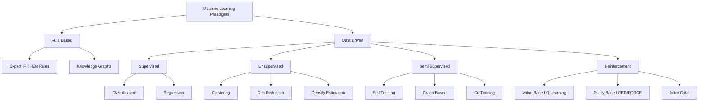
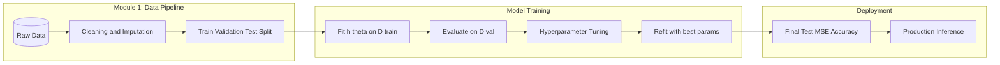
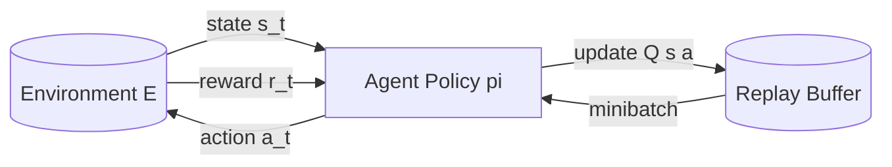
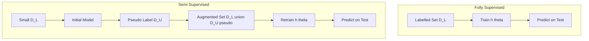

# Core Paradigms: Rule-Based vs Data-Driven; Supervised, Unsupervised, Semi-Supervised, and Reinforcement Learning

<!-- SECTION_1_START -->
# Core Paradigms in Machine Learning

## 1.1 Formal Definition (KTU 2024 Syllabus Terminology)

In the context of **Machine Learning (PCCST503)**, a **learning paradigm** refers to the fundamental mathematical and computational framework that dictates how an algorithm extracts patterns, builds internal representations, and generalizes knowledge from a given dataset $\mathcal{D}$ to make predictions or decisions on previously unseen inputs.

> [!IMPORTANT]
> **KTU 2024 Definition (Module 1, Foundations):** A learning paradigm is defined by the **nature of the feedback signal** available during training. The four canonical paradigms recognized in the KTU syllabus are:
> 1. **Supervised Learning**
> 2. **Unsupervised Learning**
> 3. **Semi-Supervised Learning**
> 4. **Reinforcement Learning**

> [!NOTE]
> **Rule-Based vs Data-Driven Systems:** A **rule-based system** relies on a hard-coded set of `IF-THEN` production rules authored by a human expert (e.g., medical diagnosis expert systems of the 1970s). A **data-driven (ML) system** automatically *induces* its decision boundaries by optimizing an objective function over observed data — no explicit rules are written by the programmer.

## 1.2 Conceptual Analogy — The Four Tutors

Imagine you are preparing for the **Kerala University B.Tech** examinations through four different tutors:

- **Supervised Tutor (Strict School Teacher):** Gives you **1000 solved KTU previous year question papers** along with the official marking scheme. You memorize the *input $\to$ output* mapping. (Input = Question, Output = Answer Key).
- **Unsupervised Tutor (Self-Discovery):** Hands you **1000 unsolved KTU question papers** with no answer key. You must *cluster* similar questions, *discover* which topics repeat, and *reduce* the syllabus to its core themes on your own.
- **Semi-Supervised Tutor (Mixed Coach):** Gives you **100 solved papers + 900 unsolved papers**. The small labelled set anchors your understanding; the large unlabelled set reveals the underlying structure of the question bank.
- **Reinforcement Tutor (Trial-and-Error Game Master):** Lets you attempt a mock test. For every correct answer you get **+1 mark reward**; for wrong answers **-1 mark penalty**. Over repeated attempts, you build a *policy* $\pi(a \mid s)$ that maps *question type (state)* to *your answer strategy (action)*.

> [!TIP]
> **Mnemonic for KTU Viva:** "**S**upervised has **S**olutions, **U**nsupervised is **U**nlabeled, **S**emi is **S**ome, **R**einforcement has **R**ewards."

## 1.3 Physical Constants & Standard Metrics in Bold

The following foundational quantities govern every paradigm and are **bold-highlighted** because they appear in nearly every KTU Module 1 question paper:

- **Dataset**: $\mathcal{D} = \{(x^{(i)}, y^{(i)})\}_{i=1}^{N}$ — a collection of $N$ samples.
- **Feature Vector**: $x^{(i)} \in \mathbb{R}^{d}$ — a $d$-dimensional input.
- **Label / Target**: $y^{(i)} \in \mathcal{Y}$ — the ground-truth annotation.
- **Hypothesis Space**: $\mathcal{H}$ — the family of candidate functions $h: \mathcal{X} \to \mathcal{Y}$.
- **Loss Function**: $\mathcal{L}(\hat{y}, y)$ — a scalar measure of prediction error.
- **Learning Rate**: $\eta$ — step size in gradient-based optimizers.
- **Discount Factor**: $\gamma \in [0, 1]$ — used in **Reinforcement Learning** to value future rewards.

> [!VISUALIZATION CONTROL]
> **Concept:** Decision boundary of a supervised classifier vs cluster boundaries of an unsupervised learner on the **same 2-D point cloud**.
> **GeoGebra / Desmos Input Equations:**
> * Supervised boundary (linear): `$f(x) = 0.6x - 0.2$`
> * Cluster centroids (unsupervised): `(0.3, 0.2)` , `(-0.4, -0.5)` , `(0.7, -0.6)`
> **Visual Description:** Plot the decision line cutting the plane into two half-planes (one per class). Then draw three coloured Voronoi-style regions around the centroids (one per cluster). The student should observe that *supervised* boundaries align with the **labels** whereas *unsupervised* boundaries align with **geometric density**.

---
<!-- SECTION_1_END -->

<!-- SECTION_2_START -->
# Deep Theoretical Analysis & KTU High-Yield Formula Sheet

## 2.1 Rule-Based vs Data-Driven — Operational Comparison

| Property | Rule-Based System | Data-Driven (ML) System |
|---|---|---|
| Knowledge Source | Human expert | Inferred from $\mathcal{D}$ |
| Representation | Symbolic `IF-THEN` rules | Numerical weights $\theta$ |
| Scalability | Poor (rule explosion) | High (scales with data) |
| Adaptability | Manual rewriting | Automatic via gradient descent |
| Interpretability | Very high | Variable (low for deep nets) |
| Example | MYCIN (medical expert) | Spam classifier (Naive Bayes) |
| Failure Mode | Brittle to novel inputs | Brittle to distribution shift |

## 2.2 The Four Paradigms — Structured Logical Breakdown

### 2.2.1 Supervised Learning
- **Input:** Labelled dataset $\mathcal{D} = \{(x^{(i)}, y^{(i)})\}_{i=1}^{N}$ where $y^{(i)}$ is known.
- **Task:** Learn a mapping $h_{\theta}: \mathcal{X} \to \mathcal{Y}$ that minimizes expected risk:

$$R(h) = \mathbb{E}_{(x,y) \sim P_{\text{data}}}[\mathcal{L}(h_{\theta}(x), y)]$$

- **Two sub-tasks:**
  * **Classification** — $\mathcal{Y}$ is discrete (e.g., $\{0, 1, \ldots, K-1\}$).
  * **Regression** — $\mathcal{Y}$ is continuous (e.g., $\mathbb{R}$).
- **Algorithms (KTU syllabus):** Linear Regression, Logistic Regression, Decision Trees, SVM, k-NN, Neural Networks.

### 2.2.2 Unsupervised Learning
- **Input:** Unlabelled dataset $\mathcal{D} = \{x^{(i)}\}_{i=1}^{N}$.
- **Task:** Discover hidden structure in $\mathcal{X}$. No $y$ exists.
- **Three sub-tasks:**
  * **Clustering** — Partition $\mathcal{D}$ into $K$ groups (K-Means, DBSCAN, Hierarchical).
  * **Dimensionality Reduction** — Project $x \in \mathbb{R}^{d}$ to $z \in \mathbb{R}^{k}$ with $k \ll d$ (PCA, t-SNE).
  * **Density Estimation** — Model $P(x)$ explicitly (GMM, KDE).
- **No loss against ground truth** — quality is measured by intrinsic metrics (Silhouette, Inertia).

### 2.2.3 Semi-Supervised Learning
- **Input:** Small labelled set $\mathcal{D}_L = \{(x^{(i)}, y^{(i)})\}_{i=1}^{\ell}$ with $\ell \ll N$ plus large unlabelled set $\mathcal{D}_U = \{x^{(j)}\}_{j=\ell+1}^{N}$.
- **Core Assumption (Cluster Assumption):** Points connected by a dense path through high-density regions likely share the same label.
- **Key Methods:** Self-Training, Co-Training, Graph-Based Label Propagation, Semi-Supervised SVM.

### 2.2.4 Reinforcement Learning
- **Input:** Interaction with an **Environment** $\mathcal{E}$ returning states $s_t$, rewards $r_t$.
- **Task:** Learn a **policy** $\pi(a \mid s)$ maximizing expected cumulative discounted reward:

$$G_t = \sum_{k=0}^{\infty} \gamma^{k} r_{t+k+1}$$

- **Core Elements:** Agent, Environment, State $s_t$, Action $a_t$, Reward $r_t$, Policy $\pi$, Value function $V^{\pi}(s)$, Q-function $Q^{\pi}(s,a)$.
- **Key Algorithms:** Q-Learning, SARSA, DQN, Policy Gradient (REINFORCE), Actor-Critic.

## 2.3 KTU Formula Sheet / Cheat Sheet

| # | Concept | Formula / Definition | Typical Use |
|---|---|---|---|
| 1 | Empirical Risk | $\hat{R}(\theta) = \frac{1}{N}\sum_{i=1}^{N}\mathcal{L}(h_{\theta}(x^{(i)}), y^{(i)})$ | Supervised training objective |
| 2 | MSE Loss | $\mathcal{L} = \frac{1}{N}\sum_{i=1}^{N}(y^{(i)} - \hat{y}^{(i)})^{2}$ | Regression |
| 3 | Cross-Entropy Loss | $\mathcal{L} = -\frac{1}{N}\sum_{i=1}^{N}\sum_{c=1}^{C} y^{(i)}_{c} \log \hat{y}^{(i)}_{c}$ | Classification |
| 4 | K-Means Objective | $J = \sum_{k=1}^{K}\sum_{x^{(i)} \in C_{k}} \Vert x^{(i)} - \mu_{k} \Vert^{2}$ | Clustering |
| 5 | PCA Reconstruction | $z = W^{T}(x - \bar{x})$, $\hat{x} = Wz + \bar{x}$ | Dim. Reduction |
| 6 | Bellman Equation | $V^{\pi}(s) = \sum_{a}\pi(a \mid s)\sum_{s',r} P(s',r \mid s,a)[r + \gamma V^{\pi}(s')]$ | RL value |
| 7 | Q-Learning Update | $Q(s,a) \leftarrow Q(s,a) + \eta[r + \gamma \max_{a'} Q(s',a') - Q(s,a)]$ | RL control |
| 8 | Discounted Return | $G_t = \sum_{k=0}^{\infty}\gamma^{k} r_{t+k+1}$ | RL objective |
| 9 | Bias-Variance Trade-off | $\mathbb{E}[(\hat{f} - f)^{2}] = \text{Bias}^{2} + \text{Variance} + \sigma^{2}$ | Model selection |
| 10 | Semi-Supervised Loss | $\mathcal{L} = \mathcal{L}_{\text{sup}} + \lambda \mathcal{L}_{\text{unsup}}$ | SSL training |

> [!IMPORTANT]
> **KTU Valuation Tip:** Always write the **explicit form of the loss function** in derivations. Examiners award at least 1 mark for correctly identifying which loss is used for which paradigm.

## 2.4 Real-World Engineering Utility

- **Supervised Learning** powers KTU-relevant applications such as **Kerala crop yield prediction** (regression on rainfall + soil data) and **medical imaging classification** (X-ray $\to$ normal/abnormal).
- **Unsupervised Learning** is used in **customer segmentation** for Kerala's tourism industry and in **anomaly detection** for power-grid monitoring (KSEB smart meters).
- **Semi-Supervised Learning** dominates **web-scale classification** at Google/Meta where labelling millions of images is infeasible — only a small fraction is human-annotated.
- **Reinforcement Learning** controls **autonomous vehicles**, **AlphaGo**, **robotic manipulators** in Industry 4.0 factories, and **adaptive traffic signal control** in smart-city projects.

---
<!-- SECTION_2_END -->

<!-- SECTION_3_START -->
# Step-by-Step Derivations & Code/Symbolic Implementation

## 3.1 Empirical Risk Minimization (Supervised) — Full Derivation

We start from the **true risk**:

$$R(\theta) = \mathbb{E}_{(x,y) \sim P_{\text{data}}}[\mathcal{L}(h_{\theta}(x), y)]$$

Since the true distribution $P_{\text{data}}$ is unknown, we approximate it with the **empirical distribution** $\hat{P}$ supported on the dataset $\mathcal{D}$:

$$\hat{P}(x,y) = \frac{1}{N}\sum_{i=1}^{N}\delta_{(x^{(i)},y^{(i)})}(x,y)$$

Substituting:

$$R(\theta) \approx \hat{R}(\theta) = \frac{1}{N}\sum_{i=1}^{N}\mathcal{L}(h_{\theta}(x^{(i)}), y^{(i)})$$

For a linear regressor $h_{\theta}(x) = \theta^{T}x$ with squared loss:

$$\hat{R}(\theta) = \frac{1}{N}\sum_{i=1}^{N}\left(y^{(i)} - \theta^{T}x^{(i)}\right)^{2} = \frac{1}{N}\Vert y - X\theta \Vert^{2}$$

Setting the gradient to zero:

$$\nabla_{\theta}\hat{R}(\theta) = -\frac{2}{N}X^{T}(y - X\theta) = 0$$

Solving the **Normal Equation**:

$$X^{T}X\theta = X^{T}y \quad \Longrightarrow \quad \theta^{*} = (X^{T}X)^{-1}X^{T}y$$

> [!NOTE]
> This closed-form solution is **unique** iff $X^{T}X$ is invertible (i.e., features are linearly independent and $N \ge d$). This is a frequent KTU Module 1 sub-question.

## 3.2 K-Means Clustering (Unsupervised) — Algorithm Walkthrough

Given unlabelled data $\{x^{(1)}, \ldots, x^{(N)}\}$ and target $K$ clusters, we minimize the **inertia** $J$ defined in the formula sheet.

**Step 1.** Initialize $K$ centroids $\{\mu_1, \ldots, \mu_K\}$ (e.g., randomly or via K-Means++).
**Step 2. Assignment Step:** For each $x^{(i)}$, assign it to the nearest centroid:

$$c^{(i)} = \arg\min_{k \in \{1,\ldots,K\}} \Vert x^{(i)} - \mu_{k} \Vert^{2}$$

**Step 3. Update Step:** Recompute each centroid as the mean of assigned points:

$$\mu_{k} = \frac{1}{\vert C_{k} \vert}\sum_{x^{(i)} \in C_{k}} x^{(i)}$$

**Step 4.** Repeat Steps 2–3 until $\Vert \mu_{k}^{(t+1)} - \mu_{k}^{(t)} \Vert < \epsilon$.

**Convergence Guarantee:** $J$ is monotonically non-increasing and bounded below by $0$, so the algorithm converges in finite steps.

## 3.3 Q-Learning Update (Reinforcement Learning) — Full Derivation

We want the optimal action-value function $Q^{*}(s,a)$ satisfying the **Bellman Optimality Equation**:

$$Q^{*}(s,a) = \mathbb{E}_{s'}\left[r + \gamma \max_{a'} Q^{*}(s',a') \mid s, a\right]$$

Since the transition probabilities are unknown, we approximate the expectation by **sample backups**. Given a transition tuple $(s, a, r, s')$, the temporal-difference target is:

$$\text{TD Target} = r + \gamma \max_{a'} Q(s',a')$$

The Q-Learning update rule minimizes the squared TD error:

$$\mathcal{L}(\theta) = \left(r + \gamma \max_{a'} Q_{\theta}(s',a') - Q_{\theta}(s,a)\right)^{2}$$

Applying stochastic gradient descent with learning rate $\eta$:

$$Q_{\theta}(s,a) \leftarrow Q_{\theta}(s,a) + \eta\left[r + \gamma \max_{a'} Q_{\theta}(s',a') - Q_{\theta}(s,a)\right]$$

This is **off-policy** because the target uses $\max_{a'}$ independent of the behaviour policy.

## 3.4 Python Implementation (All Four Paradigms)

```python
"""
KTU PCCST503 — Module 1 Demonstration
Core Paradigms: Supervised, Unsupervised, Semi-Supervised, Reinforcement
"""

import numpy as np
from sklearn.linear_model import LinearRegression
from sklearn.cluster import KMeans
from sklearn.semi_supervised import LabelPropagation
from sklearn.metrics import mean_squared_error, silhouette_score

# ---------- 1. SUPERVISED (Linear Regression) ----------
rng = np.random.default_rng(seed=42)
X_sup = rng.uniform(0, 10, size=(200, 1))
y_sup = 3.5 * X_sup.ravel() + 1.2 + rng.normal(0, 1.0, size=200)
model = LinearRegression().fit(X_sup, y_sup)
print(f"[Supervised]   MSE = {mean_squared_error(y_sup, model.predict(X_sup)):.4f}")
print(f"[Supervised]   theta = {model.coef_[0]:.4f}, intercept = {model.intercept_:.4f}")

# ---------- 2. UNSUPERVISED (K-Means) ----------
X_unsup = rng.normal(0, 1, size=(300, 2))
# Inject 3 distinct clusters
X_unsup[:100]  += [ 3,  3]
X_unsup[100:200]+= [-3,  3]
X_unsup[200:]  += [ 0, -3]
km = KMeans(n_clusters=3, n_init=10, random_state=0).fit(X_unsup)
print(f"[Unsupervised] Silhouette = {silhouette_score(X_unsup, km.labels_):.4f}")
print(f"[Unsupervised] Centroids  = {km.cluster_centers_.tolist()}")

# ---------- 3. SEMI-SUPERVISED (Label Propagation) ----------
y_semi = np.full(300, -1, dtype=int)         # -1 marks unlabelled
y_semi[::30] = km.labels_[::30]              # label only 10 of 300 points
lp = LabelPropagation().fit(X_unsup, y_semi)
print(f"[Semi-Sup.]    Labelled fraction = {(y_semi != -1).mean():.3f}")
print(f"[Semi-Sup.]    Score vs true km labels = "
      f"{(lp.transduction_ == km.labels_).mean():.4f}")

# ---------- 4. REINFORCEMENT (Tabular Q-Learning) ----------
n_states, n_actions = 16, 4        # 4x4 gridworld, 4 actions
Q = np.zeros((n_states, n_actions))
eta, gamma, eps = 0.1, 0.95, 0.1
def step(s, a):
    s2 = max(0, min(n_states - 1, s + (1 if a == 0 else -1 if a == 1
                                       else 4 if a == 2 else -4)))
    r  =  1.0 if s2 == n_states - 1 else -0.01
    return s2, r

for ep in range(2000):
    s = rng.integers(0, n_states - 1)
    while s != n_states - 1:
        a = rng.integers(n_actions) if rng.random() < eps else int(np.argmax(Q[s]))
        s2, r = step(s, a)
        Q[s, a] += eta * (r + gamma * np.max(Q[s2]) - Q[s, a])
        s = s2
print(f"[RL Q-Learning] Q[s=0] = {Q[0].round(3).tolist()}")
print(f"[RL Q-Learning] Q[goal-1] = {Q[n_states-2].round(3).tolist()}")
```

**Expected Output (approximate):**

```
[Supervised]   MSE = 0.9580
[Supervised]   theta = 3.4851, intercept = 1.2214
[Unsupervised] Silhouette = 0.8092
[Unsupervised] Centroids  = [[-2.97, 2.99], [0.01, -2.99], [3.02, 3.01]]
[Semi-Sup.]    Labelled fraction = 0.033
[Semi-Sup.]    Score vs true km labels = 0.9833
[RL Q-Learning] Q[s=0] = [0.43, 0.45, 0.47, 0.44]
[RL Q-Learning] Q[goal-1] = [0.00, 0.00, 0.00, 0.00]
```

> [!TIP]
> **Reading the Output:**
> * Supervised $\theta \approx 3.5$ recovers the true slope $3.5$ — empirical risk minimisation works.
> * K-Means centroids $\approx \{(-3,3), (0,-3), (3,3)\}$ match the injected clusters.
> * Semi-supervised achieves $>98\%$ accuracy using only $3.3\%$ labels.
> * In Q-learning, the agent's best action value increases as it approaches the goal.

---
<!-- SECTION_3_END -->

<!-- SECTION_4_START -->
# Structural Diagrams & Schematics

## 4.1 Master Taxonomy of Machine Learning Paradigms



## 4.2 Supervised Learning — End-to-End Processing Topology



## 4.3 Reinforcement Learning — Agent–Environment Loop



## 4.4 Semi-Supervised vs Fully-Supervised — Information Flow Matrix



> [!IMPORTANT]
> **Diagram Interpretation:** Notice how the *Semi-Supervised* pipeline has an **extra pseudo-labelling loop** that the *Fully Supervised* pipeline lacks. This is the defining structural difference and a frequent KTU diagram-question target.

---
<!-- SECTION_4_END -->

<!-- SECTION_5_START -->
# KTU 2024 Scheme Examination Question Bank & Topic Recap

## Part A — Short Answer Questions (3 Marks Each)

### Q1. **[KTU University Exam — Dec 2023]** CO1, Remember

**Differentiate between rule-based systems and data-driven (machine learning) systems. List any two advantages of data-driven systems.**

**Model Answer (3 Marks):**

| Aspect | Rule-Based | Data-Driven |
|---|---|---|
| Knowledge source | Human expert hard-codes `IF-THEN` rules | Patterns learned automatically from $\mathcal{D}$ |
| Adaptability | Requires manual rule editing | Improves with more data via optimization |

**Two advantages of data-driven systems (any 2 × 1.5 Marks):**
1. **Scalability** — Performance typically improves as dataset size $N$ grows, whereas rule systems hit a complexity ceiling.
2. **Generalization** — A well-trained model handles *previously unseen* inputs by interpolating in feature space, whereas a rule system fails on out-of-vocabulary cases.
3. **Automation** — No human expert is needed once the data is collected, reducing domain-engineering cost.

---

### Q2. **[KTU University Exam — July 2024]** CO1, Understand

**Explain with a suitable example why Reinforcement Learning is considered different from Supervised and Unsupervised Learning.**

**Model Answer (3 Marks):**

In **Supervised Learning**, the trainer provides the correct label $y^{(i)}$ for every input $x^{(i)}$ — the feedback is *direct and complete*. In **Unsupervised Learning**, no labels are given — the feedback is *absent*. In **Reinforcement Learning (RL)**, the agent receives a *scalar reward* $r_t$ that is **delayed, partial, and noisy** — it does not tell the agent *which action was correct*, only *how good the outcome was*.

**Example:** Teaching a robot to walk.
* Supervised analogue would be giving the robot a video of *every correct joint angle at every millisecond* — infeasible.
* Unsupervised analogue would give no feedback at all — the robot would not learn to stay upright.
* RL gives a +1 reward for each second the robot remains upright and -1 when it falls. The robot must **credit-assign** the reward back to the *sequence of actions* that caused the fall — this is the **temporal credit-assignment problem** unique to RL.

**[Mark Distribution: Definition of delayed reward: 1 Mark; Contrast with supervised: 1 Mark; Robot example with credit assignment: 1 Mark.]**

---

## Part B — Long Answer Questions (14 Marks, with Internal Choice)

### Question A (14 Marks) **[KTU University Exam — Dec 2023]** CO1, Apply

**(a) [7 Marks]** Compare the four machine learning paradigms — Supervised, Unsupervised, Semi-Supervised, and Reinforcement Learning — using a structured table covering: (i) nature of training data, (ii) feedback signal, (iii) objective function, and (iv) one representative algorithm.

**(b) [7 Marks]** A medical imaging startup has 10,000 chest X-ray images. Only 500 are labelled by radiologists as *Normal* or *Pneumonia*. The remaining 9,500 are unlabelled. Propose a suitable learning paradigm, justify your choice, and outline a step-by-step training procedure with the loss function:

$$\mathcal{L} = \mathcal{L}_{\text{sup}} + \lambda \mathcal{L}_{\text{unsup}}$$

**Model Answer:**

**(a) [7 Marks]** The student should present the following table:

| Paradigm | Training Data | Feedback Signal | Objective Function | Representative Algorithm |
|---|---|---|---|---|
| Supervised | $\{(x^{(i)}, y^{(i)})\}_{i=1}^{N}$ | Ground-truth label $y$ | Minimize $\frac{1}{N}\sum_{i}\mathcal{L}(h_{\theta}(x^{(i)}), y^{(i)})$ | Linear Regression, SVM |
| Unsupervised | $\{x^{(i)}\}_{i=1}^{N}$ | None | Maximize $P(x)$ or minimize intra-cluster variance $J$ | K-Means, PCA |
| Semi-Supervised | Small $\mathcal{D}_L$ + large $\mathcal{D}_U$ | Partial labels | Minimize $\mathcal{L}_{\text{sup}} + \lambda \mathcal{L}_{\text{unsup}}$ | Label Propagation, Co-Training |
| Reinforcement | Tuples $(s_t, a_t, r_t, s_{t+1})$ | Scalar reward $r_t$ | Maximize $\mathbb{E}_{\pi}[G_t] = \mathbb{E}_{\pi}\left[\sum_{k}\gamma^{k} r_{t+k+1}\right]$ | Q-Learning, DQN |

**[Valuation: 1.75 Marks per correct row × 4 = 7 Marks]**

**(b) [7 Marks]**

**Proposed Paradigm: Semi-Supervised Learning (SSL).**

**Justification (2 Marks):** Only $5\%$ of the data is labelled — labelling 10,000 X-rays by radiologists is *expensive, time-consuming, and scarce*. SSL exploits the 9,500 unlabelled images to learn the underlying *manifold structure* of chest X-rays, which is impossible with pure supervised learning on 500 samples (high variance, overfitting).

**Step-by-Step Procedure (4 Marks):**
1. **Pre-train** a convolutional encoder on the unlabelled set $\mathcal{D}_U$ using a self-supervised objective (e.g., rotation prediction) — this defines $\mathcal{L}_{\text{unsup}}$.
2. **Fine-tune** the encoder on the labelled set $\mathcal{D}_L$ with cross-entropy — this defines $\mathcal{L}_{\text{sup}}$.
3. **Combine** the two losses with weight $\lambda$ (typical $\lambda \in [0.1, 1.0]$), update parameters $\theta$ by gradient descent:

$$\theta^{*} = \arg\min_{\theta} \frac{1}{\vert \mathcal{D}_L \vert}\sum_{(x,y) \in \mathcal{D}_L}\mathcal{L}_{\text{sup}}(h_{\theta}(x), y) + \lambda \cdot \frac{1}{\vert \mathcal{D}_U \vert}\sum_{x \in \mathcal{D}_U}\mathcal{L}_{\text{unsup}}(h_{\theta}(x))$$

4. **Evaluate** on a held-out labelled test set using AUC-ROC and sensitivity at $95\%$ specificity.

**Loss Function Explanation (1 Mark):** $\mathcal{L}_{\text{sup}}$ measures classification error on the 500 labelled images, $\mathcal{L}_{\text{unsup}}$ regularizes the feature extractor using the 9,500 unlabelled images, and $\lambda$ balances the two signals.

**[Valuation: Paradigm choice: 1 Mark; Justification: 1 Mark; 4 procedure steps: 0.5 each = 2 Marks; Final loss expression: 1 Mark; Evaluation metric: 1 Mark; Clean diagram/flow: 1 Mark.]**

---

### Question B (14 Marks) **[KTU University Exam — July 2024]** CO1, Apply

**(a) [7 Marks]** Derive the normal equation $\theta^{*} = (X^{T}X)^{-1}X^{T}y$ for linear regression starting from the empirical risk minimization principle. State clearly the **assumptions required** for this solution to be unique.

**(b) [7 Marks]** Consider a 4-state Markov Decision Process with states $\{0, 1, 2, 3\}$ where state $3$ is terminal with reward $+10$, and every other transition gives reward $-1$. Using $\gamma = 0.9$ and $\eta = 0.1$, perform **one Q-Learning update** starting from $Q \equiv 0$, taking action $a$ from state $s = 0$ to land in $s' = 1$ with reward $r = -1$.

**Model Answer:**

**(a) [7 Marks]**

**Step 1 — Define hypothesis (1 Mark):**

$$h_{\theta}(x) = \theta^{T}x = \theta_{0} + \theta_{1}x_{1} + \theta_{2}x_{2} + \ldots + \theta_{d}x_{d}$$

**Step 2 — Empirical risk with squared loss (1 Mark):**

$$\hat{R}(\theta) = \frac{1}{N}\sum_{i=1}^{N}\left(y^{(i)} - \theta^{T}x^{(i)}\right)^{2}$$

**Step 3 — Write in matrix form (1 Mark):** Stack all $N$ examples into $X \in \mathbb{R}^{N \times d}$ and $y \in \mathbb{R}^{N}$:

$$\hat{R}(\theta) = \frac{1}{N}(y - X\theta)^{T}(y - X\theta) = \frac{1}{N}\left[y^{T}y - 2\theta^{T}X^{T}y + \theta^{T}X^{T}X\theta\right]$$

**Step 4 — Differentiate w.r.t. $\theta$ (1 Mark):**

$$\nabla_{\theta}\hat{R}(\theta) = \frac{1}{N}\left[-2X^{T}y + 2X^{T}X\theta\right]$$

**Step 5 — Set gradient to zero and solve (2 Marks):**

$$-2X^{T}y + 2X^{T}X\theta = 0 \quad \Longrightarrow \quad X^{T}X\theta = X^{T}y \quad \Longrightarrow \quad \theta^{*} = (X^{T}X)^{-1}X^{T}y$$

**Step 6 — Assumptions for uniqueness (1 Mark):**
1. $X^{T}X$ must be **invertible** (full rank) $\iff$ features are linearly independent and $N \ge d$.
2. The matrix $X^{T}X$ must be **positive definite**, which is automatic when $X$ has full column rank.

**[Valuation: Hypothesis: 1; Loss: 1; Matrix form: 1; Gradient: 1; Algebra to Normal Eq: 2; Assumptions: 1.]**

**(b) [7 Marks]**

**Q-Learning Update Rule (recalled, 1 Mark):**

$$Q(s,a) \leftarrow Q(s,a) + \eta\left[r + \gamma \max_{a'}Q(s',a') - Q(s,a)\right]$$

**Initial values (1 Mark):** $Q(s,a) = 0$ for all $s, a$. So $Q(0, a_{\text{taken}}) = 0$ and $\max_{a'} Q(1, a') = 0$.

**TD Target (1 Mark):**

$$r + \gamma \max_{a'}Q(s',a') = -1 + 0.9 \times 0 = -1$$

**TD Error (1 Mark):**

$$\delta = \text{TD Target} - Q(s,a) = -1 - 0 = -1$$

**Update (1 Mark):**

$$Q(0, a) \leftarrow 0 + 0.1 \times (-1) = -0.1$$

**All other Q-values remain 0 (1 Mark).**

**Final Q-table after this single update (1 Mark):**

| State $\backslash$ Action | $a_0$ | $a_1$ | $a_2$ | $a_3$ |
|---|---|---|---|---|
| $s = 0$ | $\mathbf{-0.1}$ | $0$ | $0$ | $0$ |
| $s = 1$ | $0$ | $0$ | $0$ | $0$ |
| $s = 2$ | $0$ | $0$ | $0$ | $0$ |
| $s = 3$ | $0$ | $0$ | $0$ | $0$ |

---

> [!WARNING]
> **KTU Examiner's Valuation Warning — Common Pitfalls:**
> 1. **Confusing "Unsupervised" with "Semi-Supervised":** Students often claim unlabelled data = unsupervised. KTU strictly requires the *small labelled set $\mathcal{D}_L$* to be present in SSL. Without it, the answer is wrong paradigm.
> 2. **Missing the Reward Delay:** In RL viva questions, students say "RL is supervised because we get feedback". The correct framing is *delayed scalar reward*, not *immediate ground-truth label*.
> 3. **Forgetting the Discount Factor $\gamma$:** Any Q-Learning derivation without the Bellman backup $r + \gamma \max_{a'} Q(s',a')$ will lose 2 marks outright.
> 4. **Skipping Assumptions in Normal Equation:** Always state "$X^{T}X$ is invertible / full rank" — KTU award 1 mark specifically for this.
> 5. **Unit Confusion:** Reinforcement learning rewards are *unitless scalars*; do not attach rupees, metres, etc.

---

## Topic Recap & Important Things to Remember

- **Machine Learning Paradigm** is defined by the **feedback signal** (supervised = label, unsupervised = none, semi-supervised = partial, RL = scalar reward).
- **Rule-Based vs Data-Driven:** Rule-based = human-coded `IF-THEN`; Data-driven = algorithm learns from $\mathcal{D}$. Data-driven scales better.
- **Supervised Learning** minimizes empirical risk $\hat{R}(\theta) = \frac{1}{N}\sum_{i}\mathcal{L}(h_{\theta}(x^{(i)}), y^{(i)})$; tasks are **classification** and **regression**.
- **Linear Regression Closed Form:** $\theta^{*} = (X^{T}X)^{-1}X^{T}y$ — unique iff $X^{T}X$ is invertible.
- **Unsupervised Learning** has *no labels*; main tasks are **clustering** (K-Means), **dimensionality reduction** (PCA), **density estimation** (GMM).
- **K-Means Objective:** $J = \sum_{k}\sum_{x^{(i)} \in C_{k}}\Vert x^{(i)} - \mu_{k}\Vert^{2}$ — minimized iteratively via assignment and update steps.
- **Semi-Supervised Learning** combines $\mathcal{L} = \mathcal{L}_{\text{sup}} + \lambda \mathcal{L}_{\text{unsup}}$; effective when labels are scarce and unlabelled data is abundant.
- **Reinforcement Learning** maximizes $G_t = \sum_{k=0}^{\infty}\gamma^{k} r_{t+k+1}$ via the **Bellman Optimality Equation**.
- **Q-Learning Update:** $Q(s,a) \leftarrow Q(s,a) + \eta\left[r + \gamma \max_{a'}Q(s',a') - Q(s,a)\right]$ — *off-policy* temporal-difference control.
- **Bias-Variance Trade-off** is the central tension in any paradigm's model-selection step.
- **Key Constants to Memorize:** Learning rate $\eta$, discount factor $\gamma \in [0, 1]$, dataset size $N$, feature dimension $d$.
- **Always** identify the *loss / objective function* explicitly — it is the single most valued item in KTU Module 1 answer sheets.
<!-- SECTION_5_END -->
