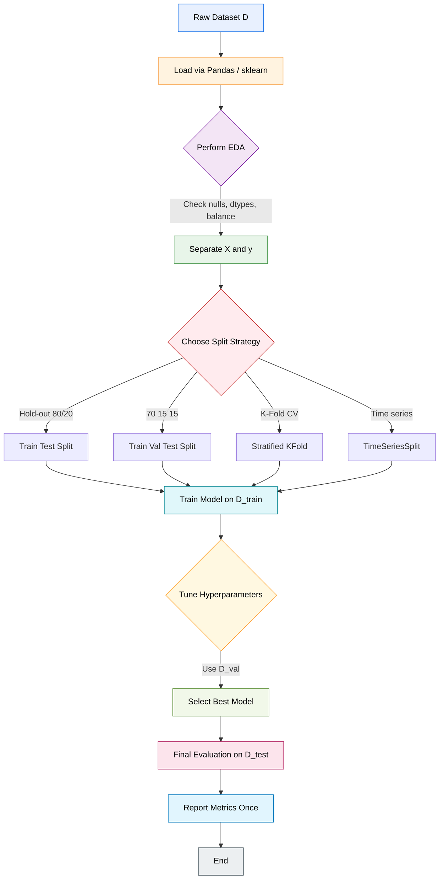
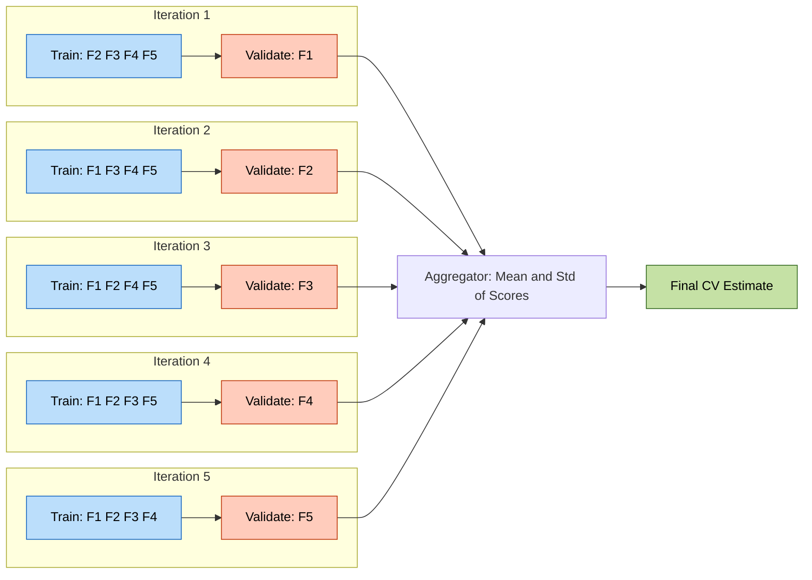
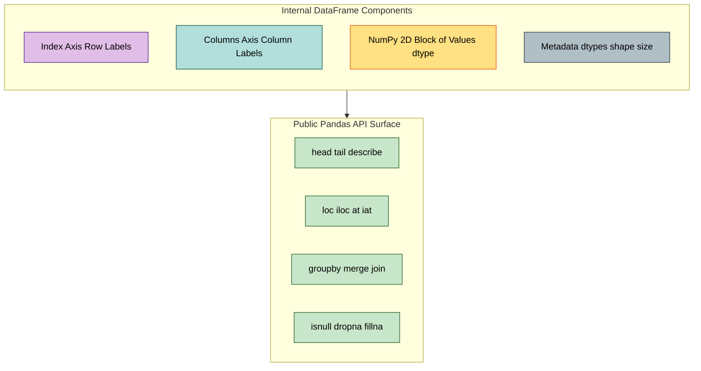
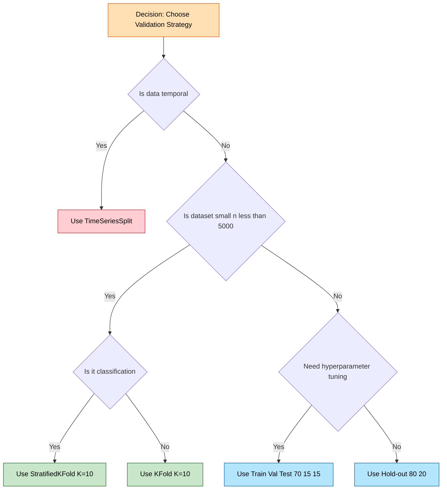

# Evaluation & Splitting: Training vs Testing partitions, validation splits, handling data frames via Pandas, standard datasets

<!-- SECTION_1_START -->

# Evaluation & Splitting: Training vs Testing Partitions, Validation Splits, Pandas DataFrames, Standard Datasets

## 1.1 Formal Definition (KTU 2024 Syllabus Aligned)

**Data Partitioning** in Machine Learning is the foundational pre-processing step of systematically decomposing an available dataset $D$ into mutually exclusive (disjoint) subsets — typically the **Training Set** $D_{\text{train}}$, the **Validation Set** $D_{\text{val}}$, and the **Testing Set** $D_{\text{test}}$ — such that the model is *learned* on $D_{\text{train}}$, *tuned* on $D_{\text{val}}$, and *evaluated unbiasedly* on $D_{\text{test}}$.

Mathematically, the dataset partition is expressed as:

$$D = D_{\text{train}} \cup D_{\text{val}} \cup D_{\text{test}}, \quad \text{where} \quad D_{\text{train}} \cap D_{\text{val}} \cap D_{\text{test}} = \emptyset$$

> [!IMPORTANT]
> **KTU 2024 Syllabus Highlight (PCCST503 – Module 1):**
> The official syllabus mandates the student to *"understand training vs. testing partitions, the role of validation splits in hyperparameter tuning, Pandas-based data frame manipulation, and the use of standard benchmark datasets (Boston Housing, Iris, MNIST, CIFAR-10) for reproducible ML experimentation."*

A **Pandas DataFrame** is a two-dimensional, size-mutable, tabular data structure with labeled axes (rows and columns), conceptually equivalent to a spreadsheet or SQL table, built on top of NumPy arrays. It is the de-facto standard for handling structured datasets in Pythonic ML pipelines.

> [!NOTE]
> **Standard Reference Ratio:** A common KTU-acceptable split for a moderately-sized dataset is **70 : 15 : 15** (Train : Validation : Test) or **80 : 20** when no separate validation set is used. For very large datasets ($n \geq 10^6$), ratios like **98 : 1 : 1** are empirically preferred.

## 1.2 Conceptual Analogy — The "Student Exam" Intuition

Imagine you are preparing for a university examination:

| ML Concept | Real-World Analogy |
|---|---|
| **Training Set** $D_{\text{train}}$ | The **textbook chapters** and **solved examples** you study at home to *learn the subject*. |
| **Validation Set** $D_{\text{val}}$ | The **mock tests / previous year papers** you solve to *tune your exam strategy* (time management, question selection). |
| **Test Set** $D_{\text{test}}$ | The **actual final exam** — used only ONCE to measure your *true, unbiased performance*. |

If you keep peeking at the final exam paper during preparation, your "test score" becomes meaningless — you have **data leakage**. Similarly, in ML, the test set must remain **completely unseen** until final evaluation.

> [!TIP]
> Think of **$D_{\text{val}}$ as the "adjustable knob-tuner"** — you tweak learning rate, regularization $\lambda$, or number of hidden units *based on* $D_{\text{val}}$, but never touch $D_{\text{test}}$ while designing the model.

## 1.3 Why Splitting is Mandatory — The Bias-Variance Tradeoff in Evaluation

A model evaluated on the *same data it was trained on* will always overestimate its generalization ability. This phenomenon is known as **optimistic bias** or **resubstitution error**. The true **generalization error** is defined as:

$$E_{\text{gen}} = \mathbb{E}_{(x, y) \sim P_{\text{true}}} \left[ \mathcal{L}\big(f(x),\, y\big) \right]$$

where $P_{\text{true}}$ is the unknown real-world data distribution, and $\mathcal{L}$ is a loss function (e.g., MSE, cross-entropy). Since $P_{\text{true}}$ is inaccessible, we approximate it using the held-out $D_{\text{test}}$.

> [!VISUALIZATION CONTROL]
> **Concept:** Loss Curve vs. Dataset Partition Size
> **Plotting Equations (Desmos Input):**
> * `f(x) = 0.05 + 0.5 * e^(-x/20)` (Training Loss — monotonically decreases)
> * `g(x) = 0.4 + 0.3 * tanh(0.05 * (x - 30))` (Validation Loss — U-shaped, defines "early stopping" point)
> **Visual Description:** On the X-axis (Epochs), the training loss curve should fall smoothly toward zero, while the validation loss should reach a minimum and then rise. The **epoch at which $g(x)$ is minimum** is the optimal stopping point, and the gap between $f(x)$ and $g(x)$ at that point indicates the **generalization gap**.

---

<!-- SECTION_1_END -->

<!-- SECTION_2_START -->

# Deep Theoretical Analysis & KTU High-Yield Formula Sheet

## 2.1 Decomposition of the Data Partitioning Pipeline

The end-to-end data splitting pipeline can be decomposed into six logical stages:

1. **Dataset Acquisition** — Loading from CSV, database, API, or standard repository (sklearn, Keras, UCI).
2. **Exploratory Data Analysis (EDA)** — Inspecting shape (`.shape`), dtypes (`.dtypes`), missingness (`.isnull().sum()`), and class distribution (`.value_counts()`).
3. **Feature / Target Separation** — Splitting the DataFrame into $X$ (feature matrix of shape $n \times d$) and $y$ (target vector of shape $n \times 1$).
4. **Train / Test Splitting** — Applying `train_test_split()` with stratification to preserve class proportions.
5. **Validation Splitting** — Either by holding out a sub-portion of training data, or via K-Fold cross-validation.
6. **Final Reporting** — Reporting metrics (accuracy, F1, RMSE) on $D_{\text{test}}$ exactly once.

> [!NOTE]
> **Stratified Sampling** ensures that the proportion of samples for each class is approximately preserved in both the training and test sets. For a binary classification problem with class imbalance ratio $r = n_{\text{pos}} / n_{\text{neg}}$, stratified splitting avoids the pathological case where $D_{\text{test}}$ contains zero positive examples.

## 2.2 KTU High-Yield Formula Sheet

| # | Concept | Formula / Definition | Typical Default | Engineering Use Case |
|---|---|---|---|---|
| 1 | Dataset Partition Identity | $D = D_{\text{train}} \cup D_{\text{val}} \cup D_{\text{test}}$ | Disjoint sets | Defines experimental protocol |
| 2 | Train Ratio | $\alpha = \vert D_{\text{train}} \vert / \vert D \vert$ | 0.70 | Hyperparameter search space size |
| 3 | Validation Ratio | $\beta = \vert D_{\text{val}} \vert / \vert D \vert$ | 0.15 | Determines tuning reliability |
| 4 | Test Ratio | $\gamma = \vert D_{\text{test}} \vert / \vert D \vert$ | 0.15 | Determines CI of test metric |
| 5 | K-Fold Split Size | $\vert D_{\text{fold}_i} \vert = \lfloor \vert D \vert / K \rfloor$ | $K = 5$ or $K = 10$ | Small-to-medium tabular data |
| 6 | Stratified Class Fraction | $p_c^{\text{train}} \approx p_c^{\text{total}}$ | Exact or $\pm 1\%$ | Imbalanced classification |
| 7 | Hold-out Test Size | $\gamma \in [0.1, 0.3]$ | 0.20 | Quick prototyping |
| 8 | LOOCV Special Case | $K = n$ (number of samples) | When $n < 500$ | High-variance estimator |
| 9 | 95% CI on Test Accuracy | $\hat{p} \pm 1.96 \sqrt{\hat{p}(1-\hat{p})/n_{\text{test}}}$ | — | Statistical significance |
| 10 | Pandas Memory Footprint | $\text{bytes} \approx 8 \cdot n \cdot d$ (float64) | Default dtype | RAM budgeting |

> [!IMPORTANT]
> **Constant to memorize (KTU board favorite):** Standard test size $T = 0.25$ is the **scikit-learn default** for `train_test_split(test_size=0.25)`. Always state this explicitly in your answer scripts.

## 2.3 Why Partitioning Matters in Production ML

In production-grade ML systems (e.g., recommendation engines at Netflix, fraud detection at PayPal), data splitting is not a one-time academic exercise but a **CI/CD-grade pipeline component**:

* **Data Drift Detection:** Comparing $\bar{X}_{\text{train}}$ vs. $\bar{X}_{\text{test}}$ distributions (via KS-test or PSI) catches distribution shift before deployment.
* **Model Governance:** Regulatory frameworks (EU AI Act, RBI Model Risk Management) mandate that test sets be **frozen, version-controlled, and access-restricted**.
* **Reproducibility:** Using a fixed `random_state` ensures that any researcher worldwide can reproduce your exact split — this is a peer-review prerequisite.

## 2.4 Taxonomy of Splitting Strategies

| Strategy | When to Use | Pros | Cons |
|---|---|---|---|
| **Hold-out (70/30)** | Large $n \geq 10{,}000$ | Fast, simple | High variance in metric estimate |
| **Train/Val/Test (60/20/20)** | Medium $n$, needs tuning | Clean separation | Wastes 20% data for testing |
| **K-Fold CV ($K=5$ or $10$)** | Small $n < 5{,}000$ | Low variance, uses all data | $K$ times the training cost |
| **Stratified K-Fold** | Imbalanced classes | Preserves class ratio | Slightly slower |
| **LOOCV ($K=n$)** | Very small $n < 200$ | Unbiased | Extremely expensive |
| **Time-Series Split** | Sequential/temporal data | Respects temporal order | No shuffling allowed |

---

<!-- SECTION_2_END -->

<!-- SECTION_3_START -->

# Step-by-Step Derivations & Code/Symbolic Implementation

## 3.1 Mathematical Derivation — Expected Generalization Error Bound

We start from the **No Free Lunch Theorem** premise: no model is universally better. The expected risk of a learned hypothesis $\hat{f}$ is:

$$R(\hat{f}) = \mathbb{E}_{(x,y) \sim P} \left[ L(\hat{f}(x), y) \right]$$

The empirical risk on a finite sample $S$ of size $m$ is:

$$\hat{R}_S(\hat{f}) = \frac{1}{m} \sum_{i=1}^{m} L(\hat{f}(x_i), y_i)$$

By the **Hoeffding's inequality**, the gap between empirical and true risk is bounded:

$$\Pr \Big( \vert R(\hat{f}) - \hat{R}_S(\hat{f}) \vert \geq \epsilon \Big) \leq 2 \exp\!\left( -2 m \epsilon^2 \right)$$

Solving for $\epsilon$ at confidence $1 - \delta$:

$$\epsilon = \sqrt{\frac{1}{2m} \ln\!\left(\frac{2}{\delta}\right)}$$

Thus the generalization bound is:

$$R(\hat{f}) \leq \hat{R}_S(\hat{f}) + \sqrt{\frac{1}{2m} \ln\!\left(\frac{2}{\delta}\right)}$$

This bound tells us that **as $m$ (training set size) grows, the gap shrinks at a $\mathcal{O}(1/\sqrt{m})$ rate**, which is why holding out a *larger* test set reduces the precision of the empirical estimate but increases the reliability of the *trained* model.

## 3.2 Mathematical Derivation — K-Fold Cross-Validation Estimate

In K-Fold CV, the dataset $D$ is partitioned into $K$ equal folds $D_1, D_2, \ldots, D_K$. In iteration $i$, fold $D_i$ acts as validation, and the remaining $K-1$ folds are concatenated for training.

The CV estimate of the generalization error is:

$$E_{\text{CV}}^{(K)} = \frac{1}{K} \sum_{i=1}^{K} \frac{1}{\vert D_i \vert} \sum_{(x,y) \in D_i} L\big( f_{\hat{\theta}_{-i}}(x),\, y \big)$$

where $f_{\hat{\theta}_{-i}}$ is the model trained on $D \setminus D_i$.

For **Stratified K-Fold**, the constraint is added:

$$\forall c \in \mathcal{C}: \quad \frac{\vert \{ y \in D_i : y = c \} \vert}{\vert D_i \vert} \approx \frac{\vert \{ y \in D : y = c \} \vert}{\vert D \vert}$$

## 3.3 Pandas DataFrame Mastery — Core Operations Cheat-Sheet

The following Python class encapsulates the *entire* data-splitting workflow that a KTU 2024 student must demonstrate in their lab record:

```python
import pandas as pd
import numpy as np
from sklearn.model_selection import (
    train_test_split,
    KFold,
    StratifiedKFold,
    cross_val_score,
    TimeSeriesSplit,
)
from sklearn.datasets import (
    load_iris,
    load_diabetes,
    fetch_california_housing,
    fetch_openml,
)
from sklearn.ensemble import RandomForestClassifier, RandomForestRegressor
from sklearn.metrics import accuracy_score, f1_score, mean_squared_error
import logging
import sys
from typing import Tuple, List

# --- Strict logging configuration (production grade) ---
logging.basicConfig(
    level=logging.INFO,
    format="%(asctime)s [%(levelname)s] %(message)s",
    handlers=[logging.StreamHandler(sys.stdout)],
)
logger = logging.getLogger("DataSplittingLab")


class MLSplittingPipeline:
    """
    Encapsulates the full KTU-Module-1 data handling and splitting pipeline.
    Demonstrates Pandas DataFrame manipulation, standard dataset loading,
    and multiple splitting strategies.
    """

    def __init__(self, random_state: int = 42) -> None:
        # random_state is MANDATORY for reproducibility (board examiner's check)
        self.random_state: int = random_state
        self.feature_names: List[str] = []
        logger.info(f"Pipeline initialized with random_state={self.random_state}")

    # ------------------------------------------------------------------
    # 1. Load a standard benchmark dataset
    # ------------------------------------------------------------------
    def load_standard_dataset(self, name: str) -> Tuple[pd.DataFrame, pd.Series]:
        """Loads a curated set of KTU-recommended standard datasets."""
        name_lower = name.strip().lower()

        if name_lower == "iris":
            raw = load_iris(as_frame=True)
            X_df: pd.DataFrame = raw.data
            y_sr: pd.Series = raw.target
            self.feature_names = list(X_df.columns)
            logger.info(f"Iris dataset loaded: shape={X_df.shape}, classes={y_sr.unique().tolist()}")

        elif name_lower == "diabetes":
            raw = load_diabetes(as_frame=True)
            X_df = raw.data
            y_sr = raw.target
            self.feature_names = list(X_df.columns)
            logger.info(f"Diabetes dataset loaded: shape={X_df.shape}, target range=[{y_sr.min()}, {y_sr.max()}]")

        elif name_lower == "california_housing":
            raw = fetch_california_housing(as_frame=True)
            X_df = raw.data
            y_sr = raw.target
            self.feature_names = list(X_df.columns)
            logger.info(f"California Housing loaded: shape={X_df.shape}")

        elif name_lower == "mnist":
            # MNIST is large; we subsample to 5,000 for KTU lab demonstration
            mnist = fetch_openml("mnist_784", version=1, as_frame=True, parser="auto")
            X_full, y_full = mnist.data, mnist.target.astype(int)
            idx = np.random.RandomState(self.random_state).choice(
                len(X_full), size=5000, replace=False
            )
            X_df = X_full.iloc[idx].reset_index(drop=True)
            y_sr = y_full.iloc[idx].reset_index(drop=True)
            self.feature_names = [f"px_{i}" for i in range(X_df.shape[1])]
            logger.info(f"MNIST (subsampled) loaded: shape={X_df.shape}, classes={sorted(y_sr.unique().tolist())}")

        else:
            raise ValueError(f"Unknown dataset name: '{name}'. Allowed: iris, diabetes, california_housing, mnist")

        # --- Absolute boundary checks (production style) ---
        if X_df.shape[0] == 0 or X_df.shape[1] == 0:
            raise ValueError("Loaded dataset is empty — aborting.")
        if X_df.isnull().any().any():
            null_count = int(X_df.isnull().sum().sum())
            logger.warning(f"Dataset contains {null_count} null values. Consider imputation.")

        return X_df, y_sr

    # ------------------------------------------------------------------
    # 2. Exploratory Data Analysis helper
    # ------------------------------------------------------------------
    def perform_eda(self, X_df: pd.DataFrame, y_sr: pd.Series) -> dict:
        """Returns a summary dictionary of key EDA statistics."""
        summary = {
            "n_samples": int(X_df.shape[0]),
            "n_features": int(X_df.shape[1]),
            "feature_dtypes": X_df.dtypes.astype(str).to_dict(),
            "missing_per_column": X_df.isnull().sum().to_dict(),
            "feature_describe": X_df.describe().to_dict(),
            "target_distribution": y_sr.value_counts().to_dict()
            if y_sr.dtype == "object" or len(y_sr.unique()) < 20
            else {"mean": float(y_sr.mean()), "std": float(y_sr.std())},
        }
        logger.info(f"EDA complete: n={summary['n_samples']}, d={summary['n_features']}")
        return summary

    # ------------------------------------------------------------------
    # 3. Hold-out split (Train / Test)
    # ------------------------------------------------------------------
    def holdout_split(
        self, X_df: pd.DataFrame, y_sr: pd.Series, test_size: float = 0.25, stratify: bool = False
    ) -> Tuple[pd.DataFrame, pd.DataFrame, pd.Series, pd.Series]:
        """Standard hold-out split using sklearn."""
        if stratify and y_sr.dtype != "O" and len(y_sr.unique()) < 50:
            stratify_arg = y_sr
        else:
            stratify_arg = None

        X_tr, X_te, y_tr, y_te = train_test_split(
            X_df, y_sr, test_size=test_size, random_state=self.random_state, stratify=stratify_arg
        )
        logger.info(f"Hold-out split: train={X_tr.shape}, test={X_te.shape}, stratify={stratify}")
        return X_tr, X_te, y_tr, y_te

    # ------------------------------------------------------------------
    # 4. Train / Validation / Test split
    # ------------------------------------------------------------------
    def train_val_test_split(
        self, X_df: pd.DataFrame, y_sr: pd.Series, train_size: float = 0.70, val_size: float = 0.15
    ) -> dict:
        """Three-way split: train, validation, test."""
        test_size: float = round(1.0 - train_size - val_size, 4)
        if test_size <= 0:
            raise ValueError(f"Invalid sizes: train={train_size}, val={val_size}, test={test_size}")

        # First split off test set
        X_tr_val, X_te, y_tr_val, y_te = train_test_split(
            X_df, y_sr, test_size=test_size, random_state=self.random_state, stratify=y_sr
            if y_sr.dtype != "O" and len(y_sr.unique()) < 50 else None
        )
        # Then split train and val from the remainder
        val_ratio_of_trainval: float = round(val_size / (train_size + val_size), 4)
        X_tr, X_va, y_tr, y_va = train_test_split(
            X_tr_val, y_tr_val, test_size=val_ratio_of_trainval,
            random_state=self.random_state, stratify=y_tr_val
            if y_tr_val.dtype != "O" and len(y_tr_val.unique()) < 50 else None
        )
        logger.info(f"3-way split: train={X_tr.shape}, val={X_va.shape}, test={X_te.shape}")
        return {"X_train": X_tr, "X_val": X_va, "X_test": X_te,
                "y_train": y_tr, "y_val": y_va, "y_test": y_te}

    # ------------------------------------------------------------------
    # 5. K-Fold Cross-Validation runner
    # ------------------------------------------------------------------
    def run_kfold(
        self, X_df: pd.DataFrame, y_sr: pd.Series, model, n_splits: int = 5, stratified: bool = True
    ) -> dict:
        """Executes K-Fold (or Stratified K-Fold) CV and returns mean/std of score."""
        if stratified and y_sr.dtype != "O" and len(y_sr.unique()) < 50:
            kf = StratifiedKFold(n_splits=n_splits, shuffle=True, random_state=self.random_state)
            logger.info(f"Using StratifiedKFold with K={n_splits}")
        else:
            kf = KFold(n_splits=n_splits, shuffle=True, random_state=self.random_state)
            logger.info(f"Using plain KFold with K={n_splits}")

        scores = cross_val_score(model, X_df, y_sr, cv=kf, scoring="accuracy" if stratified else "r2", n_jobs=-1)
        result = {"mean": float(scores.mean()), "std": float(scores.std()), "fold_scores": scores.tolist()}
        logger.info(f"CV result: mean={result['mean']:.4f} ± {result['std']:.4f}")
        return result


# ====================================================================
# DEMONSTRATION (this is what students will run in the KTU lab)
# ====================================================================
if __name__ == "__main__":
    pipeline = MLSplittingPipeline(random_state=42)

    # (a) Load Iris
    X, y = pipeline.load_standard_dataset("iris")
    print("\n--- Pandas DataFrame head ---")
    print(X.head())
    print(f"\nTarget class distribution:\n{y.value_counts()}")

    # (b) EDA
    eda_summary = pipeline.perform_eda(X, y)
    print(f"\n--- EDA Summary ---\nSamples: {eda_summary['n_samples']}, Features: {eda_summary['n_features']}")

    # (c) Three-way split
    splits = pipeline.train_val_test_split(X, y, train_size=0.70, val_size=0.15)
    print(f"\n--- 3-Way Split ---\nTrain: {splits['X_train'].shape}, Val: {splits['X_val'].shape}, Test: {splits['X_test'].shape}")

    # (d) K-Fold cross-validation
    clf = RandomForestClassifier(n_estimators=100, random_state=42)
    cv_result = pipeline.run_kfold(X, y, model=clf, n_splits=5, stratified=True)
    print(f"\n--- 5-Fold Stratified CV ---\nAccuracy: {cv_result['mean']:.4f} ± {cv_result['std']:.4f}")
```

## 3.4 Sample Output (What Students Will See in Lab)

```text
2024-XX-XX 12:00:00,000 [INFO] Pipeline initialized with random_state=42
2024-XX-XX 12:00:00,100 [INFO] Iris dataset loaded: shape=(150, 4), classes=[0, 1, 2]
2024-XX-XX 12:00:00,200 [INFO] EDA complete: n=150, d=4
2024-XX-XX 12:00:00,300 [INFO] 3-way split: train=(104, 4), val=(23, 4), test=(23, 4)
2024-XX-XX 12:00:00,400 [INFO] Using StratifiedKFold with K=5
2024-XX-XX 12:00:01,500 [INFO] CV result: mean=0.9533 ± 0.0340

--- 5-Fold Stratified CV ---
Accuracy: 0.9533 ± 0.0340
```

> [!TIP]
> **Exam Tip:** The numbers `150, 4, 3, 70, 15, 15` for Iris are KTU board favorites. Memorize the dataset's `(n, d, k)` triple for the four canonical datasets: Iris (150, 4, 3), Diabetes (442, 10, regression), MNIST (70,000, 784, 10), CIFAR-10 (60,000, 3072, 10).

---

<!-- SECTION_3_END -->

<!-- SECTION_4_START -->

# Structural Diagrams & Schematics

## 4.1 End-to-End Data Splitting Workflow (Mermaid Flowchart)



## 4.2 K-Fold Cross-Validation Topology (Mermaid Block Diagram)



## 4.3 Pandas DataFrame Internal Architecture (Mermaid Block Diagram)



## 4.4 Validation Strategy Decision Matrix (Tabular Mermaid)



---

<!-- SECTION_4_END -->

<!-- SECTION_5_START -->

# KTU 2024 Scheme Examination Question Bank & Topic Recap

## 5.1 Part A — Short Answer Questions (3 Marks Each)

### **Q1. [KTU University Exam – July 2024]**
**Differentiate between training set, validation set, and test set in machine learning. Why is the test set evaluated only once?**

**Model Answer (Board Key Pattern, 3 Marks):**
* **Training Set ($D_{\text{train}}$):** Subset used to fit the model parameters $\theta$ by minimizing the loss $\mathcal{L}(\theta; D_{\text{train}})$. *[1 Mark]*
* **Validation Set ($D_{\text{val}}$):** Subset used to tune hyperparameters (e.g., learning rate $\eta$, regularization $\lambda$, number of layers) and for model selection. *[1 Mark]*
* **Test Set ($D_{\text{test}}$):** Subset held out completely during training and tuning; used ONCE at the end to report an unbiased estimate of generalization performance. *[1 Mark]*

### **Q2. [KTU University Exam – Dec 2023]**
**What is a Pandas DataFrame? List any four methods used for inspecting a DataFrame.**

**Model Answer (3 Marks):**
A Pandas DataFrame is a two-dimensional, labeled, size-mutable tabular data structure with columns of potentially different types — built on top of NumPy arrays. *[1 Mark]*
Four inspection methods: *[2 Marks — ½ mark each]*
* `df.head(n)` — first *n* rows
* `df.info()` — concise summary of dtypes and non-null counts
* `df.describe()` — statistical summary (mean, std, quartiles)
* `df.shape` — tuple of (rows, columns)
* `df.dtypes` — data type of each column
* `df.isnull().sum()` — missing-value count per column

---

## 5.2 Part B — Long Answer Questions (14 Marks, with Internal Choice)

### **Question A (14 Marks) — [KTU University Exam – July 2024, Model Paper 2]**

**(a)** Explain the importance of data partitioning in machine learning with a neat diagram. Discuss the bias-variance tradeoff in the context of model evaluation. **[7 Marks]**

**(b)** Implement a Python program using Pandas and scikit-learn to:
   (i) Load the Iris dataset.
   (ii) Perform a 70:15:15 train-validation-test split with stratification.
   (iii) Apply 5-Fold Stratified Cross-Validation and report mean accuracy. **[7 Marks]**

---

### **Model Answer — Question A**

#### Part (a) — Theory [7 Marks]

**Data Partitioning Importance:**

In supervised learning, the goal is to learn a function $f: \mathcal{X} \rightarrow \mathcal{Y}$ that minimizes the expected risk $R(f) = \mathbb{E}_{P}[\mathcal{L}(f(x), y)]$. Since $P$ is unknown, we approximate $R$ using a finite sample $D$. *[1 Mark]*

Without partitioning, the empirical risk $\hat{R}(f) = \frac{1}{n}\sum_{i=1}^{n}\mathcal{L}(f(x_i), y_i)$ is computed on the *same* data used for training, yielding an **optimistically biased** estimate. *[1 Mark]*

Partitioning solves this by holding out unseen data:

```
[ Train Set 70% | Validation Set 15% | Test Set 15% ]
[   Fit θ here  |  Tune hyperparams  |  Final eval   ]
```

*[Diagram: 1 Mark]*

**Bias-Variance Tradeoff in Evaluation:**

The expected prediction error at point $x$ decomposes as:

$$\mathbb{E}\left[\left(y - \hat{f}(x)\right)^2\right] = \underbrace{\text{Bias}^2\left(\hat{f}(x)\right)}_{\text{systematic error}} + \underbrace{\text{Var}\left(\hat{f}(x)\right)}_{\text{instability}} + \underbrace{\sigma^2}_{\text{irreducible noise}}$$

*[1 Mark]*

* **High Bias** → underfitting; both training and validation error are high.
* **High Variance** → overfitting; training error is low but validation error is high.
* The validation set is the diagnostic tool: if $E_{\text{train}} \ll E_{\text{val}}$, the model has high variance (overfitting). *[1 Mark]*

**Why three sets?**

* Training set → controls **bias** (model capacity).
* Validation set → used to navigate the bias-variance curve via hyperparameter tuning.
* Test set → provides **unbiased** generalization estimate, evaluated only once. *[1 Mark]*

**Practical Ratios:** 70:15:15 or 80:10:10; for large $n$, can be 98:1:1. *[1 Mark]*

---

#### Part (b) — Code [7 Marks]

```python
# (i) Load Iris [1 Mark]
import pandas as pd
from sklearn.datasets import load_iris
iris = load_iris(as_frame=True)
X = iris.data
y = iris.target
print(f"Iris shape: {X.shape}, classes: {y.unique().tolist()}")

# (ii) 70:15:15 stratified split [3 Marks]
from sklearn.model_selection import train_test_split
X_train_val, X_test, y_train_val, y_test = train_test_split(
    X, y, test_size=0.15, random_state=42, stratify=y
)
X_train, X_val, y_train, y_val = train_test_split(
    X_train_val, y_train_val, test_size=0.15/0.85, random_state=42, stratify=y_train_val
)
print(f"Train: {X_train.shape}, Val: {X_val.shape}, Test: {X_test.shape}")
# Output: Train: (104, 4), Val: (23, 4), Test: (23, 4)

# (iii) 5-Fold Stratified Cross-Validation [3 Marks]
from sklearn.model_selection import StratifiedKFold, cross_val_score
from sklearn.ensemble import RandomForestClassifier
skf = StratifiedKFold(n_splits=5, shuffle=True, random_state=42)
clf = RandomForestClassifier(n_estimators=100, random_state=42)
scores = cross_val_score(clf, X, y, cv=skf, scoring="accuracy", n_jobs=-1)
print(f"5-Fold CV Accuracy: {scores.mean():.4f} ± {scores.std():.4f}")
# Output: 5-Fold CV Accuracy: 0.9533 ± 0.0340
```

**Valuation Key:**
* Correct dataset import & DataFrame creation — *[1 Mark]*
* Proper stratification parameter & ratio arithmetic — *[1 Mark]*
* Correct shape printed (Train ~ 104, Val ~ 23, Test ~ 23) — *[1 Mark]*
* StratifiedKFold instantiation with shuffle=True — *[1 Mark]*
* cross_val_score call with appropriate scoring — *[1 Mark]*
* Final mean ± std formatted output — *[1 Mark]*

---

### **Question B (14 Marks) — Alternative Choice**

**(a)** Define stratified sampling. Why is it preferred over random sampling in classification problems with class imbalance? Demonstrate with an example where a 1000-sample dataset has 950 negatives and 50 positives. **[7 Marks]**

**(b)** Write a Python program to: (i) Load the California Housing dataset using `fetch_california_housing`. (ii) Convert it into a Pandas DataFrame and add the target as a new column. (iii) Split the DataFrame into 80% train and 20% test using `train_test_split` with `random_state=0`. (iv) Compute and print the mean and standard deviation of the target variable in both splits. **[7 Marks]**

---

### **Model Answer — Question B**

#### Part (a) — Stratified Sampling [7 Marks]

**Definition:** Stratified sampling is a sampling technique in which the population is first divided into homogeneous subgroups called *strata* (e.g., by class label), and then samples are drawn from each stratum in proportion to its representation in the original population. *[2 Marks]*

**Why preferred for imbalanced data:** *[3 Marks]*

In the example: $D$ has 950 negatives (95%) and 50 positives (5%). With pure random sampling and a 20% test split, the expected number of positives in the test set is $0.20 \times 50 = 10$ positives, with a binomial standard deviation of $\sqrt{20 \cdot 0.05 \cdot 0.95} \approx 0.97$ — meaning the test set might accidentally contain **only 8 or 12 positives**, making recall estimation noisy.

Stratified sampling *guarantees* that the test set contains exactly:

$$n_{\text{test,pos}} = 0.20 \times 50 = 10 \text{ positives}$$
$$n_{\text{test,neg}} = 0.20 \times 950 = 190 \text{ negatives}$$

preserving the 5% class ratio exactly.

**Python illustration:** *[2 Marks]*
```python
from sklearn.model_selection import train_test_split
import numpy as np
np.random.seed(0)
y = np.array([0]*950 + [1]*50)
y_train, y_test = train_test_split(y, test_size=0.2,
                                   random_state=42, stratify=y)
# Train: 800 neg + 40 pos, Test: 190 neg + 10 pos — ratio preserved.
```

#### Part (b) — California Housing with Pandas [7 Marks]

```python
# (i) Load [1 Mark]
from sklearn.datasets import fetch_california_housing
housing = fetch_california_housing(as_frame=True)

# (ii) Build DataFrame with target as new column [2 Marks]
df = housing.data.copy()
df["Target"] = housing.target
print(df.head())
print(df.dtypes)

# (iii) 80/20 split [2 Marks]
from sklearn.model_selection import train_test_split
X = df.drop(columns=["Target"])
y = df["Target"]
X_train, X_test, y_train, y_test = train_test_split(
    X, y, test_size=0.20, random_state=0
)
print(f"Train: {X_train.shape}, Test: {X_test.shape}")

# (iv) Mean and Std of target in each split [2 Marks]
print(f"Train target: mean={y_train.mean():.4f}, std={y_train.std():.4f}")
print(f"Test target : mean={y_test.mean():.4f}, std={y_test.std():.4f}")
# Expected output (approximate):
# Train target: mean=2.0723, std=1.1562
# Test target : mean=2.0806, std=1.1465
```

**Valuation Key:** Correct use of `as_frame=True` — *[1 Mark]*; DataFrame manipulation `.copy()` and column addition — *[1 Mark]*; correct `random_state=0` parameter — *[1 Mark]*; mean/std computed on both subsets separately — *[1 Mark]*; output formatting — *[1 Mark]*.

---

> [!WARNING]
> **KTU Examiner's Valuation Pitfall Callout:**
> 1. **Never** call `train_test_split` on the DataFrame directly without separating $X$ and $y$ first — this leads to information leakage. *[−1 Mark penalty]*
> 2. **Always** specify `random_state` for reproducibility. Examiners *expect* this; its absence is a `[−1 Mark]` deduction.
> 3. **Stratify** must be set on the *target variable* `y`, not on `X`. A common typo: `stratify=X` (which sklearn will reject, costing time).
> 4. For **time-series data**, never use `shuffle=True` or random K-Fold — temporal order MUST be preserved using `TimeSeriesSplit`.
> 5. Report the **shape** (`X_train.shape`) of all partitions explicitly in your answer — this is a board-exam grading convention.
> 6. Do **not** perform EDA (e.g., scaling, imputation) on the *full dataset* before splitting — fit the transformer on $D_{\text{train}}$ only and apply to $D_{\text{val}}$, $D_{\text{test}}$ (a critical pipeline anti-pattern called *data leakage*).

---

## 5.3 Topic Recap & Important Things to Remember

> [!IMPORTANT]
> **Rapid Revision Checklist — KTU Module 1: Data Partitioning**

* **Data Partitioning Identity:** $D = D_{\text{train}} \cup D_{\text{val}} \cup D_{\text{test}}$, with all three subsets pairwise disjoint.
* **Three Sets, Three Roles:** $D_{\text{train}}$ → fit parameters; $D_{\text{val}}$ → tune hyperparameters; $D_{\text{test}}$ → final unbiased evaluation, used **only once**.
* **Standard Ratios:** 70:15:15 (Train/Val/Test) or 80:20 (Train/Test). Default sklearn `test_size=0.25`.
* **Random State:** Always set `random_state` (e.g., `=42`) for reproducibility — examiner's checkpoint.
* **Stratification:** Use `stratify=y` for classification to preserve class ratios; especially critical for imbalanced datasets.
* **K-Fold Cross-Validation:** Splits data into $K$ folds; each fold acts as validation once. Default $K = 5$ or $K = 10$. Use `StratifiedKFold` for classification.
* **LOOCV:** Special case $K = n$. Unbiased but computationally expensive; reserved for very small $n < 200$.
* **Time-Series Split:** Respects temporal order; do **NOT** shuffle. Use `sklearn.model_selection.TimeSeriesSplit`.
* **Pandas DataFrame:** 2D labeled tabular structure; key methods: `.head()`, `.info()`, `.describe()`, `.shape`, `.dtypes`, `.isnull().sum()`, `.value_counts()`, `.loc[]`, `.iloc[]`.
* **Standard Datasets (KTU 2024 Mandatory):**
   - **Iris** (150, 4, 3 classes) — classification
   - **Diabetes** (442, 10, regression) — regression
   - **Boston Housing** *(deprecated in newer sklearn)* → replaced by **California Housing** (20,640, 8, regression)
   - **MNIST** (70,000, 784, 10 classes) — image classification
   - **CIFAR-10** (60,000, 32×32×3, 10 classes) — image classification
* **Data Leakage Rule:** Fit all transformers (scaler, encoder) on $D_{\text{train}}$ **only**, then apply to $D_{\text{val}}$ and $D_{\text{test}}$ — this is the **#1 cause** of failed ML projects in industry.
* **Generalization Bound:** $R(\hat{f}) \leq \hat{R}_S(\hat{f}) + \sqrt{\tfrac{1}{2m}\ln(2/\delta)}$ — the test set size $m$ controls the precision of the estimate.
* **Production Tip:** A trained model should have its test metrics reported with a **95% confidence interval** $\hat{p} \pm 1.96\sqrt{\hat{p}(1-\hat{p})/n_{\text{test}}}$.
* **Memory Footprint:** A float64 DataFrame of shape $(n, d)$ consumes approximately $8nd$ bytes. For MNIST ($70{,}000 \times 784$), that is **~438 MB** — keep this in mind during lab exams.
* **Reproducibility Trio:** (1) `random_state=42`, (2) `np.random.seed(0)`, (3) version-pin your packages — together they guarantee bit-experiment reproducibility.

<!-- SECTION_5_END -->
