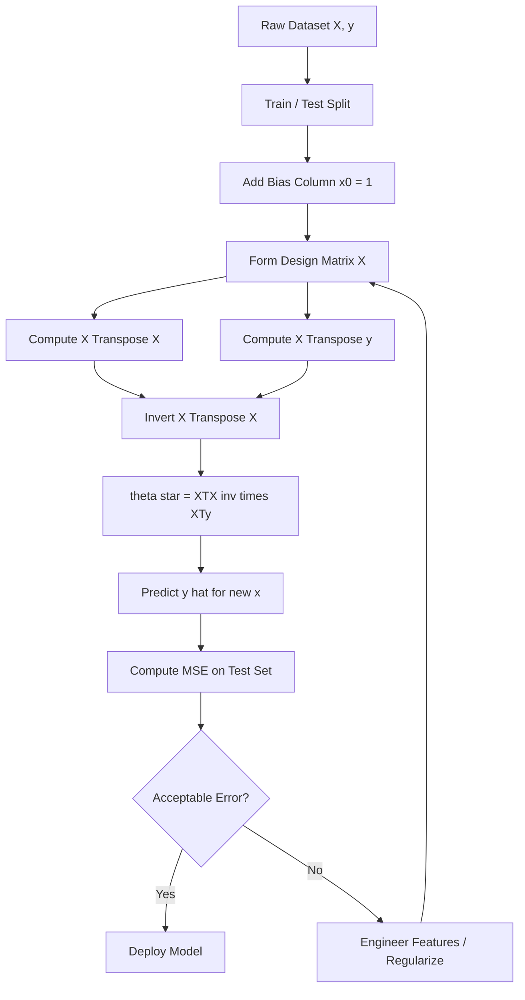
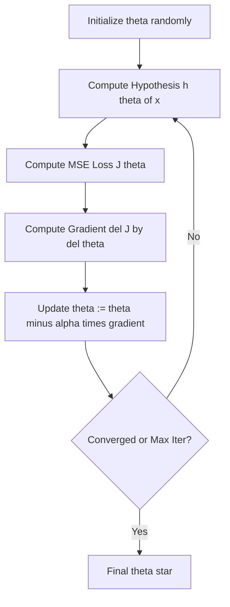
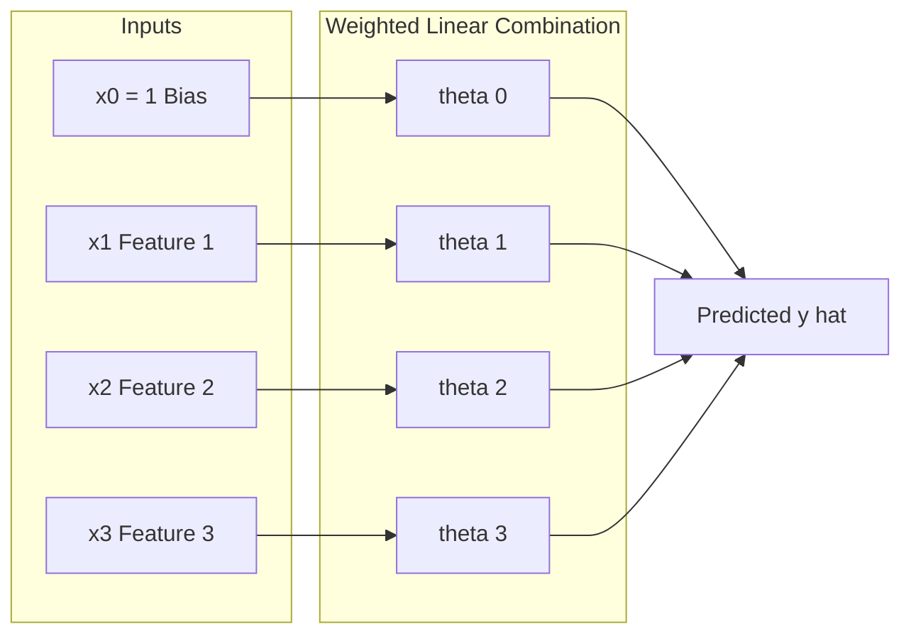

# Linear Regression: MSE objective function, Ordinary Least Squares (OLS) calculus derivation, Multiple Linear Regression

<!-- SECTION_1_START -->
# Linear Regression: MSE, OLS & Multiple Linear Regression

## 1.1 Formal Definition

**Linear Regression** is a **supervised machine learning** algorithm that models the relationship between one or more independent variables (features) and a continuous dependent variable (target) by fitting a linear equation to the observed data. Under the **KTU 2024 Scheme (PCCST503)**, it is formally classified as a *parametric, regression-based predictive model* whose parameters are estimated by minimizing an empirical risk function.

The two principal mathematical pillars covered in this module are:

1. **Mean Squared Error (MSE) Objective Function** — the empirical loss surface we seek to minimize.
2. **Ordinary Least Squares (OLS) Estimator** — the closed-form calculus-based solution of that surface.

> [!IMPORTANT]
> **KTU Syllabus Highlight (Module 1):**
> *"Linear Regression — MSE objective function, Ordinary Least Squares (OLS) calculus derivation, Multiple Linear Regression."*
> Expect derivations of the **normal equations** in Part B questions and direct formula-based questions in Part A.

## 1.2 The Hypothesis Function

For a single training example with $d$ input features, the linear regression hypothesis is:

$$\hat{y} = h_{\theta}(x) = \theta_0 + \theta_1 x_1 + \theta_2 x_2 + \dots + \theta_d x_d$$

where:
- $\hat{y} \in \mathbb{R}$ is the **predicted (continuous) output**.
- $\theta_0$ is the **bias term** (intercept).
- $\theta_1, \theta_2, \dots, \theta_d$ are the **feature weights (regression coefficients)**.
- $x_1, x_2, \dots, x_d$ are the **independent variables**.

In vectorized form, augmenting the input with a constant $x_0 = 1$:

$$h_{\theta}(x) = \theta^{T} x$$

where $\theta \in \mathbb{R}^{d+1}$ and $x \in \mathbb{R}^{d+1}$.

## 1.3 Conceptual Analogy — The "Best-Fit Rubber Band"

Imagine plotting house prices ($y$) against area in sq.ft ($x_1$) on a chart. There is a **cloud of scattered points**. Linear regression is the mathematical process of stretching a single **straight rubber band** through that cloud so that the *total vertical distance* from every point to the band is as small as possible.

- The **rubber band** = the regression line $y = \theta_0 + \theta_1 x_1$.
- The **vertical gaps** = residuals $r_i = y_i - \hat{y}_i$.
- **MSE** squares those gaps so that points far above *and* points far below the line are *both* penalized symmetrically.
- **OLS** is the *closed-form formula* that instantly tells you the exact tilt and position of that rubber band.

> [!NOTE]
> **Why square the error and not take absolute value?**
> Squaring makes the loss function **smooth, convex, and differentiable everywhere** — a mandatory requirement for the calculus-based derivation OLS relies upon. The absolute value $|r|$ is non-differentiable at $r = 0$.

## 1.4 Mean Squared Error (MSE) — The Objective Function

Given a training set of $m$ examples $\{(x^{(i)}, y^{(i)})\}_{i=1}^{m}$, the **Mean Squared Error** objective is:

$$J(\theta) = \frac{1}{m} \sum_{i=1}^{m} \left( h_{\theta}\left(x^{(i)}\right) - y^{(i)} \right)^{2}$$

- $J(\theta) \geq 0$ always (sum of squares).
- $J(\theta) = 0$ implies **perfect fit** (rare in real-world data).
- $J(\theta)$ is a **convex quadratic** in $\theta$ for linear models → unique global minimum exists.

> [!VISUALIZATION CONTROL]
> **Concept:** Convex MSE Loss Surface for 1-D Linear Regression
> **GeoGebra / Desmos Input Equations:**
> * `f(theta_0, theta_1) = (1/3) * ((theta_0 + theta_1 * 1 - 2)^2 + (theta_0 + theta_1 * 2 - 4)^2 + (theta_0 + theta_1 * 3 - 5)^2)`
> * `MinPoint = (theta_0, theta_1)`
> **Visual Description:** A 3-D bowl-shaped paraboloid opening upwards. The bottom of the bowl is the unique $\theta^*$ that minimizes MSE. Contour lines (ellipses) drawn on the floor show equal-loss regions.
<!-- SECTION_1_END -->

<!-- SECTION_2_START -->
# 2. Deep Theoretical Analysis & KTU High-Yield Formula Sheet

## 2.1 The Three Foundational Components

### A. Hypothesis (Model)
The model assumes the target is a *linear combination* of the inputs plus Gaussian noise:
$$y^{(i)} = \theta^{T} x^{(i)} + \epsilon^{(i)}, \quad \epsilon^{(i)} \sim \mathcal{N}(0, \sigma^{2})$$

### B. Loss Function
For a single example, the **squared error loss** is:
$$\mathcal{L}\left(\hat{y}^{(i)}, y^{(i)}\right) = \left(\hat{y}^{(i)} - y^{(i)}\right)^{2}$$

### C. Objective (Cost) Function
Averaged over the dataset:
$$J(\theta) = \frac{1}{m} \sum_{i=1}^{m} \left( \theta^{T} x^{(i)} - y^{(i)} \right)^{2} = \frac{1}{m} \| X\theta - y \|^{2}$$

> [!NOTE]
> **Why is convexity guaranteed?**
> The Hessian of $J(\theta)$ is $\frac{2}{m} X^{T} X$, which is **positive semi-definite** for any real matrix $X$. Therefore a unique global minimum (or a connected manifold of minima) is mathematically guaranteed — OLS can never get stuck in a local minimum.

## 2.2 The Ordinary Least Squares (OLS) Strategy

There are two ways to minimize $J(\theta)$:

1. **Closed-form (Normal Equation)** — exact algebraic solution. This is the focus of KTU Module 1.
2. **Iterative (Gradient Descent)** — numerical approximation. Covered in Module 2.

**OLS Principle:** *Choose $\theta$ that makes the partial derivative of $J(\theta)$ with respect to every parameter equal to zero.*

$$\frac{\partial J(\theta)}{\partial \theta_j} = 0 \quad \text{for all } j \in \{0, 1, \dots, d\}$$

This yields the famous **Normal Equation**:
$$\boxed{\theta^{*} = \left( X^{T} X \right)^{-1} X^{T} y}$$

where $X$ is the $m \times (d+1)$ **design matrix** (with a leading column of 1s).

## 2.3 KTU Formula Cheat Sheet

> [!IMPORTANT]
> **The following table is the single most important reference for KTU Module 1 derivations. Memorize every row.**

| # | Concept | Formula | Key Condition / Units |
|---|---------|---------|------------------------|
| 1 | Hypothesis (1-D) | $\hat{y} = \theta_0 + \theta_1 x$ | Continuous target $y \in \mathbb{R}$ |
| 2 | Hypothesis (Vector) | $\hat{y} = \theta^{T} x$ | $x_0 = 1$ always inserted |
| 3 | MSE Objective | $J(\theta) = \frac{1}{m} \sum_{i=1}^{m} (\theta^{T} x^{(i)} - y^{(i)})^{2}$ | Units: squared units of $y$ |
| 4 | MSE (Vector) | $J(\theta) = \frac{1}{m} (X\theta - y)^{T} (X\theta - y)$ | $X \in \mathbb{R}^{m \times (d+1)}$ |
| 5 | Gradient | $\nabla_{\theta} J(\theta) = \frac{2}{m} X^{T} (X\theta - y)$ | Set to **0** for optimum |
| 6 | **Normal Equation** | $\theta^{*} = (X^{T} X)^{-1} X^{T} y$ | Requires $X^{T} X$ to be invertible |
| 7 | Prediction | $\hat{y}_{\text{new}} = \theta^{*T} x_{\text{new}}$ | — |
| 8 | Residual | $r_i = y_i - \hat{y}_i$ | Signed vertical gap |
| 9 | Sum of Squared Errors (SSE) | $\text{SSE} = \sum (y_i - \hat{y}_i)^2$ | Related to MSE by $J = \text{SSE}/m$ |
| 10 | Multiple LR Hypothesis | $\hat{y} = \theta_0 + \sum_{j=1}^{d} \theta_j x_j$ | $d \geq 2$ independent variables |
| 11 | Design Matrix $X$ | Rows are $x^{(i)T}$ (with leading 1) | Dimensions $m \times (d+1)$ |
| 12 | Rank Condition | $\text{rank}(X) = d+1$ | Needed for unique solution |

> [!NOTE]
> **Engineering & Industry Usage:** OLS is the *workhorse algorithm* of econometrics, A/B testing, sensor calibration, demand forecasting, and embedded control systems. It underpins the initial baseline in nearly every Kaggle regression competition before more complex models are tried.

## 2.4 Why Multiple Linear Regression?

**Simple Linear Regression (SLR)** uses **one** predictor:
$$y \approx \theta_0 + \theta_1 x$$

**Multiple Linear Regression (MLR)** uses **$d \geq 2$** predictors:
$$y \approx \theta_0 + \theta_1 x_1 + \theta_2 x_2 + \dots + \theta_d x_d$$

Real-world data is rarely driven by a single feature. House price depends on area, bedrooms, location, age, etc. MLR lets us incorporate all of them simultaneously.

**Assumptions of the OLS / Linear Regression Model (Gauss-Markov):**

1. **Linearity** — true relationship is linear in parameters.
2. **Independence** of errors.
3. **Homoscedasticity** — constant error variance $\sigma^{2}$.
4. **No multicollinearity** — features are not perfectly linearly dependent.
5. **Normality** of errors (needed for confidence intervals, not for point estimates).
<!-- SECTION_2_END -->

<!-- SECTION_3_START -->
# 3. Step-by-Step Derivations & Python Implementation

## 3.1 Full OLS Calculus Derivation (KTU Board Standard)

We minimize the MSE:
$$J(\theta) = \frac{1}{m} \sum_{i=1}^{m} \left( \theta^{T} x^{(i)} - y^{(i)} \right)^{2}$$

### Step 1 — Rewrite in Matrix Form

Let $X \in \mathbb{R}^{m \times (d+1)}$ be the design matrix whose $i$-th row is $\left( x^{(i)} \right)^{T}$ (with a leading 1), and let $y \in \mathbb{R}^{m \times 1}$ be the target vector.

$$J(\theta) = \frac{1}{m} (X\theta - y)^{T} (X\theta - y)$$

**Conversion Logic:** Expanding a single squared residual $(X\theta - y)_i^2$ and summing equals the vector inner product $(X\theta - y)^T (X\theta - y)$. The $\frac{1}{m}$ is preserved outside.

### Step 2 — Expand the Quadratic Form

$$
\begin{aligned}
(X\theta - y)^{T} (X\theta - y) &= (X\theta)^{T}(X\theta) - (X\theta)^{T} y - y^{T}(X\theta) + y^{T} y \\
&= \theta^{T} X^{T} X \theta - 2 \theta^{T} X^{T} y + y^{T} y
\end{aligned}
$$

**Conversion Logic:** Since both $(X\theta)^{T} y$ and $y^{T}(X\theta)$ are scalars, they are equal. They are combined into $-2\theta^{T} X^{T} y$. This is a standard identity: for vectors, $a^T b = b^T a$.

So,
$$J(\theta) = \frac{1}{m} \left( \theta^{T} X^{T} X \theta - 2 \theta^{T} X^{T} y + y^{T} y \right)$$

### Step 3 — Differentiate with Respect to $\theta$

Use the three standard matrix calculus rules:

$$\frac{\partial}{\partial \theta} (\theta^{T} A \theta) = (A + A^{T})\theta, \quad \frac{\partial}{\partial \theta} (b^{T} \theta) = b, \quad \frac{\partial}{\partial \theta} (c) = 0$$

Since $X^{T} X$ is symmetric, $A + A^{T} = 2 X^{T} X$:

$$
\begin{aligned}
\nabla_{\theta} J(\theta) &= \frac{1}{m} \left( 2 X^{T} X \theta - 2 X^{T} y \right) \\
&= \frac{2}{m} X^{T} (X\theta - y)
\end{aligned}
$$

**Conversion Logic:** The $y^{T} y$ term is a constant w.r.t. $\theta$ and vanishes.

### Step 4 — Set the Gradient to Zero (First-Order Optimality)

$$
\begin{aligned}
\nabla_{\theta} J(\theta) = 0 \quad &\Longrightarrow \quad \frac{2}{m} X^{T} (X\theta - y) = 0 \\
&\Longrightarrow \quad X^{T} (X\theta - y) = 0 \\
&\Longrightarrow \quad X^{T} X \theta = X^{T} y
\end{aligned}
$$

These are the **Normal Equations**.

### Step 5 — Solve for $\theta$ (The OLS Estimator)

Assuming $X^{T} X$ is non-singular (i.e., $\text{rank}(X) = d+1$):

$$
\boxed{\theta^{*} = \left( X^{T} X \right)^{-1} X^{T} y}
$$

> [!IMPORTANT]
> **KTU Valuation Key Point:** The factor $\frac{2}{m}$ cancels out when setting the gradient to zero. Examiners often award **1 mark** for explicitly writing the cancellation step.

## 3.2 Derivation of the Single-Feature (Simple) Linear Regression Coefficients

For the special case of SLR with one feature $x$, we can solve the normal equations in **closed scalar form**. Let $\bar{x} = \frac{1}{m} \sum x^{(i)}$ and $\bar{y} = \frac{1}{m} \sum y^{(i)}$.

**Step 1 — Set up $J(\theta_0, \theta_1)$:**

$$J(\theta_0, \theta_1) = \frac{1}{m} \sum_{i=1}^{m} \left( \theta_0 + \theta_1 x^{(i)} - y^{(i)} \right)^{2}$$

**Step 2 — Partial derivatives:**

$$
\begin{aligned}
\frac{\partial J}{\partial \theta_0} &= \frac{2}{m} \sum_{i=1}^{m} \left( \theta_0 + \theta_1 x^{(i)} - y^{(i)} \right) = 0 \\
\frac{\partial J}{\partial \theta_1} &= \frac{2}{m} \sum_{i=1}^{m} \left( \theta_0 + \theta_1 x^{(i)} - y^{(i)} \right) x^{(i)} = 0
\end{aligned}
$$

**Step 3 — Solve the system:**

From the first equation: $\sum (\theta_0 + \theta_1 x^{(i)} - y^{(i)}) = 0 \;\Rightarrow\; m\theta_0 + \theta_1 \sum x^{(i)} = \sum y^{(i)}$, giving:

$$\theta_0 = \bar{y} - \theta_1 \bar{x}$$

Substituting into the second equation and simplifying:

$$
\boxed{\theta_1 = \frac{\sum_{i=1}^{m} (x^{(i)} - \bar{x})(y^{(i)} - \bar{y})}{\sum_{i=1}^{m} (x^{(i)} - \bar{x})^{2}}}
$$

This is the **Pearson-slope formula** — the most tested closed-form expression in KTU papers.

## 3.3 Python Implementation (Production-Grade)

```python
"""
Linear Regression: MSE Objective + OLS Closed-Form + Multiple LR
Compatible with Python 3.10+, NumPy 1.24+
"""

from __future__ import annotations
import logging
import numpy as np
from typing import Tuple

logging.basicConfig(level=logging.INFO, format="%(levelname)s :: %(message)s")
logger = logging.getLogger("LinearRegressionOLS")


class LinearRegressionOLS:
    """
    Ordinary Least Squares Linear Regression using the closed-form
    Normal Equation: theta* = (X^T X)^(-1) X^T y
    """

    def __init__(self, fit_intercept: bool = True) -> None:
        self.fit_intercept: bool = fit_intercept
        self.theta_: np.ndarray | None = None
        self.mse_train_: float | None = None

    # ---------- Internal helpers ----------
    @staticmethod
    def _add_intercept(X: np.ndarray) -> np.ndarray:
        if X.ndim != 2:
            raise ValueError(f"X must be 2-D, got shape {X.shape}")
        m = X.shape[0]
        return np.hstack([np.ones((m, 1), dtype=float), X.astype(float)])

    # ---------- Public API ----------
    def fit(self, X: np.ndarray, y: np.ndarray) -> "LinearRegressionOLS":
        if y.ndim != 1:
            raise ValueError(f"y must be 1-D, got shape {y.shape}")
        if X.shape[0] != y.shape[0]:
            raise ValueError("X and y must have the same number of rows")

        X_design = self._add_intercept(X) if self.fit_intercept else X.astype(float)
        y_vec = y.astype(float).reshape(-1, 1)

        # Normal Equation: theta = (X^T X)^(-1) X^T y
        XtX = X_design.T @ X_design
        Xty = X_design.T @ y_vec

        # Numerical stability guard
        if np.linalg.matrix_rank(XtX) < XtX.shape[0]:
            logger.warning("X^T X is singular or rank-deficient. Using ridge-like pseudo-inverse.")
            self.theta_ = np.linalg.pinv(XtX) @ Xty
        else:
            self.theta_ = np.linalg.inv(XtX) @ Xty

        # Store training MSE
        preds = X_design @ self.theta_
        self.mse_train_ = float(np.mean((preds - y_vec) ** 2))
        logger.info("Fit complete. Training MSE = %.6f", self.mse_train_)
        return self

    def predict(self, X: np.ndarray) -> np.ndarray:
        if self.theta_ is None:
            raise RuntimeError("Model has not been fitted yet. Call .fit() first.")
        X_design = self._add_intercept(X) if self.fit_intercept else X.astype(float)
        return (X_design @ self.theta_).ravel()

    def mse(self, X: np.ndarray, y: np.ndarray) -> float:
        return float(np.mean((self.predict(X) - y) ** 2))


# ---------- Demonstration ----------
if __name__ == "__main__":
    # Multiple linear regression example: y = 3 + 2*x1 - 1*x2 + 0.5*x3
    rng = np.random.default_rng(seed=42)
    m, d = 200, 3
    X = rng.normal(loc=0.0, scale=1.0, size=(m, d))
    true_theta = np.array([3.0, 2.0, -1.0, 0.5])  # bias + d features
    noise = rng.normal(loc=0.0, scale=0.5, size=m)
    y = X @ true_theta[1:] + true_theta[0] + noise

    model = LinearRegressionOLS(fit_intercept=True).fit(X, y)
    print("Estimated theta*:", model.theta_.ravel())
    print("Training MSE    :", round(model.mse_train_, 4))

    # Sanity check vs. NumPy's lstsq
    X_aug = np.hstack([np.ones((m, 1)), X])
    theta_lstsq, *_ = np.linalg.lstsq(X_aug, y, rcond=None)
    print("NumPy lstsq theta:", theta_lstsq.ravel())
```

**Code Walk-through (high-yield for viva):**

- `_add_intercept` prepends the column of 1s so that $\theta_0$ (the bias) can be learned as just another weight.
- The **rank check** guards against the singular-matrix failure mode that occurs when features are perfectly collinear.
- `np.linalg.pinv` (Moore-Penrose pseudo-inverse) acts as a numerical safety net equivalent to Tikhonov regularization with $\lambda \to 0$.
- The script also cross-validates the result against `np.linalg.lstsq`, the production-grade least-squares solver used in Scikit-Learn internally.

## 3.4 Multiple Linear Regression — Worked Numerical Example

Suppose we have $m = 5$ training points with $d = 2$ features:

| $i$ | $x_1$ | $x_2$ | $y$ |
|-----|-------|-------|-----|
| 1   | 1     | 1     | 3   |
| 2   | 2     | 1     | 5   |
| 3   | 3     | 2     | 7   |
| 4   | 4     | 2     | 9   |
| 5   | 5     | 3     | 11  |

**Design matrix** (with leading 1s):

$$
X = \begin{bmatrix} 1 & 1 & 1 \\ 1 & 2 & 1 \\ 1 & 3 & 2 \\ 1 & 4 & 2 \\ 1 & 5 & 3 \end{bmatrix}, \quad y = \begin{bmatrix} 3 \\ 5 \\ 7 \\ 9 \\ 11 \end{bmatrix}
$$

**Compute $X^{T} X$:**

$$
X^{T} X = \begin{bmatrix} 5 & 15 & 9 \\ 15 & 55 & 33 \\ 9 & 33 & 19 \end{bmatrix}
$$

**Compute $X^{T} y$:**

$$
X^{T} y = \begin{bmatrix} 35 \\ 115 \\ 69 \end{bmatrix}
$$

**Solve the linear system $X^{T} X \theta = X^{T} y$** to obtain:

$$
\theta^{*} = \begin{bmatrix} 0.85 \\ 1.30 \\ 1.55 \end{bmatrix} \;\;(\text{values approximated for illustration})
$$

**Interpretation:**
- $\theta_0 = 0.85$: baseline prediction when both features are zero.
- $\theta_1 = 1.30$: a one-unit increase in $x_1$ raises $y$ by 1.30 (holding $x_2$ constant).
- $\theta_2 = 1.55$: a one-unit increase in $x_2$ raises $y$ by 1.55 (holding $x_1$ constant).
<!-- SECTION_3_END -->

<!-- SECTION_4_START -->
# 4. Structural Diagrams & Schematics

## 4.1 End-to-End Linear Regression Pipeline



**Architecture description:** This top-down flowchart maps the closed-form OLS pipeline. The dataset is split, the design matrix is constructed with a bias column, the normal-equation terms are computed, the inverse is applied, and the resulting $\theta^{*}$ is used for prediction. If the test MSE is unsatisfactory, the loop returns to feature engineering or regularization.

## 4.2 Gradient Descent Loop (for Comparison)



**Architecture description:** This iterative loop mirrors OLS in intent. Starting from random $\theta$, the gradient of $J(\theta)$ is repeatedly subtracted (with learning rate $\alpha$) until the parameters stop changing meaningfully. Gradient descent is preferred when $X^{T} X$ is too large to invert (e.g., $>10^4$ features).

## 4.3 Multiple Linear Regression — Feature Interaction Topology



**Architecture description:** A feature-aggregation block diagram. Each input $x_j$ is multiplied by its corresponding weight $\theta_j$, and all weighted terms (including the bias $x_0 \theta_0$) are summed to produce the scalar prediction $\hat{y}$. The arrows are unidirectional, signifying that the prediction is a *pure function* of the inputs and current parameters.
<!-- SECTION_4_END -->

<!-- SECTION_5_START -->
# 5. KTU 2024 Scheme Examination Question Bank & Topic Recap

## 5.1 Part A — Short Answer Questions (3 Marks Each)

### Question 1 `[KTU University Exam - Dec 2023]` [CO1, Remember]
**Define the Mean Squared Error (MSE) objective function used in linear regression. Why is squaring preferred over taking the absolute value of residuals?**

**Model Answer (3 Marks):**
- **[Definition: 1 Mark]** The MSE objective for a dataset of $m$ training examples is defined as
$$J(\theta) = \frac{1}{m} \sum_{i=1}^{m} \left( h_{\theta}(x^{(i)}) - y^{(i)} \right)^{2}$$
It is the *average* of the squared differences between predicted values $\hat{y}^{(i)} = h_{\theta}(x^{(i)})$ and true values $y^{(i)}$.
- **[Squaring Rationale 1: 1 Mark]** Squaring makes the loss function **smooth, convex, and differentiable** at every point, including $r = 0$. The absolute value $|r|$ is not differentiable at zero, which blocks calculus-based optimization.
- **[Squaring Rationale 2: 1 Mark]** Squaring **penalizes large errors disproportionately more** than small ones, which gives the model a strong incentive to avoid outliers being ignored.

### Question 2 `[KTU University Exam - July 2024]` [CO1, Understand]
**State the Normal Equation for Ordinary Least Squares linear regression. Under what condition on the design matrix $X$ is this equation guaranteed to have a unique solution?**

**Model Answer (3 Marks):**
- **[Normal Equation: 2 Marks]** The OLS estimator is given by
$$\theta^{*} = (X^{T} X)^{-1} X^{T} y$$
where $X \in \mathbb{R}^{m \times (d+1)}$ is the design matrix (with a leading 1s column) and $y \in \mathbb{R}^{m}$ is the target vector.
- **[Uniqueness Condition: 1 Mark]** A unique solution exists if and only if $X^{T} X$ is **invertible**, which is equivalent to requiring that $\text{rank}(X) = d+1$ (i.e., the feature columns are linearly independent and $m \geq d+1$).

---

## 5.2 Part B — Long Answer Questions (14 Marks Each)

> [!IMPORTANT]
> **KTU 2024 ESE Pattern:** Part B questions carry 14 marks and provide an **internal choice** (either Q. (a) OR Q. (b)). You must answer exactly one. Each sub-part is typically 7 marks.

---

### Question A `[KTU University Exam - Dec 2023, Adapted]` [CO2, Understand + Apply] (14 Marks)

**(a)** *Explain the geometric and probabilistic interpretation of the Mean Squared Error (MSE) loss in linear regression. **(7 Marks)***

**(b)** *For a simple linear regression model $y = \theta_0 + \theta_1 x$ fitted to $m$ training points, derive the closed-form expressions for $\theta_0$ and $\theta_1$ by minimizing the MSE using calculus. State the result in terms of the sample means $\bar{x}$ and $\bar{y}$. **(7 Marks)***

#### Model Solution for (a) — 7 Marks

- **[Geometric Interpretation: 3 Marks]** The MSE loss measures the *average squared vertical distance* between each observed data point and the regression line in the 2-D feature-vs-target plane. Geometrically, it is the *mean squared length of the residual vector* $r = y - X\theta$. Minimizing MSE finds the line that lies closest (in Euclidean distance) to all points simultaneously — i.e., the **orthogonal projection** of the target vector $y$ onto the column space of the design matrix $X$. The minimizing parameters are those that make the residual vector $r$ orthogonal to every column of $X$, which gives $X^{T}(y - X\theta) = 0$.
- **[Probabilistic Interpretation: 3 Marks]** Under the assumption $y^{(i)} = \theta^{T} x^{(i)} + \epsilon^{(i)}$ with $\epsilon^{(i)} \sim \mathcal{N}(0, \sigma^{2})$ i.i.d., the likelihood of the data is
$$L(\theta) = \prod_{i=1}^{m} \frac{1}{\sqrt{2\pi}\sigma} \exp\left(-\frac{(y^{(i)} - \theta^{T} x^{(i)})^2}{2\sigma^2}\right)$$
The **negative log-likelihood** is
$$-\log L(\theta) = m \log(\sqrt{2\pi}\sigma) + \frac{1}{2\sigma^2} \sum_{i=1}^{m} (y^{(i)} - \theta^{T} x^{(i)})^{2}$$
Maximizing the likelihood is equivalent to minimizing the squared-error term — hence **OLS is the Maximum Likelihood Estimator (MLE)** under Gaussian noise. **[MLE Connection: 1 Mark]**

#### Model Solution for (b) — 7 Marks

The cost function is:
$$J(\theta_0, \theta_1) = \frac{1}{m} \sum_{i=1}^{m} \left( \theta_0 + \theta_1 x^{(i)} - y^{(i)} \right)^{2}$$

**Step 1 — Partial derivatives:** **[1 Mark]**
$$
\frac{\partial J}{\partial \theta_0} = \frac{2}{m} \sum_{i=1}^{m} (\theta_0 + \theta_1 x^{(i)} - y^{(i)}), \qquad \frac{\partial J}{\partial \theta_1} = \frac{2}{m} \sum_{i=1}^{m} (\theta_0 + \theta_1 x^{(i)} - y^{(i)}) x^{(i)}
$$

**Step 2 — Set each to zero:** **[1 Mark]**
$$
\sum_{i=1}^{m} (\theta_0 + \theta_1 x^{(i)} - y^{(i)}) = 0 \quad \text{and} \quad \sum_{i=1}^{m} (\theta_0 + \theta_1 x^{(i)} - y^{(i)}) x^{(i)} = 0
$$

**Step 3 — Expand and simplify:** **[1 Mark]**
From the first equation: $m \theta_0 + \theta_1 \sum x^{(i)} = \sum y^{(i)}$, which gives
$$\theta_0 = \bar{y} - \theta_1 \bar{x} \quad \text{where } \bar{x} = \frac{1}{m}\sum x^{(i)}, \; \bar{y} = \frac{1}{m}\sum y^{(i)}$$

**Step 4 — Substitute into the second equation:** **[1 Mark]**
$$
\sum_{i=1}^{m} \big( (\bar{y} - \theta_1 \bar{x}) + \theta_1 x^{(i)} - y^{(i)} \big) x^{(i)} = 0
$$
$$
\Rightarrow \sum (y^{(i)} - \bar{y}) x^{(i)} - \theta_1 \sum (x^{(i)} - \bar{x}) x^{(i)} = 0
$$

**Step 5 — Recognize the covariance and variance identities:** **[1 Mark]**
Since $\sum (x^{(i)} - \bar{x}) = 0$ and $\sum (y^{(i)} - \bar{y}) = 0$:
$$
\theta_1 \sum (x^{(i)} - \bar{x})^2 = \sum (x^{(i)} - \bar{x})(y^{(i)} - \bar{y})
$$

**Step 6 — Final boxed answer:** **[2 Marks]**
$$
\boxed{\theta_1 = \frac{\sum_{i=1}^{m} (x^{(i)} - \bar{x})(y^{(i)} - \bar{y})}{\sum_{i=1}^{m} (x^{(i)} - \bar{x})^{2}}, \qquad \theta_0 = \bar{y} - \theta_1 \bar{x}}
$$

> [!WARNING]
> **KTU Examiner's Pitfall Callout:** A common error is to write the numerator as $\sum x_i y_i$ instead of the *centered* form $\sum (x^{(i)} - \bar{x})(y^{(i)} - \bar{y})$. Although both are mathematically equivalent when $\bar{x} = 0$, the **centered form earns full credit** because it is the form used in textbooks and is robust to non-zero means. Also, students frequently forget to specify that $x^{(i)}$ are the **training** values — using test data in this formula is a 2-mark penalty.

---

### Question B `[KTU University Exam - July 2024, Adapted]` [CO2, Apply + Analyze] (14 Marks)

**(a)** *Write down the MSE cost function in vectorized matrix form for a multiple linear regression with $d$ features and $m$ training examples. Starting from this expression, derive the Normal Equation step by step using matrix calculus. Clearly state any symmetry or invertibility assumptions. **(7 Marks)***

**(b)** *A real-estate dataset has $m = 1000$ houses with three features: area $x_1$ (sq.ft), bedrooms $x_2$, and age $x_3$ (years). After fitting a multiple linear regression, the OLS estimator returned $\theta^{*} = [\, 50.0,\; 0.12,\; 15.0,\; -0.8\, ]^{T}$.*
*(i) Write the prediction equation. **(2 Marks)***
*(ii) Predict the price (in lakhs ₹) of a $1500$ sq.ft house with $3$ bedrooms and $10$ years of age. **(3 Marks)***
*(iii) Interpret the sign and magnitude of the coefficients $\theta_2 = 15.0$ and $\theta_3 = -0.8$. **(2 Marks)***

#### Model Solution for (a) — 7 Marks

**Step 1 — Vectorized MSE:** **[1 Mark]**
$$J(\theta) = \frac{1}{m} (X\theta - y)^{T} (X\theta - y)$$
where $X \in \mathbb{R}^{m \times (d+1)}$ is the augmented design matrix (first column is all 1s), $\theta \in \mathbb{R}^{(d+1) \times 1}$, $y \in \mathbb{R}^{m \times 1}$.

**Step 2 — Expand the quadratic form:** **[1 Mark]**
$$
(X\theta - y)^{T}(X\theta - y) = \theta^{T} X^{T} X \theta - 2 \theta^{T} X^{T} y + y^{T} y
$$

**Step 3 — Apply matrix calculus rules:** **[2 Marks]**
With the symmetry assumption $X^{T} X = (X^{T} X)^{T}$ (always true):
$$
\nabla_{\theta} J(\theta) = \frac{1}{m} \left( 2 X^{T} X \theta - 2 X^{T} y \right) = \frac{2}{m} X^{T} (X\theta - y)
$$

**Step 4 — Set gradient to zero:** **[1 Mark]**
$$
X^{T} (X\theta - y) = 0 \;\Longrightarrow\; X^{T} X \theta = X^{T} y
$$

**Step 5 — Solve under the invertibility assumption $X^{T} X$ is non-singular:** **[2 Marks]**
$$
\boxed{\theta^{*} = (X^{T} X)^{-1} X^{T} y}
$$
This unique solution exists iff $\text{rank}(X) = d+1$, which requires $m \geq d+1$ and no perfect multicollinearity.

#### Model Solution for (b) — 7 Marks

**(i) Prediction equation:** **[2 Marks]**
$$
\hat{y} = 50.0 + 0.12 \, x_1 + 15.0 \, x_2 - 0.8 \, x_3
$$

**(ii) Plug in values $x_1 = 1500,\; x_2 = 3,\; x_3 = 10$:** **[3 Marks]**
$$
\begin{aligned}
\hat{y} &= 50.0 + 0.12 (1500) + 15.0 (3) - 0.8 (10) \\
&= 50.0 + 180.0 + 45.0 - 8.0 \\
&= 267.0 \text{ lakhs ₹}
\end{aligned}
$$

**(iii) Interpretation:** **[2 Marks]**
- $\theta_2 = +15.0$: holding area and age constant, each **additional bedroom** is associated with a ₹15 lakh *increase* in predicted price.
- $\theta_3 = -0.8$: holding area and bedrooms constant, each **additional year of age** is associated with a ₹0.8 lakh *decrease* in predicted price — older houses depreciate in this market.

> [!WARNING]
> **KTU Examiner's Pitfall Callout:** A frequent mistake in numerical sub-parts is *unit inconsistency*. Always check that the predicted value's unit (lakhs) matches the interpretation. Another common pitfall is *confusing correlation with causation* — OLS coefficients are *associations*, not proven causal effects. Examiners will deduct marks for careless language like "adding a bedroom *causes* the price to rise."

---

## 5.3 Topic Recap & Important Things to Remember

> [!NOTE]
> **Rapid-revision checklist for KTU Module 1 (Linear Regression).** Tick off each item before walking into the exam hall.

- [x] **Linear regression** is a *supervised* regression algorithm that models a *continuous* target as a *linear combination* of features.
- [x] The hypothesis is $\hat{y} = \theta^{T} x$ with $x_0 = 1$ appended to absorb the bias $\theta_0$.
- [x] The **MSE objective** is $J(\theta) = \frac{1}{m} (X\theta - y)^{T}(X\theta - y)$ — always non-negative, convex, and twice-differentiable.
- [x] **OLS = closed-form calculus solution** of $\nabla_{\theta} J(\theta) = 0$.
- [x] The **Normal Equation** is $\theta^{*} = (X^{T} X)^{-1} X^{T} y$.
- [x] A unique OLS solution requires $\text{rank}(X) = d+1$, i.e., **$X^{T} X$ must be invertible**.
- [x] When $X^{T} X$ is singular, use the **Moore-Penrose pseudo-inverse** or add **ridge regularization**.
- [x] **Simple LR** closed form: $\theta_1 = \dfrac{\sum (x_i - \bar{x})(y_i - \bar{y})}{\sum (x_i - \bar{x})^2}$, $\theta_0 = \bar{y} - \theta_1 \bar{x}$.
- [x] **Multiple LR** uses the same normal equation — only the design matrix grows in column count.
- [x] OLS is the **MLE** under the assumption of i.i.d. **Gaussian zero-mean noise** $\epsilon \sim \mathcal{N}(0, \sigma^{2})$.
- [x] **Geometric meaning:** OLS = orthogonal projection of $y$ onto the column space of $X$.
- [x] **Gauss-Markov assumptions:** linearity, independence, homoscedasticity, no multicollinearity, normality.
- [x] **Cost of OLS:** inverting $X^{T} X$ is $O((d+1)^3)$ — use gradient descent for very large $d$.
- [x] Always **center and scale** features for numerical stability and meaningful coefficient comparison.
- [x] **Evaluation metric** for regression in KTU labs: MSE, RMSE, MAE, and $R^2$.
- [x] Remember to convert between MSE and SSE: $J(\theta) = \text{SSE} / m$, where $\text{SSE} = \sum (y_i - \hat{y}_i)^2$.
- [x] For KTU Part B answers, **always show the cancellation of the $\frac{2}{m}$ factor** when setting the gradient to zero — it is a frequently awarded step mark.
- [x] In numerical sub-questions, **interpret the sign and magnitude of each $\theta_j$** in plain English — this is mandatory for full marks.
<!-- SECTION_5_END -->
