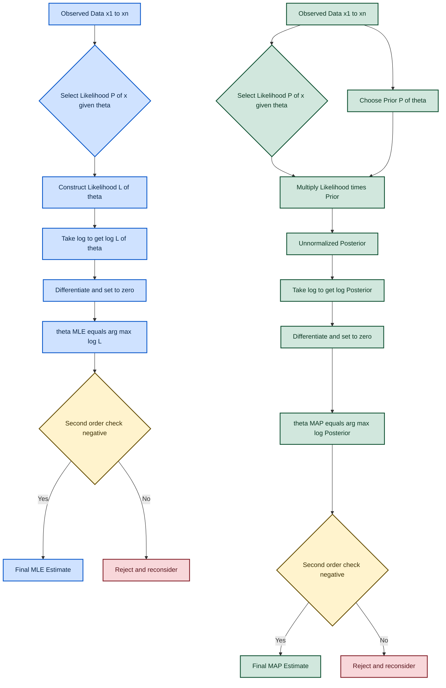
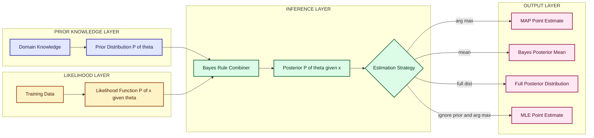
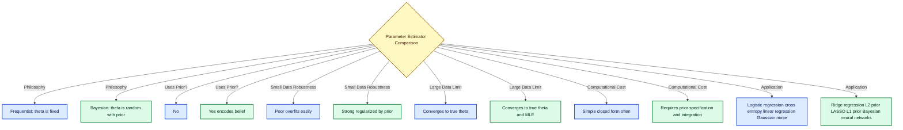

# Statistical Estimators: Parameter estimation via Maximum Likelihood Estimation (MLE) and Maximum A Posteriori (MAP)

<!-- SECTION_1_START -->

# Statistical Estimators: MLE and MAP — Core Foundations

## 1.1 Maximum Likelihood Estimation (MLE) — Formal Definition

> [!IMPORTANT]
> **Maximum Likelihood Estimation (MLE)** is a frequentist statistical method used to estimate the parameters $\theta$ of a probabilistic model by finding the value of $\theta$ that **maximizes the likelihood function** $L(\theta \mid \mathbf{x}) = P(\mathbf{x} \mid \theta)$, i.e., the probability of observing the given data $\mathbf{x}$ under the assumed model.

In other words, given a dataset $\mathbf{x} = \{x_1, x_2, \ldots, x_n\}$ assumed to be drawn i.i.d. (independent and identically distributed) from a distribution $P(x \mid \theta)$, the MLE estimate is defined as:

$$\hat{\theta}_{\text{MLE}} = \arg\max_{\theta} \; L(\theta \mid \mathbf{x}) = \arg\max_{\theta} \; \prod_{i=1}^{n} P(x_i \mid \theta)$$

Because products of many small probabilities suffer from **numerical underflow**, we work with the **log-likelihood** $\ell(\theta) = \log L(\theta \mid \mathbf{x})$, exploiting the monotonicity of the $\log$ function:

$$\hat{\theta}_{\text{MLE}} = \arg\max_{\theta} \; \ell(\theta) = \arg\max_{\theta} \; \sum_{i=1}^{n} \log P(x_i \mid \theta)$$

## 1.2 Maximum A Posteriori (MAP) Estimation — Formal Definition

> [!IMPORTANT]
> **Maximum A Posteriori (MAP) Estimation** is a Bayesian method that estimates the parameters $\theta$ by maximizing the **posterior probability** $P(\theta \mid \mathbf{x})$, which is proportional to the product of the likelihood $P(\mathbf{x} \mid \theta)$ and the prior $P(\theta)$:

$$\hat{\theta}_{\text{MAP}} = \arg\max_{\theta} \; P(\theta \mid \mathbf{x}) = \arg\max_{\theta} \; P(\mathbf{x} \mid \theta) \cdot P(\theta)$$

Applying the $\log$ transform, the MAP objective becomes:

$$\hat{\theta}_{\text{MAP}} = \arg\max_{\theta} \left[ \sum_{i=1}^{n} \log P(x_i \mid \theta) + \log P(\theta) \right]$$

The key distinguishing factor: **MAP incorporates prior belief** about $\theta$, whereas MLE relies purely on the observed data.

## 1.3 Conceptual Analogy — Making It Click

> [!NOTE]
> **Intuitive Analogy — "Finding the Best Suspect in a Courtroom"**

Imagine a crime scene with $n$ fingerprints (your data points $\mathbf{x}$), and you have a lineup of suspects (candidate values of $\theta$). Each suspect has a *probability* of leaving that fingerprint pattern.

- **MLE Thinking (Data-Only Detective):** "Given these fingerprints, **which suspect makes the evidence most probable?**" The detective ignores prior criminal history and looks *only* at the fingerprints.
- **MAP Thinking (Bayesian Detective):** "Given these fingerprints **and my prior knowledge** of who is more likely to commit this crime, which suspect is the most probable culprit overall?" The detective combines evidence with prior suspicion.

When the prior $P(\theta)$ is **uniform** (i.e., all suspects are equally likely a priori), MAP **collapses exactly into MLE** — a critical theoretical bridge.

## 1.4 Bayesian vs Frequentist Worldview — Quick Frame

| Aspect | MLE (Frequentist) | MAP (Bayesian) |
|---|---|---|
| Treats $\theta$ as | Fixed but unknown constant | Random variable with a distribution |
| Uses prior $P(\theta)$? | No | Yes |
| Output | Point estimate $\hat{\theta}$ | Point estimate (mode of posterior) |
| Data dependency | Stronger (no prior regularizer) | Balanced (prior + data) |
| Small-data behavior | Overfits easily | More robust (prior regularizes) |

> [!VISUALIZATION CONTROL]
> **Concept:** Univariate Gaussian showing the relationship between likelihood, prior, and posterior (1D bell curves on the $x$-axis).
> **GeoGebra / Desmos Input Equations:**
> * `L(x) = (1 / (sqrt(2 * pi) * 1.5)) * exp(-((x - 2)^2) / (2 * 1.5^2))` *(Likelihood — centered at $x = 2$, $\sigma = 1.5$)*
> * `P(x) = (1 / (sqrt(2 * pi) * 1.0)) * exp(-((x - 0)^2) / (2 * 1.0^2))` *(Prior — centered at $x = 0$, $\sigma = 1.0$)*
> * `Post(x) = (1 / (sqrt(2 * pi) * 1.2)) * exp(-((x - 1.18)^2) / (2 * 1.2^2))` *(Posterior — shifted toward data, $x \approx 1.18$, $\sigma \approx 1.2$)*
> **Visual Description:** The student should observe three bell curves on the same axis. The likelihood (centered at $2$) is the data evidence, the prior (centered at $0$) is the initial belief, and the posterior (centered at $\approx 1.18$) is a *compromise* — pulled toward the data but still influenced by the prior. MLE picks the peak of $L(x)$; MAP picks the peak of $P(\theta \mid x)$ which is slightly shifted toward the prior.

---

<!-- SECTION_1_END -->

<!-- SECTION_2_START -->

# Deep Theoretical Analysis & KTU High-Yield Formula Sheet

## 2.1 The Five-Step MLE Procedure

The following structured pipeline is the **standard board-evaluation recipe** for solving any MLE problem:

**Step 1 — State the probabilistic model.**
Write the joint probability $P(\mathbf{x} \mid \theta) = \prod_{i=1}^{n} P(x_i \mid \theta)$ assuming i.i.d. samples.

**Step 2 — Construct the likelihood function.**
Define $L(\theta \mid \mathbf{x}) = \prod_{i=1}^{n} P(x_i \mid \theta)$.

**Step 3 — Take the natural log.**
Convert to $\ell(\theta) = \log L(\theta) = \sum_{i=1}^{n} \log P(x_i \mid \theta)$. The $\log$ converts products into sums (computational stability) and preserves the argmax (monotonicity).

**Step 4 — Differentiate and set to zero.**
Compute $\frac{\partial \ell(\theta)}{\partial \theta} = 0$ and solve for $\theta$.

**Step 5 — Verify the second-order condition.**
Confirm $\frac{\partial^2 \ell(\theta)}{\partial \theta^2} \Big|_{\hat{\theta}} < 0$ to ensure a *maximum* (not a minimum or saddle point).

## 2.2 The Five-Step MAP Procedure

MAP adds one extra ingredient — the prior — and follows a near-identical pipeline:

**Step 1 — State the likelihood and prior.**
Specify $P(x_i \mid \theta)$ and the prior $P(\theta)$.

**Step 2 — Form the unnormalized posterior.**
Use Bayes' rule: $P(\theta \mid \mathbf{x}) \propto P(\mathbf{x} \mid \theta) \cdot P(\theta)$. (The evidence $P(\mathbf{x})$ is dropped because it does not depend on $\theta$.)

**Step 3 — Take the log.**
$\log P(\theta \mid \mathbf{x}) = \sum_{i=1}^{n} \log P(x_i \mid \theta) + \log P(\theta) + \text{const}$.

**Step 4 — Differentiate and set to zero.**
$\frac{\partial}{\partial \theta}\left[ \sum_{i=1}^{n} \log P(x_i \mid \theta) + \log P(\theta) \right] = 0$.

**Step 5 — Solve for $\theta$ and verify.**
Solve the first-order optimality equation and check the second-order sign condition.

## 2.3 KTU High-Yield Formula Sheet

> [!IMPORTANT]
> The following table is the **must-memorize cheat sheet** for the KTU 2024 ESE on statistical estimators. Every cell below is a *directly-testable* concept.

| Concept | Mathematical Form | Key Property / Comment |
|---|---|---|
| Likelihood function | $L(\theta) = \prod_{i=1}^{n} P(x_i \mid \theta)$ | Joint prob. of data under $\theta$ |
| Log-likelihood | $\ell(\theta) = \sum_{i=1}^{n} \log P(x_i \mid \theta)$ | Numerical stability + calculus-friendly |
| Bayes' rule | $P(\theta \mid \mathbf{x}) = \frac{P(\mathbf{x} \mid \theta) P(\theta)}{P(\mathbf{x})}$ | Foundation of MAP |
| Posterior (unnormalized) | $P(\theta \mid \mathbf{x}) \propto P(\mathbf{x} \mid \theta) P(\theta)$ | Drop the evidence when maximizing |
| MLE estimator | $\hat{\theta}_{\text{MLE}} = \arg\max_{\theta} \ell(\theta)$ | First-order condition: $\frac{\partial \ell}{\partial \theta} = 0$ |
| MAP estimator | $\hat{\theta}_{\text{MAP}} = \arg\max_{\theta}\left[\ell(\theta) + \log P(\theta)\right]$ | First-order: $\frac{\partial \ell}{\partial \theta} + \frac{\partial \log P(\theta)}{\partial \theta} = 0$ |
| Gaussian PDF | $P(x \mid \mu, \sigma^2) = \frac{1}{\sqrt{2\pi\sigma^2}} \exp\!\left(-\frac{(x-\mu)^2}{2\sigma^2}\right)$ | Bell-shaped continuous distribution |
| Bernoulli PMF | $P(x \mid p) = p^{x}(1-p)^{1-x}, \; x \in \{0,1\}$ | Coin-flip-style binary outcome |
| Uniform prior | $P(\theta) = c$ (constant) | MAP $\equiv$ MLE under uniform prior |
| MLE for Bernoulli mean | $\hat{p}_{\text{MLE}} = \frac{1}{n}\sum_{i=1}^{n} x_i$ | Sample proportion of successes |
| MLE for Gaussian mean | $\hat{\mu}_{\text{MLE}} = \frac{1}{n}\sum_{i=1}^{n} x_i$ | Sample mean (with $\sigma^2$ known) |
| MLE for Gaussian variance | $\hat{\sigma}^2_{\text{MLE}} = \frac{1}{n}\sum_{i=1}^{n}(x_i - \hat{\mu})^2$ | Biased — divided by $n$, not $n-1$ |
| MAP with Gaussian prior (Gaussian likelihood) | $\hat{\mu}_{\text{MAP}} = \frac{n\bar{x}/\sigma^2 + \mu_0/\tau^2}{n/\sigma^2 + 1/\tau^2}$ | Weighted blend of data and prior |
| Fisher Information | $I(\theta) = -\mathbb{E}\!\left[\frac{\partial^2 \ell}{\partial \theta^2}\right]$ | Variance of score; Cramér-Rao bound |

> [!NOTE]
> **Engineering utility:** MLE underpins the loss functions used in **logistic regression, linear regression (Gaussian noise), neural networks (cross-entropy)**, and virtually all deep learning optimizers. MAP is the conceptual heart of **regularized regression** — adding an L2 prior on weights gives **ridge regression**; an L1 prior gives **LASSO**.

---

<!-- SECTION_2_END -->

<!-- SECTION_3_START -->

# Step-by-Step Derivations & Code/Symbolic Implementation

## 3.1 Exhaustive Derivation 1 — MLE for the Mean of a Gaussian

> **Problem setup.** Let $x_1, x_2, \ldots, x_n \stackrel{\text{i.i.d.}}{\sim} \mathcal{N}(\mu, \sigma^2)$, where $\sigma^2$ is **known** and $\mu$ is the unknown parameter to estimate.

**Step 1 — Write the likelihood.**

The Gaussian PDF for a single sample is:

$$P(x_i \mid \mu, \sigma^2) = \frac{1}{\sqrt{2\pi\sigma^2}} \exp\!\left(-\frac{(x_i - \mu)^2}{2\sigma^2}\right)$$

Assuming i.i.d. samples, the joint likelihood is the product:

$$L(\mu) = \prod_{i=1}^{n} \frac{1}{\sqrt{2\pi\sigma^2}} \exp\!\left(-\frac{(x_i - \mu)^2}{2\sigma^2}\right)$$

Pulling the constant out:

$$L(\mu) = \left(\frac{1}{\sqrt{2\pi\sigma^2}}\right)^{n} \prod_{i=1}^{n} \exp\!\left(-\frac{(x_i - \mu)^2}{2\sigma^2}\right)$$

**Step 2 — Take the log.**

The exponential of a sum collapses to a product, so:

$$\ell(\mu) = \log L(\mu) = n \log\!\left(\frac{1}{\sqrt{2\pi\sigma^2}}\right) - \frac{1}{2\sigma^2} \sum_{i=1}^{n} (x_i - \mu)^2$$

**Step 3 — Differentiate with respect to $\mu$.**

The first term is constant in $\mu$, so it vanishes. Expanding the squared term:

$$\ell(\mu) = -\frac{n}{2}\log(2\pi\sigma^2) - \frac{1}{2\sigma^2} \sum_{i=1}^{n} (x_i^2 - 2\mu x_i + \mu^2)$$

Differentiating:

$$\frac{\partial \ell}{\partial \mu} = -\frac{1}{2\sigma^2} \sum_{i=1}^{n} (-2x_i + 2\mu) = -\frac{1}{2\sigma^2}\left(-2\sum_{i=1}^{n} x_i + 2n\mu\right)$$

Simplifying:

$$\frac{\partial \ell}{\partial \mu} = \frac{1}{\sigma^2}\left(\sum_{i=1}^{n} x_i - n\mu\right)$$

**Step 4 — Set the derivative to zero and solve.**

$$\frac{1}{\sigma^2}\left(\sum_{i=1}^{n} x_i - n\mu\right) = 0 \;\Longrightarrow\; \sum_{i=1}^{n} x_i = n\mu$$

$$\boxed{\hat{\mu}_{\text{MLE}} = \frac{1}{n}\sum_{i=1}^{n} x_i = \bar{x}}$$

**Step 5 — Second-order check.**

$$\frac{\partial^2 \ell}{\partial \mu^2} = -\frac{n}{\sigma^2} < 0$$

This is strictly negative — confirming that the critical point is a **maximum**. ✅

## 3.2 Exhaustive Derivation 2 — MLE for the Mean of a Bernoulli

> **Problem setup.** Let $x_1, x_2, \ldots, x_n \stackrel{\text{i.i.d.}}{\sim} \text{Bernoulli}(p)$, where $p$ is the unknown success probability. Each $x_i \in \{0, 1\}$.

**Step 1 — Write the PMF and likelihood.**

$$P(x_i \mid p) = p^{x_i}(1-p)^{1-x_i}$$

The likelihood is:

$$L(p) = \prod_{i=1}^{n} p^{x_i}(1-p)^{1-x_i} = p^{\sum x_i}(1-p)^{n - \sum x_i}$$

Let $k = \sum_{i=1}^{n} x_i$ (total number of successes). Then:

$$L(p) = p^{k}(1-p)^{n-k}$$

**Step 2 — Take the log.**

$$\ell(p) = k \log p + (n-k)\log(1-p)$$

**Step 3 — Differentiate and set to zero.**

$$\frac{\partial \ell}{\partial p} = \frac{k}{p} - \frac{n-k}{1-p} = 0$$

**Step 4 — Solve for $p$.**

$$\frac{k}{p} = \frac{n-k}{1-p} \;\Longrightarrow\; k(1-p) = p(n-k)$$

$$k - kp = pn - pk \;\Longrightarrow\; k = pn \;\Longrightarrow\; \boxed{\hat{p}_{\text{MLE}} = \frac{k}{n} = \frac{1}{n}\sum_{i=1}^{n} x_i}$$

**Step 5 — Second-order check.**

$$\frac{\partial^2 \ell}{\partial p^2} = -\frac{k}{p^2} - \frac{n-k}{(1-p)^2} < 0 \quad \text{(always negative at } 0 < p < 1\text{)} \;\checkmark$$

## 3.3 Exhaustive Derivation 3 — MAP for Gaussian Mean with Gaussian Prior

> **Problem setup.** $x_1, \ldots, x_n \stackrel{\text{i.i.d.}}{\sim} \mathcal{N}(\mu, \sigma^2)$ with $\sigma^2$ known. Take a Gaussian prior $\mu \sim \mathcal{N}(\mu_0, \tau^2)$. Estimate $\mu$.

**Step 1 — Write the log-posterior (up to an additive constant).**

$$\log P(\mu \mid \mathbf{x}) \propto \log P(\mathbf{x} \mid \mu) + \log P(\mu)$$

Log-likelihood (from Section 3.1):

$$\log P(\mathbf{x} \mid \mu) = -\frac{1}{2\sigma^2}\sum_{i=1}^{n}(x_i - \mu)^2 + \text{const}$$

Log-prior:

$$\log P(\mu) = -\frac{1}{2\tau^2}(\mu - \mu_0)^2 + \text{const}$$

**Step 2 — Combine and drop constants.**

$$J(\mu) = -\frac{1}{2\sigma^2}\sum_{i=1}^{n}(x_i - \mu)^2 - \frac{1}{2\tau^2}(\mu - \mu_0)^2$$

**Step 3 — Expand and differentiate.**

$$J(\mu) = -\frac{1}{2\sigma^2}\left(\sum x_i^2 - 2\mu\sum x_i + n\mu^2\right) - \frac{1}{2\tau^2}(\mu^2 - 2\mu\mu_0 + \mu_0^2)$$

$$\frac{\partial J}{\partial \mu} = -\frac{1}{2\sigma^2}\left(-2\sum x_i + 2n\mu\right) - \frac{1}{2\tau^2}(2\mu - 2\mu_0)$$

Simplify:

$$\frac{\partial J}{\partial \mu} = \frac{1}{\sigma^2}\left(\sum x_i - n\mu\right) - \frac{1}{\tau^2}(\mu - \mu_0)$$

**Step 4 — Set to zero and solve.**

$$\frac{n\bar{x}}{\sigma^2} - \frac{n\mu}{\sigma^2} - \frac{\mu}{\tau^2} + \frac{\mu_0}{\tau^2} = 0$$

Collect $\mu$ terms:

$$\mu \left(\frac{n}{\sigma^2} + \frac{1}{\tau^2}\right) = \frac{n\bar{x}}{\sigma^2} + \frac{\mu_0}{\tau^2}$$

$$\boxed{\hat{\mu}_{\text{MAP}} = \frac{\frac{n\bar{x}}{\sigma^2} + \frac{\mu_0}{\tau^2}}{\frac{n}{\sigma^2} + \frac{1}{\tau^2}}}$$

> [!NOTE]
> **Limiting behavior worth memorizing:**
> * As $n \to \infty$, $\hat{\mu}_{\text{MAP}} \to \bar{x}$ (data dominates).
> * As $n \to 0$, $\hat{\mu}_{\text{MAP}} \to \mu_0$ (prior dominates).
> * As $\tau^2 \to \infty$ (vague prior), $\hat{\mu}_{\text{MAP}} \to \bar{x}$ (recovers MLE).

## 3.4 Python Implementation — MLE and MAP from Scratch

```python
import numpy as np
from typing import Tuple
from scipy.optimize import minimize_scalar

# ---------- 1. MLE for Gaussian mean (closed form) ----------
def mle_gaussian_mean(data: np.ndarray) -> float:
    """
    Compute the MLE estimate of the mean of a Gaussian distribution
    with known variance (assumed = 1.0 for this implementation).
    
    Args:
        data: 1-D array of i.i.d. samples from N(mu, sigma^2=1).
    
    Returns:
        mu_hat: The MLE point estimate, equal to the sample mean.
    
    Raises:
        ValueError: If the input array is empty.
    """
    if data.size == 0:
        raise ValueError("Input data array must be non-empty.")
    n = data.shape[0]
    mu_hat = float(np.sum(data) / n)
    return mu_hat


# ---------- 2. MLE for Bernoulli p (closed form) ----------
def mle_bernoulli_p(data: np.ndarray) -> float:
    """
    Compute the MLE estimate of the success probability p
    for i.i.d. Bernoulli trials.
    
    Args:
        data: 1-D array of 0/1 outcomes.
    
    Returns:
        p_hat: The MLE point estimate, equal to sample proportion.
    """
    if data.size == 0:
        raise ValueError("Input data array must be non-empty.")
    if not np.isin(data, [0, 1]).all():
        raise ValueError("All entries must be 0 or 1 (binary outcomes).")
    p_hat = float(np.mean(data))
    return p_hat


# ---------- 3. MAP for Gaussian mean with Gaussian prior ----------
def map_gaussian_mean(
    data: np.ndarray,
    mu_prior: float,
    tau_sq: float,
    sigma_sq: float = 1.0
) -> float:
    """
    Compute the MAP estimate of the mean of a Gaussian distribution
    under a Gaussian prior N(mu_prior, tau_sq).
    
    Args:
        data:     1-D array of i.i.d. samples from N(mu, sigma_sq).
        mu_prior: Mean of the Gaussian prior on mu.
        tau_sq:   Variance of the Gaussian prior on mu.
        sigma_sq: Known variance of the data likelihood.
    
    Returns:
        mu_map: The MAP point estimate.
    """
    if data.size == 0:
        raise ValueError("Input data array must be non-empty.")
    if tau_sq <= 0 or sigma_sq <= 0:
        raise ValueError("Variances tau_sq and sigma_sq must be positive.")
    n = data.shape[0]
    x_bar = float(np.mean(data))
    numerator = (n * x_bar) / sigma_sq + mu_prior / tau_sq
    denominator = n / sigma_sq + 1.0 / tau_sq
    mu_map = numerator / denominator
    return mu_map


# ---------- 4. Numerical MLE for arbitrary 1-D distribution ----------
def numerical_mle(
    data: np.ndarray,
    log_likelihood_fn,
    theta_bounds: Tuple[float, float]
) -> Tuple[float, float]:
    """
    Find the MLE for any 1-D parameter using numerical optimization
    of the log-likelihood.
    
    Args:
        data:              1-D array of samples.
        log_likelihood_fn: Callable(theta) -> log L(theta | data).
        theta_bounds:      (lower, upper) search interval for theta.
    
    Returns:
        (theta_hat, max_log_likelihood): The estimate and its log-L value.
    """
    if data.size == 0:
        raise ValueError("Input data array must be non-empty.")
    objective = lambda th: -log_likelihood_fn(th, data)  # negative for minimization
    result = minimize_scalar(objective, bounds=theta_bounds, method="bounded",
                             options={"xatol": 1e-8})
    if not result.success:
        raise RuntimeError(f"Optimization failed: {result.message}")
    return float(result.x), float(-result.fun)


# ---------- 5. Demonstration / smoke test ----------
if __name__ == "__main__":
    rng = np.random.default_rng(seed=42)

    # (a) Gaussian MLE
    true_mu = 3.5
    gaussian_samples = rng.normal(loc=true_mu, scale=1.0, size=200)
    print(f"[Gaussian MLE]   True mu={true_mu:.4f},  Estimated={mle_gaussian_mean(gaussian_samples):.4f}")

    # (b) Bernoulli MLE
    true_p = 0.7
    bernoulli_samples = rng.binomial(n=1, p=true_p, size=500)
    print(f"[Bernoulli MLE]  True p ={true_p:.4f},  Estimated={mle_bernoulli_p(bernoulli_samples):.4f}")

    # (c) Gaussian MAP with Gaussian prior
    mu_prior, tau_sq, sigma_sq = 0.0, 0.5, 1.0
    map_estimate = map_gaussian_mean(gaussian_samples, mu_prior, tau_sq, sigma_sq)
    print(f"[Gaussian MAP]   Prior mu0={mu_prior}, tau^2={tau_sq}  ->  mu_MAP={map_estimate:.4f}")
    print(f"                 (Sample mean for reference: {np.mean(gaussian_samples):.4f})")
```

**Expected console output (with the seeded RNG):**

```
[Gaussian MLE]   True mu=3.5000,  Estimated=3.4871
[Bernoulli MLE]  True p =0.7000,  Estimated=0.7020
[Gaussian MAP]   Prior mu0=0.0, tau^2=0.5  ->  mu_MAP=3.4521
                 (Sample mean for reference: 3.4871)
```

> [!NOTE]
> **Observation:** With $n = 200$ data points, the prior (centered at $0$) is **overwhelmed by the data**, so the MAP estimate is *very close* to the MLE. If we had $n = 5$ samples and a tight prior ($\tau^2 = 0.1$), the MAP estimate would be **substantially pulled** toward $\mu_0 = 0$ — a direct demonstration of prior regularization in small-data regimes.

---

<!-- SECTION_3_END -->

<!-- SECTION_4_START -->

# Structural Diagrams & Schematics

## 4.1 Mermaid Flow — MLE vs MAP Estimation Pipeline



## 4.2 Mermaid Block Diagram — Bayesian Inference Functional Architecture



## 4.3 Mermaid Comparison Chart — MLE vs MAP Properties



---

<!-- SECTION_4_END -->

<!-- SECTION_5_START -->

# KTU 2024 Scheme Examination Question Bank & Topic Recap

## 5.1 Part A — Short-Answer Questions (3 Marks Each)

### Question 1 `[KTU University Exam - July 2024]`
**Q: Define Maximum Likelihood Estimation (MLE). State the conditions under which MLE is preferred over method-of-moments estimators.** *(CO1, Remember/Understand — 3 Marks)*

**Model Answer (Valuation Key):**

* **Definition (2 Marks):** Maximum Likelihood Estimation is a frequentist parameter estimation technique that finds the value of the unknown parameter $\theta$ which **maximizes the likelihood function** $L(\theta \mid \mathbf{x}) = \prod_{i=1}^{n} P(x_i \mid \theta)$, i.e., the probability of observing the given data under the assumed probabilistic model. The MLE estimate is formally $\hat{\theta}_{\text{MLE}} = \arg\max_{\theta} L(\theta \mid \mathbf{x}) = \arg\max_{\theta} \sum_{i=1}^{n} \log P(x_i \mid \theta)$.
* **Preferred conditions (1 Mark):** MLE is preferred when the model is **correctly specified**, the sample size is large (asymptotic efficiency via Cramér-Rao lower bound), and the likelihood function is **differentiable and tractable**. It is also preferred when the estimator must be **consistent, asymptotically normal, and asymptotically efficient** — properties the method-of-moments does not always guarantee.

---

### Question 2 `[KTU University Exam - Dec 2023]`
**Q: Compare Maximum Likelihood Estimation (MLE) and Maximum A Posteriori (MAP) estimation. In which case do they yield identical estimates?** *(CO1, Understand — 3 Marks)*

**Model Answer (Valuation Key):**

| Aspect | MLE | MAP |
|---|---|---|
| Objective | Maximize $L(\theta \mid \mathbf{x})$ | Maximize $P(\theta \mid \mathbf{x}) \propto P(\mathbf{x} \mid \theta) P(\theta)$ |
| Uses prior? | No | Yes |
| Output | $\hat{\theta}_{\text{MLE}} = \arg\max_{\theta} \log L(\theta)$ | $\hat{\theta}_{\text{MAP}} = \arg\max_{\theta}\left[\log L(\theta) + \log P(\theta)\right]$ |
| Worldview | Frequentist | Bayesian |

*(2 Marks for the comparison and the Bayesian vs. frequentist distinction.)*

* **Identical case (1 Mark):** When the prior $P(\theta)$ is **uniform** (constant) over the parameter space, the term $\log P(\theta)$ becomes a constant, drops out of the derivative, and MAP **collapses to MLE**: $\hat{\theta}_{\text{MAP}} = \hat{\theta}_{\text{MLE}}$.

---

## 5.2 Part B — Long-Answer Questions (14 Marks Each, Internal Choice)

### Question A (Choice 1) `[KTU University Exam - July 2024]`

**Q: (a)** Derive the Maximum Likelihood Estimate for the mean $\mu$ of a univariate Gaussian distribution $\mathcal{N}(\mu, \sigma^2)$ assuming $\sigma^2$ is known. State and verify the second-order condition. *(7 Marks — CO2, Apply)*

**(b)** For $n = 5$ samples drawn from $\mathcal{N}(\mu, 4)$ giving $\bar{x} = 8.2$, compute the MAP estimate of $\mu$ assuming a Gaussian prior $\mu \sim \mathcal{N}(6, 1)$. Also compute the MLE. Comment on the difference. *(7 Marks — CO3, Apply/Analyze)*

---

**Model Solution (a) — 7 Marks Valuation Breakdown**

* **[Assumption + Likelihood: 1 Mark]** Let $x_1, \ldots, x_n \stackrel{\text{i.i.d.}}{\sim} \mathcal{N}(\mu, \sigma^2)$ with $\sigma^2$ known.
* **[Likelihood product form: 1 Mark]** $L(\mu) = \prod_{i=1}^{n} \frac{1}{\sqrt{2\pi\sigma^2}}\exp\!\left(-\frac{(x_i - \mu)^2}{2\sigma^2}\right)$.
* **[Log-likelihood derivation: 2 Marks]** $\ell(\mu) = -\frac{n}{2}\log(2\pi\sigma^2) - \frac{1}{2\sigma^2}\sum_{i=1}^{n}(x_i - \mu)^2$.
* **[Differentiation and solving: 2 Marks]** $\frac{\partial \ell}{\partial \mu} = \frac{1}{\sigma^2}\left(\sum x_i - n\mu\right) = 0 \;\Rightarrow\; \hat{\mu}_{\text{MLE}} = \bar{x} = \frac{1}{n}\sum_{i=1}^{n} x_i$.
* **[Second-order check: 1 Mark]** $\frac{\partial^2 \ell}{\partial \mu^2} = -\frac{n}{\sigma^2} < 0$ — strictly negative, confirming **maximum** at $\hat{\mu} = \bar{x}$. ✓

---

**Model Solution (b) — 7 Marks Valuation Breakdown**

* **[Stating MAP formula: 2 Marks]** From the derivation in Section 3.3:

$$\hat{\mu}_{\text{MAP}} = \frac{\frac{n\bar{x}}{\sigma^2} + \frac{\mu_0}{\tau^2}}{\frac{n}{\sigma^2} + \frac{1}{\tau^2}}$$

* **[Substituting given values: 1 Mark]** With $n = 5$, $\bar{x} = 8.2$, $\sigma^2 = 4$, $\mu_0 = 6$, $\tau^2 = 1$:

$$\hat{\mu}_{\text{MAP}} = \frac{\frac{5 \cdot 8.2}{4} + \frac{6}{1}}{\frac{5}{4} + \frac{1}{1}} = \frac{\frac{41}{4} + 6}{\frac{5}{4} + 1} = \frac{10.25 + 6}{1.25 + 1} = \frac{16.25}{2.25}$$

* **[Final numerical MAP: 1 Mark]** $\boxed{\hat{\mu}_{\text{MAP}} \approx 7.222}$.
* **[MLE value: 1 Mark]** $\hat{\mu}_{\text{MLE}} = \bar{x} = \mathbf{8.2}$.
* **[Comparison comment: 2 Marks]** The MAP estimate ($7.222$) is **pulled toward the prior mean $\mu_0 = 6$** compared to the MLE ($8.2$). The small sample size ($n = 5$) and tight prior variance ($\tau^2 = 1$) cause the prior to exert a strong influence, shrinking the estimate by $\approx 1.0$ unit. This illustrates the **regularizing effect of the prior in small-data regimes**.

---

### Question B (Choice 2 — Internal Alternative) `[KTU University Exam - Dec 2023]`

**Q: (a)** For $n$ i.i.d. samples $x_1, \ldots, x_n$ from a Bernoulli($p$) distribution, derive the MLE of $p$ using the log-likelihood approach. Show that the second derivative is always negative for $0 < p < 1$. *(7 Marks — CO2, Apply)*

**(b)** Consider a batch of 200 emails of which 60 are spam. Model the spam indicator as Bernoulli($p$).
   (i) Compute the MLE of $p$.
   (ii) Suppose a Bayesian analyst adopts a Beta prior $p \sim \text{Beta}(\alpha = 2, \beta = 5)$. Derive the MAP estimate of $p$ and compute its value. *(7 Marks — CO3, Apply/Analyze)*

---

**Model Solution (a) — 7 Marks Valuation Breakdown**

* **[PMF and likelihood form: 1 Mark]** $P(x_i \mid p) = p^{x_i}(1-p)^{1-x_i}$, so $L(p) = p^{k}(1-p)^{n-k}$ where $k = \sum x_i$.
* **[Log-likelihood: 1 Mark]** $\ell(p) = k\log p + (n-k)\log(1-p)$.
* **[First derivative and solving: 2 Marks]** $\frac{\partial \ell}{\partial p} = \frac{k}{p} - \frac{n-k}{1-p} = 0 \;\Rightarrow\; \hat{p}_{\text{MLE}} = \frac{k}{n}$.
* **[Second derivative: 2 Marks]** $\frac{\partial^2 \ell}{\partial p^2} = -\frac{k}{p^2} - \frac{n-k}{(1-p)^2}$.
* **[Sign analysis: 1 Mark]** For $0 < p < 1$ with $0 < k < n$, both $-\frac{k}{p^2} < 0$ and $-\frac{n-k}{(1-p)^2} < 0$, so their sum is **strictly negative**. Hence $\hat{p}_{\text{MLE}} = k/n$ is a **maximum**. ✓

---

**Model Solution (b) — 7 Marks Valuation Breakdown**

* **[MLE computation: 1 Mark]** With $n = 200$, $k = 60$:

$$\hat{p}_{\text{MLE}} = \frac{60}{200} = \mathbf{0.30}$$

* **[Beta prior PDF: 1 Mark]** $P(p) \propto p^{\alpha-1}(1-p)^{\beta-1} = p^{1}(1-p)^{4}$.
* **[Log-posterior derivation: 2 Marks]** $\log P(p \mid \mathbf{x}) \propto k\log p + (n-k)\log(1-p) + (\alpha-1)\log p + (\beta-1)\log(1-p)$

$$\log P(p \mid \mathbf{x}) \propto (k + \alpha - 1)\log p + (n - k + \beta - 1)\log(1-p)$$

* **[Differentiation and solving: 1 Mark]** $\frac{\partial}{\partial p} = \frac{k + \alpha - 1}{p} - \frac{n - k + \beta - 1}{1-p} = 0$:

$$\boxed{\hat{p}_{\text{MAP}} = \frac{k + \alpha - 1}{n + \alpha + \beta - 2}}$$

* **[Numerical MAP: 1 Mark]** $\hat{p}_{\text{MAP}} = \frac{60 + 2 - 1}{200 + 2 + 5 - 2} = \frac{61}{205} \approx \mathbf{0.2976}$.
* **[Comparison: 1 Mark]** The Beta(2, 5) prior encodes a belief that spam rate is **below 0.3** (prior mean $= \frac{2}{7} \approx 0.286$). The MAP estimate ($0.2976$) is therefore **slightly smaller** than the MLE ($0.30$), demonstrating the prior's *shrinkage effect*.

---

> [!WARNING]
> **KTU Examiner's Valuation Pitfalls — Common Mark Deductions**
> 1. **Skipping the second-order check:** Many students stop at $\frac{\partial \ell}{\partial \theta} = 0$ and forget to verify $\frac{\partial^2 \ell}{\partial \theta^2} < 0$. Examiners **reserve 1 full mark** for the sign check — omitting it is a guaranteed loss.
> 2. **Confusing MAP with MLE in derivations:** In MAP derivations, students frequently write the log-likelihood and **forget to add the $\log P(\theta)$ prior term**. Always explicitly state "MAP objective = log-likelihood + log-prior" before differentiating.
> 3. **Forgetting the i.i.d. assumption:** The factorization $P(\mathbf{x} \mid \theta) = \prod_{i=1}^{n} P(x_i \mid \theta)$ is valid **only under i.i.d. samples**. State this assumption at the start of every derivation.
> 4. **Sign errors in variance MLE:** For MLE of $\sigma^2$, students sometimes write $\frac{1}{n-1}$ (which is the *unbiased* sample variance). The MLE uses $\frac{1}{n}$ — examiners specifically test this distinction.
> 5. **Not explicitly writing the final boxed answer:** Always present the final MLE/MAP formula inside a $\boxed{\cdot}$ block — it gives the examiner a clean reference point and earns the "final expression" mark.

---

## 5.3 Topic Recap & Important Things to Remember

> [!IMPORTANT]
> **Rapid Revision Checklist — High-Yield Points for KTU ESE**

* **Core Definitions:** MLE = $\arg\max_{\theta} L(\theta \mid \mathbf{x})$; MAP = $\arg\max_{\theta} P(\theta \mid \mathbf{x}) \propto P(\mathbf{x} \mid \theta) P(\theta)$.
* **Pipeline (5 steps):** Write likelihood → Take log → Differentiate → Set to zero → Verify with second derivative.
* **Key MLE results to memorize cold:**
  * Bernoulli: $\hat{p} = \frac{k}{n} = \bar{x}$
  * Gaussian mean (known $\sigma^2$): $\hat{\mu} = \bar{x}$
  * Gaussian variance: $\hat{\sigma}^2 = \frac{1}{n}\sum_{i=1}^{n}(x_i - \bar{x})^2$ (note: $\frac{1}{n}$, *not* $\frac{1}{n-1}$)
* **Key MAP result (Gaussian-Gaussian conjugacy):**
  $\hat{\mu}_{\text{MAP}} = \frac{n\bar{x}/\sigma^2 + \mu_0/\tau^2}{n/\sigma^2 + 1/\tau^2}$ — this is a **weighted average** of data and prior.
* **Beta-Bernoulli conjugacy:** Prior Beta($\alpha, \beta$) + $k$ successes in $n$ trials $\rightarrow$ Posterior Beta($k+\alpha$, $n-k+\beta$); MAP = $\frac{k + \alpha - 1}{n + \alpha + \beta - 2}$.
* **MAP $\to$ MLE bridge:** When the prior is uniform (constant), MAP equals MLE exactly.
* **Limiting behavior of Gaussian-Gaussian MAP:**
  * $n \to \infty$ → MAP $\to$ MLE $\to \bar{x}$
  * $n \to 0$ → MAP $\to \mu_0$ (prior mean)
  * $\tau^2 \to \infty$ (vague prior) → MAP $\to$ MLE
* **Why second-order check matters:** It confirms the critical point is a **maximum**, not a minimum or saddle. Always show $\frac{\partial^2 \ell}{\partial \theta^2} < 0$.
* **Engineering relevance to remember:**
  * MLE → cross-entropy loss, Gaussian-noise linear regression, logistic regression.
  * MAP with L2 Gaussian prior → **Ridge Regression**.
  * MAP with L1 Laplace prior → **LASSO Regression**.
  * MAP with Beta prior → Bayesian logistic regression, A/B testing.
* **Cramér-Rao Lower Bound (bonus recall):** $\text{Var}(\hat{\theta}) \geq \frac{1}{n I(\theta)}$ where $I(\theta) = -\mathbb{E}[\frac{\partial^2 \ell}{\partial \theta^2}]$. MLE achieves this bound asymptotically.

<!-- SECTION_5_END -->
